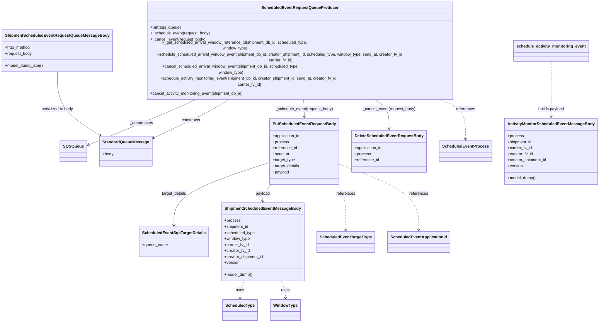

# Diagram: shipment_core/shipment_service/shipment_service/scheduled_event/scheduled_event_requests_queue_producer.py

> Auto-generated by Obscura crawlers

## Mermaid

### SVG

<svg id="container" width="2335.5703125" xmlns="http://www.w3.org/2000/svg" class="classDiagram" height="1192" viewBox="0 0 2335.5703125 1192" role="graphics-document document" aria-roledescription="class"><g><defs><marker id="container_class-aggregationStart" class="marker aggregation class" refX="18" refY="7" markerWidth="190" markerHeight="240" orient="auto"><path d="M 18,7 L9,13 L1,7 L9,1 Z"></path></marker></defs><defs><marker id="container_class-aggregationEnd" class="marker aggregation class" refX="1" refY="7" markerWidth="20" markerHeight="28" orient="auto"><path d="M 18,7 L9,13 L1,7 L9,1 Z"></path></marker></defs><defs><marker id="container_class-extensionStart" class="marker extension class" refX="18" refY="7" markerWidth="190" markerHeight="240" orient="auto"><path d="M 1,7 L18,13 V 1 Z"></path></marker></defs><defs><marker id="container_class-extensionEnd" class="marker extension class" refX="1" refY="7" markerWidth="20" markerHeight="28" orient="auto"><path d="M 1,1 V 13 L18,7 Z"></path></marker></defs><defs><marker id="container_class-compositionStart" class="marker composition class" refX="18" refY="7" markerWidth="190" markerHeight="240" orient="auto"><path d="M 18,7 L9,13 L1,7 L9,1 Z"></path></marker></defs><defs><marker id="container_class-compositionEnd" class="marker composition class" refX="1" refY="7" markerWidth="20" markerHeight="28" orient="auto"><path d="M 18,7 L9,13 L1,7 L9,1 Z"></path></marker></defs><defs><marker id="container_class-dependencyStart" class="marker dependency class" refX="6" refY="7" markerWidth="190" markerHeight="240" orient="auto"><path d="M 5,7 L9,13 L1,7 L9,1 Z"></path></marker></defs><defs><marker id="container_class-dependencyEnd" class="marker dependency class" refX="13" refY="7" markerWidth="20" markerHeight="28" orient="auto"><path d="M 18,7 L9,13 L14,7 L9,1 Z"></path></marker></defs><defs><marker id="container_class-lollipopStart" class="marker lollipop class" refX="13" refY="7" markerWidth="190" markerHeight="240" orient="auto"><circle stroke="black" fill="transparent" cx="7" cy="7" r="6"></circle></marker></defs><defs><marker id="container_class-lollipopEnd" class="marker lollipop class" refX="1" refY="7" markerWidth="190" markerHeight="240" orient="auto"><circle stroke="black" fill="transparent" cx="7" cy="7" r="6"></circle></marker></defs><g class="root"><g class="clusters"></g><g class="edgePaths"><path d="M785.936,302L769.991,308.167C754.046,314.333,722.156,326.667,647.46,357.155C572.765,387.644,455.264,436.288,396.513,460.609L337.762,484.931" id="id_ScheduledEventRequestQueueProducer_SQSQueue_1" class="edge-thickness-normal edge-pattern-solid relation" style=";;;" data-edge="true" data-et="edge" data-id="id_ScheduledEventRequestQueueProducer_SQSQueue_1" data-points="W3sieCI6Nzg1LjkzNTg4NjU0ODkxMywieSI6MzAyfSx7IngiOjY5MC4yNjU2MjUsInkiOjMzOX0seyJ4IjozMzIuMjE4NzUsInkiOjQ4Ny4yMjYzMjE5MzM2Njg5fV0=" marker-end="url(#container_class-dependencyEnd)"></path><path d="M907.261,302L896.406,308.167C885.551,314.333,863.84,326.667,810.662,352.721C757.485,378.776,672.84,418.552,630.518,438.44L588.196,458.328" id="id_ScheduledEventRequestQueueProducer_StandardQueueMessage_2" class="edge-thickness-normal edge-pattern-solid relation" style=";;;" data-edge="true" data-et="edge" data-id="id_ScheduledEventRequestQueueProducer_StandardQueueMessage_2" data-points="W3sieCI6OTA3LjI2MTQ0Mjc2NDk0NTYsInkiOjMwMn0seyJ4Ijo4NDIuMTI4OTA2MjUsInkiOjMzOX0seyJ4Ijo1ODIuNzY1NjI1LCJ5Ijo0NjAuODc5NjQxOTk5ODQ3OTN9XQ==" marker-end="url(#container_class-dependencyEnd)"></path><path d="M1201.408,302L1202.892,308.167C1204.376,314.333,1207.344,326.667,1208.828,338C1210.313,349.333,1210.313,359.667,1210.313,364.833L1210.313,370" id="id_ScheduledEventRequestQueueProducer_PutScheduledEventRequestBody_3" class="edge-thickness-normal edge-pattern-solid relation" style=";;;" data-edge="true" data-et="edge" data-id="id_ScheduledEventRequestQueueProducer_PutScheduledEventRequestBody_3" data-points="W3sieCI6MTIwMS40MDgxMTgyMDY1MjE3LCJ5IjozMDJ9LHsieCI6MTIxMC4zMTI1LCJ5IjozMzl9LHsieCI6MTIxMC4zMTI1LCJ5IjozNzZ9XQ==" marker-end="url(#container_class-dependencyEnd)"></path><path d="M1460.424,302L1472.774,308.167C1485.124,314.333,1509.824,326.667,1522.174,346C1534.523,365.333,1534.523,391.667,1534.523,404.833L1534.523,418" id="id_ScheduledEventRequestQueueProducer_DeleteScheduledEventRequestBody_4" class="edge-thickness-normal edge-pattern-solid relation" style=";;;" data-edge="true" data-et="edge" data-id="id_ScheduledEventRequestQueueProducer_DeleteScheduledEventRequestBody_4" data-points="W3sieCI6MTQ2MC40MjQ0NjUwMTM1ODcsInkiOjMwMn0seyJ4IjoxNTM0LjUyMzQzNzUsInkiOjMzOX0seyJ4IjoxNTM0LjUyMzQzNzUsInkiOjQyNH1d" marker-end="url(#container_class-dependencyEnd)"></path><path d="M1078.945,551.808L1016.377,572.674C953.809,593.539,828.672,635.269,766.104,677.301C703.535,719.333,703.535,761.667,703.535,782.833L703.535,804" id="id_PutScheduledEventRequestBody_ScheduledEventSqsTargetDetails_5" class="edge-thickness-normal edge-pattern-solid relation" style=";;;" data-edge="true" data-et="edge" data-id="id_PutScheduledEventRequestBody_ScheduledEventSqsTargetDetails_5" data-points="W3sieCI6MTA3OC45NDUzMTI1LCJ5Ijo1NTEuODA4MzAxNTM3NzV9LHsieCI6NzAzLjUzNTE1NjI1LCJ5Ijo2Nzd9LHsieCI6NzAzLjUzNTE1NjI1LCJ5Ijo4MTB9XQ==" marker-end="url(#container_class-dependencyEnd)"></path><path d="M1083.942,640L1078.038,646.167C1072.134,652.333,1060.327,664.667,1054.423,676C1048.52,687.333,1048.52,697.667,1048.52,702.833L1048.52,708" id="id_PutScheduledEventRequestBody_ShipmentScheduledEventMessageBody_6" class="edge-thickness-normal edge-pattern-solid relation" style=";;;" data-edge="true" data-et="edge" data-id="id_PutScheduledEventRequestBody_ShipmentScheduledEventMessageBody_6" data-points="W3sieCI6MTA4My45NDE2NjA1MDI5NTg1LCJ5Ijo2NDB9LHsieCI6MTA0OC41MTk1MzEyNSwieSI6Njc3fSx7IngiOjEwNDguNTE5NTMxMjUsInkiOjcxNH1d" marker-end="url(#container_class-dependencyEnd)"></path><path d="M216.961,239L216.961,255.667C216.961,272.333,216.961,305.667,244.661,339.963C272.36,374.259,327.76,409.519,355.459,427.149L383.159,444.778" id="id_ShipmentScheduledEventRequestQueueMessageBody_StandardQueueMessage_7" class="edge-thickness-normal edge-pattern-solid relation" style=";;;" data-edge="true" data-et="edge" data-id="id_ShipmentScheduledEventRequestQueueMessageBody_StandardQueueMessage_7" data-points="W3sieCI6MjE2Ljk2MDkzNzUsInkiOjIzOX0seyJ4IjoyMTYuOTYwOTM3NSwieSI6MzM5fSx7IngiOjM4OC4yMjA3Mzc3OTU4NTgsInkiOjQ0OH1d" marker-end="url(#container_class-dependencyEnd)"></path><path d="M2151.086,197L2151.086,220.667C2151.086,244.333,2151.086,291.667,2151.086,320.5C2151.086,349.333,2151.086,359.667,2151.086,364.833L2151.086,370" id="id_schedule_activity_monitoring_event_ActivityMonitorScheduledEventMessageBody_8" class="edge-thickness-normal edge-pattern-dashed relation" style=";;;" data-edge="true" data-et="edge" data-id="id_schedule_activity_monitoring_event_ActivityMonitorScheduledEventMessageBody_8" data-points="W3sieCI6MjE1MS4wODU5Mzc1LCJ5IjoxOTd9LHsieCI6MjE1MS4wODU5Mzc1LCJ5IjozMzl9LHsieCI6MjE1MS4wODU5Mzc1LCJ5IjozNzZ9XQ==" marker-end="url(#container_class-dependencyEnd)"></path><path d="M1693.276,302L1715.394,308.167C1737.512,314.333,1781.748,326.667,1803.866,353C1825.984,379.333,1825.984,419.667,1825.984,439.833L1825.984,460" id="id_ScheduledEventRequestQueueProducer_ScheduledEventProcess_9" class="edge-thickness-normal edge-pattern-dashed relation" style=";;;" data-edge="true" data-et="edge" data-id="id_ScheduledEventRequestQueueProducer_ScheduledEventProcess_9" data-points="W3sieCI6MTY5My4yNzY0MDk2NDY3MzksInkiOjMwMn0seyJ4IjoxODI1Ljk4NDM3NSwieSI6MzM5fSx7IngiOjE4MjUuOTg0Mzc1LCJ5Ijo0NjZ9XQ==" marker-end="url(#container_class-dependencyEnd)"></path><path d="M1336.683,640L1342.587,646.167C1348.491,652.333,1360.298,664.667,1366.202,695C1372.105,725.333,1372.105,773.667,1372.105,797.833L1372.105,822" id="id_PutScheduledEventRequestBody_ScheduledEventTargetType_10" class="edge-thickness-normal edge-pattern-dashed relation" style=";;;" data-edge="true" data-et="edge" data-id="id_PutScheduledEventRequestBody_ScheduledEventTargetType_10" data-points="W3sieCI6MTMzNi42ODMzMzk0OTcwNDE1LCJ5Ijo2NDB9LHsieCI6MTM3Mi4xMDU0Njg3NSwieSI6Njc3fSx7IngiOjEzNzIuMTA1NDY4NzUsInkiOjgyOH1d" marker-end="url(#container_class-dependencyEnd)"></path><path d="M1341.68,558.199L1393.495,577.999C1445.311,597.799,1548.943,637.4,1600.758,681.366C1652.574,725.333,1652.574,773.667,1652.574,797.833L1652.574,822" id="id_PutScheduledEventRequestBody_ScheduledEventApplicationId_11" class="edge-thickness-normal edge-pattern-dashed relation" style=";;;" data-edge="true" data-et="edge" data-id="id_PutScheduledEventRequestBody_ScheduledEventApplicationId_11" data-points="W3sieCI6MTM0MS42Nzk2ODc1LCJ5Ijo1NTguMTk4OTA2NTQzOTU0Nn0seyJ4IjoxNjUyLjU3NDIxODc1LCJ5Ijo2Nzd9LHsieCI6MTY1Mi41NzQyMTg3NSwieSI6ODI4fV0=" marker-end="url(#container_class-dependencyEnd)"></path><path d="M977.324,1026L974.509,1032.167C971.695,1038.333,966.066,1050.667,963.252,1062C960.438,1073.333,960.438,1083.667,960.438,1088.833L960.438,1094" id="id_ShipmentScheduledEventMessageBody_ScheduledType_12" class="edge-thickness-normal edge-pattern-dashed relation" style=";;;" data-edge="true" data-et="edge" data-id="id_ShipmentScheduledEventMessageBody_ScheduledType_12" data-points="W3sieCI6OTc3LjMyMzY5MjUxOTQzMDEsInkiOjEwMjZ9LHsieCI6OTYwLjQzNzUsInkiOjEwNjN9LHsieCI6OTYwLjQzNzUsInkiOjExMDB9XQ==" marker-end="url(#container_class-dependencyEnd)"></path><path d="M1119.715,1026L1122.53,1032.167C1125.344,1038.333,1130.973,1050.667,1133.787,1062C1136.602,1073.333,1136.602,1083.667,1136.602,1088.833L1136.602,1094" id="id_ShipmentScheduledEventMessageBody_WindowType_13" class="edge-thickness-normal edge-pattern-dashed relation" style=";;;" data-edge="true" data-et="edge" data-id="id_ShipmentScheduledEventMessageBody_WindowType_13" data-points="W3sieCI6MTExOS43MTUzNjk5ODA1NywieSI6MTAyNn0seyJ4IjoxMTM2LjYwMTU2MjUsInkiOjEwNjN9LHsieCI6MTEzNi42MDE1NjI1LCJ5IjoxMTAwfV0=" marker-end="url(#container_class-dependencyEnd)"></path></g><g class="edgeLabels"><g class="edgeLabel" transform="translate(558.62985, 393.49534)"><g class="label" data-id="id_ScheduledEventRequestQueueProducer_SQSQueue_1" transform="translate(-45.4296875, -12)"><foreignObject width="90.859375" height="24">

_queue uses

</foreignObject></g></g><g class="edgeLabel" transform="translate(746.3452, 384.01055)"><g class="label" data-id="id_ScheduledEventRequestQueueProducer_StandardQueueMessage_2" transform="translate(-37.84375, -12)"><foreignObject width="75.6875" height="24">

constructs

</foreignObject></g></g><g class="edgeLabel" transform="translate(1210.3125, 339)"><g class="label" data-id="id_ScheduledEventRequestQueueProducer_PutScheduledEventRequestBody_3" transform="translate(-116.0078125, -12)"><foreignObject width="232.015625" height="24">

_schedule_event(request_body)

</foreignObject></g></g><g class="edgeLabel" transform="translate(1534.5234375, 339)"><g class="label" data-id="id_ScheduledEventRequestQueueProducer_DeleteScheduledEventRequestBody_4" transform="translate(-106.4453125, -12)"><foreignObject width="212.890625" height="24">

_cancel_event(request_body)

</foreignObject></g></g><g class="edgeLabel" transform="translate(703.53515625, 677)"><g class="label" data-id="id_PutScheduledEventRequestBody_ScheduledEventSqsTargetDetails_5" transform="translate(-50.1015625, -12)"><foreignObject width="100.203125" height="24">

target_details

</foreignObject></g></g><g class="edgeLabel" transform="translate(1048.51953125, 677)"><g class="label" data-id="id_PutScheduledEventRequestBody_ShipmentScheduledEventMessageBody_6" transform="translate(-28.875, -12)"><foreignObject width="57.75" height="24">

payload

</foreignObject></g></g><g class="edgeLabel" transform="translate(216.9609375, 339)"><g class="label" data-id="id_ShipmentScheduledEventRequestQueueMessageBody_StandardQueueMessage_7" transform="translate(-64.7265625, -12)"><foreignObject width="129.453125" height="24">

serialized to body

</foreignObject></g></g><g class="edgeLabel" transform="translate(2151.0859375, 339)"><g class="label" data-id="id_schedule_activity_monitoring_event_ActivityMonitorScheduledEventMessageBody_8" transform="translate(-53.484375, -12)"><foreignObject width="106.96875" height="24">

builds payload

</foreignObject></g></g><g class="edgeLabel" transform="translate(1825.984375, 339)"><g class="label" data-id="id_ScheduledEventRequestQueueProducer_ScheduledEventProcess_9" transform="translate(-37.828125, -12)"><foreignObject width="75.65625" height="24">

references

</foreignObject></g></g><g class="edgeLabel" transform="translate(1372.10546875, 677)"><g class="label" data-id="id_PutScheduledEventRequestBody_ScheduledEventTargetType_10" transform="translate(-37.828125, -12)"><foreignObject width="75.65625" height="24">

references

</foreignObject></g></g><g class="edgeLabel" transform="translate(1652.57421875, 677)"><g class="label" data-id="id_PutScheduledEventRequestBody_ScheduledEventApplicationId_11" transform="translate(-37.828125, -12)"><foreignObject width="75.65625" height="24">

references

</foreignObject></g></g><g class="edgeLabel" transform="translate(960.4375, 1063)"><g class="label" data-id="id_ShipmentScheduledEventMessageBody_ScheduledType_12" transform="translate(-16.4921875, -12)"><foreignObject width="32.984375" height="24">

uses

</foreignObject></g></g><g class="edgeLabel" transform="translate(1136.6015625, 1063)"><g class="label" data-id="id_ShipmentScheduledEventMessageBody_WindowType_13" transform="translate(-16.4921875, -12)"><foreignObject width="32.984375" height="24">

uses

</foreignObject></g></g></g><g class="nodes"><g class="node default" id="classId-ScheduledEventRequestQueueProducer-0" transform="translate(1166.03125, 155)"><g class="basic label-container"><path d="M-634.1640625 -147 L634.1640625 -147 L634.1640625 147 L-634.1640625 147" stroke="none" stroke-width="0" fill="#ECECFF" style=""></path><path d="M-634.1640625 -147 C-277.4803135991459 -147, 79.20343530170817 -147, 634.1640625 -147 M-634.1640625 -147 C-180.08924469235927 -147, 273.98557311528145 -147, 634.1640625 -147 M634.1640625 -147 C634.1640625 -69.66314338327956, 634.1640625 7.673713233440878, 634.1640625 147 M634.1640625 -147 C634.1640625 -87.1368292915738, 634.1640625 -27.273658583147622, 634.1640625 147 M634.1640625 147 C269.811123917347 147, -94.54181466530599 147, -634.1640625 147 M634.1640625 147 C207.95219726434874 147, -218.25966797130252 147, -634.1640625 147 M-634.1640625 147 C-634.1640625 48.8946039731549, -634.1640625 -49.2107920536902, -634.1640625 -147 M-634.1640625 147 C-634.1640625 45.68031982004089, -634.1640625 -55.639360359918214, -634.1640625 -147" stroke="#9370DB" stroke-width="1.3" fill="none" stroke-dasharray="0 0" style=""></path></g><g class="annotation-group text" transform="translate(0, -123)"></g><g class="label-group text" transform="translate(-145.015625, -123)"><g class="label" style="font-weight: bolder" transform="translate(0,-12)"><foreignObject width="290.03125" height="24">

ScheduledEventRequestQueueProducer

</foreignObject></g></g><g class="members-group text" transform="translate(-622.1640625, -75)"></g><g class="methods-group text" transform="translate(-622.1640625, -45)"><g class="label" style="" transform="translate(0,-12)"><foreignObject width="120.625" height="24">

+<strong>init</strong>(sqs_queue)

</foreignObject></g><g class="label" style="" transform="translate(0,12)"><foreignObject width="238.71875" height="24">

+_schedule_event(request_body)

</foreignObject></g><g class="label" style="" transform="translate(0,36)"><foreignObject width="219.59375" height="24">

+_cancel_event(request_body)

</foreignObject></g><g class="label" style="" transform="translate(0,60)"><foreignObject width="691.4375" height="24">

+_get_scheduled_arrival_window_reference_id(shipment_db_id, scheduled_type, window_type)

</foreignObject></g><g class="label" style="" transform="translate(0,84)"><foreignObject width="1099.3125" height="24">

+schedule_scheduled_arrival_window_event(shipment_db_id, creator_shipment_id, scheduled_type, window_type, send_at, creator_fv_id, carrier_fv_id)

</foreignObject></g><g class="label" style="" transform="translate(0,108)"><foreignObject width="657.75" height="24">

+cancel_scheduled_arrival_window_event(shipment_db_id, scheduled_type, window_type)

</foreignObject></g><g class="label" style="" transform="translate(0,132)"><foreignObject width="821.015625" height="24">

+schedule_activity_monitoring_event(shipment_db_id, creator_shipment_id, send_at, creator_fv_id, carrier_fv_id)

</foreignObject></g><g class="label" style="" transform="translate(0,156)"><foreignObject width="379.296875" height="24">

+cancel_activity_monitoring_event(shipment_db_id)

</foreignObject></g></g><g class="divider" style=""><path d="M-634.1640625 -99 C-212.73530663856695 -99, 208.6934492228661 -99, 634.1640625 -99 M-634.1640625 -99 C-289.72634032456324 -99, 54.71138185087352 -99, 634.1640625 -99" stroke="#9370DB" stroke-width="1.3" fill="none" stroke-dasharray="0 0" style=""></path></g><g class="divider" style=""><path d="M-634.1640625 -75 C-216.678395394669 -75, 200.807271710662 -75, 634.1640625 -75 M-634.1640625 -75 C-351.07709690642633 -75, -67.99013131285267 -75, 634.1640625 -75" stroke="#9370DB" stroke-width="1.3" fill="none" stroke-dasharray="0 0" style=""></path></g></g><g class="node default" id="classId-SQSQueue-1" transform="translate(282.0390625, 508)"><g class="basic label-container"><path d="M-50.1796875 -42 L50.1796875 -42 L50.1796875 42 L-50.1796875 42" stroke="none" stroke-width="0" fill="#ECECFF" style=""></path><path d="M-50.1796875 -42 C-11.252295755994929 -42, 27.675095988010142 -42, 50.1796875 -42 M-50.1796875 -42 C-13.160100283199412 -42, 23.859486933601175 -42, 50.1796875 -42 M50.1796875 -42 C50.1796875 -9.813981913782115, 50.1796875 22.37203617243577, 50.1796875 42 M50.1796875 -42 C50.1796875 -9.072713509989455, 50.1796875 23.85457298002109, 50.1796875 42 M50.1796875 42 C14.643068872061924 42, -20.89354975587615 42, -50.1796875 42 M50.1796875 42 C16.427159020888794 42, -17.32536945822241 42, -50.1796875 42 M-50.1796875 42 C-50.1796875 22.44194658420434, -50.1796875 2.883893168408683, -50.1796875 -42 M-50.1796875 42 C-50.1796875 20.056601638630397, -50.1796875 -1.8867967227392057, -50.1796875 -42" stroke="#9370DB" stroke-width="1.3" fill="none" stroke-dasharray="0 0" style=""></path></g><g class="annotation-group text" transform="translate(0, -18)"></g><g class="label-group text" transform="translate(-38.1796875, -18)"><g class="label" style="font-weight: bolder" transform="translate(0,-12)"><foreignObject width="76.359375" height="24">

SQSQueue

</foreignObject></g></g><g class="members-group text" transform="translate(-38.1796875, 30)"></g><g class="methods-group text" transform="translate(-38.1796875, 60)"></g><g class="divider" style=""><path d="M-50.1796875 6 C-27.67861598405131 6, -5.177544468102617 6, 50.1796875 6 M-50.1796875 6 C-16.5638228144252 6, 17.052041871149598 6, 50.1796875 6" stroke="#9370DB" stroke-width="1.3" fill="none" stroke-dasharray="0 0" style=""></path></g><g class="divider" style=""><path d="M-50.1796875 24 C-20.65307993854229 24, 8.873527622915418 24, 50.1796875 24 M-50.1796875 24 C-29.260681476007036 24, -8.341675452014073 24, 50.1796875 24" stroke="#9370DB" stroke-width="1.3" fill="none" stroke-dasharray="0 0" style=""></path></g></g><g class="node default" id="classId-StandardQueueMessage-2" transform="translate(482.4921875, 508)"><g class="basic label-container"><path d="M-100.2734375 -60 L100.2734375 -60 L100.2734375 60 L-100.2734375 60" stroke="none" stroke-width="0" fill="#ECECFF" style=""></path><path d="M-100.2734375 -60 C-58.719800763652195 -60, -17.16616402730439 -60, 100.2734375 -60 M-100.2734375 -60 C-37.82251371989741 -60, 24.628410060205184 -60, 100.2734375 -60 M100.2734375 -60 C100.2734375 -23.657593456248755, 100.2734375 12.68481308750249, 100.2734375 60 M100.2734375 -60 C100.2734375 -14.901864030314954, 100.2734375 30.196271939370092, 100.2734375 60 M100.2734375 60 C46.35563466791817 60, -7.5621681641636656 60, -100.2734375 60 M100.2734375 60 C24.075326950575274 60, -52.12278359884945 60, -100.2734375 60 M-100.2734375 60 C-100.2734375 35.72445062074658, -100.2734375 11.448901241493154, -100.2734375 -60 M-100.2734375 60 C-100.2734375 18.55311090717735, -100.2734375 -22.893778185645303, -100.2734375 -60" stroke="#9370DB" stroke-width="1.3" fill="none" stroke-dasharray="0 0" style=""></path></g><g class="annotation-group text" transform="translate(0, -36)"></g><g class="label-group text" transform="translate(-88.2734375, -36)"><g class="label" style="font-weight: bolder" transform="translate(0,-12)"><foreignObject width="176.546875" height="24">

StandardQueueMessage

</foreignObject></g></g><g class="members-group text" transform="translate(-88.2734375, 12)"><g class="label" style="" transform="translate(0,-12)"><foreignObject width="44.28125" height="24">

+body

</foreignObject></g></g><g class="methods-group text" transform="translate(-88.2734375, 60)"></g><g class="divider" style=""><path d="M-100.2734375 -12 C-40.532509789380114 -12, 19.20841792123977 -12, 100.2734375 -12 M-100.2734375 -12 C-36.301872731257674 -12, 27.66969203748465 -12, 100.2734375 -12" stroke="#9370DB" stroke-width="1.3" fill="none" stroke-dasharray="0 0" style=""></path></g><g class="divider" style=""><path d="M-100.2734375 36 C-59.25206621770242 36, -18.23069493540484 36, 100.2734375 36 M-100.2734375 36 C-36.44407853125861 36, 27.385280437482777 36, 100.2734375 36" stroke="#9370DB" stroke-width="1.3" fill="none" stroke-dasharray="0 0" style=""></path></g></g><g class="node default" id="classId-PutScheduledEventRequestBody-3" transform="translate(1210.3125, 508)"><g class="basic label-container"><path d="M-131.3671875 -132 L131.3671875 -132 L131.3671875 132 L-131.3671875 132" stroke="none" stroke-width="0" fill="#ECECFF" style=""></path><path d="M-131.3671875 -132 C-36.61748227927765 -132, 58.132222941444695 -132, 131.3671875 -132 M-131.3671875 -132 C-38.55810815250487 -132, 54.25097119499026 -132, 131.3671875 -132 M131.3671875 -132 C131.3671875 -67.49094047823768, 131.3671875 -2.981880956475351, 131.3671875 132 M131.3671875 -132 C131.3671875 -74.40396952547493, 131.3671875 -16.807939050949855, 131.3671875 132 M131.3671875 132 C50.21550747745799 132, -30.93617254508402 132, -131.3671875 132 M131.3671875 132 C71.48651559569635 132, 11.605843691392678 132, -131.3671875 132 M-131.3671875 132 C-131.3671875 53.36552635392492, -131.3671875 -25.26894729215016, -131.3671875 -132 M-131.3671875 132 C-131.3671875 51.69764479419473, -131.3671875 -28.60471041161054, -131.3671875 -132" stroke="#9370DB" stroke-width="1.3" fill="none" stroke-dasharray="0 0" style=""></path></g><g class="annotation-group text" transform="translate(0, -108)"></g><g class="label-group text" transform="translate(-119.3671875, -108)"><g class="label" style="font-weight: bolder" transform="translate(0,-12)"><foreignObject width="238.734375" height="24">

PutScheduledEventRequestBody

</foreignObject></g></g><g class="members-group text" transform="translate(-119.3671875, -60)"><g class="label" style="" transform="translate(0,-12)"><foreignObject width="112.265625" height="24">

+application_id

</foreignObject></g><g class="label" style="" transform="translate(0,12)"><foreignObject width="63.375" height="24">

+process

</foreignObject></g><g class="label" style="" transform="translate(0,36)"><foreignObject width="98.25" height="24">

+reference_id

</foreignObject></g><g class="label" style="" transform="translate(0,60)"><foreignObject width="65.609375" height="24">

+send_at

</foreignObject></g><g class="label" style="" transform="translate(0,84)"><foreignObject width="90.5625" height="24">

+target_type

</foreignObject></g><g class="label" style="" transform="translate(0,108)"><foreignObject width="108.109375" height="24">

+target_details

</foreignObject></g><g class="label" style="" transform="translate(0,132)"><foreignObject width="65.734375" height="24">

+payload

</foreignObject></g></g><g class="methods-group text" transform="translate(-119.3671875, 132)"></g><g class="divider" style=""><path d="M-131.3671875 -84 C-58.729299060494796 -84, 13.908589379010408 -84, 131.3671875 -84 M-131.3671875 -84 C-37.01822644831927 -84, 57.33073460336146 -84, 131.3671875 -84" stroke="#9370DB" stroke-width="1.3" fill="none" stroke-dasharray="0 0" style=""></path></g><g class="divider" style=""><path d="M-131.3671875 108 C-51.751026268880196 108, 27.86513496223961 108, 131.3671875 108 M-131.3671875 108 C-36.449595940737595 108, 58.46799561852481 108, 131.3671875 108" stroke="#9370DB" stroke-width="1.3" fill="none" stroke-dasharray="0 0" style=""></path></g></g><g class="node default" id="classId-DeleteScheduledEventRequestBody-4" transform="translate(1534.5234375, 508)"><g class="basic label-container"><path d="M-142.84375 -84 L142.84375 -84 L142.84375 84 L-142.84375 84" stroke="none" stroke-width="0" fill="#ECECFF" style=""></path><path d="M-142.84375 -84 C-42.74797910602241 -84, 57.347791787955174 -84, 142.84375 -84 M-142.84375 -84 C-62.898461801235726 -84, 17.046826397528548 -84, 142.84375 -84 M142.84375 -84 C142.84375 -28.81913099708406, 142.84375 26.36173800583188, 142.84375 84 M142.84375 -84 C142.84375 -29.62234845370191, 142.84375 24.75530309259618, 142.84375 84 M142.84375 84 C48.59709354175621 84, -45.64956291648758 84, -142.84375 84 M142.84375 84 C40.2732285784314 84, -62.2972928431372 84, -142.84375 84 M-142.84375 84 C-142.84375 42.02382839113692, -142.84375 0.04765678227383319, -142.84375 -84 M-142.84375 84 C-142.84375 37.6398721892298, -142.84375 -8.720255621540403, -142.84375 -84" stroke="#9370DB" stroke-width="1.3" fill="none" stroke-dasharray="0 0" style=""></path></g><g class="annotation-group text" transform="translate(0, -60)"></g><g class="label-group text" transform="translate(-130.84375, -60)"><g class="label" style="font-weight: bolder" transform="translate(0,-12)"><foreignObject width="261.6875" height="24">

DeleteScheduledEventRequestBody

</foreignObject></g></g><g class="members-group text" transform="translate(-130.84375, -12)"><g class="label" style="" transform="translate(0,-12)"><foreignObject width="112.265625" height="24">

+application_id

</foreignObject></g><g class="label" style="" transform="translate(0,12)"><foreignObject width="63.375" height="24">

+process

</foreignObject></g><g class="label" style="" transform="translate(0,36)"><foreignObject width="98.25" height="24">

+reference_id

</foreignObject></g></g><g class="methods-group text" transform="translate(-130.84375, 84)"></g><g class="divider" style=""><path d="M-142.84375 -36 C-32.13932368206267 -36, 78.56510263587467 -36, 142.84375 -36 M-142.84375 -36 C-56.82287126318144 -36, 29.19800747363712 -36, 142.84375 -36" stroke="#9370DB" stroke-width="1.3" fill="none" stroke-dasharray="0 0" style=""></path></g><g class="divider" style=""><path d="M-142.84375 60 C-82.37524307905883 60, -21.906736158117667 60, 142.84375 60 M-142.84375 60 C-30.14502007098855 60, 82.5537098580229 60, 142.84375 60" stroke="#9370DB" stroke-width="1.3" fill="none" stroke-dasharray="0 0" style=""></path></g></g><g class="node default" id="classId-ScheduledEventSqsTargetDetails-5" transform="translate(703.53515625, 870)"><g class="basic label-container"><path d="M-132.46875 -60 L132.46875 -60 L132.46875 60 L-132.46875 60" stroke="none" stroke-width="0" fill="#ECECFF" style=""></path><path d="M-132.46875 -60 C-38.60939400833202 -60, 55.249961983335965 -60, 132.46875 -60 M-132.46875 -60 C-39.74773317940668 -60, 52.97328364118664 -60, 132.46875 -60 M132.46875 -60 C132.46875 -31.71158207776739, 132.46875 -3.423164155534778, 132.46875 60 M132.46875 -60 C132.46875 -26.1320047970343, 132.46875 7.735990405931403, 132.46875 60 M132.46875 60 C41.17553651685972 60, -50.117676966280555 60, -132.46875 60 M132.46875 60 C61.23884196641677 60, -9.991066067166457 60, -132.46875 60 M-132.46875 60 C-132.46875 29.289388238326453, -132.46875 -1.421223523347095, -132.46875 -60 M-132.46875 60 C-132.46875 15.24046551235157, -132.46875 -29.51906897529686, -132.46875 -60" stroke="#9370DB" stroke-width="1.3" fill="none" stroke-dasharray="0 0" style=""></path></g><g class="annotation-group text" transform="translate(0, -36)"></g><g class="label-group text" transform="translate(-120.46875, -36)"><g class="label" style="font-weight: bolder" transform="translate(0,-12)"><foreignObject width="240.9375" height="24">

ScheduledEventSqsTargetDetails

</foreignObject></g></g><g class="members-group text" transform="translate(-120.46875, 12)"><g class="label" style="" transform="translate(0,-12)"><foreignObject width="102.140625" height="24">

+queue_name

</foreignObject></g></g><g class="methods-group text" transform="translate(-120.46875, 60)"></g><g class="divider" style=""><path d="M-132.46875 -12 C-38.25054742998944 -12, 55.96765514002112 -12, 132.46875 -12 M-132.46875 -12 C-48.94967663096509 -12, 34.56939673806983 -12, 132.46875 -12" stroke="#9370DB" stroke-width="1.3" fill="none" stroke-dasharray="0 0" style=""></path></g><g class="divider" style=""><path d="M-132.46875 36 C-67.52087578271183 36, -2.5730015654236524 36, 132.46875 36 M-132.46875 36 C-45.40093623742038 36, 41.66687752515924 36, 132.46875 36" stroke="#9370DB" stroke-width="1.3" fill="none" stroke-dasharray="0 0" style=""></path></g></g><g class="node default" id="classId-ShipmentScheduledEventRequestQueueMessageBody-6" transform="translate(216.9609375, 155)"><g class="basic label-container"><path d="M-208.9609375 -84 L208.9609375 -84 L208.9609375 84 L-208.9609375 84" stroke="none" stroke-width="0" fill="#ECECFF" style=""></path><path d="M-208.9609375 -84 C-70.29469226618411 -84, 68.37155296763177 -84, 208.9609375 -84 M-208.9609375 -84 C-58.4476792655401 -84, 92.0655789689198 -84, 208.9609375 -84 M208.9609375 -84 C208.9609375 -27.536476579664217, 208.9609375 28.927046840671565, 208.9609375 84 M208.9609375 -84 C208.9609375 -34.01687917564417, 208.9609375 15.966241648711659, 208.9609375 84 M208.9609375 84 C43.96178549040829 84, -121.03736651918342 84, -208.9609375 84 M208.9609375 84 C63.66407020840981 84, -81.63279708318038 84, -208.9609375 84 M-208.9609375 84 C-208.9609375 48.175589884973895, -208.9609375 12.351179769947791, -208.9609375 -84 M-208.9609375 84 C-208.9609375 19.182090728031994, -208.9609375 -45.63581854393601, -208.9609375 -84" stroke="#9370DB" stroke-width="1.3" fill="none" stroke-dasharray="0 0" style=""></path></g><g class="annotation-group text" transform="translate(0, -60)"></g><g class="label-group text" transform="translate(-196.9609375, -60)"><g class="label" style="font-weight: bolder" transform="translate(0,-12)"><foreignObject width="393.921875" height="24">

ShipmentScheduledEventRequestQueueMessageBody

</foreignObject></g></g><g class="members-group text" transform="translate(-196.9609375, -12)"><g class="label" style="" transform="translate(0,-12)"><foreignObject width="102.921875" height="24">

+http_method

</foreignObject></g><g class="label" style="" transform="translate(0,12)"><foreignObject width="107.859375" height="24">

+request_body

</foreignObject></g></g><g class="methods-group text" transform="translate(-196.9609375, 60)"><g class="label" style="" transform="translate(0,-12)"><foreignObject width="153.734375" height="24">

+model_dump_json()

</foreignObject></g></g><g class="divider" style=""><path d="M-208.9609375 -36 C-110.1422661880632 -36, -11.323594876126407 -36, 208.9609375 -36 M-208.9609375 -36 C-55.464925358725424 -36, 98.03108678254915 -36, 208.9609375 -36" stroke="#9370DB" stroke-width="1.3" fill="none" stroke-dasharray="0 0" style=""></path></g><g class="divider" style=""><path d="M-208.9609375 36 C-53.38430318803117 36, 102.19233112393766 36, 208.9609375 36 M-208.9609375 36 C-78.2217747558436 36, 52.517387988312805 36, 208.9609375 36" stroke="#9370DB" stroke-width="1.3" fill="none" stroke-dasharray="0 0" style=""></path></g></g><g class="node default" id="classId-ShipmentScheduledEventMessageBody-7" transform="translate(1048.51953125, 870)"><g class="basic label-container"><path d="M-162.515625 -156 L162.515625 -156 L162.515625 156 L-162.515625 156" stroke="none" stroke-width="0" fill="#ECECFF" style=""></path><path d="M-162.515625 -156 C-52.050416627283795 -156, 58.41479174543241 -156, 162.515625 -156 M-162.515625 -156 C-75.95567517219291 -156, 10.604274655614176 -156, 162.515625 -156 M162.515625 -156 C162.515625 -65.84297216006874, 162.515625 24.31405567986252, 162.515625 156 M162.515625 -156 C162.515625 -72.11733084531951, 162.515625 11.76533830936097, 162.515625 156 M162.515625 156 C56.76107798585406 156, -48.993469028291884 156, -162.515625 156 M162.515625 156 C73.3916461433649 156, -15.73233271327021 156, -162.515625 156 M-162.515625 156 C-162.515625 55.83913526365613, -162.515625 -44.321729472687736, -162.515625 -156 M-162.515625 156 C-162.515625 79.4081691443695, -162.515625 2.81633828873899, -162.515625 -156" stroke="#9370DB" stroke-width="1.3" fill="none" stroke-dasharray="0 0" style=""></path></g><g class="annotation-group text" transform="translate(0, -132)"></g><g class="label-group text" transform="translate(-143.484375, -132)"><g class="label" style="font-weight: bolder" transform="translate(0,-12)"><foreignObject width="286.96875" height="24">

ShipmentScheduledEventMessageBody

</foreignObject></g></g><g class="members-group text" transform="translate(-150.515625, -84)"><g class="label" style="" transform="translate(0,-12)"><foreignObject width="63.375" height="24">

+process

</foreignObject></g><g class="label" style="" transform="translate(0,12)"><foreignObject width="98.84375" height="24">

+shipment_id

</foreignObject></g><g class="label" style="" transform="translate(0,36)"><foreignObject width="122.78125" height="24">

+scheduled_type

</foreignObject></g><g class="label" style="" transform="translate(0,60)"><foreignObject width="103.203125" height="24">

+window_type

</foreignObject></g><g class="label" style="" transform="translate(0,84)"><foreignObject width="97.8125" height="24">

+carrier_fv_id

</foreignObject></g><g class="label" style="" transform="translate(0,108)"><foreignObject width="101.53125" height="24">

+creator_fv_id

</foreignObject></g><g class="label" style="" transform="translate(0,132)"><foreignObject width="157.546875" height="24">

+creator_shipment_id

</foreignObject></g><g class="label" style="" transform="translate(0,156)"><foreignObject width="61" height="24">

+version

</foreignObject></g></g><g class="methods-group text" transform="translate(-150.515625, 132)"><g class="label" style="" transform="translate(0,-12)"><foreignObject width="114.484375" height="24">

+model_dump()

</foreignObject></g></g><g class="divider" style=""><path d="M-162.515625 -108 C-78.83913592718183 -108, 4.837353145636342 -108, 162.515625 -108 M-162.515625 -108 C-50.71253495633974 -108, 61.090555087320524 -108, 162.515625 -108" stroke="#9370DB" stroke-width="1.3" fill="none" stroke-dasharray="0 0" style=""></path></g><g class="divider" style=""><path d="M-162.515625 108 C-51.13896684498437 108, 60.237691310031266 108, 162.515625 108 M-162.515625 108 C-53.63392637804522 108, 55.247772243909566 108, 162.515625 108" stroke="#9370DB" stroke-width="1.3" fill="none" stroke-dasharray="0 0" style=""></path></g></g><g class="node default" id="classId-ActivityMonitorScheduledEventMessageBody-8" transform="translate(2151.0859375, 508)"><g class="basic label-container"><path d="M-176.484375 -132 L176.484375 -132 L176.484375 132 L-176.484375 132" stroke="none" stroke-width="0" fill="#ECECFF" style=""></path><path d="M-176.484375 -132 C-75.93901045272729 -132, 24.606354094545424 -132, 176.484375 -132 M-176.484375 -132 C-69.7865655846277 -132, 36.91124383074461 -132, 176.484375 -132 M176.484375 -132 C176.484375 -53.797809533285246, 176.484375 24.404380933429508, 176.484375 132 M176.484375 -132 C176.484375 -69.54975847913083, 176.484375 -7.09951695826166, 176.484375 132 M176.484375 132 C74.41859137844865 132, -27.647192243102694 132, -176.484375 132 M176.484375 132 C75.00194633867369 132, -26.48048232265262 132, -176.484375 132 M-176.484375 132 C-176.484375 46.60966249730525, -176.484375 -38.7806750053895, -176.484375 -132 M-176.484375 132 C-176.484375 60.40027088716123, -176.484375 -11.199458225677546, -176.484375 -132" stroke="#9370DB" stroke-width="1.3" fill="none" stroke-dasharray="0 0" style=""></path></g><g class="annotation-group text" transform="translate(0, -108)"></g><g class="label-group text" transform="translate(-164.484375, -108)"><g class="label" style="font-weight: bolder" transform="translate(0,-12)"><foreignObject width="328.96875" height="24">

ActivityMonitorScheduledEventMessageBody

</foreignObject></g></g><g class="members-group text" transform="translate(-164.484375, -60)"><g class="label" style="" transform="translate(0,-12)"><foreignObject width="63.375" height="24">

+process

</foreignObject></g><g class="label" style="" transform="translate(0,12)"><foreignObject width="98.84375" height="24">

+shipment_id

</foreignObject></g><g class="label" style="" transform="translate(0,36)"><foreignObject width="97.8125" height="24">

+carrier_fv_id

</foreignObject></g><g class="label" style="" transform="translate(0,60)"><foreignObject width="101.53125" height="24">

+creator_fv_id

</foreignObject></g><g class="label" style="" transform="translate(0,84)"><foreignObject width="157.546875" height="24">

+creator_shipment_id

</foreignObject></g><g class="label" style="" transform="translate(0,108)"><foreignObject width="61" height="24">

+version

</foreignObject></g></g><g class="methods-group text" transform="translate(-164.484375, 108)"><g class="label" style="" transform="translate(0,-12)"><foreignObject width="114.484375" height="24">

+model_dump()

</foreignObject></g></g><g class="divider" style=""><path d="M-176.484375 -84 C-44.92272182312476 -84, 86.63893135375048 -84, 176.484375 -84 M-176.484375 -84 C-39.00353122894623 -84, 98.47731254210754 -84, 176.484375 -84" stroke="#9370DB" stroke-width="1.3" fill="none" stroke-dasharray="0 0" style=""></path></g><g class="divider" style=""><path d="M-176.484375 84 C-81.17135516595879 84, 14.141664668082427 84, 176.484375 84 M-176.484375 84 C-93.00139782934957 84, -9.518420658699142 84, 176.484375 84" stroke="#9370DB" stroke-width="1.3" fill="none" stroke-dasharray="0 0" style=""></path></g></g><g class="node default" id="classId-ScheduledEventProcess-9" transform="translate(1825.984375, 508)"><g class="basic label-container"><path d="M-98.6171875 -42 L98.6171875 -42 L98.6171875 42 L-98.6171875 42" stroke="none" stroke-width="0" fill="#ECECFF" style=""></path><path d="M-98.6171875 -42 C-44.87267839819522 -42, 8.871830703609561 -42, 98.6171875 -42 M-98.6171875 -42 C-28.714616384160323 -42, 41.187954731679355 -42, 98.6171875 -42 M98.6171875 -42 C98.6171875 -22.325827026101013, 98.6171875 -2.6516540522020264, 98.6171875 42 M98.6171875 -42 C98.6171875 -12.492573040734595, 98.6171875 17.01485391853081, 98.6171875 42 M98.6171875 42 C56.08605307410103 42, 13.554918648202062 42, -98.6171875 42 M98.6171875 42 C24.765742286441736 42, -49.08570292711653 42, -98.6171875 42 M-98.6171875 42 C-98.6171875 22.169110809765897, -98.6171875 2.3382216195317937, -98.6171875 -42 M-98.6171875 42 C-98.6171875 23.80862126447513, -98.6171875 5.617242528950257, -98.6171875 -42" stroke="#9370DB" stroke-width="1.3" fill="none" stroke-dasharray="0 0" style=""></path></g><g class="annotation-group text" transform="translate(0, -18)"></g><g class="label-group text" transform="translate(-86.6171875, -18)"><g class="label" style="font-weight: bolder" transform="translate(0,-12)"><foreignObject width="173.234375" height="24">

ScheduledEventProcess

</foreignObject></g></g><g class="members-group text" transform="translate(-86.6171875, 30)"></g><g class="methods-group text" transform="translate(-86.6171875, 60)"></g><g class="divider" style=""><path d="M-98.6171875 6 C-24.223373105594845 6, 50.17044128881031 6, 98.6171875 6 M-98.6171875 6 C-23.71865765301358 6, 51.17987219397284 6, 98.6171875 6" stroke="#9370DB" stroke-width="1.3" fill="none" stroke-dasharray="0 0" style=""></path></g><g class="divider" style=""><path d="M-98.6171875 24 C-24.64897070415472 24, 49.31924609169056 24, 98.6171875 24 M-98.6171875 24 C-38.3946688337725 24, 21.827849832455 24, 98.6171875 24" stroke="#9370DB" stroke-width="1.3" fill="none" stroke-dasharray="0 0" style=""></path></g></g><g class="node default" id="classId-ScheduledEventTargetType-10" transform="translate(1372.10546875, 870)"><g class="basic label-container"><path d="M-111.0703125 -42 L111.0703125 -42 L111.0703125 42 L-111.0703125 42" stroke="none" stroke-width="0" fill="#ECECFF" style=""></path><path d="M-111.0703125 -42 C-29.092536138443776 -42, 52.88524022311245 -42, 111.0703125 -42 M-111.0703125 -42 C-27.539491574250917 -42, 55.991329351498166 -42, 111.0703125 -42 M111.0703125 -42 C111.0703125 -19.691748993092293, 111.0703125 2.6165020138154134, 111.0703125 42 M111.0703125 -42 C111.0703125 -23.974274931510624, 111.0703125 -5.948549863021249, 111.0703125 42 M111.0703125 42 C24.310324206187744 42, -62.44966408762451 42, -111.0703125 42 M111.0703125 42 C57.716705862784224 42, 4.3630992255684475 42, -111.0703125 42 M-111.0703125 42 C-111.0703125 9.157006974242151, -111.0703125 -23.685986051515698, -111.0703125 -42 M-111.0703125 42 C-111.0703125 18.851589858297785, -111.0703125 -4.296820283404429, -111.0703125 -42" stroke="#9370DB" stroke-width="1.3" fill="none" stroke-dasharray="0 0" style=""></path></g><g class="annotation-group text" transform="translate(0, -18)"></g><g class="label-group text" transform="translate(-99.0703125, -18)"><g class="label" style="font-weight: bolder" transform="translate(0,-12)"><foreignObject width="198.140625" height="24">

ScheduledEventTargetType

</foreignObject></g></g><g class="members-group text" transform="translate(-99.0703125, 30)"></g><g class="methods-group text" transform="translate(-99.0703125, 60)"></g><g class="divider" style=""><path d="M-111.0703125 6 C-58.749511820713096 6, -6.4287111414261915 6, 111.0703125 6 M-111.0703125 6 C-43.350729782529115 6, 24.36885293494177 6, 111.0703125 6" stroke="#9370DB" stroke-width="1.3" fill="none" stroke-dasharray="0 0" style=""></path></g><g class="divider" style=""><path d="M-111.0703125 24 C-36.63164464071603 24, 37.807023218567934 24, 111.0703125 24 M-111.0703125 24 C-28.373261312444768 24, 54.323789875110464 24, 111.0703125 24" stroke="#9370DB" stroke-width="1.3" fill="none" stroke-dasharray="0 0" style=""></path></g></g><g class="node default" id="classId-ScheduledEventApplicationId-11" transform="translate(1652.57421875, 870)"><g class="basic label-container"><path d="M-119.3984375 -42 L119.3984375 -42 L119.3984375 42 L-119.3984375 42" stroke="none" stroke-width="0" fill="#ECECFF" style=""></path><path d="M-119.3984375 -42 C-45.621741161927034 -42, 28.154955176145933 -42, 119.3984375 -42 M-119.3984375 -42 C-39.30027541975569 -42, 40.797886660488615 -42, 119.3984375 -42 M119.3984375 -42 C119.3984375 -12.331305863372275, 119.3984375 17.33738827325545, 119.3984375 42 M119.3984375 -42 C119.3984375 -13.303881232075351, 119.3984375 15.392237535849297, 119.3984375 42 M119.3984375 42 C67.01151134743029 42, 14.624585194860572 42, -119.3984375 42 M119.3984375 42 C30.303373325664722 42, -58.791690848670555 42, -119.3984375 42 M-119.3984375 42 C-119.3984375 24.30628504316282, -119.3984375 6.61257008632564, -119.3984375 -42 M-119.3984375 42 C-119.3984375 19.820619845838714, -119.3984375 -2.358760308322573, -119.3984375 -42" stroke="#9370DB" stroke-width="1.3" fill="none" stroke-dasharray="0 0" style=""></path></g><g class="annotation-group text" transform="translate(0, -18)"></g><g class="label-group text" transform="translate(-107.3984375, -18)"><g class="label" style="font-weight: bolder" transform="translate(0,-12)"><foreignObject width="214.796875" height="24">

ScheduledEventApplicationId

</foreignObject></g></g><g class="members-group text" transform="translate(-107.3984375, 30)"></g><g class="methods-group text" transform="translate(-107.3984375, 60)"></g><g class="divider" style=""><path d="M-119.3984375 6 C-43.653155082132756 6, 32.09212733573449 6, 119.3984375 6 M-119.3984375 6 C-38.2090701306372 6, 42.9802972387256 6, 119.3984375 6" stroke="#9370DB" stroke-width="1.3" fill="none" stroke-dasharray="0 0" style=""></path></g><g class="divider" style=""><path d="M-119.3984375 24 C-47.08410189297352 24, 25.230233714052957 24, 119.3984375 24 M-119.3984375 24 C-33.9597621632023 24, 51.4789131735954 24, 119.3984375 24" stroke="#9370DB" stroke-width="1.3" fill="none" stroke-dasharray="0 0" style=""></path></g></g><g class="node default" id="classId-ScheduledType-12" transform="translate(960.4375, 1142)"><g class="basic label-container"><path d="M-67.7109375 -42 L67.7109375 -42 L67.7109375 42 L-67.7109375 42" stroke="none" stroke-width="0" fill="#ECECFF" style=""></path><path d="M-67.7109375 -42 C-14.006579956129968 -42, 39.69777758774006 -42, 67.7109375 -42 M-67.7109375 -42 C-21.22402840544217 -42, 25.26288068911566 -42, 67.7109375 -42 M67.7109375 -42 C67.7109375 -21.672436068281833, 67.7109375 -1.3448721365636658, 67.7109375 42 M67.7109375 -42 C67.7109375 -20.385815123662468, 67.7109375 1.2283697526750643, 67.7109375 42 M67.7109375 42 C23.60777460634378 42, -20.495388287312437 42, -67.7109375 42 M67.7109375 42 C30.543506851221487 42, -6.623923797557026 42, -67.7109375 42 M-67.7109375 42 C-67.7109375 9.128015684749677, -67.7109375 -23.743968630500646, -67.7109375 -42 M-67.7109375 42 C-67.7109375 17.192639692862116, -67.7109375 -7.614720614275768, -67.7109375 -42" stroke="#9370DB" stroke-width="1.3" fill="none" stroke-dasharray="0 0" style=""></path></g><g class="annotation-group text" transform="translate(0, -18)"></g><g class="label-group text" transform="translate(-55.7109375, -18)"><g class="label" style="font-weight: bolder" transform="translate(0,-12)"><foreignObject width="111.421875" height="24">

ScheduledType

</foreignObject></g></g><g class="members-group text" transform="translate(-55.7109375, 30)"></g><g class="methods-group text" transform="translate(-55.7109375, 60)"></g><g class="divider" style=""><path d="M-67.7109375 6 C-29.456795749341268 6, 8.797346001317464 6, 67.7109375 6 M-67.7109375 6 C-34.71774152840519 6, -1.7245455568103836 6, 67.7109375 6" stroke="#9370DB" stroke-width="1.3" fill="none" stroke-dasharray="0 0" style=""></path></g><g class="divider" style=""><path d="M-67.7109375 24 C-29.446334234476666 24, 8.818269031046668 24, 67.7109375 24 M-67.7109375 24 C-28.14225308112654 24, 11.42643133774692 24, 67.7109375 24" stroke="#9370DB" stroke-width="1.3" fill="none" stroke-dasharray="0 0" style=""></path></g></g><g class="node default" id="classId-WindowType-13" transform="translate(1136.6015625, 1142)"><g class="basic label-container"><path d="M-58.453125 -42 L58.453125 -42 L58.453125 42 L-58.453125 42" stroke="none" stroke-width="0" fill="#ECECFF" style=""></path><path d="M-58.453125 -42 C-12.461156707311332 -42, 33.530811585377336 -42, 58.453125 -42 M-58.453125 -42 C-20.495019947772903 -42, 17.463085104454194 -42, 58.453125 -42 M58.453125 -42 C58.453125 -11.905044326929215, 58.453125 18.18991134614157, 58.453125 42 M58.453125 -42 C58.453125 -21.905384752687464, 58.453125 -1.8107695053749282, 58.453125 42 M58.453125 42 C23.095272374597272 42, -12.262580250805456 42, -58.453125 42 M58.453125 42 C18.015088326773302 42, -22.422948346453396 42, -58.453125 42 M-58.453125 42 C-58.453125 14.798344581845122, -58.453125 -12.403310836309757, -58.453125 -42 M-58.453125 42 C-58.453125 10.157770776865515, -58.453125 -21.68445844626897, -58.453125 -42" stroke="#9370DB" stroke-width="1.3" fill="none" stroke-dasharray="0 0" style=""></path></g><g class="annotation-group text" transform="translate(0, -18)"></g><g class="label-group text" transform="translate(-46.453125, -18)"><g class="label" style="font-weight: bolder" transform="translate(0,-12)"><foreignObject width="92.90625" height="24">

WindowType

</foreignObject></g></g><g class="members-group text" transform="translate(-46.453125, 30)"></g><g class="methods-group text" transform="translate(-46.453125, 60)"></g><g class="divider" style=""><path d="M-58.453125 6 C-22.337011128011802 6, 13.779102743976395 6, 58.453125 6 M-58.453125 6 C-20.627272955237792 6, 17.198579089524415 6, 58.453125 6" stroke="#9370DB" stroke-width="1.3" fill="none" stroke-dasharray="0 0" style=""></path></g><g class="divider" style=""><path d="M-58.453125 24 C-32.21414063498564 24, -5.975156269971286 24, 58.453125 24 M-58.453125 24 C-17.62595983575742 24, 23.20120532848516 24, 58.453125 24" stroke="#9370DB" stroke-width="1.3" fill="none" stroke-dasharray="0 0" style=""></path></g></g><g class="node default" id="classId-schedule_activity_monitoring_event-14" transform="translate(2151.0859375, 155)"><g class="basic label-container"><path d="M-144.71875 -42 L144.71875 -42 L144.71875 42 L-144.71875 42" stroke="none" stroke-width="0" fill="#ECECFF" style=""></path><path d="M-144.71875 -42 C-46.75662607898592 -42, 51.205497842028166 -42, 144.71875 -42 M-144.71875 -42 C-57.73155328975743 -42, 29.255643420485143 -42, 144.71875 -42 M144.71875 -42 C144.71875 -9.436074324070795, 144.71875 23.12785135185841, 144.71875 42 M144.71875 -42 C144.71875 -18.13539327578609, 144.71875 5.729213448427821, 144.71875 42 M144.71875 42 C41.79643905150871 42, -61.125871896982574 42, -144.71875 42 M144.71875 42 C59.84023353322327 42, -25.03828293355346 42, -144.71875 42 M-144.71875 42 C-144.71875 9.861014422562967, -144.71875 -22.277971154874066, -144.71875 -42 M-144.71875 42 C-144.71875 22.370428895682632, -144.71875 2.740857791365265, -144.71875 -42" stroke="#9370DB" stroke-width="1.3" fill="none" stroke-dasharray="0 0" style=""></path></g><g class="annotation-group text" transform="translate(0, -18)"></g><g class="label-group text" transform="translate(-132.71875, -18)"><g class="label" style="font-weight: bolder" transform="translate(0,-12)"><foreignObject width="265.4375" height="24">

schedule_activity_monitoring_event

</foreignObject></g></g><g class="members-group text" transform="translate(-132.71875, 30)"></g><g class="methods-group text" transform="translate(-132.71875, 60)"></g><g class="divider" style=""><path d="M-144.71875 6 C-86.01104082395767 6, -27.303331647915357 6, 144.71875 6 M-144.71875 6 C-50.12893939606852 6, 44.460871207862965 6, 144.71875 6" stroke="#9370DB" stroke-width="1.3" fill="none" stroke-dasharray="0 0" style=""></path></g><g class="divider" style=""><path d="M-144.71875 24 C-29.221996370460758 24, 86.27475725907848 24, 144.71875 24 M-144.71875 24 C-70.5330720619175 24, 3.652605876165012 24, 144.71875 24" stroke="#9370DB" stroke-width="1.3" fill="none" stroke-dasharray="0 0" style=""></path></g></g></g></g></g></svg>
