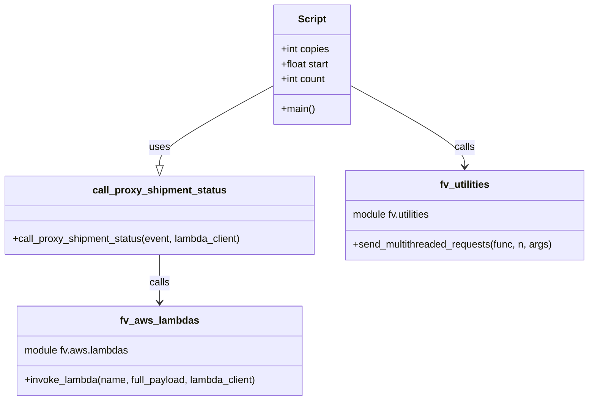

# Diagram: shipment_core/shipment_service/shipment_service/scripts/reproduce_deadlock.py

> Auto-generated by Obscura crawlers

## Diagram 1

```mermaid
flowchart LR
    Start([Start]) --> ReadEvent[/"Read JSON event file"/]
    ReadEvent --> SetEpoch["Set requestTimeEpoch"]
    SetEpoch --> CreateCopies["Create copies count (copies)"]
    CreateCopies --> ForCopies{For each copy i in copies}
    ForCopies --> Deepcopy["Deepcopy event -> event_c"]
    Deepcopy --> ModifyRefs["For each ref in event_c.body.status.reference\nset dct.value = random int"]
    ModifyRefs --> SortRefs["Sort event_c.body.status.reference by value"]
    SortRefs --> AppendArgs["Append (event_c, lambda_client) to args"]
    AppendArgs --> ChunkArgs["Chunk args into groups of 200 -> args_groups"]
    ChunkArgs --> ForGroups{For each arg_group in args_groups}
    ForGroups --> PrintLen["Print len(arg_group)"]
    PrintLen --> SendRequests["Call fv.utilities.send_multithreaded_requests\n(call_proxy_shipment_status, len(arg_group), arg_group)"]
    SendRequests --> PrintTook["Print time taken"]
    SendRequests --> End([End])
    SendRequests --> call_proxy_shipment_status_fn["call_proxy_shipment_status(event, lambda_client)"]
    call_proxy_shipment_status_fn --> InvokeLambda["fv.aws.lambdas.invoke_lambda('proxy_shipment_status', full_payload=event, lambda_client)"]
    InvokeLambda --> IncrementCount["count += 1\nstdout write count"]
    InvokeLambda --> CheckStatus{"res.get('statusCode', 500) != '200'?"}
    CheckStatus -->|True| PrintRes["Print newline and res"]
    CheckStatus -->|False| Continue
    Continue --> Return
```

### SVG

<svg id="container" width="5710.97998046875" xmlns="http://www.w3.org/2000/svg" class="flowchart" height="516.5" viewBox="0.0000019073486328125 0 5710.97998046875 516.5" role="graphics-document document" aria-roledescription="flowchart-v2"><g><marker id="container_flowchart-v2-pointEnd" class="marker flowchart-v2" viewBox="0 0 10 10" refX="5" refY="5" markerUnits="userSpaceOnUse" markerWidth="8" markerHeight="8" orient="auto"><path d="M 0 0 L 10 5 L 0 10 z" class="arrowMarkerPath" style="stroke-width: 1; stroke-dasharray: 1, 0;"></path></marker><marker id="container_flowchart-v2-pointStart" class="marker flowchart-v2" viewBox="0 0 10 10" refX="4.5" refY="5" markerUnits="userSpaceOnUse" markerWidth="8" markerHeight="8" orient="auto"><path d="M 0 5 L 10 10 L 10 0 z" class="arrowMarkerPath" style="stroke-width: 1; stroke-dasharray: 1, 0;"></path></marker><marker id="container_flowchart-v2-circleEnd" class="marker flowchart-v2" viewBox="0 0 10 10" refX="11" refY="5" markerUnits="userSpaceOnUse" markerWidth="11" markerHeight="11" orient="auto"><circle cx="5" cy="5" r="5" class="arrowMarkerPath" style="stroke-width: 1; stroke-dasharray: 1, 0;"></circle></marker><marker id="container_flowchart-v2-circleStart" class="marker flowchart-v2" viewBox="0 0 10 10" refX="-1" refY="5" markerUnits="userSpaceOnUse" markerWidth="11" markerHeight="11" orient="auto"><circle cx="5" cy="5" r="5" class="arrowMarkerPath" style="stroke-width: 1; stroke-dasharray: 1, 0;"></circle></marker><marker id="container_flowchart-v2-crossEnd" class="marker cross flowchart-v2" viewBox="0 0 11 11" refX="12" refY="5.2" markerUnits="userSpaceOnUse" markerWidth="11" markerHeight="11" orient="auto"><path d="M 1,1 l 9,9 M 10,1 l -9,9" class="arrowMarkerPath" style="stroke-width: 2; stroke-dasharray: 1, 0;"></path></marker><marker id="container_flowchart-v2-crossStart" class="marker cross flowchart-v2" viewBox="0 0 11 11" refX="-1" refY="5.2" markerUnits="userSpaceOnUse" markerWidth="11" markerHeight="11" orient="auto"><path d="M 1,1 l 9,9 M 10,1 l -9,9" class="arrowMarkerPath" style="stroke-width: 2; stroke-dasharray: 1, 0;"></path></marker><g class="root"><g class="clusters"></g><g class="edgePaths"><path d="M68.277,147.5L72.36,147.417C76.444,147.333,84.61,147.167,93.902,147.157C103.194,147.148,113.61,147.296,118.819,147.369L124.027,147.443" id="L_Start_ReadEvent_0" class="edge-thickness-normal edge-pattern-solid edge-thickness-normal edge-pattern-solid flowchart-link" style=";" data-edge="true" data-et="edge" data-id="L_Start_ReadEvent_0" data-points="W3sieCI6NjguMjc2ODM3NDMxODI3MjksInkiOjE0Ny41MDAwMDAwMDAwMDAwM30seyJ4Ijo5Mi43NzY4MzYzOTUyNjM2NywieSI6MTQ3fSx7IngiOjEyOC4wMjY4MzYzOTUyNjM2NywieSI6MTQ3LjV9XQ==" marker-end="url(#container_flowchart-v2-pointEnd)"></path><path d="M309.996,147.5L315.704,147.417C321.412,147.333,332.829,147.167,342.037,147.083C351.246,147,358.246,147,361.746,147L365.246,147" id="L_ReadEvent_SetEpoch_0" class="edge-thickness-normal edge-pattern-solid edge-thickness-normal edge-pattern-solid flowchart-link" style=";" data-edge="true" data-et="edge" data-id="L_ReadEvent_SetEpoch_0" data-points="W3sieCI6MzA5Ljk5NTU4NjM5NTI2MzcsInkiOjE0Ny41fSx7IngiOjM0NC4yNDU1ODYzOTUyNjM3LCJ5IjoxNDd9LHsieCI6MzY5LjI0NTU4NjM5NTI2MzcsInkiOjE0N31d" marker-end="url(#container_flowchart-v2-pointEnd)"></path><path d="M591.464,147L595.631,147C599.798,147,608.131,147,615.798,147C623.464,147,630.464,147,633.964,147L637.464,147" id="L_SetEpoch_CreateCopies_0" class="edge-thickness-normal edge-pattern-solid edge-thickness-normal edge-pattern-solid flowchart-link" style=";" data-edge="true" data-et="edge" data-id="L_SetEpoch_CreateCopies_0" data-points="W3sieCI6NTkxLjQ2NDMzNjM5NTI2MzcsInkiOjE0N30seyJ4Ijo2MTYuNDY0MzM2Mzk1MjYzNywieSI6MTQ3fSx7IngiOjY0MS40NjQzMzYzOTUyNjM3LCJ5IjoxNDd9XQ==" marker-end="url(#container_flowchart-v2-pointEnd)"></path><path d="M901.464,147L905.631,147C909.798,147,918.131,147,925.798,147C933.464,147,940.464,147,943.964,147L947.464,147" id="L_CreateCopies_ForCopies_0" class="edge-thickness-normal edge-pattern-solid edge-thickness-normal edge-pattern-solid flowchart-link" style=";" data-edge="true" data-et="edge" data-id="L_CreateCopies_ForCopies_0" data-points="W3sieCI6OTAxLjQ2NDMzNjM5NTI2MzcsInkiOjE0N30seyJ4Ijo5MjYuNDY0MzM2Mzk1MjYzNywieSI6MTQ3fSx7IngiOjk1MS40NjQzMzYzOTUyNjM3LCJ5IjoxNDd9XQ==" marker-end="url(#container_flowchart-v2-pointEnd)"></path><path d="M1183.042,147L1187.209,147C1191.376,147,1199.709,147,1207.376,147C1215.042,147,1222.042,147,1225.542,147L1229.042,147" id="L_ForCopies_Deepcopy_0" class="edge-thickness-normal edge-pattern-solid edge-thickness-normal edge-pattern-solid flowchart-link" style=";" data-edge="true" data-et="edge" data-id="L_ForCopies_Deepcopy_0" data-points="W3sieCI6MTE4My4wNDI0NjEzOTUyNjM3LCJ5IjoxNDd9LHsieCI6MTIwOC4wNDI0NjEzOTUyNjM3LCJ5IjoxNDd9LHsieCI6MTIzMy4wNDI0NjEzOTUyNjM3LCJ5IjoxNDd9XQ==" marker-end="url(#container_flowchart-v2-pointEnd)"></path><path d="M1487.777,147L1491.944,147C1496.11,147,1504.444,147,1512.11,147C1519.777,147,1526.777,147,1530.277,147L1533.777,147" id="L_Deepcopy_ModifyRefs_0" class="edge-thickness-normal edge-pattern-solid edge-thickness-normal edge-pattern-solid flowchart-link" style=";" data-edge="true" data-et="edge" data-id="L_Deepcopy_ModifyRefs_0" data-points="W3sieCI6MTQ4Ny43NzY4MzYzOTUyNjM3LCJ5IjoxNDd9LHsieCI6MTUxMi43NzY4MzYzOTUyNjM3LCJ5IjoxNDd9LHsieCI6MTUzNy43NzY4MzYzOTUyNjM3LCJ5IjoxNDd9XQ==" marker-end="url(#container_flowchart-v2-pointEnd)"></path><path d="M1856.839,147L1861.006,147C1865.173,147,1873.506,147,1881.173,147C1888.839,147,1895.839,147,1899.339,147L1902.839,147" id="L_ModifyRefs_SortRefs_0" class="edge-thickness-normal edge-pattern-solid edge-thickness-normal edge-pattern-solid flowchart-link" style=";" data-edge="true" data-et="edge" data-id="L_ModifyRefs_SortRefs_0" data-points="W3sieCI6MTg1Ni44MzkzMzYzOTUyNjM3LCJ5IjoxNDd9LHsieCI6MTg4MS44MzkzMzYzOTUyNjM3LCJ5IjoxNDd9LHsieCI6MTkwNi44MzkzMzYzOTUyNjM3LCJ5IjoxNDd9XQ==" marker-end="url(#container_flowchart-v2-pointEnd)"></path><path d="M2187.027,147L2191.194,147C2195.36,147,2203.694,147,2211.36,147C2219.027,147,2226.027,147,2229.527,147L2233.027,147" id="L_SortRefs_AppendArgs_0" class="edge-thickness-normal edge-pattern-solid edge-thickness-normal edge-pattern-solid flowchart-link" style=";" data-edge="true" data-et="edge" data-id="L_SortRefs_AppendArgs_0" data-points="W3sieCI6MjE4Ny4wMjY4MzYzOTUyNjM3LCJ5IjoxNDd9LHsieCI6MjIxMi4wMjY4MzYzOTUyNjM3LCJ5IjoxNDd9LHsieCI6MjIzNy4wMjY4MzYzOTUyNjM3LCJ5IjoxNDd9XQ==" marker-end="url(#container_flowchart-v2-pointEnd)"></path><path d="M2497.027,147L2501.194,147C2505.36,147,2513.694,147,2521.36,147C2529.027,147,2536.027,147,2539.527,147L2543.027,147" id="L_AppendArgs_ChunkArgs_0" class="edge-thickness-normal edge-pattern-solid edge-thickness-normal edge-pattern-solid flowchart-link" style=";" data-edge="true" data-et="edge" data-id="L_AppendArgs_ChunkArgs_0" data-points="W3sieCI6MjQ5Ny4wMjY4MzYzOTUyNjM3LCJ5IjoxNDd9LHsieCI6MjUyMi4wMjY4MzYzOTUyNjM3LCJ5IjoxNDd9LHsieCI6MjU0Ny4wMjY4MzYzOTUyNjM3LCJ5IjoxNDd9XQ==" marker-end="url(#container_flowchart-v2-pointEnd)"></path><path d="M2807.027,147L2811.194,147C2815.36,147,2823.694,147,2831.36,147C2839.027,147,2846.027,147,2849.527,147L2853.027,147" id="L_ChunkArgs_ForGroups_0" class="edge-thickness-normal edge-pattern-solid edge-thickness-normal edge-pattern-solid flowchart-link" style=";" data-edge="true" data-et="edge" data-id="L_ChunkArgs_ForGroups_0" data-points="W3sieCI6MjgwNy4wMjY4MzYzOTUyNjM3LCJ5IjoxNDd9LHsieCI6MjgzMi4wMjY4MzYzOTUyNjM3LCJ5IjoxNDd9LHsieCI6Mjg1Ny4wMjY4MzYzOTUyNjM3LCJ5IjoxNDd9XQ==" marker-end="url(#container_flowchart-v2-pointEnd)"></path><path d="M3135.027,147L3139.194,147C3143.36,147,3151.694,147,3159.36,147C3167.027,147,3174.027,147,3177.527,147L3181.027,147" id="L_ForGroups_PrintLen_0" class="edge-thickness-normal edge-pattern-solid edge-thickness-normal edge-pattern-solid flowchart-link" style=";" data-edge="true" data-et="edge" data-id="L_ForGroups_PrintLen_0" data-points="W3sieCI6MzEzNS4wMjY4MzYzOTUyNjM3LCJ5IjoxNDd9LHsieCI6MzE2MC4wMjY4MzYzOTUyNjM3LCJ5IjoxNDd9LHsieCI6MzE4NS4wMjY4MzYzOTUyNjM3LCJ5IjoxNDd9XQ==" marker-end="url(#container_flowchart-v2-pointEnd)"></path><path d="M3390.824,147L3394.99,147C3399.157,147,3407.49,147,3415.157,147C3422.824,147,3429.824,147,3433.324,147L3436.824,147" id="L_PrintLen_SendRequests_0" class="edge-thickness-normal edge-pattern-solid edge-thickness-normal edge-pattern-solid flowchart-link" style=";" data-edge="true" data-et="edge" data-id="L_PrintLen_SendRequests_0" data-points="W3sieCI6MzM5MC44MjM3MTEzOTUyNjM3LCJ5IjoxNDd9LHsieCI6MzQxNS44MjM3MTEzOTUyNjM3LCJ5IjoxNDd9LHsieCI6MzQ0MC44MjM3MTEzOTUyNjM3LCJ5IjoxNDd9XQ==" marker-end="url(#container_flowchart-v2-pointEnd)"></path><path d="M3902.674,96L3927.704,88.417C3952.734,80.833,4002.795,65.667,4042.984,58.083C4083.173,50.5,4113.49,50.5,4128.649,50.5L4143.808,50.5" id="L_SendRequests_PrintTook_0" class="edge-thickness-normal edge-pattern-solid edge-thickness-normal edge-pattern-solid flowchart-link" style=";" data-edge="true" data-et="edge" data-id="L_SendRequests_PrintTook_0" data-points="W3sieCI6MzkwMi42NzQwMTkwMzc3NTEsInkiOjk2fSx7IngiOjQwNTIuODU0OTYxMzk1MjYzNywieSI6NTAuNX0seyJ4Ijo0MTQ3LjgwODA4NjM5NTI2NCwieSI6NTAuNX1d" marker-end="url(#container_flowchart-v2-pointEnd)"></path><path d="M4027.855,147L4032.022,147C4036.188,147,4044.522,147,4074.301,147.081C4104.08,147.162,4155.304,147.325,4180.917,147.406L4206.529,147.487" id="L_SendRequests_End_0" class="edge-thickness-normal edge-pattern-solid edge-thickness-normal edge-pattern-solid flowchart-link" style=";" data-edge="true" data-et="edge" data-id="L_SendRequests_End_0" data-points="W3sieCI6NDAyNy44NTQ5NjEzOTUyNjM3LCJ5IjoxNDd9LHsieCI6NDA1Mi44NTQ5NjEzOTUyNjM3LCJ5IjoxNDd9LHsieCI6NDIxMC41MjkwNDMxOTc2OTUsInkiOjE0Ny40OTk5OTk5OTk5OTk5N31d" marker-end="url(#container_flowchart-v2-pointEnd)"></path><path d="M3884.056,198L3912.189,207.583C3940.323,217.167,3996.589,236.333,4028.222,245.917C4059.855,255.5,4066.855,255.5,4070.355,255.5L4073.855,255.5" id="L_SendRequests_call_proxy_shipment_status_fn_0" class="edge-thickness-normal edge-pattern-solid edge-thickness-normal edge-pattern-solid flowchart-link" style=";" data-edge="true" data-et="edge" data-id="L_SendRequests_call_proxy_shipment_status_fn_0" data-points="W3sieCI6Mzg4NC4wNTYzNTgyODQ2NjQ0LCJ5IjoxOTh9LHsieCI6NDA1Mi44NTQ5NjEzOTUyNjM3LCJ5IjoyNTUuNX0seyJ4Ijo0MDc3Ljg1NDk2MTM5NTI2MzcsInkiOjI1NS41fV0=" marker-end="url(#container_flowchart-v2-pointEnd)"></path><path d="M4394.292,255.5L4398.459,255.5C4402.626,255.5,4410.959,255.5,4418.626,255.5C4426.292,255.5,4433.292,255.5,4436.792,255.5L4440.292,255.5" id="L_call_proxy_shipment_status_fn_InvokeLambda_0" class="edge-thickness-normal edge-pattern-solid edge-thickness-normal edge-pattern-solid flowchart-link" style=";" data-edge="true" data-et="edge" data-id="L_call_proxy_shipment_status_fn_InvokeLambda_0" data-points="W3sieCI6NDM5NC4yOTI0NjEzOTUyNjQsInkiOjI1NS41fSx7IngiOjQ0MTkuMjkyNDYxMzk1MjY0LCJ5IjoyNTUuNX0seyJ4Ijo0NDQ0LjI5MjQ2MTM5NTI2NCwieSI6MjU1LjV9XQ==" marker-end="url(#container_flowchart-v2-pointEnd)"></path><path d="M4769.32,216.5L4797.917,204C4826.514,191.5,4883.708,166.5,4917.305,154C4950.902,141.5,4960.902,141.5,4965.902,141.5L4970.902,141.5" id="L_InvokeLambda_IncrementCount_0" class="edge-thickness-normal edge-pattern-solid edge-thickness-normal edge-pattern-solid flowchart-link" style=";" data-edge="true" data-et="edge" data-id="L_InvokeLambda_IncrementCount_0" data-points="W3sieCI6NDc2OS4zMTk4MDUxNDUyNjQsInkiOjIxNi41fSx7IngiOjQ5NDAuOTAxODM2Mzk1MjY0LCJ5IjoxNDEuNX0seyJ4Ijo0OTc0LjkwMTgzNjM5NTI2NCwieSI6MTQxLjV9XQ==" marker-end="url(#container_flowchart-v2-pointEnd)"></path><path d="M4769.32,294.5L4797.917,307C4826.514,319.5,4883.708,344.5,4915.805,357C4947.902,369.5,4954.902,369.5,4958.402,369.5L4961.902,369.5" id="L_InvokeLambda_CheckStatus_0" class="edge-thickness-normal edge-pattern-solid edge-thickness-normal edge-pattern-solid flowchart-link" style=";" data-edge="true" data-et="edge" data-id="L_InvokeLambda_CheckStatus_0" data-points="W3sieCI6NDc2OS4zMTk4MDUxNDUyNjQsInkiOjI5NC41fSx7IngiOjQ5NDAuOTAxODM2Mzk1MjY0LCJ5IjozNjkuNX0seyJ4Ijo0OTY1LjkwMTgzNjM5NTI2NCwieSI6MzY5LjV9XQ==" marker-end="url(#container_flowchart-v2-pointEnd)"></path><path d="M5213.035,338.633L5225.373,335.111C5237.712,331.589,5262.389,324.544,5281.255,321.022C5300.121,317.5,5313.175,317.5,5319.703,317.5L5326.23,317.5" id="L_CheckStatus_PrintRes_0" class="edge-thickness-normal edge-pattern-solid edge-thickness-normal edge-pattern-solid flowchart-link" style=";" data-edge="true" data-et="edge" data-id="L_CheckStatus_PrintRes_0" data-points="W3sieCI6NTIxMy4wMzQ1ODkyMDYxMjcsInkiOjMzOC42MzI3NTI4MTA4NjMxfSx7IngiOjUyODcuMDY1ODk4ODk1MjY0LCJ5IjozMTcuNX0seyJ4Ijo1MzMwLjIyOTk2MTM5NTI2NCwieSI6MzE3LjV9XQ==" marker-end="url(#container_flowchart-v2-pointEnd)"></path><path d="M5213.035,400.367L5225.373,403.889C5237.712,407.411,5262.389,414.456,5288.661,417.978C5314.933,421.5,5342.8,421.5,5356.734,421.5L5370.667,421.5" id="L_CheckStatus_Continue_0" class="edge-thickness-normal edge-pattern-solid edge-thickness-normal edge-pattern-solid flowchart-link" style=";" data-edge="true" data-et="edge" data-id="L_CheckStatus_Continue_0" data-points="W3sieCI6NTIxMy4wMzQ1ODkyMDYxMjcsInkiOjQwMC4zNjcyNDcxODkxMzY5fSx7IngiOjUyODcuMDY1ODk4ODk1MjY0LCJ5Ijo0MjEuNX0seyJ4Ijo1Mzc0LjY2NzQ2MTM5NTI2NCwieSI6NDIxLjV9XQ==" marker-end="url(#container_flowchart-v2-pointEnd)"></path><path d="M5499.73,421.5L5511.303,421.5C5522.876,421.5,5546.022,421.5,5561.095,421.5C5576.167,421.5,5583.167,421.5,5586.667,421.5L5590.167,421.5" id="L_Continue_Return_0" class="edge-thickness-normal edge-pattern-solid edge-thickness-normal edge-pattern-solid flowchart-link" style=";" data-edge="true" data-et="edge" data-id="L_Continue_Return_0" data-points="W3sieCI6NTQ5OS43Mjk5NjEzOTUyNjQsInkiOjQyMS41fSx7IngiOjU1NjkuMTY3NDYxMzk1MjY0LCJ5Ijo0MjEuNX0seyJ4Ijo1NTk0LjE2NzQ2MTM5NTI2NCwieSI6NDIxLjV9XQ==" marker-end="url(#container_flowchart-v2-pointEnd)"></path></g><g class="edgeLabels"><g class="edgeLabel"><g class="label" data-id="L_Start_ReadEvent_0" transform="translate(0, 0)"><foreignObject width="0" height="0">

</foreignObject></g></g><g class="edgeLabel"><g class="label" data-id="L_ReadEvent_SetEpoch_0" transform="translate(0, 0)"><foreignObject width="0" height="0">

</foreignObject></g></g><g class="edgeLabel"><g class="label" data-id="L_SetEpoch_CreateCopies_0" transform="translate(0, 0)"><foreignObject width="0" height="0">

</foreignObject></g></g><g class="edgeLabel"><g class="label" data-id="L_CreateCopies_ForCopies_0" transform="translate(0, 0)"><foreignObject width="0" height="0">

</foreignObject></g></g><g class="edgeLabel"><g class="label" data-id="L_ForCopies_Deepcopy_0" transform="translate(0, 0)"><foreignObject width="0" height="0">

</foreignObject></g></g><g class="edgeLabel"><g class="label" data-id="L_Deepcopy_ModifyRefs_0" transform="translate(0, 0)"><foreignObject width="0" height="0">

</foreignObject></g></g><g class="edgeLabel"><g class="label" data-id="L_ModifyRefs_SortRefs_0" transform="translate(0, 0)"><foreignObject width="0" height="0">

</foreignObject></g></g><g class="edgeLabel"><g class="label" data-id="L_SortRefs_AppendArgs_0" transform="translate(0, 0)"><foreignObject width="0" height="0">

</foreignObject></g></g><g class="edgeLabel"><g class="label" data-id="L_AppendArgs_ChunkArgs_0" transform="translate(0, 0)"><foreignObject width="0" height="0">

</foreignObject></g></g><g class="edgeLabel"><g class="label" data-id="L_ChunkArgs_ForGroups_0" transform="translate(0, 0)"><foreignObject width="0" height="0">

</foreignObject></g></g><g class="edgeLabel"><g class="label" data-id="L_ForGroups_PrintLen_0" transform="translate(0, 0)"><foreignObject width="0" height="0">

</foreignObject></g></g><g class="edgeLabel"><g class="label" data-id="L_PrintLen_SendRequests_0" transform="translate(0, 0)"><foreignObject width="0" height="0">

</foreignObject></g></g><g class="edgeLabel"><g class="label" data-id="L_SendRequests_PrintTook_0" transform="translate(0, 0)"><foreignObject width="0" height="0">

</foreignObject></g></g><g class="edgeLabel"><g class="label" data-id="L_SendRequests_End_0" transform="translate(0, 0)"><foreignObject width="0" height="0">

</foreignObject></g></g><g class="edgeLabel"><g class="label" data-id="L_SendRequests_call_proxy_shipment_status_fn_0" transform="translate(0, 0)"><foreignObject width="0" height="0">

</foreignObject></g></g><g class="edgeLabel"><g class="label" data-id="L_call_proxy_shipment_status_fn_InvokeLambda_0" transform="translate(0, 0)"><foreignObject width="0" height="0">

</foreignObject></g></g><g class="edgeLabel"><g class="label" data-id="L_InvokeLambda_IncrementCount_0" transform="translate(0, 0)"><foreignObject width="0" height="0">

</foreignObject></g></g><g class="edgeLabel"><g class="label" data-id="L_InvokeLambda_CheckStatus_0" transform="translate(0, 0)"><foreignObject width="0" height="0">

</foreignObject></g></g><g class="edgeLabel" transform="translate(5287.065898895264, 317.5)"><g class="label" data-id="L_CheckStatus_PrintRes_0" transform="translate(-16.0078125, -12)"><foreignObject width="32.015625" height="24">

True

</foreignObject></g></g><g class="edgeLabel" transform="translate(5287.065898895264, 421.5)"><g class="label" data-id="L_CheckStatus_Continue_0" transform="translate(-18.1640625, -12)"><foreignObject width="36.328125" height="24">

False

</foreignObject></g></g><g class="edgeLabel"><g class="label" data-id="L_Continue_Return_0" transform="translate(0, 0)"><foreignObject width="0" height="0">

</foreignObject></g></g></g><g class="nodes"><g class="node default" id="flowchart-Start-0" transform="translate(37.888418197631836, 147)"><g class="basic label-container outer-path"><path d="M-10.3984375 -19.5 C-5.04511184367895 -19.5, 0.3082138126420997 -19.5, 10.3984375 -19.5 C10.3984375 -19.5, 10.398437499999998 -19.5, 10.398437499999998 -19.5 C10.673177606116877 -19.491189619546006, 10.947917712233755 -19.482379239092015, 11.6478067896239 -19.45993515863156 C11.972632083955638 -19.428599653146946, 12.297457378287374 -19.397264147662337, 12.892042152847864 -19.3399052695533 C13.377789322012118 -19.261373434268382, 13.863536491176374 -19.18284159898346, 14.126030759676757 -19.140403561325776 C14.56448805581358 -19.040328544683796, 15.002945351950402 -18.940253528041815, 15.34470188623539 -18.862249829261074 C15.657600329419045 -18.76938321376161, 15.9704987726027 -18.676516598262147, 16.543047751460602 -18.50658706670804 C16.832072062422572 -18.400223448562592, 17.121096373384542 -18.293859830417144, 17.716144095147794 -18.074876768247425 C18.075538599490695 -17.915783482234005, 18.4349331038336 -17.756690196220585, 18.85917041279238 -17.568892924097174 C19.290077914893747 -17.34408875626032, 19.720985416995113 -17.119284588423465, 19.967429764076783 -16.990714730406097 C20.375020656155 -16.743630736358327, 20.782611548233223 -16.496546742310557, 21.036368073605697 -16.342718045390892 C21.245018200454926 -16.197172749219288, 21.453668327304154 -16.05162745304768, 22.061592844578712 -15.627565626425154 C22.383837222716743 -15.370584310143116, 22.706081600854773 -15.113602993861079, 23.03889120850187 -14.848196188198123 C23.23981800054245 -14.665719791898466, 23.44074479258303 -14.48324339559881, 23.964247236767985 -14.007812326905688 C24.27799926272415 -13.683837600585553, 24.591751288680317 -13.359862874265419, 24.833858442968648 -13.10986736009568 C25.132256817984914 -12.759351649453034, 25.43065519300118 -12.408835938810387, 25.644151408126582 -12.158051136245305 C25.939757603048218 -11.761965765328679, 26.23536379796985 -11.365880394412054, 26.391796464640635 -11.156274872382312 C26.539101427493538 -10.929974892519235, 26.686406390346445 -10.703674912656156, 27.073721378604247 -10.108655082055241 C27.27925725946045 -9.743705312830256, 27.484793140316654 -9.378755543605273, 27.6871239742735 -9.019496659696287 C27.865887594403492 -8.64829017756763, 28.044651214533484 -8.277083695438973, 28.22948364880834 -7.893275190886684 C28.404602061234236 -7.460729326510549, 28.579720473660128 -7.028183462134414, 28.698571729970325 -6.734618561215508 C28.828808443747533 -6.342366329720937, 28.95904515752474 -5.950114098226367, 29.09246063421488 -5.548287939305138 C29.16103306293694 -5.286791549109319, 29.229605491659 -5.025295158913499, 29.40953178754556 -4.339158212148133 C29.4997713791511 -3.875796981398128, 29.59001097075664 -3.412435750648122, 29.648482276581777 -3.1121979531509023 C29.690861634513904 -2.7835120217801106, 29.733240992446035 -2.454826090409319, 29.808330202509367 -1.872449005199798 C29.824865140272532 -1.6149040027769619, 29.841400078035697 -1.3573590003541258, 29.888418715913414 -0.6250057626472757 C29.888418715913414 -0.22536800462439022, 29.888418715913414 0.17426975339849526, 29.888418715913414 0.625005762647271 C29.865008442913503 0.9896396610531681, 29.84159816991359 1.3542735594590651, 29.808330202509367 1.8724490051997846 C29.753516100387557 2.2975763569877827, 29.698701998265744 2.7227037087757804, 29.648482276581777 3.1121979531508885 C29.578329961201195 3.472415265933076, 29.508177645820613 3.8326325787152626, 29.40953178754556 4.339158212148129 C29.31130427675355 4.713742282870538, 29.213076765961542 5.088326353592947, 29.092460634214884 5.548287939305125 C28.993624288226258 5.8459672659896835, 28.894787942237627 6.143646592674241, 28.69857172997033 6.734618561215495 C28.53617069528696 7.135752256693826, 28.37376966060359 7.536885952172158, 28.229483648808344 7.893275190886679 C28.03045997440697 8.30655210920558, 27.831436300005596 8.71982902752448, 27.687123974273504 9.019496659696284 C27.48183436985107 9.384009140174918, 27.276544765428635 9.74852162065355, 27.07372137860425 10.108655082055236 C26.920510131743473 10.34402870021373, 26.7672988848827 10.579402318372225, 26.39179646464064 11.156274872382301 C26.203473414155283 11.408610603449839, 26.015150363669925 11.660946334517376, 25.644151408126582 12.158051136245302 C25.463332918343028 12.370450823208603, 25.282514428559477 12.582850510171903, 24.83385844296866 13.10986736009567 C24.569291322020153 13.383054633839594, 24.30472420107165 13.656241907583517, 23.96424723676799 14.007812326905684 C23.68114931368105 14.264914370292654, 23.398051390594116 14.522016413679626, 23.038891208501887 14.848196188198111 C22.649663121860637 15.158595229500122, 22.26043503521939 15.468994270802131, 22.061592844578715 15.627565626425152 C21.828697279510944 15.79002349072991, 21.595801714443173 15.952481355034667, 21.036368073605708 16.34271804539089 C20.754828093825186 16.51338923564641, 20.47328811404466 16.684060425901933, 19.967429764076787 16.990714730406093 C19.664514186081437 17.14874559341958, 19.361598608086087 17.306776456433067, 18.859170412792388 17.56889292409717 C18.602162404874928 17.68266274533055, 18.34515439695747 17.796432566563933, 17.716144095147804 18.07487676824742 C17.322940669032175 18.2195792637906, 16.92973724291654 18.364281759333778, 16.543047751460616 18.506587066708033 C16.071259819275358 18.646611248515228, 15.5994718870901 18.786635430322423, 15.344701886235413 18.86224982926107 C15.068473720607827 18.925297105508328, 14.792245554980243 18.988344381755585, 14.126030759676766 19.140403561325773 C13.715704314510079 19.206741958851214, 13.305377869343394 19.27308035637666, 12.892042152847878 19.3399052695533 C12.463474571139681 19.381248668732763, 12.034906989431484 19.422592067912227, 11.6478067896239 19.45993515863156 C11.324413318738515 19.47030575779565, 11.00101984785313 19.480676356959737, 10.398437500000004 19.5 C10.398437500000002 19.5, 10.398437500000002 19.5, 10.3984375 19.5 C5.532998585947687 19.5, 0.6675596718953738 19.5, -10.398437499999996 19.5 C-10.717736646409715 19.489760697852727, -11.037035792819433 19.47952139570545, -11.647806789623893 19.45993515863156 C-11.976101774388333 19.428264936283817, -12.304396759152775 19.39659471393608, -12.892042152847871 19.3399052695533 C-13.315814509921307 19.271393041265377, -13.739586866994742 19.202880812977455, -14.126030759676759 19.140403561325773 C-14.398872068776086 19.078129312979787, -14.671713377875413 19.015855064633797, -15.344701886235388 18.862249829261074 C-15.593698427416884 18.788348962847923, -15.84269496859838 18.714448096434772, -16.54304775146059 18.506587066708043 C-16.79527412660576 18.41376542909957, -17.04750050175093 18.320943791491093, -17.716144095147797 18.074876768247425 C-17.98058294134759 17.957817535334442, -18.24502178754738 17.840758302421456, -18.85917041279238 17.568892924097174 C-19.1339227244057 17.42555481911576, -19.408675036019023 17.282216714134343, -19.96742976407678 16.990714730406097 C-20.369231464704576 16.747140178236638, -20.771033165332376 16.50356562606718, -21.036368073605686 16.3427180453909 C-21.40014663538405 16.088961868414444, -21.76392519716242 15.835205691437988, -22.061592844578712 15.627565626425156 C-22.394041597571153 15.362446592746544, -22.726490350563598 15.09732755906793, -23.03889120850187 14.848196188198125 C-23.25051993995956 14.656000573677648, -23.46214867141725 14.46380495915717, -23.964247236767974 14.007812326905697 C-24.234685036052095 13.728563095788598, -24.505122835336213 13.449313864671497, -24.833858442968655 13.109867360095677 C-25.000870557172135 12.913685427493753, -25.16788267137562 12.71750349489183, -25.64415140812658 12.158051136245307 C-25.931574348166617 11.772930581360166, -26.218997288206655 11.387810026475027, -26.391796464640635 11.156274872382316 C-26.632352709028215 10.786715882606748, -26.872908953415795 10.417156892831178, -27.073721378604244 10.108655082055249 C-27.307096801181128 9.694273387445905, -27.540472223758016 9.279891692836562, -27.6871239742735 9.019496659696289 C-27.84593216218468 8.689728059547841, -28.004740350095865 8.359959459399391, -28.22948364880834 7.893275190886686 C-28.376177450036007 7.530938665722646, -28.522871251263673 7.168602140558605, -28.698571729970325 6.73461856121551 C-28.78732799630456 6.467298828407402, -28.87608426263879 6.199979095599295, -29.09246063421488 5.5482879393051325 C-29.192470929559658 5.166905338419307, -29.292481224904435 4.785522737533481, -29.409531787545557 4.339158212148136 C-29.46668557253438 4.045685605687272, -29.5238393575232 3.752212999226407, -29.648482276581777 3.112197953150904 C-29.69607555533462 2.7430738814997837, -29.743668834087458 2.3739498098486633, -29.808330202509364 1.872449005199809 C-29.838628135086662 1.4005342492573845, -29.868926067663963 0.9286194933149597, -29.888418715913414 0.6250057626472781 C-29.888418715913414 0.3062544006174144, -29.888418715913414 -0.012496961412449381, -29.888418715913414 -0.6250057626472687 C-29.867633148574264 -0.9487577517625068, -29.846847581235114 -1.2725097408777448, -29.808330202509367 -1.8724490051997822 C-29.770993302727582 -2.162026626902491, -29.7336564029458 -2.451604248605199, -29.648482276581777 -3.112197953150895 C-29.56518544129731 -3.539909597544264, -29.48188860601284 -3.967621241937633, -29.40953178754556 -4.339158212148126 C-29.33975301823777 -4.605254901828661, -29.269974248929977 -4.871351591509196, -29.092460634214884 -5.548287939305123 C-29.00181419720431 -5.821300565032569, -28.911167760193738 -6.0943131907600145, -28.698571729970332 -6.734618561215485 C-28.58539332861105 -7.014171400728443, -28.47221492725177 -7.2937242402414, -28.229483648808344 -7.893275190886676 C-28.085583773726597 -8.192086360458013, -27.941683898644847 -8.49089753002935, -27.687123974273504 -9.019496659696282 C-27.48440449402181 -9.379445624456475, -27.281685013770115 -9.739394589216666, -27.073721378604247 -10.108655082055243 C-26.92335999461914 -10.33965054554138, -26.77299861063403 -10.570646009027515, -26.39179646464064 -11.156274872382308 C-26.238038549546687 -11.36229647097398, -26.08428063445273 -11.568318069565652, -25.644151408126586 -12.158051136245302 C-25.335918253682568 -12.52011933841859, -25.02768509923855 -12.88218754059188, -24.833858442968662 -13.10986736009567 C-24.569660479904556 -13.382673448015526, -24.305462516840446 -13.655479535935383, -23.964247236767996 -14.007812326905677 C-23.60130969478615 -14.337422599732449, -23.2383721528043 -14.667032872559219, -23.038891208501887 -14.848196188198107 C-22.683135459213624 -15.13190193119742, -22.327379709925356 -15.415607674196734, -22.06159284457872 -15.627565626425149 C-21.68702934479719 -15.888844909280172, -21.31246584501566 -16.150124192135195, -21.03636807360571 -16.342718045390885 C-20.773929938074943 -16.501809585407308, -20.511491802544175 -16.660901125423734, -19.96742976407679 -16.99071473040609 C-19.580565971093872 -17.192541323407195, -19.193702178110954 -17.394367916408296, -18.859170412792388 -17.56889292409717 C-18.624166908420783 -17.672922004351207, -18.389163404049178 -17.776951084605244, -17.716144095147804 -18.07487676824742 C-17.47909801932053 -18.16211191538176, -17.242051943493255 -18.249347062516105, -16.54304775146062 -18.506587066708033 C-16.2923225301155 -18.58100099631972, -16.04159730877038 -18.65541492593141, -15.344701886235413 -18.862249829261067 C-15.025894807535966 -18.9350154645636, -14.70708772883652 -19.00778109986614, -14.126030759676768 -19.140403561325773 C-13.81873437130083 -19.19008485827931, -13.511437982924893 -19.23976615523285, -12.89204215284788 -19.3399052695533 C-12.591203902150564 -19.368926773787138, -12.290365651453248 -19.397948278020976, -11.647806789623903 -19.45993515863156 C-11.196055821692495 -19.474421932893204, -10.744304853761088 -19.488908707154845, -10.398437500000005 -19.5 C-10.398437500000004 -19.5, -10.398437500000002 -19.5, -10.3984375 -19.5" stroke="none" stroke-width="0" fill="#ECECFF" style=""></path><path d="M-10.3984375 -19.5 C-3.830788098090326 -19.5, 2.7368613038193477 -19.5, 10.3984375 -19.5 M-10.3984375 -19.5 C-2.981131342336562 -19.5, 4.436174815326876 -19.5, 10.3984375 -19.5 M10.3984375 -19.5 C10.3984375 -19.5, 10.398437499999998 -19.5, 10.398437499999998 -19.5 M10.3984375 -19.5 C10.3984375 -19.5, 10.398437499999998 -19.5, 10.398437499999998 -19.5 M10.398437499999998 -19.5 C10.811743468863614 -19.48674608202981, 11.225049437727233 -19.473492164059618, 11.6478067896239 -19.45993515863156 M10.398437499999998 -19.5 C10.772744207383202 -19.48799671243803, 11.147050914766403 -19.47599342487606, 11.6478067896239 -19.45993515863156 M11.6478067896239 -19.45993515863156 C11.899540212973475 -19.435650738034763, 12.151273636323051 -19.411366317437963, 12.892042152847864 -19.3399052695533 M11.6478067896239 -19.45993515863156 C11.952256223971496 -19.430565287854062, 12.25670565831909 -19.401195417076565, 12.892042152847864 -19.3399052695533 M12.892042152847864 -19.3399052695533 C13.271962698001312 -19.27848266214072, 13.65188324315476 -19.217060054728144, 14.126030759676757 -19.140403561325776 M12.892042152847864 -19.3399052695533 C13.228599300810027 -19.28549331991044, 13.56515644877219 -19.23108137026758, 14.126030759676757 -19.140403561325776 M14.126030759676757 -19.140403561325776 C14.57396716518226 -19.038164999827366, 15.021903570687765 -18.935926438328952, 15.34470188623539 -18.862249829261074 M14.126030759676757 -19.140403561325776 C14.398085471086222 -19.07830884876947, 14.67014018249569 -19.016214136213165, 15.34470188623539 -18.862249829261074 M15.34470188623539 -18.862249829261074 C15.75072795365834 -18.741743423724262, 16.15675402108129 -18.62123701818745, 16.543047751460602 -18.50658706670804 M15.34470188623539 -18.862249829261074 C15.77046669107971 -18.735885070068345, 16.19623149592403 -18.60952031087562, 16.543047751460602 -18.50658706670804 M16.543047751460602 -18.50658706670804 C16.81400090035373 -18.406873803251916, 17.084954049246857 -18.30716053979579, 17.716144095147794 -18.074876768247425 M16.543047751460602 -18.50658706670804 C16.81809909759827 -18.405365628782604, 17.09315044373594 -18.304144190857173, 17.716144095147794 -18.074876768247425 M17.716144095147794 -18.074876768247425 C17.981499658660983 -17.957411731773252, 18.246855222174176 -17.83994669529908, 18.85917041279238 -17.568892924097174 M17.716144095147794 -18.074876768247425 C18.044943733058627 -17.929326922039017, 18.373743370969457 -17.783777075830606, 18.85917041279238 -17.568892924097174 M18.85917041279238 -17.568892924097174 C19.29716289109759 -17.34039252871292, 19.735155369402797 -17.111892133328666, 19.967429764076783 -16.990714730406097 M18.85917041279238 -17.568892924097174 C19.302233777560794 -17.33774705049312, 19.74529714232921 -17.106601176889072, 19.967429764076783 -16.990714730406097 M19.967429764076783 -16.990714730406097 C20.352379524507594 -16.757355923417045, 20.737329284938404 -16.523997116427992, 21.036368073605697 -16.342718045390892 M19.967429764076783 -16.990714730406097 C20.205540230092904 -16.846370766614704, 20.443650696109028 -16.702026802823315, 21.036368073605697 -16.342718045390892 M21.036368073605697 -16.342718045390892 C21.253598190307734 -16.191187719719743, 21.470828307009768 -16.039657394048593, 22.061592844578712 -15.627565626425154 M21.036368073605697 -16.342718045390892 C21.317711785287514 -16.146464851294642, 21.59905549696933 -15.950211657198391, 22.061592844578712 -15.627565626425154 M22.061592844578712 -15.627565626425154 C22.394387174621738 -15.362171004244892, 22.727181504664763 -15.096776382064633, 23.03889120850187 -14.848196188198123 M22.061592844578712 -15.627565626425154 C22.451831658684224 -15.31636055686698, 22.842070472789736 -15.005155487308807, 23.03889120850187 -14.848196188198123 M23.03889120850187 -14.848196188198123 C23.26996889689357 -14.638337545581381, 23.50104658528527 -14.428478902964637, 23.964247236767985 -14.007812326905688 M23.03889120850187 -14.848196188198123 C23.277371295471763 -14.6316148830494, 23.515851382441657 -14.415033577900676, 23.964247236767985 -14.007812326905688 M23.964247236767985 -14.007812326905688 C24.18708491238746 -13.777714131515166, 24.409922588006932 -13.547615936124643, 24.833858442968648 -13.10986736009568 M23.964247236767985 -14.007812326905688 C24.146477548143682 -13.819644569023472, 24.32870785951938 -13.631476811141257, 24.833858442968648 -13.10986736009568 M24.833858442968648 -13.10986736009568 C25.00941391429763 -12.903649914083353, 25.184969385626612 -12.697432468071025, 25.644151408126582 -12.158051136245305 M24.833858442968648 -13.10986736009568 C25.157896165867804 -12.729234212509569, 25.481933888766957 -12.348601064923459, 25.644151408126582 -12.158051136245305 M25.644151408126582 -12.158051136245305 C25.908719251997965 -11.803554328084065, 26.173287095869348 -11.449057519922825, 26.391796464640635 -11.156274872382312 M25.644151408126582 -12.158051136245305 C25.881265564444448 -11.84033976832339, 26.118379720762313 -11.522628400401477, 26.391796464640635 -11.156274872382312 M26.391796464640635 -11.156274872382312 C26.641300093664857 -10.772970297095673, 26.890803722689082 -10.389665721809035, 27.073721378604247 -10.108655082055241 M26.391796464640635 -11.156274872382312 C26.63461032248993 -10.783247582075449, 26.877424180339226 -10.410220291768587, 27.073721378604247 -10.108655082055241 M27.073721378604247 -10.108655082055241 C27.230128679065423 -9.830938082129846, 27.386535979526595 -9.55322108220445, 27.6871239742735 -9.019496659696287 M27.073721378604247 -10.108655082055241 C27.279891039226747 -9.742579972678039, 27.486060699849247 -9.376504863300834, 27.6871239742735 -9.019496659696287 M27.6871239742735 -9.019496659696287 C27.894354275422934 -8.589178505341359, 28.10158457657237 -8.158860350986428, 28.22948364880834 -7.893275190886684 M27.6871239742735 -9.019496659696287 C27.851343650522853 -8.678490988226324, 28.015563326772206 -8.337485316756359, 28.22948364880834 -7.893275190886684 M28.22948364880834 -7.893275190886684 C28.358264053095773 -7.575185102496992, 28.487044457383202 -7.257095014107299, 28.698571729970325 -6.734618561215508 M28.22948364880834 -7.893275190886684 C28.40597987718776 -7.457326094467077, 28.582476105567185 -7.021376998047469, 28.698571729970325 -6.734618561215508 M28.698571729970325 -6.734618561215508 C28.837778359640474 -6.315350372213413, 28.976984989310623 -5.896082183211319, 29.09246063421488 -5.548287939305138 M28.698571729970325 -6.734618561215508 C28.813048650518198 -6.389832315945643, 28.92752557106607 -6.045046070675779, 29.09246063421488 -5.548287939305138 M29.09246063421488 -5.548287939305138 C29.20418990828584 -5.122215793498872, 29.3159191823568 -4.696143647692606, 29.40953178754556 -4.339158212148133 M29.09246063421488 -5.548287939305138 C29.195154623956874 -5.1566712485622155, 29.29784861369887 -4.765054557819293, 29.40953178754556 -4.339158212148133 M29.40953178754556 -4.339158212148133 C29.490656117518864 -3.922601923368433, 29.571780447492166 -3.5060456345887325, 29.648482276581777 -3.1121979531509023 M29.40953178754556 -4.339158212148133 C29.495324779554842 -3.8986293305357513, 29.581117771564124 -3.4581004489233695, 29.648482276581777 -3.1121979531509023 M29.648482276581777 -3.1121979531509023 C29.701977619316516 -2.6972986387505475, 29.755472962051254 -2.2823993243501928, 29.808330202509367 -1.872449005199798 M29.648482276581777 -3.1121979531509023 C29.709536066190573 -2.6386768173795123, 29.77058985579937 -2.1651556816081223, 29.808330202509367 -1.872449005199798 M29.808330202509367 -1.872449005199798 C29.83418334197384 -1.469765489762068, 29.86003648143831 -1.067081974324338, 29.888418715913414 -0.6250057626472757 M29.808330202509367 -1.872449005199798 C29.82785004559583 -1.5684116929943979, 29.84736988868229 -1.2643743807889978, 29.888418715913414 -0.6250057626472757 M29.888418715913414 -0.6250057626472757 C29.888418715913414 -0.34985107582871683, 29.888418715913414 -0.07469638901015796, 29.888418715913414 0.625005762647271 M29.888418715913414 -0.6250057626472757 C29.888418715913414 -0.35336658572626917, 29.888418715913414 -0.08172740880526264, 29.888418715913414 0.625005762647271 M29.888418715913414 0.625005762647271 C29.86168722694053 1.041370280669515, 29.83495573796764 1.4577347986917593, 29.808330202509367 1.8724490051997846 M29.888418715913414 0.625005762647271 C29.85694876032764 1.1151757229866368, 29.825478804741866 1.6053456833260027, 29.808330202509367 1.8724490051997846 M29.808330202509367 1.8724490051997846 C29.75336189569958 2.298772338096556, 29.698393588889793 2.725095670993327, 29.648482276581777 3.1121979531508885 M29.808330202509367 1.8724490051997846 C29.749703445540575 2.327146555087111, 29.691076688571783 2.781844104974437, 29.648482276581777 3.1121979531508885 M29.648482276581777 3.1121979531508885 C29.593699088871837 3.3934980436106206, 29.538915901161893 3.6747981340703526, 29.40953178754556 4.339158212148129 M29.648482276581777 3.1121979531508885 C29.5844214964734 3.4411365197567427, 29.520360716365023 3.7700750863625974, 29.40953178754556 4.339158212148129 M29.40953178754556 4.339158212148129 C29.315965535302826 4.695966883819909, 29.222399283060096 5.0527755554916896, 29.092460634214884 5.548287939305125 M29.40953178754556 4.339158212148129 C29.298411380510416 4.762908484062194, 29.187290973475267 5.186658755976259, 29.092460634214884 5.548287939305125 M29.092460634214884 5.548287939305125 C28.97646150987461 5.8976588198674635, 28.860462385534337 6.247029700429802, 28.69857172997033 6.734618561215495 M29.092460634214884 5.548287939305125 C28.954786785719314 5.962939635624902, 28.817112937223747 6.377591331944678, 28.69857172997033 6.734618561215495 M28.69857172997033 6.734618561215495 C28.597551164878457 6.984141310092181, 28.49653059978658 7.233664058968868, 28.229483648808344 7.893275190886679 M28.69857172997033 6.734618561215495 C28.584922645074556 7.015333998163637, 28.47127356017878 7.2960494351117795, 28.229483648808344 7.893275190886679 M28.229483648808344 7.893275190886679 C28.022486131733253 8.323109964130454, 27.81548861465816 8.752944737374229, 27.687123974273504 9.019496659696284 M28.229483648808344 7.893275190886679 C28.05560332620049 8.254341401224792, 27.881723003592633 8.615407611562905, 27.687123974273504 9.019496659696284 M27.687123974273504 9.019496659696284 C27.48383268293209 9.380460932948424, 27.280541391590678 9.741425206200562, 27.07372137860425 10.108655082055236 M27.687123974273504 9.019496659696284 C27.535619748408557 9.288507754185936, 27.38411552254361 9.557518848675588, 27.07372137860425 10.108655082055236 M27.07372137860425 10.108655082055236 C26.85526176524803 10.444267712790396, 26.636802151891814 10.779880343525553, 26.39179646464064 11.156274872382301 M27.07372137860425 10.108655082055236 C26.801553576255184 10.526777913751516, 26.529385773906117 10.944900745447796, 26.39179646464064 11.156274872382301 M26.39179646464064 11.156274872382301 C26.14232549169307 11.490543248858865, 25.892854518745505 11.824811625335428, 25.644151408126582 12.158051136245302 M26.39179646464064 11.156274872382301 C26.20272929566049 11.409607654442272, 26.013662126680337 11.662940436502243, 25.644151408126582 12.158051136245302 M25.644151408126582 12.158051136245302 C25.465734360004653 12.367629953186958, 25.287317311882724 12.577208770128616, 24.83385844296866 13.10986736009567 M25.644151408126582 12.158051136245302 C25.400861159594363 12.443833705778559, 25.157570911062145 12.729616275311818, 24.83385844296866 13.10986736009567 M24.83385844296866 13.10986736009567 C24.6528988130298 13.296723035069464, 24.47193918309094 13.48357871004326, 23.96424723676799 14.007812326905684 M24.83385844296866 13.10986736009567 C24.49699911051693 13.457702277517617, 24.160139778065204 13.805537194939562, 23.96424723676799 14.007812326905684 M23.96424723676799 14.007812326905684 C23.59427542340219 14.343810938886737, 23.224303610036397 14.679809550867787, 23.038891208501887 14.848196188198111 M23.96424723676799 14.007812326905684 C23.641882053470216 14.300575857061364, 23.319516870172443 14.593339387217046, 23.038891208501887 14.848196188198111 M23.038891208501887 14.848196188198111 C22.723632786779767 15.099606390142567, 22.40837436505765 15.351016592087024, 22.061592844578715 15.627565626425152 M23.038891208501887 14.848196188198111 C22.681376426783316 15.133304712750773, 22.323861645064746 15.418413237303435, 22.061592844578715 15.627565626425152 M22.061592844578715 15.627565626425152 C21.827042681181947 15.791177666897811, 21.59249251778518 15.95478970737047, 21.036368073605708 16.34271804539089 M22.061592844578715 15.627565626425152 C21.743624581605417 15.849366522051067, 21.42565631863212 16.071167417676982, 21.036368073605708 16.34271804539089 M21.036368073605708 16.34271804539089 C20.722135041213686 16.533207956265205, 20.407902008821665 16.723697867139517, 19.967429764076787 16.990714730406093 M21.036368073605708 16.34271804539089 C20.717334678505683 16.536117964348858, 20.398301283405655 16.72951788330683, 19.967429764076787 16.990714730406093 M19.967429764076787 16.990714730406093 C19.612510010984323 17.17587613825748, 19.25759025789186 17.361037546108868, 18.859170412792388 17.56889292409717 M19.967429764076787 16.990714730406093 C19.61242932689599 17.175918231094684, 19.257428889715193 17.36112173178327, 18.859170412792388 17.56889292409717 M18.859170412792388 17.56889292409717 C18.551139752315958 17.705248960085196, 18.243109091839532 17.84160499607322, 17.716144095147804 18.07487676824742 M18.859170412792388 17.56889292409717 C18.619453466008494 17.675008505487828, 18.3797365192246 17.78112408687848, 17.716144095147804 18.07487676824742 M17.716144095147804 18.07487676824742 C17.39382253663476 18.193494081288044, 17.07150097812172 18.31211139432867, 16.543047751460616 18.506587066708033 M17.716144095147804 18.07487676824742 C17.320083957662224 18.220630559981892, 16.924023820176647 18.36638435171636, 16.543047751460616 18.506587066708033 M16.543047751460616 18.506587066708033 C16.13346203156392 18.628149958414056, 15.723876311667224 18.749712850120083, 15.344701886235413 18.86224982926107 M16.543047751460616 18.506587066708033 C16.176222494246225 18.6154588775442, 15.809397237031833 18.724330688380363, 15.344701886235413 18.86224982926107 M15.344701886235413 18.86224982926107 C15.06635310922587 18.925781121217977, 14.788004332216326 18.989312413174883, 14.126030759676766 19.140403561325773 M15.344701886235413 18.86224982926107 C15.09528011158181 18.919178721696564, 14.845858336928206 18.97610761413206, 14.126030759676766 19.140403561325773 M14.126030759676766 19.140403561325773 C13.842672719608494 19.186214691769592, 13.559314679540222 19.23202582221341, 12.892042152847878 19.3399052695533 M14.126030759676766 19.140403561325773 C13.756477716402253 19.200150031435744, 13.38692467312774 19.259896501545715, 12.892042152847878 19.3399052695533 M12.892042152847878 19.3399052695533 C12.434794848889963 19.38401536704578, 11.977547544932046 19.42812546453826, 11.6478067896239 19.45993515863156 M12.892042152847878 19.3399052695533 C12.607612551767055 19.367343851092922, 12.32318295068623 19.394782432632546, 11.6478067896239 19.45993515863156 M11.6478067896239 19.45993515863156 C11.320209871141692 19.470440554178563, 10.992612952659485 19.48094594972557, 10.398437500000004 19.5 M11.6478067896239 19.45993515863156 C11.211569278734023 19.473924446520993, 10.775331767844147 19.487913734410427, 10.398437500000004 19.5 M10.398437500000004 19.5 C10.398437500000002 19.5, 10.398437500000002 19.5, 10.3984375 19.5 M10.398437500000004 19.5 C10.398437500000002 19.5, 10.398437500000002 19.5, 10.3984375 19.5 M10.3984375 19.5 C5.22717286074759 19.5, 0.055908221495180044 19.5, -10.398437499999996 19.5 M10.3984375 19.5 C3.234417853249834 19.5, -3.929601793500332 19.5, -10.398437499999996 19.5 M-10.398437499999996 19.5 C-10.726391028116115 19.489483168676134, -11.054344556232232 19.47896633735227, -11.647806789623893 19.45993515863156 M-10.398437499999996 19.5 C-10.822527436626737 19.486400261173365, -11.24661737325348 19.47280052234673, -11.647806789623893 19.45993515863156 M-11.647806789623893 19.45993515863156 C-12.109552760561597 19.415391080145977, -12.5712987314993 19.370847001660394, -12.892042152847871 19.3399052695533 M-11.647806789623893 19.45993515863156 C-12.088070196701745 19.417463477244972, -12.528333603779599 19.37499179585839, -12.892042152847871 19.3399052695533 M-12.892042152847871 19.3399052695533 C-13.139177429309088 19.299950354617742, -13.386312705770303 19.259995439682186, -14.126030759676759 19.140403561325773 M-12.892042152847871 19.3399052695533 C-13.290703050488919 19.27545286728413, -13.689363948129964 19.21100046501496, -14.126030759676759 19.140403561325773 M-14.126030759676759 19.140403561325773 C-14.52441636851919 19.04947464581654, -14.922801977361623 18.95854573030731, -15.344701886235388 18.862249829261074 M-14.126030759676759 19.140403561325773 C-14.445380805092727 19.06751399741338, -14.764730850508695 18.994624433500988, -15.344701886235388 18.862249829261074 M-15.344701886235388 18.862249829261074 C-15.68112673510023 18.762400700048058, -16.017551583965073 18.662551570835042, -16.54304775146059 18.506587066708043 M-15.344701886235388 18.862249829261074 C-15.785133939321355 18.731531907780184, -16.225565992407322 18.600813986299293, -16.54304775146059 18.506587066708043 M-16.54304775146059 18.506587066708043 C-16.89054868451641 18.37870351108009, -17.23804961757223 18.250819955452137, -17.716144095147797 18.074876768247425 M-16.54304775146059 18.506587066708043 C-17.006712751513543 18.33595406061628, -17.4703777515665 18.16532105452452, -17.716144095147797 18.074876768247425 M-17.716144095147797 18.074876768247425 C-18.028544491585745 17.936586379772848, -18.340944888023692 17.79829599129827, -18.85917041279238 17.568892924097174 M-17.716144095147797 18.074876768247425 C-18.10268639325148 17.903765959246794, -18.48922869135517 17.732655150246167, -18.85917041279238 17.568892924097174 M-18.85917041279238 17.568892924097174 C-19.231864842750817 17.374458478710032, -19.604559272709256 17.18002403332289, -19.96742976407678 16.990714730406097 M-18.85917041279238 17.568892924097174 C-19.14380236438051 17.420400617269113, -19.428434315968637 17.271908310441052, -19.96742976407678 16.990714730406097 M-19.96742976407678 16.990714730406097 C-20.355471834307195 16.755481347044096, -20.743513904537608 16.520247963682095, -21.036368073605686 16.3427180453909 M-19.96742976407678 16.990714730406097 C-20.219299578854013 16.838029768536813, -20.471169393631246 16.685344806667526, -21.036368073605686 16.3427180453909 M-21.036368073605686 16.3427180453909 C-21.44293888466641 16.059111847761688, -21.849509695727132 15.775505650132473, -22.061592844578712 15.627565626425156 M-21.036368073605686 16.3427180453909 C-21.42610371436989 16.07085533377776, -21.815839355134095 15.798992622164624, -22.061592844578712 15.627565626425156 M-22.061592844578712 15.627565626425156 C-22.42288175266683 15.3394473365265, -22.784170660754945 15.051329046627847, -23.03889120850187 14.848196188198125 M-22.061592844578712 15.627565626425156 C-22.350107117743388 15.397483171263579, -22.638621390908064 15.167400716102, -23.03889120850187 14.848196188198125 M-23.03889120850187 14.848196188198125 C-23.293042652878285 14.617382570894192, -23.5471940972547 14.38656895359026, -23.964247236767974 14.007812326905697 M-23.03889120850187 14.848196188198125 C-23.275776149844976 14.633063552102406, -23.512661091188086 14.417930916006688, -23.964247236767974 14.007812326905697 M-23.964247236767974 14.007812326905697 C-24.177776690392587 13.787325634944107, -24.3913061440172 13.56683894298252, -24.833858442968655 13.109867360095677 M-23.964247236767974 14.007812326905697 C-24.180065064983985 13.784962700299442, -24.395882893199996 13.562113073693185, -24.833858442968655 13.109867360095677 M-24.833858442968655 13.109867360095677 C-25.12535752350946 12.767455953324879, -25.416856604050267 12.425044546554082, -25.64415140812658 12.158051136245307 M-24.833858442968655 13.109867360095677 C-25.0327341896587 12.876256591682985, -25.231609936348743 12.642645823270295, -25.64415140812658 12.158051136245307 M-25.64415140812658 12.158051136245307 C-25.904654150493243 11.809001193762025, -26.16515689285991 11.459951251278742, -26.391796464640635 11.156274872382316 M-25.64415140812658 12.158051136245307 C-25.879582062142752 11.842595508037446, -26.115012716158926 11.527139879829583, -26.391796464640635 11.156274872382316 M-26.391796464640635 11.156274872382316 C-26.63151386847862 10.78800456695115, -26.871231272316606 10.419734261519984, -27.073721378604244 10.108655082055249 M-26.391796464640635 11.156274872382316 C-26.605872616754358 10.827396415239788, -26.819948768868077 10.498517958097262, -27.073721378604244 10.108655082055249 M-27.073721378604244 10.108655082055249 C-27.213969201245085 9.859630871324418, -27.35421702388593 9.610606660593588, -27.6871239742735 9.019496659696289 M-27.073721378604244 10.108655082055249 C-27.21663431572161 9.854898690699244, -27.35954725283898 9.60114229934324, -27.6871239742735 9.019496659696289 M-27.6871239742735 9.019496659696289 C-27.84233350000774 8.697200758557297, -27.99754302574198 8.374904857418304, -28.22948364880834 7.893275190886686 M-27.6871239742735 9.019496659696289 C-27.85389804145438 8.673186740801807, -28.020672108635253 8.326876821907323, -28.22948364880834 7.893275190886686 M-28.22948364880834 7.893275190886686 C-28.393428773339906 7.488327563630369, -28.55737389787147 7.083379936374051, -28.698571729970325 6.73461856121551 M-28.22948364880834 7.893275190886686 C-28.336782170197633 7.62824576857935, -28.444080691586926 7.363216346272013, -28.698571729970325 6.73461856121551 M-28.698571729970325 6.73461856121551 C-28.85453197591378 6.264891149324467, -29.010492221857234 5.795163737433425, -29.09246063421488 5.5482879393051325 M-28.698571729970325 6.73461856121551 C-28.830825095547926 6.336292495807986, -28.963078461125527 5.937966430400462, -29.09246063421488 5.5482879393051325 M-29.09246063421488 5.5482879393051325 C-29.16165520307066 5.284419059142212, -29.230849771926433 5.020550178979292, -29.409531787545557 4.339158212148136 M-29.09246063421488 5.5482879393051325 C-29.1594712437589 5.292747442531887, -29.226481853302925 5.0372069457586415, -29.409531787545557 4.339158212148136 M-29.409531787545557 4.339158212148136 C-29.459761747461876 4.081237984083638, -29.50999170737819 3.823317756019142, -29.648482276581777 3.112197953150904 M-29.409531787545557 4.339158212148136 C-29.491843619771217 3.9165043502812735, -29.57415545199688 3.4938504884144113, -29.648482276581777 3.112197953150904 M-29.648482276581777 3.112197953150904 C-29.708771953856562 2.6446031217510435, -29.76906163113135 2.1770082903511834, -29.808330202509364 1.872449005199809 M-29.648482276581777 3.112197953150904 C-29.707468699272567 2.654710906947788, -29.766455121963357 2.1972238607446726, -29.808330202509364 1.872449005199809 M-29.808330202509364 1.872449005199809 C-29.8371773523961 1.4231313607135805, -29.86602450228284 0.9738137162273519, -29.888418715913414 0.6250057626472781 M-29.808330202509364 1.872449005199809 C-29.83046673724636 1.5276546083818436, -29.85260327198336 1.182860211563878, -29.888418715913414 0.6250057626472781 M-29.888418715913414 0.6250057626472781 C-29.888418715913414 0.179939745027328, -29.888418715913414 -0.2651262725926221, -29.888418715913414 -0.6250057626472687 M-29.888418715913414 0.6250057626472781 C-29.888418715913414 0.12892855594479868, -29.888418715913414 -0.3671486507576808, -29.888418715913414 -0.6250057626472687 M-29.888418715913414 -0.6250057626472687 C-29.862974361174867 -1.021322126013592, -29.837530006436324 -1.4176384893799157, -29.808330202509367 -1.8724490051997822 M-29.888418715913414 -0.6250057626472687 C-29.859449362580367 -1.076226824450629, -29.830480009247317 -1.5274478862539893, -29.808330202509367 -1.8724490051997822 M-29.808330202509367 -1.8724490051997822 C-29.759829114282336 -2.2486138678654757, -29.711328026055302 -2.624778730531169, -29.648482276581777 -3.112197953150895 M-29.808330202509367 -1.8724490051997822 C-29.770954644268762 -2.1623264542751395, -29.733579086028158 -2.4522039033504974, -29.648482276581777 -3.112197953150895 M-29.648482276581777 -3.112197953150895 C-29.55301765167221 -3.602388625605905, -29.457553026762643 -4.092579298060914, -29.40953178754556 -4.339158212148126 M-29.648482276581777 -3.112197953150895 C-29.567025278792133 -3.530462420858131, -29.485568281002493 -3.948726888565367, -29.40953178754556 -4.339158212148126 M-29.40953178754556 -4.339158212148126 C-29.29512279441534 -4.7754492881249355, -29.180713801285123 -5.211740364101744, -29.092460634214884 -5.548287939305123 M-29.40953178754556 -4.339158212148126 C-29.30452468672165 -4.739595797955084, -29.199517585897738 -5.140033383762041, -29.092460634214884 -5.548287939305123 M-29.092460634214884 -5.548287939305123 C-29.00658715542664 -5.806925175334529, -28.9207136766384 -6.065562411363934, -28.698571729970332 -6.734618561215485 M-29.092460634214884 -5.548287939305123 C-28.987958129186286 -5.863032834238233, -28.883455624157683 -6.177777729171343, -28.698571729970332 -6.734618561215485 M-28.698571729970332 -6.734618561215485 C-28.592067616116626 -6.9976857815511, -28.48556350226292 -7.260753001886715, -28.229483648808344 -7.893275190886676 M-28.698571729970332 -6.734618561215485 C-28.52265187107545 -7.16914401386494, -28.346732012180567 -7.603669466514394, -28.229483648808344 -7.893275190886676 M-28.229483648808344 -7.893275190886676 C-28.052341782248273 -8.261114067027425, -27.875199915688203 -8.628952943168175, -27.687123974273504 -9.019496659696282 M-28.229483648808344 -7.893275190886676 C-28.1070762740193 -8.147456723734377, -27.984668899230254 -8.401638256582078, -27.687123974273504 -9.019496659696282 M-27.687123974273504 -9.019496659696282 C-27.562250243678285 -9.241222613204474, -27.437376513083066 -9.462948566712669, -27.073721378604247 -10.108655082055243 M-27.687123974273504 -9.019496659696282 C-27.509892507743608 -9.334189075152164, -27.33266104121371 -9.648881490608048, -27.073721378604247 -10.108655082055243 M-27.073721378604247 -10.108655082055243 C-26.822941202303372 -10.493920776759762, -26.572161026002497 -10.879186471464278, -26.39179646464064 -11.156274872382308 M-27.073721378604247 -10.108655082055243 C-26.86361067958069 -10.431441538378024, -26.653499980557136 -10.754227994700805, -26.39179646464064 -11.156274872382308 M-26.39179646464064 -11.156274872382308 C-26.236553203874518 -11.364286698856912, -26.081309943108394 -11.572298525331515, -25.644151408126586 -12.158051136245302 M-26.39179646464064 -11.156274872382308 C-26.224274187386865 -11.380739462308954, -26.056751910133084 -11.6052040522356, -25.644151408126586 -12.158051136245302 M-25.644151408126586 -12.158051136245302 C-25.337446131576584 -12.518324606105562, -25.030740855026586 -12.878598075965822, -24.833858442968662 -13.10986736009567 M-25.644151408126586 -12.158051136245302 C-25.4529666671101 -12.382627611763208, -25.26178192609362 -12.607204087281113, -24.833858442968662 -13.10986736009567 M-24.833858442968662 -13.10986736009567 C-24.559220546172583 -13.393453536728288, -24.284582649376503 -13.677039713360905, -23.964247236767996 -14.007812326905677 M-24.833858442968662 -13.10986736009567 C-24.53197279371257 -13.421589078225331, -24.230087144456476 -13.733310796354994, -23.964247236767996 -14.007812326905677 M-23.964247236767996 -14.007812326905677 C-23.66664298985489 -14.278088629775278, -23.369038742941783 -14.54836493264488, -23.038891208501887 -14.848196188198107 M-23.964247236767996 -14.007812326905677 C-23.61991933683715 -14.320521815205874, -23.275591436906303 -14.63323130350607, -23.038891208501887 -14.848196188198107 M-23.038891208501887 -14.848196188198107 C-22.70861618751201 -15.111581728450114, -22.378341166522134 -15.374967268702118, -22.06159284457872 -15.627565626425149 M-23.038891208501887 -14.848196188198107 C-22.68165971964119 -15.133078794235356, -22.32442823078049 -15.417961400272604, -22.06159284457872 -15.627565626425149 M-22.06159284457872 -15.627565626425149 C-21.810096257986608 -15.80299875812004, -21.5585996713945 -15.978431889814933, -21.03636807360571 -16.342718045390885 M-22.06159284457872 -15.627565626425149 C-21.792509914650708 -15.815266229930632, -21.523426984722697 -16.002966833436115, -21.03636807360571 -16.342718045390885 M-21.03636807360571 -16.342718045390885 C-20.704157584568065 -16.54410599613104, -20.371947095530416 -16.745493946871196, -19.96742976407679 -16.99071473040609 M-21.03636807360571 -16.342718045390885 C-20.81972938126588 -16.47404569379756, -20.60309068892605 -16.605373342204235, -19.96742976407679 -16.99071473040609 M-19.96742976407679 -16.99071473040609 C-19.541640752122717 -17.212848585211653, -19.115851740168647 -17.43498244001721, -18.859170412792388 -17.56889292409717 M-19.96742976407679 -16.99071473040609 C-19.556453751594585 -17.205120652875358, -19.145477739112383 -17.419526575344623, -18.859170412792388 -17.56889292409717 M-18.859170412792388 -17.56889292409717 C-18.588679948746385 -17.688631028715808, -18.31818948470038 -17.808369133334445, -17.716144095147804 -18.07487676824742 M-18.859170412792388 -17.56889292409717 C-18.469902225751564 -17.741210403269648, -18.08063403871074 -17.913527882442125, -17.716144095147804 -18.07487676824742 M-17.716144095147804 -18.07487676824742 C-17.4296588210789 -18.18030599734562, -17.143173547009997 -18.28573522644382, -16.54304775146062 -18.506587066708033 M-17.716144095147804 -18.07487676824742 C-17.37750817612721 -18.19949791676312, -17.03887225710662 -18.32411906527882, -16.54304775146062 -18.506587066708033 M-16.54304775146062 -18.506587066708033 C-16.201591171922647 -18.60792958717274, -15.860134592384671 -18.709272107637453, -15.344701886235413 -18.862249829261067 M-16.54304775146062 -18.506587066708033 C-16.260485392775237 -18.590450091565767, -15.977923034089857 -18.6743131164235, -15.344701886235413 -18.862249829261067 M-15.344701886235413 -18.862249829261067 C-15.084329821941873 -18.92167805384956, -14.823957757648333 -18.981106278438055, -14.126030759676768 -19.140403561325773 M-15.344701886235413 -18.862249829261067 C-14.93514629417391 -18.9557282205491, -14.525590702112405 -19.049206611837135, -14.126030759676768 -19.140403561325773 M-14.126030759676768 -19.140403561325773 C-13.807279006666619 -19.19193687279569, -13.48852725365647 -19.243470184265608, -12.89204215284788 -19.3399052695533 M-14.126030759676768 -19.140403561325773 C-13.63416052744575 -19.21992532596226, -13.142290295214735 -19.299447090598754, -12.89204215284788 -19.3399052695533 M-12.89204215284788 -19.3399052695533 C-12.416840969219205 -19.38574735622492, -11.94163978559053 -19.431589442896538, -11.647806789623903 -19.45993515863156 M-12.89204215284788 -19.3399052695533 C-12.520657329139553 -19.375732316840843, -12.149272505431226 -19.411559364128387, -11.647806789623903 -19.45993515863156 M-11.647806789623903 -19.45993515863156 C-11.361467186914386 -19.469117512364228, -11.075127584204866 -19.478299866096897, -10.398437500000005 -19.5 M-11.647806789623903 -19.45993515863156 C-11.3470317103314 -19.469580430001294, -11.046256631038897 -19.47922570137103, -10.398437500000005 -19.5 M-10.398437500000005 -19.5 C-10.398437500000004 -19.5, -10.398437500000002 -19.5, -10.3984375 -19.5 M-10.398437500000005 -19.5 C-10.398437500000004 -19.5, -10.398437500000002 -19.5, -10.3984375 -19.5" stroke="#9370DB" stroke-width="1.3" fill="none" stroke-dasharray="0 0" style=""></path></g><g class="label" style="" transform="translate(-17.5234375, -12)"><rect></rect><foreignObject width="35.046875" height="24">

Start

</foreignObject></g></g><g class="node default" id="flowchart-ReadEvent-1" transform="translate(218.51121139526367, 147)"><polygon points="-19.5,0 162.46875,0 181.96875,-39 0,-39" class="label-container" transform="translate(-81.234375,19.5)"></polygon><g class="label" style="" transform="translate(-73.734375, -12)"><rect></rect><foreignObject width="147.46875" height="24">

Read JSON event file

</foreignObject></g></g><g class="node default" id="flowchart-SetEpoch-3" transform="translate(480.3549613952637, 147)"><rect class="basic label-container" style="" x="-111.109375" y="-27" width="222.21875" height="54"></rect><g class="label" style="" transform="translate(-81.109375, -12)"><rect></rect><foreignObject width="162.21875" height="24">

Set requestTimeEpoch

</foreignObject></g></g><g class="node default" id="flowchart-CreateCopies-5" transform="translate(771.4643363952637, 147)"><rect class="basic label-container" style="" x="-130" y="-39" width="260" height="78"></rect><g class="label" style="" transform="translate(-100, -24)"><rect></rect><foreignObject width="200" height="48">

Create copies count (copies)

</foreignObject></g></g><g class="node default" id="flowchart-ForCopies-7" transform="translate(1067.2533988952637, 147)"><polygon points="115.7890625,0 231.578125,-115.7890625 115.7890625,-231.578125 0,-115.7890625" class="label-container" transform="translate(-115.2890625, 115.7890625)"></polygon><g class="label" style="" transform="translate(-88.7890625, -12)"><rect></rect><foreignObject width="177.578125" height="24">

For each copy i in copies

</foreignObject></g></g><g class="node default" id="flowchart-Deepcopy-9" transform="translate(1360.4096488952637, 147)"><rect class="basic label-container" style="" x="-127.3671875" y="-27" width="254.734375" height="54"></rect><g class="label" style="" transform="translate(-97.3671875, -12)"><rect></rect><foreignObject width="194.734375" height="24">

Deepcopy event -&gt; event_c

</foreignObject></g></g><g class="node default" id="flowchart-ModifyRefs-11" transform="translate(1697.3080863952637, 147)"><rect class="basic label-container" style="" x="-159.53125" y="-51" width="319.0625" height="102"></rect><g class="label" style="" transform="translate(-129.53125, -36)"><rect></rect><foreignObject width="259.0625" height="72">

For each ref in event_c.body.status.reference\nset dct.value = random int

</foreignObject></g></g><g class="node default" id="flowchart-SortRefs-13" transform="translate(2046.9330863952637, 147)"><rect class="basic label-container" style="" x="-140.09375" y="-51" width="280.1875" height="102"></rect><g class="label" style="" transform="translate(-110.09375, -36)"><rect></rect><foreignObject width="220.1875" height="72">

Sort event_c.body.status.reference by value

</foreignObject></g></g><g class="node default" id="flowchart-AppendArgs-15" transform="translate(2367.0268363952637, 147)"><rect class="basic label-container" style="" x="-130" y="-39" width="260" height="78"></rect><g class="label" style="" transform="translate(-100, -24)"><rect></rect><foreignObject width="200" height="48">

Append (event_c, lambda_client) to args

</foreignObject></g></g><g class="node default" id="flowchart-ChunkArgs-17" transform="translate(2677.0268363952637, 147)"><rect class="basic label-container" style="" x="-130" y="-39" width="260" height="78"></rect><g class="label" style="" transform="translate(-100, -24)"><rect></rect><foreignObject width="200" height="48">

Chunk args into groups of 200 -&gt; args_groups

</foreignObject></g></g><g class="node default" id="flowchart-ForGroups-19" transform="translate(2996.0268363952637, 147)"><polygon points="139,0 278,-139 139,-278 0,-139" class="label-container" transform="translate(-138.5, 139)"></polygon><g class="label" style="" transform="translate(-100, -24)"><rect></rect><foreignObject width="200" height="48">

For each arg_group in args_groups

</foreignObject></g></g><g class="node default" id="flowchart-PrintLen-21" transform="translate(3287.9252738952637, 147)"><rect class="basic label-container" style="" x="-102.8984375" y="-27" width="205.796875" height="54"></rect><g class="label" style="" transform="translate(-72.8984375, -12)"><rect></rect><foreignObject width="145.796875" height="24">

Print len(arg_group)

</foreignObject></g></g><g class="node default" id="flowchart-SendRequests-23" transform="translate(3734.3393363952637, 147)"><rect class="basic label-container" style="" x="-293.515625" y="-51" width="587.03125" height="102"></rect><g class="label" style="" transform="translate(-263.515625, -36)"><rect></rect><foreignObject width="527.03125" height="72">

Call fv.utilities.send_multithreaded_requests\n(call_proxy_shipment_status, len(arg_group), arg_group)

</foreignObject></g></g><g class="node default" id="flowchart-PrintTook-25" transform="translate(4236.073711395264, 50.5)"><rect class="basic label-container" style="" x="-88.265625" y="-27" width="176.53125" height="54"></rect><g class="label" style="" transform="translate(-58.265625, -12)"><rect></rect><foreignObject width="116.53125" height="24">

Print time taken

</foreignObject></g></g><g class="node default" id="flowchart-End-27" transform="translate(4236.073711395264, 147)"><g class="basic label-container outer-path"><path d="M-6.5546875 -19.5 C-3.1702426369961705 -19.5, 0.21420222600765904 -19.5, 6.5546875 -19.5 C6.5546875 -19.5, 6.554687499999999 -19.5, 6.554687499999999 -19.5 C6.926866073067919 -19.488064957563356, 7.2990446461358385 -19.476129915126716, 7.8040567896239 -19.45993515863156 C8.283000058600361 -19.413732077486955, 8.761943327576823 -19.367528996342347, 9.048292152847864 -19.3399052695533 C9.35300836986258 -19.290641114695916, 9.657724586877297 -19.241376959838533, 10.282280759676757 -19.140403561325776 C10.532261619834815 -19.083347061272264, 10.782242479992874 -19.026290561218747, 11.50095188623539 -18.862249829261074 C11.77340339424452 -18.781387651811112, 12.045854902253652 -18.700525474361154, 12.699297751460602 -18.50658706670804 C13.105231722102463 -18.357199613099343, 13.511165692744322 -18.20781215949065, 13.872394095147794 -18.074876768247425 C14.22624038378035 -17.918239512747004, 14.580086672412909 -17.761602257246583, 15.015420412792382 -17.568892924097174 C15.287080211427899 -17.42716818115543, 15.558740010063417 -17.285443438213687, 16.123679764076783 -16.990714730406097 C16.391337529792917 -16.828459019897352, 16.65899529550905 -16.666203309388607, 17.192618073605697 -16.342718045390892 C17.401459173852057 -16.197039534444553, 17.610300274098417 -16.051361023498213, 18.217842844578712 -15.627565626425154 C18.46831402423745 -15.427821525965326, 18.718785203896186 -15.2280774255055, 19.19514120850187 -14.848196188198123 C19.546717566496646 -14.528903842067955, 19.898293924491426 -14.209611495937784, 20.120497236767985 -14.007812326905688 C20.369367355513063 -13.750833496684649, 20.61823747425814 -13.493854666463612, 20.990108442968648 -13.10986736009568 C21.27941561705598 -12.770030691368145, 21.568722791143315 -12.43019402264061, 21.800401408126582 -12.158051136245305 C22.060578537310324 -11.809437485763167, 22.320755666494065 -11.46082383528103, 22.548046464640635 -11.156274872382312 C22.707814962750565 -10.910827555436613, 22.867583460860494 -10.665380238490915, 23.229971378604247 -10.108655082055241 C23.421109928397154 -9.769269232021, 23.612248478190057 -9.429883381986759, 23.8433739742735 -9.019496659696287 C24.03079166441844 -8.630319816014154, 24.21820935456338 -8.24114297233202, 24.38573364880834 -7.893275190886684 C24.507926127090627 -7.591457407098582, 24.630118605372918 -7.289639623310479, 24.854821729970325 -6.734618561215508 C24.96452444269083 -6.40421146925496, 25.074227155411332 -6.073804377294412, 25.24871063421488 -5.548287939305138 C25.34284349596685 -5.189318540004526, 25.43697635771882 -4.830349140703913, 25.56578178754556 -4.339158212148133 C25.65534547183514 -3.879267622612522, 25.74490915612472 -3.4193770330769104, 25.804732276581777 -3.1121979531509023 C25.866698135401542 -2.631602988687668, 25.92866399422131 -2.1510080242244336, 25.964580202509367 -1.872449005199798 C25.989521251095603 -1.48397204141712, 26.014462299681835 -1.0954950776344419, 26.044668715913414 -0.6250057626472757 C26.044668715913414 -0.14818081007611172, 26.044668715913414 0.32864414249505225, 26.044668715913414 0.625005762647271 C26.016189516800104 1.0685922768328584, 25.987710317686794 1.5121787910184459, 25.964580202509367 1.8724490051997846 C25.93095425905684 2.133245182423985, 25.897328315604316 2.394041359648185, 25.804732276581777 3.1121979531508885 C25.73070375761071 3.4923187521343064, 25.65667523863964 3.8724395511177243, 25.56578178754556 4.339158212148129 C25.49251786612516 4.618545297308524, 25.419253944704757 4.897932382468919, 25.248710634214884 5.548287939305125 C25.139103884313307 5.878406006544667, 25.029497134411727 6.208524073784208, 24.85482172997033 6.734618561215495 C24.7254161022957 7.054252963459442, 24.596010474621067 7.373887365703389, 24.385733648808344 7.893275190886679 C24.21576841424462 8.246211637131687, 24.0458031796809 8.599148083376695, 23.843373974273504 9.019496659696284 C23.602728563224577 9.4467869550039, 23.362083152175646 9.874077250311514, 23.22997137860425 10.108655082055236 C23.01760572158022 10.434905759407755, 22.805240064556187 10.761156436760272, 22.54804646464064 11.156274872382301 C22.2662526108122 11.533852964564213, 21.984458756983752 11.911431056746123, 21.800401408126582 12.158051136245302 C21.63165751374554 12.356267316384871, 21.462913619364496 12.55448349652444, 20.99010844296866 13.10986736009567 C20.712355775873668 13.39666979278931, 20.43460310877868 13.68347222548295, 20.12049723676799 14.007812326905684 C19.77713757762168 14.319642484543614, 19.43377791847537 14.631472642181542, 19.195141208501887 14.848196188198111 C18.96936791544374 15.028244381332332, 18.743594622385594 15.208292574466554, 18.217842844578715 15.627565626425152 C17.92201005083045 15.833925776948703, 17.62617725708219 16.040285927472254, 17.192618073605708 16.34271804539089 C16.78663696704553 16.58882617799747, 16.380655860485355 16.83493431060405, 16.123679764076787 16.990714730406093 C15.76644290109596 17.17708497300206, 15.409206038115132 17.363455215598027, 15.015420412792386 17.56889292409717 C14.666369000384535 17.723407630127863, 14.317317587976683 17.87792233615856, 13.872394095147804 18.07487676824742 C13.526238815485733 18.20226511098739, 13.18008353582366 18.32965345372736, 12.699297751460616 18.506587066708033 C12.23732025347579 18.643699563140558, 11.775342755490964 18.780812059573087, 11.500951886235413 18.86224982926107 C11.2384816411963 18.922156949912832, 10.976011396157187 18.982064070564594, 10.282280759676766 19.140403561325773 C9.955037866866272 19.193309654428838, 9.627794974055778 19.246215747531902, 9.048292152847878 19.3399052695533 C8.718927911795992 19.37167864176912, 8.389563670744106 19.403452013984943, 7.804056789623901 19.45993515863156 C7.520455641508625 19.46902969545547, 7.236854493393349 19.478124232279377, 6.5546875000000036 19.5 C6.554687500000002 19.5, 6.554687500000001 19.5, 6.5546875 19.5 C1.3662526250228781 19.5, -3.8221822499542437 19.5, -6.5546874999999964 19.5 C-7.011687585712534 19.485344896747904, -7.468687671425071 19.470689793495808, -7.8040567896238935 19.45993515863156 C-8.258333030344724 19.416111676036333, -8.712609271065554 19.372288193441108, -9.048292152847871 19.3399052695533 C-9.503626826860486 19.266290290632075, -9.958961500873102 19.192675311710847, -10.282280759676759 19.140403561325773 C-10.732654752125821 19.037608636514236, -11.183028744574885 18.9348137117027, -11.500951886235388 18.862249829261074 C-11.752271173407653 18.787659584030205, -12.003590460579918 18.713069338799336, -12.699297751460593 18.506587066708043 C-13.159205208878156 18.33733687104045, -13.619112666295718 18.16808667537285, -13.872394095147797 18.074876768247425 C-14.228272930435296 17.917339764636214, -14.584151765722794 17.759802761025007, -15.01542041279238 17.568892924097174 C-15.247293305512155 17.447924984486942, -15.47916619823193 17.326957044876714, -16.12367976407678 16.990714730406097 C-16.371921653626377 16.84022903812986, -16.620163543175973 16.689743345853625, -17.192618073605686 16.3427180453909 C-17.57187504568692 16.078164799436745, -17.951132017768153 15.813611553482591, -18.217842844578712 15.627565626425156 C-18.49802733184326 15.404125953854017, -18.77821181910781 15.180686281282878, -19.19514120850187 14.848196188198125 C-19.561598679742524 14.51538920875073, -19.92805615098318 14.182582229303335, -20.120497236767974 14.007812326905697 C-20.352895710401558 13.767841822609492, -20.585294184035142 13.52787131831329, -20.990108442968655 13.109867360095677 C-21.23946317810918 12.816961099513238, -21.488817913249708 12.524054838930796, -21.80040140812658 12.158051136245307 C-22.049449522841126 11.824349351277816, -22.298497637555673 11.490647566310326, -22.548046464640635 11.156274872382316 C-22.715923267070245 10.898371022617013, -22.883800069499856 10.640467172851713, -23.229971378604244 10.108655082055249 C-23.45597229671472 9.70736756687557, -23.681973214825195 9.306080051695892, -23.8433739742735 9.019496659696289 C-24.00034035992106 8.693552601356505, -24.157306745568622 8.36760854301672, -24.38573364880834 7.893275190886686 C-24.54804313072288 7.492367632517417, -24.710352612637422 7.091460074148149, -24.854821729970325 6.73461856121551 C-24.986371766233493 6.3384108116427464, -25.11792180249666 5.942203062069983, -25.24871063421488 5.5482879393051325 C-25.338766574028835 5.204865610303314, -25.42882251384279 4.861443281301497, -25.565781787545557 4.339158212148136 C-25.63904629323669 3.962960459882933, -25.712310798927824 3.58676270761773, -25.804732276581777 3.112197953150904 C-25.843206151401297 2.813802177576623, -25.881680026220817 2.515406402002342, -25.964580202509364 1.872449005199809 C-25.993922318610295 1.415421862398008, -26.023264434711223 0.9583947195962069, -26.044668715913414 0.6250057626472781 C-26.044668715913414 0.14505012111342885, -26.044668715913414 -0.33490552042042043, -26.044668715913414 -0.6250057626472687 C-26.025826197727444 -0.9184931928006865, -26.006983679541474 -1.2119806229541044, -25.964580202509367 -1.8724490051997822 C-25.927233017421198 -2.162106397707746, -25.889885832333032 -2.45176379021571, -25.804732276581777 -3.112197953150895 C-25.751780303943534 -3.3840951412449063, -25.698828331305286 -3.6559923293389174, -25.56578178754556 -4.339158212148126 C-25.464099891807297 -4.726915349810501, -25.362417996069038 -5.114672487472878, -25.248710634214884 -5.548287939305123 C-25.153538844803 -5.834930205448336, -25.058367055391113 -6.1215724715915485, -24.854821729970332 -6.734618561215485 C-24.667548350744525 -7.1971874285877036, -24.480274971518718 -7.659756295959922, -24.385733648808344 -7.893275190886676 C-24.274868537581394 -8.123488966482808, -24.164003426354444 -8.35370274207894, -23.843373974273504 -9.019496659696282 C-23.702525488521758 -9.269587408604256, -23.56167700277001 -9.519678157512232, -23.229971378604247 -10.108655082055243 C-23.06080551248712 -10.368539279806635, -22.89163964637 -10.628423477558027, -22.54804646464064 -11.156274872382308 C-22.31742546673753 -11.465285999567351, -22.08680446883442 -11.774297126752396, -21.800401408126586 -12.158051136245302 C-21.605827006532934 -12.386609299954303, -21.41125260493928 -12.615167463663303, -20.990108442968662 -13.10986736009567 C-20.723784941484574 -13.384868240944108, -20.457461440000483 -13.659869121792545, -20.120497236767996 -14.007812326905677 C-19.90304119914085 -14.20530014670718, -19.685585161513703 -14.402787966508685, -19.195141208501887 -14.848196188198107 C-18.93609144508363 -15.054781480920452, -18.67704168166537 -15.261366773642797, -18.21784284457872 -15.627565626425149 C-17.91140453624803 -15.841323724816073, -17.604966227917338 -16.055081823206997, -17.19261807360571 -16.342718045390885 C-16.956843359017803 -16.485646062940095, -16.72106864442989 -16.628574080489305, -16.12367976407679 -16.99071473040609 C-15.719420631301615 -17.20161646103457, -15.315161498526438 -17.412518191663043, -15.01542041279239 -17.56889292409717 C-14.761457672787465 -17.681314695560335, -14.50749493278254 -17.7937364670235, -13.872394095147806 -18.07487676824742 C-13.414624739197631 -18.243340122810626, -12.956855383247458 -18.411803477373827, -12.699297751460618 -18.506587066708033 C-12.36798630194136 -18.604918565836062, -12.036674852422102 -18.70325006496409, -11.500951886235413 -18.862249829261067 C-11.179779487632658 -18.93555533339638, -10.858607089029901 -19.00886083753169, -10.282280759676768 -19.140403561325773 C-9.811931163921107 -19.216446036351957, -9.341581568165447 -19.29248851137814, -9.04829215284788 -19.3399052695533 C-8.776274472588701 -19.366146488018778, -8.504256792329523 -19.392387706484257, -7.804056789623903 -19.45993515863156 C-7.547109377406988 -19.468174962023557, -7.290161965190072 -19.476414765415555, -6.554687500000006 -19.5 C-6.554687500000004 -19.5, -6.554687500000003 -19.5, -6.5546875 -19.5" stroke="none" stroke-width="0" fill="#ECECFF" style=""></path><path d="M-6.5546875 -19.5 C-3.3344144395760815 -19.5, -0.11414137915216305 -19.5, 6.5546875 -19.5 M-6.5546875 -19.5 C-3.0843646022104894 -19.5, 0.3859582955790213 -19.5, 6.5546875 -19.5 M6.5546875 -19.5 C6.5546875 -19.5, 6.554687499999999 -19.5, 6.554687499999999 -19.5 M6.5546875 -19.5 C6.5546875 -19.5, 6.554687499999999 -19.5, 6.554687499999999 -19.5 M6.554687499999999 -19.5 C6.85310336466359 -19.490430384051482, 7.151519229327182 -19.480860768102964, 7.8040567896239 -19.45993515863156 M6.554687499999999 -19.5 C7.0542836297378795 -19.48397892452418, 7.55387975947576 -19.46795784904836, 7.8040567896239 -19.45993515863156 M7.8040567896239 -19.45993515863156 C8.069819485861242 -19.434297350951947, 8.335582182098584 -19.408659543272336, 9.048292152847864 -19.3399052695533 M7.8040567896239 -19.45993515863156 C8.190363863159302 -19.422668579849827, 8.576670936694706 -19.385402001068098, 9.048292152847864 -19.3399052695533 M9.048292152847864 -19.3399052695533 C9.460684158680307 -19.27323292819808, 9.873076164512748 -19.206560586842862, 10.282280759676757 -19.140403561325776 M9.048292152847864 -19.3399052695533 C9.506273938050294 -19.26586232622356, 9.964255723252723 -19.191819382893822, 10.282280759676757 -19.140403561325776 M10.282280759676757 -19.140403561325776 C10.621875512947803 -19.062893274954526, 10.961470266218848 -18.985382988583275, 11.50095188623539 -18.862249829261074 M10.282280759676757 -19.140403561325776 C10.566476442332815 -19.075537751309678, 10.850672124988874 -19.010671941293577, 11.50095188623539 -18.862249829261074 M11.50095188623539 -18.862249829261074 C11.782446653479111 -18.778703659939325, 12.06394142072283 -18.695157490617575, 12.699297751460602 -18.50658706670804 M11.50095188623539 -18.862249829261074 C11.89771330654448 -18.74449312235653, 12.29447472685357 -18.626736415451987, 12.699297751460602 -18.50658706670804 M12.699297751460602 -18.50658706670804 C13.019587863135758 -18.388717344882245, 13.339877974810916 -18.27084762305645, 13.872394095147794 -18.074876768247425 M12.699297751460602 -18.50658706670804 C12.985512327104956 -18.401257457132385, 13.271726902749311 -18.295927847556726, 13.872394095147794 -18.074876768247425 M13.872394095147794 -18.074876768247425 C14.282991116937469 -17.893117646629033, 14.693588138727145 -17.711358525010642, 15.015420412792382 -17.568892924097174 M13.872394095147794 -18.074876768247425 C14.235018702132553 -17.914353611612047, 14.597643309117315 -17.753830454976665, 15.015420412792382 -17.568892924097174 M15.015420412792382 -17.568892924097174 C15.268100672199555 -17.437069794613883, 15.52078093160673 -17.30524666513059, 16.123679764076783 -16.990714730406097 M15.015420412792382 -17.568892924097174 C15.316639540100347 -17.411747098320667, 15.61785866740831 -17.254601272544164, 16.123679764076783 -16.990714730406097 M16.123679764076783 -16.990714730406097 C16.478776747964275 -16.775452851991993, 16.833873731851764 -16.56019097357789, 17.192618073605697 -16.342718045390892 M16.123679764076783 -16.990714730406097 C16.4841236990151 -16.772211498842807, 16.844567633953417 -16.55370826727952, 17.192618073605697 -16.342718045390892 M17.192618073605697 -16.342718045390892 C17.560162015138605 -16.08633530249833, 17.927705956671513 -15.829952559605768, 18.217842844578712 -15.627565626425154 M17.192618073605697 -16.342718045390892 C17.439611343857667 -16.170426232229463, 17.686604614109633 -15.99813441906803, 18.217842844578712 -15.627565626425154 M18.217842844578712 -15.627565626425154 C18.530449533079558 -15.378270111159077, 18.843056221580408 -15.128974595892998, 19.19514120850187 -14.848196188198123 M18.217842844578712 -15.627565626425154 C18.505292642621047 -15.398332061846771, 18.792742440663382 -15.169098497268386, 19.19514120850187 -14.848196188198123 M19.19514120850187 -14.848196188198123 C19.551416919506437 -14.524636014002532, 19.907692630511 -14.20107583980694, 20.120497236767985 -14.007812326905688 M19.19514120850187 -14.848196188198123 C19.49412045086519 -14.576671150841026, 19.793099693228505 -14.305146113483929, 20.120497236767985 -14.007812326905688 M20.120497236767985 -14.007812326905688 C20.305448962796746 -13.816834484961888, 20.490400688825506 -13.625856643018086, 20.990108442968648 -13.10986736009568 M20.120497236767985 -14.007812326905688 C20.410860297582865 -13.707988627363683, 20.70122335839774 -13.408164927821678, 20.990108442968648 -13.10986736009568 M20.990108442968648 -13.10986736009568 C21.246240745243025 -12.808999783503326, 21.502373047517402 -12.508132206910972, 21.800401408126582 -12.158051136245305 M20.990108442968648 -13.10986736009568 C21.160831700181447 -12.909326107744997, 21.331554957394243 -12.708784855394311, 21.800401408126582 -12.158051136245305 M21.800401408126582 -12.158051136245305 C21.957699314083357 -11.947286272397259, 22.11499722004013 -11.736521408549214, 22.548046464640635 -11.156274872382312 M21.800401408126582 -12.158051136245305 C22.081191708592808 -11.781817714143173, 22.361982009059037 -11.405584292041041, 22.548046464640635 -11.156274872382312 M22.548046464640635 -11.156274872382312 C22.71335976867299 -10.902309244550896, 22.87867307270535 -10.64834361671948, 23.229971378604247 -10.108655082055241 M22.548046464640635 -11.156274872382312 C22.787429584222547 -10.788518117336368, 23.026812703804456 -10.420761362290426, 23.229971378604247 -10.108655082055241 M23.229971378604247 -10.108655082055241 C23.46743699021356 -9.68701084264227, 23.704902601822877 -9.2653666032293, 23.8433739742735 -9.019496659696287 M23.229971378604247 -10.108655082055241 C23.435765134132364 -9.743247430237636, 23.641558889660477 -9.37783977842003, 23.8433739742735 -9.019496659696287 M23.8433739742735 -9.019496659696287 C24.058120497156878 -8.57357091008944, 24.27286702004026 -8.127645160482594, 24.38573364880834 -7.893275190886684 M23.8433739742735 -9.019496659696287 C24.05021651420801 -8.589983699800909, 24.257059054142523 -8.160470739905529, 24.38573364880834 -7.893275190886684 M24.38573364880834 -7.893275190886684 C24.52047827812852 -7.5604533513556555, 24.655222907448703 -7.227631511824627, 24.854821729970325 -6.734618561215508 M24.38573364880834 -7.893275190886684 C24.526502584634837 -7.54557319781301, 24.667271520461338 -7.197871204739334, 24.854821729970325 -6.734618561215508 M24.854821729970325 -6.734618561215508 C24.977119770806265 -6.366276347764277, 25.099417811642205 -5.997934134313045, 25.24871063421488 -5.548287939305138 M24.854821729970325 -6.734618561215508 C24.96642078007125 -6.398500003205462, 25.078019830172174 -6.062381445195416, 25.24871063421488 -5.548287939305138 M25.24871063421488 -5.548287939305138 C25.31412283154341 -5.2988428810657915, 25.379535028871945 -5.049397822826445, 25.56578178754556 -4.339158212148133 M25.24871063421488 -5.548287939305138 C25.33534473542051 -5.217914563951102, 25.42197883662614 -4.887541188597067, 25.56578178754556 -4.339158212148133 M25.56578178754556 -4.339158212148133 C25.632841366396498 -3.9948214477955766, 25.699900945247435 -3.65048468344302, 25.804732276581777 -3.1121979531509023 M25.56578178754556 -4.339158212148133 C25.61885993658706 -4.066613134890797, 25.671938085628565 -3.79406805763346, 25.804732276581777 -3.1121979531509023 M25.804732276581777 -3.1121979531509023 C25.86229632168515 -2.665742586635576, 25.919860366788523 -2.2192872201202496, 25.964580202509367 -1.872449005199798 M25.804732276581777 -3.1121979531509023 C25.8386283456412 -2.8493067350619405, 25.872524414700624 -2.5864155169729783, 25.964580202509367 -1.872449005199798 M25.964580202509367 -1.872449005199798 C25.98822222705182 -1.5042053894523288, 26.011864251594275 -1.13596177370486, 26.044668715913414 -0.6250057626472757 M25.964580202509367 -1.872449005199798 C25.985989972943198 -1.5389745490372413, 26.00739974337703 -1.2055000928746846, 26.044668715913414 -0.6250057626472757 M26.044668715913414 -0.6250057626472757 C26.044668715913414 -0.2794292034484673, 26.044668715913414 0.06614735575034114, 26.044668715913414 0.625005762647271 M26.044668715913414 -0.6250057626472757 C26.044668715913414 -0.2528256470468259, 26.044668715913414 0.11935446855362386, 26.044668715913414 0.625005762647271 M26.044668715913414 0.625005762647271 C26.020426541201047 1.0025972017236136, 25.99618436648868 1.3801886407999562, 25.964580202509367 1.8724490051997846 M26.044668715913414 0.625005762647271 C26.019413144980795 1.0183816658527198, 25.99415757404818 1.4117575690581683, 25.964580202509367 1.8724490051997846 M25.964580202509367 1.8724490051997846 C25.91799230151678 2.233775565476683, 25.871404400524188 2.5951021257535807, 25.804732276581777 3.1121979531508885 M25.964580202509367 1.8724490051997846 C25.93127646452727 2.130746220422015, 25.89797272654517 2.3890434356442456, 25.804732276581777 3.1121979531508885 M25.804732276581777 3.1121979531508885 C25.72926486994113 3.499707136208577, 25.65379746330048 3.887216319266266, 25.56578178754556 4.339158212148129 M25.804732276581777 3.1121979531508885 C25.736508340780304 3.4625134443575196, 25.66828440497883 3.8128289355641507, 25.56578178754556 4.339158212148129 M25.56578178754556 4.339158212148129 C25.463557294539797 4.728984508354626, 25.361332801534036 5.118810804561122, 25.248710634214884 5.548287939305125 M25.56578178754556 4.339158212148129 C25.467736636777524 4.713046865063794, 25.369691486009486 5.08693551797946, 25.248710634214884 5.548287939305125 M25.248710634214884 5.548287939305125 C25.107806431032856 5.972668949253389, 24.96690222785083 6.397049959201652, 24.85482172997033 6.734618561215495 M25.248710634214884 5.548287939305125 C25.165435553930692 5.799099213038914, 25.082160473646496 6.049910486772702, 24.85482172997033 6.734618561215495 M24.85482172997033 6.734618561215495 C24.697827808108872 7.1223965834842895, 24.540833886247412 7.510174605753084, 24.385733648808344 7.893275190886679 M24.85482172997033 6.734618561215495 C24.69757204949071 7.123028312215902, 24.540322369011093 7.511438063216309, 24.385733648808344 7.893275190886679 M24.385733648808344 7.893275190886679 C24.218985283737148 8.239531738800476, 24.052236918665947 8.585788286714273, 23.843373974273504 9.019496659696284 M24.385733648808344 7.893275190886679 C24.256091892745857 8.162479071239646, 24.12645013668337 8.431682951592613, 23.843373974273504 9.019496659696284 M23.843373974273504 9.019496659696284 C23.61341717106554 9.42780824944336, 23.38346036785757 9.83611983919044, 23.22997137860425 10.108655082055236 M23.843373974273504 9.019496659696284 C23.680243675867388 9.309151023250287, 23.51711337746127 9.598805386804292, 23.22997137860425 10.108655082055236 M23.22997137860425 10.108655082055236 C23.06915244336982 10.355716152506032, 22.90833350813539 10.602777222956828, 22.54804646464064 11.156274872382301 M23.22997137860425 10.108655082055236 C23.09013505607762 10.323481224766418, 22.95029873355099 10.5383073674776, 22.54804646464064 11.156274872382301 M22.54804646464064 11.156274872382301 C22.32288429345278 11.457971669078255, 22.09772212226492 11.759668465774208, 21.800401408126582 12.158051136245302 M22.54804646464064 11.156274872382301 C22.36175948728692 11.405882450943523, 22.1754725099332 11.655490029504746, 21.800401408126582 12.158051136245302 M21.800401408126582 12.158051136245302 C21.594847424418564 12.399506541861756, 21.389293440710546 12.64096194747821, 20.99010844296866 13.10986736009567 M21.800401408126582 12.158051136245302 C21.504841034399433 12.505233169086903, 21.209280660672288 12.852415201928505, 20.99010844296866 13.10986736009567 M20.99010844296866 13.10986736009567 C20.67512388592705 13.43511477595421, 20.360139328885438 13.76036219181275, 20.12049723676799 14.007812326905684 M20.99010844296866 13.10986736009567 C20.674180567391137 13.436088829790432, 20.35825269181361 13.762310299485195, 20.12049723676799 14.007812326905684 M20.12049723676799 14.007812326905684 C19.93000682857539 14.180810675526192, 19.739516420382788 14.353809024146699, 19.195141208501887 14.848196188198111 M20.12049723676799 14.007812326905684 C19.858858723882864 14.24542550173225, 19.59722021099774 14.483038676558813, 19.195141208501887 14.848196188198111 M19.195141208501887 14.848196188198111 C18.93581360140927 15.055003053857025, 18.676485994316653 15.26180991951594, 18.217842844578715 15.627565626425152 M19.195141208501887 14.848196188198111 C18.899378319667548 15.08405922146248, 18.603615430833212 15.31992225472685, 18.217842844578715 15.627565626425152 M18.217842844578715 15.627565626425152 C18.00566205454529 15.775573760394108, 17.793481264511865 15.923581894363064, 17.192618073605708 16.34271804539089 M18.217842844578715 15.627565626425152 C17.93828989540789 15.822569662114594, 17.658736946237067 16.017573697804036, 17.192618073605708 16.34271804539089 M17.192618073605708 16.34271804539089 C16.972089916900057 16.47640350995315, 16.75156176019441 16.610088974515417, 16.123679764076787 16.990714730406093 M17.192618073605708 16.34271804539089 C16.89325167859794 16.52419571331681, 16.593885283590172 16.705673381242732, 16.123679764076787 16.990714730406093 M16.123679764076787 16.990714730406093 C15.795476098156362 17.161938372692298, 15.467272432235937 17.3331620149785, 15.015420412792386 17.56889292409717 M16.123679764076787 16.990714730406093 C15.87545960765611 17.12021102701816, 15.627239451235434 17.24970732363023, 15.015420412792386 17.56889292409717 M15.015420412792386 17.56889292409717 C14.635651331061787 17.73700543112976, 14.255882249331187 17.90511793816235, 13.872394095147804 18.07487676824742 M15.015420412792386 17.56889292409717 C14.737418794766317 17.691955993772314, 14.45941717674025 17.815019063447462, 13.872394095147804 18.07487676824742 M13.872394095147804 18.07487676824742 C13.433332623297753 18.236455448527995, 12.994271151447702 18.39803412880857, 12.699297751460616 18.506587066708033 M13.872394095147804 18.07487676824742 C13.542631765970972 18.19623235367405, 13.212869436794138 18.31758793910068, 12.699297751460616 18.506587066708033 M12.699297751460616 18.506587066708033 C12.301013195413363 18.624795832304564, 11.90272863936611 18.74300459790109, 11.500951886235413 18.86224982926107 M12.699297751460616 18.506587066708033 C12.404810387445252 18.593989370552077, 12.110323023429888 18.68139167439612, 11.500951886235413 18.86224982926107 M11.500951886235413 18.86224982926107 C11.246653561468703 18.92029176243742, 10.992355236701993 18.978333695613767, 10.282280759676766 19.140403561325773 M11.500951886235413 18.86224982926107 C11.23356348984858 18.92327948586401, 10.966175093461747 18.98430914246695, 10.282280759676766 19.140403561325773 M10.282280759676766 19.140403561325773 C9.807300228791387 19.21719473003029, 9.33231969790601 19.293985898734807, 9.048292152847878 19.3399052695533 M10.282280759676766 19.140403561325773 C9.899273412686382 19.20232521892084, 9.516266065695998 19.26424687651591, 9.048292152847878 19.3399052695533 M9.048292152847878 19.3399052695533 C8.656911336256819 19.37766130622554, 8.26553051966576 19.415417342897783, 7.804056789623901 19.45993515863156 M9.048292152847878 19.3399052695533 C8.582847988852604 19.384806108275416, 8.11740382485733 19.429706946997538, 7.804056789623901 19.45993515863156 M7.804056789623901 19.45993515863156 C7.439821730027037 19.471615468052295, 7.075586670430174 19.48329577747303, 6.5546875000000036 19.5 M7.804056789623901 19.45993515863156 C7.514601817897362 19.469217416184904, 7.225146846170825 19.478499673738252, 6.5546875000000036 19.5 M6.5546875000000036 19.5 C6.554687500000003 19.5, 6.554687500000001 19.5, 6.5546875 19.5 M6.5546875000000036 19.5 C6.554687500000003 19.5, 6.554687500000001 19.5, 6.5546875 19.5 M6.5546875 19.5 C2.661079583636524 19.5, -1.232528332726952 19.5, -6.5546874999999964 19.5 M6.5546875 19.5 C1.7200484789446504 19.5, -3.114590542110699 19.5, -6.5546874999999964 19.5 M-6.5546874999999964 19.5 C-6.873958319082539 19.489761606254973, -7.193229138165082 19.479523212509946, -7.8040567896238935 19.45993515863156 M-6.5546874999999964 19.5 C-7.023599184779608 19.484962914950344, -7.492510869559221 19.46992582990069, -7.8040567896238935 19.45993515863156 M-7.8040567896238935 19.45993515863156 C-8.11099587521179 19.430325114193153, -8.417934960799688 19.400715069754746, -9.048292152847871 19.3399052695533 M-7.8040567896238935 19.45993515863156 C-8.062289013281339 19.43502380658501, -8.320521236938784 19.410112454538464, -9.048292152847871 19.3399052695533 M-9.048292152847871 19.3399052695533 C-9.310818920056773 19.29746197775645, -9.573345687265677 19.255018685959598, -10.282280759676759 19.140403561325773 M-9.048292152847871 19.3399052695533 C-9.488809248860761 19.268685881731034, -9.92932634487365 19.197466493908774, -10.282280759676759 19.140403561325773 M-10.282280759676759 19.140403561325773 C-10.697801158809536 19.045563741747724, -11.113321557942315 18.95072392216968, -11.500951886235388 18.862249829261074 M-10.282280759676759 19.140403561325773 C-10.647962128609995 19.056939175160704, -11.013643497543232 18.973474788995638, -11.500951886235388 18.862249829261074 M-11.500951886235388 18.862249829261074 C-11.941155603818371 18.73159967655891, -12.381359321401355 18.600949523856748, -12.699297751460593 18.506587066708043 M-11.500951886235388 18.862249829261074 C-11.75660594375613 18.78637304694445, -12.012260001276871 18.710496264627828, -12.699297751460593 18.506587066708043 M-12.699297751460593 18.506587066708043 C-12.963934812966526 18.40919818179568, -13.228571874472461 18.311809296883315, -13.872394095147797 18.074876768247425 M-12.699297751460593 18.506587066708043 C-13.010958414023655 18.391893061925252, -13.322619076586715 18.277199057142465, -13.872394095147797 18.074876768247425 M-13.872394095147797 18.074876768247425 C-14.225126504606825 17.918732594015072, -14.577858914065855 17.76258841978272, -15.01542041279238 17.568892924097174 M-13.872394095147797 18.074876768247425 C-14.24504544712117 17.90991506903841, -14.617696799094544 17.744953369829393, -15.01542041279238 17.568892924097174 M-15.01542041279238 17.568892924097174 C-15.286261950797787 17.427595067202038, -15.557103488803191 17.286297210306902, -16.12367976407678 16.990714730406097 M-15.01542041279238 17.568892924097174 C-15.448843823248831 17.342776208482988, -15.88226723370528 17.116659492868802, -16.12367976407678 16.990714730406097 M-16.12367976407678 16.990714730406097 C-16.42573011630374 16.807610031841218, -16.727780468530703 16.624505333276336, -17.192618073605686 16.3427180453909 M-16.12367976407678 16.990714730406097 C-16.473897001926495 16.77841098271666, -16.824114239776215 16.56610723502723, -17.192618073605686 16.3427180453909 M-17.192618073605686 16.3427180453909 C-17.460653041416485 16.155748454892834, -17.728688009227287 15.96877886439477, -18.217842844578712 15.627565626425156 M-17.192618073605686 16.3427180453909 C-17.429795273168352 16.177273498211473, -17.66697247273102 16.01182895103205, -18.217842844578712 15.627565626425156 M-18.217842844578712 15.627565626425156 C-18.583978026209145 15.335582562341258, -18.95011320783958 15.043599498257361, -19.19514120850187 14.848196188198125 M-18.217842844578712 15.627565626425156 C-18.592568363425883 15.328731997009385, -18.967293882273054 15.029898367593614, -19.19514120850187 14.848196188198125 M-19.19514120850187 14.848196188198125 C-19.529541366437535 14.544502812504293, -19.8639415243732 14.240809436810459, -20.120497236767974 14.007812326905697 M-19.19514120850187 14.848196188198125 C-19.494265751414034 14.576539192727008, -19.793390294326194 14.304882197255893, -20.120497236767974 14.007812326905697 M-20.120497236767974 14.007812326905697 C-20.428468968619043 13.689806228820046, -20.736440700470116 13.371800130734398, -20.990108442968655 13.109867360095677 M-20.120497236767974 14.007812326905697 C-20.39425772095988 13.725132150823802, -20.66801820515179 13.442451974741907, -20.990108442968655 13.109867360095677 M-20.990108442968655 13.109867360095677 C-21.18084546796528 12.885816797290461, -21.371582492961902 12.661766234485246, -21.80040140812658 12.158051136245307 M-20.990108442968655 13.109867360095677 C-21.230998900103927 12.826903722089272, -21.4718893572392 12.543940084082866, -21.80040140812658 12.158051136245307 M-21.80040140812658 12.158051136245307 C-22.041874243710204 11.834499535191124, -22.283347079293833 11.510947934136942, -22.548046464640635 11.156274872382316 M-21.80040140812658 12.158051136245307 C-21.980586483908866 11.916619549895138, -22.160771559691156 11.67518796354497, -22.548046464640635 11.156274872382316 M-22.548046464640635 11.156274872382316 C-22.727477677538715 10.880620345343804, -22.906908890436792 10.604965818305292, -23.229971378604244 10.108655082055249 M-22.548046464640635 11.156274872382316 C-22.712914812910046 10.902992816090133, -22.87778316117946 10.649710759797951, -23.229971378604244 10.108655082055249 M-23.229971378604244 10.108655082055249 C-23.369396930662177 9.861090896008301, -23.50882248272011 9.613526709961352, -23.8433739742735 9.019496659696289 M-23.229971378604244 10.108655082055249 C-23.446262771533398 9.724607812031042, -23.662554164462556 9.340560542006834, -23.8433739742735 9.019496659696289 M-23.8433739742735 9.019496659696289 C-24.015456636540794 8.662163329519121, -24.18753929880809 8.304829999341953, -24.38573364880834 7.893275190886686 M-23.8433739742735 9.019496659696289 C-23.99362392234288 8.707499427696337, -24.143873870412264 8.395502195696386, -24.38573364880834 7.893275190886686 M-24.38573364880834 7.893275190886686 C-24.56040771511065 7.461826870026654, -24.73508178141296 7.030378549166622, -24.854821729970325 6.73461856121551 M-24.38573364880834 7.893275190886686 C-24.53822490718947 7.516618834467384, -24.6907161655706 7.139962478048082, -24.854821729970325 6.73461856121551 M-24.854821729970325 6.73461856121551 C-24.969902453216623 6.388013758420885, -25.08498317646292 6.0414089556262605, -25.24871063421488 5.5482879393051325 M-24.854821729970325 6.73461856121551 C-24.959042223383374 6.420723040335987, -25.063262716796423 6.1068275194564645, -25.24871063421488 5.5482879393051325 M-25.24871063421488 5.5482879393051325 C-25.3398917227516 5.200574930580868, -25.43107281128832 4.852861921856604, -25.565781787545557 4.339158212148136 M-25.24871063421488 5.5482879393051325 C-25.334724697285782 5.22027903808504, -25.42073876035668 4.892270136864948, -25.565781787545557 4.339158212148136 M-25.565781787545557 4.339158212148136 C-25.623649169341412 4.042021436901898, -25.681516551137268 3.744884661655659, -25.804732276581777 3.112197953150904 M-25.565781787545557 4.339158212148136 C-25.649381030749147 3.909893767004008, -25.73298027395274 3.4806293218598805, -25.804732276581777 3.112197953150904 M-25.804732276581777 3.112197953150904 C-25.847685364812683 2.7790622828786375, -25.890638453043593 2.445926612606371, -25.964580202509364 1.872449005199809 M-25.804732276581777 3.112197953150904 C-25.83742266429265 2.858657761512603, -25.870113052003518 2.6051175698743023, -25.964580202509364 1.872449005199809 M-25.964580202509364 1.872449005199809 C-25.990546490425924 1.468003111289024, -26.016512778342484 1.0635572173782388, -26.044668715913414 0.6250057626472781 M-25.964580202509364 1.872449005199809 C-25.993073107354167 1.4286490131831715, -26.02156601219897 0.9848490211665342, -26.044668715913414 0.6250057626472781 M-26.044668715913414 0.6250057626472781 C-26.044668715913414 0.3276708749151653, -26.044668715913414 0.030335987183052415, -26.044668715913414 -0.6250057626472687 M-26.044668715913414 0.6250057626472781 C-26.044668715913414 0.17211599257071786, -26.044668715913414 -0.2807737775058424, -26.044668715913414 -0.6250057626472687 M-26.044668715913414 -0.6250057626472687 C-26.02384194386387 -0.9493995483867265, -26.00301517181433 -1.2737933341261842, -25.964580202509367 -1.8724490051997822 M-26.044668715913414 -0.6250057626472687 C-26.023980857345197 -0.947235858786106, -26.00329299877698 -1.2694659549249434, -25.964580202509367 -1.8724490051997822 M-25.964580202509367 -1.8724490051997822 C-25.931438492060124 -2.129489566873148, -25.89829678161088 -2.386530128546514, -25.804732276581777 -3.112197953150895 M-25.964580202509367 -1.8724490051997822 C-25.913136597603877 -2.2714354461579624, -25.861692992698384 -2.670421887116143, -25.804732276581777 -3.112197953150895 M-25.804732276581777 -3.112197953150895 C-25.714509567948646 -3.575472493405807, -25.624286859315514 -4.0387470336607185, -25.56578178754556 -4.339158212148126 M-25.804732276581777 -3.112197953150895 C-25.714918112098232 -3.5733747055435106, -25.62510394761469 -4.034551457936126, -25.56578178754556 -4.339158212148126 M-25.56578178754556 -4.339158212148126 C-25.45508421142971 -4.761296046510838, -25.34438663531386 -5.183433880873549, -25.248710634214884 -5.548287939305123 M-25.56578178754556 -4.339158212148126 C-25.493464344927762 -4.6149359634276825, -25.421146902309964 -4.89071371470724, -25.248710634214884 -5.548287939305123 M-25.248710634214884 -5.548287939305123 C-25.130168044452763 -5.905319332471883, -25.011625454690645 -6.262350725638643, -24.854821729970332 -6.734618561215485 M-25.248710634214884 -5.548287939305123 C-25.166946534508256 -5.794548380281347, -25.085182434801627 -6.0408088212575715, -24.854821729970332 -6.734618561215485 M-24.854821729970332 -6.734618561215485 C-24.75008047280018 -6.9933314914602, -24.645339215630035 -7.252044421704914, -24.385733648808344 -7.893275190886676 M-24.854821729970332 -6.734618561215485 C-24.6912898669625 -7.138545424518322, -24.527758003954663 -7.542472287821159, -24.385733648808344 -7.893275190886676 M-24.385733648808344 -7.893275190886676 C-24.171391674057755 -8.33836088763984, -23.957049699307166 -8.783446584393005, -23.843373974273504 -9.019496659696282 M-24.385733648808344 -7.893275190886676 C-24.210358001450704 -8.257446475062542, -24.034982354093064 -8.621617759238408, -23.843373974273504 -9.019496659696282 M-23.843373974273504 -9.019496659696282 C-23.613280260718327 -9.428051347628513, -23.383186547163145 -9.836606035560742, -23.229971378604247 -10.108655082055243 M-23.843373974273504 -9.019496659696282 C-23.608605992439248 -9.436350984279002, -23.37383801060499 -9.853205308861725, -23.229971378604247 -10.108655082055243 M-23.229971378604247 -10.108655082055243 C-23.048778919063736 -10.387015356897477, -22.867586459523224 -10.66537563173971, -22.54804646464064 -11.156274872382308 M-23.229971378604247 -10.108655082055243 C-23.02738145434575 -10.419887608728098, -22.824791530087253 -10.731120135400953, -22.54804646464064 -11.156274872382308 M-22.54804646464064 -11.156274872382308 C-22.346607844077045 -11.426184272501672, -22.145169223513445 -11.696093672621036, -21.800401408126586 -12.158051136245302 M-22.54804646464064 -11.156274872382308 C-22.34919791117485 -11.422713818550578, -22.150349357709057 -11.689152764718848, -21.800401408126586 -12.158051136245302 M-21.800401408126586 -12.158051136245302 C-21.501578282928755 -12.509065782620185, -21.202755157730927 -12.860080428995069, -20.990108442968662 -13.10986736009567 M-21.800401408126586 -12.158051136245302 C-21.62580405703642 -12.363143119706532, -21.45120670594625 -12.568235103167762, -20.990108442968662 -13.10986736009567 M-20.990108442968662 -13.10986736009567 C-20.80333635123915 -13.3027248790803, -20.61656425950964 -13.49558239806493, -20.120497236767996 -14.007812326905677 M-20.990108442968662 -13.10986736009567 C-20.712634401133933 -13.396382089332532, -20.435160359299203 -13.682896818569393, -20.120497236767996 -14.007812326905677 M-20.120497236767996 -14.007812326905677 C-19.86823962115733 -14.23690601903252, -19.61598200554666 -14.465999711159364, -19.195141208501887 -14.848196188198107 M-20.120497236767996 -14.007812326905677 C-19.86361694724519 -14.241104209170274, -19.606736657722386 -14.47439609143487, -19.195141208501887 -14.848196188198107 M-19.195141208501887 -14.848196188198107 C-18.983730130467677 -15.016790897045333, -18.772319052433467 -15.185385605892556, -18.21784284457872 -15.627565626425149 M-19.195141208501887 -14.848196188198107 C-18.912520926906414 -15.07357834192895, -18.62990064531094 -15.298960495659793, -18.21784284457872 -15.627565626425149 M-18.21784284457872 -15.627565626425149 C-17.841306917089227 -15.890220789464227, -17.464770989599735 -16.152875952503308, -17.19261807360571 -16.342718045390885 M-18.21784284457872 -15.627565626425149 C-17.928352276010752 -15.829501715213427, -17.63886170744279 -16.031437804001705, -17.19261807360571 -16.342718045390885 M-17.19261807360571 -16.342718045390885 C-16.94138918780384 -16.49501447234879, -16.690160302001967 -16.647310899306692, -16.12367976407679 -16.99071473040609 M-17.19261807360571 -16.342718045390885 C-16.959091113527766 -16.48428346094688, -16.725564153449824 -16.62584887650288, -16.12367976407679 -16.99071473040609 M-16.12367976407679 -16.99071473040609 C-15.830538781369425 -17.143646193318762, -15.537397798662061 -17.296577656231435, -15.01542041279239 -17.56889292409717 M-16.12367976407679 -16.99071473040609 C-15.705508002919291 -17.208874670350163, -15.287336241761793 -17.427034610294232, -15.01542041279239 -17.56889292409717 M-15.01542041279239 -17.56889292409717 C-14.580160414011253 -17.761569614028463, -14.144900415230117 -17.954246303959756, -13.872394095147806 -18.07487676824742 M-15.01542041279239 -17.56889292409717 C-14.689261475480329 -17.713273810484104, -14.363102538168267 -17.857654696871037, -13.872394095147806 -18.07487676824742 M-13.872394095147806 -18.07487676824742 C-13.625307194415855 -18.165807031763052, -13.378220293683906 -18.25673729527868, -12.699297751460618 -18.506587066708033 M-13.872394095147806 -18.07487676824742 C-13.589896656799315 -18.178838436937358, -13.307399218450822 -18.2828001056273, -12.699297751460618 -18.506587066708033 M-12.699297751460618 -18.506587066708033 C-12.303195986403852 -18.62414799139629, -11.907094221347085 -18.741708916084544, -11.500951886235413 -18.862249829261067 M-12.699297751460618 -18.506587066708033 C-12.333485441064855 -18.615158240245492, -11.967673130669095 -18.723729413782955, -11.500951886235413 -18.862249829261067 M-11.500951886235413 -18.862249829261067 C-11.136580607686703 -18.945415195845005, -10.772209329137995 -19.028580562428946, -10.282280759676768 -19.140403561325773 M-11.500951886235413 -18.862249829261067 C-11.089134894718125 -18.956244370217874, -10.677317903200837 -19.050238911174677, -10.282280759676768 -19.140403561325773 M-10.282280759676768 -19.140403561325773 C-9.848011557555251 -19.21061283811682, -9.413742355433735 -19.280822114907867, -9.04829215284788 -19.3399052695533 M-10.282280759676768 -19.140403561325773 C-10.007370972380182 -19.184848843778642, -9.732461185083597 -19.229294126231515, -9.04829215284788 -19.3399052695533 M-9.04829215284788 -19.3399052695533 C-8.784565085136832 -19.36534670259718, -8.520838017425783 -19.39078813564106, -7.804056789623903 -19.45993515863156 M-9.04829215284788 -19.3399052695533 C-8.64618998813228 -19.378695581784807, -8.24408782341668 -19.417485894016316, -7.804056789623903 -19.45993515863156 M-7.804056789623903 -19.45993515863156 C-7.483666321456265 -19.47020945734348, -7.163275853288625 -19.480483756055403, -6.554687500000006 -19.5 M-7.804056789623903 -19.45993515863156 C-7.3227609403581795 -19.475369379731973, -6.841465091092457 -19.490803600832383, -6.554687500000006 -19.5 M-6.554687500000006 -19.5 C-6.554687500000004 -19.5, -6.554687500000003 -19.5, -6.5546875 -19.5 M-6.554687500000006 -19.5 C-6.554687500000004 -19.5, -6.554687500000003 -19.5, -6.5546875 -19.5" stroke="#9370DB" stroke-width="1.3" fill="none" stroke-dasharray="0 0" style=""></path></g><g class="label" style="" transform="translate(-13.6796875, -12)"><rect></rect><foreignObject width="27.359375" height="24">

End

</foreignObject></g></g><g class="node default" id="flowchart-call_proxy_shipment_status_fn-29" transform="translate(4236.073711395264, 255.5)"><rect class="basic label-container" style="" x="-158.21875" y="-39" width="316.4375" height="78"></rect><g class="label" style="" transform="translate(-128.21875, -24)"><rect></rect><foreignObject width="256.4375" height="48">

call_proxy_shipment_status(event, lambda_client)

</foreignObject></g></g><g class="node default" id="flowchart-InvokeLambda-31" transform="translate(4680.097148895264, 255.5)"><rect class="basic label-container" style="" x="-235.8046875" y="-39" width="471.609375" height="78"></rect><g class="label" style="" transform="translate(-205.8046875, -24)"><rect></rect><foreignObject width="411.609375" height="48">

fv.aws.lambdas.invoke_lambda('proxy_shipment_status', full_payload=event, lambda_client)

</foreignObject></g></g><g class="node default" id="flowchart-IncrementCount-33" transform="translate(5104.901836395264, 141.5)"><rect class="basic label-container" style="" x="-130" y="-39" width="260" height="78"></rect><g class="label" style="" transform="translate(-100, -24)"><rect></rect><foreignObject width="200" height="48">

count += 1\nstdout write count

</foreignObject></g></g><g class="node default" id="flowchart-CheckStatus-35" transform="translate(5104.901836395264, 369.5)"><polygon points="139,0 278,-139 139,-278 0,-139" class="label-container" transform="translate(-138.5, 139)"></polygon><g class="label" style="" transform="translate(-100, -24)"><rect></rect><foreignObject width="200" height="48">

res.get('statusCode', 500) != '200'?

</foreignObject></g></g><g class="node default" id="flowchart-PrintRes-37" transform="translate(5437.198711395264, 317.5)"><rect class="basic label-container" style="" x="-106.96875" y="-27" width="213.9375" height="54"></rect><g class="label" style="" transform="translate(-76.96875, -12)"><rect></rect><foreignObject width="153.9375" height="24">

Print newline and res

</foreignObject></g></g><g class="node default" id="flowchart-Continue-39" transform="translate(5437.198711395264, 421.5)"><rect class="basic label-container" style="" x="-62.53125" y="-27" width="125.0625" height="54"></rect><g class="label" style="" transform="translate(-32.53125, -12)"><rect></rect><foreignObject width="65.0625" height="24">

Continue

</foreignObject></g></g><g class="node default" id="flowchart-Return-41" transform="translate(5648.573711395264, 421.5)"><rect class="basic label-container" style="" x="-54.40625" y="-27" width="108.8125" height="54"></rect><g class="label" style="" transform="translate(-24.40625, -12)"><rect></rect><foreignObject width="48.8125" height="24">

Return

</foreignObject></g></g></g></g></g></svg>

## Diagram 2

### SVG

<svg id="container" width="953.328125" xmlns="http://www.w3.org/2000/svg" class="classDiagram" height="644" viewBox="0 0 953.328125 644" role="graphics-document document" aria-roledescription="class"><g><defs><marker id="container_class-aggregationStart" class="marker aggregation class" refX="18" refY="7" markerWidth="190" markerHeight="240" orient="auto"><path d="M 18,7 L9,13 L1,7 L9,1 Z"></path></marker></defs><defs><marker id="container_class-aggregationEnd" class="marker aggregation class" refX="1" refY="7" markerWidth="20" markerHeight="28" orient="auto"><path d="M 18,7 L9,13 L1,7 L9,1 Z"></path></marker></defs><defs><marker id="container_class-extensionStart" class="marker extension class" refX="18" refY="7" markerWidth="190" markerHeight="240" orient="auto"><path d="M 1,7 L18,13 V 1 Z"></path></marker></defs><defs><marker id="container_class-extensionEnd" class="marker extension class" refX="1" refY="7" markerWidth="20" markerHeight="28" orient="auto"><path d="M 1,1 V 13 L18,7 Z"></path></marker></defs><defs><marker id="container_class-compositionStart" class="marker composition class" refX="18" refY="7" markerWidth="190" markerHeight="240" orient="auto"><path d="M 18,7 L9,13 L1,7 L9,1 Z"></path></marker></defs><defs><marker id="container_class-compositionEnd" class="marker composition class" refX="1" refY="7" markerWidth="20" markerHeight="28" orient="auto"><path d="M 18,7 L9,13 L1,7 L9,1 Z"></path></marker></defs><defs><marker id="container_class-dependencyStart" class="marker dependency class" refX="6" refY="7" markerWidth="190" markerHeight="240" orient="auto"><path d="M 5,7 L9,13 L1,7 L9,1 Z"></path></marker></defs><defs><marker id="container_class-dependencyEnd" class="marker dependency class" refX="13" refY="7" markerWidth="20" markerHeight="28" orient="auto"><path d="M 18,7 L9,13 L14,7 L9,1 Z"></path></marker></defs><defs><marker id="container_class-lollipopStart" class="marker lollipop class" refX="13" refY="7" markerWidth="190" markerHeight="240" orient="auto"><circle stroke="black" fill="transparent" cx="7" cy="7" r="6"></circle></marker></defs><defs><marker id="container_class-lollipopEnd" class="marker lollipop class" refX="1" refY="7" markerWidth="190" markerHeight="240" orient="auto"><circle stroke="black" fill="transparent" cx="7" cy="7" r="6"></circle></marker></defs><g class="root"><g class="clusters"></g><g class="edgePaths"><path d="M442.484,137.565L411.728,154.138C380.971,170.71,319.458,203.855,288.702,225.219C257.945,246.583,257.945,256.167,257.945,260.958L257.945,265.75" id="id_Script_call_proxy_shipment_status_1" class="edge-thickness-normal edge-pattern-solid relation" style=";;;" data-edge="true" data-et="edge" data-id="id_Script_call_proxy_shipment_status_1" data-points="W3sieCI6NDQyLjQ4NDM3NSwieSI6MTM3LjU2NTE5MzMwODk2Mn0seyJ4IjoyNTcuOTQ1MzEyNSwieSI6MjM3fSx7IngiOjI1Ny45NDUzMTI1LCJ5IjoyODN9XQ==" marker-end="url(#container_class-extensionEnd)"></path><path d="M257.945,409L257.945,416.667C257.945,424.333,257.945,439.667,257.945,452.5C257.945,465.333,257.945,475.667,257.945,480.833L257.945,486" id="id_call_proxy_shipment_status_fv_aws_lambdas_2" class="edge-thickness-normal edge-pattern-solid relation" style=";;;" data-edge="true" data-et="edge" data-id="id_call_proxy_shipment_status_fv_aws_lambdas_2" data-points="W3sieCI6MjU3Ljk0NTMxMjUsInkiOjQwOX0seyJ4IjoyNTcuOTQ1MzEyNSwieSI6NDU1fSx7IngiOjI1Ny45NDUzMTI1LCJ5Ijo0OTJ9XQ==" marker-end="url(#container_class-dependencyEnd)"></path><path d="M567.07,137.565L597.827,154.138C628.583,170.71,690.096,203.855,720.853,225.594C751.609,247.333,751.609,257.667,751.609,262.833L751.609,268" id="id_Script_fv_utilities_3" class="edge-thickness-normal edge-pattern-solid relation" style=";;;" data-edge="true" data-et="edge" data-id="id_Script_fv_utilities_3" data-points="W3sieCI6NTY3LjA3MDMxMjUsInkiOjEzNy41NjUxOTMzMDg5NjJ9LHsieCI6NzUxLjYwOTM3NSwieSI6MjM3fSx7IngiOjc1MS42MDkzNzUsInkiOjI3NH1d" marker-end="url(#container_class-dependencyEnd)"></path></g><g class="edgeLabels"><g class="edgeLabel" transform="translate(257.9453125, 237)"><g class="label" data-id="id_Script_call_proxy_shipment_status_1" transform="translate(-16.4921875, -12)"><foreignObject width="32.984375" height="24">

uses

</foreignObject></g></g><g class="edgeLabel" transform="translate(257.9453125, 455)"><g class="label" data-id="id_call_proxy_shipment_status_fv_aws_lambdas_2" transform="translate(-16.4453125, -12)"><foreignObject width="32.890625" height="24">

calls

</foreignObject></g></g><g class="edgeLabel" transform="translate(751.609375, 237)"><g class="label" data-id="id_Script_fv_utilities_3" transform="translate(-16.4453125, -12)"><foreignObject width="32.890625" height="24">

calls

</foreignObject></g></g></g><g class="nodes"><g class="node default" id="classId-Script-0" transform="translate(504.77734375, 104)"><g class="basic label-container"><path d="M-62.29296875 -96 L62.29296875 -96 L62.29296875 96 L-62.29296875 96" stroke="none" stroke-width="0" fill="#ECECFF" style=""></path><path d="M-62.29296875 -96 C-31.31946079928746 -96, -0.3459528485749175 -96, 62.29296875 -96 M-62.29296875 -96 C-35.60187929836428 -96, -8.91078984672857 -96, 62.29296875 -96 M62.29296875 -96 C62.29296875 -25.400530389762494, 62.29296875 45.19893922047501, 62.29296875 96 M62.29296875 -96 C62.29296875 -19.8997820137852, 62.29296875 56.2004359724296, 62.29296875 96 M62.29296875 96 C16.06395805053019 96, -30.16505264893962 96, -62.29296875 96 M62.29296875 96 C36.58897013276065 96, 10.8849715155213 96, -62.29296875 96 M-62.29296875 96 C-62.29296875 43.953738733295, -62.29296875 -8.092522533410005, -62.29296875 -96 M-62.29296875 96 C-62.29296875 21.150813973157838, -62.29296875 -53.698372053684324, -62.29296875 -96" stroke="#9370DB" stroke-width="1.3" fill="none" stroke-dasharray="0 0" style=""></path></g><g class="annotation-group text" transform="translate(0, -72)"></g><g class="label-group text" transform="translate(-21.7421875, -72)"><g class="label" style="font-weight: bolder" transform="translate(0,-12)"><foreignObject width="43.484375" height="24">

Script

</foreignObject></g></g><g class="members-group text" transform="translate(-50.29296875, -24)"><g class="label" style="" transform="translate(0,-12)"><foreignObject width="78.78125" height="24">

+int copies

</foreignObject></g><g class="label" style="" transform="translate(0,12)"><foreignObject width="78.84375" height="24">

+float start

</foreignObject></g><g class="label" style="" transform="translate(0,36)"><foreignObject width="73.03125" height="24">

+int count

</foreignObject></g></g><g class="methods-group text" transform="translate(-50.29296875, 72)"><g class="label" style="" transform="translate(0,-12)"><foreignObject width="54.65625" height="24">

+main()

</foreignObject></g></g><g class="divider" style=""><path d="M-62.29296875 -48 C-24.668156352721233 -48, 12.956656044557533 -48, 62.29296875 -48 M-62.29296875 -48 C-22.478103219159998 -48, 17.336762311680005 -48, 62.29296875 -48" stroke="#9370DB" stroke-width="1.3" fill="none" stroke-dasharray="0 0" style=""></path></g><g class="divider" style=""><path d="M-62.29296875 48 C-15.010104671368623 48, 32.272759407262754 48, 62.29296875 48 M-62.29296875 48 C-33.211016457128224 48, -4.129064164256441 48, 62.29296875 48" stroke="#9370DB" stroke-width="1.3" fill="none" stroke-dasharray="0 0" style=""></path></g></g><g class="node default" id="classId-call_proxy_shipment_status-1" transform="translate(257.9453125, 346)"><g class="basic label-container"><path d="M-249.9453125 -63 L249.9453125 -63 L249.9453125 63 L-249.9453125 63" stroke="none" stroke-width="0" fill="#ECECFF" style=""></path><path d="M-249.9453125 -63 C-109.91723100983037 -63, 30.110850480339252 -63, 249.9453125 -63 M-249.9453125 -63 C-118.40175531565166 -63, 13.141801868696689 -63, 249.9453125 -63 M249.9453125 -63 C249.9453125 -17.0974872200039, 249.9453125 28.805025559992202, 249.9453125 63 M249.9453125 -63 C249.9453125 -13.912863974815217, 249.9453125 35.17427205036957, 249.9453125 63 M249.9453125 63 C99.27762534260899 63, -51.39006181478203 63, -249.9453125 63 M249.9453125 63 C68.97339465551516 63, -111.99852318896967 63, -249.9453125 63 M-249.9453125 63 C-249.9453125 36.47993849270803, -249.9453125 9.959876985416066, -249.9453125 -63 M-249.9453125 63 C-249.9453125 31.079927399958496, -249.9453125 -0.8401452000830076, -249.9453125 -63" stroke="#9370DB" stroke-width="1.3" fill="none" stroke-dasharray="0 0" style=""></path></g><g class="annotation-group text" transform="translate(0, -39)"></g><g class="label-group text" transform="translate(-102.765625, -39)"><g class="label" style="font-weight: bolder" transform="translate(0,-12)"><foreignObject width="205.53125" height="24">

call_proxy_shipment_status

</foreignObject></g></g><g class="members-group text" transform="translate(-237.9453125, 9)"></g><g class="methods-group text" transform="translate(-237.9453125, 39)"><g class="label" style="" transform="translate(0,-12)"><foreignObject width="373.125" height="24">

+call_proxy_shipment_status(event, lambda_client)

</foreignObject></g></g><g class="divider" style=""><path d="M-249.9453125 -15 C-122.13954187694857 -15, 5.66622874610286 -15, 249.9453125 -15 M-249.9453125 -15 C-63.693220841501414 -15, 122.55887081699717 -15, 249.9453125 -15" stroke="#9370DB" stroke-width="1.3" fill="none" stroke-dasharray="0 0" style=""></path></g><g class="divider" style=""><path d="M-249.9453125 9 C-119.17755898139123 9, 11.590194537217542 9, 249.9453125 9 M-249.9453125 9 C-90.96483067805585 9, 68.0156511438883 9, 249.9453125 9" stroke="#9370DB" stroke-width="1.3" fill="none" stroke-dasharray="0 0" style=""></path></g></g><g class="node default" id="classId-fv_aws_lambdas-2" transform="translate(257.9453125, 564)"><g class="basic label-container"><path d="M-231.453125 -72 L231.453125 -72 L231.453125 72 L-231.453125 72" stroke="none" stroke-width="0" fill="#ECECFF" style=""></path><path d="M-231.453125 -72 C-87.23589494811151 -72, 56.981335103776985 -72, 231.453125 -72 M-231.453125 -72 C-63.3738234769358 -72, 104.7054780461284 -72, 231.453125 -72 M231.453125 -72 C231.453125 -36.362838658105076, 231.453125 -0.7256773162101524, 231.453125 72 M231.453125 -72 C231.453125 -40.52363904525761, 231.453125 -9.047278090515228, 231.453125 72 M231.453125 72 C67.91668475277876 72, -95.61975549444247 72, -231.453125 72 M231.453125 72 C136.55277823944215 72, 41.65243147888427 72, -231.453125 72 M-231.453125 72 C-231.453125 40.15473460868944, -231.453125 8.309469217378876, -231.453125 -72 M-231.453125 72 C-231.453125 15.595635322279591, -231.453125 -40.80872935544082, -231.453125 -72" stroke="#9370DB" stroke-width="1.3" fill="none" stroke-dasharray="0 0" style=""></path></g><g class="annotation-group text" transform="translate(0, -48)"></g><g class="label-group text" transform="translate(-60.0625, -48)"><g class="label" style="font-weight: bolder" transform="translate(0,-12)"><foreignObject width="120.125" height="24">

fv_aws_lambdas

</foreignObject></g></g><g class="members-group text" transform="translate(-219.453125, 0)"><g class="label" style="" transform="translate(0,-12)"><foreignObject width="169.46875" height="24">

module fv.aws.lambdas

</foreignObject></g></g><g class="methods-group text" transform="translate(-219.453125, 48)"><g class="label" style="" transform="translate(0,-12)"><foreignObject width="378.84375" height="24">

+invoke_lambda(name, full_payload, lambda_client)

</foreignObject></g></g><g class="divider" style=""><path d="M-231.453125 -24 C-123.41610389819458 -24, -15.379082796389156 -24, 231.453125 -24 M-231.453125 -24 C-68.8823170702976 -24, 93.6884908594048 -24, 231.453125 -24" stroke="#9370DB" stroke-width="1.3" fill="none" stroke-dasharray="0 0" style=""></path></g><g class="divider" style=""><path d="M-231.453125 24 C-106.88938745687825 24, 17.674350086243493 24, 231.453125 24 M-231.453125 24 C-113.04085253321965 24, 5.371419933560702 24, 231.453125 24" stroke="#9370DB" stroke-width="1.3" fill="none" stroke-dasharray="0 0" style=""></path></g></g><g class="node default" id="classId-fv_utilities-3" transform="translate(751.609375, 346)"><g class="basic label-container"><path d="M-193.71875 -72 L193.71875 -72 L193.71875 72 L-193.71875 72" stroke="none" stroke-width="0" fill="#ECECFF" style=""></path><path d="M-193.71875 -72 C-68.98135491632854 -72, 55.75604016734292 -72, 193.71875 -72 M-193.71875 -72 C-85.00472235693634 -72, 23.709305286127318 -72, 193.71875 -72 M193.71875 -72 C193.71875 -30.21976728794077, 193.71875 11.560465424118462, 193.71875 72 M193.71875 -72 C193.71875 -27.503794946236468, 193.71875 16.992410107527064, 193.71875 72 M193.71875 72 C76.9608274665659 72, -39.797095066868195 72, -193.71875 72 M193.71875 72 C39.69707256660547 72, -114.32460486678906 72, -193.71875 72 M-193.71875 72 C-193.71875 17.414011137679147, -193.71875 -37.17197772464171, -193.71875 -72 M-193.71875 72 C-193.71875 42.95000914148061, -193.71875 13.900018282961227, -193.71875 -72" stroke="#9370DB" stroke-width="1.3" fill="none" stroke-dasharray="0 0" style=""></path></g><g class="annotation-group text" transform="translate(0, -48)"></g><g class="label-group text" transform="translate(-38.890625, -48)"><g class="label" style="font-weight: bolder" transform="translate(0,-12)"><foreignObject width="77.78125" height="24">

fv_utilities

</foreignObject></g></g><g class="members-group text" transform="translate(-181.71875, 0)"><g class="label" style="" transform="translate(0,-12)"><foreignObject width="131.0625" height="24">

module fv.utilities

</foreignObject></g></g><g class="methods-group text" transform="translate(-181.71875, 48)"><g class="label" style="" transform="translate(0,-12)"><foreignObject width="324.546875" height="24">

+send_multithreaded_requests(func, n, args)

</foreignObject></g></g><g class="divider" style=""><path d="M-193.71875 -24 C-83.92185217813193 -24, 25.875045643736144 -24, 193.71875 -24 M-193.71875 -24 C-73.41434345096417 -24, 46.890063098071664 -24, 193.71875 -24" stroke="#9370DB" stroke-width="1.3" fill="none" stroke-dasharray="0 0" style=""></path></g><g class="divider" style=""><path d="M-193.71875 24 C-51.37529525342083 24, 90.96815949315834 24, 193.71875 24 M-193.71875 24 C-103.76893495910662 24, -13.819119918213232 24, 193.71875 24" stroke="#9370DB" stroke-width="1.3" fill="none" stroke-dasharray="0 0" style=""></path></g></g></g></g></g></svg>
