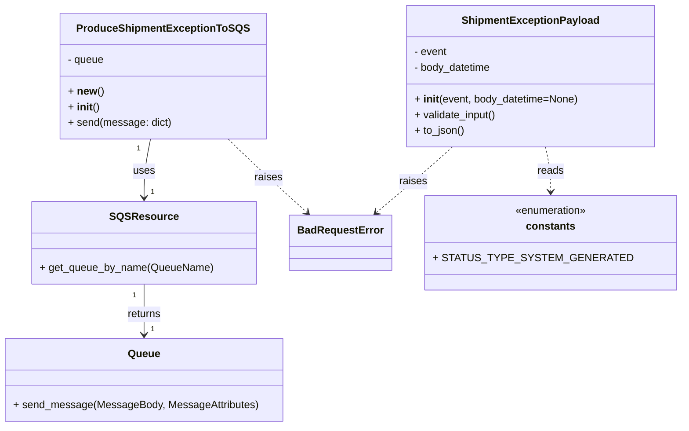

# Diagram: shipment_core/shipment_service/shipment_service/shipment_exception/ProduceShipmentExceptionToSQS.py


> Auto-generated by Obscura crawlers

## Diagram 1



### SVG

<svg id="container" width="977.44140625" xmlns="http://www.w3.org/2000/svg" class="classDiagram" height="650" viewBox="0 0 977.44140625 650" role="graphics-document document" aria-roledescription="class"><style>#container{font-family:"trebuchet ms",verdana,arial,sans-serif;font-size:16px;fill:#333;}@keyframes edge-animation-frame{from{stroke-dashoffset:0;}}@keyframes dash{to{stroke-dashoffset:0;}}#container .edge-animation-slow{stroke-dasharray:9,5!important;stroke-dashoffset:900;animation:dash 50s linear infinite;stroke-linecap:round;}#container .edge-animation-fast{stroke-dasharray:9,5!important;stroke-dashoffset:900;animation:dash 20s linear infinite;stroke-linecap:round;}#container .error-icon{fill:#552222;}#container .error-text{fill:#552222;stroke:#552222;}#container .edge-thickness-normal{stroke-width:1px;}#container .edge-thickness-thick{stroke-width:3.5px;}#container .edge-pattern-solid{stroke-dasharray:0;}#container .edge-thickness-invisible{stroke-width:0;fill:none;}#container .edge-pattern-dashed{stroke-dasharray:3;}#container .edge-pattern-dotted{stroke-dasharray:2;}#container .marker{fill:#333333;stroke:#333333;}#container .marker.cross{stroke:#333333;}#container svg{font-family:"trebuchet ms",verdana,arial,sans-serif;font-size:16px;}#container p{margin:0;}#container g.classGroup text{fill:#9370DB;stroke:none;font-family:"trebuchet ms",verdana,arial,sans-serif;font-size:10px;}#container g.classGroup text .title{font-weight:bolder;}#container .nodeLabel,#container .edgeLabel{color:#131300;}#container .edgeLabel .label rect{fill:#ECECFF;}#container .label text{fill:#131300;}#container .labelBkg{background:#ECECFF;}#container .edgeLabel .label span{background:#ECECFF;}#container .classTitle{font-weight:bolder;}#container .node rect,#container .node circle,#container .node ellipse,#container .node polygon,#container .node path{fill:#ECECFF;stroke:#9370DB;stroke-width:1px;}#container .divider{stroke:#9370DB;stroke-width:1;}#container g.clickable{cursor:pointer;}#container g.classGroup rect{fill:#ECECFF;stroke:#9370DB;}#container g.classGroup line{stroke:#9370DB;stroke-width:1;}#container .classLabel .box{stroke:none;stroke-width:0;fill:#ECECFF;opacity:0.5;}#container .classLabel .label{fill:#9370DB;font-size:10px;}#container .relation{stroke:#333333;stroke-width:1;fill:none;}#container .dashed-line{stroke-dasharray:3;}#container .dotted-line{stroke-dasharray:1 2;}#container #compositionStart,#container .composition{fill:#333333!important;stroke:#333333!important;stroke-width:1;}#container #compositionEnd,#container .composition{fill:#333333!important;stroke:#333333!important;stroke-width:1;}#container #dependencyStart,#container .dependency{fill:#333333!important;stroke:#333333!important;stroke-width:1;}#container #dependencyStart,#container .dependency{fill:#333333!important;stroke:#333333!important;stroke-width:1;}#container #extensionStart,#container .extension{fill:transparent!important;stroke:#333333!important;stroke-width:1;}#container #extensionEnd,#container .extension{fill:transparent!important;stroke:#333333!important;stroke-width:1;}#container #aggregationStart,#container .aggregation{fill:transparent!important;stroke:#333333!important;stroke-width:1;}#container #aggregationEnd,#container .aggregation{fill:transparent!important;stroke:#333333!important;stroke-width:1;}#container #lollipopStart,#container .lollipop{fill:#ECECFF!important;stroke:#333333!important;stroke-width:1;}#container #lollipopEnd,#container .lollipop{fill:#ECECFF!important;stroke:#333333!important;stroke-width:1;}#container .edgeTerminals{font-size:11px;line-height:initial;}#container .classTitleText{text-anchor:middle;font-size:18px;fill:#333;}#container .label-icon{display:inline-block;height:1em;overflow:visible;vertical-align:-0.125em;}#container .node .label-icon path{fill:currentColor;stroke:revert;stroke-width:revert;}#container :root{--mermaid-font-family:"trebuchet ms",verdana,arial,sans-serif;}</style><g><defs><marker id="container_class-aggregationStart" class="marker aggregation class" refX="18" refY="7" markerWidth="190" markerHeight="240" orient="auto"><path d="M 18,7 L9,13 L1,7 L9,1 Z"></path></marker></defs><defs><marker id="container_class-aggregationEnd" class="marker aggregation class" refX="1" refY="7" markerWidth="20" markerHeight="28" orient="auto"><path d="M 18,7 L9,13 L1,7 L9,1 Z"></path></marker></defs><defs><marker id="container_class-extensionStart" class="marker extension class" refX="18" refY="7" markerWidth="190" markerHeight="240" orient="auto"><path d="M 1,7 L18,13 V 1 Z"></path></marker></defs><defs><marker id="container_class-extensionEnd" class="marker extension class" refX="1" refY="7" markerWidth="20" markerHeight="28" orient="auto"><path d="M 1,1 V 13 L18,7 Z"></path></marker></defs><defs><marker id="container_class-compositionStart" class="marker composition class" refX="18" refY="7" markerWidth="190" markerHeight="240" orient="auto"><path d="M 18,7 L9,13 L1,7 L9,1 Z"></path></marker></defs><defs><marker id="container_class-compositionEnd" class="marker composition class" refX="1" refY="7" markerWidth="20" markerHeight="28" orient="auto"><path d="M 18,7 L9,13 L1,7 L9,1 Z"></path></marker></defs><defs><marker id="container_class-dependencyStart" class="marker dependency class" refX="6" refY="7" markerWidth="190" markerHeight="240" orient="auto"><path d="M 5,7 L9,13 L1,7 L9,1 Z"></path></marker></defs><defs><marker id="container_class-dependencyEnd" class="marker dependency class" refX="13" refY="7" markerWidth="20" markerHeight="28" orient="auto"><path d="M 18,7 L9,13 L14,7 L9,1 Z"></path></marker></defs><defs><marker id="container_class-lollipopStart" class="marker lollipop class" refX="13" refY="7" markerWidth="190" markerHeight="240" orient="auto"><circle stroke="black" fill="transparent" cx="7" cy="7" r="6"></circle></marker></defs><defs><marker id="container_class-lollipopEnd" class="marker lollipop class" refX="1" refY="7" markerWidth="190" markerHeight="240" orient="auto"><circle stroke="black" fill="transparent" cx="7" cy="7" r="6"></circle></marker></defs><g class="root"><g class="clusters"></g><g class="edgePaths"><path d="M224.799,212L223.173,220.167C221.547,228.333,218.295,244.667,216.669,259.5C215.043,274.333,215.043,287.667,215.043,294.333L215.043,301" id="id_ProduceShipmentExceptionToSQS_SQSResource_1" class="edge-thickness-normal edge-pattern-solid relation" style=";;;" data-edge="true" data-et="edge" data-id="id_ProduceShipmentExceptionToSQS_SQSResource_1" data-points="W3sieCI6MjI0Ljc5OTQwNzMyNzU4NjIsInkiOjIxMn0seyJ4IjoyMTUuMDQyOTY4NzUsInkiOjI2MX0seyJ4IjoyMTUuMDQyOTY4NzUsInkiOjMwN31d" marker-end="url(#container_class-dependencyEnd)"></path><path d="M215.043,433L215.043,440.667C215.043,448.333,215.043,463.667,215.043,476.5C215.043,489.333,215.043,499.667,215.043,504.833L215.043,510" id="id_SQSResource_Queue_2" class="edge-thickness-normal edge-pattern-solid relation" style=";;;" data-edge="true" data-et="edge" data-id="id_SQSResource_Queue_2" data-points="W3sieCI6MjE1LjA0Mjk2ODc1LCJ5Ijo0MzN9LHsieCI6MjE1LjA0Mjk2ODc1LCJ5Ijo0Nzl9LHsieCI6MjE1LjA0Mjk2ODc1LCJ5Ijo1MTZ9XQ==" marker-end="url(#container_class-dependencyEnd)"></path><path d="M340.292,212L348.49,220.167C356.689,228.333,373.087,244.667,392.51,263.317C411.934,281.968,434.383,302.936,445.607,313.42L456.832,323.904" id="id_ProduceShipmentExceptionToSQS_BadRequestError_3" class="edge-thickness-normal edge-pattern-dashed relation" style=";;;" data-edge="true" data-et="edge" data-id="id_ProduceShipmentExceptionToSQS_BadRequestError_3" data-points="W3sieCI6MzQwLjI5MTY0ODcwNjg5NjYsInkiOjIxMn0seyJ4IjozODkuNDg0Mzc1LCJ5IjoyNjF9LHsieCI6NDYxLjIxNjkyMjMwNTA0NTg0LCJ5IjozMjh9XQ==" marker-end="url(#container_class-dependencyEnd)"></path><path d="M659.92,224L653.674,230.167C647.427,236.333,634.933,248.667,617.506,265.316C600.078,281.965,577.717,302.931,566.537,313.413L555.356,323.896" id="id_ShipmentExceptionPayload_BadRequestError_4" class="edge-thickness-normal edge-pattern-dashed relation" style=";;;" data-edge="true" data-et="edge" data-id="id_ShipmentExceptionPayload_BadRequestError_4" data-points="W3sieCI6NjU5LjkyMDM5MzMxODk2NTYsInkiOjIyNH0seyJ4Ijo2MjIuNDM5NDUzMTI1LCJ5IjoyNjF9LHsieCI6NTUwLjk3OTQyOTQ3MjQ3NywieSI6MzI4fV0=" marker-end="url(#container_class-dependencyEnd)"></path><path d="M792.137,224L793.44,230.167C794.743,236.333,797.348,248.667,798.651,260C799.953,271.333,799.953,281.667,799.953,286.833L799.953,292" id="id_ShipmentExceptionPayload_constants_5" class="edge-thickness-normal edge-pattern-dashed relation" style=";;;" data-edge="true" data-et="edge" data-id="id_ShipmentExceptionPayload_constants_5" data-points="W3sieCI6NzkyLjEzNzQ3MzA2MDM0NDksInkiOjIyNH0seyJ4Ijo3OTkuOTUzMTI1LCJ5IjoyNjF9LHsieCI6Nzk5Ljk1MzEyNSwieSI6Mjk4fV0=" marker-end="url(#container_class-dependencyEnd)"></path></g><g class="edgeLabels"><g class="edgeLabel" transform="translate(215.04296875, 261)"><g class="label" data-id="id_ProduceShipmentExceptionToSQS_SQSResource_1" transform="translate(-16.4921875, -12)"><foreignObject width="32.984375" height="24"><div xmlns="http://www.w3.org/1999/xhtml" class="labelBkg" style="display: table-cell; white-space: nowrap; line-height: 1.5; max-width: 200px; text-align: center;"><span class="edgeLabel"><p>uses</p></span></div></foreignObject></g></g><g class="edgeLabel" transform="translate(215.04296875, 479)"><g class="label" data-id="id_SQSResource_Queue_2" transform="translate(-26.265625, -12)"><foreignObject width="52.53125" height="24"><div xmlns="http://www.w3.org/1999/xhtml" class="labelBkg" style="display: table-cell; white-space: nowrap; line-height: 1.5; max-width: 200px; text-align: center;"><span class="edgeLabel"><p>returns</p></span></div></foreignObject></g></g><g class="edgeLabel" transform="translate(399.97977, 270.80296)"><g class="label" data-id="id_ProduceShipmentExceptionToSQS_BadRequestError_3" transform="translate(-21.25, -12)"><foreignObject width="42.5" height="24"><div xmlns="http://www.w3.org/1999/xhtml" class="labelBkg" style="display: table-cell; white-space: nowrap; line-height: 1.5; max-width: 200px; text-align: center;"><span class="edgeLabel"><p>raises</p></span></div></foreignObject></g></g><g class="edgeLabel" transform="translate(605.9199, 276.48852)"><g class="label" data-id="id_ShipmentExceptionPayload_BadRequestError_4" transform="translate(-21.25, -12)"><foreignObject width="42.5" height="24"><div xmlns="http://www.w3.org/1999/xhtml" class="labelBkg" style="display: table-cell; white-space: nowrap; line-height: 1.5; max-width: 200px; text-align: center;"><span class="edgeLabel"><p>raises</p></span></div></foreignObject></g></g><g class="edgeLabel" transform="translate(799.953125, 261)"><g class="label" data-id="id_ShipmentExceptionPayload_constants_5" transform="translate(-20.0078125, -12)"><foreignObject width="40.015625" height="24"><div xmlns="http://www.w3.org/1999/xhtml" class="labelBkg" style="display: table-cell; white-space: nowrap; line-height: 1.5; max-width: 200px; text-align: center;"><span class="edgeLabel"><p>reads</p></span></div></foreignObject></g></g><g class="edgeTerminals" transform="translate(206.67082862980965, 226.233925424268)"><g class="inner" transform="translate(0, 0)"><foreignObject style="width: 9px; height: 12px;"><div xmlns="http://www.w3.org/1999/xhtml" style="display: inline-block; padding-right: 1px; white-space: nowrap;"><span class="edgeLabel">1</span></div></foreignObject></g></g><g class="edgeTerminals" transform="translate(200.04296937499998, 450.50000053571426)"><g class="inner" transform="translate(0, 0)"><foreignObject style="width: 9px; height: 12px;"><div xmlns="http://www.w3.org/1999/xhtml" style="display: inline-block; padding-right: 1px; white-space: nowrap;"><span class="edgeLabel">1</span></div></foreignObject></g></g><g class="edgeTerminals" transform="translate(225.04296937499998, 284.50000053571426)"><g class="inner" transform="translate(0, 0)"></g><foreignObject style="width: 9px; height: 12px;"><div xmlns="http://www.w3.org/1999/xhtml" style="display: inline-block; padding-right: 1px; white-space: nowrap;"><span class="edgeLabel">1</span></div></foreignObject></g><g class="edgeTerminals" transform="translate(225.04296937499998, 493.50000053571426)"><g class="inner" transform="translate(0, 0)"></g><foreignObject style="width: 9px; height: 12px;"><div xmlns="http://www.w3.org/1999/xhtml" style="display: inline-block; padding-right: 1px; white-space: nowrap;"><span class="edgeLabel">1</span></div></foreignObject></g></g><g class="nodes"><g class="node default" id="classId-ProduceShipmentExceptionToSQS-0" transform="translate(243.9140625, 116)"><g class="basic label-container"><path d="M-151.73828125 -96 L151.73828125 -96 L151.73828125 96 L-151.73828125 96" stroke="none" stroke-width="0" fill="#ECECFF" style=""></path><path d="M-151.73828125 -96 C-55.02348309352436 -96, 41.691315062951276 -96, 151.73828125 -96 M-151.73828125 -96 C-51.539820599115956 -96, 48.65864005176809 -96, 151.73828125 -96 M151.73828125 -96 C151.73828125 -25.889442893925477, 151.73828125 44.22111421214905, 151.73828125 96 M151.73828125 -96 C151.73828125 -28.168816085313765, 151.73828125 39.66236782937247, 151.73828125 96 M151.73828125 96 C79.72790734680223 96, 7.717533443604452 96, -151.73828125 96 M151.73828125 96 C33.47985144963944 96, -84.77857835072112 96, -151.73828125 96 M-151.73828125 96 C-151.73828125 38.840760399376656, -151.73828125 -18.31847920124669, -151.73828125 -96 M-151.73828125 96 C-151.73828125 22.807693778753205, -151.73828125 -50.38461244249359, -151.73828125 -96" stroke="#9370DB" stroke-width="1.3" fill="none" stroke-dasharray="0 0" style=""></path></g><g class="annotation-group text" transform="translate(0, -72)"></g><g class="label-group text" transform="translate(-123.7734375, -72)"><g class="label" style="font-weight: bolder" transform="translate(0,-12)"><foreignObject width="247.546875" height="24"><div xmlns="http://www.w3.org/1999/xhtml" style="display: table-cell; white-space: nowrap; line-height: 1.5; max-width: 295px; text-align: center;"><span class="nodeLabel markdown-node-label" style=""><p>ProduceShipmentExceptionToSQS</p></span></div></foreignObject></g></g><g class="members-group text" transform="translate(-139.73828125, -24)"><g class="label" style="" transform="translate(0,-12)"><foreignObject width="56.328125" height="24"><div xmlns="http://www.w3.org/1999/xhtml" style="display: table-cell; white-space: nowrap; line-height: 1.5; max-width: 114px; text-align: center;"><span class="nodeLabel markdown-node-label" style=""><p>- queue</p></span></div></foreignObject></g></g><g class="methods-group text" transform="translate(-139.73828125, 24)"><g class="label" style="" transform="translate(0,-12)"><foreignObject width="52.671875" height="24"><div xmlns="http://www.w3.org/1999/xhtml" style="display: table-cell; white-space: nowrap; line-height: 1.5; max-width: 142px; text-align: center;"><span class="nodeLabel markdown-node-label" style=""><p>+ <strong>new</strong>()</p></span></div></foreignObject></g><g class="label" style="" transform="translate(0,12)"><foreignObject width="47.046875" height="24"><div xmlns="http://www.w3.org/1999/xhtml" style="display: table-cell; white-space: nowrap; line-height: 1.5; max-width: 137px; text-align: center;"><span class="nodeLabel markdown-node-label" style=""><p>+ <strong>init</strong>()</p></span></div></foreignObject></g><g class="label" style="" transform="translate(0,36)"><foreignObject width="155.703125" height="24"><div xmlns="http://www.w3.org/1999/xhtml" style="display: table-cell; white-space: nowrap; line-height: 1.5; max-width: 213px; text-align: center;"><span class="nodeLabel markdown-node-label" style=""><p>+ send(message: dict)</p></span></div></foreignObject></g></g><g class="divider" style=""><path d="M-151.73828125 -48 C-46.64210835516427 -48, 58.454064539671464 -48, 151.73828125 -48 M-151.73828125 -48 C-62.851185201541966 -48, 26.035910846916067 -48, 151.73828125 -48" stroke="#9370DB" stroke-width="1.3" fill="none" stroke-dasharray="0 0" style=""></path></g><g class="divider" style=""><path d="M-151.73828125 0 C-31.10777944428351 0, 89.52272236143298 0, 151.73828125 0 M-151.73828125 0 C-48.124334345441326 0, 55.48961255911735 0, 151.73828125 0" stroke="#9370DB" stroke-width="1.3" fill="none" stroke-dasharray="0 0" style=""></path></g></g><g class="node default" id="classId-ShipmentExceptionPayload-1" transform="translate(769.32421875, 116)"><g class="basic label-container"><path d="M-187.33203125 -108 L187.33203125 -108 L187.33203125 108 L-187.33203125 108" stroke="none" stroke-width="0" fill="#ECECFF" style=""></path><path d="M-187.33203125 -108 C-37.73026274239223 -108, 111.87150576521555 -108, 187.33203125 -108 M-187.33203125 -108 C-58.32118222248258 -108, 70.68966680503485 -108, 187.33203125 -108 M187.33203125 -108 C187.33203125 -50.46890381063041, 187.33203125 7.062192378739184, 187.33203125 108 M187.33203125 -108 C187.33203125 -25.473156927943023, 187.33203125 57.053686144113954, 187.33203125 108 M187.33203125 108 C56.35318372037125 108, -74.6256638092575 108, -187.33203125 108 M187.33203125 108 C37.51653090640025 108, -112.2989694371995 108, -187.33203125 108 M-187.33203125 108 C-187.33203125 50.999526238009466, -187.33203125 -6.000947523981068, -187.33203125 -108 M-187.33203125 108 C-187.33203125 45.92896112947742, -187.33203125 -16.142077741045156, -187.33203125 -108" stroke="#9370DB" stroke-width="1.3" fill="none" stroke-dasharray="0 0" style=""></path></g><g class="annotation-group text" transform="translate(0, -84)"></g><g class="label-group text" transform="translate(-99.7109375, -84)"><g class="label" style="font-weight: bolder" transform="translate(0,-12)"><foreignObject width="199.421875" height="24"><div xmlns="http://www.w3.org/1999/xhtml" style="display: table-cell; white-space: nowrap; line-height: 1.5; max-width: 247px; text-align: center;"><span class="nodeLabel markdown-node-label" style=""><p>ShipmentExceptionPayload</p></span></div></foreignObject></g></g><g class="members-group text" transform="translate(-175.33203125, -36)"><g class="label" style="" transform="translate(0,-12)"><foreignObject width="51.03125" height="24"><div xmlns="http://www.w3.org/1999/xhtml" style="display: table-cell; white-space: nowrap; line-height: 1.5; max-width: 109px; text-align: center;"><span class="nodeLabel markdown-node-label" style=""><p>- event</p></span></div></foreignObject></g><g class="label" style="" transform="translate(0,12)"><foreignObject width="119.75" height="24"><div xmlns="http://www.w3.org/1999/xhtml" style="display: table-cell; white-space: nowrap; line-height: 1.5; max-width: 177px; text-align: center;"><span class="nodeLabel markdown-node-label" style=""><p>- body_datetime</p></span></div></foreignObject></g></g><g class="methods-group text" transform="translate(-175.33203125, 36)"><g class="label" style="" transform="translate(0,-12)"><foreignObject width="250.953125" height="24"><div xmlns="http://www.w3.org/1999/xhtml" style="display: table-cell; white-space: nowrap; line-height: 1.5; max-width: 341px; text-align: center;"><span class="nodeLabel markdown-node-label" style=""><p>+ <strong>init</strong>(event, body_datetime=None)</p></span></div></foreignObject></g><g class="label" style="" transform="translate(0,12)"><foreignObject width="126.96875" height="24"><div xmlns="http://www.w3.org/1999/xhtml" style="display: table-cell; white-space: nowrap; line-height: 1.5; max-width: 184px; text-align: center;"><span class="nodeLabel markdown-node-label" style=""><p>+ validate_input()</p></span></div></foreignObject></g><g class="label" style="" transform="translate(0,36)"><foreignObject width="76.734375" height="24"><div xmlns="http://www.w3.org/1999/xhtml" style="display: table-cell; white-space: nowrap; line-height: 1.5; max-width: 134px; text-align: center;"><span class="nodeLabel markdown-node-label" style=""><p>+ to_json()</p></span></div></foreignObject></g></g><g class="divider" style=""><path d="M-187.33203125 -60 C-104.21021550434118 -60, -21.088399758682357 -60, 187.33203125 -60 M-187.33203125 -60 C-92.09755007480601 -60, 3.136931100387983 -60, 187.33203125 -60" stroke="#9370DB" stroke-width="1.3" fill="none" stroke-dasharray="0 0" style=""></path></g><g class="divider" style=""><path d="M-187.33203125 12 C-56.88111057508226 12, 73.56981009983548 12, 187.33203125 12 M-187.33203125 12 C-50.218182722407334 12, 86.89566580518533 12, 187.33203125 12" stroke="#9370DB" stroke-width="1.3" fill="none" stroke-dasharray="0 0" style=""></path></g></g><g class="node default" id="classId-SQSResource-2" transform="translate(215.04296875, 370)"><g class="basic label-container"><path d="M-166.859375 -63 L166.859375 -63 L166.859375 63 L-166.859375 63" stroke="none" stroke-width="0" fill="#ECECFF" style=""></path><path d="M-166.859375 -63 C-62.43135596508873 -63, 41.996663069822546 -63, 166.859375 -63 M-166.859375 -63 C-81.1487625157672 -63, 4.561849968465594 -63, 166.859375 -63 M166.859375 -63 C166.859375 -35.78051631578009, 166.859375 -8.561032631560188, 166.859375 63 M166.859375 -63 C166.859375 -18.256792025657724, 166.859375 26.486415948684552, 166.859375 63 M166.859375 63 C90.47293688537701 63, 14.08649877075402 63, -166.859375 63 M166.859375 63 C75.89580903970402 63, -15.067756920591961 63, -166.859375 63 M-166.859375 63 C-166.859375 21.729412217966164, -166.859375 -19.54117556406767, -166.859375 -63 M-166.859375 63 C-166.859375 30.405379087183995, -166.859375 -2.18924182563201, -166.859375 -63" stroke="#9370DB" stroke-width="1.3" fill="none" stroke-dasharray="0 0" style=""></path></g><g class="annotation-group text" transform="translate(0, -39)"></g><g class="label-group text" transform="translate(-48.078125, -39)"><g class="label" style="font-weight: bolder" transform="translate(0,-12)"><foreignObject width="96.15625" height="24"><div xmlns="http://www.w3.org/1999/xhtml" style="display: table-cell; white-space: nowrap; line-height: 1.5; max-width: 145px; text-align: center;"><span class="nodeLabel markdown-node-label" style=""><p>SQSResource</p></span></div></foreignObject></g></g><g class="members-group text" transform="translate(-154.859375, 9)"></g><g class="methods-group text" transform="translate(-154.859375, 39)"><g class="label" style="" transform="translate(0,-12)"><foreignObject width="261.640625" height="24"><div xmlns="http://www.w3.org/1999/xhtml" style="display: table-cell; white-space: nowrap; line-height: 1.5; max-width: 319px; text-align: center;"><span class="nodeLabel markdown-node-label" style=""><p>+ get_queue_by_name(QueueName)</p></span></div></foreignObject></g></g><g class="divider" style=""><path d="M-166.859375 -15 C-88.81314833617472 -15, -10.76692167234944 -15, 166.859375 -15 M-166.859375 -15 C-46.20997862130449 -15, 74.43941775739103 -15, 166.859375 -15" stroke="#9370DB" stroke-width="1.3" fill="none" stroke-dasharray="0 0" style=""></path></g><g class="divider" style=""><path d="M-166.859375 9 C-86.19251906367076 9, -5.525663127341517 9, 166.859375 9 M-166.859375 9 C-73.58406849916042 9, 19.691238001679153 9, 166.859375 9" stroke="#9370DB" stroke-width="1.3" fill="none" stroke-dasharray="0 0" style=""></path></g></g><g class="node default" id="classId-Queue-3" transform="translate(215.04296875, 579)"><g class="basic label-container"><path d="M-207.04296875 -63 L207.04296875 -63 L207.04296875 63 L-207.04296875 63" stroke="none" stroke-width="0" fill="#ECECFF" style=""></path><path d="M-207.04296875 -63 C-106.2374390791717 -63, -5.431909408343387 -63, 207.04296875 -63 M-207.04296875 -63 C-49.42868565785838 -63, 108.18559743428324 -63, 207.04296875 -63 M207.04296875 -63 C207.04296875 -29.548835251072873, 207.04296875 3.9023294978542538, 207.04296875 63 M207.04296875 -63 C207.04296875 -29.88938116816469, 207.04296875 3.221237663670621, 207.04296875 63 M207.04296875 63 C95.30850981772407 63, -16.425949114551855 63, -207.04296875 63 M207.04296875 63 C109.25221405309975 63, 11.461459356199498 63, -207.04296875 63 M-207.04296875 63 C-207.04296875 31.504746761308656, -207.04296875 0.009493522617312067, -207.04296875 -63 M-207.04296875 63 C-207.04296875 35.814394429816126, -207.04296875 8.628788859632252, -207.04296875 -63" stroke="#9370DB" stroke-width="1.3" fill="none" stroke-dasharray="0 0" style=""></path></g><g class="annotation-group text" transform="translate(0, -39)"></g><g class="label-group text" transform="translate(-23.5078125, -39)"><g class="label" style="font-weight: bolder" transform="translate(0,-12)"><foreignObject width="47.015625" height="24"><div xmlns="http://www.w3.org/1999/xhtml" style="display: table-cell; white-space: nowrap; line-height: 1.5; max-width: 97px; text-align: center;"><span class="nodeLabel markdown-node-label" style=""><p>Queue</p></span></div></foreignObject></g></g><g class="members-group text" transform="translate(-195.04296875, 9)"></g><g class="methods-group text" transform="translate(-195.04296875, 39)"><g class="label" style="" transform="translate(0,-12)"><foreignObject width="366.578125" height="24"><div xmlns="http://www.w3.org/1999/xhtml" style="display: table-cell; white-space: nowrap; line-height: 1.5; max-width: 424px; text-align: center;"><span class="nodeLabel markdown-node-label" style=""><p>+ send_message(MessageBody, MessageAttributes)</p></span></div></foreignObject></g></g><g class="divider" style=""><path d="M-207.04296875 -15 C-80.54885200716366 -15, 45.94526473567268 -15, 207.04296875 -15 M-207.04296875 -15 C-44.38220121581878 -15, 118.27856631836244 -15, 207.04296875 -15" stroke="#9370DB" stroke-width="1.3" fill="none" stroke-dasharray="0 0" style=""></path></g><g class="divider" style=""><path d="M-207.04296875 9 C-111.59086421434681 9, -16.138759678693617 9, 207.04296875 9 M-207.04296875 9 C-83.54766018441426 9, 39.94764838117149 9, 207.04296875 9" stroke="#9370DB" stroke-width="1.3" fill="none" stroke-dasharray="0 0" style=""></path></g></g><g class="node default" id="classId-BadRequestError-4" transform="translate(506.18359375, 370)"><g class="basic label-container"><path d="M-74.28125 -42 L74.28125 -42 L74.28125 42 L-74.28125 42" stroke="none" stroke-width="0" fill="#ECECFF" style=""></path><path d="M-74.28125 -42 C-32.53559434510154 -42, 9.210061309796913 -42, 74.28125 -42 M-74.28125 -42 C-34.80739141218008 -42, 4.666467175639838 -42, 74.28125 -42 M74.28125 -42 C74.28125 -24.529034809565314, 74.28125 -7.058069619130627, 74.28125 42 M74.28125 -42 C74.28125 -12.444404063724331, 74.28125 17.111191872551338, 74.28125 42 M74.28125 42 C15.32868136064451 42, -43.62388727871098 42, -74.28125 42 M74.28125 42 C32.35273084995113 42, -9.575788300097742 42, -74.28125 42 M-74.28125 42 C-74.28125 19.81762198304373, -74.28125 -2.364756033912542, -74.28125 -42 M-74.28125 42 C-74.28125 10.356162307990328, -74.28125 -21.287675384019344, -74.28125 -42" stroke="#9370DB" stroke-width="1.3" fill="none" stroke-dasharray="0 0" style=""></path></g><g class="annotation-group text" transform="translate(0, -18)"></g><g class="label-group text" transform="translate(-62.28125, -18)"><g class="label" style="font-weight: bolder" transform="translate(0,-12)"><foreignObject width="124.5625" height="24"><div xmlns="http://www.w3.org/1999/xhtml" style="display: table-cell; white-space: nowrap; line-height: 1.5; max-width: 174px; text-align: center;"><span class="nodeLabel markdown-node-label" style=""><p>BadRequestError</p></span></div></foreignObject></g></g><g class="members-group text" transform="translate(-62.28125, 30)"></g><g class="methods-group text" transform="translate(-62.28125, 60)"></g><g class="divider" style=""><path d="M-74.28125 6 C-28.516224468247685 6, 17.24880106350463 6, 74.28125 6 M-74.28125 6 C-34.32370377162399 6, 5.633842456752021 6, 74.28125 6" stroke="#9370DB" stroke-width="1.3" fill="none" stroke-dasharray="0 0" style=""></path></g><g class="divider" style=""><path d="M-74.28125 24 C-21.931350179491517 24, 30.418549641016966 24, 74.28125 24 M-74.28125 24 C-17.833629385901006 24, 38.61399122819799 24, 74.28125 24" stroke="#9370DB" stroke-width="1.3" fill="none" stroke-dasharray="0 0" style=""></path></g></g><g class="node default" id="classId-constants-5" transform="translate(799.953125, 370)"><g class="basic label-container"><path d="M-169.48828125 -72 L169.48828125 -72 L169.48828125 72 L-169.48828125 72" stroke="none" stroke-width="0" fill="#ECECFF" style=""></path><path d="M-169.48828125 -72 C-35.27223241558477 -72, 98.94381641883047 -72, 169.48828125 -72 M-169.48828125 -72 C-96.05219589420629 -72, -22.616110538412585 -72, 169.48828125 -72 M169.48828125 -72 C169.48828125 -24.167232432806202, 169.48828125 23.665535134387596, 169.48828125 72 M169.48828125 -72 C169.48828125 -17.68333286416636, 169.48828125 36.63333427166728, 169.48828125 72 M169.48828125 72 C98.1880375381168 72, 26.887793826233604 72, -169.48828125 72 M169.48828125 72 C82.07627098095064 72, -5.335739288098722 72, -169.48828125 72 M-169.48828125 72 C-169.48828125 34.13647313500477, -169.48828125 -3.727053729990459, -169.48828125 -72 M-169.48828125 72 C-169.48828125 32.30338287646538, -169.48828125 -7.393234247069245, -169.48828125 -72" stroke="#9370DB" stroke-width="1.3" fill="none" stroke-dasharray="0 0" style=""></path></g><g class="annotation-group text" transform="translate(-55.5546875, -48)"><g class="label" style="" transform="translate(0,-12)"><foreignObject width="111.109375" height="24"><div xmlns="http://www.w3.org/1999/xhtml" style="display: table-cell; white-space: nowrap; line-height: 1.5; max-width: 161px; text-align: center;"><span class="nodeLabel markdown-node-label" style=""><p>«enumeration»</p></span></div></foreignObject></g></g><g class="label-group text" transform="translate(-35.7734375, -24)"><g class="label" style="font-weight: bolder" transform="translate(0,-12)"><foreignObject width="71.546875" height="24"><div xmlns="http://www.w3.org/1999/xhtml" style="display: table-cell; white-space: nowrap; line-height: 1.5; max-width: 121px; text-align: center;"><span class="nodeLabel markdown-node-label" style=""><p>constants</p></span></div></foreignObject></g></g><g class="members-group text" transform="translate(-157.48828125, 24)"><g class="label" style="" transform="translate(0,-12)"><foreignObject width="259.421875" height="24"><div xmlns="http://www.w3.org/1999/xhtml" style="display: table-cell; white-space: nowrap; line-height: 1.5; max-width: 317px; text-align: center;"><span class="nodeLabel markdown-node-label" style=""><p>+ STATUS_TYPE_SYSTEM_GENERATED</p></span></div></foreignObject></g></g><g class="methods-group text" transform="translate(-157.48828125, 72)"></g><g class="divider" style=""><path d="M-169.48828125 0 C-69.95350265726165 0, 29.581275935476697 0, 169.48828125 0 M-169.48828125 0 C-88.81127343315944 0, -8.134265616318885 0, 169.48828125 0" stroke="#9370DB" stroke-width="1.3" fill="none" stroke-dasharray="0 0" style=""></path></g><g class="divider" style=""><path d="M-169.48828125 48 C-83.4122918331352 48, 2.6636975837296006 48, 169.48828125 48 M-169.48828125 48 C-99.56156117727491 48, -29.63484110454982 48, 169.48828125 48" stroke="#9370DB" stroke-width="1.3" fill="none" stroke-dasharray="0 0" style=""></path></g></g></g></g></g></svg>

## Diagram 2

```mermaid
sequenceDiagram
participant Client
participant Payload as ShipmentExceptionPayload
participant Producer as ProduceShipmentExceptionToSQS
participant SQS as AWS_SQS
participant FVError as fv.error.BadRequestError
Client->>Payload: create(event, body_datetime?)
Payload->>Payload: validate_input()
alt validation fails
Payload-->>Client: raise BadRequestError
else validation passes
Payload-->>Client: to_json() -> message
Client->>Producer: ProduceShipmentExceptionToSQS.send(message)
Producer->>Producer: check isinstance(message, dict)
alt not dict
Producer-->>FVError: raise BadRequestError
else dict
Producer->>SQS: send_message(MessageBody=json.dumps(message))
SQS-->>Producer: send_message response
Producer-->>Client: return / success
```

> SVG rendering failed for this diagram.
