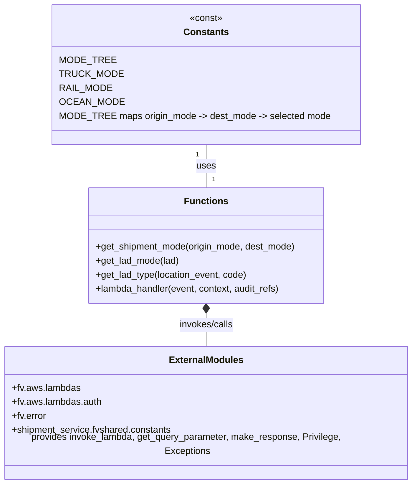

# Diagram: shipment_core/shipment_service/shipment_service/shipment_mode/shipment_mode.py


> Auto-generated by Obscura crawlers

## Diagram 1

```mermaid
flowchart LR
  Event["AWS Lambda Event"] -->|get_query_parameter origin| OriginCode[Origin Code]
  Event -->|get_query_parameter dest| DestCode[Dest Code]
  OriginCode --> CloneEvent1[deepcopy(event)]
  DestCode --> CloneEvent2[deepcopy(event)]
  CloneEvent1 --> GetOriginLAD[get_lad_type(origin_event, origin_code)]
  CloneEvent2 --> GetDestLAD[get_lad_type(dest_event, dest_code)]
  GetOriginLAD -->|returns canonical_name| OriginLAD[Origin LAD]
  GetDestLAD -->|returns canonical_name| DestLAD[Dest LAD]
  GetOriginLAD -->|statusCode != 200 / body empty| LADOriginError[Error: UnhandledException/BadRequestError]
  GetDestLAD -->|statusCode != 200 / body empty| LADDestError[Error: UnhandledException/BadRequestError]
  OriginLAD --> GetOriginMode[get_lad_mode(lad)]
  DestLAD --> GetDestMode[get_lad_mode(lad)]
  GetOriginMode --> OriginMode[Origin Mode]
  GetDestMode --> DestMode[Dest Mode]
  OriginMode --> DetermineShipment[get_shipment_mode(origin_mode, dest_mode)]
  DestMode --> DetermineShipment
  DetermineShipment --> MakeResponse[fv.aws.lambdas.make_response(shipment_mode)]
  MakeResponse --> Response["HTTP Response with shipment_mode"]
```

> SVG rendering failed for this diagram.

## Diagram 2



### SVG

<svg id="container" width="718.1875" xmlns="http://www.w3.org/2000/svg" class="classDiagram" height="818" viewBox="0 0 718.1875 818" role="graphics-document document" aria-roledescription="class"><style>#container{font-family:"trebuchet ms",verdana,arial,sans-serif;font-size:16px;fill:#333;}@keyframes edge-animation-frame{from{stroke-dashoffset:0;}}@keyframes dash{to{stroke-dashoffset:0;}}#container .edge-animation-slow{stroke-dasharray:9,5!important;stroke-dashoffset:900;animation:dash 50s linear infinite;stroke-linecap:round;}#container .edge-animation-fast{stroke-dasharray:9,5!important;stroke-dashoffset:900;animation:dash 20s linear infinite;stroke-linecap:round;}#container .error-icon{fill:#552222;}#container .error-text{fill:#552222;stroke:#552222;}#container .edge-thickness-normal{stroke-width:1px;}#container .edge-thickness-thick{stroke-width:3.5px;}#container .edge-pattern-solid{stroke-dasharray:0;}#container .edge-thickness-invisible{stroke-width:0;fill:none;}#container .edge-pattern-dashed{stroke-dasharray:3;}#container .edge-pattern-dotted{stroke-dasharray:2;}#container .marker{fill:#333333;stroke:#333333;}#container .marker.cross{stroke:#333333;}#container svg{font-family:"trebuchet ms",verdana,arial,sans-serif;font-size:16px;}#container p{margin:0;}#container g.classGroup text{fill:#9370DB;stroke:none;font-family:"trebuchet ms",verdana,arial,sans-serif;font-size:10px;}#container g.classGroup text .title{font-weight:bolder;}#container .nodeLabel,#container .edgeLabel{color:#131300;}#container .edgeLabel .label rect{fill:#ECECFF;}#container .label text{fill:#131300;}#container .labelBkg{background:#ECECFF;}#container .edgeLabel .label span{background:#ECECFF;}#container .classTitle{font-weight:bolder;}#container .node rect,#container .node circle,#container .node ellipse,#container .node polygon,#container .node path{fill:#ECECFF;stroke:#9370DB;stroke-width:1px;}#container .divider{stroke:#9370DB;stroke-width:1;}#container g.clickable{cursor:pointer;}#container g.classGroup rect{fill:#ECECFF;stroke:#9370DB;}#container g.classGroup line{stroke:#9370DB;stroke-width:1;}#container .classLabel .box{stroke:none;stroke-width:0;fill:#ECECFF;opacity:0.5;}#container .classLabel .label{fill:#9370DB;font-size:10px;}#container .relation{stroke:#333333;stroke-width:1;fill:none;}#container .dashed-line{stroke-dasharray:3;}#container .dotted-line{stroke-dasharray:1 2;}#container #compositionStart,#container .composition{fill:#333333!important;stroke:#333333!important;stroke-width:1;}#container #compositionEnd,#container .composition{fill:#333333!important;stroke:#333333!important;stroke-width:1;}#container #dependencyStart,#container .dependency{fill:#333333!important;stroke:#333333!important;stroke-width:1;}#container #dependencyStart,#container .dependency{fill:#333333!important;stroke:#333333!important;stroke-width:1;}#container #extensionStart,#container .extension{fill:transparent!important;stroke:#333333!important;stroke-width:1;}#container #extensionEnd,#container .extension{fill:transparent!important;stroke:#333333!important;stroke-width:1;}#container #aggregationStart,#container .aggregation{fill:transparent!important;stroke:#333333!important;stroke-width:1;}#container #aggregationEnd,#container .aggregation{fill:transparent!important;stroke:#333333!important;stroke-width:1;}#container #lollipopStart,#container .lollipop{fill:#ECECFF!important;stroke:#333333!important;stroke-width:1;}#container #lollipopEnd,#container .lollipop{fill:#ECECFF!important;stroke:#333333!important;stroke-width:1;}#container .edgeTerminals{font-size:11px;line-height:initial;}#container .classTitleText{text-anchor:middle;font-size:18px;fill:#333;}#container .label-icon{display:inline-block;height:1em;overflow:visible;vertical-align:-0.125em;}#container .node .label-icon path{fill:currentColor;stroke:revert;stroke-width:revert;}#container :root{--mermaid-font-family:"trebuchet ms",verdana,arial,sans-serif;}</style><g><defs><marker id="container_class-aggregationStart" class="marker aggregation class" refX="18" refY="7" markerWidth="190" markerHeight="240" orient="auto"><path d="M 18,7 L9,13 L1,7 L9,1 Z"></path></marker></defs><defs><marker id="container_class-aggregationEnd" class="marker aggregation class" refX="1" refY="7" markerWidth="20" markerHeight="28" orient="auto"><path d="M 18,7 L9,13 L1,7 L9,1 Z"></path></marker></defs><defs><marker id="container_class-extensionStart" class="marker extension class" refX="18" refY="7" markerWidth="190" markerHeight="240" orient="auto"><path d="M 1,7 L18,13 V 1 Z"></path></marker></defs><defs><marker id="container_class-extensionEnd" class="marker extension class" refX="1" refY="7" markerWidth="20" markerHeight="28" orient="auto"><path d="M 1,1 V 13 L18,7 Z"></path></marker></defs><defs><marker id="container_class-compositionStart" class="marker composition class" refX="18" refY="7" markerWidth="190" markerHeight="240" orient="auto"><path d="M 18,7 L9,13 L1,7 L9,1 Z"></path></marker></defs><defs><marker id="container_class-compositionEnd" class="marker composition class" refX="1" refY="7" markerWidth="20" markerHeight="28" orient="auto"><path d="M 18,7 L9,13 L1,7 L9,1 Z"></path></marker></defs><defs><marker id="container_class-dependencyStart" class="marker dependency class" refX="6" refY="7" markerWidth="190" markerHeight="240" orient="auto"><path d="M 5,7 L9,13 L1,7 L9,1 Z"></path></marker></defs><defs><marker id="container_class-dependencyEnd" class="marker dependency class" refX="13" refY="7" markerWidth="20" markerHeight="28" orient="auto"><path d="M 18,7 L9,13 L14,7 L9,1 Z"></path></marker></defs><defs><marker id="container_class-lollipopStart" class="marker lollipop class" refX="13" refY="7" markerWidth="190" markerHeight="240" orient="auto"><circle stroke="black" fill="transparent" cx="7" cy="7" r="6"></circle></marker></defs><defs><marker id="container_class-lollipopEnd" class="marker lollipop class" refX="1" refY="7" markerWidth="190" markerHeight="240" orient="auto"><circle stroke="black" fill="transparent" cx="7" cy="7" r="6"></circle></marker></defs><g class="root"><g class="clusters"></g><g class="edgePaths"><path d="M359.094,248L359.094,254.167C359.094,260.333,359.094,272.667,359.094,285C359.094,297.333,359.094,309.667,359.094,315.833L359.094,322" id="id_Constants_Functions_1" class="edge-thickness-normal edge-pattern-solid relation" style=";;;" data-edge="true" data-et="edge" data-id="id_Constants_Functions_1" data-points="W3sieCI6MzU5LjA5Mzc1LCJ5IjoyNDh9LHsieCI6MzU5LjA5Mzc1LCJ5IjoyODV9LHsieCI6MzU5LjA5Mzc1LCJ5IjozMjJ9XQ=="></path><path d="M359.094,537.25L359.094,540.542C359.094,543.833,359.094,550.417,359.094,559.875C359.094,569.333,359.094,581.667,359.094,587.833L359.094,594" id="id_Functions_ExternalModules_2" class="edge-thickness-normal edge-pattern-solid relation" style=";;;" data-edge="true" data-et="edge" data-id="id_Functions_ExternalModules_2" data-points="W3sieCI6MzU5LjA5Mzc1LCJ5Ijo1MjB9LHsieCI6MzU5LjA5Mzc1LCJ5Ijo1NTd9LHsieCI6MzU5LjA5Mzc1LCJ5Ijo1OTR9XQ==" marker-start="url(#container_class-compositionStart)"></path></g><g class="edgeLabels"><g class="edgeLabel" transform="translate(359.09375, 285)"><g class="label" data-id="id_Constants_Functions_1" transform="translate(-16.4921875, -12)"><foreignObject width="32.984375" height="24"><div xmlns="http://www.w3.org/1999/xhtml" class="labelBkg" style="display: table-cell; white-space: nowrap; line-height: 1.5; max-width: 200px; text-align: center;"><span class="edgeLabel"><p>uses</p></span></div></foreignObject></g></g><g class="edgeLabel" transform="translate(359.09375, 557)"><g class="label" data-id="id_Functions_ExternalModules_2" transform="translate(-47.7890625, -12)"><foreignObject width="95.578125" height="24"><div xmlns="http://www.w3.org/1999/xhtml" class="labelBkg" style="display: table-cell; white-space: nowrap; line-height: 1.5; max-width: 200px; text-align: center;"><span class="edgeLabel"><p>invokes/calls</p></span></div></foreignObject></g></g><g class="edgeTerminals" transform="translate(344.09375, 265.5)"><g class="inner" transform="translate(0, 0)"><foreignObject style="width: 9px; height: 12px;"><div xmlns="http://www.w3.org/1999/xhtml" style="display: inline-block; padding-right: 1px; white-space: nowrap;"><span class="edgeLabel">1</span></div></foreignObject></g></g><g class="edgeTerminals" transform="translate(369.09375, 299.5)"><g class="inner" transform="translate(0, 0)"></g><foreignObject style="width: 9px; height: 12px;"><div xmlns="http://www.w3.org/1999/xhtml" style="display: inline-block; padding-right: 1px; white-space: nowrap;"><span class="edgeLabel">1</span></div></foreignObject></g></g><g class="nodes"><g class="node default" id="classId-Constants-0" transform="translate(359.09375, 128)"><g class="basic label-container"><path d="M-259.38671875 -120 L259.38671875 -120 L259.38671875 120 L-259.38671875 120" stroke="none" stroke-width="0" fill="#ECECFF" style=""></path><path d="M-259.38671875 -120 C-130.994704307206 -120, -2.6026898644120138 -120, 259.38671875 -120 M-259.38671875 -120 C-117.72676984603459 -120, 23.93317905793083 -120, 259.38671875 -120 M259.38671875 -120 C259.38671875 -71.96725553135812, 259.38671875 -23.93451106271624, 259.38671875 120 M259.38671875 -120 C259.38671875 -71.52046100518609, 259.38671875 -23.040922010372185, 259.38671875 120 M259.38671875 120 C54.9373595885273 120, -149.5119995729454 120, -259.38671875 120 M259.38671875 120 C103.61066863848575 120, -52.1653814730285 120, -259.38671875 120 M-259.38671875 120 C-259.38671875 47.24628757906039, -259.38671875 -25.507424841879214, -259.38671875 -120 M-259.38671875 120 C-259.38671875 71.860202100278, -259.38671875 23.720404200556004, -259.38671875 -120" stroke="#9370DB" stroke-width="1.3" fill="none" stroke-dasharray="0 0" style=""></path></g><g class="annotation-group text" transform="translate(-28.6171875, -96)"><g class="label" style="" transform="translate(0,-12)"><foreignObject width="57.234375" height="24"><div xmlns="http://www.w3.org/1999/xhtml" style="display: table-cell; white-space: nowrap; line-height: 1.5; max-width: 107px; text-align: center;"><span class="nodeLabel markdown-node-label" style=""><p>«const»</p></span></div></foreignObject></g></g><g class="label-group text" transform="translate(-36.5390625, -72)"><g class="label" style="font-weight: bolder" transform="translate(0,-12)"><foreignObject width="73.078125" height="24"><div xmlns="http://www.w3.org/1999/xhtml" style="display: table-cell; white-space: nowrap; line-height: 1.5; max-width: 122px; text-align: center;"><span class="nodeLabel markdown-node-label" style=""><p>Constants</p></span></div></foreignObject></g></g><g class="members-group text" transform="translate(-247.38671875, -24)"><g class="label" style="" transform="translate(0,-12)"><foreignObject width="84.828125" height="24"><div xmlns="http://www.w3.org/1999/xhtml" style="display: table-cell; white-space: nowrap; line-height: 1.5; max-width: 135px; text-align: center;"><span class="nodeLabel markdown-node-label" style=""><p>MODE_TREE</p></span></div></foreignObject></g><g class="label" style="" transform="translate(0,12)"><foreignObject width="97.375" height="24"><div xmlns="http://www.w3.org/1999/xhtml" style="display: table-cell; white-space: nowrap; line-height: 1.5; max-width: 147px; text-align: center;"><span class="nodeLabel markdown-node-label" style=""><p>TRUCK_MODE</p></span></div></foreignObject></g><g class="label" style="" transform="translate(0,36)"><foreignObject width="82.09375" height="24"><div xmlns="http://www.w3.org/1999/xhtml" style="display: table-cell; white-space: nowrap; line-height: 1.5; max-width: 132px; text-align: center;"><span class="nodeLabel markdown-node-label" style=""><p>RAIL_MODE</p></span></div></foreignObject></g><g class="label" style="" transform="translate(0,60)"><foreignObject width="99.234375" height="24"><div xmlns="http://www.w3.org/1999/xhtml" style="display: table-cell; white-space: nowrap; line-height: 1.5; max-width: 149px; text-align: center;"><span class="nodeLabel markdown-node-label" style=""><p>OCEAN_MODE</p></span></div></foreignObject></g><g class="label" style="" transform="translate(0,84)"><foreignObject width="458.234375" height="24"><div xmlns="http://www.w3.org/1999/xhtml" style="display: table-cell; white-space: nowrap; line-height: 1.5; max-width: 551px; text-align: center;"><span class="nodeLabel markdown-node-label" style=""><p>MODE_TREE maps origin_mode -&gt; dest_mode -&gt; selected mode</p></span></div></foreignObject></g></g><g class="methods-group text" transform="translate(-247.38671875, 120)"></g><g class="divider" style=""><path d="M-259.38671875 -48 C-95.38396843383873 -48, 68.61878188232254 -48, 259.38671875 -48 M-259.38671875 -48 C-135.58176415998366 -48, -11.776809569967298 -48, 259.38671875 -48" stroke="#9370DB" stroke-width="1.3" fill="none" stroke-dasharray="0 0" style=""></path></g><g class="divider" style=""><path d="M-259.38671875 96 C-52.15444205197505 96, 155.0778346460499 96, 259.38671875 96 M-259.38671875 96 C-124.60240835866733 96, 10.181902032665334 96, 259.38671875 96" stroke="#9370DB" stroke-width="1.3" fill="none" stroke-dasharray="0 0" style=""></path></g></g><g class="node default" id="classId-Functions-1" transform="translate(359.09375, 421)"><g class="basic label-container"><path d="M-203.75390625 -99 L203.75390625 -99 L203.75390625 99 L-203.75390625 99" stroke="none" stroke-width="0" fill="#ECECFF" style=""></path><path d="M-203.75390625 -99 C-56.91236031390338 -99, 89.92918562219324 -99, 203.75390625 -99 M-203.75390625 -99 C-107.79489152885519 -99, -11.835876807710378 -99, 203.75390625 -99 M203.75390625 -99 C203.75390625 -30.45977993744735, 203.75390625 38.0804401251053, 203.75390625 99 M203.75390625 -99 C203.75390625 -42.964789539979066, 203.75390625 13.070420920041869, 203.75390625 99 M203.75390625 99 C44.5660832919439 99, -114.6217396661122 99, -203.75390625 99 M203.75390625 99 C81.14674369733851 99, -41.460418855322985 99, -203.75390625 99 M-203.75390625 99 C-203.75390625 50.146275500721664, -203.75390625 1.2925510014433286, -203.75390625 -99 M-203.75390625 99 C-203.75390625 53.37518039992211, -203.75390625 7.750360799844216, -203.75390625 -99" stroke="#9370DB" stroke-width="1.3" fill="none" stroke-dasharray="0 0" style=""></path></g><g class="annotation-group text" transform="translate(0, -75)"></g><g class="label-group text" transform="translate(-35.1328125, -75)"><g class="label" style="font-weight: bolder" transform="translate(0,-12)"><foreignObject width="70.265625" height="24"><div xmlns="http://www.w3.org/1999/xhtml" style="display: table-cell; white-space: nowrap; line-height: 1.5; max-width: 120px; text-align: center;"><span class="nodeLabel markdown-node-label" style=""><p>Functions</p></span></div></foreignObject></g></g><g class="members-group text" transform="translate(-191.75390625, -27)"></g><g class="methods-group text" transform="translate(-191.75390625, 3)"><g class="label" style="" transform="translate(0,-12)"><foreignObject width="348.375" height="24"><div xmlns="http://www.w3.org/1999/xhtml" style="display: table-cell; white-space: nowrap; line-height: 1.5; max-width: 406px; text-align: center;"><span class="nodeLabel markdown-node-label" style=""><p>+get_shipment_mode(origin_mode, dest_mode)</p></span></div></foreignObject></g><g class="label" style="" transform="translate(0,12)"><foreignObject width="144.5" height="24"><div xmlns="http://www.w3.org/1999/xhtml" style="display: table-cell; white-space: nowrap; line-height: 1.5; max-width: 202px; text-align: center;"><span class="nodeLabel markdown-node-label" style=""><p>+get_lad_mode(lad)</p></span></div></foreignObject></g><g class="label" style="" transform="translate(0,36)"><foreignObject width="262.34375" height="24"><div xmlns="http://www.w3.org/1999/xhtml" style="display: table-cell; white-space: nowrap; line-height: 1.5; max-width: 320px; text-align: center;"><span class="nodeLabel markdown-node-label" style=""><p>+get_lad_type(location_event, code)</p></span></div></foreignObject></g><g class="label" style="" transform="translate(0,60)"><foreignObject width="321.6875" height="24"><div xmlns="http://www.w3.org/1999/xhtml" style="display: table-cell; white-space: nowrap; line-height: 1.5; max-width: 379px; text-align: center;"><span class="nodeLabel markdown-node-label" style=""><p>+lambda_handler(event, context, audit_refs)</p></span></div></foreignObject></g></g><g class="divider" style=""><path d="M-203.75390625 -51 C-81.7583293365897 -51, 40.23724757682061 -51, 203.75390625 -51 M-203.75390625 -51 C-75.79745507423806 -51, 52.15899610152388 -51, 203.75390625 -51" stroke="#9370DB" stroke-width="1.3" fill="none" stroke-dasharray="0 0" style=""></path></g><g class="divider" style=""><path d="M-203.75390625 -27 C-111.6846934254786 -27, -19.6154806009572 -27, 203.75390625 -27 M-203.75390625 -27 C-84.86486713350776 -27, 34.024171982984484 -27, 203.75390625 -27" stroke="#9370DB" stroke-width="1.3" fill="none" stroke-dasharray="0 0" style=""></path></g></g><g class="node default" id="classId-ExternalModules-2" transform="translate(359.09375, 702)"><g class="basic label-container"><path d="M-351.09375 -108 L351.09375 -108 L351.09375 108 L-351.09375 108" stroke="none" stroke-width="0" fill="#ECECFF" style=""></path><path d="M-351.09375 -108 C-83.6875357557534 -108, 183.7186784884932 -108, 351.09375 -108 M-351.09375 -108 C-110.24829402011477 -108, 130.59716195977046 -108, 351.09375 -108 M351.09375 -108 C351.09375 -50.926007193520064, 351.09375 6.147985612959872, 351.09375 108 M351.09375 -108 C351.09375 -48.46644593460427, 351.09375 11.067108130791453, 351.09375 108 M351.09375 108 C174.78458274071423 108, -1.5245845185715439 108, -351.09375 108 M351.09375 108 C177.75497585136287 108, 4.416201702725743 108, -351.09375 108 M-351.09375 108 C-351.09375 27.089280566053688, -351.09375 -53.821438867892624, -351.09375 -108 M-351.09375 108 C-351.09375 57.046974493873435, -351.09375 6.09394898774687, -351.09375 -108" stroke="#9370DB" stroke-width="1.3" fill="none" stroke-dasharray="0 0" style=""></path></g><g class="annotation-group text" transform="translate(0, -84)"></g><g class="label-group text" transform="translate(-61.125, -84)"><g class="label" style="font-weight: bolder" transform="translate(0,-12)"><foreignObject width="122.25" height="24"><div xmlns="http://www.w3.org/1999/xhtml" style="display: table-cell; white-space: nowrap; line-height: 1.5; max-width: 171px; text-align: center;"><span class="nodeLabel markdown-node-label" style=""><p>ExternalModules</p></span></div></foreignObject></g></g><g class="members-group text" transform="translate(-339.09375, -36)"><g class="label" style="" transform="translate(0,-12)"><foreignObject width="117.703125" height="24"><div xmlns="http://www.w3.org/1999/xhtml" style="display: table-cell; white-space: nowrap; line-height: 1.5; max-width: 175px; text-align: center;"><span class="nodeLabel markdown-node-label" style=""><p>+fv.aws.lambdas</p></span></div></foreignObject></g><g class="label" style="" transform="translate(0,12)"><foreignObject width="154.71875" height="24"><div xmlns="http://www.w3.org/1999/xhtml" style="display: table-cell; white-space: nowrap; line-height: 1.5; max-width: 212px; text-align: center;"><span class="nodeLabel markdown-node-label" style=""><p>+fv.aws.lambdas.auth</p></span></div></foreignObject></g><g class="label" style="" transform="translate(0,36)"><foreignObject width="60.140625" height="24"><div xmlns="http://www.w3.org/1999/xhtml" style="display: table-cell; white-space: nowrap; line-height: 1.5; max-width: 118px; text-align: center;"><span class="nodeLabel markdown-node-label" style=""><p>+fv.error</p></span></div></foreignObject></g><g class="label" style="" transform="translate(0,60)"><foreignObject width="275.859375" height="24"><div xmlns="http://www.w3.org/1999/xhtml" style="display: table-cell; white-space: nowrap; line-height: 1.5; max-width: 333px; text-align: center;"><span class="nodeLabel markdown-node-label" style=""><p>+shipment_service.fvshared.constants</p></span></div></foreignObject></g><g class="label" style="" transform="translate(0,84)"><foreignObject width="617.0625" height="24"><div xmlns="http://www.w3.org/1999/xhtml" style="display: table-cell; white-space: nowrap; line-height: 1.5; max-width: 667px; text-align: center;"><span class="nodeLabel markdown-node-label" style=""><p>provides invoke_lambda, get_query_parameter, make_response, Privilege, Exceptions</p></span></div></foreignObject></g></g><g class="methods-group text" transform="translate(-339.09375, 108)"></g><g class="divider" style=""><path d="M-351.09375 -60 C-94.72302378883057 -60, 161.64770242233885 -60, 351.09375 -60 M-351.09375 -60 C-174.35533636781284 -60, 2.3830772643743217 -60, 351.09375 -60" stroke="#9370DB" stroke-width="1.3" fill="none" stroke-dasharray="0 0" style=""></path></g><g class="divider" style=""><path d="M-351.09375 84 C-85.13737365139548 84, 180.81900269720904 84, 351.09375 84 M-351.09375 84 C-129.5480784465524 84, 91.99759310689518 84, 351.09375 84" stroke="#9370DB" stroke-width="1.3" fill="none" stroke-dasharray="0 0" style=""></path></g></g></g></g></g></svg>
