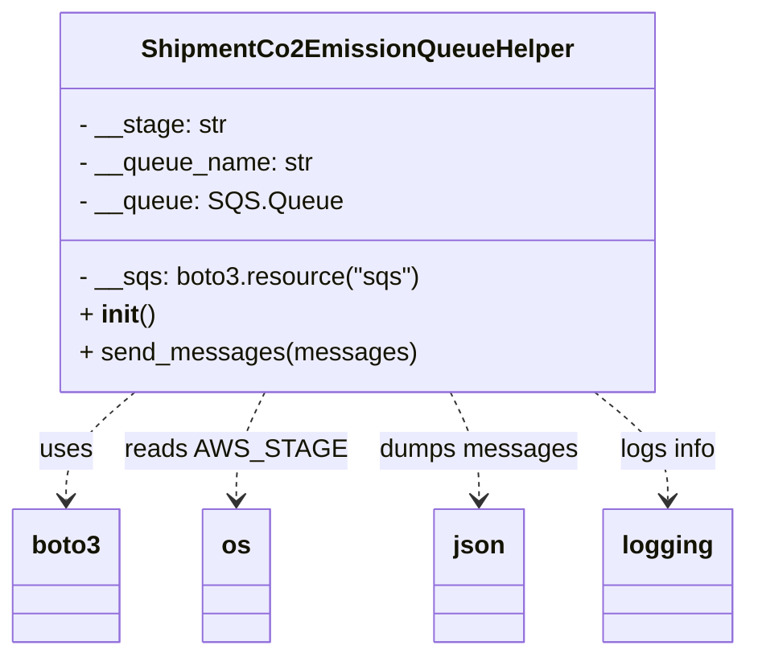

# Diagram: shipment_core/shipment_service/shipment_service/shipment_sustainability/produce_to_shipmentCo2Emission.py

> Auto-generated by Obscura crawlers

## Mermaid

### SVG

<svg id="container" width="453.25" xmlns="http://www.w3.org/2000/svg" class="classDiagram" height="414" viewBox="0 0 453.25 414" role="graphics-document document" aria-roledescription="class"><g><defs><marker id="container_class-aggregationStart" class="marker aggregation class" refX="18" refY="7" markerWidth="190" markerHeight="240" orient="auto"><path d="M 18,7 L9,13 L1,7 L9,1 Z"></path></marker></defs><defs><marker id="container_class-aggregationEnd" class="marker aggregation class" refX="1" refY="7" markerWidth="20" markerHeight="28" orient="auto"><path d="M 18,7 L9,13 L1,7 L9,1 Z"></path></marker></defs><defs><marker id="container_class-extensionStart" class="marker extension class" refX="18" refY="7" markerWidth="190" markerHeight="240" orient="auto"><path d="M 1,7 L18,13 V 1 Z"></path></marker></defs><defs><marker id="container_class-extensionEnd" class="marker extension class" refX="1" refY="7" markerWidth="20" markerHeight="28" orient="auto"><path d="M 1,1 V 13 L18,7 Z"></path></marker></defs><defs><marker id="container_class-compositionStart" class="marker composition class" refX="18" refY="7" markerWidth="190" markerHeight="240" orient="auto"><path d="M 18,7 L9,13 L1,7 L9,1 Z"></path></marker></defs><defs><marker id="container_class-compositionEnd" class="marker composition class" refX="1" refY="7" markerWidth="20" markerHeight="28" orient="auto"><path d="M 18,7 L9,13 L1,7 L9,1 Z"></path></marker></defs><defs><marker id="container_class-dependencyStart" class="marker dependency class" refX="6" refY="7" markerWidth="190" markerHeight="240" orient="auto"><path d="M 5,7 L9,13 L1,7 L9,1 Z"></path></marker></defs><defs><marker id="container_class-dependencyEnd" class="marker dependency class" refX="13" refY="7" markerWidth="20" markerHeight="28" orient="auto"><path d="M 18,7 L9,13 L14,7 L9,1 Z"></path></marker></defs><defs><marker id="container_class-lollipopStart" class="marker lollipop class" refX="13" refY="7" markerWidth="190" markerHeight="240" orient="auto"><circle stroke="black" fill="transparent" cx="7" cy="7" r="6"></circle></marker></defs><defs><marker id="container_class-lollipopEnd" class="marker lollipop class" refX="1" refY="7" markerWidth="190" markerHeight="240" orient="auto"><circle stroke="black" fill="transparent" cx="7" cy="7" r="6"></circle></marker></defs><g class="root"><g class="clusters"></g><g class="edgePaths"><path d="M82.567,248L75.651,254.167C68.735,260.333,54.903,272.667,47.986,284C41.07,295.333,41.07,305.667,41.07,310.833L41.07,316" id="id_ShipmentCo2EmissionQueueHelper_boto3_1" class="edge-thickness-normal edge-pattern-dashed relation" style=";;;" data-edge="true" data-et="edge" data-id="id_ShipmentCo2EmissionQueueHelper_boto3_1" data-points="W3sieCI6ODIuNTY3MzUxNzExNzgzNDMsInkiOjI0OH0seyJ4Ijo0MS4wNzAzMTI1LCJ5IjoyODV9LHsieCI6NDEuMDcwMzEyNSwieSI6MzIyfV0=" marker-end="url(#container_class-dependencyEnd)"></path><path d="M161.759,248L158.913,254.167C156.066,260.333,150.373,272.667,147.526,284C144.68,295.333,144.68,305.667,144.68,310.833L144.68,316" id="id_ShipmentCo2EmissionQueueHelper_os_2" class="edge-thickness-normal edge-pattern-dashed relation" style=";;;" data-edge="true" data-et="edge" data-id="id_ShipmentCo2EmissionQueueHelper_os_2" data-points="W3sieCI6MTYxLjc1OTIzMDY5MjY3NTE1LCJ5IjoyNDh9LHsieCI6MTQ0LjY3OTY4NzUsInkiOjI4NX0seyJ4IjoxNDQuNjc5Njg3NSwieSI6MzIyfV0=" marker-end="url(#container_class-dependencyEnd)"></path><path d="M272.545,248L275.392,254.167C278.239,260.333,283.932,272.667,286.778,284C289.625,295.333,289.625,305.667,289.625,310.833L289.625,316" id="id_ShipmentCo2EmissionQueueHelper_json_3" class="edge-thickness-normal edge-pattern-dashed relation" style=";;;" data-edge="true" data-et="edge" data-id="id_ShipmentCo2EmissionQueueHelper_json_3" data-points="W3sieCI6MjcyLjU0NTQ1NjgwNzMyNDg1LCJ5IjoyNDh9LHsieCI6Mjg5LjYyNSwieSI6Mjg1fSx7IngiOjI4OS42MjUsInkiOjMyMn1d" marker-end="url(#container_class-dependencyEnd)"></path><path d="M361.602,248L369.025,254.167C376.448,260.333,391.294,272.667,398.718,284C406.141,295.333,406.141,305.667,406.141,310.833L406.141,316" id="id_ShipmentCo2EmissionQueueHelper_logging_4" class="edge-thickness-normal edge-pattern-dashed relation" style=";;;" data-edge="true" data-et="edge" data-id="id_ShipmentCo2EmissionQueueHelper_logging_4" data-points="W3sieCI6MzYxLjYwMTk4NTQ2OTc0NTIsInkiOjI0OH0seyJ4Ijo0MDYuMTQwNjI1LCJ5IjoyODV9LHsieCI6NDA2LjE0MDYyNSwieSI6MzIyfV0=" marker-end="url(#container_class-dependencyEnd)"></path></g><g class="edgeLabels"><g class="edgeLabel" transform="translate(41.0703125, 285)"><g class="label" data-id="id_ShipmentCo2EmissionQueueHelper_boto3_1" transform="translate(-16.4921875, -12)"><foreignObject width="32.984375" height="24">

uses

</foreignObject></g></g><g class="edgeLabel" transform="translate(144.6796875, 285)"><g class="label" data-id="id_ShipmentCo2EmissionQueueHelper_os_2" transform="translate(-63.109375, -12)"><foreignObject width="126.21875" height="24">

reads AWS_STAGE

</foreignObject></g></g><g class="edgeLabel" transform="translate(289.625, 285)"><g class="label" data-id="id_ShipmentCo2EmissionQueueHelper_json_3" transform="translate(-61.8359375, -12)"><foreignObject width="123.671875" height="24">

dumps messages

</foreignObject></g></g><g class="edgeLabel" transform="translate(406.140625, 285)"><g class="label" data-id="id_ShipmentCo2EmissionQueueHelper_logging_4" transform="translate(-31.15625, -12)"><foreignObject width="62.3125" height="24">

logs info

</foreignObject></g></g></g><g class="nodes"><g class="node default" id="classId-ShipmentCo2EmissionQueueHelper-0" transform="translate(217.15234375, 128)"><g class="basic label-container"><path d="M-183.5546875 -120 L183.5546875 -120 L183.5546875 120 L-183.5546875 120" stroke="none" stroke-width="0" fill="#ECECFF" style=""></path><path d="M-183.5546875 -120 C-65.45785944326813 -120, 52.63896861346373 -120, 183.5546875 -120 M-183.5546875 -120 C-43.672091534981746 -120, 96.21050443003651 -120, 183.5546875 -120 M183.5546875 -120 C183.5546875 -71.76743431997474, 183.5546875 -23.534868639949465, 183.5546875 120 M183.5546875 -120 C183.5546875 -45.678902522818746, 183.5546875 28.64219495436251, 183.5546875 120 M183.5546875 120 C98.26950865788794 120, 12.98432981577588 120, -183.5546875 120 M183.5546875 120 C78.09076049993033 120, -27.373166500139348 120, -183.5546875 120 M-183.5546875 120 C-183.5546875 62.51331969259731, -183.5546875 5.026639385194613, -183.5546875 -120 M-183.5546875 120 C-183.5546875 51.793395336807876, -183.5546875 -16.413209326384248, -183.5546875 -120" stroke="#9370DB" stroke-width="1.3" fill="none" stroke-dasharray="0 0" style=""></path></g><g class="annotation-group text" transform="translate(0, -96)"></g><g class="label-group text" transform="translate(-128.578125, -96)"><g class="label" style="font-weight: bolder" transform="translate(0,-12)"><foreignObject width="257.15625" height="24">

ShipmentCo2EmissionQueueHelper

</foreignObject></g></g><g class="members-group text" transform="translate(-171.5546875, -48)"><g class="label" style="" transform="translate(0,-12)"><foreignObject width="93.140625" height="24">

- __stage: str

</foreignObject></g><g class="label" style="" transform="translate(0,12)"><foreignObject width="148.5" height="24">

- __queue_name: str

</foreignObject></g><g class="label" style="" transform="translate(0,36)"><foreignObject width="159.703125" height="24">

- __queue: SQS.Queue

</foreignObject></g></g><g class="methods-group text" transform="translate(-171.5546875, 48)"><g class="label" style="" transform="translate(0,-12)"><foreignObject width="214.53125" height="24">

- __sqs: boto3.resource("sqs")

</foreignObject></g><g class="label" style="" transform="translate(0,12)"><foreignObject width="47.046875" height="24">

+ <strong>init</strong>()

</foreignObject></g><g class="label" style="" transform="translate(0,36)"><foreignObject width="205.765625" height="24">

+ send_messages(messages)

</foreignObject></g></g><g class="divider" style=""><path d="M-183.5546875 -72 C-74.12696074595955 -72, 35.3007660080809 -72, 183.5546875 -72 M-183.5546875 -72 C-64.54462186204204 -72, 54.46544377591593 -72, 183.5546875 -72" stroke="#9370DB" stroke-width="1.3" fill="none" stroke-dasharray="0 0" style=""></path></g><g class="divider" style=""><path d="M-183.5546875 24 C-90.57819390866999 24, 2.3982996826600242 24, 183.5546875 24 M-183.5546875 24 C-103.90827938573189 24, -24.261871271463775 24, 183.5546875 24" stroke="#9370DB" stroke-width="1.3" fill="none" stroke-dasharray="0 0" style=""></path></g></g><g class="node default" id="classId-boto3-1" transform="translate(41.0703125, 364)"><g class="basic label-container"><path d="M-33.0703125 -42 L33.0703125 -42 L33.0703125 42 L-33.0703125 42" stroke="none" stroke-width="0" fill="#ECECFF" style=""></path><path d="M-33.0703125 -42 C-12.182529377502775 -42, 8.705253744994451 -42, 33.0703125 -42 M-33.0703125 -42 C-12.15271793589103 -42, 8.764876628217941 -42, 33.0703125 -42 M33.0703125 -42 C33.0703125 -10.287821956040823, 33.0703125 21.424356087918355, 33.0703125 42 M33.0703125 -42 C33.0703125 -15.577346590796132, 33.0703125 10.845306818407735, 33.0703125 42 M33.0703125 42 C13.648717426003582 42, -5.772877647992836 42, -33.0703125 42 M33.0703125 42 C14.099476088872219 42, -4.871360322255562 42, -33.0703125 42 M-33.0703125 42 C-33.0703125 24.08456795039632, -33.0703125 6.169135900792639, -33.0703125 -42 M-33.0703125 42 C-33.0703125 18.257445301706277, -33.0703125 -5.485109396587447, -33.0703125 -42" stroke="#9370DB" stroke-width="1.3" fill="none" stroke-dasharray="0 0" style=""></path></g><g class="annotation-group text" transform="translate(0, -18)"></g><g class="label-group text" transform="translate(-21.0703125, -18)"><g class="label" style="font-weight: bolder" transform="translate(0,-12)"><foreignObject width="42.140625" height="24">

boto3

</foreignObject></g></g><g class="members-group text" transform="translate(-21.0703125, 30)"></g><g class="methods-group text" transform="translate(-21.0703125, 60)"></g><g class="divider" style=""><path d="M-33.0703125 6 C-19.63717143934938 6, -6.204030378698761 6, 33.0703125 6 M-33.0703125 6 C-18.943012539297165 6, -4.815712578594329 6, 33.0703125 6" stroke="#9370DB" stroke-width="1.3" fill="none" stroke-dasharray="0 0" style=""></path></g><g class="divider" style=""><path d="M-33.0703125 24 C-14.917424823358605 24, 3.2354628532827903 24, 33.0703125 24 M-33.0703125 24 C-17.494919444763603 24, -1.9195263895272099 24, 33.0703125 24" stroke="#9370DB" stroke-width="1.3" fill="none" stroke-dasharray="0 0" style=""></path></g></g><g class="node default" id="classId-os-2" transform="translate(144.6796875, 364)"><g class="basic label-container"><path d="M-20.5390625 -42 L20.5390625 -42 L20.5390625 42 L-20.5390625 42" stroke="none" stroke-width="0" fill="#ECECFF" style=""></path><path d="M-20.5390625 -42 C-10.312084310381014 -42, -0.08510612076202762 -42, 20.5390625 -42 M-20.5390625 -42 C-5.73794268139352 -42, 9.06317713721296 -42, 20.5390625 -42 M20.5390625 -42 C20.5390625 -20.759544538305743, 20.5390625 0.4809109233885138, 20.5390625 42 M20.5390625 -42 C20.5390625 -16.037934423327215, 20.5390625 9.92413115334557, 20.5390625 42 M20.5390625 42 C8.080679790213017 42, -4.3777029195739665 42, -20.5390625 42 M20.5390625 42 C8.883276653197559 42, -2.7725091936048827 42, -20.5390625 42 M-20.5390625 42 C-20.5390625 12.591725330052572, -20.5390625 -16.816549339894856, -20.5390625 -42 M-20.5390625 42 C-20.5390625 11.95608568227873, -20.5390625 -18.08782863544254, -20.5390625 -42" stroke="#9370DB" stroke-width="1.3" fill="none" stroke-dasharray="0 0" style=""></path></g><g class="annotation-group text" transform="translate(0, -18)"></g><g class="label-group text" transform="translate(-8.5390625, -18)"><g class="label" style="font-weight: bolder" transform="translate(0,-12)"><foreignObject width="17.078125" height="24">

os

</foreignObject></g></g><g class="members-group text" transform="translate(-8.5390625, 30)"></g><g class="methods-group text" transform="translate(-8.5390625, 60)"></g><g class="divider" style=""><path d="M-20.5390625 6 C-10.908485370059077 6, -1.2779082401181547 6, 20.5390625 6 M-20.5390625 6 C-9.323170813367613 6, 1.892720873264775 6, 20.5390625 6" stroke="#9370DB" stroke-width="1.3" fill="none" stroke-dasharray="0 0" style=""></path></g><g class="divider" style=""><path d="M-20.5390625 24 C-4.93202648211982 24, 10.67500953576036 24, 20.5390625 24 M-20.5390625 24 C-11.15640476860673 24, -1.773747037213461 24, 20.5390625 24" stroke="#9370DB" stroke-width="1.3" fill="none" stroke-dasharray="0 0" style=""></path></g></g><g class="node default" id="classId-json-3" transform="translate(289.625, 364)"><g class="basic label-container"><path d="M-27.40625 -42 L27.40625 -42 L27.40625 42 L-27.40625 42" stroke="none" stroke-width="0" fill="#ECECFF" style=""></path><path d="M-27.40625 -42 C-5.6011932757629594 -42, 16.20386344847408 -42, 27.40625 -42 M-27.40625 -42 C-8.145852797829885 -42, 11.11454440434023 -42, 27.40625 -42 M27.40625 -42 C27.40625 -11.102773170306513, 27.40625 19.794453659386974, 27.40625 42 M27.40625 -42 C27.40625 -15.658297777251065, 27.40625 10.683404445497871, 27.40625 42 M27.40625 42 C10.179967919551405 42, -7.0463141608971895 42, -27.40625 42 M27.40625 42 C5.72852989198411 42, -15.94919021603178 42, -27.40625 42 M-27.40625 42 C-27.40625 24.302530571021716, -27.40625 6.605061142043432, -27.40625 -42 M-27.40625 42 C-27.40625 10.670955864994934, -27.40625 -20.658088270010133, -27.40625 -42" stroke="#9370DB" stroke-width="1.3" fill="none" stroke-dasharray="0 0" style=""></path></g><g class="annotation-group text" transform="translate(0, -18)"></g><g class="label-group text" transform="translate(-15.40625, -18)"><g class="label" style="font-weight: bolder" transform="translate(0,-12)"><foreignObject width="30.8125" height="24">

json

</foreignObject></g></g><g class="members-group text" transform="translate(-15.40625, 30)"></g><g class="methods-group text" transform="translate(-15.40625, 60)"></g><g class="divider" style=""><path d="M-27.40625 6 C-15.467318451363921 6, -3.528386902727842 6, 27.40625 6 M-27.40625 6 C-7.106074130893283 6, 13.194101738213433 6, 27.40625 6" stroke="#9370DB" stroke-width="1.3" fill="none" stroke-dasharray="0 0" style=""></path></g><g class="divider" style=""><path d="M-27.40625 24 C-10.675836851858215 24, 6.054576296283571 24, 27.40625 24 M-27.40625 24 C-6.64088954145349 24, 14.12447091709302 24, 27.40625 24" stroke="#9370DB" stroke-width="1.3" fill="none" stroke-dasharray="0 0" style=""></path></g></g><g class="node default" id="classId-logging-4" transform="translate(406.140625, 364)"><g class="basic label-container"><path d="M-39.109375 -42 L39.109375 -42 L39.109375 42 L-39.109375 42" stroke="none" stroke-width="0" fill="#ECECFF" style=""></path><path d="M-39.109375 -42 C-18.933402654887267 -42, 1.2425696902254657 -42, 39.109375 -42 M-39.109375 -42 C-18.69434955660778 -42, 1.7206758867844414 -42, 39.109375 -42 M39.109375 -42 C39.109375 -12.449853452647652, 39.109375 17.100293094704696, 39.109375 42 M39.109375 -42 C39.109375 -21.123958532960597, 39.109375 -0.2479170659211931, 39.109375 42 M39.109375 42 C12.449298631483856 42, -14.210777737032288 42, -39.109375 42 M39.109375 42 C15.048658421600422 42, -9.012058156799156 42, -39.109375 42 M-39.109375 42 C-39.109375 24.731257177166686, -39.109375 7.462514354333372, -39.109375 -42 M-39.109375 42 C-39.109375 21.56340407557204, -39.109375 1.1268081511440826, -39.109375 -42" stroke="#9370DB" stroke-width="1.3" fill="none" stroke-dasharray="0 0" style=""></path></g><g class="annotation-group text" transform="translate(0, -18)"></g><g class="label-group text" transform="translate(-27.109375, -18)"><g class="label" style="font-weight: bolder" transform="translate(0,-12)"><foreignObject width="54.21875" height="24">

logging

</foreignObject></g></g><g class="members-group text" transform="translate(-27.109375, 30)"></g><g class="methods-group text" transform="translate(-27.109375, 60)"></g><g class="divider" style=""><path d="M-39.109375 6 C-13.290183424656856 6, 12.529008150686288 6, 39.109375 6 M-39.109375 6 C-10.102481585624414 6, 18.904411828751172 6, 39.109375 6" stroke="#9370DB" stroke-width="1.3" fill="none" stroke-dasharray="0 0" style=""></path></g><g class="divider" style=""><path d="M-39.109375 24 C-13.1282212095687 24, 12.8529325808626 24, 39.109375 24 M-39.109375 24 C-12.794883418637458 24, 13.519608162725085 24, 39.109375 24" stroke="#9370DB" stroke-width="1.3" fill="none" stroke-dasharray="0 0" style=""></path></g></g></g></g></g></svg>
