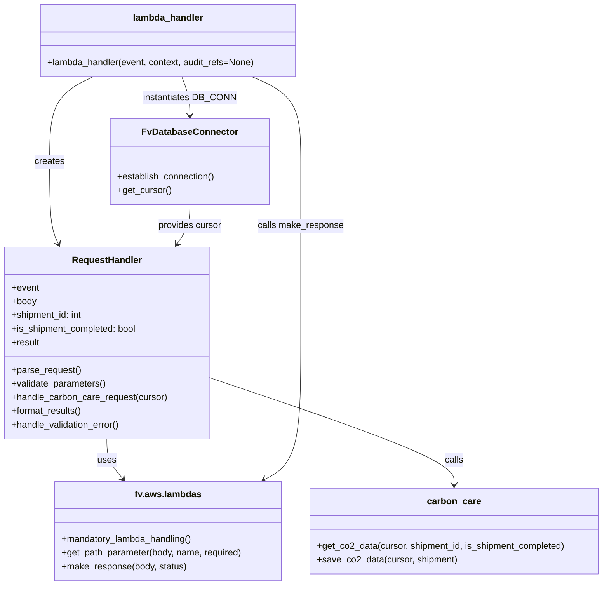
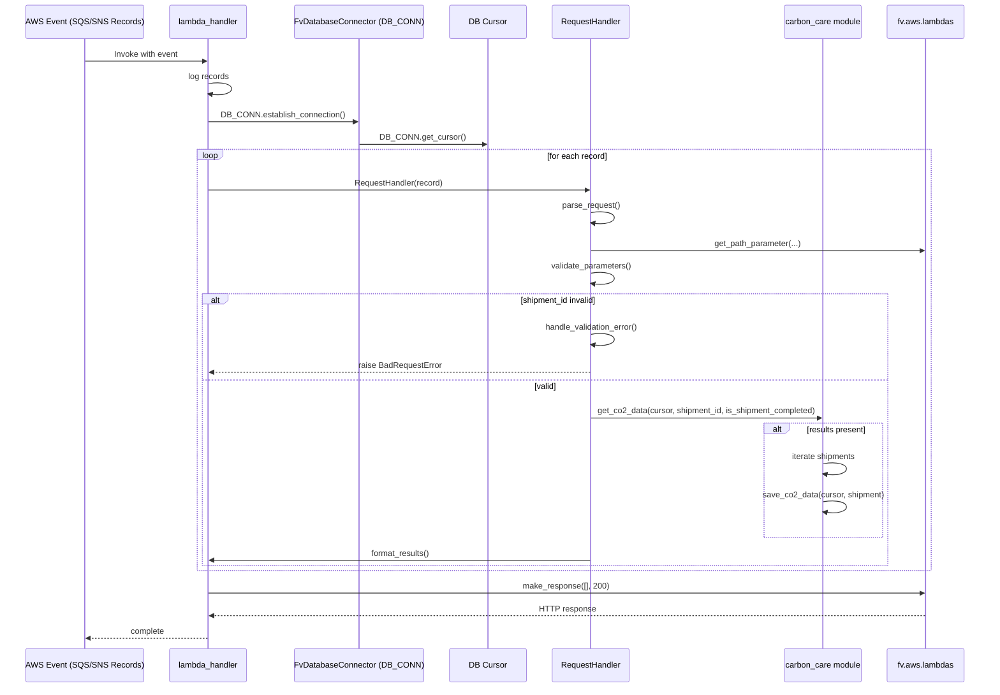

# Diagram: shipment_core/shipment_service/shipment_service/shipment_sustainability/shipment_co2_emission.py

> Auto-generated by Obscura crawlers

## Diagram 1

### SVG

<svg id="container" width="1059.349609375" xmlns="http://www.w3.org/2000/svg" class="classDiagram" height="1024" viewBox="0 0 1059.349609375 1024" role="graphics-document document" aria-roledescription="class"><g><defs><marker id="container_class-aggregationStart" class="marker aggregation class" refX="18" refY="7" markerWidth="190" markerHeight="240" orient="auto"><path d="M 18,7 L9,13 L1,7 L9,1 Z"></path></marker></defs><defs><marker id="container_class-aggregationEnd" class="marker aggregation class" refX="1" refY="7" markerWidth="20" markerHeight="28" orient="auto"><path d="M 18,7 L9,13 L1,7 L9,1 Z"></path></marker></defs><defs><marker id="container_class-extensionStart" class="marker extension class" refX="18" refY="7" markerWidth="190" markerHeight="240" orient="auto"><path d="M 1,7 L18,13 V 1 Z"></path></marker></defs><defs><marker id="container_class-extensionEnd" class="marker extension class" refX="1" refY="7" markerWidth="20" markerHeight="28" orient="auto"><path d="M 1,1 V 13 L18,7 Z"></path></marker></defs><defs><marker id="container_class-compositionStart" class="marker composition class" refX="18" refY="7" markerWidth="190" markerHeight="240" orient="auto"><path d="M 18,7 L9,13 L1,7 L9,1 Z"></path></marker></defs><defs><marker id="container_class-compositionEnd" class="marker composition class" refX="1" refY="7" markerWidth="20" markerHeight="28" orient="auto"><path d="M 18,7 L9,13 L1,7 L9,1 Z"></path></marker></defs><defs><marker id="container_class-dependencyStart" class="marker dependency class" refX="6" refY="7" markerWidth="190" markerHeight="240" orient="auto"><path d="M 5,7 L9,13 L1,7 L9,1 Z"></path></marker></defs><defs><marker id="container_class-dependencyEnd" class="marker dependency class" refX="13" refY="7" markerWidth="20" markerHeight="28" orient="auto"><path d="M 18,7 L9,13 L14,7 L9,1 Z"></path></marker></defs><defs><marker id="container_class-lollipopStart" class="marker lollipop class" refX="13" refY="7" markerWidth="190" markerHeight="240" orient="auto"><circle stroke="black" fill="transparent" cx="7" cy="7" r="6"></circle></marker></defs><defs><marker id="container_class-lollipopEnd" class="marker lollipop class" refX="1" refY="7" markerWidth="190" markerHeight="240" orient="auto"><circle stroke="black" fill="transparent" cx="7" cy="7" r="6"></circle></marker></defs><g class="root"><g class="clusters"></g><g class="edgePaths"><path d="M186.824,768L186.824,774.167C186.824,780.333,186.824,792.667,191.488,804.243C196.152,815.819,205.48,826.637,210.144,832.047L214.807,837.456" id="id_RequestHandler_fv.aws.lambdas_1" class="edge-thickness-normal edge-pattern-solid relation" style=";;;" data-edge="true" data-et="edge" data-id="id_RequestHandler_fv.aws.lambdas_1" data-points="W3sieCI6MTg2LjgyNDIxODc1LCJ5Ijo3Njh9LHsieCI6MTg2LjgyNDIxODc1LCJ5Ijo4MDV9LHsieCI6MjE4LjcyNTQxMjY3NjQxMTI4LCJ5Ijo4NDJ9XQ==" marker-end="url(#container_class-dependencyEnd)"></path><path d="M365.648,660.03L437.624,684.192C509.6,708.353,653.551,756.677,725.526,788.005C797.502,819.333,797.502,833.667,797.502,840.833L797.502,848" id="id_RequestHandler_carbon_care_2" class="edge-thickness-normal edge-pattern-solid relation" style=";;;" data-edge="true" data-et="edge" data-id="id_RequestHandler_carbon_care_2" data-points="W3sieCI6MzY1LjY0ODQzNzUsInkiOjY2MC4wMjk5Njc5ODUxMDg4fSx7IngiOjc5Ny41MDE5NTMxMjUsInkiOjgwNX0seyJ4Ijo3OTcuNTAxOTUzMTI1LCJ5Ijo4NTR9XQ==" marker-end="url(#container_class-dependencyEnd)"></path><path d="M319.003,134L321.476,140.167C323.949,146.333,328.895,158.667,331.369,170C333.842,181.333,333.842,191.667,333.842,196.833L333.842,202" id="id_lambda_handler_FvDatabaseConnector_3" class="edge-thickness-normal edge-pattern-solid relation" style=";;;" data-edge="true" data-et="edge" data-id="id_lambda_handler_FvDatabaseConnector_3" data-points="W3sieCI6MzE5LjAwMjc3MzQzNzUsInkiOjEzNH0seyJ4IjozMzMuODQxNzk2ODc1LCJ5IjoxNzF9LHsieCI6MzMzLjg0MTc5Njg3NSwieSI6MjA4fV0=" marker-end="url(#container_class-dependencyEnd)"></path><path d="M163.553,134L150.81,140.167C138.067,146.333,112.581,158.667,99.839,183.5C87.096,208.333,87.096,245.667,87.096,283C87.096,320.333,87.096,357.667,89.658,381.601C92.221,405.535,97.346,416.07,99.908,421.337L102.471,426.605" id="id_lambda_handler_RequestHandler_4" class="edge-thickness-normal edge-pattern-solid relation" style=";;;" data-edge="true" data-et="edge" data-id="id_lambda_handler_RequestHandler_4" data-points="W3sieCI6MTYzLjU1MjczNDM3NSwieSI6MTM0fSx7IngiOjg3LjA5NTcwMzEyNSwieSI6MTcxfSx7IngiOjg3LjA5NTcwMzEyNSwieSI6MjgzfSx7IngiOjg3LjA5NTcwMzEyNSwieSI6Mzk1fSx7IngiOjEwNS4wOTU0ODM5OTM5MDI0MywieSI6NDMyfV0=" marker-end="url(#container_class-dependencyEnd)"></path><path d="M440.942,134L455.351,140.167C469.76,146.333,498.578,158.667,512.987,183.5C527.396,208.333,527.396,245.667,527.396,283C527.396,320.333,527.396,357.667,527.396,410.5C527.396,463.333,527.396,531.667,527.396,600C527.396,668.333,527.396,736.667,516.66,776.531C505.923,816.396,484.449,827.792,473.712,833.49L462.975,839.187" id="id_lambda_handler_fv.aws.lambdas_5" class="edge-thickness-normal edge-pattern-solid relation" style=";;;" data-edge="true" data-et="edge" data-id="id_lambda_handler_fv.aws.lambdas_5" data-points="W3sieCI6NDQwLjk0MjIyNjU2MjQ5OTk3LCJ5IjoxMzR9LHsieCI6NTI3LjM5NjQ4NDM3NSwieSI6MTcxfSx7IngiOjUyNy4zOTY0ODQzNzUsInkiOjI4M30seyJ4Ijo1MjcuMzk2NDg0Mzc1LCJ5IjozOTV9LHsieCI6NTI3LjM5NjQ4NDM3NSwieSI6NjAwfSx7IngiOjUyNy4zOTY0ODQzNzUsInkiOjgwNX0seyJ4Ijo0NTcuNjc1MzA4NzE5NzU4MDUsInkiOjg0Mn1d" marker-end="url(#container_class-dependencyEnd)"></path><path d="M333.842,358L333.842,364.167C333.842,370.333,333.842,382.667,330.002,394.187C326.162,405.708,318.483,416.416,314.643,421.77L310.804,427.124" id="id_FvDatabaseConnector_RequestHandler_6" class="edge-thickness-normal edge-pattern-solid relation" style=";;;" data-edge="true" data-et="edge" data-id="id_FvDatabaseConnector_RequestHandler_6" data-points="W3sieCI6MzMzLjg0MTc5Njg3NSwieSI6MzU4fSx7IngiOjMzMy44NDE3OTY4NzUsInkiOjM5NX0seyJ4IjozMDcuMzA2OTE2OTIwNzMxNzQsInkiOjQzMn1d" marker-end="url(#container_class-dependencyEnd)"></path></g><g class="edgeLabels"><g class="edgeLabel" transform="translate(186.82421875, 805)"><g class="label" data-id="id_RequestHandler_fv.aws.lambdas_1" transform="translate(-16.4921875, -12)"><foreignObject width="32.984375" height="24">

uses

</foreignObject></g></g><g class="edgeLabel" transform="translate(797.501953125, 805)"><g class="label" data-id="id_RequestHandler_carbon_care_2" transform="translate(-16.4453125, -12)"><foreignObject width="32.890625" height="24">

calls

</foreignObject></g></g><g class="edgeLabel" transform="translate(333.841796875, 171)"><g class="label" data-id="id_lambda_handler_FvDatabaseConnector_3" transform="translate(-79.515625, -12)"><foreignObject width="159.03125" height="24">

instantiates DB_CONN

</foreignObject></g></g><g class="edgeLabel" transform="translate(87.095703125, 283)"><g class="label" data-id="id_lambda_handler_RequestHandler_4" transform="translate(-26.171875, -12)"><foreignObject width="52.34375" height="24">

creates

</foreignObject></g></g><g class="edgeLabel" transform="translate(527.396484375, 395)"><g class="label" data-id="id_lambda_handler_fv.aws.lambdas_5" transform="translate(-75.3046875, -12)"><foreignObject width="150.609375" height="24">

calls make_response

</foreignObject></g></g><g class="edgeLabel" transform="translate(333.841796875, 395)"><g class="label" data-id="id_FvDatabaseConnector_RequestHandler_6" transform="translate(-56.296875, -12)"><foreignObject width="112.59375" height="24">

provides cursor

</foreignObject></g></g></g><g class="nodes"><g class="node default" id="classId-RequestHandler-0" transform="translate(186.82421875, 600)"><g class="basic label-container"><path d="M-178.82421875 -168 L178.82421875 -168 L178.82421875 168 L-178.82421875 168" stroke="none" stroke-width="0" fill="#ECECFF" style=""></path><path d="M-178.82421875 -168 C-66.64074938648383 -168, 45.542719977032334 -168, 178.82421875 -168 M-178.82421875 -168 C-43.32727312463882 -168, 92.16967250072236 -168, 178.82421875 -168 M178.82421875 -168 C178.82421875 -96.65922326049646, 178.82421875 -25.31844652099292, 178.82421875 168 M178.82421875 -168 C178.82421875 -45.91513045325728, 178.82421875 76.16973909348545, 178.82421875 168 M178.82421875 168 C51.514111757731726 168, -75.79599523453655 168, -178.82421875 168 M178.82421875 168 C59.58714633674177 168, -59.649926076516465 168, -178.82421875 168 M-178.82421875 168 C-178.82421875 60.540154574906495, -178.82421875 -46.91969085018701, -178.82421875 -168 M-178.82421875 168 C-178.82421875 36.68989180368635, -178.82421875 -94.6202163926273, -178.82421875 -168" stroke="#9370DB" stroke-width="1.3" fill="none" stroke-dasharray="0 0" style=""></path></g><g class="annotation-group text" transform="translate(0, -144)"></g><g class="label-group text" transform="translate(-59.0703125, -144)"><g class="label" style="font-weight: bolder" transform="translate(0,-12)"><foreignObject width="118.140625" height="24">

RequestHandler

</foreignObject></g></g><g class="members-group text" transform="translate(-166.82421875, -96)"><g class="label" style="" transform="translate(0,-12)"><foreignObject width="48.328125" height="24">

+event

</foreignObject></g><g class="label" style="" transform="translate(0,12)"><foreignObject width="44.28125" height="24">

+body

</foreignObject></g><g class="label" style="" transform="translate(0,36)"><foreignObject width="126.578125" height="24">

+shipment_id: int

</foreignObject></g><g class="label" style="" transform="translate(0,60)"><foreignObject width="222.421875" height="24">

+is_shipment_completed: bool

</foreignObject></g><g class="label" style="" transform="translate(0,84)"><foreignObject width="49.65625" height="24">

+result

</foreignObject></g></g><g class="methods-group text" transform="translate(-166.82421875, 48)"><g class="label" style="" transform="translate(0,-12)"><foreignObject width="121.796875" height="24">

+parse_request()

</foreignObject></g><g class="label" style="" transform="translate(0,12)"><foreignObject width="166.546875" height="24">

+validate_parameters()

</foreignObject></g><g class="label" style="" transform="translate(0,36)"><foreignObject width="274.578125" height="24">

+handle_carbon_care_request(cursor)

</foreignObject></g><g class="label" style="" transform="translate(0,60)"><foreignObject width="124.484375" height="24">

+format_results()

</foreignObject></g><g class="label" style="" transform="translate(0,84)"><foreignObject width="192.984375" height="24">

+handle_validation_error()

</foreignObject></g></g><g class="divider" style=""><path d="M-178.82421875 -120 C-84.04696387215115 -120, 10.730291005697694 -120, 178.82421875 -120 M-178.82421875 -120 C-103.76801250405224 -120, -28.711806258104474 -120, 178.82421875 -120" stroke="#9370DB" stroke-width="1.3" fill="none" stroke-dasharray="0 0" style=""></path></g><g class="divider" style=""><path d="M-178.82421875 24 C-36.25660202496965 24, 106.3110147000607 24, 178.82421875 24 M-178.82421875 24 C-102.70469446669117 24, -26.58517018338233 24, 178.82421875 24" stroke="#9370DB" stroke-width="1.3" fill="none" stroke-dasharray="0 0" style=""></path></g></g><g class="node default" id="classId-FvDatabaseConnector-1" transform="translate(333.841796875, 283)"><g class="basic label-container"><path d="M-138.28515625 -75 L138.28515625 -75 L138.28515625 75 L-138.28515625 75" stroke="none" stroke-width="0" fill="#ECECFF" style=""></path><path d="M-138.28515625 -75 C-38.56330090314171 -75, 61.15855444371658 -75, 138.28515625 -75 M-138.28515625 -75 C-56.578819928304426 -75, 25.127516393391147 -75, 138.28515625 -75 M138.28515625 -75 C138.28515625 -38.86689647329155, 138.28515625 -2.733792946583094, 138.28515625 75 M138.28515625 -75 C138.28515625 -16.650074036103206, 138.28515625 41.69985192779359, 138.28515625 75 M138.28515625 75 C46.356738793288926 75, -45.57167866342215 75, -138.28515625 75 M138.28515625 75 C33.02483583587349 75, -72.23548457825302 75, -138.28515625 75 M-138.28515625 75 C-138.28515625 20.3258914046326, -138.28515625 -34.3482171907348, -138.28515625 -75 M-138.28515625 75 C-138.28515625 30.480506730837497, -138.28515625 -14.038986538325005, -138.28515625 -75" stroke="#9370DB" stroke-width="1.3" fill="none" stroke-dasharray="0 0" style=""></path></g><g class="annotation-group text" transform="translate(0, -51)"></g><g class="label-group text" transform="translate(-79.3046875, -51)"><g class="label" style="font-weight: bolder" transform="translate(0,-12)"><foreignObject width="158.609375" height="24">

FvDatabaseConnector

</foreignObject></g></g><g class="members-group text" transform="translate(-126.28515625, -3)"></g><g class="methods-group text" transform="translate(-126.28515625, 27)"><g class="label" style="" transform="translate(0,-12)"><foreignObject width="173.265625" height="24">

+establish_connection()

</foreignObject></g><g class="label" style="" transform="translate(0,12)"><foreignObject width="94.640625" height="24">

+get_cursor()

</foreignObject></g></g><g class="divider" style=""><path d="M-138.28515625 -27 C-33.27507365575775 -27, 71.7350089384845 -27, 138.28515625 -27 M-138.28515625 -27 C-73.68560462104345 -27, -9.086052992086906 -27, 138.28515625 -27" stroke="#9370DB" stroke-width="1.3" fill="none" stroke-dasharray="0 0" style=""></path></g><g class="divider" style=""><path d="M-138.28515625 -3 C-80.97543119714524 -3, -23.665706144290496 -3, 138.28515625 -3 M-138.28515625 -3 C-55.74326680572611 -3, 26.798622638547783 -3, 138.28515625 -3" stroke="#9370DB" stroke-width="1.3" fill="none" stroke-dasharray="0 0" style=""></path></g></g><g class="node default" id="classId-carbon_care-2" transform="translate(797.501953125, 929)"><g class="basic label-container"><path d="M-253.84765625 -75 L253.84765625 -75 L253.84765625 75 L-253.84765625 75" stroke="none" stroke-width="0" fill="#ECECFF" style=""></path><path d="M-253.84765625 -75 C-113.87049638372466 -75, 26.106663482550687 -75, 253.84765625 -75 M-253.84765625 -75 C-109.28753827295483 -75, 35.27257970409033 -75, 253.84765625 -75 M253.84765625 -75 C253.84765625 -37.17048708127608, 253.84765625 0.6590258374478424, 253.84765625 75 M253.84765625 -75 C253.84765625 -28.809679425998915, 253.84765625 17.38064114800217, 253.84765625 75 M253.84765625 75 C103.10644142490361 75, -47.634773400192785 75, -253.84765625 75 M253.84765625 75 C124.52324254407506 75, -4.801171161849879 75, -253.84765625 75 M-253.84765625 75 C-253.84765625 24.732579143870055, -253.84765625 -25.53484171225989, -253.84765625 -75 M-253.84765625 75 C-253.84765625 32.17611980043949, -253.84765625 -10.647760399121026, -253.84765625 -75" stroke="#9370DB" stroke-width="1.3" fill="none" stroke-dasharray="0 0" style=""></path></g><g class="annotation-group text" transform="translate(0, -51)"></g><g class="label-group text" transform="translate(-44.9296875, -51)"><g class="label" style="font-weight: bolder" transform="translate(0,-12)"><foreignObject width="89.859375" height="24">

carbon_care

</foreignObject></g></g><g class="members-group text" transform="translate(-241.84765625, -3)"></g><g class="methods-group text" transform="translate(-241.84765625, 27)"><g class="label" style="" transform="translate(0,-12)"><foreignObject width="438.765625" height="24">

+get_co2_data(cursor, shipment_id, is_shipment_completed)

</foreignObject></g><g class="label" style="" transform="translate(0,12)"><foreignObject width="244.234375" height="24">

+save_co2_data(cursor, shipment)

</foreignObject></g></g><g class="divider" style=""><path d="M-253.84765625 -27 C-109.59341379246601 -27, 34.66082866506798 -27, 253.84765625 -27 M-253.84765625 -27 C-148.03343185511739 -27, -42.21920746023474 -27, 253.84765625 -27" stroke="#9370DB" stroke-width="1.3" fill="none" stroke-dasharray="0 0" style=""></path></g><g class="divider" style=""><path d="M-253.84765625 -3 C-55.33099017943172 -3, 143.18567589113655 -3, 253.84765625 -3 M-253.84765625 -3 C-149.82477702022084 -3, -45.80189779044167 -3, 253.84765625 -3" stroke="#9370DB" stroke-width="1.3" fill="none" stroke-dasharray="0 0" style=""></path></g></g><g class="node default" id="classId-fv.aws.lambdas-3" transform="translate(293.736328125, 929)"><g class="basic label-container"><path d="M-199.91796875 -87 L199.91796875 -87 L199.91796875 87 L-199.91796875 87" stroke="none" stroke-width="0" fill="#ECECFF" style=""></path><path d="M-199.91796875 -87 C-87.22273326264302 -87, 25.472502224713963 -87, 199.91796875 -87 M-199.91796875 -87 C-104.56960872648239 -87, -9.221248702964772 -87, 199.91796875 -87 M199.91796875 -87 C199.91796875 -43.71573723987921, 199.91796875 -0.4314744797584211, 199.91796875 87 M199.91796875 -87 C199.91796875 -22.986123972790352, 199.91796875 41.027752054419295, 199.91796875 87 M199.91796875 87 C99.6352760985276 87, -0.6474165529448044 87, -199.91796875 87 M199.91796875 87 C59.60068910175855 87, -80.7165905464829 87, -199.91796875 87 M-199.91796875 87 C-199.91796875 47.288822767705916, -199.91796875 7.577645535411833, -199.91796875 -87 M-199.91796875 87 C-199.91796875 36.93333610652497, -199.91796875 -13.133327786950062, -199.91796875 -87" stroke="#9370DB" stroke-width="1.3" fill="none" stroke-dasharray="0 0" style=""></path></g><g class="annotation-group text" transform="translate(0, -63)"></g><g class="label-group text" transform="translate(-55.8984375, -63)"><g class="label" style="font-weight: bolder" transform="translate(0,-12)"><foreignObject width="111.796875" height="24">

fv.aws.lambdas

</foreignObject></g></g><g class="members-group text" transform="translate(-187.91796875, -15)"></g><g class="methods-group text" transform="translate(-187.91796875, 15)"><g class="label" style="" transform="translate(0,-12)"><foreignObject width="232.078125" height="24">

+mandatory_lambda_handling()

</foreignObject></g><g class="label" style="" transform="translate(0,12)"><foreignObject width="319.9375" height="24">

+get_path_parameter(body, name, required)

</foreignObject></g><g class="label" style="" transform="translate(0,36)"><foreignObject width="219.96875" height="24">

+make_response(body, status)

</foreignObject></g></g><g class="divider" style=""><path d="M-199.91796875 -39 C-58.10768254200579 -39, 83.70260366598842 -39, 199.91796875 -39 M-199.91796875 -39 C-40.14214494769351 -39, 119.63367885461298 -39, 199.91796875 -39" stroke="#9370DB" stroke-width="1.3" fill="none" stroke-dasharray="0 0" style=""></path></g><g class="divider" style=""><path d="M-199.91796875 -15 C-104.45147169480073 -15, -8.984974639601461 -15, 199.91796875 -15 M-199.91796875 -15 C-65.18869683916981 -15, 69.54057507166038 -15, 199.91796875 -15" stroke="#9370DB" stroke-width="1.3" fill="none" stroke-dasharray="0 0" style=""></path></g></g><g class="node default" id="classId-lambda_handler-4" transform="translate(293.736328125, 71)"><g class="basic label-container"><path d="M-226.01953125 -63 L226.01953125 -63 L226.01953125 63 L-226.01953125 63" stroke="none" stroke-width="0" fill="#ECECFF" style=""></path><path d="M-226.01953125 -63 C-81.07204374899885 -63, 63.8754437520023 -63, 226.01953125 -63 M-226.01953125 -63 C-81.83835330364758 -63, 62.34282464270484 -63, 226.01953125 -63 M226.01953125 -63 C226.01953125 -33.56629275129493, 226.01953125 -4.132585502589862, 226.01953125 63 M226.01953125 -63 C226.01953125 -21.895010841456752, 226.01953125 19.209978317086495, 226.01953125 63 M226.01953125 63 C81.70793867450237 63, -62.603653900995255 63, -226.01953125 63 M226.01953125 63 C68.7263320003301 63, -88.5668672493398 63, -226.01953125 63 M-226.01953125 63 C-226.01953125 33.254335498142495, -226.01953125 3.508670996284984, -226.01953125 -63 M-226.01953125 63 C-226.01953125 17.512675464112803, -226.01953125 -27.974649071774394, -226.01953125 -63" stroke="#9370DB" stroke-width="1.3" fill="none" stroke-dasharray="0 0" style=""></path></g><g class="annotation-group text" transform="translate(0, -39)"></g><g class="label-group text" transform="translate(-59.9765625, -39)"><g class="label" style="font-weight: bolder" transform="translate(0,-12)"><foreignObject width="119.953125" height="24">

lambda_handler

</foreignObject></g></g><g class="members-group text" transform="translate(-214.01953125, 9)"></g><g class="methods-group text" transform="translate(-214.01953125, 39)"><g class="label" style="" transform="translate(0,-12)"><foreignObject width="368.0625" height="24">

+lambda_handler(event, context, audit_refs=None)

</foreignObject></g></g><g class="divider" style=""><path d="M-226.01953125 -15 C-70.60919686193463 -15, 84.80113752613073 -15, 226.01953125 -15 M-226.01953125 -15 C-127.8659940150932 -15, -29.712456780186386 -15, 226.01953125 -15" stroke="#9370DB" stroke-width="1.3" fill="none" stroke-dasharray="0 0" style=""></path></g><g class="divider" style=""><path d="M-226.01953125 9 C-76.78573732594134 9, 72.44805659811732 9, 226.01953125 9 M-226.01953125 9 C-67.2603266727277 9, 91.4988779045446 9, 226.01953125 9" stroke="#9370DB" stroke-width="1.3" fill="none" stroke-dasharray="0 0" style=""></path></g></g></g></g></g></svg>

## Diagram 2

### SVG

<svg id="container" width="2010.5" xmlns="http://www.w3.org/2000/svg" height="1407" viewBox="-50 -10 2010.5 1407" role="graphics-document document" aria-roledescription="sequence"><g><rect x="1760.5" y="1321" fill="#eaeaea" stroke="#666" width="150" height="65" name="FV_Lambdas" rx="3" ry="3" class="actor actor-bottom"></rect><text x="1835.5" y="1353.5" dominant-baseline="central" alignment-baseline="central" class="actor actor-box" style="text-anchor: middle; font-size: 16px; font-weight: 400;"><tspan x="1835.5" dy="0">fv.aws.lambdas</tspan></text></g><g><rect x="1541.5" y="1321" fill="#eaeaea" stroke="#666" width="169" height="65" name="Carbon" rx="3" ry="3" class="actor actor-bottom"></rect><text x="1626" y="1353.5" dominant-baseline="central" alignment-baseline="central" class="actor actor-box" style="text-anchor: middle; font-size: 16px; font-weight: 400;"><tspan x="1626" dy="0">carbon_care module</tspan></text></g><g><rect x="1050" y="1321" fill="#eaeaea" stroke="#666" width="150" height="65" name="Request" rx="3" ry="3" class="actor actor-bottom"></rect><text x="1125" y="1353.5" dominant-baseline="central" alignment-baseline="central" class="actor actor-box" style="text-anchor: middle; font-size: 16px; font-weight: 400;"><tspan x="1125" dy="0">RequestHandler</tspan></text></g><g><rect x="850" y="1321" fill="#eaeaea" stroke="#666" width="150" height="65" name="Cursor" rx="3" ry="3" class="actor actor-bottom"></rect><text x="925" y="1353.5" dominant-baseline="central" alignment-baseline="central" class="actor actor-box" style="text-anchor: middle; font-size: 16px; font-weight: 400;"><tspan x="925" dy="0">DB Cursor</tspan></text></g><g><rect x="540" y="1321" fill="#eaeaea" stroke="#666" width="260" height="65" name="DB" rx="3" ry="3" class="actor actor-bottom"></rect><text x="670" y="1353.5" dominant-baseline="central" alignment-baseline="central" class="actor actor-box" style="text-anchor: middle; font-size: 16px; font-weight: 400;"><tspan x="670" dy="0">FvDatabaseConnector (DB_CONN)</tspan></text></g><g><rect x="287" y="1321" fill="#eaeaea" stroke="#666" width="150" height="65" name="Lambda" rx="3" ry="3" class="actor actor-bottom"></rect><text x="362" y="1353.5" dominant-baseline="central" alignment-baseline="central" class="actor actor-box" style="text-anchor: middle; font-size: 16px; font-weight: 400;"><tspan x="362" dy="0">lambda_handler</tspan></text></g><g><rect x="0" y="1321" fill="#eaeaea" stroke="#666" width="237" height="65" name="AWS_Event" rx="3" ry="3" class="actor actor-bottom"></rect><text x="118.5" y="1353.5" dominant-baseline="central" alignment-baseline="central" class="actor actor-box" style="text-anchor: middle; font-size: 16px; font-weight: 400;"><tspan x="118.5" dy="0">AWS Event (SQS/SNS Records)</tspan></text></g><g><line id="actor6" x1="1835.5" y1="65" x2="1835.5" y2="1321" class="actor-line 200" stroke-width="0.5px" stroke="#999" name="FV_Lambdas"></line><g id="root-6"><rect x="1760.5" y="0" fill="#eaeaea" stroke="#666" width="150" height="65" name="FV_Lambdas" rx="3" ry="3" class="actor actor-top"></rect><text x="1835.5" y="32.5" dominant-baseline="central" alignment-baseline="central" class="actor actor-box" style="text-anchor: middle; font-size: 16px; font-weight: 400;"><tspan x="1835.5" dy="0">fv.aws.lambdas</tspan></text></g></g><g><line id="actor5" x1="1626" y1="65" x2="1626" y2="1321" class="actor-line 200" stroke-width="0.5px" stroke="#999" name="Carbon"></line><g id="root-5"><rect x="1541.5" y="0" fill="#eaeaea" stroke="#666" width="169" height="65" name="Carbon" rx="3" ry="3" class="actor actor-top"></rect><text x="1626" y="32.5" dominant-baseline="central" alignment-baseline="central" class="actor actor-box" style="text-anchor: middle; font-size: 16px; font-weight: 400;"><tspan x="1626" dy="0">carbon_care module</tspan></text></g></g><g><line id="actor4" x1="1125" y1="65" x2="1125" y2="1321" class="actor-line 200" stroke-width="0.5px" stroke="#999" name="Request"></line><g id="root-4"><rect x="1050" y="0" fill="#eaeaea" stroke="#666" width="150" height="65" name="Request" rx="3" ry="3" class="actor actor-top"></rect><text x="1125" y="32.5" dominant-baseline="central" alignment-baseline="central" class="actor actor-box" style="text-anchor: middle; font-size: 16px; font-weight: 400;"><tspan x="1125" dy="0">RequestHandler</tspan></text></g></g><g><line id="actor3" x1="925" y1="65" x2="925" y2="1321" class="actor-line 200" stroke-width="0.5px" stroke="#999" name="Cursor"></line><g id="root-3"><rect x="850" y="0" fill="#eaeaea" stroke="#666" width="150" height="65" name="Cursor" rx="3" ry="3" class="actor actor-top"></rect><text x="925" y="32.5" dominant-baseline="central" alignment-baseline="central" class="actor actor-box" style="text-anchor: middle; font-size: 16px; font-weight: 400;"><tspan x="925" dy="0">DB Cursor</tspan></text></g></g><g><line id="actor2" x1="670" y1="65" x2="670" y2="1321" class="actor-line 200" stroke-width="0.5px" stroke="#999" name="DB"></line><g id="root-2"><rect x="540" y="0" fill="#eaeaea" stroke="#666" width="260" height="65" name="DB" rx="3" ry="3" class="actor actor-top"></rect><text x="670" y="32.5" dominant-baseline="central" alignment-baseline="central" class="actor actor-box" style="text-anchor: middle; font-size: 16px; font-weight: 400;"><tspan x="670" dy="0">FvDatabaseConnector (DB_CONN)</tspan></text></g></g><g><line id="actor1" x1="362" y1="65" x2="362" y2="1321" class="actor-line 200" stroke-width="0.5px" stroke="#999" name="Lambda"></line><g id="root-1"><rect x="287" y="0" fill="#eaeaea" stroke="#666" width="150" height="65" name="Lambda" rx="3" ry="3" class="actor actor-top"></rect><text x="362" y="32.5" dominant-baseline="central" alignment-baseline="central" class="actor actor-box" style="text-anchor: middle; font-size: 16px; font-weight: 400;"><tspan x="362" dy="0">lambda_handler</tspan></text></g></g><g><line id="actor0" x1="118.5" y1="65" x2="118.5" y2="1321" class="actor-line 200" stroke-width="0.5px" stroke="#999" name="AWS_Event"></line><g id="root-0"><rect x="0" y="0" fill="#eaeaea" stroke="#666" width="237" height="65" name="AWS_Event" rx="3" ry="3" class="actor actor-top"></rect><text x="118.5" y="32.5" dominant-baseline="central" alignment-baseline="central" class="actor actor-box" style="text-anchor: middle; font-size: 16px; font-weight: 400;"><tspan x="118.5" dy="0">AWS Event (SQS/SNS Records)</tspan></text></g></g><g></g><defs><symbol id="computer" width="24" height="24"><path transform="scale(.5)" d="M2 2v13h20v-13h-20zm18 11h-16v-9h16v9zm-10.228 6l.466-1h3.524l.467 1h-4.457zm14.228 3h-24l2-6h2.104l-1.33 4h18.45l-1.297-4h2.073l2 6zm-5-10h-14v-7h14v7z"></path></symbol></defs><defs><symbol id="database" fill-rule="evenodd" clip-rule="evenodd"><path transform="scale(.5)" d="M12.258.001l.256.004.255.005.253.008.251.01.249.012.247.015.246.016.242.019.241.02.239.023.236.024.233.027.231.028.229.031.225.032.223.034.22.036.217.038.214.04.211.041.208.043.205.045.201.046.198.048.194.05.191.051.187.053.183.054.18.056.175.057.172.059.168.06.163.061.16.063.155.064.15.066.074.033.073.033.071.034.07.034.069.035.068.035.067.035.066.035.064.036.064.036.062.036.06.036.06.037.058.037.058.037.055.038.055.038.053.038.052.038.051.039.05.039.048.039.047.039.045.04.044.04.043.04.041.04.04.041.039.041.037.041.036.041.034.041.033.042.032.042.03.042.029.042.027.042.026.043.024.043.023.043.021.043.02.043.018.044.017.043.015.044.013.044.012.044.011.045.009.044.007.045.006.045.004.045.002.045.001.045v17l-.001.045-.002.045-.004.045-.006.045-.007.045-.009.044-.011.045-.012.044-.013.044-.015.044-.017.043-.018.044-.02.043-.021.043-.023.043-.024.043-.026.043-.027.042-.029.042-.03.042-.032.042-.033.042-.034.041-.036.041-.037.041-.039.041-.04.041-.041.04-.043.04-.044.04-.045.04-.047.039-.048.039-.05.039-.051.039-.052.038-.053.038-.055.038-.055.038-.058.037-.058.037-.06.037-.06.036-.062.036-.064.036-.064.036-.066.035-.067.035-.068.035-.069.035-.07.034-.071.034-.073.033-.074.033-.15.066-.155.064-.16.063-.163.061-.168.06-.172.059-.175.057-.18.056-.183.054-.187.053-.191.051-.194.05-.198.048-.201.046-.205.045-.208.043-.211.041-.214.04-.217.038-.22.036-.223.034-.225.032-.229.031-.231.028-.233.027-.236.024-.239.023-.241.02-.242.019-.246.016-.247.015-.249.012-.251.01-.253.008-.255.005-.256.004-.258.001-.258-.001-.256-.004-.255-.005-.253-.008-.251-.01-.249-.012-.247-.015-.245-.016-.243-.019-.241-.02-.238-.023-.236-.024-.234-.027-.231-.028-.228-.031-.226-.032-.223-.034-.22-.036-.217-.038-.214-.04-.211-.041-.208-.043-.204-.045-.201-.046-.198-.048-.195-.05-.19-.051-.187-.053-.184-.054-.179-.056-.176-.057-.172-.059-.167-.06-.164-.061-.159-.063-.155-.064-.151-.066-.074-.033-.072-.033-.072-.034-.07-.034-.069-.035-.068-.035-.067-.035-.066-.035-.064-.036-.063-.036-.062-.036-.061-.036-.06-.037-.058-.037-.057-.037-.056-.038-.055-.038-.053-.038-.052-.038-.051-.039-.049-.039-.049-.039-.046-.039-.046-.04-.044-.04-.043-.04-.041-.04-.04-.041-.039-.041-.037-.041-.036-.041-.034-.041-.033-.042-.032-.042-.03-.042-.029-.042-.027-.042-.026-.043-.024-.043-.023-.043-.021-.043-.02-.043-.018-.044-.017-.043-.015-.044-.013-.044-.012-.044-.011-.045-.009-.044-.007-.045-.006-.045-.004-.045-.002-.045-.001-.045v-17l.001-.045.002-.045.004-.045.006-.045.007-.045.009-.044.011-.045.012-.044.013-.044.015-.044.017-.043.018-.044.02-.043.021-.043.023-.043.024-.043.026-.043.027-.042.029-.042.03-.042.032-.042.033-.042.034-.041.036-.041.037-.041.039-.041.04-.041.041-.04.043-.04.044-.04.046-.04.046-.039.049-.039.049-.039.051-.039.052-.038.053-.038.055-.038.056-.038.057-.037.058-.037.06-.037.061-.036.062-.036.063-.036.064-.036.066-.035.067-.035.068-.035.069-.035.07-.034.072-.034.072-.033.074-.033.151-.066.155-.064.159-.063.164-.061.167-.06.172-.059.176-.057.179-.056.184-.054.187-.053.19-.051.195-.05.198-.048.201-.046.204-.045.208-.043.211-.041.214-.04.217-.038.22-.036.223-.034.226-.032.228-.031.231-.028.234-.027.236-.024.238-.023.241-.02.243-.019.245-.016.247-.015.249-.012.251-.01.253-.008.255-.005.256-.004.258-.001.258.001zm-9.258 20.499v.01l.001.021.003.021.004.022.005.021.006.022.007.022.009.023.01.022.011.023.012.023.013.023.015.023.016.024.017.023.018.024.019.024.021.024.022.025.023.024.024.025.052.049.056.05.061.051.066.051.07.051.075.051.079.052.084.052.088.052.092.052.097.052.102.051.105.052.11.052.114.051.119.051.123.051.127.05.131.05.135.05.139.048.144.049.147.047.152.047.155.047.16.045.163.045.167.043.171.043.176.041.178.041.183.039.187.039.19.037.194.035.197.035.202.033.204.031.209.03.212.029.216.027.219.025.222.024.226.021.23.02.233.018.236.016.24.015.243.012.246.01.249.008.253.005.256.004.259.001.26-.001.257-.004.254-.005.25-.008.247-.011.244-.012.241-.014.237-.016.233-.018.231-.021.226-.021.224-.024.22-.026.216-.027.212-.028.21-.031.205-.031.202-.034.198-.034.194-.036.191-.037.187-.039.183-.04.179-.04.175-.042.172-.043.168-.044.163-.045.16-.046.155-.046.152-.047.148-.048.143-.049.139-.049.136-.05.131-.05.126-.05.123-.051.118-.052.114-.051.11-.052.106-.052.101-.052.096-.052.092-.052.088-.053.083-.051.079-.052.074-.052.07-.051.065-.051.06-.051.056-.05.051-.05.023-.024.023-.025.021-.024.02-.024.019-.024.018-.024.017-.024.015-.023.014-.024.013-.023.012-.023.01-.023.01-.022.008-.022.006-.022.006-.022.004-.022.004-.021.001-.021.001-.021v-4.127l-.077.055-.08.053-.083.054-.085.053-.087.052-.09.052-.093.051-.095.05-.097.05-.1.049-.102.049-.105.048-.106.047-.109.047-.111.046-.114.045-.115.045-.118.044-.12.043-.122.042-.124.042-.126.041-.128.04-.13.04-.132.038-.134.038-.135.037-.138.037-.139.035-.142.035-.143.034-.144.033-.147.032-.148.031-.15.03-.151.03-.153.029-.154.027-.156.027-.158.026-.159.025-.161.024-.162.023-.163.022-.165.021-.166.02-.167.019-.169.018-.169.017-.171.016-.173.015-.173.014-.175.013-.175.012-.177.011-.178.01-.179.008-.179.008-.181.006-.182.005-.182.004-.184.003-.184.002h-.37l-.184-.002-.184-.003-.182-.004-.182-.005-.181-.006-.179-.008-.179-.008-.178-.01-.176-.011-.176-.012-.175-.013-.173-.014-.172-.015-.171-.016-.17-.017-.169-.018-.167-.019-.166-.02-.165-.021-.163-.022-.162-.023-.161-.024-.159-.025-.157-.026-.156-.027-.155-.027-.153-.029-.151-.03-.15-.03-.148-.031-.146-.032-.145-.033-.143-.034-.141-.035-.14-.035-.137-.037-.136-.037-.134-.038-.132-.038-.13-.04-.128-.04-.126-.041-.124-.042-.122-.042-.12-.044-.117-.043-.116-.045-.113-.045-.112-.046-.109-.047-.106-.047-.105-.048-.102-.049-.1-.049-.097-.05-.095-.05-.093-.052-.09-.051-.087-.052-.085-.053-.083-.054-.08-.054-.077-.054v4.127zm0-5.654v.011l.001.021.003.021.004.021.005.022.006.022.007.022.009.022.01.022.011.023.012.023.013.023.015.024.016.023.017.024.018.024.019.024.021.024.022.024.023.025.024.024.052.05.056.05.061.05.066.051.07.051.075.052.079.051.084.052.088.052.092.052.097.052.102.052.105.052.11.051.114.051.119.052.123.05.127.051.131.05.135.049.139.049.144.048.147.048.152.047.155.046.16.045.163.045.167.044.171.042.176.042.178.04.183.04.187.038.19.037.194.036.197.034.202.033.204.032.209.03.212.028.216.027.219.025.222.024.226.022.23.02.233.018.236.016.24.014.243.012.246.01.249.008.253.006.256.003.259.001.26-.001.257-.003.254-.006.25-.008.247-.01.244-.012.241-.015.237-.016.233-.018.231-.02.226-.022.224-.024.22-.025.216-.027.212-.029.21-.03.205-.032.202-.033.198-.035.194-.036.191-.037.187-.039.183-.039.179-.041.175-.042.172-.043.168-.044.163-.045.16-.045.155-.047.152-.047.148-.048.143-.048.139-.05.136-.049.131-.05.126-.051.123-.051.118-.051.114-.052.11-.052.106-.052.101-.052.096-.052.092-.052.088-.052.083-.052.079-.052.074-.051.07-.052.065-.051.06-.05.056-.051.051-.049.023-.025.023-.024.021-.025.02-.024.019-.024.018-.024.017-.024.015-.023.014-.023.013-.024.012-.022.01-.023.01-.023.008-.022.006-.022.006-.022.004-.021.004-.022.001-.021.001-.021v-4.139l-.077.054-.08.054-.083.054-.085.052-.087.053-.09.051-.093.051-.095.051-.097.05-.1.049-.102.049-.105.048-.106.047-.109.047-.111.046-.114.045-.115.044-.118.044-.12.044-.122.042-.124.042-.126.041-.128.04-.13.039-.132.039-.134.038-.135.037-.138.036-.139.036-.142.035-.143.033-.144.033-.147.033-.148.031-.15.03-.151.03-.153.028-.154.028-.156.027-.158.026-.159.025-.161.024-.162.023-.163.022-.165.021-.166.02-.167.019-.169.018-.169.017-.171.016-.173.015-.173.014-.175.013-.175.012-.177.011-.178.009-.179.009-.179.007-.181.007-.182.005-.182.004-.184.003-.184.002h-.37l-.184-.002-.184-.003-.182-.004-.182-.005-.181-.007-.179-.007-.179-.009-.178-.009-.176-.011-.176-.012-.175-.013-.173-.014-.172-.015-.171-.016-.17-.017-.169-.018-.167-.019-.166-.02-.165-.021-.163-.022-.162-.023-.161-.024-.159-.025-.157-.026-.156-.027-.155-.028-.153-.028-.151-.03-.15-.03-.148-.031-.146-.033-.145-.033-.143-.033-.141-.035-.14-.036-.137-.036-.136-.037-.134-.038-.132-.039-.13-.039-.128-.04-.126-.041-.124-.042-.122-.043-.12-.043-.117-.044-.116-.044-.113-.046-.112-.046-.109-.046-.106-.047-.105-.048-.102-.049-.1-.049-.097-.05-.095-.051-.093-.051-.09-.051-.087-.053-.085-.052-.083-.054-.08-.054-.077-.054v4.139zm0-5.666v.011l.001.02.003.022.004.021.005.022.006.021.007.022.009.023.01.022.011.023.012.023.013.023.015.023.016.024.017.024.018.023.019.024.021.025.022.024.023.024.024.025.052.05.056.05.061.05.066.051.07.051.075.052.079.051.084.052.088.052.092.052.097.052.102.052.105.051.11.052.114.051.119.051.123.051.127.05.131.05.135.05.139.049.144.048.147.048.152.047.155.046.16.045.163.045.167.043.171.043.176.042.178.04.183.04.187.038.19.037.194.036.197.034.202.033.204.032.209.03.212.028.216.027.219.025.222.024.226.021.23.02.233.018.236.017.24.014.243.012.246.01.249.008.253.006.256.003.259.001.26-.001.257-.003.254-.006.25-.008.247-.01.244-.013.241-.014.237-.016.233-.018.231-.02.226-.022.224-.024.22-.025.216-.027.212-.029.21-.03.205-.032.202-.033.198-.035.194-.036.191-.037.187-.039.183-.039.179-.041.175-.042.172-.043.168-.044.163-.045.16-.045.155-.047.152-.047.148-.048.143-.049.139-.049.136-.049.131-.051.126-.05.123-.051.118-.052.114-.051.11-.052.106-.052.101-.052.096-.052.092-.052.088-.052.083-.052.079-.052.074-.052.07-.051.065-.051.06-.051.056-.05.051-.049.023-.025.023-.025.021-.024.02-.024.019-.024.018-.024.017-.024.015-.023.014-.024.013-.023.012-.023.01-.022.01-.023.008-.022.006-.022.006-.022.004-.022.004-.021.001-.021.001-.021v-4.153l-.077.054-.08.054-.083.053-.085.053-.087.053-.09.051-.093.051-.095.051-.097.05-.1.049-.102.048-.105.048-.106.048-.109.046-.111.046-.114.046-.115.044-.118.044-.12.043-.122.043-.124.042-.126.041-.128.04-.13.039-.132.039-.134.038-.135.037-.138.036-.139.036-.142.034-.143.034-.144.033-.147.032-.148.032-.15.03-.151.03-.153.028-.154.028-.156.027-.158.026-.159.024-.161.024-.162.023-.163.023-.165.021-.166.02-.167.019-.169.018-.169.017-.171.016-.173.015-.173.014-.175.013-.175.012-.177.01-.178.01-.179.009-.179.007-.181.006-.182.006-.182.004-.184.003-.184.001-.185.001-.185-.001-.184-.001-.184-.003-.182-.004-.182-.006-.181-.006-.179-.007-.179-.009-.178-.01-.176-.01-.176-.012-.175-.013-.173-.014-.172-.015-.171-.016-.17-.017-.169-.018-.167-.019-.166-.02-.165-.021-.163-.023-.162-.023-.161-.024-.159-.024-.157-.026-.156-.027-.155-.028-.153-.028-.151-.03-.15-.03-.148-.032-.146-.032-.145-.033-.143-.034-.141-.034-.14-.036-.137-.036-.136-.037-.134-.038-.132-.039-.13-.039-.128-.041-.126-.041-.124-.041-.122-.043-.12-.043-.117-.044-.116-.044-.113-.046-.112-.046-.109-.046-.106-.048-.105-.048-.102-.048-.1-.05-.097-.049-.095-.051-.093-.051-.09-.052-.087-.052-.085-.053-.083-.053-.08-.054-.077-.054v4.153zm8.74-8.179l-.257.004-.254.005-.25.008-.247.011-.244.012-.241.014-.237.016-.233.018-.231.021-.226.022-.224.023-.22.026-.216.027-.212.028-.21.031-.205.032-.202.033-.198.034-.194.036-.191.038-.187.038-.183.04-.179.041-.175.042-.172.043-.168.043-.163.045-.16.046-.155.046-.152.048-.148.048-.143.048-.139.049-.136.05-.131.05-.126.051-.123.051-.118.051-.114.052-.11.052-.106.052-.101.052-.096.052-.092.052-.088.052-.083.052-.079.052-.074.051-.07.052-.065.051-.06.05-.056.05-.051.05-.023.025-.023.024-.021.024-.02.025-.019.024-.018.024-.017.023-.015.024-.014.023-.013.023-.012.023-.01.023-.01.022-.008.022-.006.023-.006.021-.004.022-.004.021-.001.021-.001.021.001.021.001.021.004.021.004.022.006.021.006.023.008.022.01.022.01.023.012.023.013.023.014.023.015.024.017.023.018.024.019.024.02.025.021.024.023.024.023.025.051.05.056.05.06.05.065.051.07.052.074.051.079.052.083.052.088.052.092.052.096.052.101.052.106.052.11.052.114.052.118.051.123.051.126.051.131.05.136.05.139.049.143.048.148.048.152.048.155.046.16.046.163.045.168.043.172.043.175.042.179.041.183.04.187.038.191.038.194.036.198.034.202.033.205.032.21.031.212.028.216.027.22.026.224.023.226.022.231.021.233.018.237.016.241.014.244.012.247.011.25.008.254.005.257.004.26.001.26-.001.257-.004.254-.005.25-.008.247-.011.244-.012.241-.014.237-.016.233-.018.231-.021.226-.022.224-.023.22-.026.216-.027.212-.028.21-.031.205-.032.202-.033.198-.034.194-.036.191-.038.187-.038.183-.04.179-.041.175-.042.172-.043.168-.043.163-.045.16-.046.155-.046.152-.048.148-.048.143-.048.139-.049.136-.05.131-.05.126-.051.123-.051.118-.051.114-.052.11-.052.106-.052.101-.052.096-.052.092-.052.088-.052.083-.052.079-.052.074-.051.07-.052.065-.051.06-.05.056-.05.051-.05.023-.025.023-.024.021-.024.02-.025.019-.024.018-.024.017-.023.015-.024.014-.023.013-.023.012-.023.01-.023.01-.022.008-.022.006-.023.006-.021.004-.022.004-.021.001-.021.001-.021-.001-.021-.001-.021-.004-.021-.004-.022-.006-.021-.006-.023-.008-.022-.01-.022-.01-.023-.012-.023-.013-.023-.014-.023-.015-.024-.017-.023-.018-.024-.019-.024-.02-.025-.021-.024-.023-.024-.023-.025-.051-.05-.056-.05-.06-.05-.065-.051-.07-.052-.074-.051-.079-.052-.083-.052-.088-.052-.092-.052-.096-.052-.101-.052-.106-.052-.11-.052-.114-.052-.118-.051-.123-.051-.126-.051-.131-.05-.136-.05-.139-.049-.143-.048-.148-.048-.152-.048-.155-.046-.16-.046-.163-.045-.168-.043-.172-.043-.175-.042-.179-.041-.183-.04-.187-.038-.191-.038-.194-.036-.198-.034-.202-.033-.205-.032-.21-.031-.212-.028-.216-.027-.22-.026-.224-.023-.226-.022-.231-.021-.233-.018-.237-.016-.241-.014-.244-.012-.247-.011-.25-.008-.254-.005-.257-.004-.26-.001-.26.001z"></path></symbol></defs><defs><symbol id="clock" width="24" height="24"><path transform="scale(.5)" d="M12 2c5.514 0 10 4.486 10 10s-4.486 10-10 10-10-4.486-10-10 4.486-10 10-10zm0-2c-6.627 0-12 5.373-12 12s5.373 12 12 12 12-5.373 12-12-5.373-12-12-12zm5.848 12.459c.202.038.202.333.001.372-1.907.361-6.045 1.111-6.547 1.111-.719 0-1.301-.582-1.301-1.301 0-.512.77-5.447 1.125-7.445.034-.192.312-.181.343.014l.985 6.238 5.394 1.011z"></path></symbol></defs><defs><marker id="arrowhead" refX="7.9" refY="5" markerUnits="userSpaceOnUse" markerWidth="12" markerHeight="12" orient="auto-start-reverse"><path d="M -1 0 L 10 5 L 0 10 z"></path></marker></defs><defs><marker id="crosshead" markerWidth="15" markerHeight="8" orient="auto" refX="4" refY="4.5"><path fill="none" stroke="#000000" stroke-width="1pt" d="M 1,2 L 6,7 M 6,2 L 1,7" style="stroke-dasharray: 0, 0;"></path></marker></defs><defs><marker id="filled-head" refX="15.5" refY="7" markerWidth="20" markerHeight="28" orient="auto"><path d="M 18,7 L9,13 L14,7 L9,1 Z"></path></marker></defs><defs><marker id="sequencenumber" refX="15" refY="15" markerWidth="60" markerHeight="40" orient="auto"><circle cx="15" cy="15" r="6"></circle></marker></defs><g><line x1="1499" y1="858" x2="1755" y2="858" class="loopLine"></line><line x1="1755" y1="858" x2="1755" y2="1089" class="loopLine"></line><line x1="1499" y1="1089" x2="1755" y2="1089" class="loopLine"></line><line x1="1499" y1="858" x2="1499" y2="1089" class="loopLine"></line><polygon points="1499,858 1549,858 1549,871 1540.6,878 1499,878" class="labelBox"></polygon><text x="1524" y="871" text-anchor="middle" dominant-baseline="middle" alignment-baseline="middle" class="labelText" style="font-size: 16px; font-weight: 400;">alt</text><text x="1652" y="876" text-anchor="middle" class="loopText" style="font-size: 16px; font-weight: 400;"><tspan x="1652">[results present]</tspan></text></g><g><line x1="351" y1="594" x2="1765" y2="594" class="loopLine"></line><line x1="1765" y1="594" x2="1765" y2="1147" class="loopLine"></line><line x1="351" y1="1147" x2="1765" y2="1147" class="loopLine"></line><line x1="351" y1="594" x2="351" y2="1147" class="loopLine"></line><line x1="351" y1="770" x2="1765" y2="770" class="loopLine" style="stroke-dasharray: 3, 3;"></line><polygon points="351,594 401,594 401,607 392.6,614 351,614" class="labelBox"></polygon><text x="376" y="607" text-anchor="middle" dominant-baseline="middle" alignment-baseline="middle" class="labelText" style="font-size: 16px; font-weight: 400;">alt</text><text x="1083" y="612" text-anchor="middle" class="loopText" style="font-size: 16px; font-weight: 400;"><tspan x="1083">[shipment_id invalid]</tspan></text><text x="1058" y="788" text-anchor="middle" class="loopText" style="font-size: 16px; font-weight: 400;">[valid]</text></g><g><line x1="341" y1="297" x2="1846.5" y2="297" class="loopLine"></line><line x1="1846.5" y1="297" x2="1846.5" y2="1157" class="loopLine"></line><line x1="341" y1="1157" x2="1846.5" y2="1157" class="loopLine"></line><line x1="341" y1="297" x2="341" y2="1157" class="loopLine"></line><polygon points="341,297 391,297 391,310 382.6,317 341,317" class="labelBox"></polygon><text x="366" y="310" text-anchor="middle" dominant-baseline="middle" alignment-baseline="middle" class="labelText" style="font-size: 16px; font-weight: 400;">loop</text><text x="1118.75" y="315" text-anchor="middle" class="loopText" style="font-size: 16px; font-weight: 400;"><tspan x="1118.75">[for each record]</tspan></text></g><text x="239" y="80" text-anchor="middle" dominant-baseline="middle" alignment-baseline="middle" class="messageText" dy="1em" style="font-size: 16px; font-weight: 400;">Invoke with event</text><line x1="119.5" y1="113" x2="358" y2="113" class="messageLine0" stroke-width="2" stroke="none" marker-end="url(#arrowhead)" style="fill: none;"></line><text x="363" y="128" text-anchor="middle" dominant-baseline="middle" alignment-baseline="middle" class="messageText" dy="1em" style="font-size: 16px; font-weight: 400;">log records</text><path d="M 363,161 C 423,151 423,191 363,181" class="messageLine0" stroke-width="2" stroke="none" marker-end="url(#arrowhead)" style="fill: none;"></path><text x="515" y="206" text-anchor="middle" dominant-baseline="middle" alignment-baseline="middle" class="messageText" dy="1em" style="font-size: 16px; font-weight: 400;">DB_CONN.establish_connection()</text><line x1="363" y1="239" x2="666" y2="239" class="messageLine0" stroke-width="2" stroke="none" marker-end="url(#arrowhead)" style="fill: none;"></line><text x="796" y="254" text-anchor="middle" dominant-baseline="middle" alignment-baseline="middle" class="messageText" dy="1em" style="font-size: 16px; font-weight: 400;">DB_CONN.get_cursor()</text><line x1="671" y1="287" x2="921" y2="287" class="messageLine0" stroke-width="2" stroke="none" marker-end="url(#arrowhead)" style="fill: none;"></line><text x="742" y="347" text-anchor="middle" dominant-baseline="middle" alignment-baseline="middle" class="messageText" dy="1em" style="font-size: 16px; font-weight: 400;">RequestHandler(record)</text><line x1="363" y1="380" x2="1121" y2="380" class="messageLine0" stroke-width="2" stroke="none" marker-end="url(#arrowhead)" style="fill: none;"></line><text x="1126" y="395" text-anchor="middle" dominant-baseline="middle" alignment-baseline="middle" class="messageText" dy="1em" style="font-size: 16px; font-weight: 400;">parse_request()</text><path d="M 1126,428 C 1186,418 1186,458 1126,448" class="messageLine0" stroke-width="2" stroke="none" marker-end="url(#arrowhead)" style="fill: none;"></path><text x="1479" y="473" text-anchor="middle" dominant-baseline="middle" alignment-baseline="middle" class="messageText" dy="1em" style="font-size: 16px; font-weight: 400;">get_path_parameter(...)</text><line x1="1126" y1="506" x2="1831.5" y2="506" class="messageLine0" stroke-width="2" stroke="none" marker-end="url(#arrowhead)" style="fill: none;"></line><text x="1126" y="521" text-anchor="middle" dominant-baseline="middle" alignment-baseline="middle" class="messageText" dy="1em" style="font-size: 16px; font-weight: 400;">validate_parameters()</text><path d="M 1126,554 C 1186,544 1186,584 1126,574" class="messageLine0" stroke-width="2" stroke="none" marker-end="url(#arrowhead)" style="fill: none;"></path><text x="1126" y="644" text-anchor="middle" dominant-baseline="middle" alignment-baseline="middle" class="messageText" dy="1em" style="font-size: 16px; font-weight: 400;">handle_validation_error()</text><path d="M 1126,677 C 1186,667 1186,707 1126,697" class="messageLine0" stroke-width="2" stroke="none" marker-end="url(#arrowhead)" style="fill: none;"></path><text x="745" y="722" text-anchor="middle" dominant-baseline="middle" alignment-baseline="middle" class="messageText" dy="1em" style="font-size: 16px; font-weight: 400;">raise BadRequestError</text><line x1="1124" y1="755" x2="366" y2="755" class="messageLine1" stroke-width="2" stroke="none" marker-end="url(#arrowhead)" style="stroke-dasharray: 3, 3; fill: none;"></line><text x="1374" y="815" text-anchor="middle" dominant-baseline="middle" alignment-baseline="middle" class="messageText" dy="1em" style="font-size: 16px; font-weight: 400;">get_co2_data(cursor, shipment_id, is_shipment_completed)</text><line x1="1126" y1="848" x2="1622" y2="848" class="messageLine0" stroke-width="2" stroke="none" marker-end="url(#arrowhead)" style="fill: none;"></line><text x="1627" y="908" text-anchor="middle" dominant-baseline="middle" alignment-baseline="middle" class="messageText" dy="1em" style="font-size: 16px; font-weight: 400;">iterate shipments</text><path d="M 1627,941 C 1687,931 1687,971 1627,961" class="messageLine0" stroke-width="2" stroke="none" marker-end="url(#arrowhead)" style="fill: none;"></path><text x="1627" y="986" text-anchor="middle" dominant-baseline="middle" alignment-baseline="middle" class="messageText" dy="1em" style="font-size: 16px; font-weight: 400;">save_co2_data(cursor, shipment)</text><path d="M 1627,1019 C 1687,1009 1687,1049 1627,1039" class="messageLine0" stroke-width="2" stroke="none" marker-end="url(#arrowhead)" style="fill: none;"></path><text x="745" y="1104" text-anchor="middle" dominant-baseline="middle" alignment-baseline="middle" class="messageText" dy="1em" style="font-size: 16px; font-weight: 400;">format_results()</text><line x1="1124" y1="1137" x2="366" y2="1137" class="messageLine0" stroke-width="2" stroke="none" marker-end="url(#arrowhead)" style="fill: none;"></line><text x="1097" y="1172" text-anchor="middle" dominant-baseline="middle" alignment-baseline="middle" class="messageText" dy="1em" style="font-size: 16px; font-weight: 400;">make_response([], 200)</text><line x1="363" y1="1205" x2="1831.5" y2="1205" class="messageLine0" stroke-width="2" stroke="none" marker-end="url(#arrowhead)" style="fill: none;"></line><text x="1100" y="1220" text-anchor="middle" dominant-baseline="middle" alignment-baseline="middle" class="messageText" dy="1em" style="font-size: 16px; font-weight: 400;">HTTP response</text><line x1="1834.5" y1="1253" x2="366" y2="1253" class="messageLine1" stroke-width="2" stroke="none" marker-end="url(#arrowhead)" style="stroke-dasharray: 3, 3; fill: none;"></line><text x="242" y="1268" text-anchor="middle" dominant-baseline="middle" alignment-baseline="middle" class="messageText" dy="1em" style="font-size: 16px; font-weight: 400;">complete</text><line x1="361" y1="1301" x2="122.5" y2="1301" class="messageLine1" stroke-width="2" stroke="none" marker-end="url(#arrowhead)" style="stroke-dasharray: 3, 3; fill: none;"></line></svg>
