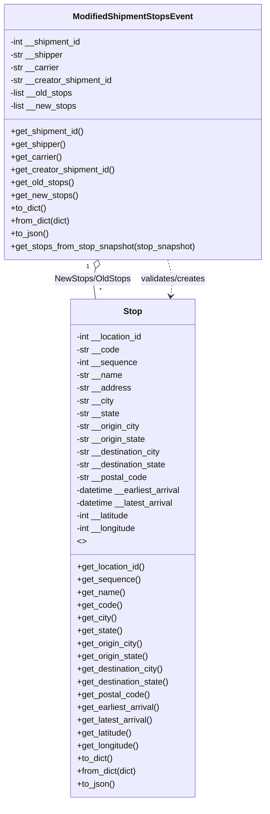

# Diagram: shipment_core/shipment_service/shipment_service/shipments/ModifiedShipmentStopsEvent.py

> Auto-generated by Obscura crawlers

## Mermaid

### SVG

<svg id="container" width="500.609375" xmlns="http://www.w3.org/2000/svg" class="classDiagram" height="1506" viewBox="0 0 500.609375 1506" role="graphics-document document" aria-roledescription="class"><g><defs><marker id="container_class-aggregationStart" class="marker aggregation class" refX="18" refY="7" markerWidth="190" markerHeight="240" orient="auto"><path d="M 18,7 L9,13 L1,7 L9,1 Z"></path></marker></defs><defs><marker id="container_class-aggregationEnd" class="marker aggregation class" refX="1" refY="7" markerWidth="20" markerHeight="28" orient="auto"><path d="M 18,7 L9,13 L1,7 L9,1 Z"></path></marker></defs><defs><marker id="container_class-extensionStart" class="marker extension class" refX="18" refY="7" markerWidth="190" markerHeight="240" orient="auto"><path d="M 1,7 L18,13 V 1 Z"></path></marker></defs><defs><marker id="container_class-extensionEnd" class="marker extension class" refX="1" refY="7" markerWidth="20" markerHeight="28" orient="auto"><path d="M 1,1 V 13 L18,7 Z"></path></marker></defs><defs><marker id="container_class-compositionStart" class="marker composition class" refX="18" refY="7" markerWidth="190" markerHeight="240" orient="auto"><path d="M 18,7 L9,13 L1,7 L9,1 Z"></path></marker></defs><defs><marker id="container_class-compositionEnd" class="marker composition class" refX="1" refY="7" markerWidth="20" markerHeight="28" orient="auto"><path d="M 18,7 L9,13 L1,7 L9,1 Z"></path></marker></defs><defs><marker id="container_class-dependencyStart" class="marker dependency class" refX="6" refY="7" markerWidth="190" markerHeight="240" orient="auto"><path d="M 5,7 L9,13 L1,7 L9,1 Z"></path></marker></defs><defs><marker id="container_class-dependencyEnd" class="marker dependency class" refX="13" refY="7" markerWidth="20" markerHeight="28" orient="auto"><path d="M 18,7 L9,13 L14,7 L9,1 Z"></path></marker></defs><defs><marker id="container_class-lollipopStart" class="marker lollipop class" refX="13" refY="7" markerWidth="190" markerHeight="240" orient="auto"><circle stroke="black" fill="transparent" cx="7" cy="7" r="6"></circle></marker></defs><defs><marker id="container_class-lollipopEnd" class="marker lollipop class" refX="1" refY="7" markerWidth="190" markerHeight="240" orient="auto"><circle stroke="black" fill="transparent" cx="7" cy="7" r="6"></circle></marker></defs><g class="root"><g class="clusters"></g><g class="edgePaths"><path d="M178.336,504.609L177.383,508.008C176.43,511.406,174.523,518.203,174.519,527.768C174.515,537.333,176.412,549.667,177.36,555.833L178.309,562" id="id_ModifiedShipmentStopsEvent_Stop_1" class="edge-thickness-normal edge-pattern-solid relation" style=";;;" data-edge="true" data-et="edge" data-id="id_ModifiedShipmentStopsEvent_Stop_1" data-points="W3sieCI6MTgyLjk5NDIxODE4NTkyMDU3LCJ5Ijo0ODh9LHsieCI6MTcyLjYxNzE4NzUsInkiOjUyNX0seyJ4IjoxNzguMzA5MTQyOTQ1NTQ0NTUsInkiOjU2Mn1d" marker-start="url(#container_class-aggregationStart)"></path><path d="M317.615,488L319.345,494.167C321.074,500.333,324.533,512.667,325.466,524.012C326.399,535.357,324.806,545.713,324.009,550.891L323.213,556.07" id="id_ModifiedShipmentStopsEvent_Stop_2" class="edge-thickness-normal edge-pattern-dashed relation" style=";;;" data-edge="true" data-et="edge" data-id="id_ModifiedShipmentStopsEvent_Stop_2" data-points="W3sieCI6MzE3LjYxNTE1NjgxNDA3OTQ2LCJ5Ijo0ODh9LHsieCI6MzI3Ljk5MjE4NzUsInkiOjUyNX0seyJ4IjozMjIuMzAwMjMyMDU0NDU1NSwieSI6NTYyfV0=" marker-end="url(#container_class-dependencyEnd)"></path></g><g class="edgeLabels"><g class="edgeLabel" transform="translate(172.75118, 524.52225)"><g class="label" data-id="id_ModifiedShipmentStopsEvent_Stop_1" transform="translate(-72.765625, -12)"><foreignObject width="145.53125" height="24">

NewStops/OldStops

</foreignObject></g></g><g class="edgeLabel" transform="translate(327.8582, 524.52225)"><g class="label" data-id="id_ModifiedShipmentStopsEvent_Stop_2" transform="translate(-62.609375, -12)"><foreignObject width="125.21875" height="24">

validates/creates

</foreignObject></g></g><g class="edgeTerminals" transform="translate(163.8257709342161, 500.79924283573257)"><g class="inner" transform="translate(0, 0)"><foreignObject style="width: 9px; height: 12px;">
1
</foreignObject></g></g><g class="edgeTerminals" transform="translate(185.4738979527952, 537.4227488395919)"><g class="inner" transform="translate(0, 0)"></g><foreignObject style="width: 9px; height: 12px;">
*
</foreignObject></g></g><g class="nodes"><g class="node default" id="classId-Stop-0" transform="translate(250.3046875, 1030)"><g class="basic label-container"><path d="M-121.046875 -468 L121.046875 -468 L121.046875 468 L-121.046875 468" stroke="none" stroke-width="0" fill="#ECECFF" style=""></path><path d="M-121.046875 -468 C-48.80431643794908 -468, 23.438242124101833 -468, 121.046875 -468 M-121.046875 -468 C-71.45722209329048 -468, -21.86756918658098 -468, 121.046875 -468 M121.046875 -468 C121.046875 -200.41318273367796, 121.046875 67.17363453264409, 121.046875 468 M121.046875 -468 C121.046875 -97.95418097694136, 121.046875 272.0916380461173, 121.046875 468 M121.046875 468 C68.71795858169699 468, 16.389042163393995 468, -121.046875 468 M121.046875 468 C35.0946717327746 468, -50.8575315344508 468, -121.046875 468 M-121.046875 468 C-121.046875 144.28233876527844, -121.046875 -179.43532246944312, -121.046875 -468 M-121.046875 468 C-121.046875 249.54841289136073, -121.046875 31.096825782721453, -121.046875 -468" stroke="#9370DB" stroke-width="1.3" fill="none" stroke-dasharray="0 0" style=""></path></g><g class="annotation-group text" transform="translate(0, -444)"></g><g class="label-group text" transform="translate(-16.96875, -444)"><g class="label" style="font-weight: bolder" transform="translate(0,-12)"><foreignObject width="33.9375" height="24">

Stop

</foreignObject></g></g><g class="members-group text" transform="translate(-109.046875, -396)"><g class="label" style="" transform="translate(0,-12)"><foreignObject width="128.234375" height="24">

-int __location_id

</foreignObject></g><g class="label" style="" transform="translate(0,12)"><foreignObject width="81.234375" height="24">

-str __code

</foreignObject></g><g class="label" style="" transform="translate(0,36)"><foreignObject width="116.0625" height="24">

-int __sequence

</foreignObject></g><g class="label" style="" transform="translate(0,60)"><foreignObject width="87.109375" height="24">

-str __name

</foreignObject></g><g class="label" style="" transform="translate(0,84)"><foreignObject width="103.3125" height="24">

-str __address

</foreignObject></g><g class="label" style="" transform="translate(0,108)"><foreignObject width="72.015625" height="24">

-str __city

</foreignObject></g><g class="label" style="" transform="translate(0,132)"><foreignObject width="82.703125" height="24">

-str __state

</foreignObject></g><g class="label" style="" transform="translate(0,156)"><foreignObject width="122.25" height="24">

-str __origin_city

</foreignObject></g><g class="label" style="" transform="translate(0,180)"><foreignObject width="132.9375" height="24">

-str __origin_state

</foreignObject></g><g class="label" style="" transform="translate(0,204)"><foreignObject width="163.140625" height="24">

-str __destination_city

</foreignObject></g><g class="label" style="" transform="translate(0,228)"><foreignObject width="173.828125" height="24">

-str __destination_state

</foreignObject></g><g class="label" style="" transform="translate(0,252)"><foreignObject width="134.78125" height="24">

-str __postal_code

</foreignObject></g><g class="label" style="" transform="translate(0,276)"><foreignObject width="201.125" height="24">

-datetime __earliest_arrival

</foreignObject></g><g class="label" style="" transform="translate(0,300)"><foreignObject width="187.5" height="24">

-datetime __latest_arrival

</foreignObject></g><g class="label" style="" transform="translate(0,324)"><foreignObject width="103.65625" height="24">

-int __latitude

</foreignObject></g><g class="label" style="" transform="translate(0,348)"><foreignObject width="116.21875" height="24">

-int __longitude

</foreignObject></g><g class="label" style="" transform="translate(0,372)"><foreignObject width="16.015625" height="24">

&lt;&gt;

</foreignObject></g></g><g class="methods-group text" transform="translate(-109.046875, 36)"><g class="label" style="" transform="translate(0,-12)"><foreignObject width="130.625" height="24">

+get_location_id()

</foreignObject></g><g class="label" style="" transform="translate(0,12)"><foreignObject width="118.453125" height="24">

+get_sequence()

</foreignObject></g><g class="label" style="" transform="translate(0,36)"><foreignObject width="89.75" height="24">

+get_name()

</foreignObject></g><g class="label" style="" transform="translate(0,60)"><foreignObject width="83.875" height="24">

+get_code()

</foreignObject></g><g class="label" style="" transform="translate(0,84)"><foreignObject width="74.640625" height="24">

+get_city()

</foreignObject></g><g class="label" style="" transform="translate(0,108)"><foreignObject width="85.34375" height="24">

+get_state()

</foreignObject></g><g class="label" style="" transform="translate(0,132)"><foreignObject width="124.890625" height="24">

+get_origin_city()

</foreignObject></g><g class="label" style="" transform="translate(0,156)"><foreignObject width="135.578125" height="24">

+get_origin_state()

</foreignObject></g><g class="label" style="" transform="translate(0,180)"><foreignObject width="165.78125" height="24">

+get_destination_city()

</foreignObject></g><g class="label" style="" transform="translate(0,204)"><foreignObject width="176.46875" height="24">

+get_destination_state()

</foreignObject></g><g class="label" style="" transform="translate(0,228)"><foreignObject width="137.421875" height="24">

+get_postal_code()

</foreignObject></g><g class="label" style="" transform="translate(0,252)"><foreignObject width="157.9375" height="24">

+get_earliest_arrival()

</foreignObject></g><g class="label" style="" transform="translate(0,276)"><foreignObject width="144.3125" height="24">

+get_latest_arrival()

</foreignObject></g><g class="label" style="" transform="translate(0,300)"><foreignObject width="106.0625" height="24">

+get_latitude()

</foreignObject></g><g class="label" style="" transform="translate(0,324)"><foreignObject width="118.609375" height="24">

+get_longitude()

</foreignObject></g><g class="label" style="" transform="translate(0,348)"><foreignObject width="68.34375" height="24">

+to_dict()

</foreignObject></g><g class="label" style="" transform="translate(0,372)"><foreignObject width="115.234375" height="24">

+from_dict(dict)

</foreignObject></g><g class="label" style="" transform="translate(0,396)"><foreignObject width="72.40625" height="24">

+to_json()

</foreignObject></g></g><g class="divider" style=""><path d="M-121.046875 -420 C-61.66507984375388 -420, -2.2832846875077593 -420, 121.046875 -420 M-121.046875 -420 C-56.53569917161661 -420, 7.975476656766773 -420, 121.046875 -420" stroke="#9370DB" stroke-width="1.3" fill="none" stroke-dasharray="0 0" style=""></path></g><g class="divider" style=""><path d="M-121.046875 12 C-33.47329864953798 12, 54.10027770092404 12, 121.046875 12 M-121.046875 12 C-38.86608480825531 12, 43.31470538348938 12, 121.046875 12" stroke="#9370DB" stroke-width="1.3" fill="none" stroke-dasharray="0 0" style=""></path></g></g><g class="node default" id="classId-ModifiedShipmentStopsEvent-1" transform="translate(250.3046875, 248)"><g class="basic label-container"><path d="M-242.3046875 -240 L242.3046875 -240 L242.3046875 240 L-242.3046875 240" stroke="none" stroke-width="0" fill="#ECECFF" style=""></path><path d="M-242.3046875 -240 C-128.12076877785785 -240, -13.936850055715666 -240, 242.3046875 -240 M-242.3046875 -240 C-136.9291728256183 -240, -31.55365815123659 -240, 242.3046875 -240 M242.3046875 -240 C242.3046875 -127.24607701843466, 242.3046875 -14.492154036869323, 242.3046875 240 M242.3046875 -240 C242.3046875 -143.54238749682787, 242.3046875 -47.084774993655714, 242.3046875 240 M242.3046875 240 C138.57697756453544 240, 34.84926762907088 240, -242.3046875 240 M242.3046875 240 C82.03881468211355 240, -78.2270581357729 240, -242.3046875 240 M-242.3046875 240 C-242.3046875 66.54498017495487, -242.3046875 -106.91003965009025, -242.3046875 -240 M-242.3046875 240 C-242.3046875 89.08396359412103, -242.3046875 -61.83207281175794, -242.3046875 -240" stroke="#9370DB" stroke-width="1.3" fill="none" stroke-dasharray="0 0" style=""></path></g><g class="annotation-group text" transform="translate(0, -216)"></g><g class="label-group text" transform="translate(-108.171875, -216)"><g class="label" style="font-weight: bolder" transform="translate(0,-12)"><foreignObject width="216.34375" height="24">

ModifiedShipmentStopsEvent

</foreignObject></g></g><g class="members-group text" transform="translate(-230.3046875, -168)"><g class="label" style="" transform="translate(0,-12)"><foreignObject width="137.6875" height="24">

-int __shipment_id

</foreignObject></g><g class="label" style="" transform="translate(0,12)"><foreignObject width="101.859375" height="24">

-str __shipper

</foreignObject></g><g class="label" style="" transform="translate(0,36)"><foreignObject width="94.234375" height="24">

-str __carrier

</foreignObject></g><g class="label" style="" transform="translate(0,60)"><foreignObject width="195.828125" height="24">

-str __creator_shipment_id

</foreignObject></g><g class="label" style="" transform="translate(0,84)"><foreignObject width="120.46875" height="24">

-list __old_stops

</foreignObject></g><g class="label" style="" transform="translate(0,108)"><foreignObject width="126.515625" height="24">

-list __new_stops

</foreignObject></g></g><g class="methods-group text" transform="translate(-230.3046875, 0)"><g class="label" style="" transform="translate(0,-12)"><foreignObject width="140.09375" height="24">

+get_shipment_id()

</foreignObject></g><g class="label" style="" transform="translate(0,12)"><foreignObject width="104.5" height="24">

+get_shipper()

</foreignObject></g><g class="label" style="" transform="translate(0,36)"><foreignObject width="96.875" height="24">

+get_carrier()

</foreignObject></g><g class="label" style="" transform="translate(0,60)"><foreignObject width="198.46875" height="24">

+get_creator_shipment_id()

</foreignObject></g><g class="label" style="" transform="translate(0,84)"><foreignObject width="120.09375" height="24">

+get_old_stops()

</foreignObject></g><g class="label" style="" transform="translate(0,108)"><foreignObject width="126.140625" height="24">

+get_new_stops()

</foreignObject></g><g class="label" style="" transform="translate(0,132)"><foreignObject width="68.34375" height="24">

+to_dict()

</foreignObject></g><g class="label" style="" transform="translate(0,156)"><foreignObject width="115.234375" height="24">

+from_dict(dict)

</foreignObject></g><g class="label" style="" transform="translate(0,180)"><foreignObject width="72.40625" height="24">

+to_json()

</foreignObject></g><g class="label" style="" transform="translate(0,204)"><foreignObject width="352.4375" height="24">

+get_stops_from_stop_snapshot(stop_snapshot)

</foreignObject></g></g><g class="divider" style=""><path d="M-242.3046875 -192 C-84.84379817379971 -192, 72.61709115240058 -192, 242.3046875 -192 M-242.3046875 -192 C-83.70417210583554 -192, 74.89634328832892 -192, 242.3046875 -192" stroke="#9370DB" stroke-width="1.3" fill="none" stroke-dasharray="0 0" style=""></path></g><g class="divider" style=""><path d="M-242.3046875 -24 C-143.33512640470659 -24, -44.36556530941317 -24, 242.3046875 -24 M-242.3046875 -24 C-132.70717482492682 -24, -23.10966214985362 -24, 242.3046875 -24" stroke="#9370DB" stroke-width="1.3" fill="none" stroke-dasharray="0 0" style=""></path></g></g></g></g></g></svg>
