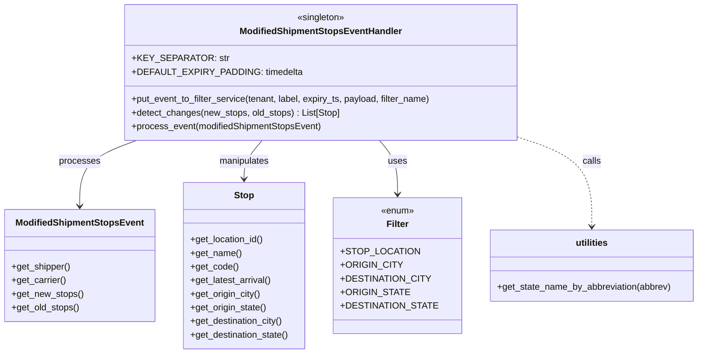

# Diagram: shipment_core/shipment_service/shipment_service/shipments/ModifiedShipmentStopsEventHandler.py


> Auto-generated by Obscura crawlers

## Diagram 1



### SVG

<svg id="container" width="1207.6328125" xmlns="http://www.w3.org/2000/svg" class="classDiagram" height="624" viewBox="0 0 1207.6328125 624" role="graphics-document document" aria-roledescription="class"><style>#container{font-family:"trebuchet ms",verdana,arial,sans-serif;font-size:16px;fill:#333;}@keyframes edge-animation-frame{from{stroke-dashoffset:0;}}@keyframes dash{to{stroke-dashoffset:0;}}#container .edge-animation-slow{stroke-dasharray:9,5!important;stroke-dashoffset:900;animation:dash 50s linear infinite;stroke-linecap:round;}#container .edge-animation-fast{stroke-dasharray:9,5!important;stroke-dashoffset:900;animation:dash 20s linear infinite;stroke-linecap:round;}#container .error-icon{fill:#552222;}#container .error-text{fill:#552222;stroke:#552222;}#container .edge-thickness-normal{stroke-width:1px;}#container .edge-thickness-thick{stroke-width:3.5px;}#container .edge-pattern-solid{stroke-dasharray:0;}#container .edge-thickness-invisible{stroke-width:0;fill:none;}#container .edge-pattern-dashed{stroke-dasharray:3;}#container .edge-pattern-dotted{stroke-dasharray:2;}#container .marker{fill:#333333;stroke:#333333;}#container .marker.cross{stroke:#333333;}#container svg{font-family:"trebuchet ms",verdana,arial,sans-serif;font-size:16px;}#container p{margin:0;}#container g.classGroup text{fill:#9370DB;stroke:none;font-family:"trebuchet ms",verdana,arial,sans-serif;font-size:10px;}#container g.classGroup text .title{font-weight:bolder;}#container .nodeLabel,#container .edgeLabel{color:#131300;}#container .edgeLabel .label rect{fill:#ECECFF;}#container .label text{fill:#131300;}#container .labelBkg{background:#ECECFF;}#container .edgeLabel .label span{background:#ECECFF;}#container .classTitle{font-weight:bolder;}#container .node rect,#container .node circle,#container .node ellipse,#container .node polygon,#container .node path{fill:#ECECFF;stroke:#9370DB;stroke-width:1px;}#container .divider{stroke:#9370DB;stroke-width:1;}#container g.clickable{cursor:pointer;}#container g.classGroup rect{fill:#ECECFF;stroke:#9370DB;}#container g.classGroup line{stroke:#9370DB;stroke-width:1;}#container .classLabel .box{stroke:none;stroke-width:0;fill:#ECECFF;opacity:0.5;}#container .classLabel .label{fill:#9370DB;font-size:10px;}#container .relation{stroke:#333333;stroke-width:1;fill:none;}#container .dashed-line{stroke-dasharray:3;}#container .dotted-line{stroke-dasharray:1 2;}#container #compositionStart,#container .composition{fill:#333333!important;stroke:#333333!important;stroke-width:1;}#container #compositionEnd,#container .composition{fill:#333333!important;stroke:#333333!important;stroke-width:1;}#container #dependencyStart,#container .dependency{fill:#333333!important;stroke:#333333!important;stroke-width:1;}#container #dependencyStart,#container .dependency{fill:#333333!important;stroke:#333333!important;stroke-width:1;}#container #extensionStart,#container .extension{fill:transparent!important;stroke:#333333!important;stroke-width:1;}#container #extensionEnd,#container .extension{fill:transparent!important;stroke:#333333!important;stroke-width:1;}#container #aggregationStart,#container .aggregation{fill:transparent!important;stroke:#333333!important;stroke-width:1;}#container #aggregationEnd,#container .aggregation{fill:transparent!important;stroke:#333333!important;stroke-width:1;}#container #lollipopStart,#container .lollipop{fill:#ECECFF!important;stroke:#333333!important;stroke-width:1;}#container #lollipopEnd,#container .lollipop{fill:#ECECFF!important;stroke:#333333!important;stroke-width:1;}#container .edgeTerminals{font-size:11px;line-height:initial;}#container .classTitleText{text-anchor:middle;font-size:18px;fill:#333;}#container .label-icon{display:inline-block;height:1em;overflow:visible;vertical-align:-0.125em;}#container .node .label-icon path{fill:currentColor;stroke:revert;stroke-width:revert;}#container :root{--mermaid-font-family:"trebuchet ms",verdana,arial,sans-serif;}</style><g><defs><marker id="container_class-aggregationStart" class="marker aggregation class" refX="18" refY="7" markerWidth="190" markerHeight="240" orient="auto"><path d="M 18,7 L9,13 L1,7 L9,1 Z"></path></marker></defs><defs><marker id="container_class-aggregationEnd" class="marker aggregation class" refX="1" refY="7" markerWidth="20" markerHeight="28" orient="auto"><path d="M 18,7 L9,13 L1,7 L9,1 Z"></path></marker></defs><defs><marker id="container_class-extensionStart" class="marker extension class" refX="18" refY="7" markerWidth="190" markerHeight="240" orient="auto"><path d="M 1,7 L18,13 V 1 Z"></path></marker></defs><defs><marker id="container_class-extensionEnd" class="marker extension class" refX="1" refY="7" markerWidth="20" markerHeight="28" orient="auto"><path d="M 1,1 V 13 L18,7 Z"></path></marker></defs><defs><marker id="container_class-compositionStart" class="marker composition class" refX="18" refY="7" markerWidth="190" markerHeight="240" orient="auto"><path d="M 18,7 L9,13 L1,7 L9,1 Z"></path></marker></defs><defs><marker id="container_class-compositionEnd" class="marker composition class" refX="1" refY="7" markerWidth="20" markerHeight="28" orient="auto"><path d="M 18,7 L9,13 L1,7 L9,1 Z"></path></marker></defs><defs><marker id="container_class-dependencyStart" class="marker dependency class" refX="6" refY="7" markerWidth="190" markerHeight="240" orient="auto"><path d="M 5,7 L9,13 L1,7 L9,1 Z"></path></marker></defs><defs><marker id="container_class-dependencyEnd" class="marker dependency class" refX="13" refY="7" markerWidth="20" markerHeight="28" orient="auto"><path d="M 18,7 L9,13 L14,7 L9,1 Z"></path></marker></defs><defs><marker id="container_class-lollipopStart" class="marker lollipop class" refX="13" refY="7" markerWidth="190" markerHeight="240" orient="auto"><circle stroke="black" fill="transparent" cx="7" cy="7" r="6"></circle></marker></defs><defs><marker id="container_class-lollipopEnd" class="marker lollipop class" refX="1" refY="7" markerWidth="190" markerHeight="240" orient="auto"><circle stroke="black" fill="transparent" cx="7" cy="7" r="6"></circle></marker></defs><g class="root"><g class="clusters"></g><g class="edgePaths"><path d="M235.775,248L219.339,254.167C202.902,260.333,170.029,272.667,153.593,292C137.156,311.333,137.156,337.667,137.156,350.833L137.156,364" id="id_ModifiedShipmentStopsEventHandler_ModifiedShipmentStopsEvent_1" class="edge-thickness-normal edge-pattern-solid relation" style=";;;" data-edge="true" data-et="edge" data-id="id_ModifiedShipmentStopsEventHandler_ModifiedShipmentStopsEvent_1" data-points="W3sieCI6MjM1Ljc3NTM1MzMwNDE0MDE0LCJ5IjoyNDh9LHsieCI6MTM3LjE1NjI1LCJ5IjoyODV9LHsieCI6MTM3LjE1NjI1LCJ5IjozNzB9XQ==" marker-end="url(#container_class-dependencyEnd)"></path><path d="M455.807,248L450.678,254.167C445.549,260.333,435.29,272.667,430.161,284C425.031,295.333,425.031,305.667,425.031,310.833L425.031,316" id="id_ModifiedShipmentStopsEventHandler_Stop_2" class="edge-thickness-normal edge-pattern-solid relation" style=";;;" data-edge="true" data-et="edge" data-id="id_ModifiedShipmentStopsEventHandler_Stop_2" data-points="W3sieCI6NDU1LjgwNzIwMDQzNzg5ODEsInkiOjI0OH0seyJ4Ijo0MjUuMDMxMjUsInkiOjI4NX0seyJ4Ijo0MjUuMDMxMjUsInkiOjMyMn1d" marker-end="url(#container_class-dependencyEnd)"></path><path d="M655.435,248L660.564,254.167C665.694,260.333,675.952,272.667,681.082,288.5C686.211,304.333,686.211,323.667,686.211,333.333L686.211,343" id="id_ModifiedShipmentStopsEventHandler_Filter_3" class="edge-thickness-normal edge-pattern-solid relation" style=";;;" data-edge="true" data-et="edge" data-id="id_ModifiedShipmentStopsEventHandler_Filter_3" data-points="W3sieCI6NjU1LjQzNDk4NzA2MjEwMTksInkiOjI0OH0seyJ4Ijo2ODYuMjEwOTM3NSwieSI6Mjg1fSx7IngiOjY4Ni4yMTA5Mzc1LCJ5IjozNDl9XQ==" marker-end="url(#container_class-dependencyEnd)"></path><path d="M903.727,245.905L922.964,252.421C942.202,258.937,980.677,271.968,999.915,297.651C1019.152,323.333,1019.152,361.667,1019.152,380.833L1019.152,400" id="id_ModifiedShipmentStopsEventHandler_utilities_4" class="edge-thickness-normal edge-pattern-dashed relation" style=";;;" data-edge="true" data-et="edge" data-id="id_ModifiedShipmentStopsEventHandler_utilities_4" data-points="W3sieCI6OTAzLjcyNjU2MjUsInkiOjI0NS45MDQ3OTg0MjI0MzY0NH0seyJ4IjoxMDE5LjE1MjM0Mzc1LCJ5IjoyODV9LHsieCI6MTAxOS4xNTIzNDM3NSwieSI6NDA2fV0=" marker-end="url(#container_class-dependencyEnd)"></path></g><g class="edgeLabels"><g class="edgeLabel" transform="translate(137.15625, 285)"><g class="label" data-id="id_ModifiedShipmentStopsEventHandler_ModifiedShipmentStopsEvent_1" transform="translate(-35.7890625, -12)"><foreignObject width="71.578125" height="24"><div xmlns="http://www.w3.org/1999/xhtml" class="labelBkg" style="display: table-cell; white-space: nowrap; line-height: 1.5; max-width: 200px; text-align: center;"><span class="edgeLabel"><p>processes</p></span></div></foreignObject></g></g><g class="edgeLabel" transform="translate(425.03125, 285)"><g class="label" data-id="id_ModifiedShipmentStopsEventHandler_Stop_2" transform="translate(-45.0859375, -12)"><foreignObject width="90.171875" height="24"><div xmlns="http://www.w3.org/1999/xhtml" class="labelBkg" style="display: table-cell; white-space: nowrap; line-height: 1.5; max-width: 200px; text-align: center;"><span class="edgeLabel"><p>manipulates</p></span></div></foreignObject></g></g><g class="edgeLabel" transform="translate(686.2109375, 285)"><g class="label" data-id="id_ModifiedShipmentStopsEventHandler_Filter_3" transform="translate(-16.4921875, -12)"><foreignObject width="32.984375" height="24"><div xmlns="http://www.w3.org/1999/xhtml" class="labelBkg" style="display: table-cell; white-space: nowrap; line-height: 1.5; max-width: 200px; text-align: center;"><span class="edgeLabel"><p>uses</p></span></div></foreignObject></g></g><g class="edgeLabel" transform="translate(1019.15234375, 285)"><g class="label" data-id="id_ModifiedShipmentStopsEventHandler_utilities_4" transform="translate(-16.4453125, -12)"><foreignObject width="32.890625" height="24"><div xmlns="http://www.w3.org/1999/xhtml" class="labelBkg" style="display: table-cell; white-space: nowrap; line-height: 1.5; max-width: 200px; text-align: center;"><span class="edgeLabel"><p>calls</p></span></div></foreignObject></g></g></g><g class="nodes"><g class="node default" id="classId-ModifiedShipmentStopsEventHandler-0" transform="translate(555.62109375, 128)"><g class="basic label-container"><path d="M-348.10546875 -120 L348.10546875 -120 L348.10546875 120 L-348.10546875 120" stroke="none" stroke-width="0" fill="#ECECFF" style=""></path><path d="M-348.10546875 -120 C-108.54648053499966 -120, 131.01250768000068 -120, 348.10546875 -120 M-348.10546875 -120 C-127.63718451625078 -120, 92.83109971749843 -120, 348.10546875 -120 M348.10546875 -120 C348.10546875 -67.42817267808688, 348.10546875 -14.856345356173762, 348.10546875 120 M348.10546875 -120 C348.10546875 -53.85476116190351, 348.10546875 12.290477676192978, 348.10546875 120 M348.10546875 120 C169.89743751748676 120, -8.31059371502647 120, -348.10546875 120 M348.10546875 120 C71.84926049554491 120, -204.40694775891018 120, -348.10546875 120 M-348.10546875 120 C-348.10546875 43.41493810303483, -348.10546875 -33.170123793930344, -348.10546875 -120 M-348.10546875 120 C-348.10546875 29.291433234969375, -348.10546875 -61.41713353006125, -348.10546875 -120" stroke="#9370DB" stroke-width="1.3" fill="none" stroke-dasharray="0 0" style=""></path></g><g class="annotation-group text" transform="translate(-42.765625, -96)"><g class="label" style="" transform="translate(0,-12)"><foreignObject width="85.53125" height="24"><div xmlns="http://www.w3.org/1999/xhtml" style="display: table-cell; white-space: nowrap; line-height: 1.5; max-width: 136px; text-align: center;"><span class="nodeLabel markdown-node-label" style=""><p>«singleton»</p></span></div></foreignObject></g></g><g class="label-group text" transform="translate(-137.2578125, -72)"><g class="label" style="font-weight: bolder" transform="translate(0,-12)"><foreignObject width="274.515625" height="24"><div xmlns="http://www.w3.org/1999/xhtml" style="display: table-cell; white-space: nowrap; line-height: 1.5; max-width: 322px; text-align: center;"><span class="nodeLabel markdown-node-label" style=""><p>ModifiedShipmentStopsEventHandler</p></span></div></foreignObject></g></g><g class="members-group text" transform="translate(-336.10546875, -24)"><g class="label" style="" transform="translate(0,-12)"><foreignObject width="150.21875" height="24"><div xmlns="http://www.w3.org/1999/xhtml" style="display: table-cell; white-space: nowrap; line-height: 1.5; max-width: 208px; text-align: center;"><span class="nodeLabel markdown-node-label" style=""><p>+KEY_SEPARATOR: str</p></span></div></foreignObject></g><g class="label" style="" transform="translate(0,12)"><foreignObject width="274.265625" height="24"><div xmlns="http://www.w3.org/1999/xhtml" style="display: table-cell; white-space: nowrap; line-height: 1.5; max-width: 332px; text-align: center;"><span class="nodeLabel markdown-node-label" style=""><p>+DEFAULT_EXPIRY_PADDING: timedelta</p></span></div></foreignObject></g></g><g class="methods-group text" transform="translate(-336.10546875, 48)"><g class="label" style="" transform="translate(0,-12)"><foreignObject width="534.953125" height="24"><div xmlns="http://www.w3.org/1999/xhtml" style="display: table-cell; white-space: nowrap; line-height: 1.5; max-width: 592px; text-align: center;"><span class="nodeLabel markdown-node-label" style=""><p>+put_event_to_filter_service(tenant, label, expiry_ts, payload, filter_name)</p></span></div></foreignObject></g><g class="label" style="" transform="translate(0,12)"><foreignObject width="369.28125" height="24"><div xmlns="http://www.w3.org/1999/xhtml" style="display: table-cell; white-space: nowrap; line-height: 1.5; max-width: 427px; text-align: center;"><span class="nodeLabel markdown-node-label" style=""><p>+detect_changes(new_stops, old_stops) : List[Stop]</p></span></div></foreignObject></g><g class="label" style="" transform="translate(0,36)"><foreignObject width="336.5625" height="24"><div xmlns="http://www.w3.org/1999/xhtml" style="display: table-cell; white-space: nowrap; line-height: 1.5; max-width: 394px; text-align: center;"><span class="nodeLabel markdown-node-label" style=""><p>+process_event(modifiedShipmentStopsEvent)</p></span></div></foreignObject></g></g><g class="divider" style=""><path d="M-348.10546875 -48 C-169.3415515870863 -48, 9.422365575827428 -48, 348.10546875 -48 M-348.10546875 -48 C-96.25949282182827 -48, 155.58648310634345 -48, 348.10546875 -48" stroke="#9370DB" stroke-width="1.3" fill="none" stroke-dasharray="0 0" style=""></path></g><g class="divider" style=""><path d="M-348.10546875 24 C-99.35992231385762 24, 149.38562412228475 24, 348.10546875 24 M-348.10546875 24 C-188.58507948450276 24, -29.064690219005513 24, 348.10546875 24" stroke="#9370DB" stroke-width="1.3" fill="none" stroke-dasharray="0 0" style=""></path></g></g><g class="node default" id="classId-ModifiedShipmentStopsEvent-1" transform="translate(137.15625, 469)"><g class="basic label-container"><path d="M-129.15625 -99 L129.15625 -99 L129.15625 99 L-129.15625 99" stroke="none" stroke-width="0" fill="#ECECFF" style=""></path><path d="M-129.15625 -99 C-67.72895754312495 -99, -6.301665086249912 -99, 129.15625 -99 M-129.15625 -99 C-60.47308393911008 -99, 8.210082121779834 -99, 129.15625 -99 M129.15625 -99 C129.15625 -20.8434769231049, 129.15625 57.3130461537902, 129.15625 99 M129.15625 -99 C129.15625 -20.40715050277612, 129.15625 58.18569899444776, 129.15625 99 M129.15625 99 C71.5818187873652 99, 14.007387574730387 99, -129.15625 99 M129.15625 99 C35.38192886999991 99, -58.39239226000018 99, -129.15625 99 M-129.15625 99 C-129.15625 50.57886251754579, -129.15625 2.1577250350915733, -129.15625 -99 M-129.15625 99 C-129.15625 35.231542584900026, -129.15625 -28.536914830199947, -129.15625 -99" stroke="#9370DB" stroke-width="1.3" fill="none" stroke-dasharray="0 0" style=""></path></g><g class="annotation-group text" transform="translate(0, -75)"></g><g class="label-group text" transform="translate(-108.171875, -75)"><g class="label" style="font-weight: bolder" transform="translate(0,-12)"><foreignObject width="216.34375" height="24"><div xmlns="http://www.w3.org/1999/xhtml" style="display: table-cell; white-space: nowrap; line-height: 1.5; max-width: 264px; text-align: center;"><span class="nodeLabel markdown-node-label" style=""><p>ModifiedShipmentStopsEvent</p></span></div></foreignObject></g></g><g class="members-group text" transform="translate(-117.15625, -27)"></g><g class="methods-group text" transform="translate(-117.15625, 3)"><g class="label" style="" transform="translate(0,-12)"><foreignObject width="104.5" height="24"><div xmlns="http://www.w3.org/1999/xhtml" style="display: table-cell; white-space: nowrap; line-height: 1.5; max-width: 162px; text-align: center;"><span class="nodeLabel markdown-node-label" style=""><p>+get_shipper()</p></span></div></foreignObject></g><g class="label" style="" transform="translate(0,12)"><foreignObject width="96.875" height="24"><div xmlns="http://www.w3.org/1999/xhtml" style="display: table-cell; white-space: nowrap; line-height: 1.5; max-width: 154px; text-align: center;"><span class="nodeLabel markdown-node-label" style=""><p>+get_carrier()</p></span></div></foreignObject></g><g class="label" style="" transform="translate(0,36)"><foreignObject width="126.140625" height="24"><div xmlns="http://www.w3.org/1999/xhtml" style="display: table-cell; white-space: nowrap; line-height: 1.5; max-width: 184px; text-align: center;"><span class="nodeLabel markdown-node-label" style=""><p>+get_new_stops()</p></span></div></foreignObject></g><g class="label" style="" transform="translate(0,60)"><foreignObject width="120.09375" height="24"><div xmlns="http://www.w3.org/1999/xhtml" style="display: table-cell; white-space: nowrap; line-height: 1.5; max-width: 177px; text-align: center;"><span class="nodeLabel markdown-node-label" style=""><p>+get_old_stops()</p></span></div></foreignObject></g></g><g class="divider" style=""><path d="M-129.15625 -51 C-77.45429730625196 -51, -25.752344612503904 -51, 129.15625 -51 M-129.15625 -51 C-45.81201018487964 -51, 37.53222963024072 -51, 129.15625 -51" stroke="#9370DB" stroke-width="1.3" fill="none" stroke-dasharray="0 0" style=""></path></g><g class="divider" style=""><path d="M-129.15625 -27 C-38.990006342901125 -27, 51.17623731419775 -27, 129.15625 -27 M-129.15625 -27 C-71.10523412187206 -27, -13.054218243744117 -27, 129.15625 -27" stroke="#9370DB" stroke-width="1.3" fill="none" stroke-dasharray="0 0" style=""></path></g></g><g class="node default" id="classId-Stop-2" transform="translate(425.03125, 469)"><g class="basic label-container"><path d="M-108.71875 -147 L108.71875 -147 L108.71875 147 L-108.71875 147" stroke="none" stroke-width="0" fill="#ECECFF" style=""></path><path d="M-108.71875 -147 C-55.17060106842773 -147, -1.6224521368554576 -147, 108.71875 -147 M-108.71875 -147 C-31.131530530406607 -147, 46.455688939186786 -147, 108.71875 -147 M108.71875 -147 C108.71875 -86.82868449059514, 108.71875 -26.657368981190274, 108.71875 147 M108.71875 -147 C108.71875 -64.36126162395564, 108.71875 18.277476752088717, 108.71875 147 M108.71875 147 C34.44625785904917 147, -39.82623428190166 147, -108.71875 147 M108.71875 147 C30.589042574801397 147, -47.54066485039721 147, -108.71875 147 M-108.71875 147 C-108.71875 43.51130384093098, -108.71875 -59.977392318138044, -108.71875 -147 M-108.71875 147 C-108.71875 41.93062655832158, -108.71875 -63.138746883356845, -108.71875 -147" stroke="#9370DB" stroke-width="1.3" fill="none" stroke-dasharray="0 0" style=""></path></g><g class="annotation-group text" transform="translate(0, -123)"></g><g class="label-group text" transform="translate(-16.96875, -123)"><g class="label" style="font-weight: bolder" transform="translate(0,-12)"><foreignObject width="33.9375" height="24"><div xmlns="http://www.w3.org/1999/xhtml" style="display: table-cell; white-space: nowrap; line-height: 1.5; max-width: 83px; text-align: center;"><span class="nodeLabel markdown-node-label" style=""><p>Stop</p></span></div></foreignObject></g></g><g class="members-group text" transform="translate(-96.71875, -75)"></g><g class="methods-group text" transform="translate(-96.71875, -45)"><g class="label" style="" transform="translate(0,-12)"><foreignObject width="130.625" height="24"><div xmlns="http://www.w3.org/1999/xhtml" style="display: table-cell; white-space: nowrap; line-height: 1.5; max-width: 188px; text-align: center;"><span class="nodeLabel markdown-node-label" style=""><p>+get_location_id()</p></span></div></foreignObject></g><g class="label" style="" transform="translate(0,12)"><foreignObject width="89.75" height="24"><div xmlns="http://www.w3.org/1999/xhtml" style="display: table-cell; white-space: nowrap; line-height: 1.5; max-width: 147px; text-align: center;"><span class="nodeLabel markdown-node-label" style=""><p>+get_name()</p></span></div></foreignObject></g><g class="label" style="" transform="translate(0,36)"><foreignObject width="83.875" height="24"><div xmlns="http://www.w3.org/1999/xhtml" style="display: table-cell; white-space: nowrap; line-height: 1.5; max-width: 141px; text-align: center;"><span class="nodeLabel markdown-node-label" style=""><p>+get_code()</p></span></div></foreignObject></g><g class="label" style="" transform="translate(0,60)"><foreignObject width="144.3125" height="24"><div xmlns="http://www.w3.org/1999/xhtml" style="display: table-cell; white-space: nowrap; line-height: 1.5; max-width: 202px; text-align: center;"><span class="nodeLabel markdown-node-label" style=""><p>+get_latest_arrival()</p></span></div></foreignObject></g><g class="label" style="" transform="translate(0,84)"><foreignObject width="124.890625" height="24"><div xmlns="http://www.w3.org/1999/xhtml" style="display: table-cell; white-space: nowrap; line-height: 1.5; max-width: 182px; text-align: center;"><span class="nodeLabel markdown-node-label" style=""><p>+get_origin_city()</p></span></div></foreignObject></g><g class="label" style="" transform="translate(0,108)"><foreignObject width="135.578125" height="24"><div xmlns="http://www.w3.org/1999/xhtml" style="display: table-cell; white-space: nowrap; line-height: 1.5; max-width: 193px; text-align: center;"><span class="nodeLabel markdown-node-label" style=""><p>+get_origin_state()</p></span></div></foreignObject></g><g class="label" style="" transform="translate(0,132)"><foreignObject width="165.78125" height="24"><div xmlns="http://www.w3.org/1999/xhtml" style="display: table-cell; white-space: nowrap; line-height: 1.5; max-width: 223px; text-align: center;"><span class="nodeLabel markdown-node-label" style=""><p>+get_destination_city()</p></span></div></foreignObject></g><g class="label" style="" transform="translate(0,156)"><foreignObject width="176.46875" height="24"><div xmlns="http://www.w3.org/1999/xhtml" style="display: table-cell; white-space: nowrap; line-height: 1.5; max-width: 234px; text-align: center;"><span class="nodeLabel markdown-node-label" style=""><p>+get_destination_state()</p></span></div></foreignObject></g></g><g class="divider" style=""><path d="M-108.71875 -99 C-47.83289601529721 -99, 13.052957969405583 -99, 108.71875 -99 M-108.71875 -99 C-28.716129669227826 -99, 51.28649066154435 -99, 108.71875 -99" stroke="#9370DB" stroke-width="1.3" fill="none" stroke-dasharray="0 0" style=""></path></g><g class="divider" style=""><path d="M-108.71875 -75 C-65.09163047050941 -75, -21.464510941018844 -75, 108.71875 -75 M-108.71875 -75 C-56.26252884285218 -75, -3.806307685704354 -75, 108.71875 -75" stroke="#9370DB" stroke-width="1.3" fill="none" stroke-dasharray="0 0" style=""></path></g></g><g class="node default" id="classId-Filter-3" transform="translate(686.2109375, 469)"><g class="basic label-container"><path d="M-102.4609375 -120 L102.4609375 -120 L102.4609375 120 L-102.4609375 120" stroke="none" stroke-width="0" fill="#ECECFF" style=""></path><path d="M-102.4609375 -120 C-45.715652061383985 -120, 11.029633377232031 -120, 102.4609375 -120 M-102.4609375 -120 C-23.10696389344703 -120, 56.24700971310594 -120, 102.4609375 -120 M102.4609375 -120 C102.4609375 -51.09849641937525, 102.4609375 17.803007161249496, 102.4609375 120 M102.4609375 -120 C102.4609375 -37.214649608635725, 102.4609375 45.57070078272855, 102.4609375 120 M102.4609375 120 C45.92473630797552 120, -10.611464884048956 120, -102.4609375 120 M102.4609375 120 C37.43515227768263 120, -27.590632944634734 120, -102.4609375 120 M-102.4609375 120 C-102.4609375 34.60054091463053, -102.4609375 -50.79891817073894, -102.4609375 -120 M-102.4609375 120 C-102.4609375 56.06505269587012, -102.4609375 -7.869894608259756, -102.4609375 -120" stroke="#9370DB" stroke-width="1.3" fill="none" stroke-dasharray="0 0" style=""></path></g><g class="annotation-group text" transform="translate(-29.53125, -96)"><g class="label" style="" transform="translate(0,-12)"><foreignObject width="59.0625" height="24"><div xmlns="http://www.w3.org/1999/xhtml" style="display: table-cell; white-space: nowrap; line-height: 1.5; max-width: 109px; text-align: center;"><span class="nodeLabel markdown-node-label" style=""><p>«enum»</p></span></div></foreignObject></g></g><g class="label-group text" transform="translate(-18.8671875, -72)"><g class="label" style="font-weight: bolder" transform="translate(0,-12)"><foreignObject width="37.734375" height="24"><div xmlns="http://www.w3.org/1999/xhtml" style="display: table-cell; white-space: nowrap; line-height: 1.5; max-width: 88px; text-align: center;"><span class="nodeLabel markdown-node-label" style=""><p>Filter</p></span></div></foreignObject></g></g><g class="members-group text" transform="translate(-90.4609375, -24)"><g class="label" style="" transform="translate(0,-12)"><foreignObject width="121.15625" height="24"><div xmlns="http://www.w3.org/1999/xhtml" style="display: table-cell; white-space: nowrap; line-height: 1.5; max-width: 179px; text-align: center;"><span class="nodeLabel markdown-node-label" style=""><p>+STOP_LOCATION</p></span></div></foreignObject></g><g class="label" style="" transform="translate(0,12)"><foreignObject width="97.640625" height="24"><div xmlns="http://www.w3.org/1999/xhtml" style="display: table-cell; white-space: nowrap; line-height: 1.5; max-width: 155px; text-align: center;"><span class="nodeLabel markdown-node-label" style=""><p>+ORIGIN_CITY</p></span></div></foreignObject></g><g class="label" style="" transform="translate(0,36)"><foreignObject width="140.78125" height="24"><div xmlns="http://www.w3.org/1999/xhtml" style="display: table-cell; white-space: nowrap; line-height: 1.5; max-width: 198px; text-align: center;"><span class="nodeLabel markdown-node-label" style=""><p>+DESTINATION_CITY</p></span></div></foreignObject></g><g class="label" style="" transform="translate(0,60)"><foreignObject width="108.25" height="24"><div xmlns="http://www.w3.org/1999/xhtml" style="display: table-cell; white-space: nowrap; line-height: 1.5; max-width: 166px; text-align: center;"><span class="nodeLabel markdown-node-label" style=""><p>+ORIGIN_STATE</p></span></div></foreignObject></g><g class="label" style="" transform="translate(0,84)"><foreignObject width="151.390625" height="24"><div xmlns="http://www.w3.org/1999/xhtml" style="display: table-cell; white-space: nowrap; line-height: 1.5; max-width: 209px; text-align: center;"><span class="nodeLabel markdown-node-label" style=""><p>+DESTINATION_STATE</p></span></div></foreignObject></g></g><g class="methods-group text" transform="translate(-90.4609375, 120)"></g><g class="divider" style=""><path d="M-102.4609375 -48 C-54.10599083631027 -48, -5.751044172620539 -48, 102.4609375 -48 M-102.4609375 -48 C-35.82483459627068 -48, 30.811268307458647 -48, 102.4609375 -48" stroke="#9370DB" stroke-width="1.3" fill="none" stroke-dasharray="0 0" style=""></path></g><g class="divider" style=""><path d="M-102.4609375 96 C-46.503964824400526 96, 9.453007851198947 96, 102.4609375 96 M-102.4609375 96 C-57.28391125484386 96, -12.106885009687716 96, 102.4609375 96" stroke="#9370DB" stroke-width="1.3" fill="none" stroke-dasharray="0 0" style=""></path></g></g><g class="node default" id="classId-utilities-4" transform="translate(1019.15234375, 469)"><g class="basic label-container"><path d="M-180.48046875 -63 L180.48046875 -63 L180.48046875 63 L-180.48046875 63" stroke="none" stroke-width="0" fill="#ECECFF" style=""></path><path d="M-180.48046875 -63 C-80.60306626574477 -63, 19.274336218510456 -63, 180.48046875 -63 M-180.48046875 -63 C-106.01505936895876 -63, -31.54964998791752 -63, 180.48046875 -63 M180.48046875 -63 C180.48046875 -24.824065233015226, 180.48046875 13.351869533969548, 180.48046875 63 M180.48046875 -63 C180.48046875 -29.873196040565517, 180.48046875 3.2536079188689655, 180.48046875 63 M180.48046875 63 C45.522418631862934 63, -89.43563148627413 63, -180.48046875 63 M180.48046875 63 C96.24472963081485 63, 12.00899051162969 63, -180.48046875 63 M-180.48046875 63 C-180.48046875 19.914365528718974, -180.48046875 -23.17126894256205, -180.48046875 -63 M-180.48046875 63 C-180.48046875 30.99941047539467, -180.48046875 -1.0011790492106627, -180.48046875 -63" stroke="#9370DB" stroke-width="1.3" fill="none" stroke-dasharray="0 0" style=""></path></g><g class="annotation-group text" transform="translate(0, -39)"></g><g class="label-group text" transform="translate(-28.1796875, -39)"><g class="label" style="font-weight: bolder" transform="translate(0,-12)"><foreignObject width="56.359375" height="24"><div xmlns="http://www.w3.org/1999/xhtml" style="display: table-cell; white-space: nowrap; line-height: 1.5; max-width: 105px; text-align: center;"><span class="nodeLabel markdown-node-label" style=""><p>utilities</p></span></div></foreignObject></g></g><g class="members-group text" transform="translate(-168.48046875, 9)"></g><g class="methods-group text" transform="translate(-168.48046875, 39)"><g class="label" style="" transform="translate(0,-12)"><foreignObject width="308.78125" height="24"><div xmlns="http://www.w3.org/1999/xhtml" style="display: table-cell; white-space: nowrap; line-height: 1.5; max-width: 366px; text-align: center;"><span class="nodeLabel markdown-node-label" style=""><p>+get_state_name_by_abbreviation(abbrev)</p></span></div></foreignObject></g></g><g class="divider" style=""><path d="M-180.48046875 -15 C-90.61062060786303 -15, -0.740772465726053 -15, 180.48046875 -15 M-180.48046875 -15 C-95.33874633725229 -15, -10.197023924504578 -15, 180.48046875 -15" stroke="#9370DB" stroke-width="1.3" fill="none" stroke-dasharray="0 0" style=""></path></g><g class="divider" style=""><path d="M-180.48046875 9 C-46.62203532583811 9, 87.23639809832378 9, 180.48046875 9 M-180.48046875 9 C-44.58182247135255 9, 91.3168238072949 9, 180.48046875 9" stroke="#9370DB" stroke-width="1.3" fill="none" stroke-dasharray="0 0" style=""></path></g></g></g></g></g></svg>

## Diagram 2

```mermaid
flowchart TD
    A[process_event(modifiedShipmentStopsEvent)] --> B[assert type and extract tenants]
    B --> C[call detect_changes(new_stops, old_stops)]
    C --> D{delta_stops empty?}
    D -- no --> E[for each stop in delta_stops]
    E --> F[compute expiry_ts (arrival + padding)]
    F --> G[build stop_location_label & payload]
    G --> H1[put_event_to_filter_service(shipper_tenant, STOP_LOCATION)]
    G --> H2[put_event_to_filter_service(carrier_tenant, STOP_LOCATION)]
    E --> I{origin_city present?}
    I -- yes --> J[build origin_city_label & payload]
    J --> K1[put_event_to_filter_service(shipper_tenant, ORIGIN_CITY)]
    J --> K2[put_event_to_filter_service(carrier_tenant, ORIGIN_CITY)]
    E --> L{destination_city present?}
    L -- yes --> M[build destination_city_label & payload]
    M --> N1[put_event_to_filter_service(shipper_tenant, DESTINATION_CITY)]
    M --> N2[put_event_to_filter_service(carrier_tenant, DESTINATION_CITY)]
    E --> O{origin_state present?}
    O -- yes --> P[call utilities.get_state_name_by_abbreviation]
    P --> Q{state_name truthy?}
    Q -- yes --> R[build origin_state_label & payload]
    R --> S1[put_event_to_filter_service(shipper_tenant, ORIGIN_STATE)]
    R --> S2[put_event_to_filter_service(carrier_tenant, ORIGIN_STATE)]
    E --> T{destination_state present?}
    T -- yes --> U[call utilities.get_state_name_by_abbreviation]
    U --> V{state_name truthy?}
    V -- yes --> W[build destination_state_label & payload]
    W --> X1[put_event_to_filter_service(shipper_tenant, DESTINATION_STATE)]
    W --> X2[put_event_to_filter_service(carrier_tenant, DESTINATION_STATE)]
    H1 --> Z[invoke_lambda("get-or-modify-filter-label", full_payload=aws_event)]
    H2 --> Z
    K1 --> Z
    K2 --> Z
    N1 --> Z
    N2 --> Z
    S1 --> Z
    S2 --> Z
    X1 --> Z
    X2 --> Z
    D -- yes --> Y[exit (no changes)]
```

> SVG rendering failed for this diagram.
