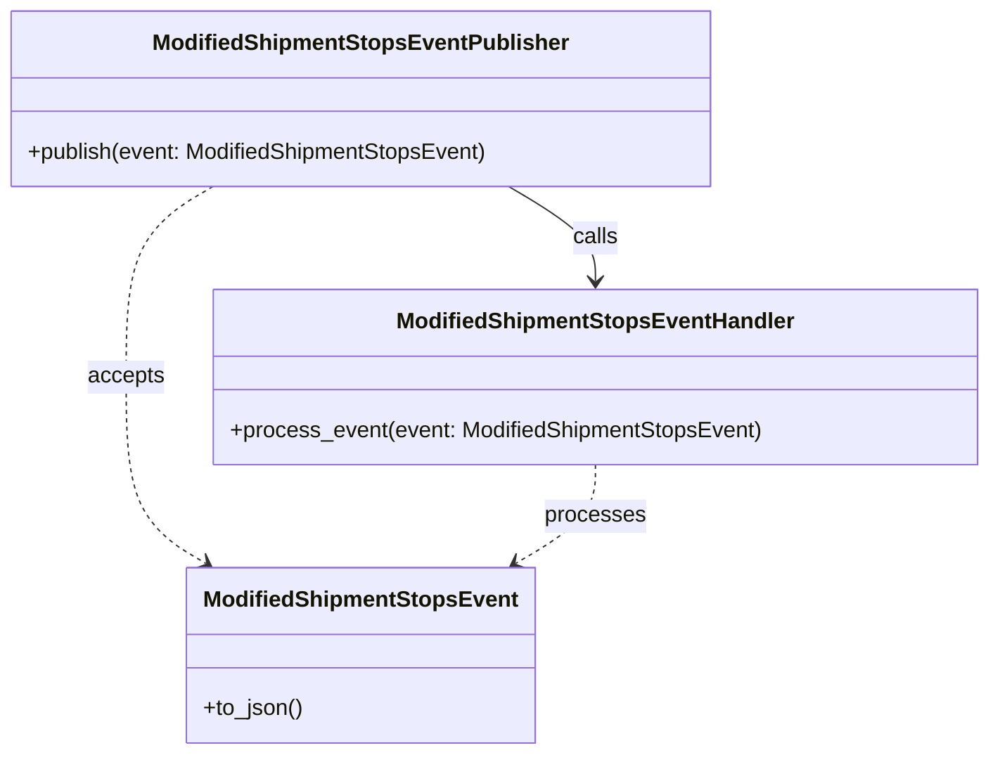

# Diagram: shipment_core/shipment_service/shipment_service/shipments/ModifiedShipmentStopsEventPublisher.py

> Auto-generated by Obscura crawlers

## Mermaid

### SVG

<svg id="container" width="706.798828125" xmlns="http://www.w3.org/2000/svg" class="classDiagram" height="542" viewBox="0 0 706.798828125 542" role="graphics-document document" aria-roledescription="class"><g><defs><marker id="container_class-aggregationStart" class="marker aggregation class" refX="18" refY="7" markerWidth="190" markerHeight="240" orient="auto"><path d="M 18,7 L9,13 L1,7 L9,1 Z"></path></marker></defs><defs><marker id="container_class-aggregationEnd" class="marker aggregation class" refX="1" refY="7" markerWidth="20" markerHeight="28" orient="auto"><path d="M 18,7 L9,13 L1,7 L9,1 Z"></path></marker></defs><defs><marker id="container_class-extensionStart" class="marker extension class" refX="18" refY="7" markerWidth="190" markerHeight="240" orient="auto"><path d="M 1,7 L18,13 V 1 Z"></path></marker></defs><defs><marker id="container_class-extensionEnd" class="marker extension class" refX="1" refY="7" markerWidth="20" markerHeight="28" orient="auto"><path d="M 1,1 V 13 L18,7 Z"></path></marker></defs><defs><marker id="container_class-compositionStart" class="marker composition class" refX="18" refY="7" markerWidth="190" markerHeight="240" orient="auto"><path d="M 18,7 L9,13 L1,7 L9,1 Z"></path></marker></defs><defs><marker id="container_class-compositionEnd" class="marker composition class" refX="1" refY="7" markerWidth="20" markerHeight="28" orient="auto"><path d="M 18,7 L9,13 L1,7 L9,1 Z"></path></marker></defs><defs><marker id="container_class-dependencyStart" class="marker dependency class" refX="6" refY="7" markerWidth="190" markerHeight="240" orient="auto"><path d="M 5,7 L9,13 L1,7 L9,1 Z"></path></marker></defs><defs><marker id="container_class-dependencyEnd" class="marker dependency class" refX="13" refY="7" markerWidth="20" markerHeight="28" orient="auto"><path d="M 18,7 L9,13 L14,7 L9,1 Z"></path></marker></defs><defs><marker id="container_class-lollipopStart" class="marker lollipop class" refX="13" refY="7" markerWidth="190" markerHeight="240" orient="auto"><circle stroke="black" fill="transparent" cx="7" cy="7" r="6"></circle></marker></defs><defs><marker id="container_class-lollipopEnd" class="marker lollipop class" refX="1" refY="7" markerWidth="190" markerHeight="240" orient="auto"><circle stroke="black" fill="transparent" cx="7" cy="7" r="6"></circle></marker></defs><g class="root"><g class="clusters"></g><g class="edgePaths"><path d="M153.302,134L142.975,140.167C132.647,146.333,111.993,158.667,101.665,181.5C91.338,204.333,91.338,237.667,91.338,271C91.338,304.333,91.338,337.667,100.807,359.987C110.275,382.308,129.213,393.616,138.682,399.27L148.151,404.924" id="id_ModifiedShipmentStopsEventPublisher_ModifiedShipmentStopsEvent_1" class="edge-thickness-normal edge-pattern-dashed relation" style=";;;" data-edge="true" data-et="edge" data-id="id_ModifiedShipmentStopsEventPublisher_ModifiedShipmentStopsEvent_1" data-points="W3sieCI6MTUzLjMwMjA1MDc4MTI1LCJ5IjoxMzR9LHsieCI6OTEuMzM3ODkwNjI1LCJ5IjoxNzF9LHsieCI6OTEuMzM3ODkwNjI1LCJ5IjoyNzF9LHsieCI6OTEuMzM3ODkwNjI1LCJ5IjozNzF9LHsieCI6MTUzLjMwMjA1MDc4MTI1LCJ5Ijo0MDh9XQ==" marker-end="url(#container_class-dependencyEnd)"></path><path d="M364.315,134L374.642,140.167C384.97,146.333,405.625,158.667,415.952,170C426.279,181.333,426.279,191.667,426.279,196.833L426.279,202" id="id_ModifiedShipmentStopsEventPublisher_ModifiedShipmentStopsEventHandler_2" class="edge-thickness-normal edge-pattern-solid relation" style=";;;" data-edge="true" data-et="edge" data-id="id_ModifiedShipmentStopsEventPublisher_ModifiedShipmentStopsEventHandler_2" data-points="W3sieCI6MzY0LjMxNTEzNjcxODc1LCJ5IjoxMzR9LHsieCI6NDI2LjI3OTI5Njg3NSwieSI6MTcxfSx7IngiOjQyNi4yNzkyOTY4NzUsInkiOjIwOH1d" marker-end="url(#container_class-dependencyEnd)"></path><path d="M426.279,334L426.279,340.167C426.279,346.333,426.279,358.667,416.811,370.487C407.342,382.308,388.404,393.616,378.935,399.27L369.467,404.924" id="id_ModifiedShipmentStopsEventHandler_ModifiedShipmentStopsEvent_3" class="edge-thickness-normal edge-pattern-dashed relation" style=";;;" data-edge="true" data-et="edge" data-id="id_ModifiedShipmentStopsEventHandler_ModifiedShipmentStopsEvent_3" data-points="W3sieCI6NDI2LjI3OTI5Njg3NSwieSI6MzM0fSx7IngiOjQyNi4yNzkyOTY4NzUsInkiOjM3MX0seyJ4IjozNjQuMzE1MTM2NzE4NzUsInkiOjQwOH1d" marker-end="url(#container_class-dependencyEnd)"></path></g><g class="edgeLabels"><g class="edgeLabel" transform="translate(91.337890625, 271)"><g class="label" data-id="id_ModifiedShipmentStopsEventPublisher_ModifiedShipmentStopsEvent_1" transform="translate(-27.421875, -12)"><foreignObject width="54.84375" height="24">

accepts

</foreignObject></g></g><g class="edgeLabel" transform="translate(426.279296875, 171)"><g class="label" data-id="id_ModifiedShipmentStopsEventPublisher_ModifiedShipmentStopsEventHandler_2" transform="translate(-16.4453125, -12)"><foreignObject width="32.890625" height="24">

calls

</foreignObject></g></g><g class="edgeLabel" transform="translate(426.279296875, 371)"><g class="label" data-id="id_ModifiedShipmentStopsEventHandler_ModifiedShipmentStopsEvent_3" transform="translate(-35.7890625, -12)"><foreignObject width="71.578125" height="24">

processes

</foreignObject></g></g></g><g class="nodes"><g class="node default" id="classId-ModifiedShipmentStopsEventPublisher-0" transform="translate(258.80859375, 71)"><g class="basic label-container"><path d="M-250.80859375 -63 L250.80859375 -63 L250.80859375 63 L-250.80859375 63" stroke="none" stroke-width="0" fill="#ECECFF" style=""></path><path d="M-250.80859375 -63 C-75.71289325396214 -63, 99.38280724207573 -63, 250.80859375 -63 M-250.80859375 -63 C-109.31413866464266 -63, 32.18031642071469 -63, 250.80859375 -63 M250.80859375 -63 C250.80859375 -22.342682530458475, 250.80859375 18.31463493908305, 250.80859375 63 M250.80859375 -63 C250.80859375 -17.615758945818165, 250.80859375 27.76848210836367, 250.80859375 63 M250.80859375 63 C126.86977590955142 63, 2.930958069102843 63, -250.80859375 63 M250.80859375 63 C81.70562035233985 63, -87.3973530453203 63, -250.80859375 63 M-250.80859375 63 C-250.80859375 24.606534876817555, -250.80859375 -13.78693024636489, -250.80859375 -63 M-250.80859375 63 C-250.80859375 34.54583414008681, -250.80859375 6.0916682801736215, -250.80859375 -63" stroke="#9370DB" stroke-width="1.3" fill="none" stroke-dasharray="0 0" style=""></path></g><g class="annotation-group text" transform="translate(0, -39)"></g><g class="label-group text" transform="translate(-142.8515625, -39)"><g class="label" style="font-weight: bolder" transform="translate(0,-12)"><foreignObject width="285.703125" height="24">

ModifiedShipmentStopsEventPublisher

</foreignObject></g></g><g class="members-group text" transform="translate(-238.80859375, 9)"></g><g class="methods-group text" transform="translate(-238.80859375, 39)"><g class="label" style="" transform="translate(0,-12)"><foreignObject width="334.765625" height="24">

+publish(event: ModifiedShipmentStopsEvent)

</foreignObject></g></g><g class="divider" style=""><path d="M-250.80859375 -15 C-56.10287133845148 -15, 138.60285107309704 -15, 250.80859375 -15 M-250.80859375 -15 C-97.85267461932204 -15, 55.10324451135591 -15, 250.80859375 -15" stroke="#9370DB" stroke-width="1.3" fill="none" stroke-dasharray="0 0" style=""></path></g><g class="divider" style=""><path d="M-250.80859375 9 C-57.267840414460295 9, 136.2729129210794 9, 250.80859375 9 M-250.80859375 9 C-113.89522868323456 9, 23.018136383530873 9, 250.80859375 9" stroke="#9370DB" stroke-width="1.3" fill="none" stroke-dasharray="0 0" style=""></path></g></g><g class="node default" id="classId-ModifiedShipmentStopsEvent-1" transform="translate(258.80859375, 471)"><g class="basic label-container"><path d="M-120.171875 -63 L120.171875 -63 L120.171875 63 L-120.171875 63" stroke="none" stroke-width="0" fill="#ECECFF" style=""></path><path d="M-120.171875 -63 C-32.966256428231304 -63, 54.23936214353739 -63, 120.171875 -63 M-120.171875 -63 C-51.808073416078486 -63, 16.55572816784303 -63, 120.171875 -63 M120.171875 -63 C120.171875 -16.52176938968192, 120.171875 29.956461220636157, 120.171875 63 M120.171875 -63 C120.171875 -18.300610271190372, 120.171875 26.398779457619256, 120.171875 63 M120.171875 63 C34.000705064994804 63, -52.17046487001039 63, -120.171875 63 M120.171875 63 C56.31685245332171 63, -7.538170093356584 63, -120.171875 63 M-120.171875 63 C-120.171875 35.395358628096915, -120.171875 7.79071725619383, -120.171875 -63 M-120.171875 63 C-120.171875 15.68693756404899, -120.171875 -31.62612487190202, -120.171875 -63" stroke="#9370DB" stroke-width="1.3" fill="none" stroke-dasharray="0 0" style=""></path></g><g class="annotation-group text" transform="translate(0, -39)"></g><g class="label-group text" transform="translate(-108.171875, -39)"><g class="label" style="font-weight: bolder" transform="translate(0,-12)"><foreignObject width="216.34375" height="24">

ModifiedShipmentStopsEvent

</foreignObject></g></g><g class="members-group text" transform="translate(-108.171875, 9)"></g><g class="methods-group text" transform="translate(-108.171875, 39)"><g class="label" style="" transform="translate(0,-12)"><foreignObject width="72.40625" height="24">

+to_json()

</foreignObject></g></g><g class="divider" style=""><path d="M-120.171875 -15 C-33.03626369804624 -15, 54.09934760390752 -15, 120.171875 -15 M-120.171875 -15 C-68.87660062454826 -15, -17.58132624909652 -15, 120.171875 -15" stroke="#9370DB" stroke-width="1.3" fill="none" stroke-dasharray="0 0" style=""></path></g><g class="divider" style=""><path d="M-120.171875 9 C-56.30573976613924 9, 7.56039546772152 9, 120.171875 9 M-120.171875 9 C-45.24662652891493 9, 29.67862194217014 9, 120.171875 9" stroke="#9370DB" stroke-width="1.3" fill="none" stroke-dasharray="0 0" style=""></path></g></g><g class="node default" id="classId-ModifiedShipmentStopsEventHandler-2" transform="translate(426.279296875, 271)"><g class="basic label-container"><path d="M-272.51953125 -63 L272.51953125 -63 L272.51953125 63 L-272.51953125 63" stroke="none" stroke-width="0" fill="#ECECFF" style=""></path><path d="M-272.51953125 -63 C-81.28143573313605 -63, 109.9566597837279 -63, 272.51953125 -63 M-272.51953125 -63 C-108.4472291901184 -63, 55.62507286976319 -63, 272.51953125 -63 M272.51953125 -63 C272.51953125 -16.87541315229646, 272.51953125 29.24917369540708, 272.51953125 63 M272.51953125 -63 C272.51953125 -19.59393042031421, 272.51953125 23.812139159371583, 272.51953125 63 M272.51953125 63 C112.31661385096848 63, -47.88630354806304 63, -272.51953125 63 M272.51953125 63 C124.81234220465811 63, -22.894846840683783 63, -272.51953125 63 M-272.51953125 63 C-272.51953125 15.487015644952145, -272.51953125 -32.02596871009571, -272.51953125 -63 M-272.51953125 63 C-272.51953125 26.468730595653568, -272.51953125 -10.062538808692864, -272.51953125 -63" stroke="#9370DB" stroke-width="1.3" fill="none" stroke-dasharray="0 0" style=""></path></g><g class="annotation-group text" transform="translate(0, -39)"></g><g class="label-group text" transform="translate(-137.2578125, -39)"><g class="label" style="font-weight: bolder" transform="translate(0,-12)"><foreignObject width="274.515625" height="24">

ModifiedShipmentStopsEventHandler

</foreignObject></g></g><g class="members-group text" transform="translate(-260.51953125, 9)"></g><g class="methods-group text" transform="translate(-260.51953125, 39)"><g class="label" style="" transform="translate(0,-12)"><foreignObject width="383.78125" height="24">

+process_event(event: ModifiedShipmentStopsEvent)

</foreignObject></g></g><g class="divider" style=""><path d="M-272.51953125 -15 C-151.13098220469783 -15, -29.742433159395688 -15, 272.51953125 -15 M-272.51953125 -15 C-90.52422648512407 -15, 91.47107827975185 -15, 272.51953125 -15" stroke="#9370DB" stroke-width="1.3" fill="none" stroke-dasharray="0 0" style=""></path></g><g class="divider" style=""><path d="M-272.51953125 9 C-117.65872490374781 9, 37.20208144250438 9, 272.51953125 9 M-272.51953125 9 C-130.44211852454112 9, 11.63529420091777 9, 272.51953125 9" stroke="#9370DB" stroke-width="1.3" fill="none" stroke-dasharray="0 0" style=""></path></g></g></g></g></g></svg>
