# Diagram: shipment_core/shipment_service/shipment_service/shipments/cancel_shipment.py

> Auto-generated by Obscura crawlers

## Mermaid

```mermaid
classDiagram
    class delete_module {
        +cancel_shipment_update(cursor, shipment_id)
        +cancel_note_insert(cursor, shipment_id, notes)
        +true_delete(cursor, header)
        +process_shipment_delete(event, cursor, shipment, actor_organization_id, body_datetime, remarks, notes, message_id, actor_id, actor_type, actor_email, db_connection)
        +process_delete(event, cursor, payload, context, db_connection=None)
        +validate_original_shipment_creator(cursor, existing_shipment, event)
    }

    class db_no_orm {
        +get_existing_shipments(cursor, creator_id, carrier_id, shipment_id)
        +update_shipment_status_details_loc(...)
    }

    class tables {
        +Shipments(cursor, data)
        +ShipmentStatus(...)
    }

    class utilities {
        +get_multimodal_childern_to_cancel(cursor, shipment)
        +cancel_shipment_event(shipment_id, origin_close=False, destination_close=False, process_type=None)
        +is_linehaul_shipment(cursor, payload, shipment)
        +is_mode_eligible_for_no_activity(shipment, linehaul_shipment)
        +update_no_activity_flag(cursor, shipment)
        +convert_status_date_time(status_date_time)
        +is_shipment_updateable_by_user(cursor, shipment, authorizer)
    }

    class StreamableShipmentStatus {
        +StreamableShipmentStatus(shipment_status)
        +insert()
        +stream_event(metadata, shipment, code, a, b)
    }

    class OutboundShipmentEvent {
        +OutboundShipmentEvent(shipment_dict, events, db_connection)
        +construct_and_send()
        +SHIPMENT_CANCEL
    }

    class RequestMetaDataBuilder {
        +build(event)
    }

    class auth {
        +get_actor_type(event)
        +get_user_id(event)
        +get_actor_email(event)
        +get_organization_id(event)
    }

    class make_response {
        +make_response(payload)
    }

    class Secrets {
        +Secrets()
    }

    class constants {
        +MULTIMODAL_MODE
        +HAUL_AWAY
        +STATUS_TYPE_SENT_BY_CARRIER
    }

    class ScheduledEventProcess {
        +SCHEDULED_ARRIVAL_WINDOW
        +ACTIVITY_MONITORING
    }

    delete_module "1" --> "1" db_no_orm : uses
    delete_module "1" --> "1" tables : constructs
    delete_module "1" --> "1" utilities : uses
    delete_module "1" --> "1" StreamableShipmentStatus : streams
    delete_module "1" --> "1" OutboundShipmentEvent : emits
    delete_module "1" --> "1" RequestMetaDataBuilder : builds
    delete_module "1" --> "1" auth : queries
    delete_module "1" --> "1" make_response : returns
    delete_module "1" --> "1" Secrets : references
    delete_module "1" --> "1" constants : references
    delete_module "1" --> "1" ScheduledEventProcess : references

    db_no_orm ..> tables : returns rows used by
    StreamableShipmentStatus --> tables : depends on ShipmentStatus
    OutboundShipmentEvent --> tables : reads Shipment data
    utilities --> ScheduledEventProcess : uses enums
    utilities ..> delete_module : called by process_delete/process_shipment_delete
```

### SVG

<svg id="container" width="4184.2109375" xmlns="http://www.w3.org/2000/svg" class="classDiagram" height="878" viewBox="0 0 4184.2109375 878" role="graphics-document document" aria-roledescription="class"><g><defs><marker id="container_class-aggregationStart" class="marker aggregation class" refX="18" refY="7" markerWidth="190" markerHeight="240" orient="auto"><path d="M 18,7 L9,13 L1,7 L9,1 Z"></path></marker></defs><defs><marker id="container_class-aggregationEnd" class="marker aggregation class" refX="1" refY="7" markerWidth="20" markerHeight="28" orient="auto"><path d="M 18,7 L9,13 L1,7 L9,1 Z"></path></marker></defs><defs><marker id="container_class-extensionStart" class="marker extension class" refX="18" refY="7" markerWidth="190" markerHeight="240" orient="auto"><path d="M 1,7 L18,13 V 1 Z"></path></marker></defs><defs><marker id="container_class-extensionEnd" class="marker extension class" refX="1" refY="7" markerWidth="20" markerHeight="28" orient="auto"><path d="M 1,1 V 13 L18,7 Z"></path></marker></defs><defs><marker id="container_class-compositionStart" class="marker composition class" refX="18" refY="7" markerWidth="190" markerHeight="240" orient="auto"><path d="M 18,7 L9,13 L1,7 L9,1 Z"></path></marker></defs><defs><marker id="container_class-compositionEnd" class="marker composition class" refX="1" refY="7" markerWidth="20" markerHeight="28" orient="auto"><path d="M 18,7 L9,13 L1,7 L9,1 Z"></path></marker></defs><defs><marker id="container_class-dependencyStart" class="marker dependency class" refX="6" refY="7" markerWidth="190" markerHeight="240" orient="auto"><path d="M 5,7 L9,13 L1,7 L9,1 Z"></path></marker></defs><defs><marker id="container_class-dependencyEnd" class="marker dependency class" refX="13" refY="7" markerWidth="20" markerHeight="28" orient="auto"><path d="M 18,7 L9,13 L14,7 L9,1 Z"></path></marker></defs><defs><marker id="container_class-lollipopStart" class="marker lollipop class" refX="13" refY="7" markerWidth="190" markerHeight="240" orient="auto"><circle stroke="black" fill="transparent" cx="7" cy="7" r="6"></circle></marker></defs><defs><marker id="container_class-lollipopEnd" class="marker lollipop class" refX="1" refY="7" markerWidth="190" markerHeight="240" orient="auto"><circle stroke="black" fill="transparent" cx="7" cy="7" r="6"></circle></marker></defs><g class="root"><g class="clusters"></g><g class="edgePaths"><path d="M1768.221,186.333L1539.655,205.777C1311.089,225.222,853.956,264.111,625.39,300.722C396.824,337.333,396.824,371.667,396.824,388.833L396.824,406" id="id_delete_module_db_no_orm_1" class="edge-thickness-normal edge-pattern-solid relation" style=";;;" data-edge="true" data-et="edge" data-id="id_delete_module_db_no_orm_1" data-points="W3sieCI6MTc2OC4yMjA3MDMxMjUsInkiOjE4Ni4zMzI2NDc0NTYzMTM5Nn0seyJ4IjozOTYuODI0MjE4NzUsInkiOjMwM30seyJ4IjozOTYuODI0MjE4NzUsInkiOjQxMn1d" marker-end="url(#container_class-dependencyEnd)"></path><path d="M1768.221,178.148L1481.158,198.957C1194.095,219.765,619.969,261.383,332.907,312.858C45.844,364.333,45.844,425.667,45.844,487C45.844,548.333,45.844,609.667,131.155,657.094C216.467,704.52,387.089,738.041,472.401,754.801L557.712,771.561" id="id_delete_module_tables_2" class="edge-thickness-normal edge-pattern-solid relation" style=";;;" data-edge="true" data-et="edge" data-id="id_delete_module_tables_2" data-points="W3sieCI6MTc2OC4yMjA3MDMxMjUsInkiOjE3OC4xNDc5MzM5ODE1NzY2N30seyJ4Ijo0NS44NDM3NSwieSI6MzAzfSx7IngiOjQ1Ljg0Mzc1LCJ5Ijo0ODd9LHsieCI6NDUuODQzNzUsInkiOjY3MX0seyJ4Ijo1NjMuNTk5NjA5Mzc1LCJ5Ijo3NzIuNzE3OTc5NTgyOTMyM31d" marker-end="url(#container_class-dependencyEnd)"></path><path d="M3069.064,229.415L3150.118,241.679C3231.173,253.943,3393.281,278.472,3483.291,298.259C3573.302,318.047,3591.216,333.094,3600.172,340.617L3609.129,348.141" id="id_delete_module_utilities_3" class="edge-thickness-normal edge-pattern-solid relation" style=";;;" data-edge="true" data-et="edge" data-id="id_delete_module_utilities_3" data-points="W3sieCI6MzA2OS4wNjQ0NTMxMjUsInkiOjIyOS40MTQ3MzIyOTE2NjMwOX0seyJ4IjozNTU1LjM4ODY3MTg3NSwieSI6MzAzfSx7IngiOjM2MTMuNzIzMzY3NDQyMjU1NSwieSI6MzUyfV0=" marker-end="url(#container_class-dependencyEnd)"></path><path d="M1768.221,207.55L1633.052,223.458C1497.884,239.367,1227.548,271.183,1092.379,302.258C957.211,333.333,957.211,363.667,957.211,378.833L957.211,394" id="id_delete_module_StreamableShipmentStatus_4" class="edge-thickness-normal edge-pattern-solid relation" style=";;;" data-edge="true" data-et="edge" data-id="id_delete_module_StreamableShipmentStatus_4" data-points="W3sieCI6MTc2OC4yMjA3MDMxMjUsInkiOjIwNy41NDk5Nzk3NTI4Mzc2fSx7IngiOjk1Ny4yMTA5Mzc1LCJ5IjozMDN9LHsieCI6OTU3LjIxMDkzNzUsInkiOjQwMH1d" marker-end="url(#container_class-dependencyEnd)"></path><path d="M1787.325,254L1745.408,262.167C1703.491,270.333,1619.658,286.667,1577.741,310.5C1535.824,334.333,1535.824,365.667,1535.824,381.333L1535.824,397" id="id_delete_module_OutboundShipmentEvent_5" class="edge-thickness-normal edge-pattern-solid relation" style=";;;" data-edge="true" data-et="edge" data-id="id_delete_module_OutboundShipmentEvent_5" data-points="W3sieCI6MTc4Ny4zMjQ3OTc4NzQyNzM0LCJ5IjoyNTR9LHsieCI6MTUzNS44MjQyMTg3NSwieSI6MzAzfSx7IngiOjE1MzUuODI0MjE4NzUsInkiOjQwM31d" marker-end="url(#container_class-dependencyEnd)"></path><path d="M2110.703,254L2090.257,262.167C2069.811,270.333,2028.919,286.667,2008.473,314C1988.027,341.333,1988.027,379.667,1988.027,398.833L1988.027,418" id="id_delete_module_RequestMetaDataBuilder_6" class="edge-thickness-normal edge-pattern-solid relation" style=";;;" data-edge="true" data-et="edge" data-id="id_delete_module_RequestMetaDataBuilder_6" data-points="W3sieCI6MjExMC43MDI2MTQwMDc5OTQzLCJ5IjoyNTR9LHsieCI6MTk4OC4wMjczNDM3NSwieSI6MzAzfSx7IngiOjE5ODguMDI3MzQzNzUsInkiOjQyNH1d" marker-end="url(#container_class-dependencyEnd)"></path><path d="M2308.918,254L2301.633,262.167C2294.348,270.333,2279.777,286.667,2272.492,308C2265.207,329.333,2265.207,355.667,2265.207,368.833L2265.207,382" id="id_delete_module_auth_7" class="edge-thickness-normal edge-pattern-solid relation" style=";;;" data-edge="true" data-et="edge" data-id="id_delete_module_auth_7" data-points="W3sieCI6MjMwOC45MTgzMjA3NjY3MTUsInkiOjI1NH0seyJ4IjoyMjY1LjIwNzAzMTI1LCJ5IjozMDN9LHsieCI6MjI2NS4yMDcwMzEyNSwieSI6Mzg4fV0=" marker-end="url(#container_class-dependencyEnd)"></path><path d="M2528.367,254L2535.652,262.167C2542.937,270.333,2557.508,286.667,2564.793,314C2572.078,341.333,2572.078,379.667,2572.078,398.833L2572.078,418" id="id_delete_module_make_response_8" class="edge-thickness-normal edge-pattern-solid relation" style=";;;" data-edge="true" data-et="edge" data-id="id_delete_module_make_response_8" data-points="W3sieCI6MjUyOC4zNjY4MzU0ODMyODUsInkiOjI1NH0seyJ4IjoyNTcyLjA3ODEyNSwieSI6MzAzfSx7IngiOjI1NzIuMDc4MTI1LCJ5Ijo0MjR9XQ==" marker-end="url(#container_class-dependencyEnd)"></path><path d="M2704.534,254L2723.516,262.167C2742.498,270.333,2780.462,286.667,2799.444,314C2818.426,341.333,2818.426,379.667,2818.426,398.833L2818.426,418" id="id_delete_module_Secrets_9" class="edge-thickness-normal edge-pattern-solid relation" style=";;;" data-edge="true" data-et="edge" data-id="id_delete_module_Secrets_9" data-points="W3sieCI6MjcwNC41MzQwNTQ3NzgzNDMsInkiOjI1NH0seyJ4IjoyODE4LjQyNTc4MTI1LCJ5IjozMDN9LHsieCI6MjgxOC40MjU3ODEyNSwieSI6NDI0fV0=" marker-end="url(#container_class-dependencyEnd)"></path><path d="M2890.252,254L2921.565,262.167C2952.878,270.333,3015.503,286.667,3046.816,310.5C3078.129,334.333,3078.129,365.667,3078.129,381.333L3078.129,397" id="id_delete_module_constants_10" class="edge-thickness-normal edge-pattern-solid relation" style=";;;" data-edge="true" data-et="edge" data-id="id_delete_module_constants_10" data-points="W3sieCI6Mjg5MC4yNTE5ODcxOTExMzM2LCJ5IjoyNTR9LHsieCI6MzA3OC4xMjg5MDYyNSwieSI6MzAzfSx7IngiOjMwNzguMTI4OTA2MjUsInkiOjQwM31d" marker-end="url(#container_class-dependencyEnd)"></path><path d="M3048.804,254L3090.644,262.167C3132.484,270.333,3216.164,286.667,3258.004,325.5C3299.844,364.333,3299.844,425.667,3299.844,487C3299.844,548.333,3299.844,609.667,3315.543,648.537C3331.242,687.407,3362.64,703.814,3378.339,712.018L3394.038,720.221" id="id_delete_module_ScheduledEventProcess_11" class="edge-thickness-normal edge-pattern-solid relation" style=";;;" data-edge="true" data-et="edge" data-id="id_delete_module_ScheduledEventProcess_11" data-points="W3sieCI6MzA0OC44MDM4ODEyNjgxNjksInkiOjI1NH0seyJ4IjozMjk5Ljg0Mzc1LCJ5IjozMDN9LHsieCI6MzI5OS44NDM3NSwieSI6NDg3fSx7IngiOjMyOTkuODQzNzUsInkiOjY3MX0seyJ4IjozMzk5LjM1NjE2MTc5NDM1NDYsInkiOjcyM31d" marker-end="url(#container_class-dependencyEnd)"></path><path d="M396.824,562L396.824,580.167C396.824,598.333,396.824,634.667,423.706,664.73C450.587,694.793,504.35,718.586,531.231,730.482L558.113,742.379" id="id_db_no_orm_tables_12" class="edge-thickness-normal edge-pattern-dashed relation" style=";;;" data-edge="true" data-et="edge" data-id="id_db_no_orm_tables_12" data-points="W3sieCI6Mzk2LjgyNDIxODc1LCJ5Ijo1NjJ9LHsieCI6Mzk2LjgyNDIxODc1LCJ5Ijo2NzF9LHsieCI6NTYzLjU5OTYwOTM3NSwieSI6NzQ0LjgwNjcwNDM1NDU1NDN9XQ==" marker-end="url(#container_class-dependencyEnd)"></path><path d="M957.211,574L957.211,590.167C957.211,606.333,957.211,638.667,930.329,666.73C903.448,694.793,849.685,718.586,822.804,730.482L795.922,742.379" id="id_StreamableShipmentStatus_tables_13" class="edge-thickness-normal edge-pattern-solid relation" style=";;;" data-edge="true" data-et="edge" data-id="id_StreamableShipmentStatus_tables_13" data-points="W3sieCI6OTU3LjIxMDkzNzUsInkiOjU3NH0seyJ4Ijo5NTcuMjEwOTM3NSwieSI6NjcxfSx7IngiOjc5MC40MzU1NDY4NzUsInkiOjc0NC44MDY3MDQzNTQ1NTQzfV0=" marker-end="url(#container_class-dependencyEnd)"></path><path d="M1535.824,571L1535.824,587.667C1535.824,604.333,1535.824,637.667,1412.583,672.128C1289.341,706.589,1042.857,742.178,919.616,759.972L796.374,777.767" id="id_OutboundShipmentEvent_tables_14" class="edge-thickness-normal edge-pattern-solid relation" style=";;;" data-edge="true" data-et="edge" data-id="id_OutboundShipmentEvent_tables_14" data-points="W3sieCI6MTUzNS44MjQyMTg3NSwieSI6NTcxfSx7IngiOjE1MzUuODI0MjE4NzUsInkiOjY3MX0seyJ4Ijo3OTAuNDM1NTQ2ODc1LCJ5Ijo3NzguNjIzOTg3NjgyNzYzfV0=" marker-end="url(#container_class-dependencyEnd)"></path><path d="M3774.441,622L3774.441,630.167C3774.441,638.333,3774.441,654.667,3758.742,671.037C3743.043,687.407,3711.645,703.814,3695.946,712.018L3680.247,720.221" id="id_utilities_ScheduledEventProcess_15" class="edge-thickness-normal edge-pattern-solid relation" style=";;;" data-edge="true" data-et="edge" data-id="id_utilities_ScheduledEventProcess_15" data-points="W3sieCI6Mzc3NC40NDE0MDYyNSwieSI6NjIyfSx7IngiOjM3NzQuNDQxNDA2MjUsInkiOjY3MX0seyJ4IjozNjc0LjkyODk5NDQ1NTY0NTQsInkiOjcyM31d" marker-end="url(#container_class-dependencyEnd)"></path><path d="M3843.306,352L3847.471,343.833C3851.637,335.667,3859.969,319.333,3731.922,295.48C3603.875,271.626,3339.449,240.252,3207.236,224.566L3075.023,208.879" id="id_utilities_delete_module_16" class="edge-thickness-normal edge-pattern-dashed relation" style=";;;" data-edge="true" data-et="edge" data-id="id_utilities_delete_module_16" data-points="W3sieCI6Mzg0My4zMDU2MjE2MDMyNjEsInkiOjM1Mn0seyJ4IjozODY4LjMwMDc4MTI1LCJ5IjozMDN9LHsieCI6MzA2OS4wNjQ0NTMxMjUsInkiOjIwOC4xNzE2ODI0NDEzMDgyM31d" marker-end="url(#container_class-dependencyEnd)"></path></g><g class="edgeLabels"><g class="edgeLabel" transform="translate(396.82421875, 303)"><g class="label" data-id="id_delete_module_db_no_orm_1" transform="translate(-16.4921875, -12)"><foreignObject width="32.984375" height="24">

uses

</foreignObject></g></g><g class="edgeLabel" transform="translate(45.84375, 487)"><g class="label" data-id="id_delete_module_tables_2" transform="translate(-37.84375, -12)"><foreignObject width="75.6875" height="24">

constructs

</foreignObject></g></g><g class="edgeLabel" transform="translate(3349.88965, 271.90613)"><g class="label" data-id="id_delete_module_utilities_3" transform="translate(-16.4921875, -12)"><foreignObject width="32.984375" height="24">

uses

</foreignObject></g></g><g class="edgeLabel" transform="translate(957.2109375, 303)"><g class="label" data-id="id_delete_module_StreamableShipmentStatus_4" transform="translate(-28.703125, -12)"><foreignObject width="57.40625" height="24">

streams

</foreignObject></g></g><g class="edgeLabel" transform="translate(1535.82421875, 303)"><g class="label" data-id="id_delete_module_OutboundShipmentEvent_5" transform="translate(-20.1015625, -12)"><foreignObject width="40.203125" height="24">

emits

</foreignObject></g></g><g class="edgeLabel" transform="translate(1988.02734375, 303)"><g class="label" data-id="id_delete_module_RequestMetaDataBuilder_6" transform="translate(-22.4921875, -12)"><foreignObject width="44.984375" height="24">

builds

</foreignObject></g></g><g class="edgeLabel" transform="translate(2265.20703125, 303)"><g class="label" data-id="id_delete_module_auth_7" transform="translate(-27.2421875, -12)"><foreignObject width="54.484375" height="24">

queries

</foreignObject></g></g><g class="edgeLabel" transform="translate(2572.078125, 303)"><g class="label" data-id="id_delete_module_make_response_8" transform="translate(-26.265625, -12)"><foreignObject width="52.53125" height="24">

returns

</foreignObject></g></g><g class="edgeLabel" transform="translate(2818.42578125, 303)"><g class="label" data-id="id_delete_module_Secrets_9" transform="translate(-37.828125, -12)"><foreignObject width="75.65625" height="24">

references

</foreignObject></g></g><g class="edgeLabel" transform="translate(3078.12890625, 303)"><g class="label" data-id="id_delete_module_constants_10" transform="translate(-37.828125, -12)"><foreignObject width="75.65625" height="24">

references

</foreignObject></g></g><g class="edgeLabel" transform="translate(3299.84375, 487)"><g class="label" data-id="id_delete_module_ScheduledEventProcess_11" transform="translate(-37.828125, -12)"><foreignObject width="75.65625" height="24">

references

</foreignObject></g></g><g class="edgeLabel" transform="translate(396.82421875, 671)"><g class="label" data-id="id_db_no_orm_tables_12" transform="translate(-75.8125, -12)"><foreignObject width="151.625" height="24">

returns rows used by

</foreignObject></g></g><g class="edgeLabel" transform="translate(957.2109375, 671)"><g class="label" data-id="id_StreamableShipmentStatus_tables_13" transform="translate(-100, -24)"><foreignObject width="200" height="48">

depends on ShipmentStatus

</foreignObject></g></g><g class="edgeLabel" transform="translate(1535.82421875, 671)"><g class="label" data-id="id_OutboundShipmentEvent_tables_14" transform="translate(-75.4140625, -12)"><foreignObject width="150.828125" height="24">

reads Shipment data

</foreignObject></g></g><g class="edgeLabel" transform="translate(3774.44140625, 671)"><g class="label" data-id="id_utilities_ScheduledEventProcess_15" transform="translate(-42.90625, -12)"><foreignObject width="85.8125" height="24">

uses enums

</foreignObject></g></g><g class="edgeLabel" transform="translate(3495.99449, 258.82636)"><g class="label" data-id="id_utilities_delete_module_16" transform="translate(-151.2265625, -24)"><foreignObject width="302.453125" height="48">

called by process_delete/process_shipment_delete

</foreignObject></g></g><g class="edgeTerminals" transform="translate(1749.5121998118998, 172.87003516456593)"><g class="inner" transform="translate(0, 0)"><foreignObject style="width: 9px; height: 12px;">
1
</foreignObject></g></g><g class="edgeTerminals" transform="translate(1749.6820245937897, 164.45241136417144)"><g class="inner" transform="translate(0, 0)"><foreignObject style="width: 9px; height: 12px;">
1
</foreignObject></g></g><g class="edgeTerminals" transform="translate(3084.1234081827292, 246.86402602441996)"><g class="inner" transform="translate(0, 0)"><foreignObject style="width: 9px; height: 12px;">
1
</foreignObject></g></g><g class="edgeTerminals" transform="translate(1749.087371273157, 194.69830483584414)"><g class="inner" transform="translate(0, 0)"><foreignObject style="width: 9px; height: 12px;">
1
</foreignObject></g></g><g class="edgeTerminals" transform="translate(1767.2792508450282, 242.6234454193115)"><g class="inner" transform="translate(0, 0)"><foreignObject style="width: 9px; height: 12px;">
1
</foreignObject></g></g><g class="edgeTerminals" transform="translate(2088.8870747037727, 246.56143645973575)"><g class="inner" transform="translate(0, 0)"><foreignObject style="width: 9px; height: 12px;">
1
</foreignObject></g></g><g class="edgeTerminals" transform="translate(2286.0753280871486, 257.07372009470333)"><g class="inner" transform="translate(0, 0)"><foreignObject style="width: 9px; height: 12px;">
1
</foreignObject></g></g><g class="edgeTerminals" transform="translate(2528.8229091148355, 277.0443484137075)"><g class="inner" transform="translate(0, 0)"><foreignObject style="width: 9px; height: 12px;">
1
</foreignObject></g></g><g class="edgeTerminals" transform="translate(2714.6812797118982, 274.6950215881215)"><g class="inner" transform="translate(0, 0)"><foreignObject style="width: 9px; height: 12px;">
1
</foreignObject></g></g><g class="edgeTerminals" transform="translate(2903.400031285512, 272.9308982734441)"><g class="inner" transform="translate(0, 0)"><foreignObject style="width: 9px; height: 12px;">
1
</foreignObject></g></g><g class="edgeTerminals" transform="translate(3063.1061573657275, 272.074700848972)"><g class="inner" transform="translate(0, 0)"><foreignObject style="width: 9px; height: 12px;">
1
</foreignObject></g></g><g class="edgeTerminals" transform="translate(406.824219375, 389.5000005357143)"><g class="inner" transform="translate(0, 0)"></g><foreignObject style="width: 9px; height: 12px;">
1
</foreignObject></g><g class="edgeTerminals" transform="translate(544.319468807486, 749.6257828502186)"><g class="inner" transform="translate(0, 0)"></g><foreignObject style="width: 9px; height: 12px;">
1
</foreignObject></g><g class="edgeTerminals" transform="translate(3604.9711520803958, 324.25861036231976)"><g class="inner" transform="translate(0, 0)"></g><foreignObject style="width: 9px; height: 12px;">
1
</foreignObject></g><g class="edgeTerminals" transform="translate(967.21093875, 377.5000010714286)"><g class="inner" transform="translate(0, 0)"></g><foreignObject style="width: 9px; height: 12px;">
1
</foreignObject></g><g class="edgeTerminals" transform="translate(1545.824219375, 380.50000053571426)"><g class="inner" transform="translate(0, 0)"></g><foreignObject style="width: 9px; height: 12px;">
1
</foreignObject></g><g class="edgeTerminals" transform="translate(1998.027341875, 401.4999983928572)"><g class="inner" transform="translate(0, 0)"></g><foreignObject style="width: 9px; height: 12px;">
1
</foreignObject></g><g class="edgeTerminals" transform="translate(2275.207030625, 365.49999946428574)"><g class="inner" transform="translate(0, 0)"></g><foreignObject style="width: 9px; height: 12px;">
1
</foreignObject></g><g class="edgeTerminals" transform="translate(2582.0781275, 401.5000021428571)"><g class="inner" transform="translate(0, 0)"></g><foreignObject style="width: 9px; height: 12px;">
1
</foreignObject></g><g class="edgeTerminals" transform="translate(2828.425780625, 401.49999946428574)"><g class="inner" transform="translate(0, 0)"></g><foreignObject style="width: 9px; height: 12px;">
1
</foreignObject></g><g class="edgeTerminals" transform="translate(3088.1289081249997, 380.5000016071428)"><g class="inner" transform="translate(0, 0)"></g><foreignObject style="width: 9px; height: 12px;">
1
</foreignObject></g><g class="edgeTerminals" transform="translate(3385.793017549831, 696.6008752307359)"><g class="inner" transform="translate(0, 0)"></g><foreignObject style="width: 9px; height: 12px;">
1
</foreignObject></g></g><g class="nodes"><g class="node default" id="classId-delete_module-0" transform="translate(2418.642578125, 131)"><g class="basic label-container"><path d="M-650.421875 -123 L650.421875 -123 L650.421875 123 L-650.421875 123" stroke="none" stroke-width="0" fill="#ECECFF" style=""></path><path d="M-650.421875 -123 C-340.58589953026717 -123, -30.74992406053434 -123, 650.421875 -123 M-650.421875 -123 C-190.99954823397098 -123, 268.42277853205803 -123, 650.421875 -123 M650.421875 -123 C650.421875 -45.13256018042895, 650.421875 32.73487963914209, 650.421875 123 M650.421875 -123 C650.421875 -62.01298371762447, 650.421875 -1.025967435248944, 650.421875 123 M650.421875 123 C348.2289623781075 123, 46.03604975621499 123, -650.421875 123 M650.421875 123 C286.15695591852995 123, -78.10796316294011 123, -650.421875 123 M-650.421875 123 C-650.421875 52.27568219230149, -650.421875 -18.448635615397023, -650.421875 -123 M-650.421875 123 C-650.421875 72.12460656196734, -650.421875 21.249213123934666, -650.421875 -123" stroke="#9370DB" stroke-width="1.3" fill="none" stroke-dasharray="0 0" style=""></path></g><g class="annotation-group text" transform="translate(0, -99)"></g><g class="label-group text" transform="translate(-54.890625, -99)"><g class="label" style="font-weight: bolder" transform="translate(0,-12)"><foreignObject width="109.78125" height="24">

delete_module

</foreignObject></g></g><g class="members-group text" transform="translate(-638.421875, -51)"></g><g class="methods-group text" transform="translate(-638.421875, -21)"><g class="label" style="" transform="translate(0,-12)"><foreignObject width="344.15625" height="24">

+cancel_shipment_update(cursor, shipment_id)

</foreignObject></g><g class="label" style="" transform="translate(0,12)"><foreignObject width="347.890625" height="24">

+cancel_note_insert(cursor, shipment_id, notes)

</foreignObject></g><g class="label" style="" transform="translate(0,36)"><foreignObject width="205.453125" height="24">

+true_delete(cursor, header)

</foreignObject></g><g class="label" style="" transform="translate(0,60)"><foreignObject width="1221.953125" height="24">

+process_shipment_delete(event, cursor, shipment, actor_organization_id, body_datetime, remarks, notes, message_id, actor_id, actor_type, actor_email, db_connection)

</foreignObject></g><g class="label" style="" transform="translate(0,84)"><foreignObject width="509.875" height="24">

+process_delete(event, cursor, payload, context, db_connection=None)

</foreignObject></g><g class="label" style="" transform="translate(0,108)"><foreignObject width="509.8125" height="24">

+validate_original_shipment_creator(cursor, existing_shipment, event)

</foreignObject></g></g><g class="divider" style=""><path d="M-650.421875 -75 C-201.6887005500467 -75, 247.04447389990662 -75, 650.421875 -75 M-650.421875 -75 C-294.95480619241533 -75, 60.512262615169334 -75, 650.421875 -75" stroke="#9370DB" stroke-width="1.3" fill="none" stroke-dasharray="0 0" style=""></path></g><g class="divider" style=""><path d="M-650.421875 -51 C-284.37091018287333 -51, 81.68005463425334 -51, 650.421875 -51 M-650.421875 -51 C-304.6151597798915 -51, 41.19155544021703 -51, 650.421875 -51" stroke="#9370DB" stroke-width="1.3" fill="none" stroke-dasharray="0 0" style=""></path></g></g><g class="node default" id="classId-db_no_orm-1" transform="translate(396.82421875, 487)"><g class="basic label-container"><path d="M-278.13671875 -75 L278.13671875 -75 L278.13671875 75 L-278.13671875 75" stroke="none" stroke-width="0" fill="#ECECFF" style=""></path><path d="M-278.13671875 -75 C-90.21199424557 -75, 97.71273025886 -75, 278.13671875 -75 M-278.13671875 -75 C-150.32121004250592 -75, -22.505701335011878 -75, 278.13671875 -75 M278.13671875 -75 C278.13671875 -30.933088831299862, 278.13671875 13.133822337400275, 278.13671875 75 M278.13671875 -75 C278.13671875 -22.728139904692732, 278.13671875 29.543720190614536, 278.13671875 75 M278.13671875 75 C129.06038086521622 75, -20.015957019567566 75, -278.13671875 75 M278.13671875 75 C93.93807323072195 75, -90.26057228855609 75, -278.13671875 75 M-278.13671875 75 C-278.13671875 38.610877544028035, -278.13671875 2.221755088056071, -278.13671875 -75 M-278.13671875 75 C-278.13671875 35.513119054826106, -278.13671875 -3.973761890347788, -278.13671875 -75" stroke="#9370DB" stroke-width="1.3" fill="none" stroke-dasharray="0 0" style=""></path></g><g class="annotation-group text" transform="translate(0, -51)"></g><g class="label-group text" transform="translate(-41.3515625, -51)"><g class="label" style="font-weight: bolder" transform="translate(0,-12)"><foreignObject width="82.703125" height="24">

db_no_orm

</foreignObject></g></g><g class="members-group text" transform="translate(-266.13671875, -3)"></g><g class="methods-group text" transform="translate(-266.13671875, 27)"><g class="label" style="" transform="translate(0,-12)"><foreignObject width="490.921875" height="24">

+get_existing_shipments(cursor, creator_id, carrier_id, shipment_id)

</foreignObject></g><g class="label" style="" transform="translate(0,12)"><foreignObject width="296.84375" height="24">

+update_shipment_status_details_loc(...)

</foreignObject></g></g><g class="divider" style=""><path d="M-278.13671875 -27 C-117.38566223479737 -27, 43.36539428040527 -27, 278.13671875 -27 M-278.13671875 -27 C-80.50724178105403 -27, 117.12223518789193 -27, 278.13671875 -27" stroke="#9370DB" stroke-width="1.3" fill="none" stroke-dasharray="0 0" style=""></path></g><g class="divider" style=""><path d="M-278.13671875 -3 C-70.21656111734077 -3, 137.70359651531845 -3, 278.13671875 -3 M-278.13671875 -3 C-56.399031531460025 -3, 165.33865568707995 -3, 278.13671875 -3" stroke="#9370DB" stroke-width="1.3" fill="none" stroke-dasharray="0 0" style=""></path></g></g><g class="node default" id="classId-tables-2" transform="translate(677.017578125, 795)"><g class="basic label-container"><path d="M-113.41796875 -75 L113.41796875 -75 L113.41796875 75 L-113.41796875 75" stroke="none" stroke-width="0" fill="#ECECFF" style=""></path><path d="M-113.41796875 -75 C-39.90184938317863 -75, 33.61426998364274 -75, 113.41796875 -75 M-113.41796875 -75 C-32.943507475185655 -75, 47.53095379962869 -75, 113.41796875 -75 M113.41796875 -75 C113.41796875 -32.725561995184734, 113.41796875 9.548876009630533, 113.41796875 75 M113.41796875 -75 C113.41796875 -21.062276719220627, 113.41796875 32.875446561558746, 113.41796875 75 M113.41796875 75 C31.66996275132071 75, -50.07804324735858 75, -113.41796875 75 M113.41796875 75 C43.070741431429454 75, -27.276485887141092 75, -113.41796875 75 M-113.41796875 75 C-113.41796875 39.590840757194, -113.41796875 4.1816815143880035, -113.41796875 -75 M-113.41796875 75 C-113.41796875 22.659174219636228, -113.41796875 -29.681651560727545, -113.41796875 -75" stroke="#9370DB" stroke-width="1.3" fill="none" stroke-dasharray="0 0" style=""></path></g><g class="annotation-group text" transform="translate(0, -51)"></g><g class="label-group text" transform="translate(-22.7734375, -51)"><g class="label" style="font-weight: bolder" transform="translate(0,-12)"><foreignObject width="45.546875" height="24">

tables

</foreignObject></g></g><g class="members-group text" transform="translate(-101.41796875, -3)"></g><g class="methods-group text" transform="translate(-101.41796875, 27)"><g class="label" style="" transform="translate(0,-12)"><foreignObject width="180.0625" height="24">

+Shipments(cursor, data)

</foreignObject></g><g class="label" style="" transform="translate(0,12)"><foreignObject width="144.578125" height="24">

+ShipmentStatus(...)

</foreignObject></g></g><g class="divider" style=""><path d="M-113.41796875 -27 C-28.168236409675927 -27, 57.081495930648146 -27, 113.41796875 -27 M-113.41796875 -27 C-60.17589932986806 -27, -6.933829909736119 -27, 113.41796875 -27" stroke="#9370DB" stroke-width="1.3" fill="none" stroke-dasharray="0 0" style=""></path></g><g class="divider" style=""><path d="M-113.41796875 -3 C-46.504025946870996 -3, 20.409916856258008 -3, 113.41796875 -3 M-113.41796875 -3 C-39.16290750249799 -3, 35.092153745004026 -3, 113.41796875 -3" stroke="#9370DB" stroke-width="1.3" fill="none" stroke-dasharray="0 0" style=""></path></g></g><g class="node default" id="classId-utilities-3" transform="translate(3774.44140625, 487)"><g class="basic label-container"><path d="M-401.76953125 -135 L401.76953125 -135 L401.76953125 135 L-401.76953125 135" stroke="none" stroke-width="0" fill="#ECECFF" style=""></path><path d="M-401.76953125 -135 C-215.20554373343614 -135, -28.64155621687229 -135, 401.76953125 -135 M-401.76953125 -135 C-179.02261155061782 -135, 43.72430814876435 -135, 401.76953125 -135 M401.76953125 -135 C401.76953125 -78.78304634343606, 401.76953125 -22.56609268687211, 401.76953125 135 M401.76953125 -135 C401.76953125 -32.62502567002515, 401.76953125 69.7499486599497, 401.76953125 135 M401.76953125 135 C83.3781053027572 135, -235.0133206444856 135, -401.76953125 135 M401.76953125 135 C99.41512535164958 135, -202.93928054670084 135, -401.76953125 135 M-401.76953125 135 C-401.76953125 56.44033577424479, -401.76953125 -22.119328451510427, -401.76953125 -135 M-401.76953125 135 C-401.76953125 34.225458952443574, -401.76953125 -66.54908209511285, -401.76953125 -135" stroke="#9370DB" stroke-width="1.3" fill="none" stroke-dasharray="0 0" style=""></path></g><g class="annotation-group text" transform="translate(0, -111)"></g><g class="label-group text" transform="translate(-28.1796875, -111)"><g class="label" style="font-weight: bolder" transform="translate(0,-12)"><foreignObject width="56.359375" height="24">

utilities

</foreignObject></g></g><g class="members-group text" transform="translate(-389.76953125, -63)"></g><g class="methods-group text" transform="translate(-389.76953125, -33)"><g class="label" style="" transform="translate(0,-12)"><foreignObject width="398.921875" height="24">

+get_multimodal_childern_to_cancel(cursor, shipment)

</foreignObject></g><g class="label" style="" transform="translate(0,12)"><foreignObject width="751.359375" height="24">

+cancel_shipment_event(shipment_id, origin_close=False, destination_close=False, process_type=None)

</foreignObject></g><g class="label" style="" transform="translate(0,36)"><foreignObject width="361.125" height="24">

+is_linehaul_shipment(cursor, payload, shipment)

</foreignObject></g><g class="label" style="" transform="translate(0,60)"><foreignObject width="468.125" height="24">

+is_mode_eligible_for_no_activity(shipment, linehaul_shipment)

</foreignObject></g><g class="label" style="" transform="translate(0,84)"><foreignObject width="311.453125" height="24">

+update_no_activity_flag(cursor, shipment)

</foreignObject></g><g class="label" style="" transform="translate(0,108)"><foreignObject width="331.109375" height="24">

+convert_status_date_time(status_date_time)

</foreignObject></g><g class="label" style="" transform="translate(0,132)"><foreignObject width="466.125" height="24">

+is_shipment_updateable_by_user(cursor, shipment, authorizer)

</foreignObject></g></g><g class="divider" style=""><path d="M-401.76953125 -87 C-232.410891120705 -87, -63.052250991410006 -87, 401.76953125 -87 M-401.76953125 -87 C-118.54091002459813 -87, 164.68771120080373 -87, 401.76953125 -87" stroke="#9370DB" stroke-width="1.3" fill="none" stroke-dasharray="0 0" style=""></path></g><g class="divider" style=""><path d="M-401.76953125 -63 C-183.1620893760404 -63, 35.4453524979192 -63, 401.76953125 -63 M-401.76953125 -63 C-185.91244275965252 -63, 29.94464573069496 -63, 401.76953125 -63" stroke="#9370DB" stroke-width="1.3" fill="none" stroke-dasharray="0 0" style=""></path></g></g><g class="node default" id="classId-StreamableShipmentStatus-4" transform="translate(957.2109375, 487)"><g class="basic label-container"><path d="M-232.25 -87 L232.25 -87 L232.25 87 L-232.25 87" stroke="none" stroke-width="0" fill="#ECECFF" style=""></path><path d="M-232.25 -87 C-134.53361773614373 -87, -36.81723547228745 -87, 232.25 -87 M-232.25 -87 C-84.36343706415306 -87, 63.52312587169388 -87, 232.25 -87 M232.25 -87 C232.25 -35.51699346691142, 232.25 15.966013066177155, 232.25 87 M232.25 -87 C232.25 -26.73243615626746, 232.25 33.53512768746508, 232.25 87 M232.25 87 C64.89380727470032 87, -102.46238545059936 87, -232.25 87 M232.25 87 C77.70256116612342 87, -76.84487766775317 87, -232.25 87 M-232.25 87 C-232.25 49.715616341910355, -232.25 12.43123268382071, -232.25 -87 M-232.25 87 C-232.25 19.111824716900685, -232.25 -48.77635056619863, -232.25 -87" stroke="#9370DB" stroke-width="1.3" fill="none" stroke-dasharray="0 0" style=""></path></g><g class="annotation-group text" transform="translate(0, -63)"></g><g class="label-group text" transform="translate(-100.609375, -63)"><g class="label" style="font-weight: bolder" transform="translate(0,-12)"><foreignObject width="201.21875" height="24">

StreamableShipmentStatus

</foreignObject></g></g><g class="members-group text" transform="translate(-220.25, -15)"></g><g class="methods-group text" transform="translate(-220.25, 15)"><g class="label" style="" transform="translate(0,-12)"><foreignObject width="336.9375" height="24">

+StreamableShipmentStatus(shipment_status)

</foreignObject></g><g class="label" style="" transform="translate(0,12)"><foreignObject width="60.390625" height="24">

+insert()

</foreignObject></g><g class="label" style="" transform="translate(0,36)"><foreignObject width="339.890625" height="24">

+stream_event(metadata, shipment, code, a, b)

</foreignObject></g></g><g class="divider" style=""><path d="M-232.25 -39 C-124.97333338523136 -39, -17.696666770462713 -39, 232.25 -39 M-232.25 -39 C-69.68863454524285 -39, 92.8727309095143 -39, 232.25 -39" stroke="#9370DB" stroke-width="1.3" fill="none" stroke-dasharray="0 0" style=""></path></g><g class="divider" style=""><path d="M-232.25 -15 C-48.802220720119124 -15, 134.64555855976175 -15, 232.25 -15 M-232.25 -15 C-132.1505097466548 -15, -32.05101949330961 -15, 232.25 -15" stroke="#9370DB" stroke-width="1.3" fill="none" stroke-dasharray="0 0" style=""></path></g></g><g class="node default" id="classId-OutboundShipmentEvent-5" transform="translate(1535.82421875, 487)"><g class="basic label-container"><path d="M-296.36328125 -84 L296.36328125 -84 L296.36328125 84 L-296.36328125 84" stroke="none" stroke-width="0" fill="#ECECFF" style=""></path><path d="M-296.36328125 -84 C-130.08972866666332 -84, 36.18382391667336 -84, 296.36328125 -84 M-296.36328125 -84 C-81.78334317305331 -84, 132.79659490389338 -84, 296.36328125 -84 M296.36328125 -84 C296.36328125 -50.36976386373789, 296.36328125 -16.739527727475775, 296.36328125 84 M296.36328125 -84 C296.36328125 -26.24216884426341, 296.36328125 31.51566231147318, 296.36328125 84 M296.36328125 84 C65.39267264363221 84, -165.57793596273558 84, -296.36328125 84 M296.36328125 84 C120.25058424834438 84, -55.86211275331124 84, -296.36328125 84 M-296.36328125 84 C-296.36328125 34.32426556504558, -296.36328125 -15.351468869908842, -296.36328125 -84 M-296.36328125 84 C-296.36328125 47.70459470112933, -296.36328125 11.409189402258662, -296.36328125 -84" stroke="#9370DB" stroke-width="1.3" fill="none" stroke-dasharray="0 0" style=""></path></g><g class="annotation-group text" transform="translate(0, -60)"></g><g class="label-group text" transform="translate(-91.9453125, -60)"><g class="label" style="font-weight: bolder" transform="translate(0,-12)"><foreignObject width="183.890625" height="24">

OutboundShipmentEvent

</foreignObject></g></g><g class="members-group text" transform="translate(-284.36328125, -12)"><g class="label" style="" transform="translate(0,-12)"><foreignObject width="142.125" height="24">

+SHIPMENT_CANCEL

</foreignObject></g></g><g class="methods-group text" transform="translate(-284.36328125, 36)"><g class="label" style="" transform="translate(0,-12)"><foreignObject width="476.78125" height="24">

+OutboundShipmentEvent(shipment_dict, events, db_connection)

</foreignObject></g><g class="label" style="" transform="translate(0,12)"><foreignObject width="165.671875" height="24">

+construct_and_send()

</foreignObject></g></g><g class="divider" style=""><path d="M-296.36328125 -36 C-59.395127518296505 -36, 177.573026213407 -36, 296.36328125 -36 M-296.36328125 -36 C-144.49001138992298 -36, 7.383258470154033 -36, 296.36328125 -36" stroke="#9370DB" stroke-width="1.3" fill="none" stroke-dasharray="0 0" style=""></path></g><g class="divider" style=""><path d="M-296.36328125 12 C-77.20705474430153 12, 141.94917176139694 12, 296.36328125 12 M-296.36328125 12 C-93.42766647738114 12, 109.50794829523772 12, 296.36328125 12" stroke="#9370DB" stroke-width="1.3" fill="none" stroke-dasharray="0 0" style=""></path></g></g><g class="node default" id="classId-RequestMetaDataBuilder-6" transform="translate(1988.02734375, 487)"><g class="basic label-container"><path d="M-105.83984375 -63 L105.83984375 -63 L105.83984375 63 L-105.83984375 63" stroke="none" stroke-width="0" fill="#ECECFF" style=""></path><path d="M-105.83984375 -63 C-50.48011976570478 -63, 4.879604218590444 -63, 105.83984375 -63 M-105.83984375 -63 C-37.42108386606074 -63, 30.99767601787852 -63, 105.83984375 -63 M105.83984375 -63 C105.83984375 -17.751883588149795, 105.83984375 27.49623282370041, 105.83984375 63 M105.83984375 -63 C105.83984375 -32.03961242905106, 105.83984375 -1.0792248581021227, 105.83984375 63 M105.83984375 63 C36.488599508786265 63, -32.86264473242747 63, -105.83984375 63 M105.83984375 63 C33.0542003988908 63, -39.7314429522184 63, -105.83984375 63 M-105.83984375 63 C-105.83984375 27.64120653410368, -105.83984375 -7.717586931792638, -105.83984375 -63 M-105.83984375 63 C-105.83984375 31.689693773836176, -105.83984375 0.3793875476723514, -105.83984375 -63" stroke="#9370DB" stroke-width="1.3" fill="none" stroke-dasharray="0 0" style=""></path></g><g class="annotation-group text" transform="translate(0, -39)"></g><g class="label-group text" transform="translate(-91.4765625, -39)"><g class="label" style="font-weight: bolder" transform="translate(0,-12)"><foreignObject width="182.953125" height="24">

RequestMetaDataBuilder

</foreignObject></g></g><g class="members-group text" transform="translate(-93.83984375, 9)"></g><g class="methods-group text" transform="translate(-93.83984375, 39)"><g class="label" style="" transform="translate(0,-12)"><foreignObject width="96.203125" height="24">

+build(event)

</foreignObject></g></g><g class="divider" style=""><path d="M-105.83984375 -15 C-60.044624254075615 -15, -14.249404758151229 -15, 105.83984375 -15 M-105.83984375 -15 C-30.749484566974658 -15, 44.340874616050684 -15, 105.83984375 -15" stroke="#9370DB" stroke-width="1.3" fill="none" stroke-dasharray="0 0" style=""></path></g><g class="divider" style=""><path d="M-105.83984375 9 C-28.96473942429087 9, 47.91036490141826 9, 105.83984375 9 M-105.83984375 9 C-59.13706263572628 9, -12.434281521452561 9, 105.83984375 9" stroke="#9370DB" stroke-width="1.3" fill="none" stroke-dasharray="0 0" style=""></path></g></g><g class="node default" id="classId-auth-7" transform="translate(2265.20703125, 487)"><g class="basic label-container"><path d="M-121.33984375 -99 L121.33984375 -99 L121.33984375 99 L-121.33984375 99" stroke="none" stroke-width="0" fill="#ECECFF" style=""></path><path d="M-121.33984375 -99 C-70.57778968509584 -99, -19.81573562019166 -99, 121.33984375 -99 M-121.33984375 -99 C-67.9219321272962 -99, -14.504020504592404 -99, 121.33984375 -99 M121.33984375 -99 C121.33984375 -49.23158821662342, 121.33984375 0.5368235667531565, 121.33984375 99 M121.33984375 -99 C121.33984375 -25.49192105224367, 121.33984375 48.01615789551266, 121.33984375 99 M121.33984375 99 C63.06684109410922 99, 4.793838438218444 99, -121.33984375 99 M121.33984375 99 C25.83681703431786 99, -69.66620968136428 99, -121.33984375 99 M-121.33984375 99 C-121.33984375 44.878559373336564, -121.33984375 -9.242881253326871, -121.33984375 -99 M-121.33984375 99 C-121.33984375 24.44959714707589, -121.33984375 -50.10080570584822, -121.33984375 -99" stroke="#9370DB" stroke-width="1.3" fill="none" stroke-dasharray="0 0" style=""></path></g><g class="annotation-group text" transform="translate(0, -75)"></g><g class="label-group text" transform="translate(-16.6640625, -75)"><g class="label" style="font-weight: bolder" transform="translate(0,-12)"><foreignObject width="33.328125" height="24">

auth

</foreignObject></g></g><g class="members-group text" transform="translate(-109.33984375, -27)"></g><g class="methods-group text" transform="translate(-109.33984375, 3)"><g class="label" style="" transform="translate(0,-12)"><foreignObject width="165.171875" height="24">

+get_actor_type(event)

</foreignObject></g><g class="label" style="" transform="translate(0,12)"><foreignObject width="142.0625" height="24">

+get_user_id(event)

</foreignObject></g><g class="label" style="" transform="translate(0,36)"><foreignObject width="173.71875" height="24">

+get_actor_email(event)

</foreignObject></g><g class="label" style="" transform="translate(0,60)"><foreignObject width="202.015625" height="24">

+get_organization_id(event)

</foreignObject></g></g><g class="divider" style=""><path d="M-121.33984375 -51 C-71.15050789571089 -51, -20.96117204142176 -51, 121.33984375 -51 M-121.33984375 -51 C-31.156230048369252 -51, 59.027383653261495 -51, 121.33984375 -51" stroke="#9370DB" stroke-width="1.3" fill="none" stroke-dasharray="0 0" style=""></path></g><g class="divider" style=""><path d="M-121.33984375 -27 C-42.54931987475888 -27, 36.24120400048224 -27, 121.33984375 -27 M-121.33984375 -27 C-25.763857623440032 -27, 69.81212850311994 -27, 121.33984375 -27" stroke="#9370DB" stroke-width="1.3" fill="none" stroke-dasharray="0 0" style=""></path></g></g><g class="node default" id="classId-make_response-8" transform="translate(2572.078125, 487)"><g class="basic label-container"><path d="M-135.53125 -63 L135.53125 -63 L135.53125 63 L-135.53125 63" stroke="none" stroke-width="0" fill="#ECECFF" style=""></path><path d="M-135.53125 -63 C-49.635804688564775 -63, 36.25964062287045 -63, 135.53125 -63 M-135.53125 -63 C-46.06643059257354 -63, 43.39838881485292 -63, 135.53125 -63 M135.53125 -63 C135.53125 -16.417985149601158, 135.53125 30.164029700797684, 135.53125 63 M135.53125 -63 C135.53125 -35.339652751393814, 135.53125 -7.679305502787621, 135.53125 63 M135.53125 63 C37.19652663214286 63, -61.138196735714274 63, -135.53125 63 M135.53125 63 C38.87312404677216 63, -57.785001906455676 63, -135.53125 63 M-135.53125 63 C-135.53125 16.947601857654995, -135.53125 -29.10479628469001, -135.53125 -63 M-135.53125 63 C-135.53125 22.41725685226819, -135.53125 -18.165486295463623, -135.53125 -63" stroke="#9370DB" stroke-width="1.3" fill="none" stroke-dasharray="0 0" style=""></path></g><g class="annotation-group text" transform="translate(0, -39)"></g><g class="label-group text" transform="translate(-57.46875, -39)"><g class="label" style="font-weight: bolder" transform="translate(0,-12)"><foreignObject width="114.9375" height="24">

make_response

</foreignObject></g></g><g class="members-group text" transform="translate(-123.53125, 9)"></g><g class="methods-group text" transform="translate(-123.53125, 39)"><g class="label" style="" transform="translate(0,-12)"><foreignObject width="189.59375" height="24">

+make_response(payload)

</foreignObject></g></g><g class="divider" style=""><path d="M-135.53125 -15 C-37.17498846664492 -15, 61.18127306671016 -15, 135.53125 -15 M-135.53125 -15 C-39.62279162649574 -15, 56.28566674700852 -15, 135.53125 -15" stroke="#9370DB" stroke-width="1.3" fill="none" stroke-dasharray="0 0" style=""></path></g><g class="divider" style=""><path d="M-135.53125 9 C-37.40787991568783 9, 60.71549016862434 9, 135.53125 9 M-135.53125 9 C-55.642611879503676 9, 24.24602624099265 9, 135.53125 9" stroke="#9370DB" stroke-width="1.3" fill="none" stroke-dasharray="0 0" style=""></path></g></g><g class="node default" id="classId-Secrets-9" transform="translate(2818.42578125, 487)"><g class="basic label-container"><path d="M-60.81640625 -63 L60.81640625 -63 L60.81640625 63 L-60.81640625 63" stroke="none" stroke-width="0" fill="#ECECFF" style=""></path><path d="M-60.81640625 -63 C-31.04965036104686 -63, -1.282894472093723 -63, 60.81640625 -63 M-60.81640625 -63 C-28.824062461755087 -63, 3.1682813264898257 -63, 60.81640625 -63 M60.81640625 -63 C60.81640625 -18.143881056421378, 60.81640625 26.712237887157244, 60.81640625 63 M60.81640625 -63 C60.81640625 -18.2543068612053, 60.81640625 26.4913862775894, 60.81640625 63 M60.81640625 63 C34.22343887775452 63, 7.630471505509043 63, -60.81640625 63 M60.81640625 63 C29.613108668306385 63, -1.5901889133872302 63, -60.81640625 63 M-60.81640625 63 C-60.81640625 24.489093552823498, -60.81640625 -14.021812894353005, -60.81640625 -63 M-60.81640625 63 C-60.81640625 24.761626743121766, -60.81640625 -13.476746513756467, -60.81640625 -63" stroke="#9370DB" stroke-width="1.3" fill="none" stroke-dasharray="0 0" style=""></path></g><g class="annotation-group text" transform="translate(0, -39)"></g><g class="label-group text" transform="translate(-27.1640625, -39)"><g class="label" style="font-weight: bolder" transform="translate(0,-12)"><foreignObject width="54.328125" height="24">

Secrets

</foreignObject></g></g><g class="members-group text" transform="translate(-48.81640625, 9)"></g><g class="methods-group text" transform="translate(-48.81640625, 39)"><g class="label" style="" transform="translate(0,-12)"><foreignObject width="70.46875" height="24">

+Secrets()

</foreignObject></g></g><g class="divider" style=""><path d="M-60.81640625 -15 C-35.74483599327936 -15, -10.673265736558719 -15, 60.81640625 -15 M-60.81640625 -15 C-35.1173196659698 -15, -9.418233081939604 -15, 60.81640625 -15" stroke="#9370DB" stroke-width="1.3" fill="none" stroke-dasharray="0 0" style=""></path></g><g class="divider" style=""><path d="M-60.81640625 9 C-18.220547734501537 9, 24.375310780996926 9, 60.81640625 9 M-60.81640625 9 C-15.647797533433774 9, 29.52081118313245 9, 60.81640625 9" stroke="#9370DB" stroke-width="1.3" fill="none" stroke-dasharray="0 0" style=""></path></g></g><g class="node default" id="classId-constants-10" transform="translate(3078.12890625, 487)"><g class="basic label-container"><path d="M-148.88671875 -84 L148.88671875 -84 L148.88671875 84 L-148.88671875 84" stroke="none" stroke-width="0" fill="#ECECFF" style=""></path><path d="M-148.88671875 -84 C-56.600362527774024 -84, 35.68599369445195 -84, 148.88671875 -84 M-148.88671875 -84 C-68.40713173398389 -84, 12.072455282032223 -84, 148.88671875 -84 M148.88671875 -84 C148.88671875 -40.50468254960899, 148.88671875 2.9906349007820268, 148.88671875 84 M148.88671875 -84 C148.88671875 -18.326345193179534, 148.88671875 47.34730961364093, 148.88671875 84 M148.88671875 84 C58.71895170746319 84, -31.44881533507362 84, -148.88671875 84 M148.88671875 84 C80.93095186775871 84, 12.975184985517416 84, -148.88671875 84 M-148.88671875 84 C-148.88671875 45.34102851387213, -148.88671875 6.682057027744264, -148.88671875 -84 M-148.88671875 84 C-148.88671875 28.34193883002071, -148.88671875 -27.316122339958582, -148.88671875 -84" stroke="#9370DB" stroke-width="1.3" fill="none" stroke-dasharray="0 0" style=""></path></g><g class="annotation-group text" transform="translate(0, -60)"></g><g class="label-group text" transform="translate(-35.7734375, -60)"><g class="label" style="font-weight: bolder" transform="translate(0,-12)"><foreignObject width="71.546875" height="24">

constants

</foreignObject></g></g><g class="members-group text" transform="translate(-136.88671875, -12)"><g class="label" style="" transform="translate(0,-12)"><foreignObject width="151.84375" height="24">

+MULTIMODAL_MODE

</foreignObject></g><g class="label" style="" transform="translate(0,12)"><foreignObject width="94.328125" height="24">

+HAUL_AWAY

</foreignObject></g><g class="label" style="" transform="translate(0,36)"><foreignObject width="238" height="24">

+STATUS_TYPE_SENT_BY_CARRIER

</foreignObject></g></g><g class="methods-group text" transform="translate(-136.88671875, 84)"></g><g class="divider" style=""><path d="M-148.88671875 -36 C-52.07155701968735 -36, 44.743604710625306 -36, 148.88671875 -36 M-148.88671875 -36 C-51.10021720190608 -36, 46.68628434618785 -36, 148.88671875 -36" stroke="#9370DB" stroke-width="1.3" fill="none" stroke-dasharray="0 0" style=""></path></g><g class="divider" style=""><path d="M-148.88671875 60 C-77.16575252027091 60, -5.444786290541828 60, 148.88671875 60 M-148.88671875 60 C-49.63907497351663 60, 49.608568802966744 60, 148.88671875 60" stroke="#9370DB" stroke-width="1.3" fill="none" stroke-dasharray="0 0" style=""></path></g></g><g class="node default" id="classId-ScheduledEventProcess-11" transform="translate(3537.142578125, 795)"><g class="basic label-container"><path d="M-170.18359375 -72 L170.18359375 -72 L170.18359375 72 L-170.18359375 72" stroke="none" stroke-width="0" fill="#ECECFF" style=""></path><path d="M-170.18359375 -72 C-52.05316050150233 -72, 66.07727274699533 -72, 170.18359375 -72 M-170.18359375 -72 C-60.37130540039496 -72, 49.44098294921008 -72, 170.18359375 -72 M170.18359375 -72 C170.18359375 -20.52461238307724, 170.18359375 30.95077523384552, 170.18359375 72 M170.18359375 -72 C170.18359375 -38.564078473507664, 170.18359375 -5.128156947015327, 170.18359375 72 M170.18359375 72 C58.78359392962196 72, -52.616405890756084 72, -170.18359375 72 M170.18359375 72 C92.61911497668255 72, 15.054636203365106 72, -170.18359375 72 M-170.18359375 72 C-170.18359375 19.800825048136282, -170.18359375 -32.398349903727436, -170.18359375 -72 M-170.18359375 72 C-170.18359375 19.372281020604987, -170.18359375 -33.255437958790026, -170.18359375 -72" stroke="#9370DB" stroke-width="1.3" fill="none" stroke-dasharray="0 0" style=""></path></g><g class="annotation-group text" transform="translate(0, -48)"></g><g class="label-group text" transform="translate(-86.6171875, -48)"><g class="label" style="font-weight: bolder" transform="translate(0,-12)"><foreignObject width="173.234375" height="24">

ScheduledEventProcess

</foreignObject></g></g><g class="members-group text" transform="translate(-158.18359375, 0)"><g class="label" style="" transform="translate(0,-12)"><foreignObject width="229.75" height="24">

+SCHEDULED_ARRIVAL_WINDOW

</foreignObject></g><g class="label" style="" transform="translate(0,12)"><foreignObject width="169.578125" height="24">

+ACTIVITY_MONITORING

</foreignObject></g></g><g class="methods-group text" transform="translate(-158.18359375, 72)"></g><g class="divider" style=""><path d="M-170.18359375 -24 C-73.45986166046879 -24, 23.263870429062422 -24, 170.18359375 -24 M-170.18359375 -24 C-83.28961231038572 -24, 3.6043691292285587 -24, 170.18359375 -24" stroke="#9370DB" stroke-width="1.3" fill="none" stroke-dasharray="0 0" style=""></path></g><g class="divider" style=""><path d="M-170.18359375 48 C-64.10046709051255 48, 41.982659568974896 48, 170.18359375 48 M-170.18359375 48 C-52.1106386179347 48, 65.9623165141306 48, 170.18359375 48" stroke="#9370DB" stroke-width="1.3" fill="none" stroke-dasharray="0 0" style=""></path></g></g></g></g></g></svg>
