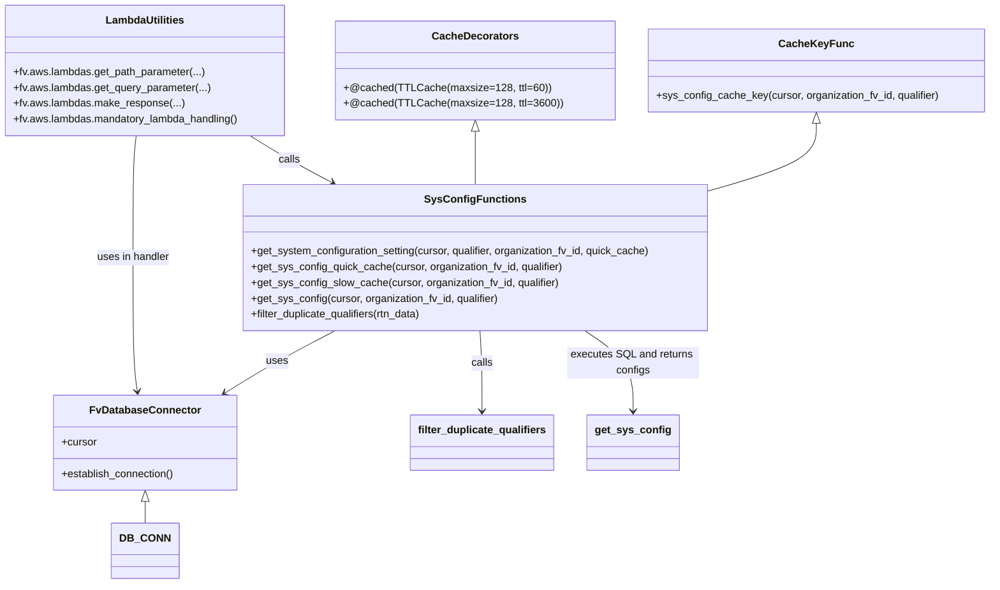

# Diagram: shipment_core/shipment_service/shipment_service/shipments/get_shipment_system_configuration.py


> Auto-generated by Obscura crawlers

## Diagram 1

```mermaid
flowchart TD
    LH[lambda_handler(event, context, audit_refs)]
    LH -->|establish connection| DB[DB_CONN.establish_connection()]
    DB --> CURS[cursor = DB_CONN.cursor]
    LH --> PARMS[Extract parameters]
    PARMS --> ORG[org_fv_id = path param]
    PARMS --> QUAL[qualifier = query param]
    PARMS --> QUICK[quick_cache = query param]
    LH -->|call| GSC[get_system_configuration_setting(cursor, qualifier, organization_fv_id, quick_cache)]
    GSC --> DECIDE{quick_cache true?}
    DECIDE -->|yes| QCACHE[get_sys_config_quick_cache(cursor, organization_fv_id, qualifier)]
    DECIDE -->|no| SCACHE[get_sys_config_slow_cache(cursor, organization_fv_id, qualifier)]
    QCACHE -->|cached| GSC2[get_sys_config(cursor, organization_fv_id, qualifier)]
    SCACHE -->|cached| GSC2
    GSC2 --> SQL[get_sys_config: build SQL, cursor.mogrify, execute, fetchall]
    SQL --> RETDATA{data?}
    RETDATA -->|yes| ROWN[construct rtn_data = [row.config ...]]
    ROWN --> QUALIFT{qualifier is None?}
    QUALIFT -->|yes| FILT[filter_duplicate_qualifiers(rtn_data)]
    QUALIFT -->|no| SKIP[skip filtering]
    FILT --> RETURN[return filtered rtn_data]
    SKIP --> RETURN
    RETDATA -->|no| EMPTY[return []]
    RETURN --> RESP[fv.aws.lambdas.make_response(..., 200)]
    EMPTY --> RESP
```

> SVG rendering failed for this diagram.

## Diagram 2



### SVG

<svg id="container" width="1477.767578125" xmlns="http://www.w3.org/2000/svg" class="classDiagram" height="886" viewBox="0 0 1477.767578125 886" role="graphics-document document" aria-roledescription="class"><style>#container{font-family:"trebuchet ms",verdana,arial,sans-serif;font-size:16px;fill:#333;}@keyframes edge-animation-frame{from{stroke-dashoffset:0;}}@keyframes dash{to{stroke-dashoffset:0;}}#container .edge-animation-slow{stroke-dasharray:9,5!important;stroke-dashoffset:900;animation:dash 50s linear infinite;stroke-linecap:round;}#container .edge-animation-fast{stroke-dasharray:9,5!important;stroke-dashoffset:900;animation:dash 20s linear infinite;stroke-linecap:round;}#container .error-icon{fill:#552222;}#container .error-text{fill:#552222;stroke:#552222;}#container .edge-thickness-normal{stroke-width:1px;}#container .edge-thickness-thick{stroke-width:3.5px;}#container .edge-pattern-solid{stroke-dasharray:0;}#container .edge-thickness-invisible{stroke-width:0;fill:none;}#container .edge-pattern-dashed{stroke-dasharray:3;}#container .edge-pattern-dotted{stroke-dasharray:2;}#container .marker{fill:#333333;stroke:#333333;}#container .marker.cross{stroke:#333333;}#container svg{font-family:"trebuchet ms",verdana,arial,sans-serif;font-size:16px;}#container p{margin:0;}#container g.classGroup text{fill:#9370DB;stroke:none;font-family:"trebuchet ms",verdana,arial,sans-serif;font-size:10px;}#container g.classGroup text .title{font-weight:bolder;}#container .nodeLabel,#container .edgeLabel{color:#131300;}#container .edgeLabel .label rect{fill:#ECECFF;}#container .label text{fill:#131300;}#container .labelBkg{background:#ECECFF;}#container .edgeLabel .label span{background:#ECECFF;}#container .classTitle{font-weight:bolder;}#container .node rect,#container .node circle,#container .node ellipse,#container .node polygon,#container .node path{fill:#ECECFF;stroke:#9370DB;stroke-width:1px;}#container .divider{stroke:#9370DB;stroke-width:1;}#container g.clickable{cursor:pointer;}#container g.classGroup rect{fill:#ECECFF;stroke:#9370DB;}#container g.classGroup line{stroke:#9370DB;stroke-width:1;}#container .classLabel .box{stroke:none;stroke-width:0;fill:#ECECFF;opacity:0.5;}#container .classLabel .label{fill:#9370DB;font-size:10px;}#container .relation{stroke:#333333;stroke-width:1;fill:none;}#container .dashed-line{stroke-dasharray:3;}#container .dotted-line{stroke-dasharray:1 2;}#container #compositionStart,#container .composition{fill:#333333!important;stroke:#333333!important;stroke-width:1;}#container #compositionEnd,#container .composition{fill:#333333!important;stroke:#333333!important;stroke-width:1;}#container #dependencyStart,#container .dependency{fill:#333333!important;stroke:#333333!important;stroke-width:1;}#container #dependencyStart,#container .dependency{fill:#333333!important;stroke:#333333!important;stroke-width:1;}#container #extensionStart,#container .extension{fill:transparent!important;stroke:#333333!important;stroke-width:1;}#container #extensionEnd,#container .extension{fill:transparent!important;stroke:#333333!important;stroke-width:1;}#container #aggregationStart,#container .aggregation{fill:transparent!important;stroke:#333333!important;stroke-width:1;}#container #aggregationEnd,#container .aggregation{fill:transparent!important;stroke:#333333!important;stroke-width:1;}#container #lollipopStart,#container .lollipop{fill:#ECECFF!important;stroke:#333333!important;stroke-width:1;}#container #lollipopEnd,#container .lollipop{fill:#ECECFF!important;stroke:#333333!important;stroke-width:1;}#container .edgeTerminals{font-size:11px;line-height:initial;}#container .classTitleText{text-anchor:middle;font-size:18px;fill:#333;}#container .label-icon{display:inline-block;height:1em;overflow:visible;vertical-align:-0.125em;}#container .node .label-icon path{fill:currentColor;stroke:revert;stroke-width:revert;}#container :root{--mermaid-font-family:"trebuchet ms",verdana,arial,sans-serif;}</style><g><defs><marker id="container_class-aggregationStart" class="marker aggregation class" refX="18" refY="7" markerWidth="190" markerHeight="240" orient="auto"><path d="M 18,7 L9,13 L1,7 L9,1 Z"></path></marker></defs><defs><marker id="container_class-aggregationEnd" class="marker aggregation class" refX="1" refY="7" markerWidth="20" markerHeight="28" orient="auto"><path d="M 18,7 L9,13 L1,7 L9,1 Z"></path></marker></defs><defs><marker id="container_class-extensionStart" class="marker extension class" refX="18" refY="7" markerWidth="190" markerHeight="240" orient="auto"><path d="M 1,7 L18,13 V 1 Z"></path></marker></defs><defs><marker id="container_class-extensionEnd" class="marker extension class" refX="1" refY="7" markerWidth="20" markerHeight="28" orient="auto"><path d="M 1,1 V 13 L18,7 Z"></path></marker></defs><defs><marker id="container_class-compositionStart" class="marker composition class" refX="18" refY="7" markerWidth="190" markerHeight="240" orient="auto"><path d="M 18,7 L9,13 L1,7 L9,1 Z"></path></marker></defs><defs><marker id="container_class-compositionEnd" class="marker composition class" refX="1" refY="7" markerWidth="20" markerHeight="28" orient="auto"><path d="M 18,7 L9,13 L1,7 L9,1 Z"></path></marker></defs><defs><marker id="container_class-dependencyStart" class="marker dependency class" refX="6" refY="7" markerWidth="190" markerHeight="240" orient="auto"><path d="M 5,7 L9,13 L1,7 L9,1 Z"></path></marker></defs><defs><marker id="container_class-dependencyEnd" class="marker dependency class" refX="13" refY="7" markerWidth="20" markerHeight="28" orient="auto"><path d="M 18,7 L9,13 L14,7 L9,1 Z"></path></marker></defs><defs><marker id="container_class-lollipopStart" class="marker lollipop class" refX="13" refY="7" markerWidth="190" markerHeight="240" orient="auto"><circle stroke="black" fill="transparent" cx="7" cy="7" r="6"></circle></marker></defs><defs><marker id="container_class-lollipopEnd" class="marker lollipop class" refX="1" refY="7" markerWidth="190" markerHeight="240" orient="auto"><circle stroke="black" fill="transparent" cx="7" cy="7" r="6"></circle></marker></defs><g class="root"><g class="clusters"></g><g class="edgePaths"><path d="M221.805,761.25L221.805,762.542C221.805,763.833,221.805,766.417,221.805,771.875C221.805,777.333,221.805,785.667,221.805,789.833L221.805,794" id="id_FvDatabaseConnector_DB_CONN_1" class="edge-thickness-normal edge-pattern-solid relation" style=";;;" data-edge="true" data-et="edge" data-id="id_FvDatabaseConnector_DB_CONN_1" data-points="W3sieCI6MjIxLjgwNDY4NzUsInkiOjc0NH0seyJ4IjoyMjEuODA0Njg3NSwieSI6NzY5fSx7IngiOjIyMS44MDQ2ODc1LCJ5Ijo3OTR9XQ==" marker-start="url(#container_class-extensionStart)"></path><path d="M1217.131,187.25L1217.131,196.542C1217.131,205.833,1217.131,224.417,1191.945,241.093C1166.758,257.77,1116.386,272.54,1091.2,279.925L1066.014,287.31" id="id_CacheKeyFunc_SysConfigFunctions_2" class="edge-thickness-normal edge-pattern-solid relation" style=";;;" data-edge="true" data-et="edge" data-id="id_CacheKeyFunc_SysConfigFunctions_2" data-points="W3sieCI6MTIxNy4xMzA4NTkzNzUsInkiOjE3MH0seyJ4IjoxMjE3LjEzMDg1OTM3NSwieSI6MjQzfSx7IngiOjEwNjYuMDEzNjcxODc1LCJ5IjoyODcuMzEwMDg3ODM4MDk5M31d" marker-start="url(#container_class-extensionStart)"></path><path d="M712.385,199.25L712.385,206.542C712.385,213.833,712.385,228.417,712.385,241.875C712.385,255.333,712.385,267.667,712.385,273.833L712.385,280" id="id_CacheDecorators_SysConfigFunctions_3" class="edge-thickness-normal edge-pattern-solid relation" style=";;;" data-edge="true" data-et="edge" data-id="id_CacheDecorators_SysConfigFunctions_3" data-points="W3sieCI6NzEyLjM4NDc2NTYyNSwieSI6MTgyfSx7IngiOjcxMi4zODQ3NjU2MjUsInkiOjI0M30seyJ4Ijo3MTIuMzg0NzY1NjI1LCJ5IjoyODB9XQ==" marker-start="url(#container_class-extensionStart)"></path><path d="M507.891,502L492.846,510.167C477.8,518.333,447.71,534.667,420.299,550.474C392.888,566.282,368.157,581.564,355.792,589.205L343.427,596.846" id="id_SysConfigFunctions_FvDatabaseConnector_4" class="edge-thickness-normal edge-pattern-solid relation" style=";;;" data-edge="true" data-et="edge" data-id="id_SysConfigFunctions_FvDatabaseConnector_4" data-points="W3sieCI6NTA3Ljg5MTExMzI4MTI1LCJ5Ijo1MDJ9LHsieCI6NDE3LjYxOTE0MDYyNSwieSI6NTUxfSx7IngiOjMzOC4zMjIzNzg2MTU3MDI0NiwieSI6NjAwfV0=" marker-end="url(#container_class-dependencyEnd)"></path><path d="M378.087,206L387.823,212.167C397.559,218.333,417.032,230.667,437.382,242.527C457.732,254.388,478.959,265.776,489.573,271.47L500.187,277.164" id="id_LambdaUtilities_SysConfigFunctions_5" class="edge-thickness-normal edge-pattern-solid relation" style=";;;" data-edge="true" data-et="edge" data-id="id_LambdaUtilities_SysConfigFunctions_5" data-points="W3sieCI6Mzc4LjA4NjcxMzAwNTUxNDcsInkiOjIwNn0seyJ4Ijo0MzYuNTAzOTA2MjUsInkiOjI0M30seyJ4Ijo1MDUuNDc0MTIxMDkzNzUsInkiOjI4MH1d" marker-end="url(#container_class-dependencyEnd)"></path><path d="M208.516,206L207.69,212.167C206.864,218.333,205.211,230.667,204.385,261.5C203.559,292.333,203.559,341.667,203.559,393C203.559,444.333,203.559,497.667,204.641,531.511C205.723,565.356,207.888,579.711,208.97,586.889L210.053,594.067" id="id_LambdaUtilities_FvDatabaseConnector_6" class="edge-thickness-normal edge-pattern-solid relation" style=";;;" data-edge="true" data-et="edge" data-id="id_LambdaUtilities_FvDatabaseConnector_6" data-points="W3sieCI6MjA4LjUxNjIyODE3MDk1NTg4LCJ5IjoyMDZ9LHsieCI6MjAzLjU1ODU5Mzc1LCJ5IjoyNDN9LHsieCI6MjAzLjU1ODU5Mzc1LCJ5IjozOTF9LHsieCI6MjAzLjU1ODU5Mzc1LCJ5Ijo1NTF9LHsieCI6MjEwLjk0NzUwNzc0NzkzMzg4LCJ5Ijo2MDB9XQ==" marker-end="url(#container_class-dependencyEnd)"></path><path d="M723.351,502L724.157,510.167C724.964,518.333,726.578,534.667,727.385,555C728.191,575.333,728.191,599.667,728.191,611.833L728.191,624" id="id_SysConfigFunctions_filter_duplicate_qualifiers_7" class="edge-thickness-normal edge-pattern-solid relation" style=";;;" data-edge="true" data-et="edge" data-id="id_SysConfigFunctions_filter_duplicate_qualifiers_7" data-points="W3sieCI6NzIzLjM1MDYyMjU1ODU5MzcsInkiOjUwMn0seyJ4Ijo3MjguMTkxNDA2MjUsInkiOjU1MX0seyJ4Ijo3MjguMTkxNDA2MjUsInkiOjYzMH1d" marker-end="url(#container_class-dependencyEnd)"></path><path d="M876.854,502L888.954,510.167C901.055,518.333,925.256,534.667,937.356,555C949.457,575.333,949.457,599.667,949.457,611.833L949.457,624" id="id_SysConfigFunctions_get_sys_config_8" class="edge-thickness-normal edge-pattern-solid relation" style=";;;" data-edge="true" data-et="edge" data-id="id_SysConfigFunctions_get_sys_config_8" data-points="W3sieCI6ODc2Ljg1MzY0OTkwMjM0MzcsInkiOjUwMn0seyJ4Ijo5NDkuNDU3MDMxMjUsInkiOjU1MX0seyJ4Ijo5NDkuNDU3MDMxMjUsInkiOjYzMH1d" marker-end="url(#container_class-dependencyEnd)"></path></g><g class="edgeLabels"><g class="edgeLabel"><g class="label" data-id="id_FvDatabaseConnector_DB_CONN_1" transform="translate(0, 0)"><foreignObject width="0" height="0"><div xmlns="http://www.w3.org/1999/xhtml" class="labelBkg" style="display: table-cell; white-space: nowrap; line-height: 1.5; max-width: 200px; text-align: center;"><span class="edgeLabel"></span></div></foreignObject></g></g><g class="edgeLabel"><g class="label" data-id="id_CacheKeyFunc_SysConfigFunctions_2" transform="translate(0, 0)"><foreignObject width="0" height="0"><div xmlns="http://www.w3.org/1999/xhtml" class="labelBkg" style="display: table-cell; white-space: nowrap; line-height: 1.5; max-width: 200px; text-align: center;"><span class="edgeLabel"></span></div></foreignObject></g></g><g class="edgeLabel"><g class="label" data-id="id_CacheDecorators_SysConfigFunctions_3" transform="translate(0, 0)"><foreignObject width="0" height="0"><div xmlns="http://www.w3.org/1999/xhtml" class="labelBkg" style="display: table-cell; white-space: nowrap; line-height: 1.5; max-width: 200px; text-align: center;"><span class="edgeLabel"></span></div></foreignObject></g></g><g class="edgeLabel" transform="translate(421.7932, 548.73431)"><g class="label" data-id="id_SysConfigFunctions_FvDatabaseConnector_4" transform="translate(-16.4921875, -12)"><foreignObject width="32.984375" height="24"><div xmlns="http://www.w3.org/1999/xhtml" class="labelBkg" style="display: table-cell; white-space: nowrap; line-height: 1.5; max-width: 200px; text-align: center;"><span class="edgeLabel"><p>uses</p></span></div></foreignObject></g></g><g class="edgeLabel" transform="translate(436.50390625, 243)"><g class="label" data-id="id_LambdaUtilities_SysConfigFunctions_5" transform="translate(-16.4453125, -12)"><foreignObject width="32.890625" height="24"><div xmlns="http://www.w3.org/1999/xhtml" class="labelBkg" style="display: table-cell; white-space: nowrap; line-height: 1.5; max-width: 200px; text-align: center;"><span class="edgeLabel"><p>calls</p></span></div></foreignObject></g></g><g class="edgeLabel" transform="translate(203.55859375, 391)"><g class="label" data-id="id_LambdaUtilities_FvDatabaseConnector_6" transform="translate(-55.9375, -12)"><foreignObject width="111.875" height="24"><div xmlns="http://www.w3.org/1999/xhtml" class="labelBkg" style="display: table-cell; white-space: nowrap; line-height: 1.5; max-width: 200px; text-align: center;"><span class="edgeLabel"><p>uses in handler</p></span></div></foreignObject></g></g><g class="edgeLabel" transform="translate(728.19140625, 551)"><g class="label" data-id="id_SysConfigFunctions_filter_duplicate_qualifiers_7" transform="translate(-16.4453125, -12)"><foreignObject width="32.890625" height="24"><div xmlns="http://www.w3.org/1999/xhtml" class="labelBkg" style="display: table-cell; white-space: nowrap; line-height: 1.5; max-width: 200px; text-align: center;"><span class="edgeLabel"><p>calls</p></span></div></foreignObject></g></g><g class="edgeLabel" transform="translate(949.45703125, 551)"><g class="label" data-id="id_SysConfigFunctions_get_sys_config_8" transform="translate(-100, -24)"><foreignObject width="200" height="48"><div xmlns="http://www.w3.org/1999/xhtml" class="labelBkg" style="display: table; white-space: break-spaces; line-height: 1.5; max-width: 200px; text-align: center; width: 200px;"><span class="edgeLabel"><p>executes SQL and returns configs</p></span></div></foreignObject></g></g></g><g class="nodes"><g class="node default" id="classId-FvDatabaseConnector-0" transform="translate(221.8046875, 672)"><g class="basic label-container"><path d="M-138.28515625 -72 L138.28515625 -72 L138.28515625 72 L-138.28515625 72" stroke="none" stroke-width="0" fill="#ECECFF" style=""></path><path d="M-138.28515625 -72 C-82.640998067911 -72, -26.996839885821984 -72, 138.28515625 -72 M-138.28515625 -72 C-35.47450491464457 -72, 67.33614642071086 -72, 138.28515625 -72 M138.28515625 -72 C138.28515625 -42.94467030303315, 138.28515625 -13.889340606066291, 138.28515625 72 M138.28515625 -72 C138.28515625 -22.77647998171608, 138.28515625 26.44704003656784, 138.28515625 72 M138.28515625 72 C57.67124650001112 72, -22.942663249977755 72, -138.28515625 72 M138.28515625 72 C44.62923278845085 72, -49.0266906730983 72, -138.28515625 72 M-138.28515625 72 C-138.28515625 37.42182496184447, -138.28515625 2.843649923688943, -138.28515625 -72 M-138.28515625 72 C-138.28515625 27.609889595419013, -138.28515625 -16.780220809161975, -138.28515625 -72" stroke="#9370DB" stroke-width="1.3" fill="none" stroke-dasharray="0 0" style=""></path></g><g class="annotation-group text" transform="translate(0, -48)"></g><g class="label-group text" transform="translate(-79.3046875, -48)"><g class="label" style="font-weight: bolder" transform="translate(0,-12)"><foreignObject width="158.609375" height="24"><div xmlns="http://www.w3.org/1999/xhtml" style="display: table-cell; white-space: nowrap; line-height: 1.5; max-width: 207px; text-align: center;"><span class="nodeLabel markdown-node-label" style=""><p>FvDatabaseConnector</p></span></div></foreignObject></g></g><g class="members-group text" transform="translate(-126.28515625, 0)"><g class="label" style="" transform="translate(0,-12)"><foreignObject width="53.71875" height="24"><div xmlns="http://www.w3.org/1999/xhtml" style="display: table-cell; white-space: nowrap; line-height: 1.5; max-width: 112px; text-align: center;"><span class="nodeLabel markdown-node-label" style=""><p>+cursor</p></span></div></foreignObject></g></g><g class="methods-group text" transform="translate(-126.28515625, 48)"><g class="label" style="" transform="translate(0,-12)"><foreignObject width="173.265625" height="24"><div xmlns="http://www.w3.org/1999/xhtml" style="display: table-cell; white-space: nowrap; line-height: 1.5; max-width: 231px; text-align: center;"><span class="nodeLabel markdown-node-label" style=""><p>+establish_connection()</p></span></div></foreignObject></g></g><g class="divider" style=""><path d="M-138.28515625 -24 C-43.342769144441974 -24, 51.59961796111605 -24, 138.28515625 -24 M-138.28515625 -24 C-77.85137882335654 -24, -17.41760139671308 -24, 138.28515625 -24" stroke="#9370DB" stroke-width="1.3" fill="none" stroke-dasharray="0 0" style=""></path></g><g class="divider" style=""><path d="M-138.28515625 24 C-66.7428780298953 24, 4.799400190209411 24, 138.28515625 24 M-138.28515625 24 C-74.76598501788956 24, -11.246813785779125 24, 138.28515625 24" stroke="#9370DB" stroke-width="1.3" fill="none" stroke-dasharray="0 0" style=""></path></g></g><g class="node default" id="classId-CacheKeyFunc-1" transform="translate(1217.130859375, 107)"><g class="basic label-container"><path d="M-252.63671875 -63 L252.63671875 -63 L252.63671875 63 L-252.63671875 63" stroke="none" stroke-width="0" fill="#ECECFF" style=""></path><path d="M-252.63671875 -63 C-53.76977055387553 -63, 145.09717764224894 -63, 252.63671875 -63 M-252.63671875 -63 C-130.77545888059032 -63, -8.914199011180642 -63, 252.63671875 -63 M252.63671875 -63 C252.63671875 -35.382530557829824, 252.63671875 -7.765061115659655, 252.63671875 63 M252.63671875 -63 C252.63671875 -31.4124016744209, 252.63671875 0.1751966511582026, 252.63671875 63 M252.63671875 63 C149.7815049373217 63, 46.92629112464337 63, -252.63671875 63 M252.63671875 63 C94.72290246379802 63, -63.19091382240396 63, -252.63671875 63 M-252.63671875 63 C-252.63671875 19.828268769694972, -252.63671875 -23.343462460610056, -252.63671875 -63 M-252.63671875 63 C-252.63671875 26.435949401091413, -252.63671875 -10.128101197817173, -252.63671875 -63" stroke="#9370DB" stroke-width="1.3" fill="none" stroke-dasharray="0 0" style=""></path></g><g class="annotation-group text" transform="translate(0, -39)"></g><g class="label-group text" transform="translate(-51.8203125, -39)"><g class="label" style="font-weight: bolder" transform="translate(0,-12)"><foreignObject width="103.640625" height="24"><div xmlns="http://www.w3.org/1999/xhtml" style="display: table-cell; white-space: nowrap; line-height: 1.5; max-width: 153px; text-align: center;"><span class="nodeLabel markdown-node-label" style=""><p>CacheKeyFunc</p></span></div></foreignObject></g></g><g class="members-group text" transform="translate(-240.63671875, 9)"></g><g class="methods-group text" transform="translate(-240.63671875, 39)"><g class="label" style="" transform="translate(0,-12)"><foreignObject width="429.453125" height="24"><div xmlns="http://www.w3.org/1999/xhtml" style="display: table-cell; white-space: nowrap; line-height: 1.5; max-width: 487px; text-align: center;"><span class="nodeLabel markdown-node-label" style=""><p>+sys_config_cache_key(cursor, organization_fv_id, qualifier)</p></span></div></foreignObject></g></g><g class="divider" style=""><path d="M-252.63671875 -15 C-68.41191030190043 -15, 115.81289814619913 -15, 252.63671875 -15 M-252.63671875 -15 C-102.68435505577412 -15, 47.26800863845176 -15, 252.63671875 -15" stroke="#9370DB" stroke-width="1.3" fill="none" stroke-dasharray="0 0" style=""></path></g><g class="divider" style=""><path d="M-252.63671875 9 C-122.98363010200197 9, 6.669458545996065 9, 252.63671875 9 M-252.63671875 9 C-76.90466529744288 9, 98.82738815511425 9, 252.63671875 9" stroke="#9370DB" stroke-width="1.3" fill="none" stroke-dasharray="0 0" style=""></path></g></g><g class="node default" id="classId-CacheDecorators-2" transform="translate(712.384765625, 107)"><g class="basic label-container"><path d="M-202.109375 -75 L202.109375 -75 L202.109375 75 L-202.109375 75" stroke="none" stroke-width="0" fill="#ECECFF" style=""></path><path d="M-202.109375 -75 C-79.90257808914986 -75, 42.30421882170029 -75, 202.109375 -75 M-202.109375 -75 C-93.05189482101757 -75, 16.00558535796486 -75, 202.109375 -75 M202.109375 -75 C202.109375 -25.77506625328367, 202.109375 23.449867493432663, 202.109375 75 M202.109375 -75 C202.109375 -36.33491518543563, 202.109375 2.330169629128747, 202.109375 75 M202.109375 75 C109.9402348004262 75, 17.771094600852393 75, -202.109375 75 M202.109375 75 C56.82998183552138 75, -88.44941132895724 75, -202.109375 75 M-202.109375 75 C-202.109375 42.153818064657386, -202.109375 9.307636129314773, -202.109375 -75 M-202.109375 75 C-202.109375 33.46834048506694, -202.109375 -8.063319029866122, -202.109375 -75" stroke="#9370DB" stroke-width="1.3" fill="none" stroke-dasharray="0 0" style=""></path></g><g class="annotation-group text" transform="translate(0, -51)"></g><g class="label-group text" transform="translate(-61.640625, -51)"><g class="label" style="font-weight: bolder" transform="translate(0,-12)"><foreignObject width="123.28125" height="24"><div xmlns="http://www.w3.org/1999/xhtml" style="display: table-cell; white-space: nowrap; line-height: 1.5; max-width: 172px; text-align: center;"><span class="nodeLabel markdown-node-label" style=""><p>CacheDecorators</p></span></div></foreignObject></g></g><g class="members-group text" transform="translate(-190.109375, -3)"></g><g class="methods-group text" transform="translate(-190.109375, 27)"><g class="label" style="" transform="translate(0,-12)"><foreignObject width="302.234375" height="24"><div xmlns="http://www.w3.org/1999/xhtml" style="display: table-cell; white-space: nowrap; line-height: 1.5; max-width: 360px; text-align: center;"><span class="nodeLabel markdown-node-label" style=""><p>+@cached(TTLCache(maxsize=128, ttl=60))</p></span></div></foreignObject></g><g class="label" style="" transform="translate(0,12)"><foreignObject width="318.578125" height="24"><div xmlns="http://www.w3.org/1999/xhtml" style="display: table-cell; white-space: nowrap; line-height: 1.5; max-width: 376px; text-align: center;"><span class="nodeLabel markdown-node-label" style=""><p>+@cached(TTLCache(maxsize=128, ttl=3600))</p></span></div></foreignObject></g></g><g class="divider" style=""><path d="M-202.109375 -27 C-109.46242323882058 -27, -16.815471477641154 -27, 202.109375 -27 M-202.109375 -27 C-58.63278241843085 -27, 84.8438101631383 -27, 202.109375 -27" stroke="#9370DB" stroke-width="1.3" fill="none" stroke-dasharray="0 0" style=""></path></g><g class="divider" style=""><path d="M-202.109375 -3 C-47.27400361639121 -3, 107.56136776721758 -3, 202.109375 -3 M-202.109375 -3 C-96.27987370932871 -3, 9.549627581342577 -3, 202.109375 -3" stroke="#9370DB" stroke-width="1.3" fill="none" stroke-dasharray="0 0" style=""></path></g></g><g class="node default" id="classId-SysConfigFunctions-3" transform="translate(712.384765625, 391)"><g class="basic label-container"><path d="M-353.62890625 -111 L353.62890625 -111 L353.62890625 111 L-353.62890625 111" stroke="none" stroke-width="0" fill="#ECECFF" style=""></path><path d="M-353.62890625 -111 C-182.52564107859243 -111, -11.422375907184858 -111, 353.62890625 -111 M-353.62890625 -111 C-174.82576882532848 -111, 3.9773685993430377 -111, 353.62890625 -111 M353.62890625 -111 C353.62890625 -50.307316035933844, 353.62890625 10.385367928132311, 353.62890625 111 M353.62890625 -111 C353.62890625 -54.80031830767231, 353.62890625 1.3993633846553735, 353.62890625 111 M353.62890625 111 C162.31099336265845 111, -29.0069195246831 111, -353.62890625 111 M353.62890625 111 C128.72490165265975 111, -96.1791029446805 111, -353.62890625 111 M-353.62890625 111 C-353.62890625 34.00350605097762, -353.62890625 -42.99298789804476, -353.62890625 -111 M-353.62890625 111 C-353.62890625 62.01280287240503, -353.62890625 13.025605744810065, -353.62890625 -111" stroke="#9370DB" stroke-width="1.3" fill="none" stroke-dasharray="0 0" style=""></path></g><g class="annotation-group text" transform="translate(0, -87)"></g><g class="label-group text" transform="translate(-70.4921875, -87)"><g class="label" style="font-weight: bolder" transform="translate(0,-12)"><foreignObject width="140.984375" height="24"><div xmlns="http://www.w3.org/1999/xhtml" style="display: table-cell; white-space: nowrap; line-height: 1.5; max-width: 189px; text-align: center;"><span class="nodeLabel markdown-node-label" style=""><p>SysConfigFunctions</p></span></div></foreignObject></g></g><g class="members-group text" transform="translate(-341.62890625, -39)"></g><g class="methods-group text" transform="translate(-341.62890625, -9)"><g class="label" style="" transform="translate(0,-12)"><foreignObject width="612.765625" height="24"><div xmlns="http://www.w3.org/1999/xhtml" style="display: table-cell; white-space: nowrap; line-height: 1.5; max-width: 670px; text-align: center;"><span class="nodeLabel markdown-node-label" style=""><p>+get_system_configuration_setting(cursor, qualifier, organization_fv_id, quick_cache)</p></span></div></foreignObject></g><g class="label" style="" transform="translate(0,12)"><foreignObject width="474.984375" height="24"><div xmlns="http://www.w3.org/1999/xhtml" style="display: table-cell; white-space: nowrap; line-height: 1.5; max-width: 532px; text-align: center;"><span class="nodeLabel markdown-node-label" style=""><p>+get_sys_config_quick_cache(cursor, organization_fv_id, qualifier)</p></span></div></foreignObject></g><g class="label" style="" transform="translate(0,36)"><foreignObject width="468.65625" height="24"><div xmlns="http://www.w3.org/1999/xhtml" style="display: table-cell; white-space: nowrap; line-height: 1.5; max-width: 526px; text-align: center;"><span class="nodeLabel markdown-node-label" style=""><p>+get_sys_config_slow_cache(cursor, organization_fv_id, qualifier)</p></span></div></foreignObject></g><g class="label" style="" transform="translate(0,60)"><foreignObject width="377.75" height="24"><div xmlns="http://www.w3.org/1999/xhtml" style="display: table-cell; white-space: nowrap; line-height: 1.5; max-width: 435px; text-align: center;"><span class="nodeLabel markdown-node-label" style=""><p>+get_sys_config(cursor, organization_fv_id, qualifier)</p></span></div></foreignObject></g><g class="label" style="" transform="translate(0,84)"><foreignObject width="264.796875" height="24"><div xmlns="http://www.w3.org/1999/xhtml" style="display: table-cell; white-space: nowrap; line-height: 1.5; max-width: 322px; text-align: center;"><span class="nodeLabel markdown-node-label" style=""><p>+filter_duplicate_qualifiers(rtn_data)</p></span></div></foreignObject></g></g><g class="divider" style=""><path d="M-353.62890625 -63 C-107.21882218801937 -63, 139.19126187396125 -63, 353.62890625 -63 M-353.62890625 -63 C-94.8565377723674 -63, 163.9158307052652 -63, 353.62890625 -63" stroke="#9370DB" stroke-width="1.3" fill="none" stroke-dasharray="0 0" style=""></path></g><g class="divider" style=""><path d="M-353.62890625 -39 C-186.1228983363366 -39, -18.61689042267318 -39, 353.62890625 -39 M-353.62890625 -39 C-93.41148809461339 -39, 166.80593006077322 -39, 353.62890625 -39" stroke="#9370DB" stroke-width="1.3" fill="none" stroke-dasharray="0 0" style=""></path></g></g><g class="node default" id="classId-LambdaUtilities-4" transform="translate(221.78125, 107)"><g class="basic label-container"><path d="M-213.78125 -99 L213.78125 -99 L213.78125 99 L-213.78125 99" stroke="none" stroke-width="0" fill="#ECECFF" style=""></path><path d="M-213.78125 -99 C-70.36030874603364 -99, 73.06063250793272 -99, 213.78125 -99 M-213.78125 -99 C-60.49707445904369 -99, 92.78710108191262 -99, 213.78125 -99 M213.78125 -99 C213.78125 -19.813298258159733, 213.78125 59.373403483680534, 213.78125 99 M213.78125 -99 C213.78125 -44.62374836883722, 213.78125 9.752503262325561, 213.78125 99 M213.78125 99 C127.01234146582051 99, 40.243432931641024 99, -213.78125 99 M213.78125 99 C46.77445697096559 99, -120.23233605806882 99, -213.78125 99 M-213.78125 99 C-213.78125 20.818673410855084, -213.78125 -57.36265317828983, -213.78125 -99 M-213.78125 99 C-213.78125 49.28232020235364, -213.78125 -0.4353595952927236, -213.78125 -99" stroke="#9370DB" stroke-width="1.3" fill="none" stroke-dasharray="0 0" style=""></path></g><g class="annotation-group text" transform="translate(0, -75)"></g><g class="label-group text" transform="translate(-57.9375, -75)"><g class="label" style="font-weight: bolder" transform="translate(0,-12)"><foreignObject width="115.875" height="24"><div xmlns="http://www.w3.org/1999/xhtml" style="display: table-cell; white-space: nowrap; line-height: 1.5; max-width: 165px; text-align: center;"><span class="nodeLabel markdown-node-label" style=""><p>LambdaUtilities</p></span></div></foreignObject></g></g><g class="members-group text" transform="translate(-201.78125, -27)"></g><g class="methods-group text" transform="translate(-201.78125, 3)"><g class="label" style="" transform="translate(0,-12)"><foreignObject width="290.90625" height="24"><div xmlns="http://www.w3.org/1999/xhtml" style="display: table-cell; white-space: nowrap; line-height: 1.5; max-width: 348px; text-align: center;"><span class="nodeLabel markdown-node-label" style=""><p>+fv.aws.lambdas.get_path_parameter(...)</p></span></div></foreignObject></g><g class="label" style="" transform="translate(0,12)"><foreignObject width="298.546875" height="24"><div xmlns="http://www.w3.org/1999/xhtml" style="display: table-cell; white-space: nowrap; line-height: 1.5; max-width: 356px; text-align: center;"><span class="nodeLabel markdown-node-label" style=""><p>+fv.aws.lambdas.get_query_parameter(...)</p></span></div></foreignObject></g><g class="label" style="" transform="translate(0,36)"><foreignObject width="256.921875" height="24"><div xmlns="http://www.w3.org/1999/xhtml" style="display: table-cell; white-space: nowrap; line-height: 1.5; max-width: 314px; text-align: center;"><span class="nodeLabel markdown-node-label" style=""><p>+fv.aws.lambdas.make_response(...)</p></span></div></foreignObject></g><g class="label" style="" transform="translate(0,60)"><foreignObject width="345.625" height="24"><div xmlns="http://www.w3.org/1999/xhtml" style="display: table-cell; white-space: nowrap; line-height: 1.5; max-width: 403px; text-align: center;"><span class="nodeLabel markdown-node-label" style=""><p>+fv.aws.lambdas.mandatory_lambda_handling()</p></span></div></foreignObject></g></g><g class="divider" style=""><path d="M-213.78125 -51 C-71.1701796385797 -51, 71.4408907228406 -51, 213.78125 -51 M-213.78125 -51 C-101.68241397423908 -51, 10.416422051521835 -51, 213.78125 -51" stroke="#9370DB" stroke-width="1.3" fill="none" stroke-dasharray="0 0" style=""></path></g><g class="divider" style=""><path d="M-213.78125 -27 C-89.5600135526959 -27, 34.66122289460819 -27, 213.78125 -27 M-213.78125 -27 C-75.77188931224055 -27, 62.23747137551891 -27, 213.78125 -27" stroke="#9370DB" stroke-width="1.3" fill="none" stroke-dasharray="0 0" style=""></path></g></g><g class="node default" id="classId-DB_CONN-5" transform="translate(221.8046875, 836)"><g class="basic label-container"><path d="M-46.40625 -42 L46.40625 -42 L46.40625 42 L-46.40625 42" stroke="none" stroke-width="0" fill="#ECECFF" style=""></path><path d="M-46.40625 -42 C-14.856139011583824 -42, 16.69397197683235 -42, 46.40625 -42 M-46.40625 -42 C-14.733218540020605 -42, 16.93981291995879 -42, 46.40625 -42 M46.40625 -42 C46.40625 -23.286713005828993, 46.40625 -4.573426011657986, 46.40625 42 M46.40625 -42 C46.40625 -20.237331441558243, 46.40625 1.525337116883513, 46.40625 42 M46.40625 42 C21.24704682424667 42, -3.9121563515066597 42, -46.40625 42 M46.40625 42 C15.555803228959665 42, -15.29464354208067 42, -46.40625 42 M-46.40625 42 C-46.40625 17.047580767751914, -46.40625 -7.904838464496173, -46.40625 -42 M-46.40625 42 C-46.40625 10.03972362639687, -46.40625 -21.92055274720626, -46.40625 -42" stroke="#9370DB" stroke-width="1.3" fill="none" stroke-dasharray="0 0" style=""></path></g><g class="annotation-group text" transform="translate(0, -18)"></g><g class="label-group text" transform="translate(-34.40625, -18)"><g class="label" style="font-weight: bolder" transform="translate(0,-12)"><foreignObject width="68.8125" height="24"><div xmlns="http://www.w3.org/1999/xhtml" style="display: table-cell; white-space: nowrap; line-height: 1.5; max-width: 119px; text-align: center;"><span class="nodeLabel markdown-node-label" style=""><p>DB_CONN</p></span></div></foreignObject></g></g><g class="members-group text" transform="translate(-34.40625, 30)"></g><g class="methods-group text" transform="translate(-34.40625, 60)"></g><g class="divider" style=""><path d="M-46.40625 6 C-22.578628326887063 6, 1.2489933462258733 6, 46.40625 6 M-46.40625 6 C-27.260658691377742 6, -8.115067382755484 6, 46.40625 6" stroke="#9370DB" stroke-width="1.3" fill="none" stroke-dasharray="0 0" style=""></path></g><g class="divider" style=""><path d="M-46.40625 24 C-10.319464027274933 24, 25.767321945450135 24, 46.40625 24 M-46.40625 24 C-19.71818827109049 24, 6.96987345781902 24, 46.40625 24" stroke="#9370DB" stroke-width="1.3" fill="none" stroke-dasharray="0 0" style=""></path></g></g><g class="node default" id="classId-filter_duplicate_qualifiers-6" transform="translate(728.19140625, 672)"><g class="basic label-container"><path d="M-105.71875 -42 L105.71875 -42 L105.71875 42 L-105.71875 42" stroke="none" stroke-width="0" fill="#ECECFF" style=""></path><path d="M-105.71875 -42 C-62.46602072661291 -42, -19.21329145322582 -42, 105.71875 -42 M-105.71875 -42 C-40.27474865139037 -42, 25.169252697219264 -42, 105.71875 -42 M105.71875 -42 C105.71875 -10.192923011317816, 105.71875 21.614153977364367, 105.71875 42 M105.71875 -42 C105.71875 -13.581615695805176, 105.71875 14.836768608389647, 105.71875 42 M105.71875 42 C43.52768189719189 42, -18.66338620561622 42, -105.71875 42 M105.71875 42 C42.28875111933261 42, -21.141247761334782 42, -105.71875 42 M-105.71875 42 C-105.71875 10.873206141867318, -105.71875 -20.253587716265365, -105.71875 -42 M-105.71875 42 C-105.71875 16.90870997254955, -105.71875 -8.182580054900903, -105.71875 -42" stroke="#9370DB" stroke-width="1.3" fill="none" stroke-dasharray="0 0" style=""></path></g><g class="annotation-group text" transform="translate(0, -18)"></g><g class="label-group text" transform="translate(-93.71875, -18)"><g class="label" style="font-weight: bolder" transform="translate(0,-12)"><foreignObject width="187.4375" height="24"><div xmlns="http://www.w3.org/1999/xhtml" style="display: table-cell; white-space: nowrap; line-height: 1.5; max-width: 235px; text-align: center;"><span class="nodeLabel markdown-node-label" style=""><p>filter_duplicate_qualifiers</p></span></div></foreignObject></g></g><g class="members-group text" transform="translate(-93.71875, 30)"></g><g class="methods-group text" transform="translate(-93.71875, 60)"></g><g class="divider" style=""><path d="M-105.71875 6 C-40.002466670974584 6, 25.71381665805083 6, 105.71875 6 M-105.71875 6 C-35.21794654970553 6, 35.28285690058894 6, 105.71875 6" stroke="#9370DB" stroke-width="1.3" fill="none" stroke-dasharray="0 0" style=""></path></g><g class="divider" style=""><path d="M-105.71875 24 C-25.510381545403604 24, 54.69798690919279 24, 105.71875 24 M-105.71875 24 C-59.08861892762026 24, -12.45848785524052 24, 105.71875 24" stroke="#9370DB" stroke-width="1.3" fill="none" stroke-dasharray="0 0" style=""></path></g></g><g class="node default" id="classId-get_sys_config-7" transform="translate(949.45703125, 672)"><g class="basic label-container"><path d="M-65.546875 -42 L65.546875 -42 L65.546875 42 L-65.546875 42" stroke="none" stroke-width="0" fill="#ECECFF" style=""></path><path d="M-65.546875 -42 C-15.426497321543039 -42, 34.69388035691392 -42, 65.546875 -42 M-65.546875 -42 C-22.282028046105054 -42, 20.98281890778989 -42, 65.546875 -42 M65.546875 -42 C65.546875 -20.191419729272198, 65.546875 1.617160541455604, 65.546875 42 M65.546875 -42 C65.546875 -17.7907907670928, 65.546875 6.418418465814398, 65.546875 42 M65.546875 42 C15.606855728903057 42, -34.33316354219389 42, -65.546875 42 M65.546875 42 C33.08710482595596 42, 0.627334651911923 42, -65.546875 42 M-65.546875 42 C-65.546875 14.984070956914664, -65.546875 -12.031858086170672, -65.546875 -42 M-65.546875 42 C-65.546875 13.055241182806242, -65.546875 -15.889517634387516, -65.546875 -42" stroke="#9370DB" stroke-width="1.3" fill="none" stroke-dasharray="0 0" style=""></path></g><g class="annotation-group text" transform="translate(0, -18)"></g><g class="label-group text" transform="translate(-53.546875, -18)"><g class="label" style="font-weight: bolder" transform="translate(0,-12)"><foreignObject width="107.09375" height="24"><div xmlns="http://www.w3.org/1999/xhtml" style="display: table-cell; white-space: nowrap; line-height: 1.5; max-width: 155px; text-align: center;"><span class="nodeLabel markdown-node-label" style=""><p>get_sys_config</p></span></div></foreignObject></g></g><g class="members-group text" transform="translate(-53.546875, 30)"></g><g class="methods-group text" transform="translate(-53.546875, 60)"></g><g class="divider" style=""><path d="M-65.546875 6 C-36.28364955136323 6, -7.020424102726466 6, 65.546875 6 M-65.546875 6 C-35.35266742057085 6, -5.158459841141706 6, 65.546875 6" stroke="#9370DB" stroke-width="1.3" fill="none" stroke-dasharray="0 0" style=""></path></g><g class="divider" style=""><path d="M-65.546875 24 C-27.0194569178513 24, 11.507961164297399 24, 65.546875 24 M-65.546875 24 C-18.000477405236175 24, 29.54592018952765 24, 65.546875 24" stroke="#9370DB" stroke-width="1.3" fill="none" stroke-dasharray="0 0" style=""></path></g></g></g></g></g></svg>
