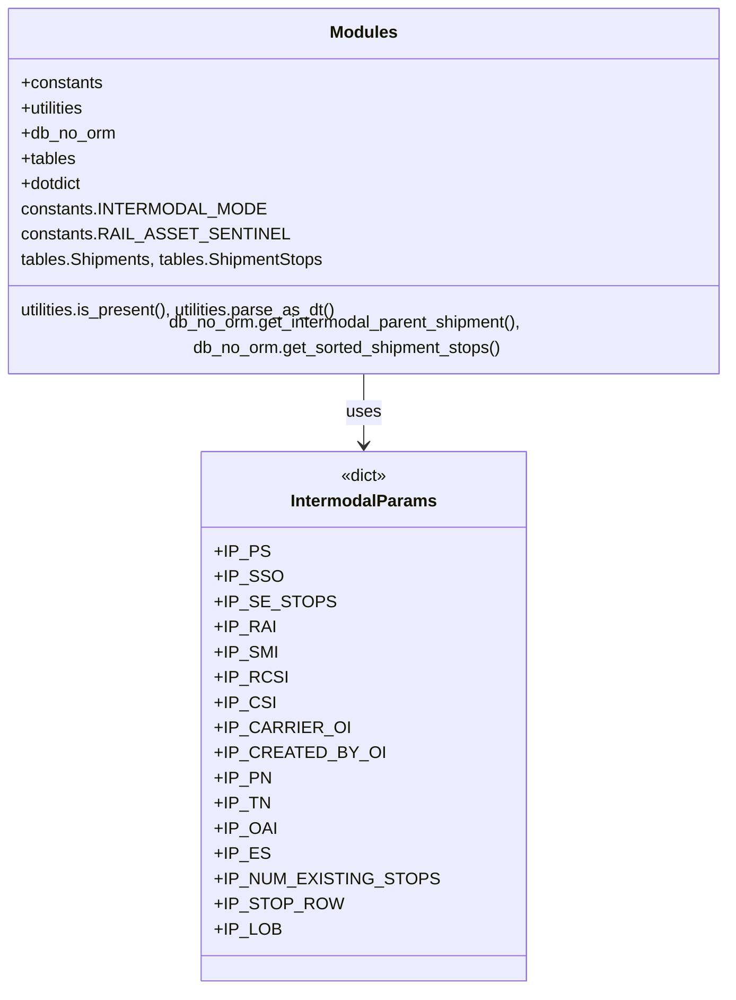

# Diagram: shipment_core/shipment_service/shipment_service/shipments/intermodal_merge_process.py


> Auto-generated by Obscura crawlers

## Diagram 1

```mermaid
flowchart LR
  Start((Start))
  A[is_eligible_to_link(intermodal_params)]
  A -->|True| B{set RAIL_ASSET or OAI}
  B --> C{parent_shipment provided?}
  C -->|No| D[get_intermodal_parent_shipment(cursor, PN, TN, not_own_id)]
  C -->|Yes| E[use parent_shipment]
  D --> F[if parent found -> wrap as dict if needed]
  E --> F
  F --> G[create tables.Shipments(cursor,parent) -> IP_ES]
  G --> H[preserve and set fields: IP_SMI, IP_RCSI, IP_CSI, IP_CARRIER_OI, IP_CREATED_BY_OI, IP_PN, IP_LOB, IP_RAI]
  H --> I{parent_stops provided?}
  I -->|No| J[get_sorted_shipment_stops(cursor, IP_ES.id, "all") -> IP_SE_STOPS]
  I -->|Yes| K[IP_SE_STOPS = [dotdict(stop) for stop in parent_stops]]
  J --> L[IP_NUM_EXISTING_STOPS = len(IP_SE_STOPS)]
  K --> L
  L --> M[already_merged = check rail_creator_shipment_id differs]
  M --> EndInfo[return (IP_RAI, IP_SMI, IP_RCSI, IP_CSI, IP_CARRIER_OI, IP_CREATED_BY_OI, IP_PN, is_eligible, already_merged, IP_LOB)]
  A -->|False| EndNo[return tuple with is_eligible=False]
  Start --> A
```

> SVG rendering failed for this diagram.

## Diagram 2



### SVG

<svg id="container" width="718.421875" xmlns="http://www.w3.org/2000/svg" class="classDiagram" height="930" viewBox="0 0 718.421875 930" role="graphics-document document" aria-roledescription="class"><style>#container{font-family:"trebuchet ms",verdana,arial,sans-serif;font-size:16px;fill:#333;}@keyframes edge-animation-frame{from{stroke-dashoffset:0;}}@keyframes dash{to{stroke-dashoffset:0;}}#container .edge-animation-slow{stroke-dasharray:9,5!important;stroke-dashoffset:900;animation:dash 50s linear infinite;stroke-linecap:round;}#container .edge-animation-fast{stroke-dasharray:9,5!important;stroke-dashoffset:900;animation:dash 20s linear infinite;stroke-linecap:round;}#container .error-icon{fill:#552222;}#container .error-text{fill:#552222;stroke:#552222;}#container .edge-thickness-normal{stroke-width:1px;}#container .edge-thickness-thick{stroke-width:3.5px;}#container .edge-pattern-solid{stroke-dasharray:0;}#container .edge-thickness-invisible{stroke-width:0;fill:none;}#container .edge-pattern-dashed{stroke-dasharray:3;}#container .edge-pattern-dotted{stroke-dasharray:2;}#container .marker{fill:#333333;stroke:#333333;}#container .marker.cross{stroke:#333333;}#container svg{font-family:"trebuchet ms",verdana,arial,sans-serif;font-size:16px;}#container p{margin:0;}#container g.classGroup text{fill:#9370DB;stroke:none;font-family:"trebuchet ms",verdana,arial,sans-serif;font-size:10px;}#container g.classGroup text .title{font-weight:bolder;}#container .nodeLabel,#container .edgeLabel{color:#131300;}#container .edgeLabel .label rect{fill:#ECECFF;}#container .label text{fill:#131300;}#container .labelBkg{background:#ECECFF;}#container .edgeLabel .label span{background:#ECECFF;}#container .classTitle{font-weight:bolder;}#container .node rect,#container .node circle,#container .node ellipse,#container .node polygon,#container .node path{fill:#ECECFF;stroke:#9370DB;stroke-width:1px;}#container .divider{stroke:#9370DB;stroke-width:1;}#container g.clickable{cursor:pointer;}#container g.classGroup rect{fill:#ECECFF;stroke:#9370DB;}#container g.classGroup line{stroke:#9370DB;stroke-width:1;}#container .classLabel .box{stroke:none;stroke-width:0;fill:#ECECFF;opacity:0.5;}#container .classLabel .label{fill:#9370DB;font-size:10px;}#container .relation{stroke:#333333;stroke-width:1;fill:none;}#container .dashed-line{stroke-dasharray:3;}#container .dotted-line{stroke-dasharray:1 2;}#container #compositionStart,#container .composition{fill:#333333!important;stroke:#333333!important;stroke-width:1;}#container #compositionEnd,#container .composition{fill:#333333!important;stroke:#333333!important;stroke-width:1;}#container #dependencyStart,#container .dependency{fill:#333333!important;stroke:#333333!important;stroke-width:1;}#container #dependencyStart,#container .dependency{fill:#333333!important;stroke:#333333!important;stroke-width:1;}#container #extensionStart,#container .extension{fill:transparent!important;stroke:#333333!important;stroke-width:1;}#container #extensionEnd,#container .extension{fill:transparent!important;stroke:#333333!important;stroke-width:1;}#container #aggregationStart,#container .aggregation{fill:transparent!important;stroke:#333333!important;stroke-width:1;}#container #aggregationEnd,#container .aggregation{fill:transparent!important;stroke:#333333!important;stroke-width:1;}#container #lollipopStart,#container .lollipop{fill:#ECECFF!important;stroke:#333333!important;stroke-width:1;}#container #lollipopEnd,#container .lollipop{fill:#ECECFF!important;stroke:#333333!important;stroke-width:1;}#container .edgeTerminals{font-size:11px;line-height:initial;}#container .classTitleText{text-anchor:middle;font-size:18px;fill:#333;}#container .label-icon{display:inline-block;height:1em;overflow:visible;vertical-align:-0.125em;}#container .node .label-icon path{fill:currentColor;stroke:revert;stroke-width:revert;}#container :root{--mermaid-font-family:"trebuchet ms",verdana,arial,sans-serif;}</style><g><defs><marker id="container_class-aggregationStart" class="marker aggregation class" refX="18" refY="7" markerWidth="190" markerHeight="240" orient="auto"><path d="M 18,7 L9,13 L1,7 L9,1 Z"></path></marker></defs><defs><marker id="container_class-aggregationEnd" class="marker aggregation class" refX="1" refY="7" markerWidth="20" markerHeight="28" orient="auto"><path d="M 18,7 L9,13 L1,7 L9,1 Z"></path></marker></defs><defs><marker id="container_class-extensionStart" class="marker extension class" refX="18" refY="7" markerWidth="190" markerHeight="240" orient="auto"><path d="M 1,7 L18,13 V 1 Z"></path></marker></defs><defs><marker id="container_class-extensionEnd" class="marker extension class" refX="1" refY="7" markerWidth="20" markerHeight="28" orient="auto"><path d="M 1,1 V 13 L18,7 Z"></path></marker></defs><defs><marker id="container_class-compositionStart" class="marker composition class" refX="18" refY="7" markerWidth="190" markerHeight="240" orient="auto"><path d="M 18,7 L9,13 L1,7 L9,1 Z"></path></marker></defs><defs><marker id="container_class-compositionEnd" class="marker composition class" refX="1" refY="7" markerWidth="20" markerHeight="28" orient="auto"><path d="M 18,7 L9,13 L1,7 L9,1 Z"></path></marker></defs><defs><marker id="container_class-dependencyStart" class="marker dependency class" refX="6" refY="7" markerWidth="190" markerHeight="240" orient="auto"><path d="M 5,7 L9,13 L1,7 L9,1 Z"></path></marker></defs><defs><marker id="container_class-dependencyEnd" class="marker dependency class" refX="13" refY="7" markerWidth="20" markerHeight="28" orient="auto"><path d="M 18,7 L9,13 L14,7 L9,1 Z"></path></marker></defs><defs><marker id="container_class-lollipopStart" class="marker lollipop class" refX="13" refY="7" markerWidth="190" markerHeight="240" orient="auto"><circle stroke="black" fill="transparent" cx="7" cy="7" r="6"></circle></marker></defs><defs><marker id="container_class-lollipopEnd" class="marker lollipop class" refX="1" refY="7" markerWidth="190" markerHeight="240" orient="auto"><circle stroke="black" fill="transparent" cx="7" cy="7" r="6"></circle></marker></defs><g class="root"><g class="clusters"></g><g class="edgePaths"><path d="M359.211,344L359.211,350.167C359.211,356.333,359.211,368.667,359.211,380C359.211,391.333,359.211,401.667,359.211,406.833L359.211,412" id="id_Modules_IntermodalParams_1" class="edge-thickness-normal edge-pattern-solid relation" style=";;;" data-edge="true" data-et="edge" data-id="id_Modules_IntermodalParams_1" data-points="W3sieCI6MzU5LjIxMDkzNzUsInkiOjM0NH0seyJ4IjozNTkuMjEwOTM3NSwieSI6MzgxfSx7IngiOjM1OS4yMTA5Mzc1LCJ5Ijo0MTh9XQ==" marker-end="url(#container_class-dependencyEnd)"></path></g><g class="edgeLabels"><g class="edgeLabel" transform="translate(359.2109375, 381)"><g class="label" data-id="id_Modules_IntermodalParams_1" transform="translate(-16.4921875, -12)"><foreignObject width="32.984375" height="24"><div xmlns="http://www.w3.org/1999/xhtml" class="labelBkg" style="display: table-cell; white-space: nowrap; line-height: 1.5; max-width: 200px; text-align: center;"><span class="edgeLabel"><p>uses</p></span></div></foreignObject></g></g></g><g class="nodes"><g class="node default" id="classId-Modules-0" transform="translate(359.2109375, 176)"><g class="basic label-container"><path d="M-351.2109375 -168 L351.2109375 -168 L351.2109375 168 L-351.2109375 168" stroke="none" stroke-width="0" fill="#ECECFF" style=""></path><path d="M-351.2109375 -168 C-147.09210839060634 -168, 57.02672071878732 -168, 351.2109375 -168 M-351.2109375 -168 C-207.18426186570443 -168, -63.15758623140886 -168, 351.2109375 -168 M351.2109375 -168 C351.2109375 -79.34361755908549, 351.2109375 9.312764881829025, 351.2109375 168 M351.2109375 -168 C351.2109375 -87.57002420983308, 351.2109375 -7.140048419666158, 351.2109375 168 M351.2109375 168 C94.86083260494979 168, -161.48927229010042 168, -351.2109375 168 M351.2109375 168 C78.00653576357871 168, -195.19786597284258 168, -351.2109375 168 M-351.2109375 168 C-351.2109375 61.388880309366115, -351.2109375 -45.22223938126777, -351.2109375 -168 M-351.2109375 168 C-351.2109375 80.43238958488514, -351.2109375 -7.135220830229713, -351.2109375 -168" stroke="#9370DB" stroke-width="1.3" fill="none" stroke-dasharray="0 0" style=""></path></g><g class="annotation-group text" transform="translate(0, -144)"></g><g class="label-group text" transform="translate(-30.953125, -144)"><g class="label" style="font-weight: bolder" transform="translate(0,-12)"><foreignObject width="61.90625" height="24"><div xmlns="http://www.w3.org/1999/xhtml" style="display: table-cell; white-space: nowrap; line-height: 1.5; max-width: 111px; text-align: center;"><span class="nodeLabel markdown-node-label" style=""><p>Modules</p></span></div></foreignObject></g></g><g class="members-group text" transform="translate(-339.2109375, -96)"><g class="label" style="" transform="translate(0,-12)"><foreignObject width="78.5" height="24"><div xmlns="http://www.w3.org/1999/xhtml" style="display: table-cell; white-space: nowrap; line-height: 1.5; max-width: 136px; text-align: center;"><span class="nodeLabel markdown-node-label" style=""><p>+constants</p></span></div></foreignObject></g><g class="label" style="" transform="translate(0,12)"><foreignObject width="63.265625" height="24"><div xmlns="http://www.w3.org/1999/xhtml" style="display: table-cell; white-space: nowrap; line-height: 1.5; max-width: 121px; text-align: center;"><span class="nodeLabel markdown-node-label" style=""><p>+utilities</p></span></div></foreignObject></g><g class="label" style="" transform="translate(0,36)"><foreignObject width="90.703125" height="24"><div xmlns="http://www.w3.org/1999/xhtml" style="display: table-cell; white-space: nowrap; line-height: 1.5; max-width: 148px; text-align: center;"><span class="nodeLabel markdown-node-label" style=""><p>+db_no_orm</p></span></div></foreignObject></g><g class="label" style="" transform="translate(0,60)"><foreignObject width="52.578125" height="24"><div xmlns="http://www.w3.org/1999/xhtml" style="display: table-cell; white-space: nowrap; line-height: 1.5; max-width: 110px; text-align: center;"><span class="nodeLabel markdown-node-label" style=""><p>+tables</p></span></div></foreignObject></g><g class="label" style="" transform="translate(0,84)"><foreignObject width="59.9375" height="24"><div xmlns="http://www.w3.org/1999/xhtml" style="display: table-cell; white-space: nowrap; line-height: 1.5; max-width: 118px; text-align: center;"><span class="nodeLabel markdown-node-label" style=""><p>+dotdict</p></span></div></foreignObject></g><g class="label" style="" transform="translate(0,108)"><foreignObject width="217.703125" height="24"><div xmlns="http://www.w3.org/1999/xhtml" style="display: table-cell; white-space: nowrap; line-height: 1.5; max-width: 268px; text-align: center;"><span class="nodeLabel markdown-node-label" style=""><p>constants.INTERMODAL_MODE</p></span></div></foreignObject></g><g class="label" style="" transform="translate(0,132)"><foreignObject width="233.3125" height="24"><div xmlns="http://www.w3.org/1999/xhtml" style="display: table-cell; white-space: nowrap; line-height: 1.5; max-width: 283px; text-align: center;"><span class="nodeLabel markdown-node-label" style=""><p>constants.RAIL_ASSET_SENTINEL</p></span></div></foreignObject></g><g class="label" style="" transform="translate(0,156)"><foreignObject width="292.546875" height="24"><div xmlns="http://www.w3.org/1999/xhtml" style="display: table-cell; white-space: nowrap; line-height: 1.5; max-width: 343px; text-align: center;"><span class="nodeLabel markdown-node-label" style=""><p>tables.Shipments, tables.ShipmentStops</p></span></div></foreignObject></g></g><g class="methods-group text" transform="translate(-339.2109375, 120)"><g class="label" style="" transform="translate(0,-12)"><foreignObject width="309.203125" height="24"><div xmlns="http://www.w3.org/1999/xhtml" style="display: table-cell; white-space: nowrap; line-height: 1.5; max-width: 359px; text-align: center;"><span class="nodeLabel markdown-node-label" style=""><p>utilities.is_present(), utilities.parse_as_dt()</p></span></div></foreignObject></g><g class="label" style="" transform="translate(0,12)"><foreignObject width="647.46875" height="24"><div xmlns="http://www.w3.org/1999/xhtml" style="display: table-cell; white-space: nowrap; line-height: 1.5; max-width: 697px; text-align: center;"><span class="nodeLabel markdown-node-label" style=""><p>db_no_orm.get_intermodal_parent_shipment(), db_no_orm.get_sorted_shipment_stops()</p></span></div></foreignObject></g></g><g class="divider" style=""><path d="M-351.2109375 -120 C-198.10019603204492 -120, -44.98945456408984 -120, 351.2109375 -120 M-351.2109375 -120 C-157.84536090857287 -120, 35.52021568285426 -120, 351.2109375 -120" stroke="#9370DB" stroke-width="1.3" fill="none" stroke-dasharray="0 0" style=""></path></g><g class="divider" style=""><path d="M-351.2109375 96 C-103.48498070501819 96, 144.24097608996362 96, 351.2109375 96 M-351.2109375 96 C-97.33208185184941 96, 156.54677379630118 96, 351.2109375 96" stroke="#9370DB" stroke-width="1.3" fill="none" stroke-dasharray="0 0" style=""></path></g></g><g class="node default" id="classId-IntermodalParams-1" transform="translate(359.2109375, 670)"><g class="basic label-container"><path d="M-139.66015625 -252 L139.66015625 -252 L139.66015625 252 L-139.66015625 252" stroke="none" stroke-width="0" fill="#ECECFF" style=""></path><path d="M-139.66015625 -252 C-56.54257610364901 -252, 26.575004042701977 -252, 139.66015625 -252 M-139.66015625 -252 C-53.98533496032189 -252, 31.689486329356214 -252, 139.66015625 -252 M139.66015625 -252 C139.66015625 -147.3253557543457, 139.66015625 -42.650711508691444, 139.66015625 252 M139.66015625 -252 C139.66015625 -59.308271102693084, 139.66015625 133.38345779461383, 139.66015625 252 M139.66015625 252 C79.49723686681855 252, 19.334317483637093 252, -139.66015625 252 M139.66015625 252 C81.88667560422346 252, 24.11319495844691 252, -139.66015625 252 M-139.66015625 252 C-139.66015625 149.72105049242867, -139.66015625 47.442100984857376, -139.66015625 -252 M-139.66015625 252 C-139.66015625 84.65489375075992, -139.66015625 -82.69021249848015, -139.66015625 -252" stroke="#9370DB" stroke-width="1.3" fill="none" stroke-dasharray="0 0" style=""></path></g><g class="annotation-group text" transform="translate(-22.7265625, -228)"><g class="label" style="" transform="translate(0,-12)"><foreignObject width="45.453125" height="24"><div xmlns="http://www.w3.org/1999/xhtml" style="display: table-cell; white-space: nowrap; line-height: 1.5; max-width: 95px; text-align: center;"><span class="nodeLabel markdown-node-label" style=""><p>«dict»</p></span></div></foreignObject></g></g><g class="label-group text" transform="translate(-67.1484375, -204)"><g class="label" style="font-weight: bolder" transform="translate(0,-12)"><foreignObject width="134.296875" height="24"><div xmlns="http://www.w3.org/1999/xhtml" style="display: table-cell; white-space: nowrap; line-height: 1.5; max-width: 183px; text-align: center;"><span class="nodeLabel markdown-node-label" style=""><p>IntermodalParams</p></span></div></foreignObject></g></g><g class="members-group text" transform="translate(-127.66015625, -156)"><g class="label" style="" transform="translate(0,-12)"><foreignObject width="46.421875" height="24"><div xmlns="http://www.w3.org/1999/xhtml" style="display: table-cell; white-space: nowrap; line-height: 1.5; max-width: 104px; text-align: center;"><span class="nodeLabel markdown-node-label" style=""><p>+IP_PS</p></span></div></foreignObject></g><g class="label" style="" transform="translate(0,12)"><foreignObject width="56.734375" height="24"><div xmlns="http://www.w3.org/1999/xhtml" style="display: table-cell; white-space: nowrap; line-height: 1.5; max-width: 114px; text-align: center;"><span class="nodeLabel markdown-node-label" style=""><p>+IP_SSO</p></span></div></foreignObject></g><g class="label" style="" transform="translate(0,36)"><foreignObject width="98.53125" height="24"><div xmlns="http://www.w3.org/1999/xhtml" style="display: table-cell; white-space: nowrap; line-height: 1.5; max-width: 156px; text-align: center;"><span class="nodeLabel markdown-node-label" style=""><p>+IP_SE_STOPS</p></span></div></foreignObject></g><g class="label" style="" transform="translate(0,60)"><foreignObject width="52.296875" height="24"><div xmlns="http://www.w3.org/1999/xhtml" style="display: table-cell; white-space: nowrap; line-height: 1.5; max-width: 110px; text-align: center;"><span class="nodeLabel markdown-node-label" style=""><p>+IP_RAI</p></span></div></foreignObject></g><g class="label" style="" transform="translate(0,84)"><foreignObject width="54.140625" height="24"><div xmlns="http://www.w3.org/1999/xhtml" style="display: table-cell; white-space: nowrap; line-height: 1.5; max-width: 112px; text-align: center;"><span class="nodeLabel markdown-node-label" style=""><p>+IP_SMI</p></span></div></foreignObject></g><g class="label" style="" transform="translate(0,108)"><foreignObject width="60.5" height="24"><div xmlns="http://www.w3.org/1999/xhtml" style="display: table-cell; white-space: nowrap; line-height: 1.5; max-width: 118px; text-align: center;"><span class="nodeLabel markdown-node-label" style=""><p>+IP_RCSI</p></span></div></foreignObject></g><g class="label" style="" transform="translate(0,132)"><foreignObject width="50.328125" height="24"><div xmlns="http://www.w3.org/1999/xhtml" style="display: table-cell; white-space: nowrap; line-height: 1.5; max-width: 108px; text-align: center;"><span class="nodeLabel markdown-node-label" style=""><p>+IP_CSI</p></span></div></foreignObject></g><g class="label" style="" transform="translate(0,156)"><foreignObject width="112.015625" height="24"><div xmlns="http://www.w3.org/1999/xhtml" style="display: table-cell; white-space: nowrap; line-height: 1.5; max-width: 169px; text-align: center;"><span class="nodeLabel markdown-node-label" style=""><p>+IP_CARRIER_OI</p></span></div></foreignObject></g><g class="label" style="" transform="translate(0,180)"><foreignObject width="138.8125" height="24"><div xmlns="http://www.w3.org/1999/xhtml" style="display: table-cell; white-space: nowrap; line-height: 1.5; max-width: 196px; text-align: center;"><span class="nodeLabel markdown-node-label" style=""><p>+IP_CREATED_BY_OI</p></span></div></foreignObject></g><g class="label" style="" transform="translate(0,204)"><foreignObject width="48.953125" height="24"><div xmlns="http://www.w3.org/1999/xhtml" style="display: table-cell; white-space: nowrap; line-height: 1.5; max-width: 106px; text-align: center;"><span class="nodeLabel markdown-node-label" style=""><p>+IP_PN</p></span></div></foreignObject></g><g class="label" style="" transform="translate(0,228)"><foreignObject width="47.125" height="24"><div xmlns="http://www.w3.org/1999/xhtml" style="display: table-cell; white-space: nowrap; line-height: 1.5; max-width: 104px; text-align: center;"><span class="nodeLabel markdown-node-label" style=""><p>+IP_TN</p></span></div></foreignObject></g><g class="label" style="" transform="translate(0,252)"><foreignObject width="52.890625" height="24"><div xmlns="http://www.w3.org/1999/xhtml" style="display: table-cell; white-space: nowrap; line-height: 1.5; max-width: 110px; text-align: center;"><span class="nodeLabel markdown-node-label" style=""><p>+IP_OAI</p></span></div></foreignObject></g><g class="label" style="" transform="translate(0,276)"><foreignObject width="45.84375" height="24"><div xmlns="http://www.w3.org/1999/xhtml" style="display: table-cell; white-space: nowrap; line-height: 1.5; max-width: 103px; text-align: center;"><span class="nodeLabel markdown-node-label" style=""><p>+IP_ES</p></span></div></foreignObject></g><g class="label" style="" transform="translate(0,300)"><foreignObject width="188.171875" height="24"><div xmlns="http://www.w3.org/1999/xhtml" style="display: table-cell; white-space: nowrap; line-height: 1.5; max-width: 246px; text-align: center;"><span class="nodeLabel markdown-node-label" style=""><p>+IP_NUM_EXISTING_STOPS</p></span></div></foreignObject></g><g class="label" style="" transform="translate(0,324)"><foreignObject width="105.40625" height="24"><div xmlns="http://www.w3.org/1999/xhtml" style="display: table-cell; white-space: nowrap; line-height: 1.5; max-width: 163px; text-align: center;"><span class="nodeLabel markdown-node-label" style=""><p>+IP_STOP_ROW</p></span></div></foreignObject></g><g class="label" style="" transform="translate(0,348)"><foreignObject width="56.78125" height="24"><div xmlns="http://www.w3.org/1999/xhtml" style="display: table-cell; white-space: nowrap; line-height: 1.5; max-width: 114px; text-align: center;"><span class="nodeLabel markdown-node-label" style=""><p>+IP_LOB</p></span></div></foreignObject></g></g><g class="methods-group text" transform="translate(-127.66015625, 252)"></g><g class="divider" style=""><path d="M-139.66015625 -180 C-53.30099838333969 -180, 33.05815948332062 -180, 139.66015625 -180 M-139.66015625 -180 C-36.30715319712675 -180, 67.0458498557465 -180, 139.66015625 -180" stroke="#9370DB" stroke-width="1.3" fill="none" stroke-dasharray="0 0" style=""></path></g><g class="divider" style=""><path d="M-139.66015625 228 C-41.92899252977236 228, 55.80217119045528 228, 139.66015625 228 M-139.66015625 228 C-32.93884192160884 228, 73.78247240678232 228, 139.66015625 228" stroke="#9370DB" stroke-width="1.3" fill="none" stroke-dasharray="0 0" style=""></path></g></g></g></g></g></svg>

## Diagram 3

```mermaid
flowchart TD
  MStart((merge_intermodal_stop))
  CheckParent{IP_PS present?}
  MStart --> CheckParent
  CheckParent -->|No| MEnd[return False]
  CheckParent -->|Yes| LogPatch[log: patching existing stops]
  LogPatch --> NumStops{IP_NUM_EXISTING_STOPS == 2?}
  NumStops -->|Yes| SetSSO1[IP_SSO = 1]
  NumStops -->|No| CalcOffset[IP_SSO = IP_NUM_EXISTING_STOPS - IP_STOP_ROW.stop_sequence]
  CalcOffset --> GetEarliestETA{stop_row.earliest_arrival_datetime?}
  GetEarliestETA -->|No| LogUnknown[log: earliest arrival unknown]
  GetEarliestETA -->|Yes| ParseETA[earliest_eta = parse_as_dt(...) -> to UTC]
  ParseETA --> LoopStops[for each et_stop in IP_SE_STOPS]
  LoopStops --> HasETA{et_stop.earliest_arrival_datetime?}
  HasETA -->|Yes| ParseStopDT[stop_dt = parse(et_stop.earliest_arrival_datetime) -> to UTC]
  ParseStopDT --> Compare{earliest_eta > stop_dt?}
  Compare -->|Yes| SetSSOFound[IP_SSO = et_stop.stop_sequence ; break]
  Compare -->|No| ContinueLoop
  SetSSOFound --> AfterCalc
  ContinueLoop --> AfterCalc[determine IP_SSO default]
  AfterCalc --> FindLastRail[last_rail_stop_sequence = next(reversed(IP_SE_STOPS) where mode_id==2)]
  FindLastRail -->|found| UseLastRail[IP_SSO = last_rail_stop_sequence ; reverse_sorted_existing_stops_need_patch = slice from IP_SSO and reverse]
  FindLastRail -->|not found| BuildPatchList[reverse_sorted_existing_stops_need_patch = filtered sorted stops with stop_sequence >= IP_STOP_ROW.stop_sequence + IP_SSO, reversed]
  UseLastRail --> PatchLoop
  BuildPatchList --> PatchLoop
  PatchLoop --> ForEachS[for s in reverse_sorted_existing_stops_need_patch]
  ForEachS --> FindStopToAdjust[stop_to_adjust = find by stop_sequence]
  FindStopToAdjust -->|found| WrapDict[if not dict -> _asdict()]
  WrapDict --> CreateShipmentStop[tables.ShipmentStops(cursor, existing_row=stop_to_adjust)]
  CreateShipmentStop --> IncSeq[stop_row_to_adjust.stop_sequence +=1 ; stop_row_to_adjust.update()]
  IncSeq --> LogMoved[log moved]
  LogMoved --> NextLoop
  NextLoop --> AfterPatching
  AfterPatching --> AdjustNewStop[IP_STOP_ROW.stop_sequence = (IP_SSO +1 if last_rail_stop_sequence else IP_STOP_ROW.stop_sequence + IP_SSO)]
  AdjustNewStop --> LogPlaced[log this stop placed at sequence ...]
  LogPlaced --> ReturnTrue[return True]
  MEnd --> ReturnFalse[return False]
```

> SVG rendering failed for this diagram.
