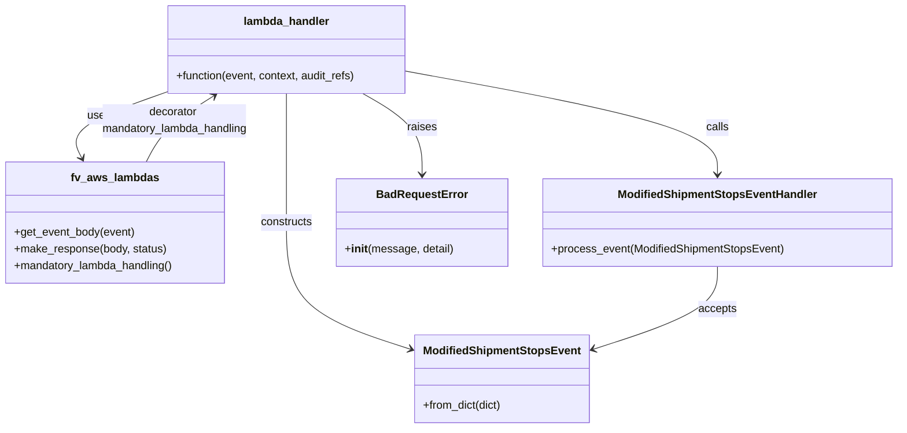

# Diagram: shipment_core/shipment_service/shipment_service/shipments/location_shipment_stops_lambda_handler.py


> Auto-generated by Obscura crawlers

## Diagram 1

```mermaid
flowchart TB
    A[lambda_handler(event, context, audit_refs)] --> B[get_event_body(event)]
    B --> C[ModifiedShipmentStopsEvent.from_dict(event_body)]
    C --> D{stop_event is None or []?}
    D -- Yes --> E[BadRequestError("Stop event dict must contain at least 1 stop")]
    D -- No --> F[ModifiedShipmentStopsEventHandler.process_event(stop_event)]
    F --> G[make_response(return_value, 200)]
    A --> H[AssertionError caught] --> I[BadRequestError("Assertion Failed")]
```

> SVG rendering failed for this diagram.

## Diagram 2



### SVG

<svg id="container" width="1285.265625" xmlns="http://www.w3.org/2000/svg" class="classDiagram" height="614" viewBox="0 0 1285.265625 614" role="graphics-document document" aria-roledescription="class"><style>#container{font-family:"trebuchet ms",verdana,arial,sans-serif;font-size:16px;fill:#333;}@keyframes edge-animation-frame{from{stroke-dashoffset:0;}}@keyframes dash{to{stroke-dashoffset:0;}}#container .edge-animation-slow{stroke-dasharray:9,5!important;stroke-dashoffset:900;animation:dash 50s linear infinite;stroke-linecap:round;}#container .edge-animation-fast{stroke-dasharray:9,5!important;stroke-dashoffset:900;animation:dash 20s linear infinite;stroke-linecap:round;}#container .error-icon{fill:#552222;}#container .error-text{fill:#552222;stroke:#552222;}#container .edge-thickness-normal{stroke-width:1px;}#container .edge-thickness-thick{stroke-width:3.5px;}#container .edge-pattern-solid{stroke-dasharray:0;}#container .edge-thickness-invisible{stroke-width:0;fill:none;}#container .edge-pattern-dashed{stroke-dasharray:3;}#container .edge-pattern-dotted{stroke-dasharray:2;}#container .marker{fill:#333333;stroke:#333333;}#container .marker.cross{stroke:#333333;}#container svg{font-family:"trebuchet ms",verdana,arial,sans-serif;font-size:16px;}#container p{margin:0;}#container g.classGroup text{fill:#9370DB;stroke:none;font-family:"trebuchet ms",verdana,arial,sans-serif;font-size:10px;}#container g.classGroup text .title{font-weight:bolder;}#container .nodeLabel,#container .edgeLabel{color:#131300;}#container .edgeLabel .label rect{fill:#ECECFF;}#container .label text{fill:#131300;}#container .labelBkg{background:#ECECFF;}#container .edgeLabel .label span{background:#ECECFF;}#container .classTitle{font-weight:bolder;}#container .node rect,#container .node circle,#container .node ellipse,#container .node polygon,#container .node path{fill:#ECECFF;stroke:#9370DB;stroke-width:1px;}#container .divider{stroke:#9370DB;stroke-width:1;}#container g.clickable{cursor:pointer;}#container g.classGroup rect{fill:#ECECFF;stroke:#9370DB;}#container g.classGroup line{stroke:#9370DB;stroke-width:1;}#container .classLabel .box{stroke:none;stroke-width:0;fill:#ECECFF;opacity:0.5;}#container .classLabel .label{fill:#9370DB;font-size:10px;}#container .relation{stroke:#333333;stroke-width:1;fill:none;}#container .dashed-line{stroke-dasharray:3;}#container .dotted-line{stroke-dasharray:1 2;}#container #compositionStart,#container .composition{fill:#333333!important;stroke:#333333!important;stroke-width:1;}#container #compositionEnd,#container .composition{fill:#333333!important;stroke:#333333!important;stroke-width:1;}#container #dependencyStart,#container .dependency{fill:#333333!important;stroke:#333333!important;stroke-width:1;}#container #dependencyStart,#container .dependency{fill:#333333!important;stroke:#333333!important;stroke-width:1;}#container #extensionStart,#container .extension{fill:transparent!important;stroke:#333333!important;stroke-width:1;}#container #extensionEnd,#container .extension{fill:transparent!important;stroke:#333333!important;stroke-width:1;}#container #aggregationStart,#container .aggregation{fill:transparent!important;stroke:#333333!important;stroke-width:1;}#container #aggregationEnd,#container .aggregation{fill:transparent!important;stroke:#333333!important;stroke-width:1;}#container #lollipopStart,#container .lollipop{fill:#ECECFF!important;stroke:#333333!important;stroke-width:1;}#container #lollipopEnd,#container .lollipop{fill:#ECECFF!important;stroke:#333333!important;stroke-width:1;}#container .edgeTerminals{font-size:11px;line-height:initial;}#container .classTitleText{text-anchor:middle;font-size:18px;fill:#333;}#container .label-icon{display:inline-block;height:1em;overflow:visible;vertical-align:-0.125em;}#container .node .label-icon path{fill:currentColor;stroke:revert;stroke-width:revert;}#container :root{--mermaid-font-family:"trebuchet ms",verdana,arial,sans-serif;}</style><g><defs><marker id="container_class-aggregationStart" class="marker aggregation class" refX="18" refY="7" markerWidth="190" markerHeight="240" orient="auto"><path d="M 18,7 L9,13 L1,7 L9,1 Z"></path></marker></defs><defs><marker id="container_class-aggregationEnd" class="marker aggregation class" refX="1" refY="7" markerWidth="20" markerHeight="28" orient="auto"><path d="M 18,7 L9,13 L1,7 L9,1 Z"></path></marker></defs><defs><marker id="container_class-extensionStart" class="marker extension class" refX="18" refY="7" markerWidth="190" markerHeight="240" orient="auto"><path d="M 1,7 L18,13 V 1 Z"></path></marker></defs><defs><marker id="container_class-extensionEnd" class="marker extension class" refX="1" refY="7" markerWidth="20" markerHeight="28" orient="auto"><path d="M 1,1 V 13 L18,7 Z"></path></marker></defs><defs><marker id="container_class-compositionStart" class="marker composition class" refX="18" refY="7" markerWidth="190" markerHeight="240" orient="auto"><path d="M 18,7 L9,13 L1,7 L9,1 Z"></path></marker></defs><defs><marker id="container_class-compositionEnd" class="marker composition class" refX="1" refY="7" markerWidth="20" markerHeight="28" orient="auto"><path d="M 18,7 L9,13 L1,7 L9,1 Z"></path></marker></defs><defs><marker id="container_class-dependencyStart" class="marker dependency class" refX="6" refY="7" markerWidth="190" markerHeight="240" orient="auto"><path d="M 5,7 L9,13 L1,7 L9,1 Z"></path></marker></defs><defs><marker id="container_class-dependencyEnd" class="marker dependency class" refX="13" refY="7" markerWidth="20" markerHeight="28" orient="auto"><path d="M 18,7 L9,13 L14,7 L9,1 Z"></path></marker></defs><defs><marker id="container_class-lollipopStart" class="marker lollipop class" refX="13" refY="7" markerWidth="190" markerHeight="240" orient="auto"><circle stroke="black" fill="transparent" cx="7" cy="7" r="6"></circle></marker></defs><defs><marker id="container_class-lollipopEnd" class="marker lollipop class" refX="1" refY="7" markerWidth="190" markerHeight="240" orient="auto"><circle stroke="black" fill="transparent" cx="7" cy="7" r="6"></circle></marker></defs><g class="root"><g class="clusters"></g><g class="edgePaths"><path d="M243.395,131.212L218.561,139.844C193.728,148.475,144.061,165.737,123.066,181.651C102.07,197.564,109.746,212.128,113.584,219.41L117.421,226.692" id="id_lambda_handler_fv_aws_lambdas_1" class="edge-thickness-normal edge-pattern-solid relation" style=";;;" data-edge="true" data-et="edge" data-id="id_lambda_handler_fv_aws_lambdas_1" data-points="W3sieCI6MjQzLjM5NDUzMTI1LCJ5IjoxMzEuMjEyMjM2MTg5NzM3MzN9LHsieCI6OTQuMzk0NTMxMjUsInkiOjE4M30seyJ4IjoxMjAuMjE4ODkzNjEyMTMyMzUsInkiOjIzMn1d" marker-end="url(#container_class-dependencyEnd)"></path><path d="M416.633,134L416.633,142.167C416.633,150.333,416.633,166.667,416.633,197.5C416.633,228.333,416.633,273.667,416.633,317C416.633,360.333,416.633,401.667,446.095,431.956C475.557,462.245,534.48,481.49,563.942,491.112L593.404,500.735" id="id_lambda_handler_ModifiedShipmentStopsEvent_2" class="edge-thickness-normal edge-pattern-solid relation" style=";;;" data-edge="true" data-et="edge" data-id="id_lambda_handler_ModifiedShipmentStopsEvent_2" data-points="W3sieCI6NDE2LjYzMjgxMjUsInkiOjEzNH0seyJ4Ijo0MTYuNjMyODEyNSwieSI6MTgzfSx7IngiOjQxNi42MzI4MTI1LCJ5IjozMTl9LHsieCI6NDE2LjYzMjgxMjUsInkiOjQ0M30seyJ4Ijo1OTkuMTA3NDIxODc1LCJ5Ijo1MDIuNTk3NjA5MTI5NzA1MzV9XQ==" marker-end="url(#container_class-dependencyEnd)"></path><path d="M589.871,102.685L663.057,116.071C736.243,129.457,882.616,156.228,955.802,180.781C1028.988,205.333,1028.988,227.667,1028.988,238.833L1028.988,250" id="id_lambda_handler_ModifiedShipmentStopsEventHandler_3" class="edge-thickness-normal edge-pattern-solid relation" style=";;;" data-edge="true" data-et="edge" data-id="id_lambda_handler_ModifiedShipmentStopsEventHandler_3" data-points="W3sieCI6NTg5Ljg3MTA5Mzc1LCJ5IjoxMDIuNjg1MzMzOTExNzAxMTF9LHsieCI6MTAyOC45ODgyODEyNSwieSI6MTgzfSx7IngiOjEwMjguOTg4MjgxMjUsInkiOjI1Nn1d" marker-end="url(#container_class-dependencyEnd)"></path><path d="M525.455,134L539.561,142.167C553.668,150.333,581.881,166.667,595.987,186C610.094,205.333,610.094,227.667,610.094,238.833L610.094,250" id="id_lambda_handler_BadRequestError_4" class="edge-thickness-normal edge-pattern-solid relation" style=";;;" data-edge="true" data-et="edge" data-id="id_lambda_handler_BadRequestError_4" data-points="W3sieCI6NTI1LjQ1NDU4OTg0Mzc1LCJ5IjoxMzR9LHsieCI6NjEwLjA5Mzc1LCJ5IjoxODN9LHsieCI6NjEwLjA5Mzc1LCJ5IjoyNTZ9XQ==" marker-end="url(#container_class-dependencyEnd)"></path><path d="M211.922,232L216.226,223.833C220.53,215.667,229.138,199.333,245.638,183.531C262.139,167.728,286.531,152.456,298.727,144.82L310.924,137.184" id="id_fv_aws_lambdas_lambda_handler_5" class="edge-thickness-normal edge-pattern-solid relation" style=";;;" data-edge="true" data-et="edge" data-id="id_fv_aws_lambdas_lambda_handler_5" data-points="W3sieCI6MjExLjkyMTczMTM4Nzg2NzY1LCJ5IjoyMzJ9LHsieCI6MjM3Ljc0NjA5Mzc1LCJ5IjoxODN9LHsieCI6MzE2LjAwOTAzMzIwMzEyNSwieSI6MTM0fV0=" marker-end="url(#container_class-dependencyEnd)"></path><path d="M1028.988,382L1028.988,392.167C1028.988,402.333,1028.988,422.667,999.526,442.456C970.065,462.245,911.141,481.49,881.679,491.112L852.217,500.735" id="id_ModifiedShipmentStopsEventHandler_ModifiedShipmentStopsEvent_6" class="edge-thickness-normal edge-pattern-solid relation" style=";;;" data-edge="true" data-et="edge" data-id="id_ModifiedShipmentStopsEventHandler_ModifiedShipmentStopsEvent_6" data-points="W3sieCI6MTAyOC45ODgyODEyNSwieSI6MzgyfSx7IngiOjEwMjguOTg4MjgxMjUsInkiOjQ0M30seyJ4Ijo4NDYuNTEzNjcxODc1LCJ5Ijo1MDIuNTk3NjA5MTI5NzA1MzV9XQ==" marker-end="url(#container_class-dependencyEnd)"></path></g><g class="edgeLabels"><g class="edgeLabel" transform="translate(94.39453125, 183)"><g class="label" data-id="id_lambda_handler_fv_aws_lambdas_1" transform="translate(-16.4921875, -12)"><foreignObject width="32.984375" height="24"><div xmlns="http://www.w3.org/1999/xhtml" class="labelBkg" style="display: table-cell; white-space: nowrap; line-height: 1.5; max-width: 200px; text-align: center;"><span class="edgeLabel"><p>uses</p></span></div></foreignObject></g></g><g class="edgeLabel" transform="translate(416.6328125, 319)"><g class="label" data-id="id_lambda_handler_ModifiedShipmentStopsEvent_2" transform="translate(-37.84375, -12)"><foreignObject width="75.6875" height="24"><div xmlns="http://www.w3.org/1999/xhtml" class="labelBkg" style="display: table-cell; white-space: nowrap; line-height: 1.5; max-width: 200px; text-align: center;"><span class="edgeLabel"><p>constructs</p></span></div></foreignObject></g></g><g class="edgeLabel" transform="translate(1028.98828125, 183)"><g class="label" data-id="id_lambda_handler_ModifiedShipmentStopsEventHandler_3" transform="translate(-16.4453125, -12)"><foreignObject width="32.890625" height="24"><div xmlns="http://www.w3.org/1999/xhtml" class="labelBkg" style="display: table-cell; white-space: nowrap; line-height: 1.5; max-width: 200px; text-align: center;"><span class="edgeLabel"><p>calls</p></span></div></foreignObject></g></g><g class="edgeLabel" transform="translate(610.09375, 183)"><g class="label" data-id="id_lambda_handler_BadRequestError_4" transform="translate(-21.25, -12)"><foreignObject width="42.5" height="24"><div xmlns="http://www.w3.org/1999/xhtml" class="labelBkg" style="display: table-cell; white-space: nowrap; line-height: 1.5; max-width: 200px; text-align: center;"><span class="edgeLabel"><p>raises</p></span></div></foreignObject></g></g><g class="edgeLabel" transform="translate(253.4044, 173.19642)"><g class="label" data-id="id_fv_aws_lambdas_lambda_handler_5" transform="translate(-106.859375, -24)"><foreignObject width="213.71875" height="48"><div xmlns="http://www.w3.org/1999/xhtml" class="labelBkg" style="display: table; white-space: break-spaces; line-height: 1.5; max-width: 200px; text-align: center; width: 200px;"><span class="edgeLabel"><p>decorator mandatory_lambda_handling</p></span></div></foreignObject></g></g><g class="edgeLabel" transform="translate(1028.98828125, 443)"><g class="label" data-id="id_ModifiedShipmentStopsEventHandler_ModifiedShipmentStopsEvent_6" transform="translate(-27.421875, -12)"><foreignObject width="54.84375" height="24"><div xmlns="http://www.w3.org/1999/xhtml" class="labelBkg" style="display: table-cell; white-space: nowrap; line-height: 1.5; max-width: 200px; text-align: center;"><span class="edgeLabel"><p>accepts</p></span></div></foreignObject></g></g></g><g class="nodes"><g class="node default" id="classId-lambda_handler-0" transform="translate(416.6328125, 71)"><g class="basic label-container"><path d="M-173.23828125 -63 L173.23828125 -63 L173.23828125 63 L-173.23828125 63" stroke="none" stroke-width="0" fill="#ECECFF" style=""></path><path d="M-173.23828125 -63 C-101.42246280988701 -63, -29.606644369774017 -63, 173.23828125 -63 M-173.23828125 -63 C-100.16605289558687 -63, -27.093824541173746 -63, 173.23828125 -63 M173.23828125 -63 C173.23828125 -24.245104648904338, 173.23828125 14.509790702191324, 173.23828125 63 M173.23828125 -63 C173.23828125 -26.29862502794162, 173.23828125 10.402749944116763, 173.23828125 63 M173.23828125 63 C74.97994271710787 63, -23.27839581578425 63, -173.23828125 63 M173.23828125 63 C80.3318827957014 63, -12.574515658597193 63, -173.23828125 63 M-173.23828125 63 C-173.23828125 16.791530040187588, -173.23828125 -29.416939919624824, -173.23828125 -63 M-173.23828125 63 C-173.23828125 23.651246929648977, -173.23828125 -15.697506140702046, -173.23828125 -63" stroke="#9370DB" stroke-width="1.3" fill="none" stroke-dasharray="0 0" style=""></path></g><g class="annotation-group text" transform="translate(0, -39)"></g><g class="label-group text" transform="translate(-59.9765625, -39)"><g class="label" style="font-weight: bolder" transform="translate(0,-12)"><foreignObject width="119.953125" height="24"><div xmlns="http://www.w3.org/1999/xhtml" style="display: table-cell; white-space: nowrap; line-height: 1.5; max-width: 170px; text-align: center;"><span class="nodeLabel markdown-node-label" style=""><p>lambda_handler</p></span></div></foreignObject></g></g><g class="members-group text" transform="translate(-161.23828125, 9)"></g><g class="methods-group text" transform="translate(-161.23828125, 39)"><g class="label" style="" transform="translate(0,-12)"><foreignObject width="262.5" height="24"><div xmlns="http://www.w3.org/1999/xhtml" style="display: table-cell; white-space: nowrap; line-height: 1.5; max-width: 320px; text-align: center;"><span class="nodeLabel markdown-node-label" style=""><p>+function(event, context, audit_refs)</p></span></div></foreignObject></g></g><g class="divider" style=""><path d="M-173.23828125 -15 C-71.76987769220332 -15, 29.698525865593354 -15, 173.23828125 -15 M-173.23828125 -15 C-56.715604278587705 -15, 59.80707269282459 -15, 173.23828125 -15" stroke="#9370DB" stroke-width="1.3" fill="none" stroke-dasharray="0 0" style=""></path></g><g class="divider" style=""><path d="M-173.23828125 9 C-70.12308293701233 9, 32.992115375975345 9, 173.23828125 9 M-173.23828125 9 C-101.97497396331921 9, -30.71166667663843 9, 173.23828125 9" stroke="#9370DB" stroke-width="1.3" fill="none" stroke-dasharray="0 0" style=""></path></g></g><g class="node default" id="classId-fv_aws_lambdas-1" transform="translate(166.0703125, 319)"><g class="basic label-container"><path d="M-158.0703125 -87 L158.0703125 -87 L158.0703125 87 L-158.0703125 87" stroke="none" stroke-width="0" fill="#ECECFF" style=""></path><path d="M-158.0703125 -87 C-61.65659635051226 -87, 34.75711979897548 -87, 158.0703125 -87 M-158.0703125 -87 C-44.47960720285916 -87, 69.11109809428169 -87, 158.0703125 -87 M158.0703125 -87 C158.0703125 -26.83157377885567, 158.0703125 33.33685244228866, 158.0703125 87 M158.0703125 -87 C158.0703125 -43.37902315480713, 158.0703125 0.241953690385742, 158.0703125 87 M158.0703125 87 C49.491455660269025 87, -59.08740117946195 87, -158.0703125 87 M158.0703125 87 C44.6591514933621 87, -68.7520095132758 87, -158.0703125 87 M-158.0703125 87 C-158.0703125 38.14615113744944, -158.0703125 -10.707697725101113, -158.0703125 -87 M-158.0703125 87 C-158.0703125 26.42793579483368, -158.0703125 -34.14412841033264, -158.0703125 -87" stroke="#9370DB" stroke-width="1.3" fill="none" stroke-dasharray="0 0" style=""></path></g><g class="annotation-group text" transform="translate(0, -63)"></g><g class="label-group text" transform="translate(-60.0625, -63)"><g class="label" style="font-weight: bolder" transform="translate(0,-12)"><foreignObject width="120.125" height="24"><div xmlns="http://www.w3.org/1999/xhtml" style="display: table-cell; white-space: nowrap; line-height: 1.5; max-width: 168px; text-align: center;"><span class="nodeLabel markdown-node-label" style=""><p>fv_aws_lambdas</p></span></div></foreignObject></g></g><g class="members-group text" transform="translate(-146.0703125, -15)"></g><g class="methods-group text" transform="translate(-146.0703125, 15)"><g class="label" style="" transform="translate(0,-12)"><foreignObject width="174.203125" height="24"><div xmlns="http://www.w3.org/1999/xhtml" style="display: table-cell; white-space: nowrap; line-height: 1.5; max-width: 232px; text-align: center;"><span class="nodeLabel markdown-node-label" style=""><p>+get_event_body(event)</p></span></div></foreignObject></g><g class="label" style="" transform="translate(0,12)"><foreignObject width="219.96875" height="24"><div xmlns="http://www.w3.org/1999/xhtml" style="display: table-cell; white-space: nowrap; line-height: 1.5; max-width: 277px; text-align: center;"><span class="nodeLabel markdown-node-label" style=""><p>+make_response(body, status)</p></span></div></foreignObject></g><g class="label" style="" transform="translate(0,36)"><foreignObject width="232.078125" height="24"><div xmlns="http://www.w3.org/1999/xhtml" style="display: table-cell; white-space: nowrap; line-height: 1.5; max-width: 289px; text-align: center;"><span class="nodeLabel markdown-node-label" style=""><p>+mandatory_lambda_handling()</p></span></div></foreignObject></g></g><g class="divider" style=""><path d="M-158.0703125 -39 C-34.31210418443543 -39, 89.44610413112915 -39, 158.0703125 -39 M-158.0703125 -39 C-59.923149212384374 -39, 38.22401407523125 -39, 158.0703125 -39" stroke="#9370DB" stroke-width="1.3" fill="none" stroke-dasharray="0 0" style=""></path></g><g class="divider" style=""><path d="M-158.0703125 -15 C-52.615548458219564 -15, 52.83921558356087 -15, 158.0703125 -15 M-158.0703125 -15 C-38.00723962471693 -15, 82.05583325056614 -15, 158.0703125 -15" stroke="#9370DB" stroke-width="1.3" fill="none" stroke-dasharray="0 0" style=""></path></g></g><g class="node default" id="classId-ModifiedShipmentStopsEvent-2" transform="translate(722.810546875, 543)"><g class="basic label-container"><path d="M-123.703125 -63 L123.703125 -63 L123.703125 63 L-123.703125 63" stroke="none" stroke-width="0" fill="#ECECFF" style=""></path><path d="M-123.703125 -63 C-59.90521964101231 -63, 3.8926857179753824 -63, 123.703125 -63 M-123.703125 -63 C-66.78613115913785 -63, -9.869137318275719 -63, 123.703125 -63 M123.703125 -63 C123.703125 -33.0080023472442, 123.703125 -3.0160046944884016, 123.703125 63 M123.703125 -63 C123.703125 -35.59061157238159, 123.703125 -8.181223144763173, 123.703125 63 M123.703125 63 C38.19352022004762 63, -47.316084559904766 63, -123.703125 63 M123.703125 63 C27.719610014712302 63, -68.2639049705754 63, -123.703125 63 M-123.703125 63 C-123.703125 24.35035019117519, -123.703125 -14.299299617649623, -123.703125 -63 M-123.703125 63 C-123.703125 20.472480157250644, -123.703125 -22.055039685498713, -123.703125 -63" stroke="#9370DB" stroke-width="1.3" fill="none" stroke-dasharray="0 0" style=""></path></g><g class="annotation-group text" transform="translate(0, -39)"></g><g class="label-group text" transform="translate(-108.171875, -39)"><g class="label" style="font-weight: bolder" transform="translate(0,-12)"><foreignObject width="216.34375" height="24"><div xmlns="http://www.w3.org/1999/xhtml" style="display: table-cell; white-space: nowrap; line-height: 1.5; max-width: 264px; text-align: center;"><span class="nodeLabel markdown-node-label" style=""><p>ModifiedShipmentStopsEvent</p></span></div></foreignObject></g></g><g class="members-group text" transform="translate(-111.703125, 9)"></g><g class="methods-group text" transform="translate(-111.703125, 39)"><g class="label" style="" transform="translate(0,-12)"><foreignObject width="115.234375" height="24"><div xmlns="http://www.w3.org/1999/xhtml" style="display: table-cell; white-space: nowrap; line-height: 1.5; max-width: 173px; text-align: center;"><span class="nodeLabel markdown-node-label" style=""><p>+from_dict(dict)</p></span></div></foreignObject></g></g><g class="divider" style=""><path d="M-123.703125 -15 C-33.59226444395199 -15, 56.51859611209602 -15, 123.703125 -15 M-123.703125 -15 C-54.56485931923841 -15, 14.573406361523183 -15, 123.703125 -15" stroke="#9370DB" stroke-width="1.3" fill="none" stroke-dasharray="0 0" style=""></path></g><g class="divider" style=""><path d="M-123.703125 9 C-62.145175519031916 9, -0.5872260380638323 9, 123.703125 9 M-123.703125 9 C-52.08115050866128 9, 19.540823982677438 9, 123.703125 9" stroke="#9370DB" stroke-width="1.3" fill="none" stroke-dasharray="0 0" style=""></path></g></g><g class="node default" id="classId-ModifiedShipmentStopsEventHandler-3" transform="translate(1028.98828125, 319)"><g class="basic label-container"><path d="M-248.27734375 -63 L248.27734375 -63 L248.27734375 63 L-248.27734375 63" stroke="none" stroke-width="0" fill="#ECECFF" style=""></path><path d="M-248.27734375 -63 C-104.63157258597536 -63, 39.014198578049275 -63, 248.27734375 -63 M-248.27734375 -63 C-113.84227674087089 -63, 20.592790268258227 -63, 248.27734375 -63 M248.27734375 -63 C248.27734375 -25.829128345293945, 248.27734375 11.34174330941211, 248.27734375 63 M248.27734375 -63 C248.27734375 -24.442794706795034, 248.27734375 14.114410586409932, 248.27734375 63 M248.27734375 63 C100.2459658276766 63, -47.7854120946468 63, -248.27734375 63 M248.27734375 63 C108.65710444045115 63, -30.9631348690977 63, -248.27734375 63 M-248.27734375 63 C-248.27734375 22.790657845079267, -248.27734375 -17.418684309841467, -248.27734375 -63 M-248.27734375 63 C-248.27734375 28.76786578185009, -248.27734375 -5.464268436299818, -248.27734375 -63" stroke="#9370DB" stroke-width="1.3" fill="none" stroke-dasharray="0 0" style=""></path></g><g class="annotation-group text" transform="translate(0, -39)"></g><g class="label-group text" transform="translate(-137.2578125, -39)"><g class="label" style="font-weight: bolder" transform="translate(0,-12)"><foreignObject width="274.515625" height="24"><div xmlns="http://www.w3.org/1999/xhtml" style="display: table-cell; white-space: nowrap; line-height: 1.5; max-width: 322px; text-align: center;"><span class="nodeLabel markdown-node-label" style=""><p>ModifiedShipmentStopsEventHandler</p></span></div></foreignObject></g></g><g class="members-group text" transform="translate(-236.27734375, 9)"></g><g class="methods-group text" transform="translate(-236.27734375, 39)"><g class="label" style="" transform="translate(0,-12)"><foreignObject width="335.296875" height="24"><div xmlns="http://www.w3.org/1999/xhtml" style="display: table-cell; white-space: nowrap; line-height: 1.5; max-width: 393px; text-align: center;"><span class="nodeLabel markdown-node-label" style=""><p>+process_event(ModifiedShipmentStopsEvent)</p></span></div></foreignObject></g></g><g class="divider" style=""><path d="M-248.27734375 -15 C-76.71451941102896 -15, 94.84830492794208 -15, 248.27734375 -15 M-248.27734375 -15 C-129.17591668127085 -15, -10.074489612541669 -15, 248.27734375 -15" stroke="#9370DB" stroke-width="1.3" fill="none" stroke-dasharray="0 0" style=""></path></g><g class="divider" style=""><path d="M-248.27734375 9 C-56.147696095927046 9, 135.9819515581459 9, 248.27734375 9 M-248.27734375 9 C-87.50983270857085 9, 73.25767833285829 9, 248.27734375 9" stroke="#9370DB" stroke-width="1.3" fill="none" stroke-dasharray="0 0" style=""></path></g></g><g class="node default" id="classId-BadRequestError-4" transform="translate(610.09375, 319)"><g class="basic label-container"><path d="M-120.6171875 -63 L120.6171875 -63 L120.6171875 63 L-120.6171875 63" stroke="none" stroke-width="0" fill="#ECECFF" style=""></path><path d="M-120.6171875 -63 C-71.00242908584258 -63, -21.387670671685143 -63, 120.6171875 -63 M-120.6171875 -63 C-66.50546973311768 -63, -12.393751966235357 -63, 120.6171875 -63 M120.6171875 -63 C120.6171875 -15.381854152985149, 120.6171875 32.2362916940297, 120.6171875 63 M120.6171875 -63 C120.6171875 -31.96115434691896, 120.6171875 -0.9223086938379197, 120.6171875 63 M120.6171875 63 C39.74345493912449 63, -41.13027762175102 63, -120.6171875 63 M120.6171875 63 C40.87394146730074 63, -38.86930456539852 63, -120.6171875 63 M-120.6171875 63 C-120.6171875 24.040871538002, -120.6171875 -14.918256923995997, -120.6171875 -63 M-120.6171875 63 C-120.6171875 28.039239328502816, -120.6171875 -6.921521342994367, -120.6171875 -63" stroke="#9370DB" stroke-width="1.3" fill="none" stroke-dasharray="0 0" style=""></path></g><g class="annotation-group text" transform="translate(0, -39)"></g><g class="label-group text" transform="translate(-62.28125, -39)"><g class="label" style="font-weight: bolder" transform="translate(0,-12)"><foreignObject width="124.5625" height="24"><div xmlns="http://www.w3.org/1999/xhtml" style="display: table-cell; white-space: nowrap; line-height: 1.5; max-width: 174px; text-align: center;"><span class="nodeLabel markdown-node-label" style=""><p>BadRequestError</p></span></div></foreignObject></g></g><g class="members-group text" transform="translate(-108.6171875, 9)"></g><g class="methods-group text" transform="translate(-108.6171875, 39)"><g class="label" style="" transform="translate(0,-12)"><foreignObject width="154.953125" height="24"><div xmlns="http://www.w3.org/1999/xhtml" style="display: table-cell; white-space: nowrap; line-height: 1.5; max-width: 244px; text-align: center;"><span class="nodeLabel markdown-node-label" style=""><p>+<strong>init</strong>(message, detail)</p></span></div></foreignObject></g></g><g class="divider" style=""><path d="M-120.6171875 -15 C-61.89442979777648 -15, -3.171672095552964 -15, 120.6171875 -15 M-120.6171875 -15 C-61.00417033434949 -15, -1.3911531686989775 -15, 120.6171875 -15" stroke="#9370DB" stroke-width="1.3" fill="none" stroke-dasharray="0 0" style=""></path></g><g class="divider" style=""><path d="M-120.6171875 9 C-69.07233866143123 9, -17.527489822862464 9, 120.6171875 9 M-120.6171875 9 C-57.026886683391105 9, 6.56341413321779 9, 120.6171875 9" stroke="#9370DB" stroke-width="1.3" fill="none" stroke-dasharray="0 0" style=""></path></g></g></g></g></g></svg>
