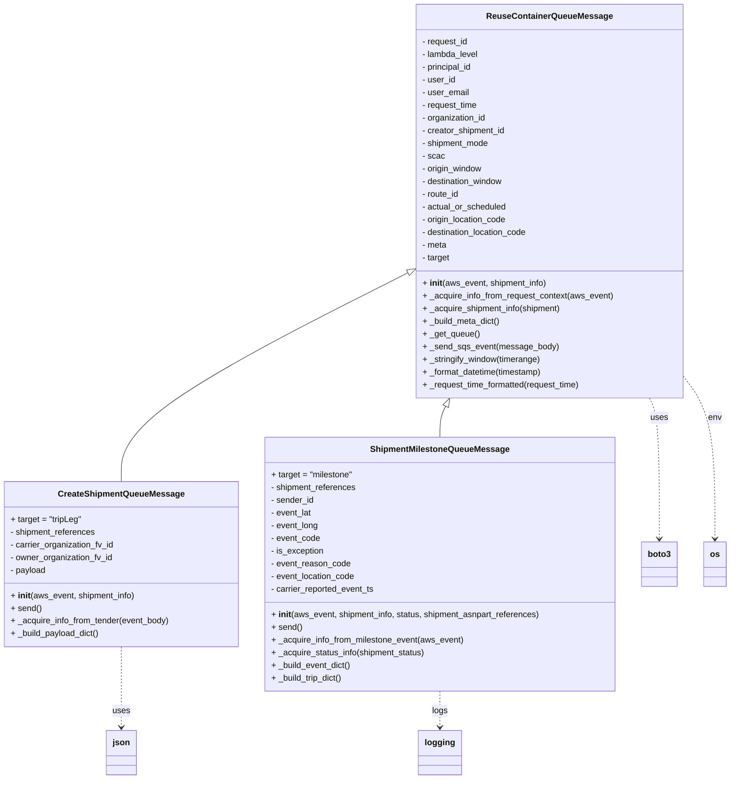
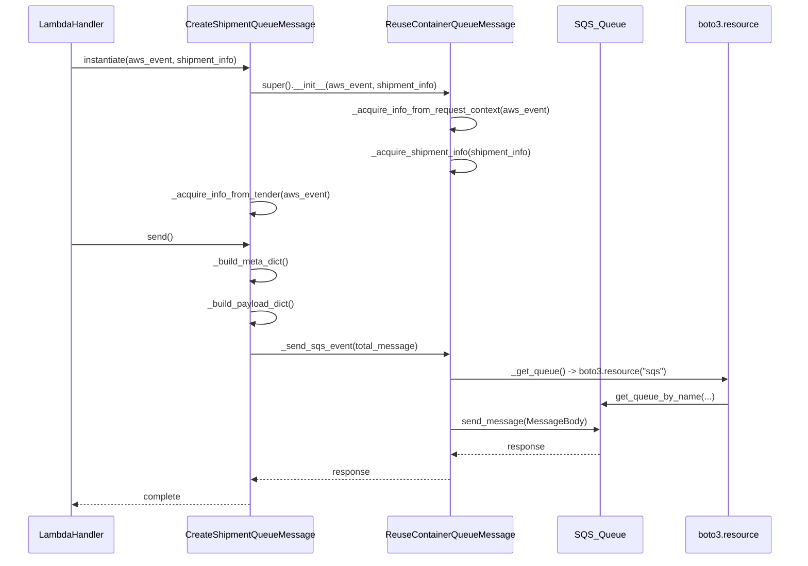

# Diagram: shipment_core/shipment_service/shipment_service/shipments/reuse_container.py

> Auto-generated by Obscura crawlers

## Diagram 1

### SVG

<svg id="container" width="1376.1953125" xmlns="http://www.w3.org/2000/svg" class="classDiagram" height="1472" viewBox="0 0 1376.1953125 1472" role="graphics-document document" aria-roledescription="class"><g><defs><marker id="container_class-aggregationStart" class="marker aggregation class" refX="18" refY="7" markerWidth="190" markerHeight="240" orient="auto"><path d="M 18,7 L9,13 L1,7 L9,1 Z"></path></marker></defs><defs><marker id="container_class-aggregationEnd" class="marker aggregation class" refX="1" refY="7" markerWidth="20" markerHeight="28" orient="auto"><path d="M 18,7 L9,13 L1,7 L9,1 Z"></path></marker></defs><defs><marker id="container_class-extensionStart" class="marker extension class" refX="18" refY="7" markerWidth="190" markerHeight="240" orient="auto"><path d="M 1,7 L18,13 V 1 Z"></path></marker></defs><defs><marker id="container_class-extensionEnd" class="marker extension class" refX="1" refY="7" markerWidth="20" markerHeight="28" orient="auto"><path d="M 1,1 V 13 L18,7 Z"></path></marker></defs><defs><marker id="container_class-compositionStart" class="marker composition class" refX="18" refY="7" markerWidth="190" markerHeight="240" orient="auto"><path d="M 18,7 L9,13 L1,7 L9,1 Z"></path></marker></defs><defs><marker id="container_class-compositionEnd" class="marker composition class" refX="1" refY="7" markerWidth="20" markerHeight="28" orient="auto"><path d="M 18,7 L9,13 L1,7 L9,1 Z"></path></marker></defs><defs><marker id="container_class-dependencyStart" class="marker dependency class" refX="6" refY="7" markerWidth="190" markerHeight="240" orient="auto"><path d="M 5,7 L9,13 L1,7 L9,1 Z"></path></marker></defs><defs><marker id="container_class-dependencyEnd" class="marker dependency class" refX="13" refY="7" markerWidth="20" markerHeight="28" orient="auto"><path d="M 18,7 L9,13 L14,7 L9,1 Z"></path></marker></defs><defs><marker id="container_class-lollipopStart" class="marker lollipop class" refX="13" refY="7" markerWidth="190" markerHeight="240" orient="auto"><circle stroke="black" fill="transparent" cx="7" cy="7" r="6"></circle></marker></defs><defs><marker id="container_class-lollipopEnd" class="marker lollipop class" refX="1" refY="7" markerWidth="190" markerHeight="240" orient="auto"><circle stroke="black" fill="transparent" cx="7" cy="7" r="6"></circle></marker></defs><g class="root"><g class="clusters"></g><g class="edgePaths"><path d="M771.666,514.251L681.148,560.043C590.63,605.834,409.594,697.417,319.077,763.375C228.559,829.333,228.559,869.667,228.559,889.833L228.559,910" id="id_ReuseContainerQueueMessage_CreateShipmentQueueMessage_1" class="edge-thickness-normal edge-pattern-solid relation" style=";;;" data-edge="true" data-et="edge" data-id="id_ReuseContainerQueueMessage_CreateShipmentQueueMessage_1" data-points="W3sieCI6Nzg3LjA1ODU5Mzc1LCJ5Ijo1MDYuNDY0Njc0MTM2MjR9LHsieCI6MjI4LjU1ODU5Mzc1LCJ5Ijo3ODl9LHsieCI6MjI4LjU1ODU5Mzc1LCJ5Ijo5MTB9XQ==" marker-start="url(#container_class-extensionStart)"></path><path d="M840.983,767.391L839.161,770.993C837.338,774.594,833.692,781.797,831.87,791.565C830.047,801.333,830.047,813.667,830.047,819.833L830.047,826" id="id_ReuseContainerQueueMessage_ShipmentMilestoneQueueMessage_2" class="edge-thickness-normal edge-pattern-solid relation" style=";;;" data-edge="true" data-et="edge" data-id="id_ReuseContainerQueueMessage_ShipmentMilestoneQueueMessage_2" data-points="W3sieCI6ODQ4Ljc3MzAzNjM2OTE5MzIsInkiOjc1Mn0seyJ4Ijo4MzAuMDQ2ODc1LCJ5Ijo3ODl9LHsieCI6ODMwLjA0Njg3NSwieSI6ODI2fV0=" marker-start="url(#container_class-extensionStart)"></path><path d="M228.559,1222L228.559,1242.167C228.559,1262.333,228.559,1302.667,228.559,1328C228.559,1353.333,228.559,1363.667,228.559,1368.833L228.559,1374" id="id_CreateShipmentQueueMessage_json_3" class="edge-thickness-normal edge-pattern-dashed relation" style=";;;" data-edge="true" data-et="edge" data-id="id_CreateShipmentQueueMessage_json_3" data-points="W3sieCI6MjI4LjU1ODU5Mzc1LCJ5IjoxMjIyfSx7IngiOjIyOC41NTg1OTM3NSwieSI6MTM0M30seyJ4IjoyMjguNTU4NTkzNzUsInkiOjEzODB9XQ==" marker-end="url(#container_class-dependencyEnd)"></path><path d="M830.047,1306L830.047,1312.167C830.047,1318.333,830.047,1330.667,830.047,1342C830.047,1353.333,830.047,1363.667,830.047,1368.833L830.047,1374" id="id_ShipmentMilestoneQueueMessage_logging_4" class="edge-thickness-normal edge-pattern-dashed relation" style=";;;" data-edge="true" data-et="edge" data-id="id_ShipmentMilestoneQueueMessage_logging_4" data-points="W3sieCI6ODMwLjA0Njg3NSwieSI6MTMwNn0seyJ4Ijo4MzAuMDQ2ODc1LCJ5IjoxMzQzfSx7IngiOjgzMC4wNDY4NzUsInkiOjEzODB9XQ==" marker-end="url(#container_class-dependencyEnd)"></path><path d="M1225.321,752L1228.442,758.167C1231.563,764.333,1237.805,776.667,1240.926,821C1244.047,865.333,1244.047,941.667,1244.047,979.833L1244.047,1018" id="id_ReuseContainerQueueMessage_boto3_5" class="edge-thickness-normal edge-pattern-dashed relation" style=";;;" data-edge="true" data-et="edge" data-id="id_ReuseContainerQueueMessage_boto3_5" data-points="W3sieCI6MTIyNS4zMjA3MTM2MzA4MDcsInkiOjc1Mn0seyJ4IjoxMjQ0LjA0Njg3NSwieSI6Nzg5fSx7IngiOjEyNDQuMDQ2ODc1LCJ5IjoxMDI0fV0=" marker-end="url(#container_class-dependencyEnd)"></path><path d="M1287.035,709.176L1297.139,722.48C1307.242,735.784,1327.449,762.392,1337.553,813.863C1347.656,865.333,1347.656,941.667,1347.656,979.833L1347.656,1018" id="id_ReuseContainerQueueMessage_os_6" class="edge-thickness-normal edge-pattern-dashed relation" style=";;;" data-edge="true" data-et="edge" data-id="id_ReuseContainerQueueMessage_os_6" data-points="W3sieCI6MTI4Ny4wMzUxNTYyNSwieSI6NzA5LjE3NjE3ODM3OTE5NDJ9LHsieCI6MTM0Ny42NTYyNSwieSI6Nzg5fSx7IngiOjEzNDcuNjU2MjUsInkiOjEwMjR9XQ==" marker-end="url(#container_class-dependencyEnd)"></path></g><g class="edgeLabels"><g class="edgeLabel"><g class="label" data-id="id_ReuseContainerQueueMessage_CreateShipmentQueueMessage_1" transform="translate(0, 0)"><foreignObject width="0" height="0">

</foreignObject></g></g><g class="edgeLabel"><g class="label" data-id="id_ReuseContainerQueueMessage_ShipmentMilestoneQueueMessage_2" transform="translate(0, 0)"><foreignObject width="0" height="0">

</foreignObject></g></g><g class="edgeLabel" transform="translate(228.55859375, 1343)"><g class="label" data-id="id_CreateShipmentQueueMessage_json_3" transform="translate(-16.4921875, -12)"><foreignObject width="32.984375" height="24">

uses

</foreignObject></g></g><g class="edgeLabel" transform="translate(830.046875, 1343)"><g class="label" data-id="id_ShipmentMilestoneQueueMessage_logging_4" transform="translate(-14.8203125, -12)"><foreignObject width="29.640625" height="24">

logs

</foreignObject></g></g><g class="edgeLabel" transform="translate(1244.046875, 789)"><g class="label" data-id="id_ReuseContainerQueueMessage_boto3_5" transform="translate(-16.4921875, -12)"><foreignObject width="32.984375" height="24">

uses

</foreignObject></g></g><g class="edgeLabel" transform="translate(1347.65625, 789)"><g class="label" data-id="id_ReuseContainerQueueMessage_os_6" transform="translate(-12.9296875, -12)"><foreignObject width="25.859375" height="24">

env

</foreignObject></g></g></g><g class="nodes"><g class="node default" id="classId-ReuseContainerQueueMessage-0" transform="translate(1037.046875, 380)"><g class="basic label-container"><path d="M-249.98828125 -372 L249.98828125 -372 L249.98828125 372 L-249.98828125 372" stroke="none" stroke-width="0" fill="#ECECFF" style=""></path><path d="M-249.98828125 -372 C-124.50466257537937 -372, 0.9789560992412589 -372, 249.98828125 -372 M-249.98828125 -372 C-130.35978126515585 -372, -10.731281280311691 -372, 249.98828125 -372 M249.98828125 -372 C249.98828125 -213.03989253862937, 249.98828125 -54.07978507725875, 249.98828125 372 M249.98828125 -372 C249.98828125 -197.75744479213617, 249.98828125 -23.51488958427234, 249.98828125 372 M249.98828125 372 C71.34669997977377 372, -107.29488129045245 372, -249.98828125 372 M249.98828125 372 C95.08001831952168 372, -59.82824461095663 372, -249.98828125 372 M-249.98828125 372 C-249.98828125 186.24419612444743, -249.98828125 0.4883922488948542, -249.98828125 -372 M-249.98828125 372 C-249.98828125 143.01139957147214, -249.98828125 -85.97720085705572, -249.98828125 -372" stroke="#9370DB" stroke-width="1.3" fill="none" stroke-dasharray="0 0" style=""></path></g><g class="annotation-group text" transform="translate(0, -348)"></g><g class="label-group text" transform="translate(-112.4453125, -348)"><g class="label" style="font-weight: bolder" transform="translate(0,-12)"><foreignObject width="224.890625" height="24">

ReuseContainerQueueMessage

</foreignObject></g></g><g class="members-group text" transform="translate(-237.98828125, -300)"><g class="label" style="" transform="translate(0,-12)"><foreignObject width="88.359375" height="24">

- request_id

</foreignObject></g><g class="label" style="" transform="translate(0,12)"><foreignObject width="108.140625" height="24">

- lambda_level

</foreignObject></g><g class="label" style="" transform="translate(0,36)"><foreignObject width="97.40625" height="24">

- principal_id

</foreignObject></g><g class="label" style="" transform="translate(0,60)"><foreignObject width="63.5" height="24">

- user_id

</foreignObject></g><g class="label" style="" transform="translate(0,84)"><foreignObject width="89.4375" height="24">

- user_email

</foreignObject></g><g class="label" style="" transform="translate(0,108)"><foreignObject width="106.6875" height="24">

- request_time

</foreignObject></g><g class="label" style="" transform="translate(0,132)"><foreignObject width="123.453125" height="24">

- organization_id

</foreignObject></g><g class="label" style="" transform="translate(0,156)"><foreignObject width="160.25" height="24">

- creator_shipment_id

</foreignObject></g><g class="label" style="" transform="translate(0,180)"><foreignObject width="128.8125" height="24">

- shipment_mode

</foreignObject></g><g class="label" style="" transform="translate(0,204)"><foreignObject width="42.015625" height="24">

- scac

</foreignObject></g><g class="label" style="" transform="translate(0,228)"><foreignObject width="116.6875" height="24">

- origin_window

</foreignObject></g><g class="label" style="" transform="translate(0,252)"><foreignObject width="157.578125" height="24">

- destination_window

</foreignObject></g><g class="label" style="" transform="translate(0,276)"><foreignObject width="71.390625" height="24">

- route_id

</foreignObject></g><g class="label" style="" transform="translate(0,300)"><foreignObject width="160.921875" height="24">

- actual_or_scheduled

</foreignObject></g><g class="label" style="" transform="translate(0,324)"><foreignObject width="163.203125" height="24">

- origin_location_code

</foreignObject></g><g class="label" style="" transform="translate(0,348)"><foreignObject width="204.109375" height="24">

- destination_location_code

</foreignObject></g><g class="label" style="" transform="translate(0,372)"><foreignObject width="47.5" height="24">

- meta

</foreignObject></g><g class="label" style="" transform="translate(0,396)"><foreignObject width="53.5625" height="24">

- target

</foreignObject></g></g><g class="methods-group text" transform="translate(-237.98828125, 156)"><g class="label" style="" transform="translate(0,-12)"><foreignObject width="235.96875" height="24">

+ <strong>init</strong>(aws_event, shipment_info)

</foreignObject></g><g class="label" style="" transform="translate(0,12)"><foreignObject width="363.53125" height="24">

+ _acquire_info_from_request_context(aws_event)

</foreignObject></g><g class="label" style="" transform="translate(0,36)"><foreignObject width="266.09375" height="24">

+ _acquire_shipment_info(shipment)

</foreignObject></g><g class="label" style="" transform="translate(0,60)"><foreignObject width="149.046875" height="24">

+ _build_meta_dict()

</foreignObject></g><g class="label" style="" transform="translate(0,84)"><foreignObject width="107.25" height="24">

+ _get_queue()

</foreignObject></g><g class="label" style="" transform="translate(0,108)"><foreignObject width="253.578125" height="24">

+ _send_sqs_event(message_body)

</foreignObject></g><g class="label" style="" transform="translate(0,132)"><foreignObject width="226.765625" height="24">

+ _stringify_window(timerange)

</foreignObject></g><g class="label" style="" transform="translate(0,156)"><foreignObject width="230.53125" height="24">

+ _format_datetime(timestamp)

</foreignObject></g><g class="label" style="" transform="translate(0,180)"><foreignObject width="303.296875" height="24">

+ _request_time_formatted(request_time)

</foreignObject></g></g><g class="divider" style=""><path d="M-249.98828125 -324 C-87.4448506502691 -324, 75.0985799494618 -324, 249.98828125 -324 M-249.98828125 -324 C-144.5182745345204 -324, -39.0482678190408 -324, 249.98828125 -324" stroke="#9370DB" stroke-width="1.3" fill="none" stroke-dasharray="0 0" style=""></path></g><g class="divider" style=""><path d="M-249.98828125 132 C-104.7979085379778 132, 40.39246417404439 132, 249.98828125 132 M-249.98828125 132 C-66.92922593947128 132, 116.12982937105744 132, 249.98828125 132" stroke="#9370DB" stroke-width="1.3" fill="none" stroke-dasharray="0 0" style=""></path></g></g><g class="node default" id="classId-CreateShipmentQueueMessage-1" transform="translate(228.55859375, 1066)"><g class="basic label-container"><path d="M-220.55859375 -156 L220.55859375 -156 L220.55859375 156 L-220.55859375 156" stroke="none" stroke-width="0" fill="#ECECFF" style=""></path><path d="M-220.55859375 -156 C-51.770801108855636 -156, 117.01699153228873 -156, 220.55859375 -156 M-220.55859375 -156 C-107.65297201904536 -156, 5.252649711909271 -156, 220.55859375 -156 M220.55859375 -156 C220.55859375 -86.65865945233774, 220.55859375 -17.31731890467549, 220.55859375 156 M220.55859375 -156 C220.55859375 -60.389635490033356, 220.55859375 35.22072901993329, 220.55859375 156 M220.55859375 156 C107.1506231635071 156, -6.257347422985788 156, -220.55859375 156 M220.55859375 156 C97.16384116797829 156, -26.23091141404342 156, -220.55859375 156 M-220.55859375 156 C-220.55859375 89.26538108802588, -220.55859375 22.530762176051752, -220.55859375 -156 M-220.55859375 156 C-220.55859375 52.215985319857495, -220.55859375 -51.56802936028501, -220.55859375 -156" stroke="#9370DB" stroke-width="1.3" fill="none" stroke-dasharray="0 0" style=""></path></g><g class="annotation-group text" transform="translate(0, -132)"></g><g class="label-group text" transform="translate(-113.4140625, -132)"><g class="label" style="font-weight: bolder" transform="translate(0,-12)"><foreignObject width="226.828125" height="24">

CreateShipmentQueueMessage

</foreignObject></g></g><g class="members-group text" transform="translate(-208.55859375, -84)"><g class="label" style="" transform="translate(0,-12)"><foreignObject width="135.078125" height="24">

+ target = "tripLeg"

</foreignObject></g><g class="label" style="" transform="translate(0,12)"><foreignObject width="163.109375" height="24">

- shipment_references

</foreignObject></g><g class="label" style="" transform="translate(0,36)"><foreignObject width="198.875" height="24">

- carrier_organization_fv_id

</foreignObject></g><g class="label" style="" transform="translate(0,60)"><foreignObject width="196.015625" height="24">

- owner_organization_fv_id

</foreignObject></g><g class="label" style="" transform="translate(0,84)"><foreignObject width="68.4375" height="24">

- payload

</foreignObject></g></g><g class="methods-group text" transform="translate(-208.55859375, 60)"><g class="label" style="" transform="translate(0,-12)"><foreignObject width="235.96875" height="24">

+ <strong>init</strong>(aws_event, shipment_info)

</foreignObject></g><g class="label" style="" transform="translate(0,12)"><foreignObject width="57.734375" height="24">

+ send()

</foreignObject></g><g class="label" style="" transform="translate(0,36)"><foreignObject width="303.703125" height="24">

+ _acquire_info_from_tender(event_body)

</foreignObject></g><g class="label" style="" transform="translate(0,60)"><foreignObject width="169.984375" height="24">

+ _build_payload_dict()

</foreignObject></g></g><g class="divider" style=""><path d="M-220.55859375 -108 C-73.2884154015511 -108, 73.98176294689779 -108, 220.55859375 -108 M-220.55859375 -108 C-70.93687572679431 -108, 78.68484229641138 -108, 220.55859375 -108" stroke="#9370DB" stroke-width="1.3" fill="none" stroke-dasharray="0 0" style=""></path></g><g class="divider" style=""><path d="M-220.55859375 36 C-60.30934286982247 36, 99.93990801035505 36, 220.55859375 36 M-220.55859375 36 C-109.39034419849297 36, 1.777905353014063 36, 220.55859375 36" stroke="#9370DB" stroke-width="1.3" fill="none" stroke-dasharray="0 0" style=""></path></g></g><g class="node default" id="classId-ShipmentMilestoneQueueMessage-2" transform="translate(830.046875, 1066)"><g class="basic label-container"><path d="M-330.9296875 -240 L330.9296875 -240 L330.9296875 240 L-330.9296875 240" stroke="none" stroke-width="0" fill="#ECECFF" style=""></path><path d="M-330.9296875 -240 C-118.23449111178005 -240, 94.46070527643991 -240, 330.9296875 -240 M-330.9296875 -240 C-186.9767604888933 -240, -43.02383347778658 -240, 330.9296875 -240 M330.9296875 -240 C330.9296875 -100.62178216248839, 330.9296875 38.756435675023226, 330.9296875 240 M330.9296875 -240 C330.9296875 -137.2335279830512, 330.9296875 -34.46705596610241, 330.9296875 240 M330.9296875 240 C77.27502171298624 240, -176.3796440740275 240, -330.9296875 240 M330.9296875 240 C126.68535067399023 240, -77.55898615201954 240, -330.9296875 240 M-330.9296875 240 C-330.9296875 74.1631426957652, -330.9296875 -91.6737146084696, -330.9296875 -240 M-330.9296875 240 C-330.9296875 98.9868538595475, -330.9296875 -42.02629228090501, -330.9296875 -240" stroke="#9370DB" stroke-width="1.3" fill="none" stroke-dasharray="0 0" style=""></path></g><g class="annotation-group text" transform="translate(0, -216)"></g><g class="label-group text" transform="translate(-125.671875, -216)"><g class="label" style="font-weight: bolder" transform="translate(0,-12)"><foreignObject width="251.34375" height="24">

ShipmentMilestoneQueueMessage

</foreignObject></g></g><g class="members-group text" transform="translate(-318.9296875, -168)"><g class="label" style="" transform="translate(0,-12)"><foreignObject width="156.1875" height="24">

+ target = "milestone"

</foreignObject></g><g class="label" style="" transform="translate(0,12)"><foreignObject width="163.109375" height="24">

- shipment_references

</foreignObject></g><g class="label" style="" transform="translate(0,36)"><foreignObject width="81.84375" height="24">

- sender_id

</foreignObject></g><g class="label" style="" transform="translate(0,60)"><foreignObject width="78.28125" height="24">

- event_lat

</foreignObject></g><g class="label" style="" transform="translate(0,84)"><foreignObject width="90.84375" height="24">

- event_long

</foreignObject></g><g class="label" style="" transform="translate(0,108)"><foreignObject width="93.984375" height="24">

- event_code

</foreignObject></g><g class="label" style="" transform="translate(0,132)"><foreignObject width="101.109375" height="24">

- is_exception

</foreignObject></g><g class="label" style="" transform="translate(0,156)"><foreignObject width="151.296875" height="24">

- event_reason_code

</foreignObject></g><g class="label" style="" transform="translate(0,180)"><foreignObject width="161.296875" height="24">

- event_location_code

</foreignObject></g><g class="label" style="" transform="translate(0,204)"><foreignObject width="198.53125" height="24">

- carrier_reported_event_ts

</foreignObject></g></g><g class="methods-group text" transform="translate(-318.9296875, 96)"><g class="label" style="" transform="translate(0,-12)"><foreignObject width="512.1875" height="24">

+ <strong>init</strong>(aws_event, shipment_info, status, shipment_asnpart_references)

</foreignObject></g><g class="label" style="" transform="translate(0,12)"><foreignObject width="57.734375" height="24">

+ send()

</foreignObject></g><g class="label" style="" transform="translate(0,36)"><foreignObject width="366.578125" height="24">

+ _acquire_info_from_milestone_event(aws_event)

</foreignObject></g><g class="label" style="" transform="translate(0,60)"><foreignObject width="294.4375" height="24">

+ _acquire_status_info(shipment_status)

</foreignObject></g><g class="label" style="" transform="translate(0,84)"><foreignObject width="152.265625" height="24">

+ _build_event_dict()

</foreignObject></g><g class="label" style="" transform="translate(0,108)"><foreignObject width="137.578125" height="24">

+ _build_trip_dict()

</foreignObject></g></g><g class="divider" style=""><path d="M-330.9296875 -192 C-180.42142968886358 -192, -29.913171877727166 -192, 330.9296875 -192 M-330.9296875 -192 C-90.11725904431964 -192, 150.69516941136072 -192, 330.9296875 -192" stroke="#9370DB" stroke-width="1.3" fill="none" stroke-dasharray="0 0" style=""></path></g><g class="divider" style=""><path d="M-330.9296875 72 C-82.47560086566023 72, 165.97848576867955 72, 330.9296875 72 M-330.9296875 72 C-95.41650383901958 72, 140.09667982196083 72, 330.9296875 72" stroke="#9370DB" stroke-width="1.3" fill="none" stroke-dasharray="0 0" style=""></path></g></g><g class="node default" id="classId-json-3" transform="translate(228.55859375, 1422)"><g class="basic label-container"><path d="M-27.40625 -42 L27.40625 -42 L27.40625 42 L-27.40625 42" stroke="none" stroke-width="0" fill="#ECECFF" style=""></path><path d="M-27.40625 -42 C-15.742397003204358 -42, -4.078544006408716 -42, 27.40625 -42 M-27.40625 -42 C-9.861605417258193 -42, 7.683039165483613 -42, 27.40625 -42 M27.40625 -42 C27.40625 -15.80643468847213, 27.40625 10.38713062305574, 27.40625 42 M27.40625 -42 C27.40625 -22.851698976268896, 27.40625 -3.7033979525377916, 27.40625 42 M27.40625 42 C6.142549932193859 42, -15.121150135612282 42, -27.40625 42 M27.40625 42 C8.491986177897534 42, -10.422277644204932 42, -27.40625 42 M-27.40625 42 C-27.40625 17.97161397414916, -27.40625 -6.056772051701678, -27.40625 -42 M-27.40625 42 C-27.40625 12.083247892129762, -27.40625 -17.833504215740476, -27.40625 -42" stroke="#9370DB" stroke-width="1.3" fill="none" stroke-dasharray="0 0" style=""></path></g><g class="annotation-group text" transform="translate(0, -18)"></g><g class="label-group text" transform="translate(-15.40625, -18)"><g class="label" style="font-weight: bolder" transform="translate(0,-12)"><foreignObject width="30.8125" height="24">

json

</foreignObject></g></g><g class="members-group text" transform="translate(-15.40625, 30)"></g><g class="methods-group text" transform="translate(-15.40625, 60)"></g><g class="divider" style=""><path d="M-27.40625 6 C-7.953418944594311 6, 11.499412110811377 6, 27.40625 6 M-27.40625 6 C-11.831236625909188 6, 3.7437767481816238 6, 27.40625 6" stroke="#9370DB" stroke-width="1.3" fill="none" stroke-dasharray="0 0" style=""></path></g><g class="divider" style=""><path d="M-27.40625 24 C-15.316741534034398 24, -3.227233068068795 24, 27.40625 24 M-27.40625 24 C-13.723361882423589 24, -0.04047376484717802 24, 27.40625 24" stroke="#9370DB" stroke-width="1.3" fill="none" stroke-dasharray="0 0" style=""></path></g></g><g class="node default" id="classId-logging-4" transform="translate(830.046875, 1422)"><g class="basic label-container"><path d="M-39.109375 -42 L39.109375 -42 L39.109375 42 L-39.109375 42" stroke="none" stroke-width="0" fill="#ECECFF" style=""></path><path d="M-39.109375 -42 C-19.483766899934952 -42, 0.14184120013009505 -42, 39.109375 -42 M-39.109375 -42 C-10.851293546142319 -42, 17.406787907715362 -42, 39.109375 -42 M39.109375 -42 C39.109375 -18.76750360099083, 39.109375 4.4649927980183435, 39.109375 42 M39.109375 -42 C39.109375 -23.190031855175864, 39.109375 -4.3800637103517275, 39.109375 42 M39.109375 42 C13.543860358687645 42, -12.02165428262471 42, -39.109375 42 M39.109375 42 C18.827651839759646 42, -1.4540713204807076 42, -39.109375 42 M-39.109375 42 C-39.109375 19.487865278461477, -39.109375 -3.0242694430770456, -39.109375 -42 M-39.109375 42 C-39.109375 23.539573781840563, -39.109375 5.079147563681126, -39.109375 -42" stroke="#9370DB" stroke-width="1.3" fill="none" stroke-dasharray="0 0" style=""></path></g><g class="annotation-group text" transform="translate(0, -18)"></g><g class="label-group text" transform="translate(-27.109375, -18)"><g class="label" style="font-weight: bolder" transform="translate(0,-12)"><foreignObject width="54.21875" height="24">

logging

</foreignObject></g></g><g class="members-group text" transform="translate(-27.109375, 30)"></g><g class="methods-group text" transform="translate(-27.109375, 60)"></g><g class="divider" style=""><path d="M-39.109375 6 C-9.155882493415582 6, 20.797610013168836 6, 39.109375 6 M-39.109375 6 C-11.694438768094685 6, 15.72049746381063 6, 39.109375 6" stroke="#9370DB" stroke-width="1.3" fill="none" stroke-dasharray="0 0" style=""></path></g><g class="divider" style=""><path d="M-39.109375 24 C-15.142022641353723 24, 8.825329717292554 24, 39.109375 24 M-39.109375 24 C-23.018517910012687 24, -6.927660820025373 24, 39.109375 24" stroke="#9370DB" stroke-width="1.3" fill="none" stroke-dasharray="0 0" style=""></path></g></g><g class="node default" id="classId-boto3-5" transform="translate(1244.046875, 1066)"><g class="basic label-container"><path d="M-33.0703125 -42 L33.0703125 -42 L33.0703125 42 L-33.0703125 42" stroke="none" stroke-width="0" fill="#ECECFF" style=""></path><path d="M-33.0703125 -42 C-10.654739786367163 -42, 11.760832927265675 -42, 33.0703125 -42 M-33.0703125 -42 C-14.278094609410601 -42, 4.514123281178797 -42, 33.0703125 -42 M33.0703125 -42 C33.0703125 -9.954615425706123, 33.0703125 22.090769148587754, 33.0703125 42 M33.0703125 -42 C33.0703125 -19.88564801512572, 33.0703125 2.2287039697485582, 33.0703125 42 M33.0703125 42 C17.15271242537708 42, 1.2351123507541573 42, -33.0703125 42 M33.0703125 42 C9.008169170086589 42, -15.053974159826822 42, -33.0703125 42 M-33.0703125 42 C-33.0703125 10.70149910093745, -33.0703125 -20.5970017981251, -33.0703125 -42 M-33.0703125 42 C-33.0703125 19.973657034786797, -33.0703125 -2.0526859304264065, -33.0703125 -42" stroke="#9370DB" stroke-width="1.3" fill="none" stroke-dasharray="0 0" style=""></path></g><g class="annotation-group text" transform="translate(0, -18)"></g><g class="label-group text" transform="translate(-21.0703125, -18)"><g class="label" style="font-weight: bolder" transform="translate(0,-12)"><foreignObject width="42.140625" height="24">

boto3

</foreignObject></g></g><g class="members-group text" transform="translate(-21.0703125, 30)"></g><g class="methods-group text" transform="translate(-21.0703125, 60)"></g><g class="divider" style=""><path d="M-33.0703125 6 C-7.566179898345993 6, 17.937952703308014 6, 33.0703125 6 M-33.0703125 6 C-10.686255886877372 6, 11.697800726245255 6, 33.0703125 6" stroke="#9370DB" stroke-width="1.3" fill="none" stroke-dasharray="0 0" style=""></path></g><g class="divider" style=""><path d="M-33.0703125 24 C-7.6232846508190875 24, 17.823743198361825 24, 33.0703125 24 M-33.0703125 24 C-19.7903621410804 24, -6.510411782160805 24, 33.0703125 24" stroke="#9370DB" stroke-width="1.3" fill="none" stroke-dasharray="0 0" style=""></path></g></g><g class="node default" id="classId-os-6" transform="translate(1347.65625, 1066)"><g class="basic label-container"><path d="M-20.5390625 -42 L20.5390625 -42 L20.5390625 42 L-20.5390625 42" stroke="none" stroke-width="0" fill="#ECECFF" style=""></path><path d="M-20.5390625 -42 C-9.310936797918963 -42, 1.9171889041620744 -42, 20.5390625 -42 M-20.5390625 -42 C-6.030616139759367 -42, 8.477830220481266 -42, 20.5390625 -42 M20.5390625 -42 C20.5390625 -13.446248073840653, 20.5390625 15.107503852318693, 20.5390625 42 M20.5390625 -42 C20.5390625 -15.251528739769647, 20.5390625 11.496942520460706, 20.5390625 42 M20.5390625 42 C4.602050904834263 42, -11.334960690331474 42, -20.5390625 42 M20.5390625 42 C5.057088915507652 42, -10.424884668984696 42, -20.5390625 42 M-20.5390625 42 C-20.5390625 13.606844505376444, -20.5390625 -14.786310989247113, -20.5390625 -42 M-20.5390625 42 C-20.5390625 23.291381940364023, -20.5390625 4.582763880728045, -20.5390625 -42" stroke="#9370DB" stroke-width="1.3" fill="none" stroke-dasharray="0 0" style=""></path></g><g class="annotation-group text" transform="translate(0, -18)"></g><g class="label-group text" transform="translate(-8.5390625, -18)"><g class="label" style="font-weight: bolder" transform="translate(0,-12)"><foreignObject width="17.078125" height="24">

os

</foreignObject></g></g><g class="members-group text" transform="translate(-8.5390625, 30)"></g><g class="methods-group text" transform="translate(-8.5390625, 60)"></g><g class="divider" style=""><path d="M-20.5390625 6 C-8.18247282233966 6, 4.17411685532068 6, 20.5390625 6 M-20.5390625 6 C-10.391151657632888 6, -0.243240815265775 6, 20.5390625 6" stroke="#9370DB" stroke-width="1.3" fill="none" stroke-dasharray="0 0" style=""></path></g><g class="divider" style=""><path d="M-20.5390625 24 C-9.22686544766031 24, 2.0853316046793786 24, 20.5390625 24 M-20.5390625 24 C-8.49918713754089 24, 3.5406882249182203 24, 20.5390625 24" stroke="#9370DB" stroke-width="1.3" fill="none" stroke-dasharray="0 0" style=""></path></g></g></g></g></g></svg>

## Diagram 2

### SVG

<svg id="container" width="1506" xmlns="http://www.w3.org/2000/svg" height="1041" viewBox="-50 -10 1506 1041" role="graphics-document document" aria-roledescription="sequence"><g><rect x="1256" y="955" fill="#eaeaea" stroke="#666" width="150" height="65" name="Boto3" rx="3" ry="3" class="actor actor-bottom"></rect><text x="1331" y="987.5" dominant-baseline="central" alignment-baseline="central" class="actor actor-box" style="text-anchor: middle; font-size: 16px; font-weight: 400;"><tspan x="1331" dy="0">boto3.resource</tspan></text></g><g><rect x="1014" y="955" fill="#eaeaea" stroke="#666" width="150" height="65" name="SQS" rx="3" ry="3" class="actor actor-bottom"></rect><text x="1089" y="987.5" dominant-baseline="central" alignment-baseline="central" class="actor actor-box" style="text-anchor: middle; font-size: 16px; font-weight: 400;"><tspan x="1089" dy="0">SQS_Queue</tspan></text></g><g><rect x="684" y="955" fill="#eaeaea" stroke="#666" width="242" height="65" name="Base" rx="3" ry="3" class="actor actor-bottom"></rect><text x="805" y="987.5" dominant-baseline="central" alignment-baseline="central" class="actor actor-box" style="text-anchor: middle; font-size: 16px; font-weight: 400;"><tspan x="805" dy="0">ReuseContainerQueueMessage</tspan></text></g><g><rect x="301" y="955" fill="#eaeaea" stroke="#666" width="244" height="65" name="CreateMsg" rx="3" ry="3" class="actor actor-bottom"></rect><text x="423" y="987.5" dominant-baseline="central" alignment-baseline="central" class="actor actor-box" style="text-anchor: middle; font-size: 16px; font-weight: 400;"><tspan x="423" dy="0">CreateShipmentQueueMessage</tspan></text></g><g><rect x="0" y="955" fill="#eaeaea" stroke="#666" width="150" height="65" name="Handler" rx="3" ry="3" class="actor actor-bottom"></rect><text x="75" y="987.5" dominant-baseline="central" alignment-baseline="central" class="actor actor-box" style="text-anchor: middle; font-size: 16px; font-weight: 400;"><tspan x="75" dy="0">LambdaHandler</tspan></text></g><g><line id="actor4" x1="1331" y1="65" x2="1331" y2="955" class="actor-line 200" stroke-width="0.5px" stroke="#999" name="Boto3"></line><g id="root-4"><rect x="1256" y="0" fill="#eaeaea" stroke="#666" width="150" height="65" name="Boto3" rx="3" ry="3" class="actor actor-top"></rect><text x="1331" y="32.5" dominant-baseline="central" alignment-baseline="central" class="actor actor-box" style="text-anchor: middle; font-size: 16px; font-weight: 400;"><tspan x="1331" dy="0">boto3.resource</tspan></text></g></g><g><line id="actor3" x1="1089" y1="65" x2="1089" y2="955" class="actor-line 200" stroke-width="0.5px" stroke="#999" name="SQS"></line><g id="root-3"><rect x="1014" y="0" fill="#eaeaea" stroke="#666" width="150" height="65" name="SQS" rx="3" ry="3" class="actor actor-top"></rect><text x="1089" y="32.5" dominant-baseline="central" alignment-baseline="central" class="actor actor-box" style="text-anchor: middle; font-size: 16px; font-weight: 400;"><tspan x="1089" dy="0">SQS_Queue</tspan></text></g></g><g><line id="actor2" x1="805" y1="65" x2="805" y2="955" class="actor-line 200" stroke-width="0.5px" stroke="#999" name="Base"></line><g id="root-2"><rect x="684" y="0" fill="#eaeaea" stroke="#666" width="242" height="65" name="Base" rx="3" ry="3" class="actor actor-top"></rect><text x="805" y="32.5" dominant-baseline="central" alignment-baseline="central" class="actor actor-box" style="text-anchor: middle; font-size: 16px; font-weight: 400;"><tspan x="805" dy="0">ReuseContainerQueueMessage</tspan></text></g></g><g><line id="actor1" x1="423" y1="65" x2="423" y2="955" class="actor-line 200" stroke-width="0.5px" stroke="#999" name="CreateMsg"></line><g id="root-1"><rect x="301" y="0" fill="#eaeaea" stroke="#666" width="244" height="65" name="CreateMsg" rx="3" ry="3" class="actor actor-top"></rect><text x="423" y="32.5" dominant-baseline="central" alignment-baseline="central" class="actor actor-box" style="text-anchor: middle; font-size: 16px; font-weight: 400;"><tspan x="423" dy="0">CreateShipmentQueueMessage</tspan></text></g></g><g><line id="actor0" x1="75" y1="65" x2="75" y2="955" class="actor-line 200" stroke-width="0.5px" stroke="#999" name="Handler"></line><g id="root-0"><rect x="0" y="0" fill="#eaeaea" stroke="#666" width="150" height="65" name="Handler" rx="3" ry="3" class="actor actor-top"></rect><text x="75" y="32.5" dominant-baseline="central" alignment-baseline="central" class="actor actor-box" style="text-anchor: middle; font-size: 16px; font-weight: 400;"><tspan x="75" dy="0">LambdaHandler</tspan></text></g></g><g></g><defs><symbol id="computer" width="24" height="24"><path transform="scale(.5)" d="M2 2v13h20v-13h-20zm18 11h-16v-9h16v9zm-10.228 6l.466-1h3.524l.467 1h-4.457zm14.228 3h-24l2-6h2.104l-1.33 4h18.45l-1.297-4h2.073l2 6zm-5-10h-14v-7h14v7z"></path></symbol></defs><defs><symbol id="database" fill-rule="evenodd" clip-rule="evenodd"><path transform="scale(.5)" d="M12.258.001l.256.004.255.005.253.008.251.01.249.012.247.015.246.016.242.019.241.02.239.023.236.024.233.027.231.028.229.031.225.032.223.034.22.036.217.038.214.04.211.041.208.043.205.045.201.046.198.048.194.05.191.051.187.053.183.054.18.056.175.057.172.059.168.06.163.061.16.063.155.064.15.066.074.033.073.033.071.034.07.034.069.035.068.035.067.035.066.035.064.036.064.036.062.036.06.036.06.037.058.037.058.037.055.038.055.038.053.038.052.038.051.039.05.039.048.039.047.039.045.04.044.04.043.04.041.04.04.041.039.041.037.041.036.041.034.041.033.042.032.042.03.042.029.042.027.042.026.043.024.043.023.043.021.043.02.043.018.044.017.043.015.044.013.044.012.044.011.045.009.044.007.045.006.045.004.045.002.045.001.045v17l-.001.045-.002.045-.004.045-.006.045-.007.045-.009.044-.011.045-.012.044-.013.044-.015.044-.017.043-.018.044-.02.043-.021.043-.023.043-.024.043-.026.043-.027.042-.029.042-.03.042-.032.042-.033.042-.034.041-.036.041-.037.041-.039.041-.04.041-.041.04-.043.04-.044.04-.045.04-.047.039-.048.039-.05.039-.051.039-.052.038-.053.038-.055.038-.055.038-.058.037-.058.037-.06.037-.06.036-.062.036-.064.036-.064.036-.066.035-.067.035-.068.035-.069.035-.07.034-.071.034-.073.033-.074.033-.15.066-.155.064-.16.063-.163.061-.168.06-.172.059-.175.057-.18.056-.183.054-.187.053-.191.051-.194.05-.198.048-.201.046-.205.045-.208.043-.211.041-.214.04-.217.038-.22.036-.223.034-.225.032-.229.031-.231.028-.233.027-.236.024-.239.023-.241.02-.242.019-.246.016-.247.015-.249.012-.251.01-.253.008-.255.005-.256.004-.258.001-.258-.001-.256-.004-.255-.005-.253-.008-.251-.01-.249-.012-.247-.015-.245-.016-.243-.019-.241-.02-.238-.023-.236-.024-.234-.027-.231-.028-.228-.031-.226-.032-.223-.034-.22-.036-.217-.038-.214-.04-.211-.041-.208-.043-.204-.045-.201-.046-.198-.048-.195-.05-.19-.051-.187-.053-.184-.054-.179-.056-.176-.057-.172-.059-.167-.06-.164-.061-.159-.063-.155-.064-.151-.066-.074-.033-.072-.033-.072-.034-.07-.034-.069-.035-.068-.035-.067-.035-.066-.035-.064-.036-.063-.036-.062-.036-.061-.036-.06-.037-.058-.037-.057-.037-.056-.038-.055-.038-.053-.038-.052-.038-.051-.039-.049-.039-.049-.039-.046-.039-.046-.04-.044-.04-.043-.04-.041-.04-.04-.041-.039-.041-.037-.041-.036-.041-.034-.041-.033-.042-.032-.042-.03-.042-.029-.042-.027-.042-.026-.043-.024-.043-.023-.043-.021-.043-.02-.043-.018-.044-.017-.043-.015-.044-.013-.044-.012-.044-.011-.045-.009-.044-.007-.045-.006-.045-.004-.045-.002-.045-.001-.045v-17l.001-.045.002-.045.004-.045.006-.045.007-.045.009-.044.011-.045.012-.044.013-.044.015-.044.017-.043.018-.044.02-.043.021-.043.023-.043.024-.043.026-.043.027-.042.029-.042.03-.042.032-.042.033-.042.034-.041.036-.041.037-.041.039-.041.04-.041.041-.04.043-.04.044-.04.046-.04.046-.039.049-.039.049-.039.051-.039.052-.038.053-.038.055-.038.056-.038.057-.037.058-.037.06-.037.061-.036.062-.036.063-.036.064-.036.066-.035.067-.035.068-.035.069-.035.07-.034.072-.034.072-.033.074-.033.151-.066.155-.064.159-.063.164-.061.167-.06.172-.059.176-.057.179-.056.184-.054.187-.053.19-.051.195-.05.198-.048.201-.046.204-.045.208-.043.211-.041.214-.04.217-.038.22-.036.223-.034.226-.032.228-.031.231-.028.234-.027.236-.024.238-.023.241-.02.243-.019.245-.016.247-.015.249-.012.251-.01.253-.008.255-.005.256-.004.258-.001.258.001zm-9.258 20.499v.01l.001.021.003.021.004.022.005.021.006.022.007.022.009.023.01.022.011.023.012.023.013.023.015.023.016.024.017.023.018.024.019.024.021.024.022.025.023.024.024.025.052.049.056.05.061.051.066.051.07.051.075.051.079.052.084.052.088.052.092.052.097.052.102.051.105.052.11.052.114.051.119.051.123.051.127.05.131.05.135.05.139.048.144.049.147.047.152.047.155.047.16.045.163.045.167.043.171.043.176.041.178.041.183.039.187.039.19.037.194.035.197.035.202.033.204.031.209.03.212.029.216.027.219.025.222.024.226.021.23.02.233.018.236.016.24.015.243.012.246.01.249.008.253.005.256.004.259.001.26-.001.257-.004.254-.005.25-.008.247-.011.244-.012.241-.014.237-.016.233-.018.231-.021.226-.021.224-.024.22-.026.216-.027.212-.028.21-.031.205-.031.202-.034.198-.034.194-.036.191-.037.187-.039.183-.04.179-.04.175-.042.172-.043.168-.044.163-.045.16-.046.155-.046.152-.047.148-.048.143-.049.139-.049.136-.05.131-.05.126-.05.123-.051.118-.052.114-.051.11-.052.106-.052.101-.052.096-.052.092-.052.088-.053.083-.051.079-.052.074-.052.07-.051.065-.051.06-.051.056-.05.051-.05.023-.024.023-.025.021-.024.02-.024.019-.024.018-.024.017-.024.015-.023.014-.024.013-.023.012-.023.01-.023.01-.022.008-.022.006-.022.006-.022.004-.022.004-.021.001-.021.001-.021v-4.127l-.077.055-.08.053-.083.054-.085.053-.087.052-.09.052-.093.051-.095.05-.097.05-.1.049-.102.049-.105.048-.106.047-.109.047-.111.046-.114.045-.115.045-.118.044-.12.043-.122.042-.124.042-.126.041-.128.04-.13.04-.132.038-.134.038-.135.037-.138.037-.139.035-.142.035-.143.034-.144.033-.147.032-.148.031-.15.03-.151.03-.153.029-.154.027-.156.027-.158.026-.159.025-.161.024-.162.023-.163.022-.165.021-.166.02-.167.019-.169.018-.169.017-.171.016-.173.015-.173.014-.175.013-.175.012-.177.011-.178.01-.179.008-.179.008-.181.006-.182.005-.182.004-.184.003-.184.002h-.37l-.184-.002-.184-.003-.182-.004-.182-.005-.181-.006-.179-.008-.179-.008-.178-.01-.176-.011-.176-.012-.175-.013-.173-.014-.172-.015-.171-.016-.17-.017-.169-.018-.167-.019-.166-.02-.165-.021-.163-.022-.162-.023-.161-.024-.159-.025-.157-.026-.156-.027-.155-.027-.153-.029-.151-.03-.15-.03-.148-.031-.146-.032-.145-.033-.143-.034-.141-.035-.14-.035-.137-.037-.136-.037-.134-.038-.132-.038-.13-.04-.128-.04-.126-.041-.124-.042-.122-.042-.12-.044-.117-.043-.116-.045-.113-.045-.112-.046-.109-.047-.106-.047-.105-.048-.102-.049-.1-.049-.097-.05-.095-.05-.093-.052-.09-.051-.087-.052-.085-.053-.083-.054-.08-.054-.077-.054v4.127zm0-5.654v.011l.001.021.003.021.004.021.005.022.006.022.007.022.009.022.01.022.011.023.012.023.013.023.015.024.016.023.017.024.018.024.019.024.021.024.022.024.023.025.024.024.052.05.056.05.061.05.066.051.07.051.075.052.079.051.084.052.088.052.092.052.097.052.102.052.105.052.11.051.114.051.119.052.123.05.127.051.131.05.135.049.139.049.144.048.147.048.152.047.155.046.16.045.163.045.167.044.171.042.176.042.178.04.183.04.187.038.19.037.194.036.197.034.202.033.204.032.209.03.212.028.216.027.219.025.222.024.226.022.23.02.233.018.236.016.24.014.243.012.246.01.249.008.253.006.256.003.259.001.26-.001.257-.003.254-.006.25-.008.247-.01.244-.012.241-.015.237-.016.233-.018.231-.02.226-.022.224-.024.22-.025.216-.027.212-.029.21-.03.205-.032.202-.033.198-.035.194-.036.191-.037.187-.039.183-.039.179-.041.175-.042.172-.043.168-.044.163-.045.16-.045.155-.047.152-.047.148-.048.143-.048.139-.05.136-.049.131-.05.126-.051.123-.051.118-.051.114-.052.11-.052.106-.052.101-.052.096-.052.092-.052.088-.052.083-.052.079-.052.074-.051.07-.052.065-.051.06-.05.056-.051.051-.049.023-.025.023-.024.021-.025.02-.024.019-.024.018-.024.017-.024.015-.023.014-.023.013-.024.012-.022.01-.023.01-.023.008-.022.006-.022.006-.022.004-.021.004-.022.001-.021.001-.021v-4.139l-.077.054-.08.054-.083.054-.085.052-.087.053-.09.051-.093.051-.095.051-.097.05-.1.049-.102.049-.105.048-.106.047-.109.047-.111.046-.114.045-.115.044-.118.044-.12.044-.122.042-.124.042-.126.041-.128.04-.13.039-.132.039-.134.038-.135.037-.138.036-.139.036-.142.035-.143.033-.144.033-.147.033-.148.031-.15.03-.151.03-.153.028-.154.028-.156.027-.158.026-.159.025-.161.024-.162.023-.163.022-.165.021-.166.02-.167.019-.169.018-.169.017-.171.016-.173.015-.173.014-.175.013-.175.012-.177.011-.178.009-.179.009-.179.007-.181.007-.182.005-.182.004-.184.003-.184.002h-.37l-.184-.002-.184-.003-.182-.004-.182-.005-.181-.007-.179-.007-.179-.009-.178-.009-.176-.011-.176-.012-.175-.013-.173-.014-.172-.015-.171-.016-.17-.017-.169-.018-.167-.019-.166-.02-.165-.021-.163-.022-.162-.023-.161-.024-.159-.025-.157-.026-.156-.027-.155-.028-.153-.028-.151-.03-.15-.03-.148-.031-.146-.033-.145-.033-.143-.033-.141-.035-.14-.036-.137-.036-.136-.037-.134-.038-.132-.039-.13-.039-.128-.04-.126-.041-.124-.042-.122-.043-.12-.043-.117-.044-.116-.044-.113-.046-.112-.046-.109-.046-.106-.047-.105-.048-.102-.049-.1-.049-.097-.05-.095-.051-.093-.051-.09-.051-.087-.053-.085-.052-.083-.054-.08-.054-.077-.054v4.139zm0-5.666v.011l.001.02.003.022.004.021.005.022.006.021.007.022.009.023.01.022.011.023.012.023.013.023.015.023.016.024.017.024.018.023.019.024.021.025.022.024.023.024.024.025.052.05.056.05.061.05.066.051.07.051.075.052.079.051.084.052.088.052.092.052.097.052.102.052.105.051.11.052.114.051.119.051.123.051.127.05.131.05.135.05.139.049.144.048.147.048.152.047.155.046.16.045.163.045.167.043.171.043.176.042.178.04.183.04.187.038.19.037.194.036.197.034.202.033.204.032.209.03.212.028.216.027.219.025.222.024.226.021.23.02.233.018.236.017.24.014.243.012.246.01.249.008.253.006.256.003.259.001.26-.001.257-.003.254-.006.25-.008.247-.01.244-.013.241-.014.237-.016.233-.018.231-.02.226-.022.224-.024.22-.025.216-.027.212-.029.21-.03.205-.032.202-.033.198-.035.194-.036.191-.037.187-.039.183-.039.179-.041.175-.042.172-.043.168-.044.163-.045.16-.045.155-.047.152-.047.148-.048.143-.049.139-.049.136-.049.131-.051.126-.05.123-.051.118-.052.114-.051.11-.052.106-.052.101-.052.096-.052.092-.052.088-.052.083-.052.079-.052.074-.052.07-.051.065-.051.06-.051.056-.05.051-.049.023-.025.023-.025.021-.024.02-.024.019-.024.018-.024.017-.024.015-.023.014-.024.013-.023.012-.023.01-.022.01-.023.008-.022.006-.022.006-.022.004-.022.004-.021.001-.021.001-.021v-4.153l-.077.054-.08.054-.083.053-.085.053-.087.053-.09.051-.093.051-.095.051-.097.05-.1.049-.102.048-.105.048-.106.048-.109.046-.111.046-.114.046-.115.044-.118.044-.12.043-.122.043-.124.042-.126.041-.128.04-.13.039-.132.039-.134.038-.135.037-.138.036-.139.036-.142.034-.143.034-.144.033-.147.032-.148.032-.15.03-.151.03-.153.028-.154.028-.156.027-.158.026-.159.024-.161.024-.162.023-.163.023-.165.021-.166.02-.167.019-.169.018-.169.017-.171.016-.173.015-.173.014-.175.013-.175.012-.177.01-.178.01-.179.009-.179.007-.181.006-.182.006-.182.004-.184.003-.184.001-.185.001-.185-.001-.184-.001-.184-.003-.182-.004-.182-.006-.181-.006-.179-.007-.179-.009-.178-.01-.176-.01-.176-.012-.175-.013-.173-.014-.172-.015-.171-.016-.17-.017-.169-.018-.167-.019-.166-.02-.165-.021-.163-.023-.162-.023-.161-.024-.159-.024-.157-.026-.156-.027-.155-.028-.153-.028-.151-.03-.15-.03-.148-.032-.146-.032-.145-.033-.143-.034-.141-.034-.14-.036-.137-.036-.136-.037-.134-.038-.132-.039-.13-.039-.128-.041-.126-.041-.124-.041-.122-.043-.12-.043-.117-.044-.116-.044-.113-.046-.112-.046-.109-.046-.106-.048-.105-.048-.102-.048-.1-.05-.097-.049-.095-.051-.093-.051-.09-.052-.087-.052-.085-.053-.083-.053-.08-.054-.077-.054v4.153zm8.74-8.179l-.257.004-.254.005-.25.008-.247.011-.244.012-.241.014-.237.016-.233.018-.231.021-.226.022-.224.023-.22.026-.216.027-.212.028-.21.031-.205.032-.202.033-.198.034-.194.036-.191.038-.187.038-.183.04-.179.041-.175.042-.172.043-.168.043-.163.045-.16.046-.155.046-.152.048-.148.048-.143.048-.139.049-.136.05-.131.05-.126.051-.123.051-.118.051-.114.052-.11.052-.106.052-.101.052-.096.052-.092.052-.088.052-.083.052-.079.052-.074.051-.07.052-.065.051-.06.05-.056.05-.051.05-.023.025-.023.024-.021.024-.02.025-.019.024-.018.024-.017.023-.015.024-.014.023-.013.023-.012.023-.01.023-.01.022-.008.022-.006.023-.006.021-.004.022-.004.021-.001.021-.001.021.001.021.001.021.004.021.004.022.006.021.006.023.008.022.01.022.01.023.012.023.013.023.014.023.015.024.017.023.018.024.019.024.02.025.021.024.023.024.023.025.051.05.056.05.06.05.065.051.07.052.074.051.079.052.083.052.088.052.092.052.096.052.101.052.106.052.11.052.114.052.118.051.123.051.126.051.131.05.136.05.139.049.143.048.148.048.152.048.155.046.16.046.163.045.168.043.172.043.175.042.179.041.183.04.187.038.191.038.194.036.198.034.202.033.205.032.21.031.212.028.216.027.22.026.224.023.226.022.231.021.233.018.237.016.241.014.244.012.247.011.25.008.254.005.257.004.26.001.26-.001.257-.004.254-.005.25-.008.247-.011.244-.012.241-.014.237-.016.233-.018.231-.021.226-.022.224-.023.22-.026.216-.027.212-.028.21-.031.205-.032.202-.033.198-.034.194-.036.191-.038.187-.038.183-.04.179-.041.175-.042.172-.043.168-.043.163-.045.16-.046.155-.046.152-.048.148-.048.143-.048.139-.049.136-.05.131-.05.126-.051.123-.051.118-.051.114-.052.11-.052.106-.052.101-.052.096-.052.092-.052.088-.052.083-.052.079-.052.074-.051.07-.052.065-.051.06-.05.056-.05.051-.05.023-.025.023-.024.021-.024.02-.025.019-.024.018-.024.017-.023.015-.024.014-.023.013-.023.012-.023.01-.023.01-.022.008-.022.006-.023.006-.021.004-.022.004-.021.001-.021.001-.021-.001-.021-.001-.021-.004-.021-.004-.022-.006-.021-.006-.023-.008-.022-.01-.022-.01-.023-.012-.023-.013-.023-.014-.023-.015-.024-.017-.023-.018-.024-.019-.024-.02-.025-.021-.024-.023-.024-.023-.025-.051-.05-.056-.05-.06-.05-.065-.051-.07-.052-.074-.051-.079-.052-.083-.052-.088-.052-.092-.052-.096-.052-.101-.052-.106-.052-.11-.052-.114-.052-.118-.051-.123-.051-.126-.051-.131-.05-.136-.05-.139-.049-.143-.048-.148-.048-.152-.048-.155-.046-.16-.046-.163-.045-.168-.043-.172-.043-.175-.042-.179-.041-.183-.04-.187-.038-.191-.038-.194-.036-.198-.034-.202-.033-.205-.032-.21-.031-.212-.028-.216-.027-.22-.026-.224-.023-.226-.022-.231-.021-.233-.018-.237-.016-.241-.014-.244-.012-.247-.011-.25-.008-.254-.005-.257-.004-.26-.001-.26.001z"></path></symbol></defs><defs><symbol id="clock" width="24" height="24"><path transform="scale(.5)" d="M12 2c5.514 0 10 4.486 10 10s-4.486 10-10 10-10-4.486-10-10 4.486-10 10-10zm0-2c-6.627 0-12 5.373-12 12s5.373 12 12 12 12-5.373 12-12-5.373-12-12-12zm5.848 12.459c.202.038.202.333.001.372-1.907.361-6.045 1.111-6.547 1.111-.719 0-1.301-.582-1.301-1.301 0-.512.77-5.447 1.125-7.445.034-.192.312-.181.343.014l.985 6.238 5.394 1.011z"></path></symbol></defs><defs><marker id="arrowhead" refX="7.9" refY="5" markerUnits="userSpaceOnUse" markerWidth="12" markerHeight="12" orient="auto-start-reverse"><path d="M -1 0 L 10 5 L 0 10 z"></path></marker></defs><defs><marker id="crosshead" markerWidth="15" markerHeight="8" orient="auto" refX="4" refY="4.5"><path fill="none" stroke="#000000" stroke-width="1pt" d="M 1,2 L 6,7 M 6,2 L 1,7" style="stroke-dasharray: 0, 0;"></path></marker></defs><defs><marker id="filled-head" refX="15.5" refY="7" markerWidth="20" markerHeight="28" orient="auto"><path d="M 18,7 L9,13 L14,7 L9,1 Z"></path></marker></defs><defs><marker id="sequencenumber" refX="15" refY="15" markerWidth="60" markerHeight="40" orient="auto"><circle cx="15" cy="15" r="6"></circle></marker></defs><text x="248" y="80" text-anchor="middle" dominant-baseline="middle" alignment-baseline="middle" class="messageText" dy="1em" style="font-size: 16px; font-weight: 400;">instantiate(aws_event, shipment_info)</text><line x1="76" y1="113" x2="419" y2="113" class="messageLine0" stroke-width="2" stroke="none" marker-end="url(#arrowhead)" style="fill: none;"></line><text x="613" y="128" text-anchor="middle" dominant-baseline="middle" alignment-baseline="middle" class="messageText" dy="1em" style="font-size: 16px; font-weight: 400;">super().__init__(aws_event, shipment_info)</text><line x1="424" y1="161" x2="801" y2="161" class="messageLine0" stroke-width="2" stroke="none" marker-end="url(#arrowhead)" style="fill: none;"></line><text x="806" y="176" text-anchor="middle" dominant-baseline="middle" alignment-baseline="middle" class="messageText" dy="1em" style="font-size: 16px; font-weight: 400;">_acquire_info_from_request_context(aws_event)</text><path d="M 806,209 C 866,199 866,239 806,229" class="messageLine0" stroke-width="2" stroke="none" marker-end="url(#arrowhead)" style="fill: none;"></path><text x="806" y="254" text-anchor="middle" dominant-baseline="middle" alignment-baseline="middle" class="messageText" dy="1em" style="font-size: 16px; font-weight: 400;">_acquire_shipment_info(shipment_info)</text><path d="M 806,287 C 866,277 866,317 806,307" class="messageLine0" stroke-width="2" stroke="none" marker-end="url(#arrowhead)" style="fill: none;"></path><text x="424" y="332" text-anchor="middle" dominant-baseline="middle" alignment-baseline="middle" class="messageText" dy="1em" style="font-size: 16px; font-weight: 400;">_acquire_info_from_tender(aws_event)</text><path d="M 424,365 C 484,355 484,395 424,385" class="messageLine0" stroke-width="2" stroke="none" marker-end="url(#arrowhead)" style="fill: none;"></path><text x="248" y="410" text-anchor="middle" dominant-baseline="middle" alignment-baseline="middle" class="messageText" dy="1em" style="font-size: 16px; font-weight: 400;">send()</text><line x1="76" y1="443" x2="419" y2="443" class="messageLine0" stroke-width="2" stroke="none" marker-end="url(#arrowhead)" style="fill: none;"></line><text x="424" y="458" text-anchor="middle" dominant-baseline="middle" alignment-baseline="middle" class="messageText" dy="1em" style="font-size: 16px; font-weight: 400;">_build_meta_dict()</text><path d="M 424,491 C 484,481 484,521 424,511" class="messageLine0" stroke-width="2" stroke="none" marker-end="url(#arrowhead)" style="fill: none;"></path><text x="424" y="536" text-anchor="middle" dominant-baseline="middle" alignment-baseline="middle" class="messageText" dy="1em" style="font-size: 16px; font-weight: 400;">_build_payload_dict()</text><path d="M 424,569 C 484,559 484,599 424,589" class="messageLine0" stroke-width="2" stroke="none" marker-end="url(#arrowhead)" style="fill: none;"></path><text x="613" y="614" text-anchor="middle" dominant-baseline="middle" alignment-baseline="middle" class="messageText" dy="1em" style="font-size: 16px; font-weight: 400;">_send_sqs_event(total_message)</text><line x1="424" y1="647" x2="801" y2="647" class="messageLine0" stroke-width="2" stroke="none" marker-end="url(#arrowhead)" style="fill: none;"></line><text x="1067" y="662" text-anchor="middle" dominant-baseline="middle" alignment-baseline="middle" class="messageText" dy="1em" style="font-size: 16px; font-weight: 400;">_get_queue() -&gt; boto3.resource("sqs")</text><line x1="806" y1="695" x2="1327" y2="695" class="messageLine0" stroke-width="2" stroke="none" marker-end="url(#arrowhead)" style="fill: none;"></line><text x="1212" y="710" text-anchor="middle" dominant-baseline="middle" alignment-baseline="middle" class="messageText" dy="1em" style="font-size: 16px; font-weight: 400;">get_queue_by_name(...)</text><line x1="1330" y1="743" x2="1093" y2="743" class="messageLine0" stroke-width="2" stroke="none" marker-end="url(#arrowhead)" style="fill: none;"></line><text x="946" y="758" text-anchor="middle" dominant-baseline="middle" alignment-baseline="middle" class="messageText" dy="1em" style="font-size: 16px; font-weight: 400;">send_message(MessageBody)</text><line x1="806" y1="791" x2="1085" y2="791" class="messageLine0" stroke-width="2" stroke="none" marker-end="url(#arrowhead)" style="fill: none;"></line><text x="949" y="806" text-anchor="middle" dominant-baseline="middle" alignment-baseline="middle" class="messageText" dy="1em" style="font-size: 16px; font-weight: 400;">response</text><line x1="1088" y1="839" x2="809" y2="839" class="messageLine1" stroke-width="2" stroke="none" marker-end="url(#arrowhead)" style="stroke-dasharray: 3, 3; fill: none;"></line><text x="616" y="854" text-anchor="middle" dominant-baseline="middle" alignment-baseline="middle" class="messageText" dy="1em" style="font-size: 16px; font-weight: 400;">response</text><line x1="804" y1="887" x2="427" y2="887" class="messageLine1" stroke-width="2" stroke="none" marker-end="url(#arrowhead)" style="stroke-dasharray: 3, 3; fill: none;"></line><text x="251" y="902" text-anchor="middle" dominant-baseline="middle" alignment-baseline="middle" class="messageText" dy="1em" style="font-size: 16px; font-weight: 400;">complete</text><line x1="422" y1="935" x2="79" y2="935" class="messageLine1" stroke-width="2" stroke="none" marker-end="url(#arrowhead)" style="stroke-dasharray: 3, 3; fill: none;"></line></svg>
