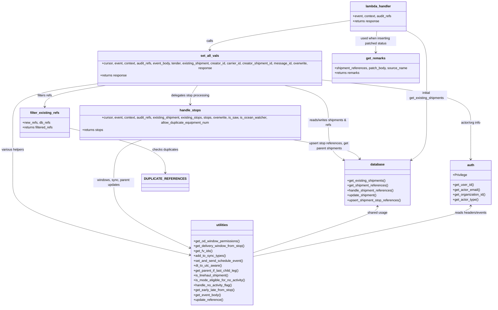

# Diagram: shipment_core/shipment_service/shipment_service/shipments/shipments_patch.py


> Auto-generated by Obscura crawlers

## Diagram 1



### SVG

<svg id="container" width="2474.90625" xmlns="http://www.w3.org/2000/svg" class="classDiagram" height="1452" viewBox="0 0 2474.90625 1452" role="graphics-document document" aria-roledescription="class"><style>#container{font-family:"trebuchet ms",verdana,arial,sans-serif;font-size:16px;fill:#333;}@keyframes edge-animation-frame{from{stroke-dashoffset:0;}}@keyframes dash{to{stroke-dashoffset:0;}}#container .edge-animation-slow{stroke-dasharray:9,5!important;stroke-dashoffset:900;animation:dash 50s linear infinite;stroke-linecap:round;}#container .edge-animation-fast{stroke-dasharray:9,5!important;stroke-dashoffset:900;animation:dash 20s linear infinite;stroke-linecap:round;}#container .error-icon{fill:#552222;}#container .error-text{fill:#552222;stroke:#552222;}#container .edge-thickness-normal{stroke-width:1px;}#container .edge-thickness-thick{stroke-width:3.5px;}#container .edge-pattern-solid{stroke-dasharray:0;}#container .edge-thickness-invisible{stroke-width:0;fill:none;}#container .edge-pattern-dashed{stroke-dasharray:3;}#container .edge-pattern-dotted{stroke-dasharray:2;}#container .marker{fill:#333333;stroke:#333333;}#container .marker.cross{stroke:#333333;}#container svg{font-family:"trebuchet ms",verdana,arial,sans-serif;font-size:16px;}#container p{margin:0;}#container g.classGroup text{fill:#9370DB;stroke:none;font-family:"trebuchet ms",verdana,arial,sans-serif;font-size:10px;}#container g.classGroup text .title{font-weight:bolder;}#container .nodeLabel,#container .edgeLabel{color:#131300;}#container .edgeLabel .label rect{fill:#ECECFF;}#container .label text{fill:#131300;}#container .labelBkg{background:#ECECFF;}#container .edgeLabel .label span{background:#ECECFF;}#container .classTitle{font-weight:bolder;}#container .node rect,#container .node circle,#container .node ellipse,#container .node polygon,#container .node path{fill:#ECECFF;stroke:#9370DB;stroke-width:1px;}#container .divider{stroke:#9370DB;stroke-width:1;}#container g.clickable{cursor:pointer;}#container g.classGroup rect{fill:#ECECFF;stroke:#9370DB;}#container g.classGroup line{stroke:#9370DB;stroke-width:1;}#container .classLabel .box{stroke:none;stroke-width:0;fill:#ECECFF;opacity:0.5;}#container .classLabel .label{fill:#9370DB;font-size:10px;}#container .relation{stroke:#333333;stroke-width:1;fill:none;}#container .dashed-line{stroke-dasharray:3;}#container .dotted-line{stroke-dasharray:1 2;}#container #compositionStart,#container .composition{fill:#333333!important;stroke:#333333!important;stroke-width:1;}#container #compositionEnd,#container .composition{fill:#333333!important;stroke:#333333!important;stroke-width:1;}#container #dependencyStart,#container .dependency{fill:#333333!important;stroke:#333333!important;stroke-width:1;}#container #dependencyStart,#container .dependency{fill:#333333!important;stroke:#333333!important;stroke-width:1;}#container #extensionStart,#container .extension{fill:transparent!important;stroke:#333333!important;stroke-width:1;}#container #extensionEnd,#container .extension{fill:transparent!important;stroke:#333333!important;stroke-width:1;}#container #aggregationStart,#container .aggregation{fill:transparent!important;stroke:#333333!important;stroke-width:1;}#container #aggregationEnd,#container .aggregation{fill:transparent!important;stroke:#333333!important;stroke-width:1;}#container #lollipopStart,#container .lollipop{fill:#ECECFF!important;stroke:#333333!important;stroke-width:1;}#container #lollipopEnd,#container .lollipop{fill:#ECECFF!important;stroke:#333333!important;stroke-width:1;}#container .edgeTerminals{font-size:11px;line-height:initial;}#container .classTitleText{text-anchor:middle;font-size:18px;fill:#333;}#container .label-icon{display:inline-block;height:1em;overflow:visible;vertical-align:-0.125em;}#container .node .label-icon path{fill:currentColor;stroke:revert;stroke-width:revert;}#container :root{--mermaid-font-family:"trebuchet ms",verdana,arial,sans-serif;}</style><g><defs><marker id="container_class-aggregationStart" class="marker aggregation class" refX="18" refY="7" markerWidth="190" markerHeight="240" orient="auto"><path d="M 18,7 L9,13 L1,7 L9,1 Z"></path></marker></defs><defs><marker id="container_class-aggregationEnd" class="marker aggregation class" refX="1" refY="7" markerWidth="20" markerHeight="28" orient="auto"><path d="M 18,7 L9,13 L1,7 L9,1 Z"></path></marker></defs><defs><marker id="container_class-extensionStart" class="marker extension class" refX="18" refY="7" markerWidth="190" markerHeight="240" orient="auto"><path d="M 1,7 L18,13 V 1 Z"></path></marker></defs><defs><marker id="container_class-extensionEnd" class="marker extension class" refX="1" refY="7" markerWidth="20" markerHeight="28" orient="auto"><path d="M 1,1 V 13 L18,7 Z"></path></marker></defs><defs><marker id="container_class-compositionStart" class="marker composition class" refX="18" refY="7" markerWidth="190" markerHeight="240" orient="auto"><path d="M 18,7 L9,13 L1,7 L9,1 Z"></path></marker></defs><defs><marker id="container_class-compositionEnd" class="marker composition class" refX="1" refY="7" markerWidth="20" markerHeight="28" orient="auto"><path d="M 18,7 L9,13 L1,7 L9,1 Z"></path></marker></defs><defs><marker id="container_class-dependencyStart" class="marker dependency class" refX="6" refY="7" markerWidth="190" markerHeight="240" orient="auto"><path d="M 5,7 L9,13 L1,7 L9,1 Z"></path></marker></defs><defs><marker id="container_class-dependencyEnd" class="marker dependency class" refX="13" refY="7" markerWidth="20" markerHeight="28" orient="auto"><path d="M 18,7 L9,13 L14,7 L9,1 Z"></path></marker></defs><defs><marker id="container_class-lollipopStart" class="marker lollipop class" refX="13" refY="7" markerWidth="190" markerHeight="240" orient="auto"><circle stroke="black" fill="transparent" cx="7" cy="7" r="6"></circle></marker></defs><defs><marker id="container_class-lollipopEnd" class="marker lollipop class" refX="1" refY="7" markerWidth="190" markerHeight="240" orient="auto"><circle stroke="black" fill="transparent" cx="7" cy="7" r="6"></circle></marker></defs><g class="root"><g class="clusters"></g><g class="edgePaths"><path d="M1765.143,99.727L1647.214,116.605C1529.286,133.484,1293.429,167.242,1175.501,191.288C1057.572,215.333,1057.572,229.667,1057.572,236.833L1057.572,244" id="id_lambda_handler_set_all_vals_1" class="edge-thickness-normal edge-pattern-solid relation" style=";;;" data-edge="true" data-et="edge" data-id="id_lambda_handler_set_all_vals_1" data-points="W3sieCI6MTc2NS4xNDI1NzgxMjUsInkiOjk5LjcyNjU2NTM1MTc5MTE4fSx7IngiOjEwNTcuNTcyMjY1NjI1LCJ5IjoyMDF9LHsieCI6MTA1Ny41NzIyNjU2MjUsInkiOjI1MH1d" marker-end="url(#container_class-dependencyEnd)"></path><path d="M1000.138,394L993.623,402.167C987.109,410.333,974.08,426.667,967.565,442C961.051,457.333,961.051,471.667,961.051,478.833L961.051,486" id="id_set_all_vals_handle_stops_2" class="edge-thickness-normal edge-pattern-solid relation" style=";;;" data-edge="true" data-et="edge" data-id="id_set_all_vals_handle_stops_2" data-points="W3sieCI6MTAwMC4xMzc5OTM5MzA3ODUxLCJ5IjozOTR9LHsieCI6OTYxLjA1MDc4MTI1LCJ5Ijo0NDN9LHsieCI6OTYxLjA1MDc4MTI1LCJ5Ijo0OTJ9XQ==" marker-end="url(#container_class-dependencyEnd)"></path><path d="M559.91,394L503.462,402.167C447.014,410.333,334.118,426.667,277.67,442C221.223,457.333,221.223,471.667,221.223,478.833L221.223,486" id="id_set_all_vals_filter_existing_refs_3" class="edge-thickness-normal edge-pattern-solid relation" style=";;;" data-edge="true" data-et="edge" data-id="id_set_all_vals_filter_existing_refs_3" data-points="W3sieCI6NTU5LjkwOTY4ODE0NTY2MTIsInkiOjM5NH0seyJ4IjoyMjEuMjIyNjU2MjUsInkiOjQ0M30seyJ4IjoyMjEuMjIyNjU2MjUsInkiOjQ5Mn1d" marker-end="url(#container_class-dependencyEnd)"></path><path d="M1418.157,394L1459.056,402.167C1499.956,410.333,1581.755,426.667,1622.655,455C1663.555,483.333,1663.555,523.667,1663.555,564C1663.555,604.333,1663.555,644.667,1674.675,672.452C1685.795,700.236,1708.035,715.473,1719.155,723.091L1730.275,730.709" id="id_set_all_vals_database_4" class="edge-thickness-normal edge-pattern-solid relation" style=";;;" data-edge="true" data-et="edge" data-id="id_set_all_vals_database_4" data-points="W3sieCI6MTQxOC4xNTY4NDcyMzY1NzAyLCJ5IjozOTR9LHsieCI6MTY2My41NTQ2ODc1LCJ5Ijo0NDN9LHsieCI6MTY2My41NTQ2ODc1LCJ5Ijo1NjR9LHsieCI6MTY2My41NTQ2ODc1LCJ5Ijo2ODV9LHsieCI6MTczNS4yMjQ2MDkzNzUsInkiOjczNC4xMDA1NjQ0OTkyNjgyfV0=" marker-end="url(#container_class-dependencyEnd)"></path><path d="M478.334,392.534L409.261,400.945C340.189,409.356,202.044,426.178,132.971,454.756C63.898,483.333,63.898,523.667,63.898,564C63.898,604.333,63.898,644.667,63.898,691.5C63.898,738.333,63.898,791.667,63.898,843C63.898,894.333,63.898,943.667,212.906,1002.839C361.913,1062.011,659.927,1131.023,808.935,1165.529L957.942,1200.034" id="id_set_all_vals_utilities_5" class="edge-thickness-normal edge-pattern-solid relation" style=";;;" data-edge="true" data-et="edge" data-id="id_set_all_vals_utilities_5" data-points="W3sieCI6NDc4LjMzMzk4NDM3NSwieSI6MzkyLjUzNDA0MjUwNzE4OTA0fSx7IngiOjYzLjg5ODQzNzUsInkiOjQ0M30seyJ4Ijo2My44OTg0Mzc1LCJ5Ijo1NjR9LHsieCI6NjMuODk4NDM3NSwieSI6Njg1fSx7IngiOjYzLjg5ODQzNzUsInkiOjg0NX0seyJ4Ijo2My44OTg0Mzc1LCJ5Ijo5OTN9LHsieCI6OTYzLjc4NzEwOTM3NSwieSI6MTIwMS4zODc4NjE2NjcwNDY4fV0=" marker-end="url(#container_class-dependencyEnd)"></path><path d="M1636.811,375.577L1758.299,386.814C1879.786,398.051,2122.762,420.526,2244.25,451.93C2365.738,483.333,2365.738,523.667,2365.738,564C2365.738,604.333,2365.738,644.667,2365.738,672.5C2365.738,700.333,2365.738,715.667,2365.738,723.333L2365.738,731" id="id_set_all_vals_auth_6" class="edge-thickness-normal edge-pattern-solid relation" style=";;;" data-edge="true" data-et="edge" data-id="id_set_all_vals_auth_6" data-points="W3sieCI6MTYzNi44MTA1NDY4NzUsInkiOjM3NS41NzcxNjkyNTM4MzA3M30seyJ4IjoyMzY1LjczODI4MTI1LCJ5Ijo0NDN9LHsieCI6MjM2NS43MzgyODEyNSwieSI6NTY0fSx7IngiOjIzNjUuNzM4MjgxMjUsInkiOjY4NX0seyJ4IjoyMzY1LjczODI4MTI1LCJ5Ijo3Mzd9XQ==" marker-end="url(#container_class-dependencyEnd)"></path><path d="M729.832,636L703.606,644.167C677.379,652.333,624.927,668.667,598.701,703.5C572.475,738.333,572.475,791.667,572.475,843C572.475,894.333,572.475,943.667,636.781,997.118C701.087,1050.57,829.699,1108.14,894.005,1136.925L958.311,1165.71" id="id_handle_stops_utilities_7" class="edge-thickness-normal edge-pattern-solid relation" style=";;;" data-edge="true" data-et="edge" data-id="id_handle_stops_utilities_7" data-points="W3sieCI6NzI5LjgzMTkwMjExNzc2ODUsInkiOjYzNn0seyJ4Ijo1NzIuNDc0NjA5Mzc1LCJ5Ijo2ODV9LHsieCI6NTcyLjQ3NDYwOTM3NSwieSI6ODQ1fSx7IngiOjU3Mi40NzQ2MDkzNzUsInkiOjk5M30seyJ4Ijo5NjMuNzg3MTA5Mzc1LCJ5IjoxMTY4LjE2MTczMjc3NDM3Mzh9XQ==" marker-end="url(#container_class-dependencyEnd)"></path><path d="M1450.475,636L1505.988,644.167C1561.501,652.333,1672.528,668.667,1733.258,684.184C1793.988,699.702,1804.422,714.405,1809.639,721.756L1814.855,729.107" id="id_handle_stops_database_8" class="edge-thickness-normal edge-pattern-solid relation" style=";;;" data-edge="true" data-et="edge" data-id="id_handle_stops_database_8" data-points="W3sieCI6MTQ1MC40NzQ1OTMyMzM0NzEsInkiOjYzNn0seyJ4IjoxNzgzLjU1NDY4NzUsInkiOjY4NX0seyJ4IjoxODE4LjMyNzgxOTgyNDIxODgsInkiOjczNH1d" marker-end="url(#container_class-dependencyEnd)"></path><path d="M2040.791,147.723L2058.862,156.602C2076.933,165.482,2113.075,183.241,2131.146,212.287C2149.217,241.333,2149.217,281.667,2149.217,322C2149.217,362.333,2149.217,402.667,2149.217,443C2149.217,483.333,2149.217,523.667,2149.217,564C2149.217,604.333,2149.217,644.667,2135.021,673.843C2120.825,703.018,2092.433,721.037,2078.237,730.046L2064.041,739.055" id="id_lambda_handler_database_9" class="edge-thickness-normal edge-pattern-solid relation" style=";;;" data-edge="true" data-et="edge" data-id="id_lambda_handler_database_9" data-points="W3sieCI6MjA0MC43OTEwMTU2MjUsInkiOjE0Ny43MjI3NjMzMjQ4NzMwOX0seyJ4IjoyMTQ5LjIxNjc5Njg3NSwieSI6MjAxfSx7IngiOjIxNDkuMjE2Nzk2ODc1LCJ5IjozMjJ9LHsieCI6MjE0OS4yMTY3OTY4NzUsInkiOjQ0M30seyJ4IjoyMTQ5LjIxNjc5Njg3NSwieSI6NTY0fSx7IngiOjIxNDkuMjE2Nzk2ODc1LCJ5Ijo2ODV9LHsieCI6MjA1OC45NzQ2MDkzNzUsInkiOjc0Mi4yNjk5OTQ3MzIxMTI0fV0=" marker-end="url(#container_class-dependencyEnd)"></path><path d="M1901.507,152L1901.342,160.167C1901.176,168.333,1900.845,184.667,1900.679,200C1900.514,215.333,1900.514,229.667,1900.514,236.833L1900.514,244" id="id_lambda_handler_get_remarks_10" class="edge-thickness-normal edge-pattern-solid relation" style=";;;" data-edge="true" data-et="edge" data-id="id_lambda_handler_get_remarks_10" data-points="W3sieCI6MTkwMS41MDcwODYxMzExOTgzLCJ5IjoxNTJ9LHsieCI6MTkwMC41MTM2NzE4NzUsInkiOjIwMX0seyJ4IjoxOTAwLjUxMzY3MTg3NSwieSI6MjUwfV0=" marker-end="url(#container_class-dependencyEnd)"></path><path d="M343.547,589.235L420.914,605.196C498.281,621.157,653.014,653.078,730.381,687.706C807.748,722.333,807.748,759.667,807.748,778.333L807.748,797" id="id_filter_existing_refs_DUPLICATE_REFERENCES_11" class="edge-thickness-normal edge-pattern-solid relation" style=";;;" data-edge="true" data-et="edge" data-id="id_filter_existing_refs_DUPLICATE_REFERENCES_11" data-points="W3sieCI6MzQzLjU0Njg3NSwieSI6NTg5LjIzNTQ0NzEwMTQwODJ9LHsieCI6ODA3Ljc0ODA0Njg3NSwieSI6Njg1fSx7IngiOjgwNy43NDgwNDY4NzUsInkiOjgwM31d" marker-end="url(#container_class-dependencyEnd)"></path><path d="M1897.1,962L1897.1,967.167C1897.1,972.333,1897.1,982.667,1792.809,1020.477C1688.519,1058.288,1479.938,1123.576,1375.648,1156.22L1271.357,1188.864" id="id_database_utilities_12" class="edge-thickness-normal edge-pattern-solid relation" style=";;;" data-edge="true" data-et="edge" data-id="id_database_utilities_12" data-points="W3sieCI6MTg5Ny4wOTk2MDkzNzUsInkiOjk1Nn0seyJ4IjoxODk3LjA5OTYwOTM3NSwieSI6OTkzfSx7IngiOjEyNzEuMzU3NDIxODc1LCJ5IjoxMTg4Ljg2MzY3OTQxMzEwNn1d" marker-start="url(#container_class-dependencyStart)"></path><path d="M2365.738,959L2365.738,964.667C2365.738,970.333,2365.738,981.667,2183.341,1022.99C2000.945,1064.312,1636.151,1135.625,1453.754,1171.281L1271.357,1206.937" id="id_auth_utilities_13" class="edge-thickness-normal edge-pattern-solid relation" style=";;;" data-edge="true" data-et="edge" data-id="id_auth_utilities_13" data-points="W3sieCI6MjM2NS43MzgyODEyNSwieSI6OTUzfSx7IngiOjIzNjUuNzM4MjgxMjUsInkiOjk5M30seyJ4IjoxMjcxLjM1NzQyMTg3NSwieSI6MTIwNi45MzcwMjk0ODU0NDgyfV0=" marker-start="url(#container_class-dependencyStart)"></path></g><g class="edgeLabels"><g class="edgeLabel" transform="translate(1057.572265625, 201)"><g class="label" data-id="id_lambda_handler_set_all_vals_1" transform="translate(-16.4453125, -12)"><foreignObject width="32.890625" height="24"><div xmlns="http://www.w3.org/1999/xhtml" class="labelBkg" style="display: table-cell; white-space: nowrap; line-height: 1.5; max-width: 200px; text-align: center;"><span class="edgeLabel"><p>calls</p></span></div></foreignObject></g></g><g class="edgeLabel" transform="translate(961.05078125, 443)"><g class="label" data-id="id_set_all_vals_handle_stops_2" transform="translate(-93.9921875, -12)"><foreignObject width="187.984375" height="24"><div xmlns="http://www.w3.org/1999/xhtml" class="labelBkg" style="display: table-cell; white-space: nowrap; line-height: 1.5; max-width: 200px; text-align: center;"><span class="edgeLabel"><p>delegates stop processing</p></span></div></foreignObject></g></g><g class="edgeLabel" transform="translate(221.22265625, 443)"><g class="label" data-id="id_set_all_vals_filter_existing_refs_3" transform="translate(-36.484375, -12)"><foreignObject width="72.96875" height="24"><div xmlns="http://www.w3.org/1999/xhtml" class="labelBkg" style="display: table-cell; white-space: nowrap; line-height: 1.5; max-width: 200px; text-align: center;"><span class="edgeLabel"><p>filters refs</p></span></div></foreignObject></g></g><g class="edgeLabel" transform="translate(1663.5546875, 564)"><g class="label" data-id="id_set_all_vals_database_4" transform="translate(-100, -24)"><foreignObject width="200" height="48"><div xmlns="http://www.w3.org/1999/xhtml" class="labelBkg" style="display: table; white-space: break-spaces; line-height: 1.5; max-width: 200px; text-align: center; width: 200px;"><span class="edgeLabel"><p>reads/writes shipments &amp; refs</p></span></div></foreignObject></g></g><g class="edgeLabel" transform="translate(63.8984375, 685)"><g class="label" data-id="id_set_all_vals_utilities_5" transform="translate(-55.8984375, -12)"><foreignObject width="111.796875" height="24"><div xmlns="http://www.w3.org/1999/xhtml" class="labelBkg" style="display: table-cell; white-space: nowrap; line-height: 1.5; max-width: 200px; text-align: center;"><span class="edgeLabel"><p>various helpers</p></span></div></foreignObject></g></g><g class="edgeLabel" transform="translate(2365.73828125, 564)"><g class="label" data-id="id_set_all_vals_auth_6" transform="translate(-50.125, -12)"><foreignObject width="100.25" height="24"><div xmlns="http://www.w3.org/1999/xhtml" class="labelBkg" style="display: table-cell; white-space: nowrap; line-height: 1.5; max-width: 200px; text-align: center;"><span class="edgeLabel"><p>actor/org info</p></span></div></foreignObject></g></g><g class="edgeLabel" transform="translate(572.474609375, 845)"><g class="label" data-id="id_handle_stops_utilities_7" transform="translate(-100, -24)"><foreignObject width="200" height="48"><div xmlns="http://www.w3.org/1999/xhtml" class="labelBkg" style="display: table; white-space: break-spaces; line-height: 1.5; max-width: 200px; text-align: center; width: 200px;"><span class="edgeLabel"><p>windows, sync, parent updates</p></span></div></foreignObject></g></g><g class="edgeLabel" transform="translate(1646.73709, 664.87252)"><g class="label" data-id="id_handle_stops_database_8" transform="translate(-100, -24)"><foreignObject width="200" height="48"><div xmlns="http://www.w3.org/1999/xhtml" class="labelBkg" style="display: table; white-space: break-spaces; line-height: 1.5; max-width: 200px; text-align: center; width: 200px;"><span class="edgeLabel"><p>upsert stop references, get parent shipments</p></span></div></foreignObject></g></g><g class="edgeLabel" transform="translate(2149.216796875, 443)"><g class="label" data-id="id_lambda_handler_database_9" transform="translate(-100, -24)"><foreignObject width="200" height="48"><div xmlns="http://www.w3.org/1999/xhtml" class="labelBkg" style="display: table; white-space: break-spaces; line-height: 1.5; max-width: 200px; text-align: center; width: 200px;"><span class="edgeLabel"><p>initial get_existing_shipments</p></span></div></foreignObject></g></g><g class="edgeLabel" transform="translate(1900.513671875, 201)"><g class="label" data-id="id_lambda_handler_get_remarks_10" transform="translate(-100, -24)"><foreignObject width="200" height="48"><div xmlns="http://www.w3.org/1999/xhtml" class="labelBkg" style="display: table; white-space: break-spaces; line-height: 1.5; max-width: 200px; text-align: center; width: 200px;"><span class="edgeLabel"><p>used when inserting patched status</p></span></div></foreignObject></g></g><g class="edgeLabel" transform="translate(807.748046875, 685)"><g class="label" data-id="id_filter_existing_refs_DUPLICATE_REFERENCES_11" transform="translate(-64.3671875, -12)"><foreignObject width="128.734375" height="24"><div xmlns="http://www.w3.org/1999/xhtml" class="labelBkg" style="display: table-cell; white-space: nowrap; line-height: 1.5; max-width: 200px; text-align: center;"><span class="edgeLabel"><p>checks duplicates</p></span></div></foreignObject></g></g><g class="edgeLabel" transform="translate(1897.099609375, 993)"><g class="label" data-id="id_database_utilities_12" transform="translate(-47.8671875, -12)"><foreignObject width="95.734375" height="24"><div xmlns="http://www.w3.org/1999/xhtml" class="labelBkg" style="display: table-cell; white-space: nowrap; line-height: 1.5; max-width: 200px; text-align: center;"><span class="edgeLabel"><p>shared usage</p></span></div></foreignObject></g></g><g class="edgeLabel" transform="translate(2365.73828125, 993)"><g class="label" data-id="id_auth_utilities_13" transform="translate(-78.953125, -12)"><foreignObject width="157.90625" height="24"><div xmlns="http://www.w3.org/1999/xhtml" class="labelBkg" style="display: table-cell; white-space: nowrap; line-height: 1.5; max-width: 200px; text-align: center;"><span class="edgeLabel"><p>reads headers/events</p></span></div></foreignObject></g></g></g><g class="nodes"><g class="node default" id="classId-lambda_handler-0" transform="translate(1902.966796875, 80)"><g class="basic label-container"><path d="M-137.82421875 -72 L137.82421875 -72 L137.82421875 72 L-137.82421875 72" stroke="none" stroke-width="0" fill="#ECECFF" style=""></path><path d="M-137.82421875 -72 C-71.08124516156505 -72, -4.3382715731301005 -72, 137.82421875 -72 M-137.82421875 -72 C-51.006785265440485 -72, 35.81064821911903 -72, 137.82421875 -72 M137.82421875 -72 C137.82421875 -35.931796525871434, 137.82421875 0.1364069482571324, 137.82421875 72 M137.82421875 -72 C137.82421875 -37.77679183190503, 137.82421875 -3.553583663810059, 137.82421875 72 M137.82421875 72 C65.57570288432822 72, -6.672812981343554 72, -137.82421875 72 M137.82421875 72 C68.0378637760173 72, -1.748491197965393 72, -137.82421875 72 M-137.82421875 72 C-137.82421875 36.29817774133029, -137.82421875 0.5963554826605844, -137.82421875 -72 M-137.82421875 72 C-137.82421875 23.613894316118348, -137.82421875 -24.772211367763305, -137.82421875 -72" stroke="#9370DB" stroke-width="1.3" fill="none" stroke-dasharray="0 0" style=""></path></g><g class="annotation-group text" transform="translate(0, -48)"></g><g class="label-group text" transform="translate(-59.9765625, -48)"><g class="label" style="font-weight: bolder" transform="translate(0,-12)"><foreignObject width="119.953125" height="24"><div xmlns="http://www.w3.org/1999/xhtml" style="display: table-cell; white-space: nowrap; line-height: 1.5; max-width: 170px; text-align: center;"><span class="nodeLabel markdown-node-label" style=""><p>lambda_handler</p></span></div></foreignObject></g></g><g class="members-group text" transform="translate(-125.82421875, 0)"><g class="label" style="" transform="translate(0,-12)"><foreignObject width="191.671875" height="24"><div xmlns="http://www.w3.org/1999/xhtml" style="display: table-cell; white-space: nowrap; line-height: 1.5; max-width: 249px; text-align: center;"><span class="nodeLabel markdown-node-label" style=""><p>+event, context, audit_refs</p></span></div></foreignObject></g><g class="label" style="" transform="translate(0,12)"><foreignObject width="131.0625" height="24"><div xmlns="http://www.w3.org/1999/xhtml" style="display: table-cell; white-space: nowrap; line-height: 1.5; max-width: 188px; text-align: center;"><span class="nodeLabel markdown-node-label" style=""><p>+returns response</p></span></div></foreignObject></g></g><g class="methods-group text" transform="translate(-125.82421875, 72)"></g><g class="divider" style=""><path d="M-137.82421875 -24 C-39.26981629071865 -24, 59.2845861685627 -24, 137.82421875 -24 M-137.82421875 -24 C-40.00793991214488 -24, 57.808338925710245 -24, 137.82421875 -24" stroke="#9370DB" stroke-width="1.3" fill="none" stroke-dasharray="0 0" style=""></path></g><g class="divider" style=""><path d="M-137.82421875 48 C-33.68294022973558 48, 70.45833829052884 48, 137.82421875 48 M-137.82421875 48 C-32.186201625156116 48, 73.45181549968777 48, 137.82421875 48" stroke="#9370DB" stroke-width="1.3" fill="none" stroke-dasharray="0 0" style=""></path></g></g><g class="node default" id="classId-set_all_vals-1" transform="translate(1057.572265625, 322)"><g class="basic label-container"><path d="M-579.23828125 -72 L579.23828125 -72 L579.23828125 72 L-579.23828125 72" stroke="none" stroke-width="0" fill="#ECECFF" style=""></path><path d="M-579.23828125 -72 C-175.4503702881732 -72, 228.33754067365362 -72, 579.23828125 -72 M-579.23828125 -72 C-189.43860640540998 -72, 200.36106843918003 -72, 579.23828125 -72 M579.23828125 -72 C579.23828125 -38.129747550593244, 579.23828125 -4.259495101186488, 579.23828125 72 M579.23828125 -72 C579.23828125 -30.748417161596834, 579.23828125 10.503165676806333, 579.23828125 72 M579.23828125 72 C287.3619725910729 72, -4.514336067854174 72, -579.23828125 72 M579.23828125 72 C116.4721696407205 72, -346.293941968559 72, -579.23828125 72 M-579.23828125 72 C-579.23828125 41.63503907986923, -579.23828125 11.27007815973846, -579.23828125 -72 M-579.23828125 72 C-579.23828125 22.66111349379542, -579.23828125 -26.677773012409162, -579.23828125 -72" stroke="#9370DB" stroke-width="1.3" fill="none" stroke-dasharray="0 0" style=""></path></g><g class="annotation-group text" transform="translate(0, -48)"></g><g class="label-group text" transform="translate(-42.8203125, -48)"><g class="label" style="font-weight: bolder" transform="translate(0,-12)"><foreignObject width="85.640625" height="24"><div xmlns="http://www.w3.org/1999/xhtml" style="display: table-cell; white-space: nowrap; line-height: 1.5; max-width: 134px; text-align: center;"><span class="nodeLabel markdown-node-label" style=""><p>set_all_vals</p></span></div></foreignObject></g></g><g class="members-group text" transform="translate(-567.23828125, 0)"><g class="label" style="" transform="translate(0,-12)"><foreignObject width="1091.65625" height="24"><div xmlns="http://www.w3.org/1999/xhtml" style="display: table-cell; white-space: nowrap; line-height: 1.5; max-width: 1149px; text-align: center;"><span class="nodeLabel markdown-node-label" style=""><p>+cursor, event, context, audit_refs, event_body, tender, existing_shipment, creator_id, carrier_id, creator_shipment_id, message_id, overwrite, response</p></span></div></foreignObject></g><g class="label" style="" transform="translate(0,12)"><foreignObject width="131.0625" height="24"><div xmlns="http://www.w3.org/1999/xhtml" style="display: table-cell; white-space: nowrap; line-height: 1.5; max-width: 188px; text-align: center;"><span class="nodeLabel markdown-node-label" style=""><p>+returns response</p></span></div></foreignObject></g></g><g class="methods-group text" transform="translate(-567.23828125, 72)"></g><g class="divider" style=""><path d="M-579.23828125 -24 C-282.43928261633255 -24, 14.359716017334904 -24, 579.23828125 -24 M-579.23828125 -24 C-254.8469805874347 -24, 69.5443200751306 -24, 579.23828125 -24" stroke="#9370DB" stroke-width="1.3" fill="none" stroke-dasharray="0 0" style=""></path></g><g class="divider" style=""><path d="M-579.23828125 48 C-343.70882386318954 48, -108.17936647637907 48, 579.23828125 48 M-579.23828125 48 C-173.66503472971078 48, 231.90821179057843 48, 579.23828125 48" stroke="#9370DB" stroke-width="1.3" fill="none" stroke-dasharray="0 0" style=""></path></g></g><g class="node default" id="classId-handle_stops-2" transform="translate(961.05078125, 564)"><g class="basic label-container"><path d="M-567.50390625 -72 L567.50390625 -72 L567.50390625 72 L-567.50390625 72" stroke="none" stroke-width="0" fill="#ECECFF" style=""></path><path d="M-567.50390625 -72 C-283.115191238177 -72, 1.2735237736460476 -72, 567.50390625 -72 M-567.50390625 -72 C-170.9544098813244 -72, 225.59508648735118 -72, 567.50390625 -72 M567.50390625 -72 C567.50390625 -37.847878417634135, 567.50390625 -3.69575683526827, 567.50390625 72 M567.50390625 -72 C567.50390625 -27.3628282229746, 567.50390625 17.2743435540508, 567.50390625 72 M567.50390625 72 C218.23428766223304 72, -131.0353309255339 72, -567.50390625 72 M567.50390625 72 C324.25174350699547 72, 80.99958076399093 72, -567.50390625 72 M-567.50390625 72 C-567.50390625 30.261192439552993, -567.50390625 -11.477615120894015, -567.50390625 -72 M-567.50390625 72 C-567.50390625 39.87870712478044, -567.50390625 7.757414249560881, -567.50390625 -72" stroke="#9370DB" stroke-width="1.3" fill="none" stroke-dasharray="0 0" style=""></path></g><g class="annotation-group text" transform="translate(0, -48)"></g><g class="label-group text" transform="translate(-49.2890625, -48)"><g class="label" style="font-weight: bolder" transform="translate(0,-12)"><foreignObject width="98.578125" height="24"><div xmlns="http://www.w3.org/1999/xhtml" style="display: table-cell; white-space: nowrap; line-height: 1.5; max-width: 148px; text-align: center;"><span class="nodeLabel markdown-node-label" style=""><p>handle_stops</p></span></div></foreignObject></g></g><g class="members-group text" transform="translate(-555.50390625, 0)"><g class="label" style="" transform="translate(0,-12)"><foreignObject width="1061.71875" height="24"><div xmlns="http://www.w3.org/1999/xhtml" style="display: table-cell; white-space: nowrap; line-height: 1.5; max-width: 1119px; text-align: center;"><span class="nodeLabel markdown-node-label" style=""><p>+cursor, event, context, audit_refs, existing_shipment, existing_stops, stops, overwrite, is_saw, is_ocean_watcher, allow_duplicate_equipment_num</p></span></div></foreignObject></g><g class="label" style="" transform="translate(0,12)"><foreignObject width="104.09375" height="24"><div xmlns="http://www.w3.org/1999/xhtml" style="display: table-cell; white-space: nowrap; line-height: 1.5; max-width: 161px; text-align: center;"><span class="nodeLabel markdown-node-label" style=""><p>+returns stops</p></span></div></foreignObject></g></g><g class="methods-group text" transform="translate(-555.50390625, 72)"></g><g class="divider" style=""><path d="M-567.50390625 -24 C-294.6401873627001 -24, -21.77646847540018 -24, 567.50390625 -24 M-567.50390625 -24 C-300.7814759694124 -24, -34.05904568882477 -24, 567.50390625 -24" stroke="#9370DB" stroke-width="1.3" fill="none" stroke-dasharray="0 0" style=""></path></g><g class="divider" style=""><path d="M-567.50390625 48 C-287.67926398912994 48, -7.854621728259872 48, 567.50390625 48 M-567.50390625 48 C-251.1628979316352 48, 65.1781103867296 48, 567.50390625 48" stroke="#9370DB" stroke-width="1.3" fill="none" stroke-dasharray="0 0" style=""></path></g></g><g class="node default" id="classId-get_remarks-3" transform="translate(1900.513671875, 322)"><g class="basic label-container"><path d="M-213.703125 -72 L213.703125 -72 L213.703125 72 L-213.703125 72" stroke="none" stroke-width="0" fill="#ECECFF" style=""></path><path d="M-213.703125 -72 C-73.84171843660079 -72, 66.01968812679843 -72, 213.703125 -72 M-213.703125 -72 C-63.44581441811502 -72, 86.81149616376996 -72, 213.703125 -72 M213.703125 -72 C213.703125 -37.894648975556336, 213.703125 -3.7892979511126725, 213.703125 72 M213.703125 -72 C213.703125 -21.054059103384617, 213.703125 29.891881793230766, 213.703125 72 M213.703125 72 C101.2314686498822 72, -11.240187700235595 72, -213.703125 72 M213.703125 72 C46.291728288902675 72, -121.11966842219465 72, -213.703125 72 M-213.703125 72 C-213.703125 29.750175422473873, -213.703125 -12.499649155052253, -213.703125 -72 M-213.703125 72 C-213.703125 30.839270748270053, -213.703125 -10.321458503459894, -213.703125 -72" stroke="#9370DB" stroke-width="1.3" fill="none" stroke-dasharray="0 0" style=""></path></g><g class="annotation-group text" transform="translate(0, -48)"></g><g class="label-group text" transform="translate(-45.875, -48)"><g class="label" style="font-weight: bolder" transform="translate(0,-12)"><foreignObject width="91.75" height="24"><div xmlns="http://www.w3.org/1999/xhtml" style="display: table-cell; white-space: nowrap; line-height: 1.5; max-width: 139px; text-align: center;"><span class="nodeLabel markdown-node-label" style=""><p>get_remarks</p></span></div></foreignObject></g></g><g class="members-group text" transform="translate(-201.703125, 0)"><g class="label" style="" transform="translate(0,-12)"><foreignObject width="357.53125" height="24"><div xmlns="http://www.w3.org/1999/xhtml" style="display: table-cell; white-space: nowrap; line-height: 1.5; max-width: 415px; text-align: center;"><span class="nodeLabel markdown-node-label" style=""><p>+shipment_references, patch_body, source_name</p></span></div></foreignObject></g><g class="label" style="" transform="translate(0,12)"><foreignObject width="123.359375" height="24"><div xmlns="http://www.w3.org/1999/xhtml" style="display: table-cell; white-space: nowrap; line-height: 1.5; max-width: 181px; text-align: center;"><span class="nodeLabel markdown-node-label" style=""><p>+returns remarks</p></span></div></foreignObject></g></g><g class="methods-group text" transform="translate(-201.703125, 72)"></g><g class="divider" style=""><path d="M-213.703125 -24 C-108.63458606836255 -24, -3.5660471367251034 -24, 213.703125 -24 M-213.703125 -24 C-63.85881791305843 -24, 85.98548917388314 -24, 213.703125 -24" stroke="#9370DB" stroke-width="1.3" fill="none" stroke-dasharray="0 0" style=""></path></g><g class="divider" style=""><path d="M-213.703125 48 C-50.23466412558221 48, 113.23379674883557 48, 213.703125 48 M-213.703125 48 C-79.19997495973473 48, 55.303175080530536 48, 213.703125 48" stroke="#9370DB" stroke-width="1.3" fill="none" stroke-dasharray="0 0" style=""></path></g></g><g class="node default" id="classId-filter_existing_refs-4" transform="translate(221.22265625, 564)"><g class="basic label-container"><path d="M-122.32421875 -72 L122.32421875 -72 L122.32421875 72 L-122.32421875 72" stroke="none" stroke-width="0" fill="#ECECFF" style=""></path><path d="M-122.32421875 -72 C-53.34293372583511 -72, 15.63835129832978 -72, 122.32421875 -72 M-122.32421875 -72 C-48.76265562053314 -72, 24.798907508933723 -72, 122.32421875 -72 M122.32421875 -72 C122.32421875 -16.830228158754295, 122.32421875 38.33954368249141, 122.32421875 72 M122.32421875 -72 C122.32421875 -31.85368259000071, 122.32421875 8.292634819998582, 122.32421875 72 M122.32421875 72 C26.717157244845012 72, -68.88990426030998 72, -122.32421875 72 M122.32421875 72 C44.37017199052622 72, -33.58387476894757 72, -122.32421875 72 M-122.32421875 72 C-122.32421875 27.3148448373949, -122.32421875 -17.3703103252102, -122.32421875 -72 M-122.32421875 72 C-122.32421875 27.595841737404207, -122.32421875 -16.808316525191586, -122.32421875 -72" stroke="#9370DB" stroke-width="1.3" fill="none" stroke-dasharray="0 0" style=""></path></g><g class="annotation-group text" transform="translate(0, -48)"></g><g class="label-group text" transform="translate(-68.2734375, -48)"><g class="label" style="font-weight: bolder" transform="translate(0,-12)"><foreignObject width="136.546875" height="24"><div xmlns="http://www.w3.org/1999/xhtml" style="display: table-cell; white-space: nowrap; line-height: 1.5; max-width: 183px; text-align: center;"><span class="nodeLabel markdown-node-label" style=""><p>filter_existing_refs</p></span></div></foreignObject></g></g><g class="members-group text" transform="translate(-110.32421875, 0)"><g class="label" style="" transform="translate(0,-12)"><foreignObject width="135.046875" height="24"><div xmlns="http://www.w3.org/1999/xhtml" style="display: table-cell; white-space: nowrap; line-height: 1.5; max-width: 192px; text-align: center;"><span class="nodeLabel markdown-node-label" style=""><p>+new_refs, db_refs</p></span></div></foreignObject></g><g class="label" style="" transform="translate(0,12)"><foreignObject width="152.375" height="24"><div xmlns="http://www.w3.org/1999/xhtml" style="display: table-cell; white-space: nowrap; line-height: 1.5; max-width: 210px; text-align: center;"><span class="nodeLabel markdown-node-label" style=""><p>+returns filtered_refs</p></span></div></foreignObject></g></g><g class="methods-group text" transform="translate(-110.32421875, 72)"></g><g class="divider" style=""><path d="M-122.32421875 -24 C-52.05164943261022 -24, 18.220919884779562 -24, 122.32421875 -24 M-122.32421875 -24 C-27.85298099741297 -24, 66.61825675517406 -24, 122.32421875 -24" stroke="#9370DB" stroke-width="1.3" fill="none" stroke-dasharray="0 0" style=""></path></g><g class="divider" style=""><path d="M-122.32421875 48 C-53.157152585959864 48, 16.009913578080273 48, 122.32421875 48 M-122.32421875 48 C-71.30502310477355 48, -20.285827459547107 48, 122.32421875 48" stroke="#9370DB" stroke-width="1.3" fill="none" stroke-dasharray="0 0" style=""></path></g></g><g class="node default" id="classId-database-5" transform="translate(1897.099609375, 845)"><g class="basic label-container"><path d="M-161.875 -111 L161.875 -111 L161.875 111 L-161.875 111" stroke="none" stroke-width="0" fill="#ECECFF" style=""></path><path d="M-161.875 -111 C-80.88022027470849 -111, 0.11455945058301609 -111, 161.875 -111 M-161.875 -111 C-36.59970518887174 -111, 88.67558962225652 -111, 161.875 -111 M161.875 -111 C161.875 -40.80053043441731, 161.875 29.398939131165378, 161.875 111 M161.875 -111 C161.875 -40.12704297897349, 161.875 30.745914042053016, 161.875 111 M161.875 111 C65.5200529984519 111, -30.834894003096196 111, -161.875 111 M161.875 111 C34.57511850640209 111, -92.72476298719582 111, -161.875 111 M-161.875 111 C-161.875 40.40463941215128, -161.875 -30.190721175697433, -161.875 -111 M-161.875 111 C-161.875 27.53007658381904, -161.875 -55.93984683236192, -161.875 -111" stroke="#9370DB" stroke-width="1.3" fill="none" stroke-dasharray="0 0" style=""></path></g><g class="annotation-group text" transform="translate(0, -87)"></g><g class="label-group text" transform="translate(-33.84375, -87)"><g class="label" style="font-weight: bolder" transform="translate(0,-12)"><foreignObject width="67.6875" height="24"><div xmlns="http://www.w3.org/1999/xhtml" style="display: table-cell; white-space: nowrap; line-height: 1.5; max-width: 117px; text-align: center;"><span class="nodeLabel markdown-node-label" style=""><p>database</p></span></div></foreignObject></g></g><g class="members-group text" transform="translate(-149.875, -39)"></g><g class="methods-group text" transform="translate(-149.875, -9)"><g class="label" style="" transform="translate(0,-12)"><foreignObject width="189.53125" height="24"><div xmlns="http://www.w3.org/1999/xhtml" style="display: table-cell; white-space: nowrap; line-height: 1.5; max-width: 247px; text-align: center;"><span class="nodeLabel markdown-node-label" style=""><p>+get_existing_shipments()</p></span></div></foreignObject></g><g class="label" style="" transform="translate(0,12)"><foreignObject width="201.65625" height="24"><div xmlns="http://www.w3.org/1999/xhtml" style="display: table-cell; white-space: nowrap; line-height: 1.5; max-width: 259px; text-align: center;"><span class="nodeLabel markdown-node-label" style=""><p>+get_shipment_references()</p></span></div></foreignObject></g><g class="label" style="" transform="translate(0,36)"><foreignObject width="229.125" height="24"><div xmlns="http://www.w3.org/1999/xhtml" style="display: table-cell; white-space: nowrap; line-height: 1.5; max-width: 286px; text-align: center;"><span class="nodeLabel markdown-node-label" style=""><p>+handle_shipment_references()</p></span></div></foreignObject></g><g class="label" style="" transform="translate(0,60)"><foreignObject width="146.15625" height="24"><div xmlns="http://www.w3.org/1999/xhtml" style="display: table-cell; white-space: nowrap; line-height: 1.5; max-width: 204px; text-align: center;"><span class="nodeLabel markdown-node-label" style=""><p>+update_shipment()</p></span></div></foreignObject></g><g class="label" style="" transform="translate(0,84)"><foreignObject width="265.90625" height="24"><div xmlns="http://www.w3.org/1999/xhtml" style="display: table-cell; white-space: nowrap; line-height: 1.5; max-width: 323px; text-align: center;"><span class="nodeLabel markdown-node-label" style=""><p>+upsert_shipment_stop_references()</p></span></div></foreignObject></g></g><g class="divider" style=""><path d="M-161.875 -63 C-78.36734850250502 -63, 5.140302994989952 -63, 161.875 -63 M-161.875 -63 C-60.02120398134436 -63, 41.83259203731129 -63, 161.875 -63" stroke="#9370DB" stroke-width="1.3" fill="none" stroke-dasharray="0 0" style=""></path></g><g class="divider" style=""><path d="M-161.875 -39 C-90.11463924728639 -39, -18.35427849457278 -39, 161.875 -39 M-161.875 -39 C-92.47281932347543 -39, -23.07063864695087 -39, 161.875 -39" stroke="#9370DB" stroke-width="1.3" fill="none" stroke-dasharray="0 0" style=""></path></g></g><g class="node default" id="classId-utilities-6" transform="translate(1117.572265625, 1237)"><g class="basic label-container"><path d="M-153.78515625 -207 L153.78515625 -207 L153.78515625 207 L-153.78515625 207" stroke="none" stroke-width="0" fill="#ECECFF" style=""></path><path d="M-153.78515625 -207 C-84.80432651786654 -207, -15.823496785733084 -207, 153.78515625 -207 M-153.78515625 -207 C-86.32820581057175 -207, -18.87125537114349 -207, 153.78515625 -207 M153.78515625 -207 C153.78515625 -62.13877867829595, 153.78515625 82.7224426434081, 153.78515625 207 M153.78515625 -207 C153.78515625 -75.69829322312984, 153.78515625 55.603413553740324, 153.78515625 207 M153.78515625 207 C53.79676788363011 207, -46.19162048273978 207, -153.78515625 207 M153.78515625 207 C46.612888493554124 207, -60.55937926289175 207, -153.78515625 207 M-153.78515625 207 C-153.78515625 51.65135520249706, -153.78515625 -103.69728959500588, -153.78515625 -207 M-153.78515625 207 C-153.78515625 83.37778404422974, -153.78515625 -40.24443191154052, -153.78515625 -207" stroke="#9370DB" stroke-width="1.3" fill="none" stroke-dasharray="0 0" style=""></path></g><g class="annotation-group text" transform="translate(0, -183)"></g><g class="label-group text" transform="translate(-28.1796875, -183)"><g class="label" style="font-weight: bolder" transform="translate(0,-12)"><foreignObject width="56.359375" height="24"><div xmlns="http://www.w3.org/1999/xhtml" style="display: table-cell; white-space: nowrap; line-height: 1.5; max-width: 105px; text-align: center;"><span class="nodeLabel markdown-node-label" style=""><p>utilities</p></span></div></foreignObject></g></g><g class="members-group text" transform="translate(-141.78515625, -135)"></g><g class="methods-group text" transform="translate(-141.78515625, -105)"><g class="label" style="" transform="translate(0,-12)"><foreignObject width="227.6875" height="24"><div xmlns="http://www.w3.org/1999/xhtml" style="display: table-cell; white-space: nowrap; line-height: 1.5; max-width: 285px; text-align: center;"><span class="nodeLabel markdown-node-label" style=""><p>+get_od_window_permissions()</p></span></div></foreignObject></g><g class="label" style="" transform="translate(0,12)"><foreignObject width="252.21875" height="24"><div xmlns="http://www.w3.org/1999/xhtml" style="display: table-cell; white-space: nowrap; line-height: 1.5; max-width: 310px; text-align: center;"><span class="nodeLabel markdown-node-label" style=""><p>+get_delivery_window_from_stop()</p></span></div></foreignObject></g><g class="label" style="" transform="translate(0,36)"><foreignObject width="91.546875" height="24"><div xmlns="http://www.w3.org/1999/xhtml" style="display: table-cell; white-space: nowrap; line-height: 1.5; max-width: 149px; text-align: center;"><span class="nodeLabel markdown-node-label" style=""><p>+get_fv_ids()</p></span></div></foreignObject></g><g class="label" style="" transform="translate(0,60)"><foreignObject width="156.203125" height="24"><div xmlns="http://www.w3.org/1999/xhtml" style="display: table-cell; white-space: nowrap; line-height: 1.5; max-width: 214px; text-align: center;"><span class="nodeLabel markdown-node-label" style=""><p>+add_to_sync_types()</p></span></div></foreignObject></g><g class="label" style="" transform="translate(0,84)"><foreignObject width="241.1875" height="24"><div xmlns="http://www.w3.org/1999/xhtml" style="display: table-cell; white-space: nowrap; line-height: 1.5; max-width: 299px; text-align: center;"><span class="nodeLabel markdown-node-label" style=""><p>+set_and_send_schedule_event()</p></span></div></foreignObject></g><g class="label" style="" transform="translate(0,108)"><foreignObject width="137.78125" height="24"><div xmlns="http://www.w3.org/1999/xhtml" style="display: table-cell; white-space: nowrap; line-height: 1.5; max-width: 195px; text-align: center;"><span class="nodeLabel markdown-node-label" style=""><p>+dt_to_utc_aware()</p></span></div></foreignObject></g><g class="label" style="" transform="translate(0,132)"><foreignObject width="222.640625" height="24"><div xmlns="http://www.w3.org/1999/xhtml" style="display: table-cell; white-space: nowrap; line-height: 1.5; max-width: 280px; text-align: center;"><span class="nodeLabel markdown-node-label" style=""><p>+get_parent_if_last_child_leg()</p></span></div></foreignObject></g><g class="label" style="" transform="translate(0,156)"><foreignObject width="174.328125" height="24"><div xmlns="http://www.w3.org/1999/xhtml" style="display: table-cell; white-space: nowrap; line-height: 1.5; max-width: 232px; text-align: center;"><span class="nodeLabel markdown-node-label" style=""><p>+is_linehaul_shipment()</p></span></div></foreignObject></g><g class="label" style="" transform="translate(0,180)"><foreignObject width="255.390625" height="24"><div xmlns="http://www.w3.org/1999/xhtml" style="display: table-cell; white-space: nowrap; line-height: 1.5; max-width: 313px; text-align: center;"><span class="nodeLabel markdown-node-label" style=""><p>+is_mode_eligible_for_no_activity()</p></span></div></foreignObject></g><g class="label" style="" transform="translate(0,204)"><foreignObject width="189.484375" height="24"><div xmlns="http://www.w3.org/1999/xhtml" style="display: table-cell; white-space: nowrap; line-height: 1.5; max-width: 247px; text-align: center;"><span class="nodeLabel markdown-node-label" style=""><p>+handle_no_activity_flag()</p></span></div></foreignObject></g><g class="label" style="" transform="translate(0,228)"><foreignObject width="201.96875" height="24"><div xmlns="http://www.w3.org/1999/xhtml" style="display: table-cell; white-space: nowrap; line-height: 1.5; max-width: 259px; text-align: center;"><span class="nodeLabel markdown-node-label" style=""><p>+get_early_late_from_stop()</p></span></div></foreignObject></g><g class="label" style="" transform="translate(0,252)"><foreignObject width="133.859375" height="24"><div xmlns="http://www.w3.org/1999/xhtml" style="display: table-cell; white-space: nowrap; line-height: 1.5; max-width: 191px; text-align: center;"><span class="nodeLabel markdown-node-label" style=""><p>+get_event_body()</p></span></div></foreignObject></g><g class="label" style="" transform="translate(0,276)"><foreignObject width="145.875" height="24"><div xmlns="http://www.w3.org/1999/xhtml" style="display: table-cell; white-space: nowrap; line-height: 1.5; max-width: 203px; text-align: center;"><span class="nodeLabel markdown-node-label" style=""><p>+update_reference()</p></span></div></foreignObject></g></g><g class="divider" style=""><path d="M-153.78515625 -159 C-30.96593815226025 -159, 91.8532799454795 -159, 153.78515625 -159 M-153.78515625 -159 C-68.53944446863636 -159, 16.706267312727277 -159, 153.78515625 -159" stroke="#9370DB" stroke-width="1.3" fill="none" stroke-dasharray="0 0" style=""></path></g><g class="divider" style=""><path d="M-153.78515625 -135 C-47.75054598157031 -135, 58.284064286859376 -135, 153.78515625 -135 M-153.78515625 -135 C-60.941677289138966 -135, 31.90180167172207 -135, 153.78515625 -135" stroke="#9370DB" stroke-width="1.3" fill="none" stroke-dasharray="0 0" style=""></path></g></g><g class="node default" id="classId-auth-7" transform="translate(2365.73828125, 845)"><g class="basic label-container"><path d="M-101.16796875 -108 L101.16796875 -108 L101.16796875 108 L-101.16796875 108" stroke="none" stroke-width="0" fill="#ECECFF" style=""></path><path d="M-101.16796875 -108 C-52.73918552766065 -108, -4.310402305321304 -108, 101.16796875 -108 M-101.16796875 -108 C-43.78477396862381 -108, 13.59842081275238 -108, 101.16796875 -108 M101.16796875 -108 C101.16796875 -28.600806445563975, 101.16796875 50.79838710887205, 101.16796875 108 M101.16796875 -108 C101.16796875 -41.29967060624935, 101.16796875 25.4006587875013, 101.16796875 108 M101.16796875 108 C53.98323505823696 108, 6.798501366473914 108, -101.16796875 108 M101.16796875 108 C53.5119013762953 108, 5.855834002590598 108, -101.16796875 108 M-101.16796875 108 C-101.16796875 48.80808871152047, -101.16796875 -10.383822576959062, -101.16796875 -108 M-101.16796875 108 C-101.16796875 55.62140726470372, -101.16796875 3.2428145294074397, -101.16796875 -108" stroke="#9370DB" stroke-width="1.3" fill="none" stroke-dasharray="0 0" style=""></path></g><g class="annotation-group text" transform="translate(0, -84)"></g><g class="label-group text" transform="translate(-16.6640625, -84)"><g class="label" style="font-weight: bolder" transform="translate(0,-12)"><foreignObject width="33.328125" height="24"><div xmlns="http://www.w3.org/1999/xhtml" style="display: table-cell; white-space: nowrap; line-height: 1.5; max-width: 83px; text-align: center;"><span class="nodeLabel markdown-node-label" style=""><p>auth</p></span></div></foreignObject></g></g><g class="members-group text" transform="translate(-89.16796875, -36)"><g class="label" style="" transform="translate(0,-12)"><foreignObject width="70.15625" height="24"><div xmlns="http://www.w3.org/1999/xhtml" style="display: table-cell; white-space: nowrap; line-height: 1.5; max-width: 128px; text-align: center;"><span class="nodeLabel markdown-node-label" style=""><p>+Privilege</p></span></div></foreignObject></g></g><g class="methods-group text" transform="translate(-89.16796875, 12)"><g class="label" style="" transform="translate(0,-12)"><foreignObject width="101.71875" height="24"><div xmlns="http://www.w3.org/1999/xhtml" style="display: table-cell; white-space: nowrap; line-height: 1.5; max-width: 159px; text-align: center;"><span class="nodeLabel markdown-node-label" style=""><p>+get_user_id()</p></span></div></foreignObject></g><g class="label" style="" transform="translate(0,12)"><foreignObject width="133.390625" height="24"><div xmlns="http://www.w3.org/1999/xhtml" style="display: table-cell; white-space: nowrap; line-height: 1.5; max-width: 191px; text-align: center;"><span class="nodeLabel markdown-node-label" style=""><p>+get_actor_email()</p></span></div></foreignObject></g><g class="label" style="" transform="translate(0,36)"><foreignObject width="161.671875" height="24"><div xmlns="http://www.w3.org/1999/xhtml" style="display: table-cell; white-space: nowrap; line-height: 1.5; max-width: 219px; text-align: center;"><span class="nodeLabel markdown-node-label" style=""><p>+get_organization_id()</p></span></div></foreignObject></g><g class="label" style="" transform="translate(0,60)"><foreignObject width="124.84375" height="24"><div xmlns="http://www.w3.org/1999/xhtml" style="display: table-cell; white-space: nowrap; line-height: 1.5; max-width: 182px; text-align: center;"><span class="nodeLabel markdown-node-label" style=""><p>+get_actor_type()</p></span></div></foreignObject></g></g><g class="divider" style=""><path d="M-101.16796875 -60 C-45.55506850212396 -60, 10.057831745752082 -60, 101.16796875 -60 M-101.16796875 -60 C-38.21686917426545 -60, 24.734230401469105 -60, 101.16796875 -60" stroke="#9370DB" stroke-width="1.3" fill="none" stroke-dasharray="0 0" style=""></path></g><g class="divider" style=""><path d="M-101.16796875 -12 C-58.94154747307541 -12, -16.71512619615082 -12, 101.16796875 -12 M-101.16796875 -12 C-53.97492494441826 -12, -6.781881138836525 -12, 101.16796875 -12" stroke="#9370DB" stroke-width="1.3" fill="none" stroke-dasharray="0 0" style=""></path></g></g><g class="node default" id="classId-DUPLICATE_REFERENCES-8" transform="translate(807.748046875, 845)"><g class="basic label-container"><path d="M-100.2734375 -42 L100.2734375 -42 L100.2734375 42 L-100.2734375 42" stroke="none" stroke-width="0" fill="#ECECFF" style=""></path><path d="M-100.2734375 -42 C-39.898924424791026 -42, 20.475588650417947 -42, 100.2734375 -42 M-100.2734375 -42 C-25.663751796634898 -42, 48.945933906730204 -42, 100.2734375 -42 M100.2734375 -42 C100.2734375 -12.488829613691784, 100.2734375 17.02234077261643, 100.2734375 42 M100.2734375 -42 C100.2734375 -10.015904850313277, 100.2734375 21.968190299373447, 100.2734375 42 M100.2734375 42 C23.64396583412261 42, -52.98550583175478 42, -100.2734375 42 M100.2734375 42 C55.91857426188276 42, 11.56371102376552 42, -100.2734375 42 M-100.2734375 42 C-100.2734375 11.254330810909043, -100.2734375 -19.491338378181915, -100.2734375 -42 M-100.2734375 42 C-100.2734375 15.702686191350299, -100.2734375 -10.594627617299402, -100.2734375 -42" stroke="#9370DB" stroke-width="1.3" fill="none" stroke-dasharray="0 0" style=""></path></g><g class="annotation-group text" transform="translate(0, -18)"></g><g class="label-group text" transform="translate(-88.2734375, -18)"><g class="label" style="font-weight: bolder" transform="translate(0,-12)"><foreignObject width="176.546875" height="24"><div xmlns="http://www.w3.org/1999/xhtml" style="display: table-cell; white-space: nowrap; line-height: 1.5; max-width: 226px; text-align: center;"><span class="nodeLabel markdown-node-label" style=""><p>DUPLICATE_REFERENCES</p></span></div></foreignObject></g></g><g class="members-group text" transform="translate(-88.2734375, 30)"></g><g class="methods-group text" transform="translate(-88.2734375, 60)"></g><g class="divider" style=""><path d="M-100.2734375 6 C-36.16576459592643 6, 27.941908308147134 6, 100.2734375 6 M-100.2734375 6 C-20.142889568365135 6, 59.98765836326973 6, 100.2734375 6" stroke="#9370DB" stroke-width="1.3" fill="none" stroke-dasharray="0 0" style=""></path></g><g class="divider" style=""><path d="M-100.2734375 24 C-53.22522519095951 24, -6.177012881919026 24, 100.2734375 24 M-100.2734375 24 C-23.0948038130487 24, 54.0838298739026 24, 100.2734375 24" stroke="#9370DB" stroke-width="1.3" fill="none" stroke-dasharray="0 0" style=""></path></g></g></g></g></g></svg>

## Diagram 2

```mermaid
flowchart TD
    A[HTTP Event] --> B[lambda_handler]
    B --> C{tender in body?}
    C -- yes --> D[extract header fields\ncreator_id, carrier_id, shipment_id, message_id]
    C -- no --> D
    D --> E[DB_CONN.establish_connection()]
    E --> F[database.get_existing_shipments]
    F --> G{existing_shipment found?}
    G -- no & allowNoExist false --> H[insert_to_staging_area -> return 200]
    G -- yes --> I[if haul_away then original_state = snapshot]
    I --> J[get_id_and_org & update_reference if shipmentReferences]
    J --> K[set_all_vals]
    K --> K1[parse refs, pro/trailer/route, stops]
    K1 --> L{stops present?}
    L -- yes --> M[handle_stops -> update shipment stops -> add_shipment_stops_updated_status]
    L -- no --> N[process refs, update shipment fields, update DB]
    N --> O[maybe insert patched status if log param]
    O --> P[if HAUL_AWAY reconcile_all_stops]
    P --> Q[maybe send OutboundShipmentEvent for sync_types]
    Q --> R[maybe AsnOrder.write if parts and feature enabled]
    R --> S[make_response(response,200)]
```

> SVG rendering failed for this diagram.
