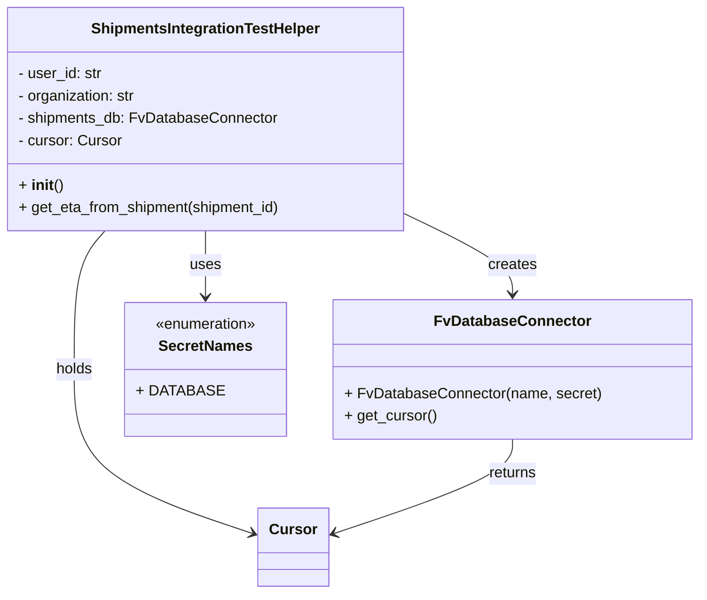

# Diagram: shipment_core/shipment_service/shipment_service/shipments/tests/integration/shipments_integration_test_helper.py

> Auto-generated by Obscura crawlers

## Mermaid

### SVG

<svg id="container" width="737.203125" xmlns="http://www.w3.org/2000/svg" class="classDiagram" height="638" viewBox="0 0 737.203125 638" role="graphics-document document" aria-roledescription="class"><g><defs><marker id="container_class-aggregationStart" class="marker aggregation class" refX="18" refY="7" markerWidth="190" markerHeight="240" orient="auto"><path d="M 18,7 L9,13 L1,7 L9,1 Z"></path></marker></defs><defs><marker id="container_class-aggregationEnd" class="marker aggregation class" refX="1" refY="7" markerWidth="20" markerHeight="28" orient="auto"><path d="M 18,7 L9,13 L1,7 L9,1 Z"></path></marker></defs><defs><marker id="container_class-extensionStart" class="marker extension class" refX="18" refY="7" markerWidth="190" markerHeight="240" orient="auto"><path d="M 1,7 L18,13 V 1 Z"></path></marker></defs><defs><marker id="container_class-extensionEnd" class="marker extension class" refX="1" refY="7" markerWidth="20" markerHeight="28" orient="auto"><path d="M 1,1 V 13 L18,7 Z"></path></marker></defs><defs><marker id="container_class-compositionStart" class="marker composition class" refX="18" refY="7" markerWidth="190" markerHeight="240" orient="auto"><path d="M 18,7 L9,13 L1,7 L9,1 Z"></path></marker></defs><defs><marker id="container_class-compositionEnd" class="marker composition class" refX="1" refY="7" markerWidth="20" markerHeight="28" orient="auto"><path d="M 18,7 L9,13 L1,7 L9,1 Z"></path></marker></defs><defs><marker id="container_class-dependencyStart" class="marker dependency class" refX="6" refY="7" markerWidth="190" markerHeight="240" orient="auto"><path d="M 5,7 L9,13 L1,7 L9,1 Z"></path></marker></defs><defs><marker id="container_class-dependencyEnd" class="marker dependency class" refX="13" refY="7" markerWidth="20" markerHeight="28" orient="auto"><path d="M 18,7 L9,13 L14,7 L9,1 Z"></path></marker></defs><defs><marker id="container_class-lollipopStart" class="marker lollipop class" refX="13" refY="7" markerWidth="190" markerHeight="240" orient="auto"><circle stroke="black" fill="transparent" cx="7" cy="7" r="6"></circle></marker></defs><defs><marker id="container_class-lollipopEnd" class="marker lollipop class" refX="1" refY="7" markerWidth="190" markerHeight="240" orient="auto"><circle stroke="black" fill="transparent" cx="7" cy="7" r="6"></circle></marker></defs><g class="root"><g class="clusters"></g><g class="edgePaths"><path d="M437.383,233.658L454.77,242.215C472.158,250.772,506.932,267.886,524.32,281.61C541.707,295.333,541.707,305.667,541.707,310.833L541.707,316" id="id_ShipmentsIntegrationTestHelper_FvDatabaseConnector_1" class="edge-thickness-normal edge-pattern-solid relation" style=";;;" data-edge="true" data-et="edge" data-id="id_ShipmentsIntegrationTestHelper_FvDatabaseConnector_1" data-points="W3sieCI6NDM3LjM4MjgxMjUsInkiOjIzMy42NTc5OTMzMzg4ODQyN30seyJ4Ijo1NDEuNzA3MDMxMjUsInkiOjI4NX0seyJ4Ijo1NDEuNzA3MDMxMjUsInkiOjMyMn1d" marker-end="url(#container_class-dependencyEnd)"></path><path d="M222.691,248L222.691,254.167C222.691,260.333,222.691,272.667,222.691,284.5C222.691,296.333,222.691,307.667,222.691,313.333L222.691,319" id="id_ShipmentsIntegrationTestHelper_SecretNames_2" class="edge-thickness-normal edge-pattern-solid relation" style=";;;" data-edge="true" data-et="edge" data-id="id_ShipmentsIntegrationTestHelper_SecretNames_2" data-points="W3sieCI6MjIyLjY5MTQwNjI1LCJ5IjoyNDh9LHsieCI6MjIyLjY5MTQwNjI1LCJ5IjoyODV9LHsieCI6MjIyLjY5MTQwNjI1LCJ5IjozMjV9XQ==" marker-end="url(#container_class-dependencyEnd)"></path><path d="M118.202,248L112.832,254.167C107.463,260.333,96.724,272.667,91.354,297.5C85.984,322.333,85.984,359.667,85.984,397C85.984,434.333,85.984,471.667,117.032,501.098C148.08,530.529,210.175,552.057,241.223,562.821L272.27,573.586" id="id_ShipmentsIntegrationTestHelper_Cursor_3" class="edge-thickness-normal edge-pattern-solid relation" style=";;;" data-edge="true" data-et="edge" data-id="id_ShipmentsIntegrationTestHelper_Cursor_3" data-points="W3sieCI6MTE4LjIwMTk1NTYxMzA1NzMyLCJ5IjoyNDh9LHsieCI6ODUuOTg0Mzc1LCJ5IjoyODV9LHsieCI6ODUuOTg0Mzc1LCJ5IjozOTd9LHsieCI6ODUuOTg0Mzc1LCJ5Ijo1MDl9LHsieCI6Mjc3LjkzOTQ1MzEyNSwieSI6NTc1LjU1MTIyNzg3NDY4NH1d" marker-end="url(#container_class-dependencyEnd)"></path><path d="M541.707,472L541.707,478.167C541.707,484.333,541.707,496.667,510.659,513.598C479.612,530.529,417.516,552.057,386.469,562.821L355.421,573.586" id="id_FvDatabaseConnector_Cursor_4" class="edge-thickness-normal edge-pattern-solid relation" style=";;;" data-edge="true" data-et="edge" data-id="id_FvDatabaseConnector_Cursor_4" data-points="W3sieCI6NTQxLjcwNzAzMTI1LCJ5Ijo0NzJ9LHsieCI6NTQxLjcwNzAzMTI1LCJ5Ijo1MDl9LHsieCI6MzQ5Ljc1MTk1MzEyNSwieSI6NTc1LjU1MTIyNzg3NDY4NH1d" marker-end="url(#container_class-dependencyEnd)"></path></g><g class="edgeLabels"><g class="edgeLabel" transform="translate(541.70703125, 285)"><g class="label" data-id="id_ShipmentsIntegrationTestHelper_FvDatabaseConnector_1" transform="translate(-26.171875, -12)"><foreignObject width="52.34375" height="24">

creates

</foreignObject></g></g><g class="edgeLabel" transform="translate(222.69140625, 285)"><g class="label" data-id="id_ShipmentsIntegrationTestHelper_SecretNames_2" transform="translate(-16.4921875, -12)"><foreignObject width="32.984375" height="24">

uses

</foreignObject></g></g><g class="edgeLabel" transform="translate(85.984375, 397)"><g class="label" data-id="id_ShipmentsIntegrationTestHelper_Cursor_3" transform="translate(-20.1875, -12)"><foreignObject width="40.375" height="24">

holds

</foreignObject></g></g><g class="edgeLabel" transform="translate(541.70703125, 509)"><g class="label" data-id="id_FvDatabaseConnector_Cursor_4" transform="translate(-26.265625, -12)"><foreignObject width="52.53125" height="24">

returns

</foreignObject></g></g></g><g class="nodes"><g class="node default" id="classId-ShipmentsIntegrationTestHelper-0" transform="translate(222.69140625, 128)"><g class="basic label-container"><path d="M-214.69140625 -120 L214.69140625 -120 L214.69140625 120 L-214.69140625 120" stroke="none" stroke-width="0" fill="#ECECFF" style=""></path><path d="M-214.69140625 -120 C-82.0866543682591 -120, 50.51809751348179 -120, 214.69140625 -120 M-214.69140625 -120 C-46.94840462711775 -120, 120.7945969957645 -120, 214.69140625 -120 M214.69140625 -120 C214.69140625 -35.87060885199928, 214.69140625 48.25878229600144, 214.69140625 120 M214.69140625 -120 C214.69140625 -34.55341160769191, 214.69140625 50.89317678461617, 214.69140625 120 M214.69140625 120 C110.0226718959393 120, 5.353937541878594 120, -214.69140625 120 M214.69140625 120 C56.78300498041395 120, -101.1253962891721 120, -214.69140625 120 M-214.69140625 120 C-214.69140625 44.56697180005857, -214.69140625 -30.866056399882865, -214.69140625 -120 M-214.69140625 120 C-214.69140625 51.37530623293998, -214.69140625 -17.249387534120046, -214.69140625 -120" stroke="#9370DB" stroke-width="1.3" fill="none" stroke-dasharray="0 0" style=""></path></g><g class="annotation-group text" transform="translate(0, -96)"></g><g class="label-group text" transform="translate(-119.4140625, -96)"><g class="label" style="font-weight: bolder" transform="translate(0,-12)"><foreignObject width="238.828125" height="24">

ShipmentsIntegrationTestHelper

</foreignObject></g></g><g class="members-group text" transform="translate(-202.69140625, -48)"><g class="label" style="" transform="translate(0,-12)"><foreignObject width="91" height="24">

- user_id: str

</foreignObject></g><g class="label" style="" transform="translate(0,12)"><foreignObject width="128.546875" height="24">

- organization: str

</foreignObject></g><g class="label" style="" transform="translate(0,36)"><foreignObject width="278.078125" height="24">

- shipments_db: FvDatabaseConnector

</foreignObject></g><g class="label" style="" transform="translate(0,60)"><foreignObject width="111.59375" height="24">

- cursor: Cursor

</foreignObject></g></g><g class="methods-group text" transform="translate(-202.69140625, 72)"><g class="label" style="" transform="translate(0,-12)"><foreignObject width="47.046875" height="24">

+ <strong>init</strong>()

</foreignObject></g><g class="label" style="" transform="translate(0,12)"><foreignObject width="285.96875" height="24">

+ get_eta_from_shipment(shipment_id)

</foreignObject></g></g><g class="divider" style=""><path d="M-214.69140625 -72 C-84.05576724363294 -72, 46.579871762734115 -72, 214.69140625 -72 M-214.69140625 -72 C-81.31556167680364 -72, 52.06028289639272 -72, 214.69140625 -72" stroke="#9370DB" stroke-width="1.3" fill="none" stroke-dasharray="0 0" style=""></path></g><g class="divider" style=""><path d="M-214.69140625 48 C-64.6712875415216 48, 85.34883116695681 48, 214.69140625 48 M-214.69140625 48 C-122.54014641594476 48, -30.388886581889523 48, 214.69140625 48" stroke="#9370DB" stroke-width="1.3" fill="none" stroke-dasharray="0 0" style=""></path></g></g><g class="node default" id="classId-FvDatabaseConnector-1" transform="translate(541.70703125, 397)"><g class="basic label-container"><path d="M-187.49609375 -75 L187.49609375 -75 L187.49609375 75 L-187.49609375 75" stroke="none" stroke-width="0" fill="#ECECFF" style=""></path><path d="M-187.49609375 -75 C-95.87730334314053 -75, -4.2585129362810505 -75, 187.49609375 -75 M-187.49609375 -75 C-38.35653793367132 -75, 110.78301788265736 -75, 187.49609375 -75 M187.49609375 -75 C187.49609375 -20.011053338023018, 187.49609375 34.977893323953964, 187.49609375 75 M187.49609375 -75 C187.49609375 -21.2715952192425, 187.49609375 32.456809561515, 187.49609375 75 M187.49609375 75 C90.36944309979218 75, -6.757207550415643 75, -187.49609375 75 M187.49609375 75 C93.55840234705829 75, -0.37928905588341877 75, -187.49609375 75 M-187.49609375 75 C-187.49609375 19.270056697101104, -187.49609375 -36.45988660579779, -187.49609375 -75 M-187.49609375 75 C-187.49609375 23.784448141390158, -187.49609375 -27.431103717219685, -187.49609375 -75" stroke="#9370DB" stroke-width="1.3" fill="none" stroke-dasharray="0 0" style=""></path></g><g class="annotation-group text" transform="translate(0, -51)"></g><g class="label-group text" transform="translate(-79.3046875, -51)"><g class="label" style="font-weight: bolder" transform="translate(0,-12)"><foreignObject width="158.609375" height="24">

FvDatabaseConnector

</foreignObject></g></g><g class="members-group text" transform="translate(-175.49609375, -3)"></g><g class="methods-group text" transform="translate(-175.49609375, 27)"><g class="label" style="" transform="translate(0,-12)"><foreignObject width="271.6875" height="24">

+ FvDatabaseConnector(name, secret)

</foreignObject></g><g class="label" style="" transform="translate(0,12)"><foreignObject width="98.890625" height="24">

+ get_cursor()

</foreignObject></g></g><g class="divider" style=""><path d="M-187.49609375 -27 C-88.34805415685028 -27, 10.799985436299437 -27, 187.49609375 -27 M-187.49609375 -27 C-81.32861195754394 -27, 24.838869834912117 -27, 187.49609375 -27" stroke="#9370DB" stroke-width="1.3" fill="none" stroke-dasharray="0 0" style=""></path></g><g class="divider" style=""><path d="M-187.49609375 -3 C-75.89625000926257 -3, 35.703593731474854 -3, 187.49609375 -3 M-187.49609375 -3 C-97.35275066015967 -3, -7.2094075703193425 -3, 187.49609375 -3" stroke="#9370DB" stroke-width="1.3" fill="none" stroke-dasharray="0 0" style=""></path></g></g><g class="node default" id="classId-SecretNames-2" transform="translate(222.69140625, 397)"><g class="basic label-container"><path d="M-81.51953125 -72 L81.51953125 -72 L81.51953125 72 L-81.51953125 72" stroke="none" stroke-width="0" fill="#ECECFF" style=""></path><path d="M-81.51953125 -72 C-19.76953561292357 -72, 41.98046002415286 -72, 81.51953125 -72 M-81.51953125 -72 C-31.107079275744447 -72, 19.305372698511107 -72, 81.51953125 -72 M81.51953125 -72 C81.51953125 -23.28949995936494, 81.51953125 25.421000081270122, 81.51953125 72 M81.51953125 -72 C81.51953125 -15.681280414409628, 81.51953125 40.637439171180745, 81.51953125 72 M81.51953125 72 C39.983897051812846 72, -1.5517371463743075 72, -81.51953125 72 M81.51953125 72 C42.65130512398613 72, 3.783078997972254 72, -81.51953125 72 M-81.51953125 72 C-81.51953125 31.38306281528442, -81.51953125 -9.233874369431163, -81.51953125 -72 M-81.51953125 72 C-81.51953125 38.01728669870461, -81.51953125 4.034573397409218, -81.51953125 -72" stroke="#9370DB" stroke-width="1.3" fill="none" stroke-dasharray="0 0" style=""></path></g><g class="annotation-group text" transform="translate(-55.5546875, -48)"><g class="label" style="" transform="translate(0,-12)"><foreignObject width="111.109375" height="24">

«enumeration»

</foreignObject></g></g><g class="label-group text" transform="translate(-48.03125, -24)"><g class="label" style="font-weight: bolder" transform="translate(0,-12)"><foreignObject width="96.0625" height="24">

SecretNames

</foreignObject></g></g><g class="members-group text" transform="translate(-69.51953125, 24)"><g class="label" style="" transform="translate(0,-12)"><foreignObject width="83.484375" height="24">

+ DATABASE

</foreignObject></g></g><g class="methods-group text" transform="translate(-69.51953125, 72)"></g><g class="divider" style=""><path d="M-81.51953125 0 C-23.50375500762196 0, 34.51202123475608 0, 81.51953125 0 M-81.51953125 0 C-16.969703263928366 0, 47.58012472214327 0, 81.51953125 0" stroke="#9370DB" stroke-width="1.3" fill="none" stroke-dasharray="0 0" style=""></path></g><g class="divider" style=""><path d="M-81.51953125 48 C-31.951462688524856 48, 17.616605872950288 48, 81.51953125 48 M-81.51953125 48 C-48.59253539316228 48, -15.665539536324559 48, 81.51953125 48" stroke="#9370DB" stroke-width="1.3" fill="none" stroke-dasharray="0 0" style=""></path></g></g><g class="node default" id="classId-Cursor-3" transform="translate(313.845703125, 588)"><g class="basic label-container"><path d="M-35.90625 -42 L35.90625 -42 L35.90625 42 L-35.90625 42" stroke="none" stroke-width="0" fill="#ECECFF" style=""></path><path d="M-35.90625 -42 C-20.178981141172073 -42, -4.45171228234415 -42, 35.90625 -42 M-35.90625 -42 C-7.465195971381991 -42, 20.975858057236017 -42, 35.90625 -42 M35.90625 -42 C35.90625 -23.784128115753195, 35.90625 -5.568256231506389, 35.90625 42 M35.90625 -42 C35.90625 -9.829077624937845, 35.90625 22.34184475012431, 35.90625 42 M35.90625 42 C15.810369557626593 42, -4.285510884746813 42, -35.90625 42 M35.90625 42 C10.666290109853595 42, -14.57366978029281 42, -35.90625 42 M-35.90625 42 C-35.90625 24.169700645360482, -35.90625 6.339401290720964, -35.90625 -42 M-35.90625 42 C-35.90625 9.897342246608886, -35.90625 -22.205315506782227, -35.90625 -42" stroke="#9370DB" stroke-width="1.3" fill="none" stroke-dasharray="0 0" style=""></path></g><g class="annotation-group text" transform="translate(0, -18)"></g><g class="label-group text" transform="translate(-23.90625, -18)"><g class="label" style="font-weight: bolder" transform="translate(0,-12)"><foreignObject width="47.8125" height="24">

Cursor

</foreignObject></g></g><g class="members-group text" transform="translate(-23.90625, 30)"></g><g class="methods-group text" transform="translate(-23.90625, 60)"></g><g class="divider" style=""><path d="M-35.90625 6 C-18.654905257912887 6, -1.4035605158257738 6, 35.90625 6 M-35.90625 6 C-16.357558964263244 6, 3.191132071473511 6, 35.90625 6" stroke="#9370DB" stroke-width="1.3" fill="none" stroke-dasharray="0 0" style=""></path></g><g class="divider" style=""><path d="M-35.90625 24 C-9.58394269957391 24, 16.73836460085218 24, 35.90625 24 M-35.90625 24 C-8.388118310949348 24, 19.130013378101303 24, 35.90625 24" stroke="#9370DB" stroke-width="1.3" fill="none" stroke-dasharray="0 0" style=""></path></g></g></g></g></g></svg>
