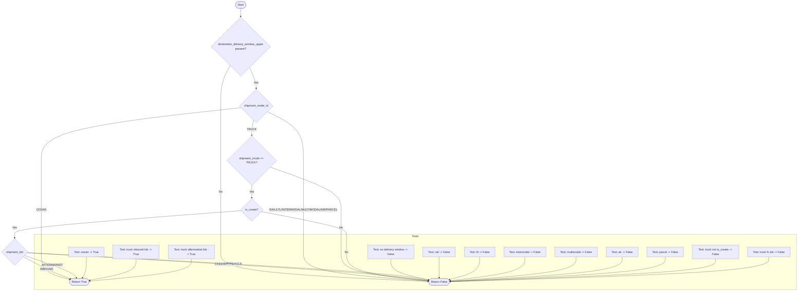

# Diagram: shipment_core/shipment_service/shipment_service/shipments/tests/test_haulaway_eta.py

> Auto-generated by Obscura crawlers

## Mermaid

### SVG

<svg id="container" width="4393.7265625" xmlns="http://www.w3.org/2000/svg" class="flowchart" height="1684.1875" viewBox="0.5 0 4393.7265625 1684.1875" role="graphics-document document" aria-roledescription="flowchart-v2"><g><marker id="container_flowchart-v2-pointEnd" class="marker flowchart-v2" viewBox="0 0 10 10" refX="5" refY="5" markerUnits="userSpaceOnUse" markerWidth="8" markerHeight="8" orient="auto"><path d="M 0 0 L 10 5 L 0 10 z" class="arrowMarkerPath" style="stroke-width: 1; stroke-dasharray: 1, 0;"></path></marker><marker id="container_flowchart-v2-pointStart" class="marker flowchart-v2" viewBox="0 0 10 10" refX="4.5" refY="5" markerUnits="userSpaceOnUse" markerWidth="8" markerHeight="8" orient="auto"><path d="M 0 5 L 10 10 L 10 0 z" class="arrowMarkerPath" style="stroke-width: 1; stroke-dasharray: 1, 0;"></path></marker><marker id="container_flowchart-v2-circleEnd" class="marker flowchart-v2" viewBox="0 0 10 10" refX="11" refY="5" markerUnits="userSpaceOnUse" markerWidth="11" markerHeight="11" orient="auto"><circle cx="5" cy="5" r="5" class="arrowMarkerPath" style="stroke-width: 1; stroke-dasharray: 1, 0;"></circle></marker><marker id="container_flowchart-v2-circleStart" class="marker flowchart-v2" viewBox="0 0 10 10" refX="-1" refY="5" markerUnits="userSpaceOnUse" markerWidth="11" markerHeight="11" orient="auto"><circle cx="5" cy="5" r="5" class="arrowMarkerPath" style="stroke-width: 1; stroke-dasharray: 1, 0;"></circle></marker><marker id="container_flowchart-v2-crossEnd" class="marker cross flowchart-v2" viewBox="0 0 11 11" refX="12" refY="5.2" markerUnits="userSpaceOnUse" markerWidth="11" markerHeight="11" orient="auto"><path d="M 1,1 l 9,9 M 10,1 l -9,9" class="arrowMarkerPath" style="stroke-width: 2; stroke-dasharray: 1, 0;"></path></marker><marker id="container_flowchart-v2-crossStart" class="marker cross flowchart-v2" viewBox="0 0 11 11" refX="-1" refY="5.2" markerUnits="userSpaceOnUse" markerWidth="11" markerHeight="11" orient="auto"><path d="M 1,1 l 9,9 M 10,1 l -9,9" class="arrowMarkerPath" style="stroke-width: 2; stroke-dasharray: 1, 0;"></path></marker><g class="root"><g class="clusters"><g class="cluster" id="Tests" data-look="classic"><rect style="" x="197.078125" y="1359.109375" width="4189.1484375" height="317.078125"></rect><g class="cluster-label" transform="translate(2273.23046875, 1359.109375)"><foreignObject width="36.84375" height="24">

Tests

</foreignObject></g></g></g><g class="edgePaths"><path d="M1324.843,47.5L1324.759,51.583C1324.676,55.667,1324.509,63.833,1324.426,71.417C1324.343,79,1324.343,86,1324.343,89.5L1324.343,93" id="L_Start_A_0" class="edge-thickness-normal edge-pattern-solid edge-thickness-normal edge-pattern-solid flowchart-link" style=";" data-edge="true" data-et="edge" data-id="L_Start_A_0" data-points="W3sieCI6MTMyNC44NDI2NDc1NTI0OTAyLCJ5Ijo0Ny41fSx7IngiOjEzMjQuMzQyNjQ3NTUyNDkwMiwieSI6NzJ9LHsieCI6MTMyNC4zNDI2NDc1NTI0OTAyLCJ5Ijo5N31d" marker-end="url(#container_flowchart-v2-pointEnd)"></path><path d="M1263.165,432.213L1255.858,448.576C1248.552,464.939,1233.94,497.665,1226.634,536.378C1219.328,575.091,1219.328,619.792,1219.328,664.492C1219.328,709.193,1219.328,753.893,1219.328,803.267C1219.328,852.641,1219.328,906.688,1219.328,960.734C1219.328,1014.781,1219.328,1068.828,1219.328,1112.454C1219.328,1156.081,1219.328,1189.286,1219.328,1222.492C1219.328,1255.698,1219.328,1288.904,1219.328,1311.673C1219.328,1334.443,1219.328,1346.776,1219.328,1369.949C1219.328,1393.122,1219.328,1427.135,1219.328,1463.148C1219.328,1499.161,1219.328,1537.174,1403.609,1565.189C1587.89,1593.204,1956.452,1611.221,2140.732,1620.229L2325.013,1629.237" id="L_A_FalseNode_0" class="edge-thickness-normal edge-pattern-solid edge-thickness-normal edge-pattern-solid flowchart-link" style=";" data-edge="true" data-et="edge" data-id="L_A_FalseNode_0" data-points="W3sieCI6MTI2My4xNjQ1NjI4MjM5MzQ4LCJ5Ijo0MzIuMjEyNTQwMjcxNDQ0NTR9LHsieCI6MTIxOS4zMjgxMjUsInkiOjUzMC4zOTA2MjV9LHsieCI6MTIxOS4zMjgxMjUsInkiOjY2NC40OTIxODc1fSx7IngiOjEyMTkuMzI4MTI1LCJ5Ijo3OTguNTkzNzV9LHsieCI6MTIxOS4zMjgxMjUsInkiOjk2MC43MzQzNzV9LHsieCI6MTIxOS4zMjgxMjUsInkiOjExMjIuODc1fSx7IngiOjEyMTkuMzI4MTI1LCJ5IjoxMjIyLjQ5MjE4NzV9LHsieCI6MTIxOS4zMjgxMjUsInkiOjEzMjIuMTA5Mzc1fSx7IngiOjEyMTkuMzI4MTI1LCJ5IjoxMzU5LjEwOTM3NX0seyJ4IjoxMjE5LjMyODEyNSwieSI6MTQ2MS4xNDg0Mzc1fSx7IngiOjEyMTkuMzI4MTI1LCJ5IjoxNTc1LjE4NzV9LHsieCI6MjMyOS4wMDg1OTM4MjE3NDY3LCJ5IjoxNjI5LjQzMjQzNzQ1ODY2OTd9XQ==" marker-end="url(#container_flowchart-v2-pointEnd)"></path><path d="M1374.68,443.054L1379.635,457.61C1384.591,472.166,1394.502,501.278,1399.457,521.334C1404.413,541.391,1404.413,552.391,1404.413,557.891L1404.413,563.391" id="L_A_B_0" class="edge-thickness-normal edge-pattern-solid edge-thickness-normal edge-pattern-solid flowchart-link" style=";" data-edge="true" data-et="edge" data-id="L_A_B_0" data-points="W3sieCI6MTM3NC42Nzk3NTgwNjk3MjUzLCJ5Ijo0NDMuMDUzNTE0NDgyNzY1MTR9LHsieCI6MTQwNC40MTI5NjAwNTI0OTAyLCJ5Ijo1MzAuMzkwNjI1fSx7IngiOjE0MDQuNDEyOTYwMDUyNDksInkiOjU2Ny4zOTA2MjQ5OTk5OTk5fV0=" marker-end="url(#container_flowchart-v2-pointEnd)"></path><path d="M1317.317,674.498L1137.277,695.18C957.237,715.863,597.158,757.228,417.118,804.935C237.078,852.641,237.078,906.688,237.078,960.734C237.078,1014.781,237.078,1068.828,237.078,1112.454C237.078,1156.081,237.078,1189.286,237.078,1222.492C237.078,1255.698,237.078,1288.904,237.078,1311.673C237.078,1334.443,237.078,1346.776,237.078,1369.949C237.078,1393.122,237.078,1427.135,237.078,1463.148C237.078,1499.161,237.078,1537.174,260.745,1563.128C284.413,1589.081,331.747,1602.974,355.414,1609.921L379.082,1616.868" id="L_B_TrueNode_0" class="edge-thickness-normal edge-pattern-solid edge-thickness-normal edge-pattern-solid flowchart-link" style=";" data-edge="true" data-et="edge" data-id="L_B_TrueNode_0" data-points="W3sieCI6MTMxNy4zMTY4NTg2NTQ0OTI1LCJ5Ijo2NzQuNDk3NjQ4NjAyMDAyM30seyJ4IjoyMzcuMDc4MTI1LCJ5Ijo3OTguNTkzNzV9LHsieCI6MjM3LjA3ODEyNSwieSI6OTYwLjczNDM3NX0seyJ4IjoyMzcuMDc4MTI1LCJ5IjoxMTIyLjg3NX0seyJ4IjoyMzcuMDc4MTI1LCJ5IjoxMjIyLjQ5MjE4NzV9LHsieCI6MjM3LjA3ODEyNSwieSI6MTMyMi4xMDkzNzV9LHsieCI6MjM3LjA3ODEyNSwieSI6MTM1OS4xMDkzNzV9LHsieCI6MjM3LjA3ODEyNSwieSI6MTQ2MS4xNDg0Mzc1fSx7IngiOjIzNy4wNzgxMjUsInkiOjE1NzUuMTg3NX0seyJ4IjozODIuOTE5Njc1NTU5OTA5NiwieSI6MTYxNy45OTQyMDUzMTg5NDh9XQ==" marker-end="url(#container_flowchart-v2-pointEnd)"></path><path d="M1467.693,698.313L1498.964,715.027C1530.236,731.74,1592.778,765.167,1624.049,808.904C1655.32,852.641,1655.32,906.688,1655.32,960.734C1655.32,1014.781,1655.32,1068.828,1655.32,1112.454C1655.32,1156.081,1655.32,1189.286,1655.32,1222.492C1655.32,1255.698,1655.32,1288.904,1655.32,1311.673C1655.32,1334.443,1655.32,1346.776,1655.32,1369.949C1655.32,1393.122,1655.32,1427.135,1655.32,1463.148C1655.32,1499.161,1655.32,1537.174,1766.986,1564.899C1878.652,1592.625,2101.984,1610.062,2213.65,1618.78L2325.316,1627.499" id="L_B_FalseNode_0" class="edge-thickness-normal edge-pattern-solid edge-thickness-normal edge-pattern-solid flowchart-link" style=";" data-edge="true" data-et="edge" data-id="L_B_FalseNode_0" data-points="W3sieCI6MTQ2Ny42OTMzMDI0NTM2ODYsInkiOjY5OC4zMTM0MDc1OTg4MDM5fSx7IngiOjE2NTUuMzIwMzEyNSwieSI6Nzk4LjU5Mzc1fSx7IngiOjE2NTUuMzIwMzEyNSwieSI6OTYwLjczNDM3NX0seyJ4IjoxNjU1LjMyMDMxMjUsInkiOjExMjIuODc1fSx7IngiOjE2NTUuMzIwMzEyNSwieSI6MTIyMi40OTIxODc1fSx7IngiOjE2NTUuMzIwMzEyNSwieSI6MTMyMi4xMDkzNzV9LHsieCI6MTY1NS4zMjAzMTI1LCJ5IjoxMzU5LjEwOTM3NX0seyJ4IjoxNjU1LjMyMDMxMjUsInkiOjE0NjEuMTQ4NDM3NX0seyJ4IjoxNjU1LjMyMDMxMjUsInkiOjE1NzUuMTg3NX0seyJ4IjoyMzI5LjMwMzY2NzMwNzc4NCwieSI6MTYyNy44MDk5MTk2MDAzMDI3fV0=" marker-end="url(#container_flowchart-v2-pointEnd)"></path><path d="M1389.184,746.365L1387.565,755.07C1385.945,763.774,1382.707,781.184,1381.088,795.389C1379.469,809.594,1379.469,820.594,1379.469,826.094L1379.469,831.594" id="L_B_C_0" class="edge-thickness-normal edge-pattern-solid edge-thickness-normal edge-pattern-solid flowchart-link" style=";" data-edge="true" data-et="edge" data-id="L_B_C_0" data-points="W3sieCI6MTM4OS4xODM4NzM5MDYwNzUyLCJ5Ijo3NDYuMzY0NjYzODUzNTg0OH0seyJ4IjoxMzc5LjQ2ODc1LCJ5Ijo3OTguNTkzNzV9LHsieCI6MTM3OS40Njg3NSwieSI6ODM1LjU5Mzc1fV0=" marker-end="url(#container_flowchart-v2-pointEnd)"></path><path d="M1379.469,1085.875L1379.469,1092.042C1379.469,1098.208,1379.469,1110.542,1379.469,1122.208C1379.469,1133.875,1379.469,1144.875,1379.469,1150.375L1379.469,1155.875" id="L_C_D_0" class="edge-thickness-normal edge-pattern-solid edge-thickness-normal edge-pattern-solid flowchart-link" style=";" data-edge="true" data-et="edge" data-id="L_C_D_0" data-points="W3sieCI6MTM3OS40Njg3NSwieSI6MTA4NS44NzV9LHsieCI6MTM3OS40Njg3NSwieSI6MTEyMi44NzV9LHsieCI6MTM3OS40Njg3NSwieSI6MTE1OS44NzV9XQ==" marker-end="url(#container_flowchart-v2-pointEnd)"></path><path d="M1472.718,992.626L1536.19,1014.334C1599.663,1036.042,1726.609,1079.459,1790.082,1117.77C1853.555,1156.081,1853.555,1189.286,1853.555,1222.492C1853.555,1255.698,1853.555,1288.904,1853.555,1311.673C1853.555,1334.443,1853.555,1346.776,1853.555,1369.949C1853.555,1393.122,1853.555,1427.135,1853.555,1463.148C1853.555,1499.161,1853.555,1537.174,1932.257,1564.616C2010.96,1592.058,2168.365,1608.929,2247.068,1617.364L2325.771,1625.799" id="L_C_FalseNode_0" class="edge-thickness-normal edge-pattern-solid edge-thickness-normal edge-pattern-solid flowchart-link" style=";" data-edge="true" data-et="edge" data-id="L_C_FalseNode_0" data-points="W3sieCI6MTQ3Mi43MTc2MjM5Mzc4MjkzLCJ5Ijo5OTIuNjI2MTI2MDYyMTcwOH0seyJ4IjoxODUzLjU1NDY4NzUsInkiOjExMjIuODc1fSx7IngiOjE4NTMuNTU0Njg3NSwieSI6MTIyMi40OTIxODc1fSx7IngiOjE4NTMuNTU0Njg3NSwieSI6MTMyMi4xMDkzNzV9LHsieCI6MTg1My41NTQ2ODc1LCJ5IjoxMzU5LjEwOTM3NX0seyJ4IjoxODUzLjU1NDY4NzUsInkiOjE0NjEuMTQ4NDM3NX0seyJ4IjoxODUzLjU1NDY4NzUsInkiOjE1NzUuMTg3NX0seyJ4IjoyMzI5Ljc0ODA2NDk4Njg1NzYsInkiOjE2MjYuMjI1Mzc5MDk4MzgwNX1d" marker-end="url(#container_flowchart-v2-pointEnd)"></path><path d="M1431.756,1232.822L1507.079,1247.703C1582.402,1262.585,1733.049,1292.347,1808.372,1313.395C1883.695,1334.443,1883.695,1346.776,1883.695,1369.949C1883.695,1393.122,1883.695,1427.135,1883.695,1463.148C1883.695,1499.161,1883.695,1537.174,1957.394,1564.554C2031.093,1591.935,2178.491,1608.682,2252.189,1617.055L2325.888,1625.429" id="L_D_FalseNode_0" class="edge-thickness-normal edge-pattern-solid edge-thickness-normal edge-pattern-solid flowchart-link" style=";" data-edge="true" data-et="edge" data-id="L_D_FalseNode_0" data-points="W3sieCI6MTQzMS43NTU4Njc2NjMzNzQsInkiOjEyMzIuODIyMjU3MzM2NjI2fSx7IngiOjE4ODMuNjk1MzEyNSwieSI6MTMyMi4xMDkzNzV9LHsieCI6MTg4My42OTUzMTI1LCJ5IjoxMzU5LjEwOTM3NX0seyJ4IjoxODgzLjY5NTMxMjUsInkiOjE0NjEuMTQ4NDM3NX0seyJ4IjoxODgzLjY5NTMxMjUsInkiOjE1NzUuMTg3NX0seyJ4IjoyMzI5Ljg2MjcxMDY3OTA5MTQsInkiOjE2MjUuODgwMDg0NTM5NjgyN31d" marker-end="url(#container_flowchart-v2-pointEnd)"></path><path d="M1321.326,1226.967L1115.278,1242.824C909.23,1258.681,497.135,1290.395,291.087,1312.419C85.039,1334.443,85.039,1346.776,85.039,1356.443C85.039,1366.109,85.039,1373.109,85.039,1376.609L85.039,1380.109" id="L_D_E_0" class="edge-thickness-normal edge-pattern-solid edge-thickness-normal edge-pattern-solid flowchart-link" style=";" data-edge="true" data-et="edge" data-id="L_D_E_0" data-points="W3sieCI6MTMyMS4zMjYxMjM3MzU5MDU0LCJ5IjoxMjI2Ljk2Njc0ODczNTkwNTR9LHsieCI6ODUuMDM5MDYyNSwieSI6MTMyMi4xMDkzNzV9LHsieCI6ODUuMDM5MDYyNSwieSI6MTM1OS4xMDkzNzV9LHsieCI6ODUuMDM5MDYyNSwieSI6MTM4NC4xMDkzNzV9XQ==" marker-end="url(#container_flowchart-v2-pointEnd)"></path><path d="M157.683,1465.544L459.695,1483.818C761.708,1502.092,1365.733,1538.64,1727.181,1565.065C2088.629,1591.49,2207.5,1607.792,2266.936,1615.943L2326.372,1624.095" id="L_E_FalseNode_0" class="edge-thickness-normal edge-pattern-solid edge-thickness-normal edge-pattern-solid flowchart-link" style=";" data-edge="true" data-et="edge" data-id="L_E_FalseNode_0" data-points="W3sieCI6MTU3LjY4MjY2Mzc3NDgxNTIsInkiOjE0NjUuNTQzODk4NzI1MTg0OH0seyJ4IjoxOTY5Ljc1NzgxMjUsInkiOjE1NzUuMTg3NX0seyJ4IjoyMzMwLjMzNDQyMDI2MjEwOCwieSI6MTYyNC42MzgxMDAxNjA0NDg2fV0=" marker-end="url(#container_flowchart-v2-pointEnd)"></path><path d="M134.642,1488.584L160.738,1503.018C186.834,1517.452,239.027,1546.32,280.632,1567.062C322.238,1587.805,353.257,1600.423,368.767,1606.731L384.276,1613.04" id="L_E_TrueNode_0" class="edge-thickness-normal edge-pattern-solid edge-thickness-normal edge-pattern-solid flowchart-link" style=";" data-edge="true" data-et="edge" data-id="L_E_TrueNode_0" data-points="W3sieCI6MTM0LjY0MjMwOTc1Mzc2OTM4LCJ5IjoxNDg4LjU4NDI1Mjc0NjIzMDV9LHsieCI6MjkxLjIxODc1LCJ5IjoxNTc1LjE4NzV9LHsieCI6Mzg3Ljk4MTYyNTI0ODE3MTQ0LCJ5IjoxNjE0LjU0NzI4ODY1NzI1OH1d" marker-end="url(#container_flowchart-v2-pointEnd)"></path><path d="M141.402,1481.825L183.819,1497.385C226.237,1512.946,311.071,1544.067,357.067,1565.313C403.063,1586.559,410.219,1597.931,413.797,1603.616L417.375,1609.302" id="L_E_TrueNode_2" class="edge-thickness-normal edge-pattern-solid edge-thickness-normal edge-pattern-solid flowchart-link" style=";" data-edge="true" data-et="edge" data-id="L_E_TrueNode_2" data-points="W3sieCI6MTQxLjQwMTg4NzY4MDg3NjI5LCJ5IjoxNDgxLjgyNDY3NDgxOTEyMzZ9LHsieCI6Mzk1LjkwNjI1LCJ5IjoxNTc1LjE4NzV9LHsieCI6NDE5LjUwNTY2OTI0Nzc4NzY0LCJ5IjoxNjEyLjY4NzV9XQ==" marker-end="url(#container_flowchart-v2-pointEnd)"></path><path d="M157.904,1465.323L477.507,1483.634C797.11,1501.944,1436.317,1538.566,1797.93,1564.604C2159.544,1590.643,2243.564,1606.098,2285.574,1613.826L2327.584,1621.553" id="L_E_FalseNode_2" class="edge-thickness-normal edge-pattern-solid edge-thickness-normal edge-pattern-solid flowchart-link" style=";" data-edge="true" data-et="edge" data-id="L_E_FalseNode_2" data-points="W3sieCI6MTU3LjkwMzU2MzUyNTk3MDg0LCJ5IjoxNDY1LjMyMjk5ODk3NDAyOTF9LHsieCI6MjA3NS41MjM0Mzc1LCJ5IjoxNTc1LjE4NzV9LHsieCI6MjMzMS41MTc4NTg5NTA1NzcsInkiOjE2MjIuMjc2OTAxMzA5Mzk0NH1d" marker-end="url(#container_flowchart-v2-pointEnd)"></path><path d="M2115.227,1500.148L2115.227,1512.655C2115.227,1525.161,2115.227,1550.174,2150.76,1570.178C2186.293,1590.181,2257.36,1605.174,2292.893,1612.67L2328.426,1620.167" id="L_T1_FalseNode_0" class="edge-thickness-normal edge-pattern-solid edge-thickness-normal edge-pattern-solid flowchart-link" style=";" data-edge="true" data-et="edge" data-id="L_T1_FalseNode_0" data-points="W3sieCI6MjExNS4yMjY1NjI1LCJ5IjoxNTAwLjE0ODQzNzV9LHsieCI6MjExNS4yMjY1NjI1LCJ5IjoxNTc1LjE4NzV9LHsieCI6MjMzMi4zNDAzNDUyODk1MDM2LCJ5IjoxNjIwLjk5MjM0MzQ1OTI0MjZ9XQ==" marker-end="url(#container_flowchart-v2-pointEnd)"></path><path d="M2385.367,1488.148L2385.367,1502.655C2385.367,1517.161,2385.367,1546.174,2385.442,1566.264C2385.516,1586.354,2385.665,1597.521,2385.739,1603.104L2385.814,1608.688" id="L_T2_FalseNode_0" class="edge-thickness-normal edge-pattern-solid edge-thickness-normal edge-pattern-solid flowchart-link" style=";" data-edge="true" data-et="edge" data-id="L_T2_FalseNode_0" data-points="W3sieCI6MjM4NS4zNjcxODc1LCJ5IjoxNDg4LjE0ODQzNzV9LHsieCI6MjM4NS4zNjcxODc1LCJ5IjoxNTc1LjE4NzV9LHsieCI6MjM4NS44NjcxODc1LCJ5IjoxNjEyLjY4NzV9XQ==" marker-end="url(#container_flowchart-v2-pointEnd)"></path><path d="M2611.383,1488.148L2611.383,1502.655C2611.383,1517.161,2611.383,1546.174,2583.122,1567.847C2554.862,1589.52,2498.341,1603.853,2470.081,1611.02L2441.82,1618.186" id="L_T3_FalseNode_0" class="edge-thickness-normal edge-pattern-solid edge-thickness-normal edge-pattern-solid flowchart-link" style=";" data-edge="true" data-et="edge" data-id="L_T3_FalseNode_0" data-points="W3sieCI6MjYxMS4zODI4MTI1LCJ5IjoxNDg4LjE0ODQzNzV9LHsieCI6MjYxMS4zODI4MTI1LCJ5IjoxNTc1LjE4NzV9LHsieCI6MjQzNy45NDMyMjIzNTgwNTk4LCJ5IjoxNjE5LjE2OTM5MTMyMDY1MzJ9XQ==" marker-end="url(#container_flowchart-v2-pointEnd)"></path><path d="M2865.727,1488.148L2865.727,1502.655C2865.727,1517.161,2865.727,1546.174,2795.731,1569.006C2725.736,1591.838,2585.745,1608.488,2515.75,1616.813L2445.754,1625.138" id="L_T4_FalseNode_0" class="edge-thickness-normal edge-pattern-solid edge-thickness-normal edge-pattern-solid flowchart-link" style=";" data-edge="true" data-et="edge" data-id="L_T4_FalseNode_0" data-points="W3sieCI6Mjg2NS43MjY1NjI1LCJ5IjoxNDg4LjE0ODQzNzV9LHsieCI6Mjg2NS43MjY1NjI1LCJ5IjoxNTc1LjE4NzV9LHsieCI6MjQ0MS43ODIyMzg0ODQzMDcsInkiOjE2MjUuNjEwNzU2NTM0NTE5Nn1d" marker-end="url(#container_flowchart-v2-pointEnd)"></path><path d="M3154.5,1488.148L3154.5,1502.655C3154.5,1517.161,3154.5,1546.174,3036.494,1569.439C2918.488,1592.703,2682.477,1610.218,2564.471,1618.975L2446.465,1627.733" id="L_T5_FalseNode_0" class="edge-thickness-normal edge-pattern-solid edge-thickness-normal edge-pattern-solid flowchart-link" style=";" data-edge="true" data-et="edge" data-id="L_T5_FalseNode_0" data-points="W3sieCI6MzE1NC41LCJ5IjoxNDg4LjE0ODQzNzV9LHsieCI6MzE1NC41LCJ5IjoxNTc1LjE4NzV9LHsieCI6MjQ0Mi40NzU5NzQzMDQzNTE0LCJ5IjoxNjI4LjAyOTA1NTA1NzI0N31d" marker-end="url(#container_flowchart-v2-pointEnd)"></path><path d="M3412.883,1488.148L3412.883,1502.655C3412.883,1517.161,3412.883,1546.174,3251.848,1569.623C3090.812,1593.072,2768.742,1610.957,2607.707,1619.899L2446.671,1628.842" id="L_T6_FalseNode_0" class="edge-thickness-normal edge-pattern-solid edge-thickness-normal edge-pattern-solid flowchart-link" style=";" data-edge="true" data-et="edge" data-id="L_T6_FalseNode_0" data-points="W3sieCI6MzQxMi44ODI4MTI1LCJ5IjoxNDg4LjE0ODQzNzV9LHsieCI6MzQxMi44ODI4MTI1LCJ5IjoxNTc1LjE4NzV9LHsieCI6MjQ0Mi42Nzc0NjYxODg3MjU3LCJ5IjoxNjI5LjA2MzY3MzI5ODE3OTN9XQ==" marker-end="url(#container_flowchart-v2-pointEnd)"></path><path d="M3651.578,1488.148L3651.578,1502.655C3651.578,1517.161,3651.578,1546.174,3450.773,1569.728C3249.969,1593.281,2848.359,1611.375,2647.554,1620.422L2446.75,1629.469" id="L_T7_FalseNode_0" class="edge-thickness-normal edge-pattern-solid edge-thickness-normal edge-pattern-solid flowchart-link" style=";" data-edge="true" data-et="edge" data-id="L_T7_FalseNode_0" data-points="W3sieCI6MzY1MS41NzgxMjUsInkiOjE0ODguMTQ4NDM3NX0seyJ4IjozNjUxLjU3ODEyNSwieSI6MTU3NS4xODc1fSx7IngiOjI0NDIuNzUzNzIwMTI3MTEyNSwieSI6MTYyOS42NDkxNDc5NzgwMzk1fV0=" marker-end="url(#container_flowchart-v2-pointEnd)"></path><path d="M466.453,1488.148L466.453,1502.655C466.453,1517.161,466.453,1546.174,463.031,1566.36C459.608,1586.546,452.763,1597.904,449.341,1603.583L445.918,1609.262" id="L_T8_TrueNode_0" class="edge-thickness-normal edge-pattern-solid edge-thickness-normal edge-pattern-solid flowchart-link" style=";" data-edge="true" data-et="edge" data-id="L_T8_TrueNode_0" data-points="W3sieCI6NDY2LjQ1MzEyNSwieSI6MTQ4OC4xNDg0Mzc1fSx7IngiOjQ2Ni40NTMxMjUsInkiOjE1NzUuMTg3NX0seyJ4Ijo0NDMuODUzNzA1NzUyMjEyMzYsInkiOjE2MTIuNjg3NX1d" marker-end="url(#container_flowchart-v2-pointEnd)"></path><path d="M3932.195,1500.148L3932.195,1512.655C3932.195,1525.161,3932.195,1550.174,3684.631,1571.81C3437.067,1593.445,2941.939,1611.703,2694.374,1620.831L2446.81,1629.96" id="L_T9_FalseNode_0" class="edge-thickness-normal edge-pattern-solid edge-thickness-normal edge-pattern-solid flowchart-link" style=";" data-edge="true" data-et="edge" data-id="L_T9_FalseNode_0" data-points="W3sieCI6MzkzMi4xOTUzMTI1LCJ5IjoxNTAwLjE0ODQzNzV9LHsieCI6MzkzMi4xOTUzMTI1LCJ5IjoxNTc1LjE4NzV9LHsieCI6MjQ0Mi44MTI4MTU5NDk5MDgsInkiOjE2MzAuMTA3NDgzNTA5ODU1fV0=" marker-end="url(#container_flowchart-v2-pointEnd)"></path><path d="M4231.711,1488.148L4231.711,1502.655C4231.711,1517.161,4231.711,1546.174,3934.233,1569.87C3636.756,1593.565,3041.801,1611.943,2744.323,1621.132L2446.846,1630.32" id="L_T10_FalseNode_0" class="edge-thickness-normal edge-pattern-solid edge-thickness-normal edge-pattern-solid flowchart-link" style=";" data-edge="true" data-et="edge" data-id="L_T10_FalseNode_0" data-points="W3sieCI6NDIzMS43MTA5Mzc1LCJ5IjoxNDg4LjE0ODQzNzV9LHsieCI6NDIzMS43MTA5Mzc1LCJ5IjoxNTc1LjE4NzV9LHsieCI6MjQ0Mi44NDc4NDY5NDEyODYsInkiOjE2MzAuNDQzODMzNzYzMTgzfV0=" marker-end="url(#container_flowchart-v2-pointEnd)"></path><path d="M744.328,1500.148L744.328,1512.655C744.328,1525.161,744.328,1550.174,701.616,1570.484C658.903,1590.794,573.478,1606.401,530.765,1614.204L488.053,1622.007" id="L_T11_TrueNode_0" class="edge-thickness-normal edge-pattern-solid edge-thickness-normal edge-pattern-solid flowchart-link" style=";" data-edge="true" data-et="edge" data-id="L_T11_TrueNode_0" data-points="W3sieCI6NzQ0LjMyODEyNSwieSI6MTUwMC4xNDg0Mzc1fSx7IngiOjc0NC4zMjgxMjUsInkiOjE1NzUuMTg3NX0seyJ4Ijo0ODQuMTE4MDM1NDE5NTU1LCJ5IjoxNjIyLjcyNjI3ODczMDI3ODl9XQ==" marker-end="url(#container_flowchart-v2-pointEnd)"></path><path d="M1054.328,1500.148L1054.328,1512.655C1054.328,1525.161,1054.328,1550.174,960.26,1571.3C866.192,1592.426,678.056,1609.665,583.988,1618.284L489.92,1626.903" id="L_T12_TrueNode_0" class="edge-thickness-normal edge-pattern-solid edge-thickness-normal edge-pattern-solid flowchart-link" style=";" data-edge="true" data-et="edge" data-id="L_T12_TrueNode_0" data-points="W3sieCI6MTA1NC4zMjgxMjUsInkiOjE1MDAuMTQ4NDM3NX0seyJ4IjoxMDU0LjMyODEyNSwieSI6MTU3NS4xODc1fSx7IngiOjQ4NS45MzcwNTAyNDMyNzk3LCJ5IjoxNjI3LjI2ODA2MDU2ODY5MjR9XQ==" marker-end="url(#container_flowchart-v2-pointEnd)"></path></g><g class="edgeLabels"><g class="edgeLabel"><g class="label" data-id="L_Start_A_0" transform="translate(0, 0)"><foreignObject width="0" height="0">

</foreignObject></g></g><g class="edgeLabel" transform="translate(1219.328125, 1122.875)"><g class="label" data-id="L_A_FalseNode_0" transform="translate(-10.140625, -12)"><foreignObject width="20.28125" height="24">

No

</foreignObject></g></g><g class="edgeLabel" transform="translate(1404.4129600524902, 530.390625)"><g class="label" data-id="L_A_B_0" transform="translate(-12.03125, -12)"><foreignObject width="24.0625" height="24">

Yes

</foreignObject></g></g><g class="edgeLabel" transform="translate(237.078125, 1222.4921875)"><g class="label" data-id="L_B_TrueNode_0" transform="translate(-24.3515625, -12)"><foreignObject width="48.703125" height="24">

OCEAN

</foreignObject></g></g><g class="edgeLabel" transform="translate(1655.3203125, 1222.4921875)"><g class="label" data-id="L_B_FalseNode_0" transform="translate(-178.234375, -12)"><foreignObject width="356.46875" height="24">

RAIL/LTL/INTERMODAL/MULTIMODAL/AIR/PARCEL

</foreignObject></g></g><g class="edgeLabel" transform="translate(1379.46875, 798.59375)"><g class="label" data-id="L_B_C_0" transform="translate(-23.4140625, -12)"><foreignObject width="46.828125" height="24">

TRUCK

</foreignObject></g></g><g class="edgeLabel" transform="translate(1379.46875, 1122.875)"><g class="label" data-id="L_C_D_0" transform="translate(-12.03125, -12)"><foreignObject width="24.0625" height="24">

Yes

</foreignObject></g></g><g class="edgeLabel" transform="translate(1853.5546875, 1322.109375)"><g class="label" data-id="L_C_FalseNode_0" transform="translate(-10.140625, -12)"><foreignObject width="20.28125" height="24">

No

</foreignObject></g></g><g class="edgeLabel" transform="translate(1883.6953125, 1461.1484375)"><g class="label" data-id="L_D_FalseNode_0" transform="translate(-10.140625, -12)"><foreignObject width="20.28125" height="24">

No

</foreignObject></g></g><g class="edgeLabel" transform="translate(85.0390625, 1322.109375)"><g class="label" data-id="L_D_E_0" transform="translate(-12.03125, -12)"><foreignObject width="24.0625" height="24">

Yes

</foreignObject></g></g><g class="edgeLabel" transform="translate(1245.36389, 1531.35645)"><g class="label" data-id="L_E_FalseNode_0" transform="translate(-66.0625, -12)"><foreignObject width="132.125" height="24">

FINISHED_VEHICLE

</foreignObject></g></g><g class="edgeLabel" transform="translate(258.63597, 1557.1658)"><g class="label" data-id="L_E_TrueNode_0" transform="translate(-34.140625, -12)"><foreignObject width="68.28125" height="24">

INBOUND

</foreignObject></g></g><g class="edgeLabel" transform="translate(289.45267, 1536.13588)"><g class="label" data-id="L_E_TrueNode_2" transform="translate(-50.546875, -12)"><foreignObject width="101.09375" height="24">

AFTERMARKET

</foreignObject></g></g><g class="edgeLabel" transform="translate(1246.64512, 1527.69931)"><g class="label" data-id="L_E_FalseNode_2" transform="translate(-19.703125, -12)"><foreignObject width="39.40625" height="24">

other

</foreignObject></g></g><g class="edgeLabel"><g class="label" data-id="L_T1_FalseNode_0" transform="translate(0, 0)"><foreignObject width="0" height="0">

</foreignObject></g></g><g class="edgeLabel"><g class="label" data-id="L_T2_FalseNode_0" transform="translate(0, 0)"><foreignObject width="0" height="0">

</foreignObject></g></g><g class="edgeLabel"><g class="label" data-id="L_T3_FalseNode_0" transform="translate(0, 0)"><foreignObject width="0" height="0">

</foreignObject></g></g><g class="edgeLabel"><g class="label" data-id="L_T4_FalseNode_0" transform="translate(0, 0)"><foreignObject width="0" height="0">

</foreignObject></g></g><g class="edgeLabel"><g class="label" data-id="L_T5_FalseNode_0" transform="translate(0, 0)"><foreignObject width="0" height="0">

</foreignObject></g></g><g class="edgeLabel"><g class="label" data-id="L_T6_FalseNode_0" transform="translate(0, 0)"><foreignObject width="0" height="0">

</foreignObject></g></g><g class="edgeLabel"><g class="label" data-id="L_T7_FalseNode_0" transform="translate(0, 0)"><foreignObject width="0" height="0">

</foreignObject></g></g><g class="edgeLabel"><g class="label" data-id="L_T8_TrueNode_0" transform="translate(0, 0)"><foreignObject width="0" height="0">

</foreignObject></g></g><g class="edgeLabel"><g class="label" data-id="L_T9_FalseNode_0" transform="translate(0, 0)"><foreignObject width="0" height="0">

</foreignObject></g></g><g class="edgeLabel"><g class="label" data-id="L_T10_FalseNode_0" transform="translate(0, 0)"><foreignObject width="0" height="0">

</foreignObject></g></g><g class="edgeLabel"><g class="label" data-id="L_T11_TrueNode_0" transform="translate(0, 0)"><foreignObject width="0" height="0">

</foreignObject></g></g><g class="edgeLabel"><g class="label" data-id="L_T12_TrueNode_0" transform="translate(0, 0)"><foreignObject width="0" height="0">

</foreignObject></g></g></g><g class="nodes"><g class="node default" id="flowchart-Start-0" transform="translate(1324.3426475524902, 27.5)"><g class="basic label-container outer-path"><path d="M-10.3984375 -19.5 C-2.7104346118747396 -19.5, 4.977568276250521 -19.5, 10.3984375 -19.5 C10.3984375 -19.5, 10.398437499999998 -19.5, 10.398437499999998 -19.5 C10.714508084317954 -19.489864231554993, 11.030578668635911 -19.47972846310999, 11.6478067896239 -19.45993515863156 C12.000383155925055 -19.425922540609605, 12.352959522226211 -19.39190992258765, 12.892042152847864 -19.3399052695533 C13.318188627392 -19.27100921236427, 13.744335101936137 -19.202113155175244, 14.126030759676757 -19.140403561325776 C14.55466522328413 -19.04257054210867, 14.983299686891502 -18.944737522891565, 15.34470188623539 -18.862249829261074 C15.810990749614751 -18.72385774221027, 16.27727961299411 -18.585465655159467, 16.543047751460602 -18.50658706670804 C16.78530475269016 -18.41743425085639, 17.027561753919713 -18.328281435004744, 17.716144095147794 -18.074876768247425 C18.04735537895254 -17.928259357940714, 18.378566662757283 -17.781641947634004, 18.85917041279238 -17.568892924097174 C19.090683699324583 -17.448112590804662, 19.322196985856788 -17.327332257512147, 19.967429764076783 -16.990714730406097 C20.264868135969614 -16.81040584142277, 20.56230650786245 -16.63009695243944, 21.036368073605697 -16.342718045390892 C21.34198386583749 -16.12953369862441, 21.647599658069282 -15.916349351857932, 22.061592844578712 -15.627565626425154 C22.342562580340402 -15.403499739073883, 22.623532316102096 -15.179433851722614, 23.03889120850187 -14.848196188198123 C23.236560009112473 -14.668678613513439, 23.43422880972308 -14.489161038828755, 23.964247236767985 -14.007812326905688 C24.282072079138743 -13.67963208325304, 24.5998969215095 -13.351451839600394, 24.833858442968648 -13.10986736009568 C25.145324938691697 -12.744001091273713, 25.456791434414747 -12.378134822451743, 25.644151408126582 -12.158051136245305 C25.836046020689565 -11.90092983736975, 26.02794063325255 -11.643808538494195, 26.391796464640635 -11.156274872382312 C26.625379475199576 -10.797428642343, 26.858962485758518 -10.438582412303688, 27.073721378604247 -10.108655082055241 C27.221632775847244 -9.846023418597209, 27.36954417309024 -9.583391755139175, 27.6871239742735 -9.019496659696287 C27.828492814372016 -8.725941238423108, 27.96986165447053 -8.432385817149928, 28.22948364880834 -7.893275190886684 C28.37413452161445 -7.535984738421217, 28.518785394420565 -7.178694285955748, 28.698571729970325 -6.734618561215508 C28.833600887949903 -6.327932251355689, 28.96863004592948 -5.921245941495869, 29.09246063421488 -5.548287939305138 C29.172816785751433 -5.241855106919885, 29.253172937287985 -4.935422274534632, 29.40953178754556 -4.339158212148133 C29.503715807794343 -3.8555431739703603, 29.597899828043126 -3.3719281357925874, 29.648482276581777 -3.1121979531509023 C29.693692023452634 -2.761560084094839, 29.738901770323494 -2.4109222150387755, 29.808330202509367 -1.872449005199798 C29.838614855411965 -1.4007410909099722, 29.868899508314566 -0.9290331766201465, 29.888418715913414 -0.6250057626472757 C29.888418715913414 -0.2076708501716183, 29.888418715913414 0.2096640623040391, 29.888418715913414 0.625005762647271 C29.870878412196934 0.8982101513097822, 29.853338108480454 1.1714145399722935, 29.808330202509367 1.8724490051997846 C29.765340706091443 2.205867050180929, 29.722351209673523 2.5392850951620733, 29.648482276581777 3.1121979531508885 C29.577037228716424 3.4790531740232598, 29.505592180851075 3.8459083948956305, 29.40953178754556 4.339158212148129 C29.322937927009527 4.669378132388583, 29.236344066473496 4.999598052629036, 29.092460634214884 5.548287939305125 C28.99900769871366 5.829753291331605, 28.905554763212432 6.111218643358085, 28.69857172997033 6.734618561215495 C28.536397535636834 7.135191956643979, 28.374223341303335 7.535765352072464, 28.229483648808344 7.893275190886679 C28.11731191973587 8.126202186396187, 28.005140190663397 8.359129181905693, 27.687123974273504 9.019496659696284 C27.505679000122875 9.341670584596693, 27.324234025972242 9.663844509497101, 27.07372137860425 10.108655082055236 C26.83336446517714 10.477907845947666, 26.59300755175003 10.847160609840095, 26.39179646464064 11.156274872382301 C26.21853225524385 11.388433128279805, 26.045268045847056 11.62059138417731, 25.644151408126582 12.158051136245302 C25.4136539512924 12.428806564719578, 25.183156494458217 12.699561993193853, 24.83385844296866 13.10986736009567 C24.566484174888053 13.385953243724552, 24.299109906807452 13.662039127353435, 23.96424723676799 14.007812326905684 C23.709941291447194 14.238766257879432, 23.4556353461264 14.469720188853179, 23.038891208501887 14.848196188198111 C22.751794182508025 15.077148426455498, 22.46469715651416 15.306100664712883, 22.061592844578715 15.627565626425152 C21.851788088850668 15.773916341719545, 21.641983333122617 15.920267057013938, 21.036368073605708 16.34271804539089 C20.705962968745876 16.543011561632838, 20.37555786388604 16.743305077874787, 19.967429764076787 16.990714730406093 C19.636619288200233 17.163298343776667, 19.305808812323683 17.335881957147244, 18.859170412792388 17.56889292409717 C18.604386235238042 17.681678321596383, 18.349602057683697 17.7944637190956, 17.716144095147804 18.07487676824742 C17.309617823176485 18.22448219422053, 16.903091551205165 18.374087620193638, 16.543047751460616 18.506587066708033 C16.08800977554834 18.641639949415723, 15.632971799636064 18.77669283212341, 15.344701886235413 18.86224982926107 C15.027919748718793 18.934553284952603, 14.711137611202172 19.00685674064413, 14.126030759676766 19.140403561325773 C13.71641091267877 19.206627721539054, 13.306791065680772 19.27285188175233, 12.892042152847878 19.3399052695533 C12.574413105774253 19.370546561719674, 12.256784058700628 19.401187853886046, 11.6478067896239 19.45993515863156 C11.347585847355985 19.469562659905478, 11.04736490508807 19.479190161179396, 10.398437500000004 19.5 C10.398437500000004 19.5, 10.398437500000002 19.5, 10.3984375 19.5 C5.073503413678408 19.5, -0.25143067264318475 19.5, -10.398437499999996 19.5 C-10.891145781310016 19.48419980441688, -11.383854062620035 19.468399608833757, -11.647806789623893 19.45993515863156 C-11.984529845991158 19.427451890352533, -12.321252902358424 19.394968622073506, -12.892042152847871 19.3399052695533 C-13.279022607014353 19.277341270801905, -13.666003061180835 19.21477727205051, -14.126030759676759 19.140403561325773 C-14.398427403710258 19.07823080487935, -14.670824047743757 19.016058048432928, -15.344701886235388 18.862249829261074 C-15.634478811940582 18.776245558781895, -15.924255737645776 18.690241288302715, -16.54304775146059 18.506587066708043 C-16.983391158280885 18.344536622508343, -17.423734565101178 18.182486178308647, -17.716144095147797 18.074876768247425 C-18.09847604828373 17.905629754068574, -18.480808001419664 17.736382739889724, -18.85917041279238 17.568892924097174 C-19.187654256939986 17.397523113009314, -19.516138101087588 17.22615330192145, -19.96742976407678 16.990714730406097 C-20.208992133105465 16.844278202722858, -20.45055450213415 16.69784167503962, -21.036368073605686 16.3427180453909 C-21.402666102692166 16.087204397086285, -21.768964131778645 15.831690748781671, -22.061592844578712 15.627565626425156 C-22.354600607494632 15.393899732763744, -22.647608370410556 15.160233839102332, -23.03889120850187 14.848196188198125 C-23.34724856812672 14.568154192875488, -23.655605927751573 14.288112197552852, -23.964247236767974 14.007812326905697 C-24.286781011865035 13.674769723602576, -24.609314786962095 13.341727120299458, -24.833858442968655 13.109867360095677 C-25.13631040111738 12.754590080050225, -25.43876235926611 12.399312800004772, -25.64415140812658 12.158051136245307 C-25.897867009845076 11.818095343909336, -26.151582611563576 11.478139551573364, -26.391796464640635 11.156274872382316 C-26.539440562453894 10.929453890149645, -26.687084660267153 10.702632907916975, -27.073721378604244 10.108655082055249 C-27.237756069215532 9.81739487856132, -27.401790759826824 9.526134675067391, -27.6871239742735 9.019496659696289 C-27.87600242280731 8.627286519964445, -28.06488087134112 8.2350763802326, -28.22948364880834 7.893275190886686 C-28.343720423098677 7.6111081497717725, -28.457957197389018 7.32894110865686, -28.698571729970325 6.73461856121551 C-28.77748557338199 6.496942638073042, -28.856399416793657 6.259266714930574, -29.09246063421488 5.5482879393051325 C-29.20172608852882 5.131611406058629, -29.310991542842757 4.714934872812124, -29.409531787545557 4.339158212148136 C-29.504165765901647 3.8532327341880284, -29.598799744257736 3.367307256227921, -29.648482276581777 3.112197953150904 C-29.693313216107995 2.7644980390558977, -29.738144155634213 2.416798124960891, -29.808330202509364 1.872449005199809 C-29.82527575146096 1.6085084020777802, -29.842221300412557 1.3445677989557514, -29.888418715913414 0.6250057626472781 C-29.888418715913414 0.2981014725639276, -29.888418715913414 -0.02880281751942293, -29.888418715913414 -0.6250057626472687 C-29.858872404316397 -1.085213415124265, -29.82932609271938 -1.5454210676012612, -29.808330202509367 -1.8724490051997822 C-29.76677062399896 -2.1947768892594675, -29.725211045488553 -2.5171047733191525, -29.648482276581777 -3.112197953150895 C-29.563663520888287 -3.5477243371866116, -29.478844765194793 -3.983250721222328, -29.40953178754556 -4.339158212148126 C-29.288303175943582 -4.80145544899909, -29.167074564341608 -5.263752685850053, -29.092460634214884 -5.548287939305123 C-29.011715665621114 -5.791478919745909, -28.930970697027345 -6.034669900186696, -28.698571729970332 -6.734618561215485 C-28.59907902404142 -6.98036746842051, -28.499586318112506 -7.226116375625535, -28.229483648808344 -7.893275190886676 C-28.05486934397391 -8.255865531022984, -27.880255039139477 -8.618455871159291, -27.687123974273504 -9.019496659696282 C-27.53187087839368 -9.295164252511606, -27.37661778251385 -9.570831845326932, -27.073721378604247 -10.108655082055243 C-26.874100033417108 -10.415327074099396, -26.67447868822997 -10.721999066143551, -26.39179646464064 -11.156274872382308 C-26.227244253709788 -11.376759844014842, -26.062692042778934 -11.597244815647375, -25.644151408126586 -12.158051136245302 C-25.336453890135374 -12.519490149362547, -25.028756372144162 -12.880929162479791, -24.833858442968662 -13.10986736009567 C-24.52056131383804 -13.433372368095705, -24.20726418470742 -13.75687737609574, -23.964247236767996 -14.007812326905677 C-23.686770807165303 -14.259809078646825, -23.409294377562606 -14.511805830387974, -23.038891208501887 -14.848196188198107 C-22.738377384884735 -15.08784796552409, -22.43786356126758 -15.32749974285007, -22.06159284457872 -15.627565626425149 C-21.73248423265033 -15.857137547224204, -21.403375620721935 -16.08670946802326, -21.03636807360571 -16.342718045390885 C-20.70753175061396 -16.542060556845218, -20.378695427622205 -16.741403068299554, -19.96742976407679 -16.99071473040609 C-19.557586629474862 -17.20452963121086, -19.147743494872934 -17.418344532015627, -18.859170412792388 -17.56889292409717 C-18.515946983010338 -17.720827755100384, -18.172723553228284 -17.872762586103597, -17.716144095147804 -18.07487676824742 C-17.45236122902687 -18.171951301362007, -17.18857836290594 -18.269025834476597, -16.54304775146062 -18.506587066708033 C-16.266102042147857 -18.588783099514366, -15.989156332835094 -18.670979132320703, -15.344701886235413 -18.862249829261067 C-14.94132770894698 -18.954317352964647, -14.537953531658548 -19.046384876668228, -14.126030759676768 -19.140403561325773 C-13.871252157344017 -19.181594189913362, -13.616473555011266 -19.22278481850095, -12.89204215284788 -19.3399052695533 C-12.565859138410774 -19.371371752663578, -12.239676123973668 -19.402838235773856, -11.647806789623903 -19.45993515863156 C-11.179684183876832 -19.47494693945249, -10.71156157812976 -19.489958720273425, -10.398437500000005 -19.5 C-10.398437500000004 -19.5, -10.398437500000002 -19.5, -10.3984375 -19.5" stroke="none" stroke-width="0" fill="#ECECFF" style=""></path><path d="M-10.3984375 -19.5 C-3.0353366350319266 -19.5, 4.327764229936147 -19.5, 10.3984375 -19.5 M-10.3984375 -19.5 C-2.838536640220287 -19.5, 4.721364219559426 -19.5, 10.3984375 -19.5 M10.3984375 -19.5 C10.3984375 -19.5, 10.398437499999998 -19.5, 10.398437499999998 -19.5 M10.3984375 -19.5 C10.3984375 -19.5, 10.3984375 -19.5, 10.398437499999998 -19.5 M10.398437499999998 -19.5 C10.83201354404722 -19.486096060171977, 11.265589588094443 -19.47219212034396, 11.6478067896239 -19.45993515863156 M10.398437499999998 -19.5 C10.663287184643762 -19.49150678611211, 10.928136869287526 -19.483013572224223, 11.6478067896239 -19.45993515863156 M11.6478067896239 -19.45993515863156 C11.99934346514705 -19.42602283832855, 12.3508801406702 -19.392110518025536, 12.892042152847864 -19.3399052695533 M11.6478067896239 -19.45993515863156 C12.040448338194503 -19.422057500661502, 12.433089886765105 -19.38417984269145, 12.892042152847864 -19.3399052695533 M12.892042152847864 -19.3399052695533 C13.344644018601231 -19.266732109878188, 13.797245884354597 -19.193558950203073, 14.126030759676757 -19.140403561325776 M12.892042152847864 -19.3399052695533 C13.29766713730915 -19.274326967734336, 13.703292121770435 -19.20874866591537, 14.126030759676757 -19.140403561325776 M14.126030759676757 -19.140403561325776 C14.58645330024269 -19.03531512097947, 15.046875840808623 -18.930226680633158, 15.34470188623539 -18.862249829261074 M14.126030759676757 -19.140403561325776 C14.37946135646102 -19.082559681398966, 14.632891953245283 -19.02471580147216, 15.34470188623539 -18.862249829261074 M15.34470188623539 -18.862249829261074 C15.739481368469551 -18.745081351173763, 16.134260850703715 -18.627912873086455, 16.543047751460602 -18.50658706670804 M15.34470188623539 -18.862249829261074 C15.593445692444055 -18.788423973261224, 15.842189498652719 -18.714598117261378, 16.543047751460602 -18.50658706670804 M16.543047751460602 -18.50658706670804 C16.83170405210777 -18.40035887976029, 17.12036035275494 -18.294130692812537, 17.716144095147794 -18.074876768247425 M16.543047751460602 -18.50658706670804 C16.923513030884227 -18.366572326897657, 17.303978310307855 -18.22655758708727, 17.716144095147794 -18.074876768247425 M17.716144095147794 -18.074876768247425 C17.970934060240644 -17.962088808776596, 18.225724025333495 -17.849300849305767, 18.85917041279238 -17.568892924097174 M17.716144095147794 -18.074876768247425 C18.109320641088384 -17.900829174527367, 18.50249718702898 -17.72678158080731, 18.85917041279238 -17.568892924097174 M18.85917041279238 -17.568892924097174 C19.25076565191598 -17.364597938675114, 19.642360891039576 -17.160302953253055, 19.967429764076783 -16.990714730406097 M18.85917041279238 -17.568892924097174 C19.230818108336006 -17.375004559383775, 19.602465803879632 -17.181116194670377, 19.967429764076783 -16.990714730406097 M19.967429764076783 -16.990714730406097 C20.340844579080763 -16.764348475121654, 20.714259394084742 -16.53798221983721, 21.036368073605697 -16.342718045390892 M19.967429764076783 -16.990714730406097 C20.383922659220623 -16.73823428978597, 20.80041555436446 -16.485753849165846, 21.036368073605697 -16.342718045390892 M21.036368073605697 -16.342718045390892 C21.403661161926 -16.086510286840184, 21.7709542502463 -15.830302528289472, 22.061592844578712 -15.627565626425154 M21.036368073605697 -16.342718045390892 C21.416243746636418 -16.07773322043751, 21.79611941966714 -15.812748395484123, 22.061592844578712 -15.627565626425154 M22.061592844578712 -15.627565626425154 C22.30222730493482 -15.435666047843078, 22.54286176529093 -15.243766469261004, 23.03889120850187 -14.848196188198123 M22.061592844578712 -15.627565626425154 C22.316510339488662 -15.424275707873903, 22.571427834398612 -15.22098578932265, 23.03889120850187 -14.848196188198123 M23.03889120850187 -14.848196188198123 C23.34976272389968 -14.565870903123404, 23.660634239297487 -14.283545618048683, 23.964247236767985 -14.007812326905688 M23.03889120850187 -14.848196188198123 C23.293204853986353 -14.61723526413945, 23.547518499470836 -14.386274340080778, 23.964247236767985 -14.007812326905688 M23.964247236767985 -14.007812326905688 C24.29455417139708 -13.666743298197474, 24.624861106026174 -13.32567426948926, 24.833858442968648 -13.10986736009568 M23.964247236767985 -14.007812326905688 C24.25041990564058 -13.712315551081666, 24.53659257451318 -13.416818775257642, 24.833858442968648 -13.10986736009568 M24.833858442968648 -13.10986736009568 C25.09322785246433 -12.80519729316456, 25.352597261960014 -12.500527226233443, 25.644151408126582 -12.158051136245305 M24.833858442968648 -13.10986736009568 C24.998856492429677 -12.916051262543773, 25.163854541890707 -12.722235164991863, 25.644151408126582 -12.158051136245305 M25.644151408126582 -12.158051136245305 C25.933811426176646 -11.769933100628725, 26.22347144422671 -11.381815065012145, 26.391796464640635 -11.156274872382312 M25.644151408126582 -12.158051136245305 C25.941058694423923 -11.760222421417096, 26.237965980721263 -11.362393706588888, 26.391796464640635 -11.156274872382312 M26.391796464640635 -11.156274872382312 C26.622725847985354 -10.801505326342728, 26.853655231330073 -10.446735780303143, 27.073721378604247 -10.108655082055241 M26.391796464640635 -11.156274872382312 C26.588132542605198 -10.854649933009808, 26.78446862056976 -10.553024993637305, 27.073721378604247 -10.108655082055241 M27.073721378604247 -10.108655082055241 C27.250845617421753 -9.79415306026069, 27.427969856239258 -9.479651038466141, 27.6871239742735 -9.019496659696287 M27.073721378604247 -10.108655082055241 C27.29651061903982 -9.713070225804978, 27.519299859475396 -9.317485369554714, 27.6871239742735 -9.019496659696287 M27.6871239742735 -9.019496659696287 C27.886304928216195 -8.605893147044593, 28.08548588215889 -8.1922896343929, 28.22948364880834 -7.893275190886684 M27.6871239742735 -9.019496659696287 C27.836071407939166 -8.710204126724994, 27.98501884160483 -8.400911593753701, 28.22948364880834 -7.893275190886684 M28.22948364880834 -7.893275190886684 C28.34074960607251 -7.618446125263246, 28.45201556333668 -7.343617059639808, 28.698571729970325 -6.734618561215508 M28.22948364880834 -7.893275190886684 C28.393931474930223 -7.487085880983204, 28.55837930105211 -7.080896571079725, 28.698571729970325 -6.734618561215508 M28.698571729970325 -6.734618561215508 C28.793138934537176 -6.4497972082980315, 28.887706139104026 -6.164975855380555, 29.09246063421488 -5.548287939305138 M28.698571729970325 -6.734618561215508 C28.817773882216084 -6.375600670935041, 28.936976034461843 -6.016582780654575, 29.09246063421488 -5.548287939305138 M29.09246063421488 -5.548287939305138 C29.15592963591025 -5.306253128201356, 29.219398637605618 -5.064218317097574, 29.40953178754556 -4.339158212148133 M29.09246063421488 -5.548287939305138 C29.17409078956421 -5.236996778225021, 29.25572094491354 -4.925705617144904, 29.40953178754556 -4.339158212148133 M29.40953178754556 -4.339158212148133 C29.4626387740195 -4.066465060770022, 29.515745760493438 -3.7937719093919107, 29.648482276581777 -3.1121979531509023 M29.40953178754556 -4.339158212148133 C29.480562404976713 -3.974431003965478, 29.551593022407864 -3.6097037957828233, 29.648482276581777 -3.1121979531509023 M29.648482276581777 -3.1121979531509023 C29.70724595203943 -2.656438490501592, 29.766009627497084 -2.200679027852281, 29.808330202509367 -1.872449005199798 M29.648482276581777 -3.1121979531509023 C29.682112012162598 -2.8513723649284786, 29.715741747743422 -2.590546776706055, 29.808330202509367 -1.872449005199798 M29.808330202509367 -1.872449005199798 C29.825349778990585 -1.6073553635499527, 29.842369355471803 -1.3422617219001074, 29.888418715913414 -0.6250057626472757 M29.808330202509367 -1.872449005199798 C29.83346196777154 -1.4810014752456235, 29.858593733033715 -1.089553945291449, 29.888418715913414 -0.6250057626472757 M29.888418715913414 -0.6250057626472757 C29.888418715913414 -0.27750111352933543, 29.888418715913414 0.07000353558860484, 29.888418715913414 0.625005762647271 M29.888418715913414 -0.6250057626472757 C29.888418715913414 -0.28960604254197025, 29.888418715913414 0.04579367756333519, 29.888418715913414 0.625005762647271 M29.888418715913414 0.625005762647271 C29.861776705799702 1.0399765752118113, 29.835134695685994 1.4549473877763517, 29.808330202509367 1.8724490051997846 M29.888418715913414 0.625005762647271 C29.858904300822186 1.084716601300209, 29.829389885730958 1.544427439953147, 29.808330202509367 1.8724490051997846 M29.808330202509367 1.8724490051997846 C29.751523425977844 2.3130311462114466, 29.694716649446317 2.7536132872231085, 29.648482276581777 3.1121979531508885 M29.808330202509367 1.8724490051997846 C29.775877422240846 2.124146360436106, 29.74342464197233 2.375843715672427, 29.648482276581777 3.1121979531508885 M29.648482276581777 3.1121979531508885 C29.596093365679433 3.3812039382341825, 29.543704454777092 3.650209923317476, 29.40953178754556 4.339158212148129 M29.648482276581777 3.1121979531508885 C29.55960552167443 3.5685613054913103, 29.470728766767085 4.024924657831733, 29.40953178754556 4.339158212148129 M29.40953178754556 4.339158212148129 C29.33678830359706 4.616560643669133, 29.26404481964856 4.893963075190138, 29.092460634214884 5.548287939305125 M29.40953178754556 4.339158212148129 C29.31556547452175 4.697492488965596, 29.22159916149794 5.0558267657830624, 29.092460634214884 5.548287939305125 M29.092460634214884 5.548287939305125 C28.96691870803534 5.926400218568349, 28.8413767818558 6.304512497831574, 28.69857172997033 6.734618561215495 M29.092460634214884 5.548287939305125 C28.970663951362127 5.915120142391555, 28.848867268509373 6.281952345477986, 28.69857172997033 6.734618561215495 M28.69857172997033 6.734618561215495 C28.567532910067097 7.058286979839713, 28.436494090163862 7.381955398463933, 28.229483648808344 7.893275190886679 M28.69857172997033 6.734618561215495 C28.570693851586597 7.050479393173902, 28.442815973202865 7.366340225132308, 28.229483648808344 7.893275190886679 M28.229483648808344 7.893275190886679 C28.115660660834973 8.129631060835182, 28.0018376728616 8.365986930783686, 27.687123974273504 9.019496659696284 M28.229483648808344 7.893275190886679 C28.05830791733777 8.248725259859246, 27.8871321858672 8.604175328831811, 27.687123974273504 9.019496659696284 M27.687123974273504 9.019496659696284 C27.54902263624072 9.264709569650371, 27.410921298207935 9.509922479604457, 27.07372137860425 10.108655082055236 M27.687123974273504 9.019496659696284 C27.461436836891824 9.42022702541824, 27.235749699510148 9.820957391140198, 27.07372137860425 10.108655082055236 M27.07372137860425 10.108655082055236 C26.930798625909965 10.328222810326483, 26.78787587321568 10.547790538597729, 26.39179646464064 11.156274872382301 M27.07372137860425 10.108655082055236 C26.805430828317213 10.520821413396284, 26.537140278030172 10.932987744737332, 26.39179646464064 11.156274872382301 M26.39179646464064 11.156274872382301 C26.095851838493232 11.552813710309747, 25.799907212345822 11.949352548237194, 25.644151408126582 12.158051136245302 M26.39179646464064 11.156274872382301 C26.191489533392208 11.424667911918364, 25.991182602143773 11.693060951454427, 25.644151408126582 12.158051136245302 M25.644151408126582 12.158051136245302 C25.48043366724166 12.350363310492096, 25.316715926356732 12.54267548473889, 24.83385844296866 13.10986736009567 M25.644151408126582 12.158051136245302 C25.44403043213753 12.393124621848163, 25.243909456148476 12.628198107451023, 24.83385844296866 13.10986736009567 M24.83385844296866 13.10986736009567 C24.56628684550879 13.386157002509686, 24.29871524804892 13.662446644923701, 23.96424723676799 14.007812326905684 M24.83385844296866 13.10986736009567 C24.586483325813433 13.365302478433271, 24.33910820865821 13.620737596770871, 23.96424723676799 14.007812326905684 M23.96424723676799 14.007812326905684 C23.76421654442025 14.189474909173802, 23.564185852072516 14.371137491441917, 23.038891208501887 14.848196188198111 M23.96424723676799 14.007812326905684 C23.724562251907802 14.225487888438524, 23.48487726704761 14.443163449971363, 23.038891208501887 14.848196188198111 M23.038891208501887 14.848196188198111 C22.837382008848532 15.008894412536652, 22.635872809195178 15.169592636875194, 22.061592844578715 15.627565626425152 M23.038891208501887 14.848196188198111 C22.79444291974598 15.043137193438788, 22.549994630990074 15.238078198679467, 22.061592844578715 15.627565626425152 M22.061592844578715 15.627565626425152 C21.695120005237246 15.883201214796234, 21.32864716589578 16.138836803167315, 21.036368073605708 16.34271804539089 M22.061592844578715 15.627565626425152 C21.68615941784899 15.889451732660707, 21.310725991119263 16.15133783889626, 21.036368073605708 16.34271804539089 M21.036368073605708 16.34271804539089 C20.674026486192105 16.56237164503654, 20.311684898778502 16.782025244682185, 19.967429764076787 16.990714730406093 M21.036368073605708 16.34271804539089 C20.779283895181653 16.49856398514588, 20.522199716757598 16.654409924900868, 19.967429764076787 16.990714730406093 M19.967429764076787 16.990714730406093 C19.6842228315102 17.138463605723384, 19.401015898943616 17.28621248104067, 18.859170412792388 17.56889292409717 M19.967429764076787 16.990714730406093 C19.556880915885568 17.204897801538365, 19.146332067694345 17.419080872670637, 18.859170412792388 17.56889292409717 M18.859170412792388 17.56889292409717 C18.42827130589753 17.75963917655167, 17.99737219900267 17.950385429006168, 17.716144095147804 18.07487676824742 M18.859170412792388 17.56889292409717 C18.57312377154697 17.695517286904387, 18.28707713030155 17.822141649711604, 17.716144095147804 18.07487676824742 M17.716144095147804 18.07487676824742 C17.306086358191415 18.22578180597954, 16.896028621235025 18.37668684371166, 16.543047751460616 18.506587066708033 M17.716144095147804 18.07487676824742 C17.397941213746886 18.19197837003815, 17.07973833234597 18.30907997182888, 16.543047751460616 18.506587066708033 M16.543047751460616 18.506587066708033 C16.301843522235842 18.57817521583511, 16.060639293011068 18.64976336496219, 15.344701886235413 18.86224982926107 M16.543047751460616 18.506587066708033 C16.18995779685109 18.61138231182915, 15.836867842241565 18.716177556950264, 15.344701886235413 18.86224982926107 M15.344701886235413 18.86224982926107 C14.907448364660837 18.96205009221458, 14.470194843086261 19.061850355168087, 14.126030759676766 19.140403561325773 M15.344701886235413 18.86224982926107 C14.884405838465751 18.967309398452073, 14.424109790696088 19.072368967643072, 14.126030759676766 19.140403561325773 M14.126030759676766 19.140403561325773 C13.743247899823878 19.202288925581374, 13.360465039970991 19.264174289836976, 12.892042152847878 19.3399052695533 M14.126030759676766 19.140403561325773 C13.729672141318412 19.20448374893496, 13.333313522960056 19.268563936544144, 12.892042152847878 19.3399052695533 M12.892042152847878 19.3399052695533 C12.474993382734148 19.38013746283164, 12.057944612620416 19.420369656109983, 11.6478067896239 19.45993515863156 M12.892042152847878 19.3399052695533 C12.60899125041722 19.36721084969227, 12.325940347986561 19.39451642983124, 11.6478067896239 19.45993515863156 M11.6478067896239 19.45993515863156 C11.372492829940004 19.468763941452508, 11.09717887025611 19.477592724273457, 10.398437500000004 19.5 M11.6478067896239 19.45993515863156 C11.378808876313478 19.46856139813875, 11.109810963003056 19.47718763764594, 10.398437500000004 19.5 M10.398437500000004 19.5 C10.398437500000002 19.5, 10.398437500000002 19.5, 10.3984375 19.5 M10.398437500000004 19.5 C10.398437500000002 19.5, 10.398437500000002 19.5, 10.3984375 19.5 M10.3984375 19.5 C5.3445495876968705 19.5, 0.290661675393741 19.5, -10.398437499999996 19.5 M10.3984375 19.5 C4.695200686480135 19.5, -1.0080361270397304 19.5, -10.398437499999996 19.5 M-10.398437499999996 19.5 C-10.734217401786445 19.48923219210564, -11.069997303572894 19.47846438421128, -11.647806789623893 19.45993515863156 M-10.398437499999996 19.5 C-10.795208092069036 19.487276339379452, -11.191978684138073 19.474552678758904, -11.647806789623893 19.45993515863156 M-11.647806789623893 19.45993515863156 C-12.01977105370678 19.42405221342796, -12.391735317789667 19.388169268224363, -12.892042152847871 19.3399052695533 M-11.647806789623893 19.45993515863156 C-12.082528642807128 19.417998064284493, -12.517250495990366 19.376060969937427, -12.892042152847871 19.3399052695533 M-12.892042152847871 19.3399052695533 C-13.326840052774338 19.26961051700126, -13.761637952700804 19.19931576444922, -14.126030759676759 19.140403561325773 M-12.892042152847871 19.3399052695533 C-13.287701367088577 19.275938156177894, -13.683360581329282 19.21197104280249, -14.126030759676759 19.140403561325773 M-14.126030759676759 19.140403561325773 C-14.602094033993264 19.031745225566223, -15.07815730830977 18.923086889806672, -15.344701886235388 18.862249829261074 M-14.126030759676759 19.140403561325773 C-14.43518183501564 19.069841845778974, -14.744332910354522 18.99928013023218, -15.344701886235388 18.862249829261074 M-15.344701886235388 18.862249829261074 C-15.673194872073504 18.76475483535919, -16.00168785791162 18.66725984145731, -16.54304775146059 18.506587066708043 M-15.344701886235388 18.862249829261074 C-15.614015350093155 18.78231900684331, -15.883328813950921 18.702388184425544, -16.54304775146059 18.506587066708043 M-16.54304775146059 18.506587066708043 C-16.8707870928734 18.38597595947887, -17.198526434286208 18.265364852249697, -17.716144095147797 18.074876768247425 M-16.54304775146059 18.506587066708043 C-16.87651058566689 18.38386966122348, -17.20997341987319 18.26115225573891, -17.716144095147797 18.074876768247425 M-17.716144095147797 18.074876768247425 C-17.98768860395975 17.95467206927803, -18.259233112771703 17.834467370308634, -18.85917041279238 17.568892924097174 M-17.716144095147797 18.074876768247425 C-18.00882753365904 17.945314492164222, -18.301510972170284 17.815752216081023, -18.85917041279238 17.568892924097174 M-18.85917041279238 17.568892924097174 C-19.087967140575422 17.44952981776406, -19.316763868358464 17.330166711430945, -19.96742976407678 16.990714730406097 M-18.85917041279238 17.568892924097174 C-19.217714340612105 17.38184078661197, -19.576258268431832 17.194788649126764, -19.96742976407678 16.990714730406097 M-19.96742976407678 16.990714730406097 C-20.264283367910934 16.810760331256418, -20.561136971745093 16.63080593210674, -21.036368073605686 16.3427180453909 M-19.96742976407678 16.990714730406097 C-20.361931875084668 16.75156523236138, -20.756433986092556 16.512415734316658, -21.036368073605686 16.3427180453909 M-21.036368073605686 16.3427180453909 C-21.398692863028014 16.089975957077225, -21.761017652450338 15.837233868763551, -22.061592844578712 15.627565626425156 M-21.036368073605686 16.3427180453909 C-21.29135220302496 16.164852154793074, -21.546336332444238 15.986986264195249, -22.061592844578712 15.627565626425156 M-22.061592844578712 15.627565626425156 C-22.306696020882466 15.432102365792359, -22.551799197186224 15.236639105159561, -23.03889120850187 14.848196188198125 M-22.061592844578712 15.627565626425156 C-22.3501745693298 15.397429380418377, -22.638756294080885 15.167293134411599, -23.03889120850187 14.848196188198125 M-23.03889120850187 14.848196188198125 C-23.382103281226566 14.53650006464338, -23.725315353951263 14.224803941088638, -23.964247236767974 14.007812326905697 M-23.03889120850187 14.848196188198125 C-23.344176028477364 14.57094459209009, -23.64946084845286 14.293692995982052, -23.964247236767974 14.007812326905697 M-23.964247236767974 14.007812326905697 C-24.2274260748945 13.736058569155608, -24.490604913021023 13.464304811405519, -24.833858442968655 13.109867360095677 M-23.964247236767974 14.007812326905697 C-24.22564610267706 13.73789653660855, -24.487044968586147 13.467980746311405, -24.833858442968655 13.109867360095677 M-24.833858442968655 13.109867360095677 C-25.08685362361544 12.812684825074367, -25.339848804262225 12.515502290053057, -25.64415140812658 12.158051136245307 M-24.833858442968655 13.109867360095677 C-25.140770101393862 12.749351462341338, -25.447681759819066 12.388835564586998, -25.64415140812658 12.158051136245307 M-25.64415140812658 12.158051136245307 C-25.84383414416676 11.890494461422952, -26.04351688020694 11.622937786600598, -26.391796464640635 11.156274872382316 M-25.64415140812658 12.158051136245307 C-25.92218941700014 11.785505534138426, -26.200227425873702 11.412959932031546, -26.391796464640635 11.156274872382316 M-26.391796464640635 11.156274872382316 C-26.57150130862502 10.880199974515001, -26.751206152609406 10.604125076647685, -27.073721378604244 10.108655082055249 M-26.391796464640635 11.156274872382316 C-26.543400455871648 10.923370430479702, -26.695004447102665 10.690465988577088, -27.073721378604244 10.108655082055249 M-27.073721378604244 10.108655082055249 C-27.260580341342056 9.77686807219251, -27.447439304079865 9.44508106232977, -27.6871239742735 9.019496659696289 M-27.073721378604244 10.108655082055249 C-27.30322760429653 9.701143538313183, -27.532733829988814 9.293631994571117, -27.6871239742735 9.019496659696289 M-27.6871239742735 9.019496659696289 C-27.844090479780494 8.693552352465824, -28.00105698528749 8.367608045235361, -28.22948364880834 7.893275190886686 M-27.6871239742735 9.019496659696289 C-27.79566589018252 8.794107048886255, -27.904207806091538 8.568717438076222, -28.22948364880834 7.893275190886686 M-28.22948364880834 7.893275190886686 C-28.402322792217205 7.466359165049283, -28.57516193562607 7.03944313921188, -28.698571729970325 6.73461856121551 M-28.22948364880834 7.893275190886686 C-28.38724907115045 7.503591547514736, -28.545014493492562 7.113907904142787, -28.698571729970325 6.73461856121551 M-28.698571729970325 6.73461856121551 C-28.850959727240358 6.275650193168278, -29.00334772451039 5.816681825121046, -29.09246063421488 5.5482879393051325 M-28.698571729970325 6.73461856121551 C-28.782595916046738 6.48155110018936, -28.866620102123147 6.228483639163212, -29.09246063421488 5.5482879393051325 M-29.09246063421488 5.5482879393051325 C-29.2073430923959 5.110191335888579, -29.322225550576917 4.672094732472024, -29.409531787545557 4.339158212148136 M-29.09246063421488 5.5482879393051325 C-29.20248097197279 5.128732708318215, -29.312501309730695 4.709177477331298, -29.409531787545557 4.339158212148136 M-29.409531787545557 4.339158212148136 C-29.493730031673817 3.9068180238547248, -29.577928275802076 3.474477835561314, -29.648482276581777 3.112197953150904 M-29.409531787545557 4.339158212148136 C-29.494115978509015 3.90483626842587, -29.578700169472476 3.470514324703604, -29.648482276581777 3.112197953150904 M-29.648482276581777 3.112197953150904 C-29.707106497918733 2.657520069123384, -29.76573071925569 2.2028421850958635, -29.808330202509364 1.872449005199809 M-29.648482276581777 3.112197953150904 C-29.70501810297431 2.673717247912097, -29.761553929366844 2.2352365426732894, -29.808330202509364 1.872449005199809 M-29.808330202509364 1.872449005199809 C-29.826155798402855 1.594800960596674, -29.843981394296343 1.317152915993539, -29.888418715913414 0.6250057626472781 M-29.808330202509364 1.872449005199809 C-29.831494678416835 1.5116435949125364, -29.854659154324306 1.1508381846252638, -29.888418715913414 0.6250057626472781 M-29.888418715913414 0.6250057626472781 C-29.888418715913414 0.1768195127402893, -29.888418715913414 -0.27136673716669957, -29.888418715913414 -0.6250057626472687 M-29.888418715913414 0.6250057626472781 C-29.888418715913414 0.35192932340710836, -29.888418715913414 0.07885288416693859, -29.888418715913414 -0.6250057626472687 M-29.888418715913414 -0.6250057626472687 C-29.86538396284932 -0.983790634938551, -29.842349209785226 -1.3425755072298333, -29.808330202509367 -1.8724490051997822 M-29.888418715913414 -0.6250057626472687 C-29.868958026263638 -0.9281217123284919, -29.84949733661386 -1.2312376620097152, -29.808330202509367 -1.8724490051997822 M-29.808330202509367 -1.8724490051997822 C-29.75590026395828 -2.279085255139596, -29.703470325407192 -2.68572150507941, -29.648482276581777 -3.112197953150895 M-29.808330202509367 -1.8724490051997822 C-29.767213373055064 -2.1913430150110087, -29.72609654360076 -2.5102370248222354, -29.648482276581777 -3.112197953150895 M-29.648482276581777 -3.112197953150895 C-29.56948541877616 -3.517830121990927, -29.490488560970544 -3.923462290830959, -29.40953178754556 -4.339158212148126 M-29.648482276581777 -3.112197953150895 C-29.569759538719527 -3.5164225740170028, -29.49103680085728 -3.9206471948831103, -29.40953178754556 -4.339158212148126 M-29.40953178754556 -4.339158212148126 C-29.300104791496924 -4.756450774041669, -29.190677795448288 -5.173743335935212, -29.092460634214884 -5.548287939305123 M-29.40953178754556 -4.339158212148126 C-29.302874454131306 -4.745888850037383, -29.196217120717055 -5.15261948792664, -29.092460634214884 -5.548287939305123 M-29.092460634214884 -5.548287939305123 C-28.960403951734975 -5.946021626559595, -28.828347269255065 -6.343755313814068, -28.698571729970332 -6.734618561215485 M-29.092460634214884 -5.548287939305123 C-28.987624746111557 -5.86403693094193, -28.882788858008233 -6.179785922578738, -28.698571729970332 -6.734618561215485 M-28.698571729970332 -6.734618561215485 C-28.586156874256154 -7.012285428222886, -28.473742018541977 -7.289952295230287, -28.229483648808344 -7.893275190886676 M-28.698571729970332 -6.734618561215485 C-28.570905044816037 -7.049957741814039, -28.44323835966174 -7.365296922412593, -28.229483648808344 -7.893275190886676 M-28.229483648808344 -7.893275190886676 C-28.01282869940355 -8.343163828999032, -27.796173749998754 -8.793052467111385, -27.687123974273504 -9.019496659696282 M-28.229483648808344 -7.893275190886676 C-28.05316006945206 -8.259414876140225, -27.876836490095773 -8.625554561393773, -27.687123974273504 -9.019496659696282 M-27.687123974273504 -9.019496659696282 C-27.548099508317986 -9.266348676754024, -27.409075042362463 -9.513200693811768, -27.073721378604247 -10.108655082055243 M-27.687123974273504 -9.019496659696282 C-27.520181817770133 -9.315919363294446, -27.353239661266766 -9.612342066892612, -27.073721378604247 -10.108655082055243 M-27.073721378604247 -10.108655082055243 C-26.825085336590174 -10.490626810714561, -26.5764492945761 -10.872598539373877, -26.39179646464064 -11.156274872382308 M-27.073721378604247 -10.108655082055243 C-26.88111680156925 -10.404547433951642, -26.688512224534247 -10.700439785848038, -26.39179646464064 -11.156274872382308 M-26.39179646464064 -11.156274872382308 C-26.150754217905476 -11.479249523607006, -25.90971197117031 -11.802224174831702, -25.644151408126586 -12.158051136245302 M-26.39179646464064 -11.156274872382308 C-26.122038061713337 -11.517726556808826, -25.85227965878603 -11.879178241235344, -25.644151408126586 -12.158051136245302 M-25.644151408126586 -12.158051136245302 C-25.349075920882647 -12.504663593832905, -25.054000433638706 -12.851276051420509, -24.833858442968662 -13.10986736009567 M-25.644151408126586 -12.158051136245302 C-25.375252969493484 -12.473914543018351, -25.106354530860386 -12.7897779497914, -24.833858442968662 -13.10986736009567 M-24.833858442968662 -13.10986736009567 C-24.535968547135965 -13.417463134758219, -24.23807865130327 -13.725058909420767, -23.964247236767996 -14.007812326905677 M-24.833858442968662 -13.10986736009567 C-24.62523052661132 -13.32529281240511, -24.416602610253975 -13.540718264714549, -23.964247236767996 -14.007812326905677 M-23.964247236767996 -14.007812326905677 C-23.72006229180258 -14.229574633143661, -23.47587734683717 -14.451336939381646, -23.038891208501887 -14.848196188198107 M-23.964247236767996 -14.007812326905677 C-23.729744659851693 -14.22078136266288, -23.49524208293539 -14.43375039842008, -23.038891208501887 -14.848196188198107 M-23.038891208501887 -14.848196188198107 C-22.752917572275308 -15.076252553010741, -22.466943936048732 -15.304308917823375, -22.06159284457872 -15.627565626425149 M-23.038891208501887 -14.848196188198107 C-22.810393976252318 -15.030416650350423, -22.581896744002744 -15.21263711250274, -22.06159284457872 -15.627565626425149 M-22.06159284457872 -15.627565626425149 C-21.685414992829884 -15.889971011328395, -21.309237141081045 -16.15237639623164, -21.03636807360571 -16.342718045390885 M-22.06159284457872 -15.627565626425149 C-21.756104835136153 -15.840660837449493, -21.45061682569359 -16.053756048473836, -21.03636807360571 -16.342718045390885 M-21.03636807360571 -16.342718045390885 C-20.633693152665263 -16.586821948845483, -20.231018231724818 -16.830925852300084, -19.96742976407679 -16.99071473040609 M-21.03636807360571 -16.342718045390885 C-20.68769851585755 -16.554083580307577, -20.33902895810939 -16.76544911522427, -19.96742976407679 -16.99071473040609 M-19.96742976407679 -16.99071473040609 C-19.551934226534765 -17.20747848620417, -19.13643868899274 -17.424242242002254, -18.859170412792388 -17.56889292409717 M-19.96742976407679 -16.99071473040609 C-19.56101312649724 -17.20274202990906, -19.15459648891769 -17.41476932941203, -18.859170412792388 -17.56889292409717 M-18.859170412792388 -17.56889292409717 C-18.465087376163186 -17.743341794354986, -18.07100433953398 -17.9177906646128, -17.716144095147804 -18.07487676824742 M-18.859170412792388 -17.56889292409717 C-18.41952286134027 -17.76351185344378, -17.979875309888154 -17.95813078279039, -17.716144095147804 -18.07487676824742 M-17.716144095147804 -18.07487676824742 C-17.29969195441831 -18.228135005677263, -16.883239813688817 -18.381393243107105, -16.54304775146062 -18.506587066708033 M-17.716144095147804 -18.07487676824742 C-17.333359891834085 -18.215744893485258, -16.950575688520363 -18.356613018723092, -16.54304775146062 -18.506587066708033 M-16.54304775146062 -18.506587066708033 C-16.144216008961674 -18.62495823437118, -15.745384266462727 -18.743329402034334, -15.344701886235413 -18.862249829261067 M-16.54304775146062 -18.506587066708033 C-16.159466638333715 -18.62043192762575, -15.775885525206812 -18.734276788543465, -15.344701886235413 -18.862249829261067 M-15.344701886235413 -18.862249829261067 C-15.084769888036812 -18.92157761163509, -14.82483788983821 -18.980905394009113, -14.126030759676768 -19.140403561325773 M-15.344701886235413 -18.862249829261067 C-14.928878183814259 -18.957158875835447, -14.513054481393105 -19.05206792240983, -14.126030759676768 -19.140403561325773 M-14.126030759676768 -19.140403561325773 C-13.654001474625268 -19.216717595491122, -13.181972189573766 -19.293031629656472, -12.89204215284788 -19.3399052695533 M-14.126030759676768 -19.140403561325773 C-13.7459431744618 -19.20185317448008, -13.365855589246834 -19.263302787634395, -12.89204215284788 -19.3399052695533 M-12.89204215284788 -19.3399052695533 C-12.596340376323486 -19.36843126430119, -12.300638599799091 -19.39695725904908, -11.647806789623903 -19.45993515863156 M-12.89204215284788 -19.3399052695533 C-12.5850009186654 -19.369525168143774, -12.277959684482921 -19.399145066734246, -11.647806789623903 -19.45993515863156 M-11.647806789623903 -19.45993515863156 C-11.233431484284461 -19.47322336814119, -10.819056178945019 -19.486511577650827, -10.398437500000005 -19.5 M-11.647806789623903 -19.45993515863156 C-11.339582292398372 -19.46981931833499, -11.03135779517284 -19.479703478038427, -10.398437500000005 -19.5 M-10.398437500000005 -19.5 C-10.398437500000004 -19.5, -10.398437500000002 -19.5, -10.3984375 -19.5 M-10.398437500000005 -19.5 C-10.398437500000004 -19.5, -10.398437500000002 -19.5, -10.3984375 -19.5" stroke="#9370DB" stroke-width="1.3" fill="none" stroke-dasharray="0 0" style=""></path></g><g class="label" style="" transform="translate(-17.5234375, -12)"><rect></rect><foreignObject width="35.046875" height="24">

Start

</foreignObject></g></g><g class="node default" id="flowchart-A-1" transform="translate(1324.3426475524902, 295.1953125)"><polygon points="198.1953125,0 396.390625,-198.1953125 198.1953125,-396.390625 0,-198.1953125" class="label-container" transform="translate(-197.6953125, 198.1953125)"></polygon><g class="label" style="" transform="translate(-171.1953125, -12)"><rect></rect><foreignObject width="342.390625" height="24">

destination_delivery_window_upper\npresent?

</foreignObject></g></g><g class="node default" id="flowchart-B-2" transform="translate(1404.4129600524902, 664.4921875)"><polygon points="97.1015625,0 194.203125,-97.1015625 97.1015625,-194.203125 0,-97.1015625" class="label-container" transform="translate(-96.6015625, 97.1015625)"></polygon><g class="label" style="" transform="translate(-70.1015625, -12)"><rect></rect><foreignObject width="140.203125" height="24">

shipment_mode_id

</foreignObject></g></g><g class="node default" id="flowchart-C-3" transform="translate(1379.46875, 960.734375)"><polygon points="125.140625,0 250.28125,-125.140625 125.140625,-250.28125 0,-125.140625" class="label-container" transform="translate(-124.640625, 125.140625)"></polygon><g class="label" style="" transform="translate(-98.140625, -12)"><rect></rect><foreignObject width="196.28125" height="24">

shipment_mode == TRUCK?

</foreignObject></g></g><g class="node default" id="flowchart-D-4" transform="translate(1379.46875, 1222.4921875)"><polygon points="62.6171875,0 125.234375,-62.6171875 62.6171875,-125.234375 0,-62.6171875" class="label-container" transform="translate(-62.1171875, 62.6171875)"></polygon><g class="label" style="" transform="translate(-35.6171875, -12)"><rect></rect><foreignObject width="71.234375" height="24">

is_create?

</foreignObject></g></g><g class="node default" id="flowchart-E-5" transform="translate(85.0390625, 1461.1484375)"><polygon points="77.0390625,0 154.078125,-77.0390625 77.0390625,-154.078125 0,-77.0390625" class="label-container" transform="translate(-76.5390625, 77.0390625)"></polygon><g class="label" style="" transform="translate(-50.0390625, -12)"><rect></rect><foreignObject width="100.078125" height="24">

shipment_lob

</foreignObject></g></g><g class="node default" id="flowchart-TrueNode-6" transform="translate(431.1796875, 1631.6875)"><g class="basic label-container outer-path"><path d="M-35.3984375 -19.5 C-13.130934904082242 -19.5, 9.136567691835516 -19.5, 35.3984375 -19.5 C35.3984375 -19.5, 35.3984375 -19.5, 35.3984375 -19.5 C35.658061505196656 -19.49167436348081, 35.91768551039331 -19.483348726961626, 36.6478067896239 -19.45993515863156 C37.04956839787368 -19.42117769947273, 37.45133000612346 -19.3824202403139, 37.892042152847864 -19.3399052695533 C38.305670731613745 -19.27303300867597, 38.71929931037962 -19.206160747798638, 39.12603075967676 -19.140403561325776 C39.40889915880655 -19.075840695113214, 39.69176755793634 -19.01127782890065, 40.34470188623539 -18.862249829261074 C40.69332811433263 -18.75877939473823, 41.04195434242987 -18.655308960215383, 41.543047751460605 -18.50658706670804 C41.91968042467404 -18.36798276141123, 42.29631309788748 -18.229378456114418, 42.7161440951478 -18.074876768247425 C42.97717531108049 -17.959325992169926, 43.238206527013176 -17.84377521609243, 43.85917041279238 -17.568892924097174 C44.29108584385003 -17.34356292036944, 44.72300127490767 -17.118232916641702, 44.96742976407678 -16.990714730406097 C45.187092620857165 -16.8575538157436, 45.406755477637546 -16.7243929010811, 46.0363680736057 -16.342718045390892 C46.30536071400014 -16.155080423955457, 46.574353354394574 -15.967442802520026, 47.06159284457871 -15.627565626425154 C47.365607640795076 -15.385121916616097, 47.66962243701144 -15.142678206807037, 48.038891208501866 -14.848196188198123 C48.3527197569577 -14.56318540393892, 48.66654830541352 -14.278174619679719, 48.96424723676799 -14.007812326905688 C49.274236670364 -13.687722786111994, 49.58422610396 -13.3676332453183, 49.83385844296865 -13.10986736009568 C50.02506675399906 -12.885263197898244, 50.21627506502947 -12.660659035700807, 50.64415140812658 -12.158051136245305 C50.831529624611086 -11.906981396662761, 51.0189078410956 -11.655911657080217, 51.391796464640635 -11.156274872382312 C51.550250846556864 -10.91284639079974, 51.7087052284731 -10.669417909217165, 52.07372137860425 -10.108655082055241 C52.246583390403835 -9.801721075928295, 52.41944540220342 -9.49478706980135, 52.687123974273504 -9.019496659696287 C52.88732231592933 -8.603780519689654, 53.087520657585166 -8.18806437968302, 53.22948364880834 -7.893275190886684 C53.381207158623916 -7.518515188267714, 53.532930668439484 -7.143755185648744, 53.698571729970325 -6.734618561215508 C53.80144049684622 -6.424794225297517, 53.90430926372212 -6.114969889379527, 54.09246063421488 -5.548287939305138 C54.16888199999312 -5.256860150363288, 54.24530336577135 -4.9654323614214375, 54.40953178754556 -4.339158212148133 C54.479850341446806 -3.9780872996968486, 54.55016889534806 -3.617016387245564, 54.648482276581774 -3.1121979531509023 C54.70478916601817 -2.6754928377351908, 54.761096055454566 -2.2387877223194788, 54.80833020250937 -1.872449005199798 C54.82676831643095 -1.5852604978934912, 54.84520643035253 -1.2980719905871845, 54.88841871591342 -0.6250057626472757 C54.88841871591342 -0.322559338402983, 54.88841871591342 -0.02011291415869032, 54.88841871591342 0.625005762647271 C54.85970051422652 1.0723149348358998, 54.83098231253962 1.5196241070245284, 54.80833020250937 1.8724490051997846 C54.771542769779956 2.157765068948857, 54.73475533705054 2.4430811326979294, 54.648482276581774 3.1121979531508885 C54.57284705846142 3.50056881268992, 54.49721184034106 3.8889396722289518, 54.40953178754556 4.339158212148129 C54.30468580929414 4.738981367755218, 54.199839831042716 5.1388045233623085, 54.09246063421489 5.548287939305125 C53.94181588380961 6.002005925544367, 53.79117113340433 6.455723911783609, 53.698571729970325 6.734618561215495 C53.5250188244443 7.163297593281927, 53.35146591891829 7.591976625348359, 53.22948364880834 7.893275190886679 C53.0834701386241 8.196475368972889, 52.93745662843986 8.4996755470591, 52.687123974273504 9.019496659696284 C52.56024558165506 9.244782093620753, 52.433367189036616 9.47006752754522, 52.07372137860425 10.108655082055236 C51.860732982437156 10.43586245396037, 51.647744586270065 10.763069825865504, 51.39179646464064 11.156274872382301 C51.10370603958088 11.542289796384743, 50.81561561452111 11.928304720387185, 50.64415140812658 12.158051136245302 C50.467554216884075 12.365492245743596, 50.290957025641575 12.57293335524189, 49.83385844296866 13.10986736009567 C49.52455295463141 13.429250671256748, 49.21524746629416 13.748633982417823, 48.96424723676799 14.007812326905684 C48.602159325600944 14.336650987506452, 48.2400714144339 14.66548964810722, 48.03889120850189 14.848196188198111 C47.7745903763022 15.058969068536834, 47.51028954410251 15.269741948875557, 47.06159284457871 15.627565626425152 C46.83389136676355 15.7864003203109, 46.6061898889484 15.945235014196648, 46.03636807360571 16.34271804539089 C45.76383213883766 16.507930930646207, 45.491296204069606 16.673143815901525, 44.96742976407678 16.990714730406093 C44.56058792428356 17.20296385763158, 44.15374608449034 17.41521298485707, 43.85917041279239 17.56889292409717 C43.44088790312314 17.754054183217953, 43.022605393453894 17.93921544233873, 42.716144095147804 18.07487676824742 C42.37254562479294 18.20132418152745, 42.028947154438086 18.327771594807484, 41.54304775146062 18.506587066708033 C41.2313609514161 18.599094072883847, 40.91967415137159 18.69160107905966, 40.34470188623541 18.86224982926107 C40.06641237656802 18.92576759383389, 39.78812286690062 18.989285358406704, 39.126030759676766 19.140403561325773 C38.706039852268795 19.208304434157363, 38.286048944860816 19.276205306988953, 37.89204215284788 19.3399052695533 C37.586593990124086 19.3693714864561, 37.2811458274003 19.398837703358904, 36.6478067896239 19.45993515863156 C36.158635029663095 19.475621944858432, 35.669463269702284 19.491308731085304, 35.39843750000001 19.5 C35.39843750000001 19.5, 35.3984375 19.5, 35.3984375 19.5 C11.887404994282146 19.5, -11.623627511435707 19.5, -35.39843749999999 19.5 C-35.819728205610474 19.486490027063684, -36.24101891122096 19.47298005412737, -36.64780678962389 19.45993515863156 C-36.90871102090537 19.43476604122308, -37.16961525218686 19.409596923814604, -37.89204215284787 19.3399052695533 C-38.35745696329599 19.264660612345807, -38.822871773744104 19.189415955138315, -39.12603075967676 19.140403561325773 C-39.5790264336003 19.037010254825756, -40.03202210752384 18.933616948325742, -40.344701886235384 18.862249829261074 C-40.74046588155794 18.744789152856946, -41.13622987688049 18.627328476452814, -41.54304775146059 18.506587066708043 C-41.83230013874915 18.400139514366096, -42.1215525260377 18.293691962024152, -42.7161440951478 18.074876768247425 C-43.14456360722539 17.88522815886396, -43.572983119303 17.695579549480495, -43.85917041279238 17.568892924097174 C-44.087711522971375 17.449663173304362, -44.31625263315037 17.330433422511547, -44.96742976407678 16.990714730406097 C-45.381342807573574 16.739798211015305, -45.79525585107036 16.48888169162451, -46.036368073605686 16.3427180453909 C-46.44126429224943 16.06027997093983, -46.84616051089318 15.777841896488766, -47.06159284457871 15.627565626425156 C-47.30008000050859 15.437378465980826, -47.538567156438475 15.247191305536495, -48.038891208501866 14.848196188198125 C-48.25697240656468 14.650140614229787, -48.47505360462749 14.45208504026145, -48.964247236767974 14.007812326905697 C-49.27871035645837 13.68310333792309, -49.59317347614876 13.358394348940484, -49.833858442968655 13.109867360095677 C-50.06422285163414 12.839268217571005, -50.29458726029963 12.568669075046333, -50.644151408126575 12.158051136245307 C-50.85399680343521 11.87687742384053, -51.06384219874385 11.595703711435753, -51.391796464640635 11.156274872382316 C-51.60846249701322 10.823417663681953, -51.8251285293858 10.49056045498159, -52.07372137860425 10.108655082055249 C-52.23931086433363 9.814634182389067, -52.40490035006301 9.520613282722886, -52.687123974273504 9.019496659696289 C-52.854622550361526 8.671682282554114, -53.02212112644954 8.32386790541194, -53.22948364880834 7.893275190886686 C-53.40459501030852 7.460746742433396, -53.57970637180869 7.028218293980106, -53.698571729970325 6.73461856121551 C-53.79120791451707 6.455613132932348, -53.8838440990638 6.176607704649187, -54.09246063421488 5.5482879393051325 C-54.1803447986194 5.213147531192909, -54.26822896302392 4.878007123080685, -54.40953178754556 4.339158212148136 C-54.465798988764455 4.050238025966296, -54.52206618998335 3.761317839784456, -54.648482276581774 3.112197953150904 C-54.70516912120827 2.672545980311425, -54.76185596583476 2.2328940074719457, -54.80833020250937 1.872449005199809 C-54.825536641216246 1.6044448335528096, -54.842743079923125 1.3364406619058102, -54.88841871591342 0.6250057626472781 C-54.88841871591342 0.20245732948676687, -54.88841871591342 -0.2200911036737444, -54.88841871591342 -0.6250057626472687 C-54.86853158600228 -0.9347638636156489, -54.84864445609113 -1.244521964584029, -54.80833020250937 -1.8724490051997822 C-54.763827708612624 -2.2176015598514844, -54.71932521471589 -2.5627541145031865, -54.648482276581774 -3.112197953150895 C-54.583378633332636 -3.446491401575349, -54.5182749900835 -3.7807848499998027, -54.40953178754556 -4.339158212148126 C-54.34082985844253 -4.601148443422394, -54.272127929339504 -4.863138674696662, -54.09246063421489 -5.548287939305123 C-54.009883294979346 -5.796997728170301, -53.92730595574381 -6.045707517035479, -53.69857172997033 -6.734618561215485 C-53.52773250050078 -7.156594760957082, -53.356893271031225 -7.578570960698679, -53.22948364880834 -7.893275190886676 C-53.07572502308208 -8.212558267114822, -52.92196639735582 -8.531841343342968, -52.687123974273504 -9.019496659696282 C-52.51631002422822 -9.32279412478973, -52.34549607418293 -9.626091589883178, -52.07372137860425 -10.108655082055243 C-51.93649735523648 -10.31946803175786, -51.79927333186872 -10.53028098146048, -51.39179646464064 -11.156274872382308 C-51.24093964484665 -11.358409267567248, -51.090082825052654 -11.56054366275219, -50.64415140812659 -12.158051136245302 C-50.47643378217255 -12.35506180309419, -50.3087161562185 -12.552072469943075, -49.83385844296866 -13.10986736009567 C-49.56912184998728 -13.383229627627449, -49.304385257005904 -13.656591895159227, -48.964247236767996 -14.007812326905677 C-48.65044595788548 -14.292798345659913, -48.33664467900297 -14.577784364414146, -48.03889120850189 -14.848196188198107 C-47.75489064645754 -15.074679078856121, -47.47089008441319 -15.301161969514137, -47.06159284457872 -15.627565626425149 C-46.65523982001765 -15.911019905620034, -46.24888679545658 -16.19447418481492, -46.036368073605715 -16.342718045390885 C-45.61801449452338 -16.596326443549117, -45.199660915441044 -16.84993484170735, -44.96742976407679 -16.99071473040609 C-44.64427359909925 -17.159305094683468, -44.32111743412171 -17.32789545896085, -43.85917041279239 -17.56889292409717 C-43.56900899808361 -17.697338775056195, -43.27884758337484 -17.82578462601522, -42.716144095147804 -18.07487676824742 C-42.42138229982744 -18.18335183367348, -42.12662050450708 -18.291826899099544, -41.54304775146062 -18.506587066708033 C-41.23490993656571 -18.598040752720447, -40.926772121670794 -18.689494438732858, -40.34470188623541 -18.862249829261067 C-40.030144457194176 -18.934045509760672, -39.71558702815294 -19.005841190260277, -39.126030759676766 -19.140403561325773 C-38.83327501176937 -19.187734040292707, -38.54051926386199 -19.23506451925964, -37.89204215284788 -19.3399052695533 C-37.62762370517419 -19.365413399190672, -37.363205257500496 -19.39092152882804, -36.6478067896239 -19.45993515863156 C-36.27000358657909 -19.472050572003884, -35.89220038353427 -19.484165985376205, -35.39843750000001 -19.5 C-35.39843750000001 -19.5, -35.3984375 -19.5, -35.3984375 -19.5" stroke="none" stroke-width="0" fill="#ECECFF" style=""></path><path d="M-35.3984375 -19.5 C-11.66634896240964 -19.5, 12.065739575180721 -19.5, 35.3984375 -19.5 M-35.3984375 -19.5 C-20.202595690689648 -19.5, -5.0067538813792964 -19.5, 35.3984375 -19.5 M35.3984375 -19.5 C35.3984375 -19.5, 35.3984375 -19.5, 35.3984375 -19.5 M35.3984375 -19.5 C35.3984375 -19.5, 35.3984375 -19.5, 35.3984375 -19.5 M35.3984375 -19.5 C35.71260725941883 -19.48992518730978, 36.02677701883766 -19.479850374619556, 36.6478067896239 -19.45993515863156 M35.3984375 -19.5 C35.74014229504791 -19.489042192310848, 36.08184709009581 -19.4780843846217, 36.6478067896239 -19.45993515863156 M36.6478067896239 -19.45993515863156 C37.06152131616752 -19.42002461582041, 37.475235842711136 -19.38011407300926, 37.892042152847864 -19.3399052695533 M36.6478067896239 -19.45993515863156 C36.98436479361644 -19.427467812756618, 37.320922797608986 -19.395000466881676, 37.892042152847864 -19.3399052695533 M37.892042152847864 -19.3399052695533 C38.215987186996 -19.28753234866349, 38.53993222114414 -19.235159427773677, 39.12603075967676 -19.140403561325776 M37.892042152847864 -19.3399052695533 C38.26569337699546 -19.279496237341636, 38.63934460114305 -19.219087205129977, 39.12603075967676 -19.140403561325776 M39.12603075967676 -19.140403561325776 C39.41308516762786 -19.07488526591601, 39.700139575578966 -19.00936697050624, 40.34470188623539 -18.862249829261074 M39.12603075967676 -19.140403561325776 C39.49886998744474 -19.05530544059107, 39.87170921521273 -18.970207319856364, 40.34470188623539 -18.862249829261074 M40.34470188623539 -18.862249829261074 C40.77795165908913 -18.73366357085255, 41.211201431942875 -18.605077312444024, 41.543047751460605 -18.50658706670804 M40.34470188623539 -18.862249829261074 C40.60936036953545 -18.783700580638342, 40.87401885283552 -18.705151332015614, 41.543047751460605 -18.50658706670804 M41.543047751460605 -18.50658706670804 C41.9327590733856 -18.363169697787672, 42.322470395310596 -18.219752328867305, 42.7161440951478 -18.074876768247425 M41.543047751460605 -18.50658706670804 C41.7839926237053 -18.417917126452007, 42.02493749595 -18.329247186195975, 42.7161440951478 -18.074876768247425 M42.7161440951478 -18.074876768247425 C43.10276034482466 -17.903733223079044, 43.48937659450153 -17.732589677910664, 43.85917041279238 -17.568892924097174 M42.7161440951478 -18.074876768247425 C43.05157425922197 -17.926391784794074, 43.38700442329615 -17.777906801340723, 43.85917041279238 -17.568892924097174 M43.85917041279238 -17.568892924097174 C44.08222717337018 -17.45252435497841, 44.305283933947976 -17.33615578585965, 44.96742976407678 -16.990714730406097 M43.85917041279238 -17.568892924097174 C44.200429944063565 -17.39085804522016, 44.54168947533474 -17.21282316634315, 44.96742976407678 -16.990714730406097 M44.96742976407678 -16.990714730406097 C45.31619868972766 -16.779288958082827, 45.664967615378536 -16.567863185759556, 46.0363680736057 -16.342718045390892 M44.96742976407678 -16.990714730406097 C45.29615039157828 -16.79144235423786, 45.62487101907978 -16.59216997806962, 46.0363680736057 -16.342718045390892 M46.0363680736057 -16.342718045390892 C46.29842822497154 -16.159916228199197, 46.560488376337375 -15.977114411007504, 47.06159284457871 -15.627565626425154 M46.0363680736057 -16.342718045390892 C46.32626273936472 -16.14050007589522, 46.61615740512375 -15.938282106399543, 47.06159284457871 -15.627565626425154 M47.06159284457871 -15.627565626425154 C47.36839775287288 -15.382896876482045, 47.675202661167056 -15.138228126538936, 48.038891208501866 -14.848196188198123 M47.06159284457871 -15.627565626425154 C47.36496638317791 -15.385633302501207, 47.6683399217771 -15.14370097857726, 48.038891208501866 -14.848196188198123 M48.038891208501866 -14.848196188198123 C48.264811812106124 -14.643021073536351, 48.49073241571038 -14.437845958874579, 48.96424723676799 -14.007812326905688 M48.038891208501866 -14.848196188198123 C48.278739118477155 -14.630372662386511, 48.51858702845245 -14.4125491365749, 48.96424723676799 -14.007812326905688 M48.96424723676799 -14.007812326905688 C49.1922114301383 -13.772420581042491, 49.42017562350861 -13.537028835179294, 49.83385844296865 -13.10986736009568 M48.96424723676799 -14.007812326905688 C49.22074755176988 -13.742954692598726, 49.477247866771776 -13.478097058291763, 49.83385844296865 -13.10986736009568 M49.83385844296865 -13.10986736009568 C50.052294431239325 -12.853280018913104, 50.27073041951 -12.596692677730527, 50.64415140812658 -12.158051136245305 M49.83385844296865 -13.10986736009568 C50.13079687331318 -12.761066583537662, 50.427735303657705 -12.412265806979642, 50.64415140812658 -12.158051136245305 M50.64415140812658 -12.158051136245305 C50.81007513427345 -11.935728459170926, 50.975998860420304 -11.713405782096547, 51.391796464640635 -11.156274872382312 M50.64415140812658 -12.158051136245305 C50.80673672947133 -11.940201617470825, 50.969322050816075 -11.722352098696344, 51.391796464640635 -11.156274872382312 M51.391796464640635 -11.156274872382312 C51.5451534426066 -10.92067737211197, 51.69851042057256 -10.685079871841628, 52.07372137860425 -10.108655082055241 M51.391796464640635 -11.156274872382312 C51.65538654867619 -10.75132971945546, 51.91897663271175 -10.346384566528608, 52.07372137860425 -10.108655082055241 M52.07372137860425 -10.108655082055241 C52.298090954376555 -9.710264180388304, 52.52246053014886 -9.311873278721366, 52.687123974273504 -9.019496659696287 M52.07372137860425 -10.108655082055241 C52.316440570398385 -9.677682579041436, 52.55915976219252 -9.246710076027632, 52.687123974273504 -9.019496659696287 M52.687123974273504 -9.019496659696287 C52.79879318580693 -8.787613152608762, 52.91046239734036 -8.555729645521236, 53.22948364880834 -7.893275190886684 M52.687123974273504 -9.019496659696287 C52.80664150075705 -8.771315958687795, 52.9261590272406 -8.523135257679305, 53.22948364880834 -7.893275190886684 M53.22948364880834 -7.893275190886684 C53.41417252999506 -7.437090083638895, 53.59886141118177 -6.980904976391106, 53.698571729970325 -6.734618561215508 M53.22948364880834 -7.893275190886684 C53.39096491035912 -7.494413352828444, 53.552446171909914 -7.095551514770204, 53.698571729970325 -6.734618561215508 M53.698571729970325 -6.734618561215508 C53.7930255058066 -6.450138837562113, 53.887479281642875 -6.165659113908719, 54.09246063421488 -5.548287939305138 M53.698571729970325 -6.734618561215508 C53.78747424992307 -6.466858335810785, 53.87637676987582 -6.199098110406062, 54.09246063421488 -5.548287939305138 M54.09246063421488 -5.548287939305138 C54.205580098277814 -5.116914396547327, 54.31869956234075 -4.685540853789516, 54.40953178754556 -4.339158212148133 M54.09246063421488 -5.548287939305138 C54.180442422345756 -5.212775249613935, 54.268424210476624 -4.877262559922731, 54.40953178754556 -4.339158212148133 M54.40953178754556 -4.339158212148133 C54.4670791856053 -4.043664485758241, 54.52462658366505 -3.74817075936835, 54.648482276581774 -3.1121979531509023 M54.40953178754556 -4.339158212148133 C54.476046688220684 -3.997618255110603, 54.54256158889581 -3.656078298073073, 54.648482276581774 -3.1121979531509023 M54.648482276581774 -3.1121979531509023 C54.70716993987603 -2.6570280258306056, 54.76585760317029 -2.201858098510309, 54.80833020250937 -1.872449005199798 M54.648482276581774 -3.1121979531509023 C54.70427378312535 -2.679490045678022, 54.76006528966893 -2.2467821382051416, 54.80833020250937 -1.872449005199798 M54.80833020250937 -1.872449005199798 C54.83421081831364 -1.4693375235911088, 54.86009143411792 -1.0662260419824197, 54.88841871591342 -0.6250057626472757 M54.80833020250937 -1.872449005199798 C54.824642303231485 -1.6183748695620626, 54.84095440395361 -1.3643007339243272, 54.88841871591342 -0.6250057626472757 M54.88841871591342 -0.6250057626472757 C54.88841871591342 -0.17410000773516043, 54.88841871591342 0.27680574717695483, 54.88841871591342 0.625005762647271 M54.88841871591342 -0.6250057626472757 C54.88841871591342 -0.2035034349635697, 54.88841871591342 0.21799889272013628, 54.88841871591342 0.625005762647271 M54.88841871591342 0.625005762647271 C54.86103014821523 1.0516048122004555, 54.833641580517046 1.4782038617536402, 54.80833020250937 1.8724490051997846 M54.88841871591342 0.625005762647271 C54.85863647711494 1.0888881717240335, 54.82885423831646 1.552770580800796, 54.80833020250937 1.8724490051997846 M54.80833020250937 1.8724490051997846 C54.74582972636561 2.3571903560557232, 54.68332925022186 2.841931706911662, 54.648482276581774 3.1121979531508885 M54.80833020250937 1.8724490051997846 C54.774839154791685 2.132198957742679, 54.74134810707401 2.3919489102855738, 54.648482276581774 3.1121979531508885 M54.648482276581774 3.1121979531508885 C54.59067741484823 3.4090137010908057, 54.53287255311468 3.705829449030723, 54.40953178754556 4.339158212148129 M54.648482276581774 3.1121979531508885 C54.5922115803576 3.401136085446174, 54.535940884133424 3.6900742177414596, 54.40953178754556 4.339158212148129 M54.40953178754556 4.339158212148129 C54.30260170354548 4.746928966232017, 54.195671619545394 5.154699720315904, 54.09246063421489 5.548287939305125 M54.40953178754556 4.339158212148129 C54.3222889297454 4.671853040233897, 54.23504607194524 5.004547868319666, 54.09246063421489 5.548287939305125 M54.09246063421489 5.548287939305125 C54.00327568730909 5.816898789693799, 53.914090740403296 6.085509640082473, 53.698571729970325 6.734618561215495 M54.09246063421489 5.548287939305125 C53.95264535655588 5.969389279074769, 53.81283007889687 6.390490618844412, 53.698571729970325 6.734618561215495 M53.698571729970325 6.734618561215495 C53.53390987594055 7.141336524189412, 53.36924802191078 7.548054487163329, 53.22948364880834 7.893275190886679 M53.698571729970325 6.734618561215495 C53.53535243042571 7.137773386721176, 53.372133130881096 7.5409282122268575, 53.22948364880834 7.893275190886679 M53.22948364880834 7.893275190886679 C53.024903721996964 8.318089786219716, 52.82032379518558 8.742904381552751, 52.687123974273504 9.019496659696284 M53.22948364880834 7.893275190886679 C53.10699394782782 8.14762767583249, 52.98450424684729 8.401980160778303, 52.687123974273504 9.019496659696284 M52.687123974273504 9.019496659696284 C52.5239652308099 9.309201530330228, 52.360806487346295 9.59890640096417, 52.07372137860425 10.108655082055236 M52.687123974273504 9.019496659696284 C52.564084075024084 9.237966459954453, 52.44104417577466 9.456436260212621, 52.07372137860425 10.108655082055236 M52.07372137860425 10.108655082055236 C51.83764956181992 10.471324786794785, 51.6015777450356 10.833994491534334, 51.39179646464064 11.156274872382301 M52.07372137860425 10.108655082055236 C51.88137667720411 10.404148195190103, 51.68903197580398 10.699641308324972, 51.39179646464064 11.156274872382301 M51.39179646464064 11.156274872382301 C51.22046166313087 11.385847897483874, 51.0491268616211 11.615420922585447, 50.64415140812658 12.158051136245302 M51.39179646464064 11.156274872382301 C51.1351613569162 11.500142536793772, 50.87852624919176 11.844010201205244, 50.64415140812658 12.158051136245302 M50.64415140812658 12.158051136245302 C50.40188795371737 12.442627574975432, 50.159624499308165 12.727204013705565, 49.83385844296866 13.10986736009567 M50.64415140812658 12.158051136245302 C50.39211065969961 12.45411254087249, 50.14006991127263 12.750173945499679, 49.83385844296866 13.10986736009567 M49.83385844296866 13.10986736009567 C49.643163362698026 13.306775686832358, 49.4524682824274 13.503684013569046, 48.96424723676799 14.007812326905684 M49.83385844296866 13.10986736009567 C49.57328190753592 13.378934026661405, 49.312705372103174 13.648000693227138, 48.96424723676799 14.007812326905684 M48.96424723676799 14.007812326905684 C48.687207698235824 14.259412305736085, 48.41016815970365 14.511012284566487, 48.03889120850189 14.848196188198111 M48.96424723676799 14.007812326905684 C48.680693419030085 14.26532840175235, 48.39713960129219 14.522844476599015, 48.03889120850189 14.848196188198111 M48.03889120850189 14.848196188198111 C47.715218309247746 15.106316712055705, 47.391545409993604 15.364437235913297, 47.06159284457871 15.627565626425152 M48.03889120850189 14.848196188198111 C47.76117697114666 15.069665902202674, 47.483462733791434 15.291135616207239, 47.06159284457871 15.627565626425152 M47.06159284457871 15.627565626425152 C46.701180965675945 15.878973351168945, 46.34076908677318 16.130381075912737, 46.03636807360571 16.34271804539089 M47.06159284457871 15.627565626425152 C46.80020367382184 15.809899396590316, 46.53881450306497 15.99223316675548, 46.03636807360571 16.34271804539089 M46.03636807360571 16.34271804539089 C45.71350566926028 16.538439132255178, 45.39064326491484 16.73416021911947, 44.96742976407678 16.990714730406093 M46.03636807360571 16.34271804539089 C45.6252220004516 16.59195721109942, 45.2140759272975 16.841196376807954, 44.96742976407678 16.990714730406093 M44.96742976407678 16.990714730406093 C44.55603974115053 17.205336641858835, 44.14464971822427 17.419958553311577, 43.85917041279239 17.56889292409717 M44.96742976407678 16.990714730406093 C44.73298304749103 17.11302543227859, 44.49853633090528 17.235336134151087, 43.85917041279239 17.56889292409717 M43.85917041279239 17.56889292409717 C43.531032196469205 17.714149978589102, 43.202893980146015 17.859407033081034, 42.716144095147804 18.07487676824742 M43.85917041279239 17.56889292409717 C43.49198635564276 17.731434414069255, 43.12480229849312 17.89397590404134, 42.716144095147804 18.07487676824742 M42.716144095147804 18.07487676824742 C42.34319246885616 18.212126414249788, 41.970240842564515 18.349376060252155, 41.54304775146062 18.506587066708033 M42.716144095147804 18.07487676824742 C42.30482688998443 18.226245301922106, 41.89350968482106 18.37761383559679, 41.54304775146062 18.506587066708033 M41.54304775146062 18.506587066708033 C41.09004012618524 18.64103735200422, 40.63703250090985 18.775487637300408, 40.34470188623541 18.86224982926107 M41.54304775146062 18.506587066708033 C41.22869658967675 18.599884841462565, 40.91434542789289 18.693182616217097, 40.34470188623541 18.86224982926107 M40.34470188623541 18.86224982926107 C40.07913851150237 18.922862936580913, 39.81357513676932 18.983476043900755, 39.126030759676766 19.140403561325773 M40.34470188623541 18.86224982926107 C39.968408857113616 18.948136257616625, 39.59211582799181 19.034022685972175, 39.126030759676766 19.140403561325773 M39.126030759676766 19.140403561325773 C38.752060462202856 19.200864178838383, 38.37809016472895 19.261324796350994, 37.89204215284788 19.3399052695533 M39.126030759676766 19.140403561325773 C38.661587725611966 19.215491109263848, 38.19714469154716 19.290578657201923, 37.89204215284788 19.3399052695533 M37.89204215284788 19.3399052695533 C37.60918979619464 19.36719169621991, 37.326337439541405 19.394478122886515, 36.6478067896239 19.45993515863156 M37.89204215284788 19.3399052695533 C37.46249509635612 19.38134315748714, 37.032948039864365 19.422781045420983, 36.6478067896239 19.45993515863156 M36.6478067896239 19.45993515863156 C36.34028270514662 19.46979685746143, 36.03275862066934 19.479658556291295, 35.39843750000001 19.5 M36.6478067896239 19.45993515863156 C36.187850558043536 19.474685059727847, 35.72789432646318 19.489434960824138, 35.39843750000001 19.5 M35.39843750000001 19.5 C35.39843750000001 19.5, 35.39843750000001 19.5, 35.3984375 19.5 M35.39843750000001 19.5 C35.39843750000001 19.5, 35.39843750000001 19.5, 35.3984375 19.5 M35.3984375 19.5 C19.24028015007851 19.5, 3.0821228001570233 19.5, -35.39843749999999 19.5 M35.3984375 19.5 C15.092667721182359 19.5, -5.2131020576352824 19.5, -35.39843749999999 19.5 M-35.39843749999999 19.5 C-35.73484216563819 19.48921215714494, -36.0712468312764 19.478424314289885, -36.64780678962389 19.45993515863156 M-35.39843749999999 19.5 C-35.73269937865977 19.48928087215266, -36.066961257319534 19.478561744305317, -36.64780678962389 19.45993515863156 M-36.64780678962389 19.45993515863156 C-37.04965039366199 19.421169789437645, -37.4514939977001 19.38240442024373, -37.89204215284787 19.3399052695533 M-36.64780678962389 19.45993515863156 C-37.080337347372414 19.418209455919662, -37.51286790512094 19.376483753207765, -37.89204215284787 19.3399052695533 M-37.89204215284787 19.3399052695533 C-38.311784348848136 19.27204460645332, -38.73152654484839 19.204183943353343, -39.12603075967676 19.140403561325773 M-37.89204215284787 19.3399052695533 C-38.35687067280609 19.264755399245463, -38.821699192764314 19.189605528937626, -39.12603075967676 19.140403561325773 M-39.12603075967676 19.140403561325773 C-39.44014089153216 19.06870997348995, -39.75425102338756 18.997016385654124, -40.344701886235384 18.862249829261074 M-39.12603075967676 19.140403561325773 C-39.570260392118335 19.039011046590247, -40.01449002455991 18.937618531854724, -40.344701886235384 18.862249829261074 M-40.344701886235384 18.862249829261074 C-40.710039951518596 18.753819409183656, -41.07537801680181 18.645388989106237, -41.54304775146059 18.506587066708043 M-40.344701886235384 18.862249829261074 C-40.695920793150975 18.75800990127419, -41.04713970006657 18.653769973287307, -41.54304775146059 18.506587066708043 M-41.54304775146059 18.506587066708043 C-41.92584506694764 18.365714116069217, -42.308642382434684 18.224841165430387, -42.7161440951478 18.074876768247425 M-41.54304775146059 18.506587066708043 C-41.9008799161435 18.374901522340462, -42.25871208082641 18.24321597797288, -42.7161440951478 18.074876768247425 M-42.7161440951478 18.074876768247425 C-43.15433219526317 17.880903894714503, -43.592520295378556 17.68693102118158, -43.85917041279238 17.568892924097174 M-42.7161440951478 18.074876768247425 C-43.08869797415349 17.909958217429768, -43.46125185315918 17.745039666612108, -43.85917041279238 17.568892924097174 M-43.85917041279238 17.568892924097174 C-44.27078020807832 17.354156357545158, -44.68239000336426 17.139419790993138, -44.96742976407678 16.990714730406097 M-43.85917041279238 17.568892924097174 C-44.15831878065519 17.41282741219682, -44.457467148518006 17.256761900296464, -44.96742976407678 16.990714730406097 M-44.96742976407678 16.990714730406097 C-45.26797724518719 16.808521081143923, -45.568524726297596 16.626327431881748, -46.036368073605686 16.3427180453909 M-44.96742976407678 16.990714730406097 C-45.21649710898665 16.83972864223955, -45.46556445389652 16.688742554073002, -46.036368073605686 16.3427180453909 M-46.036368073605686 16.3427180453909 C-46.2971287184816 16.160822707671844, -46.55788936335752 15.978927369952789, -47.06159284457871 15.627565626425156 M-46.036368073605686 16.3427180453909 C-46.32809170172598 16.13922427092651, -46.619815329846276 15.935730496462115, -47.06159284457871 15.627565626425156 M-47.06159284457871 15.627565626425156 C-47.310435044509525 15.429120593949376, -47.55927724444034 15.230675561473596, -48.038891208501866 14.848196188198125 M-47.06159284457871 15.627565626425156 C-47.44833526831353 15.319148835144757, -47.835077692048344 15.010732043864358, -48.038891208501866 14.848196188198125 M-48.038891208501866 14.848196188198125 C-48.36475244121427 14.552257638464479, -48.69061367392667 14.256319088730832, -48.964247236767974 14.007812326905697 M-48.038891208501866 14.848196188198125 C-48.39067558996272 14.528714920660068, -48.74245997142357 14.20923365312201, -48.964247236767974 14.007812326905697 M-48.964247236767974 14.007812326905697 C-49.207469268466966 13.756665610276313, -49.450691300165964 13.505518893646931, -49.833858442968655 13.109867360095677 M-48.964247236767974 14.007812326905697 C-49.30982368558925 13.650976271143627, -49.65540013441053 13.294140215381557, -49.833858442968655 13.109867360095677 M-49.833858442968655 13.109867360095677 C-50.04987112147053 12.856126576457761, -50.265883799972414 12.602385792819844, -50.644151408126575 12.158051136245307 M-49.833858442968655 13.109867360095677 C-50.03995659298736 12.867772745766748, -50.24605474300606 12.625678131437821, -50.644151408126575 12.158051136245307 M-50.644151408126575 12.158051136245307 C-50.89197423218662 11.825991129128578, -51.139797056246664 11.49393112201185, -51.391796464640635 11.156274872382316 M-50.644151408126575 12.158051136245307 C-50.905612983818656 11.807716444457485, -51.16707455951073 11.457381752669665, -51.391796464640635 11.156274872382316 M-51.391796464640635 11.156274872382316 C-51.5638461574363 10.891960342436796, -51.73589585023196 10.627645812491277, -52.07372137860425 10.108655082055249 M-51.391796464640635 11.156274872382316 C-51.58483749090854 10.85971201726115, -51.77787851717644 10.563149162139986, -52.07372137860425 10.108655082055249 M-52.07372137860425 10.108655082055249 C-52.241101909364474 9.811454000573832, -52.40848244012469 9.514252919092415, -52.687123974273504 9.019496659696289 M-52.07372137860425 10.108655082055249 C-52.29642999129306 9.713213388533806, -52.51913860398187 9.317771695012363, -52.687123974273504 9.019496659696289 M-52.687123974273504 9.019496659696289 C-52.903582825939765 8.570015222733813, -53.12004167760603 8.120533785771338, -53.22948364880834 7.893275190886686 M-52.687123974273504 9.019496659696289 C-52.85291548705708 8.675227036031089, -53.01870699984066 8.330957412365889, -53.22948364880834 7.893275190886686 M-53.22948364880834 7.893275190886686 C-53.4011869790374 7.469164645562852, -53.57289030926646 7.0450541002390175, -53.698571729970325 6.73461856121551 M-53.22948364880834 7.893275190886686 C-53.35120436505992 7.59262266843532, -53.47292508131151 7.291970145983955, -53.698571729970325 6.73461856121551 M-53.698571729970325 6.73461856121551 C-53.844636854560335 6.294693678267556, -53.990701979150344 5.854768795319604, -54.09246063421488 5.5482879393051325 M-53.698571729970325 6.73461856121551 C-53.8185445454398 6.3732795560937285, -53.938517360909266 6.011940550971947, -54.09246063421488 5.5482879393051325 M-54.09246063421488 5.5482879393051325 C-54.207590920081216 5.109246261515256, -54.32272120594756 4.670204583725381, -54.40953178754556 4.339158212148136 M-54.09246063421488 5.5482879393051325 C-54.212044672443525 5.092262173489292, -54.33162871067217 4.636236407673451, -54.40953178754556 4.339158212148136 M-54.40953178754556 4.339158212148136 C-54.500715705451256 3.8709480654302677, -54.591899623356944 3.4027379187123996, -54.648482276581774 3.112197953150904 M-54.40953178754556 4.339158212148136 C-54.482045232299974 3.9668169990561886, -54.55455867705439 3.5944757859642413, -54.648482276581774 3.112197953150904 M-54.648482276581774 3.112197953150904 C-54.68962782111354 2.7930812348693346, -54.7307733656453 2.473964516587765, -54.80833020250937 1.872449005199809 M-54.648482276581774 3.112197953150904 C-54.685844427745856 2.8224244867135364, -54.72320657890994 2.5326510202761687, -54.80833020250937 1.872449005199809 M-54.80833020250937 1.872449005199809 C-54.83009116591835 1.5335044349714346, -54.85185212932733 1.19455986474306, -54.88841871591342 0.6250057626472781 M-54.80833020250937 1.872449005199809 C-54.838427207085054 1.4036638650686093, -54.86852421166075 0.9348787249374095, -54.88841871591342 0.6250057626472781 M-54.88841871591342 0.6250057626472781 C-54.88841871591342 0.27736750956904715, -54.88841871591342 -0.07027074350918383, -54.88841871591342 -0.6250057626472687 M-54.88841871591342 0.6250057626472781 C-54.88841871591342 0.330866670706754, -54.88841871591342 0.036727578766229896, -54.88841871591342 -0.6250057626472687 M-54.88841871591342 -0.6250057626472687 C-54.87051323899232 -0.9038980187342125, -54.852607762071216 -1.1827902748211563, -54.80833020250937 -1.8724490051997822 M-54.88841871591342 -0.6250057626472687 C-54.85653818626539 -1.121570745415681, -54.824657656617354 -1.618135728184093, -54.80833020250937 -1.8724490051997822 M-54.80833020250937 -1.8724490051997822 C-54.7523753795063 -2.306423562881972, -54.696420556503234 -2.740398120564161, -54.648482276581774 -3.112197953150895 M-54.80833020250937 -1.8724490051997822 C-54.745146353266826 -2.3624904628626586, -54.68196250402428 -2.852531920525535, -54.648482276581774 -3.112197953150895 M-54.648482276581774 -3.112197953150895 C-54.56473413245863 -3.542226973046721, -54.48098598833548 -3.9722559929425465, -54.40953178754556 -4.339158212148126 M-54.648482276581774 -3.112197953150895 C-54.57078325158647 -3.511166024807026, -54.49308422659117 -3.910134096463157, -54.40953178754556 -4.339158212148126 M-54.40953178754556 -4.339158212148126 C-54.31942724961309 -4.682765866838394, -54.22932271168063 -5.026373521528662, -54.09246063421489 -5.548287939305123 M-54.40953178754556 -4.339158212148126 C-54.30340815239376 -4.743853627256375, -54.197284517241954 -5.148549042364625, -54.09246063421489 -5.548287939305123 M-54.09246063421489 -5.548287939305123 C-53.96957889795557 -5.918388150372335, -53.84669716169625 -6.288488361439548, -53.69857172997033 -6.734618561215485 M-54.09246063421489 -5.548287939305123 C-53.95191552008993 -5.97158743022656, -53.81137040596497 -6.394886921147997, -53.69857172997033 -6.734618561215485 M-53.69857172997033 -6.734618561215485 C-53.5807858763048 -7.025551897003905, -53.46300002263927 -7.316485232792325, -53.22948364880834 -7.893275190886676 M-53.69857172997033 -6.734618561215485 C-53.58011660947773 -7.027204999006167, -53.46166148898513 -7.31979143679685, -53.22948364880834 -7.893275190886676 M-53.22948364880834 -7.893275190886676 C-53.10016693520807 -8.16180411361205, -52.970850221607805 -8.430333036337421, -52.687123974273504 -9.019496659696282 M-53.22948364880834 -7.893275190886676 C-53.01351458788729 -8.341739566886869, -52.797545526966246 -8.79020394288706, -52.687123974273504 -9.019496659696282 M-52.687123974273504 -9.019496659696282 C-52.539388673814116 -9.281815645483286, -52.39165337335473 -9.54413463127029, -52.07372137860425 -10.108655082055243 M-52.687123974273504 -9.019496659696282 C-52.53193575978439 -9.295049049032446, -52.376747545295274 -9.57060143836861, -52.07372137860425 -10.108655082055243 M-52.07372137860425 -10.108655082055243 C-51.829008547049966 -10.4845997059188, -51.58429571549569 -10.860544329782355, -51.39179646464064 -11.156274872382308 M-52.07372137860425 -10.108655082055243 C-51.824673495432044 -10.491259509328286, -51.57562561225984 -10.87386393660133, -51.39179646464064 -11.156274872382308 M-51.39179646464064 -11.156274872382308 C-51.152326133683225 -11.477143299669299, -50.9128558027258 -11.798011726956291, -50.64415140812659 -12.158051136245302 M-51.39179646464064 -11.156274872382308 C-51.09779429152007 -11.550211000214905, -50.8037921183995 -11.9441471280475, -50.64415140812659 -12.158051136245302 M-50.64415140812659 -12.158051136245302 C-50.393413647148215 -12.452581977673278, -50.14267588616983 -12.747112819101256, -49.83385844296866 -13.10986736009567 M-50.64415140812659 -12.158051136245302 C-50.446038287673275 -12.390766080485664, -50.24792516721997 -12.623481024726024, -49.83385844296866 -13.10986736009567 M-49.83385844296866 -13.10986736009567 C-49.52788659869824 -13.42580841006048, -49.221914754427814 -13.74174946002529, -48.964247236767996 -14.007812326905677 M-49.83385844296866 -13.10986736009567 C-49.64056979753541 -13.309453755798415, -49.44728115210217 -13.50904015150116, -48.964247236767996 -14.007812326905677 M-48.964247236767996 -14.007812326905677 C-48.65613303614978 -14.287633491652121, -48.34801883553156 -14.567454656398567, -48.03889120850189 -14.848196188198107 M-48.964247236767996 -14.007812326905677 C-48.7419301907308 -14.209714785929958, -48.519613144693594 -14.411617244954238, -48.03889120850189 -14.848196188198107 M-48.03889120850189 -14.848196188198107 C-47.830504934683724 -15.014378696176458, -47.62211866086555 -15.180561204154808, -47.06159284457872 -15.627565626425149 M-48.03889120850189 -14.848196188198107 C-47.666552628860494 -15.145126297116393, -47.29421404921909 -15.44205640603468, -47.06159284457872 -15.627565626425149 M-47.06159284457872 -15.627565626425149 C-46.8227078969252 -15.794201424745527, -46.58382294927169 -15.960837223065907, -46.036368073605715 -16.342718045390885 M-47.06159284457872 -15.627565626425149 C-46.782752981024295 -15.822072244457567, -46.50391311746988 -16.016578862489986, -46.036368073605715 -16.342718045390885 M-46.036368073605715 -16.342718045390885 C-45.78907156558701 -16.492630641827414, -45.5417750575683 -16.642543238263947, -44.96742976407679 -16.99071473040609 M-46.036368073605715 -16.342718045390885 C-45.77674791015299 -16.500101314173357, -45.51712774670026 -16.65748458295583, -44.96742976407679 -16.99071473040609 M-44.96742976407679 -16.99071473040609 C-44.6821820262789 -17.139528292505354, -44.39693428848101 -17.288341854604617, -43.85917041279239 -17.56889292409717 M-44.96742976407679 -16.99071473040609 C-44.5929138043145 -17.186099466725157, -44.21839784455221 -17.381484203044224, -43.85917041279239 -17.56889292409717 M-43.85917041279239 -17.56889292409717 C-43.47781826312029 -17.73770620834742, -43.0964661134482 -17.906519492597663, -42.716144095147804 -18.07487676824742 M-43.85917041279239 -17.56889292409717 C-43.43951209553749 -17.754663212424237, -43.01985377828259 -17.940433500751304, -42.716144095147804 -18.07487676824742 M-42.716144095147804 -18.07487676824742 C-42.2538689642479 -18.244998289643053, -41.791593833347996 -18.415119811038682, -41.54304775146062 -18.506587066708033 M-42.716144095147804 -18.07487676824742 C-42.399058556026866 -18.191567177750517, -42.08197301690593 -18.308257587253618, -41.54304775146062 -18.506587066708033 M-41.54304775146062 -18.506587066708033 C-41.17839528367628 -18.61481400504656, -40.81374281589194 -18.72304094338509, -40.34470188623541 -18.862249829261067 M-41.54304775146062 -18.506587066708033 C-41.11677695548146 -18.63310200141358, -40.690506159502306 -18.759616936119123, -40.34470188623541 -18.862249829261067 M-40.34470188623541 -18.862249829261067 C-40.02827044967569 -18.934473239747724, -39.711839013115956 -19.006696650234385, -39.126030759676766 -19.140403561325773 M-40.34470188623541 -18.862249829261067 C-40.00549412942752 -18.93967178621499, -39.66628637261962 -19.017093743168914, -39.126030759676766 -19.140403561325773 M-39.126030759676766 -19.140403561325773 C-38.73536279911264 -19.2035637275145, -38.34469483854851 -19.266723893703226, -37.89204215284788 -19.3399052695533 M-39.126030759676766 -19.140403561325773 C-38.788275012500094 -19.195009291194356, -38.45051926532343 -19.249615021062944, -37.89204215284788 -19.3399052695533 M-37.89204215284788 -19.3399052695533 C-37.44520956483967 -19.38301067192364, -36.998376976831466 -19.42611607429398, -36.6478067896239 -19.45993515863156 M-37.89204215284788 -19.3399052695533 C-37.4770009442533 -19.379943795786335, -37.06195973565872 -19.419982322019372, -36.6478067896239 -19.45993515863156 M-36.6478067896239 -19.45993515863156 C-36.167155878020914 -19.475348697836424, -35.68650496641793 -19.490762237041285, -35.39843750000001 -19.5 M-36.6478067896239 -19.45993515863156 C-36.31520195529074 -19.470601148292587, -35.98259712095757 -19.481267137953616, -35.39843750000001 -19.5 M-35.39843750000001 -19.5 C-35.39843750000001 -19.5, -35.39843750000001 -19.5, -35.3984375 -19.5 M-35.39843750000001 -19.5 C-35.39843750000001 -19.5, -35.3984375 -19.5, -35.3984375 -19.5" stroke="#9370DB" stroke-width="1.3" fill="none" stroke-dasharray="0 0" style=""></path></g><g class="label" style="" transform="translate(-42.5234375, -12)"><rect></rect><foreignObject width="85.046875" height="24">

Return True

</foreignObject></g></g><g class="node default" id="flowchart-FalseNode-7" transform="translate(2385.3671875, 1631.6875)"><g class="basic label-container outer-path"><path d="M-37.5625 -19.5 C-16.919430032548348 -19.5, 3.7236399349033036 -19.5, 37.5625 -19.5 C37.5625 -19.5, 37.5625 -19.5, 37.5625 -19.5 C38.02773036707762 -19.485080967643796, 38.49296073415525 -19.470161935287592, 38.8118692896239 -19.45993515863156 C39.17335804077745 -19.425062773561606, 39.534846791931 -19.390190388491654, 40.056104652847864 -19.3399052695533 C40.51407271252523 -19.265864545260012, 40.97204077220258 -19.19182382096672, 41.29009325967676 -19.140403561325776 C41.62733685288384 -19.06342991189637, 41.964580446090935 -18.986456262466966, 42.50876438623539 -18.862249829261074 C42.88738582474508 -18.749876973735883, 43.26600726325478 -18.637504118210696, 43.707110251460605 -18.50658706670804 C44.08456197290477 -18.36768134409112, 44.46201369434895 -18.2287756214742, 44.8802065951478 -18.074876768247425 C45.19279689503316 -17.936502315149962, 45.50538719491852 -17.7981278620525, 46.02323291279238 -17.568892924097174 C46.41785613597341 -17.36301824133187, 46.81247935915444 -17.157143558566563, 47.13149226407678 -16.990714730406097 C47.48280924571027 -16.77774431157213, 47.834126227343766 -16.564773892738156, 48.2004305736057 -16.342718045390892 C48.54794276103786 -16.100308586998352, 48.89545494847002 -15.857899128605812, 49.22565534457871 -15.627565626425154 C49.48312678222116 -15.422239006508004, 49.740598219863614 -15.216912386590852, 50.202953708501866 -14.848196188198123 C50.4336852382173 -14.63865191773231, 50.664416767932735 -14.429107647266493, 51.12830973676799 -14.007812326905688 C51.453023445380374 -13.67251876327212, 51.77773715399276 -13.337225199638553, 51.99792094296865 -13.10986736009568 C52.304146802979346 -12.750157040182058, 52.61037266299005 -12.390446720268434, 52.80821390812658 -12.158051136245305 C52.972255694163515 -11.938250087469955, 53.136297480200454 -11.718449038694606, 53.555858964640635 -11.156274872382312 C53.814464700022626 -10.758987017472363, 54.07307043540461 -10.361699162562411, 54.23778387860425 -10.108655082055241 C54.481931324870935 -9.675146568598983, 54.726078771137615 -9.241638055142726, 54.851186474273504 -9.019496659696287 C54.9931150208308 -8.724778995985647, 55.135043567388095 -8.430061332275006, 55.39354614880834 -7.893275190886684 C55.529487615231204 -7.5574971405727585, 55.66542908165407 -7.2217190902588335, 55.862634229970325 -6.734618561215508 C55.972796805924006 -6.402826434465892, 56.082959381877686 -6.0710343077162765, 56.25652313421488 -5.548287939305138 C56.352027561271505 -5.1840881670577055, 56.44753198832813 -4.819888394810273, 56.57359428754556 -4.339158212148133 C56.65728901587134 -3.9094034710823204, 56.74098374419713 -3.4796487300165078, 56.812544776581774 -3.1121979531509023 C56.859682203548225 -2.7466093779369163, 56.906819630514676 -2.3810208027229303, 56.97239270250937 -1.872449005199798 C56.992822692202765 -1.5542354249343062, 57.013252681896155 -1.2360218446688145, 57.05248121591342 -0.6250057626472757 C57.05248121591342 -0.33857553863444384, 57.05248121591342 -0.05214531462161198, 57.05248121591342 0.625005762647271 C57.034576137843544 0.9038918063044645, 57.016671059773664 1.1827778499616581, 56.97239270250937 1.8724490051997846 C56.9317000141392 2.188053460518564, 56.89100732576904 2.5036579158373433, 56.812544776581774 3.1121979531508885 C56.721927424230074 3.577498905492675, 56.631310071878374 4.042799857834462, 56.57359428754556 4.339158212148129 C56.48190310223944 4.688816440931451, 56.390211916933325 5.038474669714773, 56.25652313421489 5.548287939305125 C56.138408875322234 5.9040292681382995, 56.02029461642958 6.259770596971473, 55.862634229970325 6.734618561215495 C55.69412802036717 7.150832156781239, 55.525621810764 7.567045752346983, 55.39354614880834 7.893275190886679 C55.243720516736225 8.204391321639408, 55.0938948846641 8.515507452392137, 54.851186474273504 9.019496659696284 C54.61114721327651 9.44571067420734, 54.371107952279516 9.871924688718398, 54.23778387860425 10.108655082055236 C54.0858617238944 10.342048308500186, 53.93393956918457 10.575441534945133, 53.55585896464064 11.156274872382301 C53.27234357259038 11.536159668946087, 52.98882818054012 11.916044465509874, 52.80821390812658 12.158051136245302 C52.53288204282123 12.48147161205993, 52.257550177515874 12.804892087874558, 51.99792094296866 13.10986736009567 C51.787385604635126 13.327262382197784, 51.57685026630159 13.5446574042999, 51.12830973676799 14.007812326905684 C50.849930665372774 14.260628834040206, 50.57155159397756 14.513445341174727, 50.20295370850189 14.848196188198111 C49.84679257585197 15.132225213640632, 49.49063144320206 15.416254239083152, 49.22565534457871 15.627565626425152 C48.91163675250234 15.846611402611872, 48.59761816042597 16.065657178798592, 48.20043057360571 16.34271804539089 C47.943182869371995 16.49866311545268, 47.68593516513828 16.654608185514466, 47.13149226407678 16.990714730406093 C46.834190181920135 17.145817036236142, 46.536888099763495 17.300919342066194, 46.02323291279239 17.56889292409717 C45.77361213056514 17.67939263965176, 45.523991348337894 17.789892355206348, 44.880206595147804 18.07487676824742 C44.643648480973 18.161932340982986, 44.40709036679819 18.24898791371855, 43.70711025146062 18.506587066708033 C43.25207910080714 18.641637923714736, 42.797047950153654 18.776688780721443, 42.50876438623541 18.86224982926107 C42.02782329061333 18.97202149590286, 41.546882194991234 19.08179316254465, 41.290093259676766 19.140403561325773 C40.885870568262575 19.205755151279828, 40.48164787684839 19.271106741233886, 40.05610465284788 19.3399052695533 C39.61015107811974 19.38292587456968, 39.164197503391605 19.42594647958606, 38.8118692896239 19.45993515863156 C38.49637073711691 19.470052583129778, 38.180872184609925 19.480170007628, 37.56250000000001 19.5 C37.56250000000001 19.5, 37.5625 19.5, 37.5625 19.5 C20.895605268893608 19.5, 4.228710537787215 19.5, -37.56249999999999 19.5 C-37.88340579342943 19.489709175809953, -38.20431158685888 19.479418351619906, -38.81186928962389 19.45993515863156 C-39.30195830979547 19.412656860273888, -39.79204732996703 19.36537856191622, -40.05610465284787 19.3399052695533 C-40.415299449318695 19.281833440457145, -40.77449424578952 19.22376161136099, -41.29009325967676 19.140403561325773 C-41.73000903236323 19.039995656928788, -42.16992480504969 18.9395877525318, -42.508764386235384 18.862249829261074 C-42.772035881352025 18.784112231450734, -43.035307376468666 18.705974633640395, -43.70711025146059 18.506587066708043 C-44.0471595657464 18.381445775669462, -44.387208880032205 18.256304484630885, -44.8802065951478 18.074876768247425 C-45.230960019257054 17.919608632124902, -45.58171344336631 17.76434049600238, -46.02323291279238 17.568892924097174 C-46.4099252313656 17.367155789185777, -46.796617549938816 17.165418654274383, -47.13149226407678 16.990714730406097 C-47.416093208191036 16.818187965583245, -47.70069415230529 16.64566120076039, -48.200430573605686 16.3427180453909 C-48.57077530727672 16.084381591147118, -48.94112004094775 15.826045136903337, -49.22565534457871 15.627565626425156 C-49.516671460362794 15.395488018351427, -49.80768757614688 15.163410410277699, -50.202953708501866 14.848196188198125 C-50.47093560995255 14.604822115713187, -50.73891751140323 14.361448043228247, -51.128309736767974 14.007812326905697 C-51.40639624474567 13.720665176091817, -51.68448275272337 13.433518025277937, -51.997920942968655 13.109867360095677 C-52.28465239077538 12.773056286020319, -52.5713838385821 12.43624521194496, -52.808213908126575 12.158051136245307 C-53.10277647530762 11.763364131424634, -53.39733904248866 11.368677126603963, -53.555858964640635 11.156274872382316 C-53.80673483243807 10.770862169842323, -54.0576107002355 10.385449467302331, -54.23778387860425 10.108655082055249 C-54.4777141181027 9.682634646254472, -54.71764435760116 9.256614210453696, -54.851186474273504 9.019496659696289 C-55.04253440037146 8.622158596964145, -55.23388232646941 8.224820534231998, -55.39354614880834 7.893275190886686 C-55.51236698244818 7.599785434551745, -55.63118781608802 7.306295678216802, -55.862634229970325 6.73461856121551 C-56.01398595841563 6.278771269761341, -56.16533768686094 5.822923978307172, -56.25652313421488 5.5482879393051325 C-56.320490735787494 5.30435175077487, -56.38445833736011 5.060415562244609, -56.57359428754556 4.339158212148136 C-56.66343188213409 3.87786115111838, -56.753269476722615 3.416564090088624, -56.812544776581774 3.112197953150904 C-56.872965814203056 2.6435843168437048, -56.93338685182433 2.174970680536505, -56.97239270250937 1.872449005199809 C-56.990745513780574 1.5865891555281864, -57.009098325051774 1.3007293058565634, -57.05248121591342 0.6250057626472781 C-57.05248121591342 0.3143334285497168, -57.05248121591342 0.0036610944521554556, -57.05248121591342 -0.6250057626472687 C-57.036445363762354 -0.8747771038069388, -57.02040951161129 -1.124548444966609, -56.97239270250937 -1.8724490051997822 C-56.93633977897436 -2.1520683606823017, -56.90028685543935 -2.431687716164821, -56.812544776581774 -3.112197953150895 C-56.73985035247608 -3.485468456961656, -56.66715592837039 -3.858738960772417, -56.57359428754556 -4.339158212148126 C-56.46577705668232 -4.7503120417131095, -56.35795982581908 -5.161465871278092, -56.25652313421489 -5.548287939305123 C-56.1066713467484 -5.999617647514224, -55.95681955928191 -6.450947355723326, -55.86263422997033 -6.734618561215485 C-55.68458542149417 -7.174402560491137, -55.50653661301801 -7.614186559766789, -55.39354614880834 -7.893275190886676 C-55.28195742179799 -8.124991570139938, -55.17036869478764 -8.356707949393202, -54.851186474273504 -9.019496659696282 C-54.682370974633585 -9.319245673729956, -54.513555474993666 -9.618994687763628, -54.23778387860425 -10.108655082055243 C-54.090653267110454 -10.334687211410834, -53.94352265561666 -10.560719340766424, -53.55585896464064 -11.156274872382308 C-53.306463730829925 -11.490441765315465, -53.057068497019216 -11.824608658248621, -52.80821390812659 -12.158051136245302 C-52.57179260466656 -12.435765052042713, -52.335371301206536 -12.713478967840125, -51.99792094296866 -13.10986736009567 C-51.73932652754261 -13.376887325019418, -51.480732112116556 -13.643907289943167, -51.128309736767996 -14.007812326905677 C-50.77430327604969 -14.32931162803236, -50.42029681533138 -14.650810929159041, -50.20295370850189 -14.848196188198107 C-49.92221148219316 -15.07208064281492, -49.64146925588443 -15.295965097431731, -49.22565534457872 -15.627565626425149 C-48.879507268097086 -15.869023540070012, -48.53335919161546 -16.110481453714875, -48.200430573605715 -16.342718045390885 C-47.837272152193485 -16.562866814606746, -47.47411373078126 -16.78301558382261, -47.13149226407679 -16.99071473040609 C-46.84180458887111 -17.14184460500708, -46.55211691366544 -17.29297447960807, -46.02323291279239 -17.56889292409717 C-45.59370472666011 -17.759032310596993, -45.16417654052783 -17.94917169709682, -44.880206595147804 -18.07487676824742 C-44.494733957402836 -18.21673426220757, -44.10926131965787 -18.358591756167723, -43.70711025146062 -18.506587066708033 C-43.26456617349528 -18.637931826086877, -42.822022095529945 -18.76927658546572, -42.50876438623541 -18.862249829261067 C-42.23845112393415 -18.923947067422443, -41.96813786163288 -18.985644305583822, -41.290093259676766 -19.140403561325773 C-40.98217254096768 -19.19018579516582, -40.674251822258604 -19.239968029005865, -40.05610465284788 -19.3399052695533 C-39.70503763124623 -19.373772282907343, -39.353970609644584 -19.407639296261387, -38.8118692896239 -19.45993515863156 C-38.467023464957165 -19.470993693026944, -38.122177640290424 -19.482052227422326, -37.56250000000001 -19.5 C-37.56250000000001 -19.5, -37.5625 -19.5, -37.5625 -19.5" stroke="none" stroke-width="0" fill="#ECECFF" style=""></path><path d="M-37.5625 -19.5 C-21.664496987255372 -19.5, -5.766493974510745 -19.5, 37.5625 -19.5 M-37.5625 -19.5 C-9.587724411712454 -19.5, 18.387051176575092 -19.5, 37.5625 -19.5 M37.5625 -19.5 C37.5625 -19.5, 37.5625 -19.5, 37.5625 -19.5 M37.5625 -19.5 C37.5625 -19.5, 37.5625 -19.5, 37.5625 -19.5 M37.5625 -19.5 C38.005887216324446 -19.485781434973337, 38.4492744326489 -19.471562869946673, 38.8118692896239 -19.45993515863156 M37.5625 -19.5 C38.00258828144918 -19.4858872253938, 38.44267656289835 -19.4717744507876, 38.8118692896239 -19.45993515863156 M38.8118692896239 -19.45993515863156 C39.2737915475738 -19.415374073949927, 39.735713805523694 -19.37081298926829, 40.056104652847864 -19.3399052695533 M38.8118692896239 -19.45993515863156 C39.233193680211755 -19.419290501388264, 39.65451807079962 -19.378645844144966, 40.056104652847864 -19.3399052695533 M40.056104652847864 -19.3399052695533 C40.43925552273538 -19.27796040828926, 40.82240639262289 -19.216015547025222, 41.29009325967676 -19.140403561325776 M40.056104652847864 -19.3399052695533 C40.39480907849053 -19.285146164707445, 40.7335135041332 -19.230387059861588, 41.29009325967676 -19.140403561325776 M41.29009325967676 -19.140403561325776 C41.54599626241442 -19.08199537087406, 41.80189926515208 -19.023587180422343, 42.50876438623539 -18.862249829261074 M41.29009325967676 -19.140403561325776 C41.53468847724171 -19.084576299049537, 41.77928369480666 -19.0287490367733, 42.50876438623539 -18.862249829261074 M42.50876438623539 -18.862249829261074 C42.96645500219569 -18.726409656911127, 43.42414561815599 -18.59056948456118, 43.707110251460605 -18.50658706670804 M42.50876438623539 -18.862249829261074 C42.83452817691509 -18.765564846156373, 43.16029196759479 -18.668879863051668, 43.707110251460605 -18.50658706670804 M43.707110251460605 -18.50658706670804 C44.14280495521008 -18.346247388210543, 44.57849965895955 -18.185907709713042, 44.8802065951478 -18.074876768247425 M43.707110251460605 -18.50658706670804 C43.97725897003987 -18.40716984104349, 44.247407688619134 -18.30775261537894, 44.8802065951478 -18.074876768247425 M44.8802065951478 -18.074876768247425 C45.227184630636145 -17.921279884674455, 45.574162666124494 -17.76768300110148, 46.02323291279238 -17.568892924097174 M44.8802065951478 -18.074876768247425 C45.289241943460055 -17.89380895315209, 45.698277291772314 -17.71274113805675, 46.02323291279238 -17.568892924097174 M46.02323291279238 -17.568892924097174 C46.456835577917424 -17.342682691437204, 46.89043824304247 -17.11647245877723, 47.13149226407678 -16.990714730406097 M46.02323291279238 -17.568892924097174 C46.27638747254291 -17.436822352428557, 46.529542032293435 -17.304751780759943, 47.13149226407678 -16.990714730406097 M47.13149226407678 -16.990714730406097 C47.42696931634188 -16.811594804907095, 47.722446368606974 -16.632474879408097, 48.2004305736057 -16.342718045390892 M47.13149226407678 -16.990714730406097 C47.551215146217835 -16.73627625268675, 47.97093802835889 -16.481837774967406, 48.2004305736057 -16.342718045390892 M48.2004305736057 -16.342718045390892 C48.52245582415448 -16.118087170856484, 48.84448107470325 -15.893456296322075, 49.22565534457871 -15.627565626425154 M48.2004305736057 -16.342718045390892 C48.60723891991399 -16.05894615345571, 49.01404726622228 -15.775174261520528, 49.22565534457871 -15.627565626425154 M49.22565534457871 -15.627565626425154 C49.454362372889406 -15.445177857496997, 49.68306940120011 -15.262790088568842, 50.202953708501866 -14.848196188198123 M49.22565534457871 -15.627565626425154 C49.56267823521691 -15.35879883969697, 49.899701125855096 -15.090032052968786, 50.202953708501866 -14.848196188198123 M50.202953708501866 -14.848196188198123 C50.5260858304171 -14.554736144682153, 50.84921795233233 -14.261276101166182, 51.12830973676799 -14.007812326905688 M50.202953708501866 -14.848196188198123 C50.4770360687901 -14.599281840406215, 50.75111842907834 -14.350367492614307, 51.12830973676799 -14.007812326905688 M51.12830973676799 -14.007812326905688 C51.32594136152825 -13.803741448482564, 51.523572986288514 -13.599670570059438, 51.99792094296865 -13.10986736009568 M51.12830973676799 -14.007812326905688 C51.421139171393776 -13.705441893910864, 51.71396860601956 -13.40307146091604, 51.99792094296865 -13.10986736009568 M51.99792094296865 -13.10986736009568 C52.23675793798962 -12.829315835534036, 52.4755949330106 -12.54876431097239, 52.80821390812658 -12.158051136245305 M51.99792094296865 -13.10986736009568 C52.27952806239163 -12.779075613722418, 52.561135181814606 -12.448283867349154, 52.80821390812658 -12.158051136245305 M52.80821390812658 -12.158051136245305 C53.05815859927044 -11.823148020542328, 53.3081032904143 -11.488244904839352, 53.555858964640635 -11.156274872382312 M52.80821390812658 -12.158051136245305 C52.9807525794256 -11.926865035300942, 53.153291250724614 -11.695678934356577, 53.555858964640635 -11.156274872382312 M53.555858964640635 -11.156274872382312 C53.701427479762266 -10.93264254253597, 53.846995994883905 -10.709010212689627, 54.23778387860425 -10.108655082055241 M53.555858964640635 -11.156274872382312 C53.80352858252032 -10.775787830714627, 54.051198200400016 -10.395300789046942, 54.23778387860425 -10.108655082055241 M54.23778387860425 -10.108655082055241 C54.472992267168166 -9.691018770727984, 54.70820065573209 -9.273382459400727, 54.851186474273504 -9.019496659696287 M54.23778387860425 -10.108655082055241 C54.47214722004076 -9.692519237472998, 54.70651056147727 -9.276383392890754, 54.851186474273504 -9.019496659696287 M54.851186474273504 -9.019496659696287 C55.023185343287025 -8.662337328003463, 55.195184212300546 -8.30517799631064, 55.39354614880834 -7.893275190886684 M54.851186474273504 -9.019496659696287 C54.98450284130503 -8.742662371042037, 55.11781920833655 -8.46582808238779, 55.39354614880834 -7.893275190886684 M55.39354614880834 -7.893275190886684 C55.49851917537539 -7.633989785750658, 55.60349220194245 -7.374704380614631, 55.862634229970325 -6.734618561215508 M55.39354614880834 -7.893275190886684 C55.52950378724662 -7.557457195382025, 55.66546142568489 -7.221639199877364, 55.862634229970325 -6.734618561215508 M55.862634229970325 -6.734618561215508 C55.94712830355399 -6.480135873883919, 56.03162237713765 -6.22565318655233, 56.25652313421488 -5.548287939305138 M55.862634229970325 -6.734618561215508 C55.96946815660307 -6.412851795872305, 56.07630208323581 -6.091085030529101, 56.25652313421488 -5.548287939305138 M56.25652313421488 -5.548287939305138 C56.35365251472638 -5.177891515275002, 56.450781895237874 -4.807495091244866, 56.57359428754556 -4.339158212148133 M56.25652313421488 -5.548287939305138 C56.324407916553 -5.289413842799109, 56.39229269889112 -5.030539746293081, 56.57359428754556 -4.339158212148133 M56.57359428754556 -4.339158212148133 C56.656208898903195 -3.9149496434309574, 56.738823510260836 -3.4907410747137817, 56.812544776581774 -3.1121979531509023 M56.57359428754556 -4.339158212148133 C56.66475940118472 -3.871044621364655, 56.755924514823874 -3.4029310305811773, 56.812544776581774 -3.1121979531509023 M56.812544776581774 -3.1121979531509023 C56.84528906732733 -2.8582397002199387, 56.87803335807289 -2.604281447288975, 56.97239270250937 -1.872449005199798 M56.812544776581774 -3.1121979531509023 C56.85010115782474 -2.820918076576806, 56.8876575390677 -2.5296382000027093, 56.97239270250937 -1.872449005199798 M56.97239270250937 -1.872449005199798 C56.98973481767431 -1.6023315632024095, 57.007076932839254 -1.3322141212050211, 57.05248121591342 -0.6250057626472757 M56.97239270250937 -1.872449005199798 C56.992932718950215 -1.55252166953076, 57.01347273539106 -1.232594333861722, 57.05248121591342 -0.6250057626472757 M57.05248121591342 -0.6250057626472757 C57.05248121591342 -0.37484681819269816, 57.05248121591342 -0.12468787373812062, 57.05248121591342 0.625005762647271 M57.05248121591342 -0.6250057626472757 C57.05248121591342 -0.1834902198186854, 57.05248121591342 0.2580253230099049, 57.05248121591342 0.625005762647271 M57.05248121591342 0.625005762647271 C57.03123887280753 0.9558724030321974, 57.009996529701645 1.286739043417124, 56.97239270250937 1.8724490051997846 M57.05248121591342 0.625005762647271 C57.035376130290295 0.8914312782040467, 57.018271044667166 1.1578567937608222, 56.97239270250937 1.8724490051997846 M56.97239270250937 1.8724490051997846 C56.92977826574598 2.2029581615642564, 56.887163828982594 2.533467317928728, 56.812544776581774 3.1121979531508885 M56.97239270250937 1.8724490051997846 C56.90988303119647 2.3572616719718136, 56.84737335988357 2.842074338743843, 56.812544776581774 3.1121979531508885 M56.812544776581774 3.1121979531508885 C56.723438785316276 3.5697383857412914, 56.634332794050785 4.027278818331694, 56.57359428754556 4.339158212148129 M56.812544776581774 3.1121979531508885 C56.744001389254414 3.4641537604268637, 56.67545800192705 3.8161095677028394, 56.57359428754556 4.339158212148129 M56.57359428754556 4.339158212148129 C56.48980487275255 4.658683565315956, 56.40601545795955 4.978208918483783, 56.25652313421489 5.548287939305125 M56.57359428754556 4.339158212148129 C56.498504198513615 4.625509265877404, 56.42341410948166 4.91186031960668, 56.25652313421489 5.548287939305125 M56.25652313421489 5.548287939305125 C56.11741994772367 5.967244573933718, 55.97831676123244 6.386201208562311, 55.862634229970325 6.734618561215495 M56.25652313421489 5.548287939305125 C56.12942272966259 5.931094107117258, 56.0023223251103 6.31390027492939, 55.862634229970325 6.734618561215495 M55.862634229970325 6.734618561215495 C55.765769645912 6.973875956588892, 55.66890506185367 7.2131333519622896, 55.39354614880834 7.893275190886679 M55.862634229970325 6.734618561215495 C55.70182125662029 7.131829714497416, 55.54100828327025 7.529040867779337, 55.39354614880834 7.893275190886679 M55.39354614880834 7.893275190886679 C55.25296401686905 8.185196995834367, 55.11238188492977 8.477118800782055, 54.851186474273504 9.019496659696284 M55.39354614880834 7.893275190886679 C55.226299719597485 8.240565979643343, 55.05905329038663 8.587856768400007, 54.851186474273504 9.019496659696284 M54.851186474273504 9.019496659696284 C54.69812973727486 9.291264394912615, 54.54507300027622 9.563032130128946, 54.23778387860425 10.108655082055236 M54.851186474273504 9.019496659696284 C54.71055752003741 9.26919760816824, 54.56992856580132 9.518898556640197, 54.23778387860425 10.108655082055236 M54.23778387860425 10.108655082055236 C53.97396527524147 10.513951302034734, 53.71014667187869 10.919247522014233, 53.55585896464064 11.156274872382301 M54.23778387860425 10.108655082055236 C54.06473914560027 10.374498260966428, 53.8916944125963 10.64034143987762, 53.55585896464064 11.156274872382301 M53.55585896464064 11.156274872382301 C53.28095810647662 11.524616978338715, 53.00605724831259 11.892959084295128, 52.80821390812658 12.158051136245302 M53.55585896464064 11.156274872382301 C53.32972182379829 11.459278039593713, 53.10358468295593 11.762281206805124, 52.80821390812658 12.158051136245302 M52.80821390812658 12.158051136245302 C52.49192052111706 12.529587346230258, 52.175627134107536 12.901123556215214, 51.99792094296866 13.10986736009567 M52.80821390812658 12.158051136245302 C52.604848356143634 12.396935885432194, 52.401482804160686 12.635820634619089, 51.99792094296866 13.10986736009567 M51.99792094296866 13.10986736009567 C51.82002460368666 13.293559935965419, 51.642128264404654 13.477252511835166, 51.12830973676799 14.007812326905684 M51.99792094296866 13.10986736009567 C51.715947808610885 13.401027771744946, 51.4339746742531 13.692188183394224, 51.12830973676799 14.007812326905684 M51.12830973676799 14.007812326905684 C50.853054652970826 14.257791711159836, 50.57779956917367 14.507771095413988, 50.20295370850189 14.848196188198111 M51.12830973676799 14.007812326905684 C50.86569081789583 14.246315880509549, 50.60307189902368 14.484819434113414, 50.20295370850189 14.848196188198111 M50.20295370850189 14.848196188198111 C49.82675986908591 15.14820076419385, 49.450566029669936 15.44820534018959, 49.22565534457871 15.627565626425152 M50.20295370850189 14.848196188198111 C49.84544647183882 15.133298695769788, 49.48793923517576 15.418401203341466, 49.22565534457871 15.627565626425152 M49.22565534457871 15.627565626425152 C48.88118808140899 15.86785107746486, 48.53672081823928 16.108136528504566, 48.20043057360571 16.34271804539089 M49.22565534457871 15.627565626425152 C49.002357606541004 15.783328462076975, 48.77905986850329 15.939091297728798, 48.20043057360571 16.34271804539089 M48.20043057360571 16.34271804539089 C47.96905470723877 16.482979455298043, 47.73767884087184 16.623240865205194, 47.13149226407678 16.990714730406093 M48.20043057360571 16.34271804539089 C47.78197770313343 16.596386634573207, 47.36352483266115 16.850055223755525, 47.13149226407678 16.990714730406093 M47.13149226407678 16.990714730406093 C46.8854648671195 17.119067065810636, 46.63943747016222 17.247419401215183, 46.02323291279239 17.56889292409717 M47.13149226407678 16.990714730406093 C46.821925014115294 17.152215766423716, 46.5123577641538 17.31371680244134, 46.02323291279239 17.56889292409717 M46.02323291279239 17.56889292409717 C45.740993056796874 17.693832135998527, 45.458753200801354 17.818771347899887, 44.880206595147804 18.07487676824742 M46.02323291279239 17.56889292409717 C45.70850966424641 17.708211570295013, 45.393786415700426 17.847530216492856, 44.880206595147804 18.07487676824742 M44.880206595147804 18.07487676824742 C44.499275647953894 18.215062878101854, 44.11834470075999 18.355248987956287, 43.70711025146062 18.506587066708033 M44.880206595147804 18.07487676824742 C44.64338555367882 18.162029100657715, 44.40656451220983 18.249181433068014, 43.70711025146062 18.506587066708033 M43.70711025146062 18.506587066708033 C43.30372884636697 18.626308550347623, 42.90034744127333 18.746030033987218, 42.50876438623541 18.86224982926107 M43.70711025146062 18.506587066708033 C43.3652661398886 18.608044604646253, 43.023422028316574 18.709502142584473, 42.50876438623541 18.86224982926107 M42.50876438623541 18.86224982926107 C42.254017984636214 18.92039403305046, 41.99927158303702 18.97853823683985, 41.290093259676766 19.140403561325773 M42.50876438623541 18.86224982926107 C42.151803885909715 18.943723734075455, 41.79484338558402 19.025197638889836, 41.290093259676766 19.140403561325773 M41.290093259676766 19.140403561325773 C40.84303553233183 19.212680387698448, 40.3959778049869 19.28495721407112, 40.05610465284788 19.3399052695533 M41.290093259676766 19.140403561325773 C40.98339884542883 19.189987535770676, 40.67670443118089 19.239571510215576, 40.05610465284788 19.3399052695533 M40.05610465284788 19.3399052695533 C39.68756617835225 19.375457732955528, 39.31902770385662 19.41101019635776, 38.8118692896239 19.45993515863156 M40.05610465284788 19.3399052695533 C39.75410017539788 19.369039278279377, 39.45209569794788 19.398173287005452, 38.8118692896239 19.45993515863156 M38.8118692896239 19.45993515863156 C38.372900029078735 19.47401204841541, 37.93393076853358 19.48808893819926, 37.56250000000001 19.5 M38.8118692896239 19.45993515863156 C38.42252622832425 19.472420632797142, 38.0331831670246 19.48490610696273, 37.56250000000001 19.5 M37.56250000000001 19.5 C37.56250000000001 19.5, 37.5625 19.5, 37.5625 19.5 M37.56250000000001 19.5 C37.56250000000001 19.5, 37.5625 19.5, 37.5625 19.5 M37.5625 19.5 C22.45278456670806 19.5, 7.343069133416122 19.5, -37.56249999999999 19.5 M37.5625 19.5 C13.314618168137478 19.5, -10.933263663725043 19.5, -37.56249999999999 19.5 M-37.56249999999999 19.5 C-38.02864496701835 19.485051638203856, -38.49478993403671 19.470103276407716, -38.81186928962389 19.45993515863156 M-37.56249999999999 19.5 C-37.825379177068214 19.4915699764547, -38.088258354136435 19.4831399529094, -38.81186928962389 19.45993515863156 M-38.81186928962389 19.45993515863156 C-39.16491462432272 19.4258772997923, -39.517959959021546 19.39181944095304, -40.05610465284787 19.3399052695533 M-38.81186928962389 19.45993515863156 C-39.154265252988964 19.426904631837125, -39.49666121635403 19.393874105042688, -40.05610465284787 19.3399052695533 M-40.05610465284787 19.3399052695533 C-40.46011446941668 19.274588095553373, -40.86412428598549 19.20927092155345, -41.29009325967676 19.140403561325773 M-40.05610465284787 19.3399052695533 C-40.397835728053245 19.284656839478163, -40.73956680325861 19.229408409403025, -41.29009325967676 19.140403561325773 M-41.29009325967676 19.140403561325773 C-41.75890029003969 19.03340141589721, -42.22770732040262 18.926399270468647, -42.508764386235384 18.862249829261074 M-41.29009325967676 19.140403561325773 C-41.627896177874895 19.0633022496171, -41.965699096073024 18.986200937908425, -42.508764386235384 18.862249829261074 M-42.508764386235384 18.862249829261074 C-42.82290066400517 18.769015830953972, -43.13703694177496 18.675781832646873, -43.70711025146059 18.506587066708043 M-42.508764386235384 18.862249829261074 C-42.799094496571044 18.7760813764873, -43.0894246069067 18.689912923713525, -43.70711025146059 18.506587066708043 M-43.70711025146059 18.506587066708043 C-43.980721773764984 18.40589549726284, -44.254333296069376 18.30520392781764, -44.8802065951478 18.074876768247425 M-43.70711025146059 18.506587066708043 C-44.14917387397352 18.34390356723196, -44.591237496486436 18.18122006775587, -44.8802065951478 18.074876768247425 M-44.8802065951478 18.074876768247425 C-45.20157889548861 17.932614784057122, -45.52295119582943 17.79035279986682, -46.02323291279238 17.568892924097174 M-44.8802065951478 18.074876768247425 C-45.18050024672359 17.941945676589494, -45.48079389829939 17.809014584931568, -46.02323291279238 17.568892924097174 M-46.02323291279238 17.568892924097174 C-46.4538924593536 17.344218114506795, -46.884552005914806 17.119543304916416, -47.13149226407678 16.990714730406097 M-46.02323291279238 17.568892924097174 C-46.38211854360031 17.381662520381894, -46.741004174408246 17.194432116666615, -47.13149226407678 16.990714730406097 M-47.13149226407678 16.990714730406097 C-47.35720206049574 16.853888125398935, -47.582911856914684 16.717061520391773, -48.200430573605686 16.3427180453909 M-47.13149226407678 16.990714730406097 C-47.457771226584946 16.792922505905636, -47.7840501890931 16.595130281405172, -48.200430573605686 16.3427180453909 M-48.200430573605686 16.3427180453909 C-48.57342109798075 16.08253600208642, -48.94641162235582 15.822353958781939, -49.22565534457871 15.627565626425156 M-48.200430573605686 16.3427180453909 C-48.42021166264762 16.189408271845252, -48.63999275168955 16.03609849829961, -49.22565534457871 15.627565626425156 M-49.22565534457871 15.627565626425156 C-49.4777222557393 15.4265489725568, -49.72978916689989 15.225532318688444, -50.202953708501866 14.848196188198125 M-49.22565534457871 15.627565626425156 C-49.57739579282913 15.34706197915188, -49.92913624107955 15.066558331878603, -50.202953708501866 14.848196188198125 M-50.202953708501866 14.848196188198125 C-50.47426590378004 14.601797630973806, -50.74557809905821 14.355399073749487, -51.128309736767974 14.007812326905697 M-50.202953708501866 14.848196188198125 C-50.4739671051331 14.602068991999175, -50.74498050176434 14.355941795800225, -51.128309736767974 14.007812326905697 M-51.128309736767974 14.007812326905697 C-51.32402053419691 13.805724860405027, -51.51973133162584 13.603637393904359, -51.997920942968655 13.109867360095677 M-51.128309736767974 14.007812326905697 C-51.457926452738235 13.667456005630736, -51.7875431687085 13.327099684355776, -51.997920942968655 13.109867360095677 M-51.997920942968655 13.109867360095677 C-52.16602381902624 12.912404156553814, -52.334126695083825 12.71494095301195, -52.808213908126575 12.158051136245307 M-51.997920942968655 13.109867360095677 C-52.17976198262026 12.896266527872625, -52.361603022271865 12.68266569564957, -52.808213908126575 12.158051136245307 M-52.808213908126575 12.158051136245307 C-53.007661035972404 11.890810154939038, -53.20710816381823 11.623569173632767, -53.555858964640635 11.156274872382316 M-52.808213908126575 12.158051136245307 C-53.05381845381082 11.828963420062829, -53.299422999495064 11.49987570388035, -53.555858964640635 11.156274872382316 M-53.555858964640635 11.156274872382316 C-53.71160432406999 10.91700817681398, -53.86734968349935 10.677741481245643, -54.23778387860425 10.108655082055249 M-53.555858964640635 11.156274872382316 C-53.76478674750787 10.835305692933108, -53.973714530375105 10.5143365134839, -54.23778387860425 10.108655082055249 M-54.23778387860425 10.108655082055249 C-54.39258901261337 9.833782890902409, -54.5473941466225 9.558910699749571, -54.851186474273504 9.019496659696289 M-54.23778387860425 10.108655082055249 C-54.43998715731874 9.749622685395439, -54.642190436033225 9.390590288735629, -54.851186474273504 9.019496659696289 M-54.851186474273504 9.019496659696289 C-54.9620045883499 8.789380474688857, -55.07282270242629 8.559264289681424, -55.39354614880834 7.893275190886686 M-54.851186474273504 9.019496659696289 C-54.98764370632009 8.736140297634506, -55.12410093836668 8.452783935572725, -55.39354614880834 7.893275190886686 M-55.39354614880834 7.893275190886686 C-55.55469136777568 7.4952433845065, -55.715836586743016 7.097211578126313, -55.862634229970325 6.73461856121551 M-55.39354614880834 7.893275190886686 C-55.51765608955482 7.586721237740424, -55.64176603030129 7.280167284594162, -55.862634229970325 6.73461856121551 M-55.862634229970325 6.73461856121551 C-55.96996120530327 6.41136681174393, -56.077288180636224 6.088115062272349, -56.25652313421488 5.5482879393051325 M-55.862634229970325 6.73461856121551 C-55.957927544228085 6.447610281598886, -56.053220858485844 6.160602001982262, -56.25652313421488 5.5482879393051325 M-56.25652313421488 5.5482879393051325 C-56.331789342691266 5.261265265803578, -56.40705555116765 4.974242592302023, -56.57359428754556 4.339158212148136 M-56.25652313421488 5.5482879393051325 C-56.32207942398015 5.298293394154441, -56.387635713745425 5.04829884900375, -56.57359428754556 4.339158212148136 M-56.57359428754556 4.339158212148136 C-56.65802988611304 3.9055992589741817, -56.74246548468053 3.4720403058002276, -56.812544776581774 3.112197953150904 M-56.57359428754556 4.339158212148136 C-56.63814534817991 4.007702158662245, -56.70269640881426 3.6762461051763555, -56.812544776581774 3.112197953150904 M-56.812544776581774 3.112197953150904 C-56.87536663001054 2.6249640635355305, -56.938188483439305 2.137730173920157, -56.97239270250937 1.872449005199809 M-56.812544776581774 3.112197953150904 C-56.847681484366404 2.839684586101074, -56.882818192151035 2.567171219051244, -56.97239270250937 1.872449005199809 M-56.97239270250937 1.872449005199809 C-56.99230131652168 1.5623562720140471, -57.01220993053399 1.2522635388282852, -57.05248121591342 0.6250057626472781 M-56.97239270250937 1.872449005199809 C-57.00229767265781 1.4066549562803765, -57.032202642806254 0.9408609073609441, -57.05248121591342 0.6250057626472781 M-57.05248121591342 0.6250057626472781 C-57.05248121591342 0.13927610903622845, -57.05248121591342 -0.34645354457482125, -57.05248121591342 -0.6250057626472687 M-57.05248121591342 0.6250057626472781 C-57.05248121591342 0.3335022196965906, -57.05248121591342 0.041998676745903074, -57.05248121591342 -0.6250057626472687 M-57.05248121591342 -0.6250057626472687 C-57.0238334005819 -1.0712186105359305, -56.99518558525039 -1.5174314584245923, -56.97239270250937 -1.8724490051997822 M-57.05248121591342 -0.6250057626472687 C-57.02441823887762 -1.0621092820071227, -56.99635526184183 -1.4992128013669768, -56.97239270250937 -1.8724490051997822 M-56.97239270250937 -1.8724490051997822 C-56.94002721383587 -2.1234693440627694, -56.90766172516238 -2.374489682925757, -56.812544776581774 -3.112197953150895 M-56.97239270250937 -1.8724490051997822 C-56.92641862310825 -2.2290148864260013, -56.880444543707135 -2.5855807676522202, -56.812544776581774 -3.112197953150895 M-56.812544776581774 -3.112197953150895 C-56.722079783701176 -3.5767165718097487, -56.63161479082058 -4.041235190468602, -56.57359428754556 -4.339158212148126 M-56.812544776581774 -3.112197953150895 C-56.75007896551784 -3.432946690810363, -56.687613154453906 -3.7536954284698307, -56.57359428754556 -4.339158212148126 M-56.57359428754556 -4.339158212148126 C-56.46125600685049 -4.7675527641572755, -56.34891772615542 -5.195947316166426, -56.25652313421489 -5.548287939305123 M-56.57359428754556 -4.339158212148126 C-56.45478080804917 -4.792245503555606, -56.33596732855278 -5.245332794963087, -56.25652313421489 -5.548287939305123 M-56.25652313421489 -5.548287939305123 C-56.15989972564042 -5.839302251081911, -56.06327631706596 -6.130316562858698, -55.86263422997033 -6.734618561215485 M-56.25652313421489 -5.548287939305123 C-56.162484318906735 -5.831517867962787, -56.06844550359859 -6.114747796620451, -55.86263422997033 -6.734618561215485 M-55.86263422997033 -6.734618561215485 C-55.73212659918508 -7.056974932448444, -55.60161896839983 -7.379331303681402, -55.39354614880834 -7.893275190886676 M-55.86263422997033 -6.734618561215485 C-55.746316258677226 -7.0219261991644375, -55.629998287384126 -7.309233837113389, -55.39354614880834 -7.893275190886676 M-55.39354614880834 -7.893275190886676 C-55.238512593870304 -8.215205684902177, -55.083479038932275 -8.537136178917677, -54.851186474273504 -9.019496659696282 M-55.39354614880834 -7.893275190886676 C-55.26524208870649 -8.159701316955267, -55.136938028604646 -8.42612744302386, -54.851186474273504 -9.019496659696282 M-54.851186474273504 -9.019496659696282 C-54.686947960821406 -9.311118771283365, -54.52270944736931 -9.60274088287045, -54.23778387860425 -10.108655082055243 M-54.851186474273504 -9.019496659696282 C-54.685265762236995 -9.31410568521107, -54.519345050200485 -9.608714710725858, -54.23778387860425 -10.108655082055243 M-54.23778387860425 -10.108655082055243 C-53.984657819062754 -10.497524683375207, -53.73153175952125 -10.886394284695173, -53.55585896464064 -11.156274872382308 M-54.23778387860425 -10.108655082055243 C-53.98997988345655 -10.489348563291939, -53.74217588830886 -10.870042044528635, -53.55585896464064 -11.156274872382308 M-53.55585896464064 -11.156274872382308 C-53.32635429446851 -11.46379022210739, -53.09684962429638 -11.77130557183247, -52.80821390812659 -12.158051136245302 M-53.55585896464064 -11.156274872382308 C-53.402325295130964 -11.361996002320238, -53.248791625621294 -11.567717132258165, -52.80821390812659 -12.158051136245302 M-52.80821390812659 -12.158051136245302 C-52.584954146845746 -12.42030475568608, -52.3616943855649 -12.682558375126861, -51.99792094296866 -13.10986736009567 M-52.80821390812659 -12.158051136245302 C-52.61969324257758 -12.37949823712892, -52.431172577028576 -12.60094533801254, -51.99792094296866 -13.10986736009567 M-51.99792094296866 -13.10986736009567 C-51.804366920394685 -13.30972777948409, -51.6108128978207 -13.509588198872512, -51.128309736767996 -14.007812326905677 M-51.99792094296866 -13.10986736009567 C-51.71973034259006 -13.39712199485963, -51.44153974221146 -13.684376629623591, -51.128309736767996 -14.007812326905677 M-51.128309736767996 -14.007812326905677 C-50.80154542841544 -14.304571026041641, -50.47478112006288 -14.601329725177607, -50.20295370850189 -14.848196188198107 M-51.128309736767996 -14.007812326905677 C-50.85216706072666 -14.25859779895159, -50.57602438468531 -14.509383270997501, -50.20295370850189 -14.848196188198107 M-50.20295370850189 -14.848196188198107 C-49.96065058409509 -15.041426481955588, -49.7183474596883 -15.234656775713068, -49.22565534457872 -15.627565626425149 M-50.20295370850189 -14.848196188198107 C-49.89302005778805 -15.095360026961568, -49.58308640707421 -15.34252386572503, -49.22565534457872 -15.627565626425149 M-49.22565534457872 -15.627565626425149 C-49.01966736557329 -15.771253923503442, -48.81367938656786 -15.914942220581736, -48.200430573605715 -16.342718045390885 M-49.22565534457872 -15.627565626425149 C-48.93268026381035 -15.831932360082327, -48.63970518304198 -16.036299093739505, -48.200430573605715 -16.342718045390885 M-48.200430573605715 -16.342718045390885 C-47.97333137832526 -16.480386912152902, -47.74623218304481 -16.61805577891492, -47.13149226407679 -16.99071473040609 M-48.200430573605715 -16.342718045390885 C-47.91011229048104 -16.51871069472067, -47.61979400735636 -16.694703344050453, -47.13149226407679 -16.99071473040609 M-47.13149226407679 -16.99071473040609 C-46.87381799843781 -17.125143229741703, -46.616143732798825 -17.25957172907732, -46.02323291279239 -17.56889292409717 M-47.13149226407679 -16.99071473040609 C-46.768704964282016 -17.17998063233267, -46.40591766448724 -17.369246534259247, -46.02323291279239 -17.56889292409717 M-46.02323291279239 -17.56889292409717 C-45.74134029507842 -17.69367842391174, -45.45944767736445 -17.818463923726316, -44.880206595147804 -18.07487676824742 M-46.02323291279239 -17.56889292409717 C-45.5780050435123 -17.765982094611974, -45.13277717423222 -17.963071265126782, -44.880206595147804 -18.07487676824742 M-44.880206595147804 -18.07487676824742 C-44.596964686105 -18.17911240903468, -44.31372277706218 -18.28334804982194, -43.70711025146062 -18.506587066708033 M-44.880206595147804 -18.07487676824742 C-44.622393386985244 -18.169754412050416, -44.36458017882268 -18.26463205585341, -43.70711025146062 -18.506587066708033 M-43.70711025146062 -18.506587066708033 C-43.30244349169713 -18.626690036866666, -42.897776731933654 -18.7467930070253, -42.50876438623541 -18.862249829261067 M-43.70711025146062 -18.506587066708033 C-43.34049780314636 -18.615395716979695, -42.9738853548321 -18.724204367251357, -42.50876438623541 -18.862249829261067 M-42.50876438623541 -18.862249829261067 C-42.10721177723897 -18.953901591888844, -41.70565916824253 -19.04555335451662, -41.290093259676766 -19.140403561325773 M-42.50876438623541 -18.862249829261067 C-42.14877219181945 -18.944415698467903, -41.78877999740348 -19.026581567674736, -41.290093259676766 -19.140403561325773 M-41.290093259676766 -19.140403561325773 C-40.94216972925811 -19.196653139536586, -40.594246198839464 -19.252902717747396, -40.05610465284788 -19.3399052695533 M-41.290093259676766 -19.140403561325773 C-40.8137867833189 -19.217409098611423, -40.337480306961034 -19.29441463589707, -40.05610465284788 -19.3399052695533 M-40.05610465284788 -19.3399052695533 C-39.60919986563674 -19.383017636893914, -39.1622950784256 -19.42613000423453, -38.8118692896239 -19.45993515863156 M-40.05610465284788 -19.3399052695533 C-39.70631523717767 -19.373649033799683, -39.356525821507454 -19.407392798046068, -38.8118692896239 -19.45993515863156 M-38.8118692896239 -19.45993515863156 C-38.464270036742754 -19.471081990110555, -38.11667078386161 -19.482228821589555, -37.56250000000001 -19.5 M-38.8118692896239 -19.45993515863156 C-38.36946401711759 -19.474122234631214, -37.92705874461129 -19.488309310630864, -37.56250000000001 -19.5 M-37.56250000000001 -19.5 C-37.56250000000001 -19.5, -37.5625 -19.5, -37.5625 -19.5 M-37.56250000000001 -19.5 C-37.56250000000001 -19.5, -37.5625 -19.5, -37.5625 -19.5" stroke="#9370DB" stroke-width="1.3" fill="none" stroke-dasharray="0 0" style=""></path></g><g class="label" style="" transform="translate(-44.6875, -12)"><rect></rect><foreignObject width="89.375" height="24">

Return False

</foreignObject></g></g><g class="node default" id="flowchart-T1-36" transform="translate(2115.2265625, 1461.1484375)"><rect class="basic label-container" style="" x="-130" y="-39" width="260" height="78"></rect><g class="label" style="" transform="translate(-100, -24)"><rect></rect><foreignObject width="200" height="48">

Test: no delivery window -&gt; False

</foreignObject></g></g><g class="node default" id="flowchart-T2-38" transform="translate(2385.3671875, 1461.1484375)"><rect class="basic label-container" style="" x="-90.140625" y="-27" width="180.28125" height="54"></rect><g class="label" style="" transform="translate(-60.140625, -12)"><rect></rect><foreignObject width="120.28125" height="24">

Test: rail -&gt; False

</foreignObject></g></g><g class="node default" id="flowchart-T3-40" transform="translate(2611.3828125, 1461.1484375)"><rect class="basic label-container" style="" x="-85.875" y="-27" width="171.75" height="54"></rect><g class="label" style="" transform="translate(-55.875, -12)"><rect></rect><foreignObject width="111.75" height="24">

Test: ltl -&gt; False

</foreignObject></g></g><g class="node default" id="flowchart-T4-42" transform="translate(2865.7265625, 1461.1484375)"><rect class="basic label-container" style="" x="-118.46875" y="-27" width="236.9375" height="54"></rect><g class="label" style="" transform="translate(-88.46875, -12)"><rect></rect><foreignObject width="176.9375" height="24">

Test: intermodal -&gt; False

</foreignObject></g></g><g class="node default" id="flowchart-T5-44" transform="translate(3154.5, 1461.1484375)"><rect class="basic label-container" style="" x="-120.3046875" y="-27" width="240.609375" height="54"></rect><g class="label" style="" transform="translate(-90.3046875, -12)"><rect></rect><foreignObject width="180.609375" height="24">

Test: multimodal -&gt; False

</foreignObject></g></g><g class="node default" id="flowchart-T6-46" transform="translate(3412.8828125, 1461.1484375)"><rect class="basic label-container" style="" x="-88.078125" y="-27" width="176.15625" height="54"></rect><g class="label" style="" transform="translate(-58.078125, -12)"><rect></rect><foreignObject width="116.15625" height="24">

Test: air -&gt; False

</foreignObject></g></g><g class="node default" id="flowchart-T7-48" transform="translate(3651.578125, 1461.1484375)"><rect class="basic label-container" style="" x="-100.6171875" y="-27" width="201.234375" height="54"></rect><g class="label" style="" transform="translate(-70.6171875, -12)"><rect></rect><foreignObject width="141.234375" height="24">

Test: parcel -&gt; False

</foreignObject></g></g><g class="node default" id="flowchart-T8-50" transform="translate(466.453125, 1461.1484375)"><rect class="basic label-container" style="" x="-97.875" y="-27" width="195.75" height="54"></rect><g class="label" style="" transform="translate(-67.875, -12)"><rect></rect><foreignObject width="135.75" height="24">

Test: ocean -&gt; True

</foreignObject></g></g><g class="node default" id="flowchart-T9-52" transform="translate(3932.1953125, 1461.1484375)"><rect class="basic label-container" style="" x="-130" y="-39" width="260" height="78"></rect><g class="label" style="" transform="translate(-100, -24)"><rect></rect><foreignObject width="200" height="48">

Test: truck not is_create -&gt; False

</foreignObject></g></g><g class="node default" id="flowchart-T10-54" transform="translate(4231.7109375, 1461.1484375)"><rect class="basic label-container" style="" x="-119.515625" y="-27" width="239.03125" height="54"></rect><g class="label" style="" transform="translate(-89.515625, -12)"><rect></rect><foreignObject width="179.03125" height="24">

Test: truck fv lob -&gt; False

</foreignObject></g></g><g class="node default" id="flowchart-T11-56" transform="translate(744.328125, 1461.1484375)"><rect class="basic label-container" style="" x="-130" y="-39" width="260" height="78"></rect><g class="label" style="" transform="translate(-100, -24)"><rect></rect><foreignObject width="200" height="48">

Test: truck inbound lob -&gt; True

</foreignObject></g></g><g class="node default" id="flowchart-T12-58" transform="translate(1054.328125, 1461.1484375)"><rect class="basic label-container" style="" x="-130" y="-39" width="260" height="78"></rect><g class="label" style="" transform="translate(-100, -24)"><rect></rect><foreignObject width="200" height="48">

Test: truck aftermarket lob -&gt; True

</foreignObject></g></g></g></g></g></svg>
