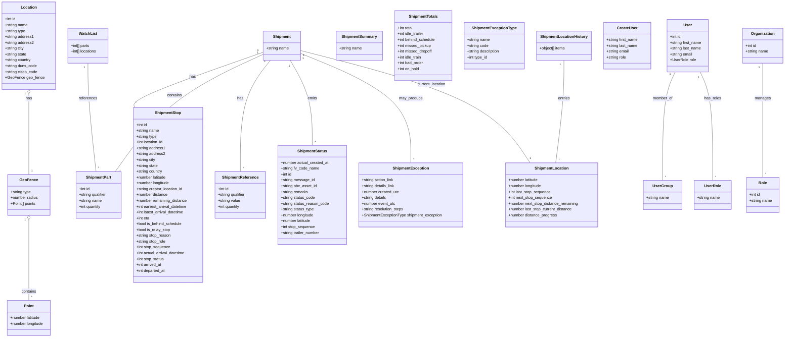

# Diagram: shipment_core/shipment_service/shipment_service/swagger/swagger.yaml

> Auto-generated by Obscura crawlers

## Diagram 1

### SVG

<svg id="container" width="3225.7109375" xmlns="http://www.w3.org/2000/svg" class="classDiagram" height="1388" viewBox="0 0 3225.7109375 1388" role="graphics-document document" aria-roledescription="class"><g><defs><marker id="container_class-aggregationStart" class="marker aggregation class" refX="18" refY="7" markerWidth="190" markerHeight="240" orient="auto"><path d="M 18,7 L9,13 L1,7 L9,1 Z"></path></marker></defs><defs><marker id="container_class-aggregationEnd" class="marker aggregation class" refX="1" refY="7" markerWidth="20" markerHeight="28" orient="auto"><path d="M 18,7 L9,13 L1,7 L9,1 Z"></path></marker></defs><defs><marker id="container_class-extensionStart" class="marker extension class" refX="18" refY="7" markerWidth="190" markerHeight="240" orient="auto"><path d="M 1,7 L18,13 V 1 Z"></path></marker></defs><defs><marker id="container_class-extensionEnd" class="marker extension class" refX="1" refY="7" markerWidth="20" markerHeight="28" orient="auto"><path d="M 1,1 V 13 L18,7 Z"></path></marker></defs><defs><marker id="container_class-compositionStart" class="marker composition class" refX="18" refY="7" markerWidth="190" markerHeight="240" orient="auto"><path d="M 18,7 L9,13 L1,7 L9,1 Z"></path></marker></defs><defs><marker id="container_class-compositionEnd" class="marker composition class" refX="1" refY="7" markerWidth="20" markerHeight="28" orient="auto"><path d="M 18,7 L9,13 L1,7 L9,1 Z"></path></marker></defs><defs><marker id="container_class-dependencyStart" class="marker dependency class" refX="6" refY="7" markerWidth="190" markerHeight="240" orient="auto"><path d="M 5,7 L9,13 L1,7 L9,1 Z"></path></marker></defs><defs><marker id="container_class-dependencyEnd" class="marker dependency class" refX="13" refY="7" markerWidth="20" markerHeight="28" orient="auto"><path d="M 18,7 L9,13 L14,7 L9,1 Z"></path></marker></defs><defs><marker id="container_class-lollipopStart" class="marker lollipop class" refX="13" refY="7" markerWidth="190" markerHeight="240" orient="auto"><circle stroke="black" fill="transparent" cx="7" cy="7" r="6"></circle></marker></defs><defs><marker id="container_class-lollipopEnd" class="marker lollipop class" refX="1" refY="7" markerWidth="190" markerHeight="240" orient="auto"><circle stroke="black" fill="transparent" cx="7" cy="7" r="6"></circle></marker></defs><g class="root"><g class="clusters"></g><g class="edgePaths"><path d="M113.168,385.25L113.168,388.542C113.168,391.833,113.168,398.417,113.168,453.875C113.168,509.333,113.168,613.667,113.168,665.833L113.168,718" id="id_Location_GeoFence_1" class="edge-thickness-normal edge-pattern-solid relation" style=";;;" data-edge="true" data-et="edge" data-id="id_Location_GeoFence_1" data-points="W3sieCI6MTEzLjE2Nzk2ODc1LCJ5IjozNjh9LHsieCI6MTEzLjE2Nzk2ODc1LCJ5Ijo0MDV9LHsieCI6MTEzLjE2Nzk2ODc1LCJ5Ijo3MTh9XQ==" marker-start="url(#container_class-aggregationStart)"></path><path d="M113.168,903.25L113.168,952.542C113.168,1001.833,113.168,1100.417,113.168,1155.875C113.168,1211.333,113.168,1223.667,113.168,1229.833L113.168,1236" id="id_GeoFence_Point_2" class="edge-thickness-normal edge-pattern-solid relation" style=";;;" data-edge="true" data-et="edge" data-id="id_GeoFence_Point_2" data-points="W3sieCI6MTEzLjE2Nzk2ODc1LCJ5Ijo4ODZ9LHsieCI6MTEzLjE2Nzk2ODc1LCJ5IjoxMTk5fSx7IngiOjExMy4xNjc5Njg3NSwieSI6MTIzNn1d" marker-start="url(#container_class-aggregationStart)"></path><path d="M352.563,260L352.563,284.167C352.563,308.333,352.563,356.667,357.901,431C363.239,505.333,373.916,605.667,379.255,655.833L384.593,706" id="id_WatchList_ShipmentPart_3" class="edge-thickness-normal edge-pattern-solid relation" style=";;;" data-edge="true" data-et="edge" data-id="id_WatchList_ShipmentPart_3" data-points="W3sieCI6MzUyLjU2MjUsInkiOjI2MH0seyJ4IjozNTIuNTYyNSwieSI6NDA1fSx7IngiOjM4NC41OTI5MTM2NDkyNDQzNCwieSI6NzA2fV0="></path><path d="M1080.447,214.661L989.136,246.385C897.824,278.108,715.201,341.554,626.247,379.444C537.292,417.333,542.006,429.667,544.362,435.833L546.719,442" id="id_Shipment_ShipmentStop_4" class="edge-thickness-normal edge-pattern-solid relation" style=";;;" data-edge="true" data-et="edge" data-id="id_Shipment_ShipmentStop_4" data-points="W3sieCI6MTA4MC40NDcyNjU2MjUsInkiOjIxNC42NjE0Njc2MDAxNjM4Nn0seyJ4Ijo1MzIuNTc4MTI1LCJ5Ijo0MDV9LHsieCI6NTQ2LjcxOTI1MTgxMDQ1MzQsInkiOjQ0Mn1d"></path><path d="M1080.447,223.096L1014.154,253.413C947.861,283.731,815.274,344.365,712.603,424.849C609.932,505.333,537.177,605.667,500.799,655.833L464.422,706" id="id_Shipment_ShipmentPart_5" class="edge-thickness-normal edge-pattern-solid relation" style=";;;" data-edge="true" data-et="edge" data-id="id_Shipment_ShipmentPart_5" data-points="W3sieCI6MTA4MC40NDcyNjU2MjUsInkiOjIyMy4wOTU4NjEyMDMxNTN9LHsieCI6NjgyLjY4NzUsInkiOjQwNX0seyJ4Ijo0NjQuNDIxNjI5MDE0NDgzNjQsInkiOjcwNn1d"></path><path d="M1109.449,248L1088.629,274.167C1067.808,300.333,1026.168,352.667,1005.348,429C984.527,505.333,984.527,605.667,984.527,655.833L984.527,706" id="id_Shipment_ShipmentReference_6" class="edge-thickness-normal edge-pattern-solid relation" style=";;;" data-edge="true" data-et="edge" data-id="id_Shipment_ShipmentReference_6" data-points="W3sieCI6MTEwOS40NDg3Nzc3MjE3NzQxLCJ5IjoyNDh9LHsieCI6OTg0LjUyNzM0Mzc1LCJ5Ijo0MDV9LHsieCI6OTg0LjUyNzM0Mzc1LCJ5Ijo3MDZ9XQ=="></path><path d="M1191.207,248L1206.042,274.167C1220.877,300.333,1250.548,352.667,1265.383,411C1280.219,469.333,1280.219,533.667,1280.219,565.833L1280.219,598" id="id_Shipment_ShipmentStatus_7" class="edge-thickness-normal edge-pattern-solid relation" style=";;;" data-edge="true" data-et="edge" data-id="id_Shipment_ShipmentStatus_7" data-points="W3sieCI6MTE5MS4yMDY3NzAyMzMyOTUsInkiOjI0OH0seyJ4IjoxMjgwLjIxODc1LCJ5Ijo0MDV9LHsieCI6MTI4MC4yMTg3NSwieSI6NTk4fV0="></path><path d="M1233.932,219.569L1309.059,250.475C1384.186,281.38,1534.441,343.19,1609.568,418.262C1684.695,493.333,1684.695,581.667,1684.695,625.833L1684.695,670" id="id_Shipment_ShipmentException_8" class="edge-thickness-normal edge-pattern-solid relation" style=";;;" data-edge="true" data-et="edge" data-id="id_Shipment_ShipmentException_8" data-points="W3sieCI6MTIzMy45MzE2NDA2MjUsInkiOjIxOS41Njk0MjEyNTE5ODU1fSx7IngiOjE2ODQuNjk1MzEyNSwieSI6NDA1fSx7IngiOjE2ODQuNjk1MzEyNSwieSI6NjcwfV0="></path><path d="M1233.932,207.735L1361.782,240.612C1489.632,273.49,1745.333,339.245,1902.69,416.289C2060.047,493.333,2119.061,581.667,2148.568,625.833L2178.075,670" id="id_Shipment_ShipmentLocation_9" class="edge-thickness-normal edge-pattern-solid relation" style=";;;" data-edge="true" data-et="edge" data-id="id_Shipment_ShipmentLocation_9" data-points="W3sieCI6MTIzMy45MzE2NDA2MjUsInkiOjIwNy43MzQ3NjA5NTI0ODY3N30seyJ4IjoyMDAxLjAzMzIwMzEyNSwieSI6NDA1fSx7IngiOjIxNzguMDc0OTA3NTA5NDQ2LCJ5Ijo2NzB9XQ=="></path><path d="M2318.918,248L2318.918,274.167C2318.918,300.333,2318.918,352.667,2313.06,423C2307.202,493.333,2295.486,581.667,2289.628,625.833L2283.77,670" id="id_ShipmentLocationHistory_ShipmentLocation_10" class="edge-thickness-normal edge-pattern-solid relation" style=";;;" data-edge="true" data-et="edge" data-id="id_ShipmentLocationHistory_ShipmentLocation_10" data-points="W3sieCI6MjMxOC45MTc5Njg3NSwieSI6MjQ4fSx7IngiOjIzMTguOTE3OTY4NzUsInkiOjQwNX0seyJ4IjoyMjgzLjc2OTU5MDI4NjUyNCwieSI6NjcwfV0="></path><path d="M2776.564,296L2768.016,314.167C2759.467,332.333,2742.369,368.667,2733.82,443C2725.271,517.333,2725.271,629.667,2725.271,685.833L2725.271,742" id="id_User_UserGroup_11" class="edge-thickness-normal edge-pattern-solid relation" style=";;;" data-edge="true" data-et="edge" data-id="id_User_UserGroup_11" data-points="W3sieCI6Mjc3Ni41NjQzOTAxMjA5NjgsInkiOjI5Nn0seyJ4IjoyNzI1LjI3MTQ4NDM3NSwieSI6NDA1fSx7IngiOjI3MjUuMjcxNDg0Mzc1LCJ5Ijo3NDJ9XQ=="></path><path d="M2878.209,296L2886.758,314.167C2895.307,332.333,2912.404,368.667,2920.953,443C2929.502,517.333,2929.502,629.667,2929.502,685.833L2929.502,742" id="id_User_UserRole_12" class="edge-thickness-normal edge-pattern-solid relation" style=";;;" data-edge="true" data-et="edge" data-id="id_User_UserRole_12" data-points="W3sieCI6Mjg3OC4yMDkwNDczNzkwMzIsInkiOjI5Nn0seyJ4IjoyOTI5LjUwMTk1MzEyNSwieSI6NDA1fSx7IngiOjI5MjkuNTAxOTUzMTI1LCJ5Ijo3NDJ9XQ=="></path><path d="M3135.176,260L3135.176,284.167C3135.176,308.333,3135.176,356.667,3135.176,435C3135.176,513.333,3135.176,621.667,3135.176,675.833L3135.176,730" id="id_Organization_Role_13" class="edge-thickness-normal edge-pattern-solid relation" style=";;;" data-edge="true" data-et="edge" data-id="id_Organization_Role_13" data-points="W3sieCI6MzEzNS4xNzU3ODEyNSwieSI6MjYwfSx7IngiOjMxMzUuMTc1NzgxMjUsInkiOjQwNX0seyJ4IjozMTM1LjE3NTc4MTI1LCJ5Ijo3MzB9XQ=="></path></g><g class="edgeLabels"><g class="edgeLabel" transform="translate(113.16796875, 405)"><g class="label" data-id="id_Location_GeoFence_1" transform="translate(-12.703125, -12)"><foreignObject width="25.40625" height="24">

has

</foreignObject></g></g><g class="edgeLabel" transform="translate(113.16796875, 1199)"><g class="label" data-id="id_GeoFence_Point_2" transform="translate(-30.890625, -12)"><foreignObject width="61.78125" height="24">

contains

</foreignObject></g></g><g class="edgeLabel" transform="translate(352.5625, 405)"><g class="label" data-id="id_WatchList_ShipmentPart_3" transform="translate(-37.828125, -12)"><foreignObject width="75.65625" height="24">

references

</foreignObject></g></g><g class="edgeLabel" transform="translate(787.80444, 316.33028)"><g class="label" data-id="id_Shipment_ShipmentStop_4" transform="translate(-12.703125, -12)"><foreignObject width="25.40625" height="24">

has

</foreignObject></g></g><g class="edgeLabel" transform="translate(712.50399, 391.36427)"><g class="label" data-id="id_Shipment_ShipmentPart_5" transform="translate(-30.890625, -12)"><foreignObject width="61.78125" height="24">

contains

</foreignObject></g></g><g class="edgeLabel" transform="translate(984.52734375, 405)"><g class="label" data-id="id_Shipment_ShipmentReference_6" transform="translate(-12.703125, -12)"><foreignObject width="25.40625" height="24">

has

</foreignObject></g></g><g class="edgeLabel" transform="translate(1280.21875, 405)"><g class="label" data-id="id_Shipment_ShipmentStatus_7" transform="translate(-20.1015625, -12)"><foreignObject width="40.203125" height="24">

emits

</foreignObject></g></g><g class="edgeLabel" transform="translate(1684.6953125, 405)"><g class="label" data-id="id_Shipment_ShipmentException_8" transform="translate(-48.6875, -12)"><foreignObject width="97.375" height="24">

may_produce

</foreignObject></g></g><g class="edgeLabel" transform="translate(1771.81056, 346.05388)"><g class="label" data-id="id_Shipment_ShipmentLocation_9" transform="translate(-59.9296875, -12)"><foreignObject width="119.859375" height="24">

current_location

</foreignObject></g></g><g class="edgeLabel" transform="translate(2318.91796875, 405)"><g class="label" data-id="id_ShipmentLocationHistory_ShipmentLocation_10" transform="translate(-25.3828125, -12)"><foreignObject width="50.765625" height="24">

entries

</foreignObject></g></g><g class="edgeLabel" transform="translate(2725.271484375, 405)"><g class="label" data-id="id_User_UserGroup_11" transform="translate(-40.984375, -12)"><foreignObject width="81.96875" height="24">

member_of

</foreignObject></g></g><g class="edgeLabel" transform="translate(2929.501953125, 405)"><g class="label" data-id="id_User_UserRole_12" transform="translate(-34.6171875, -12)"><foreignObject width="69.234375" height="24">

has_roles

</foreignObject></g></g><g class="edgeLabel" transform="translate(3135.17578125, 405)"><g class="label" data-id="id_Organization_Role_13" transform="translate(-32.296875, -12)"><foreignObject width="64.59375" height="24">

manages

</foreignObject></g></g><g class="edgeTerminals" transform="translate(98.16796937500001, 385.50000053571426)"><g class="inner" transform="translate(0, 0)"><foreignObject style="width: 9px; height: 12px;">
1
</foreignObject></g></g><g class="edgeTerminals" transform="translate(98.16796937500001, 903.5000005357143)"><g class="inner" transform="translate(0, 0)"><foreignObject style="width: 9px; height: 12px;">
1
</foreignObject></g></g><g class="edgeTerminals" transform="translate(337.5625, 277.5)"><g class="inner" transform="translate(0, 0)"><foreignObject style="width: 9px; height: 12px;">
1
</foreignObject></g></g><g class="edgeTerminals" transform="translate(1058.9938403298625, 206.2352805146338)"><g class="inner" transform="translate(0, 0)"><foreignObject style="width: 9px; height: 12px;">
1
</foreignObject></g></g><g class="edgeTerminals" transform="translate(1058.2941242462455, 216.73281577940745)"><g class="inner" transform="translate(0, 0)"><foreignObject style="width: 9px; height: 12px;">
1
</foreignObject></g></g><g class="edgeTerminals" transform="translate(1086.8150040820067, 252.35457258089403)"><g class="inner" transform="translate(0, 0)"><foreignObject style="width: 9px; height: 12px;">
1
</foreignObject></g></g><g class="edgeTerminals" transform="translate(1186.789097402993, 270.62154298512553)"><g class="inner" transform="translate(0, 0)"><foreignObject style="width: 9px; height: 12px;">
1
</foreignObject></g></g><g class="edgeTerminals" transform="translate(1244.4091901027152, 240.0991790075093)"><g class="inner" transform="translate(0, 0)"><foreignObject style="width: 9px; height: 12px;">
1
</foreignObject></g></g><g class="edgeTerminals" transform="translate(1247.1444090844566, 226.6205417302758)"><g class="inner" transform="translate(0, 0)"><foreignObject style="width: 9px; height: 12px;">
1
</foreignObject></g></g><g class="edgeTerminals" transform="translate(2303.917969375, 265.50000053571426)"><g class="inner" transform="translate(0, 0)"><foreignObject style="width: 9px; height: 12px;">
1
</foreignObject></g></g><g class="edgeTerminals" transform="translate(2755.540746757631, 305.4475622173992)"><g class="inner" transform="translate(0, 0)"><foreignObject style="width: 9px; height: 12px;">
1
</foreignObject></g></g><g class="edgeTerminals" transform="translate(2872.088015799445, 318.2212286597834)"><g class="inner" transform="translate(0, 0)"><foreignObject style="width: 9px; height: 12px;">
1
</foreignObject></g></g><g class="edgeTerminals" transform="translate(3120.175780625, 277.49999946428574)"><g class="inner" transform="translate(0, 0)"><foreignObject style="width: 9px; height: 12px;">
1
</foreignObject></g></g><g class="edgeTerminals" transform="translate(123.16796937499998, 695.5000005357143)"><g class="inner" transform="translate(0, 0)"></g><foreignObject style="width: 9px; height: 12px;">
1
</foreignObject></g><g class="edgeTerminals" transform="translate(123.16796937499998, 1213.5000005357142)"><g class="inner" transform="translate(0, 0)"></g><foreignObject style="width: 9px; height: 12px;">
*
</foreignObject></g><g class="edgeTerminals" transform="translate(392.65692301449116, 682.011012671144)"><g class="inner" transform="translate(0, 0)"></g><foreignObject style="width: 9px; height: 12px;">
*
</foreignObject></g><g class="edgeTerminals" transform="translate(549.4831570005384, 415.2981162213232)"><g class="inner" transform="translate(0, 0)"></g><foreignObject style="width: 9px; height: 12px;">
*
</foreignObject></g><g class="edgeTerminals" transform="translate(481.838197110027, 695.6383249162977)"><g class="inner" transform="translate(0, 0)"></g><foreignObject style="width: 9px; height: 12px;">
*
</foreignObject></g><g class="edgeTerminals" transform="translate(994.5273418749999, 683.4999983928572)"><g class="inner" transform="translate(0, 0)"></g><foreignObject style="width: 9px; height: 12px;">
*
</foreignObject></g><g class="edgeTerminals" transform="translate(1290.21875, 575.5)"><g class="inner" transform="translate(0, 0)"></g><foreignObject style="width: 9px; height: 12px;">
*
</foreignObject></g><g class="edgeTerminals" transform="translate(1694.69531125, 647.4999989285715)"><g class="inner" transform="translate(0, 0)"></g><foreignObject style="width: 9px; height: 12px;">
*
</foreignObject></g><g class="edgeTerminals" transform="translate(2175.826006527765, 642.115912552138)"><g class="inner" transform="translate(0, 0)"></g><foreignObject style="width: 9px; height: 12px;">
1
</foreignObject></g><g class="edgeTerminals" transform="translate(2295.9403345502037, 649.6241898932831)"><g class="inner" transform="translate(0, 0)"></g><foreignObject style="width: 9px; height: 12px;">
*
</foreignObject></g><g class="edgeTerminals" transform="translate(2735.2714821874997, 719.4999981249999)"><g class="inner" transform="translate(0, 0)"></g><foreignObject style="width: 9px; height: 12px;">
*
</foreignObject></g><g class="edgeTerminals" transform="translate(2939.5019515625, 719.4999986607143)"><g class="inner" transform="translate(0, 0)"></g><foreignObject style="width: 9px; height: 12px;">
*
</foreignObject></g><g class="edgeTerminals" transform="translate(3145.175780625, 707.4999994642857)"><g class="inner" transform="translate(0, 0)"></g><foreignObject style="width: 9px; height: 12px;">
*
</foreignObject></g></g><g class="nodes"><g class="node default" id="classId-Location-0" transform="translate(113.16796875, 188)"><g class="basic label-container"><path d="M-105.16796875 -180 L105.16796875 -180 L105.16796875 180 L-105.16796875 180" stroke="none" stroke-width="0" fill="#ECECFF" style=""></path><path d="M-105.16796875 -180 C-22.032082932520154 -180, 61.10380288495969 -180, 105.16796875 -180 M-105.16796875 -180 C-53.82005324100267 -180, -2.4721377320053364 -180, 105.16796875 -180 M105.16796875 -180 C105.16796875 -54.86524772243732, 105.16796875 70.26950455512537, 105.16796875 180 M105.16796875 -180 C105.16796875 -103.78337987464049, 105.16796875 -27.566759749280976, 105.16796875 180 M105.16796875 180 C56.301903521614676 180, 7.435838293229352 180, -105.16796875 180 M105.16796875 180 C27.70917866125474 180, -49.74961142749052 180, -105.16796875 180 M-105.16796875 180 C-105.16796875 107.57327402157428, -105.16796875 35.146548043148556, -105.16796875 -180 M-105.16796875 180 C-105.16796875 46.47255125538342, -105.16796875 -87.05489748923316, -105.16796875 -180" stroke="#9370DB" stroke-width="1.3" fill="none" stroke-dasharray="0 0" style=""></path></g><g class="annotation-group text" transform="translate(0, -156)"></g><g class="label-group text" transform="translate(-31.3515625, -156)"><g class="label" style="font-weight: bolder" transform="translate(0,-12)"><foreignObject width="62.703125" height="24">

Location

</foreignObject></g></g><g class="members-group text" transform="translate(-93.16796875, -108)"><g class="label" style="" transform="translate(0,-12)"><foreignObject width="45.96875" height="24">

+int id

</foreignObject></g><g class="label" style="" transform="translate(0,12)"><foreignObject width="94.375" height="24">

+string name

</foreignObject></g><g class="label" style="" transform="translate(0,36)"><foreignObject width="85.65625" height="24">

+string type

</foreignObject></g><g class="label" style="" transform="translate(0,60)"><foreignObject width="117.359375" height="24">

+string address1

</foreignObject></g><g class="label" style="" transform="translate(0,84)"><foreignObject width="118.65625" height="24">

+string address2

</foreignObject></g><g class="label" style="" transform="translate(0,108)"><foreignObject width="79.59375" height="24">

+string city

</foreignObject></g><g class="label" style="" transform="translate(0,132)"><foreignObject width="89.953125" height="24">

+string state

</foreignObject></g><g class="label" style="" transform="translate(0,156)"><foreignObject width="109.046875" height="24">

+string country

</foreignObject></g><g class="label" style="" transform="translate(0,180)"><foreignObject width="132.234375" height="24">

+string duns_code

</foreignObject></g><g class="label" style="" transform="translate(0,204)"><foreignObject width="132.8125" height="24">

+string cisco_code

</foreignObject></g><g class="label" style="" transform="translate(0,228)"><foreignObject width="154.984375" height="24">

+GeoFence geo_fence

</foreignObject></g></g><g class="methods-group text" transform="translate(-93.16796875, 180)"></g><g class="divider" style=""><path d="M-105.16796875 -132 C-44.37830345064451 -132, 16.411361848710982 -132, 105.16796875 -132 M-105.16796875 -132 C-51.540310438005775 -132, 2.087347873988449 -132, 105.16796875 -132" stroke="#9370DB" stroke-width="1.3" fill="none" stroke-dasharray="0 0" style=""></path></g><g class="divider" style=""><path d="M-105.16796875 156 C-45.98984894693463 156, 13.188270856130742 156, 105.16796875 156 M-105.16796875 156 C-47.65096500428584 156, 9.866038741428326 156, 105.16796875 156" stroke="#9370DB" stroke-width="1.3" fill="none" stroke-dasharray="0 0" style=""></path></g></g><g class="node default" id="classId-GeoFence-1" transform="translate(113.16796875, 802)"><g class="basic label-container"><path d="M-86.6015625 -84 L86.6015625 -84 L86.6015625 84 L-86.6015625 84" stroke="none" stroke-width="0" fill="#ECECFF" style=""></path><path d="M-86.6015625 -84 C-18.612422962094683 -84, 49.37671657581063 -84, 86.6015625 -84 M-86.6015625 -84 C-39.72570374638223 -84, 7.15015500723554 -84, 86.6015625 -84 M86.6015625 -84 C86.6015625 -27.18736947487229, 86.6015625 29.625261050255418, 86.6015625 84 M86.6015625 -84 C86.6015625 -36.39799261152817, 86.6015625 11.204014776943666, 86.6015625 84 M86.6015625 84 C22.111942086878884 84, -42.37767832624223 84, -86.6015625 84 M86.6015625 84 C41.74200785506064 84, -3.117546789878716 84, -86.6015625 84 M-86.6015625 84 C-86.6015625 27.388779371321846, -86.6015625 -29.22244125735631, -86.6015625 -84 M-86.6015625 84 C-86.6015625 48.491044883564754, -86.6015625 12.982089767129509, -86.6015625 -84" stroke="#9370DB" stroke-width="1.3" fill="none" stroke-dasharray="0 0" style=""></path></g><g class="annotation-group text" transform="translate(0, -60)"></g><g class="label-group text" transform="translate(-34.984375, -60)"><g class="label" style="font-weight: bolder" transform="translate(0,-12)"><foreignObject width="69.96875" height="24">

GeoFence

</foreignObject></g></g><g class="members-group text" transform="translate(-74.6015625, -12)"><g class="label" style="" transform="translate(0,-12)"><foreignObject width="85.65625" height="24">

+string type

</foreignObject></g><g class="label" style="" transform="translate(0,12)"><foreignObject width="114.21875" height="24">

+number radius

</foreignObject></g><g class="label" style="" transform="translate(0,36)"><foreignObject width="106.34375" height="24">

+Point[] points

</foreignObject></g></g><g class="methods-group text" transform="translate(-74.6015625, 84)"></g><g class="divider" style=""><path d="M-86.6015625 -36 C-38.4299151503571 -36, 9.741732199285806 -36, 86.6015625 -36 M-86.6015625 -36 C-42.80024323704288 -36, 1.0010760259142444 -36, 86.6015625 -36" stroke="#9370DB" stroke-width="1.3" fill="none" stroke-dasharray="0 0" style=""></path></g><g class="divider" style=""><path d="M-86.6015625 60 C-25.270265845787236 60, 36.06103080842553 60, 86.6015625 60 M-86.6015625 60 C-39.222773416611965 60, 8.15601566677607 60, 86.6015625 60" stroke="#9370DB" stroke-width="1.3" fill="none" stroke-dasharray="0 0" style=""></path></g></g><g class="node default" id="classId-Point-2" transform="translate(113.16796875, 1308)"><g class="basic label-container"><path d="M-90.87890625 -72 L90.87890625 -72 L90.87890625 72 L-90.87890625 72" stroke="none" stroke-width="0" fill="#ECECFF" style=""></path><path d="M-90.87890625 -72 C-40.074671548460756 -72, 10.729563153078487 -72, 90.87890625 -72 M-90.87890625 -72 C-51.332276810967976 -72, -11.785647371935951 -72, 90.87890625 -72 M90.87890625 -72 C90.87890625 -31.329694939776815, 90.87890625 9.340610120446371, 90.87890625 72 M90.87890625 -72 C90.87890625 -34.89178803920064, 90.87890625 2.216423921598718, 90.87890625 72 M90.87890625 72 C42.77827898846842 72, -5.322348273063156 72, -90.87890625 72 M90.87890625 72 C30.755844831926545 72, -29.36721658614691 72, -90.87890625 72 M-90.87890625 72 C-90.87890625 24.708138461606623, -90.87890625 -22.583723076786754, -90.87890625 -72 M-90.87890625 72 C-90.87890625 19.39110755723953, -90.87890625 -33.21778488552094, -90.87890625 -72" stroke="#9370DB" stroke-width="1.3" fill="none" stroke-dasharray="0 0" style=""></path></g><g class="annotation-group text" transform="translate(0, -48)"></g><g class="label-group text" transform="translate(-19.1953125, -48)"><g class="label" style="font-weight: bolder" transform="translate(0,-12)"><foreignObject width="38.390625" height="24">

Point

</foreignObject></g></g><g class="members-group text" transform="translate(-78.87890625, 0)"><g class="label" style="" transform="translate(0,-12)"><foreignObject width="126.015625" height="24">

+number latitude

</foreignObject></g><g class="label" style="" transform="translate(0,12)"><foreignObject width="138.5625" height="24">

+number longitude

</foreignObject></g></g><g class="methods-group text" transform="translate(-78.87890625, 72)"></g><g class="divider" style=""><path d="M-90.87890625 -24 C-34.403736457730155 -24, 22.07143333453969 -24, 90.87890625 -24 M-90.87890625 -24 C-54.378245374161956 -24, -17.877584498323912 -24, 90.87890625 -24" stroke="#9370DB" stroke-width="1.3" fill="none" stroke-dasharray="0 0" style=""></path></g><g class="divider" style=""><path d="M-90.87890625 48 C-23.35767811186213 48, 44.16355002627574 48, 90.87890625 48 M-90.87890625 48 C-50.81953316629152 48, -10.760160082583042 48, 90.87890625 48" stroke="#9370DB" stroke-width="1.3" fill="none" stroke-dasharray="0 0" style=""></path></g></g><g class="node default" id="classId-WatchList-3" transform="translate(352.5625, 188)"><g class="basic label-container"><path d="M-84.2265625 -72 L84.2265625 -72 L84.2265625 72 L-84.2265625 72" stroke="none" stroke-width="0" fill="#ECECFF" style=""></path><path d="M-84.2265625 -72 C-20.47705062519114 -72, 43.27246124961772 -72, 84.2265625 -72 M-84.2265625 -72 C-33.44486986573622 -72, 17.336822768527554 -72, 84.2265625 -72 M84.2265625 -72 C84.2265625 -19.88771605535213, 84.2265625 32.22456788929574, 84.2265625 72 M84.2265625 -72 C84.2265625 -41.01957321790564, 84.2265625 -10.039146435811276, 84.2265625 72 M84.2265625 72 C38.05685658278171 72, -8.112849334436575 72, -84.2265625 72 M84.2265625 72 C42.42080546706594 72, 0.6150484341318787 72, -84.2265625 72 M-84.2265625 72 C-84.2265625 30.978117556909552, -84.2265625 -10.043764886180895, -84.2265625 -72 M-84.2265625 72 C-84.2265625 42.65523238025807, -84.2265625 13.31046476051614, -84.2265625 -72" stroke="#9370DB" stroke-width="1.3" fill="none" stroke-dasharray="0 0" style=""></path></g><g class="annotation-group text" transform="translate(0, -48)"></g><g class="label-group text" transform="translate(-35.625, -48)"><g class="label" style="font-weight: bolder" transform="translate(0,-12)"><foreignObject width="71.25" height="24">

WatchList

</foreignObject></g></g><g class="members-group text" transform="translate(-72.2265625, 0)"><g class="label" style="" transform="translate(0,-12)"><foreignObject width="79.671875" height="24">

+int[] parts

</foreignObject></g><g class="label" style="" transform="translate(0,12)"><foreignObject width="108.828125" height="24">

+int[] locations

</foreignObject></g></g><g class="methods-group text" transform="translate(-72.2265625, 72)"></g><g class="divider" style=""><path d="M-84.2265625 -24 C-31.329361089647584 -24, 21.567840320704832 -24, 84.2265625 -24 M-84.2265625 -24 C-32.27794238044242 -24, 19.670677739115163 -24, 84.2265625 -24" stroke="#9370DB" stroke-width="1.3" fill="none" stroke-dasharray="0 0" style=""></path></g><g class="divider" style=""><path d="M-84.2265625 48 C-44.83304023922877 48, -5.439517978457545 48, 84.2265625 48 M-84.2265625 48 C-43.188249280696 48, -2.1499360613919976 48, 84.2265625 48" stroke="#9370DB" stroke-width="1.3" fill="none" stroke-dasharray="0 0" style=""></path></g></g><g class="node default" id="classId-Shipment-4" transform="translate(1157.189453125, 188)"><g class="basic label-container"><path d="M-76.7421875 -60 L76.7421875 -60 L76.7421875 60 L-76.7421875 60" stroke="none" stroke-width="0" fill="#ECECFF" style=""></path><path d="M-76.7421875 -60 C-20.128272527211195 -60, 36.48564244557761 -60, 76.7421875 -60 M-76.7421875 -60 C-16.29036752758976 -60, 44.16145244482048 -60, 76.7421875 -60 M76.7421875 -60 C76.7421875 -21.24625962344531, 76.7421875 17.507480753109377, 76.7421875 60 M76.7421875 -60 C76.7421875 -21.867207370879676, 76.7421875 16.265585258240648, 76.7421875 60 M76.7421875 60 C43.90196453297032 60, 11.061741565940636 60, -76.7421875 60 M76.7421875 60 C18.923775189346287 60, -38.894637121307426 60, -76.7421875 60 M-76.7421875 60 C-76.7421875 13.14313500978622, -76.7421875 -33.71372998042756, -76.7421875 -60 M-76.7421875 60 C-76.7421875 22.241325843766056, -76.7421875 -15.517348312467888, -76.7421875 -60" stroke="#9370DB" stroke-width="1.3" fill="none" stroke-dasharray="0 0" style=""></path></g><g class="annotation-group text" transform="translate(0, -36)"></g><g class="label-group text" transform="translate(-35.109375, -36)"><g class="label" style="font-weight: bolder" transform="translate(0,-12)"><foreignObject width="70.21875" height="24">

Shipment

</foreignObject></g></g><g class="members-group text" transform="translate(-64.7421875, 12)"><g class="label" style="" transform="translate(0,-12)"><foreignObject width="94.375" height="24">

+string name

</foreignObject></g></g><g class="methods-group text" transform="translate(-64.7421875, 60)"></g><g class="divider" style=""><path d="M-76.7421875 -12 C-42.674047144372096 -12, -8.605906788744193 -12, 76.7421875 -12 M-76.7421875 -12 C-16.021741421074722 -12, 44.698704657850556 -12, 76.7421875 -12" stroke="#9370DB" stroke-width="1.3" fill="none" stroke-dasharray="0 0" style=""></path></g><g class="divider" style=""><path d="M-76.7421875 36 C-40.664524508609745 36, -4.586861517219489 36, 76.7421875 36 M-76.7421875 36 C-22.52898701113459 36, 31.68421347773082 36, 76.7421875 36" stroke="#9370DB" stroke-width="1.3" fill="none" stroke-dasharray="0 0" style=""></path></g></g><g class="node default" id="classId-ShipmentSummary-5" transform="translate(1476.0546875, 188)"><g class="basic label-container"><path d="M-93.9453125 -60 L93.9453125 -60 L93.9453125 60 L-93.9453125 60" stroke="none" stroke-width="0" fill="#ECECFF" style=""></path><path d="M-93.9453125 -60 C-49.235282832085225 -60, -4.525253164170451 -60, 93.9453125 -60 M-93.9453125 -60 C-31.021210940254726 -60, 31.90289061949055 -60, 93.9453125 -60 M93.9453125 -60 C93.9453125 -27.20403181730361, 93.9453125 5.591936365392783, 93.9453125 60 M93.9453125 -60 C93.9453125 -16.994971911381533, 93.9453125 26.010056177236933, 93.9453125 60 M93.9453125 60 C49.89958195409563 60, 5.853851408191261 60, -93.9453125 60 M93.9453125 60 C35.77764169798506 60, -22.39002910402988 60, -93.9453125 60 M-93.9453125 60 C-93.9453125 17.22807308521117, -93.9453125 -25.543853829577657, -93.9453125 -60 M-93.9453125 60 C-93.9453125 23.47378949917421, -93.9453125 -13.052421001651581, -93.9453125 -60" stroke="#9370DB" stroke-width="1.3" fill="none" stroke-dasharray="0 0" style=""></path></g><g class="annotation-group text" transform="translate(0, -36)"></g><g class="label-group text" transform="translate(-69.515625, -36)"><g class="label" style="font-weight: bolder" transform="translate(0,-12)"><foreignObject width="139.03125" height="24">

ShipmentSummary

</foreignObject></g></g><g class="members-group text" transform="translate(-81.9453125, 12)"><g class="label" style="" transform="translate(0,-12)"><foreignObject width="94.375" height="24">

+string name

</foreignObject></g></g><g class="methods-group text" transform="translate(-81.9453125, 60)"></g><g class="divider" style=""><path d="M-93.9453125 -12 C-31.20664462935097 -12, 31.532023241298063 -12, 93.9453125 -12 M-93.9453125 -12 C-28.049562986634598 -12, 37.846186526730804 -12, 93.9453125 -12" stroke="#9370DB" stroke-width="1.3" fill="none" stroke-dasharray="0 0" style=""></path></g><g class="divider" style=""><path d="M-93.9453125 36 C-52.838387459541906 36, -11.731462419083812 36, 93.9453125 36 M-93.9453125 36 C-21.78910309834258 36, 50.36710630331484 36, 93.9453125 36" stroke="#9370DB" stroke-width="1.3" fill="none" stroke-dasharray="0 0" style=""></path></g></g><g class="node default" id="classId-ShipmentTotals-6" transform="translate(1738.94921875, 188)"><g class="basic label-container"><path d="M-118.94921875 -144 L118.94921875 -144 L118.94921875 144 L-118.94921875 144" stroke="none" stroke-width="0" fill="#ECECFF" style=""></path><path d="M-118.94921875 -144 C-55.518585782999814 -144, 7.912047184000372 -144, 118.94921875 -144 M-118.94921875 -144 C-67.13568866804061 -144, -15.322158586081244 -144, 118.94921875 -144 M118.94921875 -144 C118.94921875 -81.55001271582799, 118.94921875 -19.10002543165598, 118.94921875 144 M118.94921875 -144 C118.94921875 -44.19142047230477, 118.94921875 55.61715905539046, 118.94921875 144 M118.94921875 144 C37.30969878811048 144, -44.32982117377904 144, -118.94921875 144 M118.94921875 144 C34.97944239659431 144, -48.990333956811384 144, -118.94921875 144 M-118.94921875 144 C-118.94921875 75.6773630395159, -118.94921875 7.354726079031792, -118.94921875 -144 M-118.94921875 144 C-118.94921875 37.10055921686701, -118.94921875 -69.79888156626598, -118.94921875 -144" stroke="#9370DB" stroke-width="1.3" fill="none" stroke-dasharray="0 0" style=""></path></g><g class="annotation-group text" transform="translate(0, -120)"></g><g class="label-group text" transform="translate(-57.1953125, -120)"><g class="label" style="font-weight: bolder" transform="translate(0,-12)"><foreignObject width="114.390625" height="24">

ShipmentTotals

</foreignObject></g></g><g class="members-group text" transform="translate(-106.94921875, -72)"><g class="label" style="" transform="translate(0,-12)"><foreignObject width="65.671875" height="24">

+int total

</foreignObject></g><g class="label" style="" transform="translate(0,12)"><foreignObject width="111.09375" height="24">

+int idle_trailer

</foreignObject></g><g class="label" style="" transform="translate(0,36)"><foreignObject width="156.703125" height="24">

+int behind_schedule

</foreignObject></g><g class="label" style="" transform="translate(0,60)"><foreignObject width="140.078125" height="24">

+int missed_pickup

</foreignObject></g><g class="label" style="" transform="translate(0,84)"><foreignObject width="145.375" height="24">

+int missed_dropoff

</foreignObject></g><g class="label" style="" transform="translate(0,108)"><foreignObject width="100.96875" height="24">

+int idle_train

</foreignObject></g><g class="label" style="" transform="translate(0,132)"><foreignObject width="107.015625" height="24">

+int bad_order

</foreignObject></g><g class="label" style="" transform="translate(0,156)"><foreignObject width="91.828125" height="24">

+int on_hold

</foreignObject></g></g><g class="methods-group text" transform="translate(-106.94921875, 144)"></g><g class="divider" style=""><path d="M-118.94921875 -96 C-25.220523122139255 -96, 68.50817250572149 -96, 118.94921875 -96 M-118.94921875 -96 C-62.47572858868039 -96, -6.00223842736078 -96, 118.94921875 -96" stroke="#9370DB" stroke-width="1.3" fill="none" stroke-dasharray="0 0" style=""></path></g><g class="divider" style=""><path d="M-118.94921875 120 C-37.26094992365195 120, 44.4273189026961 120, 118.94921875 120 M-118.94921875 120 C-70.35124500740486 120, -21.75327126480971 120, 118.94921875 120" stroke="#9370DB" stroke-width="1.3" fill="none" stroke-dasharray="0 0" style=""></path></g></g><g class="node default" id="classId-ShipmentException-7" transform="translate(1684.6953125, 802)"><g class="basic label-container"><path d="M-213.87890625 -132 L213.87890625 -132 L213.87890625 132 L-213.87890625 132" stroke="none" stroke-width="0" fill="#ECECFF" style=""></path><path d="M-213.87890625 -132 C-121.46801946125052 -132, -29.05713267250104 -132, 213.87890625 -132 M-213.87890625 -132 C-83.71857985722144 -132, 46.441746535557115 -132, 213.87890625 -132 M213.87890625 -132 C213.87890625 -29.899289841044762, 213.87890625 72.20142031791048, 213.87890625 132 M213.87890625 -132 C213.87890625 -30.79516143813872, 213.87890625 70.40967712372256, 213.87890625 132 M213.87890625 132 C86.68089524936177 132, -40.517115751276464 132, -213.87890625 132 M213.87890625 132 C127.12218761746779 132, 40.365468984935575 132, -213.87890625 132 M-213.87890625 132 C-213.87890625 44.933178903617915, -213.87890625 -42.13364219276417, -213.87890625 -132 M-213.87890625 132 C-213.87890625 60.47779869571487, -213.87890625 -11.044402608570266, -213.87890625 -132" stroke="#9370DB" stroke-width="1.3" fill="none" stroke-dasharray="0 0" style=""></path></g><g class="annotation-group text" transform="translate(0, -108)"></g><g class="label-group text" transform="translate(-70.8046875, -108)"><g class="label" style="font-weight: bolder" transform="translate(0,-12)"><foreignObject width="141.609375" height="24">

ShipmentException

</foreignObject></g></g><g class="members-group text" transform="translate(-201.87890625, -60)"><g class="label" style="" transform="translate(0,-12)"><foreignObject width="134.15625" height="24">

+string action_link

</foreignObject></g><g class="label" style="" transform="translate(0,12)"><foreignObject width="137.796875" height="24">

+string details_link

</foreignObject></g><g class="label" style="" transform="translate(0,36)"><foreignObject width="153.953125" height="24">

+number created_utc

</foreignObject></g><g class="label" style="" transform="translate(0,60)"><foreignObject width="103.1875" height="24">

+string details

</foreignObject></g><g class="label" style="" transform="translate(0,84)"><foreignObject width="139.859375" height="24">

+number event_utc

</foreignObject></g><g class="label" style="" transform="translate(0,108)"><foreignObject width="175.125" height="24">

+string resolution_steps

</foreignObject></g><g class="label" style="" transform="translate(0,132)"><foreignObject width="332.953125" height="24">

+ShipmentExceptionType shipment_exception

</foreignObject></g></g><g class="methods-group text" transform="translate(-201.87890625, 132)"></g><g class="divider" style=""><path d="M-213.87890625 -84 C-103.6705562203244 -84, 6.5377938093512 -84, 213.87890625 -84 M-213.87890625 -84 C-86.2272609228651 -84, 41.4243844042698 -84, 213.87890625 -84" stroke="#9370DB" stroke-width="1.3" fill="none" stroke-dasharray="0 0" style=""></path></g><g class="divider" style=""><path d="M-213.87890625 108 C-54.629127951394366 108, 104.62065034721127 108, 213.87890625 108 M-213.87890625 108 C-124.97211999967075 108, -36.065333749341505 108, 213.87890625 108" stroke="#9370DB" stroke-width="1.3" fill="none" stroke-dasharray="0 0" style=""></path></g></g><g class="node default" id="classId-ShipmentExceptionType-8" transform="translate(2032.203125, 188)"><g class="basic label-container"><path d="M-124.3046875 -96 L124.3046875 -96 L124.3046875 96 L-124.3046875 96" stroke="none" stroke-width="0" fill="#ECECFF" style=""></path><path d="M-124.3046875 -96 C-62.865597601629204 -96, -1.4265077032584088 -96, 124.3046875 -96 M-124.3046875 -96 C-40.37802755268099 -96, 43.54863239463802 -96, 124.3046875 -96 M124.3046875 -96 C124.3046875 -28.996762002056187, 124.3046875 38.00647599588763, 124.3046875 96 M124.3046875 -96 C124.3046875 -53.21604210007208, 124.3046875 -10.43208420014416, 124.3046875 96 M124.3046875 96 C64.23037700703918 96, 4.1560665140783755 96, -124.3046875 96 M124.3046875 96 C26.43604979996954 96, -71.43258790006092 96, -124.3046875 96 M-124.3046875 96 C-124.3046875 20.363352398235705, -124.3046875 -55.27329520352859, -124.3046875 -96 M-124.3046875 96 C-124.3046875 22.17311184024564, -124.3046875 -51.65377631950872, -124.3046875 -96" stroke="#9370DB" stroke-width="1.3" fill="none" stroke-dasharray="0 0" style=""></path></g><g class="annotation-group text" transform="translate(0, -72)"></g><g class="label-group text" transform="translate(-88.140625, -72)"><g class="label" style="font-weight: bolder" transform="translate(0,-12)"><foreignObject width="176.28125" height="24">

ShipmentExceptionType

</foreignObject></g></g><g class="members-group text" transform="translate(-112.3046875, -24)"><g class="label" style="" transform="translate(0,-12)"><foreignObject width="94.375" height="24">

+string name

</foreignObject></g><g class="label" style="" transform="translate(0,12)"><foreignObject width="88.828125" height="24">

+string code

</foreignObject></g><g class="label" style="" transform="translate(0,36)"><foreignObject width="136.46875" height="24">

+string description

</foreignObject></g><g class="label" style="" transform="translate(0,60)"><foreignObject width="85.765625" height="24">

+int type_id

</foreignObject></g></g><g class="methods-group text" transform="translate(-112.3046875, 96)"></g><g class="divider" style=""><path d="M-124.3046875 -48 C-64.64192770664617 -48, -4.979167913292343 -48, 124.3046875 -48 M-124.3046875 -48 C-44.54560817694431 -48, 35.213471146111374 -48, 124.3046875 -48" stroke="#9370DB" stroke-width="1.3" fill="none" stroke-dasharray="0 0" style=""></path></g><g class="divider" style=""><path d="M-124.3046875 72 C-50.28366614275045 72, 23.737355214499104 72, 124.3046875 72 M-124.3046875 72 C-32.101055881692176 72, 60.10257573661565 72, 124.3046875 72" stroke="#9370DB" stroke-width="1.3" fill="none" stroke-dasharray="0 0" style=""></path></g></g><g class="node default" id="classId-ShipmentStatus-9" transform="translate(1280.21875, 802)"><g class="basic label-container"><path d="M-140.59765625 -204 L140.59765625 -204 L140.59765625 204 L-140.59765625 204" stroke="none" stroke-width="0" fill="#ECECFF" style=""></path><path d="M-140.59765625 -204 C-71.2500431096132 -204, -1.9024299692264037 -204, 140.59765625 -204 M-140.59765625 -204 C-30.546140408706137 -204, 79.50537543258773 -204, 140.59765625 -204 M140.59765625 -204 C140.59765625 -45.16394198624258, 140.59765625 113.67211602751485, 140.59765625 204 M140.59765625 -204 C140.59765625 -88.41181769519076, 140.59765625 27.176364609618474, 140.59765625 204 M140.59765625 204 C39.277733690605984 204, -62.04218886878803 204, -140.59765625 204 M140.59765625 204 C77.05286701252851 204, 13.508077775057004 204, -140.59765625 204 M-140.59765625 204 C-140.59765625 46.910414289642716, -140.59765625 -110.17917142071457, -140.59765625 -204 M-140.59765625 204 C-140.59765625 88.58370937611254, -140.59765625 -26.832581247774925, -140.59765625 -204" stroke="#9370DB" stroke-width="1.3" fill="none" stroke-dasharray="0 0" style=""></path></g><g class="annotation-group text" transform="translate(0, -180)"></g><g class="label-group text" transform="translate(-58.5859375, -180)"><g class="label" style="font-weight: bolder" transform="translate(0,-12)"><foreignObject width="117.171875" height="24">

ShipmentStatus

</foreignObject></g></g><g class="members-group text" transform="translate(-128.59765625, -132)"><g class="label" style="" transform="translate(0,-12)"><foreignObject width="198.609375" height="24">

+number actual_created_at

</foreignObject></g><g class="label" style="" transform="translate(0,12)"><foreignObject width="158.09375" height="24">

+string fv_code_name

</foreignObject></g><g class="label" style="" transform="translate(0,36)"><foreignObject width="45.96875" height="24">

+int id

</foreignObject></g><g class="label" style="" transform="translate(0,60)"><foreignObject width="138.328125" height="24">

+string message_id

</foreignObject></g><g class="label" style="" transform="translate(0,84)"><foreignObject width="148.578125" height="24">

+string obc_asset_id

</foreignObject></g><g class="label" style="" transform="translate(0,108)"><foreignObject width="112.453125" height="24">

+string remarks

</foreignObject></g><g class="label" style="" transform="translate(0,132)"><foreignObject width="140.90625" height="24">

+string status_code

</foreignObject></g><g class="label" style="" transform="translate(0,156)"><foreignObject width="198.21875" height="24">

+string status_reason_code

</foreignObject></g><g class="label" style="" transform="translate(0,180)"><foreignObject width="137.734375" height="24">

+string status_type

</foreignObject></g><g class="label" style="" transform="translate(0,204)"><foreignObject width="138.5625" height="24">

+number longitude

</foreignObject></g><g class="label" style="" transform="translate(0,228)"><foreignObject width="126.015625" height="24">

+number latitude

</foreignObject></g><g class="label" style="" transform="translate(0,252)"><foreignObject width="140.96875" height="24">

+int stop_sequence

</foreignObject></g><g class="label" style="" transform="translate(0,276)"><foreignObject width="161.8125" height="24">

+string trailer_number

</foreignObject></g></g><g class="methods-group text" transform="translate(-128.59765625, 204)"></g><g class="divider" style=""><path d="M-140.59765625 -156 C-47.00691618544687 -156, 46.58382387910626 -156, 140.59765625 -156 M-140.59765625 -156 C-50.95317735228363 -156, 38.69130154543274 -156, 140.59765625 -156" stroke="#9370DB" stroke-width="1.3" fill="none" stroke-dasharray="0 0" style=""></path></g><g class="divider" style=""><path d="M-140.59765625 180 C-81.63325290092659 180, -22.668849551853185 180, 140.59765625 180 M-140.59765625 180 C-66.53658807189521 180, 7.52448010620958 180, 140.59765625 180" stroke="#9370DB" stroke-width="1.3" fill="none" stroke-dasharray="0 0" style=""></path></g></g><g class="node default" id="classId-ShipmentReference-10" transform="translate(984.52734375, 802)"><g class="basic label-container"><path d="M-105.09375 -96 L105.09375 -96 L105.09375 96 L-105.09375 96" stroke="none" stroke-width="0" fill="#ECECFF" style=""></path><path d="M-105.09375 -96 C-44.530199249835405 -96, 16.03335150032919 -96, 105.09375 -96 M-105.09375 -96 C-28.436209669199215 -96, 48.22133066160157 -96, 105.09375 -96 M105.09375 -96 C105.09375 -31.026370245028446, 105.09375 33.94725950994311, 105.09375 96 M105.09375 -96 C105.09375 -25.141545192663017, 105.09375 45.716909614673966, 105.09375 96 M105.09375 96 C38.63469293682964 96, -27.824364126340726 96, -105.09375 96 M105.09375 96 C25.89648596876411 96, -53.30077806247178 96, -105.09375 96 M-105.09375 96 C-105.09375 21.54837854523801, -105.09375 -52.90324290952398, -105.09375 -96 M-105.09375 96 C-105.09375 43.837627500948564, -105.09375 -8.324744998102872, -105.09375 -96" stroke="#9370DB" stroke-width="1.3" fill="none" stroke-dasharray="0 0" style=""></path></g><g class="annotation-group text" transform="translate(0, -72)"></g><g class="label-group text" transform="translate(-71.609375, -72)"><g class="label" style="font-weight: bolder" transform="translate(0,-12)"><foreignObject width="143.21875" height="24">

ShipmentReference

</foreignObject></g></g><g class="members-group text" transform="translate(-93.09375, -24)"><g class="label" style="" transform="translate(0,-12)"><foreignObject width="45.96875" height="24">

+int id

</foreignObject></g><g class="label" style="" transform="translate(0,12)"><foreignObject width="114.578125" height="24">

+string qualifier

</foreignObject></g><g class="label" style="" transform="translate(0,36)"><foreignObject width="92.75" height="24">

+string value

</foreignObject></g><g class="label" style="" transform="translate(0,60)"><foreignObject width="92.71875" height="24">

+int quantity

</foreignObject></g></g><g class="methods-group text" transform="translate(-93.09375, 96)"></g><g class="divider" style=""><path d="M-105.09375 -48 C-55.70905914749822 -48, -6.324368294996447 -48, 105.09375 -48 M-105.09375 -48 C-42.1080992892819 -48, 20.877551421436195 -48, 105.09375 -48" stroke="#9370DB" stroke-width="1.3" fill="none" stroke-dasharray="0 0" style=""></path></g><g class="divider" style=""><path d="M-105.09375 72 C-38.19681609707436 72, 28.700117805851278 72, 105.09375 72 M-105.09375 72 C-35.51764221160127 72, 34.05846557679746 72, 105.09375 72" stroke="#9370DB" stroke-width="1.3" fill="none" stroke-dasharray="0 0" style=""></path></g></g><g class="node default" id="classId-ShipmentPart-11" transform="translate(394.80859375, 802)"><g class="basic label-container"><path d="M-94.375 -96 L94.375 -96 L94.375 96 L-94.375 96" stroke="none" stroke-width="0" fill="#ECECFF" style=""></path><path d="M-94.375 -96 C-19.386346590222956 -96, 55.60230681955409 -96, 94.375 -96 M-94.375 -96 C-30.67875334922489 -96, 33.01749330155022 -96, 94.375 -96 M94.375 -96 C94.375 -25.785543684988838, 94.375 44.428912630022324, 94.375 96 M94.375 -96 C94.375 -41.08388802472966, 94.375 13.83222395054068, 94.375 96 M94.375 96 C28.74460700619173 96, -36.88578598761654 96, -94.375 96 M94.375 96 C45.201823302018724 96, -3.971353395962552 96, -94.375 96 M-94.375 96 C-94.375 27.249097129561363, -94.375 -41.50180574087727, -94.375 -96 M-94.375 96 C-94.375 27.23634213239768, -94.375 -41.52731573520464, -94.375 -96" stroke="#9370DB" stroke-width="1.3" fill="none" stroke-dasharray="0 0" style=""></path></g><g class="annotation-group text" transform="translate(0, -72)"></g><g class="label-group text" transform="translate(-50.171875, -72)"><g class="label" style="font-weight: bolder" transform="translate(0,-12)"><foreignObject width="100.34375" height="24">

ShipmentPart

</foreignObject></g></g><g class="members-group text" transform="translate(-82.375, -24)"><g class="label" style="" transform="translate(0,-12)"><foreignObject width="45.96875" height="24">

+int id

</foreignObject></g><g class="label" style="" transform="translate(0,12)"><foreignObject width="114.578125" height="24">

+string qualifier

</foreignObject></g><g class="label" style="" transform="translate(0,36)"><foreignObject width="94.375" height="24">

+string name

</foreignObject></g><g class="label" style="" transform="translate(0,60)"><foreignObject width="92.71875" height="24">

+int quantity

</foreignObject></g></g><g class="methods-group text" transform="translate(-82.375, 96)"></g><g class="divider" style=""><path d="M-94.375 -48 C-33.69232633890521 -48, 26.990347322189578 -48, 94.375 -48 M-94.375 -48 C-28.75258677509173 -48, 36.86982644981654 -48, 94.375 -48" stroke="#9370DB" stroke-width="1.3" fill="none" stroke-dasharray="0 0" style=""></path></g><g class="divider" style=""><path d="M-94.375 72 C-38.612876828201834 72, 17.14924634359633 72, 94.375 72 M-94.375 72 C-42.39104791337452 72, 9.592904173250957 72, 94.375 72" stroke="#9370DB" stroke-width="1.3" fill="none" stroke-dasharray="0 0" style=""></path></g></g><g class="node default" id="classId-ShipmentStop-12" transform="translate(684.30859375, 802)"><g class="basic label-container"><path d="M-145.125 -360 L145.125 -360 L145.125 360 L-145.125 360" stroke="none" stroke-width="0" fill="#ECECFF" style=""></path><path d="M-145.125 -360 C-73.91066424055599 -360, -2.6963284811119763 -360, 145.125 -360 M-145.125 -360 C-64.43230029012012 -360, 16.26039941975975 -360, 145.125 -360 M145.125 -360 C145.125 -120.21201642906357, 145.125 119.57596714187287, 145.125 360 M145.125 -360 C145.125 -190.91235978372453, 145.125 -21.82471956744905, 145.125 360 M145.125 360 C85.53905261357826 360, 25.953105227156527 360, -145.125 360 M145.125 360 C59.48486580426888 360, -26.155268391462243 360, -145.125 360 M-145.125 360 C-145.125 155.53362216355495, -145.125 -48.932755672890096, -145.125 -360 M-145.125 360 C-145.125 189.77673445448008, -145.125 19.553468908960156, -145.125 -360" stroke="#9370DB" stroke-width="1.3" fill="none" stroke-dasharray="0 0" style=""></path></g><g class="annotation-group text" transform="translate(0, -336)"></g><g class="label-group text" transform="translate(-52.078125, -336)"><g class="label" style="font-weight: bolder" transform="translate(0,-12)"><foreignObject width="104.15625" height="24">

ShipmentStop

</foreignObject></g></g><g class="members-group text" transform="translate(-133.125, -288)"><g class="label" style="" transform="translate(0,-12)"><foreignObject width="45.96875" height="24">

+int id

</foreignObject></g><g class="label" style="" transform="translate(0,12)"><foreignObject width="94.375" height="24">

+string name

</foreignObject></g><g class="label" style="" transform="translate(0,36)"><foreignObject width="85.65625" height="24">

+string type

</foreignObject></g><g class="label" style="" transform="translate(0,60)"><foreignObject width="113.453125" height="24">

+int location_id

</foreignObject></g><g class="label" style="" transform="translate(0,84)"><foreignObject width="117.359375" height="24">

+string address1

</foreignObject></g><g class="label" style="" transform="translate(0,108)"><foreignObject width="118.65625" height="24">

+string address2

</foreignObject></g><g class="label" style="" transform="translate(0,132)"><foreignObject width="79.59375" height="24">

+string city

</foreignObject></g><g class="label" style="" transform="translate(0,156)"><foreignObject width="89.953125" height="24">

+string state

</foreignObject></g><g class="label" style="" transform="translate(0,180)"><foreignObject width="109.046875" height="24">

+string country

</foreignObject></g><g class="label" style="" transform="translate(0,204)"><foreignObject width="126.015625" height="24">

+number latitude

</foreignObject></g><g class="label" style="" transform="translate(0,228)"><foreignObject width="138.5625" height="24">

+number longitude

</foreignObject></g><g class="label" style="" transform="translate(0,252)"><foreignObject width="193.953125" height="24">

+string creator_location_id

</foreignObject></g><g class="label" style="" transform="translate(0,276)"><foreignObject width="130.375" height="24">

+number distance

</foreignObject></g><g class="label" style="" transform="translate(0,300)"><foreignObject width="211.375" height="24">

+number remaining_distance

</foreignObject></g><g class="label" style="" transform="translate(0,324)"><foreignObject width="214.171875" height="24">

+int earliest_arrival_datetime

</foreignObject></g><g class="label" style="" transform="translate(0,348)"><foreignObject width="200.375" height="24">

+int latest_arrival_datetime

</foreignObject></g><g class="label" style="" transform="translate(0,372)"><foreignObject width="54.984375" height="24">

+int eta

</foreignObject></g><g class="label" style="" transform="translate(0,396)"><foreignObject width="189.890625" height="24">

+bool is_behind_schedule

</foreignObject></g><g class="label" style="" transform="translate(0,420)"><foreignObject width="140.15625" height="24">

+bool is_relay_stop

</foreignObject></g><g class="label" style="" transform="translate(0,444)"><foreignObject width="142.71875" height="24">

+string stop_reason

</foreignObject></g><g class="label" style="" transform="translate(0,468)"><foreignObject width="122.09375" height="24">

+string stop_role

</foreignObject></g><g class="label" style="" transform="translate(0,492)"><foreignObject width="140.96875" height="24">

+int stop_sequence

</foreignObject></g><g class="label" style="" transform="translate(0,516)"><foreignObject width="204.234375" height="24">

+int actual_arrival_datetime

</foreignObject></g><g class="label" style="" transform="translate(0,540)"><foreignObject width="116.15625" height="24">

+int stop_status

</foreignObject></g><g class="label" style="" transform="translate(0,564)"><foreignObject width="106.046875" height="24">

+int arrived_at

</foreignObject></g><g class="label" style="" transform="translate(0,588)"><foreignObject width="120.71875" height="24">

+int departed_at

</foreignObject></g></g><g class="methods-group text" transform="translate(-133.125, 360)"></g><g class="divider" style=""><path d="M-145.125 -312 C-70.06485061988657 -312, 4.995298760226859 -312, 145.125 -312 M-145.125 -312 C-31.337975791659233 -312, 82.44904841668153 -312, 145.125 -312" stroke="#9370DB" stroke-width="1.3" fill="none" stroke-dasharray="0 0" style=""></path></g><g class="divider" style=""><path d="M-145.125 336 C-55.19678038989498 336, 34.731439220210035 336, 145.125 336 M-145.125 336 C-41.266557365439255 336, 62.59188526912149 336, 145.125 336" stroke="#9370DB" stroke-width="1.3" fill="none" stroke-dasharray="0 0" style=""></path></g></g><g class="node default" id="classId-ShipmentLocation-13" transform="translate(2266.26171875, 802)"><g class="basic label-container"><path d="M-190.546875 -132 L190.546875 -132 L190.546875 132 L-190.546875 132" stroke="none" stroke-width="0" fill="#ECECFF" style=""></path><path d="M-190.546875 -132 C-48.62881999437016 -132, 93.28923501125968 -132, 190.546875 -132 M-190.546875 -132 C-38.55172718173233 -132, 113.44342063653534 -132, 190.546875 -132 M190.546875 -132 C190.546875 -29.871659284502414, 190.546875 72.25668143099517, 190.546875 132 M190.546875 -132 C190.546875 -76.84759789414028, 190.546875 -21.695195788280557, 190.546875 132 M190.546875 132 C93.71858494500847 132, -3.1097051099830537 132, -190.546875 132 M190.546875 132 C103.37437458557548 132, 16.201874171150962 132, -190.546875 132 M-190.546875 132 C-190.546875 68.99357567635425, -190.546875 5.9871513527085085, -190.546875 -132 M-190.546875 132 C-190.546875 40.776926788532464, -190.546875 -50.44614642293507, -190.546875 -132" stroke="#9370DB" stroke-width="1.3" fill="none" stroke-dasharray="0 0" style=""></path></g><g class="annotation-group text" transform="translate(0, -108)"></g><g class="label-group text" transform="translate(-66.453125, -108)"><g class="label" style="font-weight: bolder" transform="translate(0,-12)"><foreignObject width="132.90625" height="24">

ShipmentLocation

</foreignObject></g></g><g class="members-group text" transform="translate(-178.546875, -60)"><g class="label" style="" transform="translate(0,-12)"><foreignObject width="126.015625" height="24">

+number latitude

</foreignObject></g><g class="label" style="" transform="translate(0,12)"><foreignObject width="138.5625" height="24">

+number longitude

</foreignObject></g><g class="label" style="" transform="translate(0,36)"><foreignObject width="175.6875" height="24">

+int last_stop_sequence

</foreignObject></g><g class="label" style="" transform="translate(0,60)"><foreignObject width="180.78125" height="24">

+int next_stop_sequence

</foreignObject></g><g class="label" style="" transform="translate(0,84)"><foreignObject width="290.640625" height="24">

+number next_stop_distance_remaining

</foreignObject></g><g class="label" style="" transform="translate(0,108)"><foreignObject width="265.171875" height="24">

+number last_stop_current_distance

</foreignObject></g><g class="label" style="" transform="translate(0,132)"><foreignObject width="200.4375" height="24">

+number distance_progress

</foreignObject></g></g><g class="methods-group text" transform="translate(-178.546875, 132)"></g><g class="divider" style=""><path d="M-190.546875 -84 C-75.29444435827445 -84, 39.957986283451106 -84, 190.546875 -84 M-190.546875 -84 C-56.73408880441539 -84, 77.07869739116921 -84, 190.546875 -84" stroke="#9370DB" stroke-width="1.3" fill="none" stroke-dasharray="0 0" style=""></path></g><g class="divider" style=""><path d="M-190.546875 108 C-84.10350296855275 108, 22.339869062894508 108, 190.546875 108 M-190.546875 108 C-105.96426034902012 108, -21.381645698040245 108, 190.546875 108" stroke="#9370DB" stroke-width="1.3" fill="none" stroke-dasharray="0 0" style=""></path></g></g><g class="node default" id="classId-ShipmentLocationHistory-14" transform="translate(2318.91796875, 188)"><g class="basic label-container"><path d="M-112.41015625 -60 L112.41015625 -60 L112.41015625 60 L-112.41015625 60" stroke="none" stroke-width="0" fill="#ECECFF" style=""></path><path d="M-112.41015625 -60 C-47.145960821602685 -60, 18.11823460679463 -60, 112.41015625 -60 M-112.41015625 -60 C-27.07256935496771 -60, 58.26501754006458 -60, 112.41015625 -60 M112.41015625 -60 C112.41015625 -35.46736487757458, 112.41015625 -10.934729755149156, 112.41015625 60 M112.41015625 -60 C112.41015625 -15.940134323779525, 112.41015625 28.11973135244095, 112.41015625 60 M112.41015625 60 C60.07657925109375 60, 7.743002252187495 60, -112.41015625 60 M112.41015625 60 C57.60867128091795 60, 2.807186311835906 60, -112.41015625 60 M-112.41015625 60 C-112.41015625 24.240889123074616, -112.41015625 -11.518221753850767, -112.41015625 -60 M-112.41015625 60 C-112.41015625 22.679756537774438, -112.41015625 -14.640486924451125, -112.41015625 -60" stroke="#9370DB" stroke-width="1.3" fill="none" stroke-dasharray="0 0" style=""></path></g><g class="annotation-group text" transform="translate(0, -36)"></g><g class="label-group text" transform="translate(-92.8671875, -36)"><g class="label" style="font-weight: bolder" transform="translate(0,-12)"><foreignObject width="185.734375" height="24">

ShipmentLocationHistory

</foreignObject></g></g><g class="members-group text" transform="translate(-100.41015625, 12)"><g class="label" style="" transform="translate(0,-12)"><foreignObject width="107.953125" height="24">

+object[] items

</foreignObject></g></g><g class="methods-group text" transform="translate(-100.41015625, 60)"></g><g class="divider" style=""><path d="M-112.41015625 -12 C-58.72143210359234 -12, -5.032707957184684 -12, 112.41015625 -12 M-112.41015625 -12 C-37.58624837552155 -12, 37.2376594989569 -12, 112.41015625 -12" stroke="#9370DB" stroke-width="1.3" fill="none" stroke-dasharray="0 0" style=""></path></g><g class="divider" style=""><path d="M-112.41015625 36 C-49.93176523189726 36, 12.546625786205482 36, 112.41015625 36 M-112.41015625 36 C-56.975014240871005 36, -1.5398722317420095 36, 112.41015625 36" stroke="#9370DB" stroke-width="1.3" fill="none" stroke-dasharray="0 0" style=""></path></g></g><g class="node default" id="classId-CreateUser-15" transform="translate(2578.97265625, 188)"><g class="basic label-container"><path d="M-97.64453125 -96 L97.64453125 -96 L97.64453125 96 L-97.64453125 96" stroke="none" stroke-width="0" fill="#ECECFF" style=""></path><path d="M-97.64453125 -96 C-37.49858763023809 -96, 22.647355989523817 -96, 97.64453125 -96 M-97.64453125 -96 C-49.907506830611965 -96, -2.1704824112239294 -96, 97.64453125 -96 M97.64453125 -96 C97.64453125 -32.79511574441492, 97.64453125 30.409768511170157, 97.64453125 96 M97.64453125 -96 C97.64453125 -27.736472309547537, 97.64453125 40.527055380904926, 97.64453125 96 M97.64453125 96 C49.919599730732706 96, 2.1946682114654124 96, -97.64453125 96 M97.64453125 96 C26.049197426543017 96, -45.546136396913965 96, -97.64453125 96 M-97.64453125 96 C-97.64453125 41.94709217032096, -97.64453125 -12.105815659358086, -97.64453125 -96 M-97.64453125 96 C-97.64453125 39.32363904509104, -97.64453125 -17.352721909817916, -97.64453125 -96" stroke="#9370DB" stroke-width="1.3" fill="none" stroke-dasharray="0 0" style=""></path></g><g class="annotation-group text" transform="translate(0, -72)"></g><g class="label-group text" transform="translate(-40.2109375, -72)"><g class="label" style="font-weight: bolder" transform="translate(0,-12)"><foreignObject width="80.421875" height="24">

CreateUser

</foreignObject></g></g><g class="members-group text" transform="translate(-85.64453125, -24)"><g class="label" style="" transform="translate(0,-12)"><foreignObject width="131.078125" height="24">

+string first_name

</foreignObject></g><g class="label" style="" transform="translate(0,12)"><foreignObject width="129.09375" height="24">

+string last_name

</foreignObject></g><g class="label" style="" transform="translate(0,36)"><foreignObject width="94.203125" height="24">

+string email

</foreignObject></g><g class="label" style="" transform="translate(0,60)"><foreignObject width="82.234375" height="24">

+string role

</foreignObject></g></g><g class="methods-group text" transform="translate(-85.64453125, 96)"></g><g class="divider" style=""><path d="M-97.64453125 -48 C-43.83786881475375 -48, 9.968793620492505 -48, 97.64453125 -48 M-97.64453125 -48 C-33.77597196529137 -48, 30.092587319417262 -48, 97.64453125 -48" stroke="#9370DB" stroke-width="1.3" fill="none" stroke-dasharray="0 0" style=""></path></g><g class="divider" style=""><path d="M-97.64453125 72 C-50.48698722479062 72, -3.3294431995812346 72, 97.64453125 72 M-97.64453125 72 C-34.69612734115745 72, 28.2522765676851 72, 97.64453125 72" stroke="#9370DB" stroke-width="1.3" fill="none" stroke-dasharray="0 0" style=""></path></g></g><g class="node default" id="classId-User-16" transform="translate(2827.38671875, 188)"><g class="basic label-container"><path d="M-85.8671875 -108 L85.8671875 -108 L85.8671875 108 L-85.8671875 108" stroke="none" stroke-width="0" fill="#ECECFF" style=""></path><path d="M-85.8671875 -108 C-35.06596034757179 -108, 15.735266804856423 -108, 85.8671875 -108 M-85.8671875 -108 C-22.065885941429684 -108, 41.73541561714063 -108, 85.8671875 -108 M85.8671875 -108 C85.8671875 -44.51791977196062, 85.8671875 18.96416045607876, 85.8671875 108 M85.8671875 -108 C85.8671875 -50.46194377063543, 85.8671875 7.076112458729142, 85.8671875 108 M85.8671875 108 C48.302900230175105 108, 10.73861296035021 108, -85.8671875 108 M85.8671875 108 C42.67113384745908 108, -0.5249198050818364 108, -85.8671875 108 M-85.8671875 108 C-85.8671875 51.58762236041581, -85.8671875 -4.824755279168386, -85.8671875 -108 M-85.8671875 108 C-85.8671875 49.96269475872301, -85.8671875 -8.074610482553979, -85.8671875 -108" stroke="#9370DB" stroke-width="1.3" fill="none" stroke-dasharray="0 0" style=""></path></g><g class="annotation-group text" transform="translate(0, -84)"></g><g class="label-group text" transform="translate(-16.65625, -84)"><g class="label" style="font-weight: bolder" transform="translate(0,-12)"><foreignObject width="33.3125" height="24">

User

</foreignObject></g></g><g class="members-group text" transform="translate(-73.8671875, -36)"><g class="label" style="" transform="translate(0,-12)"><foreignObject width="45.96875" height="24">

+int id

</foreignObject></g><g class="label" style="" transform="translate(0,12)"><foreignObject width="131.078125" height="24">

+string first_name

</foreignObject></g><g class="label" style="" transform="translate(0,36)"><foreignObject width="129.09375" height="24">

+string last_name

</foreignObject></g><g class="label" style="" transform="translate(0,60)"><foreignObject width="94.203125" height="24">

+string email

</foreignObject></g><g class="label" style="" transform="translate(0,84)"><foreignObject width="105.59375" height="24">

+UserRole role

</foreignObject></g></g><g class="methods-group text" transform="translate(-73.8671875, 108)"></g><g class="divider" style=""><path d="M-85.8671875 -60 C-47.87795194133848 -60, -9.88871638267696 -60, 85.8671875 -60 M-85.8671875 -60 C-44.63376694943441 -60, -3.4003463988688196 -60, 85.8671875 -60" stroke="#9370DB" stroke-width="1.3" fill="none" stroke-dasharray="0 0" style=""></path></g><g class="divider" style=""><path d="M-85.8671875 84 C-28.010580149607073 84, 29.846027200785855 84, 85.8671875 84 M-85.8671875 84 C-49.34009424403979 84, -12.81300098807958 84, 85.8671875 84" stroke="#9370DB" stroke-width="1.3" fill="none" stroke-dasharray="0 0" style=""></path></g></g><g class="node default" id="classId-UserRole-17" transform="translate(2929.501953125, 802)"><g class="basic label-container"><path d="M-75.63671875 -60 L75.63671875 -60 L75.63671875 60 L-75.63671875 60" stroke="none" stroke-width="0" fill="#ECECFF" style=""></path><path d="M-75.63671875 -60 C-33.40892745599202 -60, 8.818863838015957 -60, 75.63671875 -60 M-75.63671875 -60 C-27.05184717896968 -60, 21.53302439206064 -60, 75.63671875 -60 M75.63671875 -60 C75.63671875 -12.166839584881188, 75.63671875 35.66632083023762, 75.63671875 60 M75.63671875 -60 C75.63671875 -30.13093468286214, 75.63671875 -0.2618693657242801, 75.63671875 60 M75.63671875 60 C30.724107287307497 60, -14.188504175385006 60, -75.63671875 60 M75.63671875 60 C42.29440708387647 60, 8.952095417752943 60, -75.63671875 60 M-75.63671875 60 C-75.63671875 26.776291808754152, -75.63671875 -6.447416382491696, -75.63671875 -60 M-75.63671875 60 C-75.63671875 19.64674152567759, -75.63671875 -20.70651694864482, -75.63671875 -60" stroke="#9370DB" stroke-width="1.3" fill="none" stroke-dasharray="0 0" style=""></path></g><g class="annotation-group text" transform="translate(0, -36)"></g><g class="label-group text" transform="translate(-32.8984375, -36)"><g class="label" style="font-weight: bolder" transform="translate(0,-12)"><foreignObject width="65.796875" height="24">

UserRole

</foreignObject></g></g><g class="members-group text" transform="translate(-63.63671875, 12)"><g class="label" style="" transform="translate(0,-12)"><foreignObject width="94.375" height="24">

+string name

</foreignObject></g></g><g class="methods-group text" transform="translate(-63.63671875, 60)"></g><g class="divider" style=""><path d="M-75.63671875 -12 C-16.606023108436652 -12, 42.424672533126696 -12, 75.63671875 -12 M-75.63671875 -12 C-39.52023314372236 -12, -3.4037475374447155 -12, 75.63671875 -12" stroke="#9370DB" stroke-width="1.3" fill="none" stroke-dasharray="0 0" style=""></path></g><g class="divider" style=""><path d="M-75.63671875 36 C-25.731666323026303 36, 24.173386103947394 36, 75.63671875 36 M-75.63671875 36 C-29.671511753703 36, 16.293695242593998 36, 75.63671875 36" stroke="#9370DB" stroke-width="1.3" fill="none" stroke-dasharray="0 0" style=""></path></g></g><g class="node default" id="classId-UserGroup-18" transform="translate(2725.271484375, 802)"><g class="basic label-container"><path d="M-78.59375 -60 L78.59375 -60 L78.59375 60 L-78.59375 60" stroke="none" stroke-width="0" fill="#ECECFF" style=""></path><path d="M-78.59375 -60 C-41.28842933099857 -60, -3.983108661997136 -60, 78.59375 -60 M-78.59375 -60 C-24.783813337004375 -60, 29.02612332599125 -60, 78.59375 -60 M78.59375 -60 C78.59375 -33.99744353441187, 78.59375 -7.994887068823736, 78.59375 60 M78.59375 -60 C78.59375 -19.020055800905055, 78.59375 21.95988839818989, 78.59375 60 M78.59375 60 C38.15802656356303 60, -2.277696872873946 60, -78.59375 60 M78.59375 60 C45.864366670564266 60, 13.134983341128532 60, -78.59375 60 M-78.59375 60 C-78.59375 23.441827869173693, -78.59375 -13.116344261652614, -78.59375 -60 M-78.59375 60 C-78.59375 33.34330555651114, -78.59375 6.6866111130222805, -78.59375 -60" stroke="#9370DB" stroke-width="1.3" fill="none" stroke-dasharray="0 0" style=""></path></g><g class="annotation-group text" transform="translate(0, -36)"></g><g class="label-group text" transform="translate(-38.8125, -36)"><g class="label" style="font-weight: bolder" transform="translate(0,-12)"><foreignObject width="77.625" height="24">

UserGroup

</foreignObject></g></g><g class="members-group text" transform="translate(-66.59375, 12)"><g class="label" style="" transform="translate(0,-12)"><foreignObject width="94.375" height="24">

+string name

</foreignObject></g></g><g class="methods-group text" transform="translate(-66.59375, 60)"></g><g class="divider" style=""><path d="M-78.59375 -12 C-28.587842082377435 -12, 21.41806583524513 -12, 78.59375 -12 M-78.59375 -12 C-41.818251288232894 -12, -5.042752576465787 -12, 78.59375 -12" stroke="#9370DB" stroke-width="1.3" fill="none" stroke-dasharray="0 0" style=""></path></g><g class="divider" style=""><path d="M-78.59375 36 C-31.35473279999666 36, 15.884284400006678 36, 78.59375 36 M-78.59375 36 C-19.698061655747637 36, 39.19762668850473 36, 78.59375 36" stroke="#9370DB" stroke-width="1.3" fill="none" stroke-dasharray="0 0" style=""></path></g></g><g class="node default" id="classId-Organization-19" transform="translate(3135.17578125, 188)"><g class="basic label-container"><path d="M-82.53515625 -72 L82.53515625 -72 L82.53515625 72 L-82.53515625 72" stroke="none" stroke-width="0" fill="#ECECFF" style=""></path><path d="M-82.53515625 -72 C-23.77749318560744 -72, 34.98016987878512 -72, 82.53515625 -72 M-82.53515625 -72 C-19.06851815334941 -72, 44.39811994330118 -72, 82.53515625 -72 M82.53515625 -72 C82.53515625 -40.84856636551735, 82.53515625 -9.6971327310347, 82.53515625 72 M82.53515625 -72 C82.53515625 -39.65927460882405, 82.53515625 -7.318549217648098, 82.53515625 72 M82.53515625 72 C22.48236015947043 72, -37.57043593105914 72, -82.53515625 72 M82.53515625 72 C44.99742902822243 72, 7.459701806444855 72, -82.53515625 72 M-82.53515625 72 C-82.53515625 15.016591292463907, -82.53515625 -41.966817415072185, -82.53515625 -72 M-82.53515625 72 C-82.53515625 35.92484336904193, -82.53515625 -0.15031326191613914, -82.53515625 -72" stroke="#9370DB" stroke-width="1.3" fill="none" stroke-dasharray="0 0" style=""></path></g><g class="annotation-group text" transform="translate(0, -48)"></g><g class="label-group text" transform="translate(-46.6953125, -48)"><g class="label" style="font-weight: bolder" transform="translate(0,-12)"><foreignObject width="93.390625" height="24">

Organization

</foreignObject></g></g><g class="members-group text" transform="translate(-70.53515625, 0)"><g class="label" style="" transform="translate(0,-12)"><foreignObject width="45.96875" height="24">

+int id

</foreignObject></g><g class="label" style="" transform="translate(0,12)"><foreignObject width="94.375" height="24">

+string name

</foreignObject></g></g><g class="methods-group text" transform="translate(-70.53515625, 72)"></g><g class="divider" style=""><path d="M-82.53515625 -24 C-47.31349475065806 -24, -12.091833251316118 -24, 82.53515625 -24 M-82.53515625 -24 C-23.066104150856283 -24, 36.402947948287434 -24, 82.53515625 -24" stroke="#9370DB" stroke-width="1.3" fill="none" stroke-dasharray="0 0" style=""></path></g><g class="divider" style=""><path d="M-82.53515625 48 C-20.27545168026358 48, 41.98425288947284 48, 82.53515625 48 M-82.53515625 48 C-23.543740223571 48, 35.447675802858 48, 82.53515625 48" stroke="#9370DB" stroke-width="1.3" fill="none" stroke-dasharray="0 0" style=""></path></g></g><g class="node default" id="classId-Role-20" transform="translate(3135.17578125, 802)"><g class="basic label-container"><path d="M-67.30859375 -72 L67.30859375 -72 L67.30859375 72 L-67.30859375 72" stroke="none" stroke-width="0" fill="#ECECFF" style=""></path><path d="M-67.30859375 -72 C-19.103537494158488 -72, 29.101518761683025 -72, 67.30859375 -72 M-67.30859375 -72 C-40.151271481325445 -72, -12.99394921265089 -72, 67.30859375 -72 M67.30859375 -72 C67.30859375 -16.613291219408794, 67.30859375 38.77341756118241, 67.30859375 72 M67.30859375 -72 C67.30859375 -28.85802978923646, 67.30859375 14.283940421527078, 67.30859375 72 M67.30859375 72 C34.8300839924568 72, 2.351574234913599 72, -67.30859375 72 M67.30859375 72 C37.60794627589085 72, 7.9072988017817 72, -67.30859375 72 M-67.30859375 72 C-67.30859375 42.13827019345533, -67.30859375 12.276540386910654, -67.30859375 -72 M-67.30859375 72 C-67.30859375 40.550217849716105, -67.30859375 9.100435699432204, -67.30859375 -72" stroke="#9370DB" stroke-width="1.3" fill="none" stroke-dasharray="0 0" style=""></path></g><g class="annotation-group text" transform="translate(0, -48)"></g><g class="label-group text" transform="translate(-16.2421875, -48)"><g class="label" style="font-weight: bolder" transform="translate(0,-12)"><foreignObject width="32.484375" height="24">

Role

</foreignObject></g></g><g class="members-group text" transform="translate(-55.30859375, 0)"><g class="label" style="" transform="translate(0,-12)"><foreignObject width="45.96875" height="24">

+int id

</foreignObject></g><g class="label" style="" transform="translate(0,12)"><foreignObject width="94.375" height="24">

+string name

</foreignObject></g></g><g class="methods-group text" transform="translate(-55.30859375, 72)"></g><g class="divider" style=""><path d="M-67.30859375 -24 C-27.27662142413802 -24, 12.755350901723958 -24, 67.30859375 -24 M-67.30859375 -24 C-33.91908160362042 -24, -0.5295694572408394 -24, 67.30859375 -24" stroke="#9370DB" stroke-width="1.3" fill="none" stroke-dasharray="0 0" style=""></path></g><g class="divider" style=""><path d="M-67.30859375 48 C-21.611356876298494 48, 24.085879997403012 48, 67.30859375 48 M-67.30859375 48 C-36.6258207544208 48, -5.943047758841608 48, 67.30859375 48" stroke="#9370DB" stroke-width="1.3" fill="none" stroke-dasharray="0 0" style=""></path></g></g></g></g></g></svg>

## Diagram 2

```mermaid
graph LR
subgraph Preferences
  P_watchlist["/preferences/watchlist/{user_id}"]
  P_search["/preferences/search-history/{user_id}"]
end
subgraph Locations
  L_list["GET /locations"]
  L_create["POST /locations"]
  L_modify["PUT /locations/{location_id}"]
  L_delete["DELETE /locations/{location_id}"]
end
subgraph Shipments
  S_list["GET /shipments"]
  S_totals["GET /shipments/totals"]
  S_detail["GET /shipments/{shipment_id}"]
  S_exceptions["GET /shipments/{shipment_id}/exceptions"]
  S_statuses["GET /shipments/statuses"]
  S_stops["GET /shipments/{shipment_id}/stops"]
  S_references["GET /shipments/{shipment_id}/references"]
  S_location["GET /shipments/{shipment_id}/location"]
  S_location_history["GET /shipments/{shipment_id}/location-history"]
  S_parts["GET /shipments/{shipment_id}/parts"]
end
subgraph Users
  U_list["GET /users"]
  U_create["POST /users"]
  U_detail["GET /users/{user_id}"]
  U_update["PUT /users/{user_id}"]
  U_delete["DELETE /users/{user_id}"]
  U_groups["/users/{user_id}/groups"]
  U_roles["/users/{user_id}/roles"]
  U_block["PUT /users/{user_id}/block"]
  U_unblock["PUT /users/{user_id}/unblock"]
  U_email_verif["POST /email-verification"]
  U_change_pw["POST /change-password"]
end
subgraph Organizations_Roles
  O_list["GET /organizations"]
  O_create["POST /organizations"]
  O_detail["GET /organizations/{organization_id}"]
  O_update["PUT /organizations/{organization_id}"]
  O_delete["DELETE /organizations/{organization_id}"]
  R_list["GET /roles"]
  R_create["POST /roles"]
  R_detail["GET /roles/{role_id}"]
  R_update["PUT /roles/{role_id}"]
  R_delete["DELETE /roles/{role_id}"]
end
P_watchlist --> Preferences
P_search --> Preferences
L_list --> Locations
L_create --> Locations
L_modify --> Locations
L_delete --> Locations
S_list --> Shipments
S_totals --> Shipments
S_detail --> Shipments
S_exceptions --> Shipments
S_statuses --> Shipments
S_stops --> Shipments
S_references --> Shipments
S_location --> Shipments
S_location_history --> Shipments
S_parts --> Shipments
U_list --> Users
U_create --> Users
U_detail --> Users
U_update --> Users
U_delete --> Users
U_groups --> Users
U_roles --> Users
U_block --> Users
U_unblock --> Users
U_email_verif --> Users
U_change_pw --> Users
O_list --> Organizations_Roles
O_create --> Organizations_Roles
O_detail --> Organizations_Roles
O_update --> Organizations_Roles
O_delete --> Organizations_Roles
R_list --> Organizations_Roles
R_create --> Organizations_Roles
R_detail --> Organizations_Roles
R_update --> Organizations_Roles
R_delete --> Organizations_Roles
```

### SVG

<svg id="container" width="753.53125" xmlns="http://www.w3.org/2000/svg" class="flowchart" height="3856" viewBox="0 0 753.53125 3856" role="graphics-document document" aria-roledescription="flowchart-v2"><g><marker id="container_flowchart-v2-pointEnd" class="marker flowchart-v2" viewBox="0 0 10 10" refX="5" refY="5" markerUnits="userSpaceOnUse" markerWidth="8" markerHeight="8" orient="auto"><path d="M 0 0 L 10 5 L 0 10 z" class="arrowMarkerPath" style="stroke-width: 1; stroke-dasharray: 1, 0;"></path></marker><marker id="container_flowchart-v2-pointStart" class="marker flowchart-v2" viewBox="0 0 10 10" refX="4.5" refY="5" markerUnits="userSpaceOnUse" markerWidth="8" markerHeight="8" orient="auto"><path d="M 0 5 L 10 10 L 10 0 z" class="arrowMarkerPath" style="stroke-width: 1; stroke-dasharray: 1, 0;"></path></marker><marker id="container_flowchart-v2-circleEnd" class="marker flowchart-v2" viewBox="0 0 10 10" refX="11" refY="5" markerUnits="userSpaceOnUse" markerWidth="11" markerHeight="11" orient="auto"><circle cx="5" cy="5" r="5" class="arrowMarkerPath" style="stroke-width: 1; stroke-dasharray: 1, 0;"></circle></marker><marker id="container_flowchart-v2-circleStart" class="marker flowchart-v2" viewBox="0 0 10 10" refX="-1" refY="5" markerUnits="userSpaceOnUse" markerWidth="11" markerHeight="11" orient="auto"><circle cx="5" cy="5" r="5" class="arrowMarkerPath" style="stroke-width: 1; stroke-dasharray: 1, 0;"></circle></marker><marker id="container_flowchart-v2-crossEnd" class="marker cross flowchart-v2" viewBox="0 0 11 11" refX="12" refY="5.2" markerUnits="userSpaceOnUse" markerWidth="11" markerHeight="11" orient="auto"><path d="M 1,1 l 9,9 M 10,1 l -9,9" class="arrowMarkerPath" style="stroke-width: 2; stroke-dasharray: 1, 0;"></path></marker><marker id="container_flowchart-v2-crossStart" class="marker cross flowchart-v2" viewBox="0 0 11 11" refX="-1" refY="5.2" markerUnits="userSpaceOnUse" markerWidth="11" markerHeight="11" orient="auto"><path d="M 1,1 l 9,9 M 10,1 l -9,9" class="arrowMarkerPath" style="stroke-width: 2; stroke-dasharray: 1, 0;"></path></marker><g class="root"><g class="clusters"><g class="cluster" id="Organizations_Roles" data-look="classic"><rect style="" x="8" y="8" width="737.53125" height="1028"></rect><g class="cluster-label" transform="translate(303.1953125, 8)"><foreignObject width="147.140625" height="24">

Organizations_Roles

</foreignObject></g></g><g class="cluster" id="Users" data-look="classic"><rect style="" x="8" y="1056" width="737.53125" height="1084"></rect><g class="cluster-label" transform="translate(356.703125, 1056)"><foreignObject width="40.125" height="24">

Users

</foreignObject></g></g><g class="cluster" id="Shipments" data-look="classic"><rect style="" x="8" y="2160" width="737.53125" height="1124"></rect><g class="cluster-label" transform="translate(338.1796875, 2160)"><foreignObject width="77.171875" height="24">

Shipments

</foreignObject></g></g><g class="cluster" id="Locations" data-look="classic"><rect style="" x="8" y="3304" width="737.53125" height="356"></rect><g class="cluster-label" transform="translate(341.96875, 3304)"><foreignObject width="69.59375" height="24">

Locations

</foreignObject></g></g><g class="cluster" id="Preferences" data-look="classic"><rect style="" x="8" y="3680" width="737.53125" height="168"></rect><g class="cluster-label" transform="translate(334.453125, 3680)"><foreignObject width="84.625" height="24">

Preferences

</foreignObject></g></g></g><g class="edgePaths"><path d="M355.203,3754Z" id="L_P_watchlist_Preferences_0" class="edge-thickness-normal edge-pattern-solid edge-thickness-normal edge-pattern-solid flowchart-link" style=";" data-edge="true" data-et="edge" data-id="L_P_watchlist_Preferences_0" data-points="W3sieCI6MzUxLjIwMzEyNSwieSI6Mzc1NH0seyJ4IjozOTYuOTg0Mzc1LCJ5IjozNzU0fSx7IngiOjQ0MS4yNTc4MTI1LCJ5IjozNzU0fV0=" marker-end="url(#container_flowchart-v2-pointEnd)"></path><path d="M493.921,3793Z" id="L_P_search_Preferences_0" class="edge-thickness-normal edge-pattern-solid edge-thickness-normal edge-pattern-solid flowchart-link" style=";" data-edge="true" data-et="edge" data-id="L_P_search_Preferences_0" data-points="W3sieCI6NDg5LjkyMDkxNDEwNDI3ODI3LCJ5IjozNzkzfSx7IngiOjQ0MS4yNTc4MTI1LCJ5IjozODE2LjMzMzMzMzMzMzMzMzV9LHsieCI6NDQxLjI1NzgxMjUsInkiOjM4MjIuMTY2NjY2NjY2NjY2NX0seyJ4Ijo1NzEuMjU3ODEyNSwieSI6MzgyOH0seyJ4Ijo3MDEuMjU3ODEyNSwieSI6MzgyMi4xNjY2NjY2NjY2NjY1fSx7IngiOjcwMS4yNTc4MTI1LCJ5IjozODE2LjMzMzMzMzMzMzMzMzV9LHsieCI6NjUyLjU5NDcxMDg5NTcyMTcsInkiOjM3OTN9XQ==" marker-end="url(#container_flowchart-v2-pointEnd)"></path><path d="M289.555,3366Z" id="L_L_list_Locations_0" class="edge-thickness-normal edge-pattern-solid edge-thickness-normal edge-pattern-solid flowchart-link" style=";" data-edge="true" data-et="edge" data-id="L_L_list_Locations_0" data-points="W3sieCI6Mjg1LjU1NDY4NzUsInkiOjMzNjZ9LHsieCI6Mzk2Ljk4NDM3NSwieSI6MzM2Nn0seyJ4Ijo1MDUuOTA1MjczNDM3NSwieSI6MzQzMX1d" marker-end="url(#container_flowchart-v2-pointEnd)"></path><path d="M294.594,3470Z" id="L_L_create_Locations_0" class="edge-thickness-normal edge-pattern-solid edge-thickness-normal edge-pattern-solid flowchart-link" style=";" data-edge="true" data-et="edge" data-id="L_L_create_Locations_0" data-points="W3sieCI6MjkwLjU5Mzc1LCJ5IjozNDcwfSx7IngiOjM5Ni45ODQzNzUsInkiOjM0NzB9LHsieCI6NDQxLjI1NzgxMjUsInkiOjM0NzB9XQ==" marker-end="url(#container_flowchart-v2-pointEnd)"></path><path d="M336.492,3586Z" id="L_L_modify_Locations_0" class="edge-thickness-normal edge-pattern-solid edge-thickness-normal edge-pattern-solid flowchart-link" style=";" data-edge="true" data-et="edge" data-id="L_L_modify_Locations_0" data-points="W3sieCI6MzMyLjQ5MjE4NzUsInkiOjM1ODZ9LHsieCI6Mzk2Ljk4NDM3NSwieSI6MzU4Nn0seyJ4Ijo1MTIuNjY1ODgwOTI2NzI0MiwieSI6MzUwOX1d" marker-end="url(#container_flowchart-v2-pointEnd)"></path><path d="M535.126,3509Z" id="L_L_delete_Locations_0" class="edge-thickness-normal edge-pattern-solid edge-thickness-normal edge-pattern-solid flowchart-link" style=";" data-edge="true" data-et="edge" data-id="L_L_delete_Locations_0" data-points="W3sieCI6NTMxLjEyNTg4NjM3ODYyOCwieSI6MzUwOX0seyJ4Ijo0NDEuMjU3ODEyNSwieSI6MzU5Ni4zMzMzMzMzMzMzMzM1fSx7IngiOjQ0MS4yNTc4MTI1LCJ5IjozNjE4LjE2NjY2NjY2NjY2NjV9LHsieCI6NTcxLjI1NzgxMjUsInkiOjM2NDB9LHsieCI6NzAxLjI1NzgxMjUsInkiOjM2MTguMTY2NjY2NjY2NjY2NX0seyJ4Ijo3MDEuMjU3ODEyNSwieSI6MzU5Ni4zMzMzMzMzMzMzMzM1fSx7IngiOjYxMS4zODk3Mzg2MjEzNzIsInkiOjM1MDl9XQ==" marker-end="url(#container_flowchart-v2-pointEnd)"></path><path d="M293.961,2222Z" id="L_S_list_Shipments_0" class="edge-thickness-normal edge-pattern-solid edge-thickness-normal edge-pattern-solid flowchart-link" style=";" data-edge="true" data-et="edge" data-id="L_S_list_Shipments_0" data-points="W3sieCI6Mjg5Ljk2MDkzNzUsInkiOjIyMjJ9LHsieCI6Mzk2Ljk4NDM3NSwieSI6MjIyMn0seyJ4Ijo1NTYuNjA5ODI5NjA2NjgxLCJ5IjoyNjQ3fV0=" marker-end="url(#container_flowchart-v2-pointEnd)"></path><path d="M318.508,2326Z" id="L_S_totals_Shipments_0" class="edge-thickness-normal edge-pattern-solid edge-thickness-normal edge-pattern-solid flowchart-link" style=";" data-edge="true" data-et="edge" data-id="L_S_totals_Shipments_0" data-points="W3sieCI6MzE0LjUwNzgxMjUsInkiOjIzMjZ9LHsieCI6Mzk2Ljk4NDM3NSwieSI6MjMyNn0seyJ4Ijo1NTIuMzc4MTkwMTA0MTY2NywieSI6MjY0N31d" marker-end="url(#container_flowchart-v2-pointEnd)"></path><path d="M336.492,2442Z" id="L_S_detail_Shipments_0" class="edge-thickness-normal edge-pattern-solid edge-thickness-normal edge-pattern-solid flowchart-link" style=";" data-edge="true" data-et="edge" data-id="L_S_detail_Shipments_0" data-points="W3sieCI6MzMyLjQ5MjE4NzUsInkiOjI0NDJ9LHsieCI6Mzk2Ljk4NDM3NSwieSI6MjQ0Mn0seyJ4Ijo1NDMuNDAyNjMxOTE1OTgzNiwieSI6MjY0N31d" marker-end="url(#container_flowchart-v2-pointEnd)"></path><path d="M375.984,2570Z" id="L_S_exceptions_Shipments_0" class="edge-thickness-normal edge-pattern-solid edge-thickness-normal edge-pattern-solid flowchart-link" style=";" data-edge="true" data-et="edge" data-id="L_S_exceptions_Shipments_0" data-points="W3sieCI6MzcxLjk4NDM3NSwieSI6MjU3MH0seyJ4IjozOTYuOTg0Mzc1LCJ5IjoyNTcwfSx7IngiOjUxMi42NjU4ODA5MjY3MjQyLCJ5IjoyNjQ3fV0=" marker-end="url(#container_flowchart-v2-pointEnd)"></path><path d="M328.18,2686Z" id="L_S_statuses_Shipments_0" class="edge-thickness-normal edge-pattern-solid edge-thickness-normal edge-pattern-solid flowchart-link" style=";" data-edge="true" data-et="edge" data-id="L_S_statuses_Shipments_0" data-points="W3sieCI6MzI0LjE3OTY4NzUsInkiOjI2ODZ9LHsieCI6Mzk2Ljk4NDM3NSwieSI6MjY4Nn0seyJ4Ijo0MjEuOTg0Mzc1LCJ5IjoyNjg2fV0=" marker-end="url(#container_flowchart-v2-pointEnd)"></path><path d="M356.695,2802Z" id="L_S_stops_Shipments_0" class="edge-thickness-normal edge-pattern-solid edge-thickness-normal edge-pattern-solid flowchart-link" style=";" data-edge="true" data-et="edge" data-id="L_S_stops_Shipments_0" data-points="W3sieCI6MzUyLjY5NTMxMjUsInkiOjI4MDJ9LHsieCI6Mzk2Ljk4NDM3NSwieSI6MjgwMn0seyJ4Ijo1MTIuNjY1ODgwOTI2NzI0MiwieSI6MjcyNX1d" marker-end="url(#container_flowchart-v2-pointEnd)"></path><path d="M374.852,2930Z" id="L_S_references_Shipments_0" class="edge-thickness-normal edge-pattern-solid edge-thickness-normal edge-pattern-solid flowchart-link" style=";" data-edge="true" data-et="edge" data-id="L_S_references_Shipments_0" data-points="W3sieCI6MzcwLjg1MTU2MjUsInkiOjI5MzB9LHsieCI6Mzk2Ljk4NDM3NSwieSI6MjkzMH0seyJ4Ijo1NDMuNDAyNjMxOTE1OTgzNiwieSI6MjcyNX1d" marker-end="url(#container_flowchart-v2-pointEnd)"></path><path d="M366.844,3058Z" id="L_S_location_Shipments_0" class="edge-thickness-normal edge-pattern-solid edge-thickness-normal edge-pattern-solid flowchart-link" style=";" data-edge="true" data-et="edge" data-id="L_S_location_Shipments_0" data-points="W3sieCI6MzYyLjg0Mzc1LCJ5IjozMDU4fSx7IngiOjM5Ni45ODQzNzUsInkiOjMwNTh9LHsieCI6NTUyLjk4NzIxMDE4MTQ1MTYsInkiOjI3MjV9XQ==" marker-end="url(#container_flowchart-v2-pointEnd)"></path><path d="M370.07,3198Z" id="L_S_location_history_Shipments_0" class="edge-thickness-normal edge-pattern-solid edge-thickness-normal edge-pattern-solid flowchart-link" style=";" data-edge="true" data-et="edge" data-id="L_S_location_history_Shipments_0" data-points="W3sieCI6MzY2LjA3MDMxMjUsInkiOjMxOTh9LHsieCI6Mzk2Ljk4NDM3NSwieSI6MzE5OH0seyJ4Ijo1NTcuOTgzMDc4MDAyOTI5NywieSI6MjcyNX1d" marker-end="url(#container_flowchart-v2-pointEnd)"></path><path d="M560.394,2725Z" id="L_S_parts_Shipments_0" class="edge-thickness-normal edge-pattern-solid edge-thickness-normal edge-pattern-solid flowchart-link" style=";" data-edge="true" data-et="edge" data-id="L_S_parts_Shipments_0" data-points="W3sieCI6NTU2LjM5Mzk4OTM2MTcwMjEsInkiOjI3MjV9LHsieCI6NDIxLjk4NDM3NSwieSI6MzA3Ny42NjY2NjY2NjY2NjY1fSx7IngiOjQyMS45ODQzNzUsInkiOjMxNjUuODMzMzMzMzMzMzMzNX0seyJ4Ijo1NzEuMjU3ODEyNSwieSI6MzI1NH0seyJ4Ijo3MjAuNTMxMjUsInkiOjMxNjUuODMzMzMzMzMzMzMzNX0seyJ4Ijo3MjAuNTMxMjUsInkiOjMwNzcuNjY2NjY2NjY2NjY2NX0seyJ4Ijo1ODYuMTIxNjM1NjM4Mjk3OSwieSI6MjcyNX1d" marker-end="url(#container_flowchart-v2-pointEnd)"></path><path d="M275.453,1118Z" id="L_U_list_Users_0" class="edge-thickness-normal edge-pattern-solid edge-thickness-normal edge-pattern-solid flowchart-link" style=";" data-edge="true" data-et="edge" data-id="L_U_list_Users_0" data-points="W3sieCI6MjcxLjQ1MzEyNSwieSI6MTExOH0seyJ4IjozOTYuOTg0Mzc1LCJ5IjoxMTE4fSx7IngiOjU2MS4yMDM1NzU3MjExNTM4LCJ5IjoxNTU5fV0=" marker-end="url(#container_flowchart-v2-pointEnd)"></path><path d="M280.5,1222Z" id="L_U_create_Users_0" class="edge-thickness-normal edge-pattern-solid edge-thickness-normal edge-pattern-solid flowchart-link" style=";" data-edge="true" data-et="edge" data-id="L_U_create_Users_0" data-points="W3sieCI6Mjc2LjUsInkiOjEyMjJ9LHsieCI6Mzk2Ljk4NDM3NSwieSI6MTIyMn0seyJ4Ijo1NTguMzMwOTM2NjQxNDgzNSwieSI6MTU1OX1d" marker-end="url(#container_flowchart-v2-pointEnd)"></path><path d="M311.172,1326Z" id="L_U_detail_Users_0" class="edge-thickness-normal edge-pattern-solid edge-thickness-normal edge-pattern-solid flowchart-link" style=";" data-edge="true" data-et="edge" data-id="L_U_detail_Users_0" data-points="W3sieCI6MzA3LjE3MTg3NSwieSI6MTMyNn0seyJ4IjozOTYuOTg0Mzc1LCJ5IjoxMzI2fSx7IngiOjU1My4xNjAxODYyOTgwNzcsInkiOjE1NTl9XQ==" marker-end="url(#container_flowchart-v2-pointEnd)"></path><path d="M311.781,1430Z" id="L_U_update_Users_0" class="edge-thickness-normal edge-pattern-solid edge-thickness-normal edge-pattern-solid flowchart-link" style=";" data-edge="true" data-et="edge" data-id="L_U_update_Users_0" data-points="W3sieCI6MzA3Ljc4MTI1LCJ5IjoxNDMwfSx7IngiOjM5Ni45ODQzNzUsInkiOjE0MzB9LHsieCI6NTQxLjA5NTEwMjE2MzQ2MTUsInkiOjE1NTl9XQ==" marker-end="url(#container_flowchart-v2-pointEnd)"></path><path d="M323.813,1534Z" id="L_U_delete_Users_0" class="edge-thickness-normal edge-pattern-solid edge-thickness-normal edge-pattern-solid flowchart-link" style=";" data-edge="true" data-et="edge" data-id="L_U_delete_Users_0" data-points="W3sieCI6MzE5LjgxMjUsInkiOjE1MzR9LHsieCI6Mzk2Ljk4NDM3NSwieSI6MTUzNH0seyJ4Ijo0ODAuNzY5NjgxNDkwMzg0NjQsInkiOjE1NTl9XQ==" marker-end="url(#container_flowchart-v2-pointEnd)"></path><path d="M324.328,1638Z" id="L_U_groups_Users_0" class="edge-thickness-normal edge-pattern-solid edge-thickness-normal edge-pattern-solid flowchart-link" style=";" data-edge="true" data-et="edge" data-id="L_U_groups_Users_0" data-points="W3sieCI6MzIwLjMyODEyNSwieSI6MTYzOH0seyJ4IjozOTYuOTg0Mzc1LCJ5IjoxNjM4fSx7IngiOjQ4MC43Njk2ODE0OTAzODQ2NCwieSI6MTYxM31d" marker-end="url(#container_flowchart-v2-pointEnd)"></path><path d="M317.422,1742Z" id="L_U_roles_Users_0" class="edge-thickness-normal edge-pattern-solid edge-thickness-normal edge-pattern-solid flowchart-link" style=";" data-edge="true" data-et="edge" data-id="L_U_roles_Users_0" data-points="W3sieCI6MzEzLjQyMTg3NSwieSI6MTc0Mn0seyJ4IjozOTYuOTg0Mzc1LCJ5IjoxNzQyfSx7IngiOjU0MS4wOTUxMDIxNjM0NjE1LCJ5IjoxNjEzfV0=" marker-end="url(#container_flowchart-v2-pointEnd)"></path><path d="M335.594,1846Z" id="L_U_block_Users_0" class="edge-thickness-normal edge-pattern-solid edge-thickness-normal edge-pattern-solid flowchart-link" style=";" data-edge="true" data-et="edge" data-id="L_U_block_Users_0" data-points="W3sieCI6MzMxLjU5Mzc1LCJ5IjoxODQ2fSx7IngiOjM5Ni45ODQzNzUsInkiOjE4NDZ9LHsieCI6NTUzLjE2MDE4NjI5ODA3NywieSI6MTYxM31d" marker-end="url(#container_flowchart-v2-pointEnd)"></path><path d="M336.492,1962Z" id="L_U_unblock_Users_0" class="edge-thickness-normal edge-pattern-solid edge-thickness-normal edge-pattern-solid flowchart-link" style=";" data-edge="true" data-et="edge" data-id="L_U_unblock_Users_0" data-points="W3sieCI6MzMyLjQ5MjE4NzUsInkiOjE5NjJ9LHsieCI6Mzk2Ljk4NDM3NSwieSI6MTk2Mn0seyJ4Ijo1NTguNzQzNDk2NTA5MzA4NiwieSI6MTYxM31d" marker-end="url(#container_flowchart-v2-pointEnd)"></path><path d="M324.922,2078Z" id="L_U_email_verif_Users_0" class="edge-thickness-normal edge-pattern-solid edge-thickness-normal edge-pattern-solid flowchart-link" style=";" data-edge="true" data-et="edge" data-id="L_U_email_verif_Users_0" data-points="W3sieCI6MzIwLjkyMTg3NSwieSI6MjA3OH0seyJ4IjozOTYuOTg0Mzc1LCJ5IjoyMDc4fSx7IngiOjU2MS42OTQwMjYyOTU3MzE4LCJ5IjoxNjEzfV0=" marker-end="url(#container_flowchart-v2-pointEnd)"></path><path d="M566.309,1613Z" id="L_U_change_pw_Users_0" class="edge-thickness-normal edge-pattern-solid edge-thickness-normal edge-pattern-solid flowchart-link" style=";" data-edge="true" data-et="edge" data-id="L_U_change_pw_Users_0" data-points="W3sieCI6NTYyLjMwOTQ3NjA0MjY0MjksInkiOjE2MTN9LHsieCI6NDUzLjM4MjgxMjUsInkiOjE5NDEuNjY2NjY2NjY2NjY2N30seyJ4Ijo0NTMuMzgyODEyNSwieSI6MjAyMy44MzMzMzMzMzMzMzMzfSx7IngiOjU3MS4yNTc4MTI1LCJ5IjoyMTA2fSx7IngiOjY4OS4xMzI4MTI1LCJ5IjoyMDIzLjgzMzMzMzMzMzMzMzN9LHsieCI6Njg5LjEzMjgxMjUsInkiOjE5NDEuNjY2NjY2NjY2NjY2N30seyJ4Ijo1ODAuMjA2MTQ4OTU3MzU3MSwieSI6MTYxM31d" marker-end="url(#container_flowchart-v2-pointEnd)"></path><path d="M304.75,70Z" id="L_O_list_Organizations_Roles_0" class="edge-thickness-normal edge-pattern-solid edge-thickness-normal edge-pattern-solid flowchart-link" style=";" data-edge="true" data-et="edge" data-id="L_O_list_Organizations_Roles_0" data-points="W3sieCI6MzAwLjc1LCJ5Ijo3MH0seyJ4IjozOTYuOTg0Mzc1LCJ5Ijo3MH0seyJ4Ijo1NjEuMzcyNTU0NDkwNTQ2MiwieSI6NTE5fV0=" marker-end="url(#container_flowchart-v2-pointEnd)"></path><path d="M309.789,174Z" id="L_O_create_Organizations_Roles_0" class="edge-thickness-normal edge-pattern-solid edge-thickness-normal edge-pattern-solid flowchart-link" style=";" data-edge="true" data-et="edge" data-id="L_O_create_Organizations_Roles_0" data-points="W3sieCI6MzA1Ljc4OTA2MjUsInkiOjE3NH0seyJ4IjozOTYuOTg0Mzc1LCJ5IjoxNzR9LHsieCI6NTU4LjYwODkzMzk3MTc3NDEsInkiOjUxOX1d" marker-end="url(#container_flowchart-v2-pointEnd)"></path><path d="M354.852,290Z" id="L_O_detail_Organizations_Roles_0" class="edge-thickness-normal edge-pattern-solid edge-thickness-normal edge-pattern-solid flowchart-link" style=";" data-edge="true" data-et="edge" data-id="L_O_detail_Organizations_Roles_0" data-points="W3sieCI6MzUwLjg1MTU2MjUsInkiOjI5MH0seyJ4IjozOTYuOTg0Mzc1LCJ5IjoyOTB9LHsieCI6NTUyLjg3NzQxMDg4ODY3MTksInkiOjUxOX1d" marker-end="url(#container_flowchart-v2-pointEnd)"></path><path d="M354.852,418Z" id="L_O_update_Organizations_Roles_0" class="edge-thickness-normal edge-pattern-solid edge-thickness-normal edge-pattern-solid flowchart-link" style=";" data-edge="true" data-et="edge" data-id="L_O_update_Organizations_Roles_0" data-points="W3sieCI6MzUwLjg1MTU2MjUsInkiOjQxOH0seyJ4IjozOTYuOTg0Mzc1LCJ5Ijo0MTh9LHsieCI6NTM0LjQ5NzAwOTI3NzM0MzgsInkiOjUxOX1d" marker-end="url(#container_flowchart-v2-pointEnd)"></path><path d="M354.852,546Z" id="L_O_delete_Organizations_Roles_0" class="edge-thickness-normal edge-pattern-solid edge-thickness-normal edge-pattern-solid flowchart-link" style=";" data-edge="true" data-et="edge" data-id="L_O_delete_Organizations_Roles_0" data-points="W3sieCI6MzUwLjg1MTU2MjUsInkiOjU0Nn0seyJ4IjozOTYuOTg0Mzc1LCJ5Ijo1NDZ9LHsieCI6NDU2LjY0ODQzNzUsInkiOjU0Nn1d" marker-end="url(#container_flowchart-v2-pointEnd)"></path><path d="M273.922,662Z" id="L_R_list_Organizations_Roles_0" class="edge-thickness-normal edge-pattern-solid edge-thickness-normal edge-pattern-solid flowchart-link" style=";" data-edge="true" data-et="edge" data-id="L_R_list_Organizations_Roles_0" data-points="W3sieCI6MjY5LjkyMTg3NSwieSI6NjYyfSx7IngiOjM5Ni45ODQzNzUsInkiOjY2Mn0seyJ4Ijo1MzAuNjk0MTY3NTY0NjU1MSwieSI6NTczfV0=" marker-end="url(#container_flowchart-v2-pointEnd)"></path><path d="M278.961,766Z" id="L_R_create_Organizations_Roles_0" class="edge-thickness-normal edge-pattern-solid edge-thickness-normal edge-pattern-solid flowchart-link" style=";" data-edge="true" data-et="edge" data-id="L_R_create_Organizations_Roles_0" data-points="W3sieCI6Mjc0Ljk2MDkzNzUsInkiOjc2Nn0seyJ4IjozOTYuOTg0Mzc1LCJ5Ijo3NjZ9LHsieCI6NTQ5Ljg2OTcwODgwNjgxODIsInkiOjU3M31d" marker-end="url(#container_flowchart-v2-pointEnd)"></path><path d="M308.453,870Z" id="L_R_detail_Organizations_Roles_0" class="edge-thickness-normal edge-pattern-solid edge-thickness-normal edge-pattern-solid flowchart-link" style=";" data-edge="true" data-et="edge" data-id="L_R_detail_Organizations_Roles_0" data-points="W3sieCI6MzA0LjQ1MzEyNSwieSI6ODcwfSx7IngiOjM5Ni45ODQzNzUsInkiOjg3MH0seyJ4Ijo1NTYuNzM1MDI2MDQxNjY2NiwieSI6NTczfV0=" marker-end="url(#container_flowchart-v2-pointEnd)"></path><path d="M309.07,974Z" id="L_R_update_Organizations_Roles_0" class="edge-thickness-normal edge-pattern-solid edge-thickness-normal edge-pattern-solid flowchart-link" style=";" data-edge="true" data-et="edge" data-id="L_R_update_Organizations_Roles_0" data-points="W3sieCI6MzA1LjA3MDMxMjUsInkiOjk3NH0seyJ4IjozOTYuOTg0Mzc1LCJ5Ijo5NzR9LHsieCI6NTYwLjI2MzkyNzQyNDA2NTQsInkiOjU3M31d" marker-end="url(#container_flowchart-v2-pointEnd)"></path><path d="M565.156,573Z" id="L_R_delete_Organizations_Roles_0" class="edge-thickness-normal edge-pattern-solid edge-thickness-normal edge-pattern-solid flowchart-link" style=";" data-edge="true" data-et="edge" data-id="L_R_delete_Organizations_Roles_0" data-points="W3sieCI6NTYxLjE1NjIyNDQ5NjczNTYsInkiOjU3M30seyJ4Ijo0NTYuNjQ4NDM3NSwieSI6ODUyLjMzMzMzMzMzMzMzMzN9LHsieCI6NDU2LjY0ODQzNzUsInkiOjkyMi4xNjY2NjY2NjY2NjY3fSx7IngiOjU3MS4yNTc4MTI1LCJ5Ijo5OTJ9LHsieCI6Njg1Ljg2NzE4NzUsInkiOjkyMi4xNjY2NjY2NjY2NjY3fSx7IngiOjY4NS44NjcxODc1LCJ5Ijo4NTIuMzMzMzMzMzMzMzMzM30seyJ4Ijo1ODEuMzU5NDAwNTAzMjY0NCwieSI6NTczfV0=" marker-end="url(#container_flowchart-v2-pointEnd)"></path></g><g class="edgeLabels"><g class="edgeLabel"><g class="label" data-id="L_P_watchlist_Preferences_0" transform="translate(0, 0)"><foreignObject width="0" height="0">

</foreignObject></g></g><g class="edgeLabel"><g class="label" data-id="L_P_search_Preferences_0" transform="translate(0, 0)"><foreignObject width="0" height="0">

</foreignObject></g></g><g class="edgeLabel"><g class="label" data-id="L_L_list_Locations_0" transform="translate(0, 0)"><foreignObject width="0" height="0">

</foreignObject></g></g><g class="edgeLabel"><g class="label" data-id="L_L_create_Locations_0" transform="translate(0, 0)"><foreignObject width="0" height="0">

</foreignObject></g></g><g class="edgeLabel"><g class="label" data-id="L_L_modify_Locations_0" transform="translate(0, 0)"><foreignObject width="0" height="0">

</foreignObject></g></g><g class="edgeLabel"><g class="label" data-id="L_L_delete_Locations_0" transform="translate(0, 0)"><foreignObject width="0" height="0">

</foreignObject></g></g><g class="edgeLabel"><g class="label" data-id="L_S_list_Shipments_0" transform="translate(0, 0)"><foreignObject width="0" height="0">

</foreignObject></g></g><g class="edgeLabel"><g class="label" data-id="L_S_totals_Shipments_0" transform="translate(0, 0)"><foreignObject width="0" height="0">

</foreignObject></g></g><g class="edgeLabel"><g class="label" data-id="L_S_detail_Shipments_0" transform="translate(0, 0)"><foreignObject width="0" height="0">

</foreignObject></g></g><g class="edgeLabel"><g class="label" data-id="L_S_exceptions_Shipments_0" transform="translate(0, 0)"><foreignObject width="0" height="0">

</foreignObject></g></g><g class="edgeLabel"><g class="label" data-id="L_S_statuses_Shipments_0" transform="translate(0, 0)"><foreignObject width="0" height="0">

</foreignObject></g></g><g class="edgeLabel"><g class="label" data-id="L_S_stops_Shipments_0" transform="translate(0, 0)"><foreignObject width="0" height="0">

</foreignObject></g></g><g class="edgeLabel"><g class="label" data-id="L_S_references_Shipments_0" transform="translate(0, 0)"><foreignObject width="0" height="0">

</foreignObject></g></g><g class="edgeLabel"><g class="label" data-id="L_S_location_Shipments_0" transform="translate(0, 0)"><foreignObject width="0" height="0">

</foreignObject></g></g><g class="edgeLabel"><g class="label" data-id="L_S_location_history_Shipments_0" transform="translate(0, 0)"><foreignObject width="0" height="0">

</foreignObject></g></g><g class="edgeLabel"><g class="label" data-id="L_S_parts_Shipments_0" transform="translate(0, 0)"><foreignObject width="0" height="0">

</foreignObject></g></g><g class="edgeLabel"><g class="label" data-id="L_U_list_Users_0" transform="translate(0, 0)"><foreignObject width="0" height="0">

</foreignObject></g></g><g class="edgeLabel"><g class="label" data-id="L_U_create_Users_0" transform="translate(0, 0)"><foreignObject width="0" height="0">

</foreignObject></g></g><g class="edgeLabel"><g class="label" data-id="L_U_detail_Users_0" transform="translate(0, 0)"><foreignObject width="0" height="0">

</foreignObject></g></g><g class="edgeLabel"><g class="label" data-id="L_U_update_Users_0" transform="translate(0, 0)"><foreignObject width="0" height="0">

</foreignObject></g></g><g class="edgeLabel"><g class="label" data-id="L_U_delete_Users_0" transform="translate(0, 0)"><foreignObject width="0" height="0">

</foreignObject></g></g><g class="edgeLabel"><g class="label" data-id="L_U_groups_Users_0" transform="translate(0, 0)"><foreignObject width="0" height="0">

</foreignObject></g></g><g class="edgeLabel"><g class="label" data-id="L_U_roles_Users_0" transform="translate(0, 0)"><foreignObject width="0" height="0">

</foreignObject></g></g><g class="edgeLabel"><g class="label" data-id="L_U_block_Users_0" transform="translate(0, 0)"><foreignObject width="0" height="0">

</foreignObject></g></g><g class="edgeLabel"><g class="label" data-id="L_U_unblock_Users_0" transform="translate(0, 0)"><foreignObject width="0" height="0">

</foreignObject></g></g><g class="edgeLabel"><g class="label" data-id="L_U_email_verif_Users_0" transform="translate(0, 0)"><foreignObject width="0" height="0">

</foreignObject></g></g><g class="edgeLabel"><g class="label" data-id="L_U_change_pw_Users_0" transform="translate(0, 0)"><foreignObject width="0" height="0">

</foreignObject></g></g><g class="edgeLabel"><g class="label" data-id="L_O_list_Organizations_Roles_0" transform="translate(0, 0)"><foreignObject width="0" height="0">

</foreignObject></g></g><g class="edgeLabel"><g class="label" data-id="L_O_create_Organizations_Roles_0" transform="translate(0, 0)"><foreignObject width="0" height="0">

</foreignObject></g></g><g class="edgeLabel"><g class="label" data-id="L_O_detail_Organizations_Roles_0" transform="translate(0, 0)"><foreignObject width="0" height="0">

</foreignObject></g></g><g class="edgeLabel"><g class="label" data-id="L_O_update_Organizations_Roles_0" transform="translate(0, 0)"><foreignObject width="0" height="0">

</foreignObject></g></g><g class="edgeLabel"><g class="label" data-id="L_O_delete_Organizations_Roles_0" transform="translate(0, 0)"><foreignObject width="0" height="0">

</foreignObject></g></g><g class="edgeLabel"><g class="label" data-id="L_R_list_Organizations_Roles_0" transform="translate(0, 0)"><foreignObject width="0" height="0">

</foreignObject></g></g><g class="edgeLabel"><g class="label" data-id="L_R_create_Organizations_Roles_0" transform="translate(0, 0)"><foreignObject width="0" height="0">

</foreignObject></g></g><g class="edgeLabel"><g class="label" data-id="L_R_detail_Organizations_Roles_0" transform="translate(0, 0)"><foreignObject width="0" height="0">

</foreignObject></g></g><g class="edgeLabel"><g class="label" data-id="L_R_update_Organizations_Roles_0" transform="translate(0, 0)"><foreignObject width="0" height="0">

</foreignObject></g></g><g class="edgeLabel"><g class="label" data-id="L_R_delete_Organizations_Roles_0" transform="translate(0, 0)"><foreignObject width="0" height="0">

</foreignObject></g></g></g><g class="nodes"><g class="node default" id="flowchart-P_watchlist-0" transform="translate(202.4921875, 3754)"><rect class="basic label-container" style="" x="-148.7109375" y="-27" width="297.421875" height="54"></rect><g class="label" style="" transform="translate(-118.7109375, -12)"><rect></rect><foreignObject width="237.421875" height="24">

/preferences/watchlist/{user_id}

</foreignObject></g></g><g class="node default" id="flowchart-P_search-1" transform="translate(571.2578125, 3754)"><rect class="basic label-container" style="" x="-130" y="-39" width="260" height="78"></rect><g class="label" style="" transform="translate(-100, -24)"><rect></rect><foreignObject width="200" height="48">

/preferences/search-history/{user_id}

</foreignObject></g></g><g class="node default" id="flowchart-L_list-2" transform="translate(202.4921875, 3366)"><rect class="basic label-container" style="" x="-83.0625" y="-27" width="166.125" height="54"></rect><g class="label" style="" transform="translate(-53.0625, -12)"><rect></rect><foreignObject width="106.125" height="24">

GET /locations

</foreignObject></g></g><g class="node default" id="flowchart-L_create-3" transform="translate(202.4921875, 3470)"><rect class="basic label-container" style="" x="-88.1015625" y="-27" width="176.203125" height="54"></rect><g class="label" style="" transform="translate(-58.1015625, -12)"><rect></rect><foreignObject width="116.203125" height="24">

POST /locations

</foreignObject></g></g><g class="node default" id="flowchart-L_modify-4" transform="translate(202.4921875, 3586)"><rect class="basic label-container" style="" x="-130" y="-39" width="260" height="78"></rect><g class="label" style="" transform="translate(-100, -24)"><rect></rect><foreignObject width="200" height="48">

PUT /locations/{location_id}

</foreignObject></g></g><g class="node default" id="flowchart-L_delete-5" transform="translate(571.2578125, 3470)"><rect class="basic label-container" style="" x="-130" y="-39" width="260" height="78"></rect><g class="label" style="" transform="translate(-100, -24)"><rect></rect><foreignObject width="200" height="48">

DELETE /locations/{location_id}

</foreignObject></g></g><g class="node default" id="flowchart-S_list-6" transform="translate(202.4921875, 2222)"><rect class="basic label-container" style="" x="-87.46875" y="-27" width="174.9375" height="54"></rect><g class="label" style="" transform="translate(-57.46875, -12)"><rect></rect><foreignObject width="114.9375" height="24">

GET /shipments

</foreignObject></g></g><g class="node default" id="flowchart-S_totals-7" transform="translate(202.4921875, 2326)"><rect class="basic label-container" style="" x="-112.015625" y="-27" width="224.03125" height="54"></rect><g class="label" style="" transform="translate(-82.015625, -12)"><rect></rect><foreignObject width="164.03125" height="24">

GET /shipments/totals

</foreignObject></g></g><g class="node default" id="flowchart-S_detail-8" transform="translate(202.4921875, 2442)"><rect class="basic label-container" style="" x="-130" y="-39" width="260" height="78"></rect><g class="label" style="" transform="translate(-100, -24)"><rect></rect><foreignObject width="200" height="48">

GET /shipments/{shipment_id}

</foreignObject></g></g><g class="node default" id="flowchart-S_exceptions-9" transform="translate(202.4921875, 2570)"><rect class="basic label-container" style="" x="-169.4921875" y="-39" width="338.984375" height="78"></rect><g class="label" style="" transform="translate(-139.4921875, -24)"><rect></rect><foreignObject width="278.984375" height="48">

GET /shipments/{shipment_id}/exceptions

</foreignObject></g></g><g class="node default" id="flowchart-S_statuses-10" transform="translate(202.4921875, 2686)"><rect class="basic label-container" style="" x="-121.6875" y="-27" width="243.375" height="54"></rect><g class="label" style="" transform="translate(-91.6875, -12)"><rect></rect><foreignObject width="183.375" height="24">

GET /shipments/statuses

</foreignObject></g></g><g class="node default" id="flowchart-S_stops-11" transform="translate(202.4921875, 2802)"><rect class="basic label-container" style="" x="-150.203125" y="-39" width="300.40625" height="78"></rect><g class="label" style="" transform="translate(-120.203125, -24)"><rect></rect><foreignObject width="240.40625" height="48">

GET /shipments/{shipment_id}/stops

</foreignObject></g></g><g class="node default" id="flowchart-S_references-12" transform="translate(202.4921875, 2930)"><rect class="basic label-container" style="" x="-168.359375" y="-39" width="336.71875" height="78"></rect><g class="label" style="" transform="translate(-138.359375, -24)"><rect></rect><foreignObject width="276.71875" height="48">

GET /shipments/{shipment_id}/references

</foreignObject></g></g><g class="node default" id="flowchart-S_location-13" transform="translate(202.4921875, 3058)"><rect class="basic label-container" style="" x="-160.3515625" y="-39" width="320.703125" height="78"></rect><g class="label" style="" transform="translate(-130.3515625, -24)"><rect></rect><foreignObject width="260.703125" height="48">

GET /shipments/{shipment_id}/location

</foreignObject></g></g><g class="node default" id="flowchart-S_location_history-14" transform="translate(202.4921875, 3198)"><rect class="basic label-container" style="" x="-163.578125" y="-51" width="327.15625" height="102"></rect><g class="label" style="" transform="translate(-133.578125, -36)"><rect></rect><foreignObject width="267.15625" height="72">

GET /shipments/{shipment_id}/location-history

</foreignObject></g></g><g class="node default" id="flowchart-S_parts-15" transform="translate(571.2578125, 2686)"><rect class="basic label-container" style="" x="-149.2734375" y="-39" width="298.546875" height="78"></rect><g class="label" style="" transform="translate(-119.2734375, -24)"><rect></rect><foreignObject width="238.546875" height="48">

GET /shipments/{shipment_id}/parts

</foreignObject></g></g><g class="node default" id="flowchart-U_list-16" transform="translate(202.4921875, 1118)"><rect class="basic label-container" style="" x="-68.9609375" y="-27" width="137.921875" height="54"></rect><g class="label" style="" transform="translate(-38.9609375, -12)"><rect></rect><foreignObject width="77.921875" height="24">

GET /users

</foreignObject></g></g><g class="node default" id="flowchart-U_create-17" transform="translate(202.4921875, 1222)"><rect class="basic label-container" style="" x="-74.0078125" y="-27" width="148.015625" height="54"></rect><g class="label" style="" transform="translate(-44.0078125, -12)"><rect></rect><foreignObject width="88.015625" height="24">

POST /users

</foreignObject></g></g><g class="node default" id="flowchart-U_detail-18" transform="translate(202.4921875, 1326)"><rect class="basic label-container" style="" x="-104.6796875" y="-27" width="209.359375" height="54"></rect><g class="label" style="" transform="translate(-74.6796875, -12)"><rect></rect><foreignObject width="149.359375" height="24">

GET /users/{user_id}

</foreignObject></g></g><g class="node default" id="flowchart-U_update-19" transform="translate(202.4921875, 1430)"><rect class="basic label-container" style="" x="-105.2890625" y="-27" width="210.578125" height="54"></rect><g class="label" style="" transform="translate(-75.2890625, -12)"><rect></rect><foreignObject width="150.578125" height="24">

PUT /users/{user_id}

</foreignObject></g></g><g class="node default" id="flowchart-U_delete-20" transform="translate(202.4921875, 1534)"><rect class="basic label-container" style="" x="-117.3203125" y="-27" width="234.640625" height="54"></rect><g class="label" style="" transform="translate(-87.3203125, -12)"><rect></rect><foreignObject width="174.640625" height="24">

DELETE /users/{user_id}

</foreignObject></g></g><g class="node default" id="flowchart-U_groups-21" transform="translate(202.4921875, 1638)"><rect class="basic label-container" style="" x="-117.8359375" y="-27" width="235.671875" height="54"></rect><g class="label" style="" transform="translate(-87.8359375, -12)"><rect></rect><foreignObject width="175.671875" height="24">

/users/{user_id}/groups

</foreignObject></g></g><g class="node default" id="flowchart-U_roles-22" transform="translate(202.4921875, 1742)"><rect class="basic label-container" style="" x="-110.9296875" y="-27" width="221.859375" height="54"></rect><g class="label" style="" transform="translate(-80.9296875, -12)"><rect></rect><foreignObject width="161.859375" height="24">

/users/{user_id}/roles

</foreignObject></g></g><g class="node default" id="flowchart-U_block-23" transform="translate(202.4921875, 1846)"><rect class="basic label-container" style="" x="-129.1015625" y="-27" width="258.203125" height="54"></rect><g class="label" style="" transform="translate(-99.1015625, -12)"><rect></rect><foreignObject width="198.203125" height="24">

PUT /users/{user_id}/block

</foreignObject></g></g><g class="node default" id="flowchart-U_unblock-24" transform="translate(202.4921875, 1962)"><rect class="basic label-container" style="" x="-130" y="-39" width="260" height="78"></rect><g class="label" style="" transform="translate(-100, -24)"><rect></rect><foreignObject width="200" height="48">

PUT /users/{user_id}/unblock

</foreignObject></g></g><g class="node default" id="flowchart-U_email_verif-25" transform="translate(202.4921875, 2078)"><rect class="basic label-container" style="" x="-118.4296875" y="-27" width="236.859375" height="54"></rect><g class="label" style="" transform="translate(-88.4296875, -12)"><rect></rect><foreignObject width="176.859375" height="24">

POST /email-verification

</foreignObject></g></g><g class="node default" id="flowchart-U_change_pw-26" transform="translate(571.2578125, 1586)"><rect class="basic label-container" style="" x="-117.875" y="-27" width="235.75" height="54"></rect><g class="label" style="" transform="translate(-87.875, -12)"><rect></rect><foreignObject width="175.75" height="24">

POST /change-password

</foreignObject></g></g><g class="node default" id="flowchart-O_list-27" transform="translate(202.4921875, 70)"><rect class="basic label-container" style="" x="-98.2578125" y="-27" width="196.515625" height="54"></rect><g class="label" style="" transform="translate(-68.2578125, -12)"><rect></rect><foreignObject width="136.515625" height="24">

GET /organizations

</foreignObject></g></g><g class="node default" id="flowchart-O_create-28" transform="translate(202.4921875, 174)"><rect class="basic label-container" style="" x="-103.296875" y="-27" width="206.59375" height="54"></rect><g class="label" style="" transform="translate(-73.296875, -12)"><rect></rect><foreignObject width="146.59375" height="24">

POST /organizations

</foreignObject></g></g><g class="node default" id="flowchart-O_detail-29" transform="translate(202.4921875, 290)"><rect class="basic label-container" style="" x="-148.359375" y="-39" width="296.71875" height="78"></rect><g class="label" style="" transform="translate(-118.359375, -24)"><rect></rect><foreignObject width="236.71875" height="48">

GET /organizations/{organization_id}

</foreignObject></g></g><g class="node default" id="flowchart-O_update-30" transform="translate(202.4921875, 418)"><rect class="basic label-container" style="" x="-148.359375" y="-39" width="296.71875" height="78"></rect><g class="label" style="" transform="translate(-118.359375, -24)"><rect></rect><foreignObject width="236.71875" height="48">

PUT /organizations/{organization_id}

</foreignObject></g></g><g class="node default" id="flowchart-O_delete-31" transform="translate(202.4921875, 546)"><rect class="basic label-container" style="" x="-148.359375" y="-39" width="296.71875" height="78"></rect><g class="label" style="" transform="translate(-118.359375, -24)"><rect></rect><foreignObject width="236.71875" height="48">

DELETE /organizations/{organization_id}

</foreignObject></g></g><g class="node default" id="flowchart-R_list-32" transform="translate(202.4921875, 662)"><rect class="basic label-container" style="" x="-67.4296875" y="-27" width="134.859375" height="54"></rect><g class="label" style="" transform="translate(-37.4296875, -12)"><rect></rect><foreignObject width="74.859375" height="24">

GET /roles

</foreignObject></g></g><g class="node default" id="flowchart-R_create-33" transform="translate(202.4921875, 766)"><rect class="basic label-container" style="" x="-72.46875" y="-27" width="144.9375" height="54"></rect><g class="label" style="" transform="translate(-42.46875, -12)"><rect></rect><foreignObject width="84.9375" height="24">

POST /roles

</foreignObject></g></g><g class="node default" id="flowchart-R_detail-34" transform="translate(202.4921875, 870)"><rect class="basic label-container" style="" x="-101.9609375" y="-27" width="203.921875" height="54"></rect><g class="label" style="" transform="translate(-71.9609375, -12)"><rect></rect><foreignObject width="143.921875" height="24">

GET /roles/{role_id}

</foreignObject></g></g><g class="node default" id="flowchart-R_update-35" transform="translate(202.4921875, 974)"><rect class="basic label-container" style="" x="-102.578125" y="-27" width="205.15625" height="54"></rect><g class="label" style="" transform="translate(-72.578125, -12)"><rect></rect><foreignObject width="145.15625" height="24">

PUT /roles/{role_id}

</foreignObject></g></g><g class="node default" id="flowchart-R_delete-36" transform="translate(571.2578125, 546)"><rect class="basic label-container" style="" x="-114.609375" y="-27" width="229.21875" height="54"></rect><g class="label" style="" transform="translate(-84.609375, -12)"><rect></rect><foreignObject width="169.21875" height="24">

DELETE /roles/{role_id}

</foreignObject></g></g></g></g></g></svg>
