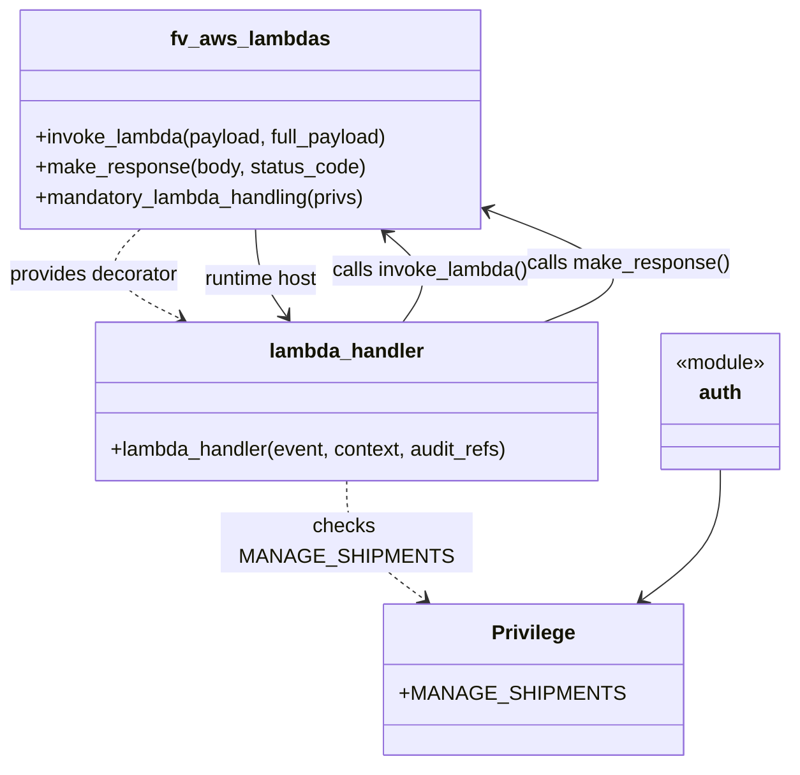

# Diagram: shipment_core/shipment_service/shipment_service/trip/delete_trip.py

> Auto-generated by Obscura crawlers

## Mermaid

### SVG

<svg id="container" width="643.04296875" xmlns="http://www.w3.org/2000/svg" class="classDiagram" height="608" viewBox="0 0 643.04296875 608" role="graphics-document document" aria-roledescription="class"><g><defs><marker id="container_class-aggregationStart" class="marker aggregation class" refX="18" refY="7" markerWidth="190" markerHeight="240" orient="auto"><path d="M 18,7 L9,13 L1,7 L9,1 Z"></path></marker></defs><defs><marker id="container_class-aggregationEnd" class="marker aggregation class" refX="1" refY="7" markerWidth="20" markerHeight="28" orient="auto"><path d="M 18,7 L9,13 L1,7 L9,1 Z"></path></marker></defs><defs><marker id="container_class-extensionStart" class="marker extension class" refX="18" refY="7" markerWidth="190" markerHeight="240" orient="auto"><path d="M 1,7 L18,13 V 1 Z"></path></marker></defs><defs><marker id="container_class-extensionEnd" class="marker extension class" refX="1" refY="7" markerWidth="20" markerHeight="28" orient="auto"><path d="M 1,1 V 13 L18,7 Z"></path></marker></defs><defs><marker id="container_class-compositionStart" class="marker composition class" refX="18" refY="7" markerWidth="190" markerHeight="240" orient="auto"><path d="M 18,7 L9,13 L1,7 L9,1 Z"></path></marker></defs><defs><marker id="container_class-compositionEnd" class="marker composition class" refX="1" refY="7" markerWidth="20" markerHeight="28" orient="auto"><path d="M 18,7 L9,13 L1,7 L9,1 Z"></path></marker></defs><defs><marker id="container_class-dependencyStart" class="marker dependency class" refX="6" refY="7" markerWidth="190" markerHeight="240" orient="auto"><path d="M 5,7 L9,13 L1,7 L9,1 Z"></path></marker></defs><defs><marker id="container_class-dependencyEnd" class="marker dependency class" refX="13" refY="7" markerWidth="20" markerHeight="28" orient="auto"><path d="M 18,7 L9,13 L14,7 L9,1 Z"></path></marker></defs><defs><marker id="container_class-lollipopStart" class="marker lollipop class" refX="13" refY="7" markerWidth="190" markerHeight="240" orient="auto"><circle stroke="black" fill="transparent" cx="7" cy="7" r="6"></circle></marker></defs><defs><marker id="container_class-lollipopEnd" class="marker lollipop class" refX="1" refY="7" markerWidth="190" markerHeight="240" orient="auto"><circle stroke="black" fill="transparent" cx="7" cy="7" r="6"></circle></marker></defs><g class="root"><g class="clusters"></g><g class="edgePaths"><path d="M115.023,182L108.619,188.167C102.216,194.333,89.409,206.667,94.955,218.567C100.502,230.468,124.402,241.936,136.352,247.67L148.302,253.404" id="id_fv_aws_lambdas_lambda_handler_1" class="edge-thickness-normal edge-pattern-dashed relation" style=";;;" data-edge="true" data-et="edge" data-id="id_fv_aws_lambdas_lambda_handler_1" data-points="W3sieCI6MTE1LjAyMjk4MDcyMDc2NjEzLCJ5IjoxODJ9LHsieCI6NzYuNjAxNTYyNSwieSI6MjE5fSx7IngiOjE1My43MTE4NzUsInkiOjI1Nn1d" marker-end="url(#container_class-dependencyEnd)"></path><path d="M210.092,182L210.427,188.167C210.762,194.333,211.432,206.667,215.673,218.192C219.915,229.717,227.729,240.434,231.635,245.793L235.542,251.152" id="id_fv_aws_lambdas_lambda_handler_2" class="edge-thickness-normal edge-pattern-solid relation" style=";;;" data-edge="true" data-et="edge" data-id="id_fv_aws_lambdas_lambda_handler_2" data-points="W3sieCI6MjEwLjA5MTUyOTEwNzg2MjksInkiOjE4Mn0seyJ4IjoyMTIuMTAxNTYyNSwieSI6MjE5fSx7IngiOjIzOS4wNzY4NzUsInkiOjI1Nn1d" marker-end="url(#container_class-dependencyEnd)"></path><path d="M330.939,256L335.435,249.833C339.931,243.667,348.922,231.333,346.608,219.631C344.293,207.928,330.672,196.856,323.862,191.32L317.051,185.785" id="id_lambda_handler_fv_aws_lambdas_3" class="edge-thickness-normal edge-pattern-solid relation" style=";;;" data-edge="true" data-et="edge" data-id="id_lambda_handler_fv_aws_lambdas_3" data-points="W3sieCI6MzMwLjkzODc1LCJ5IjoyNTZ9LHsieCI6MzU3LjkxNDA2MjUsInkiOjIxOX0seyJ4IjozMTIuMzk1NDYwNTU5NDc1OCwieSI6MTgyfV0=" marker-end="url(#container_class-dependencyEnd)"></path><path d="M443.965,256L459.524,249.833C475.083,243.667,506.202,231.333,498.096,216.327C489.99,201.32,442.66,183.64,418.995,174.8L395.33,165.96" id="id_lambda_handler_fv_aws_lambdas_4" class="edge-thickness-normal edge-pattern-solid relation" style=";;;" data-edge="true" data-et="edge" data-id="id_lambda_handler_fv_aws_lambdas_4" data-points="W3sieCI6NDQzLjk2NDY4NzQ5OTk5OTk3LCJ5IjoyNTZ9LHsieCI6NTM3LjMyMDMxMjUsInkiOjIxOX0seyJ4IjozODkuNzA4OTg0Mzc1LCJ5IjoxNjMuODYwNTk3NDMxMTc1NH1d" marker-end="url(#container_class-dependencyEnd)"></path><path d="M285.008,382L285.008,390.167C285.008,398.333,285.008,414.667,295.49,430.414C305.972,446.161,326.936,461.323,337.418,468.903L347.899,476.484" id="id_lambda_handler_Privilege_5" class="edge-thickness-normal edge-pattern-dashed relation" style=";;;" data-edge="true" data-et="edge" data-id="id_lambda_handler_Privilege_5" data-points="W3sieCI6Mjg1LjAwNzgxMjUsInkiOjM4Mn0seyJ4IjoyODUuMDA3ODEyNSwieSI6NDMxfSx7IngiOjM1Mi43NjEyMzQ5NDgzOTQ1MywieSI6NDgwfV0=" marker-end="url(#container_class-dependencyEnd)"></path><path d="M586.441,373L586.441,382.667C586.441,392.333,586.441,411.667,575.959,428.914C565.478,446.161,544.514,461.323,534.032,468.903L523.55,476.484" id="id_auth_Privilege_6" class="edge-thickness-normal edge-pattern-solid relation" style=";;;" data-edge="true" data-et="edge" data-id="id_auth_Privilege_6" data-points="W3sieCI6NTg2LjQ0MTQwNjI1LCJ5IjozNzN9LHsieCI6NTg2LjQ0MTQwNjI1LCJ5Ijo0MzF9LHsieCI6NTE4LjY4Nzk4MzgwMTYwNTUsInkiOjQ4MH1d" marker-end="url(#container_class-dependencyEnd)"></path></g><g class="edgeLabels"><g class="edgeLabel" transform="translate(76.6015625, 219)"><g class="label" data-id="id_fv_aws_lambdas_lambda_handler_1" transform="translate(-68.6015625, -12)"><foreignObject width="137.203125" height="24">

provides decorator

</foreignObject></g></g><g class="edgeLabel" transform="translate(214.67448, 222.52908)"><g class="label" data-id="id_fv_aws_lambdas_lambda_handler_2" transform="translate(-46.8984375, -12)"><foreignObject width="93.796875" height="24">

runtime host

</foreignObject></g></g><g class="edgeLabel" transform="translate(352.92057, 214.94102)"><g class="label" data-id="id_lambda_handler_fv_aws_lambdas_3" transform="translate(-78.9140625, -12)"><foreignObject width="157.828125" height="24">

calls invoke_lambda()

</foreignObject></g></g><g class="edgeLabel" transform="translate(510.55043, 209.00026)"><g class="label" data-id="id_lambda_handler_fv_aws_lambdas_4" transform="translate(-80.4921875, -12)"><foreignObject width="160.984375" height="24">

calls make_response()

</foreignObject></g></g><g class="edgeLabel" transform="translate(285.0078125, 431)"><g class="label" data-id="id_lambda_handler_Privilege_5" transform="translate(-100, -24)"><foreignObject width="200" height="48">

checks MANAGE_SHIPMENTS

</foreignObject></g></g><g class="edgeLabel"><g class="label" data-id="id_auth_Privilege_6" transform="translate(0, 0)"><foreignObject width="0" height="0">

</foreignObject></g></g></g><g class="nodes"><g class="node default" id="classId-fv_aws_lambdas-0" transform="translate(205.365234375, 95)"><g class="basic label-container"><path d="M-184.34375 -87 L184.34375 -87 L184.34375 87 L-184.34375 87" stroke="none" stroke-width="0" fill="#ECECFF" style=""></path><path d="M-184.34375 -87 C-61.802367135744916 -87, 60.73901572851017 -87, 184.34375 -87 M-184.34375 -87 C-109.84035787390063 -87, -35.33696574780126 -87, 184.34375 -87 M184.34375 -87 C184.34375 -29.59013467168056, 184.34375 27.819730656638882, 184.34375 87 M184.34375 -87 C184.34375 -34.408065271053424, 184.34375 18.183869457893152, 184.34375 87 M184.34375 87 C109.31189123223992 87, 34.28003246447983 87, -184.34375 87 M184.34375 87 C73.54451626609615 87, -37.254717467807694 87, -184.34375 87 M-184.34375 87 C-184.34375 48.777904573035755, -184.34375 10.55580914607151, -184.34375 -87 M-184.34375 87 C-184.34375 35.242711746624984, -184.34375 -16.514576506750032, -184.34375 -87" stroke="#9370DB" stroke-width="1.3" fill="none" stroke-dasharray="0 0" style=""></path></g><g class="annotation-group text" transform="translate(0, -63)"></g><g class="label-group text" transform="translate(-60.0625, -63)"><g class="label" style="font-weight: bolder" transform="translate(0,-12)"><foreignObject width="120.125" height="24">

fv_aws_lambdas

</foreignObject></g></g><g class="members-group text" transform="translate(-172.34375, -15)"></g><g class="methods-group text" transform="translate(-172.34375, 15)"><g class="label" style="" transform="translate(0,-12)"><foreignObject width="284.625" height="24">

+invoke_lambda(payload, full_payload)

</foreignObject></g><g class="label" style="" transform="translate(0,12)"><foreignObject width="262.609375" height="24">

+make_response(body, status_code)

</foreignObject></g><g class="label" style="" transform="translate(0,36)"><foreignObject width="267.5" height="24">

+mandatory_lambda_handling(privs)

</foreignObject></g></g><g class="divider" style=""><path d="M-184.34375 -39 C-68.2432004575952 -39, 47.85734908480961 -39, 184.34375 -39 M-184.34375 -39 C-96.2787548812717 -39, -8.21375976254339 -39, 184.34375 -39" stroke="#9370DB" stroke-width="1.3" fill="none" stroke-dasharray="0 0" style=""></path></g><g class="divider" style=""><path d="M-184.34375 -15 C-95.33820446406041 -15, -6.332658928120821 -15, 184.34375 -15 M-184.34375 -15 C-84.56598389859735 -15, 15.211782202805296 -15, 184.34375 -15" stroke="#9370DB" stroke-width="1.3" fill="none" stroke-dasharray="0 0" style=""></path></g></g><g class="node default" id="classId-auth-1" transform="translate(586.44140625, 319)"><g class="basic label-container"><path d="M-48.6015625 -54 L48.6015625 -54 L48.6015625 54 L-48.6015625 54" stroke="none" stroke-width="0" fill="#ECECFF" style=""></path><path d="M-48.6015625 -54 C-24.423102554921936 -54, -0.2446426098438721 -54, 48.6015625 -54 M-48.6015625 -54 C-17.106773170676433 -54, 14.388016158647133 -54, 48.6015625 -54 M48.6015625 -54 C48.6015625 -21.534862355298657, 48.6015625 10.930275289402687, 48.6015625 54 M48.6015625 -54 C48.6015625 -16.162166746667637, 48.6015625 21.675666506664726, 48.6015625 54 M48.6015625 54 C11.918789302304631 54, -24.763983895390737 54, -48.6015625 54 M48.6015625 54 C28.066032825785054 54, 7.530503151570109 54, -48.6015625 54 M-48.6015625 54 C-48.6015625 27.441092787801068, -48.6015625 0.8821855756021364, -48.6015625 -54 M-48.6015625 54 C-48.6015625 17.47664431881408, -48.6015625 -19.046711362371838, -48.6015625 -54" stroke="#9370DB" stroke-width="1.3" fill="none" stroke-dasharray="0 0" style=""></path></g><g class="annotation-group text" transform="translate(-36.6015625, -30)"><g class="label" style="" transform="translate(0,-12)"><foreignObject width="73.203125" height="24">

«module»

</foreignObject></g></g><g class="label-group text" transform="translate(-16.6640625, -6)"><g class="label" style="font-weight: bolder" transform="translate(0,-12)"><foreignObject width="33.328125" height="24">

auth

</foreignObject></g></g><g class="members-group text" transform="translate(-36.6015625, 42)"></g><g class="methods-group text" transform="translate(-36.6015625, 72)"></g><g class="divider" style=""><path d="M-48.6015625 18 C-23.10071724231929 18, 2.4001280153614175 18, 48.6015625 18 M-48.6015625 18 C-21.21219676221823 18, 6.177168975563539 18, 48.6015625 18" stroke="#9370DB" stroke-width="1.3" fill="none" stroke-dasharray="0 0" style=""></path></g><g class="divider" style=""><path d="M-48.6015625 36 C-11.81531254629057 36, 24.97093740741886 36, 48.6015625 36 M-48.6015625 36 C-19.313421489935276 36, 9.974719520129447 36, 48.6015625 36" stroke="#9370DB" stroke-width="1.3" fill="none" stroke-dasharray="0 0" style=""></path></g></g><g class="node default" id="classId-Privilege-2" transform="translate(435.724609375, 540)"><g class="basic label-container"><path d="M-106.90234375 -60 L106.90234375 -60 L106.90234375 60 L-106.90234375 60" stroke="none" stroke-width="0" fill="#ECECFF" style=""></path><path d="M-106.90234375 -60 C-42.82337683454551 -60, 21.255590080908974 -60, 106.90234375 -60 M-106.90234375 -60 C-22.954237410509094 -60, 60.99386892898181 -60, 106.90234375 -60 M106.90234375 -60 C106.90234375 -24.046721952174806, 106.90234375 11.906556095650387, 106.90234375 60 M106.90234375 -60 C106.90234375 -31.153838733819857, 106.90234375 -2.3076774676397136, 106.90234375 60 M106.90234375 60 C57.392957759652326 60, 7.883571769304652 60, -106.90234375 60 M106.90234375 60 C39.60543291709146 60, -27.691477915817075 60, -106.90234375 60 M-106.90234375 60 C-106.90234375 34.999753503508586, -106.90234375 9.99950700701718, -106.90234375 -60 M-106.90234375 60 C-106.90234375 31.51560240961996, -106.90234375 3.0312048192399175, -106.90234375 -60" stroke="#9370DB" stroke-width="1.3" fill="none" stroke-dasharray="0 0" style=""></path></g><g class="annotation-group text" transform="translate(0, -36)"></g><g class="label-group text" transform="translate(-31.8671875, -36)"><g class="label" style="font-weight: bolder" transform="translate(0,-12)"><foreignObject width="63.734375" height="24">

Privilege

</foreignObject></g></g><g class="members-group text" transform="translate(-94.90234375, 12)"><g class="label" style="" transform="translate(0,-12)"><foreignObject width="157.9375" height="24">

+MANAGE_SHIPMENTS

</foreignObject></g></g><g class="methods-group text" transform="translate(-94.90234375, 60)"></g><g class="divider" style=""><path d="M-106.90234375 -12 C-51.494369168929104 -12, 3.9136054121417914 -12, 106.90234375 -12 M-106.90234375 -12 C-47.06569717048056 -12, 12.770949409038877 -12, 106.90234375 -12" stroke="#9370DB" stroke-width="1.3" fill="none" stroke-dasharray="0 0" style=""></path></g><g class="divider" style=""><path d="M-106.90234375 36 C-35.08040707492509 36, 36.74152960014982 36, 106.90234375 36 M-106.90234375 36 C-61.959217014642114 36, -17.016090279284228 36, 106.90234375 36" stroke="#9370DB" stroke-width="1.3" fill="none" stroke-dasharray="0 0" style=""></path></g></g><g class="node default" id="classId-lambda_handler-3" transform="translate(285.0078125, 319)"><g class="basic label-container"><path d="M-202.83203125 -63 L202.83203125 -63 L202.83203125 63 L-202.83203125 63" stroke="none" stroke-width="0" fill="#ECECFF" style=""></path><path d="M-202.83203125 -63 C-104.1210327414867 -63, -5.410034232973402 -63, 202.83203125 -63 M-202.83203125 -63 C-74.51969497343 -63, 53.79264130313999 -63, 202.83203125 -63 M202.83203125 -63 C202.83203125 -21.30473323122967, 202.83203125 20.390533537540662, 202.83203125 63 M202.83203125 -63 C202.83203125 -31.75606635318967, 202.83203125 -0.5121327063793402, 202.83203125 63 M202.83203125 63 C65.16978538435256 63, -72.49246048129487 63, -202.83203125 63 M202.83203125 63 C99.57056390205003 63, -3.6909034458999486 63, -202.83203125 63 M-202.83203125 63 C-202.83203125 20.16058189869441, -202.83203125 -22.67883620261118, -202.83203125 -63 M-202.83203125 63 C-202.83203125 30.907439129506642, -202.83203125 -1.185121740986716, -202.83203125 -63" stroke="#9370DB" stroke-width="1.3" fill="none" stroke-dasharray="0 0" style=""></path></g><g class="annotation-group text" transform="translate(0, -39)"></g><g class="label-group text" transform="translate(-59.9765625, -39)"><g class="label" style="font-weight: bolder" transform="translate(0,-12)"><foreignObject width="119.953125" height="24">

lambda_handler

</foreignObject></g></g><g class="members-group text" transform="translate(-190.83203125, 9)"></g><g class="methods-group text" transform="translate(-190.83203125, 39)"><g class="label" style="" transform="translate(0,-12)"><foreignObject width="321.6875" height="24">

+lambda_handler(event, context, audit_refs)

</foreignObject></g></g><g class="divider" style=""><path d="M-202.83203125 -15 C-68.67298904725703 -15, 65.48605315548593 -15, 202.83203125 -15 M-202.83203125 -15 C-88.91638107275269 -15, 24.99926910449463 -15, 202.83203125 -15" stroke="#9370DB" stroke-width="1.3" fill="none" stroke-dasharray="0 0" style=""></path></g><g class="divider" style=""><path d="M-202.83203125 9 C-51.78370433899593 9, 99.26462257200814 9, 202.83203125 9 M-202.83203125 9 C-62.844569135865726 9, 77.14289297826855 9, 202.83203125 9" stroke="#9370DB" stroke-width="1.3" fill="none" stroke-dasharray="0 0" style=""></path></g></g></g></g></g></svg>
