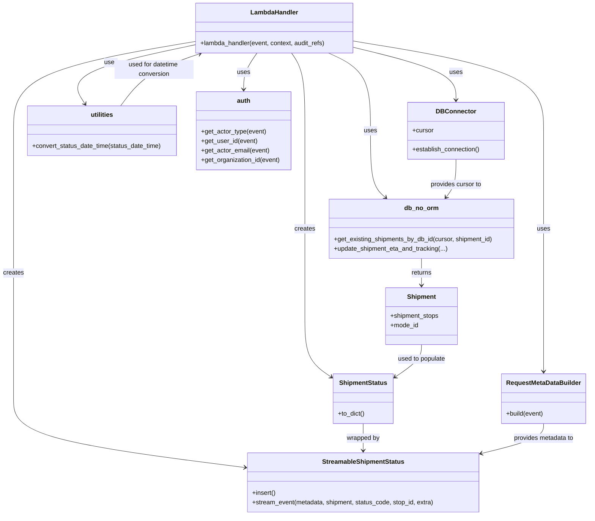

# Diagram: shipment_core/shipment_service/shipment_service/unknown_code/unknown_code.py


> Auto-generated by Obscura crawlers

## Diagram 1

```mermaid
flowchart TD
    Event[Incoming Event] -->|auth.get_actor_type / get_user_id / get_actor_email / get_organization_id| Auth[Auth Extraction]
    Event -->|fv.aws.lambdas.get_event_body| Body[Parse Event Body]
    Body -->|extract status.status.status_date_time| ParseDT[Convert Status DateTime]
    Body --> AssetEquip{status.equip present?}
    AssetEquip -->|obc_asset_identifier| Asset[Asset ID]
    AssetEquip -->|trailer_number| Trailer[Trailer Number]
    Body -->|extract header/carrier_id| Carrier[Carrier ID]
    Body -->|extract pathParameters.shipment_db_id| ShipmentId[Shipment DB ID]
    DB_CONN[DB_CONN.establish_connection()] --> Cursor[DB Cursor]
    ShipmentId -->|db_no_orm.get_existing_shipments_by_db_id(cursor, shipment_id)| ShipmentObj[Shipment (with stops, mode_id)]
    Body -->|extract status.location.sequence (optional)| Sequence[Sequence ID]
    Sequence -->|if present| GetStop[get_stop_id(...)]
    GetStop --> StopId[Stop ID or null]
    ShipmentObj -->|construct ShipmentStatus| SS[ShipmentStatus instance]
    SS -->|RequestMetaDataBuilder.build(event)| Metadata[RequestMetaData]
    SS -->|StreamableShipmentStatus(ss).insert().stream_event(...)| Stream[Stream Event]
    Stream -->|returns| StreamAck[Streamed]
    SS -->|if status_code == "AG" and shipment.mode == TRUCK_MODE| AGCheck{AG status & Truck mode?}
    AGCheck -->|true| UpdateETA[db_no_orm.update_shipment_eta_and_tracking(...)]
    UpdateETA -->|updates| ShipmentObj
    StreamAck -->|return| Response[make_response({"shipment_status": ss.to_dict()})]
    ParseDT -->|on parse error| BadRequest[raise BadRequestError]
    GetStop -->|on invalid sequence| BadRequest
```

> SVG rendering failed for this diagram.

## Diagram 2



### SVG

<svg id="container" width="1500.740234375" xmlns="http://www.w3.org/2000/svg" class="classDiagram" height="1304" viewBox="0 0 1500.740234375 1304" role="graphics-document document" aria-roledescription="class"><style>#container{font-family:"trebuchet ms",verdana,arial,sans-serif;font-size:16px;fill:#333;}@keyframes edge-animation-frame{from{stroke-dashoffset:0;}}@keyframes dash{to{stroke-dashoffset:0;}}#container .edge-animation-slow{stroke-dasharray:9,5!important;stroke-dashoffset:900;animation:dash 50s linear infinite;stroke-linecap:round;}#container .edge-animation-fast{stroke-dasharray:9,5!important;stroke-dashoffset:900;animation:dash 20s linear infinite;stroke-linecap:round;}#container .error-icon{fill:#552222;}#container .error-text{fill:#552222;stroke:#552222;}#container .edge-thickness-normal{stroke-width:1px;}#container .edge-thickness-thick{stroke-width:3.5px;}#container .edge-pattern-solid{stroke-dasharray:0;}#container .edge-thickness-invisible{stroke-width:0;fill:none;}#container .edge-pattern-dashed{stroke-dasharray:3;}#container .edge-pattern-dotted{stroke-dasharray:2;}#container .marker{fill:#333333;stroke:#333333;}#container .marker.cross{stroke:#333333;}#container svg{font-family:"trebuchet ms",verdana,arial,sans-serif;font-size:16px;}#container p{margin:0;}#container g.classGroup text{fill:#9370DB;stroke:none;font-family:"trebuchet ms",verdana,arial,sans-serif;font-size:10px;}#container g.classGroup text .title{font-weight:bolder;}#container .nodeLabel,#container .edgeLabel{color:#131300;}#container .edgeLabel .label rect{fill:#ECECFF;}#container .label text{fill:#131300;}#container .labelBkg{background:#ECECFF;}#container .edgeLabel .label span{background:#ECECFF;}#container .classTitle{font-weight:bolder;}#container .node rect,#container .node circle,#container .node ellipse,#container .node polygon,#container .node path{fill:#ECECFF;stroke:#9370DB;stroke-width:1px;}#container .divider{stroke:#9370DB;stroke-width:1;}#container g.clickable{cursor:pointer;}#container g.classGroup rect{fill:#ECECFF;stroke:#9370DB;}#container g.classGroup line{stroke:#9370DB;stroke-width:1;}#container .classLabel .box{stroke:none;stroke-width:0;fill:#ECECFF;opacity:0.5;}#container .classLabel .label{fill:#9370DB;font-size:10px;}#container .relation{stroke:#333333;stroke-width:1;fill:none;}#container .dashed-line{stroke-dasharray:3;}#container .dotted-line{stroke-dasharray:1 2;}#container #compositionStart,#container .composition{fill:#333333!important;stroke:#333333!important;stroke-width:1;}#container #compositionEnd,#container .composition{fill:#333333!important;stroke:#333333!important;stroke-width:1;}#container #dependencyStart,#container .dependency{fill:#333333!important;stroke:#333333!important;stroke-width:1;}#container #dependencyStart,#container .dependency{fill:#333333!important;stroke:#333333!important;stroke-width:1;}#container #extensionStart,#container .extension{fill:transparent!important;stroke:#333333!important;stroke-width:1;}#container #extensionEnd,#container .extension{fill:transparent!important;stroke:#333333!important;stroke-width:1;}#container #aggregationStart,#container .aggregation{fill:transparent!important;stroke:#333333!important;stroke-width:1;}#container #aggregationEnd,#container .aggregation{fill:transparent!important;stroke:#333333!important;stroke-width:1;}#container #lollipopStart,#container .lollipop{fill:#ECECFF!important;stroke:#333333!important;stroke-width:1;}#container #lollipopEnd,#container .lollipop{fill:#ECECFF!important;stroke:#333333!important;stroke-width:1;}#container .edgeTerminals{font-size:11px;line-height:initial;}#container .classTitleText{text-anchor:middle;font-size:18px;fill:#333;}#container .label-icon{display:inline-block;height:1em;overflow:visible;vertical-align:-0.125em;}#container .node .label-icon path{fill:currentColor;stroke:revert;stroke-width:revert;}#container :root{--mermaid-font-family:"trebuchet ms",verdana,arial,sans-serif;}</style><g><defs><marker id="container_class-aggregationStart" class="marker aggregation class" refX="18" refY="7" markerWidth="190" markerHeight="240" orient="auto"><path d="M 18,7 L9,13 L1,7 L9,1 Z"></path></marker></defs><defs><marker id="container_class-aggregationEnd" class="marker aggregation class" refX="1" refY="7" markerWidth="20" markerHeight="28" orient="auto"><path d="M 18,7 L9,13 L1,7 L9,1 Z"></path></marker></defs><defs><marker id="container_class-extensionStart" class="marker extension class" refX="18" refY="7" markerWidth="190" markerHeight="240" orient="auto"><path d="M 1,7 L18,13 V 1 Z"></path></marker></defs><defs><marker id="container_class-extensionEnd" class="marker extension class" refX="1" refY="7" markerWidth="20" markerHeight="28" orient="auto"><path d="M 1,1 V 13 L18,7 Z"></path></marker></defs><defs><marker id="container_class-compositionStart" class="marker composition class" refX="18" refY="7" markerWidth="190" markerHeight="240" orient="auto"><path d="M 18,7 L9,13 L1,7 L9,1 Z"></path></marker></defs><defs><marker id="container_class-compositionEnd" class="marker composition class" refX="1" refY="7" markerWidth="20" markerHeight="28" orient="auto"><path d="M 18,7 L9,13 L1,7 L9,1 Z"></path></marker></defs><defs><marker id="container_class-dependencyStart" class="marker dependency class" refX="6" refY="7" markerWidth="190" markerHeight="240" orient="auto"><path d="M 5,7 L9,13 L1,7 L9,1 Z"></path></marker></defs><defs><marker id="container_class-dependencyEnd" class="marker dependency class" refX="13" refY="7" markerWidth="20" markerHeight="28" orient="auto"><path d="M 18,7 L9,13 L14,7 L9,1 Z"></path></marker></defs><defs><marker id="container_class-lollipopStart" class="marker lollipop class" refX="13" refY="7" markerWidth="190" markerHeight="240" orient="auto"><circle stroke="black" fill="transparent" cx="7" cy="7" r="6"></circle></marker></defs><defs><marker id="container_class-lollipopEnd" class="marker lollipop class" refX="1" refY="7" markerWidth="190" markerHeight="240" orient="auto"><circle stroke="black" fill="transparent" cx="7" cy="7" r="6"></circle></marker></defs><g class="root"><g class="clusters"></g><g class="edgePaths"><path d="M903.924,119.914L947.334,130.429C990.745,140.943,1077.566,161.971,1120.976,184.152C1164.387,206.333,1164.387,229.667,1164.387,241.333L1164.387,253" id="id_LambdaHandler_DBConnector_1" class="edge-thickness-normal edge-pattern-solid relation" style=";;;" data-edge="true" data-et="edge" data-id="id_LambdaHandler_DBConnector_1" data-points="W3sieCI6OTAzLjkyMzgyODEyNSwieSI6MTE5LjkxNDI4NzY0NTEzODI3fSx7IngiOjExNjQuMzg2NzE4NzUsInkiOjE4M30seyJ4IjoxMTY0LjM4NjcxODc1LCJ5IjoyNTl9XQ==" marker-end="url(#container_class-dependencyEnd)"></path><path d="M658,134L652.3,142.167C646.6,150.333,635.201,166.667,629.501,182C623.801,197.333,623.801,211.667,623.801,218.833L623.801,226" id="id_LambdaHandler_auth_2" class="edge-thickness-normal edge-pattern-solid relation" style=";;;" data-edge="true" data-et="edge" data-id="id_LambdaHandler_auth_2" data-points="W3sieCI6NjU4LjAwMDEyMjA3MDMxMjUsInkiOjEzNH0seyJ4Ijo2MjMuODAwNzgxMjUsInkiOjE4M30seyJ4Ijo2MjMuODAwNzgxMjUsInkiOjIzMn1d" marker-end="url(#container_class-dependencyEnd)"></path><path d="M500.018,113.181L444.305,124.818C388.592,136.454,277.166,159.727,230.013,184.689C182.861,209.651,199.981,236.301,208.542,249.627L217.102,262.952" id="id_LambdaHandler_utilities_3" class="edge-thickness-normal edge-pattern-solid relation" style=";;;" data-edge="true" data-et="edge" data-id="id_LambdaHandler_utilities_3" data-points="W3sieCI6NTAwLjAxNzU3ODEyNSwieSI6MTEzLjE4MTAyMzQ5Mjk4ODUzfSx7IngiOjE2NS43NDAyMzQzNzUsInkiOjE4M30seyJ4IjoyMjAuMzQ0NzkyNTQ2NDUyNywieSI6MjY4fV0=" marker-end="url(#container_class-dependencyEnd)"></path><path d="M839.818,134L857.688,142.167C875.557,150.333,911.295,166.667,929.164,199.5C947.033,232.333,947.033,281.667,947.033,329C947.033,376.333,947.033,421.667,953.454,449.848C959.876,478.03,972.718,489.06,979.139,494.576L985.56,500.091" id="id_LambdaHandler_db_no_orm_4" class="edge-thickness-normal edge-pattern-solid relation" style=";;;" data-edge="true" data-et="edge" data-id="id_LambdaHandler_db_no_orm_4" data-points="W3sieCI6ODM5LjgxODM1OTM3NSwieSI6MTM0fSx7IngiOjk0Ny4wMzMyMDMxMjUsInkiOjE4M30seyJ4Ijo5NDcuMDMzMjAzMTI1LCJ5IjozMzF9LHsieCI6OTQ3LjAzMzIwMzEyNSwieSI6NDY3fSx7IngiOjk5MC4xMTE5MDM1OTkzMzA0LCJ5Ijo1MDR9XQ==" marker-end="url(#container_class-dependencyEnd)"></path><path d="M903.924,104.023L984.42,117.186C1064.916,130.349,1225.908,156.674,1306.404,194.504C1386.9,232.333,1386.9,281.667,1386.9,329C1386.9,376.333,1386.9,421.667,1386.9,463C1386.9,504.333,1386.9,541.667,1386.9,579C1386.9,616.333,1386.9,653.667,1386.9,690.5C1386.9,727.333,1386.9,763.667,1386.9,800C1386.9,836.333,1386.9,872.667,1386.9,896C1386.9,919.333,1386.9,929.667,1386.9,934.833L1386.9,940" id="id_LambdaHandler_RequestMetaDataBuilder_5" class="edge-thickness-normal edge-pattern-solid relation" style=";;;" data-edge="true" data-et="edge" data-id="id_LambdaHandler_RequestMetaDataBuilder_5" data-points="W3sieCI6OTAzLjkyMzgyODEyNSwieSI6MTA0LjAyMzQ2MjcxODU3Mjg0fSx7IngiOjEzODYuOTAwMzkwNjI1LCJ5IjoxODN9LHsieCI6MTM4Ni45MDAzOTA2MjUsInkiOjMzMX0seyJ4IjoxMzg2LjkwMDM5MDYyNSwieSI6NDY3fSx7IngiOjEzODYuOTAwMzkwNjI1LCJ5Ijo1Nzl9LHsieCI6MTM4Ni45MDAzOTA2MjUsInkiOjY5MX0seyJ4IjoxMzg2LjkwMDM5MDYyNSwieSI6ODAwfSx7IngiOjEzODYuOTAwMzkwNjI1LCJ5Ijo5MDl9LHsieCI6MTM4Ni45MDAzOTA2MjUsInkiOjk0Nn1d" marker-end="url(#container_class-dependencyEnd)"></path><path d="M500.018,104.871L422.377,117.892C344.736,130.914,189.454,156.957,111.813,194.645C34.172,232.333,34.172,281.667,34.172,329C34.172,376.333,34.172,421.667,34.172,463C34.172,504.333,34.172,541.667,34.172,579C34.172,616.333,34.172,653.667,34.172,690.5C34.172,727.333,34.172,763.667,34.172,800C34.172,836.333,34.172,872.667,34.172,907.5C34.172,942.333,34.172,975.667,34.172,1009C34.172,1042.333,34.172,1075.667,133.22,1104.733C232.267,1133.8,430.363,1158.601,529.411,1171.001L628.459,1183.401" id="id_LambdaHandler_StreamableShipmentStatus_6" class="edge-thickness-normal edge-pattern-solid relation" style=";;;" data-edge="true" data-et="edge" data-id="id_LambdaHandler_StreamableShipmentStatus_6" data-points="W3sieCI6NTAwLjAxNzU3ODEyNSwieSI6MTA0Ljg3MDYwNDUxMDUwNDE0fSx7IngiOjM0LjE3MTg3NSwieSI6MTgzfSx7IngiOjM0LjE3MTg3NSwieSI6MzMxfSx7IngiOjM0LjE3MTg3NSwieSI6NDY3fSx7IngiOjM0LjE3MTg3NSwieSI6NTc5fSx7IngiOjM0LjE3MTg3NSwieSI6NjkxfSx7IngiOjM0LjE3MTg3NSwieSI6ODAwfSx7IngiOjM0LjE3MTg3NSwieSI6OTA5fSx7IngiOjM0LjE3MTg3NSwieSI6MTAwOX0seyJ4IjozNC4xNzE4NzUsInkiOjExMDl9LHsieCI6NjM0LjQxMjEwOTM3NSwieSI6MTE4NC4xNDYxNjc0OTk1NTc4fV0=" marker-end="url(#container_class-dependencyEnd)"></path><path d="M745.941,134L751.641,142.167C757.341,150.333,768.741,166.667,774.441,199.5C780.141,232.333,780.141,281.667,780.141,329C780.141,376.333,780.141,421.667,780.141,463C780.141,504.333,780.141,541.667,780.141,579C780.141,616.333,780.141,653.667,780.141,690.5C780.141,727.333,780.141,763.667,780.141,800C780.141,836.333,780.141,872.667,791.508,898.48C802.875,924.294,825.61,939.589,836.977,947.236L848.344,954.883" id="id_LambdaHandler_ShipmentStatus_7" class="edge-thickness-normal edge-pattern-solid relation" style=";;;" data-edge="true" data-et="edge" data-id="id_LambdaHandler_ShipmentStatus_7" data-points="W3sieCI6NzQ1Ljk0MTI4NDE3OTY4NzUsInkiOjEzNH0seyJ4Ijo3ODAuMTQwNjI1LCJ5IjoxODN9LHsieCI6NzgwLjE0MDYyNSwieSI6MzMxfSx7IngiOjc4MC4xNDA2MjUsInkiOjQ2N30seyJ4Ijo3ODAuMTQwNjI1LCJ5Ijo1Nzl9LHsieCI6NzgwLjE0MDYyNSwieSI6NjkxfSx7IngiOjc4MC4xNDA2MjUsInkiOjgwMH0seyJ4Ijo3ODAuMTQwNjI1LCJ5Ijo5MDl9LHsieCI6ODUzLjMyMjI2NTYyNSwieSI6OTU4LjIzMjAwMjMxMjUzMzd9XQ==" marker-end="url(#container_class-dependencyEnd)"></path><path d="M1164.387,403L1164.387,413.667C1164.387,424.333,1164.387,445.667,1160.212,461.71C1156.038,477.754,1147.689,488.507,1143.515,493.884L1139.341,499.261" id="id_DBConnector_db_no_orm_8" class="edge-thickness-normal edge-pattern-solid relation" style=";;;" data-edge="true" data-et="edge" data-id="id_DBConnector_db_no_orm_8" data-points="W3sieCI6MTE2NC4zODY3MTg3NSwieSI6NDAzfSx7IngiOjExNjQuMzg2NzE4NzUsInkiOjQ2N30seyJ4IjoxMTM1LjY2MTEzMjgxMjUsInkiOjUwNH1d" marker-end="url(#container_class-dependencyEnd)"></path><path d="M1077.434,654L1077.434,660.167C1077.434,666.333,1077.434,678.667,1077.434,690C1077.434,701.333,1077.434,711.667,1077.434,716.833L1077.434,722" id="id_db_no_orm_Shipment_9" class="edge-thickness-normal edge-pattern-solid relation" style=";;;" data-edge="true" data-et="edge" data-id="id_db_no_orm_Shipment_9" data-points="W3sieCI6MTA3Ny40MzM1OTM3NSwieSI6NjU0fSx7IngiOjEwNzcuNDMzNTkzNzUsInkiOjY5MX0seyJ4IjoxMDc3LjQzMzU5Mzc1LCJ5Ijo3Mjh9XQ==" marker-end="url(#container_class-dependencyEnd)"></path><path d="M1077.434,872L1077.434,878.167C1077.434,884.333,1077.434,896.667,1066.066,910.48C1054.699,924.294,1031.965,939.589,1020.597,947.236L1009.23,954.883" id="id_Shipment_ShipmentStatus_10" class="edge-thickness-normal edge-pattern-solid relation" style=";;;" data-edge="true" data-et="edge" data-id="id_Shipment_ShipmentStatus_10" data-points="W3sieCI6MTA3Ny40MzM1OTM3NSwieSI6ODcyfSx7IngiOjEwNzcuNDMzNTkzNzUsInkiOjkwOX0seyJ4IjoxMDA0LjI1MTk1MzEyNSwieSI6OTU4LjIzMjAwMjMxMjUzMzd9XQ==" marker-end="url(#container_class-dependencyEnd)"></path><path d="M928.787,1072L928.787,1078.167C928.787,1084.333,928.787,1096.667,928.787,1108C928.787,1119.333,928.787,1129.667,928.787,1134.833L928.787,1140" id="id_ShipmentStatus_StreamableShipmentStatus_11" class="edge-thickness-normal edge-pattern-solid relation" style=";;;" data-edge="true" data-et="edge" data-id="id_ShipmentStatus_StreamableShipmentStatus_11" data-points="W3sieCI6OTI4Ljc4NzEwOTM3NSwieSI6MTA3Mn0seyJ4Ijo5MjguNzg3MTA5Mzc1LCJ5IjoxMTA5fSx7IngiOjkyOC43ODcxMDkzNzUsInkiOjExNDZ9XQ==" marker-end="url(#container_class-dependencyEnd)"></path><path d="M1386.9,1072L1386.9,1078.167C1386.9,1084.333,1386.9,1096.667,1360.582,1109.268C1334.264,1121.869,1281.627,1134.737,1255.309,1141.172L1228.99,1147.606" id="id_RequestMetaDataBuilder_StreamableShipmentStatus_12" class="edge-thickness-normal edge-pattern-solid relation" style=";;;" data-edge="true" data-et="edge" data-id="id_RequestMetaDataBuilder_StreamableShipmentStatus_12" data-points="W3sieCI6MTM4Ni45MDAzOTA2MjUsInkiOjEwNzJ9LHsieCI6MTM4Ni45MDAzOTA2MjUsInkiOjExMDl9LHsieCI6MTIyMy4xNjIxMDkzNzUsInkiOjExNDkuMDMwOTAxMTk5NzIzOH1d" marker-end="url(#container_class-dependencyEnd)"></path><path d="M309.023,268L319.863,253.833C330.703,239.667,352.383,211.333,386.186,189.323C419.99,167.313,465.917,151.626,488.881,143.783L511.844,135.939" id="id_utilities_LambdaHandler_13" class="edge-thickness-normal edge-pattern-solid relation" style=";;;" data-edge="true" data-et="edge" data-id="id_utilities_LambdaHandler_13" data-points="W3sieCI6MzA5LjAyMjUxMzcyNDY2MjIsInkiOjI2OH0seyJ4IjozNzQuMDYyNSwieSI6MTgzfSx7IngiOjUxNy41MjIzMzg4NjcxODc1LCJ5IjoxMzR9XQ==" marker-end="url(#container_class-dependencyEnd)"></path></g><g class="edgeLabels"><g class="edgeLabel" transform="translate(1164.38671875, 183)"><g class="label" data-id="id_LambdaHandler_DBConnector_1" transform="translate(-16.4921875, -12)"><foreignObject width="32.984375" height="24"><div xmlns="http://www.w3.org/1999/xhtml" class="labelBkg" style="display: table-cell; white-space: nowrap; line-height: 1.5; max-width: 200px; text-align: center;"><span class="edgeLabel"><p>uses</p></span></div></foreignObject></g></g><g class="edgeLabel" transform="translate(623.80078125, 183)"><g class="label" data-id="id_LambdaHandler_auth_2" transform="translate(-16.4921875, -12)"><foreignObject width="32.984375" height="24"><div xmlns="http://www.w3.org/1999/xhtml" class="labelBkg" style="display: table-cell; white-space: nowrap; line-height: 1.5; max-width: 200px; text-align: center;"><span class="edgeLabel"><p>uses</p></span></div></foreignObject></g></g><g class="edgeLabel" transform="translate(165.740234375, 183)"><g class="label" data-id="id_LambdaHandler_utilities_3" transform="translate(-16.4921875, -12)"><foreignObject width="32.984375" height="24"><div xmlns="http://www.w3.org/1999/xhtml" class="labelBkg" style="display: table-cell; white-space: nowrap; line-height: 1.5; max-width: 200px; text-align: center;"><span class="edgeLabel"><p>uses</p></span></div></foreignObject></g></g><g class="edgeLabel" transform="translate(947.033203125, 331)"><g class="label" data-id="id_LambdaHandler_db_no_orm_4" transform="translate(-16.4921875, -12)"><foreignObject width="32.984375" height="24"><div xmlns="http://www.w3.org/1999/xhtml" class="labelBkg" style="display: table-cell; white-space: nowrap; line-height: 1.5; max-width: 200px; text-align: center;"><span class="edgeLabel"><p>uses</p></span></div></foreignObject></g></g><g class="edgeLabel" transform="translate(1386.900390625, 579)"><g class="label" data-id="id_LambdaHandler_RequestMetaDataBuilder_5" transform="translate(-16.4921875, -12)"><foreignObject width="32.984375" height="24"><div xmlns="http://www.w3.org/1999/xhtml" class="labelBkg" style="display: table-cell; white-space: nowrap; line-height: 1.5; max-width: 200px; text-align: center;"><span class="edgeLabel"><p>uses</p></span></div></foreignObject></g></g><g class="edgeLabel" transform="translate(34.171875, 691)"><g class="label" data-id="id_LambdaHandler_StreamableShipmentStatus_6" transform="translate(-26.171875, -12)"><foreignObject width="52.34375" height="24"><div xmlns="http://www.w3.org/1999/xhtml" class="labelBkg" style="display: table-cell; white-space: nowrap; line-height: 1.5; max-width: 200px; text-align: center;"><span class="edgeLabel"><p>creates</p></span></div></foreignObject></g></g><g class="edgeLabel" transform="translate(780.140625, 579)"><g class="label" data-id="id_LambdaHandler_ShipmentStatus_7" transform="translate(-26.171875, -12)"><foreignObject width="52.34375" height="24"><div xmlns="http://www.w3.org/1999/xhtml" class="labelBkg" style="display: table-cell; white-space: nowrap; line-height: 1.5; max-width: 200px; text-align: center;"><span class="edgeLabel"><p>creates</p></span></div></foreignObject></g></g><g class="edgeLabel" transform="translate(1164.38671875, 467)"><g class="label" data-id="id_DBConnector_db_no_orm_8" transform="translate(-65.859375, -12)"><foreignObject width="131.71875" height="24"><div xmlns="http://www.w3.org/1999/xhtml" class="labelBkg" style="display: table-cell; white-space: nowrap; line-height: 1.5; max-width: 200px; text-align: center;"><span class="edgeLabel"><p>provides cursor to</p></span></div></foreignObject></g></g><g class="edgeLabel" transform="translate(1077.43359375, 691)"><g class="label" data-id="id_db_no_orm_Shipment_9" transform="translate(-26.265625, -12)"><foreignObject width="52.53125" height="24"><div xmlns="http://www.w3.org/1999/xhtml" class="labelBkg" style="display: table-cell; white-space: nowrap; line-height: 1.5; max-width: 200px; text-align: center;"><span class="edgeLabel"><p>returns</p></span></div></foreignObject></g></g><g class="edgeLabel" transform="translate(1077.43359375, 909)"><g class="label" data-id="id_Shipment_ShipmentStatus_10" transform="translate(-61.8359375, -12)"><foreignObject width="123.671875" height="24"><div xmlns="http://www.w3.org/1999/xhtml" class="labelBkg" style="display: table-cell; white-space: nowrap; line-height: 1.5; max-width: 200px; text-align: center;"><span class="edgeLabel"><p>used to populate</p></span></div></foreignObject></g></g><g class="edgeLabel" transform="translate(928.787109375, 1109)"><g class="label" data-id="id_ShipmentStatus_StreamableShipmentStatus_11" transform="translate(-42.3203125, -12)"><foreignObject width="84.640625" height="24"><div xmlns="http://www.w3.org/1999/xhtml" class="labelBkg" style="display: table-cell; white-space: nowrap; line-height: 1.5; max-width: 200px; text-align: center;"><span class="edgeLabel"><p>wrapped by</p></span></div></foreignObject></g></g><g class="edgeLabel" transform="translate(1386.900390625, 1109)"><g class="label" data-id="id_RequestMetaDataBuilder_StreamableShipmentStatus_12" transform="translate(-77.71875, -12)"><foreignObject width="155.4375" height="24"><div xmlns="http://www.w3.org/1999/xhtml" class="labelBkg" style="display: table-cell; white-space: nowrap; line-height: 1.5; max-width: 200px; text-align: center;"><span class="edgeLabel"><p>provides metadata to</p></span></div></foreignObject></g></g><g class="edgeLabel" transform="translate(395.15048, 175.79721)"><g class="label" data-id="id_utilities_LambdaHandler_13" transform="translate(-100, -24)"><foreignObject width="200" height="48"><div xmlns="http://www.w3.org/1999/xhtml" class="labelBkg" style="display: table; white-space: break-spaces; line-height: 1.5; max-width: 200px; text-align: center; width: 200px;"><span class="edgeLabel"><p>used for datetime conversion</p></span></div></foreignObject></g></g></g><g class="nodes"><g class="node default" id="classId-LambdaHandler-0" transform="translate(701.970703125, 71)"><g class="basic label-container"><path d="M-201.953125 -63 L201.953125 -63 L201.953125 63 L-201.953125 63" stroke="none" stroke-width="0" fill="#ECECFF" style=""></path><path d="M-201.953125 -63 C-99.95328639747405 -63, 2.04655220505191 -63, 201.953125 -63 M-201.953125 -63 C-57.631317621413245 -63, 86.69048975717351 -63, 201.953125 -63 M201.953125 -63 C201.953125 -21.062581378484275, 201.953125 20.87483724303145, 201.953125 63 M201.953125 -63 C201.953125 -22.595794420369124, 201.953125 17.808411159261752, 201.953125 63 M201.953125 63 C113.81309284981135 63, 25.67306069962271 63, -201.953125 63 M201.953125 63 C48.14728783774876 63, -105.65854932450247 63, -201.953125 63 M-201.953125 63 C-201.953125 18.458472839297436, -201.953125 -26.08305432140513, -201.953125 -63 M-201.953125 63 C-201.953125 14.815229988310676, -201.953125 -33.36954002337865, -201.953125 -63" stroke="#9370DB" stroke-width="1.3" fill="none" stroke-dasharray="0 0" style=""></path></g><g class="annotation-group text" transform="translate(0, -39)"></g><g class="label-group text" transform="translate(-58.21875, -39)"><g class="label" style="font-weight: bolder" transform="translate(0,-12)"><foreignObject width="116.4375" height="24"><div xmlns="http://www.w3.org/1999/xhtml" style="display: table-cell; white-space: nowrap; line-height: 1.5; max-width: 167px; text-align: center;"><span class="nodeLabel markdown-node-label" style=""><p>LambdaHandler</p></span></div></foreignObject></g></g><g class="members-group text" transform="translate(-189.953125, 9)"></g><g class="methods-group text" transform="translate(-189.953125, 39)"><g class="label" style="" transform="translate(0,-12)"><foreignObject width="321.6875" height="24"><div xmlns="http://www.w3.org/1999/xhtml" style="display: table-cell; white-space: nowrap; line-height: 1.5; max-width: 379px; text-align: center;"><span class="nodeLabel markdown-node-label" style=""><p>+lambda_handler(event, context, audit_refs)</p></span></div></foreignObject></g></g><g class="divider" style=""><path d="M-201.953125 -15 C-47.04366411138713 -15, 107.86579677722574 -15, 201.953125 -15 M-201.953125 -15 C-111.34345759004162 -15, -20.733790180083247 -15, 201.953125 -15" stroke="#9370DB" stroke-width="1.3" fill="none" stroke-dasharray="0 0" style=""></path></g><g class="divider" style=""><path d="M-201.953125 9 C-74.60532392308527 9, 52.74247715382947 9, 201.953125 9 M-201.953125 9 C-49.441940309283524 9, 103.06924438143295 9, 201.953125 9" stroke="#9370DB" stroke-width="1.3" fill="none" stroke-dasharray="0 0" style=""></path></g></g><g class="node default" id="classId-DBConnector-1" transform="translate(1164.38671875, 331)"><g class="basic label-container"><path d="M-122.4140625 -72 L122.4140625 -72 L122.4140625 72 L-122.4140625 72" stroke="none" stroke-width="0" fill="#ECECFF" style=""></path><path d="M-122.4140625 -72 C-27.40851468051102 -72, 67.59703313897796 -72, 122.4140625 -72 M-122.4140625 -72 C-36.98969217892031 -72, 48.434678142159385 -72, 122.4140625 -72 M122.4140625 -72 C122.4140625 -25.13079059992205, 122.4140625 21.7384188001559, 122.4140625 72 M122.4140625 -72 C122.4140625 -34.65177403829328, 122.4140625 2.6964519234134343, 122.4140625 72 M122.4140625 72 C55.02170771558052 72, -12.370647068838963 72, -122.4140625 72 M122.4140625 72 C70.28282563945206 72, 18.151588778904127 72, -122.4140625 72 M-122.4140625 72 C-122.4140625 31.84496580325633, -122.4140625 -8.310068393487342, -122.4140625 -72 M-122.4140625 72 C-122.4140625 33.04222129589972, -122.4140625 -5.915557408200556, -122.4140625 -72" stroke="#9370DB" stroke-width="1.3" fill="none" stroke-dasharray="0 0" style=""></path></g><g class="annotation-group text" transform="translate(0, -48)"></g><g class="label-group text" transform="translate(-47.5625, -48)"><g class="label" style="font-weight: bolder" transform="translate(0,-12)"><foreignObject width="95.125" height="24"><div xmlns="http://www.w3.org/1999/xhtml" style="display: table-cell; white-space: nowrap; line-height: 1.5; max-width: 145px; text-align: center;"><span class="nodeLabel markdown-node-label" style=""><p>DBConnector</p></span></div></foreignObject></g></g><g class="members-group text" transform="translate(-110.4140625, 0)"><g class="label" style="" transform="translate(0,-12)"><foreignObject width="53.71875" height="24"><div xmlns="http://www.w3.org/1999/xhtml" style="display: table-cell; white-space: nowrap; line-height: 1.5; max-width: 112px; text-align: center;"><span class="nodeLabel markdown-node-label" style=""><p>+cursor</p></span></div></foreignObject></g></g><g class="methods-group text" transform="translate(-110.4140625, 48)"><g class="label" style="" transform="translate(0,-12)"><foreignObject width="173.265625" height="24"><div xmlns="http://www.w3.org/1999/xhtml" style="display: table-cell; white-space: nowrap; line-height: 1.5; max-width: 231px; text-align: center;"><span class="nodeLabel markdown-node-label" style=""><p>+establish_connection()</p></span></div></foreignObject></g></g><g class="divider" style=""><path d="M-122.4140625 -24 C-59.95156199557658 -24, 2.5109385088468343 -24, 122.4140625 -24 M-122.4140625 -24 C-27.646238887038493 -24, 67.12158472592301 -24, 122.4140625 -24" stroke="#9370DB" stroke-width="1.3" fill="none" stroke-dasharray="0 0" style=""></path></g><g class="divider" style=""><path d="M-122.4140625 24 C-59.276220978239266 24, 3.861620543521468 24, 122.4140625 24 M-122.4140625 24 C-27.61103209493129 24, 67.19199831013742 24, 122.4140625 24" stroke="#9370DB" stroke-width="1.3" fill="none" stroke-dasharray="0 0" style=""></path></g></g><g class="node default" id="classId-Shipment-2" transform="translate(1077.43359375, 800)"><g class="basic label-container"><path d="M-91.6015625 -72 L91.6015625 -72 L91.6015625 72 L-91.6015625 72" stroke="none" stroke-width="0" fill="#ECECFF" style=""></path><path d="M-91.6015625 -72 C-45.695089753371754 -72, 0.21138299325649257 -72, 91.6015625 -72 M-91.6015625 -72 C-28.631207368879743 -72, 34.339147762240515 -72, 91.6015625 -72 M91.6015625 -72 C91.6015625 -35.043498977297055, 91.6015625 1.9130020454058894, 91.6015625 72 M91.6015625 -72 C91.6015625 -21.433566122936334, 91.6015625 29.132867754127332, 91.6015625 72 M91.6015625 72 C49.38599042863978 72, 7.170418357279559 72, -91.6015625 72 M91.6015625 72 C22.67465219179445 72, -46.2522581164111 72, -91.6015625 72 M-91.6015625 72 C-91.6015625 19.35380361208596, -91.6015625 -33.29239277582808, -91.6015625 -72 M-91.6015625 72 C-91.6015625 40.88189198068328, -91.6015625 9.763783961366556, -91.6015625 -72" stroke="#9370DB" stroke-width="1.3" fill="none" stroke-dasharray="0 0" style=""></path></g><g class="annotation-group text" transform="translate(0, -48)"></g><g class="label-group text" transform="translate(-35.109375, -48)"><g class="label" style="font-weight: bolder" transform="translate(0,-12)"><foreignObject width="70.21875" height="24"><div xmlns="http://www.w3.org/1999/xhtml" style="display: table-cell; white-space: nowrap; line-height: 1.5; max-width: 120px; text-align: center;"><span class="nodeLabel markdown-node-label" style=""><p>Shipment</p></span></div></foreignObject></g></g><g class="members-group text" transform="translate(-79.6015625, 0)"><g class="label" style="" transform="translate(0,-12)"><foreignObject width="124.09375" height="24"><div xmlns="http://www.w3.org/1999/xhtml" style="display: table-cell; white-space: nowrap; line-height: 1.5; max-width: 181px; text-align: center;"><span class="nodeLabel markdown-node-label" style=""><p>+shipment_stops</p></span></div></foreignObject></g><g class="label" style="" transform="translate(0,12)"><foreignObject width="71.421875" height="24"><div xmlns="http://www.w3.org/1999/xhtml" style="display: table-cell; white-space: nowrap; line-height: 1.5; max-width: 129px; text-align: center;"><span class="nodeLabel markdown-node-label" style=""><p>+mode_id</p></span></div></foreignObject></g></g><g class="methods-group text" transform="translate(-79.6015625, 72)"></g><g class="divider" style=""><path d="M-91.6015625 -24 C-53.17747607326708 -24, -14.75338964653416 -24, 91.6015625 -24 M-91.6015625 -24 C-49.32279952309829 -24, -7.04403654619658 -24, 91.6015625 -24" stroke="#9370DB" stroke-width="1.3" fill="none" stroke-dasharray="0 0" style=""></path></g><g class="divider" style=""><path d="M-91.6015625 48 C-35.56539110161973 48, 20.470780296760537 48, 91.6015625 48 M-91.6015625 48 C-33.3381840087436 48, 24.925194482512794 48, 91.6015625 48" stroke="#9370DB" stroke-width="1.3" fill="none" stroke-dasharray="0 0" style=""></path></g></g><g class="node default" id="classId-ShipmentStatus-3" transform="translate(928.787109375, 1009)"><g class="basic label-container"><path d="M-75.46484375 -63 L75.46484375 -63 L75.46484375 63 L-75.46484375 63" stroke="none" stroke-width="0" fill="#ECECFF" style=""></path><path d="M-75.46484375 -63 C-31.081624964002287 -63, 13.301593821995425 -63, 75.46484375 -63 M-75.46484375 -63 C-32.32301467494392 -63, 10.81881440011216 -63, 75.46484375 -63 M75.46484375 -63 C75.46484375 -15.79468908294605, 75.46484375 31.4106218341079, 75.46484375 63 M75.46484375 -63 C75.46484375 -16.161383817640555, 75.46484375 30.67723236471889, 75.46484375 63 M75.46484375 63 C40.053372317922886 63, 4.6419008858457715 63, -75.46484375 63 M75.46484375 63 C17.31471554746382 63, -40.83541265507236 63, -75.46484375 63 M-75.46484375 63 C-75.46484375 29.706715976771562, -75.46484375 -3.5865680464568754, -75.46484375 -63 M-75.46484375 63 C-75.46484375 28.671702329997792, -75.46484375 -5.656595340004415, -75.46484375 -63" stroke="#9370DB" stroke-width="1.3" fill="none" stroke-dasharray="0 0" style=""></path></g><g class="annotation-group text" transform="translate(0, -39)"></g><g class="label-group text" transform="translate(-58.5859375, -39)"><g class="label" style="font-weight: bolder" transform="translate(0,-12)"><foreignObject width="117.171875" height="24"><div xmlns="http://www.w3.org/1999/xhtml" style="display: table-cell; white-space: nowrap; line-height: 1.5; max-width: 165px; text-align: center;"><span class="nodeLabel markdown-node-label" style=""><p>ShipmentStatus</p></span></div></foreignObject></g></g><g class="members-group text" transform="translate(-63.46484375, 9)"></g><g class="methods-group text" transform="translate(-63.46484375, 39)"><g class="label" style="" transform="translate(0,-12)"><foreignObject width="68.34375" height="24"><div xmlns="http://www.w3.org/1999/xhtml" style="display: table-cell; white-space: nowrap; line-height: 1.5; max-width: 126px; text-align: center;"><span class="nodeLabel markdown-node-label" style=""><p>+to_dict()</p></span></div></foreignObject></g></g><g class="divider" style=""><path d="M-75.46484375 -15 C-17.300433204050726 -15, 40.86397734189855 -15, 75.46484375 -15 M-75.46484375 -15 C-24.957820793058694 -15, 25.54920216388261 -15, 75.46484375 -15" stroke="#9370DB" stroke-width="1.3" fill="none" stroke-dasharray="0 0" style=""></path></g><g class="divider" style=""><path d="M-75.46484375 9 C-37.14615233325173 9, 1.1725390834965452 9, 75.46484375 9 M-75.46484375 9 C-35.37742759460937 9, 4.709988560781255 9, 75.46484375 9" stroke="#9370DB" stroke-width="1.3" fill="none" stroke-dasharray="0 0" style=""></path></g></g><g class="node default" id="classId-StreamableShipmentStatus-4" transform="translate(928.787109375, 1221)"><g class="basic label-container"><path d="M-294.375 -75 L294.375 -75 L294.375 75 L-294.375 75" stroke="none" stroke-width="0" fill="#ECECFF" style=""></path><path d="M-294.375 -75 C-161.47934917244518 -75, -28.583698344890365 -75, 294.375 -75 M-294.375 -75 C-122.25845230988236 -75, 49.858095380235284 -75, 294.375 -75 M294.375 -75 C294.375 -38.686565173189734, 294.375 -2.373130346379469, 294.375 75 M294.375 -75 C294.375 -31.59271160244902, 294.375 11.814576795101956, 294.375 75 M294.375 75 C160.44063896401144 75, 26.506277928022882 75, -294.375 75 M294.375 75 C175.64095848195387 75, 56.90691696390775 75, -294.375 75 M-294.375 75 C-294.375 17.15036152777479, -294.375 -40.69927694445042, -294.375 -75 M-294.375 75 C-294.375 42.16756238801098, -294.375 9.335124776021956, -294.375 -75" stroke="#9370DB" stroke-width="1.3" fill="none" stroke-dasharray="0 0" style=""></path></g><g class="annotation-group text" transform="translate(0, -51)"></g><g class="label-group text" transform="translate(-100.609375, -51)"><g class="label" style="font-weight: bolder" transform="translate(0,-12)"><foreignObject width="201.21875" height="24"><div xmlns="http://www.w3.org/1999/xhtml" style="display: table-cell; white-space: nowrap; line-height: 1.5; max-width: 248px; text-align: center;"><span class="nodeLabel markdown-node-label" style=""><p>StreamableShipmentStatus</p></span></div></foreignObject></g></g><g class="members-group text" transform="translate(-282.375, -3)"></g><g class="methods-group text" transform="translate(-282.375, 27)"><g class="label" style="" transform="translate(0,-12)"><foreignObject width="60.390625" height="24"><div xmlns="http://www.w3.org/1999/xhtml" style="display: table-cell; white-space: nowrap; line-height: 1.5; max-width: 118px; text-align: center;"><span class="nodeLabel markdown-node-label" style=""><p>+insert()</p></span></div></foreignObject></g><g class="label" style="" transform="translate(0,12)"><foreignObject width="464.140625" height="24"><div xmlns="http://www.w3.org/1999/xhtml" style="display: table-cell; white-space: nowrap; line-height: 1.5; max-width: 522px; text-align: center;"><span class="nodeLabel markdown-node-label" style=""><p>+stream_event(metadata, shipment, status_code, stop_id, extra)</p></span></div></foreignObject></g></g><g class="divider" style=""><path d="M-294.375 -27 C-77.00200668976885 -27, 140.3709866204623 -27, 294.375 -27 M-294.375 -27 C-169.07993471826512 -27, -43.78486943653024 -27, 294.375 -27" stroke="#9370DB" stroke-width="1.3" fill="none" stroke-dasharray="0 0" style=""></path></g><g class="divider" style=""><path d="M-294.375 -3 C-80.36677234548256 -3, 133.64145530903488 -3, 294.375 -3 M-294.375 -3 C-139.3003922105626 -3, 15.774215578874816 -3, 294.375 -3" stroke="#9370DB" stroke-width="1.3" fill="none" stroke-dasharray="0 0" style=""></path></g></g><g class="node default" id="classId-RequestMetaDataBuilder-5" transform="translate(1386.900390625, 1009)"><g class="basic label-container"><path d="M-105.83984375 -63 L105.83984375 -63 L105.83984375 63 L-105.83984375 63" stroke="none" stroke-width="0" fill="#ECECFF" style=""></path><path d="M-105.83984375 -63 C-61.36080058612829 -63, -16.881757422256584 -63, 105.83984375 -63 M-105.83984375 -63 C-47.99988608849564 -63, 9.840071573008714 -63, 105.83984375 -63 M105.83984375 -63 C105.83984375 -12.959743030911142, 105.83984375 37.08051393817772, 105.83984375 63 M105.83984375 -63 C105.83984375 -21.621341333291262, 105.83984375 19.757317333417475, 105.83984375 63 M105.83984375 63 C61.767933959616485 63, 17.69602416923297 63, -105.83984375 63 M105.83984375 63 C38.028678694579185 63, -29.78248636084163 63, -105.83984375 63 M-105.83984375 63 C-105.83984375 34.95765484978661, -105.83984375 6.915309699573221, -105.83984375 -63 M-105.83984375 63 C-105.83984375 18.481456125234537, -105.83984375 -26.037087749530926, -105.83984375 -63" stroke="#9370DB" stroke-width="1.3" fill="none" stroke-dasharray="0 0" style=""></path></g><g class="annotation-group text" transform="translate(0, -39)"></g><g class="label-group text" transform="translate(-91.4765625, -39)"><g class="label" style="font-weight: bolder" transform="translate(0,-12)"><foreignObject width="182.953125" height="24"><div xmlns="http://www.w3.org/1999/xhtml" style="display: table-cell; white-space: nowrap; line-height: 1.5; max-width: 231px; text-align: center;"><span class="nodeLabel markdown-node-label" style=""><p>RequestMetaDataBuilder</p></span></div></foreignObject></g></g><g class="members-group text" transform="translate(-93.83984375, 9)"></g><g class="methods-group text" transform="translate(-93.83984375, 39)"><g class="label" style="" transform="translate(0,-12)"><foreignObject width="96.203125" height="24"><div xmlns="http://www.w3.org/1999/xhtml" style="display: table-cell; white-space: nowrap; line-height: 1.5; max-width: 154px; text-align: center;"><span class="nodeLabel markdown-node-label" style=""><p>+build(event)</p></span></div></foreignObject></g></g><g class="divider" style=""><path d="M-105.83984375 -15 C-21.984840690462804 -15, 61.87016236907439 -15, 105.83984375 -15 M-105.83984375 -15 C-60.486341124672535 -15, -15.13283849934507 -15, 105.83984375 -15" stroke="#9370DB" stroke-width="1.3" fill="none" stroke-dasharray="0 0" style=""></path></g><g class="divider" style=""><path d="M-105.83984375 9 C-52.563703096543534 9, 0.7124375569129313 9, 105.83984375 9 M-105.83984375 9 C-47.17054639043054 9, 11.498750969138925 9, 105.83984375 9" stroke="#9370DB" stroke-width="1.3" fill="none" stroke-dasharray="0 0" style=""></path></g></g><g class="node default" id="classId-db_no_orm-6" transform="translate(1077.43359375, 579)"><g class="basic label-container"><path d="M-236.12109375 -75 L236.12109375 -75 L236.12109375 75 L-236.12109375 75" stroke="none" stroke-width="0" fill="#ECECFF" style=""></path><path d="M-236.12109375 -75 C-97.45283165874875 -75, 41.2154304325025 -75, 236.12109375 -75 M-236.12109375 -75 C-134.46430585032957 -75, -32.80751795065913 -75, 236.12109375 -75 M236.12109375 -75 C236.12109375 -42.97843712960893, 236.12109375 -10.956874259217855, 236.12109375 75 M236.12109375 -75 C236.12109375 -27.02985812967345, 236.12109375 20.9402837406531, 236.12109375 75 M236.12109375 75 C93.16067644261281 75, -49.79974086477438 75, -236.12109375 75 M236.12109375 75 C120.24507190727812 75, 4.369050064556234 75, -236.12109375 75 M-236.12109375 75 C-236.12109375 41.70464236454101, -236.12109375 8.409284729082017, -236.12109375 -75 M-236.12109375 75 C-236.12109375 42.233897143573074, -236.12109375 9.467794287146148, -236.12109375 -75" stroke="#9370DB" stroke-width="1.3" fill="none" stroke-dasharray="0 0" style=""></path></g><g class="annotation-group text" transform="translate(0, -51)"></g><g class="label-group text" transform="translate(-41.3515625, -51)"><g class="label" style="font-weight: bolder" transform="translate(0,-12)"><foreignObject width="82.703125" height="24"><div xmlns="http://www.w3.org/1999/xhtml" style="display: table-cell; white-space: nowrap; line-height: 1.5; max-width: 133px; text-align: center;"><span class="nodeLabel markdown-node-label" style=""><p>db_no_orm</p></span></div></foreignObject></g></g><g class="members-group text" transform="translate(-224.12109375, -3)"></g><g class="methods-group text" transform="translate(-224.12109375, 27)"><g class="label" style="" transform="translate(0,-12)"><foreignObject width="406.890625" height="24"><div xmlns="http://www.w3.org/1999/xhtml" style="display: table-cell; white-space: nowrap; line-height: 1.5; max-width: 464px; text-align: center;"><span class="nodeLabel markdown-node-label" style=""><p>+get_existing_shipments_by_db_id(cursor, shipment_id)</p></span></div></foreignObject></g><g class="label" style="" transform="translate(0,12)"><foreignObject width="290.546875" height="24"><div xmlns="http://www.w3.org/1999/xhtml" style="display: table-cell; white-space: nowrap; line-height: 1.5; max-width: 348px; text-align: center;"><span class="nodeLabel markdown-node-label" style=""><p>+update_shipment_eta_and_tracking(...)</p></span></div></foreignObject></g></g><g class="divider" style=""><path d="M-236.12109375 -27 C-75.62289859149325 -27, 84.87529656701349 -27, 236.12109375 -27 M-236.12109375 -27 C-115.57216169365385 -27, 4.976770362692292 -27, 236.12109375 -27" stroke="#9370DB" stroke-width="1.3" fill="none" stroke-dasharray="0 0" style=""></path></g><g class="divider" style=""><path d="M-236.12109375 -3 C-74.21140890379726 -3, 87.69827594240547 -3, 236.12109375 -3 M-236.12109375 -3 C-72.05452799985596 -3, 92.01203775028807 -3, 236.12109375 -3" stroke="#9370DB" stroke-width="1.3" fill="none" stroke-dasharray="0 0" style=""></path></g></g><g class="node default" id="classId-utilities-7" transform="translate(260.81640625, 331)"><g class="basic label-container"><path d="M-191.64453125 -63 L191.64453125 -63 L191.64453125 63 L-191.64453125 63" stroke="none" stroke-width="0" fill="#ECECFF" style=""></path><path d="M-191.64453125 -63 C-42.35635781077687 -63, 106.93181562844626 -63, 191.64453125 -63 M-191.64453125 -63 C-62.636455099192204 -63, 66.37162105161559 -63, 191.64453125 -63 M191.64453125 -63 C191.64453125 -37.18733016197059, 191.64453125 -11.374660323941193, 191.64453125 63 M191.64453125 -63 C191.64453125 -30.61671302039168, 191.64453125 1.7665739592166432, 191.64453125 63 M191.64453125 63 C62.56809168785722 63, -66.50834787428556 63, -191.64453125 63 M191.64453125 63 C107.97544165836321 63, 24.30635206672642 63, -191.64453125 63 M-191.64453125 63 C-191.64453125 30.523020589759525, -191.64453125 -1.953958820480949, -191.64453125 -63 M-191.64453125 63 C-191.64453125 23.365952492991205, -191.64453125 -16.26809501401759, -191.64453125 -63" stroke="#9370DB" stroke-width="1.3" fill="none" stroke-dasharray="0 0" style=""></path></g><g class="annotation-group text" transform="translate(0, -39)"></g><g class="label-group text" transform="translate(-28.1796875, -39)"><g class="label" style="font-weight: bolder" transform="translate(0,-12)"><foreignObject width="56.359375" height="24"><div xmlns="http://www.w3.org/1999/xhtml" style="display: table-cell; white-space: nowrap; line-height: 1.5; max-width: 105px; text-align: center;"><span class="nodeLabel markdown-node-label" style=""><p>utilities</p></span></div></foreignObject></g></g><g class="members-group text" transform="translate(-179.64453125, 9)"></g><g class="methods-group text" transform="translate(-179.64453125, 39)"><g class="label" style="" transform="translate(0,-12)"><foreignObject width="331.109375" height="24"><div xmlns="http://www.w3.org/1999/xhtml" style="display: table-cell; white-space: nowrap; line-height: 1.5; max-width: 388px; text-align: center;"><span class="nodeLabel markdown-node-label" style=""><p>+convert_status_date_time(status_date_time)</p></span></div></foreignObject></g></g><g class="divider" style=""><path d="M-191.64453125 -15 C-97.5077876526676 -15, -3.3710440553352043 -15, 191.64453125 -15 M-191.64453125 -15 C-82.45248826293282 -15, 26.739554724134365 -15, 191.64453125 -15" stroke="#9370DB" stroke-width="1.3" fill="none" stroke-dasharray="0 0" style=""></path></g><g class="divider" style=""><path d="M-191.64453125 9 C-90.41096432225068 9, 10.822602605498645 9, 191.64453125 9 M-191.64453125 9 C-98.53639767941415 9, -5.4282641088283015 9, 191.64453125 9" stroke="#9370DB" stroke-width="1.3" fill="none" stroke-dasharray="0 0" style=""></path></g></g><g class="node default" id="classId-auth-8" transform="translate(623.80078125, 331)"><g class="basic label-container"><path d="M-121.33984375 -99 L121.33984375 -99 L121.33984375 99 L-121.33984375 99" stroke="none" stroke-width="0" fill="#ECECFF" style=""></path><path d="M-121.33984375 -99 C-39.224027839779836 -99, 42.89178807044033 -99, 121.33984375 -99 M-121.33984375 -99 C-54.26544750839001 -99, 12.808948733219978 -99, 121.33984375 -99 M121.33984375 -99 C121.33984375 -38.921037440417095, 121.33984375 21.15792511916581, 121.33984375 99 M121.33984375 -99 C121.33984375 -56.65141485749807, 121.33984375 -14.302829714996136, 121.33984375 99 M121.33984375 99 C51.105224169878014 99, -19.129395410243973 99, -121.33984375 99 M121.33984375 99 C44.75182416808654 99, -31.836195413826914 99, -121.33984375 99 M-121.33984375 99 C-121.33984375 34.216454243635496, -121.33984375 -30.567091512729007, -121.33984375 -99 M-121.33984375 99 C-121.33984375 45.71686677574646, -121.33984375 -7.566266448507079, -121.33984375 -99" stroke="#9370DB" stroke-width="1.3" fill="none" stroke-dasharray="0 0" style=""></path></g><g class="annotation-group text" transform="translate(0, -75)"></g><g class="label-group text" transform="translate(-16.6640625, -75)"><g class="label" style="font-weight: bolder" transform="translate(0,-12)"><foreignObject width="33.328125" height="24"><div xmlns="http://www.w3.org/1999/xhtml" style="display: table-cell; white-space: nowrap; line-height: 1.5; max-width: 83px; text-align: center;"><span class="nodeLabel markdown-node-label" style=""><p>auth</p></span></div></foreignObject></g></g><g class="members-group text" transform="translate(-109.33984375, -27)"></g><g class="methods-group text" transform="translate(-109.33984375, 3)"><g class="label" style="" transform="translate(0,-12)"><foreignObject width="165.171875" height="24"><div xmlns="http://www.w3.org/1999/xhtml" style="display: table-cell; white-space: nowrap; line-height: 1.5; max-width: 223px; text-align: center;"><span class="nodeLabel markdown-node-label" style=""><p>+get_actor_type(event)</p></span></div></foreignObject></g><g class="label" style="" transform="translate(0,12)"><foreignObject width="142.0625" height="24"><div xmlns="http://www.w3.org/1999/xhtml" style="display: table-cell; white-space: nowrap; line-height: 1.5; max-width: 199px; text-align: center;"><span class="nodeLabel markdown-node-label" style=""><p>+get_user_id(event)</p></span></div></foreignObject></g><g class="label" style="" transform="translate(0,36)"><foreignObject width="173.71875" height="24"><div xmlns="http://www.w3.org/1999/xhtml" style="display: table-cell; white-space: nowrap; line-height: 1.5; max-width: 231px; text-align: center;"><span class="nodeLabel markdown-node-label" style=""><p>+get_actor_email(event)</p></span></div></foreignObject></g><g class="label" style="" transform="translate(0,60)"><foreignObject width="202.015625" height="24"><div xmlns="http://www.w3.org/1999/xhtml" style="display: table-cell; white-space: nowrap; line-height: 1.5; max-width: 259px; text-align: center;"><span class="nodeLabel markdown-node-label" style=""><p>+get_organization_id(event)</p></span></div></foreignObject></g></g><g class="divider" style=""><path d="M-121.33984375 -51 C-49.04706524935392 -51, 23.24571325129216 -51, 121.33984375 -51 M-121.33984375 -51 C-65.56800496521423 -51, -9.796166180428457 -51, 121.33984375 -51" stroke="#9370DB" stroke-width="1.3" fill="none" stroke-dasharray="0 0" style=""></path></g><g class="divider" style=""><path d="M-121.33984375 -27 C-60.02458622847931 -27, 1.2906712930413846 -27, 121.33984375 -27 M-121.33984375 -27 C-50.185337178378944 -27, 20.96916939324211 -27, 121.33984375 -27" stroke="#9370DB" stroke-width="1.3" fill="none" stroke-dasharray="0 0" style=""></path></g></g></g></g></g></svg>
