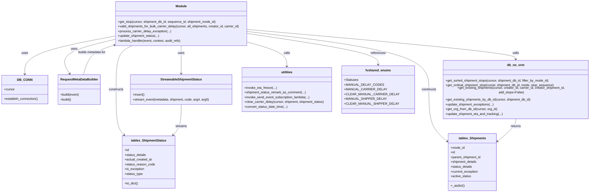

# Diagram: shipment_core/shipment_service/shipment_service/unknown_code/unknown_code_v2.py


> Auto-generated by Obscura crawlers

## Diagram 1



### SVG

<svg id="container" width="2946.373046875" xmlns="http://www.w3.org/2000/svg" class="classDiagram" height="944" viewBox="0 0 2946.373046875 944" role="graphics-document document" aria-roledescription="class"><style>#container{font-family:"trebuchet ms",verdana,arial,sans-serif;font-size:16px;fill:#333;}@keyframes edge-animation-frame{from{stroke-dashoffset:0;}}@keyframes dash{to{stroke-dashoffset:0;}}#container .edge-animation-slow{stroke-dasharray:9,5!important;stroke-dashoffset:900;animation:dash 50s linear infinite;stroke-linecap:round;}#container .edge-animation-fast{stroke-dasharray:9,5!important;stroke-dashoffset:900;animation:dash 20s linear infinite;stroke-linecap:round;}#container .error-icon{fill:#552222;}#container .error-text{fill:#552222;stroke:#552222;}#container .edge-thickness-normal{stroke-width:1px;}#container .edge-thickness-thick{stroke-width:3.5px;}#container .edge-pattern-solid{stroke-dasharray:0;}#container .edge-thickness-invisible{stroke-width:0;fill:none;}#container .edge-pattern-dashed{stroke-dasharray:3;}#container .edge-pattern-dotted{stroke-dasharray:2;}#container .marker{fill:#333333;stroke:#333333;}#container .marker.cross{stroke:#333333;}#container svg{font-family:"trebuchet ms",verdana,arial,sans-serif;font-size:16px;}#container p{margin:0;}#container g.classGroup text{fill:#9370DB;stroke:none;font-family:"trebuchet ms",verdana,arial,sans-serif;font-size:10px;}#container g.classGroup text .title{font-weight:bolder;}#container .nodeLabel,#container .edgeLabel{color:#131300;}#container .edgeLabel .label rect{fill:#ECECFF;}#container .label text{fill:#131300;}#container .labelBkg{background:#ECECFF;}#container .edgeLabel .label span{background:#ECECFF;}#container .classTitle{font-weight:bolder;}#container .node rect,#container .node circle,#container .node ellipse,#container .node polygon,#container .node path{fill:#ECECFF;stroke:#9370DB;stroke-width:1px;}#container .divider{stroke:#9370DB;stroke-width:1;}#container g.clickable{cursor:pointer;}#container g.classGroup rect{fill:#ECECFF;stroke:#9370DB;}#container g.classGroup line{stroke:#9370DB;stroke-width:1;}#container .classLabel .box{stroke:none;stroke-width:0;fill:#ECECFF;opacity:0.5;}#container .classLabel .label{fill:#9370DB;font-size:10px;}#container .relation{stroke:#333333;stroke-width:1;fill:none;}#container .dashed-line{stroke-dasharray:3;}#container .dotted-line{stroke-dasharray:1 2;}#container #compositionStart,#container .composition{fill:#333333!important;stroke:#333333!important;stroke-width:1;}#container #compositionEnd,#container .composition{fill:#333333!important;stroke:#333333!important;stroke-width:1;}#container #dependencyStart,#container .dependency{fill:#333333!important;stroke:#333333!important;stroke-width:1;}#container #dependencyStart,#container .dependency{fill:#333333!important;stroke:#333333!important;stroke-width:1;}#container #extensionStart,#container .extension{fill:transparent!important;stroke:#333333!important;stroke-width:1;}#container #extensionEnd,#container .extension{fill:transparent!important;stroke:#333333!important;stroke-width:1;}#container #aggregationStart,#container .aggregation{fill:transparent!important;stroke:#333333!important;stroke-width:1;}#container #aggregationEnd,#container .aggregation{fill:transparent!important;stroke:#333333!important;stroke-width:1;}#container #lollipopStart,#container .lollipop{fill:#ECECFF!important;stroke:#333333!important;stroke-width:1;}#container #lollipopEnd,#container .lollipop{fill:#ECECFF!important;stroke:#333333!important;stroke-width:1;}#container .edgeTerminals{font-size:11px;line-height:initial;}#container .classTitleText{text-anchor:middle;font-size:18px;fill:#333;}#container .label-icon{display:inline-block;height:1em;overflow:visible;vertical-align:-0.125em;}#container .node .label-icon path{fill:currentColor;stroke:revert;stroke-width:revert;}#container :root{--mermaid-font-family:"trebuchet ms",verdana,arial,sans-serif;}</style><g><defs><marker id="container_class-aggregationStart" class="marker aggregation class" refX="18" refY="7" markerWidth="190" markerHeight="240" orient="auto"><path d="M 18,7 L9,13 L1,7 L9,1 Z"></path></marker></defs><defs><marker id="container_class-aggregationEnd" class="marker aggregation class" refX="1" refY="7" markerWidth="20" markerHeight="28" orient="auto"><path d="M 18,7 L9,13 L1,7 L9,1 Z"></path></marker></defs><defs><marker id="container_class-extensionStart" class="marker extension class" refX="18" refY="7" markerWidth="190" markerHeight="240" orient="auto"><path d="M 1,7 L18,13 V 1 Z"></path></marker></defs><defs><marker id="container_class-extensionEnd" class="marker extension class" refX="1" refY="7" markerWidth="20" markerHeight="28" orient="auto"><path d="M 1,1 V 13 L18,7 Z"></path></marker></defs><defs><marker id="container_class-compositionStart" class="marker composition class" refX="18" refY="7" markerWidth="190" markerHeight="240" orient="auto"><path d="M 18,7 L9,13 L1,7 L9,1 Z"></path></marker></defs><defs><marker id="container_class-compositionEnd" class="marker composition class" refX="1" refY="7" markerWidth="20" markerHeight="28" orient="auto"><path d="M 18,7 L9,13 L1,7 L9,1 Z"></path></marker></defs><defs><marker id="container_class-dependencyStart" class="marker dependency class" refX="6" refY="7" markerWidth="190" markerHeight="240" orient="auto"><path d="M 5,7 L9,13 L1,7 L9,1 Z"></path></marker></defs><defs><marker id="container_class-dependencyEnd" class="marker dependency class" refX="13" refY="7" markerWidth="20" markerHeight="28" orient="auto"><path d="M 18,7 L9,13 L14,7 L9,1 Z"></path></marker></defs><defs><marker id="container_class-lollipopStart" class="marker lollipop class" refX="13" refY="7" markerWidth="190" markerHeight="240" orient="auto"><circle stroke="black" fill="transparent" cx="7" cy="7" r="6"></circle></marker></defs><defs><marker id="container_class-lollipopEnd" class="marker lollipop class" refX="1" refY="7" markerWidth="190" markerHeight="240" orient="auto"><circle stroke="black" fill="transparent" cx="7" cy="7" r="6"></circle></marker></defs><g class="root"><g class="clusters"></g><g class="edgePaths"><path d="M576.904,181.924L501.393,196.104C425.882,210.283,274.859,238.641,199.347,268.487C123.836,298.333,123.836,329.667,123.836,345.333L123.836,361" id="id_Module_DB_CONN_1" class="edge-thickness-normal edge-pattern-solid relation" style=";;;" data-edge="true" data-et="edge" data-id="id_Module_DB_CONN_1" data-points="W3sieCI6NTc2LjkwNDI5Njg3NSwieSI6MTgxLjkyNDI4ODExNzk5NDg4fSx7IngiOjEyMy44MzU5Mzc1LCJ5IjoyNjd9LHsieCI6MTIzLjgzNTkzNzUsInkiOjM2N31d" marker-end="url(#container_class-dependencyEnd)"></path><path d="M576.904,198.246L528.448,209.705C479.992,221.164,383.079,244.082,344.364,270.864C305.648,297.646,325.131,328.291,334.872,343.614L344.613,358.937" id="id_Module_RequestMetaDataBuilder_2" class="edge-thickness-normal edge-pattern-solid relation" style=";;;" data-edge="true" data-et="edge" data-id="id_Module_RequestMetaDataBuilder_2" data-points="W3sieCI6NTc2LjkwNDI5Njg3NSwieSI6MTk4LjI0NTU2Mzc3MzY3OTEyfSx7IngiOjI4Ni4xNjYwMTU2MjUsInkiOjI2N30seyJ4IjozNDcuODMxOTA2MzQwODQzMDMsInkiOjM2NH1d" marker-end="url(#container_class-dependencyEnd)"></path><path d="M912.006,230L912.006,236.167C912.006,242.333,912.006,254.667,912.006,276C912.006,297.333,912.006,327.667,912.006,342.833L912.006,358" id="id_Module_StreamableShipmentStatus_3" class="edge-thickness-normal edge-pattern-solid relation" style=";;;" data-edge="true" data-et="edge" data-id="id_Module_StreamableShipmentStatus_3" data-points="W3sieCI6OTEyLjAwNTg1OTM3NSwieSI6MjMwfSx7IngiOjkxMi4wMDU4NTkzNzUsInkiOjI2N30seyJ4Ijo5MTIuMDA1ODU5Mzc1LCJ5IjozNjR9XQ==" marker-end="url(#container_class-dependencyEnd)"></path><path d="M1247.107,159.965L1393.033,177.805C1538.959,195.644,1830.811,231.322,1976.736,277.828C2122.662,324.333,2122.662,381.667,2122.662,439C2122.662,496.333,2122.662,553.667,2138.547,595.276C2154.431,636.886,2186.2,662.771,2202.085,675.714L2217.97,688.657" id="id_Module_tables_Shipments_4" class="edge-thickness-normal edge-pattern-solid relation" style=";;;" data-edge="true" data-et="edge" data-id="id_Module_tables_Shipments_4" data-points="W3sieCI6MTI0Ny4xMDc0MjE4NzUsInkiOjE1OS45NjU0MTEzMjEzMzkxNn0seyJ4IjoyMTIyLjY2MjEwOTM3NSwieSI6MjY3fSx7IngiOjIxMjIuNjYyMTA5Mzc1LCJ5Ijo0Mzl9LHsieCI6MjEyMi42NjIxMDkzNzUsInkiOjYxMX0seyJ4IjoyMjIyLjYyMTA5Mzc1LCJ5Ijo2OTIuNDQ3MjE1MDE3MzY0OX1d" marker-end="url(#container_class-dependencyEnd)"></path><path d="M666.686,230L653.057,236.167C639.428,242.333,612.17,254.667,598.541,289.5C584.912,324.333,584.912,381.667,584.912,439C584.912,496.333,584.912,553.667,591.621,589.758C598.33,625.849,611.747,640.699,618.456,648.123L625.165,655.548" id="id_Module_tables_ShipmentStatus_5" class="edge-thickness-normal edge-pattern-solid relation" style=";;;" data-edge="true" data-et="edge" data-id="id_Module_tables_ShipmentStatus_5" data-points="W3sieCI6NjY2LjY4NTU0Njg3NSwieSI6MjMwfSx7IngiOjU4NC45MTIxMDkzNzUsInkiOjI2N30seyJ4Ijo1ODQuOTEyMTA5Mzc1LCJ5Ijo0Mzl9LHsieCI6NTg0LjkxMjEwOTM3NSwieSI6NjExfSx7IngiOjYyOS4xODcyMzAyMzEzNTM2LCJ5Ijo2NjB9XQ==" marker-end="url(#container_class-dependencyEnd)"></path><path d="M1247.107,148.968L1467.079,168.64C1687.051,188.312,2126.995,227.656,2346.967,252.495C2566.939,277.333,2566.939,287.667,2566.939,292.833L2566.939,298" id="id_Module_db_no_orm_6" class="edge-thickness-normal edge-pattern-solid relation" style=";;;" data-edge="true" data-et="edge" data-id="id_Module_db_no_orm_6" data-points="W3sieCI6MTI0Ny4xMDc0MjE4NzUsInkiOjE0OC45Njc5ODg3MDgwMDYxMn0seyJ4IjoyNTY2LjkzOTQ1MzEyNSwieSI6MjY3fSx7IngiOjI1NjYuOTM5NDUzMTI1LCJ5IjozMDR9XQ==" marker-end="url(#container_class-dependencyEnd)"></path><path d="M1247.107,212.08L1280.061,221.233C1313.015,230.386,1378.923,248.693,1411.876,267.013C1444.83,285.333,1444.83,303.667,1444.83,312.833L1444.83,322" id="id_Module_utilities_7" class="edge-thickness-normal edge-pattern-solid relation" style=";;;" data-edge="true" data-et="edge" data-id="id_Module_utilities_7" data-points="W3sieCI6MTI0Ny4xMDc0MjE4NzUsInkiOjIxMi4wNzk1MzYzNzM4MzM0M30seyJ4IjoxNDQ0LjgzMDA3ODEyNSwieSI6MjY3fSx7IngiOjE0NDQuODMwMDc4MTI1LCJ5IjozMjh9XQ==" marker-end="url(#container_class-dependencyEnd)"></path><path d="M1247.107,169.887L1353.691,186.073C1460.275,202.258,1673.443,234.629,1780.027,258.481C1886.611,282.333,1886.611,297.667,1886.611,305.333L1886.611,313" id="id_Module_fvshared_enums_8" class="edge-thickness-normal edge-pattern-solid relation" style=";;;" data-edge="true" data-et="edge" data-id="id_Module_fvshared_enums_8" data-points="W3sieCI6MTI0Ny4xMDc0MjE4NzUsInkiOjE2OS44ODcyOTAxMjk0MTkzNH0seyJ4IjoxODg2LjYxMTMyODEyNSwieSI6MjY3fSx7IngiOjE4ODYuNjExMzI4MTI1LCJ5IjozMTl9XQ==" marker-end="url(#container_class-dependencyEnd)"></path><path d="M2566.939,574L2566.939,580.167C2566.939,586.333,2566.939,598.667,2551.055,617.776C2535.17,636.886,2503.401,662.771,2487.516,675.714L2471.632,688.657" id="id_db_no_orm_tables_Shipments_9" class="edge-thickness-normal edge-pattern-solid relation" style=";;;" data-edge="true" data-et="edge" data-id="id_db_no_orm_tables_Shipments_9" data-points="W3sieCI6MjU2Ni45Mzk0NTMxMjUsInkiOjU3NH0seyJ4IjoyNTY2LjkzOTQ1MzEyNSwieSI6NjExfSx7IngiOjI0NjYuOTgwNDY4NzUsInkiOjY5Mi40NDcyMTUwMTczNjQ5fV0=" marker-end="url(#container_class-dependencyEnd)"></path><path d="M912.006,514L912.006,530.167C912.006,546.333,912.006,578.667,905.297,602.258C898.588,625.849,885.171,640.699,878.462,648.123L871.753,655.548" id="id_StreamableShipmentStatus_tables_ShipmentStatus_10" class="edge-thickness-normal edge-pattern-solid relation" style=";;;" data-edge="true" data-et="edge" data-id="id_StreamableShipmentStatus_tables_ShipmentStatus_10" data-points="W3sieCI6OTEyLjAwNTg1OTM3NSwieSI6NTE0fSx7IngiOjkxMi4wMDU4NTkzNzUsInkiOjYxMX0seyJ4Ijo4NjcuNzMwNzM4NTE4NjQ2NCwieSI6NjYwfV0=" marker-end="url(#container_class-dependencyEnd)"></path><path d="M419.125,364L424.215,347.833C429.304,331.667,439.484,299.333,464.828,276.683C490.173,254.033,530.681,241.066,550.936,234.582L571.19,228.098" id="id_RequestMetaDataBuilder_Module_11" class="edge-thickness-normal edge-pattern-solid relation" style=";;;" data-edge="true" data-et="edge" data-id="id_RequestMetaDataBuilder_Module_11" data-points="W3sieCI6NDE5LjEyNDY1OTMzODY2MjgsInkiOjM2NH0seyJ4Ijo0NDkuNjY0MDYyNSwieSI6MjY3fSx7IngiOjU3Ni45MDQyOTY4NzUsInkiOjIyNi4yNjkxOTI1ODY5OTEzMn1d" marker-end="url(#container_class-dependencyEnd)"></path></g><g class="edgeLabels"><g class="edgeLabel" transform="translate(123.8359375, 267)"><g class="label" data-id="id_Module_DB_CONN_1" transform="translate(-16.4921875, -12)"><foreignObject width="32.984375" height="24"><div xmlns="http://www.w3.org/1999/xhtml" class="labelBkg" style="display: table-cell; white-space: nowrap; line-height: 1.5; max-width: 200px; text-align: center;"><span class="edgeLabel"><p>uses</p></span></div></foreignObject></g></g><g class="edgeLabel" transform="translate(375.60671, 245.84887)"><g class="label" data-id="id_Module_RequestMetaDataBuilder_2" transform="translate(-16.4921875, -12)"><foreignObject width="32.984375" height="24"><div xmlns="http://www.w3.org/1999/xhtml" class="labelBkg" style="display: table-cell; white-space: nowrap; line-height: 1.5; max-width: 200px; text-align: center;"><span class="edgeLabel"><p>uses</p></span></div></foreignObject></g></g><g class="edgeLabel" transform="translate(912.005859375, 267)"><g class="label" data-id="id_Module_StreamableShipmentStatus_3" transform="translate(-16.4921875, -12)"><foreignObject width="32.984375" height="24"><div xmlns="http://www.w3.org/1999/xhtml" class="labelBkg" style="display: table-cell; white-space: nowrap; line-height: 1.5; max-width: 200px; text-align: center;"><span class="edgeLabel"><p>uses</p></span></div></foreignObject></g></g><g class="edgeLabel" transform="translate(2122.662109375, 439)"><g class="label" data-id="id_Module_tables_Shipments_4" transform="translate(-37.84375, -12)"><foreignObject width="75.6875" height="24"><div xmlns="http://www.w3.org/1999/xhtml" class="labelBkg" style="display: table-cell; white-space: nowrap; line-height: 1.5; max-width: 200px; text-align: center;"><span class="edgeLabel"><p>constructs</p></span></div></foreignObject></g></g><g class="edgeLabel" transform="translate(584.912109375, 439)"><g class="label" data-id="id_Module_tables_ShipmentStatus_5" transform="translate(-37.84375, -12)"><foreignObject width="75.6875" height="24"><div xmlns="http://www.w3.org/1999/xhtml" class="labelBkg" style="display: table-cell; white-space: nowrap; line-height: 1.5; max-width: 200px; text-align: center;"><span class="edgeLabel"><p>constructs</p></span></div></foreignObject></g></g><g class="edgeLabel" transform="translate(2566.939453125, 267)"><g class="label" data-id="id_Module_db_no_orm_6" transform="translate(-16.4453125, -12)"><foreignObject width="32.890625" height="24"><div xmlns="http://www.w3.org/1999/xhtml" class="labelBkg" style="display: table-cell; white-space: nowrap; line-height: 1.5; max-width: 200px; text-align: center;"><span class="edgeLabel"><p>calls</p></span></div></foreignObject></g></g><g class="edgeLabel" transform="translate(1444.830078125, 267)"><g class="label" data-id="id_Module_utilities_7" transform="translate(-16.4453125, -12)"><foreignObject width="32.890625" height="24"><div xmlns="http://www.w3.org/1999/xhtml" class="labelBkg" style="display: table-cell; white-space: nowrap; line-height: 1.5; max-width: 200px; text-align: center;"><span class="edgeLabel"><p>calls</p></span></div></foreignObject></g></g><g class="edgeLabel" transform="translate(1886.611328125, 267)"><g class="label" data-id="id_Module_fvshared_enums_8" transform="translate(-37.828125, -12)"><foreignObject width="75.65625" height="24"><div xmlns="http://www.w3.org/1999/xhtml" class="labelBkg" style="display: table-cell; white-space: nowrap; line-height: 1.5; max-width: 200px; text-align: center;"><span class="edgeLabel"><p>references</p></span></div></foreignObject></g></g><g class="edgeLabel" transform="translate(2566.939453125, 611)"><g class="label" data-id="id_db_no_orm_tables_Shipments_9" transform="translate(-26.265625, -12)"><foreignObject width="52.53125" height="24"><div xmlns="http://www.w3.org/1999/xhtml" class="labelBkg" style="display: table-cell; white-space: nowrap; line-height: 1.5; max-width: 200px; text-align: center;"><span class="edgeLabel"><p>returns</p></span></div></foreignObject></g></g><g class="edgeLabel" transform="translate(912.005859375, 611)"><g class="label" data-id="id_StreamableShipmentStatus_tables_ShipmentStatus_10" transform="translate(-28.703125, -12)"><foreignObject width="57.40625" height="24"><div xmlns="http://www.w3.org/1999/xhtml" class="labelBkg" style="display: table-cell; white-space: nowrap; line-height: 1.5; max-width: 200px; text-align: center;"><span class="edgeLabel"><p>streams</p></span></div></foreignObject></g></g><g class="edgeLabel" transform="translate(464.85784, 262.13633)"><g class="label" data-id="id_RequestMetaDataBuilder_Module_11" transform="translate(-71.8125, -12)"><foreignObject width="143.625" height="24"><div xmlns="http://www.w3.org/1999/xhtml" class="labelBkg" style="display: table-cell; white-space: nowrap; line-height: 1.5; max-width: 200px; text-align: center;"><span class="edgeLabel"><p>builds metadata for</p></span></div></foreignObject></g></g></g><g class="nodes"><g class="node default" id="classId-Module-0" transform="translate(912.005859375, 119)"><g class="basic label-container"><path d="M-335.1015625 -111 L335.1015625 -111 L335.1015625 111 L-335.1015625 111" stroke="none" stroke-width="0" fill="#ECECFF" style=""></path><path d="M-335.1015625 -111 C-156.49291394153994 -111, 22.115734616920122 -111, 335.1015625 -111 M-335.1015625 -111 C-132.19309499786021 -111, 70.71537250427957 -111, 335.1015625 -111 M335.1015625 -111 C335.1015625 -38.278063556544055, 335.1015625 34.44387288691189, 335.1015625 111 M335.1015625 -111 C335.1015625 -63.27709911601672, 335.1015625 -15.554198232033443, 335.1015625 111 M335.1015625 111 C179.131025992125 111, 23.16048948424998 111, -335.1015625 111 M335.1015625 111 C188.82465821654412 111, 42.547753933088245 111, -335.1015625 111 M-335.1015625 111 C-335.1015625 35.06204428454913, -335.1015625 -40.87591143090174, -335.1015625 -111 M-335.1015625 111 C-335.1015625 38.82535029137851, -335.1015625 -33.349299417242975, -335.1015625 -111" stroke="#9370DB" stroke-width="1.3" fill="none" stroke-dasharray="0 0" style=""></path></g><g class="annotation-group text" transform="translate(0, -87)"></g><g class="label-group text" transform="translate(-27.09375, -87)"><g class="label" style="font-weight: bolder" transform="translate(0,-12)"><foreignObject width="54.1875" height="24"><div xmlns="http://www.w3.org/1999/xhtml" style="display: table-cell; white-space: nowrap; line-height: 1.5; max-width: 104px; text-align: center;"><span class="nodeLabel markdown-node-label" style=""><p>Module</p></span></div></foreignObject></g></g><g class="members-group text" transform="translate(-323.1015625, -39)"></g><g class="methods-group text" transform="translate(-323.1015625, -9)"><g class="label" style="" transform="translate(0,-12)"><foreignObject width="498.875" height="24"><div xmlns="http://www.w3.org/1999/xhtml" style="display: table-cell; white-space: nowrap; line-height: 1.5; max-width: 556px; text-align: center;"><span class="nodeLabel markdown-node-label" style=""><p>+get_stop(cursor, shipment_db_id, sequence_id, shipment_mode_id)</p></span></div></foreignObject></g><g class="label" style="" transform="translate(0,12)"><foreignObject width="619.109375" height="24"><div xmlns="http://www.w3.org/1999/xhtml" style="display: table-cell; white-space: nowrap; line-height: 1.5; max-width: 676px; text-align: center;"><span class="nodeLabel markdown-node-label" style=""><p>+valid_shipments_for_bulk_carrier_delay(cursor, all_shipments, creator_id, carrier_id)</p></span></div></foreignObject></g><g class="label" style="" transform="translate(0,36)"><foreignObject width="265.109375" height="24"><div xmlns="http://www.w3.org/1999/xhtml" style="display: table-cell; white-space: nowrap; line-height: 1.5; max-width: 322px; text-align: center;"><span class="nodeLabel markdown-node-label" style=""><p>+process_carrier_delay_exception(...)</p></span></div></foreignObject></g><g class="label" style="" transform="translate(0,60)"><foreignObject width="210.390625" height="24"><div xmlns="http://www.w3.org/1999/xhtml" style="display: table-cell; white-space: nowrap; line-height: 1.5; max-width: 268px; text-align: center;"><span class="nodeLabel markdown-node-label" style=""><p>+update_shipment_status(...)</p></span></div></foreignObject></g><g class="label" style="" transform="translate(0,84)"><foreignObject width="321.6875" height="24"><div xmlns="http://www.w3.org/1999/xhtml" style="display: table-cell; white-space: nowrap; line-height: 1.5; max-width: 379px; text-align: center;"><span class="nodeLabel markdown-node-label" style=""><p>+lambda_handler(event, context, audit_refs)</p></span></div></foreignObject></g></g><g class="divider" style=""><path d="M-335.1015625 -63 C-138.47486187510987 -63, 58.15183874978027 -63, 335.1015625 -63 M-335.1015625 -63 C-118.18534178296764 -63, 98.73087893406472 -63, 335.1015625 -63" stroke="#9370DB" stroke-width="1.3" fill="none" stroke-dasharray="0 0" style=""></path></g><g class="divider" style=""><path d="M-335.1015625 -39 C-135.11372180496818 -39, 64.87411889006364 -39, 335.1015625 -39 M-335.1015625 -39 C-184.8716365838356 -39, -34.64171066767119 -39, 335.1015625 -39" stroke="#9370DB" stroke-width="1.3" fill="none" stroke-dasharray="0 0" style=""></path></g></g><g class="node default" id="classId-DB_CONN-1" transform="translate(123.8359375, 439)"><g class="basic label-container"><path d="M-115.8359375 -72 L115.8359375 -72 L115.8359375 72 L-115.8359375 72" stroke="none" stroke-width="0" fill="#ECECFF" style=""></path><path d="M-115.8359375 -72 C-35.12162366568708 -72, 45.592690168625836 -72, 115.8359375 -72 M-115.8359375 -72 C-41.63042445505323 -72, 32.57508858989354 -72, 115.8359375 -72 M115.8359375 -72 C115.8359375 -33.53231275863205, 115.8359375 4.935374482735895, 115.8359375 72 M115.8359375 -72 C115.8359375 -25.46289862083377, 115.8359375 21.07420275833246, 115.8359375 72 M115.8359375 72 C44.33665903592893 72, -27.162619428142136 72, -115.8359375 72 M115.8359375 72 C54.076223121529345 72, -7.683491256941309 72, -115.8359375 72 M-115.8359375 72 C-115.8359375 17.655432658125775, -115.8359375 -36.68913468374845, -115.8359375 -72 M-115.8359375 72 C-115.8359375 14.744604378982487, -115.8359375 -42.510791242035026, -115.8359375 -72" stroke="#9370DB" stroke-width="1.3" fill="none" stroke-dasharray="0 0" style=""></path></g><g class="annotation-group text" transform="translate(0, -48)"></g><g class="label-group text" transform="translate(-34.40625, -48)"><g class="label" style="font-weight: bolder" transform="translate(0,-12)"><foreignObject width="68.8125" height="24"><div xmlns="http://www.w3.org/1999/xhtml" style="display: table-cell; white-space: nowrap; line-height: 1.5; max-width: 119px; text-align: center;"><span class="nodeLabel markdown-node-label" style=""><p>DB_CONN</p></span></div></foreignObject></g></g><g class="members-group text" transform="translate(-103.8359375, 0)"><g class="label" style="" transform="translate(0,-12)"><foreignObject width="53.71875" height="24"><div xmlns="http://www.w3.org/1999/xhtml" style="display: table-cell; white-space: nowrap; line-height: 1.5; max-width: 112px; text-align: center;"><span class="nodeLabel markdown-node-label" style=""><p>+cursor</p></span></div></foreignObject></g></g><g class="methods-group text" transform="translate(-103.8359375, 48)"><g class="label" style="" transform="translate(0,-12)"><foreignObject width="173.265625" height="24"><div xmlns="http://www.w3.org/1999/xhtml" style="display: table-cell; white-space: nowrap; line-height: 1.5; max-width: 231px; text-align: center;"><span class="nodeLabel markdown-node-label" style=""><p>+establish_connection()</p></span></div></foreignObject></g></g><g class="divider" style=""><path d="M-115.8359375 -24 C-27.487767078839454 -24, 60.86040334232109 -24, 115.8359375 -24 M-115.8359375 -24 C-62.2737286571812 -24, -8.711519814362404 -24, 115.8359375 -24" stroke="#9370DB" stroke-width="1.3" fill="none" stroke-dasharray="0 0" style=""></path></g><g class="divider" style=""><path d="M-115.8359375 24 C-45.380533674859805 24, 25.07487015028039 24, 115.8359375 24 M-115.8359375 24 C-31.036174940786225 24, 53.76358761842755 24, 115.8359375 24" stroke="#9370DB" stroke-width="1.3" fill="none" stroke-dasharray="0 0" style=""></path></g></g><g class="node default" id="classId-RequestMetaDataBuilder-2" transform="translate(395.51171875, 439)"><g class="basic label-container"><path d="M-105.83984375 -75 L105.83984375 -75 L105.83984375 75 L-105.83984375 75" stroke="none" stroke-width="0" fill="#ECECFF" style=""></path><path d="M-105.83984375 -75 C-57.209141934001664 -75, -8.578440118003329 -75, 105.83984375 -75 M-105.83984375 -75 C-34.9949960528848 -75, 35.8498516442304 -75, 105.83984375 -75 M105.83984375 -75 C105.83984375 -16.35109768122505, 105.83984375 42.2978046375499, 105.83984375 75 M105.83984375 -75 C105.83984375 -30.58109904968645, 105.83984375 13.837801900627099, 105.83984375 75 M105.83984375 75 C42.236719915855765 75, -21.36640391828847 75, -105.83984375 75 M105.83984375 75 C26.62849556391248 75, -52.58285262217504 75, -105.83984375 75 M-105.83984375 75 C-105.83984375 21.984826470857705, -105.83984375 -31.03034705828459, -105.83984375 -75 M-105.83984375 75 C-105.83984375 30.367422120424457, -105.83984375 -14.265155759151085, -105.83984375 -75" stroke="#9370DB" stroke-width="1.3" fill="none" stroke-dasharray="0 0" style=""></path></g><g class="annotation-group text" transform="translate(0, -51)"></g><g class="label-group text" transform="translate(-91.4765625, -51)"><g class="label" style="font-weight: bolder" transform="translate(0,-12)"><foreignObject width="182.953125" height="24"><div xmlns="http://www.w3.org/1999/xhtml" style="display: table-cell; white-space: nowrap; line-height: 1.5; max-width: 231px; text-align: center;"><span class="nodeLabel markdown-node-label" style=""><p>RequestMetaDataBuilder</p></span></div></foreignObject></g></g><g class="members-group text" transform="translate(-93.83984375, -3)"></g><g class="methods-group text" transform="translate(-93.83984375, 27)"><g class="label" style="" transform="translate(0,-12)"><foreignObject width="96.203125" height="24"><div xmlns="http://www.w3.org/1999/xhtml" style="display: table-cell; white-space: nowrap; line-height: 1.5; max-width: 154px; text-align: center;"><span class="nodeLabel markdown-node-label" style=""><p>+build(event)</p></span></div></foreignObject></g><g class="label" style="" transform="translate(0,12)"><foreignObject width="55.859375" height="24"><div xmlns="http://www.w3.org/1999/xhtml" style="display: table-cell; white-space: nowrap; line-height: 1.5; max-width: 113px; text-align: center;"><span class="nodeLabel markdown-node-label" style=""><p>+build()</p></span></div></foreignObject></g></g><g class="divider" style=""><path d="M-105.83984375 -27 C-26.75132746357646 -27, 52.33718882284708 -27, 105.83984375 -27 M-105.83984375 -27 C-43.38345678300695 -27, 19.072930183986102 -27, 105.83984375 -27" stroke="#9370DB" stroke-width="1.3" fill="none" stroke-dasharray="0 0" style=""></path></g><g class="divider" style=""><path d="M-105.83984375 -3 C-52.5926055656497 -3, 0.6546326187006031 -3, 105.83984375 -3 M-105.83984375 -3 C-28.26561403030641 -3, 49.30861568938718 -3, 105.83984375 -3" stroke="#9370DB" stroke-width="1.3" fill="none" stroke-dasharray="0 0" style=""></path></g></g><g class="node default" id="classId-StreamableShipmentStatus-3" transform="translate(912.005859375, 439)"><g class="basic label-container"><path d="M-254.25 -75 L254.25 -75 L254.25 75 L-254.25 75" stroke="none" stroke-width="0" fill="#ECECFF" style=""></path><path d="M-254.25 -75 C-82.45951601116724 -75, 89.33096797766552 -75, 254.25 -75 M-254.25 -75 C-140.47405585562666 -75, -26.69811171125332 -75, 254.25 -75 M254.25 -75 C254.25 -15.411100604762453, 254.25 44.177798790475094, 254.25 75 M254.25 -75 C254.25 -37.31033745213008, 254.25 0.3793250957398442, 254.25 75 M254.25 75 C65.574058428261 75, -123.101883143478 75, -254.25 75 M254.25 75 C130.4066192748693 75, 6.563238549738628 75, -254.25 75 M-254.25 75 C-254.25 31.019651380273118, -254.25 -12.960697239453765, -254.25 -75 M-254.25 75 C-254.25 18.48600061992041, -254.25 -38.02799876015918, -254.25 -75" stroke="#9370DB" stroke-width="1.3" fill="none" stroke-dasharray="0 0" style=""></path></g><g class="annotation-group text" transform="translate(0, -51)"></g><g class="label-group text" transform="translate(-100.609375, -51)"><g class="label" style="font-weight: bolder" transform="translate(0,-12)"><foreignObject width="201.21875" height="24"><div xmlns="http://www.w3.org/1999/xhtml" style="display: table-cell; white-space: nowrap; line-height: 1.5; max-width: 248px; text-align: center;"><span class="nodeLabel markdown-node-label" style=""><p>StreamableShipmentStatus</p></span></div></foreignObject></g></g><g class="members-group text" transform="translate(-242.25, -3)"></g><g class="methods-group text" transform="translate(-242.25, 27)"><g class="label" style="" transform="translate(0,-12)"><foreignObject width="60.390625" height="24"><div xmlns="http://www.w3.org/1999/xhtml" style="display: table-cell; white-space: nowrap; line-height: 1.5; max-width: 118px; text-align: center;"><span class="nodeLabel markdown-node-label" style=""><p>+insert()</p></span></div></foreignObject></g><g class="label" style="" transform="translate(0,12)"><foreignObject width="383.890625" height="24"><div xmlns="http://www.w3.org/1999/xhtml" style="display: table-cell; white-space: nowrap; line-height: 1.5; max-width: 441px; text-align: center;"><span class="nodeLabel markdown-node-label" style=""><p>+stream_event(metadata, shipment, code, arg4, arg5)</p></span></div></foreignObject></g></g><g class="divider" style=""><path d="M-254.25 -27 C-144.59555168389164 -27, -34.941103367783256 -27, 254.25 -27 M-254.25 -27 C-129.993951482895 -27, -5.737902965790028 -27, 254.25 -27" stroke="#9370DB" stroke-width="1.3" fill="none" stroke-dasharray="0 0" style=""></path></g><g class="divider" style=""><path d="M-254.25 -3 C-95.5009354400436 -3, 63.24812911991279 -3, 254.25 -3 M-254.25 -3 C-56.791268201921014 -3, 140.66746359615797 -3, 254.25 -3" stroke="#9370DB" stroke-width="1.3" fill="none" stroke-dasharray="0 0" style=""></path></g></g><g class="node default" id="classId-tables_Shipments-4" transform="translate(2344.80078125, 792)"><g class="basic label-container"><path d="M-122.1796875 -144 L122.1796875 -144 L122.1796875 144 L-122.1796875 144" stroke="none" stroke-width="0" fill="#ECECFF" style=""></path><path d="M-122.1796875 -144 C-32.135560087180025 -144, 57.90856732563995 -144, 122.1796875 -144 M-122.1796875 -144 C-39.584228066881394 -144, 43.01123136623721 -144, 122.1796875 -144 M122.1796875 -144 C122.1796875 -79.30186907498853, 122.1796875 -14.603738149977062, 122.1796875 144 M122.1796875 -144 C122.1796875 -69.31534083720584, 122.1796875 5.369318325588324, 122.1796875 144 M122.1796875 144 C57.26899744120604 144, -7.641692617587921 144, -122.1796875 144 M122.1796875 144 C58.5483342411548 144, -5.083019017690404 144, -122.1796875 144 M-122.1796875 144 C-122.1796875 81.15942290117187, -122.1796875 18.318845802343716, -122.1796875 -144 M-122.1796875 144 C-122.1796875 61.856545974179284, -122.1796875 -20.286908051641433, -122.1796875 -144" stroke="#9370DB" stroke-width="1.3" fill="none" stroke-dasharray="0 0" style=""></path></g><g class="annotation-group text" transform="translate(0, -120)"></g><g class="label-group text" transform="translate(-65.578125, -120)"><g class="label" style="font-weight: bolder" transform="translate(0,-12)"><foreignObject width="131.15625" height="24"><div xmlns="http://www.w3.org/1999/xhtml" style="display: table-cell; white-space: nowrap; line-height: 1.5; max-width: 180px; text-align: center;"><span class="nodeLabel markdown-node-label" style=""><p>tables_Shipments</p></span></div></foreignObject></g></g><g class="members-group text" transform="translate(-110.1796875, -72)"><g class="label" style="" transform="translate(0,-12)"><foreignObject width="71.421875" height="24"><div xmlns="http://www.w3.org/1999/xhtml" style="display: table-cell; white-space: nowrap; line-height: 1.5; max-width: 129px; text-align: center;"><span class="nodeLabel markdown-node-label" style=""><p>+mode_id</p></span></div></foreignObject></g><g class="label" style="" transform="translate(0,12)"><foreignObject width="22.078125" height="24"><div xmlns="http://www.w3.org/1999/xhtml" style="display: table-cell; white-space: nowrap; line-height: 1.5; max-width: 79px; text-align: center;"><span class="nodeLabel markdown-node-label" style=""><p>+id</p></span></div></foreignObject></g><g class="label" style="" transform="translate(0,36)"><foreignObject width="154.78125" height="24"><div xmlns="http://www.w3.org/1999/xhtml" style="display: table-cell; white-space: nowrap; line-height: 1.5; max-width: 212px; text-align: center;"><span class="nodeLabel markdown-node-label" style=""><p>+parent_shipment_id</p></span></div></foreignObject></g><g class="label" style="" transform="translate(0,60)"><foreignObject width="133.765625" height="24"><div xmlns="http://www.w3.org/1999/xhtml" style="display: table-cell; white-space: nowrap; line-height: 1.5; max-width: 191px; text-align: center;"><span class="nodeLabel markdown-node-label" style=""><p>+shipment_details</p></span></div></foreignObject></g><g class="label" style="" transform="translate(0,84)"><foreignObject width="109.40625" height="24"><div xmlns="http://www.w3.org/1999/xhtml" style="display: table-cell; white-space: nowrap; line-height: 1.5; max-width: 167px; text-align: center;"><span class="nodeLabel markdown-node-label" style=""><p>+status_details</p></span></div></foreignObject></g><g class="label" style="" transform="translate(0,108)"><foreignObject width="139.28125" height="24"><div xmlns="http://www.w3.org/1999/xhtml" style="display: table-cell; white-space: nowrap; line-height: 1.5; max-width: 197px; text-align: center;"><span class="nodeLabel markdown-node-label" style=""><p>+current_exception</p></span></div></foreignObject></g><g class="label" style="" transform="translate(0,132)"><foreignObject width="103.3125" height="24"><div xmlns="http://www.w3.org/1999/xhtml" style="display: table-cell; white-space: nowrap; line-height: 1.5; max-width: 161px; text-align: center;"><span class="nodeLabel markdown-node-label" style=""><p>+active_status</p></span></div></foreignObject></g></g><g class="methods-group text" transform="translate(-110.1796875, 120)"><g class="label" style="" transform="translate(0,-12)"><foreignObject width="68.59375" height="24"><div xmlns="http://www.w3.org/1999/xhtml" style="display: table-cell; white-space: nowrap; line-height: 1.5; max-width: 126px; text-align: center;"><span class="nodeLabel markdown-node-label" style=""><p>+_asdict()</p></span></div></foreignObject></g></g><g class="divider" style=""><path d="M-122.1796875 -96 C-48.570056824294156 -96, 25.03957385141169 -96, 122.1796875 -96 M-122.1796875 -96 C-55.01873140815039 -96, 12.142224683699226 -96, 122.1796875 -96" stroke="#9370DB" stroke-width="1.3" fill="none" stroke-dasharray="0 0" style=""></path></g><g class="divider" style=""><path d="M-122.1796875 96 C-37.777917497996455 96, 46.62385250400709 96, 122.1796875 96 M-122.1796875 96 C-71.38233944151304 96, -20.584991383026065 96, 122.1796875 96" stroke="#9370DB" stroke-width="1.3" fill="none" stroke-dasharray="0 0" style=""></path></g></g><g class="node default" id="classId-tables_ShipmentStatus-5" transform="translate(748.458984375, 792)"><g class="basic label-container"><path d="M-130.76953125 -132 L130.76953125 -132 L130.76953125 132 L-130.76953125 132" stroke="none" stroke-width="0" fill="#ECECFF" style=""></path><path d="M-130.76953125 -132 C-71.37830617540914 -132, -11.987081100818259 -132, 130.76953125 -132 M-130.76953125 -132 C-59.315945060254265 -132, 12.13764112949147 -132, 130.76953125 -132 M130.76953125 -132 C130.76953125 -44.621193856215925, 130.76953125 42.75761228756815, 130.76953125 132 M130.76953125 -132 C130.76953125 -37.70346184234408, 130.76953125 56.59307631531183, 130.76953125 132 M130.76953125 132 C56.17916267964269 132, -18.411205890714626 132, -130.76953125 132 M130.76953125 132 C67.60512979294819 132, 4.440728335896367 132, -130.76953125 132 M-130.76953125 132 C-130.76953125 28.746674780395068, -130.76953125 -74.50665043920986, -130.76953125 -132 M-130.76953125 132 C-130.76953125 37.773296709350575, -130.76953125 -56.45340658129885, -130.76953125 -132" stroke="#9370DB" stroke-width="1.3" fill="none" stroke-dasharray="0 0" style=""></path></g><g class="annotation-group text" transform="translate(0, -108)"></g><g class="label-group text" transform="translate(-85.1953125, -108)"><g class="label" style="font-weight: bolder" transform="translate(0,-12)"><foreignObject width="170.390625" height="24"><div xmlns="http://www.w3.org/1999/xhtml" style="display: table-cell; white-space: nowrap; line-height: 1.5; max-width: 218px; text-align: center;"><span class="nodeLabel markdown-node-label" style=""><p>tables_ShipmentStatus</p></span></div></foreignObject></g></g><g class="members-group text" transform="translate(-118.76953125, -60)"><g class="label" style="" transform="translate(0,-12)"><foreignObject width="22.078125" height="24"><div xmlns="http://www.w3.org/1999/xhtml" style="display: table-cell; white-space: nowrap; line-height: 1.5; max-width: 79px; text-align: center;"><span class="nodeLabel markdown-node-label" style=""><p>+id</p></span></div></foreignObject></g><g class="label" style="" transform="translate(0,12)"><foreignObject width="109.40625" height="24"><div xmlns="http://www.w3.org/1999/xhtml" style="display: table-cell; white-space: nowrap; line-height: 1.5; max-width: 167px; text-align: center;"><span class="nodeLabel markdown-node-label" style=""><p>+status_details</p></span></div></foreignObject></g><g class="label" style="" transform="translate(0,36)"><foreignObject width="137.34375" height="24"><div xmlns="http://www.w3.org/1999/xhtml" style="display: table-cell; white-space: nowrap; line-height: 1.5; max-width: 195px; text-align: center;"><span class="nodeLabel markdown-node-label" style=""><p>+actual_created_at</p></span></div></foreignObject></g><g class="label" style="" transform="translate(0,60)"><foreignObject width="152.34375" height="24"><div xmlns="http://www.w3.org/1999/xhtml" style="display: table-cell; white-space: nowrap; line-height: 1.5; max-width: 210px; text-align: center;"><span class="nodeLabel markdown-node-label" style=""><p>+status_reason_code</p></span></div></foreignObject></g><g class="label" style="" transform="translate(0,84)"><foreignObject width="98.40625" height="24"><div xmlns="http://www.w3.org/1999/xhtml" style="display: table-cell; white-space: nowrap; line-height: 1.5; max-width: 156px; text-align: center;"><span class="nodeLabel markdown-node-label" style=""><p>+is_exception</p></span></div></foreignObject></g><g class="label" style="" transform="translate(0,108)"><foreignObject width="91.859375" height="24"><div xmlns="http://www.w3.org/1999/xhtml" style="display: table-cell; white-space: nowrap; line-height: 1.5; max-width: 149px; text-align: center;"><span class="nodeLabel markdown-node-label" style=""><p>+status_type</p></span></div></foreignObject></g></g><g class="methods-group text" transform="translate(-118.76953125, 108)"><g class="label" style="" transform="translate(0,-12)"><foreignObject width="68.34375" height="24"><div xmlns="http://www.w3.org/1999/xhtml" style="display: table-cell; white-space: nowrap; line-height: 1.5; max-width: 126px; text-align: center;"><span class="nodeLabel markdown-node-label" style=""><p>+to_dict()</p></span></div></foreignObject></g></g><g class="divider" style=""><path d="M-130.76953125 -84 C-54.901380028814785 -84, 20.96677119237043 -84, 130.76953125 -84 M-130.76953125 -84 C-45.09721819616104 -84, 40.575094857677925 -84, 130.76953125 -84" stroke="#9370DB" stroke-width="1.3" fill="none" stroke-dasharray="0 0" style=""></path></g><g class="divider" style=""><path d="M-130.76953125 84 C-68.61475771619807 84, -6.459984182396141 84, 130.76953125 84 M-130.76953125 84 C-26.745944520564933 84, 77.27764220887013 84, 130.76953125 84" stroke="#9370DB" stroke-width="1.3" fill="none" stroke-dasharray="0 0" style=""></path></g></g><g class="node default" id="classId-db_no_orm-6" transform="translate(2566.939453125, 439)"><g class="basic label-container"><path d="M-371.43359375 -135 L371.43359375 -135 L371.43359375 135 L-371.43359375 135" stroke="none" stroke-width="0" fill="#ECECFF" style=""></path><path d="M-371.43359375 -135 C-87.28336317909958 -135, 196.86686739180084 -135, 371.43359375 -135 M-371.43359375 -135 C-75.07363278311334 -135, 221.28632818377332 -135, 371.43359375 -135 M371.43359375 -135 C371.43359375 -59.741185448722234, 371.43359375 15.517629102555532, 371.43359375 135 M371.43359375 -135 C371.43359375 -45.457662022973764, 371.43359375 44.08467595405247, 371.43359375 135 M371.43359375 135 C105.6611699821587 135, -160.1112537856826 135, -371.43359375 135 M371.43359375 135 C201.2411190287186 135, 31.0486443074372 135, -371.43359375 135 M-371.43359375 135 C-371.43359375 54.6083642079107, -371.43359375 -25.783271584178607, -371.43359375 -135 M-371.43359375 135 C-371.43359375 56.11753650882346, -371.43359375 -22.764926982353074, -371.43359375 -135" stroke="#9370DB" stroke-width="1.3" fill="none" stroke-dasharray="0 0" style=""></path></g><g class="annotation-group text" transform="translate(0, -111)"></g><g class="label-group text" transform="translate(-41.3515625, -111)"><g class="label" style="font-weight: bolder" transform="translate(0,-12)"><foreignObject width="82.703125" height="24"><div xmlns="http://www.w3.org/1999/xhtml" style="display: table-cell; white-space: nowrap; line-height: 1.5; max-width: 133px; text-align: center;"><span class="nodeLabel markdown-node-label" style=""><p>db_no_orm</p></span></div></foreignObject></g></g><g class="members-group text" transform="translate(-359.43359375, -63)"></g><g class="methods-group text" transform="translate(-359.43359375, -33)"><g class="label" style="" transform="translate(0,-12)"><foreignObject width="528.609375" height="24"><div xmlns="http://www.w3.org/1999/xhtml" style="display: table-cell; white-space: nowrap; line-height: 1.5; max-width: 586px; text-align: center;"><span class="nodeLabel markdown-node-label" style=""><p>+get_sorted_shipment_stops(cursor, shipment_db_id, filter_by_mode_id)</p></span></div></foreignObject></g><g class="label" style="" transform="translate(0,12)"><foreignObject width="554.140625" height="24"><div xmlns="http://www.w3.org/1999/xhtml" style="display: table-cell; white-space: nowrap; line-height: 1.5; max-width: 612px; text-align: center;"><span class="nodeLabel markdown-node-label" style=""><p>+get_ordinal_shipment_stop(cursor, shipment_db_id, mode, stop_sequence)</p></span></div></foreignObject></g><g class="label" style="" transform="translate(0,36)"><foreignObject width="677.515625" height="24"><div xmlns="http://www.w3.org/1999/xhtml" style="display: table-cell; white-space: nowrap; line-height: 1.5; max-width: 735px; text-align: center;"><span class="nodeLabel markdown-node-label" style=""><p>+get_existing_shipments(cursor, creator_id, carrier_id, creator_shipment_id, add_stops=False)</p></span></div></foreignObject></g><g class="label" style="" transform="translate(0,60)"><foreignObject width="433.640625" height="24"><div xmlns="http://www.w3.org/1999/xhtml" style="display: table-cell; white-space: nowrap; line-height: 1.5; max-width: 491px; text-align: center;"><span class="nodeLabel markdown-node-label" style=""><p>+get_existing_shipments_by_db_id(cursor, shipment_db_id)</p></span></div></foreignObject></g><g class="label" style="" transform="translate(0,84)"><foreignObject width="243.890625" height="24"><div xmlns="http://www.w3.org/1999/xhtml" style="display: table-cell; white-space: nowrap; line-height: 1.5; max-width: 301px; text-align: center;"><span class="nodeLabel markdown-node-label" style=""><p>+update_shipment_exceptions(...)</p></span></div></foreignObject></g><g class="label" style="" transform="translate(0,108)"><foreignObject width="262.4375" height="24"><div xmlns="http://www.w3.org/1999/xhtml" style="display: table-cell; white-space: nowrap; line-height: 1.5; max-width: 320px; text-align: center;"><span class="nodeLabel markdown-node-label" style=""><p>+get_org_from_db_id(cursor, org_id)</p></span></div></foreignObject></g><g class="label" style="" transform="translate(0,132)"><foreignObject width="290.546875" height="24"><div xmlns="http://www.w3.org/1999/xhtml" style="display: table-cell; white-space: nowrap; line-height: 1.5; max-width: 348px; text-align: center;"><span class="nodeLabel markdown-node-label" style=""><p>+update_shipment_eta_and_tracking(...)</p></span></div></foreignObject></g></g><g class="divider" style=""><path d="M-371.43359375 -87 C-211.37340167855336 -87, -51.31320960710673 -87, 371.43359375 -87 M-371.43359375 -87 C-184.69138856140464 -87, 2.050816627190727 -87, 371.43359375 -87" stroke="#9370DB" stroke-width="1.3" fill="none" stroke-dasharray="0 0" style=""></path></g><g class="divider" style=""><path d="M-371.43359375 -63 C-145.7510384671161 -63, 79.9315168157678 -63, 371.43359375 -63 M-371.43359375 -63 C-136.76280440987847 -63, 97.90798493024306 -63, 371.43359375 -63" stroke="#9370DB" stroke-width="1.3" fill="none" stroke-dasharray="0 0" style=""></path></g></g><g class="node default" id="classId-utilities-7" transform="translate(1444.830078125, 439)"><g class="basic label-container"><path d="M-228.57421875 -111 L228.57421875 -111 L228.57421875 111 L-228.57421875 111" stroke="none" stroke-width="0" fill="#ECECFF" style=""></path><path d="M-228.57421875 -111 C-107.48662964605711 -111, 13.600959457885779 -111, 228.57421875 -111 M-228.57421875 -111 C-110.28047938118229 -111, 8.013259987635422 -111, 228.57421875 -111 M228.57421875 -111 C228.57421875 -63.89772326147198, 228.57421875 -16.795446522943962, 228.57421875 111 M228.57421875 -111 C228.57421875 -58.496058563062846, 228.57421875 -5.992117126125692, 228.57421875 111 M228.57421875 111 C70.33750117929031 111, -87.89921639141937 111, -228.57421875 111 M228.57421875 111 C89.17113561011428 111, -50.231947529771446 111, -228.57421875 111 M-228.57421875 111 C-228.57421875 28.97566551238944, -228.57421875 -53.04866897522112, -228.57421875 -111 M-228.57421875 111 C-228.57421875 60.236837918098175, -228.57421875 9.47367583619635, -228.57421875 -111" stroke="#9370DB" stroke-width="1.3" fill="none" stroke-dasharray="0 0" style=""></path></g><g class="annotation-group text" transform="translate(0, -87)"></g><g class="label-group text" transform="translate(-28.1796875, -87)"><g class="label" style="font-weight: bolder" transform="translate(0,-12)"><foreignObject width="56.359375" height="24"><div xmlns="http://www.w3.org/1999/xhtml" style="display: table-cell; white-space: nowrap; line-height: 1.5; max-width: 105px; text-align: center;"><span class="nodeLabel markdown-node-label" style=""><p>utilities</p></span></div></foreignObject></g></g><g class="members-group text" transform="translate(-216.57421875, -39)"></g><g class="methods-group text" transform="translate(-216.57421875, -9)"><g class="label" style="" transform="translate(0,-12)"><foreignObject width="160.328125" height="24"><div xmlns="http://www.w3.org/1999/xhtml" style="display: table-cell; white-space: nowrap; line-height: 1.5; max-width: 218px; text-align: center;"><span class="nodeLabel markdown-node-label" style=""><p>+invoke_eta_freeze(...)</p></span></div></foreignObject></g><g class="label" style="" transform="translate(0,12)"><foreignObject width="309.90625" height="24"><div xmlns="http://www.w3.org/1999/xhtml" style="display: table-cell; white-space: nowrap; line-height: 1.5; max-width: 367px; text-align: center;"><span class="nodeLabel markdown-node-label" style=""><p>+shipment_status_remark_as_comment(...)</p></span></div></foreignObject></g><g class="label" style="" transform="translate(0,36)"><foreignObject width="330.9375" height="24"><div xmlns="http://www.w3.org/1999/xhtml" style="display: table-cell; white-space: nowrap; line-height: 1.5; max-width: 388px; text-align: center;"><span class="nodeLabel markdown-node-label" style=""><p>+invoke_send_event_subscription_lambda(...)</p></span></div></foreignObject></g><g class="label" style="" transform="translate(0,60)"><foreignObject width="404.96875" height="24"><div xmlns="http://www.w3.org/1999/xhtml" style="display: table-cell; white-space: nowrap; line-height: 1.5; max-width: 462px; text-align: center;"><span class="nodeLabel markdown-node-label" style=""><p>+clear_carrier_delay(cursor, shipment, shipment_status)</p></span></div></foreignObject></g><g class="label" style="" transform="translate(0,84)"><foreignObject width="217.625" height="24"><div xmlns="http://www.w3.org/1999/xhtml" style="display: table-cell; white-space: nowrap; line-height: 1.5; max-width: 275px; text-align: center;"><span class="nodeLabel markdown-node-label" style=""><p>+convert_status_date_time(...)</p></span></div></foreignObject></g></g><g class="divider" style=""><path d="M-228.57421875 -63 C-122.02192857700156 -63, -15.46963840400312 -63, 228.57421875 -63 M-228.57421875 -63 C-93.65876880136133 -63, 41.256681147277334 -63, 228.57421875 -63" stroke="#9370DB" stroke-width="1.3" fill="none" stroke-dasharray="0 0" style=""></path></g><g class="divider" style=""><path d="M-228.57421875 -39 C-131.61630739985014 -39, -34.658396049700286 -39, 228.57421875 -39 M-228.57421875 -39 C-90.93095428861423 -39, 46.71231017277154 -39, 228.57421875 -39" stroke="#9370DB" stroke-width="1.3" fill="none" stroke-dasharray="0 0" style=""></path></g></g><g class="node default" id="classId-fvshared_enums-8" transform="translate(1886.611328125, 439)"><g class="basic label-container"><path d="M-163.20703125 -120 L163.20703125 -120 L163.20703125 120 L-163.20703125 120" stroke="none" stroke-width="0" fill="#ECECFF" style=""></path><path d="M-163.20703125 -120 C-70.18018001270646 -120, 22.846671224587084 -120, 163.20703125 -120 M-163.20703125 -120 C-76.35186060909372 -120, 10.50331003181256 -120, 163.20703125 -120 M163.20703125 -120 C163.20703125 -66.07296473868871, 163.20703125 -12.145929477377408, 163.20703125 120 M163.20703125 -120 C163.20703125 -56.425984665272374, 163.20703125 7.1480306694552525, 163.20703125 120 M163.20703125 120 C38.62884671900058 120, -85.94933781199884 120, -163.20703125 120 M163.20703125 120 C57.20922407130409 120, -48.788583107391815 120, -163.20703125 120 M-163.20703125 120 C-163.20703125 42.27193716721827, -163.20703125 -35.45612566556346, -163.20703125 -120 M-163.20703125 120 C-163.20703125 51.985551868885196, -163.20703125 -16.02889626222961, -163.20703125 -120" stroke="#9370DB" stroke-width="1.3" fill="none" stroke-dasharray="0 0" style=""></path></g><g class="annotation-group text" transform="translate(0, -96)"></g><g class="label-group text" transform="translate(-60.1640625, -96)"><g class="label" style="font-weight: bolder" transform="translate(0,-12)"><foreignObject width="120.328125" height="24"><div xmlns="http://www.w3.org/1999/xhtml" style="display: table-cell; white-space: nowrap; line-height: 1.5; max-width: 169px; text-align: center;"><span class="nodeLabel markdown-node-label" style=""><p>fvshared_enums</p></span></div></foreignObject></g></g><g class="members-group text" transform="translate(-151.20703125, -48)"><g class="label" style="" transform="translate(0,-12)"><foreignObject width="69.1875" height="24"><div xmlns="http://www.w3.org/1999/xhtml" style="display: table-cell; white-space: nowrap; line-height: 1.5; max-width: 127px; text-align: center;"><span class="nodeLabel markdown-node-label" style=""><p>+Statuses</p></span></div></foreignObject></g><g class="label" style="" transform="translate(0,12)"><foreignObject width="173.96875" height="24"><div xmlns="http://www.w3.org/1999/xhtml" style="display: table-cell; white-space: nowrap; line-height: 1.5; max-width: 232px; text-align: center;"><span class="nodeLabel markdown-node-label" style=""><p>+MANUAL_DELAY_CODES</p></span></div></foreignObject></g><g class="label" style="" transform="translate(0,36)"><foreignObject width="188.5625" height="24"><div xmlns="http://www.w3.org/1999/xhtml" style="display: table-cell; white-space: nowrap; line-height: 1.5; max-width: 246px; text-align: center;"><span class="nodeLabel markdown-node-label" style=""><p>+MANUAL_CARRIER_DELAY</p></span></div></foreignObject></g><g class="label" style="" transform="translate(0,60)"><foreignObject width="241.21875" height="24"><div xmlns="http://www.w3.org/1999/xhtml" style="display: table-cell; white-space: nowrap; line-height: 1.5; max-width: 299px; text-align: center;"><span class="nodeLabel markdown-node-label" style=""><p>+CLEAR_MANUAL_CARRIER_DELAY</p></span></div></foreignObject></g><g class="label" style="" transform="translate(0,84)"><foreignObject width="189.59375" height="24"><div xmlns="http://www.w3.org/1999/xhtml" style="display: table-cell; white-space: nowrap; line-height: 1.5; max-width: 247px; text-align: center;"><span class="nodeLabel markdown-node-label" style=""><p>+MANUAL_SHIPPER_DELAY</p></span></div></foreignObject></g><g class="label" style="" transform="translate(0,108)"><foreignObject width="242.25" height="24"><div xmlns="http://www.w3.org/1999/xhtml" style="display: table-cell; white-space: nowrap; line-height: 1.5; max-width: 300px; text-align: center;"><span class="nodeLabel markdown-node-label" style=""><p>+CLEAR_MANUAL_SHIPPER_DELAY</p></span></div></foreignObject></g></g><g class="methods-group text" transform="translate(-151.20703125, 120)"></g><g class="divider" style=""><path d="M-163.20703125 -72 C-73.91067947503363 -72, 15.385672299932736 -72, 163.20703125 -72 M-163.20703125 -72 C-34.872461876986534 -72, 93.46210749602693 -72, 163.20703125 -72" stroke="#9370DB" stroke-width="1.3" fill="none" stroke-dasharray="0 0" style=""></path></g><g class="divider" style=""><path d="M-163.20703125 96 C-58.55568087057378 96, 46.09566950885244 96, 163.20703125 96 M-163.20703125 96 C-79.76670679103623 96, 3.6736176679275445 96, 163.20703125 96" stroke="#9370DB" stroke-width="1.3" fill="none" stroke-dasharray="0 0" style=""></path></g></g></g></g></g></svg>

## Diagram 2

```mermaid
flowchart TD
    A[Start: lambda_handler] --> B[DB_CONN.establish_connection -> cursor]
    B --> C[Extract actor info via auth]
    C --> D[Parse event body and status_date_time]
    D --> E{sequence_id present?}
    E -- yes --> F[get_stop(cursor, shipment_id, sequence_id, shipment_mode_id)]
    F --> G[determine stop_id]
    E -- no --> G
    G --> H[Build tables.ShipmentStatus object]
    H --> I{status code in MANUAL/CLEAR delay & valid modes & active?}
    I -- yes --> J[process_carrier_delay_exception(...) -> updates, stream, invoke utilities]
    I -- no --> K{status_code == back_order / clear_back_order?}
    K -- yes --> L[mark exception, update exceptions, stream]
    K -- no --> M{status_code == AG & truck mode?}
    M -- yes --> N[stream and db_no_orm.update_shipment_eta_and_tracking]
    M -- no --> O{status_code == SO_IDLE_TIMEOUT?}
    O -- yes --> P[set system status_type and stream]
    O -- no --> Q[stream normal shipment_status]
    J --> R[for valid bulk shipments: loop update exceptions, stream, invoke utilities]
    L --> R
    N --> R
    P --> R
    Q --> R
    R --> S{clear carrier delay conditions?}
    S -- yes --> T[utilities.clear_carrier_delay(cursor, shipment, shipment_status)]
    S -- no --> U
    T --> U[Return make_response(shipment_status.to_dict())]
    U --> Z[End]
```

> SVG rendering failed for this diagram.
