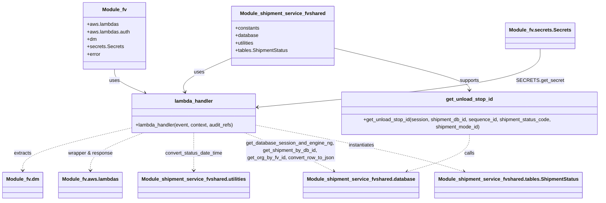
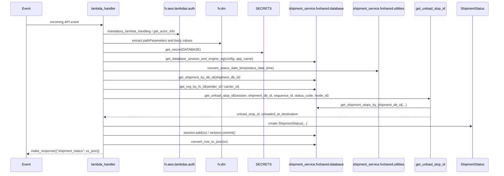
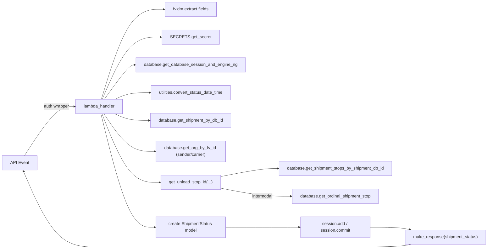

# Diagram: shipment_core/shipment_service/shipment_service/unload/unload.py

> Auto-generated by Obscura crawlers

## Diagram 1

### SVG

<svg id="container" width="1920.52734375" xmlns="http://www.w3.org/2000/svg" class="classDiagram" height="638" viewBox="0 0 1920.52734375 638" role="graphics-document document" aria-roledescription="class"><g><defs><marker id="container_class-aggregationStart" class="marker aggregation class" refX="18" refY="7" markerWidth="190" markerHeight="240" orient="auto"><path d="M 18,7 L9,13 L1,7 L9,1 Z"></path></marker></defs><defs><marker id="container_class-aggregationEnd" class="marker aggregation class" refX="1" refY="7" markerWidth="20" markerHeight="28" orient="auto"><path d="M 18,7 L9,13 L1,7 L9,1 Z"></path></marker></defs><defs><marker id="container_class-extensionStart" class="marker extension class" refX="18" refY="7" markerWidth="190" markerHeight="240" orient="auto"><path d="M 1,7 L18,13 V 1 Z"></path></marker></defs><defs><marker id="container_class-extensionEnd" class="marker extension class" refX="1" refY="7" markerWidth="20" markerHeight="28" orient="auto"><path d="M 1,1 V 13 L18,7 Z"></path></marker></defs><defs><marker id="container_class-compositionStart" class="marker composition class" refX="18" refY="7" markerWidth="190" markerHeight="240" orient="auto"><path d="M 18,7 L9,13 L1,7 L9,1 Z"></path></marker></defs><defs><marker id="container_class-compositionEnd" class="marker composition class" refX="1" refY="7" markerWidth="20" markerHeight="28" orient="auto"><path d="M 18,7 L9,13 L1,7 L9,1 Z"></path></marker></defs><defs><marker id="container_class-dependencyStart" class="marker dependency class" refX="6" refY="7" markerWidth="190" markerHeight="240" orient="auto"><path d="M 5,7 L9,13 L1,7 L9,1 Z"></path></marker></defs><defs><marker id="container_class-dependencyEnd" class="marker dependency class" refX="13" refY="7" markerWidth="20" markerHeight="28" orient="auto"><path d="M 18,7 L9,13 L14,7 L9,1 Z"></path></marker></defs><defs><marker id="container_class-lollipopStart" class="marker lollipop class" refX="13" refY="7" markerWidth="190" markerHeight="240" orient="auto"><circle stroke="black" fill="transparent" cx="7" cy="7" r="6"></circle></marker></defs><defs><marker id="container_class-lollipopEnd" class="marker lollipop class" refX="1" refY="7" markerWidth="190" markerHeight="240" orient="auto"><circle stroke="black" fill="transparent" cx="7" cy="7" r="6"></circle></marker></defs><g class="root"><g class="clusters"></g><g class="edgePaths"><path d="M376.885,224L376.885,230.167C376.885,236.333,376.885,248.667,390.033,260.598C403.181,272.53,429.476,284.06,442.624,289.825L455.772,295.591" id="id_Module_fv_lambda_handler_1" class="edge-thickness-normal edge-pattern-solid relation" style=";;;" data-edge="true" data-et="edge" data-id="id_Module_fv_lambda_handler_1" data-points="W3sieCI6Mzc2Ljg4NDc2NTYyNSwieSI6MjI0fSx7IngiOjM3Ni44ODQ3NjU2MjUsInkiOjI2MX0seyJ4Ijo0NjEuMjY3MTY3OTY4NzQ5OTYsInkiOjI5OH1d" marker-end="url(#container_class-dependencyEnd)"></path><path d="M740.402,185.581L710.855,198.151C681.308,210.72,622.214,235.86,594.86,253.674C567.506,271.488,571.893,281.976,574.086,287.221L576.28,292.465" id="id_Module_shipment_service_fvshared_lambda_handler_2" class="edge-thickness-normal edge-pattern-solid relation" style=";;;" data-edge="true" data-et="edge" data-id="id_Module_shipment_service_fvshared_lambda_handler_2" data-points="W3sieCI6NzQwLjQwMjM0Mzc1LCJ5IjoxODUuNTgwNjU2ODA2NzM0MjN9LHsieCI6NTYzLjExOTE0MDYyNSwieSI6MjYxfSx7IngiOjU3OC41OTQ4MjQyMTg3NSwieSI6Mjk4fV0=" marker-end="url(#container_class-dependencyEnd)"></path><path d="M1067.52,156.91L1136.879,174.258C1206.238,191.607,1344.957,226.303,1414.316,248.818C1483.676,271.333,1483.676,281.667,1483.676,286.833L1483.676,292" id="id_Module_shipment_service_fvshared_get_unload_stop_id_3" class="edge-thickness-normal edge-pattern-solid relation" style=";;;" data-edge="true" data-et="edge" data-id="id_Module_shipment_service_fvshared_get_unload_stop_id_3" data-points="W3sieCI6MTA2Ny41MTk1MzEyNSwieSI6MTU2LjkwOTc2MTY2ODkyMzk4fSx7IngiOjE0ODMuNjc1NzgxMjUsInkiOjI2MX0seyJ4IjoxNDgzLjY3NTc4MTI1LCJ5IjoyOTh9XQ==" marker-end="url(#container_class-dependencyEnd)"></path><path d="M1483.676,424L1483.676,434.167C1483.676,444.333,1483.676,464.667,1451.399,484.707C1419.122,504.748,1354.568,524.497,1322.292,534.371L1290.015,544.245" id="id_get_unload_stop_id_Module_shipment_service_fvshared.database_4" class="edge-thickness-normal edge-pattern-dashed relation" style=";;;" data-edge="true" data-et="edge" data-id="id_get_unload_stop_id_Module_shipment_service_fvshared.database_4" data-points="W3sieCI6MTQ4My42NzU3ODEyNSwieSI6NDI0fSx7IngiOjE0ODMuNjc1NzgxMjUsInkiOjQ4NX0seyJ4IjoxMjg0LjI3NzE3MzA4ODU5MjIsInkiOjU0Nn1d" marker-end="url(#container_class-dependencyEnd)"></path><path d="M402.113,408.101L346.921,420.917C291.729,433.734,181.345,459.367,126.153,481.35C70.961,503.333,70.961,521.667,70.961,530.833L70.961,540" id="id_lambda_handler_Module_fv.dm_5" class="edge-thickness-normal edge-pattern-dashed relation" style=";;;" data-edge="true" data-et="edge" data-id="id_lambda_handler_Module_fv.dm_5" data-points="W3sieCI6NDAyLjExMzI4MTI1LCJ5Ijo0MDguMTAwOTUwOTg3NTY0MDN9LHsieCI6NzAuOTYwOTM3NSwieSI6NDg1fSx7IngiOjcwLjk2MDkzNzUsInkiOjU0Nn1d" marker-end="url(#container_class-dependencyEnd)"></path><path d="M441.249,424L414.833,434.167C388.416,444.333,335.583,464.667,309.167,484C282.75,503.333,282.75,521.667,282.75,530.833L282.75,540" id="id_lambda_handler_Module_fv.aws.lambdas_6" class="edge-thickness-normal edge-pattern-dashed relation" style=";;;" data-edge="true" data-et="edge" data-id="id_lambda_handler_Module_fv.aws.lambdas_6" data-points="W3sieCI6NDQxLjI0OTMwNjk1NTY0NTEsInkiOjQyNH0seyJ4IjoyODIuNzUsInkiOjQ4NX0seyJ4IjoyODIuNzUsInkiOjU0Nn1d" marker-end="url(#container_class-dependencyEnd)"></path><path d="M604.945,424L604.945,434.167C604.945,444.333,604.945,464.667,604.945,484C604.945,503.333,604.945,521.667,604.945,530.833L604.945,540" id="id_lambda_handler_Module_shipment_service_fvshared.utilities_7" class="edge-thickness-normal edge-pattern-dashed relation" style=";;;" data-edge="true" data-et="edge" data-id="id_lambda_handler_Module_shipment_service_fvshared.utilities_7" data-points="W3sieCI6NjA0Ljk0NTMxMjUsInkiOjQyNH0seyJ4Ijo2MDQuOTQ1MzEyNSwieSI6NDg1fSx7IngiOjYwNC45NDUzMTI1LCJ5Ijo1NDZ9XQ==" marker-end="url(#container_class-dependencyEnd)"></path><path d="M772.414,424L799.439,434.167C826.465,444.333,880.516,464.667,927.608,484.564C974.701,504.461,1014.835,523.921,1034.902,533.652L1054.97,543.382" id="id_lambda_handler_Module_shipment_service_fvshared.database_8" class="edge-thickness-normal edge-pattern-dashed relation" style=";;;" data-edge="true" data-et="edge" data-id="id_lambda_handler_Module_shipment_service_fvshared.database_8" data-points="W3sieCI6NzcyLjQxNDA5NDAwMjAxNjEsInkiOjQyNH0seyJ4Ijo5MzQuNTY2NDA2MjUsInkiOjQ4NX0seyJ4IjoxMDYwLjM2ODQ5NTkwNDEyNjEsInkiOjU0Nn1d" marker-end="url(#container_class-dependencyEnd)"></path><path d="M807.777,399.037L884.176,413.364C960.576,427.691,1113.374,456.346,1222.193,480.548C1331.012,504.751,1395.852,524.501,1428.272,534.376L1460.691,544.252" id="id_lambda_handler_Module_shipment_service_fvshared.tables.ShipmentStatus_9" class="edge-thickness-normal edge-pattern-dashed relation" style=";;;" data-edge="true" data-et="edge" data-id="id_lambda_handler_Module_shipment_service_fvshared.tables.ShipmentStatus_9" data-points="W3sieCI6ODA3Ljc3NzM0Mzc1LCJ5IjozOTkuMDM3MTQ2ODc0Mjk4NDZ9LHsieCI6MTI2Ni4xNzE4NzUsInkiOjQ4NX0seyJ4IjoxNDY2LjQzMTA3MTc1MzY0MDcsInkiOjU0Nn1d" marker-end="url(#container_class-dependencyEnd)"></path><path d="M1705.025,158L1705.025,175.167C1705.025,192.333,1705.025,226.667,1556.48,257.336C1407.934,288.006,1110.844,315.013,962.298,328.516L813.753,342.019" id="id_Module_fv.secrets.Secrets_lambda_handler_10" class="edge-thickness-normal edge-pattern-solid relation" style=";;;" data-edge="true" data-et="edge" data-id="id_Module_fv.secrets.Secrets_lambda_handler_10" data-points="W3sieCI6MTcwNS4wMjUzOTA2MjUsInkiOjE1OH0seyJ4IjoxNzA1LjAyNTM5MDYyNSwieSI6MjYxfSx7IngiOjgwNy43NzczNDM3NSwieSI6MzQyLjU2MjA2NjY4MTkzNTQ1fV0=" marker-end="url(#container_class-dependencyEnd)"></path></g><g class="edgeLabels"><g class="edgeLabel" transform="translate(376.884765625, 261)"><g class="label" data-id="id_Module_fv_lambda_handler_1" transform="translate(-16.4921875, -12)"><foreignObject width="32.984375" height="24">

uses

</foreignObject></g></g><g class="edgeLabel" transform="translate(633.30809, 231.14041)"><g class="label" data-id="id_Module_shipment_service_fvshared_lambda_handler_2" transform="translate(-16.4921875, -12)"><foreignObject width="32.984375" height="24">

uses

</foreignObject></g></g><g class="edgeLabel" transform="translate(1483.67578125, 261)"><g class="label" data-id="id_Module_shipment_service_fvshared_get_unload_stop_id_3" transform="translate(-32.28125, -12)"><foreignObject width="64.5625" height="24">

supports

</foreignObject></g></g><g class="edgeLabel" transform="translate(1483.67578125, 485)"><g class="label" data-id="id_get_unload_stop_id_Module_shipment_service_fvshared.database_4" transform="translate(-16.4453125, -12)"><foreignObject width="32.890625" height="24">

calls

</foreignObject></g></g><g class="edgeLabel" transform="translate(70.9609375, 485)"><g class="label" data-id="id_lambda_handler_Module_fv.dm_5" transform="translate(-28.6640625, -12)"><foreignObject width="57.328125" height="24">

extracts

</foreignObject></g></g><g class="edgeLabel" transform="translate(282.75, 485)"><g class="label" data-id="id_lambda_handler_Module_fv.aws.lambdas_6" transform="translate(-73.078125, -12)"><foreignObject width="146.15625" height="24">

wrapper &amp; response

</foreignObject></g></g><g class="edgeLabel" transform="translate(604.9453125, 485)"><g class="label" data-id="id_lambda_handler_Module_shipment_service_fvshared.utilities_7" transform="translate(-93.875, -12)"><foreignObject width="187.75" height="24">

convert_status_date_time

</foreignObject></g></g><g class="edgeLabel" transform="translate(934.56640625, 485)"><g class="label" data-id="id_lambda_handler_Module_shipment_service_fvshared.database_8" transform="translate(-142.96875, -36)"><foreignObject width="285.9375" height="72">

get_database_session_and_engine_ng, get_shipment_by_db_id, get_org_by_fv_id, convert_row_to_json

</foreignObject></g></g><g class="edgeLabel" transform="translate(1139.85305, 461.3114)"><g class="label" data-id="id_lambda_handler_Module_shipment_service_fvshared.tables.ShipmentStatus_9" transform="translate(-42.9140625, -12)"><foreignObject width="85.828125" height="24">

instantiates

</foreignObject></g></g><g class="edgeLabel" transform="translate(1705.025390625, 261)"><g class="label" data-id="id_Module_fv.secrets.Secrets_lambda_handler_10" transform="translate(-69.78125, -12)"><foreignObject width="139.5625" height="24">

SECRETS.get_secret

</foreignObject></g></g></g><g class="nodes"><g class="node default" id="classId-Module_fv-0" transform="translate(376.884765625, 116)"><g class="basic label-container"><path d="M-100.08203125 -108 L100.08203125 -108 L100.08203125 108 L-100.08203125 108" stroke="none" stroke-width="0" fill="#ECECFF" style=""></path><path d="M-100.08203125 -108 C-29.921877822529055 -108, 40.23827560494189 -108, 100.08203125 -108 M-100.08203125 -108 C-58.9139732566969 -108, -17.745915263393798 -108, 100.08203125 -108 M100.08203125 -108 C100.08203125 -45.570582877561684, 100.08203125 16.858834244876633, 100.08203125 108 M100.08203125 -108 C100.08203125 -62.69580553793941, 100.08203125 -17.391611075878814, 100.08203125 108 M100.08203125 108 C36.38586392957602 108, -27.310303390847963 108, -100.08203125 108 M100.08203125 108 C25.58347298775901 108, -48.91508527448198 108, -100.08203125 108 M-100.08203125 108 C-100.08203125 24.79537562836846, -100.08203125 -58.40924874326308, -100.08203125 -108 M-100.08203125 108 C-100.08203125 43.845316792828655, -100.08203125 -20.30936641434269, -100.08203125 -108" stroke="#9370DB" stroke-width="1.3" fill="none" stroke-dasharray="0 0" style=""></path></g><g class="annotation-group text" transform="translate(0, -84)"></g><g class="label-group text" transform="translate(-37.8828125, -84)"><g class="label" style="font-weight: bolder" transform="translate(0,-12)"><foreignObject width="75.765625" height="24">

Module_fv

</foreignObject></g></g><g class="members-group text" transform="translate(-88.08203125, -36)"><g class="label" style="" transform="translate(0,-12)"><foreignObject width="101.265625" height="24">

+aws.lambdas

</foreignObject></g><g class="label" style="" transform="translate(0,12)"><foreignObject width="138.28125" height="24">

+aws.lambdas.auth

</foreignObject></g><g class="label" style="" transform="translate(0,36)"><foreignObject width="31.265625" height="24">

+dm

</foreignObject></g><g class="label" style="" transform="translate(0,60)"><foreignObject width="116.09375" height="24">

+secrets.Secrets

</foreignObject></g><g class="label" style="" transform="translate(0,84)"><foreignObject width="44.109375" height="24">

+error

</foreignObject></g></g><g class="methods-group text" transform="translate(-88.08203125, 108)"></g><g class="divider" style=""><path d="M-100.08203125 -60 C-38.07462848455094 -60, 23.932774280898116 -60, 100.08203125 -60 M-100.08203125 -60 C-47.591366784016984 -60, 4.899297681966033 -60, 100.08203125 -60" stroke="#9370DB" stroke-width="1.3" fill="none" stroke-dasharray="0 0" style=""></path></g><g class="divider" style=""><path d="M-100.08203125 84 C-21.585592181460896 84, 56.91084688707821 84, 100.08203125 84 M-100.08203125 84 C-21.382729555763973 84, 57.316572138472054 84, 100.08203125 84" stroke="#9370DB" stroke-width="1.3" fill="none" stroke-dasharray="0 0" style=""></path></g></g><g class="node default" id="classId-Module_shipment_service_fvshared-1" transform="translate(903.9609375, 116)"><g class="basic label-container"><path d="M-163.55859375 -96 L163.55859375 -96 L163.55859375 96 L-163.55859375 96" stroke="none" stroke-width="0" fill="#ECECFF" style=""></path><path d="M-163.55859375 -96 C-58.989231922187656 -96, 45.58012990562469 -96, 163.55859375 -96 M-163.55859375 -96 C-74.29204473298007 -96, 14.974504284039853 -96, 163.55859375 -96 M163.55859375 -96 C163.55859375 -44.88104818425568, 163.55859375 6.237903631488635, 163.55859375 96 M163.55859375 -96 C163.55859375 -51.90955030109835, 163.55859375 -7.8191006021966984, 163.55859375 96 M163.55859375 96 C70.14850060180466 96, -23.261592546390688 96, -163.55859375 96 M163.55859375 96 C68.80609796542143 96, -25.94639781915714 96, -163.55859375 96 M-163.55859375 96 C-163.55859375 21.011589797742886, -163.55859375 -53.97682040451423, -163.55859375 -96 M-163.55859375 96 C-163.55859375 34.83437965996683, -163.55859375 -26.331240680066344, -163.55859375 -96" stroke="#9370DB" stroke-width="1.3" fill="none" stroke-dasharray="0 0" style=""></path></g><g class="annotation-group text" transform="translate(0, -72)"></g><g class="label-group text" transform="translate(-131.3515625, -72)"><g class="label" style="font-weight: bolder" transform="translate(0,-12)"><foreignObject width="262.703125" height="24">

Module_shipment_service_fvshared

</foreignObject></g></g><g class="members-group text" transform="translate(-151.55859375, -24)"><g class="label" style="" transform="translate(0,-12)"><foreignObject width="78.5" height="24">

+constants

</foreignObject></g><g class="label" style="" transform="translate(0,12)"><foreignObject width="74.71875" height="24">

+database

</foreignObject></g><g class="label" style="" transform="translate(0,36)"><foreignObject width="63.265625" height="24">

+utilities

</foreignObject></g><g class="label" style="" transform="translate(0,60)"><foreignObject width="171.765625" height="24">

+tables.ShipmentStatus

</foreignObject></g></g><g class="methods-group text" transform="translate(-151.55859375, 96)"></g><g class="divider" style=""><path d="M-163.55859375 -48 C-95.4341132738024 -48, -27.30963279760479 -48, 163.55859375 -48 M-163.55859375 -48 C-63.37403060528169 -48, 36.81053253943662 -48, 163.55859375 -48" stroke="#9370DB" stroke-width="1.3" fill="none" stroke-dasharray="0 0" style=""></path></g><g class="divider" style=""><path d="M-163.55859375 72 C-96.99964527933096 72, -30.440696808661926 72, 163.55859375 72 M-163.55859375 72 C-94.31852457604253 72, -25.07845540208507 72, 163.55859375 72" stroke="#9370DB" stroke-width="1.3" fill="none" stroke-dasharray="0 0" style=""></path></g></g><g class="node default" id="classId-get_unload_stop_id-2" transform="translate(1483.67578125, 361)"><g class="basic label-container"><path d="M-428.8515625 -63 L428.8515625 -63 L428.8515625 63 L-428.8515625 63" stroke="none" stroke-width="0" fill="#ECECFF" style=""></path><path d="M-428.8515625 -63 C-140.63973576887008 -63, 147.57209096225984 -63, 428.8515625 -63 M-428.8515625 -63 C-90.77409813419217 -63, 247.30336623161566 -63, 428.8515625 -63 M428.8515625 -63 C428.8515625 -27.8245079948817, 428.8515625 7.350984010236601, 428.8515625 63 M428.8515625 -63 C428.8515625 -31.924198992206975, 428.8515625 -0.8483979844139498, 428.8515625 63 M428.8515625 63 C86.0933226570778 63, -256.6649171858444 63, -428.8515625 63 M428.8515625 63 C195.44373734525882 63, -37.96408780948235 63, -428.8515625 63 M-428.8515625 63 C-428.8515625 34.187987076340036, -428.8515625 5.375974152680072, -428.8515625 -63 M-428.8515625 63 C-428.8515625 18.580037062543134, -428.8515625 -25.83992587491373, -428.8515625 -63" stroke="#9370DB" stroke-width="1.3" fill="none" stroke-dasharray="0 0" style=""></path></g><g class="annotation-group text" transform="translate(0, -39)"></g><g class="label-group text" transform="translate(-72.515625, -39)"><g class="label" style="font-weight: bolder" transform="translate(0,-12)"><foreignObject width="145.03125" height="24">

get_unload_stop_id

</foreignObject></g></g><g class="members-group text" transform="translate(-416.8515625, 9)"></g><g class="methods-group text" transform="translate(-416.8515625, 39)"><g class="label" style="" transform="translate(0,-12)"><foreignObject width="761.1875" height="24">

+get_unload_stop_id(session, shipment_db_id, sequence_id, shipment_status_code, shipment_mode_id)

</foreignObject></g></g><g class="divider" style=""><path d="M-428.8515625 -15 C-151.1152428641854 -15, 126.62107677162919 -15, 428.8515625 -15 M-428.8515625 -15 C-186.51630693083143 -15, 55.81894863833713 -15, 428.8515625 -15" stroke="#9370DB" stroke-width="1.3" fill="none" stroke-dasharray="0 0" style=""></path></g><g class="divider" style=""><path d="M-428.8515625 9 C-99.08528792160473 9, 230.68098665679054 9, 428.8515625 9 M-428.8515625 9 C-215.3185016783743 9, -1.7854408567486075 9, 428.8515625 9" stroke="#9370DB" stroke-width="1.3" fill="none" stroke-dasharray="0 0" style=""></path></g></g><g class="node default" id="classId-lambda_handler-3" transform="translate(604.9453125, 361)"><g class="basic label-container"><path d="M-202.83203125 -63 L202.83203125 -63 L202.83203125 63 L-202.83203125 63" stroke="none" stroke-width="0" fill="#ECECFF" style=""></path><path d="M-202.83203125 -63 C-65.95027276457012 -63, 70.93148572085977 -63, 202.83203125 -63 M-202.83203125 -63 C-47.17951692927113 -63, 108.47299739145774 -63, 202.83203125 -63 M202.83203125 -63 C202.83203125 -27.158381989110644, 202.83203125 8.683236021778711, 202.83203125 63 M202.83203125 -63 C202.83203125 -35.086340061841675, 202.83203125 -7.1726801236833495, 202.83203125 63 M202.83203125 63 C93.26071600254582 63, -16.31059924490836 63, -202.83203125 63 M202.83203125 63 C95.77325451625418 63, -11.285522217491632 63, -202.83203125 63 M-202.83203125 63 C-202.83203125 24.90119966603166, -202.83203125 -13.197600667936683, -202.83203125 -63 M-202.83203125 63 C-202.83203125 26.15770512778427, -202.83203125 -10.684589744431463, -202.83203125 -63" stroke="#9370DB" stroke-width="1.3" fill="none" stroke-dasharray="0 0" style=""></path></g><g class="annotation-group text" transform="translate(0, -39)"></g><g class="label-group text" transform="translate(-59.9765625, -39)"><g class="label" style="font-weight: bolder" transform="translate(0,-12)"><foreignObject width="119.953125" height="24">

lambda_handler

</foreignObject></g></g><g class="members-group text" transform="translate(-190.83203125, 9)"></g><g class="methods-group text" transform="translate(-190.83203125, 39)"><g class="label" style="" transform="translate(0,-12)"><foreignObject width="321.6875" height="24">

+lambda_handler(event, context, audit_refs)

</foreignObject></g></g><g class="divider" style=""><path d="M-202.83203125 -15 C-114.37682357236046 -15, -25.92161589472093 -15, 202.83203125 -15 M-202.83203125 -15 C-112.61746445724435 -15, -22.402897664488705 -15, 202.83203125 -15" stroke="#9370DB" stroke-width="1.3" fill="none" stroke-dasharray="0 0" style=""></path></g><g class="divider" style=""><path d="M-202.83203125 9 C-88.847185949362 9, 25.137659351276 9, 202.83203125 9 M-202.83203125 9 C-89.79611741446135 9, 23.2397964210773 9, 202.83203125 9" stroke="#9370DB" stroke-width="1.3" fill="none" stroke-dasharray="0 0" style=""></path></g></g><g class="node default" id="classId-Module_shipment_service_fvshared.database-4" transform="translate(1146.986328125, 588)"><g class="basic label-container"><path d="M-179.03125 -42 L179.03125 -42 L179.03125 42 L-179.03125 42" stroke="none" stroke-width="0" fill="#ECECFF" style=""></path><path d="M-179.03125 -42 C-41.305369171888 -42, 96.420511656224 -42, 179.03125 -42 M-179.03125 -42 C-66.9650352404123 -42, 45.10117951917539 -42, 179.03125 -42 M179.03125 -42 C179.03125 -24.55655842640947, 179.03125 -7.113116852818941, 179.03125 42 M179.03125 -42 C179.03125 -23.1534608098042, 179.03125 -4.306921619608403, 179.03125 42 M179.03125 42 C60.83555804914363 42, -57.36013390171274 42, -179.03125 42 M179.03125 42 C86.39913827477741 42, -6.232973450445172 42, -179.03125 42 M-179.03125 42 C-179.03125 14.006748010626417, -179.03125 -13.986503978747166, -179.03125 -42 M-179.03125 42 C-179.03125 13.563343902779348, -179.03125 -14.873312194441304, -179.03125 -42" stroke="#9370DB" stroke-width="1.3" fill="none" stroke-dasharray="0 0" style=""></path></g><g class="annotation-group text" transform="translate(0, -18)"></g><g class="label-group text" transform="translate(-167.03125, -18)"><g class="label" style="font-weight: bolder" transform="translate(0,-12)"><foreignObject width="334.0625" height="24">

Module_shipment_service_fvshared.database

</foreignObject></g></g><g class="members-group text" transform="translate(-167.03125, 30)"></g><g class="methods-group text" transform="translate(-167.03125, 60)"></g><g class="divider" style=""><path d="M-179.03125 6 C-71.64446055244406 6, 35.74232889511188 6, 179.03125 6 M-179.03125 6 C-77.21340207472412 6, 24.60444585055177 6, 179.03125 6" stroke="#9370DB" stroke-width="1.3" fill="none" stroke-dasharray="0 0" style=""></path></g><g class="divider" style=""><path d="M-179.03125 24 C-90.52944678161882 24, -2.027643563237632 24, 179.03125 24 M-179.03125 24 C-99.47201276233076 24, -19.912775524661527 24, 179.03125 24" stroke="#9370DB" stroke-width="1.3" fill="none" stroke-dasharray="0 0" style=""></path></g></g><g class="node default" id="classId-Module_fv.dm-5" transform="translate(70.9609375, 588)"><g class="basic label-container"><path d="M-62.9609375 -42 L62.9609375 -42 L62.9609375 42 L-62.9609375 42" stroke="none" stroke-width="0" fill="#ECECFF" style=""></path><path d="M-62.9609375 -42 C-16.942875468866774 -42, 29.075186562266452 -42, 62.9609375 -42 M-62.9609375 -42 C-13.508632879369841 -42, 35.94367174126032 -42, 62.9609375 -42 M62.9609375 -42 C62.9609375 -16.861874462133038, 62.9609375 8.276251075733924, 62.9609375 42 M62.9609375 -42 C62.9609375 -22.71874429047686, 62.9609375 -3.437488580953719, 62.9609375 42 M62.9609375 42 C22.89217367712397 42, -17.17659014575206 42, -62.9609375 42 M62.9609375 42 C17.262540955873398 42, -28.435855588253204 42, -62.9609375 42 M-62.9609375 42 C-62.9609375 11.116243981478164, -62.9609375 -19.767512037043673, -62.9609375 -42 M-62.9609375 42 C-62.9609375 14.853294303930923, -62.9609375 -12.293411392138154, -62.9609375 -42" stroke="#9370DB" stroke-width="1.3" fill="none" stroke-dasharray="0 0" style=""></path></g><g class="annotation-group text" transform="translate(0, -18)"></g><g class="label-group text" transform="translate(-50.9609375, -18)"><g class="label" style="font-weight: bolder" transform="translate(0,-12)"><foreignObject width="101.921875" height="24">

Module_fv.dm

</foreignObject></g></g><g class="members-group text" transform="translate(-50.9609375, 30)"></g><g class="methods-group text" transform="translate(-50.9609375, 60)"></g><g class="divider" style=""><path d="M-62.9609375 6 C-15.847922530941482 6, 31.265092438117037 6, 62.9609375 6 M-62.9609375 6 C-17.102378016507075 6, 28.75618146698585 6, 62.9609375 6" stroke="#9370DB" stroke-width="1.3" fill="none" stroke-dasharray="0 0" style=""></path></g><g class="divider" style=""><path d="M-62.9609375 24 C-32.7365057885559 24, -2.512074077111812 24, 62.9609375 24 M-62.9609375 24 C-18.494973877886764 24, 25.970989744226472 24, 62.9609375 24" stroke="#9370DB" stroke-width="1.3" fill="none" stroke-dasharray="0 0" style=""></path></g></g><g class="node default" id="classId-Module_fv.aws.lambdas-6" transform="translate(282.75, 588)"><g class="basic label-container"><path d="M-98.828125 -42 L98.828125 -42 L98.828125 42 L-98.828125 42" stroke="none" stroke-width="0" fill="#ECECFF" style=""></path><path d="M-98.828125 -42 C-31.94266939390282 -42, 34.94278621219436 -42, 98.828125 -42 M-98.828125 -42 C-36.593383165099326 -42, 25.64135866980135 -42, 98.828125 -42 M98.828125 -42 C98.828125 -22.440008507667464, 98.828125 -2.8800170153349285, 98.828125 42 M98.828125 -42 C98.828125 -17.66538119572996, 98.828125 6.6692376085400795, 98.828125 42 M98.828125 42 C34.21425291458034 42, -30.399619170839316 42, -98.828125 42 M98.828125 42 C56.55022486056031 42, 14.272324721120626 42, -98.828125 42 M-98.828125 42 C-98.828125 21.703295159037932, -98.828125 1.4065903180758639, -98.828125 -42 M-98.828125 42 C-98.828125 13.208244140050414, -98.828125 -15.583511719899171, -98.828125 -42" stroke="#9370DB" stroke-width="1.3" fill="none" stroke-dasharray="0 0" style=""></path></g><g class="annotation-group text" transform="translate(0, -18)"></g><g class="label-group text" transform="translate(-86.828125, -18)"><g class="label" style="font-weight: bolder" transform="translate(0,-12)"><foreignObject width="173.65625" height="24">

Module_fv.aws.lambdas

</foreignObject></g></g><g class="members-group text" transform="translate(-86.828125, 30)"></g><g class="methods-group text" transform="translate(-86.828125, 60)"></g><g class="divider" style=""><path d="M-98.828125 6 C-37.80554964981699 6, 23.217025700366023 6, 98.828125 6 M-98.828125 6 C-30.011572664097457 6, 38.804979671805086 6, 98.828125 6" stroke="#9370DB" stroke-width="1.3" fill="none" stroke-dasharray="0 0" style=""></path></g><g class="divider" style=""><path d="M-98.828125 24 C-22.625122011373193 24, 53.57788097725361 24, 98.828125 24 M-98.828125 24 C-23.557071143147226 24, 51.71398271370555 24, 98.828125 24" stroke="#9370DB" stroke-width="1.3" fill="none" stroke-dasharray="0 0" style=""></path></g></g><g class="node default" id="classId-Module_shipment_service_fvshared.utilities-7" transform="translate(604.9453125, 588)"><g class="basic label-container"><path d="M-173.3671875 -42 L173.3671875 -42 L173.3671875 42 L-173.3671875 42" stroke="none" stroke-width="0" fill="#ECECFF" style=""></path><path d="M-173.3671875 -42 C-51.25017779960382 -42, 70.86683190079236 -42, 173.3671875 -42 M-173.3671875 -42 C-35.34956839514757 -42, 102.66805070970486 -42, 173.3671875 -42 M173.3671875 -42 C173.3671875 -24.28238557511433, 173.3671875 -6.564771150228658, 173.3671875 42 M173.3671875 -42 C173.3671875 -19.035782832100168, 173.3671875 3.9284343357996647, 173.3671875 42 M173.3671875 42 C69.19655100808261 42, -34.974085483834784 42, -173.3671875 42 M173.3671875 42 C89.80192003671 42, 6.2366525734200025 42, -173.3671875 42 M-173.3671875 42 C-173.3671875 14.456966367295713, -173.3671875 -13.086067265408573, -173.3671875 -42 M-173.3671875 42 C-173.3671875 19.61254891544838, -173.3671875 -2.7749021691032425, -173.3671875 -42" stroke="#9370DB" stroke-width="1.3" fill="none" stroke-dasharray="0 0" style=""></path></g><g class="annotation-group text" transform="translate(0, -18)"></g><g class="label-group text" transform="translate(-161.3671875, -18)"><g class="label" style="font-weight: bolder" transform="translate(0,-12)"><foreignObject width="322.734375" height="24">

Module_shipment_service_fvshared.utilities

</foreignObject></g></g><g class="members-group text" transform="translate(-161.3671875, 30)"></g><g class="methods-group text" transform="translate(-161.3671875, 60)"></g><g class="divider" style=""><path d="M-173.3671875 6 C-39.04217115576972 6, 95.28284518846056 6, 173.3671875 6 M-173.3671875 6 C-85.89543638881683 6, 1.5763147223663339 6, 173.3671875 6" stroke="#9370DB" stroke-width="1.3" fill="none" stroke-dasharray="0 0" style=""></path></g><g class="divider" style=""><path d="M-173.3671875 24 C-71.05237527301212 24, 31.262436953975765 24, 173.3671875 24 M-173.3671875 24 C-95.52010950525134 24, -17.673031510502682 24, 173.3671875 24" stroke="#9370DB" stroke-width="1.3" fill="none" stroke-dasharray="0 0" style=""></path></g></g><g class="node default" id="classId-Module_shipment_service_fvshared.tables.ShipmentStatus-8" transform="translate(1604.314453125, 588)"><g class="basic label-container"><path d="M-228.296875 -42 L228.296875 -42 L228.296875 42 L-228.296875 42" stroke="none" stroke-width="0" fill="#ECECFF" style=""></path><path d="M-228.296875 -42 C-58.46869643820909 -42, 111.35948212358181 -42, 228.296875 -42 M-228.296875 -42 C-90.75535599058446 -42, 46.786163018831076 -42, 228.296875 -42 M228.296875 -42 C228.296875 -20.39427865866821, 228.296875 1.2114426826635807, 228.296875 42 M228.296875 -42 C228.296875 -23.18033893125496, 228.296875 -4.360677862509917, 228.296875 42 M228.296875 42 C71.60075062734546 42, -85.09537374530908 42, -228.296875 42 M228.296875 42 C58.518988566381324 42, -111.25889786723735 42, -228.296875 42 M-228.296875 42 C-228.296875 8.562668550513862, -228.296875 -24.874662898972275, -228.296875 -42 M-228.296875 42 C-228.296875 14.841431366477508, -228.296875 -12.317137267044984, -228.296875 -42" stroke="#9370DB" stroke-width="1.3" fill="none" stroke-dasharray="0 0" style=""></path></g><g class="annotation-group text" transform="translate(0, -18)"></g><g class="label-group text" transform="translate(-216.296875, -18)"><g class="label" style="font-weight: bolder" transform="translate(0,-12)"><foreignObject width="432.59375" height="24">

Module_shipment_service_fvshared.tables.ShipmentStatus

</foreignObject></g></g><g class="members-group text" transform="translate(-216.296875, 30)"></g><g class="methods-group text" transform="translate(-216.296875, 60)"></g><g class="divider" style=""><path d="M-228.296875 6 C-64.82029481359967 6, 98.65628537280065 6, 228.296875 6 M-228.296875 6 C-68.09724625928769 6, 92.10238248142463 6, 228.296875 6" stroke="#9370DB" stroke-width="1.3" fill="none" stroke-dasharray="0 0" style=""></path></g><g class="divider" style=""><path d="M-228.296875 24 C-120.3604425384717 24, -12.424010076943404 24, 228.296875 24 M-228.296875 24 C-113.41023278291296 24, 1.4764094341740872 24, 228.296875 24" stroke="#9370DB" stroke-width="1.3" fill="none" stroke-dasharray="0 0" style=""></path></g></g><g class="node default" id="classId-Module_fv.secrets.Secrets-9" transform="translate(1705.025390625, 116)"><g class="basic label-container"><path d="M-107.078125 -42 L107.078125 -42 L107.078125 42 L-107.078125 42" stroke="none" stroke-width="0" fill="#ECECFF" style=""></path><path d="M-107.078125 -42 C-24.36675070205031 -42, 58.34462359589938 -42, 107.078125 -42 M-107.078125 -42 C-47.8680120537161 -42, 11.3421008925678 -42, 107.078125 -42 M107.078125 -42 C107.078125 -8.976839823661287, 107.078125 24.046320352677427, 107.078125 42 M107.078125 -42 C107.078125 -14.07033101052874, 107.078125 13.85933797894252, 107.078125 42 M107.078125 42 C48.30874694197137 42, -10.460631116057257 42, -107.078125 42 M107.078125 42 C37.84410130945733 42, -31.38992238108534 42, -107.078125 42 M-107.078125 42 C-107.078125 17.37317511840818, -107.078125 -7.253649763183638, -107.078125 -42 M-107.078125 42 C-107.078125 15.444200005918624, -107.078125 -11.111599988162752, -107.078125 -42" stroke="#9370DB" stroke-width="1.3" fill="none" stroke-dasharray="0 0" style=""></path></g><g class="annotation-group text" transform="translate(0, -18)"></g><g class="label-group text" transform="translate(-95.078125, -18)"><g class="label" style="font-weight: bolder" transform="translate(0,-12)"><foreignObject width="190.15625" height="24">

Module_fv.secrets.Secrets

</foreignObject></g></g><g class="members-group text" transform="translate(-95.078125, 30)"></g><g class="methods-group text" transform="translate(-95.078125, 60)"></g><g class="divider" style=""><path d="M-107.078125 6 C-43.30271645582285 6, 20.472692088354293 6, 107.078125 6 M-107.078125 6 C-62.83955752751507 6, -18.600990055030138 6, 107.078125 6" stroke="#9370DB" stroke-width="1.3" fill="none" stroke-dasharray="0 0" style=""></path></g><g class="divider" style=""><path d="M-107.078125 24 C-47.95320303360655 24, 11.171718932786902 24, 107.078125 24 M-107.078125 24 C-57.85414135801176 24, -8.630157716023518 24, 107.078125 24" stroke="#9370DB" stroke-width="1.3" fill="none" stroke-dasharray="0 0" style=""></path></g></g></g></g></g></svg>

## Diagram 2

### SVG

<svg id="container" width="2533.5" xmlns="http://www.w3.org/2000/svg" height="891" viewBox="-50 -10 2533.5 891" role="graphics-document document" aria-roledescription="sequence"><g><rect x="2283.5" y="805" fill="#eaeaea" stroke="#666" width="150" height="65" name="DBRow" rx="3" ry="3" class="actor actor-bottom"></rect><text x="2358.5" y="837.5" dominant-baseline="central" alignment-baseline="central" class="actor actor-box" style="text-anchor: middle; font-size: 16px; font-weight: 400;"><tspan x="2358.5" dy="0">ShipmentStatus</tspan></text></g><g><rect x="2069.5" y="805" fill="#eaeaea" stroke="#666" width="164" height="65" name="getStop" rx="3" ry="3" class="actor actor-bottom"></rect><text x="2151.5" y="837.5" dominant-baseline="central" alignment-baseline="central" class="actor actor-box" style="text-anchor: middle; font-size: 16px; font-weight: 400;"><tspan x="2151.5" dy="0">get_unload_stop_id</tspan></text></g><g><rect x="1746.5" y="805" fill="#eaeaea" stroke="#666" width="273" height="65" name="Utils" rx="3" ry="3" class="actor actor-bottom"></rect><text x="1883" y="837.5" dominant-baseline="central" alignment-baseline="central" class="actor actor-box" style="text-anchor: middle; font-size: 16px; font-weight: 400;"><tspan x="1883" dy="0">shipment_service.fvshared.utilities</tspan></text></g><g><rect x="1412.5" y="805" fill="#eaeaea" stroke="#666" width="284" height="65" name="DB" rx="3" ry="3" class="actor actor-bottom"></rect><text x="1554.5" y="837.5" dominant-baseline="central" alignment-baseline="central" class="actor actor-box" style="text-anchor: middle; font-size: 16px; font-weight: 400;"><tspan x="1554.5" dy="0">shipment_service.fvshared.database</tspan></text></g><g><rect x="1212.5" y="805" fill="#eaeaea" stroke="#666" width="150" height="65" name="Secrets" rx="3" ry="3" class="actor actor-bottom"></rect><text x="1287.5" y="837.5" dominant-baseline="central" alignment-baseline="central" class="actor actor-box" style="text-anchor: middle; font-size: 16px; font-weight: 400;"><tspan x="1287.5" dy="0">SECRETS</tspan></text></g><g><rect x="1012.5" y="805" fill="#eaeaea" stroke="#666" width="150" height="65" name="DM" rx="3" ry="3" class="actor actor-bottom"></rect><text x="1087.5" y="837.5" dominant-baseline="central" alignment-baseline="central" class="actor actor-box" style="text-anchor: middle; font-size: 16px; font-weight: 400;"><tspan x="1087.5" dy="0">fv.dm</tspan></text></g><g><rect x="795.5" y="805" fill="#eaeaea" stroke="#666" width="167" height="65" name="Auth" rx="3" ry="3" class="actor actor-bottom"></rect><text x="879" y="837.5" dominant-baseline="central" alignment-baseline="central" class="actor actor-box" style="text-anchor: middle; font-size: 16px; font-weight: 400;"><tspan x="879" dy="0">fv.aws.lambdas.auth</tspan></text></g><g><rect x="400" y="805" fill="#eaeaea" stroke="#666" width="150" height="65" name="Lambda" rx="3" ry="3" class="actor actor-bottom"></rect><text x="475" y="837.5" dominant-baseline="central" alignment-baseline="central" class="actor actor-box" style="text-anchor: middle; font-size: 16px; font-weight: 400;"><tspan x="475" dy="0">lambda_handler</tspan></text></g><g><rect x="0" y="805" fill="#eaeaea" stroke="#666" width="150" height="65" name="Event" rx="3" ry="3" class="actor actor-bottom"></rect><text x="75" y="837.5" dominant-baseline="central" alignment-baseline="central" class="actor actor-box" style="text-anchor: middle; font-size: 16px; font-weight: 400;"><tspan x="75" dy="0">Event</tspan></text></g><g><line id="actor8" x1="2358.5" y1="65" x2="2358.5" y2="805" class="actor-line 200" stroke-width="0.5px" stroke="#999" name="DBRow"></line><g id="root-8"><rect x="2283.5" y="0" fill="#eaeaea" stroke="#666" width="150" height="65" name="DBRow" rx="3" ry="3" class="actor actor-top"></rect><text x="2358.5" y="32.5" dominant-baseline="central" alignment-baseline="central" class="actor actor-box" style="text-anchor: middle; font-size: 16px; font-weight: 400;"><tspan x="2358.5" dy="0">ShipmentStatus</tspan></text></g></g><g><line id="actor7" x1="2151.5" y1="65" x2="2151.5" y2="805" class="actor-line 200" stroke-width="0.5px" stroke="#999" name="getStop"></line><g id="root-7"><rect x="2069.5" y="0" fill="#eaeaea" stroke="#666" width="164" height="65" name="getStop" rx="3" ry="3" class="actor actor-top"></rect><text x="2151.5" y="32.5" dominant-baseline="central" alignment-baseline="central" class="actor actor-box" style="text-anchor: middle; font-size: 16px; font-weight: 400;"><tspan x="2151.5" dy="0">get_unload_stop_id</tspan></text></g></g><g><line id="actor6" x1="1883" y1="65" x2="1883" y2="805" class="actor-line 200" stroke-width="0.5px" stroke="#999" name="Utils"></line><g id="root-6"><rect x="1746.5" y="0" fill="#eaeaea" stroke="#666" width="273" height="65" name="Utils" rx="3" ry="3" class="actor actor-top"></rect><text x="1883" y="32.5" dominant-baseline="central" alignment-baseline="central" class="actor actor-box" style="text-anchor: middle; font-size: 16px; font-weight: 400;"><tspan x="1883" dy="0">shipment_service.fvshared.utilities</tspan></text></g></g><g><line id="actor5" x1="1554.5" y1="65" x2="1554.5" y2="805" class="actor-line 200" stroke-width="0.5px" stroke="#999" name="DB"></line><g id="root-5"><rect x="1412.5" y="0" fill="#eaeaea" stroke="#666" width="284" height="65" name="DB" rx="3" ry="3" class="actor actor-top"></rect><text x="1554.5" y="32.5" dominant-baseline="central" alignment-baseline="central" class="actor actor-box" style="text-anchor: middle; font-size: 16px; font-weight: 400;"><tspan x="1554.5" dy="0">shipment_service.fvshared.database</tspan></text></g></g><g><line id="actor4" x1="1287.5" y1="65" x2="1287.5" y2="805" class="actor-line 200" stroke-width="0.5px" stroke="#999" name="Secrets"></line><g id="root-4"><rect x="1212.5" y="0" fill="#eaeaea" stroke="#666" width="150" height="65" name="Secrets" rx="3" ry="3" class="actor actor-top"></rect><text x="1287.5" y="32.5" dominant-baseline="central" alignment-baseline="central" class="actor actor-box" style="text-anchor: middle; font-size: 16px; font-weight: 400;"><tspan x="1287.5" dy="0">SECRETS</tspan></text></g></g><g><line id="actor3" x1="1087.5" y1="65" x2="1087.5" y2="805" class="actor-line 200" stroke-width="0.5px" stroke="#999" name="DM"></line><g id="root-3"><rect x="1012.5" y="0" fill="#eaeaea" stroke="#666" width="150" height="65" name="DM" rx="3" ry="3" class="actor actor-top"></rect><text x="1087.5" y="32.5" dominant-baseline="central" alignment-baseline="central" class="actor actor-box" style="text-anchor: middle; font-size: 16px; font-weight: 400;"><tspan x="1087.5" dy="0">fv.dm</tspan></text></g></g><g><line id="actor2" x1="879" y1="65" x2="879" y2="805" class="actor-line 200" stroke-width="0.5px" stroke="#999" name="Auth"></line><g id="root-2"><rect x="795.5" y="0" fill="#eaeaea" stroke="#666" width="167" height="65" name="Auth" rx="3" ry="3" class="actor actor-top"></rect><text x="879" y="32.5" dominant-baseline="central" alignment-baseline="central" class="actor actor-box" style="text-anchor: middle; font-size: 16px; font-weight: 400;"><tspan x="879" dy="0">fv.aws.lambdas.auth</tspan></text></g></g><g><line id="actor1" x1="475" y1="65" x2="475" y2="805" class="actor-line 200" stroke-width="0.5px" stroke="#999" name="Lambda"></line><g id="root-1"><rect x="400" y="0" fill="#eaeaea" stroke="#666" width="150" height="65" name="Lambda" rx="3" ry="3" class="actor actor-top"></rect><text x="475" y="32.5" dominant-baseline="central" alignment-baseline="central" class="actor actor-box" style="text-anchor: middle; font-size: 16px; font-weight: 400;"><tspan x="475" dy="0">lambda_handler</tspan></text></g></g><g><line id="actor0" x1="75" y1="65" x2="75" y2="805" class="actor-line 200" stroke-width="0.5px" stroke="#999" name="Event"></line><g id="root-0"><rect x="0" y="0" fill="#eaeaea" stroke="#666" width="150" height="65" name="Event" rx="3" ry="3" class="actor actor-top"></rect><text x="75" y="32.5" dominant-baseline="central" alignment-baseline="central" class="actor actor-box" style="text-anchor: middle; font-size: 16px; font-weight: 400;"><tspan x="75" dy="0">Event</tspan></text></g></g><g></g><defs><symbol id="computer" width="24" height="24"><path transform="scale(.5)" d="M2 2v13h20v-13h-20zm18 11h-16v-9h16v9zm-10.228 6l.466-1h3.524l.467 1h-4.457zm14.228 3h-24l2-6h2.104l-1.33 4h18.45l-1.297-4h2.073l2 6zm-5-10h-14v-7h14v7z"></path></symbol></defs><defs><symbol id="database" fill-rule="evenodd" clip-rule="evenodd"><path transform="scale(.5)" d="M12.258.001l.256.004.255.005.253.008.251.01.249.012.247.015.246.016.242.019.241.02.239.023.236.024.233.027.231.028.229.031.225.032.223.034.22.036.217.038.214.04.211.041.208.043.205.045.201.046.198.048.194.05.191.051.187.053.183.054.18.056.175.057.172.059.168.06.163.061.16.063.155.064.15.066.074.033.073.033.071.034.07.034.069.035.068.035.067.035.066.035.064.036.064.036.062.036.06.036.06.037.058.037.058.037.055.038.055.038.053.038.052.038.051.039.05.039.048.039.047.039.045.04.044.04.043.04.041.04.04.041.039.041.037.041.036.041.034.041.033.042.032.042.03.042.029.042.027.042.026.043.024.043.023.043.021.043.02.043.018.044.017.043.015.044.013.044.012.044.011.045.009.044.007.045.006.045.004.045.002.045.001.045v17l-.001.045-.002.045-.004.045-.006.045-.007.045-.009.044-.011.045-.012.044-.013.044-.015.044-.017.043-.018.044-.02.043-.021.043-.023.043-.024.043-.026.043-.027.042-.029.042-.03.042-.032.042-.033.042-.034.041-.036.041-.037.041-.039.041-.04.041-.041.04-.043.04-.044.04-.045.04-.047.039-.048.039-.05.039-.051.039-.052.038-.053.038-.055.038-.055.038-.058.037-.058.037-.06.037-.06.036-.062.036-.064.036-.064.036-.066.035-.067.035-.068.035-.069.035-.07.034-.071.034-.073.033-.074.033-.15.066-.155.064-.16.063-.163.061-.168.06-.172.059-.175.057-.18.056-.183.054-.187.053-.191.051-.194.05-.198.048-.201.046-.205.045-.208.043-.211.041-.214.04-.217.038-.22.036-.223.034-.225.032-.229.031-.231.028-.233.027-.236.024-.239.023-.241.02-.242.019-.246.016-.247.015-.249.012-.251.01-.253.008-.255.005-.256.004-.258.001-.258-.001-.256-.004-.255-.005-.253-.008-.251-.01-.249-.012-.247-.015-.245-.016-.243-.019-.241-.02-.238-.023-.236-.024-.234-.027-.231-.028-.228-.031-.226-.032-.223-.034-.22-.036-.217-.038-.214-.04-.211-.041-.208-.043-.204-.045-.201-.046-.198-.048-.195-.05-.19-.051-.187-.053-.184-.054-.179-.056-.176-.057-.172-.059-.167-.06-.164-.061-.159-.063-.155-.064-.151-.066-.074-.033-.072-.033-.072-.034-.07-.034-.069-.035-.068-.035-.067-.035-.066-.035-.064-.036-.063-.036-.062-.036-.061-.036-.06-.037-.058-.037-.057-.037-.056-.038-.055-.038-.053-.038-.052-.038-.051-.039-.049-.039-.049-.039-.046-.039-.046-.04-.044-.04-.043-.04-.041-.04-.04-.041-.039-.041-.037-.041-.036-.041-.034-.041-.033-.042-.032-.042-.03-.042-.029-.042-.027-.042-.026-.043-.024-.043-.023-.043-.021-.043-.02-.043-.018-.044-.017-.043-.015-.044-.013-.044-.012-.044-.011-.045-.009-.044-.007-.045-.006-.045-.004-.045-.002-.045-.001-.045v-17l.001-.045.002-.045.004-.045.006-.045.007-.045.009-.044.011-.045.012-.044.013-.044.015-.044.017-.043.018-.044.02-.043.021-.043.023-.043.024-.043.026-.043.027-.042.029-.042.03-.042.032-.042.033-.042.034-.041.036-.041.037-.041.039-.041.04-.041.041-.04.043-.04.044-.04.046-.04.046-.039.049-.039.049-.039.051-.039.052-.038.053-.038.055-.038.056-.038.057-.037.058-.037.06-.037.061-.036.062-.036.063-.036.064-.036.066-.035.067-.035.068-.035.069-.035.07-.034.072-.034.072-.033.074-.033.151-.066.155-.064.159-.063.164-.061.167-.06.172-.059.176-.057.179-.056.184-.054.187-.053.19-.051.195-.05.198-.048.201-.046.204-.045.208-.043.211-.041.214-.04.217-.038.22-.036.223-.034.226-.032.228-.031.231-.028.234-.027.236-.024.238-.023.241-.02.243-.019.245-.016.247-.015.249-.012.251-.01.253-.008.255-.005.256-.004.258-.001.258.001zm-9.258 20.499v.01l.001.021.003.021.004.022.005.021.006.022.007.022.009.023.01.022.011.023.012.023.013.023.015.023.016.024.017.023.018.024.019.024.021.024.022.025.023.024.024.025.052.049.056.05.061.051.066.051.07.051.075.051.079.052.084.052.088.052.092.052.097.052.102.051.105.052.11.052.114.051.119.051.123.051.127.05.131.05.135.05.139.048.144.049.147.047.152.047.155.047.16.045.163.045.167.043.171.043.176.041.178.041.183.039.187.039.19.037.194.035.197.035.202.033.204.031.209.03.212.029.216.027.219.025.222.024.226.021.23.02.233.018.236.016.24.015.243.012.246.01.249.008.253.005.256.004.259.001.26-.001.257-.004.254-.005.25-.008.247-.011.244-.012.241-.014.237-.016.233-.018.231-.021.226-.021.224-.024.22-.026.216-.027.212-.028.21-.031.205-.031.202-.034.198-.034.194-.036.191-.037.187-.039.183-.04.179-.04.175-.042.172-.043.168-.044.163-.045.16-.046.155-.046.152-.047.148-.048.143-.049.139-.049.136-.05.131-.05.126-.05.123-.051.118-.052.114-.051.11-.052.106-.052.101-.052.096-.052.092-.052.088-.053.083-.051.079-.052.074-.052.07-.051.065-.051.06-.051.056-.05.051-.05.023-.024.023-.025.021-.024.02-.024.019-.024.018-.024.017-.024.015-.023.014-.024.013-.023.012-.023.01-.023.01-.022.008-.022.006-.022.006-.022.004-.022.004-.021.001-.021.001-.021v-4.127l-.077.055-.08.053-.083.054-.085.053-.087.052-.09.052-.093.051-.095.05-.097.05-.1.049-.102.049-.105.048-.106.047-.109.047-.111.046-.114.045-.115.045-.118.044-.12.043-.122.042-.124.042-.126.041-.128.04-.13.04-.132.038-.134.038-.135.037-.138.037-.139.035-.142.035-.143.034-.144.033-.147.032-.148.031-.15.03-.151.03-.153.029-.154.027-.156.027-.158.026-.159.025-.161.024-.162.023-.163.022-.165.021-.166.02-.167.019-.169.018-.169.017-.171.016-.173.015-.173.014-.175.013-.175.012-.177.011-.178.01-.179.008-.179.008-.181.006-.182.005-.182.004-.184.003-.184.002h-.37l-.184-.002-.184-.003-.182-.004-.182-.005-.181-.006-.179-.008-.179-.008-.178-.01-.176-.011-.176-.012-.175-.013-.173-.014-.172-.015-.171-.016-.17-.017-.169-.018-.167-.019-.166-.02-.165-.021-.163-.022-.162-.023-.161-.024-.159-.025-.157-.026-.156-.027-.155-.027-.153-.029-.151-.03-.15-.03-.148-.031-.146-.032-.145-.033-.143-.034-.141-.035-.14-.035-.137-.037-.136-.037-.134-.038-.132-.038-.13-.04-.128-.04-.126-.041-.124-.042-.122-.042-.12-.044-.117-.043-.116-.045-.113-.045-.112-.046-.109-.047-.106-.047-.105-.048-.102-.049-.1-.049-.097-.05-.095-.05-.093-.052-.09-.051-.087-.052-.085-.053-.083-.054-.08-.054-.077-.054v4.127zm0-5.654v.011l.001.021.003.021.004.021.005.022.006.022.007.022.009.022.01.022.011.023.012.023.013.023.015.024.016.023.017.024.018.024.019.024.021.024.022.024.023.025.024.024.052.05.056.05.061.05.066.051.07.051.075.052.079.051.084.052.088.052.092.052.097.052.102.052.105.052.11.051.114.051.119.052.123.05.127.051.131.05.135.049.139.049.144.048.147.048.152.047.155.046.16.045.163.045.167.044.171.042.176.042.178.04.183.04.187.038.19.037.194.036.197.034.202.033.204.032.209.03.212.028.216.027.219.025.222.024.226.022.23.02.233.018.236.016.24.014.243.012.246.01.249.008.253.006.256.003.259.001.26-.001.257-.003.254-.006.25-.008.247-.01.244-.012.241-.015.237-.016.233-.018.231-.02.226-.022.224-.024.22-.025.216-.027.212-.029.21-.03.205-.032.202-.033.198-.035.194-.036.191-.037.187-.039.183-.039.179-.041.175-.042.172-.043.168-.044.163-.045.16-.045.155-.047.152-.047.148-.048.143-.048.139-.05.136-.049.131-.05.126-.051.123-.051.118-.051.114-.052.11-.052.106-.052.101-.052.096-.052.092-.052.088-.052.083-.052.079-.052.074-.051.07-.052.065-.051.06-.05.056-.051.051-.049.023-.025.023-.024.021-.025.02-.024.019-.024.018-.024.017-.024.015-.023.014-.023.013-.024.012-.022.01-.023.01-.023.008-.022.006-.022.006-.022.004-.021.004-.022.001-.021.001-.021v-4.139l-.077.054-.08.054-.083.054-.085.052-.087.053-.09.051-.093.051-.095.051-.097.05-.1.049-.102.049-.105.048-.106.047-.109.047-.111.046-.114.045-.115.044-.118.044-.12.044-.122.042-.124.042-.126.041-.128.04-.13.039-.132.039-.134.038-.135.037-.138.036-.139.036-.142.035-.143.033-.144.033-.147.033-.148.031-.15.03-.151.03-.153.028-.154.028-.156.027-.158.026-.159.025-.161.024-.162.023-.163.022-.165.021-.166.02-.167.019-.169.018-.169.017-.171.016-.173.015-.173.014-.175.013-.175.012-.177.011-.178.009-.179.009-.179.007-.181.007-.182.005-.182.004-.184.003-.184.002h-.37l-.184-.002-.184-.003-.182-.004-.182-.005-.181-.007-.179-.007-.179-.009-.178-.009-.176-.011-.176-.012-.175-.013-.173-.014-.172-.015-.171-.016-.17-.017-.169-.018-.167-.019-.166-.02-.165-.021-.163-.022-.162-.023-.161-.024-.159-.025-.157-.026-.156-.027-.155-.028-.153-.028-.151-.03-.15-.03-.148-.031-.146-.033-.145-.033-.143-.033-.141-.035-.14-.036-.137-.036-.136-.037-.134-.038-.132-.039-.13-.039-.128-.04-.126-.041-.124-.042-.122-.043-.12-.043-.117-.044-.116-.044-.113-.046-.112-.046-.109-.046-.106-.047-.105-.048-.102-.049-.1-.049-.097-.05-.095-.051-.093-.051-.09-.051-.087-.053-.085-.052-.083-.054-.08-.054-.077-.054v4.139zm0-5.666v.011l.001.02.003.022.004.021.005.022.006.021.007.022.009.023.01.022.011.023.012.023.013.023.015.023.016.024.017.024.018.023.019.024.021.025.022.024.023.024.024.025.052.05.056.05.061.05.066.051.07.051.075.052.079.051.084.052.088.052.092.052.097.052.102.052.105.051.11.052.114.051.119.051.123.051.127.05.131.05.135.05.139.049.144.048.147.048.152.047.155.046.16.045.163.045.167.043.171.043.176.042.178.04.183.04.187.038.19.037.194.036.197.034.202.033.204.032.209.03.212.028.216.027.219.025.222.024.226.021.23.02.233.018.236.017.24.014.243.012.246.01.249.008.253.006.256.003.259.001.26-.001.257-.003.254-.006.25-.008.247-.01.244-.013.241-.014.237-.016.233-.018.231-.02.226-.022.224-.024.22-.025.216-.027.212-.029.21-.03.205-.032.202-.033.198-.035.194-.036.191-.037.187-.039.183-.039.179-.041.175-.042.172-.043.168-.044.163-.045.16-.045.155-.047.152-.047.148-.048.143-.049.139-.049.136-.049.131-.051.126-.05.123-.051.118-.052.114-.051.11-.052.106-.052.101-.052.096-.052.092-.052.088-.052.083-.052.079-.052.074-.052.07-.051.065-.051.06-.051.056-.05.051-.049.023-.025.023-.025.021-.024.02-.024.019-.024.018-.024.017-.024.015-.023.014-.024.013-.023.012-.023.01-.022.01-.023.008-.022.006-.022.006-.022.004-.022.004-.021.001-.021.001-.021v-4.153l-.077.054-.08.054-.083.053-.085.053-.087.053-.09.051-.093.051-.095.051-.097.05-.1.049-.102.048-.105.048-.106.048-.109.046-.111.046-.114.046-.115.044-.118.044-.12.043-.122.043-.124.042-.126.041-.128.04-.13.039-.132.039-.134.038-.135.037-.138.036-.139.036-.142.034-.143.034-.144.033-.147.032-.148.032-.15.03-.151.03-.153.028-.154.028-.156.027-.158.026-.159.024-.161.024-.162.023-.163.023-.165.021-.166.02-.167.019-.169.018-.169.017-.171.016-.173.015-.173.014-.175.013-.175.012-.177.01-.178.01-.179.009-.179.007-.181.006-.182.006-.182.004-.184.003-.184.001-.185.001-.185-.001-.184-.001-.184-.003-.182-.004-.182-.006-.181-.006-.179-.007-.179-.009-.178-.01-.176-.01-.176-.012-.175-.013-.173-.014-.172-.015-.171-.016-.17-.017-.169-.018-.167-.019-.166-.02-.165-.021-.163-.023-.162-.023-.161-.024-.159-.024-.157-.026-.156-.027-.155-.028-.153-.028-.151-.03-.15-.03-.148-.032-.146-.032-.145-.033-.143-.034-.141-.034-.14-.036-.137-.036-.136-.037-.134-.038-.132-.039-.13-.039-.128-.041-.126-.041-.124-.041-.122-.043-.12-.043-.117-.044-.116-.044-.113-.046-.112-.046-.109-.046-.106-.048-.105-.048-.102-.048-.1-.05-.097-.049-.095-.051-.093-.051-.09-.052-.087-.052-.085-.053-.083-.053-.08-.054-.077-.054v4.153zm8.74-8.179l-.257.004-.254.005-.25.008-.247.011-.244.012-.241.014-.237.016-.233.018-.231.021-.226.022-.224.023-.22.026-.216.027-.212.028-.21.031-.205.032-.202.033-.198.034-.194.036-.191.038-.187.038-.183.04-.179.041-.175.042-.172.043-.168.043-.163.045-.16.046-.155.046-.152.048-.148.048-.143.048-.139.049-.136.05-.131.05-.126.051-.123.051-.118.051-.114.052-.11.052-.106.052-.101.052-.096.052-.092.052-.088.052-.083.052-.079.052-.074.051-.07.052-.065.051-.06.05-.056.05-.051.05-.023.025-.023.024-.021.024-.02.025-.019.024-.018.024-.017.023-.015.024-.014.023-.013.023-.012.023-.01.023-.01.022-.008.022-.006.023-.006.021-.004.022-.004.021-.001.021-.001.021.001.021.001.021.004.021.004.022.006.021.006.023.008.022.01.022.01.023.012.023.013.023.014.023.015.024.017.023.018.024.019.024.02.025.021.024.023.024.023.025.051.05.056.05.06.05.065.051.07.052.074.051.079.052.083.052.088.052.092.052.096.052.101.052.106.052.11.052.114.052.118.051.123.051.126.051.131.05.136.05.139.049.143.048.148.048.152.048.155.046.16.046.163.045.168.043.172.043.175.042.179.041.183.04.187.038.191.038.194.036.198.034.202.033.205.032.21.031.212.028.216.027.22.026.224.023.226.022.231.021.233.018.237.016.241.014.244.012.247.011.25.008.254.005.257.004.26.001.26-.001.257-.004.254-.005.25-.008.247-.011.244-.012.241-.014.237-.016.233-.018.231-.021.226-.022.224-.023.22-.026.216-.027.212-.028.21-.031.205-.032.202-.033.198-.034.194-.036.191-.038.187-.038.183-.04.179-.041.175-.042.172-.043.168-.043.163-.045.16-.046.155-.046.152-.048.148-.048.143-.048.139-.049.136-.05.131-.05.126-.051.123-.051.118-.051.114-.052.11-.052.106-.052.101-.052.096-.052.092-.052.088-.052.083-.052.079-.052.074-.051.07-.052.065-.051.06-.05.056-.05.051-.05.023-.025.023-.024.021-.024.02-.025.019-.024.018-.024.017-.023.015-.024.014-.023.013-.023.012-.023.01-.023.01-.022.008-.022.006-.023.006-.021.004-.022.004-.021.001-.021.001-.021-.001-.021-.001-.021-.004-.021-.004-.022-.006-.021-.006-.023-.008-.022-.01-.022-.01-.023-.012-.023-.013-.023-.014-.023-.015-.024-.017-.023-.018-.024-.019-.024-.02-.025-.021-.024-.023-.024-.023-.025-.051-.05-.056-.05-.06-.05-.065-.051-.07-.052-.074-.051-.079-.052-.083-.052-.088-.052-.092-.052-.096-.052-.101-.052-.106-.052-.11-.052-.114-.052-.118-.051-.123-.051-.126-.051-.131-.05-.136-.05-.139-.049-.143-.048-.148-.048-.152-.048-.155-.046-.16-.046-.163-.045-.168-.043-.172-.043-.175-.042-.179-.041-.183-.04-.187-.038-.191-.038-.194-.036-.198-.034-.202-.033-.205-.032-.21-.031-.212-.028-.216-.027-.22-.026-.224-.023-.226-.022-.231-.021-.233-.018-.237-.016-.241-.014-.244-.012-.247-.011-.25-.008-.254-.005-.257-.004-.26-.001-.26.001z"></path></symbol></defs><defs><symbol id="clock" width="24" height="24"><path transform="scale(.5)" d="M12 2c5.514 0 10 4.486 10 10s-4.486 10-10 10-10-4.486-10-10 4.486-10 10-10zm0-2c-6.627 0-12 5.373-12 12s5.373 12 12 12 12-5.373 12-12-5.373-12-12-12zm5.848 12.459c.202.038.202.333.001.372-1.907.361-6.045 1.111-6.547 1.111-.719 0-1.301-.582-1.301-1.301 0-.512.77-5.447 1.125-7.445.034-.192.312-.181.343.014l.985 6.238 5.394 1.011z"></path></symbol></defs><defs><marker id="arrowhead" refX="7.9" refY="5" markerUnits="userSpaceOnUse" markerWidth="12" markerHeight="12" orient="auto-start-reverse"><path d="M -1 0 L 10 5 L 0 10 z"></path></marker></defs><defs><marker id="crosshead" markerWidth="15" markerHeight="8" orient="auto" refX="4" refY="4.5"><path fill="none" stroke="#000000" stroke-width="1pt" d="M 1,2 L 6,7 M 6,2 L 1,7" style="stroke-dasharray: 0, 0;"></path></marker></defs><defs><marker id="filled-head" refX="15.5" refY="7" markerWidth="20" markerHeight="28" orient="auto"><path d="M 18,7 L9,13 L14,7 L9,1 Z"></path></marker></defs><defs><marker id="sequencenumber" refX="15" refY="15" markerWidth="60" markerHeight="40" orient="auto"><circle cx="15" cy="15" r="6"></circle></marker></defs><text x="274" y="80" text-anchor="middle" dominant-baseline="middle" alignment-baseline="middle" class="messageText" dy="1em" style="font-size: 16px; font-weight: 400;">incoming API event</text><line x1="76" y1="113" x2="471" y2="113" class="messageLine0" stroke-width="2" stroke="none" marker-end="url(#arrowhead)" style="fill: none;"></line><text x="676" y="128" text-anchor="middle" dominant-baseline="middle" alignment-baseline="middle" class="messageText" dy="1em" style="font-size: 16px; font-weight: 400;">mandatory_lambda_handling / get_actor_info</text><line x1="476" y1="161" x2="875" y2="161" class="messageLine0" stroke-width="2" stroke="none" marker-end="url(#arrowhead)" style="fill: none;"></line><text x="780" y="176" text-anchor="middle" dominant-baseline="middle" alignment-baseline="middle" class="messageText" dy="1em" style="font-size: 16px; font-weight: 400;">extract pathParameters and body values</text><line x1="476" y1="209" x2="1083.5" y2="209" class="messageLine0" stroke-width="2" stroke="none" marker-end="url(#arrowhead)" style="fill: none;"></line><text x="880" y="224" text-anchor="middle" dominant-baseline="middle" alignment-baseline="middle" class="messageText" dy="1em" style="font-size: 16px; font-weight: 400;">get_secret(DATABASE)</text><line x1="476" y1="257" x2="1283.5" y2="257" class="messageLine0" stroke-width="2" stroke="none" marker-end="url(#arrowhead)" style="fill: none;"></line><text x="1013" y="272" text-anchor="middle" dominant-baseline="middle" alignment-baseline="middle" class="messageText" dy="1em" style="font-size: 16px; font-weight: 400;">get_database_session_and_engine_ng(config, app_name)</text><line x1="476" y1="305" x2="1550.5" y2="305" class="messageLine0" stroke-width="2" stroke="none" marker-end="url(#arrowhead)" style="fill: none;"></line><text x="1178" y="320" text-anchor="middle" dominant-baseline="middle" alignment-baseline="middle" class="messageText" dy="1em" style="font-size: 16px; font-weight: 400;">convert_status_date_time(status_date_time)</text><line x1="476" y1="353" x2="1879" y2="353" class="messageLine0" stroke-width="2" stroke="none" marker-end="url(#arrowhead)" style="fill: none;"></line><text x="1013" y="368" text-anchor="middle" dominant-baseline="middle" alignment-baseline="middle" class="messageText" dy="1em" style="font-size: 16px; font-weight: 400;">get_shipment_by_db_id(shipment_db_id)</text><line x1="476" y1="401" x2="1550.5" y2="401" class="messageLine0" stroke-width="2" stroke="none" marker-end="url(#arrowhead)" style="fill: none;"></line><text x="1013" y="416" text-anchor="middle" dominant-baseline="middle" alignment-baseline="middle" class="messageText" dy="1em" style="font-size: 16px; font-weight: 400;">get_org_by_fv_id(sender_id / carrier_id)</text><line x1="476" y1="449" x2="1550.5" y2="449" class="messageLine0" stroke-width="2" stroke="none" marker-end="url(#arrowhead)" style="fill: none;"></line><text x="1312" y="464" text-anchor="middle" dominant-baseline="middle" alignment-baseline="middle" class="messageText" dy="1em" style="font-size: 16px; font-weight: 400;">get_unload_stop_id(session, shipment_db_id, sequence_id, status_code, mode_id)</text><line x1="476" y1="497" x2="2147.5" y2="497" class="messageLine0" stroke-width="2" stroke="none" marker-end="url(#arrowhead)" style="fill: none;"></line><text x="1855" y="512" text-anchor="middle" dominant-baseline="middle" alignment-baseline="middle" class="messageText" dy="1em" style="font-size: 16px; font-weight: 400;">get_shipment_stops_by_shipment_db_id(...)</text><line x1="2150.5" y1="545" x2="1558.5" y2="545" class="messageLine0" stroke-width="2" stroke="none" marker-end="url(#arrowhead)" style="fill: none;"></line><text x="1315" y="560" text-anchor="middle" dominant-baseline="middle" alignment-baseline="middle" class="messageText" dy="1em" style="font-size: 16px; font-weight: 400;">unload_stop_id, unloaded_at_destination</text><line x1="2150.5" y1="593" x2="479" y2="593" class="messageLine1" stroke-width="2" stroke="none" marker-end="url(#arrowhead)" style="stroke-dasharray: 3, 3; fill: none;"></line><text x="1415" y="608" text-anchor="middle" dominant-baseline="middle" alignment-baseline="middle" class="messageText" dy="1em" style="font-size: 16px; font-weight: 400;">create ShipmentStatus(...)</text><line x1="476" y1="641" x2="2354.5" y2="641" class="messageLine0" stroke-width="2" stroke="none" marker-end="url(#arrowhead)" style="fill: none;"></line><text x="1013" y="656" text-anchor="middle" dominant-baseline="middle" alignment-baseline="middle" class="messageText" dy="1em" style="font-size: 16px; font-weight: 400;">session.add(ss) / session.commit()</text><line x1="476" y1="689" x2="1550.5" y2="689" class="messageLine0" stroke-width="2" stroke="none" marker-end="url(#arrowhead)" style="fill: none;"></line><text x="1013" y="704" text-anchor="middle" dominant-baseline="middle" alignment-baseline="middle" class="messageText" dy="1em" style="font-size: 16px; font-weight: 400;">convert_row_to_json(ss)</text><line x1="476" y1="737" x2="1550.5" y2="737" class="messageLine0" stroke-width="2" stroke="none" marker-end="url(#arrowhead)" style="fill: none;"></line><text x="277" y="752" text-anchor="middle" dominant-baseline="middle" alignment-baseline="middle" class="messageText" dy="1em" style="font-size: 16px; font-weight: 400;">make_response({"shipment_status": ss_json})</text><line x1="474" y1="785" x2="79" y2="785" class="messageLine1" stroke-width="2" stroke="none" marker-end="url(#arrowhead)" style="stroke-dasharray: 3, 3; fill: none;"></line></svg>

## Diagram 3

### SVG

<svg id="container" width="1841.4375" xmlns="http://www.w3.org/2000/svg" class="flowchart" height="933" viewBox="0 0 1841.4375 933" role="graphics-document document" aria-roledescription="flowchart-v2"><g><marker id="container_flowchart-v2-pointEnd" class="marker flowchart-v2" viewBox="0 0 10 10" refX="5" refY="5" markerUnits="userSpaceOnUse" markerWidth="8" markerHeight="8" orient="auto"><path d="M 0 0 L 10 5 L 0 10 z" class="arrowMarkerPath" style="stroke-width: 1; stroke-dasharray: 1, 0;"></path></marker><marker id="container_flowchart-v2-pointStart" class="marker flowchart-v2" viewBox="0 0 10 10" refX="4.5" refY="5" markerUnits="userSpaceOnUse" markerWidth="8" markerHeight="8" orient="auto"><path d="M 0 5 L 10 10 L 10 0 z" class="arrowMarkerPath" style="stroke-width: 1; stroke-dasharray: 1, 0;"></path></marker><marker id="container_flowchart-v2-circleEnd" class="marker flowchart-v2" viewBox="0 0 10 10" refX="11" refY="5" markerUnits="userSpaceOnUse" markerWidth="11" markerHeight="11" orient="auto"><circle cx="5" cy="5" r="5" class="arrowMarkerPath" style="stroke-width: 1; stroke-dasharray: 1, 0;"></circle></marker><marker id="container_flowchart-v2-circleStart" class="marker flowchart-v2" viewBox="0 0 10 10" refX="-1" refY="5" markerUnits="userSpaceOnUse" markerWidth="11" markerHeight="11" orient="auto"><circle cx="5" cy="5" r="5" class="arrowMarkerPath" style="stroke-width: 1; stroke-dasharray: 1, 0;"></circle></marker><marker id="container_flowchart-v2-crossEnd" class="marker cross flowchart-v2" viewBox="0 0 11 11" refX="12" refY="5.2" markerUnits="userSpaceOnUse" markerWidth="11" markerHeight="11" orient="auto"><path d="M 1,1 l 9,9 M 10,1 l -9,9" class="arrowMarkerPath" style="stroke-width: 2; stroke-dasharray: 1, 0;"></path></marker><marker id="container_flowchart-v2-crossStart" class="marker cross flowchart-v2" viewBox="0 0 11 11" refX="-1" refY="5.2" markerUnits="userSpaceOnUse" markerWidth="11" markerHeight="11" orient="auto"><path d="M 1,1 l 9,9 M 10,1 l -9,9" class="arrowMarkerPath" style="stroke-width: 2; stroke-dasharray: 1, 0;"></path></marker><g class="root"><g class="clusters"></g><g class="edgePaths"><path d="M89.24,583L109.186,552.333C129.132,521.667,169.023,460.333,200.561,429.667C232.099,399,255.284,399,266.876,399L278.469,399" id="L_Event_Lambda_0" class="edge-thickness-normal edge-pattern-solid edge-thickness-normal edge-pattern-solid flowchart-link" style=";" data-edge="true" data-et="edge" data-id="L_Event_Lambda_0" data-points="W3sieCI6ODkuMjQwNDg0MzAwOTQ3ODcsInkiOjU4M30seyJ4IjoyMDguOTE0MDYyNSwieSI6Mzk5fSx7IngiOjI4Mi40Njg3NSwieSI6Mzk5fV0=" marker-end="url(#container_flowchart-v2-pointEnd)"></path><path d="M380.814,372L398.533,315.833C416.251,259.667,451.688,147.333,490.507,91.167C529.326,35,571.526,35,592.626,35L613.727,35" id="L_Lambda_Extract_0" class="edge-thickness-normal edge-pattern-solid edge-thickness-normal edge-pattern-solid flowchart-link" style=";" data-edge="true" data-et="edge" data-id="L_Lambda_Extract_0" data-points="W3sieCI6MzgwLjgxNDM0NTgxMDQzOTUzLCJ5IjozNzJ9LHsieCI6NDg3LjEyNSwieSI6MzV9LHsieCI6NjE3LjcyNjU2MjUsInkiOjM1fV0=" marker-end="url(#container_flowchart-v2-pointEnd)"></path><path d="M384.221,372L401.372,333.167C418.523,294.333,452.824,216.667,490.853,177.833C528.883,139,570.641,139,591.52,139L612.398,139" id="L_Lambda_Secrets_0" class="edge-thickness-normal edge-pattern-solid edge-thickness-normal edge-pattern-solid flowchart-link" style=";" data-edge="true" data-et="edge" data-id="L_Lambda_Secrets_0" data-points="W3sieCI6Mzg0LjIyMTMzNDEzNDYxNTQsInkiOjM3Mn0seyJ4Ijo0ODcuMTI1LCJ5IjoxMzl9LHsieCI6NjE2LjM5ODQzNzUsInkiOjEzOX1d" marker-end="url(#container_flowchart-v2-pointEnd)"></path><path d="M392.171,372L407.997,350.5C423.822,329,455.474,286,474.799,264.5C494.125,243,501.125,243,504.625,243L508.125,243" id="L_Lambda_DBSession_0" class="edge-thickness-normal edge-pattern-solid edge-thickness-normal edge-pattern-solid flowchart-link" style=";" data-edge="true" data-et="edge" data-id="L_Lambda_DBSession_0" data-points="W3sieCI6MzkyLjE3MDk3MzU1NzY5MjMsInkiOjM3Mn0seyJ4Ijo0ODcuMTI1LCJ5IjoyNDN9LHsieCI6NTEyLjEyNSwieSI6MjQzfV0=" marker-end="url(#container_flowchart-v2-pointEnd)"></path><path d="M431.919,372L441.12,367.833C450.321,363.667,468.723,355.333,489.873,351.167C511.023,347,534.922,347,546.871,347L558.82,347" id="L_Lambda_ParseDate_0" class="edge-thickness-normal edge-pattern-solid edge-thickness-normal edge-pattern-solid flowchart-link" style=";" data-edge="true" data-et="edge" data-id="L_Lambda_ParseDate_0" data-points="W3sieCI6NDMxLjkxOTE3MDY3MzA3NjksInkiOjM3Mn0seyJ4Ijo0ODcuMTI1LCJ5IjozNDd9LHsieCI6NTYyLjgyMDMxMjUsInkiOjM0N31d" marker-end="url(#container_flowchart-v2-pointEnd)"></path><path d="M431.919,426L441.12,430.167C450.321,434.333,468.723,442.667,490.11,446.833C511.497,451,535.87,451,548.056,451L560.242,451" id="L_Lambda_GetShipment_0" class="edge-thickness-normal edge-pattern-solid edge-thickness-normal edge-pattern-solid flowchart-link" style=";" data-edge="true" data-et="edge" data-id="L_Lambda_GetShipment_0" data-points="W3sieCI6NDMxLjkxOTE3MDY3MzA3NjksInkiOjQyNn0seyJ4Ijo0ODcuMTI1LCJ5Ijo0NTF9LHsieCI6NTY0LjI0MjE4NzUsInkiOjQ1MX1d" marker-end="url(#container_flowchart-v2-pointEnd)"></path><path d="M390.751,426L406.814,449.5C422.876,473,455,520,486.905,543.5C518.81,567,550.495,567,566.337,567L582.18,567" id="L_Lambda_GetOrgs_0" class="edge-thickness-normal edge-pattern-solid edge-thickness-normal edge-pattern-solid flowchart-link" style=";" data-edge="true" data-et="edge" data-id="L_Lambda_GetOrgs_0" data-points="W3sieCI6MzkwLjc1MTM5NTA4OTI4NTcsInkiOjQyNn0seyJ4Ijo0ODcuMTI1LCJ5Ijo1Njd9LHsieCI6NTg2LjE3OTY4NzUsInkiOjU2N31d" marker-end="url(#container_flowchart-v2-pointEnd)"></path><path d="M383.214,426L400.532,468.833C417.851,511.667,452.488,597.333,488.526,640.167C524.565,683,562.005,683,580.725,683L599.445,683" id="L_Lambda_GetStop_0" class="edge-thickness-normal edge-pattern-solid edge-thickness-normal edge-pattern-solid flowchart-link" style=";" data-edge="true" data-et="edge" data-id="L_Lambda_GetStop_0" data-points="W3sieCI6MzgzLjIxMzYzMzM2MjY3NjAzLCJ5Ijo0MjZ9LHsieCI6NDg3LjEyNSwieSI6NjgzfSx7IngiOjYwMy40NDUzMTI1LCJ5Ijo2ODN9XQ==" marker-end="url(#container_flowchart-v2-pointEnd)"></path><path d="M828.914,661.22L854.983,656.183C881.052,651.146,933.19,641.073,969.441,636.037C1005.693,631,1026.057,631,1036.24,631L1046.422,631" id="L_GetStop_DBStops_0" class="edge-thickness-normal edge-pattern-solid edge-thickness-normal edge-pattern-solid flowchart-link" style=";" data-edge="true" data-et="edge" data-id="L_GetStop_DBStops_0" data-points="W3sieCI6ODI4LjkxNDA2MjUsInkiOjY2MS4yMTk1MDAxNTk2NDd9LHsieCI6OTg1LjMyODEyNSwieSI6NjMxfSx7IngiOjEwNTAuNDIxODc1LCJ5Ijo2MzF9XQ==" marker-end="url(#container_flowchart-v2-pointEnd)"></path><path d="M828.914,704.78L854.983,709.817C881.052,714.854,933.19,724.927,977.65,729.963C1022.109,735,1058.891,735,1077.281,735L1095.672,735" id="L_GetStop_Ordinal_0" class="edge-thickness-normal edge-pattern-solid edge-thickness-normal edge-pattern-solid flowchart-link" style=";" data-edge="true" data-et="edge" data-id="L_GetStop_Ordinal_0" data-points="W3sieCI6ODI4LjkxNDA2MjUsInkiOjcwNC43ODA0OTk4NDAzNTN9LHsieCI6OTg1LjMyODEyNSwieSI6NzM1fSx7IngiOjEwOTkuNjcxODc1LCJ5Ijo3MzV9XQ==" marker-end="url(#container_flowchart-v2-pointEnd)"></path><path d="M379.156,426L397.151,496.833C415.146,567.667,451.135,709.333,484.973,780.167C518.81,851,550.495,851,566.337,851L582.18,851" id="L_Lambda_CreateStatus_0" class="edge-thickness-normal edge-pattern-solid edge-thickness-normal edge-pattern-solid flowchart-link" style=";" data-edge="true" data-et="edge" data-id="L_Lambda_CreateStatus_0" data-points="W3sieCI6Mzc5LjE1NjA3NzE1NzA3OTY2LCJ5Ijo0MjZ9LHsieCI6NDg3LjEyNSwieSI6ODUxfSx7IngiOjU4Ni4xNzk2ODc1LCJ5Ijo4NTF9XQ==" marker-end="url(#container_flowchart-v2-pointEnd)"></path><path d="M846.18,851L869.371,851C892.563,851,938.945,851,986.318,851C1033.69,851,1082.052,851,1106.233,851L1130.414,851" id="L_CreateStatus_DBCommit_0" class="edge-thickness-normal edge-pattern-solid edge-thickness-normal edge-pattern-solid flowchart-link" style=";" data-edge="true" data-et="edge" data-id="L_CreateStatus_DBCommit_0" data-points="W3sieCI6ODQ2LjE3OTY4NzUsInkiOjg1MX0seyJ4Ijo5ODUuMzI4MTI1LCJ5Ijo4NTF9LHsieCI6MTEzNC40MTQwNjI1LCJ5Ijo4NTF9XQ==" marker-end="url(#container_flowchart-v2-pointEnd)"></path><path d="M1394.414,851L1412.579,851C1430.745,851,1467.076,851,1492.584,852.531C1518.093,854.061,1532.78,857.123,1540.124,858.653L1547.468,860.184" id="L_DBCommit_Response_0" class="edge-thickness-normal edge-pattern-solid edge-thickness-normal edge-pattern-solid flowchart-link" style=";" data-edge="true" data-et="edge" data-id="L_DBCommit_Response_0" data-points="W3sieCI6MTM5NC40MTQwNjI1LCJ5Ijo4NTF9LHsieCI6MTUwMy40MDYyNSwieSI6ODUxfSx7IngiOjE1NTEuMzgzNDQ1OTQ1OTQ1OCwieSI6ODYxfV0=" marker-end="url(#container_flowchart-v2-pointEnd)"></path><path d="M1551.383,915L1543.387,916.667C1535.391,918.333,1519.399,921.667,1471.57,923.333C1423.742,925,1344.078,925,1257.732,925C1171.385,925,1078.357,925,986.984,925C895.612,925,805.896,925,722.862,925C639.828,925,563.477,925,506.163,925C448.849,925,410.573,925,364.204,925C317.836,925,263.375,925,215.499,877.611C167.623,830.222,126.332,735.445,105.686,688.056L85.04,640.667" id="L_Response_Event_0" class="edge-thickness-normal edge-pattern-solid edge-thickness-normal edge-pattern-solid flowchart-link" style=";" data-edge="true" data-et="edge" data-id="L_Response_Event_0" data-points="W3sieCI6MTU1MS4zODM0NDU5NDU5NDU4LCJ5Ijo5MTV9LHsieCI6MTUwMy40MDYyNSwieSI6OTI1fSx7IngiOjEyNjQuNDE0MDYyNSwieSI6OTI1fSx7IngiOjk4NS4zMjgxMjUsInkiOjkyNX0seyJ4Ijo3MTYuMTc5Njg3NSwieSI6OTI1fSx7IngiOjQ4Ny4xMjUsInkiOjkyNX0seyJ4IjozNzIuMjk2ODc1LCJ5Ijo5MjV9LHsieCI6MjA4LjkxNDA2MjUsInkiOjkyNX0seyJ4Ijo4My40NDI2MzM5Mjg1NzE0MiwieSI6NjM3fV0=" marker-end="url(#container_flowchart-v2-pointEnd)"></path></g><g class="edgeLabels"><g class="edgeLabel" transform="translate(208.9140625, 399)"><g class="label" data-id="L_Event_Lambda_0" transform="translate(-48.5546875, -12)"><foreignObject width="97.109375" height="24">

auth wrapper

</foreignObject></g></g><g class="edgeLabel"><g class="label" data-id="L_Lambda_Extract_0" transform="translate(0, 0)"><foreignObject width="0" height="0">

</foreignObject></g></g><g class="edgeLabel"><g class="label" data-id="L_Lambda_Secrets_0" transform="translate(0, 0)"><foreignObject width="0" height="0">

</foreignObject></g></g><g class="edgeLabel"><g class="label" data-id="L_Lambda_DBSession_0" transform="translate(0, 0)"><foreignObject width="0" height="0">

</foreignObject></g></g><g class="edgeLabel"><g class="label" data-id="L_Lambda_ParseDate_0" transform="translate(0, 0)"><foreignObject width="0" height="0">

</foreignObject></g></g><g class="edgeLabel"><g class="label" data-id="L_Lambda_GetShipment_0" transform="translate(0, 0)"><foreignObject width="0" height="0">

</foreignObject></g></g><g class="edgeLabel"><g class="label" data-id="L_Lambda_GetOrgs_0" transform="translate(0, 0)"><foreignObject width="0" height="0">

</foreignObject></g></g><g class="edgeLabel"><g class="label" data-id="L_Lambda_GetStop_0" transform="translate(0, 0)"><foreignObject width="0" height="0">

</foreignObject></g></g><g class="edgeLabel"><g class="label" data-id="L_GetStop_DBStops_0" transform="translate(0, 0)"><foreignObject width="0" height="0">

</foreignObject></g></g><g class="edgeLabel" transform="translate(985.328125, 735)"><g class="label" data-id="L_GetStop_Ordinal_0" transform="translate(-40.09375, -12)"><foreignObject width="80.1875" height="24">

intermodal

</foreignObject></g></g><g class="edgeLabel"><g class="label" data-id="L_Lambda_CreateStatus_0" transform="translate(0, 0)"><foreignObject width="0" height="0">

</foreignObject></g></g><g class="edgeLabel"><g class="label" data-id="L_CreateStatus_DBCommit_0" transform="translate(0, 0)"><foreignObject width="0" height="0">

</foreignObject></g></g><g class="edgeLabel"><g class="label" data-id="L_DBCommit_Response_0" transform="translate(0, 0)"><foreignObject width="0" height="0">

</foreignObject></g></g><g class="edgeLabel"><g class="label" data-id="L_Response_Event_0" transform="translate(0, 0)"><foreignObject width="0" height="0">

</foreignObject></g></g></g><g class="nodes"><g class="node default" id="flowchart-Event-0" transform="translate(71.6796875, 610)"><rect class="basic label-container" style="" x="-63.6796875" y="-27" width="127.359375" height="54"></rect><g class="label" style="" transform="translate(-33.6796875, -12)"><rect></rect><foreignObject width="67.359375" height="24">

API Event

</foreignObject></g></g><g class="node default" id="flowchart-Lambda-1" transform="translate(372.296875, 399)"><rect class="basic label-container" style="" x="-89.828125" y="-27" width="179.65625" height="54"></rect><g class="label" style="" transform="translate(-59.828125, -12)"><rect></rect><foreignObject width="119.65625" height="24">

lambda_handler

</foreignObject></g></g><g class="node default" id="flowchart-Extract-3" transform="translate(716.1796875, 35)"><rect class="basic label-container" style="" x="-98.453125" y="-27" width="196.90625" height="54"></rect><g class="label" style="" transform="translate(-68.453125, -12)"><rect></rect><foreignObject width="136.90625" height="24">

fv.dm.extract fields

</foreignObject></g></g><g class="node default" id="flowchart-Secrets-5" transform="translate(716.1796875, 139)"><rect class="basic label-container" style="" x="-99.78125" y="-27" width="199.5625" height="54"></rect><g class="label" style="" transform="translate(-69.78125, -12)"><rect></rect><foreignObject width="139.5625" height="24">

SECRETS.get_secret

</foreignObject></g></g><g class="node default" id="flowchart-DBSession-7" transform="translate(716.1796875, 243)"><rect class="basic label-container" style="" x="-204.0546875" y="-27" width="408.109375" height="54"></rect><g class="label" style="" transform="translate(-174.0546875, -12)"><rect></rect><foreignObject width="348.109375" height="24">

database.get_database_session_and_engine_ng

</foreignObject></g></g><g class="node default" id="flowchart-ParseDate-9" transform="translate(716.1796875, 347)"><rect class="basic label-container" style="" x="-153.359375" y="-27" width="306.71875" height="54"></rect><g class="label" style="" transform="translate(-123.359375, -12)"><rect></rect><foreignObject width="246.71875" height="24">

utilities.convert_status_date_time

</foreignObject></g></g><g class="node default" id="flowchart-GetShipment-11" transform="translate(716.1796875, 451)"><rect class="basic label-container" style="" x="-151.9375" y="-27" width="303.875" height="54"></rect><g class="label" style="" transform="translate(-121.9375, -12)"><rect></rect><foreignObject width="243.875" height="24">

database.get_shipment_by_db_id

</foreignObject></g></g><g class="node default" id="flowchart-GetOrgs-13" transform="translate(716.1796875, 567)"><rect class="basic label-container" style="" x="-130" y="-39" width="260" height="78"></rect><g class="label" style="" transform="translate(-100, -24)"><rect></rect><foreignObject width="200" height="48">

database.get_org_by_fv_id (sender/carrier)

</foreignObject></g></g><g class="node default" id="flowchart-GetStop-15" transform="translate(716.1796875, 683)"><rect class="basic label-container" style="" x="-112.734375" y="-27" width="225.46875" height="54"></rect><g class="label" style="" transform="translate(-82.734375, -12)"><rect></rect><foreignObject width="165.46875" height="24">

get_unload_stop_id(...)

</foreignObject></g></g><g class="node default" id="flowchart-DBStops-17" transform="translate(1264.4140625, 631)"><rect class="basic label-container" style="" x="-213.9921875" y="-27" width="427.984375" height="54"></rect><g class="label" style="" transform="translate(-183.9921875, -12)"><rect></rect><foreignObject width="367.984375" height="24">

database.get_shipment_stops_by_shipment_db_id

</foreignObject></g></g><g class="node default" id="flowchart-Ordinal-19" transform="translate(1264.4140625, 735)"><rect class="basic label-container" style="" x="-164.7421875" y="-27" width="329.484375" height="54"></rect><g class="label" style="" transform="translate(-134.7421875, -12)"><rect></rect><foreignObject width="269.484375" height="24">

database.get_ordinal_shipment_stop

</foreignObject></g></g><g class="node default" id="flowchart-CreateStatus-21" transform="translate(716.1796875, 851)"><rect class="basic label-container" style="" x="-130" y="-39" width="260" height="78"></rect><g class="label" style="" transform="translate(-100, -24)"><rect></rect><foreignObject width="200" height="48">

create ShipmentStatus model

</foreignObject></g></g><g class="node default" id="flowchart-DBCommit-23" transform="translate(1264.4140625, 851)"><rect class="basic label-container" style="" x="-130" y="-39" width="260" height="78"></rect><g class="label" style="" transform="translate(-100, -24)"><rect></rect><foreignObject width="200" height="48">

session.add / session.commit

</foreignObject></g></g><g class="node default" id="flowchart-Response-25" transform="translate(1680.921875, 888)"><rect class="basic label-container" style="" x="-152.515625" y="-27" width="305.03125" height="54"></rect><g class="label" style="" transform="translate(-122.515625, -12)"><rect></rect><foreignObject width="245.03125" height="24">

make_response(shipment_status)

</foreignObject></g></g></g></g></g></svg>
