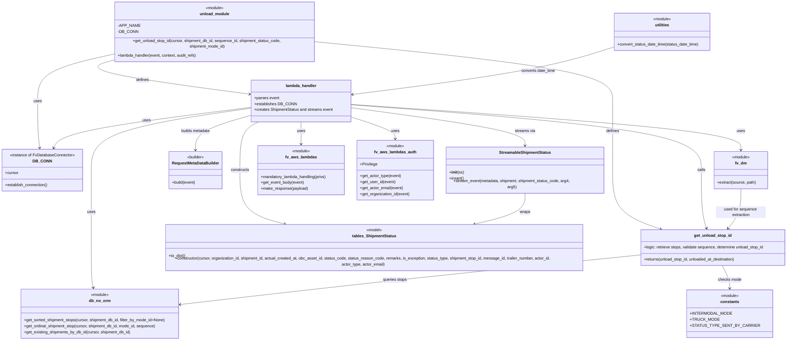

# Diagram: shipment_core/shipment_service/shipment_service/unload/unload_v2.py

> Auto-generated by Obscura crawlers

## Mermaid

### SVG

<svg id="container" width="3239.22265625" xmlns="http://www.w3.org/2000/svg" class="classDiagram" height="1332" viewBox="0 0 3239.22265625 1332" role="graphics-document document" aria-roledescription="class"><g><defs><marker id="container_class-aggregationStart" class="marker aggregation class" refX="18" refY="7" markerWidth="190" markerHeight="240" orient="auto"><path d="M 18,7 L9,13 L1,7 L9,1 Z"></path></marker></defs><defs><marker id="container_class-aggregationEnd" class="marker aggregation class" refX="1" refY="7" markerWidth="20" markerHeight="28" orient="auto"><path d="M 18,7 L9,13 L1,7 L9,1 Z"></path></marker></defs><defs><marker id="container_class-extensionStart" class="marker extension class" refX="18" refY="7" markerWidth="190" markerHeight="240" orient="auto"><path d="M 1,7 L18,13 V 1 Z"></path></marker></defs><defs><marker id="container_class-extensionEnd" class="marker extension class" refX="1" refY="7" markerWidth="20" markerHeight="28" orient="auto"><path d="M 1,1 V 13 L18,7 Z"></path></marker></defs><defs><marker id="container_class-compositionStart" class="marker composition class" refX="18" refY="7" markerWidth="190" markerHeight="240" orient="auto"><path d="M 18,7 L9,13 L1,7 L9,1 Z"></path></marker></defs><defs><marker id="container_class-compositionEnd" class="marker composition class" refX="1" refY="7" markerWidth="20" markerHeight="28" orient="auto"><path d="M 18,7 L9,13 L1,7 L9,1 Z"></path></marker></defs><defs><marker id="container_class-dependencyStart" class="marker dependency class" refX="6" refY="7" markerWidth="190" markerHeight="240" orient="auto"><path d="M 5,7 L9,13 L1,7 L9,1 Z"></path></marker></defs><defs><marker id="container_class-dependencyEnd" class="marker dependency class" refX="13" refY="7" markerWidth="20" markerHeight="28" orient="auto"><path d="M 18,7 L9,13 L14,7 L9,1 Z"></path></marker></defs><defs><marker id="container_class-lollipopStart" class="marker lollipop class" refX="13" refY="7" markerWidth="190" markerHeight="240" orient="auto"><circle stroke="black" fill="transparent" cx="7" cy="7" r="6"></circle></marker></defs><defs><marker id="container_class-lollipopEnd" class="marker lollipop class" refX="1" refY="7" markerWidth="190" markerHeight="240" orient="auto"><circle stroke="black" fill="transparent" cx="7" cy="7" r="6"></circle></marker></defs><g class="root"><g class="clusters"></g><g class="edgePaths"><path d="M482.004,197.003L427.195,207.669C372.387,218.335,262.77,239.668,207.961,270.5C153.152,301.333,153.152,341.667,153.152,382C153.152,422.333,153.152,462.667,154.451,494.007C155.749,525.347,158.346,547.693,159.645,558.867L160.944,570.04" id="id_unload_module_DB_CONN_1" class="edge-thickness-normal edge-pattern-solid relation" style=";;;" data-edge="true" data-et="edge" data-id="id_unload_module_DB_CONN_1" data-points="W3sieCI6NDgyLjAwMzkwNjI1LCJ5IjoxOTcuMDAyNzE1NzEwMjI2Mzd9LHsieCI6MTUzLjE1MjM0Mzc1LCJ5IjoyNjF9LHsieCI6MTUzLjE1MjM0Mzc1LCJ5IjozODJ9LHsieCI6MTUzLjE1MjM0Mzc1LCJ5Ijo1MDN9LHsieCI6MTYxLjYzNjE5NjI1Nzk2MTc5LCJ5Ijo1NzZ9XQ==" marker-end="url(#container_class-dependencyEnd)"></path><path d="M1314.473,153.617L1512.504,171.514C1710.536,189.411,2106.599,225.206,2304.631,263.27C2502.662,301.333,2502.662,341.667,2502.662,382C2502.662,422.333,2502.662,462.667,2502.662,509C2502.662,555.333,2502.662,607.667,2502.662,662C2502.662,716.333,2502.662,772.667,2535.856,811.202C2569.049,849.737,2635.437,870.474,2668.63,880.843L2701.824,891.211" id="id_unload_module_get_unload_stop_id_2" class="edge-thickness-normal edge-pattern-solid relation" style=";;;" data-edge="true" data-et="edge" data-id="id_unload_module_get_unload_stop_id_2" data-points="W3sieCI6MTMxNC40NzI2NTYyNSwieSI6MTUzLjYxNzIzMjYyNzA3NDh9LHsieCI6MjUwMi42NjIxMDkzNzUsInkiOjI2MX0seyJ4IjoyNTAyLjY2MjEwOTM3NSwieSI6MzgyfSx7IngiOjI1MDIuNjYyMTA5Mzc1LCJ5Ijo1MDN9LHsieCI6MjUwMi42NjIxMDkzNzUsInkiOjY2MH0seyJ4IjoyNTAyLjY2MjEwOTM3NSwieSI6ODI5fSx7IngiOjI3MDcuNTUwODk2MTM5NzA2LCJ5Ijo4OTN9XQ==" marker-end="url(#container_class-dependencyEnd)"></path><path d="M482.004,217.337L452.114,224.614C422.223,231.891,362.443,246.446,455.608,269.474C548.773,292.503,794.885,324.007,917.94,339.758L1040.996,355.51" id="id_unload_module_lambda_handler_3" class="edge-thickness-normal edge-pattern-solid relation" style=";;;" data-edge="true" data-et="edge" data-id="id_unload_module_lambda_handler_3" data-points="W3sieCI6NDgyLjAwMzkwNjI1LCJ5IjoyMTcuMzM3MTM3NDIyNzI5NDN9LHsieCI6MzAyLjY2MjEwOTM3NSwieSI6MjYxfSx7IngiOjEwNDYuOTQ3MjY1NjI1LCJ5IjozNTYuMjcxNjQ5NDc2MDE1NzR9XQ==" marker-end="url(#container_class-dependencyEnd)"></path><path d="M1448.939,395.473L1716.301,413.394C1983.662,431.315,2518.385,467.158,2785.746,497.745C3053.107,528.333,3053.107,553.667,3053.107,566.333L3053.107,579" id="id_lambda_handler_fv_dm_4" class="edge-thickness-normal edge-pattern-solid relation" style=";;;" data-edge="true" data-et="edge" data-id="id_lambda_handler_fv_dm_4" data-points="W3sieCI6MTQ0OC45Mzk0NTMxMjUsInkiOjM5NS40NzI3NTE3ODQxNjA5fSx7IngiOjMwNTMuMTA3NDIxODc1LCJ5Ijo1MDN9LHsieCI6MzA1My4xMDc0MjE4NzUsInkiOjU4NX1d" marker-end="url(#container_class-dependencyEnd)"></path><path d="M1247.943,466L1247.943,472.167C1247.943,478.333,1247.943,490.667,1247.943,505.5C1247.943,520.333,1247.943,537.667,1247.943,546.333L1247.943,555" id="id_lambda_handler_fv_aws_lambdas_5" class="edge-thickness-normal edge-pattern-solid relation" style=";;;" data-edge="true" data-et="edge" data-id="id_lambda_handler_fv_aws_lambdas_5" data-points="W3sieCI6MTI0Ny45NDMzNTkzNzUsInkiOjQ2Nn0seyJ4IjoxMjQ3Ljk0MzM1OTM3NSwieSI6NTAzfSx7IngiOjEyNDcuOTQzMzU5Mzc1LCJ5Ijo1NjF9XQ==" marker-end="url(#container_class-dependencyEnd)"></path><path d="M1448.939,446.158L1478.618,455.632C1508.298,465.106,1567.656,484.053,1597.335,498.693C1627.014,513.333,1627.014,523.667,1627.014,528.833L1627.014,534" id="id_lambda_handler_fv_aws_lambdas_auth_6" class="edge-thickness-normal edge-pattern-solid relation" style=";;;" data-edge="true" data-et="edge" data-id="id_lambda_handler_fv_aws_lambdas_auth_6" data-points="W3sieCI6MTQ0OC45Mzk0NTMxMjUsInkiOjQ0Ni4xNTgzNTQxMTQ3MTMyM30seyJ4IjoxNjI3LjAxMzY3MTg3NSwieSI6NTAzfSx7IngiOjE2MjcuMDEzNjcxODc1LCJ5Ijo1NDB9XQ==" marker-end="url(#container_class-dependencyEnd)"></path><path d="M1046.947,409.695L934.089,425.246C821.23,440.797,595.514,471.898,482.655,513.616C369.797,555.333,369.797,607.667,369.797,662C369.797,716.333,369.797,772.667,369.797,823.5C369.797,874.333,369.797,919.667,369.797,963C369.797,1006.333,369.797,1047.667,371.116,1073.531C372.435,1099.395,375.073,1109.79,376.392,1114.987L377.711,1120.184" id="id_lambda_handler_db_no_orm_7" class="edge-thickness-normal edge-pattern-solid relation" style=";;;" data-edge="true" data-et="edge" data-id="id_lambda_handler_db_no_orm_7" data-points="W3sieCI6MTA0Ni45NDcyNjU2MjUsInkiOjQwOS42OTUyOTY2MDA4Mzk0fSx7IngiOjM2OS43OTY4NzUsInkiOjUwM30seyJ4IjozNjkuNzk2ODc1LCJ5Ijo2NjB9LHsieCI6MzY5Ljc5Njg3NSwieSI6ODI5fSx7IngiOjM2OS43OTY4NzUsInkiOjk2NX0seyJ4IjozNjkuNzk2ODc1LCJ5IjoxMDg5fSx7IngiOjM3OS4xODcxNTUzMzA4ODI0LCJ5IjoxMTI2fV0=" marker-end="url(#container_class-dependencyEnd)"></path><path d="M1046.947,406.428L914.515,422.524C782.082,438.619,517.217,470.809,378.969,498.183C240.721,525.556,229.091,548.111,223.276,559.389L217.461,570.667" id="id_lambda_handler_DB_CONN_8" class="edge-thickness-normal edge-pattern-solid relation" style=";;;" data-edge="true" data-et="edge" data-id="id_lambda_handler_DB_CONN_8" data-points="W3sieCI6MTA0Ni45NDcyNjU2MjUsInkiOjQwNi40MjgyMTE4NjM2MjU0fSx7IngiOjI1Mi4zNTE1NjI1LCJ5Ijo1MDN9LHsieCI6MjE0LjcxMDkzNzUsInkiOjU3Nn1d" marker-end="url(#container_class-dependencyEnd)"></path><path d="M1448.939,396.786L1689.576,414.488C1930.213,432.191,2411.486,467.595,2652.123,511.464C2892.76,555.333,2892.76,607.667,2892.76,662C2892.76,716.333,2892.76,772.667,2895.996,810.551C2899.232,848.436,2905.705,867.872,2908.941,877.589L2912.177,887.307" id="id_lambda_handler_get_unload_stop_id_9" class="edge-thickness-normal edge-pattern-solid relation" style=";;;" data-edge="true" data-et="edge" data-id="id_lambda_handler_get_unload_stop_id_9" data-points="W3sieCI6MTQ0OC45Mzk0NTMxMjUsInkiOjM5Ni43ODYxNjUzNDQyNTE0Nn0seyJ4IjoyODkyLjc1OTc2NTYyNSwieSI6NTAzfSx7IngiOjI4OTIuNzU5NzY1NjI1LCJ5Ijo2NjB9LHsieCI6Mjg5Mi43NTk3NjU2MjUsInkiOjgyOX0seyJ4IjoyOTE0LjA3MzE4NDc0MjY0NywieSI6ODkzfV0=" marker-end="url(#container_class-dependencyEnd)"></path><path d="M1075.344,466L1062.673,472.167C1050.002,478.333,1024.66,490.667,1011.989,523C999.318,555.333,999.318,607.667,999.318,662C999.318,716.333,999.318,772.667,1030.772,808.756C1062.226,844.845,1125.133,860.69,1156.587,868.612L1188.041,876.535" id="id_lambda_handler_tables_ShipmentStatus_10" class="edge-thickness-normal edge-pattern-solid relation" style=";;;" data-edge="true" data-et="edge" data-id="id_lambda_handler_tables_ShipmentStatus_10" data-points="W3sieCI6MTA3NS4zNDQxODU4MjEyODEsInkiOjQ2Nn0seyJ4Ijo5OTkuMzE4MzU5Mzc1LCJ5Ijo1MDN9LHsieCI6OTk5LjMxODM1OTM3NSwieSI6NjYwfSx7IngiOjk5OS4zMTgzNTkzNzUsInkiOjgyOX0seyJ4IjoxMTkzLjg1ODg4NjcxODc1LCJ5Ijo4Nzh9XQ==" marker-end="url(#container_class-dependencyEnd)"></path><path d="M1448.939,408.992L1565.613,424.66C1682.287,440.328,1915.635,471.664,2032.309,497.999C2148.982,524.333,2148.982,545.667,2148.982,556.333L2148.982,567" id="id_lambda_handler_StreamableShipmentStatus_11" class="edge-thickness-normal edge-pattern-solid relation" style=";;;" data-edge="true" data-et="edge" data-id="id_lambda_handler_StreamableShipmentStatus_11" data-points="W3sieCI6MTQ0OC45Mzk0NTMxMjUsInkiOjQwOC45OTE2NDU5Mjk2MTI1fSx7IngiOjIxNDguOTgyNDIxODc1LCJ5Ijo1MDN9LHsieCI6MjE0OC45ODI0MjE4NzUsInkiOjU3M31d" marker-end="url(#container_class-dependencyEnd)"></path><path d="M1046.947,438.916L1009.229,449.596C971.51,460.277,896.072,481.639,858.354,504.986C820.635,528.333,820.635,553.667,820.635,566.333L820.635,579" id="id_lambda_handler_RequestMetaDataBuilder_12" class="edge-thickness-normal edge-pattern-solid relation" style=";;;" data-edge="true" data-et="edge" data-id="id_lambda_handler_RequestMetaDataBuilder_12" data-points="W3sieCI6MTA0Ni45NDcyNjU2MjUsInkiOjQzOC45MTU2MDU0ODg1Njg1M30seyJ4Ijo4MjAuNjM0NzY1NjI1LCJ5Ijo1MDN9LHsieCI6ODIwLjYzNDc2NTYyNSwieSI6NTg1fV0=" marker-end="url(#container_class-dependencyEnd)"></path><path d="M2644.879,992.702L2475.023,1008.752C2305.167,1024.801,1965.456,1056.901,1646.383,1089.565C1327.311,1122.229,1028.877,1155.458,879.66,1172.073L730.444,1188.687" id="id_get_unload_stop_id_db_no_orm_13" class="edge-thickness-normal edge-pattern-solid relation" style=";;;" data-edge="true" data-et="edge" data-id="id_get_unload_stop_id_db_no_orm_13" data-points="W3sieCI6MjY0NC44Nzg5MDYyNSwieSI6OTkyLjcwMTg0Mjk3OTg0Mzd9LHsieCI6MTYyNS43NDQxNDA2MjUsInkiOjEwODl9LHsieCI6NzI0LjQ4MDQ2ODc1LCJ5IjoxMTg5LjM1MDk3NzczNjQ4Njh9XQ==" marker-end="url(#container_class-dependencyEnd)"></path><path d="M2978.564,1037L2983.441,1045.667C2988.318,1054.333,2998.071,1071.667,3002.948,1086C3007.824,1100.333,3007.824,1111.667,3007.824,1117.333L3007.824,1123" id="id_get_unload_stop_id_constants_14" class="edge-thickness-normal edge-pattern-solid relation" style=";;;" data-edge="true" data-et="edge" data-id="id_get_unload_stop_id_constants_14" data-points="W3sieCI6Mjk3OC41NjQzOTAxMjA5NjgsInkiOjEwMzd9LHsieCI6MzAwNy44MjQyMTg3NSwieSI6MTA4OX0seyJ4IjozMDA3LjgyNDIxODc1LCJ5IjoxMTI5fV0=" marker-end="url(#container_class-dependencyEnd)"></path><path d="M2148.982,747L2148.982,760.667C2148.982,774.333,2148.982,801.667,2113.346,823.282C2077.709,844.898,2006.435,860.796,1970.799,868.745L1935.162,876.694" id="id_StreamableShipmentStatus_tables_ShipmentStatus_15" class="edge-thickness-normal edge-pattern-solid relation" style=";;;" data-edge="true" data-et="edge" data-id="id_StreamableShipmentStatus_tables_ShipmentStatus_15" data-points="W3sieCI6MjE0OC45ODI0MjE4NzUsInkiOjc0N30seyJ4IjoyMTQ4Ljk4MjQyMTg3NSwieSI6ODI5fSx7IngiOjE5MjkuMzA1NzUwMjI5Nzc5MywieSI6ODc4fV0=" marker-end="url(#container_class-dependencyEnd)"></path><path d="M2512.912,171.916L2460.907,186.764C2408.902,201.611,2304.893,231.305,2128.556,261.94C1952.219,292.574,1703.555,324.148,1579.224,339.936L1454.892,355.723" id="id_utilities_lambda_handler_16" class="edge-thickness-normal edge-pattern-solid relation" style=";;;" data-edge="true" data-et="edge" data-id="id_utilities_lambda_handler_16" data-points="W3sieCI6MjUxMi45MTIxMDkzNzUsInkiOjE3MS45MTYzMTE5MDk0NTkwNH0seyJ4IjoyMjAwLjg4MjgxMjUsInkiOjI2MX0seyJ4IjoxNDQ4LjkzOTQ1MzEyNSwieSI6MzU2LjQ3ODQxMjgwNTc3MTZ9XQ==" marker-end="url(#container_class-dependencyEnd)"></path><path d="M3053.107,735L3053.107,750.667C3053.107,766.333,3053.107,797.667,3044.729,823.237C3036.351,848.806,3019.595,868.613,3011.217,878.516L3002.838,888.419" id="id_fv_dm_get_unload_stop_id_17" class="edge-thickness-normal edge-pattern-solid relation" style=";;;" data-edge="true" data-et="edge" data-id="id_fv_dm_get_unload_stop_id_17" data-points="W3sieCI6MzA1My4xMDc0MjE4NzUsInkiOjczNX0seyJ4IjozMDUzLjEwNzQyMTg3NSwieSI6ODI5fSx7IngiOjI5OTguOTYzMTIwNDA0NDExNywieSI6ODkzfV0=" marker-end="url(#container_class-dependencyEnd)"></path></g><g class="edgeLabels"><g class="edgeLabel" transform="translate(153.15234375, 382)"><g class="label" data-id="id_unload_module_DB_CONN_1" transform="translate(-16.4921875, -12)"><foreignObject width="32.984375" height="24">

uses

</foreignObject></g></g><g class="edgeLabel" transform="translate(2502.662109375, 503)"><g class="label" data-id="id_unload_module_get_unload_stop_id_2" transform="translate(-26.53125, -12)"><foreignObject width="53.0625" height="24">

defines

</foreignObject></g></g><g class="edgeLabel" transform="translate(583.26141, 296.9179)"><g class="label" data-id="id_unload_module_lambda_handler_3" transform="translate(-26.53125, -12)"><foreignObject width="53.0625" height="24">

defines

</foreignObject></g></g><g class="edgeLabel" transform="translate(3053.107421875, 503)"><g class="label" data-id="id_lambda_handler_fv_dm_4" transform="translate(-16.4921875, -12)"><foreignObject width="32.984375" height="24">

uses

</foreignObject></g></g><g class="edgeLabel" transform="translate(1247.943359375, 503)"><g class="label" data-id="id_lambda_handler_fv_aws_lambdas_5" transform="translate(-16.4921875, -12)"><foreignObject width="32.984375" height="24">

uses

</foreignObject></g></g><g class="edgeLabel" transform="translate(1627.013671875, 503)"><g class="label" data-id="id_lambda_handler_fv_aws_lambdas_auth_6" transform="translate(-16.4921875, -12)"><foreignObject width="32.984375" height="24">

uses

</foreignObject></g></g><g class="edgeLabel" transform="translate(369.796875, 829)"><g class="label" data-id="id_lambda_handler_db_no_orm_7" transform="translate(-16.4921875, -12)"><foreignObject width="32.984375" height="24">

uses

</foreignObject></g></g><g class="edgeLabel" transform="translate(608.88293, 459.66869)"><g class="label" data-id="id_lambda_handler_DB_CONN_8" transform="translate(-16.4921875, -12)"><foreignObject width="32.984375" height="24">

uses

</foreignObject></g></g><g class="edgeLabel" transform="translate(2892.759765625, 660)"><g class="label" data-id="id_lambda_handler_get_unload_stop_id_9" transform="translate(-16.4453125, -12)"><foreignObject width="32.890625" height="24">

calls

</foreignObject></g></g><g class="edgeLabel" transform="translate(999.318359375, 660)"><g class="label" data-id="id_lambda_handler_tables_ShipmentStatus_10" transform="translate(-37.84375, -12)"><foreignObject width="75.6875" height="24">

constructs

</foreignObject></g></g><g class="edgeLabel" transform="translate(2148.982421875, 503)"><g class="label" data-id="id_lambda_handler_StreamableShipmentStatus_11" transform="translate(-41.3671875, -12)"><foreignObject width="82.734375" height="24">

streams via

</foreignObject></g></g><g class="edgeLabel" transform="translate(820.634765625, 503)"><g class="label" data-id="id_lambda_handler_RequestMetaDataBuilder_12" transform="translate(-59.328125, -12)"><foreignObject width="118.65625" height="24">

builds metadata

</foreignObject></g></g><g class="edgeLabel" transform="translate(1683.90559, 1083.50432)"><g class="label" data-id="id_get_unload_stop_id_db_no_orm_13" transform="translate(-49.03125, -12)"><foreignObject width="98.0625" height="24">

queries stops

</foreignObject></g></g><g class="edgeLabel" transform="translate(3007.82421875, 1089)"><g class="label" data-id="id_get_unload_stop_id_constants_14" transform="translate(-47.28125, -12)"><foreignObject width="94.5625" height="24">

checks mode

</foreignObject></g></g><g class="edgeLabel" transform="translate(2148.982421875, 829)"><g class="label" data-id="id_StreamableShipmentStatus_tables_ShipmentStatus_15" transform="translate(-21.390625, -12)"><foreignObject width="42.78125" height="24">

wraps

</foreignObject></g></g><g class="edgeLabel" transform="translate(1985.8672, 288.30172)"><g class="label" data-id="id_utilities_lambda_handler_16" transform="translate(-69.53125, -12)"><foreignObject width="139.0625" height="24">

converts date_time

</foreignObject></g></g><g class="edgeLabel" transform="translate(3053.107421875, 829)"><g class="label" data-id="id_fv_dm_get_unload_stop_id_17" transform="translate(-100, -24)"><foreignObject width="200" height="48">

used for sequence extraction

</foreignObject></g></g></g><g class="nodes"><g class="node default" id="classId-unload_module-0" transform="translate(898.23828125, 116)"><g class="basic label-container"><path d="M-416.234375 -108 L416.234375 -108 L416.234375 108 L-416.234375 108" stroke="none" stroke-width="0" fill="#ECECFF" style=""></path><path d="M-416.234375 -108 C-135.60366462429448 -108, 145.02704575141104 -108, 416.234375 -108 M-416.234375 -108 C-135.56148216385157 -108, 145.11141067229687 -108, 416.234375 -108 M416.234375 -108 C416.234375 -30.42497803914776, 416.234375 47.15004392170448, 416.234375 108 M416.234375 -108 C416.234375 -24.74840131650747, 416.234375 58.50319736698506, 416.234375 108 M416.234375 108 C115.74320252949042 108, -184.74796994101916 108, -416.234375 108 M416.234375 108 C207.7938779520478 108, -0.6466190959043843 108, -416.234375 108 M-416.234375 108 C-416.234375 52.81784669269528, -416.234375 -2.364306614609447, -416.234375 -108 M-416.234375 108 C-416.234375 58.71599649304262, -416.234375 9.431992986085234, -416.234375 -108" stroke="#9370DB" stroke-width="1.3" fill="none" stroke-dasharray="0 0" style=""></path></g><g class="annotation-group text" transform="translate(-36.6015625, -84)"><g class="label" style="" transform="translate(0,-12)"><foreignObject width="73.203125" height="24">

«module»

</foreignObject></g></g><g class="label-group text" transform="translate(-57.03125, -60)"><g class="label" style="font-weight: bolder" transform="translate(0,-12)"><foreignObject width="114.0625" height="24">

unload_module

</foreignObject></g></g><g class="members-group text" transform="translate(-404.234375, -12)"><g class="label" style="" transform="translate(0,-12)"><foreignObject width="81.875" height="24">

-APP_NAME

</foreignObject></g><g class="label" style="" transform="translate(0,12)"><foreignObject width="75.421875" height="24">

-DB_CONN

</foreignObject></g></g><g class="methods-group text" transform="translate(-404.234375, 60)"><g class="label" style="" transform="translate(0,-12)"><foreignObject width="751.4375" height="24">

+get_unload_stop_id(cursor, shipment_db_id, sequence_id, shipment_status_code, shipment_mode_id)

</foreignObject></g><g class="label" style="" transform="translate(0,12)"><foreignObject width="321.6875" height="24">

+lambda_handler(event, context, audit_refs)

</foreignObject></g></g><g class="divider" style=""><path d="M-416.234375 -36 C-177.7633972118451 -36, 60.707580576309795 -36, 416.234375 -36 M-416.234375 -36 C-223.23967792623236 -36, -30.24498085246472 -36, 416.234375 -36" stroke="#9370DB" stroke-width="1.3" fill="none" stroke-dasharray="0 0" style=""></path></g><g class="divider" style=""><path d="M-416.234375 36 C-240.6949066636389 36, -65.1554383272778 36, 416.234375 36 M-416.234375 36 C-249.22263709818964 36, -82.21089919637927 36, 416.234375 36" stroke="#9370DB" stroke-width="1.3" fill="none" stroke-dasharray="0 0" style=""></path></g></g><g class="node default" id="classId-DB_CONN-1" transform="translate(171.3984375, 660)"><g class="basic label-container"><path d="M-163.3984375 -84 L163.3984375 -84 L163.3984375 84 L-163.3984375 84" stroke="none" stroke-width="0" fill="#ECECFF" style=""></path><path d="M-163.3984375 -84 C-47.18382396627794 -84, 69.03078956744412 -84, 163.3984375 -84 M-163.3984375 -84 C-43.298870968157814 -84, 76.80069556368437 -84, 163.3984375 -84 M163.3984375 -84 C163.3984375 -42.266010547494204, 163.3984375 -0.5320210949884085, 163.3984375 84 M163.3984375 -84 C163.3984375 -19.949184096554973, 163.3984375 44.101631806890055, 163.3984375 84 M163.3984375 84 C76.73857162752815 84, -9.92129424494371 84, -163.3984375 84 M163.3984375 84 C46.897403635018435 84, -69.60363022996313 84, -163.3984375 84 M-163.3984375 84 C-163.3984375 49.51222138663818, -163.3984375 15.024442773276363, -163.3984375 -84 M-163.3984375 84 C-163.3984375 35.7715797119893, -163.3984375 -12.456840576021406, -163.3984375 -84" stroke="#9370DB" stroke-width="1.3" fill="none" stroke-dasharray="0 0" style=""></path></g><g class="annotation-group text" transform="translate(-129.53125, -60)"><g class="label" style="" transform="translate(0,-12)"><foreignObject width="259.0625" height="24">

«instance of FvDatabaseConnector»

</foreignObject></g></g><g class="label-group text" transform="translate(-34.40625, -36)"><g class="label" style="font-weight: bolder" transform="translate(0,-12)"><foreignObject width="68.8125" height="24">

DB_CONN

</foreignObject></g></g><g class="members-group text" transform="translate(-151.3984375, 12)"><g class="label" style="" transform="translate(0,-12)"><foreignObject width="53.71875" height="24">

+cursor

</foreignObject></g></g><g class="methods-group text" transform="translate(-151.3984375, 60)"><g class="label" style="" transform="translate(0,-12)"><foreignObject width="173.265625" height="24">

+establish_connection()

</foreignObject></g></g><g class="divider" style=""><path d="M-163.3984375 -12 C-72.96464685005824 -12, 17.46914379988351 -12, 163.3984375 -12 M-163.3984375 -12 C-64.13270416824527 -12, 35.13302916350946 -12, 163.3984375 -12" stroke="#9370DB" stroke-width="1.3" fill="none" stroke-dasharray="0 0" style=""></path></g><g class="divider" style=""><path d="M-163.3984375 36 C-82.05908837661013 36, -0.7197392532202684 36, 163.3984375 36 M-163.3984375 36 C-87.30297895289829 36, -11.207520405796572 36, 163.3984375 36" stroke="#9370DB" stroke-width="1.3" fill="none" stroke-dasharray="0 0" style=""></path></g></g><g class="node default" id="classId-get_unload_stop_id-2" transform="translate(2938.05078125, 965)"><g class="basic label-container"><path d="M-293.171875 -72 L293.171875 -72 L293.171875 72 L-293.171875 72" stroke="none" stroke-width="0" fill="#ECECFF" style=""></path><path d="M-293.171875 -72 C-119.36896976238825 -72, 54.43393547522351 -72, 293.171875 -72 M-293.171875 -72 C-59.52883168572757 -72, 174.11421162854487 -72, 293.171875 -72 M293.171875 -72 C293.171875 -41.37236476000407, 293.171875 -10.744729520008136, 293.171875 72 M293.171875 -72 C293.171875 -35.48157107102306, 293.171875 1.0368578579538763, 293.171875 72 M293.171875 72 C131.73722821507425 72, -29.697418569851493 72, -293.171875 72 M293.171875 72 C67.376121245631 72, -158.419632508738 72, -293.171875 72 M-293.171875 72 C-293.171875 24.466425072618094, -293.171875 -23.067149854763812, -293.171875 -72 M-293.171875 72 C-293.171875 15.632299986090715, -293.171875 -40.73540002781857, -293.171875 -72" stroke="#9370DB" stroke-width="1.3" fill="none" stroke-dasharray="0 0" style=""></path></g><g class="annotation-group text" transform="translate(0, -48)"></g><g class="label-group text" transform="translate(-72.515625, -48)"><g class="label" style="font-weight: bolder" transform="translate(0,-12)"><foreignObject width="145.03125" height="24">

get_unload_stop_id

</foreignObject></g></g><g class="members-group text" transform="translate(-281.171875, 0)"><g class="label" style="" transform="translate(0,-12)"><foreignObject width="489.828125" height="24">

+logic: retrieve stops, validate sequence, determine unload_stop_id

</foreignObject></g></g><g class="methods-group text" transform="translate(-281.171875, 48)"><g class="label" style="" transform="translate(0,-12)"><foreignObject width="374.625" height="24">

+returns(unload_stop_id, unloaded_at_destination)

</foreignObject></g></g><g class="divider" style=""><path d="M-293.171875 -24 C-147.69173757989947 -24, -2.211600159798934 -24, 293.171875 -24 M-293.171875 -24 C-113.93798609055031 -24, 65.29590281889938 -24, 293.171875 -24" stroke="#9370DB" stroke-width="1.3" fill="none" stroke-dasharray="0 0" style=""></path></g><g class="divider" style=""><path d="M-293.171875 24 C-123.49260977158676 24, 46.186655456826486 24, 293.171875 24 M-293.171875 24 C-131.8508491807085 24, 29.470176638582984 24, 293.171875 24" stroke="#9370DB" stroke-width="1.3" fill="none" stroke-dasharray="0 0" style=""></path></g></g><g class="node default" id="classId-lambda_handler-3" transform="translate(1247.943359375, 382)"><g class="basic label-container"><path d="M-200.99609375 -84 L200.99609375 -84 L200.99609375 84 L-200.99609375 84" stroke="none" stroke-width="0" fill="#ECECFF" style=""></path><path d="M-200.99609375 -84 C-89.7873364668485 -84, 21.421420816302998 -84, 200.99609375 -84 M-200.99609375 -84 C-49.398906435258624 -84, 102.19828087948275 -84, 200.99609375 -84 M200.99609375 -84 C200.99609375 -24.651660660569497, 200.99609375 34.696678678861005, 200.99609375 84 M200.99609375 -84 C200.99609375 -43.64280413062625, 200.99609375 -3.2856082612525057, 200.99609375 84 M200.99609375 84 C120.48561523955067 84, 39.97513672910134 84, -200.99609375 84 M200.99609375 84 C93.48773871616814 84, -14.020616317663723 84, -200.99609375 84 M-200.99609375 84 C-200.99609375 28.865214637140475, -200.99609375 -26.26957072571905, -200.99609375 -84 M-200.99609375 84 C-200.99609375 38.08095382474846, -200.99609375 -7.838092350503075, -200.99609375 -84" stroke="#9370DB" stroke-width="1.3" fill="none" stroke-dasharray="0 0" style=""></path></g><g class="annotation-group text" transform="translate(0, -60)"></g><g class="label-group text" transform="translate(-59.9765625, -60)"><g class="label" style="font-weight: bolder" transform="translate(0,-12)"><foreignObject width="119.953125" height="24">

lambda_handler

</foreignObject></g></g><g class="members-group text" transform="translate(-188.99609375, -12)"><g class="label" style="" transform="translate(0,-12)"><foreignObject width="100.21875" height="24">

+parses event

</foreignObject></g><g class="label" style="" transform="translate(0,12)"><foreignObject width="163.5" height="24">

+establishes DB_CONN

</foreignObject></g><g class="label" style="" transform="translate(0,36)"><foreignObject width="318.015625" height="24">

+creates ShipmentStatus and streams event

</foreignObject></g></g><g class="methods-group text" transform="translate(-188.99609375, 84)"></g><g class="divider" style=""><path d="M-200.99609375 -36 C-114.21734581897397 -36, -27.438597887947935 -36, 200.99609375 -36 M-200.99609375 -36 C-79.93899809616047 -36, 41.11809755767905 -36, 200.99609375 -36" stroke="#9370DB" stroke-width="1.3" fill="none" stroke-dasharray="0 0" style=""></path></g><g class="divider" style=""><path d="M-200.99609375 60 C-40.20087313390624 60, 120.59434748218752 60, 200.99609375 60 M-200.99609375 60 C-76.91452942893869 60, 47.167034892122615 60, 200.99609375 60" stroke="#9370DB" stroke-width="1.3" fill="none" stroke-dasharray="0 0" style=""></path></g></g><g class="node default" id="classId-db_no_orm-4" transform="translate(404.3125, 1225)"><g class="basic label-container"><path d="M-320.16796875 -99 L320.16796875 -99 L320.16796875 99 L-320.16796875 99" stroke="none" stroke-width="0" fill="#ECECFF" style=""></path><path d="M-320.16796875 -99 C-162.68196286216275 -99, -5.195956974325497 -99, 320.16796875 -99 M-320.16796875 -99 C-99.82813688427316 -99, 120.51169498145367 -99, 320.16796875 -99 M320.16796875 -99 C320.16796875 -47.55064586204674, 320.16796875 3.8987082759065146, 320.16796875 99 M320.16796875 -99 C320.16796875 -30.42828475767692, 320.16796875 38.14343048464616, 320.16796875 99 M320.16796875 99 C155.97102685969838 99, -8.225915030603232 99, -320.16796875 99 M320.16796875 99 C117.77580118461054 99, -84.61636638077891 99, -320.16796875 99 M-320.16796875 99 C-320.16796875 57.149948093287776, -320.16796875 15.299896186575552, -320.16796875 -99 M-320.16796875 99 C-320.16796875 45.96889971571988, -320.16796875 -7.062200568560243, -320.16796875 -99" stroke="#9370DB" stroke-width="1.3" fill="none" stroke-dasharray="0 0" style=""></path></g><g class="annotation-group text" transform="translate(-36.6015625, -75)"><g class="label" style="" transform="translate(0,-12)"><foreignObject width="73.203125" height="24">

«module»

</foreignObject></g></g><g class="label-group text" transform="translate(-41.3515625, -51)"><g class="label" style="font-weight: bolder" transform="translate(0,-12)"><foreignObject width="82.703125" height="24">

db_no_orm

</foreignObject></g></g><g class="members-group text" transform="translate(-308.16796875, -3)"></g><g class="methods-group text" transform="translate(-308.16796875, 27)"><g class="label" style="" transform="translate(0,-12)"><foreignObject width="574.984375" height="24">

+get_sorted_shipment_stops(cursor, shipment_db_id, filter_by_mode_id=None)

</foreignObject></g><g class="label" style="" transform="translate(0,12)"><foreignObject width="536.515625" height="24">

+get_ordinal_shipment_stop(cursor, shipment_db_id, mode_id, sequence)

</foreignObject></g><g class="label" style="" transform="translate(0,36)"><foreignObject width="433.640625" height="24">

+get_existing_shipments_by_db_id(cursor, shipment_db_id)

</foreignObject></g></g><g class="divider" style=""><path d="M-320.16796875 -27 C-116.0706569242679 -27, 88.02665490146421 -27, 320.16796875 -27 M-320.16796875 -27 C-138.18323001969864 -27, 43.80150871060272 -27, 320.16796875 -27" stroke="#9370DB" stroke-width="1.3" fill="none" stroke-dasharray="0 0" style=""></path></g><g class="divider" style=""><path d="M-320.16796875 -3 C-82.26615464942233 -3, 155.63565945115533 -3, 320.16796875 -3 M-320.16796875 -3 C-108.26700420753878 -3, 103.63396033492245 -3, 320.16796875 -3" stroke="#9370DB" stroke-width="1.3" fill="none" stroke-dasharray="0 0" style=""></path></g></g><g class="node default" id="classId-tables_ShipmentStatus-5" transform="translate(1539.267578125, 965)"><g class="basic label-container"><path d="M-904.51953125 -87 L904.51953125 -87 L904.51953125 87 L-904.51953125 87" stroke="none" stroke-width="0" fill="#ECECFF" style=""></path><path d="M-904.51953125 -87 C-362.00218266021204 -87, 180.51516592957591 -87, 904.51953125 -87 M-904.51953125 -87 C-375.04076767270476 -87, 154.43799590459048 -87, 904.51953125 -87 M904.51953125 -87 C904.51953125 -36.53913355466958, 904.51953125 13.921732890660834, 904.51953125 87 M904.51953125 -87 C904.51953125 -43.57113100329378, 904.51953125 -0.14226200658755772, 904.51953125 87 M904.51953125 87 C461.12957415293386 87, 17.73961705586771 87, -904.51953125 87 M904.51953125 87 C205.5494045467725 87, -493.420722156455 87, -904.51953125 87 M-904.51953125 87 C-904.51953125 46.528475195261045, -904.51953125 6.05695039052209, -904.51953125 -87 M-904.51953125 87 C-904.51953125 43.17259023291058, -904.51953125 -0.6548195341788414, -904.51953125 -87" stroke="#9370DB" stroke-width="1.3" fill="none" stroke-dasharray="0 0" style=""></path></g><g class="annotation-group text" transform="translate(-32.1484375, -63)"><g class="label" style="" transform="translate(0,-12)"><foreignObject width="64.296875" height="24">

«model»

</foreignObject></g></g><g class="label-group text" transform="translate(-85.1953125, -39)"><g class="label" style="font-weight: bolder" transform="translate(0,-12)"><foreignObject width="170.390625" height="24">

tables_ShipmentStatus

</foreignObject></g></g><g class="members-group text" transform="translate(-892.51953125, 9)"></g><g class="methods-group text" transform="translate(-892.51953125, 39)"><g class="label" style="" transform="translate(0,-12)"><foreignObject width="68.34375" height="24">

+to_dict()

</foreignObject></g><g class="label" style="" transform="translate(0,12)"><foreignObject width="1699.84375" height="24">

+constructor(cursor, organization_id, shipment_id, actual_created_at, obc_asset_id, status_code, status_reason_code, remarks, is_exception, status_type, shipment_stop_id, message_id, trailer_number, actor_id, actor_type, actor_email)

</foreignObject></g></g><g class="divider" style=""><path d="M-904.51953125 -15 C-320.6263336588212 -15, 263.26686393235764 -15, 904.51953125 -15 M-904.51953125 -15 C-431.28024129515404 -15, 41.959048659691916 -15, 904.51953125 -15" stroke="#9370DB" stroke-width="1.3" fill="none" stroke-dasharray="0 0" style=""></path></g><g class="divider" style=""><path d="M-904.51953125 9 C-222.3362295023701 9, 459.8470722452598 9, 904.51953125 9 M-904.51953125 9 C-410.6364110252982 9, 83.24670919940365 9, 904.51953125 9" stroke="#9370DB" stroke-width="1.3" fill="none" stroke-dasharray="0 0" style=""></path></g></g><g class="node default" id="classId-StreamableShipmentStatus-6" transform="translate(2148.982421875, 660)"><g class="basic label-container"><path d="M-318.6796875 -87 L318.6796875 -87 L318.6796875 87 L-318.6796875 87" stroke="none" stroke-width="0" fill="#ECECFF" style=""></path><path d="M-318.6796875 -87 C-97.3584397132552 -87, 123.96280807348961 -87, 318.6796875 -87 M-318.6796875 -87 C-118.09680702031605 -87, 82.4860734593679 -87, 318.6796875 -87 M318.6796875 -87 C318.6796875 -21.128197153749596, 318.6796875 44.74360569250081, 318.6796875 87 M318.6796875 -87 C318.6796875 -43.995307820194085, 318.6796875 -0.990615640388171, 318.6796875 87 M318.6796875 87 C88.09295139539836 87, -142.49378470920328 87, -318.6796875 87 M318.6796875 87 C109.25770380200618 87, -100.16427989598765 87, -318.6796875 87 M-318.6796875 87 C-318.6796875 20.360725418985382, -318.6796875 -46.278549162029236, -318.6796875 -87 M-318.6796875 87 C-318.6796875 25.237134540582403, -318.6796875 -36.525730918835194, -318.6796875 -87" stroke="#9370DB" stroke-width="1.3" fill="none" stroke-dasharray="0 0" style=""></path></g><g class="annotation-group text" transform="translate(0, -63)"></g><g class="label-group text" transform="translate(-100.609375, -63)"><g class="label" style="font-weight: bolder" transform="translate(0,-12)"><foreignObject width="201.21875" height="24">

StreamableShipmentStatus

</foreignObject></g></g><g class="members-group text" transform="translate(-306.6796875, -15)"></g><g class="methods-group text" transform="translate(-306.6796875, 15)"><g class="label" style="" transform="translate(0,-12)"><foreignObject width="57.578125" height="24">

+<strong>init</strong>(ss)

</foreignObject></g><g class="label" style="" transform="translate(0,12)"><foreignObject width="60.390625" height="24">

+insert()

</foreignObject></g><g class="label" style="" transform="translate(0,36)"><foreignObject width="512.75" height="24">

+stream_event(metadata, shipment, shipment_status_code, arg4, arg5)

</foreignObject></g></g><g class="divider" style=""><path d="M-318.6796875 -39 C-160.3964309608035 -39, -2.1131744216070274 -39, 318.6796875 -39 M-318.6796875 -39 C-131.51775760339402 -39, 55.644172293211966 -39, 318.6796875 -39" stroke="#9370DB" stroke-width="1.3" fill="none" stroke-dasharray="0 0" style=""></path></g><g class="divider" style=""><path d="M-318.6796875 -15 C-72.92100391767113 -15, 172.83767966465774 -15, 318.6796875 -15 M-318.6796875 -15 C-170.52638975036248 -15, -22.373092000724967 -15, 318.6796875 -15" stroke="#9370DB" stroke-width="1.3" fill="none" stroke-dasharray="0 0" style=""></path></g></g><g class="node default" id="classId-RequestMetaDataBuilder-7" transform="translate(820.634765625, 660)"><g class="basic label-container"><path d="M-105.83984375 -75 L105.83984375 -75 L105.83984375 75 L-105.83984375 75" stroke="none" stroke-width="0" fill="#ECECFF" style=""></path><path d="M-105.83984375 -75 C-33.889550239462835 -75, 38.06074327107433 -75, 105.83984375 -75 M-105.83984375 -75 C-61.2017015391435 -75, -16.563559328287 -75, 105.83984375 -75 M105.83984375 -75 C105.83984375 -29.405619654003424, 105.83984375 16.188760691993153, 105.83984375 75 M105.83984375 -75 C105.83984375 -26.264054083936827, 105.83984375 22.471891832126346, 105.83984375 75 M105.83984375 75 C63.395334133614895 75, 20.95082451722979 75, -105.83984375 75 M105.83984375 75 C44.95404260091631 75, -15.93175854816738 75, -105.83984375 75 M-105.83984375 75 C-105.83984375 16.701430321993655, -105.83984375 -41.59713935601269, -105.83984375 -75 M-105.83984375 75 C-105.83984375 21.4936669961986, -105.83984375 -32.0126660076028, -105.83984375 -75" stroke="#9370DB" stroke-width="1.3" fill="none" stroke-dasharray="0 0" style=""></path></g><g class="annotation-group text" transform="translate(-35.25, -51)"><g class="label" style="" transform="translate(0,-12)"><foreignObject width="70.5" height="24">

«builder»

</foreignObject></g></g><g class="label-group text" transform="translate(-91.4765625, -27)"><g class="label" style="font-weight: bolder" transform="translate(0,-12)"><foreignObject width="182.953125" height="24">

RequestMetaDataBuilder

</foreignObject></g></g><g class="members-group text" transform="translate(-93.83984375, 21)"></g><g class="methods-group text" transform="translate(-93.83984375, 51)"><g class="label" style="" transform="translate(0,-12)"><foreignObject width="96.203125" height="24">

+build(event)

</foreignObject></g></g><g class="divider" style=""><path d="M-105.83984375 -3 C-44.73050674935003 -3, 16.378830251299945 -3, 105.83984375 -3 M-105.83984375 -3 C-25.491523658587 -3, 54.856796432826 -3, 105.83984375 -3" stroke="#9370DB" stroke-width="1.3" fill="none" stroke-dasharray="0 0" style=""></path></g><g class="divider" style=""><path d="M-105.83984375 21 C-51.9258326973638 21, 1.988178355272396 21, 105.83984375 21 M-105.83984375 21 C-40.71849566383625 21, 24.4028524223275 21, 105.83984375 21" stroke="#9370DB" stroke-width="1.3" fill="none" stroke-dasharray="0 0" style=""></path></g></g><g class="node default" id="classId-utilities-8" transform="translate(2708.767578125, 116)"><g class="basic label-container"><path d="M-195.85546875 -75 L195.85546875 -75 L195.85546875 75 L-195.85546875 75" stroke="none" stroke-width="0" fill="#ECECFF" style=""></path><path d="M-195.85546875 -75 C-104.87390915139622 -75, -13.892349552792439 -75, 195.85546875 -75 M-195.85546875 -75 C-45.90826026092628 -75, 104.03894822814743 -75, 195.85546875 -75 M195.85546875 -75 C195.85546875 -16.354840318055317, 195.85546875 42.29031936388937, 195.85546875 75 M195.85546875 -75 C195.85546875 -37.234793136201915, 195.85546875 0.5304137275961693, 195.85546875 75 M195.85546875 75 C109.9755968720907 75, 24.09572499418141 75, -195.85546875 75 M195.85546875 75 C59.83987272851758 75, -76.17572329296485 75, -195.85546875 75 M-195.85546875 75 C-195.85546875 36.70915761268051, -195.85546875 -1.5816847746389868, -195.85546875 -75 M-195.85546875 75 C-195.85546875 44.10471623060494, -195.85546875 13.209432461209886, -195.85546875 -75" stroke="#9370DB" stroke-width="1.3" fill="none" stroke-dasharray="0 0" style=""></path></g><g class="annotation-group text" transform="translate(-36.6015625, -51)"><g class="label" style="" transform="translate(0,-12)"><foreignObject width="73.203125" height="24">

«module»

</foreignObject></g></g><g class="label-group text" transform="translate(-28.1796875, -27)"><g class="label" style="font-weight: bolder" transform="translate(0,-12)"><foreignObject width="56.359375" height="24">

utilities

</foreignObject></g></g><g class="members-group text" transform="translate(-183.85546875, 21)"></g><g class="methods-group text" transform="translate(-183.85546875, 51)"><g class="label" style="" transform="translate(0,-12)"><foreignObject width="331.109375" height="24">

+convert_status_date_time(status_date_time)

</foreignObject></g></g><g class="divider" style=""><path d="M-195.85546875 -3 C-58.54497727250322 -3, 78.76551420499356 -3, 195.85546875 -3 M-195.85546875 -3 C-82.26804189732538 -3, 31.31938495534925 -3, 195.85546875 -3" stroke="#9370DB" stroke-width="1.3" fill="none" stroke-dasharray="0 0" style=""></path></g><g class="divider" style=""><path d="M-195.85546875 21 C-52.170748426459085 21, 91.51397189708183 21, 195.85546875 21 M-195.85546875 21 C-50.15381629037705 21, 95.5478361692459 21, 195.85546875 21" stroke="#9370DB" stroke-width="1.3" fill="none" stroke-dasharray="0 0" style=""></path></g></g><g class="node default" id="classId-fv_dm-9" transform="translate(3053.107421875, 660)"><g class="basic label-container"><path d="M-108.90234375 -75 L108.90234375 -75 L108.90234375 75 L-108.90234375 75" stroke="none" stroke-width="0" fill="#ECECFF" style=""></path><path d="M-108.90234375 -75 C-38.0312676746682 -75, 32.8398084006636 -75, 108.90234375 -75 M-108.90234375 -75 C-32.81035035386782 -75, 43.28164304226436 -75, 108.90234375 -75 M108.90234375 -75 C108.90234375 -23.419522942927138, 108.90234375 28.160954114145724, 108.90234375 75 M108.90234375 -75 C108.90234375 -30.676096651682464, 108.90234375 13.647806696635072, 108.90234375 75 M108.90234375 75 C23.361024730979665 75, -62.18029428804067 75, -108.90234375 75 M108.90234375 75 C33.63788457732285 75, -41.6265745953543 75, -108.90234375 75 M-108.90234375 75 C-108.90234375 19.2193703449878, -108.90234375 -36.5612593100244, -108.90234375 -75 M-108.90234375 75 C-108.90234375 42.062756950801486, -108.90234375 9.125513901602972, -108.90234375 -75" stroke="#9370DB" stroke-width="1.3" fill="none" stroke-dasharray="0 0" style=""></path></g><g class="annotation-group text" transform="translate(-36.6015625, -51)"><g class="label" style="" transform="translate(0,-12)"><foreignObject width="73.203125" height="24">

«module»

</foreignObject></g></g><g class="label-group text" transform="translate(-22.2734375, -27)"><g class="label" style="font-weight: bolder" transform="translate(0,-12)"><foreignObject width="44.546875" height="24">

fv_dm

</foreignObject></g></g><g class="members-group text" transform="translate(-96.90234375, 21)"></g><g class="methods-group text" transform="translate(-96.90234375, 51)"><g class="label" style="" transform="translate(0,-12)"><foreignObject width="157.203125" height="24">

+extract(source, path)

</foreignObject></g></g><g class="divider" style=""><path d="M-108.90234375 -3 C-24.93535972277499 -3, 59.03162430445002 -3, 108.90234375 -3 M-108.90234375 -3 C-52.775175097016295 -3, 3.351993555967411 -3, 108.90234375 -3" stroke="#9370DB" stroke-width="1.3" fill="none" stroke-dasharray="0 0" style=""></path></g><g class="divider" style=""><path d="M-108.90234375 21 C-59.290203681036516 21, -9.678063612073032 21, 108.90234375 21 M-108.90234375 21 C-23.0333794120166 21, 62.8355849259668 21, 108.90234375 21" stroke="#9370DB" stroke-width="1.3" fill="none" stroke-dasharray="0 0" style=""></path></g></g><g class="node default" id="classId-fv_aws_lambdas-10" transform="translate(1247.943359375, 660)"><g class="basic label-container"><path d="M-175.78125 -99 L175.78125 -99 L175.78125 99 L-175.78125 99" stroke="none" stroke-width="0" fill="#ECECFF" style=""></path><path d="M-175.78125 -99 C-55.614283322480986 -99, 64.55268335503803 -99, 175.78125 -99 M-175.78125 -99 C-99.30507580482494 -99, -22.828901609649876 -99, 175.78125 -99 M175.78125 -99 C175.78125 -48.17670814407366, 175.78125 2.646583711852685, 175.78125 99 M175.78125 -99 C175.78125 -49.693562177436036, 175.78125 -0.3871243548720713, 175.78125 99 M175.78125 99 C100.2932669240386 99, 24.80528384807721 99, -175.78125 99 M175.78125 99 C64.42397471211929 99, -46.93330057576142 99, -175.78125 99 M-175.78125 99 C-175.78125 37.75986780874839, -175.78125 -23.480264382503222, -175.78125 -99 M-175.78125 99 C-175.78125 41.30339425432153, -175.78125 -16.393211491356936, -175.78125 -99" stroke="#9370DB" stroke-width="1.3" fill="none" stroke-dasharray="0 0" style=""></path></g><g class="annotation-group text" transform="translate(-36.6015625, -75)"><g class="label" style="" transform="translate(0,-12)"><foreignObject width="73.203125" height="24">

«module»

</foreignObject></g></g><g class="label-group text" transform="translate(-60.0625, -51)"><g class="label" style="font-weight: bolder" transform="translate(0,-12)"><foreignObject width="120.125" height="24">

fv_aws_lambdas

</foreignObject></g></g><g class="members-group text" transform="translate(-163.78125, -3)"></g><g class="methods-group text" transform="translate(-163.78125, 27)"><g class="label" style="" transform="translate(0,-12)"><foreignObject width="267.5" height="24">

+mandatory_lambda_handling(privs)

</foreignObject></g><g class="label" style="" transform="translate(0,12)"><foreignObject width="174.203125" height="24">

+get_event_body(event)

</foreignObject></g><g class="label" style="" transform="translate(0,36)"><foreignObject width="189.59375" height="24">

+make_response(payload)

</foreignObject></g></g><g class="divider" style=""><path d="M-175.78125 -27 C-68.68735461692613 -27, 38.40654076614774 -27, 175.78125 -27 M-175.78125 -27 C-92.97984661257395 -27, -10.178443225147902 -27, 175.78125 -27" stroke="#9370DB" stroke-width="1.3" fill="none" stroke-dasharray="0 0" style=""></path></g><g class="divider" style=""><path d="M-175.78125 -3 C-103.50743309683433 -3, -31.233616193668666 -3, 175.78125 -3 M-175.78125 -3 C-46.054289636257494 -3, 83.67267072748501 -3, 175.78125 -3" stroke="#9370DB" stroke-width="1.3" fill="none" stroke-dasharray="0 0" style=""></path></g></g><g class="node default" id="classId-fv_aws_lambdas_auth-11" transform="translate(1627.013671875, 660)"><g class="basic label-container"><path d="M-153.2890625 -120 L153.2890625 -120 L153.2890625 120 L-153.2890625 120" stroke="none" stroke-width="0" fill="#ECECFF" style=""></path><path d="M-153.2890625 -120 C-37.46881047039844 -120, 78.35144155920312 -120, 153.2890625 -120 M-153.2890625 -120 C-40.1597905225495 -120, 72.969481454901 -120, 153.2890625 -120 M153.2890625 -120 C153.2890625 -32.6447661868731, 153.2890625 54.7104676262538, 153.2890625 120 M153.2890625 -120 C153.2890625 -71.47293732115068, 153.2890625 -22.945874642301362, 153.2890625 120 M153.2890625 120 C66.76276010998303 120, -19.76354228003393 120, -153.2890625 120 M153.2890625 120 C74.47175622056686 120, -4.34555005886628 120, -153.2890625 120 M-153.2890625 120 C-153.2890625 57.76491808332248, -153.2890625 -4.470163833355045, -153.2890625 -120 M-153.2890625 120 C-153.2890625 49.46459659708273, -153.2890625 -21.070806805834536, -153.2890625 -120" stroke="#9370DB" stroke-width="1.3" fill="none" stroke-dasharray="0 0" style=""></path></g><g class="annotation-group text" transform="translate(-36.6015625, -96)"><g class="label" style="" transform="translate(0,-12)"><foreignObject width="73.203125" height="24">

«module»

</foreignObject></g></g><g class="label-group text" transform="translate(-80.5625, -72)"><g class="label" style="font-weight: bolder" transform="translate(0,-12)"><foreignObject width="161.125" height="24">

fv_aws_lambdas_auth

</foreignObject></g></g><g class="members-group text" transform="translate(-141.2890625, -24)"><g class="label" style="" transform="translate(0,-12)"><foreignObject width="70.15625" height="24">

+Privilege

</foreignObject></g></g><g class="methods-group text" transform="translate(-141.2890625, 24)"><g class="label" style="" transform="translate(0,-12)"><foreignObject width="165.171875" height="24">

+get_actor_type(event)

</foreignObject></g><g class="label" style="" transform="translate(0,12)"><foreignObject width="142.0625" height="24">

+get_user_id(event)

</foreignObject></g><g class="label" style="" transform="translate(0,36)"><foreignObject width="173.71875" height="24">

+get_actor_email(event)

</foreignObject></g><g class="label" style="" transform="translate(0,60)"><foreignObject width="202.015625" height="24">

+get_organization_id(event)

</foreignObject></g></g><g class="divider" style=""><path d="M-153.2890625 -48 C-54.30747748228964 -48, 44.67410753542072 -48, 153.2890625 -48 M-153.2890625 -48 C-81.1563345401938 -48, -9.023606580387593 -48, 153.2890625 -48" stroke="#9370DB" stroke-width="1.3" fill="none" stroke-dasharray="0 0" style=""></path></g><g class="divider" style=""><path d="M-153.2890625 0 C-68.26871294046887 0, 16.751636619062253 0, 153.2890625 0 M-153.2890625 0 C-88.75811940599347 0, -24.227176311986938 0, 153.2890625 0" stroke="#9370DB" stroke-width="1.3" fill="none" stroke-dasharray="0 0" style=""></path></g></g><g class="node default" id="classId-constants-12" transform="translate(3007.82421875, 1225)"><g class="basic label-container"><path d="M-149.30078125 -96 L149.30078125 -96 L149.30078125 96 L-149.30078125 96" stroke="none" stroke-width="0" fill="#ECECFF" style=""></path><path d="M-149.30078125 -96 C-74.44593799567666 -96, 0.4089052586466835 -96, 149.30078125 -96 M-149.30078125 -96 C-70.22564820294825 -96, 8.8494848441035 -96, 149.30078125 -96 M149.30078125 -96 C149.30078125 -31.003049324691887, 149.30078125 33.99390135061623, 149.30078125 96 M149.30078125 -96 C149.30078125 -49.33495366865724, 149.30078125 -2.669907337314484, 149.30078125 96 M149.30078125 96 C43.69926257692687 96, -61.90225609614626 96, -149.30078125 96 M149.30078125 96 C49.234222670526336 96, -50.83233590894733 96, -149.30078125 96 M-149.30078125 96 C-149.30078125 31.694989422674936, -149.30078125 -32.61002115465013, -149.30078125 -96 M-149.30078125 96 C-149.30078125 55.33019794554644, -149.30078125 14.660395891092875, -149.30078125 -96" stroke="#9370DB" stroke-width="1.3" fill="none" stroke-dasharray="0 0" style=""></path></g><g class="annotation-group text" transform="translate(-36.6015625, -72)"><g class="label" style="" transform="translate(0,-12)"><foreignObject width="73.203125" height="24">

«module»

</foreignObject></g></g><g class="label-group text" transform="translate(-35.7734375, -48)"><g class="label" style="font-weight: bolder" transform="translate(0,-12)"><foreignObject width="71.546875" height="24">

constants

</foreignObject></g></g><g class="members-group text" transform="translate(-137.30078125, 0)"><g class="label" style="" transform="translate(0,-12)"><foreignObject width="151.34375" height="24">

+INTERMODAL_MODE

</foreignObject></g><g class="label" style="" transform="translate(0,12)"><foreignObject width="104.546875" height="24">

+TRUCK_MODE

</foreignObject></g><g class="label" style="" transform="translate(0,36)"><foreignObject width="238" height="24">

+STATUS_TYPE_SENT_BY_CARRIER

</foreignObject></g></g><g class="methods-group text" transform="translate(-137.30078125, 96)"></g><g class="divider" style=""><path d="M-149.30078125 -24 C-57.75127633962052 -24, 33.798228570758965 -24, 149.30078125 -24 M-149.30078125 -24 C-30.085996904650983 -24, 89.12878744069803 -24, 149.30078125 -24" stroke="#9370DB" stroke-width="1.3" fill="none" stroke-dasharray="0 0" style=""></path></g><g class="divider" style=""><path d="M-149.30078125 72 C-37.71158691049915 72, 73.8776074290017 72, 149.30078125 72 M-149.30078125 72 C-73.87141058158555 72, 1.5579600868288992 72, 149.30078125 72" stroke="#9370DB" stroke-width="1.3" fill="none" stroke-dasharray="0 0" style=""></path></g></g></g></g></g></svg>
