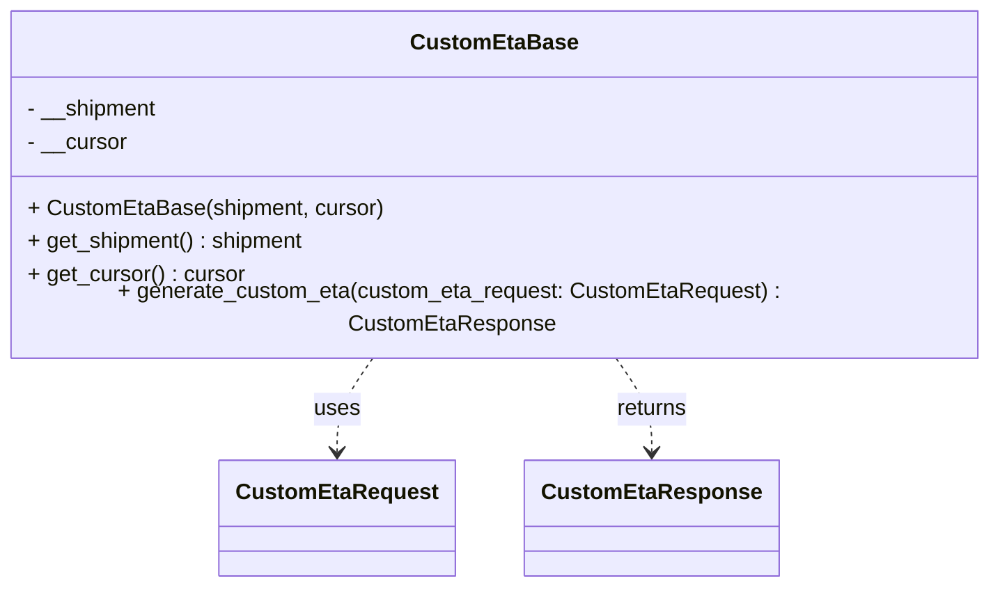

# Diagram: shipment_core/shipment_service/shipment_service/update_route_timing/CustomEtaBase.py

> Auto-generated by Obscura crawlers

## Mermaid

### SVG

<svg id="container" width="724.53125" xmlns="http://www.w3.org/2000/svg" class="classDiagram" height="414" viewBox="0 0 724.53125 414" role="graphics-document document" aria-roledescription="class"><g><defs><marker id="container_class-aggregationStart" class="marker aggregation class" refX="18" refY="7" markerWidth="190" markerHeight="240" orient="auto"><path d="M 18,7 L9,13 L1,7 L9,1 Z"></path></marker></defs><defs><marker id="container_class-aggregationEnd" class="marker aggregation class" refX="1" refY="7" markerWidth="20" markerHeight="28" orient="auto"><path d="M 18,7 L9,13 L1,7 L9,1 Z"></path></marker></defs><defs><marker id="container_class-extensionStart" class="marker extension class" refX="18" refY="7" markerWidth="190" markerHeight="240" orient="auto"><path d="M 1,7 L18,13 V 1 Z"></path></marker></defs><defs><marker id="container_class-extensionEnd" class="marker extension class" refX="1" refY="7" markerWidth="20" markerHeight="28" orient="auto"><path d="M 1,1 V 13 L18,7 Z"></path></marker></defs><defs><marker id="container_class-compositionStart" class="marker composition class" refX="18" refY="7" markerWidth="190" markerHeight="240" orient="auto"><path d="M 18,7 L9,13 L1,7 L9,1 Z"></path></marker></defs><defs><marker id="container_class-compositionEnd" class="marker composition class" refX="1" refY="7" markerWidth="20" markerHeight="28" orient="auto"><path d="M 18,7 L9,13 L1,7 L9,1 Z"></path></marker></defs><defs><marker id="container_class-dependencyStart" class="marker dependency class" refX="6" refY="7" markerWidth="190" markerHeight="240" orient="auto"><path d="M 5,7 L9,13 L1,7 L9,1 Z"></path></marker></defs><defs><marker id="container_class-dependencyEnd" class="marker dependency class" refX="13" refY="7" markerWidth="20" markerHeight="28" orient="auto"><path d="M 18,7 L9,13 L14,7 L9,1 Z"></path></marker></defs><defs><marker id="container_class-lollipopStart" class="marker lollipop class" refX="13" refY="7" markerWidth="190" markerHeight="240" orient="auto"><circle stroke="black" fill="transparent" cx="7" cy="7" r="6"></circle></marker></defs><defs><marker id="container_class-lollipopEnd" class="marker lollipop class" refX="1" refY="7" markerWidth="190" markerHeight="240" orient="auto"><circle stroke="black" fill="transparent" cx="7" cy="7" r="6"></circle></marker></defs><g class="root"><g class="clusters"></g><g class="edgePaths"><path d="M279.38,248L275.121,254.167C270.862,260.333,262.343,272.667,258.084,284C253.824,295.333,253.824,305.667,253.824,310.833L253.824,316" id="id_CustomEtaBase_CustomEtaRequest_1" class="edge-thickness-normal edge-pattern-dashed relation" style=";;;" data-edge="true" data-et="edge" data-id="id_CustomEtaBase_CustomEtaRequest_1" data-points="W3sieCI6Mjc5LjM4MDQ3MzcyNjExNDY0LCJ5IjoyNDh9LHsieCI6MjUzLjgyNDIxODc1LCJ5IjoyODV9LHsieCI6MjUzLjgyNDIxODc1LCJ5IjozMjJ9XQ==" marker-end="url(#container_class-dependencyEnd)"></path><path d="M445.151,248L449.41,254.167C453.67,260.333,462.188,272.667,466.448,284C470.707,295.333,470.707,305.667,470.707,310.833L470.707,316" id="id_CustomEtaBase_CustomEtaResponse_2" class="edge-thickness-normal edge-pattern-dashed relation" style=";;;" data-edge="true" data-et="edge" data-id="id_CustomEtaBase_CustomEtaResponse_2" data-points="W3sieCI6NDQ1LjE1MDc3NjI3Mzg4NTM2LCJ5IjoyNDh9LHsieCI6NDcwLjcwNzAzMTI1LCJ5IjoyODV9LHsieCI6NDcwLjcwNzAzMTI1LCJ5IjozMjJ9XQ==" marker-end="url(#container_class-dependencyEnd)"></path></g><g class="edgeLabels"><g class="edgeLabel" transform="translate(253.82421875, 285)"><g class="label" data-id="id_CustomEtaBase_CustomEtaRequest_1" transform="translate(-16.4921875, -12)"><foreignObject width="32.984375" height="24">

uses

</foreignObject></g></g><g class="edgeLabel" transform="translate(470.70703125, 285)"><g class="label" data-id="id_CustomEtaBase_CustomEtaResponse_2" transform="translate(-26.265625, -12)"><foreignObject width="52.53125" height="24">

returns

</foreignObject></g></g></g><g class="nodes"><g class="node default" id="classId-CustomEtaBase-0" transform="translate(362.265625, 128)"><g class="basic label-container"><path d="M-354.265625 -120 L354.265625 -120 L354.265625 120 L-354.265625 120" stroke="none" stroke-width="0" fill="#ECECFF" style=""></path><path d="M-354.265625 -120 C-144.5670164668703 -120, 65.13159206625937 -120, 354.265625 -120 M-354.265625 -120 C-188.14620410302388 -120, -22.026783206047753 -120, 354.265625 -120 M354.265625 -120 C354.265625 -28.72576150426636, 354.265625 62.54847699146728, 354.265625 120 M354.265625 -120 C354.265625 -45.33802648455719, 354.265625 29.32394703088562, 354.265625 120 M354.265625 120 C158.46739293463017 120, -37.33083913073966 120, -354.265625 120 M354.265625 120 C176.6939978754109 120, -0.8776292491781987 120, -354.265625 120 M-354.265625 120 C-354.265625 29.6047169621109, -354.265625 -60.7905660757782, -354.265625 -120 M-354.265625 120 C-354.265625 68.8615776434392, -354.265625 17.72315528687841, -354.265625 -120" stroke="#9370DB" stroke-width="1.3" fill="none" stroke-dasharray="0 0" style=""></path></g><g class="annotation-group text" transform="translate(0, -96)"></g><g class="label-group text" transform="translate(-56.25, -96)"><g class="label" style="font-weight: bolder" transform="translate(0,-12)"><foreignObject width="112.5" height="24">

CustomEtaBase

</foreignObject></g></g><g class="members-group text" transform="translate(-342.265625, -48)"><g class="label" style="" transform="translate(0,-12)"><foreignObject width="95.625" height="24">

- __shipment

</foreignObject></g><g class="label" style="" transform="translate(0,12)"><foreignObject width="72.578125" height="24">

- __cursor

</foreignObject></g></g><g class="methods-group text" transform="translate(-342.265625, 24)"><g class="label" style="" transform="translate(0,-12)"><foreignObject width="256.15625" height="24">

+ CustomEtaBase(shipment, cursor)

</foreignObject></g><g class="label" style="" transform="translate(0,12)"><foreignObject width="202.703125" height="24">

+ get_shipment() : shipment

</foreignObject></g><g class="label" style="" transform="translate(0,36)"><foreignObject width="156.9375" height="24">

+ get_cursor() : cursor

</foreignObject></g><g class="label" style="" transform="translate(0,60)"><foreignObject width="628.28125" height="24">

+ generate_custom_eta(custom_eta_request: CustomEtaRequest) : CustomEtaResponse

</foreignObject></g></g><g class="divider" style=""><path d="M-354.265625 -72 C-170.1099591585706 -72, 14.045706682858793 -72, 354.265625 -72 M-354.265625 -72 C-113.89031996176647 -72, 126.48498507646707 -72, 354.265625 -72" stroke="#9370DB" stroke-width="1.3" fill="none" stroke-dasharray="0 0" style=""></path></g><g class="divider" style=""><path d="M-354.265625 0 C-136.41858821800818 0, 81.42844856398364 0, 354.265625 0 M-354.265625 0 C-207.30051893287558 0, -60.33541286575115 0, 354.265625 0" stroke="#9370DB" stroke-width="1.3" fill="none" stroke-dasharray="0 0" style=""></path></g></g><g class="node default" id="classId-CustomEtaRequest-1" transform="translate(253.82421875, 364)"><g class="basic label-container"><path d="M-80.7109375 -42 L80.7109375 -42 L80.7109375 42 L-80.7109375 42" stroke="none" stroke-width="0" fill="#ECECFF" style=""></path><path d="M-80.7109375 -42 C-30.535849675394026 -42, 19.63923814921195 -42, 80.7109375 -42 M-80.7109375 -42 C-29.221155249698306 -42, 22.268627000603388 -42, 80.7109375 -42 M80.7109375 -42 C80.7109375 -17.793097394193122, 80.7109375 6.413805211613756, 80.7109375 42 M80.7109375 -42 C80.7109375 -24.205147928764372, 80.7109375 -6.4102958575287445, 80.7109375 42 M80.7109375 42 C28.98802587121518 42, -22.734885757569643 42, -80.7109375 42 M80.7109375 42 C43.17581223376607 42, 5.640686967532133 42, -80.7109375 42 M-80.7109375 42 C-80.7109375 18.41437242542464, -80.7109375 -5.171255149150717, -80.7109375 -42 M-80.7109375 42 C-80.7109375 21.191941705252738, -80.7109375 0.3838834105054758, -80.7109375 -42" stroke="#9370DB" stroke-width="1.3" fill="none" stroke-dasharray="0 0" style=""></path></g><g class="annotation-group text" transform="translate(0, -18)"></g><g class="label-group text" transform="translate(-68.7109375, -18)"><g class="label" style="font-weight: bolder" transform="translate(0,-12)"><foreignObject width="137.421875" height="24">

CustomEtaRequest

</foreignObject></g></g><g class="members-group text" transform="translate(-68.7109375, 30)"></g><g class="methods-group text" transform="translate(-68.7109375, 60)"></g><g class="divider" style=""><path d="M-80.7109375 6 C-47.214677341461 6, -13.718417182921996 6, 80.7109375 6 M-80.7109375 6 C-17.337909618760968 6, 46.035118262478065 6, 80.7109375 6" stroke="#9370DB" stroke-width="1.3" fill="none" stroke-dasharray="0 0" style=""></path></g><g class="divider" style=""><path d="M-80.7109375 24 C-16.891182846391565 24, 46.92857180721687 24, 80.7109375 24 M-80.7109375 24 C-42.52485674843051 24, -4.338775996861017 24, 80.7109375 24" stroke="#9370DB" stroke-width="1.3" fill="none" stroke-dasharray="0 0" style=""></path></g></g><g class="node default" id="classId-CustomEtaResponse-2" transform="translate(470.70703125, 364)"><g class="basic label-container"><path d="M-86.171875 -42 L86.171875 -42 L86.171875 42 L-86.171875 42" stroke="none" stroke-width="0" fill="#ECECFF" style=""></path><path d="M-86.171875 -42 C-29.734735999717316 -42, 26.70240300056537 -42, 86.171875 -42 M-86.171875 -42 C-27.30088426979829 -42, 31.570106460403423 -42, 86.171875 -42 M86.171875 -42 C86.171875 -22.62132120490214, 86.171875 -3.242642409804283, 86.171875 42 M86.171875 -42 C86.171875 -18.02210867398316, 86.171875 5.955782652033683, 86.171875 42 M86.171875 42 C27.93261357141823 42, -30.30664785716354 42, -86.171875 42 M86.171875 42 C26.091131437935147 42, -33.98961212412971 42, -86.171875 42 M-86.171875 42 C-86.171875 15.22840676495386, -86.171875 -11.54318647009228, -86.171875 -42 M-86.171875 42 C-86.171875 14.05041972265468, -86.171875 -13.899160554690638, -86.171875 -42" stroke="#9370DB" stroke-width="1.3" fill="none" stroke-dasharray="0 0" style=""></path></g><g class="annotation-group text" transform="translate(0, -18)"></g><g class="label-group text" transform="translate(-74.171875, -18)"><g class="label" style="font-weight: bolder" transform="translate(0,-12)"><foreignObject width="148.34375" height="24">

CustomEtaResponse

</foreignObject></g></g><g class="members-group text" transform="translate(-74.171875, 30)"></g><g class="methods-group text" transform="translate(-74.171875, 60)"></g><g class="divider" style=""><path d="M-86.171875 6 C-17.765595428051583 6, 50.640684143896834 6, 86.171875 6 M-86.171875 6 C-51.02874735176449 6, -15.885619703528974 6, 86.171875 6" stroke="#9370DB" stroke-width="1.3" fill="none" stroke-dasharray="0 0" style=""></path></g><g class="divider" style=""><path d="M-86.171875 24 C-33.190704825200854 24, 19.790465349598293 24, 86.171875 24 M-86.171875 24 C-28.604919157083643 24, 28.962036685832715 24, 86.171875 24" stroke="#9370DB" stroke-width="1.3" fill="none" stroke-dasharray="0 0" style=""></path></g></g></g></g></g></svg>
