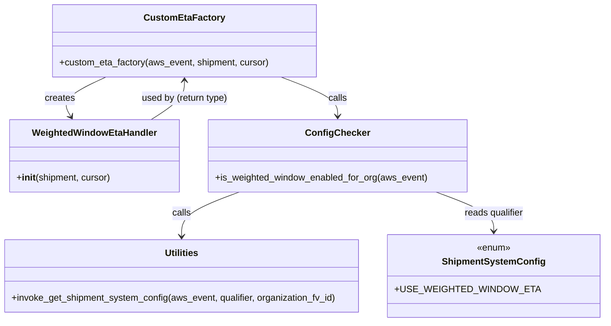

# Diagram: shipment_core/shipment_service/shipment_service/update_route_timing/CustomEtaFactory.py


> Auto-generated by Obscura crawlers

## Diagram 1

```mermaid
flowchart TD
    Start([Start]) --> CheckEnabled{is_weighted_window_enabled_for_org(aws_event)?}
    CheckEnabled -- true --> CreateHandler[Instantiate WeightedWindowEtaHandler(shipment, cursor)]
    CheckEnabled -- false --> NoHandler[Return None]
    CreateHandler --> ReturnHandler[Return eta_handler]
    NoHandler --> ReturnHandler
```

> SVG rendering failed for this diagram.

## Diagram 2



### SVG

<svg id="container" width="1016.4140625" xmlns="http://www.w3.org/2000/svg" class="classDiagram" height="560" viewBox="0 0 1016.4140625 560" role="graphics-document document" aria-roledescription="class"><style>#container{font-family:"trebuchet ms",verdana,arial,sans-serif;font-size:16px;fill:#333;}@keyframes edge-animation-frame{from{stroke-dashoffset:0;}}@keyframes dash{to{stroke-dashoffset:0;}}#container .edge-animation-slow{stroke-dasharray:9,5!important;stroke-dashoffset:900;animation:dash 50s linear infinite;stroke-linecap:round;}#container .edge-animation-fast{stroke-dasharray:9,5!important;stroke-dashoffset:900;animation:dash 20s linear infinite;stroke-linecap:round;}#container .error-icon{fill:#552222;}#container .error-text{fill:#552222;stroke:#552222;}#container .edge-thickness-normal{stroke-width:1px;}#container .edge-thickness-thick{stroke-width:3.5px;}#container .edge-pattern-solid{stroke-dasharray:0;}#container .edge-thickness-invisible{stroke-width:0;fill:none;}#container .edge-pattern-dashed{stroke-dasharray:3;}#container .edge-pattern-dotted{stroke-dasharray:2;}#container .marker{fill:#333333;stroke:#333333;}#container .marker.cross{stroke:#333333;}#container svg{font-family:"trebuchet ms",verdana,arial,sans-serif;font-size:16px;}#container p{margin:0;}#container g.classGroup text{fill:#9370DB;stroke:none;font-family:"trebuchet ms",verdana,arial,sans-serif;font-size:10px;}#container g.classGroup text .title{font-weight:bolder;}#container .nodeLabel,#container .edgeLabel{color:#131300;}#container .edgeLabel .label rect{fill:#ECECFF;}#container .label text{fill:#131300;}#container .labelBkg{background:#ECECFF;}#container .edgeLabel .label span{background:#ECECFF;}#container .classTitle{font-weight:bolder;}#container .node rect,#container .node circle,#container .node ellipse,#container .node polygon,#container .node path{fill:#ECECFF;stroke:#9370DB;stroke-width:1px;}#container .divider{stroke:#9370DB;stroke-width:1;}#container g.clickable{cursor:pointer;}#container g.classGroup rect{fill:#ECECFF;stroke:#9370DB;}#container g.classGroup line{stroke:#9370DB;stroke-width:1;}#container .classLabel .box{stroke:none;stroke-width:0;fill:#ECECFF;opacity:0.5;}#container .classLabel .label{fill:#9370DB;font-size:10px;}#container .relation{stroke:#333333;stroke-width:1;fill:none;}#container .dashed-line{stroke-dasharray:3;}#container .dotted-line{stroke-dasharray:1 2;}#container #compositionStart,#container .composition{fill:#333333!important;stroke:#333333!important;stroke-width:1;}#container #compositionEnd,#container .composition{fill:#333333!important;stroke:#333333!important;stroke-width:1;}#container #dependencyStart,#container .dependency{fill:#333333!important;stroke:#333333!important;stroke-width:1;}#container #dependencyStart,#container .dependency{fill:#333333!important;stroke:#333333!important;stroke-width:1;}#container #extensionStart,#container .extension{fill:transparent!important;stroke:#333333!important;stroke-width:1;}#container #extensionEnd,#container .extension{fill:transparent!important;stroke:#333333!important;stroke-width:1;}#container #aggregationStart,#container .aggregation{fill:transparent!important;stroke:#333333!important;stroke-width:1;}#container #aggregationEnd,#container .aggregation{fill:transparent!important;stroke:#333333!important;stroke-width:1;}#container #lollipopStart,#container .lollipop{fill:#ECECFF!important;stroke:#333333!important;stroke-width:1;}#container #lollipopEnd,#container .lollipop{fill:#ECECFF!important;stroke:#333333!important;stroke-width:1;}#container .edgeTerminals{font-size:11px;line-height:initial;}#container .classTitleText{text-anchor:middle;font-size:18px;fill:#333;}#container .label-icon{display:inline-block;height:1em;overflow:visible;vertical-align:-0.125em;}#container .node .label-icon path{fill:currentColor;stroke:revert;stroke-width:revert;}#container :root{--mermaid-font-family:"trebuchet ms",verdana,arial,sans-serif;}</style><g><defs><marker id="container_class-aggregationStart" class="marker aggregation class" refX="18" refY="7" markerWidth="190" markerHeight="240" orient="auto"><path d="M 18,7 L9,13 L1,7 L9,1 Z"></path></marker></defs><defs><marker id="container_class-aggregationEnd" class="marker aggregation class" refX="1" refY="7" markerWidth="20" markerHeight="28" orient="auto"><path d="M 18,7 L9,13 L1,7 L9,1 Z"></path></marker></defs><defs><marker id="container_class-extensionStart" class="marker extension class" refX="18" refY="7" markerWidth="190" markerHeight="240" orient="auto"><path d="M 1,7 L18,13 V 1 Z"></path></marker></defs><defs><marker id="container_class-extensionEnd" class="marker extension class" refX="1" refY="7" markerWidth="20" markerHeight="28" orient="auto"><path d="M 1,1 V 13 L18,7 Z"></path></marker></defs><defs><marker id="container_class-compositionStart" class="marker composition class" refX="18" refY="7" markerWidth="190" markerHeight="240" orient="auto"><path d="M 18,7 L9,13 L1,7 L9,1 Z"></path></marker></defs><defs><marker id="container_class-compositionEnd" class="marker composition class" refX="1" refY="7" markerWidth="20" markerHeight="28" orient="auto"><path d="M 18,7 L9,13 L1,7 L9,1 Z"></path></marker></defs><defs><marker id="container_class-dependencyStart" class="marker dependency class" refX="6" refY="7" markerWidth="190" markerHeight="240" orient="auto"><path d="M 5,7 L9,13 L1,7 L9,1 Z"></path></marker></defs><defs><marker id="container_class-dependencyEnd" class="marker dependency class" refX="13" refY="7" markerWidth="20" markerHeight="28" orient="auto"><path d="M 18,7 L9,13 L14,7 L9,1 Z"></path></marker></defs><defs><marker id="container_class-lollipopStart" class="marker lollipop class" refX="13" refY="7" markerWidth="190" markerHeight="240" orient="auto"><circle stroke="black" fill="transparent" cx="7" cy="7" r="6"></circle></marker></defs><defs><marker id="container_class-lollipopEnd" class="marker lollipop class" refX="1" refY="7" markerWidth="190" markerHeight="240" orient="auto"><circle stroke="black" fill="transparent" cx="7" cy="7" r="6"></circle></marker></defs><g class="root"><g class="clusters"></g><g class="edgePaths"><path d="M180.001,134L166.766,140.167C153.53,146.333,127.059,158.667,117.074,170.147C107.088,181.627,113.589,192.254,116.839,197.568L120.089,202.882" id="id_CustomEtaFactory_WeightedWindowEtaHandler_1" class="edge-thickness-normal edge-pattern-solid relation" style=";;;" data-edge="true" data-et="edge" data-id="id_CustomEtaFactory_WeightedWindowEtaHandler_1" data-points="W3sieCI6MTgwLjAwMTMwODU5Mzc1LCJ5IjoxMzR9LHsieCI6MTAwLjU4Nzg5MDYyNSwieSI6MTcxfSx7IngiOjEyMy4yMjAwMzkwNjI1LCJ5IjoyMDh9XQ==" marker-end="url(#container_class-dependencyEnd)"></path><path d="M482.844,134L499.252,140.167C515.66,146.333,548.475,158.667,564.883,170C581.291,181.333,581.291,191.667,581.291,196.833L581.291,202" id="id_CustomEtaFactory_ConfigChecker_2" class="edge-thickness-normal edge-pattern-solid relation" style=";;;" data-edge="true" data-et="edge" data-id="id_CustomEtaFactory_ConfigChecker_2" data-points="W3sieCI6NDgyLjg0NDI3NzM0Mzc1MDA0LCJ5IjoxMzR9LHsieCI6NTgxLjI5MTAxNTYyNSwieSI6MTcxfSx7IngiOjU4MS4yOTEwMTU2MjUsInkiOjIwOH1d" marker-end="url(#container_class-dependencyEnd)"></path><path d="M415.851,334L399.657,340.167C383.463,346.333,351.075,358.667,334.881,371.5C318.688,384.333,318.688,397.667,318.688,404.333L318.688,411" id="id_ConfigChecker_Utilities_3" class="edge-thickness-normal edge-pattern-solid relation" style=";;;" data-edge="true" data-et="edge" data-id="id_ConfigChecker_Utilities_3" data-points="W3sieCI6NDE1Ljg1MDgwMDc4MTI1LCJ5IjozMzR9LHsieCI6MzE4LjY4NzUsInkiOjM3MX0seyJ4IjozMTguNjg3NSwieSI6NDE3fV0=" marker-end="url(#container_class-dependencyEnd)"></path><path d="M746.731,334L762.925,340.167C779.119,346.333,811.507,358.667,827.701,370C843.895,381.333,843.895,391.667,843.895,396.833L843.895,402" id="id_ConfigChecker_ShipmentSystemConfig_4" class="edge-thickness-normal edge-pattern-solid relation" style=";;;" data-edge="true" data-et="edge" data-id="id_ConfigChecker_ShipmentSystemConfig_4" data-points="W3sieCI6NzQ2LjczMTIzMDQ2ODc1LCJ5IjozMzR9LHsieCI6ODQzLjg5NDUzMTI1LCJ5IjozNzF9LHsieCI6ODQzLjg5NDUzMTI1LCJ5Ijo0MDh9XQ==" marker-end="url(#container_class-dependencyEnd)"></path><path d="M258.437,208L267.901,201.833C277.365,195.667,296.292,183.333,305.755,172C315.219,160.667,315.219,150.333,315.219,145.167L315.219,140" id="id_WeightedWindowEtaHandler_CustomEtaFactory_5" class="edge-thickness-normal edge-pattern-solid relation" style=";;;" data-edge="true" data-et="edge" data-id="id_WeightedWindowEtaHandler_CustomEtaFactory_5" data-points="W3sieCI6MjU4LjQzNzQ4MDQ2ODc1LCJ5IjoyMDh9LHsieCI6MzE1LjIxODc1LCJ5IjoxNzF9LHsieCI6MzE1LjIxODc1LCJ5IjoxMzR9XQ==" marker-end="url(#container_class-dependencyEnd)"></path></g><g class="edgeLabels"><g class="edgeLabel" transform="translate(120.63703, 161.65878)"><g class="label" data-id="id_CustomEtaFactory_WeightedWindowEtaHandler_1" transform="translate(-26.171875, -12)"><foreignObject width="52.34375" height="24"><div xmlns="http://www.w3.org/1999/xhtml" class="labelBkg" style="display: table-cell; white-space: nowrap; line-height: 1.5; max-width: 200px; text-align: center;"><span class="edgeLabel"><p>creates</p></span></div></foreignObject></g></g><g class="edgeLabel" transform="translate(581.291015625, 171)"><g class="label" data-id="id_CustomEtaFactory_ConfigChecker_2" transform="translate(-16.4453125, -12)"><foreignObject width="32.890625" height="24"><div xmlns="http://www.w3.org/1999/xhtml" class="labelBkg" style="display: table-cell; white-space: nowrap; line-height: 1.5; max-width: 200px; text-align: center;"><span class="edgeLabel"><p>calls</p></span></div></foreignObject></g></g><g class="edgeLabel" transform="translate(318.6875, 371)"><g class="label" data-id="id_ConfigChecker_Utilities_3" transform="translate(-16.4453125, -12)"><foreignObject width="32.890625" height="24"><div xmlns="http://www.w3.org/1999/xhtml" class="labelBkg" style="display: table-cell; white-space: nowrap; line-height: 1.5; max-width: 200px; text-align: center;"><span class="edgeLabel"><p>calls</p></span></div></foreignObject></g></g><g class="edgeLabel" transform="translate(843.89453125, 371)"><g class="label" data-id="id_ConfigChecker_ShipmentSystemConfig_4" transform="translate(-52.484375, -12)"><foreignObject width="104.96875" height="24"><div xmlns="http://www.w3.org/1999/xhtml" class="labelBkg" style="display: table-cell; white-space: nowrap; line-height: 1.5; max-width: 200px; text-align: center;"><span class="edgeLabel"><p>reads qualifier</p></span></div></foreignObject></g></g><g class="edgeLabel" transform="translate(315.21875, 171)"><g class="label" data-id="id_WeightedWindowEtaHandler_CustomEtaFactory_5" transform="translate(-76.1640625, -12)"><foreignObject width="152.328125" height="24"><div xmlns="http://www.w3.org/1999/xhtml" class="labelBkg" style="display: table-cell; white-space: nowrap; line-height: 1.5; max-width: 200px; text-align: center;"><span class="edgeLabel"><p>used by (return type)</p></span></div></foreignObject></g></g></g><g class="nodes"><g class="node default" id="classId-CustomEtaFactory-0" transform="translate(315.21875, 71)"><g class="basic label-container"><path d="M-227.99609375 -63 L227.99609375 -63 L227.99609375 63 L-227.99609375 63" stroke="none" stroke-width="0" fill="#ECECFF" style=""></path><path d="M-227.99609375 -63 C-76.30125350003982 -63, 75.39358674992036 -63, 227.99609375 -63 M-227.99609375 -63 C-113.09448085765132 -63, 1.8071320346973607 -63, 227.99609375 -63 M227.99609375 -63 C227.99609375 -19.703135252797694, 227.99609375 23.593729494404613, 227.99609375 63 M227.99609375 -63 C227.99609375 -34.308539621139005, 227.99609375 -5.6170792422780025, 227.99609375 63 M227.99609375 63 C50.59026956304663 63, -126.81555462390673 63, -227.99609375 63 M227.99609375 63 C128.07203365748177 63, 28.147973564963564 63, -227.99609375 63 M-227.99609375 63 C-227.99609375 17.01597268144244, -227.99609375 -28.968054637115117, -227.99609375 -63 M-227.99609375 63 C-227.99609375 13.304802566088163, -227.99609375 -36.39039486782367, -227.99609375 -63" stroke="#9370DB" stroke-width="1.3" fill="none" stroke-dasharray="0 0" style=""></path></g><g class="annotation-group text" transform="translate(0, -39)"></g><g class="label-group text" transform="translate(-65.3359375, -39)"><g class="label" style="font-weight: bolder" transform="translate(0,-12)"><foreignObject width="130.671875" height="24"><div xmlns="http://www.w3.org/1999/xhtml" style="display: table-cell; white-space: nowrap; line-height: 1.5; max-width: 179px; text-align: center;"><span class="nodeLabel markdown-node-label" style=""><p>CustomEtaFactory</p></span></div></foreignObject></g></g><g class="members-group text" transform="translate(-215.99609375, 9)"></g><g class="methods-group text" transform="translate(-215.99609375, 39)"><g class="label" style="" transform="translate(0,-12)"><foreignObject width="366.65625" height="24"><div xmlns="http://www.w3.org/1999/xhtml" style="display: table-cell; white-space: nowrap; line-height: 1.5; max-width: 424px; text-align: center;"><span class="nodeLabel markdown-node-label" style=""><p>+custom_eta_factory(aws_event, shipment, cursor)</p></span></div></foreignObject></g></g><g class="divider" style=""><path d="M-227.99609375 -15 C-65.33815939368716 -15, 97.31977496262567 -15, 227.99609375 -15 M-227.99609375 -15 C-50.659395814747654 -15, 126.67730212050469 -15, 227.99609375 -15" stroke="#9370DB" stroke-width="1.3" fill="none" stroke-dasharray="0 0" style=""></path></g><g class="divider" style=""><path d="M-227.99609375 9 C-101.39103114270667 9, 25.214031464586668 9, 227.99609375 9 M-227.99609375 9 C-90.20145562183185 9, 47.59318250633629 9, 227.99609375 9" stroke="#9370DB" stroke-width="1.3" fill="none" stroke-dasharray="0 0" style=""></path></g></g><g class="node default" id="classId-WeightedWindowEtaHandler-1" transform="translate(161.755859375, 271)"><g class="basic label-container"><path d="M-146.66015625 -63 L146.66015625 -63 L146.66015625 63 L-146.66015625 63" stroke="none" stroke-width="0" fill="#ECECFF" style=""></path><path d="M-146.66015625 -63 C-79.00510931980492 -63, -11.350062389609832 -63, 146.66015625 -63 M-146.66015625 -63 C-62.494017357963145 -63, 21.67212153407371 -63, 146.66015625 -63 M146.66015625 -63 C146.66015625 -32.28513025772515, 146.66015625 -1.5702605154503004, 146.66015625 63 M146.66015625 -63 C146.66015625 -13.445001014018999, 146.66015625 36.109997971962, 146.66015625 63 M146.66015625 63 C50.44216976996968 63, -45.77581671006064 63, -146.66015625 63 M146.66015625 63 C65.20802992634279 63, -16.244096397314422 63, -146.66015625 63 M-146.66015625 63 C-146.66015625 22.02488935690789, -146.66015625 -18.950221286184217, -146.66015625 -63 M-146.66015625 63 C-146.66015625 35.98885135533308, -146.66015625 8.977702710666165, -146.66015625 -63" stroke="#9370DB" stroke-width="1.3" fill="none" stroke-dasharray="0 0" style=""></path></g><g class="annotation-group text" transform="translate(0, -39)"></g><g class="label-group text" transform="translate(-104.1953125, -39)"><g class="label" style="font-weight: bolder" transform="translate(0,-12)"><foreignObject width="208.390625" height="24"><div xmlns="http://www.w3.org/1999/xhtml" style="display: table-cell; white-space: nowrap; line-height: 1.5; max-width: 257px; text-align: center;"><span class="nodeLabel markdown-node-label" style=""><p>WeightedWindowEtaHandler</p></span></div></foreignObject></g></g><g class="members-group text" transform="translate(-134.66015625, 9)"></g><g class="methods-group text" transform="translate(-134.66015625, 39)"><g class="label" style="" transform="translate(0,-12)"><foreignObject width="165.125" height="24"><div xmlns="http://www.w3.org/1999/xhtml" style="display: table-cell; white-space: nowrap; line-height: 1.5; max-width: 254px; text-align: center;"><span class="nodeLabel markdown-node-label" style=""><p>+<strong>init</strong>(shipment, cursor)</p></span></div></foreignObject></g></g><g class="divider" style=""><path d="M-146.66015625 -15 C-86.17593743477786 -15, -25.69171861955573 -15, 146.66015625 -15 M-146.66015625 -15 C-42.59723273559513 -15, 61.465690778809744 -15, 146.66015625 -15" stroke="#9370DB" stroke-width="1.3" fill="none" stroke-dasharray="0 0" style=""></path></g><g class="divider" style=""><path d="M-146.66015625 9 C-47.20633823329112 9, 52.24747978341776 9, 146.66015625 9 M-146.66015625 9 C-62.934457774780654 9, 20.791240700438692 9, 146.66015625 9" stroke="#9370DB" stroke-width="1.3" fill="none" stroke-dasharray="0 0" style=""></path></g></g><g class="node default" id="classId-Utilities-2" transform="translate(318.6875, 480)"><g class="basic label-container"><path d="M-310.6875 -63 L310.6875 -63 L310.6875 63 L-310.6875 63" stroke="none" stroke-width="0" fill="#ECECFF" style=""></path><path d="M-310.6875 -63 C-123.78245040006965 -63, 63.1225991998607 -63, 310.6875 -63 M-310.6875 -63 C-138.29863893930766 -63, 34.09022212138467 -63, 310.6875 -63 M310.6875 -63 C310.6875 -23.14238430253871, 310.6875 16.715231394922583, 310.6875 63 M310.6875 -63 C310.6875 -22.474804691946098, 310.6875 18.050390616107805, 310.6875 63 M310.6875 63 C85.0712474858313 63, -140.5450050283374 63, -310.6875 63 M310.6875 63 C127.43895190381795 63, -55.8095961923641 63, -310.6875 63 M-310.6875 63 C-310.6875 15.700987527822953, -310.6875 -31.598024944354094, -310.6875 -63 M-310.6875 63 C-310.6875 29.44440432169074, -310.6875 -4.111191356618519, -310.6875 -63" stroke="#9370DB" stroke-width="1.3" fill="none" stroke-dasharray="0 0" style=""></path></g><g class="annotation-group text" transform="translate(0, -39)"></g><g class="label-group text" transform="translate(-28.8125, -39)"><g class="label" style="font-weight: bolder" transform="translate(0,-12)"><foreignObject width="57.625" height="24"><div xmlns="http://www.w3.org/1999/xhtml" style="display: table-cell; white-space: nowrap; line-height: 1.5; max-width: 107px; text-align: center;"><span class="nodeLabel markdown-node-label" style=""><p>Utilities</p></span></div></foreignObject></g></g><g class="members-group text" transform="translate(-298.6875, 9)"></g><g class="methods-group text" transform="translate(-298.6875, 39)"><g class="label" style="" transform="translate(0,-12)"><foreignObject width="568.5625" height="24"><div xmlns="http://www.w3.org/1999/xhtml" style="display: table-cell; white-space: nowrap; line-height: 1.5; max-width: 626px; text-align: center;"><span class="nodeLabel markdown-node-label" style=""><p>+invoke_get_shipment_system_config(aws_event, qualifier, organization_fv_id)</p></span></div></foreignObject></g></g><g class="divider" style=""><path d="M-310.6875 -15 C-164.85477033526112 -15, -19.022040670522244 -15, 310.6875 -15 M-310.6875 -15 C-167.10965021118744 -15, -23.531800422374886 -15, 310.6875 -15" stroke="#9370DB" stroke-width="1.3" fill="none" stroke-dasharray="0 0" style=""></path></g><g class="divider" style=""><path d="M-310.6875 9 C-107.93662033143482 9, 94.81425933713035 9, 310.6875 9 M-310.6875 9 C-68.01089336239298 9, 174.66571327521405 9, 310.6875 9" stroke="#9370DB" stroke-width="1.3" fill="none" stroke-dasharray="0 0" style=""></path></g></g><g class="node default" id="classId-ShipmentSystemConfig-3" transform="translate(843.89453125, 480)"><g class="basic label-container"><path d="M-164.51953125 -72 L164.51953125 -72 L164.51953125 72 L-164.51953125 72" stroke="none" stroke-width="0" fill="#ECECFF" style=""></path><path d="M-164.51953125 -72 C-65.70058572286719 -72, 33.11835980426562 -72, 164.51953125 -72 M-164.51953125 -72 C-87.90245201519197 -72, -11.285372780383938 -72, 164.51953125 -72 M164.51953125 -72 C164.51953125 -15.859941229312717, 164.51953125 40.280117541374565, 164.51953125 72 M164.51953125 -72 C164.51953125 -36.97351588557738, 164.51953125 -1.9470317711547551, 164.51953125 72 M164.51953125 72 C72.5497470835736 72, -19.420037082852787 72, -164.51953125 72 M164.51953125 72 C95.31920886804657 72, 26.118886486093146 72, -164.51953125 72 M-164.51953125 72 C-164.51953125 30.800240854900537, -164.51953125 -10.399518290198927, -164.51953125 -72 M-164.51953125 72 C-164.51953125 28.175885996855236, -164.51953125 -15.648228006289528, -164.51953125 -72" stroke="#9370DB" stroke-width="1.3" fill="none" stroke-dasharray="0 0" style=""></path></g><g class="annotation-group text" transform="translate(-29.53125, -48)"><g class="label" style="" transform="translate(0,-12)"><foreignObject width="59.0625" height="24"><div xmlns="http://www.w3.org/1999/xhtml" style="display: table-cell; white-space: nowrap; line-height: 1.5; max-width: 109px; text-align: center;"><span class="nodeLabel markdown-node-label" style=""><p>«enum»</p></span></div></foreignObject></g></g><g class="label-group text" transform="translate(-84.5859375, -24)"><g class="label" style="font-weight: bolder" transform="translate(0,-12)"><foreignObject width="169.171875" height="24"><div xmlns="http://www.w3.org/1999/xhtml" style="display: table-cell; white-space: nowrap; line-height: 1.5; max-width: 217px; text-align: center;"><span class="nodeLabel markdown-node-label" style=""><p>ShipmentSystemConfig</p></span></div></foreignObject></g></g><g class="members-group text" transform="translate(-152.51953125, 24)"><g class="label" style="" transform="translate(0,-12)"><foreignObject width="220.453125" height="24"><div xmlns="http://www.w3.org/1999/xhtml" style="display: table-cell; white-space: nowrap; line-height: 1.5; max-width: 279px; text-align: center;"><span class="nodeLabel markdown-node-label" style=""><p>+USE_WEIGHTED_WINDOW_ETA</p></span></div></foreignObject></g></g><g class="methods-group text" transform="translate(-152.51953125, 72)"></g><g class="divider" style=""><path d="M-164.51953125 0 C-64.06412250298325 0, 36.391286244033495 0, 164.51953125 0 M-164.51953125 0 C-55.22465015023215 0, 54.0702309495357 0, 164.51953125 0" stroke="#9370DB" stroke-width="1.3" fill="none" stroke-dasharray="0 0" style=""></path></g><g class="divider" style=""><path d="M-164.51953125 48 C-39.84126781423598 48, 84.83699562152805 48, 164.51953125 48 M-164.51953125 48 C-86.79014995283599 48, -9.060768655671978 48, 164.51953125 48" stroke="#9370DB" stroke-width="1.3" fill="none" stroke-dasharray="0 0" style=""></path></g></g><g class="node default" id="classId-ConfigChecker-4" transform="translate(581.291015625, 271)"><g class="basic label-container"><path d="M-222.875 -63 L222.875 -63 L222.875 63 L-222.875 63" stroke="none" stroke-width="0" fill="#ECECFF" style=""></path><path d="M-222.875 -63 C-84.81245979396647 -63, 53.250080412067064 -63, 222.875 -63 M-222.875 -63 C-51.068653671705846 -63, 120.73769265658831 -63, 222.875 -63 M222.875 -63 C222.875 -23.253642196448148, 222.875 16.492715607103705, 222.875 63 M222.875 -63 C222.875 -35.54649031513047, 222.875 -8.09298063026094, 222.875 63 M222.875 63 C116.88891471766239 63, 10.902829435324776 63, -222.875 63 M222.875 63 C115.01935785969557 63, 7.163715719391149 63, -222.875 63 M-222.875 63 C-222.875 18.775244710951704, -222.875 -25.449510578096593, -222.875 -63 M-222.875 63 C-222.875 23.56320883648337, -222.875 -15.873582327033262, -222.875 -63" stroke="#9370DB" stroke-width="1.3" fill="none" stroke-dasharray="0 0" style=""></path></g><g class="annotation-group text" transform="translate(0, -39)"></g><g class="label-group text" transform="translate(-52.25, -39)"><g class="label" style="font-weight: bolder" transform="translate(0,-12)"><foreignObject width="104.5" height="24"><div xmlns="http://www.w3.org/1999/xhtml" style="display: table-cell; white-space: nowrap; line-height: 1.5; max-width: 153px; text-align: center;"><span class="nodeLabel markdown-node-label" style=""><p>ConfigChecker</p></span></div></foreignObject></g></g><g class="members-group text" transform="translate(-210.875, 9)"></g><g class="methods-group text" transform="translate(-210.875, 39)"><g class="label" style="" transform="translate(0,-12)"><foreignObject width="369.5" height="24"><div xmlns="http://www.w3.org/1999/xhtml" style="display: table-cell; white-space: nowrap; line-height: 1.5; max-width: 427px; text-align: center;"><span class="nodeLabel markdown-node-label" style=""><p>+is_weighted_window_enabled_for_org(aws_event)</p></span></div></foreignObject></g></g><g class="divider" style=""><path d="M-222.875 -15 C-101.75226865143637 -15, 19.370462697127266 -15, 222.875 -15 M-222.875 -15 C-76.2497526541506 -15, 70.3754946916988 -15, 222.875 -15" stroke="#9370DB" stroke-width="1.3" fill="none" stroke-dasharray="0 0" style=""></path></g><g class="divider" style=""><path d="M-222.875 9 C-79.24363928278098 9, 64.38772143443805 9, 222.875 9 M-222.875 9 C-75.62542763537135 9, 71.6241447292573 9, 222.875 9" stroke="#9370DB" stroke-width="1.3" fill="none" stroke-dasharray="0 0" style=""></path></g></g></g></g></g></svg>

## Diagram 3

```mermaid
flowchart LR
    A[is_weighted_window_enabled_for_org] --> B{extract creator_org_fv_id}
    B --> C[call utilities.invoke_get_shipment_system_config(aws_event, qualifier, organization_fv_id)]
    C --> D[try parse json -> full_config[0][USE_WEIGHTED_WINDOW_ETA]]
    D --> E{parsed value in ("true","t",1,"1")}
    D -- exception --> LogError[logging.error(...)] --> F[is_weighted_window_enabled = None]
    E -- yes --> TrueResult([return True])
    E -- no --> FalseResult([return False])
    F --> FalseResult
```

> SVG rendering failed for this diagram.
