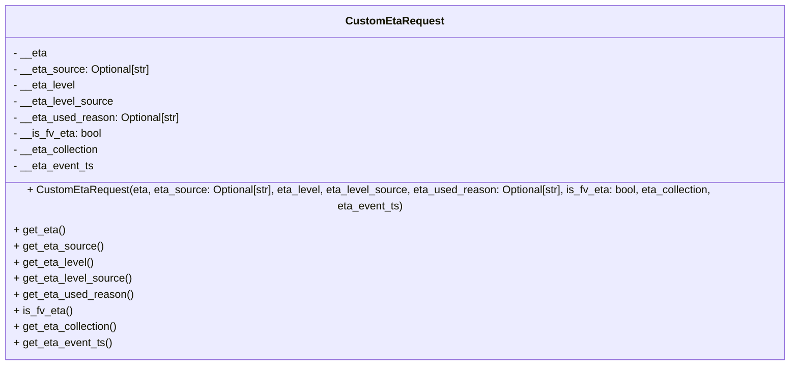

# Diagram: shipment_core/shipment_service/shipment_service/update_route_timing/CustomEtaRequest.py

> Auto-generated by Obscura crawlers

## Mermaid

### SVG

<svg id="container" width="1237.9140625" xmlns="http://www.w3.org/2000/svg" class="classDiagram" height="520" viewBox="0 0 1237.9140625 520" role="graphics-document document" aria-roledescription="class"><g><defs><marker id="container_class-aggregationStart" class="marker aggregation class" refX="18" refY="7" markerWidth="190" markerHeight="240" orient="auto"><path d="M 18,7 L9,13 L1,7 L9,1 Z"></path></marker></defs><defs><marker id="container_class-aggregationEnd" class="marker aggregation class" refX="1" refY="7" markerWidth="20" markerHeight="28" orient="auto"><path d="M 18,7 L9,13 L1,7 L9,1 Z"></path></marker></defs><defs><marker id="container_class-extensionStart" class="marker extension class" refX="18" refY="7" markerWidth="190" markerHeight="240" orient="auto"><path d="M 1,7 L18,13 V 1 Z"></path></marker></defs><defs><marker id="container_class-extensionEnd" class="marker extension class" refX="1" refY="7" markerWidth="20" markerHeight="28" orient="auto"><path d="M 1,1 V 13 L18,7 Z"></path></marker></defs><defs><marker id="container_class-compositionStart" class="marker composition class" refX="18" refY="7" markerWidth="190" markerHeight="240" orient="auto"><path d="M 18,7 L9,13 L1,7 L9,1 Z"></path></marker></defs><defs><marker id="container_class-compositionEnd" class="marker composition class" refX="1" refY="7" markerWidth="20" markerHeight="28" orient="auto"><path d="M 18,7 L9,13 L1,7 L9,1 Z"></path></marker></defs><defs><marker id="container_class-dependencyStart" class="marker dependency class" refX="6" refY="7" markerWidth="190" markerHeight="240" orient="auto"><path d="M 5,7 L9,13 L1,7 L9,1 Z"></path></marker></defs><defs><marker id="container_class-dependencyEnd" class="marker dependency class" refX="13" refY="7" markerWidth="20" markerHeight="28" orient="auto"><path d="M 18,7 L9,13 L14,7 L9,1 Z"></path></marker></defs><defs><marker id="container_class-lollipopStart" class="marker lollipop class" refX="13" refY="7" markerWidth="190" markerHeight="240" orient="auto"><circle stroke="black" fill="transparent" cx="7" cy="7" r="6"></circle></marker></defs><defs><marker id="container_class-lollipopEnd" class="marker lollipop class" refX="1" refY="7" markerWidth="190" markerHeight="240" orient="auto"><circle stroke="black" fill="transparent" cx="7" cy="7" r="6"></circle></marker></defs><g class="root"><g class="clusters"></g><g class="edgePaths"></g><g class="edgeLabels"></g><g class="nodes"><g class="node default" id="classId-CustomEtaRequest-0" transform="translate(618.95703125, 260)"><g class="basic label-container"><path d="M-610.95703125 -252 L610.95703125 -252 L610.95703125 252 L-610.95703125 252" stroke="none" stroke-width="0" fill="#ECECFF" style=""></path><path d="M-610.95703125 -252 C-280.7223426813328 -252, 49.51234588733439 -252, 610.95703125 -252 M-610.95703125 -252 C-144.417307217833 -252, 322.122416814334 -252, 610.95703125 -252 M610.95703125 -252 C610.95703125 -51.6264020893785, 610.95703125 148.747195821243, 610.95703125 252 M610.95703125 -252 C610.95703125 -114.92172860912669, 610.95703125 22.156542781746623, 610.95703125 252 M610.95703125 252 C190.61803410527244 252, -229.7209630394551 252, -610.95703125 252 M610.95703125 252 C191.19731352066128 252, -228.56240420867744 252, -610.95703125 252 M-610.95703125 252 C-610.95703125 139.87901276015833, -610.95703125 27.758025520316693, -610.95703125 -252 M-610.95703125 252 C-610.95703125 56.45429793553632, -610.95703125 -139.09140412892737, -610.95703125 -252" stroke="#9370DB" stroke-width="1.3" fill="none" stroke-dasharray="0 0" style=""></path></g><g class="annotation-group text" transform="translate(0, -228)"></g><g class="label-group text" transform="translate(-68.7109375, -228)"><g class="label" style="font-weight: bolder" transform="translate(0,-12)"><foreignObject width="137.421875" height="24">

CustomEtaRequest

</foreignObject></g></g><g class="members-group text" transform="translate(-598.95703125, -180)"><g class="label" style="" transform="translate(0,-12)"><foreignObject width="49.9375" height="24">

- __eta

</foreignObject></g><g class="label" style="" transform="translate(0,12)"><foreignObject width="206.765625" height="24">

- __eta_source: Optional[str]

</foreignObject></g><g class="label" style="" transform="translate(0,36)"><foreignObject width="92.578125" height="24">

- __eta_level

</foreignObject></g><g class="label" style="" transform="translate(0,60)"><foreignObject width="148.78125" height="24">

- __eta_level_source

</foreignObject></g><g class="label" style="" transform="translate(0,84)"><foreignObject width="250.953125" height="24">

- __eta_used_reason: Optional[str]

</foreignObject></g><g class="label" style="" transform="translate(0,108)"><foreignObject width="131.640625" height="24">

- __is_fv_eta: bool

</foreignObject></g><g class="label" style="" transform="translate(0,132)"><foreignObject width="129.28125" height="24">

- __eta_collection

</foreignObject></g><g class="label" style="" transform="translate(0,156)"><foreignObject width="119.53125" height="24">

- __eta_event_ts

</foreignObject></g></g><g class="methods-group text" transform="translate(-598.95703125, 36)"><g class="label" style="" transform="translate(0,-12)"><foreignObject width="1129.203125" height="24">

+ CustomEtaRequest(eta, eta_source: Optional[str], eta_level, eta_level_source, eta_used_reason: Optional[str], is_fv_eta: bool, eta_collection, eta_event_ts)

</foreignObject></g><g class="label" style="" transform="translate(0,12)"><foreignObject width="76.25" height="24">

+ get_eta()

</foreignObject></g><g class="label" style="" transform="translate(0,36)"><foreignObject width="132.4375" height="24">

+ get_eta_source()

</foreignObject></g><g class="label" style="" transform="translate(0,60)"><foreignObject width="118.890625" height="24">

+ get_eta_level()

</foreignObject></g><g class="label" style="" transform="translate(0,84)"><foreignObject width="175.078125" height="24">

+ get_eta_level_source()

</foreignObject></g><g class="label" style="" transform="translate(0,108)"><foreignObject width="176.625" height="24">

+ get_eta_used_reason()

</foreignObject></g><g class="label" style="" transform="translate(0,132)"><foreignObject width="86.109375" height="24">

+ is_fv_eta()

</foreignObject></g><g class="label" style="" transform="translate(0,156)"><foreignObject width="155.59375" height="24">

+ get_eta_collection()

</foreignObject></g><g class="label" style="" transform="translate(0,180)"><foreignObject width="145.828125" height="24">

+ get_eta_event_ts()

</foreignObject></g></g><g class="divider" style=""><path d="M-610.95703125 -204 C-361.4398600494354 -204, -111.9226888488709 -204, 610.95703125 -204 M-610.95703125 -204 C-192.94398395764836 -204, 225.0690633347033 -204, 610.95703125 -204" stroke="#9370DB" stroke-width="1.3" fill="none" stroke-dasharray="0 0" style=""></path></g><g class="divider" style=""><path d="M-610.95703125 12 C-265.21203044327905 12, 80.5329703634419 12, 610.95703125 12 M-610.95703125 12 C-179.71702844232857 12, 251.52297436534286 12, 610.95703125 12" stroke="#9370DB" stroke-width="1.3" fill="none" stroke-dasharray="0 0" style=""></path></g></g></g></g></g></svg>
