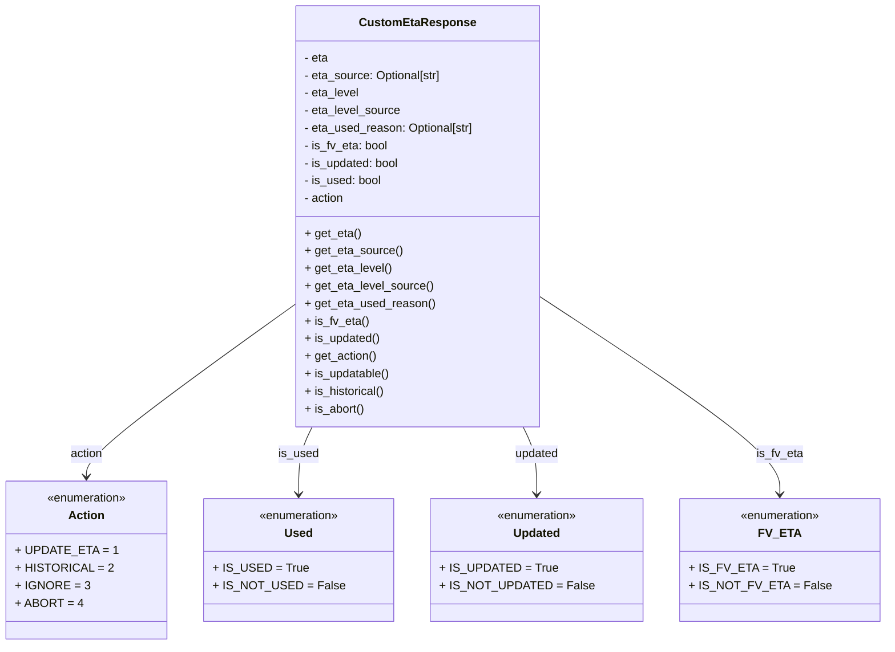

# Diagram: shipment_core/shipment_service/shipment_service/update_route_timing/CustomEtaResponse.py

> Auto-generated by Obscura crawlers

## Mermaid

```mermaid
classDiagram
class CustomEtaResponse {
  - eta
  - eta_source: Optional[str]
  - eta_level
  - eta_level_source
  - eta_used_reason: Optional[str]
  - is_fv_eta: bool
  - is_updated: bool
  - is_used: bool
  - action
  + get_eta()
  + get_eta_source()
  + get_eta_level()
  + get_eta_level_source()
  + get_eta_used_reason()
  + is_fv_eta()
  + is_updated()
  + get_action()
  + is_updatable()
  + is_historical()
  + is_abort()
}
class Action <<enumeration>> {
  + UPDATE_ETA = 1
  + HISTORICAL = 2
  + IGNORE = 3
  + ABORT = 4
}
class Used <<enumeration>> {
  + IS_USED = True
  + IS_NOT_USED = False
}
class Updated <<enumeration>> {
  + IS_UPDATED = True
  + IS_NOT_UPDATED = False
}
class FV_ETA <<enumeration>> {
  + IS_FV_ETA = True
  + IS_NOT_FV_ETA = False
}
CustomEtaResponse --> Action : action
CustomEtaResponse --> Used : is_used
CustomEtaResponse --> Updated : updated
CustomEtaResponse --> FV_ETA : is_fv_eta
```

> SVG rendering failed for this diagram.
