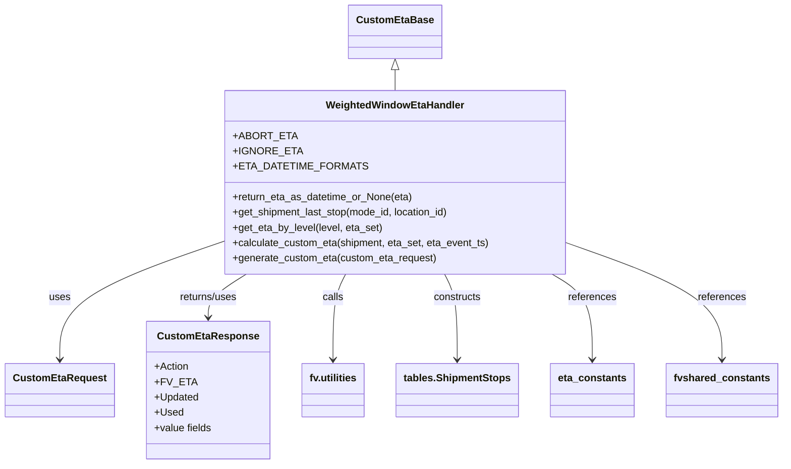

# Diagram: shipment_core/shipment_service/shipment_service/update_route_timing/WeightedWindowEtaHandler.py


> Auto-generated by Obscura crawlers

## Diagram 1



### SVG

<svg id="container" width="1193.1875" xmlns="http://www.w3.org/2000/svg" class="classDiagram" height="728" viewBox="0 0 1193.1875 728" role="graphics-document document" aria-roledescription="class"><style>#container{font-family:"trebuchet ms",verdana,arial,sans-serif;font-size:16px;fill:#333;}@keyframes edge-animation-frame{from{stroke-dashoffset:0;}}@keyframes dash{to{stroke-dashoffset:0;}}#container .edge-animation-slow{stroke-dasharray:9,5!important;stroke-dashoffset:900;animation:dash 50s linear infinite;stroke-linecap:round;}#container .edge-animation-fast{stroke-dasharray:9,5!important;stroke-dashoffset:900;animation:dash 20s linear infinite;stroke-linecap:round;}#container .error-icon{fill:#552222;}#container .error-text{fill:#552222;stroke:#552222;}#container .edge-thickness-normal{stroke-width:1px;}#container .edge-thickness-thick{stroke-width:3.5px;}#container .edge-pattern-solid{stroke-dasharray:0;}#container .edge-thickness-invisible{stroke-width:0;fill:none;}#container .edge-pattern-dashed{stroke-dasharray:3;}#container .edge-pattern-dotted{stroke-dasharray:2;}#container .marker{fill:#333333;stroke:#333333;}#container .marker.cross{stroke:#333333;}#container svg{font-family:"trebuchet ms",verdana,arial,sans-serif;font-size:16px;}#container p{margin:0;}#container g.classGroup text{fill:#9370DB;stroke:none;font-family:"trebuchet ms",verdana,arial,sans-serif;font-size:10px;}#container g.classGroup text .title{font-weight:bolder;}#container .nodeLabel,#container .edgeLabel{color:#131300;}#container .edgeLabel .label rect{fill:#ECECFF;}#container .label text{fill:#131300;}#container .labelBkg{background:#ECECFF;}#container .edgeLabel .label span{background:#ECECFF;}#container .classTitle{font-weight:bolder;}#container .node rect,#container .node circle,#container .node ellipse,#container .node polygon,#container .node path{fill:#ECECFF;stroke:#9370DB;stroke-width:1px;}#container .divider{stroke:#9370DB;stroke-width:1;}#container g.clickable{cursor:pointer;}#container g.classGroup rect{fill:#ECECFF;stroke:#9370DB;}#container g.classGroup line{stroke:#9370DB;stroke-width:1;}#container .classLabel .box{stroke:none;stroke-width:0;fill:#ECECFF;opacity:0.5;}#container .classLabel .label{fill:#9370DB;font-size:10px;}#container .relation{stroke:#333333;stroke-width:1;fill:none;}#container .dashed-line{stroke-dasharray:3;}#container .dotted-line{stroke-dasharray:1 2;}#container #compositionStart,#container .composition{fill:#333333!important;stroke:#333333!important;stroke-width:1;}#container #compositionEnd,#container .composition{fill:#333333!important;stroke:#333333!important;stroke-width:1;}#container #dependencyStart,#container .dependency{fill:#333333!important;stroke:#333333!important;stroke-width:1;}#container #dependencyStart,#container .dependency{fill:#333333!important;stroke:#333333!important;stroke-width:1;}#container #extensionStart,#container .extension{fill:transparent!important;stroke:#333333!important;stroke-width:1;}#container #extensionEnd,#container .extension{fill:transparent!important;stroke:#333333!important;stroke-width:1;}#container #aggregationStart,#container .aggregation{fill:transparent!important;stroke:#333333!important;stroke-width:1;}#container #aggregationEnd,#container .aggregation{fill:transparent!important;stroke:#333333!important;stroke-width:1;}#container #lollipopStart,#container .lollipop{fill:#ECECFF!important;stroke:#333333!important;stroke-width:1;}#container #lollipopEnd,#container .lollipop{fill:#ECECFF!important;stroke:#333333!important;stroke-width:1;}#container .edgeTerminals{font-size:11px;line-height:initial;}#container .classTitleText{text-anchor:middle;font-size:18px;fill:#333;}#container .label-icon{display:inline-block;height:1em;overflow:visible;vertical-align:-0.125em;}#container .node .label-icon path{fill:currentColor;stroke:revert;stroke-width:revert;}#container :root{--mermaid-font-family:"trebuchet ms",verdana,arial,sans-serif;}</style><g><defs><marker id="container_class-aggregationStart" class="marker aggregation class" refX="18" refY="7" markerWidth="190" markerHeight="240" orient="auto"><path d="M 18,7 L9,13 L1,7 L9,1 Z"></path></marker></defs><defs><marker id="container_class-aggregationEnd" class="marker aggregation class" refX="1" refY="7" markerWidth="20" markerHeight="28" orient="auto"><path d="M 18,7 L9,13 L1,7 L9,1 Z"></path></marker></defs><defs><marker id="container_class-extensionStart" class="marker extension class" refX="18" refY="7" markerWidth="190" markerHeight="240" orient="auto"><path d="M 1,7 L18,13 V 1 Z"></path></marker></defs><defs><marker id="container_class-extensionEnd" class="marker extension class" refX="1" refY="7" markerWidth="20" markerHeight="28" orient="auto"><path d="M 1,1 V 13 L18,7 Z"></path></marker></defs><defs><marker id="container_class-compositionStart" class="marker composition class" refX="18" refY="7" markerWidth="190" markerHeight="240" orient="auto"><path d="M 18,7 L9,13 L1,7 L9,1 Z"></path></marker></defs><defs><marker id="container_class-compositionEnd" class="marker composition class" refX="1" refY="7" markerWidth="20" markerHeight="28" orient="auto"><path d="M 18,7 L9,13 L1,7 L9,1 Z"></path></marker></defs><defs><marker id="container_class-dependencyStart" class="marker dependency class" refX="6" refY="7" markerWidth="190" markerHeight="240" orient="auto"><path d="M 5,7 L9,13 L1,7 L9,1 Z"></path></marker></defs><defs><marker id="container_class-dependencyEnd" class="marker dependency class" refX="13" refY="7" markerWidth="20" markerHeight="28" orient="auto"><path d="M 18,7 L9,13 L14,7 L9,1 Z"></path></marker></defs><defs><marker id="container_class-lollipopStart" class="marker lollipop class" refX="13" refY="7" markerWidth="190" markerHeight="240" orient="auto"><circle stroke="black" fill="transparent" cx="7" cy="7" r="6"></circle></marker></defs><defs><marker id="container_class-lollipopEnd" class="marker lollipop class" refX="1" refY="7" markerWidth="190" markerHeight="240" orient="auto"><circle stroke="black" fill="transparent" cx="7" cy="7" r="6"></circle></marker></defs><g class="root"><g class="clusters"></g><g class="edgePaths"><path d="M602.395,109.25L602.395,110.542C602.395,111.833,602.395,114.417,602.395,119.875C602.395,125.333,602.395,133.667,602.395,137.833L602.395,142" id="id_CustomEtaBase_WeightedWindowEtaHandler_1" class="edge-thickness-normal edge-pattern-solid relation" style=";;;" data-edge="true" data-et="edge" data-id="id_CustomEtaBase_WeightedWindowEtaHandler_1" data-points="W3sieCI6NjAyLjM5NDUzMTI1LCJ5Ijo5Mn0seyJ4Ijo2MDIuMzk0NTMxMjUsInkiOjExN30seyJ4Ijo2MDIuMzk0NTMxMjUsInkiOjE0Mn1d" marker-start="url(#container_class-extensionStart)"></path><path d="M335.406,380.075L294.29,394.563C253.174,409.05,170.943,438.025,129.827,468.679C88.711,499.333,88.711,531.667,88.711,547.833L88.711,564" id="id_WeightedWindowEtaHandler_CustomEtaRequest_2" class="edge-thickness-normal edge-pattern-solid relation" style=";;;" data-edge="true" data-et="edge" data-id="id_WeightedWindowEtaHandler_CustomEtaRequest_2" data-points="W3sieCI6MzM1LjQwNjI1LCJ5IjozODAuMDc1MTg0NTk2NTQ5MX0seyJ4Ijo4OC43MTA5Mzc1LCJ5Ijo0Njd9LHsieCI6ODguNzEwOTM3NSwieSI6NTcwfV0=" marker-end="url(#container_class-dependencyEnd)"></path><path d="M372.767,430L362.934,436.167C353.1,442.333,333.433,454.667,323.599,466C313.766,477.333,313.766,487.667,313.766,492.833L313.766,498" id="id_WeightedWindowEtaHandler_CustomEtaResponse_3" class="edge-thickness-normal edge-pattern-solid relation" style=";;;" data-edge="true" data-et="edge" data-id="id_WeightedWindowEtaHandler_CustomEtaResponse_3" data-points="W3sieCI6MzcyLjc2NzExNDEyMjkyODIsInkiOjQzMH0seyJ4IjozMTMuNzY1NjI1LCJ5Ijo0Njd9LHsieCI6MzEzLjc2NTYyNSwieSI6NTA0fV0=" marker-end="url(#container_class-dependencyEnd)"></path><path d="M526.308,430L523.05,436.167C519.791,442.333,513.274,454.667,510.016,477C506.758,499.333,506.758,531.667,506.758,547.833L506.758,564" id="id_WeightedWindowEtaHandler_fv.utilities_4" class="edge-thickness-normal edge-pattern-solid relation" style=";;;" data-edge="true" data-et="edge" data-id="id_WeightedWindowEtaHandler_fv.utilities_4" data-points="W3sieCI6NTI2LjMwNzg1OTk3OTI4MTgsInkiOjQzMH0seyJ4Ijo1MDYuNzU3ODEyNSwieSI6NDY3fSx7IngiOjUwNi43NTc4MTI1LCJ5Ijo1NzB9XQ==" marker-end="url(#container_class-dependencyEnd)"></path><path d="M678.481,430L681.74,436.167C684.998,442.333,691.515,454.667,694.773,477C698.031,499.333,698.031,531.667,698.031,547.833L698.031,564" id="id_WeightedWindowEtaHandler_tables.ShipmentStops_5" class="edge-thickness-normal edge-pattern-solid relation" style=";;;" data-edge="true" data-et="edge" data-id="id_WeightedWindowEtaHandler_tables.ShipmentStops_5" data-points="W3sieCI6Njc4LjQ4MTIwMjUyMDcxODIsInkiOjQzMH0seyJ4Ijo2OTguMDMxMjUsInkiOjQ2N30seyJ4Ijo2OTguMDMxMjUsInkiOjU3MH1d" marker-end="url(#container_class-dependencyEnd)"></path><path d="M842.52,430L852.803,436.167C863.086,442.333,883.652,454.667,893.936,477C904.219,499.333,904.219,531.667,904.219,547.833L904.219,564" id="id_WeightedWindowEtaHandler_eta_constants_6" class="edge-thickness-normal edge-pattern-solid relation" style=";;;" data-edge="true" data-et="edge" data-id="id_WeightedWindowEtaHandler_eta_constants_6" data-points="W3sieCI6ODQyLjUxOTg3NjU1Mzg2NzMsInkiOjQzMH0seyJ4Ijo5MDQuMjE4NzUsInkiOjQ2N30seyJ4Ijo5MDQuMjE4NzUsInkiOjU3MH1d" marker-end="url(#container_class-dependencyEnd)"></path><path d="M869.383,382.826L908.066,396.855C946.75,410.884,1024.117,438.942,1062.801,469.138C1101.484,499.333,1101.484,531.667,1101.484,547.833L1101.484,564" id="id_WeightedWindowEtaHandler_fvshared_constants_7" class="edge-thickness-normal edge-pattern-solid relation" style=";;;" data-edge="true" data-et="edge" data-id="id_WeightedWindowEtaHandler_fvshared_constants_7" data-points="W3sieCI6ODY5LjM4MjgxMjUsInkiOjM4Mi44MjYwMTE0MTEzOTczfSx7IngiOjExMDEuNDg0Mzc1LCJ5Ijo0Njd9LHsieCI6MTEwMS40ODQzNzUsInkiOjU3MH1d" marker-end="url(#container_class-dependencyEnd)"></path></g><g class="edgeLabels"><g class="edgeLabel"><g class="label" data-id="id_CustomEtaBase_WeightedWindowEtaHandler_1" transform="translate(0, 0)"><foreignObject width="0" height="0"><div xmlns="http://www.w3.org/1999/xhtml" class="labelBkg" style="display: table-cell; white-space: nowrap; line-height: 1.5; max-width: 200px; text-align: center;"><span class="edgeLabel"></span></div></foreignObject></g></g><g class="edgeLabel" transform="translate(88.7109375, 467)"><g class="label" data-id="id_WeightedWindowEtaHandler_CustomEtaRequest_2" transform="translate(-16.4921875, -12)"><foreignObject width="32.984375" height="24"><div xmlns="http://www.w3.org/1999/xhtml" class="labelBkg" style="display: table-cell; white-space: nowrap; line-height: 1.5; max-width: 200px; text-align: center;"><span class="edgeLabel"><p>uses</p></span></div></foreignObject></g></g><g class="edgeLabel" transform="translate(313.765625, 467)"><g class="label" data-id="id_WeightedWindowEtaHandler_CustomEtaResponse_3" transform="translate(-46.6796875, -12)"><foreignObject width="93.359375" height="24"><div xmlns="http://www.w3.org/1999/xhtml" class="labelBkg" style="display: table-cell; white-space: nowrap; line-height: 1.5; max-width: 200px; text-align: center;"><span class="edgeLabel"><p>returns/uses</p></span></div></foreignObject></g></g><g class="edgeLabel" transform="translate(506.7578125, 467)"><g class="label" data-id="id_WeightedWindowEtaHandler_fv.utilities_4" transform="translate(-16.4453125, -12)"><foreignObject width="32.890625" height="24"><div xmlns="http://www.w3.org/1999/xhtml" class="labelBkg" style="display: table-cell; white-space: nowrap; line-height: 1.5; max-width: 200px; text-align: center;"><span class="edgeLabel"><p>calls</p></span></div></foreignObject></g></g><g class="edgeLabel" transform="translate(698.03125, 467)"><g class="label" data-id="id_WeightedWindowEtaHandler_tables.ShipmentStops_5" transform="translate(-37.84375, -12)"><foreignObject width="75.6875" height="24"><div xmlns="http://www.w3.org/1999/xhtml" class="labelBkg" style="display: table-cell; white-space: nowrap; line-height: 1.5; max-width: 200px; text-align: center;"><span class="edgeLabel"><p>constructs</p></span></div></foreignObject></g></g><g class="edgeLabel" transform="translate(904.21875, 467)"><g class="label" data-id="id_WeightedWindowEtaHandler_eta_constants_6" transform="translate(-37.828125, -12)"><foreignObject width="75.65625" height="24"><div xmlns="http://www.w3.org/1999/xhtml" class="labelBkg" style="display: table-cell; white-space: nowrap; line-height: 1.5; max-width: 200px; text-align: center;"><span class="edgeLabel"><p>references</p></span></div></foreignObject></g></g><g class="edgeLabel" transform="translate(1101.484375, 467)"><g class="label" data-id="id_WeightedWindowEtaHandler_fvshared_constants_7" transform="translate(-37.828125, -12)"><foreignObject width="75.65625" height="24"><div xmlns="http://www.w3.org/1999/xhtml" class="labelBkg" style="display: table-cell; white-space: nowrap; line-height: 1.5; max-width: 200px; text-align: center;"><span class="edgeLabel"><p>references</p></span></div></foreignObject></g></g></g><g class="nodes"><g class="node default" id="classId-CustomEtaBase-0" transform="translate(602.39453125, 50)"><g class="basic label-container"><path d="M-68.25 -42 L68.25 -42 L68.25 42 L-68.25 42" stroke="none" stroke-width="0" fill="#ECECFF" style=""></path><path d="M-68.25 -42 C-20.367153810794328 -42, 27.515692378411345 -42, 68.25 -42 M-68.25 -42 C-21.497355508945404 -42, 25.255288982109192 -42, 68.25 -42 M68.25 -42 C68.25 -12.205232687055943, 68.25 17.589534625888113, 68.25 42 M68.25 -42 C68.25 -11.73306126005075, 68.25 18.5338774798985, 68.25 42 M68.25 42 C20.746016641711627 42, -26.757966716576746 42, -68.25 42 M68.25 42 C14.887374622715228 42, -38.475250754569544 42, -68.25 42 M-68.25 42 C-68.25 22.244142016356708, -68.25 2.488284032713416, -68.25 -42 M-68.25 42 C-68.25 12.914646877560127, -68.25 -16.170706244879746, -68.25 -42" stroke="#9370DB" stroke-width="1.3" fill="none" stroke-dasharray="0 0" style=""></path></g><g class="annotation-group text" transform="translate(0, -18)"></g><g class="label-group text" transform="translate(-56.25, -18)"><g class="label" style="font-weight: bolder" transform="translate(0,-12)"><foreignObject width="112.5" height="24"><div xmlns="http://www.w3.org/1999/xhtml" style="display: table-cell; white-space: nowrap; line-height: 1.5; max-width: 161px; text-align: center;"><span class="nodeLabel markdown-node-label" style=""><p>CustomEtaBase</p></span></div></foreignObject></g></g><g class="members-group text" transform="translate(-56.25, 30)"></g><g class="methods-group text" transform="translate(-56.25, 60)"></g><g class="divider" style=""><path d="M-68.25 6 C-27.01017281011564 6, 14.229654379768718 6, 68.25 6 M-68.25 6 C-30.82352106193604 6, 6.602957876127917 6, 68.25 6" stroke="#9370DB" stroke-width="1.3" fill="none" stroke-dasharray="0 0" style=""></path></g><g class="divider" style=""><path d="M-68.25 24 C-36.576180825424856 24, -4.902361650849706 24, 68.25 24 M-68.25 24 C-34.57595538531657 24, -0.9019107706331368 24, 68.25 24" stroke="#9370DB" stroke-width="1.3" fill="none" stroke-dasharray="0 0" style=""></path></g></g><g class="node default" id="classId-CustomEtaRequest-1" transform="translate(88.7109375, 612)"><g class="basic label-container"><path d="M-80.7109375 -42 L80.7109375 -42 L80.7109375 42 L-80.7109375 42" stroke="none" stroke-width="0" fill="#ECECFF" style=""></path><path d="M-80.7109375 -42 C-25.398091111544844 -42, 29.914755276910313 -42, 80.7109375 -42 M-80.7109375 -42 C-41.436789787397274 -42, -2.1626420747945474 -42, 80.7109375 -42 M80.7109375 -42 C80.7109375 -11.609014082246546, 80.7109375 18.78197183550691, 80.7109375 42 M80.7109375 -42 C80.7109375 -20.248933569689182, 80.7109375 1.5021328606216358, 80.7109375 42 M80.7109375 42 C38.79717088971594 42, -3.116595720568114 42, -80.7109375 42 M80.7109375 42 C47.793831252247124 42, 14.876725004494247 42, -80.7109375 42 M-80.7109375 42 C-80.7109375 14.34119950325372, -80.7109375 -13.317600993492562, -80.7109375 -42 M-80.7109375 42 C-80.7109375 18.006058982872663, -80.7109375 -5.987882034254675, -80.7109375 -42" stroke="#9370DB" stroke-width="1.3" fill="none" stroke-dasharray="0 0" style=""></path></g><g class="annotation-group text" transform="translate(0, -18)"></g><g class="label-group text" transform="translate(-68.7109375, -18)"><g class="label" style="font-weight: bolder" transform="translate(0,-12)"><foreignObject width="137.421875" height="24"><div xmlns="http://www.w3.org/1999/xhtml" style="display: table-cell; white-space: nowrap; line-height: 1.5; max-width: 186px; text-align: center;"><span class="nodeLabel markdown-node-label" style=""><p>CustomEtaRequest</p></span></div></foreignObject></g></g><g class="members-group text" transform="translate(-68.7109375, 30)"></g><g class="methods-group text" transform="translate(-68.7109375, 60)"></g><g class="divider" style=""><path d="M-80.7109375 6 C-28.9252908476723 6, 22.8603558046554 6, 80.7109375 6 M-80.7109375 6 C-39.44714548724285 6, 1.816646525514301 6, 80.7109375 6" stroke="#9370DB" stroke-width="1.3" fill="none" stroke-dasharray="0 0" style=""></path></g><g class="divider" style=""><path d="M-80.7109375 24 C-31.6488998700163 24, 17.413137759967398 24, 80.7109375 24 M-80.7109375 24 C-37.14653109085503 24, 6.417875318289944 24, 80.7109375 24" stroke="#9370DB" stroke-width="1.3" fill="none" stroke-dasharray="0 0" style=""></path></g></g><g class="node default" id="classId-CustomEtaResponse-2" transform="translate(313.765625, 612)"><g class="basic label-container"><path d="M-94.34375 -108 L94.34375 -108 L94.34375 108 L-94.34375 108" stroke="none" stroke-width="0" fill="#ECECFF" style=""></path><path d="M-94.34375 -108 C-54.70469374824042 -108, -15.065637496480846 -108, 94.34375 -108 M-94.34375 -108 C-33.032870594827926 -108, 28.278008810344147 -108, 94.34375 -108 M94.34375 -108 C94.34375 -57.54522956223943, 94.34375 -7.090459124478855, 94.34375 108 M94.34375 -108 C94.34375 -48.049194832799714, 94.34375 11.901610334400573, 94.34375 108 M94.34375 108 C48.6821246078501 108, 3.020499215700198 108, -94.34375 108 M94.34375 108 C22.50532473015359 108, -49.33310053969282 108, -94.34375 108 M-94.34375 108 C-94.34375 49.998163325070244, -94.34375 -8.003673349859511, -94.34375 -108 M-94.34375 108 C-94.34375 30.19746077589619, -94.34375 -47.60507844820762, -94.34375 -108" stroke="#9370DB" stroke-width="1.3" fill="none" stroke-dasharray="0 0" style=""></path></g><g class="annotation-group text" transform="translate(0, -84)"></g><g class="label-group text" transform="translate(-74.171875, -84)"><g class="label" style="font-weight: bolder" transform="translate(0,-12)"><foreignObject width="148.34375" height="24"><div xmlns="http://www.w3.org/1999/xhtml" style="display: table-cell; white-space: nowrap; line-height: 1.5; max-width: 197px; text-align: center;"><span class="nodeLabel markdown-node-label" style=""><p>CustomEtaResponse</p></span></div></foreignObject></g></g><g class="members-group text" transform="translate(-82.34375, -36)"><g class="label" style="" transform="translate(0,-12)"><foreignObject width="53.65625" height="24"><div xmlns="http://www.w3.org/1999/xhtml" style="display: table-cell; white-space: nowrap; line-height: 1.5; max-width: 111px; text-align: center;"><span class="nodeLabel markdown-node-label" style=""><p>+Action</p></span></div></foreignObject></g><g class="label" style="" transform="translate(0,12)"><foreignObject width="57.46875" height="24"><div xmlns="http://www.w3.org/1999/xhtml" style="display: table-cell; white-space: nowrap; line-height: 1.5; max-width: 116px; text-align: center;"><span class="nodeLabel markdown-node-label" style=""><p>+FV_ETA</p></span></div></foreignObject></g><g class="label" style="" transform="translate(0,36)"><foreignObject width="70.1875" height="24"><div xmlns="http://www.w3.org/1999/xhtml" style="display: table-cell; white-space: nowrap; line-height: 1.5; max-width: 128px; text-align: center;"><span class="nodeLabel markdown-node-label" style=""><p>+Updated</p></span></div></foreignObject></g><g class="label" style="" transform="translate(0,60)"><foreignObject width="44.265625" height="24"><div xmlns="http://www.w3.org/1999/xhtml" style="display: table-cell; white-space: nowrap; line-height: 1.5; max-width: 102px; text-align: center;"><span class="nodeLabel markdown-node-label" style=""><p>+Used</p></span></div></foreignObject></g><g class="label" style="" transform="translate(0,84)"><foreignObject width="90.515625" height="24"><div xmlns="http://www.w3.org/1999/xhtml" style="display: table-cell; white-space: nowrap; line-height: 1.5; max-width: 148px; text-align: center;"><span class="nodeLabel markdown-node-label" style=""><p>+value fields</p></span></div></foreignObject></g></g><g class="methods-group text" transform="translate(-82.34375, 108)"></g><g class="divider" style=""><path d="M-94.34375 -60 C-35.45055336879461 -60, 23.442643262410783 -60, 94.34375 -60 M-94.34375 -60 C-45.415073390045876 -60, 3.513603219908248 -60, 94.34375 -60" stroke="#9370DB" stroke-width="1.3" fill="none" stroke-dasharray="0 0" style=""></path></g><g class="divider" style=""><path d="M-94.34375 84 C-42.325025506894136 84, 9.693698986211729 84, 94.34375 84 M-94.34375 84 C-50.22180130054993 84, -6.099852601099855 84, 94.34375 84" stroke="#9370DB" stroke-width="1.3" fill="none" stroke-dasharray="0 0" style=""></path></g></g><g class="node default" id="classId-WeightedWindowEtaHandler-3" transform="translate(602.39453125, 286)"><g class="basic label-container"><path d="M-266.98828125 -144 L266.98828125 -144 L266.98828125 144 L-266.98828125 144" stroke="none" stroke-width="0" fill="#ECECFF" style=""></path><path d="M-266.98828125 -144 C-133.73912880300503 -144, -0.48997635601006095 -144, 266.98828125 -144 M-266.98828125 -144 C-150.8163338954676 -144, -34.644386540935216 -144, 266.98828125 -144 M266.98828125 -144 C266.98828125 -58.254752876901435, 266.98828125 27.49049424619713, 266.98828125 144 M266.98828125 -144 C266.98828125 -29.39357266025702, 266.98828125 85.21285467948596, 266.98828125 144 M266.98828125 144 C76.44168400187172 144, -114.10491324625656 144, -266.98828125 144 M266.98828125 144 C119.83283841548945 144, -27.322604419021104 144, -266.98828125 144 M-266.98828125 144 C-266.98828125 42.977029485517576, -266.98828125 -58.04594102896485, -266.98828125 -144 M-266.98828125 144 C-266.98828125 68.24849698586733, -266.98828125 -7.503006028265332, -266.98828125 -144" stroke="#9370DB" stroke-width="1.3" fill="none" stroke-dasharray="0 0" style=""></path></g><g class="annotation-group text" transform="translate(0, -120)"></g><g class="label-group text" transform="translate(-104.1953125, -120)"><g class="label" style="font-weight: bolder" transform="translate(0,-12)"><foreignObject width="208.390625" height="24"><div xmlns="http://www.w3.org/1999/xhtml" style="display: table-cell; white-space: nowrap; line-height: 1.5; max-width: 257px; text-align: center;"><span class="nodeLabel markdown-node-label" style=""><p>WeightedWindowEtaHandler</p></span></div></foreignObject></g></g><g class="members-group text" transform="translate(-254.98828125, -72)"><g class="label" style="" transform="translate(0,-12)"><foreignObject width="88.15625" height="24"><div xmlns="http://www.w3.org/1999/xhtml" style="display: table-cell; white-space: nowrap; line-height: 1.5; max-width: 146px; text-align: center;"><span class="nodeLabel markdown-node-label" style=""><p>+ABORT_ETA</p></span></div></foreignObject></g><g class="label" style="" transform="translate(0,12)"><foreignObject width="96.5625" height="24"><div xmlns="http://www.w3.org/1999/xhtml" style="display: table-cell; white-space: nowrap; line-height: 1.5; max-width: 155px; text-align: center;"><span class="nodeLabel markdown-node-label" style=""><p>+IGNORE_ETA</p></span></div></foreignObject></g><g class="label" style="" transform="translate(0,36)"><foreignObject width="185" height="24"><div xmlns="http://www.w3.org/1999/xhtml" style="display: table-cell; white-space: nowrap; line-height: 1.5; max-width: 243px; text-align: center;"><span class="nodeLabel markdown-node-label" style=""><p>+ETA_DATETIME_FORMATS</p></span></div></foreignObject></g></g><g class="methods-group text" transform="translate(-254.98828125, 24)"><g class="label" style="" transform="translate(0,-12)"><foreignObject width="283.140625" height="24"><div xmlns="http://www.w3.org/1999/xhtml" style="display: table-cell; white-space: nowrap; line-height: 1.5; max-width: 341px; text-align: center;"><span class="nodeLabel markdown-node-label" style=""><p>+return_eta_as_datetime_or_None(eta)</p></span></div></foreignObject></g><g class="label" style="" transform="translate(0,12)"><foreignObject width="345.484375" height="24"><div xmlns="http://www.w3.org/1999/xhtml" style="display: table-cell; white-space: nowrap; line-height: 1.5; max-width: 403px; text-align: center;"><span class="nodeLabel markdown-node-label" style=""><p>+get_shipment_last_stop(mode_id, location_id)</p></span></div></foreignObject></g><g class="label" style="" transform="translate(0,36)"><foreignObject width="235.796875" height="24"><div xmlns="http://www.w3.org/1999/xhtml" style="display: table-cell; white-space: nowrap; line-height: 1.5; max-width: 293px; text-align: center;"><span class="nodeLabel markdown-node-label" style=""><p>+get_eta_by_level(level, eta_set)</p></span></div></foreignObject></g><g class="label" style="" transform="translate(0,60)"><foreignObject width="405.78125" height="24"><div xmlns="http://www.w3.org/1999/xhtml" style="display: table-cell; white-space: nowrap; line-height: 1.5; max-width: 463px; text-align: center;"><span class="nodeLabel markdown-node-label" style=""><p>+calculate_custom_eta(shipment, eta_set, eta_event_ts)</p></span></div></foreignObject></g><g class="label" style="" transform="translate(0,84)"><foreignObject width="320.984375" height="24"><div xmlns="http://www.w3.org/1999/xhtml" style="display: table-cell; white-space: nowrap; line-height: 1.5; max-width: 378px; text-align: center;"><span class="nodeLabel markdown-node-label" style=""><p>+generate_custom_eta(custom_eta_request)</p></span></div></foreignObject></g></g><g class="divider" style=""><path d="M-266.98828125 -96 C-152.31586590711618 -96, -37.64345056423238 -96, 266.98828125 -96 M-266.98828125 -96 C-109.32856591561944 -96, 48.33114941876113 -96, 266.98828125 -96" stroke="#9370DB" stroke-width="1.3" fill="none" stroke-dasharray="0 0" style=""></path></g><g class="divider" style=""><path d="M-266.98828125 0 C-155.6674181805812 0, -44.34655511116239 0, 266.98828125 0 M-266.98828125 0 C-109.06794632984352 0, 48.852388590312955 0, 266.98828125 0" stroke="#9370DB" stroke-width="1.3" fill="none" stroke-dasharray="0 0" style=""></path></g></g><g class="node default" id="classId-fv.utilities-4" transform="translate(506.7578125, 612)"><g class="basic label-container"><path d="M-48.6484375 -42 L48.6484375 -42 L48.6484375 42 L-48.6484375 42" stroke="none" stroke-width="0" fill="#ECECFF" style=""></path><path d="M-48.6484375 -42 C-28.223774067133146 -42, -7.799110634266292 -42, 48.6484375 -42 M-48.6484375 -42 C-26.93527049929169 -42, -5.22210349858338 -42, 48.6484375 -42 M48.6484375 -42 C48.6484375 -16.691224728382565, 48.6484375 8.61755054323487, 48.6484375 42 M48.6484375 -42 C48.6484375 -22.088180223056263, 48.6484375 -2.1763604461125254, 48.6484375 42 M48.6484375 42 C25.645433603134 42, 2.642429706267997 42, -48.6484375 42 M48.6484375 42 C14.988438340115387 42, -18.671560819769226 42, -48.6484375 42 M-48.6484375 42 C-48.6484375 18.395701898966294, -48.6484375 -5.208596202067412, -48.6484375 -42 M-48.6484375 42 C-48.6484375 23.498815972658154, -48.6484375 4.997631945316307, -48.6484375 -42" stroke="#9370DB" stroke-width="1.3" fill="none" stroke-dasharray="0 0" style=""></path></g><g class="annotation-group text" transform="translate(0, -18)"></g><g class="label-group text" transform="translate(-36.6484375, -18)"><g class="label" style="font-weight: bolder" transform="translate(0,-12)"><foreignObject width="73.296875" height="24"><div xmlns="http://www.w3.org/1999/xhtml" style="display: table-cell; white-space: nowrap; line-height: 1.5; max-width: 122px; text-align: center;"><span class="nodeLabel markdown-node-label" style=""><p>fv.utilities</p></span></div></foreignObject></g></g><g class="members-group text" transform="translate(-36.6484375, 30)"></g><g class="methods-group text" transform="translate(-36.6484375, 60)"></g><g class="divider" style=""><path d="M-48.6484375 6 C-27.61200105794966 6, -6.575564615899317 6, 48.6484375 6 M-48.6484375 6 C-23.659143092990718 6, 1.3301513140185648 6, 48.6484375 6" stroke="#9370DB" stroke-width="1.3" fill="none" stroke-dasharray="0 0" style=""></path></g><g class="divider" style=""><path d="M-48.6484375 24 C-28.8335798109466 24, -9.018722121893198 24, 48.6484375 24 M-48.6484375 24 C-20.812731216652185 24, 7.022975066695629 24, 48.6484375 24" stroke="#9370DB" stroke-width="1.3" fill="none" stroke-dasharray="0 0" style=""></path></g></g><g class="node default" id="classId-tables.ShipmentStops-5" transform="translate(698.03125, 612)"><g class="basic label-container"><path d="M-92.625 -42 L92.625 -42 L92.625 42 L-92.625 42" stroke="none" stroke-width="0" fill="#ECECFF" style=""></path><path d="M-92.625 -42 C-28.01980637279621 -42, 36.58538725440758 -42, 92.625 -42 M-92.625 -42 C-42.419050782383074 -42, 7.7868984352338515 -42, 92.625 -42 M92.625 -42 C92.625 -22.458150761686767, 92.625 -2.9163015233735337, 92.625 42 M92.625 -42 C92.625 -22.307298539548, 92.625 -2.6145970790960007, 92.625 42 M92.625 42 C26.35394095218942 42, -39.91711809562116 42, -92.625 42 M92.625 42 C38.444634943226134 42, -15.735730113547731 42, -92.625 42 M-92.625 42 C-92.625 16.069282500914774, -92.625 -9.861434998170452, -92.625 -42 M-92.625 42 C-92.625 16.376291651333503, -92.625 -9.247416697332994, -92.625 -42" stroke="#9370DB" stroke-width="1.3" fill="none" stroke-dasharray="0 0" style=""></path></g><g class="annotation-group text" transform="translate(0, -18)"></g><g class="label-group text" transform="translate(-80.625, -18)"><g class="label" style="font-weight: bolder" transform="translate(0,-12)"><foreignObject width="161.25" height="24"><div xmlns="http://www.w3.org/1999/xhtml" style="display: table-cell; white-space: nowrap; line-height: 1.5; max-width: 209px; text-align: center;"><span class="nodeLabel markdown-node-label" style=""><p>tables.ShipmentStops</p></span></div></foreignObject></g></g><g class="members-group text" transform="translate(-80.625, 30)"></g><g class="methods-group text" transform="translate(-80.625, 60)"></g><g class="divider" style=""><path d="M-92.625 6 C-21.336427924639096 6, 49.95214415072181 6, 92.625 6 M-92.625 6 C-27.43547245135636 6, 37.75405509728728 6, 92.625 6" stroke="#9370DB" stroke-width="1.3" fill="none" stroke-dasharray="0 0" style=""></path></g><g class="divider" style=""><path d="M-92.625 24 C-55.28676212950027 24, -17.948524259000536 24, 92.625 24 M-92.625 24 C-37.3210077665078 24, 17.982984466984405 24, 92.625 24" stroke="#9370DB" stroke-width="1.3" fill="none" stroke-dasharray="0 0" style=""></path></g></g><g class="node default" id="classId-eta_constants-6" transform="translate(904.21875, 612)"><g class="basic label-container"><path d="M-63.5625 -42 L63.5625 -42 L63.5625 42 L-63.5625 42" stroke="none" stroke-width="0" fill="#ECECFF" style=""></path><path d="M-63.5625 -42 C-16.506269873766605 -42, 30.54996025246679 -42, 63.5625 -42 M-63.5625 -42 C-22.09418584536735 -42, 19.374128309265302 -42, 63.5625 -42 M63.5625 -42 C63.5625 -11.66053820286782, 63.5625 18.67892359426436, 63.5625 42 M63.5625 -42 C63.5625 -19.939574371584488, 63.5625 2.120851256831024, 63.5625 42 M63.5625 42 C28.597310597363304 42, -6.367878805273392 42, -63.5625 42 M63.5625 42 C18.910150915893816 42, -25.74219816821237 42, -63.5625 42 M-63.5625 42 C-63.5625 17.898775385646655, -63.5625 -6.202449228706691, -63.5625 -42 M-63.5625 42 C-63.5625 21.26393001642322, -63.5625 0.5278600328464407, -63.5625 -42" stroke="#9370DB" stroke-width="1.3" fill="none" stroke-dasharray="0 0" style=""></path></g><g class="annotation-group text" transform="translate(0, -18)"></g><g class="label-group text" transform="translate(-51.5625, -18)"><g class="label" style="font-weight: bolder" transform="translate(0,-12)"><foreignObject width="103.125" height="24"><div xmlns="http://www.w3.org/1999/xhtml" style="display: table-cell; white-space: nowrap; line-height: 1.5; max-width: 152px; text-align: center;"><span class="nodeLabel markdown-node-label" style=""><p>eta_constants</p></span></div></foreignObject></g></g><g class="members-group text" transform="translate(-51.5625, 30)"></g><g class="methods-group text" transform="translate(-51.5625, 60)"></g><g class="divider" style=""><path d="M-63.5625 6 C-18.643886289005202 6, 26.274727421989596 6, 63.5625 6 M-63.5625 6 C-31.56424757927136 6, 0.4340048414572806 6, 63.5625 6" stroke="#9370DB" stroke-width="1.3" fill="none" stroke-dasharray="0 0" style=""></path></g><g class="divider" style=""><path d="M-63.5625 24 C-25.290925877712716 24, 12.980648244574567 24, 63.5625 24 M-63.5625 24 C-37.82016790446161 24, -12.077835808923233 24, 63.5625 24" stroke="#9370DB" stroke-width="1.3" fill="none" stroke-dasharray="0 0" style=""></path></g></g><g class="node default" id="classId-fvshared_constants-7" transform="translate(1101.484375, 612)"><g class="basic label-container"><path d="M-83.703125 -42 L83.703125 -42 L83.703125 42 L-83.703125 42" stroke="none" stroke-width="0" fill="#ECECFF" style=""></path><path d="M-83.703125 -42 C-48.85028655008989 -42, -13.997448100179781 -42, 83.703125 -42 M-83.703125 -42 C-49.03459992215975 -42, -14.366074844319499 -42, 83.703125 -42 M83.703125 -42 C83.703125 -15.656766471894944, 83.703125 10.686467056210113, 83.703125 42 M83.703125 -42 C83.703125 -24.707044836934255, 83.703125 -7.41408967386851, 83.703125 42 M83.703125 42 C49.80787085645379 42, 15.912616712907578 42, -83.703125 42 M83.703125 42 C38.97616994655777 42, -5.750785106884464 42, -83.703125 42 M-83.703125 42 C-83.703125 16.885541595158507, -83.703125 -8.228916809682985, -83.703125 -42 M-83.703125 42 C-83.703125 15.266537424540235, -83.703125 -11.46692515091953, -83.703125 -42" stroke="#9370DB" stroke-width="1.3" fill="none" stroke-dasharray="0 0" style=""></path></g><g class="annotation-group text" transform="translate(0, -18)"></g><g class="label-group text" transform="translate(-71.703125, -18)"><g class="label" style="font-weight: bolder" transform="translate(0,-12)"><foreignObject width="143.40625" height="24"><div xmlns="http://www.w3.org/1999/xhtml" style="display: table-cell; white-space: nowrap; line-height: 1.5; max-width: 191px; text-align: center;"><span class="nodeLabel markdown-node-label" style=""><p>fvshared_constants</p></span></div></foreignObject></g></g><g class="members-group text" transform="translate(-71.703125, 30)"></g><g class="methods-group text" transform="translate(-71.703125, 60)"></g><g class="divider" style=""><path d="M-83.703125 6 C-16.813027999416562 6, 50.077069001166876 6, 83.703125 6 M-83.703125 6 C-31.89087090040406 6, 19.92138319919188 6, 83.703125 6" stroke="#9370DB" stroke-width="1.3" fill="none" stroke-dasharray="0 0" style=""></path></g><g class="divider" style=""><path d="M-83.703125 24 C-37.01425782804684 24, 9.674609343906326 24, 83.703125 24 M-83.703125 24 C-38.0417173375865 24, 7.619690324827005 24, 83.703125 24" stroke="#9370DB" stroke-width="1.3" fill="none" stroke-dasharray="0 0" style=""></path></g></g></g></g></g></svg>

## Diagram 2

```mermaid
flowchart TD
    Start([start generate_custom_eta])
    CheckShipment{shipment exists\nand mode_id==1\nand lob==2?}
    GetHereETA[/get HERE eta from\ncustom_eta_request/]
    HereETAExists{here_eta is not None?}
    SetIgnoreETA[retval = IGNORE_ETA]
    StatLevelCheck{eta_level == STATISTICAL?}
    SwitchToHere[/eta = here_eta,\neta_level=HERE,\neta_source=HERE/]
    DeliveryWindowLower[/delivery_window_lower =\nshipment.destination_delivery_window[0]/]
    HereBeforeLower{here_eta < delivery_window_lower?}
    CalcWeighted[/new_eta = calculate_custom_eta(...)\neta = new_eta.isoformat(),\neta_source="WeightedWindowEtaHandler"/]
    GetLastStop[/last_stop = get_shipment_last_stop(...)/]
    ParseEta[/eta_as_datetime = return_eta_as_datetime_or_None(eta)/]
    NowTime[/now = utcnow()/]
    LastStopExists{last_stop exists?}
    EtaInPast{not eta_as_datetime or\neta_as_datetime < now}
    HistoricalResp[/return CustomEtaResponse(...,Action=HISTORICAL)/]
    UpdateResp[/return CustomEtaResponse(...,Action=UPDATE_ETA)/]
    AbortResp[/return ABORT_ETA/]
    End([end])

    Start --> CheckShipment
    CheckShipment -- No --> AbortResp --> End
    CheckShipment -- Yes --> GetHereETA --> HereETAExists
    HereETAExists -- No --> AbortResp --> End
    HereETAExists -- Yes --> SetIgnoreETA --> StatLevelCheck
    StatLevelCheck -- Yes --> SwitchToHere
    StatLevelCheck -- No --> StatLevelCheck
    SwitchToHere --> DeliveryWindowLower
    StatLevelCheck --> DeliveryWindowLower
    DeliveryWindowLower --> HereBeforeLower
    HereBeforeLower -- Yes --> CalcWeighted
    HereBeforeLower -- No --> Continue1[continue]
    CalcWeighted --> GetLastStop
    Continue1 --> GetLastStop
    GetLastStop --> ParseEta --> NowTime --> LastStopExists
    LastStopExists -- No --> AbortResp --> End
    LastStopExists -- Yes --> EtaInPast
    EtaInPast -- Yes --> HistoricalResp --> End
    EtaInPast -- No --> UpdateResp --> End
```

> SVG rendering failed for this diagram.
