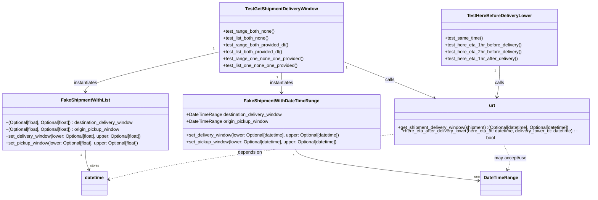

# Diagram: shipment_core/shipment_service/shipment_service/update_route_timing/tests/test_update_route_timing_util_functions.py

> Auto-generated by Obscura crawlers

## Mermaid

### SVG

<svg id="container" width="2110.625" xmlns="http://www.w3.org/2000/svg" class="classDiagram" height="692" viewBox="0 0 2110.625 692" role="graphics-document document" aria-roledescription="class"><g><defs><marker id="container_class-aggregationStart" class="marker aggregation class" refX="18" refY="7" markerWidth="190" markerHeight="240" orient="auto"><path d="M 18,7 L9,13 L1,7 L9,1 Z"></path></marker></defs><defs><marker id="container_class-aggregationEnd" class="marker aggregation class" refX="1" refY="7" markerWidth="20" markerHeight="28" orient="auto"><path d="M 18,7 L9,13 L1,7 L9,1 Z"></path></marker></defs><defs><marker id="container_class-extensionStart" class="marker extension class" refX="18" refY="7" markerWidth="190" markerHeight="240" orient="auto"><path d="M 1,7 L18,13 V 1 Z"></path></marker></defs><defs><marker id="container_class-extensionEnd" class="marker extension class" refX="1" refY="7" markerWidth="20" markerHeight="28" orient="auto"><path d="M 1,1 V 13 L18,7 Z"></path></marker></defs><defs><marker id="container_class-compositionStart" class="marker composition class" refX="18" refY="7" markerWidth="190" markerHeight="240" orient="auto"><path d="M 18,7 L9,13 L1,7 L9,1 Z"></path></marker></defs><defs><marker id="container_class-compositionEnd" class="marker composition class" refX="1" refY="7" markerWidth="20" markerHeight="28" orient="auto"><path d="M 18,7 L9,13 L1,7 L9,1 Z"></path></marker></defs><defs><marker id="container_class-dependencyStart" class="marker dependency class" refX="6" refY="7" markerWidth="190" markerHeight="240" orient="auto"><path d="M 5,7 L9,13 L1,7 L9,1 Z"></path></marker></defs><defs><marker id="container_class-dependencyEnd" class="marker dependency class" refX="13" refY="7" markerWidth="20" markerHeight="28" orient="auto"><path d="M 18,7 L9,13 L14,7 L9,1 Z"></path></marker></defs><defs><marker id="container_class-lollipopStart" class="marker lollipop class" refX="13" refY="7" markerWidth="190" markerHeight="240" orient="auto"><circle stroke="black" fill="transparent" cx="7" cy="7" r="6"></circle></marker></defs><defs><marker id="container_class-lollipopEnd" class="marker lollipop class" refX="1" refY="7" markerWidth="190" markerHeight="240" orient="auto"><circle stroke="black" fill="transparent" cx="7" cy="7" r="6"></circle></marker></defs><g class="root"><g class="clusters"></g><g class="edgePaths"><path d="M1055.67,523L1059.113,529.667C1062.555,536.333,1069.44,549.667,1178.784,568.108C1288.128,586.55,1499.932,610.1,1605.834,621.875L1711.736,633.65" id="id_FakeShipmentWithDateTimeRange_DateTimeRange_1" class="edge-thickness-normal edge-pattern-solid relation" style=";;;" data-edge="true" data-et="edge" data-id="id_FakeShipmentWithDateTimeRange_DateTimeRange_1" data-points="W3sieCI6MTA1NS42NzA0OTYzMjM1Mjk1LCJ5Ijo1MjN9LHsieCI6MTA3Ni4zMjQyMTg3NSwieSI6NTYzfSx7IngiOjE3MTcuNjk5MjE4NzUsInkiOjYzNC4zMTMyNTUyNjQxNzA2fV0=" marker-end="url(#container_class-dependencyEnd)"></path><path d="M306.055,526L306.055,532.167C306.055,538.333,306.055,550.667,308.141,562.071C310.228,573.475,314.401,583.951,316.488,589.188L318.574,594.426" id="id_FakeShipmentWithList_datetime_2" class="edge-thickness-normal edge-pattern-solid relation" style=";;;" data-edge="true" data-et="edge" data-id="id_FakeShipmentWithList_datetime_2" data-points="W3sieCI6MzA2LjA1NDY4NzUsInkiOjUyNn0seyJ4IjozMDYuMDU0Njg3NSwieSI6NTYzfSx7IngiOjMyMC43OTUwNDU0OTA1MDYzLCJ5Ijo2MDB9XQ==" marker-end="url(#container_class-dependencyEnd)"></path><path d="M1220.379,213.751L1253.717,226.626C1287.056,239.501,1353.733,265.25,1411.184,287.916C1468.635,310.581,1516.86,330.162,1540.973,339.952L1565.086,349.743" id="id_TestGetShipmentDeliveryWindow_urt_3" class="edge-thickness-normal edge-pattern-solid relation" style=";;;" data-edge="true" data-et="edge" data-id="id_TestGetShipmentDeliveryWindow_urt_3" data-points="W3sieCI6MTIyMC4zNzg5MDYyNSwieSI6MjEzLjc1MDgxNzkxMDExMDAyfSx7IngiOjE0MjAuNDEwMTU2MjUsInkiOjI5MX0seyJ4IjoxNTcwLjY0NDczMjMwNjk4NTQsInkiOjM1Mn1d" marker-end="url(#container_class-dependencyEnd)"></path><path d="M1006.102,254L1006.102,260.167C1006.102,266.333,1006.102,278.667,1006.102,290.5C1006.102,302.333,1006.102,313.667,1006.102,319.333L1006.102,325" id="id_TestGetShipmentDeliveryWindow_FakeShipmentWithDateTimeRange_4" class="edge-thickness-normal edge-pattern-solid relation" style=";;;" data-edge="true" data-et="edge" data-id="id_TestGetShipmentDeliveryWindow_FakeShipmentWithDateTimeRange_4" data-points="W3sieCI6MTAwNi4xMDE1NjI1LCJ5IjoyNTR9LHsieCI6MTAwNi4xMDE1NjI1LCJ5IjoyOTF9LHsieCI6MTAwNi4xMDE1NjI1LCJ5IjozMzF9XQ==" marker-end="url(#container_class-dependencyEnd)"></path><path d="M791.824,179.974L710.863,198.479C629.901,216.983,467.978,253.991,387.016,277.662C306.055,301.333,306.055,311.667,306.055,316.833L306.055,322" id="id_TestGetShipmentDeliveryWindow_FakeShipmentWithList_5" class="edge-thickness-normal edge-pattern-solid relation" style=";;;" data-edge="true" data-et="edge" data-id="id_TestGetShipmentDeliveryWindow_FakeShipmentWithList_5" data-points="W3sieCI6NzkxLjgyNDIxODc1LCJ5IjoxNzkuOTc0Mzk5MDM1Nzc4ODR9LHsieCI6MzA2LjA1NDY4NzUsInkiOjI5MX0seyJ4IjozMDYuMDU0Njg3NSwieSI6MzI4fV0=" marker-end="url(#container_class-dependencyEnd)"></path><path d="M1781.805,230L1781.805,240.167C1781.805,250.333,1781.805,270.667,1780.019,290.018C1778.233,309.37,1774.661,327.74,1772.874,336.925L1771.088,346.11" id="id_TestHereBeforeDeliveryLower_urt_6" class="edge-thickness-normal edge-pattern-solid relation" style=";;;" data-edge="true" data-et="edge" data-id="id_TestHereBeforeDeliveryLower_urt_6" data-points="W3sieCI6MTc4MS44MDQ2ODc1LCJ5IjoyMzB9LHsieCI6MTc4MS44MDQ2ODc1LCJ5IjoyOTF9LHsieCI6MTc2OS45NDMxODcwNDA0NDEyLCJ5IjozNTJ9XQ==" marker-end="url(#container_class-dependencyEnd)"></path><path d="M1408.094,469.963L1282.758,485.469C1157.422,500.975,906.75,531.988,736.805,558.557C566.859,585.126,477.64,607.252,433.031,618.315L388.421,629.378" id="id_urt_datetime_7" class="edge-thickness-normal edge-pattern-dashed relation" style=";;;" data-edge="true" data-et="edge" data-id="id_urt_datetime_7" data-points="W3sieCI6MTQwOC4wOTM3NSwieSI6NDY5Ljk2MjczMTMzMDEzMDV9LHsieCI6NjU2LjA3ODEyNSwieSI6NTYzfSx7IngiOjM4Mi41OTc2NTYyNSwieSI6NjMwLjgyMjY0NjUwNzAwOH1d" marker-end="url(#container_class-dependencyEnd)"></path><path d="M1794.085,502L1799.335,512.167C1804.584,522.333,1815.083,542.667,1817.748,558.102C1820.413,573.538,1815.244,584.075,1812.66,589.344L1810.076,594.613" id="id_urt_DateTimeRange_8" class="edge-thickness-normal edge-pattern-dashed relation" style=";;;" data-edge="true" data-et="edge" data-id="id_urt_DateTimeRange_8" data-points="W3sieCI6MTc5NC4wODUxMDQ1NDk2MzI0LCJ5Ijo1MDJ9LHsieCI6MTgyNS41ODIwMzEyNSwieSI6NTYzfSx7IngiOjE4MDcuNDMzMjk3MDcyNzg0OSwieSI6NjAwfV0=" marker-end="url(#container_class-dependencyEnd)"></path></g><g class="edgeLabels"><g class="edgeLabel"><g class="label" data-id="id_FakeShipmentWithDateTimeRange_DateTimeRange_1" transform="translate(0, 0)"><foreignObject width="0" height="0">

</foreignObject></g></g><g class="edgeLabel"><g class="label" data-id="id_FakeShipmentWithList_datetime_2" transform="translate(0, 0)"><foreignObject width="0" height="0">

</foreignObject></g></g><g class="edgeLabel" transform="translate(1396.02395, 281.5824)"><g class="label" data-id="id_TestGetShipmentDeliveryWindow_urt_3" transform="translate(-16.4453125, -12)"><foreignObject width="32.890625" height="24">

calls

</foreignObject></g></g><g class="edgeLabel" transform="translate(1006.1015625, 291)"><g class="label" data-id="id_TestGetShipmentDeliveryWindow_FakeShipmentWithDateTimeRange_4" transform="translate(-42.9140625, -12)"><foreignObject width="85.828125" height="24">

instantiates

</foreignObject></g></g><g class="edgeLabel" transform="translate(306.0546875, 291)"><g class="label" data-id="id_TestGetShipmentDeliveryWindow_FakeShipmentWithList_5" transform="translate(-42.9140625, -12)"><foreignObject width="85.828125" height="24">

instantiates

</foreignObject></g></g><g class="edgeLabel" transform="translate(1781.8046875, 291)"><g class="label" data-id="id_TestHereBeforeDeliveryLower_urt_6" transform="translate(-16.4453125, -12)"><foreignObject width="32.890625" height="24">

calls

</foreignObject></g></g><g class="edgeLabel" transform="translate(892.26942, 533.77907)"><g class="label" data-id="id_urt_datetime_7" transform="translate(-42.9453125, -12)"><foreignObject width="85.890625" height="24">

depends on

</foreignObject></g></g><g class="edgeLabel" transform="translate(1819.28731, 550.80904)"><g class="label" data-id="id_urt_DateTimeRange_8" transform="translate(-57.5, -12)"><foreignObject width="115" height="24">

may accept/use

</foreignObject></g></g><g class="edgeTerminals" transform="translate(1050.3712253449619, 545.4313997807601)"><g class="inner" transform="translate(0, 0)"><foreignObject style="width: 9px; height: 12px;">
1
</foreignObject></g></g><g class="edgeTerminals" transform="translate(291.05468875, 543.5000010714285)"><g class="inner" transform="translate(0, 0)"><foreignObject style="width: 9px; height: 12px;">
1
</foreignObject></g></g><g class="edgeTerminals" transform="translate(1231.300034156328, 234.0480842715647)"><g class="inner" transform="translate(0, 0)"><foreignObject style="width: 9px; height: 12px;">
1
</foreignObject></g></g><g class="edgeTerminals" transform="translate(991.10156125, 271.4999989285714)"><g class="inner" transform="translate(0, 0)"><foreignObject style="width: 9px; height: 12px;">
1
</foreignObject></g></g><g class="edgeTerminals" transform="translate(771.4219801486354, 169.2506582818166)"><g class="inner" transform="translate(0, 0)"><foreignObject style="width: 9px; height: 12px;">
1
</foreignObject></g></g><g class="edgeTerminals" transform="translate(1766.80468875, 247.50000107142856)"><g class="inner" transform="translate(0, 0)"><foreignObject style="width: 9px; height: 12px;">
1
</foreignObject></g></g><g class="edgeTerminals" transform="translate(1696.9640044092773, 612.4712524491838)"><g class="inner" transform="translate(0, 0)"></g><foreignObject style="width: 36px; height: 12px;">
uses
</foreignObject></g><g class="edgeTerminals" transform="translate(323.2531909260959, 573.1911459442363)"><g class="inner" transform="translate(0, 0)"></g><foreignObject style="width: 54px; height: 12px;">
stores
</foreignObject></g></g><g class="nodes"><g class="node default" id="classId-FakeShipmentWithDateTimeRange-0" transform="translate(1006.1015625, 427)"><g class="basic label-container"><path d="M-351.9921875 -96 L351.9921875 -96 L351.9921875 96 L-351.9921875 96" stroke="none" stroke-width="0" fill="#ECECFF" style=""></path><path d="M-351.9921875 -96 C-75.11797765367584 -96, 201.75623219264833 -96, 351.9921875 -96 M-351.9921875 -96 C-122.38952651258927 -96, 107.21313447482146 -96, 351.9921875 -96 M351.9921875 -96 C351.9921875 -34.44515554157227, 351.9921875 27.10968891685546, 351.9921875 96 M351.9921875 -96 C351.9921875 -25.091661389497858, 351.9921875 45.816677221004284, 351.9921875 96 M351.9921875 96 C130.68719160146367 96, -90.61780429707267 96, -351.9921875 96 M351.9921875 96 C183.85435491084237 96, 15.71652232168475 96, -351.9921875 96 M-351.9921875 96 C-351.9921875 21.21535611607632, -351.9921875 -53.56928776784736, -351.9921875 -96 M-351.9921875 96 C-351.9921875 32.148911798310465, -351.9921875 -31.70217640337907, -351.9921875 -96" stroke="#9370DB" stroke-width="1.3" fill="none" stroke-dasharray="0 0" style=""></path></g><g class="annotation-group text" transform="translate(0, -72)"></g><g class="label-group text" transform="translate(-125.5, -72)"><g class="label" style="font-weight: bolder" transform="translate(0,-12)"><foreignObject width="251" height="24">

FakeShipmentWithDateTimeRange

</foreignObject></g></g><g class="members-group text" transform="translate(-339.9921875, -24)"><g class="label" style="" transform="translate(0,-12)"><foreignObject width="337.40625" height="24">

+DateTimeRange destination_delivery_window

</foreignObject></g><g class="label" style="" transform="translate(0,12)"><foreignObject width="287.484375" height="24">

+DateTimeRange origin_pickup_window

</foreignObject></g></g><g class="methods-group text" transform="translate(-339.9921875, 48)"><g class="label" style="" transform="translate(0,-12)"><foreignObject width="554.484375" height="24">

+set_delivery_window(lower: Optional[datetime], upper: Optional[datetime])

</foreignObject></g><g class="label" style="" transform="translate(0,12)"><foreignObject width="545.46875" height="24">

+set_pickup_window(lower: Optional[datetime], upper: Optional[datetime])

</foreignObject></g></g><g class="divider" style=""><path d="M-351.9921875 -48 C-76.59703378357136 -48, 198.79811993285728 -48, 351.9921875 -48 M-351.9921875 -48 C-115.65034503690077 -48, 120.69149742619845 -48, 351.9921875 -48" stroke="#9370DB" stroke-width="1.3" fill="none" stroke-dasharray="0 0" style=""></path></g><g class="divider" style=""><path d="M-351.9921875 24 C-164.24417785772314 24, 23.50383178455371 24, 351.9921875 24 M-351.9921875 24 C-190.46671546053383 24, -28.941243421067668 24, 351.9921875 24" stroke="#9370DB" stroke-width="1.3" fill="none" stroke-dasharray="0 0" style=""></path></g></g><g class="node default" id="classId-FakeShipmentWithList-1" transform="translate(306.0546875, 427)"><g class="basic label-container"><path d="M-298.0546875 -99 L298.0546875 -99 L298.0546875 99 L-298.0546875 99" stroke="none" stroke-width="0" fill="#ECECFF" style=""></path><path d="M-298.0546875 -99 C-84.18931603214668 -99, 129.67605543570664 -99, 298.0546875 -99 M-298.0546875 -99 C-93.80386842237502 -99, 110.44695065524996 -99, 298.0546875 -99 M298.0546875 -99 C298.0546875 -44.55345268941233, 298.0546875 9.893094621175337, 298.0546875 99 M298.0546875 -99 C298.0546875 -20.467422895561967, 298.0546875 58.065154208876066, 298.0546875 99 M298.0546875 99 C172.5324560870219 99, 47.010224674043826 99, -298.0546875 99 M298.0546875 99 C132.35015340327104 99, -33.35438069345793 99, -298.0546875 99 M-298.0546875 99 C-298.0546875 36.66812164401054, -298.0546875 -25.66375671197892, -298.0546875 -99 M-298.0546875 99 C-298.0546875 31.078004211640874, -298.0546875 -36.84399157671825, -298.0546875 -99" stroke="#9370DB" stroke-width="1.3" fill="none" stroke-dasharray="0 0" style=""></path></g><g class="annotation-group text" transform="translate(0, -75)"></g><g class="label-group text" transform="translate(-81.6875, -75)"><g class="label" style="font-weight: bolder" transform="translate(0,-12)"><foreignObject width="163.375" height="24">

FakeShipmentWithList

</foreignObject></g></g><g class="members-group text" transform="translate(-286.0546875, -27)"></g><g class="methods-group text" transform="translate(-286.0546875, 3)"><g class="label" style="" transform="translate(0,-12)"><foreignObject width="463.890625" height="24">

+(Optional[float], Optional[float]) : destination_delivery_window

</foreignObject></g><g class="label" style="" transform="translate(0,12)"><foreignObject width="413.984375" height="24">

+(Optional[float], Optional[float]) : origin_pickup_window

</foreignObject></g><g class="label" style="" transform="translate(0,36)"><foreignObject width="490.421875" height="24">

+set_delivery_window(lower: Optional[float], upper: Optional[float])

</foreignObject></g><g class="label" style="" transform="translate(0,60)"><foreignObject width="481.40625" height="24">

+set_pickup_window(lower: Optional[float], upper: Optional[float])

</foreignObject></g></g><g class="divider" style=""><path d="M-298.0546875 -51 C-124.79432916423448 -51, 48.466029171531034 -51, 298.0546875 -51 M-298.0546875 -51 C-160.9031678169839 -51, -23.75164813396782 -51, 298.0546875 -51" stroke="#9370DB" stroke-width="1.3" fill="none" stroke-dasharray="0 0" style=""></path></g><g class="divider" style=""><path d="M-298.0546875 -27 C-70.43018753941269 -27, 157.19431242117463 -27, 298.0546875 -27 M-298.0546875 -27 C-162.26857981990133 -27, -26.482472139802667 -27, 298.0546875 -27" stroke="#9370DB" stroke-width="1.3" fill="none" stroke-dasharray="0 0" style=""></path></g></g><g class="node default" id="classId-urt-2" transform="translate(1755.359375, 427)"><g class="basic label-container"><path d="M-347.265625 -75 L347.265625 -75 L347.265625 75 L-347.265625 75" stroke="none" stroke-width="0" fill="#ECECFF" style=""></path><path d="M-347.265625 -75 C-197.32844169190665 -75, -47.391258383813295 -75, 347.265625 -75 M-347.265625 -75 C-128.071714911965 -75, 91.12219517607002 -75, 347.265625 -75 M347.265625 -75 C347.265625 -21.266413827455196, 347.265625 32.46717234508961, 347.265625 75 M347.265625 -75 C347.265625 -30.878414188316462, 347.265625 13.243171623367076, 347.265625 75 M347.265625 75 C119.4743105806638 75, -108.3170038386724 75, -347.265625 75 M347.265625 75 C151.61099881791435 75, -44.0436273641713 75, -347.265625 75 M-347.265625 75 C-347.265625 28.372832311676078, -347.265625 -18.254335376647845, -347.265625 -75 M-347.265625 75 C-347.265625 34.06665756407006, -347.265625 -6.866684871859874, -347.265625 -75" stroke="#9370DB" stroke-width="1.3" fill="none" stroke-dasharray="0 0" style=""></path></g><g class="annotation-group text" transform="translate(0, -51)"></g><g class="label-group text" transform="translate(-10.875, -51)"><g class="label" style="font-weight: bolder" transform="translate(0,-12)"><foreignObject width="21.75" height="24">

urt

</foreignObject></g></g><g class="members-group text" transform="translate(-335.265625, -3)"></g><g class="methods-group text" transform="translate(-335.265625, 27)"><g class="label" style="" transform="translate(0,-12)"><foreignObject width="618.734375" height="24">

+get_shipment_delivery_window(shipment) :(Optional[datetime], Optional[datetime])

</foreignObject></g><g class="label" style="" transform="translate(0,12)"><foreignObject width="659.65625" height="24">

+here_eta_after_delivery_lower(here_eta_dt: datetime, delivery_lower_dt: datetime) : : bool

</foreignObject></g></g><g class="divider" style=""><path d="M-347.265625 -27 C-127.30651733767118 -27, 92.65259032465764 -27, 347.265625 -27 M-347.265625 -27 C-119.19597611327333 -27, 108.87367277345334 -27, 347.265625 -27" stroke="#9370DB" stroke-width="1.3" fill="none" stroke-dasharray="0 0" style=""></path></g><g class="divider" style=""><path d="M-347.265625 -3 C-152.85946352897827 -3, 41.546697942043465 -3, 347.265625 -3 M-347.265625 -3 C-201.35938983258245 -3, -55.4531546651649 -3, 347.265625 -3" stroke="#9370DB" stroke-width="1.3" fill="none" stroke-dasharray="0 0" style=""></path></g></g><g class="node default" id="classId-TestGetShipmentDeliveryWindow-3" transform="translate(1006.1015625, 131)"><g class="basic label-container"><path d="M-214.27734375 -123 L214.27734375 -123 L214.27734375 123 L-214.27734375 123" stroke="none" stroke-width="0" fill="#ECECFF" style=""></path><path d="M-214.27734375 -123 C-81.72611620477824 -123, 50.82511134044353 -123, 214.27734375 -123 M-214.27734375 -123 C-115.54493245510817 -123, -16.812521160216335 -123, 214.27734375 -123 M214.27734375 -123 C214.27734375 -49.33864234589427, 214.27734375 24.322715308211457, 214.27734375 123 M214.27734375 -123 C214.27734375 -35.979709776364245, 214.27734375 51.04058044727151, 214.27734375 123 M214.27734375 123 C116.40712503664736 123, 18.536906323294716 123, -214.27734375 123 M214.27734375 123 C83.35682979278667 123, -47.56368416442666 123, -214.27734375 123 M-214.27734375 123 C-214.27734375 63.787256544206635, -214.27734375 4.574513088413269, -214.27734375 -123 M-214.27734375 123 C-214.27734375 27.86561563725155, -214.27734375 -67.2687687254969, -214.27734375 -123" stroke="#9370DB" stroke-width="1.3" fill="none" stroke-dasharray="0 0" style=""></path></g><g class="annotation-group text" transform="translate(0, -99)"></g><g class="label-group text" transform="translate(-122.1953125, -99)"><g class="label" style="font-weight: bolder" transform="translate(0,-12)"><foreignObject width="244.390625" height="24">

TestGetShipmentDeliveryWindow

</foreignObject></g></g><g class="members-group text" transform="translate(-202.27734375, -51)"></g><g class="methods-group text" transform="translate(-202.27734375, -21)"><g class="label" style="" transform="translate(0,-12)"><foreignObject width="181.71875" height="24">

+test_range_both_none()

</foreignObject></g><g class="label" style="" transform="translate(0,12)"><foreignObject width="163.84375" height="24">

+test_list_both_none()

</foreignObject></g><g class="label" style="" transform="translate(0,36)"><foreignObject width="232.96875" height="24">

+test_range_both_provided_dt()

</foreignObject></g><g class="label" style="" transform="translate(0,60)"><foreignObject width="215.09375" height="24">

+test_list_both_provided_dt()

</foreignObject></g><g class="label" style="" transform="translate(0,84)"><foreignObject width="282.359375" height="24">

+test_range_one_none_one_provided()

</foreignObject></g><g class="label" style="" transform="translate(0,108)"><foreignObject width="264.484375" height="24">

+test_list_one_none_one_provided()

</foreignObject></g></g><g class="divider" style=""><path d="M-214.27734375 -75 C-66.89502495262576 -75, 80.48729384474848 -75, 214.27734375 -75 M-214.27734375 -75 C-121.67682778891607 -75, -29.076311827832143 -75, 214.27734375 -75" stroke="#9370DB" stroke-width="1.3" fill="none" stroke-dasharray="0 0" style=""></path></g><g class="divider" style=""><path d="M-214.27734375 -51 C-92.0097877369174 -51, 30.257768276165194 -51, 214.27734375 -51 M-214.27734375 -51 C-71.87679129669309 -51, 70.52376115661383 -51, 214.27734375 -51" stroke="#9370DB" stroke-width="1.3" fill="none" stroke-dasharray="0 0" style=""></path></g></g><g class="node default" id="classId-TestHereBeforeDeliveryLower-4" transform="translate(1781.8046875, 131)"><g class="basic label-container"><path d="M-200.9765625 -99 L200.9765625 -99 L200.9765625 99 L-200.9765625 99" stroke="none" stroke-width="0" fill="#ECECFF" style=""></path><path d="M-200.9765625 -99 C-108.31521247662698 -99, -15.653862453253964 -99, 200.9765625 -99 M-200.9765625 -99 C-57.157221761497254 -99, 86.66211897700549 -99, 200.9765625 -99 M200.9765625 -99 C200.9765625 -49.33274085448622, 200.9765625 0.3345182910275639, 200.9765625 99 M200.9765625 -99 C200.9765625 -23.092763239116394, 200.9765625 52.81447352176721, 200.9765625 99 M200.9765625 99 C106.62219513861542 99, 12.267827777230849 99, -200.9765625 99 M200.9765625 99 C99.40616007705468 99, -2.164242345890642 99, -200.9765625 99 M-200.9765625 99 C-200.9765625 48.11430607732997, -200.9765625 -2.771387845340058, -200.9765625 -99 M-200.9765625 99 C-200.9765625 46.535212906511454, -200.9765625 -5.929574186977092, -200.9765625 -99" stroke="#9370DB" stroke-width="1.3" fill="none" stroke-dasharray="0 0" style=""></path></g><g class="annotation-group text" transform="translate(0, -75)"></g><g class="label-group text" transform="translate(-108.8125, -75)"><g class="label" style="font-weight: bolder" transform="translate(0,-12)"><foreignObject width="217.625" height="24">

TestHereBeforeDeliveryLower

</foreignObject></g></g><g class="members-group text" transform="translate(-188.9765625, -27)"></g><g class="methods-group text" transform="translate(-188.9765625, 3)"><g class="label" style="" transform="translate(0,-12)"><foreignObject width="132.953125" height="24">

+test_same_time()

</foreignObject></g><g class="label" style="" transform="translate(0,12)"><foreignObject width="266.546875" height="24">

+test_here_eta_1hr_before_delivery()

</foreignObject></g><g class="label" style="" transform="translate(0,36)"><foreignObject width="269.140625" height="24">

+test_here_eta_2hr_before_delivery()

</foreignObject></g><g class="label" style="" transform="translate(0,60)"><foreignObject width="252.578125" height="24">

+test_here_eta_1hr_after_delivery()

</foreignObject></g></g><g class="divider" style=""><path d="M-200.9765625 -51 C-107.66878467873434 -51, -14.36100685746868 -51, 200.9765625 -51 M-200.9765625 -51 C-48.55091706661884 -51, 103.87472836676233 -51, 200.9765625 -51" stroke="#9370DB" stroke-width="1.3" fill="none" stroke-dasharray="0 0" style=""></path></g><g class="divider" style=""><path d="M-200.9765625 -27 C-70.52025111268958 -27, 59.93606027462084 -27, 200.9765625 -27 M-200.9765625 -27 C-85.68078958285177 -27, 29.614983334296454 -27, 200.9765625 -27" stroke="#9370DB" stroke-width="1.3" fill="none" stroke-dasharray="0 0" style=""></path></g></g><g class="node default" id="classId-DateTimeRange-5" transform="translate(1786.83203125, 642)"><g class="basic label-container"><path d="M-69.1328125 -42 L69.1328125 -42 L69.1328125 42 L-69.1328125 42" stroke="none" stroke-width="0" fill="#ECECFF" style=""></path><path d="M-69.1328125 -42 C-17.912885452327153 -42, 33.307041595345694 -42, 69.1328125 -42 M-69.1328125 -42 C-20.061363445999326 -42, 29.010085608001347 -42, 69.1328125 -42 M69.1328125 -42 C69.1328125 -10.91219610324453, 69.1328125 20.17560779351094, 69.1328125 42 M69.1328125 -42 C69.1328125 -24.74704400702363, 69.1328125 -7.494088014047257, 69.1328125 42 M69.1328125 42 C17.454969488224748 42, -34.222873523550504 42, -69.1328125 42 M69.1328125 42 C41.35777486828751 42, 13.582737236575014 42, -69.1328125 42 M-69.1328125 42 C-69.1328125 16.23758950083117, -69.1328125 -9.52482099833766, -69.1328125 -42 M-69.1328125 42 C-69.1328125 15.942426067687492, -69.1328125 -10.115147864625015, -69.1328125 -42" stroke="#9370DB" stroke-width="1.3" fill="none" stroke-dasharray="0 0" style=""></path></g><g class="annotation-group text" transform="translate(0, -18)"></g><g class="label-group text" transform="translate(-57.1328125, -18)"><g class="label" style="font-weight: bolder" transform="translate(0,-12)"><foreignObject width="114.265625" height="24">

DateTimeRange

</foreignObject></g></g><g class="members-group text" transform="translate(-57.1328125, 30)"></g><g class="methods-group text" transform="translate(-57.1328125, 60)"></g><g class="divider" style=""><path d="M-69.1328125 6 C-31.40322622587005 6, 6.3263600482599 6, 69.1328125 6 M-69.1328125 6 C-34.88670098162806 6, -0.64058946325612 6, 69.1328125 6" stroke="#9370DB" stroke-width="1.3" fill="none" stroke-dasharray="0 0" style=""></path></g><g class="divider" style=""><path d="M-69.1328125 24 C-37.06884468527304 24, -5.004876870546084 24, 69.1328125 24 M-69.1328125 24 C-39.08014430699748 24, -9.027476113994958 24, 69.1328125 24" stroke="#9370DB" stroke-width="1.3" fill="none" stroke-dasharray="0 0" style=""></path></g></g><g class="node default" id="classId-datetime-6" transform="translate(337.52734375, 642)"><g class="basic label-container"><path d="M-45.0703125 -42 L45.0703125 -42 L45.0703125 42 L-45.0703125 42" stroke="none" stroke-width="0" fill="#ECECFF" style=""></path><path d="M-45.0703125 -42 C-25.860717971360337 -42, -6.6511234427206745 -42, 45.0703125 -42 M-45.0703125 -42 C-15.896796583502436 -42, 13.276719332995128 -42, 45.0703125 -42 M45.0703125 -42 C45.0703125 -12.053221224140941, 45.0703125 17.893557551718118, 45.0703125 42 M45.0703125 -42 C45.0703125 -12.408596752064234, 45.0703125 17.18280649587153, 45.0703125 42 M45.0703125 42 C15.130244400173193 42, -14.809823699653613 42, -45.0703125 42 M45.0703125 42 C25.16813526033438 42, 5.265958020668762 42, -45.0703125 42 M-45.0703125 42 C-45.0703125 12.044332609040708, -45.0703125 -17.911334781918583, -45.0703125 -42 M-45.0703125 42 C-45.0703125 21.62611406076201, -45.0703125 1.2522281215240199, -45.0703125 -42" stroke="#9370DB" stroke-width="1.3" fill="none" stroke-dasharray="0 0" style=""></path></g><g class="annotation-group text" transform="translate(0, -18)"></g><g class="label-group text" transform="translate(-33.0703125, -18)"><g class="label" style="font-weight: bolder" transform="translate(0,-12)"><foreignObject width="66.140625" height="24">

datetime

</foreignObject></g></g><g class="members-group text" transform="translate(-33.0703125, 30)"></g><g class="methods-group text" transform="translate(-33.0703125, 60)"></g><g class="divider" style=""><path d="M-45.0703125 6 C-9.061095392056451 6, 26.948121715887098 6, 45.0703125 6 M-45.0703125 6 C-22.535687051964473 6, -0.0010616039289459422 6, 45.0703125 6" stroke="#9370DB" stroke-width="1.3" fill="none" stroke-dasharray="0 0" style=""></path></g><g class="divider" style=""><path d="M-45.0703125 24 C-24.602144123971673 24, -4.133975747943346 24, 45.0703125 24 M-45.0703125 24 C-21.821973389673094 24, 1.4263657206538127 24, 45.0703125 24" stroke="#9370DB" stroke-width="1.3" fill="none" stroke-dasharray="0 0" style=""></path></g></g></g></g></g></svg>
