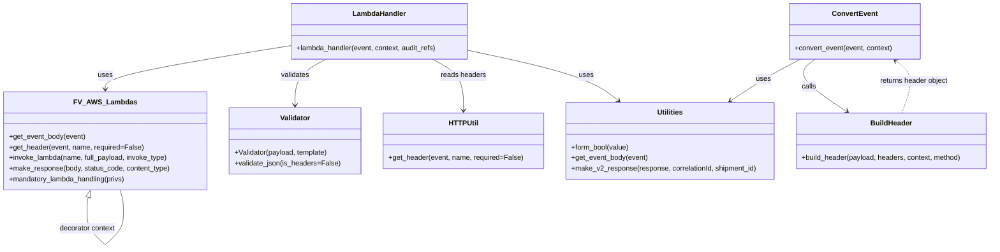

# Diagram: shipment_core/shipment_service/shipment_service/v2/patch_shipment.py


> Auto-generated by Obscura crawlers

## Diagram 1

```mermaid
flowchart TD
    A[lambda_handler(event, context, audit_refs)] --> B{get header "X-WSS-fvShipmentId" present?}
    B -- yes --> C[update audit_refs with Searchable_Ids.SHIPMENT_ID]
    B -- no --> D[continue]
    A --> E[get_event_body(event) -> event_body]
    E --> F[Validator(event_body, v2_patch_shipment_template) -> validate_json()]
    F -- invalid --> G[raise fv.error.BadRequestError]
    F -- valid --> H[Validator(event["headers"], v2_headers_template) -> validate_json(is_headers=True)]
    H -- invalid --> G
    H -- valid --> I[convert_event(event, context) -> new_event]
    I --> J[header = new_event.body.tender.header]
    A --> K[is_async = utilities.form_bool(get_header "fv-async")]
    K -- true --> L[invoke_type = "Event"]
    K -- false --> M[invoke_type = "RequestResponse"]
    L --> N[invoke proxy_shipments with full_payload=new_event, invoke_type=Event]
    M --> O[invoke proxy_shipments with full_payload=new_event, invoke_type=RequestResponse]
    N --> P[return 202 Accepted via make_response]
    O --> Q[correlationId = header.message_id; shipment_id = get_header "X-WSS-fvShipmentId"; return utilities.make_v2_response(response, correlationId, shipment_id)]
    G --> R[exception handler: if e.http_status >=500 then make_error_response(event, context, error=e)]
    R --> S[raise fv.error.HandledException(message, client_message, http_status=400)]
```

> SVG rendering failed for this diagram.

## Diagram 2



### SVG

<svg id="container" width="2235.4609375" xmlns="http://www.w3.org/2000/svg" class="classDiagram" height="562.25" viewBox="0 0 2235.4609375 562.25" role="graphics-document document" aria-roledescription="class"><style>#container{font-family:"trebuchet ms",verdana,arial,sans-serif;font-size:16px;fill:#333;}@keyframes edge-animation-frame{from{stroke-dashoffset:0;}}@keyframes dash{to{stroke-dashoffset:0;}}#container .edge-animation-slow{stroke-dasharray:9,5!important;stroke-dashoffset:900;animation:dash 50s linear infinite;stroke-linecap:round;}#container .edge-animation-fast{stroke-dasharray:9,5!important;stroke-dashoffset:900;animation:dash 20s linear infinite;stroke-linecap:round;}#container .error-icon{fill:#552222;}#container .error-text{fill:#552222;stroke:#552222;}#container .edge-thickness-normal{stroke-width:1px;}#container .edge-thickness-thick{stroke-width:3.5px;}#container .edge-pattern-solid{stroke-dasharray:0;}#container .edge-thickness-invisible{stroke-width:0;fill:none;}#container .edge-pattern-dashed{stroke-dasharray:3;}#container .edge-pattern-dotted{stroke-dasharray:2;}#container .marker{fill:#333333;stroke:#333333;}#container .marker.cross{stroke:#333333;}#container svg{font-family:"trebuchet ms",verdana,arial,sans-serif;font-size:16px;}#container p{margin:0;}#container g.classGroup text{fill:#9370DB;stroke:none;font-family:"trebuchet ms",verdana,arial,sans-serif;font-size:10px;}#container g.classGroup text .title{font-weight:bolder;}#container .nodeLabel,#container .edgeLabel{color:#131300;}#container .edgeLabel .label rect{fill:#ECECFF;}#container .label text{fill:#131300;}#container .labelBkg{background:#ECECFF;}#container .edgeLabel .label span{background:#ECECFF;}#container .classTitle{font-weight:bolder;}#container .node rect,#container .node circle,#container .node ellipse,#container .node polygon,#container .node path{fill:#ECECFF;stroke:#9370DB;stroke-width:1px;}#container .divider{stroke:#9370DB;stroke-width:1;}#container g.clickable{cursor:pointer;}#container g.classGroup rect{fill:#ECECFF;stroke:#9370DB;}#container g.classGroup line{stroke:#9370DB;stroke-width:1;}#container .classLabel .box{stroke:none;stroke-width:0;fill:#ECECFF;opacity:0.5;}#container .classLabel .label{fill:#9370DB;font-size:10px;}#container .relation{stroke:#333333;stroke-width:1;fill:none;}#container .dashed-line{stroke-dasharray:3;}#container .dotted-line{stroke-dasharray:1 2;}#container #compositionStart,#container .composition{fill:#333333!important;stroke:#333333!important;stroke-width:1;}#container #compositionEnd,#container .composition{fill:#333333!important;stroke:#333333!important;stroke-width:1;}#container #dependencyStart,#container .dependency{fill:#333333!important;stroke:#333333!important;stroke-width:1;}#container #dependencyStart,#container .dependency{fill:#333333!important;stroke:#333333!important;stroke-width:1;}#container #extensionStart,#container .extension{fill:transparent!important;stroke:#333333!important;stroke-width:1;}#container #extensionEnd,#container .extension{fill:transparent!important;stroke:#333333!important;stroke-width:1;}#container #aggregationStart,#container .aggregation{fill:transparent!important;stroke:#333333!important;stroke-width:1;}#container #aggregationEnd,#container .aggregation{fill:transparent!important;stroke:#333333!important;stroke-width:1;}#container #lollipopStart,#container .lollipop{fill:#ECECFF!important;stroke:#333333!important;stroke-width:1;}#container #lollipopEnd,#container .lollipop{fill:#ECECFF!important;stroke:#333333!important;stroke-width:1;}#container .edgeTerminals{font-size:11px;line-height:initial;}#container .classTitleText{text-anchor:middle;font-size:18px;fill:#333;}#container .label-icon{display:inline-block;height:1em;overflow:visible;vertical-align:-0.125em;}#container .node .label-icon path{fill:currentColor;stroke:revert;stroke-width:revert;}#container :root{--mermaid-font-family:"trebuchet ms",verdana,arial,sans-serif;}</style><g><defs><marker id="container_class-aggregationStart" class="marker aggregation class" refX="18" refY="7" markerWidth="190" markerHeight="240" orient="auto"><path d="M 18,7 L9,13 L1,7 L9,1 Z"></path></marker></defs><defs><marker id="container_class-aggregationEnd" class="marker aggregation class" refX="1" refY="7" markerWidth="20" markerHeight="28" orient="auto"><path d="M 18,7 L9,13 L1,7 L9,1 Z"></path></marker></defs><defs><marker id="container_class-extensionStart" class="marker extension class" refX="18" refY="7" markerWidth="190" markerHeight="240" orient="auto"><path d="M 1,7 L18,13 V 1 Z"></path></marker></defs><defs><marker id="container_class-extensionEnd" class="marker extension class" refX="1" refY="7" markerWidth="20" markerHeight="28" orient="auto"><path d="M 1,1 V 13 L18,7 Z"></path></marker></defs><defs><marker id="container_class-compositionStart" class="marker composition class" refX="18" refY="7" markerWidth="190" markerHeight="240" orient="auto"><path d="M 18,7 L9,13 L1,7 L9,1 Z"></path></marker></defs><defs><marker id="container_class-compositionEnd" class="marker composition class" refX="1" refY="7" markerWidth="20" markerHeight="28" orient="auto"><path d="M 18,7 L9,13 L1,7 L9,1 Z"></path></marker></defs><defs><marker id="container_class-dependencyStart" class="marker dependency class" refX="6" refY="7" markerWidth="190" markerHeight="240" orient="auto"><path d="M 5,7 L9,13 L1,7 L9,1 Z"></path></marker></defs><defs><marker id="container_class-dependencyEnd" class="marker dependency class" refX="13" refY="7" markerWidth="20" markerHeight="28" orient="auto"><path d="M 18,7 L9,13 L14,7 L9,1 Z"></path></marker></defs><defs><marker id="container_class-lollipopStart" class="marker lollipop class" refX="13" refY="7" markerWidth="190" markerHeight="240" orient="auto"><circle stroke="black" fill="transparent" cx="7" cy="7" r="6"></circle></marker></defs><defs><marker id="container_class-lollipopEnd" class="marker lollipop class" refX="1" refY="7" markerWidth="190" markerHeight="240" orient="auto"><circle stroke="black" fill="transparent" cx="7" cy="7" r="6"></circle></marker></defs><g class="root"><g class="clusters"></g><g class="edgePaths"><path d="M647.012,103.915L578.412,115.096C509.813,126.277,372.613,148.638,304.014,164.986C235.414,181.333,235.414,191.667,235.414,196.833L235.414,202" id="id_LambdaHandler_FV_AWS_Lambdas_1" class="edge-thickness-normal edge-pattern-solid relation" style=";;;" data-edge="true" data-et="edge" data-id="id_LambdaHandler_FV_AWS_Lambdas_1" data-points="W3sieCI6NjQ3LjAxMTcxODc1LCJ5IjoxMDMuOTE1NDcwMjcxMDI3Mzd9LHsieCI6MjM1LjQxNDA2MjUsInkiOjE3MX0seyJ4IjoyMzUuNDE0MDYyNSwieSI6MjA4fV0=" marker-end="url(#container_class-dependencyEnd)"></path><path d="M730.173,134L718.545,140.167C706.917,146.333,683.662,158.667,672.034,176C660.406,193.333,660.406,215.667,660.406,226.833L660.406,238" id="id_LambdaHandler_Validator_2" class="edge-thickness-normal edge-pattern-solid relation" style=";;;" data-edge="true" data-et="edge" data-id="id_LambdaHandler_Validator_2" data-points="W3sieCI6NzMwLjE3MjkyOTY4NzUsInkiOjEzNH0seyJ4Ijo2NjAuNDA2MjUsInkiOjE3MX0seyJ4Ijo2NjAuNDA2MjUsInkiOjI0NH1d" marker-end="url(#container_class-dependencyEnd)"></path><path d="M967.757,134L979.385,140.167C991.012,146.333,1014.268,158.667,1025.896,178C1037.523,197.333,1037.523,223.667,1037.523,236.833L1037.523,250" id="id_LambdaHandler_HTTPUtil_3" class="edge-thickness-normal edge-pattern-solid relation" style=";;;" data-edge="true" data-et="edge" data-id="id_LambdaHandler_HTTPUtil_3" data-points="W3sieCI6OTY3Ljc1Njc1NzgxMjUsInkiOjEzNH0seyJ4IjoxMDM3LjUyMzQzNzUsInkiOjE3MX0seyJ4IjoxMDM3LjUyMzQzNzUsInkiOjI1Nn1d" marker-end="url(#container_class-dependencyEnd)"></path><path d="M1050.918,114.337L1094.927,123.781C1138.936,133.225,1226.954,152.112,1283.204,171.108C1339.454,190.103,1363.935,209.206,1376.176,218.757L1388.416,228.309" id="id_LambdaHandler_Utilities_4" class="edge-thickness-normal edge-pattern-solid relation" style=";;;" data-edge="true" data-et="edge" data-id="id_LambdaHandler_Utilities_4" data-points="W3sieCI6MTA1MC45MTc5Njg3NSwieSI6MTE0LjMzNjg1MzkyODgxNjkxfSx7IngiOjEzMTQuOTcyNjU2MjUsInkiOjE3MX0seyJ4IjoxMzkzLjE0NjYxNjM0MjkwNTQsInkiOjIzMn1d" marker-end="url(#container_class-dependencyEnd)"></path><path d="M1802.914,134L1790.89,140.167C1778.866,146.333,1754.819,158.667,1728.098,174.452C1701.377,190.238,1671.983,209.476,1657.286,219.095L1642.589,228.714" id="id_ConvertEvent_Utilities_5" class="edge-thickness-normal edge-pattern-solid relation" style=";;;" data-edge="true" data-et="edge" data-id="id_ConvertEvent_Utilities_5" data-points="W3sieCI6MTgwMi45MTM1MzUxNTYyNSwieSI6MTM0fSx7IngiOjE3MzAuNzcxNDg0Mzc1LCJ5IjoxNzF9LHsieCI6MTYzNy41Njg5MDA0NDM0MTIsInkiOjIzMn1d" marker-end="url(#container_class-dependencyEnd)"></path><path d="M1836.264,134L1827.505,140.167C1818.746,146.333,1801.227,158.667,1813.277,178.452C1825.326,198.238,1866.944,225.476,1887.752,239.095L1908.561,252.714" id="id_ConvertEvent_BuildHeader_6" class="edge-thickness-normal edge-pattern-solid relation" style=";;;" data-edge="true" data-et="edge" data-id="id_ConvertEvent_BuildHeader_6" data-points="W3sieCI6MTgzNi4yNjQxNjAxNTYyNSwieSI6MTM0fSx7IngiOjE3ODMuNzA4OTg0Mzc1LCJ5IjoxNzF9LHsieCI6MTkxMy41ODE0MzczOTQ0MjU2LCJ5IjoyNTZ9XQ==" marker-end="url(#container_class-dependencyEnd)"></path><path d="M195.979,446.48L195.54,447.9C195.101,449.32,194.222,452.16,193.783,457.747C193.344,463.333,193.344,471.667,193.344,475.833L193.344,480" id="FV_AWS_Lambdas-cyclic-special-1" class="edge-thickness-normal edge-pattern-solid relation" style=";;;" data-edge="true" data-et="edge" data-id="FV_AWS_Lambdas-cyclic-special-1" data-points="W3sieCI6MjAxLjA3NzI2MzMyNzIwNTg4LCJ5Ijo0MzB9LHsieCI6MTkzLjM0Mzc1LCJ5Ijo0NTV9LHsieCI6MTkzLjM0Mzc1LCJ5Ijo0ODB9XQ==" marker-start="url(#container_class-extensionStart)"></path><path d="M193.344,480.1L193.344,486.267C193.344,492.433,193.344,504.767,200.347,517.101C207.351,529.435,221.357,541.771,228.361,547.938L235.364,554.106" id="FV_AWS_Lambdas-cyclic-special-mid" class="edge-thickness-normal edge-pattern-solid relation" style=";;;" data-edge="true" data-et="edge" data-id="FV_AWS_Lambdas-cyclic-special-mid" data-points="W3sieCI6MTkzLjM0Mzc1LCJ5Ijo0ODAuMTAwMDAwMDAxNDkwMX0seyJ4IjoxOTMuMzQzNzUsInkiOjUxNy4xMDAwMDAwMDE0OTAxfSx7IngiOjIzNS4zNjQwNjI0OTkyNTQ5NCwieSI6NTU0LjEwNTk2NjU3NTM5NDN9XQ=="></path><path d="M235.464,554.106L242.467,547.938C249.471,541.771,263.478,529.435,270.481,517.093C277.484,504.75,277.484,492.4,277.484,482.05C277.484,471.7,277.484,463.35,276.195,455.008C274.907,446.667,272.329,438.333,271.04,434.167L269.751,430" id="FV_AWS_Lambdas-cyclic-special-2" class="edge-thickness-normal edge-pattern-solid relation" style=";;;" data-edge="true" data-et="edge" data-id="FV_AWS_Lambdas-cyclic-special-2" data-points="W3sieCI6MjM1LjQ2NDA2MjUwMDc0NTA2LCJ5Ijo1NTQuMTA1OTY2NTc1Mzk0M30seyJ4IjoyNzcuNDg0Mzc1LCJ5Ijo1MTcuMTAwMDAwMDAxNDkwMX0seyJ4IjoyNzcuNDg0Mzc1LCJ5Ijo0ODAuMDUwMDAwMDAwNzQ1MDZ9LHsieCI6Mjc3LjQ4NDM3NSwieSI6NDU1fSx7IngiOjI2OS43NTA4NjE2NzI3OTQxNCwieSI6NDMwfV0="></path><path d="M2034.368,256L2039.883,241.833C2045.399,227.667,2056.43,199.333,2054.024,179.577C2051.617,159.82,2035.774,148.64,2027.852,143.049L2019.93,137.459" id="id_BuildHeader_ConvertEvent_8" class="edge-thickness-normal edge-pattern-dashed relation" style=";;;" data-edge="true" data-et="edge" data-id="id_BuildHeader_ConvertEvent_8" data-points="W3sieCI6MjAzNC4zNjc3NDE3NjUyMDI3LCJ5IjoyNTZ9LHsieCI6MjA2Ny40NjA5Mzc1LCJ5IjoxNzF9LHsieCI6MjAxNS4wMjc4OTA2MjUsInkiOjEzNH1d" marker-end="url(#container_class-dependencyEnd)"></path></g><g class="edgeLabels"><g class="edgeLabel" transform="translate(235.4140625, 171)"><g class="label" data-id="id_LambdaHandler_FV_AWS_Lambdas_1" transform="translate(-16.4921875, -12)"><foreignObject width="32.984375" height="24"><div xmlns="http://www.w3.org/1999/xhtml" class="labelBkg" style="display: table-cell; white-space: nowrap; line-height: 1.5; max-width: 200px; text-align: center;"><span class="edgeLabel"><p>uses</p></span></div></foreignObject></g></g><g class="edgeLabel" transform="translate(660.40625, 171)"><g class="label" data-id="id_LambdaHandler_Validator_2" transform="translate(-32.6875, -12)"><foreignObject width="65.375" height="24"><div xmlns="http://www.w3.org/1999/xhtml" class="labelBkg" style="display: table-cell; white-space: nowrap; line-height: 1.5; max-width: 200px; text-align: center;"><span class="edgeLabel"><p>validates</p></span></div></foreignObject></g></g><g class="edgeLabel" transform="translate(1037.5234375, 171)"><g class="label" data-id="id_LambdaHandler_HTTPUtil_3" transform="translate(-51.2890625, -12)"><foreignObject width="102.578125" height="24"><div xmlns="http://www.w3.org/1999/xhtml" class="labelBkg" style="display: table-cell; white-space: nowrap; line-height: 1.5; max-width: 200px; text-align: center;"><span class="edgeLabel"><p>reads headers</p></span></div></foreignObject></g></g><g class="edgeLabel" transform="translate(1314.97265625, 171)"><g class="label" data-id="id_LambdaHandler_Utilities_4" transform="translate(-16.4921875, -12)"><foreignObject width="32.984375" height="24"><div xmlns="http://www.w3.org/1999/xhtml" class="labelBkg" style="display: table-cell; white-space: nowrap; line-height: 1.5; max-width: 200px; text-align: center;"><span class="edgeLabel"><p>uses</p></span></div></foreignObject></g></g><g class="edgeLabel" transform="translate(1718.08969, 179.30008)"><g class="label" data-id="id_ConvertEvent_Utilities_5" transform="translate(-16.4921875, -12)"><foreignObject width="32.984375" height="24"><div xmlns="http://www.w3.org/1999/xhtml" class="labelBkg" style="display: table-cell; white-space: nowrap; line-height: 1.5; max-width: 200px; text-align: center;"><span class="edgeLabel"><p>uses</p></span></div></foreignObject></g></g><g class="edgeLabel" transform="translate(1821.75576, 195.90117)"><g class="label" data-id="id_ConvertEvent_BuildHeader_6" transform="translate(-16.4453125, -12)"><foreignObject width="32.890625" height="24"><div xmlns="http://www.w3.org/1999/xhtml" class="labelBkg" style="display: table-cell; white-space: nowrap; line-height: 1.5; max-width: 200px; text-align: center;"><span class="edgeLabel"><p>calls</p></span></div></foreignObject></g></g><g class="edgeLabel"><g class="label" data-id="FV_AWS_Lambdas-cyclic-special-1" transform="translate(0, 0)"><foreignObject width="0" height="0"><div xmlns="http://www.w3.org/1999/xhtml" class="labelBkg" style="display: table-cell; white-space: nowrap; line-height: 1.5; max-width: 200px; text-align: center;"><span class="edgeLabel"></span></div></foreignObject></g></g><g class="edgeLabel" transform="translate(193.34375, 517.1000000014901)"><g class="label" data-id="FV_AWS_Lambdas-cyclic-special-mid" transform="translate(-64.140625, -12)"><foreignObject width="128.28125" height="24"><div xmlns="http://www.w3.org/1999/xhtml" class="labelBkg" style="display: table-cell; white-space: nowrap; line-height: 1.5; max-width: 200px; text-align: center;"><span class="edgeLabel"><p>decorator context</p></span></div></foreignObject></g></g><g class="edgeLabel"><g class="label" data-id="FV_AWS_Lambdas-cyclic-special-2" transform="translate(0, 0)"><foreignObject width="0" height="0"><div xmlns="http://www.w3.org/1999/xhtml" class="labelBkg" style="display: table-cell; white-space: nowrap; line-height: 1.5; max-width: 200px; text-align: center;"><span class="edgeLabel"></span></div></foreignObject></g></g><g class="edgeLabel" transform="translate(2062.55554, 183.59952)"><g class="label" data-id="id_BuildHeader_ConvertEvent_8" transform="translate(-78.796875, -12)"><foreignObject width="157.59375" height="24"><div xmlns="http://www.w3.org/1999/xhtml" class="labelBkg" style="display: table-cell; white-space: nowrap; line-height: 1.5; max-width: 200px; text-align: center;"><span class="edgeLabel"><p>returns header object</p></span></div></foreignObject></g></g></g><g class="nodes"><g class="node default" id="classId-LambdaHandler-0" transform="translate(848.96484375, 71)"><g class="basic label-container"><path d="M-201.953125 -63 L201.953125 -63 L201.953125 63 L-201.953125 63" stroke="none" stroke-width="0" fill="#ECECFF" style=""></path><path d="M-201.953125 -63 C-68.6621104381235 -63, 64.62890412375299 -63, 201.953125 -63 M-201.953125 -63 C-71.25330651333852 -63, 59.44651197332297 -63, 201.953125 -63 M201.953125 -63 C201.953125 -23.41915875632087, 201.953125 16.161682487358263, 201.953125 63 M201.953125 -63 C201.953125 -29.283064147297438, 201.953125 4.433871705405124, 201.953125 63 M201.953125 63 C56.34164897268221 63, -89.26982705463558 63, -201.953125 63 M201.953125 63 C66.26442967589983 63, -69.42426564820033 63, -201.953125 63 M-201.953125 63 C-201.953125 17.02823767820142, -201.953125 -28.943524643597158, -201.953125 -63 M-201.953125 63 C-201.953125 20.46679207975054, -201.953125 -22.06641584049892, -201.953125 -63" stroke="#9370DB" stroke-width="1.3" fill="none" stroke-dasharray="0 0" style=""></path></g><g class="annotation-group text" transform="translate(0, -39)"></g><g class="label-group text" transform="translate(-58.21875, -39)"><g class="label" style="font-weight: bolder" transform="translate(0,-12)"><foreignObject width="116.4375" height="24"><div xmlns="http://www.w3.org/1999/xhtml" style="display: table-cell; white-space: nowrap; line-height: 1.5; max-width: 167px; text-align: center;"><span class="nodeLabel markdown-node-label" style=""><p>LambdaHandler</p></span></div></foreignObject></g></g><g class="members-group text" transform="translate(-189.953125, 9)"></g><g class="methods-group text" transform="translate(-189.953125, 39)"><g class="label" style="" transform="translate(0,-12)"><foreignObject width="321.6875" height="24"><div xmlns="http://www.w3.org/1999/xhtml" style="display: table-cell; white-space: nowrap; line-height: 1.5; max-width: 379px; text-align: center;"><span class="nodeLabel markdown-node-label" style=""><p>+lambda_handler(event, context, audit_refs)</p></span></div></foreignObject></g></g><g class="divider" style=""><path d="M-201.953125 -15 C-118.31794286162307 -15, -34.68276072324613 -15, 201.953125 -15 M-201.953125 -15 C-62.83610209178363 -15, 76.28092081643274 -15, 201.953125 -15" stroke="#9370DB" stroke-width="1.3" fill="none" stroke-dasharray="0 0" style=""></path></g><g class="divider" style=""><path d="M-201.953125 9 C-42.76997205595919 9, 116.41318088808163 9, 201.953125 9 M-201.953125 9 C-118.64339779162135 9, -35.33367058324271 9, 201.953125 9" stroke="#9370DB" stroke-width="1.3" fill="none" stroke-dasharray="0 0" style=""></path></g></g><g class="node default" id="classId-ConvertEvent-1" transform="translate(1925.75, 71)"><g class="basic label-container"><path d="M-147.9609375 -63 L147.9609375 -63 L147.9609375 63 L-147.9609375 63" stroke="none" stroke-width="0" fill="#ECECFF" style=""></path><path d="M-147.9609375 -63 C-30.17644774567458 -63, 87.60804200865084 -63, 147.9609375 -63 M-147.9609375 -63 C-68.15075785446045 -63, 11.659421791079097 -63, 147.9609375 -63 M147.9609375 -63 C147.9609375 -13.94114663184822, 147.9609375 35.11770673630356, 147.9609375 63 M147.9609375 -63 C147.9609375 -30.57165670858732, 147.9609375 1.8566865828253611, 147.9609375 63 M147.9609375 63 C36.08316433277486 63, -75.79460883445029 63, -147.9609375 63 M147.9609375 63 C75.81044572369647 63, 3.6599539473929497 63, -147.9609375 63 M-147.9609375 63 C-147.9609375 30.077438407047786, -147.9609375 -2.845123185904427, -147.9609375 -63 M-147.9609375 63 C-147.9609375 27.28181997142874, -147.9609375 -8.436360057142522, -147.9609375 -63" stroke="#9370DB" stroke-width="1.3" fill="none" stroke-dasharray="0 0" style=""></path></g><g class="annotation-group text" transform="translate(0, -39)"></g><g class="label-group text" transform="translate(-48.640625, -39)"><g class="label" style="font-weight: bolder" transform="translate(0,-12)"><foreignObject width="97.28125" height="24"><div xmlns="http://www.w3.org/1999/xhtml" style="display: table-cell; white-space: nowrap; line-height: 1.5; max-width: 146px; text-align: center;"><span class="nodeLabel markdown-node-label" style=""><p>ConvertEvent</p></span></div></foreignObject></g></g><g class="members-group text" transform="translate(-135.9609375, 9)"></g><g class="methods-group text" transform="translate(-135.9609375, 39)"><g class="label" style="" transform="translate(0,-12)"><foreignObject width="223.28125" height="24"><div xmlns="http://www.w3.org/1999/xhtml" style="display: table-cell; white-space: nowrap; line-height: 1.5; max-width: 281px; text-align: center;"><span class="nodeLabel markdown-node-label" style=""><p>+convert_event(event, context)</p></span></div></foreignObject></g></g><g class="divider" style=""><path d="M-147.9609375 -15 C-60.212073150546146 -15, 27.536791198907707 -15, 147.9609375 -15 M-147.9609375 -15 C-36.04820826248397 -15, 75.86452097503206 -15, 147.9609375 -15" stroke="#9370DB" stroke-width="1.3" fill="none" stroke-dasharray="0 0" style=""></path></g><g class="divider" style=""><path d="M-147.9609375 9 C-69.5193153232854 9, 8.922306853429205 9, 147.9609375 9 M-147.9609375 9 C-38.11370780786787 9, 71.73352188426426 9, 147.9609375 9" stroke="#9370DB" stroke-width="1.3" fill="none" stroke-dasharray="0 0" style=""></path></g></g><g class="node default" id="classId-FV_AWS_Lambdas-2" transform="translate(235.4140625, 319)"><g class="basic label-container"><path d="M-227.4140625 -111 L227.4140625 -111 L227.4140625 111 L-227.4140625 111" stroke="none" stroke-width="0" fill="#ECECFF" style=""></path><path d="M-227.4140625 -111 C-109.0089750718202 -111, 9.396112356359595 -111, 227.4140625 -111 M-227.4140625 -111 C-77.3292547324591 -111, 72.75555303508179 -111, 227.4140625 -111 M227.4140625 -111 C227.4140625 -51.17829024266715, 227.4140625 8.643419514665695, 227.4140625 111 M227.4140625 -111 C227.4140625 -23.375457995005988, 227.4140625 64.24908400998802, 227.4140625 111 M227.4140625 111 C59.27927163844737 111, -108.85551922310526 111, -227.4140625 111 M227.4140625 111 C69.88909599227418 111, -87.63587051545164 111, -227.4140625 111 M-227.4140625 111 C-227.4140625 30.545479567551567, -227.4140625 -49.909040864896866, -227.4140625 -111 M-227.4140625 111 C-227.4140625 61.60988149406018, -227.4140625 12.219762988120365, -227.4140625 -111" stroke="#9370DB" stroke-width="1.3" fill="none" stroke-dasharray="0 0" style=""></path></g><g class="annotation-group text" transform="translate(0, -87)"></g><g class="label-group text" transform="translate(-65.046875, -87)"><g class="label" style="font-weight: bolder" transform="translate(0,-12)"><foreignObject width="130.09375" height="24"><div xmlns="http://www.w3.org/1999/xhtml" style="display: table-cell; white-space: nowrap; line-height: 1.5; max-width: 178px; text-align: center;"><span class="nodeLabel markdown-node-label" style=""><p>FV_AWS_Lambdas</p></span></div></foreignObject></g></g><g class="members-group text" transform="translate(-215.4140625, -39)"></g><g class="methods-group text" transform="translate(-215.4140625, -9)"><g class="label" style="" transform="translate(0,-12)"><foreignObject width="174.203125" height="24"><div xmlns="http://www.w3.org/1999/xhtml" style="display: table-cell; white-space: nowrap; line-height: 1.5; max-width: 232px; text-align: center;"><span class="nodeLabel markdown-node-label" style=""><p>+get_event_body(event)</p></span></div></foreignObject></g><g class="label" style="" transform="translate(0,12)"><foreignObject width="303.375" height="24"><div xmlns="http://www.w3.org/1999/xhtml" style="display: table-cell; white-space: nowrap; line-height: 1.5; max-width: 361px; text-align: center;"><span class="nodeLabel markdown-node-label" style=""><p>+get_header(event, name, required=False)</p></span></div></foreignObject></g><g class="label" style="" transform="translate(0,36)"><foreignObject width="362.484375" height="24"><div xmlns="http://www.w3.org/1999/xhtml" style="display: table-cell; white-space: nowrap; line-height: 1.5; max-width: 420px; text-align: center;"><span class="nodeLabel markdown-node-label" style=""><p>+invoke_lambda(name, full_payload, invoke_type)</p></span></div></foreignObject></g><g class="label" style="" transform="translate(0,60)"><foreignObject width="365.78125" height="24"><div xmlns="http://www.w3.org/1999/xhtml" style="display: table-cell; white-space: nowrap; line-height: 1.5; max-width: 423px; text-align: center;"><span class="nodeLabel markdown-node-label" style=""><p>+make_response(body, status_code, content_type)</p></span></div></foreignObject></g><g class="label" style="" transform="translate(0,84)"><foreignObject width="267.5" height="24"><div xmlns="http://www.w3.org/1999/xhtml" style="display: table-cell; white-space: nowrap; line-height: 1.5; max-width: 325px; text-align: center;"><span class="nodeLabel markdown-node-label" style=""><p>+mandatory_lambda_handling(privs)</p></span></div></foreignObject></g></g><g class="divider" style=""><path d="M-227.4140625 -63 C-135.11833692226722 -63, -42.82261134453444 -63, 227.4140625 -63 M-227.4140625 -63 C-128.13903863592913 -63, -28.864014771858223 -63, 227.4140625 -63" stroke="#9370DB" stroke-width="1.3" fill="none" stroke-dasharray="0 0" style=""></path></g><g class="divider" style=""><path d="M-227.4140625 -39 C-113.82673578731874 -39, -0.23940907463747862 -39, 227.4140625 -39 M-227.4140625 -39 C-98.53875231694579 -39, 30.33655786610842 -39, 227.4140625 -39" stroke="#9370DB" stroke-width="1.3" fill="none" stroke-dasharray="0 0" style=""></path></g></g><g class="node default" id="classId-Utilities-3" transform="translate(1504.640625, 319)"><g class="basic label-container"><path d="M-237.578125 -87 L237.578125 -87 L237.578125 87 L-237.578125 87" stroke="none" stroke-width="0" fill="#ECECFF" style=""></path><path d="M-237.578125 -87 C-84.684498409822 -87, 68.209128180356 -87, 237.578125 -87 M-237.578125 -87 C-68.07272808887834 -87, 101.43266882224333 -87, 237.578125 -87 M237.578125 -87 C237.578125 -19.305858628777656, 237.578125 48.38828274244469, 237.578125 87 M237.578125 -87 C237.578125 -43.674353452776074, 237.578125 -0.3487069055521488, 237.578125 87 M237.578125 87 C65.46817455981281 87, -106.64177588037438 87, -237.578125 87 M237.578125 87 C73.23697083241424 87, -91.10418333517151 87, -237.578125 87 M-237.578125 87 C-237.578125 34.18765305359527, -237.578125 -18.62469389280946, -237.578125 -87 M-237.578125 87 C-237.578125 24.15120859692864, -237.578125 -38.69758280614272, -237.578125 -87" stroke="#9370DB" stroke-width="1.3" fill="none" stroke-dasharray="0 0" style=""></path></g><g class="annotation-group text" transform="translate(0, -63)"></g><g class="label-group text" transform="translate(-28.8125, -63)"><g class="label" style="font-weight: bolder" transform="translate(0,-12)"><foreignObject width="57.625" height="24"><div xmlns="http://www.w3.org/1999/xhtml" style="display: table-cell; white-space: nowrap; line-height: 1.5; max-width: 107px; text-align: center;"><span class="nodeLabel markdown-node-label" style=""><p>Utilities</p></span></div></foreignObject></g></g><g class="members-group text" transform="translate(-225.578125, -15)"></g><g class="methods-group text" transform="translate(-225.578125, 15)"><g class="label" style="" transform="translate(0,-12)"><foreignObject width="132.625" height="24"><div xmlns="http://www.w3.org/1999/xhtml" style="display: table-cell; white-space: nowrap; line-height: 1.5; max-width: 190px; text-align: center;"><span class="nodeLabel markdown-node-label" style=""><p>+form_bool(value)</p></span></div></foreignObject></g><g class="label" style="" transform="translate(0,12)"><foreignObject width="174.203125" height="24"><div xmlns="http://www.w3.org/1999/xhtml" style="display: table-cell; white-space: nowrap; line-height: 1.5; max-width: 232px; text-align: center;"><span class="nodeLabel markdown-node-label" style=""><p>+get_event_body(event)</p></span></div></foreignObject></g><g class="label" style="" transform="translate(0,36)"><foreignObject width="422.34375" height="24"><div xmlns="http://www.w3.org/1999/xhtml" style="display: table-cell; white-space: nowrap; line-height: 1.5; max-width: 480px; text-align: center;"><span class="nodeLabel markdown-node-label" style=""><p>+make_v2_response(response, correlationId, shipment_id)</p></span></div></foreignObject></g></g><g class="divider" style=""><path d="M-237.578125 -39 C-48.176977257628295 -39, 141.2241704847434 -39, 237.578125 -39 M-237.578125 -39 C-101.94175105851428 -39, 33.69462288297143 -39, 237.578125 -39" stroke="#9370DB" stroke-width="1.3" fill="none" stroke-dasharray="0 0" style=""></path></g><g class="divider" style=""><path d="M-237.578125 -15 C-137.2312913403817 -15, -36.88445768076335 -15, 237.578125 -15 M-237.578125 -15 C-85.08878522574611 -15, 67.40055454850778 -15, 237.578125 -15" stroke="#9370DB" stroke-width="1.3" fill="none" stroke-dasharray="0 0" style=""></path></g></g><g class="node default" id="classId-HTTPUtil-4" transform="translate(1037.5234375, 319)"><g class="basic label-container"><path d="M-179.5390625 -63 L179.5390625 -63 L179.5390625 63 L-179.5390625 63" stroke="none" stroke-width="0" fill="#ECECFF" style=""></path><path d="M-179.5390625 -63 C-97.96904293547554 -63, -16.399023370951085 -63, 179.5390625 -63 M-179.5390625 -63 C-82.67513796638784 -63, 14.188786567224327 -63, 179.5390625 -63 M179.5390625 -63 C179.5390625 -20.230064191806385, 179.5390625 22.53987161638723, 179.5390625 63 M179.5390625 -63 C179.5390625 -15.636981355680014, 179.5390625 31.726037288639972, 179.5390625 63 M179.5390625 63 C89.22509718926379 63, -1.0888681214724159 63, -179.5390625 63 M179.5390625 63 C66.28469246771522 63, -46.969677564569565 63, -179.5390625 63 M-179.5390625 63 C-179.5390625 17.974639444506813, -179.5390625 -27.050721110986373, -179.5390625 -63 M-179.5390625 63 C-179.5390625 35.37626552201411, -179.5390625 7.752531044028224, -179.5390625 -63" stroke="#9370DB" stroke-width="1.3" fill="none" stroke-dasharray="0 0" style=""></path></g><g class="annotation-group text" transform="translate(0, -39)"></g><g class="label-group text" transform="translate(-31.703125, -39)"><g class="label" style="font-weight: bolder" transform="translate(0,-12)"><foreignObject width="63.40625" height="24"><div xmlns="http://www.w3.org/1999/xhtml" style="display: table-cell; white-space: nowrap; line-height: 1.5; max-width: 113px; text-align: center;"><span class="nodeLabel markdown-node-label" style=""><p>HTTPUtil</p></span></div></foreignObject></g></g><g class="members-group text" transform="translate(-167.5390625, 9)"></g><g class="methods-group text" transform="translate(-167.5390625, 39)"><g class="label" style="" transform="translate(0,-12)"><foreignObject width="303.375" height="24"><div xmlns="http://www.w3.org/1999/xhtml" style="display: table-cell; white-space: nowrap; line-height: 1.5; max-width: 361px; text-align: center;"><span class="nodeLabel markdown-node-label" style=""><p>+get_header(event, name, required=False)</p></span></div></foreignObject></g></g><g class="divider" style=""><path d="M-179.5390625 -15 C-94.86593609071546 -15, -10.19280968143093 -15, 179.5390625 -15 M-179.5390625 -15 C-88.04425137940528 -15, 3.450559741189437 -15, 179.5390625 -15" stroke="#9370DB" stroke-width="1.3" fill="none" stroke-dasharray="0 0" style=""></path></g><g class="divider" style=""><path d="M-179.5390625 9 C-59.90154128455309 9, 59.73597993089382 9, 179.5390625 9 M-179.5390625 9 C-106.92181010500607 9, -34.30455771001215 9, 179.5390625 9" stroke="#9370DB" stroke-width="1.3" fill="none" stroke-dasharray="0 0" style=""></path></g></g><g class="node default" id="classId-Validator-5" transform="translate(660.40625, 319)"><g class="basic label-container"><path d="M-147.578125 -75 L147.578125 -75 L147.578125 75 L-147.578125 75" stroke="none" stroke-width="0" fill="#ECECFF" style=""></path><path d="M-147.578125 -75 C-76.63143085490098 -75, -5.684736709801967 -75, 147.578125 -75 M-147.578125 -75 C-75.54997886871907 -75, -3.5218327374381317 -75, 147.578125 -75 M147.578125 -75 C147.578125 -36.13869320999637, 147.578125 2.7226135800072626, 147.578125 75 M147.578125 -75 C147.578125 -41.97795171570977, 147.578125 -8.955903431419543, 147.578125 75 M147.578125 75 C39.12999733992518 75, -69.31813032014963 75, -147.578125 75 M147.578125 75 C69.80589402189796 75, -7.966336956204088 75, -147.578125 75 M-147.578125 75 C-147.578125 35.77527977639901, -147.578125 -3.4494404472019795, -147.578125 -75 M-147.578125 75 C-147.578125 44.31874706435272, -147.578125 13.637494128705448, -147.578125 -75" stroke="#9370DB" stroke-width="1.3" fill="none" stroke-dasharray="0 0" style=""></path></g><g class="annotation-group text" transform="translate(0, -51)"></g><g class="label-group text" transform="translate(-33.1875, -51)"><g class="label" style="font-weight: bolder" transform="translate(0,-12)"><foreignObject width="66.375" height="24"><div xmlns="http://www.w3.org/1999/xhtml" style="display: table-cell; white-space: nowrap; line-height: 1.5; max-width: 116px; text-align: center;"><span class="nodeLabel markdown-node-label" style=""><p>Validator</p></span></div></foreignObject></g></g><g class="members-group text" transform="translate(-135.578125, -3)"></g><g class="methods-group text" transform="translate(-135.578125, 27)"><g class="label" style="" transform="translate(0,-12)"><foreignObject width="214.15625" height="24"><div xmlns="http://www.w3.org/1999/xhtml" style="display: table-cell; white-space: nowrap; line-height: 1.5; max-width: 272px; text-align: center;"><span class="nodeLabel markdown-node-label" style=""><p>+Validator(payload, template)</p></span></div></foreignObject></g><g class="label" style="" transform="translate(0,12)"><foreignObject width="237.96875" height="24"><div xmlns="http://www.w3.org/1999/xhtml" style="display: table-cell; white-space: nowrap; line-height: 1.5; max-width: 295px; text-align: center;"><span class="nodeLabel markdown-node-label" style=""><p>+validate_json(is_headers=False)</p></span></div></foreignObject></g></g><g class="divider" style=""><path d="M-147.578125 -27 C-77.52104279239265 -27, -7.463960584785298 -27, 147.578125 -27 M-147.578125 -27 C-86.2657499561192 -27, -24.953374912238388 -27, 147.578125 -27" stroke="#9370DB" stroke-width="1.3" fill="none" stroke-dasharray="0 0" style=""></path></g><g class="divider" style=""><path d="M-147.578125 -3 C-48.435200650929076 -3, 50.70772369814185 -3, 147.578125 -3 M-147.578125 -3 C-65.05906506751538 -3, 17.459994864969246 -3, 147.578125 -3" stroke="#9370DB" stroke-width="1.3" fill="none" stroke-dasharray="0 0" style=""></path></g></g><g class="node default" id="classId-BuildHeader-6" transform="translate(2009.83984375, 319)"><g class="basic label-container"><path d="M-217.62109375 -63 L217.62109375 -63 L217.62109375 63 L-217.62109375 63" stroke="none" stroke-width="0" fill="#ECECFF" style=""></path><path d="M-217.62109375 -63 C-100.68592629411863 -63, 16.24924116176274 -63, 217.62109375 -63 M-217.62109375 -63 C-76.01712948231432 -63, 65.58683478537137 -63, 217.62109375 -63 M217.62109375 -63 C217.62109375 -36.85454490362153, 217.62109375 -10.709089807243068, 217.62109375 63 M217.62109375 -63 C217.62109375 -18.046470123020143, 217.62109375 26.907059753959714, 217.62109375 63 M217.62109375 63 C46.29097073080561 63, -125.03915228838878 63, -217.62109375 63 M217.62109375 63 C125.91531484233843 63, 34.209535934676865 63, -217.62109375 63 M-217.62109375 63 C-217.62109375 25.77739701169979, -217.62109375 -11.44520597660042, -217.62109375 -63 M-217.62109375 63 C-217.62109375 36.36322497675664, -217.62109375 9.726449953513281, -217.62109375 -63" stroke="#9370DB" stroke-width="1.3" fill="none" stroke-dasharray="0 0" style=""></path></g><g class="annotation-group text" transform="translate(0, -39)"></g><g class="label-group text" transform="translate(-45.3828125, -39)"><g class="label" style="font-weight: bolder" transform="translate(0,-12)"><foreignObject width="90.765625" height="24"><div xmlns="http://www.w3.org/1999/xhtml" style="display: table-cell; white-space: nowrap; line-height: 1.5; max-width: 141px; text-align: center;"><span class="nodeLabel markdown-node-label" style=""><p>BuildHeader</p></span></div></foreignObject></g></g><g class="members-group text" transform="translate(-205.62109375, 9)"></g><g class="methods-group text" transform="translate(-205.62109375, 39)"><g class="label" style="" transform="translate(0,-12)"><foreignObject width="365.859375" height="24"><div xmlns="http://www.w3.org/1999/xhtml" style="display: table-cell; white-space: nowrap; line-height: 1.5; max-width: 423px; text-align: center;"><span class="nodeLabel markdown-node-label" style=""><p>+build_header(payload, headers, context, method)</p></span></div></foreignObject></g></g><g class="divider" style=""><path d="M-217.62109375 -15 C-102.4791722265849 -15, 12.662749296830214 -15, 217.62109375 -15 M-217.62109375 -15 C-121.10880109875386 -15, -24.596508447507716 -15, 217.62109375 -15" stroke="#9370DB" stroke-width="1.3" fill="none" stroke-dasharray="0 0" style=""></path></g><g class="divider" style=""><path d="M-217.62109375 9 C-129.31910720920428 9, -41.01712066840855 9, 217.62109375 9 M-217.62109375 9 C-90.4108902517574 9, 36.79931324648521 9, 217.62109375 9" stroke="#9370DB" stroke-width="1.3" fill="none" stroke-dasharray="0 0" style=""></path></g></g><g class="label edgeLabel" id="FV_AWS_Lambdas---FV_AWS_Lambdas---1" transform="translate(193.34375, 480.05000000074506)"><rect width="0.1" height="0.1"></rect><g class="label" style="" transform="translate(0, 0)"><rect></rect><foreignObject width="0" height="0"><div xmlns="http://www.w3.org/1999/xhtml" style="display: table-cell; white-space: nowrap; line-height: 1.5; max-width: 10px; text-align: center;"><span class="nodeLabel"></span></div></foreignObject></g></g><g class="label edgeLabel" id="FV_AWS_Lambdas---FV_AWS_Lambdas---2" transform="translate(235.4140625, 554.1500000022352)"><rect width="0.1" height="0.1"></rect><g class="label" style="" transform="translate(0, 0)"><rect></rect><foreignObject width="0" height="0"><div xmlns="http://www.w3.org/1999/xhtml" style="display: table-cell; white-space: nowrap; line-height: 1.5; max-width: 10px; text-align: center;"><span class="nodeLabel"></span></div></foreignObject></g></g></g></g></g></svg>
