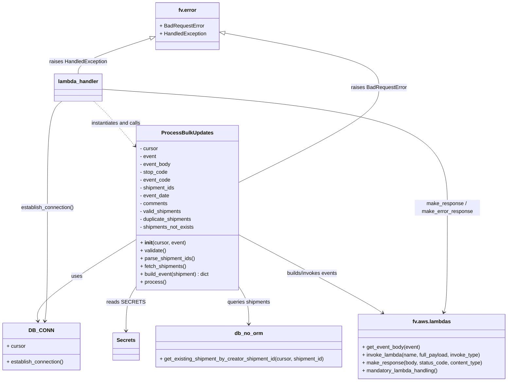

# Diagram: shipment_core/shipment_service/shipment_service/v2/post_bulk_shipment_updates.py


> Auto-generated by Obscura crawlers

## Diagram 1



### SVG

<svg id="container" width="1560.275390625" xmlns="http://www.w3.org/2000/svg" class="classDiagram" height="1168" viewBox="0 0 1560.275390625 1168" role="graphics-document document" aria-roledescription="class"><style>#container{font-family:"trebuchet ms",verdana,arial,sans-serif;font-size:16px;fill:#333;}@keyframes edge-animation-frame{from{stroke-dashoffset:0;}}@keyframes dash{to{stroke-dashoffset:0;}}#container .edge-animation-slow{stroke-dasharray:9,5!important;stroke-dashoffset:900;animation:dash 50s linear infinite;stroke-linecap:round;}#container .edge-animation-fast{stroke-dasharray:9,5!important;stroke-dashoffset:900;animation:dash 20s linear infinite;stroke-linecap:round;}#container .error-icon{fill:#552222;}#container .error-text{fill:#552222;stroke:#552222;}#container .edge-thickness-normal{stroke-width:1px;}#container .edge-thickness-thick{stroke-width:3.5px;}#container .edge-pattern-solid{stroke-dasharray:0;}#container .edge-thickness-invisible{stroke-width:0;fill:none;}#container .edge-pattern-dashed{stroke-dasharray:3;}#container .edge-pattern-dotted{stroke-dasharray:2;}#container .marker{fill:#333333;stroke:#333333;}#container .marker.cross{stroke:#333333;}#container svg{font-family:"trebuchet ms",verdana,arial,sans-serif;font-size:16px;}#container p{margin:0;}#container g.classGroup text{fill:#9370DB;stroke:none;font-family:"trebuchet ms",verdana,arial,sans-serif;font-size:10px;}#container g.classGroup text .title{font-weight:bolder;}#container .nodeLabel,#container .edgeLabel{color:#131300;}#container .edgeLabel .label rect{fill:#ECECFF;}#container .label text{fill:#131300;}#container .labelBkg{background:#ECECFF;}#container .edgeLabel .label span{background:#ECECFF;}#container .classTitle{font-weight:bolder;}#container .node rect,#container .node circle,#container .node ellipse,#container .node polygon,#container .node path{fill:#ECECFF;stroke:#9370DB;stroke-width:1px;}#container .divider{stroke:#9370DB;stroke-width:1;}#container g.clickable{cursor:pointer;}#container g.classGroup rect{fill:#ECECFF;stroke:#9370DB;}#container g.classGroup line{stroke:#9370DB;stroke-width:1;}#container .classLabel .box{stroke:none;stroke-width:0;fill:#ECECFF;opacity:0.5;}#container .classLabel .label{fill:#9370DB;font-size:10px;}#container .relation{stroke:#333333;stroke-width:1;fill:none;}#container .dashed-line{stroke-dasharray:3;}#container .dotted-line{stroke-dasharray:1 2;}#container #compositionStart,#container .composition{fill:#333333!important;stroke:#333333!important;stroke-width:1;}#container #compositionEnd,#container .composition{fill:#333333!important;stroke:#333333!important;stroke-width:1;}#container #dependencyStart,#container .dependency{fill:#333333!important;stroke:#333333!important;stroke-width:1;}#container #dependencyStart,#container .dependency{fill:#333333!important;stroke:#333333!important;stroke-width:1;}#container #extensionStart,#container .extension{fill:transparent!important;stroke:#333333!important;stroke-width:1;}#container #extensionEnd,#container .extension{fill:transparent!important;stroke:#333333!important;stroke-width:1;}#container #aggregationStart,#container .aggregation{fill:transparent!important;stroke:#333333!important;stroke-width:1;}#container #aggregationEnd,#container .aggregation{fill:transparent!important;stroke:#333333!important;stroke-width:1;}#container #lollipopStart,#container .lollipop{fill:#ECECFF!important;stroke:#333333!important;stroke-width:1;}#container #lollipopEnd,#container .lollipop{fill:#ECECFF!important;stroke:#333333!important;stroke-width:1;}#container .edgeTerminals{font-size:11px;line-height:initial;}#container .classTitleText{text-anchor:middle;font-size:18px;fill:#333;}#container .label-icon{display:inline-block;height:1em;overflow:visible;vertical-align:-0.125em;}#container .node .label-icon path{fill:currentColor;stroke:revert;stroke-width:revert;}#container :root{--mermaid-font-family:"trebuchet ms",verdana,arial,sans-serif;}</style><g><defs><marker id="container_class-aggregationStart" class="marker aggregation class" refX="18" refY="7" markerWidth="190" markerHeight="240" orient="auto"><path d="M 18,7 L9,13 L1,7 L9,1 Z"></path></marker></defs><defs><marker id="container_class-aggregationEnd" class="marker aggregation class" refX="1" refY="7" markerWidth="20" markerHeight="28" orient="auto"><path d="M 18,7 L9,13 L1,7 L9,1 Z"></path></marker></defs><defs><marker id="container_class-extensionStart" class="marker extension class" refX="18" refY="7" markerWidth="190" markerHeight="240" orient="auto"><path d="M 1,7 L18,13 V 1 Z"></path></marker></defs><defs><marker id="container_class-extensionEnd" class="marker extension class" refX="1" refY="7" markerWidth="20" markerHeight="28" orient="auto"><path d="M 1,1 V 13 L18,7 Z"></path></marker></defs><defs><marker id="container_class-compositionStart" class="marker composition class" refX="18" refY="7" markerWidth="190" markerHeight="240" orient="auto"><path d="M 18,7 L9,13 L1,7 L9,1 Z"></path></marker></defs><defs><marker id="container_class-compositionEnd" class="marker composition class" refX="1" refY="7" markerWidth="20" markerHeight="28" orient="auto"><path d="M 18,7 L9,13 L1,7 L9,1 Z"></path></marker></defs><defs><marker id="container_class-dependencyStart" class="marker dependency class" refX="6" refY="7" markerWidth="190" markerHeight="240" orient="auto"><path d="M 5,7 L9,13 L1,7 L9,1 Z"></path></marker></defs><defs><marker id="container_class-dependencyEnd" class="marker dependency class" refX="13" refY="7" markerWidth="20" markerHeight="28" orient="auto"><path d="M 18,7 L9,13 L14,7 L9,1 Z"></path></marker></defs><defs><marker id="container_class-lollipopStart" class="marker lollipop class" refX="13" refY="7" markerWidth="190" markerHeight="240" orient="auto"><circle stroke="black" fill="transparent" cx="7" cy="7" r="6"></circle></marker></defs><defs><marker id="container_class-lollipopEnd" class="marker lollipop class" refX="1" refY="7" markerWidth="190" markerHeight="240" orient="auto"><circle stroke="black" fill="transparent" cx="7" cy="7" r="6"></circle></marker></defs><g class="root"><g class="clusters"></g><g class="edgePaths"><path d="M416.738,733.662L365.234,765.552C313.73,797.441,210.723,861.221,160.517,902.786C110.311,944.351,112.907,963.702,114.205,973.378L115.503,983.053" id="id_ProcessBulkUpdates_DB_CONN_1" class="edge-thickness-normal edge-pattern-solid relation" style=";;;" data-edge="true" data-et="edge" data-id="id_ProcessBulkUpdates_DB_CONN_1" data-points="W3sieCI6NDE2LjczODI4MTI1LCJ5Ijo3MzMuNjYxOTY4ODg0MTY1fSx7IngiOjEwNy43MTQ4NDM3NSwieSI6OTI1fSx7IngiOjExNi4zMDEyNDA4MDg4MjM1NCwieSI6OTg5fV0=" marker-end="url(#container_class-dependencyEnd)"></path><path d="M416.738,877.168L411.524,885.14C406.311,893.112,395.883,909.056,390.669,931.695C385.455,954.333,385.455,983.667,385.455,998.333L385.455,1013" id="id_ProcessBulkUpdates_Secrets_2" class="edge-thickness-normal edge-pattern-solid relation" style=";;;" data-edge="true" data-et="edge" data-id="id_ProcessBulkUpdates_Secrets_2" data-points="W3sieCI6NDE2LjczODI4MTI1LCJ5Ijo4NzcuMTY4Mjk3NTk3NTJ9LHsieCI6Mzg1LjQ1NTA3ODEyNSwieSI6OTI1fSx7IngiOjM4NS40NTUwNzgxMjUsInkiOjEwMTl9XQ==" marker-end="url(#container_class-dependencyEnd)"></path><path d="M732.199,877.168L737.413,885.14C742.627,893.112,753.055,909.056,758.269,928.195C763.482,947.333,763.482,969.667,763.482,980.833L763.482,992" id="id_ProcessBulkUpdates_db_no_orm_3" class="edge-thickness-normal edge-pattern-solid relation" style=";;;" data-edge="true" data-et="edge" data-id="id_ProcessBulkUpdates_db_no_orm_3" data-points="W3sieCI6NzMyLjE5OTIxODc1LCJ5Ijo4NzcuMTY4Mjk3NTk3NTJ9LHsieCI6NzYzLjQ4MjQyMTg3NSwieSI6OTI1fSx7IngiOjc2My40ODI0MjE4NzUsInkiOjk5OH1d" marker-end="url(#container_class-dependencyEnd)"></path><path d="M732.199,718.175L798.364,752.646C864.528,787.117,996.857,856.058,1071.18,896.13C1145.504,936.201,1161.822,947.403,1169.981,953.004L1178.14,958.604" id="id_ProcessBulkUpdates_fv.aws.lambdas_4" class="edge-thickness-normal edge-pattern-solid relation" style=";;;" data-edge="true" data-et="edge" data-id="id_ProcessBulkUpdates_fv.aws.lambdas_4" data-points="W3sieCI6NzMyLjE5OTIxODc1LCJ5Ijo3MTguMTc1NDU1NTIxNzE1NH0seyJ4IjoxMTI5LjE4NTU0Njg3NSwieSI6OTI1fSx7IngiOjExODMuMDg3MjAxMjg2NzY0NiwieSI6OTYyfV0=" marker-end="url(#container_class-dependencyEnd)"></path><path d="M288.932,310L295.877,316.167C302.822,322.333,316.713,334.667,337.369,357.082C358.025,379.497,385.447,411.994,399.158,428.243L412.869,444.491" id="id_lambda_handler_ProcessBulkUpdates_5" class="edge-thickness-normal edge-pattern-dashed relation" style=";;;" data-edge="true" data-et="edge" data-id="id_lambda_handler_ProcessBulkUpdates_5" data-points="W3sieCI6Mjg4LjkzMTg2MzEzMjkxMTQsInkiOjMxMH0seyJ4IjozMzAuNjAzNTE1NjI1LCJ5IjozNDd9LHsieCI6NDE2LjczODI4MTI1LCJ5Ijo0NDkuMDc2NjU0NDY2MjM3OX1d" marker-end="url(#container_class-dependencyEnd)"></path><path d="M189.835,310L182.23,316.167C174.626,322.333,159.416,334.667,151.812,389C144.207,443.333,144.207,539.667,144.207,636C144.207,732.333,144.207,828.667,142.909,886.509C141.611,944.351,139.015,963.702,137.717,973.378L136.418,983.053" id="id_lambda_handler_DB_CONN_6" class="edge-thickness-normal edge-pattern-solid relation" style=";;;" data-edge="true" data-et="edge" data-id="id_lambda_handler_DB_CONN_6" data-points="W3sieCI6MTg5LjgzNDk5ODAyMjE1MTksInkiOjMxMH0seyJ4IjoxNDQuMjA3MDMxMjUsInkiOjM0N30seyJ4IjoxNDQuMjA3MDMxMjUsInkiOjYzNn0seyJ4IjoxNDQuMjA3MDMxMjUsInkiOjkyNX0seyJ4IjoxMzUuNjIwNjM0MTkxMTc2NDYsInkiOjk4OX1d" marker-end="url(#container_class-dependencyEnd)"></path><path d="M313.605,273.006L490.911,285.339C668.217,297.671,1022.828,322.335,1200.134,382.834C1377.439,443.333,1377.439,539.667,1377.439,636C1377.439,732.333,1377.439,828.667,1375.512,882.062C1373.585,935.457,1369.731,945.914,1367.804,951.142L1365.877,956.37" id="id_lambda_handler_fv.aws.lambdas_7" class="edge-thickness-normal edge-pattern-solid relation" style=";;;" data-edge="true" data-et="edge" data-id="id_lambda_handler_fv.aws.lambdas_7" data-points="W3sieCI6MzEzLjYwNTQ2ODc1LCJ5IjoyNzMuMDA2MjQ3MjU5NDA4Mjd9LHsieCI6MTM3Ny40Mzk0NTMxMjUsInkiOjM0N30seyJ4IjoxMzc3LjQzOTQ1MzEyNSwieSI6NjM2fSx7IngiOjEzNzcuNDM5NDUzMTI1LCJ5Ijo5MjV9LHsieCI6MTM2My44MDE0NDE4NjU4MDg4LCJ5Ijo5NjJ9XQ==" marker-end="url(#container_class-dependencyEnd)"></path><path d="M689.104,101.006L769.139,115.672C849.174,130.337,1009.244,159.669,1089.279,187.501C1169.314,215.333,1169.314,241.667,1169.314,268C1169.314,294.333,1169.314,320.667,1096.462,369.228C1023.609,417.789,877.904,488.579,805.052,523.973L732.199,559.368" id="id_fv.error_ProcessBulkUpdates_8" class="edge-thickness-normal edge-pattern-solid relation" style=";;;" data-edge="true" data-et="edge" data-id="id_fv.error_ProcessBulkUpdates_8" data-points="W3sieCI6NjcyLjEzNjcxODc1LCJ5Ijo5Ny44OTY3NTYzMTQ4MjY5Mn0seyJ4IjoxMTY5LjMxNDQ1MzEyNSwieSI6MTg5fSx7IngiOjExNjkuMzE0NDUzMTI1LCJ5IjoyNjh9LHsieCI6MTE2OS4zMTQ0NTMxMjUsInkiOjM0N30seyJ4Ijo3MzIuMTk5MjE4NzUsInkiOjU1OS4zNjgxODU2ODM2NTYyfV0=" marker-start="url(#container_class-extensionStart)"></path><path d="M460.407,117.353L423.944,129.294C387.481,141.236,314.555,165.118,278.092,183.226C241.629,201.333,241.629,213.667,241.629,219.833L241.629,226" id="id_fv.error_lambda_handler_9" class="edge-thickness-normal edge-pattern-solid relation" style=";;;" data-edge="true" data-et="edge" data-id="id_fv.error_lambda_handler_9" data-points="W3sieCI6NDc2LjgwMDc4MTI1LCJ5IjoxMTEuOTg0Nzc4MjQ1OTE4NzZ9LHsieCI6MjQxLjYyODkwNjI1LCJ5IjoxODl9LHsieCI6MjQxLjYyODkwNjI1LCJ5IjoyMjZ9XQ==" marker-start="url(#container_class-extensionStart)"></path></g><g class="edgeLabels"><g class="edgeLabel" transform="translate(234.7758, 846.32767)"><g class="label" data-id="id_ProcessBulkUpdates_DB_CONN_1" transform="translate(-16.4921875, -12)"><foreignObject width="32.984375" height="24"><div xmlns="http://www.w3.org/1999/xhtml" class="labelBkg" style="display: table-cell; white-space: nowrap; line-height: 1.5; max-width: 200px; text-align: center;"><span class="edgeLabel"><p>uses</p></span></div></foreignObject></g></g><g class="edgeLabel" transform="translate(385.455078125, 925)"><g class="label" data-id="id_ProcessBulkUpdates_Secrets_2" transform="translate(-52.6015625, -12)"><foreignObject width="105.203125" height="24"><div xmlns="http://www.w3.org/1999/xhtml" class="labelBkg" style="display: table-cell; white-space: nowrap; line-height: 1.5; max-width: 200px; text-align: center;"><span class="edgeLabel"><p>reads SECRETS</p></span></div></foreignObject></g></g><g class="edgeLabel" transform="translate(763.482421875, 925)"><g class="label" data-id="id_ProcessBulkUpdates_db_no_orm_3" transform="translate(-67.3203125, -12)"><foreignObject width="134.640625" height="24"><div xmlns="http://www.w3.org/1999/xhtml" class="labelBkg" style="display: table-cell; white-space: nowrap; line-height: 1.5; max-width: 200px; text-align: center;"><span class="edgeLabel"><p>queries shipments</p></span></div></foreignObject></g></g><g class="edgeLabel" transform="translate(959.68325, 836.69158)"><g class="label" data-id="id_ProcessBulkUpdates_fv.aws.lambdas_4" transform="translate(-80.2578125, -12)"><foreignObject width="160.515625" height="24"><div xmlns="http://www.w3.org/1999/xhtml" class="labelBkg" style="display: table-cell; white-space: nowrap; line-height: 1.5; max-width: 200px; text-align: center;"><span class="edgeLabel"><p>builds/invokes events</p></span></div></foreignObject></g></g><g class="edgeLabel" transform="translate(355.70153, 376.74318)"><g class="label" data-id="id_lambda_handler_ProcessBulkUpdates_5" transform="translate(-77.421875, -12)"><foreignObject width="154.84375" height="24"><div xmlns="http://www.w3.org/1999/xhtml" class="labelBkg" style="display: table-cell; white-space: nowrap; line-height: 1.5; max-width: 200px; text-align: center;"><span class="edgeLabel"><p>instantiates and calls</p></span></div></foreignObject></g></g><g class="edgeLabel" transform="translate(144.20703125, 636)"><g class="label" data-id="id_lambda_handler_DB_CONN_6" transform="translate(-82.640625, -12)"><foreignObject width="165.28125" height="24"><div xmlns="http://www.w3.org/1999/xhtml" class="labelBkg" style="display: table-cell; white-space: nowrap; line-height: 1.5; max-width: 200px; text-align: center;"><span class="edgeLabel"><p>establish_connection()</p></span></div></foreignObject></g></g><g class="edgeLabel" transform="translate(1377.439453125, 636)"><g class="label" data-id="id_lambda_handler_fv.aws.lambdas_7" transform="translate(-100, -24)"><foreignObject width="200" height="48"><div xmlns="http://www.w3.org/1999/xhtml" class="labelBkg" style="display: table; white-space: break-spaces; line-height: 1.5; max-width: 200px; text-align: center; width: 200px;"><span class="edgeLabel"><p>make_response / make_error_response</p></span></div></foreignObject></g></g><g class="edgeLabel" transform="translate(1169.314453125, 268)"><g class="label" data-id="id_fv.error_ProcessBulkUpdates_8" transform="translate(-84.7734375, -12)"><foreignObject width="169.546875" height="24"><div xmlns="http://www.w3.org/1999/xhtml" class="labelBkg" style="display: table-cell; white-space: nowrap; line-height: 1.5; max-width: 200px; text-align: center;"><span class="edgeLabel"><p>raises BadRequestError</p></span></div></foreignObject></g></g><g class="edgeLabel" transform="translate(241.62890625, 189)"><g class="label" data-id="id_fv.error_lambda_handler_9" transform="translate(-89.453125, -12)"><foreignObject width="178.90625" height="24"><div xmlns="http://www.w3.org/1999/xhtml" class="labelBkg" style="display: table-cell; white-space: nowrap; line-height: 1.5; max-width: 200px; text-align: center;"><span class="edgeLabel"><p>raises HandledException</p></span></div></foreignObject></g></g></g><g class="nodes"><g class="node default" id="classId-ProcessBulkUpdates-0" transform="translate(574.46875, 636)"><g class="basic label-container"><path d="M-157.73046875 -252 L157.73046875 -252 L157.73046875 252 L-157.73046875 252" stroke="none" stroke-width="0" fill="#ECECFF" style=""></path><path d="M-157.73046875 -252 C-49.05021238700871 -252, 59.630043975982574 -252, 157.73046875 -252 M-157.73046875 -252 C-63.92294893958602 -252, 29.884570870827957 -252, 157.73046875 -252 M157.73046875 -252 C157.73046875 -136.94375157449394, 157.73046875 -21.887503148987918, 157.73046875 252 M157.73046875 -252 C157.73046875 -86.15120915196417, 157.73046875 79.69758169607167, 157.73046875 252 M157.73046875 252 C69.94205818241232 252, -17.84635238517535 252, -157.73046875 252 M157.73046875 252 C75.85723970617681 252, -6.015989337646374 252, -157.73046875 252 M-157.73046875 252 C-157.73046875 105.00613453210588, -157.73046875 -41.98773093578825, -157.73046875 -252 M-157.73046875 252 C-157.73046875 53.174702277986114, -157.73046875 -145.65059544402777, -157.73046875 -252" stroke="#9370DB" stroke-width="1.3" fill="none" stroke-dasharray="0 0" style=""></path></g><g class="annotation-group text" transform="translate(0, -228)"></g><g class="label-group text" transform="translate(-74.7421875, -228)"><g class="label" style="font-weight: bolder" transform="translate(0,-12)"><foreignObject width="149.484375" height="24"><div xmlns="http://www.w3.org/1999/xhtml" style="display: table-cell; white-space: nowrap; line-height: 1.5; max-width: 197px; text-align: center;"><span class="nodeLabel markdown-node-label" style=""><p>ProcessBulkUpdates</p></span></div></foreignObject></g></g><g class="members-group text" transform="translate(-145.73046875, -180)"><g class="label" style="" transform="translate(0,-12)"><foreignObject width="56.421875" height="24"><div xmlns="http://www.w3.org/1999/xhtml" style="display: table-cell; white-space: nowrap; line-height: 1.5; max-width: 115px; text-align: center;"><span class="nodeLabel markdown-node-label" style=""><p>- cursor</p></span></div></foreignObject></g><g class="label" style="" transform="translate(0,12)"><foreignObject width="51.03125" height="24"><div xmlns="http://www.w3.org/1999/xhtml" style="display: table-cell; white-space: nowrap; line-height: 1.5; max-width: 109px; text-align: center;"><span class="nodeLabel markdown-node-label" style=""><p>- event</p></span></div></foreignObject></g><g class="label" style="" transform="translate(0,36)"><foreignObject width="95.640625" height="24"><div xmlns="http://www.w3.org/1999/xhtml" style="display: table-cell; white-space: nowrap; line-height: 1.5; max-width: 153px; text-align: center;"><span class="nodeLabel markdown-node-label" style=""><p>- event_body</p></span></div></foreignObject></g><g class="label" style="" transform="translate(0,60)"><foreignObject width="85.1875" height="24"><div xmlns="http://www.w3.org/1999/xhtml" style="display: table-cell; white-space: nowrap; line-height: 1.5; max-width: 143px; text-align: center;"><span class="nodeLabel markdown-node-label" style=""><p>- stop_code</p></span></div></foreignObject></g><g class="label" style="" transform="translate(0,84)"><foreignObject width="93.984375" height="24"><div xmlns="http://www.w3.org/1999/xhtml" style="display: table-cell; white-space: nowrap; line-height: 1.5; max-width: 151px; text-align: center;"><span class="nodeLabel markdown-node-label" style=""><p>- event_code</p></span></div></foreignObject></g><g class="label" style="" transform="translate(0,108)"><foreignObject width="109.015625" height="24"><div xmlns="http://www.w3.org/1999/xhtml" style="display: table-cell; white-space: nowrap; line-height: 1.5; max-width: 166px; text-align: center;"><span class="nodeLabel markdown-node-label" style=""><p>- shipment_ids</p></span></div></foreignObject></g><g class="label" style="" transform="translate(0,132)"><foreignObject width="91.5625" height="24"><div xmlns="http://www.w3.org/1999/xhtml" style="display: table-cell; white-space: nowrap; line-height: 1.5; max-width: 149px; text-align: center;"><span class="nodeLabel markdown-node-label" style=""><p>- event_date</p></span></div></foreignObject></g><g class="label" style="" transform="translate(0,156)"><foreignObject width="86.140625" height="24"><div xmlns="http://www.w3.org/1999/xhtml" style="display: table-cell; white-space: nowrap; line-height: 1.5; max-width: 144px; text-align: center;"><span class="nodeLabel markdown-node-label" style=""><p>- comments</p></span></div></foreignObject></g><g class="label" style="" transform="translate(0,180)"><foreignObject width="129.859375" height="24"><div xmlns="http://www.w3.org/1999/xhtml" style="display: table-cell; white-space: nowrap; line-height: 1.5; max-width: 187px; text-align: center;"><span class="nodeLabel markdown-node-label" style=""><p>- valid_shipments</p></span></div></foreignObject></g><g class="label" style="" transform="translate(0,204)"><foreignObject width="162.640625" height="24"><div xmlns="http://www.w3.org/1999/xhtml" style="display: table-cell; white-space: nowrap; line-height: 1.5; max-width: 220px; text-align: center;"><span class="nodeLabel markdown-node-label" style=""><p>- duplicate_shipments</p></span></div></foreignObject></g><g class="label" style="" transform="translate(0,228)"><foreignObject width="168.6875" height="24"><div xmlns="http://www.w3.org/1999/xhtml" style="display: table-cell; white-space: nowrap; line-height: 1.5; max-width: 226px; text-align: center;"><span class="nodeLabel markdown-node-label" style=""><p>- shipments_not_exists</p></span></div></foreignObject></g></g><g class="methods-group text" transform="translate(-145.73046875, 108)"><g class="label" style="" transform="translate(0,-12)"><foreignObject width="139.90625" height="24"><div xmlns="http://www.w3.org/1999/xhtml" style="display: table-cell; white-space: nowrap; line-height: 1.5; max-width: 230px; text-align: center;"><span class="nodeLabel markdown-node-label" style=""><p>+ <strong>init</strong>(cursor, event)</p></span></div></foreignObject></g><g class="label" style="" transform="translate(0,12)"><foreignObject width="80.484375" height="24"><div xmlns="http://www.w3.org/1999/xhtml" style="display: table-cell; white-space: nowrap; line-height: 1.5; max-width: 138px; text-align: center;"><span class="nodeLabel markdown-node-label" style=""><p>+ validate()</p></span></div></foreignObject></g><g class="label" style="" transform="translate(0,36)"><foreignObject width="169.09375" height="24"><div xmlns="http://www.w3.org/1999/xhtml" style="display: table-cell; white-space: nowrap; line-height: 1.5; max-width: 226px; text-align: center;"><span class="nodeLabel markdown-node-label" style=""><p>+ parse_shipment_ids()</p></span></div></foreignObject></g><g class="label" style="" transform="translate(0,60)"><foreignObject width="143.3125" height="24"><div xmlns="http://www.w3.org/1999/xhtml" style="display: table-cell; white-space: nowrap; line-height: 1.5; max-width: 201px; text-align: center;"><span class="nodeLabel markdown-node-label" style=""><p>+ fetch_shipments()</p></span></div></foreignObject></g><g class="label" style="" transform="translate(0,84)"><foreignObject width="216.71875" height="24"><div xmlns="http://www.w3.org/1999/xhtml" style="display: table-cell; white-space: nowrap; line-height: 1.5; max-width: 274px; text-align: center;"><span class="nodeLabel markdown-node-label" style=""><p>+ build_event(shipment) : dict</p></span></div></foreignObject></g><g class="label" style="" transform="translate(0,108)"><foreignObject width="77.96875" height="24"><div xmlns="http://www.w3.org/1999/xhtml" style="display: table-cell; white-space: nowrap; line-height: 1.5; max-width: 135px; text-align: center;"><span class="nodeLabel markdown-node-label" style=""><p>+ process()</p></span></div></foreignObject></g></g><g class="divider" style=""><path d="M-157.73046875 -204 C-94.24336636949582 -204, -30.75626398899165 -204, 157.73046875 -204 M-157.73046875 -204 C-34.445284525769424 -204, 88.83989969846115 -204, 157.73046875 -204" stroke="#9370DB" stroke-width="1.3" fill="none" stroke-dasharray="0 0" style=""></path></g><g class="divider" style=""><path d="M-157.73046875 84 C-69.62310613510202 84, 18.48425647979596 84, 157.73046875 84 M-157.73046875 84 C-92.24374852248923 84, -26.757028294978454 84, 157.73046875 84" stroke="#9370DB" stroke-width="1.3" fill="none" stroke-dasharray="0 0" style=""></path></g></g><g class="node default" id="classId-DB_CONN-1" transform="translate(125.9609375, 1061)"><g class="basic label-container"><path d="M-117.9609375 -72 L117.9609375 -72 L117.9609375 72 L-117.9609375 72" stroke="none" stroke-width="0" fill="#ECECFF" style=""></path><path d="M-117.9609375 -72 C-24.66427920577985 -72, 68.6323790884403 -72, 117.9609375 -72 M-117.9609375 -72 C-70.43095677142848 -72, -22.900976042856968 -72, 117.9609375 -72 M117.9609375 -72 C117.9609375 -22.037577793363624, 117.9609375 27.92484441327275, 117.9609375 72 M117.9609375 -72 C117.9609375 -18.822043307563533, 117.9609375 34.355913384872935, 117.9609375 72 M117.9609375 72 C49.62948542764826 72, -18.701966644703475 72, -117.9609375 72 M117.9609375 72 C25.582945567587913 72, -66.79504636482417 72, -117.9609375 72 M-117.9609375 72 C-117.9609375 22.426104717225904, -117.9609375 -27.147790565548192, -117.9609375 -72 M-117.9609375 72 C-117.9609375 22.188431529574302, -117.9609375 -27.623136940851396, -117.9609375 -72" stroke="#9370DB" stroke-width="1.3" fill="none" stroke-dasharray="0 0" style=""></path></g><g class="annotation-group text" transform="translate(0, -48)"></g><g class="label-group text" transform="translate(-34.40625, -48)"><g class="label" style="font-weight: bolder" transform="translate(0,-12)"><foreignObject width="68.8125" height="24"><div xmlns="http://www.w3.org/1999/xhtml" style="display: table-cell; white-space: nowrap; line-height: 1.5; max-width: 119px; text-align: center;"><span class="nodeLabel markdown-node-label" style=""><p>DB_CONN</p></span></div></foreignObject></g></g><g class="members-group text" transform="translate(-105.9609375, 0)"><g class="label" style="" transform="translate(0,-12)"><foreignObject width="57.953125" height="24"><div xmlns="http://www.w3.org/1999/xhtml" style="display: table-cell; white-space: nowrap; line-height: 1.5; max-width: 116px; text-align: center;"><span class="nodeLabel markdown-node-label" style=""><p>+ cursor</p></span></div></foreignObject></g></g><g class="methods-group text" transform="translate(-105.9609375, 48)"><g class="label" style="" transform="translate(0,-12)"><foreignObject width="177.515625" height="24"><div xmlns="http://www.w3.org/1999/xhtml" style="display: table-cell; white-space: nowrap; line-height: 1.5; max-width: 235px; text-align: center;"><span class="nodeLabel markdown-node-label" style=""><p>+ establish_connection()</p></span></div></foreignObject></g></g><g class="divider" style=""><path d="M-117.9609375 -24 C-41.825861055493874 -24, 34.30921538901225 -24, 117.9609375 -24 M-117.9609375 -24 C-55.1730977735004 -24, 7.614741952999196 -24, 117.9609375 -24" stroke="#9370DB" stroke-width="1.3" fill="none" stroke-dasharray="0 0" style=""></path></g><g class="divider" style=""><path d="M-117.9609375 24 C-25.715359441436078 24, 66.53021861712784 24, 117.9609375 24 M-117.9609375 24 C-28.67095994814899 24, 60.61901760370202 24, 117.9609375 24" stroke="#9370DB" stroke-width="1.3" fill="none" stroke-dasharray="0 0" style=""></path></g></g><g class="node default" id="classId-Secrets-2" transform="translate(385.455078125, 1061)"><g class="basic label-container"><path d="M-39.1640625 -42 L39.1640625 -42 L39.1640625 42 L-39.1640625 42" stroke="none" stroke-width="0" fill="#ECECFF" style=""></path><path d="M-39.1640625 -42 C-20.3261966525516 -42, -1.4883308051032031 -42, 39.1640625 -42 M-39.1640625 -42 C-20.3596540573112 -42, -1.5552456146224003 -42, 39.1640625 -42 M39.1640625 -42 C39.1640625 -9.112484685636012, 39.1640625 23.775030628727976, 39.1640625 42 M39.1640625 -42 C39.1640625 -18.485939342135623, 39.1640625 5.028121315728754, 39.1640625 42 M39.1640625 42 C15.999576459640853 42, -7.1649095807182945 42, -39.1640625 42 M39.1640625 42 C16.872896789121583 42, -5.418268921756834 42, -39.1640625 42 M-39.1640625 42 C-39.1640625 15.679542898841778, -39.1640625 -10.640914202316445, -39.1640625 -42 M-39.1640625 42 C-39.1640625 12.430833460962685, -39.1640625 -17.13833307807463, -39.1640625 -42" stroke="#9370DB" stroke-width="1.3" fill="none" stroke-dasharray="0 0" style=""></path></g><g class="annotation-group text" transform="translate(0, -18)"></g><g class="label-group text" transform="translate(-27.1640625, -18)"><g class="label" style="font-weight: bolder" transform="translate(0,-12)"><foreignObject width="54.328125" height="24"><div xmlns="http://www.w3.org/1999/xhtml" style="display: table-cell; white-space: nowrap; line-height: 1.5; max-width: 103px; text-align: center;"><span class="nodeLabel markdown-node-label" style=""><p>Secrets</p></span></div></foreignObject></g></g><g class="members-group text" transform="translate(-27.1640625, 30)"></g><g class="methods-group text" transform="translate(-27.1640625, 60)"></g><g class="divider" style=""><path d="M-39.1640625 6 C-17.43973058222293 6, 4.284601335554143 6, 39.1640625 6 M-39.1640625 6 C-13.690685781827018 6, 11.782690936345965 6, 39.1640625 6" stroke="#9370DB" stroke-width="1.3" fill="none" stroke-dasharray="0 0" style=""></path></g><g class="divider" style=""><path d="M-39.1640625 24 C-19.4552675840851 24, 0.25352733182980103 24, 39.1640625 24 M-39.1640625 24 C-20.98040949074642 24, -2.7967564814928423 24, 39.1640625 24" stroke="#9370DB" stroke-width="1.3" fill="none" stroke-dasharray="0 0" style=""></path></g></g><g class="node default" id="classId-db_no_orm-3" transform="translate(763.482421875, 1061)"><g class="basic label-container"><path d="M-288.86328125 -63 L288.86328125 -63 L288.86328125 63 L-288.86328125 63" stroke="none" stroke-width="0" fill="#ECECFF" style=""></path><path d="M-288.86328125 -63 C-74.14891572734012 -63, 140.56544979531975 -63, 288.86328125 -63 M-288.86328125 -63 C-109.38001876124085 -63, 70.1032437275183 -63, 288.86328125 -63 M288.86328125 -63 C288.86328125 -34.01209554501004, 288.86328125 -5.024191090020089, 288.86328125 63 M288.86328125 -63 C288.86328125 -31.22502377455862, 288.86328125 0.5499524508827633, 288.86328125 63 M288.86328125 63 C95.92179658474348 63, -97.01968808051305 63, -288.86328125 63 M288.86328125 63 C110.38619789525862 63, -68.09088545948276 63, -288.86328125 63 M-288.86328125 63 C-288.86328125 20.264972722114756, -288.86328125 -22.47005455577049, -288.86328125 -63 M-288.86328125 63 C-288.86328125 36.601764911216506, -288.86328125 10.203529822433012, -288.86328125 -63" stroke="#9370DB" stroke-width="1.3" fill="none" stroke-dasharray="0 0" style=""></path></g><g class="annotation-group text" transform="translate(0, -39)"></g><g class="label-group text" transform="translate(-41.3515625, -39)"><g class="label" style="font-weight: bolder" transform="translate(0,-12)"><foreignObject width="82.703125" height="24"><div xmlns="http://www.w3.org/1999/xhtml" style="display: table-cell; white-space: nowrap; line-height: 1.5; max-width: 133px; text-align: center;"><span class="nodeLabel markdown-node-label" style=""><p>db_no_orm</p></span></div></foreignObject></g></g><g class="members-group text" transform="translate(-276.86328125, 9)"></g><g class="methods-group text" transform="translate(-276.86328125, 39)"><g class="label" style="" transform="translate(0,-12)"><foreignObject width="512.375" height="24"><div xmlns="http://www.w3.org/1999/xhtml" style="display: table-cell; white-space: nowrap; line-height: 1.5; max-width: 570px; text-align: center;"><span class="nodeLabel markdown-node-label" style=""><p>+ get_existing_shipment_by_creator_shipment_id(cursor, shipment_id)</p></span></div></foreignObject></g></g><g class="divider" style=""><path d="M-288.86328125 -15 C-137.87369248162358 -15, 13.115896286752843 -15, 288.86328125 -15 M-288.86328125 -15 C-120.96446933397223 -15, 46.934342582055535 -15, 288.86328125 -15" stroke="#9370DB" stroke-width="1.3" fill="none" stroke-dasharray="0 0" style=""></path></g><g class="divider" style=""><path d="M-288.86328125 9 C-171.83452604567174 9, -54.805770841343474 9, 288.86328125 9 M-288.86328125 9 C-143.7289790131917 9, 1.4053232236166195 9, 288.86328125 9" stroke="#9370DB" stroke-width="1.3" fill="none" stroke-dasharray="0 0" style=""></path></g></g><g class="node default" id="classId-fv.aws.lambdas-4" transform="translate(1327.310546875, 1061)"><g class="basic label-container"><path d="M-224.96484375 -99 L224.96484375 -99 L224.96484375 99 L-224.96484375 99" stroke="none" stroke-width="0" fill="#ECECFF" style=""></path><path d="M-224.96484375 -99 C-91.64686969457841 -99, 41.671104360843174 -99, 224.96484375 -99 M-224.96484375 -99 C-58.55930700494736 -99, 107.84622974010529 -99, 224.96484375 -99 M224.96484375 -99 C224.96484375 -43.58363479420229, 224.96484375 11.83273041159542, 224.96484375 99 M224.96484375 -99 C224.96484375 -52.95512858123677, 224.96484375 -6.910257162473542, 224.96484375 99 M224.96484375 99 C95.88828052874064 99, -33.188282692518726 99, -224.96484375 99 M224.96484375 99 C77.29419650424265 99, -70.3764507415147 99, -224.96484375 99 M-224.96484375 99 C-224.96484375 40.685579036920046, -224.96484375 -17.628841926159907, -224.96484375 -99 M-224.96484375 99 C-224.96484375 37.189271310588566, -224.96484375 -24.621457378822868, -224.96484375 -99" stroke="#9370DB" stroke-width="1.3" fill="none" stroke-dasharray="0 0" style=""></path></g><g class="annotation-group text" transform="translate(0, -75)"></g><g class="label-group text" transform="translate(-55.8984375, -75)"><g class="label" style="font-weight: bolder" transform="translate(0,-12)"><foreignObject width="111.796875" height="24"><div xmlns="http://www.w3.org/1999/xhtml" style="display: table-cell; white-space: nowrap; line-height: 1.5; max-width: 160px; text-align: center;"><span class="nodeLabel markdown-node-label" style=""><p>fv.aws.lambdas</p></span></div></foreignObject></g></g><g class="members-group text" transform="translate(-212.96484375, -27)"></g><g class="methods-group text" transform="translate(-212.96484375, 3)"><g class="label" style="" transform="translate(0,-12)"><foreignObject width="178.4375" height="24"><div xmlns="http://www.w3.org/1999/xhtml" style="display: table-cell; white-space: nowrap; line-height: 1.5; max-width: 236px; text-align: center;"><span class="nodeLabel markdown-node-label" style=""><p>+ get_event_body(event)</p></span></div></foreignObject></g><g class="label" style="" transform="translate(0,12)"><foreignObject width="366.734375" height="24"><div xmlns="http://www.w3.org/1999/xhtml" style="display: table-cell; white-space: nowrap; line-height: 1.5; max-width: 424px; text-align: center;"><span class="nodeLabel markdown-node-label" style=""><p>+ invoke_lambda(name, full_payload, invoke_type)</p></span></div></foreignObject></g><g class="label" style="" transform="translate(0,36)"><foreignObject width="370.03125" height="24"><div xmlns="http://www.w3.org/1999/xhtml" style="display: table-cell; white-space: nowrap; line-height: 1.5; max-width: 427px; text-align: center;"><span class="nodeLabel markdown-node-label" style=""><p>+ make_response(body, status_code, content_type)</p></span></div></foreignObject></g><g class="label" style="" transform="translate(0,60)"><foreignObject width="236.3125" height="24"><div xmlns="http://www.w3.org/1999/xhtml" style="display: table-cell; white-space: nowrap; line-height: 1.5; max-width: 294px; text-align: center;"><span class="nodeLabel markdown-node-label" style=""><p>+ mandatory_lambda_handling()</p></span></div></foreignObject></g></g><g class="divider" style=""><path d="M-224.96484375 -51 C-130.31371276766416 -51, -35.662581785328314 -51, 224.96484375 -51 M-224.96484375 -51 C-71.07890160950379 -51, 82.80704053099242 -51, 224.96484375 -51" stroke="#9370DB" stroke-width="1.3" fill="none" stroke-dasharray="0 0" style=""></path></g><g class="divider" style=""><path d="M-224.96484375 -27 C-49.99894110402161 -27, 124.96696154195678 -27, 224.96484375 -27 M-224.96484375 -27 C-90.58689429969999 -27, 43.791055150600016 -27, 224.96484375 -27" stroke="#9370DB" stroke-width="1.3" fill="none" stroke-dasharray="0 0" style=""></path></g></g><g class="node default" id="classId-fv.error-5" transform="translate(574.46875, 80)"><g class="basic label-container"><path d="M-97.66796875 -72 L97.66796875 -72 L97.66796875 72 L-97.66796875 72" stroke="none" stroke-width="0" fill="#ECECFF" style=""></path><path d="M-97.66796875 -72 C-26.080374392090874 -72, 45.50721996581825 -72, 97.66796875 -72 M-97.66796875 -72 C-29.857912199317695 -72, 37.95214435136461 -72, 97.66796875 -72 M97.66796875 -72 C97.66796875 -38.88476817318126, 97.66796875 -5.769536346362514, 97.66796875 72 M97.66796875 -72 C97.66796875 -38.22449278215912, 97.66796875 -4.448985564318235, 97.66796875 72 M97.66796875 72 C19.664595204821936 72, -58.33877834035613 72, -97.66796875 72 M97.66796875 72 C34.35296089886518 72, -28.962046952269645 72, -97.66796875 72 M-97.66796875 72 C-97.66796875 35.91292316756014, -97.66796875 -0.17415366487972506, -97.66796875 -72 M-97.66796875 72 C-97.66796875 26.702073752176524, -97.66796875 -18.59585249564695, -97.66796875 -72" stroke="#9370DB" stroke-width="1.3" fill="none" stroke-dasharray="0 0" style=""></path></g><g class="annotation-group text" transform="translate(0, -48)"></g><g class="label-group text" transform="translate(-26.9453125, -48)"><g class="label" style="font-weight: bolder" transform="translate(0,-12)"><foreignObject width="53.890625" height="24"><div xmlns="http://www.w3.org/1999/xhtml" style="display: table-cell; white-space: nowrap; line-height: 1.5; max-width: 103px; text-align: center;"><span class="nodeLabel markdown-node-label" style=""><p>fv.error</p></span></div></foreignObject></g></g><g class="members-group text" transform="translate(-85.66796875, 0)"><g class="label" style="" transform="translate(0,-12)"><foreignObject width="135.03125" height="24"><div xmlns="http://www.w3.org/1999/xhtml" style="display: table-cell; white-space: nowrap; line-height: 1.5; max-width: 193px; text-align: center;"><span class="nodeLabel markdown-node-label" style=""><p>+ BadRequestError</p></span></div></foreignObject></g><g class="label" style="" transform="translate(0,12)"><foreignObject width="144.390625" height="24"><div xmlns="http://www.w3.org/1999/xhtml" style="display: table-cell; white-space: nowrap; line-height: 1.5; max-width: 202px; text-align: center;"><span class="nodeLabel markdown-node-label" style=""><p>+ HandledException</p></span></div></foreignObject></g></g><g class="methods-group text" transform="translate(-85.66796875, 72)"></g><g class="divider" style=""><path d="M-97.66796875 -24 C-57.65050316478508 -24, -17.633037579570157 -24, 97.66796875 -24 M-97.66796875 -24 C-50.69344779681658 -24, -3.718926843633156 -24, 97.66796875 -24" stroke="#9370DB" stroke-width="1.3" fill="none" stroke-dasharray="0 0" style=""></path></g><g class="divider" style=""><path d="M-97.66796875 48 C-22.591650004948846 48, 52.48466874010231 48, 97.66796875 48 M-97.66796875 48 C-46.24153834432448 48, 5.184892061351036 48, 97.66796875 48" stroke="#9370DB" stroke-width="1.3" fill="none" stroke-dasharray="0 0" style=""></path></g></g><g class="node default" id="classId-lambda_handler-6" transform="translate(241.62890625, 268)"><g class="basic label-container"><path d="M-71.9765625 -42 L71.9765625 -42 L71.9765625 42 L-71.9765625 42" stroke="none" stroke-width="0" fill="#ECECFF" style=""></path><path d="M-71.9765625 -42 C-33.259523443201694 -42, 5.4575156135966125 -42, 71.9765625 -42 M-71.9765625 -42 C-40.57327579083016 -42, -9.169989081660319 -42, 71.9765625 -42 M71.9765625 -42 C71.9765625 -22.179618674220457, 71.9765625 -2.3592373484409137, 71.9765625 42 M71.9765625 -42 C71.9765625 -8.42203133738689, 71.9765625 25.15593732522622, 71.9765625 42 M71.9765625 42 C39.98473534280048 42, 7.992908185600946 42, -71.9765625 42 M71.9765625 42 C24.48355182910263 42, -23.00945884179474 42, -71.9765625 42 M-71.9765625 42 C-71.9765625 16.397497783578217, -71.9765625 -9.205004432843566, -71.9765625 -42 M-71.9765625 42 C-71.9765625 18.652851089816103, -71.9765625 -4.694297820367794, -71.9765625 -42" stroke="#9370DB" stroke-width="1.3" fill="none" stroke-dasharray="0 0" style=""></path></g><g class="annotation-group text" transform="translate(0, -18)"></g><g class="label-group text" transform="translate(-59.9765625, -18)"><g class="label" style="font-weight: bolder" transform="translate(0,-12)"><foreignObject width="119.953125" height="24"><div xmlns="http://www.w3.org/1999/xhtml" style="display: table-cell; white-space: nowrap; line-height: 1.5; max-width: 170px; text-align: center;"><span class="nodeLabel markdown-node-label" style=""><p>lambda_handler</p></span></div></foreignObject></g></g><g class="members-group text" transform="translate(-59.9765625, 30)"></g><g class="methods-group text" transform="translate(-59.9765625, 60)"></g><g class="divider" style=""><path d="M-71.9765625 6 C-26.8188987880457 6, 18.3387649239086 6, 71.9765625 6 M-71.9765625 6 C-38.09555724308913 6, -4.2145519861782645 6, 71.9765625 6" stroke="#9370DB" stroke-width="1.3" fill="none" stroke-dasharray="0 0" style=""></path></g><g class="divider" style=""><path d="M-71.9765625 24 C-21.944284128728235 24, 28.08799424254353 24, 71.9765625 24 M-71.9765625 24 C-33.062277315096516 24, 5.852007869806968 24, 71.9765625 24" stroke="#9370DB" stroke-width="1.3" fill="none" stroke-dasharray="0 0" style=""></path></g></g></g></g></g></svg>

## Diagram 2

```mermaid
flowchart TD
    A[Lambda invoked] --> B{DB connection}
    B -->|establish_connection| C[DB_CONN.cursor ready]
    C --> D[Create ProcessBulkUpdates(cursor, event)]
    D --> E[validate()]
    E -->|invalid fields| F[Raise BadRequestError]
    E -->|valid| G[parse_shipment_ids()]
    G --> H[fetch_shipments()]
    H --> I{shipments state}
    I -->|duplicates exist| J[Raise BadRequestError: duplicates]
    I -->|missing exist| K[Raise BadRequestError: missing]
    I -->|valid shipments| L[for each valid shipment -> build_event()]
    L --> M[invoke_lambda(v2_post_shipment_status)]
    M --> N[Responses aggregated]
    N --> O[make_response CREATED]
    subgraph ErrorHandling
        P[Exception caught]
        P --> Q{http_status >= 500?}
        Q -->|yes| R[make_error_response(event, context, error)]
        Q --> S[set client_message from exception]
        P --> T[raise HandledException with traceback]
    end
    A --> ErrorHandling
```

> SVG rendering failed for this diagram.
