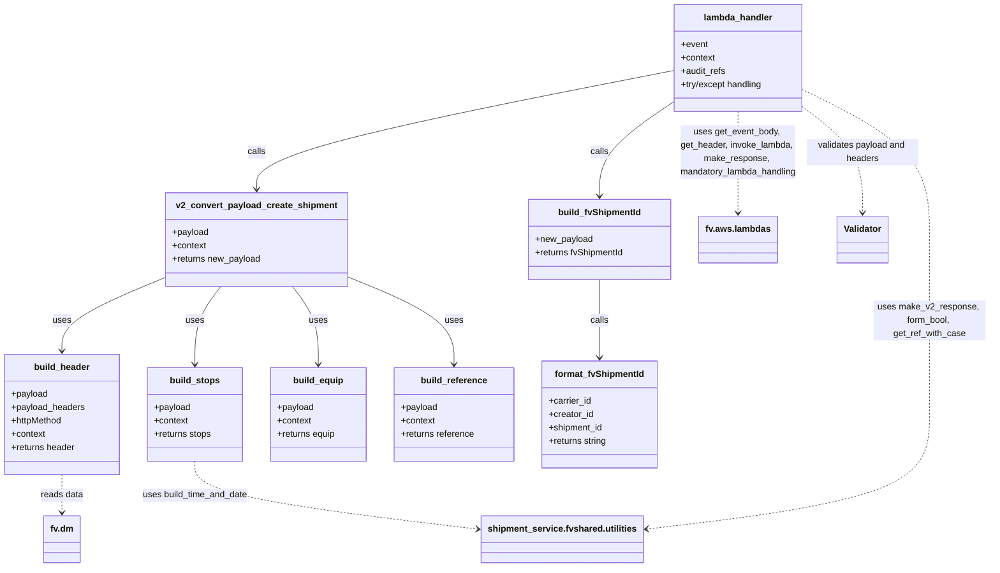

# Diagram: shipment_core/shipment_service/shipment_service/v2/post_put_shipment.py


> Auto-generated by Obscura crawlers

## Diagram 1

```mermaid
flowchart TD
    Start([Start])
    ParseBody[/get_event_body(event)/]
    BadJsonError([BadRequestError: Bad Json])
    NoBodyError([BadRequestError: Event body is not available])
    DetermineMode{shipmentReferences in body?}
    GetMode[/get_ref_with_case(...)\n-> mode]
    ValidatePayload[/Validator(event_body,\nv2_post_shipment_template...)\n-> validate_json()]
    PayloadInvalid([BadRequestError: validation message])
    ValidateHeadersMethod{httpMethod == POST / PUT / other}
    ValidateHeadersData[/Validator(event["headers"],\nv2_post_template or v2_headers_template)\n-> validate_json(is_headers=True)]
    HeadersInvalid([BadRequestError: validation message])
    validate_headers_func[/validate_headers(httpMethod, headers)/]
    HeadersWrong([BadRequestError: wrong field in header])
    ConvertPayload[/v2_convert_payload_create_shipment(payload, context)/]
    MissingField([BadRequestError: Missing field in payload])
    LoggingInfo[/logging.info("Invoked proxy shipment")/]
    DetermineAsync[/get_header("fv-async") -> form_bool/]
    InvokeLambda[/fv.aws.lambdas.invoke_lambda("proxy_shipments", ...)/]
    BuildIds[/build_fvShipmentId(new_payload)\n-> format_fvShipmentId(...)/]
    AsyncResp[/make_response(202)/]
    SyncResp[/make_v2_response(response, correlationId, shipment_id)/]
    JSONDecodeErr([BadRequestError: Invalid json])
    ParameterErr([BadRequestError: parameter error])
    ClientErr([ClientError -> re-raise])
    GenericErr([HandledException -> make_error_response -> raise])

    Start --> ParseBody
    ParseBody -- JSONDecodeError --> JSONDecodeErr
    ParseBody -- BadRequestError --> BadJsonError
    ParseBody -->|body is None| NoBodyError
    ParseBody --> DetermineMode
    DetermineMode --> GetMode
    GetMode --> ValidatePayload
    ValidatePayload -->|not validated| PayloadInvalid
    ValidatePayload --> ValidateHeadersMethod
    ValidateHeadersMethod --> ValidateHeadersData
    ValidateHeadersData -->|not validated| HeadersInvalid
    ValidateHeadersData --> validate_headers_func
    validate_headers_func -->|False| HeadersWrong
    validate_headers_func --> ConvertPayload
    ConvertPayload -->|KeyError| MissingField
    ConvertPayload --> LoggingInfo
    LoggingInfo --> DetermineAsync
    DetermineAsync --> InvokeLambda
    InvokeLambda --> BuildIds
    BuildIds -->|is_async true| AsyncResp
    BuildIds -->|is_async false| SyncResp
    JSONDecodeErr --> GenericErr
    PayloadInvalid --> GenericErr
    MissingField --> GenericErr
    ParameterErr --> GenericErr
    ClientErr --> ClientErr
```

> SVG rendering failed for this diagram.

## Diagram 2



### SVG

<svg id="container" width="1778.578125" xmlns="http://www.w3.org/2000/svg" class="classDiagram" height="1018" viewBox="0 0 1778.578125 1018" role="graphics-document document" aria-roledescription="class"><style>#container{font-family:"trebuchet ms",verdana,arial,sans-serif;font-size:16px;fill:#333;}@keyframes edge-animation-frame{from{stroke-dashoffset:0;}}@keyframes dash{to{stroke-dashoffset:0;}}#container .edge-animation-slow{stroke-dasharray:9,5!important;stroke-dashoffset:900;animation:dash 50s linear infinite;stroke-linecap:round;}#container .edge-animation-fast{stroke-dasharray:9,5!important;stroke-dashoffset:900;animation:dash 20s linear infinite;stroke-linecap:round;}#container .error-icon{fill:#552222;}#container .error-text{fill:#552222;stroke:#552222;}#container .edge-thickness-normal{stroke-width:1px;}#container .edge-thickness-thick{stroke-width:3.5px;}#container .edge-pattern-solid{stroke-dasharray:0;}#container .edge-thickness-invisible{stroke-width:0;fill:none;}#container .edge-pattern-dashed{stroke-dasharray:3;}#container .edge-pattern-dotted{stroke-dasharray:2;}#container .marker{fill:#333333;stroke:#333333;}#container .marker.cross{stroke:#333333;}#container svg{font-family:"trebuchet ms",verdana,arial,sans-serif;font-size:16px;}#container p{margin:0;}#container g.classGroup text{fill:#9370DB;stroke:none;font-family:"trebuchet ms",verdana,arial,sans-serif;font-size:10px;}#container g.classGroup text .title{font-weight:bolder;}#container .nodeLabel,#container .edgeLabel{color:#131300;}#container .edgeLabel .label rect{fill:#ECECFF;}#container .label text{fill:#131300;}#container .labelBkg{background:#ECECFF;}#container .edgeLabel .label span{background:#ECECFF;}#container .classTitle{font-weight:bolder;}#container .node rect,#container .node circle,#container .node ellipse,#container .node polygon,#container .node path{fill:#ECECFF;stroke:#9370DB;stroke-width:1px;}#container .divider{stroke:#9370DB;stroke-width:1;}#container g.clickable{cursor:pointer;}#container g.classGroup rect{fill:#ECECFF;stroke:#9370DB;}#container g.classGroup line{stroke:#9370DB;stroke-width:1;}#container .classLabel .box{stroke:none;stroke-width:0;fill:#ECECFF;opacity:0.5;}#container .classLabel .label{fill:#9370DB;font-size:10px;}#container .relation{stroke:#333333;stroke-width:1;fill:none;}#container .dashed-line{stroke-dasharray:3;}#container .dotted-line{stroke-dasharray:1 2;}#container #compositionStart,#container .composition{fill:#333333!important;stroke:#333333!important;stroke-width:1;}#container #compositionEnd,#container .composition{fill:#333333!important;stroke:#333333!important;stroke-width:1;}#container #dependencyStart,#container .dependency{fill:#333333!important;stroke:#333333!important;stroke-width:1;}#container #dependencyStart,#container .dependency{fill:#333333!important;stroke:#333333!important;stroke-width:1;}#container #extensionStart,#container .extension{fill:transparent!important;stroke:#333333!important;stroke-width:1;}#container #extensionEnd,#container .extension{fill:transparent!important;stroke:#333333!important;stroke-width:1;}#container #aggregationStart,#container .aggregation{fill:transparent!important;stroke:#333333!important;stroke-width:1;}#container #aggregationEnd,#container .aggregation{fill:transparent!important;stroke:#333333!important;stroke-width:1;}#container #lollipopStart,#container .lollipop{fill:#ECECFF!important;stroke:#333333!important;stroke-width:1;}#container #lollipopEnd,#container .lollipop{fill:#ECECFF!important;stroke:#333333!important;stroke-width:1;}#container .edgeTerminals{font-size:11px;line-height:initial;}#container .classTitleText{text-anchor:middle;font-size:18px;fill:#333;}#container .label-icon{display:inline-block;height:1em;overflow:visible;vertical-align:-0.125em;}#container .node .label-icon path{fill:currentColor;stroke:revert;stroke-width:revert;}#container :root{--mermaid-font-family:"trebuchet ms",verdana,arial,sans-serif;}</style><g><defs><marker id="container_class-aggregationStart" class="marker aggregation class" refX="18" refY="7" markerWidth="190" markerHeight="240" orient="auto"><path d="M 18,7 L9,13 L1,7 L9,1 Z"></path></marker></defs><defs><marker id="container_class-aggregationEnd" class="marker aggregation class" refX="1" refY="7" markerWidth="20" markerHeight="28" orient="auto"><path d="M 18,7 L9,13 L1,7 L9,1 Z"></path></marker></defs><defs><marker id="container_class-extensionStart" class="marker extension class" refX="18" refY="7" markerWidth="190" markerHeight="240" orient="auto"><path d="M 1,7 L18,13 V 1 Z"></path></marker></defs><defs><marker id="container_class-extensionEnd" class="marker extension class" refX="1" refY="7" markerWidth="20" markerHeight="28" orient="auto"><path d="M 1,1 V 13 L18,7 Z"></path></marker></defs><defs><marker id="container_class-compositionStart" class="marker composition class" refX="18" refY="7" markerWidth="190" markerHeight="240" orient="auto"><path d="M 18,7 L9,13 L1,7 L9,1 Z"></path></marker></defs><defs><marker id="container_class-compositionEnd" class="marker composition class" refX="1" refY="7" markerWidth="20" markerHeight="28" orient="auto"><path d="M 18,7 L9,13 L1,7 L9,1 Z"></path></marker></defs><defs><marker id="container_class-dependencyStart" class="marker dependency class" refX="6" refY="7" markerWidth="190" markerHeight="240" orient="auto"><path d="M 5,7 L9,13 L1,7 L9,1 Z"></path></marker></defs><defs><marker id="container_class-dependencyEnd" class="marker dependency class" refX="13" refY="7" markerWidth="20" markerHeight="28" orient="auto"><path d="M 18,7 L9,13 L14,7 L9,1 Z"></path></marker></defs><defs><marker id="container_class-lollipopStart" class="marker lollipop class" refX="13" refY="7" markerWidth="190" markerHeight="240" orient="auto"><circle stroke="black" fill="transparent" cx="7" cy="7" r="6"></circle></marker></defs><defs><marker id="container_class-lollipopEnd" class="marker lollipop class" refX="1" refY="7" markerWidth="190" markerHeight="240" orient="auto"><circle stroke="black" fill="transparent" cx="7" cy="7" r="6"></circle></marker></defs><g class="root"><g class="clusters"></g><g class="edgePaths"><path d="M1206.27,126.979L1081.873,151.316C957.477,175.653,708.685,224.326,584.289,259.83C459.893,295.333,459.893,317.667,459.893,328.833L459.893,340" id="id_lambda_handler_v2_convert_payload_create_shipment_1" class="edge-thickness-normal edge-pattern-solid relation" style=";;;" data-edge="true" data-et="edge" data-id="id_lambda_handler_v2_convert_payload_create_shipment_1" data-points="W3sieCI6MTIwNi4yNjk1MzEyNSwieSI6MTI2Ljk3OTIyODIzMTY5Nzh9LHsieCI6NDU5Ljg5MjU3ODEyNSwieSI6MjczfSx7IngiOjQ1OS44OTI1NzgxMjUsInkiOjM0Nn1d" marker-end="url(#container_class-dependencyEnd)"></path><path d="M1206.27,184.412L1184.703,199.177C1163.137,213.942,1120.004,243.471,1098.438,271.402C1076.871,299.333,1076.871,325.667,1076.871,338.833L1076.871,352" id="id_lambda_handler_build_fvShipmentId_2" class="edge-thickness-normal edge-pattern-solid relation" style=";;;" data-edge="true" data-et="edge" data-id="id_lambda_handler_build_fvShipmentId_2" data-points="W3sieCI6MTIwNi4yNjk1MzEyNSwieSI6MTg0LjQxMjM5MDIyMDc0NTN9LHsieCI6MTA3Ni44NzEwOTM3NSwieSI6MjczfSx7IngiOjEwNzYuODcxMDkzNzUsInkiOjM1OH1d" marker-end="url(#container_class-dependencyEnd)"></path><path d="M1076.871,502L1076.871,514.167C1076.871,526.333,1076.871,550.667,1076.871,574C1076.871,597.333,1076.871,619.667,1076.871,630.833L1076.871,642" id="id_build_fvShipmentId_format_fvShipmentId_3" class="edge-thickness-normal edge-pattern-solid relation" style=";;;" data-edge="true" data-et="edge" data-id="id_build_fvShipmentId_format_fvShipmentId_3" data-points="W3sieCI6MTA3Ni44NzEwOTM3NSwieSI6NTAyfSx7IngiOjEwNzYuODcxMDkzNzUsInkiOjU3NX0seyJ4IjoxMDc2Ljg3MTA5Mzc1LCJ5Ijo2NDh9XQ==" marker-end="url(#container_class-dependencyEnd)"></path><path d="M298.615,496.937L267.268,509.948C235.921,522.958,173.226,548.979,141.879,571.156C110.531,593.333,110.531,611.667,110.531,620.833L110.531,630" id="id_v2_convert_payload_create_shipment_build_header_4" class="edge-thickness-normal edge-pattern-solid relation" style=";;;" data-edge="true" data-et="edge" data-id="id_v2_convert_payload_create_shipment_build_header_4" data-points="W3sieCI6Mjk4LjYxNTIzNDM3NSwieSI6NDk2LjkzNzA0NDcxODg3ODd9LHsieCI6MTEwLjUzMTI1LCJ5Ijo1NzV9LHsieCI6MTEwLjUzMTI1LCJ5Ijo2MzZ9XQ==" marker-end="url(#container_class-dependencyEnd)"></path><path d="M395.434,514L387.633,524.167C379.831,534.333,364.228,554.667,356.427,578C348.625,601.333,348.625,627.667,348.625,640.833L348.625,654" id="id_v2_convert_payload_create_shipment_build_stops_5" class="edge-thickness-normal edge-pattern-solid relation" style=";;;" data-edge="true" data-et="edge" data-id="id_v2_convert_payload_create_shipment_build_stops_5" data-points="W3sieCI6Mzk1LjQzNDExOTA3MzI3NTg0LCJ5Ijo1MTR9LHsieCI6MzQ4LjYyNSwieSI6NTc1fSx7IngiOjM0OC42MjUsInkiOjY2MH1d" marker-end="url(#container_class-dependencyEnd)"></path><path d="M524.351,514L532.153,524.167C539.954,534.333,555.557,554.667,563.359,578C571.16,601.333,571.16,627.667,571.16,640.833L571.16,654" id="id_v2_convert_payload_create_shipment_build_equip_6" class="edge-thickness-normal edge-pattern-solid relation" style=";;;" data-edge="true" data-et="edge" data-id="id_v2_convert_payload_create_shipment_build_equip_6" data-points="W3sieCI6NTI0LjM1MTAzNzE3NjcyNDIsInkiOjUxNH0seyJ4Ijo1NzEuMTYwMTU2MjUsInkiOjU3NX0seyJ4Ijo1NzEuMTYwMTU2MjUsInkiOjY2MH1d" marker-end="url(#container_class-dependencyEnd)"></path><path d="M621.17,495.783L653.539,508.986C685.908,522.189,750.645,548.594,783.014,574.964C815.383,601.333,815.383,627.667,815.383,640.833L815.383,654" id="id_v2_convert_payload_create_shipment_build_reference_7" class="edge-thickness-normal edge-pattern-solid relation" style=";;;" data-edge="true" data-et="edge" data-id="id_v2_convert_payload_create_shipment_build_reference_7" data-points="W3sieCI6NjIxLjE2OTkyMTg3NSwieSI6NDk1Ljc4MzAwMjEyNjI0NTE1fSx7IngiOjgxNS4zODI4MTI1LCJ5Ijo1NzV9LHsieCI6ODE1LjM4MjgxMjUsInkiOjY2MH1d" marker-end="url(#container_class-dependencyEnd)"></path><path d="M110.531,852L110.531,858.167C110.531,864.333,110.531,876.667,110.531,888C110.531,899.333,110.531,909.667,110.531,914.833L110.531,920" id="id_build_header_fv.dm_8" class="edge-thickness-normal edge-pattern-dashed relation" style=";;;" data-edge="true" data-et="edge" data-id="id_build_header_fv.dm_8" data-points="W3sieCI6MTEwLjUzMTI1LCJ5Ijo4NTJ9LHsieCI6MTEwLjUzMTI1LCJ5Ijo4ODl9LHsieCI6MTEwLjUzMTI1LCJ5Ijo5MjZ9XQ==" marker-end="url(#container_class-dependencyEnd)"></path><path d="M348.625,828L348.625,838.167C348.625,848.333,348.625,868.667,434.439,889.09C520.254,909.513,691.882,930.026,777.697,940.283L863.511,950.539" id="id_build_stops_shipment_service.fvshared.utilities_9" class="edge-thickness-normal edge-pattern-dashed relation" style=";;;" data-edge="true" data-et="edge" data-id="id_build_stops_shipment_service.fvshared.utilities_9" data-points="W3sieCI6MzQ4LjYyNSwieSI6ODI4fSx7IngiOjM0OC42MjUsInkiOjg4OX0seyJ4Ijo4NjkuNDY4NzUsInkiOjk1MS4yNTEzMDkwMjQyODkzfV0=" marker-end="url(#container_class-dependencyEnd)"></path><path d="M1323.727,200L1323.727,212.167C1323.727,224.333,1323.727,248.667,1323.727,279C1323.727,309.333,1323.727,345.667,1323.727,363.833L1323.727,382" id="id_lambda_handler_fv.aws.lambdas_10" class="edge-thickness-normal edge-pattern-dashed relation" style=";;;" data-edge="true" data-et="edge" data-id="id_lambda_handler_fv.aws.lambdas_10" data-points="W3sieCI6MTMyMy43MjY1NjI1LCJ5IjoyMDB9LHsieCI6MTMyMy43MjY1NjI1LCJ5IjoyNzN9LHsieCI6MTMyMy43MjY1NjI1LCJ5IjozODh9XQ==" marker-end="url(#container_class-dependencyEnd)"></path><path d="M1441.184,191.503L1459.416,205.086C1477.648,218.669,1514.113,245.834,1532.346,277.584C1550.578,309.333,1550.578,345.667,1550.578,363.833L1550.578,382" id="id_lambda_handler_Validator_11" class="edge-thickness-normal edge-pattern-dashed relation" style=";;;" data-edge="true" data-et="edge" data-id="id_lambda_handler_Validator_11" data-points="W3sieCI6MTQ0MS4xODM1OTM3NSwieSI6MTkxLjUwMzIwMjgxMDIwNzY1fSx7IngiOjE1NTAuNTc4MTI1LCJ5IjoyNzN9LHsieCI6MTU1MC41NzgxMjUsInkiOjM4OH1d" marker-end="url(#container_class-dependencyEnd)"></path><path d="M1441.184,161.23L1479.416,179.858C1517.648,198.487,1594.113,235.743,1632.346,280.538C1670.578,325.333,1670.578,377.667,1670.578,428C1670.578,478.333,1670.578,526.667,1670.578,579C1670.578,631.333,1670.578,687.667,1670.578,740C1670.578,792.333,1670.578,840.667,1584.764,875.09C1498.949,909.513,1327.321,930.026,1241.506,940.283L1155.692,950.539" id="id_lambda_handler_shipment_service.fvshared.utilities_12" class="edge-thickness-normal edge-pattern-dashed relation" style=";;;" data-edge="true" data-et="edge" data-id="id_lambda_handler_shipment_service.fvshared.utilities_12" data-points="W3sieCI6MTQ0MS4xODM1OTM3NSwieSI6MTYxLjIyOTc3OTAzOTEyNDI1fSx7IngiOjE2NzAuNTc4MTI1LCJ5IjoyNzN9LHsieCI6MTY3MC41NzgxMjUsInkiOjQzMH0seyJ4IjoxNjcwLjU3ODEyNSwieSI6NTc1fSx7IngiOjE2NzAuNTc4MTI1LCJ5Ijo3NDR9LHsieCI6MTY3MC41NzgxMjUsInkiOjg4OX0seyJ4IjoxMTQ5LjczNDM3NSwieSI6OTUxLjI1MTMwOTAyNDI4OTN9XQ==" marker-end="url(#container_class-dependencyEnd)"></path></g><g class="edgeLabels"><g class="edgeLabel" transform="translate(459.892578125, 273)"><g class="label" data-id="id_lambda_handler_v2_convert_payload_create_shipment_1" transform="translate(-16.4453125, -12)"><foreignObject width="32.890625" height="24"><div xmlns="http://www.w3.org/1999/xhtml" class="labelBkg" style="display: table-cell; white-space: nowrap; line-height: 1.5; max-width: 200px; text-align: center;"><span class="edgeLabel"><p>calls</p></span></div></foreignObject></g></g><g class="edgeLabel" transform="translate(1076.87109375, 273)"><g class="label" data-id="id_lambda_handler_build_fvShipmentId_2" transform="translate(-16.4453125, -12)"><foreignObject width="32.890625" height="24"><div xmlns="http://www.w3.org/1999/xhtml" class="labelBkg" style="display: table-cell; white-space: nowrap; line-height: 1.5; max-width: 200px; text-align: center;"><span class="edgeLabel"><p>calls</p></span></div></foreignObject></g></g><g class="edgeLabel" transform="translate(1076.87109375, 575)"><g class="label" data-id="id_build_fvShipmentId_format_fvShipmentId_3" transform="translate(-16.4453125, -12)"><foreignObject width="32.890625" height="24"><div xmlns="http://www.w3.org/1999/xhtml" class="labelBkg" style="display: table-cell; white-space: nowrap; line-height: 1.5; max-width: 200px; text-align: center;"><span class="edgeLabel"><p>calls</p></span></div></foreignObject></g></g><g class="edgeLabel" transform="translate(110.53125, 575)"><g class="label" data-id="id_v2_convert_payload_create_shipment_build_header_4" transform="translate(-16.4921875, -12)"><foreignObject width="32.984375" height="24"><div xmlns="http://www.w3.org/1999/xhtml" class="labelBkg" style="display: table-cell; white-space: nowrap; line-height: 1.5; max-width: 200px; text-align: center;"><span class="edgeLabel"><p>uses</p></span></div></foreignObject></g></g><g class="edgeLabel" transform="translate(348.625, 575)"><g class="label" data-id="id_v2_convert_payload_create_shipment_build_stops_5" transform="translate(-16.4921875, -12)"><foreignObject width="32.984375" height="24"><div xmlns="http://www.w3.org/1999/xhtml" class="labelBkg" style="display: table-cell; white-space: nowrap; line-height: 1.5; max-width: 200px; text-align: center;"><span class="edgeLabel"><p>uses</p></span></div></foreignObject></g></g><g class="edgeLabel" transform="translate(571.16015625, 575)"><g class="label" data-id="id_v2_convert_payload_create_shipment_build_equip_6" transform="translate(-16.4921875, -12)"><foreignObject width="32.984375" height="24"><div xmlns="http://www.w3.org/1999/xhtml" class="labelBkg" style="display: table-cell; white-space: nowrap; line-height: 1.5; max-width: 200px; text-align: center;"><span class="edgeLabel"><p>uses</p></span></div></foreignObject></g></g><g class="edgeLabel" transform="translate(815.3828125, 575)"><g class="label" data-id="id_v2_convert_payload_create_shipment_build_reference_7" transform="translate(-16.4921875, -12)"><foreignObject width="32.984375" height="24"><div xmlns="http://www.w3.org/1999/xhtml" class="labelBkg" style="display: table-cell; white-space: nowrap; line-height: 1.5; max-width: 200px; text-align: center;"><span class="edgeLabel"><p>uses</p></span></div></foreignObject></g></g><g class="edgeLabel" transform="translate(110.53125, 889)"><g class="label" data-id="id_build_header_fv.dm_8" transform="translate(-38.4453125, -12)"><foreignObject width="76.890625" height="24"><div xmlns="http://www.w3.org/1999/xhtml" class="labelBkg" style="display: table-cell; white-space: nowrap; line-height: 1.5; max-width: 200px; text-align: center;"><span class="edgeLabel"><p>reads data</p></span></div></foreignObject></g></g><g class="edgeLabel" transform="translate(348.625, 889)"><g class="label" data-id="id_build_stops_shipment_service.fvshared.utilities_9" transform="translate(-95.6484375, -12)"><foreignObject width="191.296875" height="24"><div xmlns="http://www.w3.org/1999/xhtml" class="labelBkg" style="display: table-cell; white-space: nowrap; line-height: 1.5; max-width: 200px; text-align: center;"><span class="edgeLabel"><p>uses build_time_and_date</p></span></div></foreignObject></g></g><g class="edgeLabel" transform="translate(1323.7265625, 273)"><g class="label" data-id="id_lambda_handler_fv.aws.lambdas_10" transform="translate(-106.8515625, -48)"><foreignObject width="213.703125" height="96"><div xmlns="http://www.w3.org/1999/xhtml" class="labelBkg" style="display: table; white-space: break-spaces; line-height: 1.5; max-width: 200px; text-align: center; width: 200px;"><span class="edgeLabel"><p>uses get_event_body, get_header, invoke_lambda, make_response, mandatory_lambda_handling</p></span></div></foreignObject></g></g><g class="edgeLabel" transform="translate(1550.578125, 273)"><g class="label" data-id="id_lambda_handler_Validator_11" transform="translate(-100, -24)"><foreignObject width="200" height="48"><div xmlns="http://www.w3.org/1999/xhtml" class="labelBkg" style="display: table; white-space: break-spaces; line-height: 1.5; max-width: 200px; text-align: center; width: 200px;"><span class="edgeLabel"><p>validates payload and headers</p></span></div></foreignObject></g></g><g class="edgeLabel" transform="translate(1670.578125, 575)"><g class="label" data-id="id_lambda_handler_shipment_service.fvshared.utilities_12" transform="translate(-100, -36)"><foreignObject width="200" height="72"><div xmlns="http://www.w3.org/1999/xhtml" class="labelBkg" style="display: table; white-space: break-spaces; line-height: 1.5; max-width: 200px; text-align: center; width: 200px;"><span class="edgeLabel"><p>uses make_v2_response, form_bool, get_ref_with_case</p></span></div></foreignObject></g></g></g><g class="nodes"><g class="node default" id="classId-lambda_handler-0" transform="translate(1323.7265625, 104)"><g class="basic label-container"><path d="M-117.45703125 -96 L117.45703125 -96 L117.45703125 96 L-117.45703125 96" stroke="none" stroke-width="0" fill="#ECECFF" style=""></path><path d="M-117.45703125 -96 C-50.28881507258082 -96, 16.879401104838365 -96, 117.45703125 -96 M-117.45703125 -96 C-49.57754640538505 -96, 18.3019384392299 -96, 117.45703125 -96 M117.45703125 -96 C117.45703125 -54.800821503725146, 117.45703125 -13.601643007450292, 117.45703125 96 M117.45703125 -96 C117.45703125 -30.998862628314697, 117.45703125 34.002274743370606, 117.45703125 96 M117.45703125 96 C69.4590782519266 96, 21.46112525385321 96, -117.45703125 96 M117.45703125 96 C36.036610150595706 96, -45.38381094880859 96, -117.45703125 96 M-117.45703125 96 C-117.45703125 45.66020414119467, -117.45703125 -4.679591717610663, -117.45703125 -96 M-117.45703125 96 C-117.45703125 38.649788127906646, -117.45703125 -18.700423744186708, -117.45703125 -96" stroke="#9370DB" stroke-width="1.3" fill="none" stroke-dasharray="0 0" style=""></path></g><g class="annotation-group text" transform="translate(0, -72)"></g><g class="label-group text" transform="translate(-59.9765625, -72)"><g class="label" style="font-weight: bolder" transform="translate(0,-12)"><foreignObject width="119.953125" height="24"><div xmlns="http://www.w3.org/1999/xhtml" style="display: table-cell; white-space: nowrap; line-height: 1.5; max-width: 170px; text-align: center;"><span class="nodeLabel markdown-node-label" style=""><p>lambda_handler</p></span></div></foreignObject></g></g><g class="members-group text" transform="translate(-105.45703125, -24)"><g class="label" style="" transform="translate(0,-12)"><foreignObject width="48.328125" height="24"><div xmlns="http://www.w3.org/1999/xhtml" style="display: table-cell; white-space: nowrap; line-height: 1.5; max-width: 106px; text-align: center;"><span class="nodeLabel markdown-node-label" style=""><p>+event</p></span></div></foreignObject></g><g class="label" style="" transform="translate(0,12)"><foreignObject width="61.6875" height="24"><div xmlns="http://www.w3.org/1999/xhtml" style="display: table-cell; white-space: nowrap; line-height: 1.5; max-width: 119px; text-align: center;"><span class="nodeLabel markdown-node-label" style=""><p>+context</p></span></div></foreignObject></g><g class="label" style="" transform="translate(0,36)"><foreignObject width="81.109375" height="24"><div xmlns="http://www.w3.org/1999/xhtml" style="display: table-cell; white-space: nowrap; line-height: 1.5; max-width: 138px; text-align: center;"><span class="nodeLabel markdown-node-label" style=""><p>+audit_refs</p></span></div></foreignObject></g><g class="label" style="" transform="translate(0,60)"><foreignObject width="150.9375" height="24"><div xmlns="http://www.w3.org/1999/xhtml" style="display: table-cell; white-space: nowrap; line-height: 1.5; max-width: 209px; text-align: center;"><span class="nodeLabel markdown-node-label" style=""><p>+try/except handling</p></span></div></foreignObject></g></g><g class="methods-group text" transform="translate(-105.45703125, 96)"></g><g class="divider" style=""><path d="M-117.45703125 -48 C-24.339809845766595 -48, 68.77741155846681 -48, 117.45703125 -48 M-117.45703125 -48 C-49.62003225305797 -48, 18.216966743884058 -48, 117.45703125 -48" stroke="#9370DB" stroke-width="1.3" fill="none" stroke-dasharray="0 0" style=""></path></g><g class="divider" style=""><path d="M-117.45703125 72 C-37.5496390665225 72, 42.357753116954996 72, 117.45703125 72 M-117.45703125 72 C-37.752327504321954 72, 41.95237624135609 72, 117.45703125 72" stroke="#9370DB" stroke-width="1.3" fill="none" stroke-dasharray="0 0" style=""></path></g></g><g class="node default" id="classId-v2_convert_payload_create_shipment-1" transform="translate(459.892578125, 430)"><g class="basic label-container"><path d="M-161.27734375 -84 L161.27734375 -84 L161.27734375 84 L-161.27734375 84" stroke="none" stroke-width="0" fill="#ECECFF" style=""></path><path d="M-161.27734375 -84 C-74.51562841139231 -84, 12.246086927215373 -84, 161.27734375 -84 M-161.27734375 -84 C-43.27275766252593 -84, 74.73182842494813 -84, 161.27734375 -84 M161.27734375 -84 C161.27734375 -36.319564401224945, 161.27734375 11.36087119755011, 161.27734375 84 M161.27734375 -84 C161.27734375 -26.965722273740305, 161.27734375 30.06855545251939, 161.27734375 84 M161.27734375 84 C49.552545650863166 84, -62.17225244827367 84, -161.27734375 84 M161.27734375 84 C83.75204530063175 84, 6.226746851263499 84, -161.27734375 84 M-161.27734375 84 C-161.27734375 45.05775360490236, -161.27734375 6.1155072098047185, -161.27734375 -84 M-161.27734375 84 C-161.27734375 31.96056628421691, -161.27734375 -20.07886743156618, -161.27734375 -84" stroke="#9370DB" stroke-width="1.3" fill="none" stroke-dasharray="0 0" style=""></path></g><g class="annotation-group text" transform="translate(0, -60)"></g><g class="label-group text" transform="translate(-138.4765625, -60)"><g class="label" style="font-weight: bolder" transform="translate(0,-12)"><foreignObject width="276.953125" height="24"><div xmlns="http://www.w3.org/1999/xhtml" style="display: table-cell; white-space: nowrap; line-height: 1.5; max-width: 324px; text-align: center;"><span class="nodeLabel markdown-node-label" style=""><p>v2_convert_payload_create_shipment</p></span></div></foreignObject></g></g><g class="members-group text" transform="translate(-149.27734375, -12)"><g class="label" style="" transform="translate(0,-12)"><foreignObject width="65.734375" height="24"><div xmlns="http://www.w3.org/1999/xhtml" style="display: table-cell; white-space: nowrap; line-height: 1.5; max-width: 123px; text-align: center;"><span class="nodeLabel markdown-node-label" style=""><p>+payload</p></span></div></foreignObject></g><g class="label" style="" transform="translate(0,12)"><foreignObject width="61.6875" height="24"><div xmlns="http://www.w3.org/1999/xhtml" style="display: table-cell; white-space: nowrap; line-height: 1.5; max-width: 119px; text-align: center;"><span class="nodeLabel markdown-node-label" style=""><p>+context</p></span></div></foreignObject></g><g class="label" style="" transform="translate(0,36)"><foreignObject width="160.078125" height="24"><div xmlns="http://www.w3.org/1999/xhtml" style="display: table-cell; white-space: nowrap; line-height: 1.5; max-width: 217px; text-align: center;"><span class="nodeLabel markdown-node-label" style=""><p>+returns new_payload</p></span></div></foreignObject></g></g><g class="methods-group text" transform="translate(-149.27734375, 84)"></g><g class="divider" style=""><path d="M-161.27734375 -36 C-62.76742636037528 -36, 35.742491029249436 -36, 161.27734375 -36 M-161.27734375 -36 C-84.77284285893644 -36, -8.268341967872885 -36, 161.27734375 -36" stroke="#9370DB" stroke-width="1.3" fill="none" stroke-dasharray="0 0" style=""></path></g><g class="divider" style=""><path d="M-161.27734375 60 C-64.35303200335493 60, 32.57127974329015 60, 161.27734375 60 M-161.27734375 60 C-44.658381859669774 60, 71.96058003066045 60, 161.27734375 60" stroke="#9370DB" stroke-width="1.3" fill="none" stroke-dasharray="0 0" style=""></path></g></g><g class="node default" id="classId-build_header-2" transform="translate(110.53125, 744)"><g class="basic label-container"><path d="M-102.53125 -108 L102.53125 -108 L102.53125 108 L-102.53125 108" stroke="none" stroke-width="0" fill="#ECECFF" style=""></path><path d="M-102.53125 -108 C-46.00733915470714 -108, 10.516571690585721 -108, 102.53125 -108 M-102.53125 -108 C-36.86524594712533 -108, 28.80075810574934 -108, 102.53125 -108 M102.53125 -108 C102.53125 -51.7293580424788, 102.53125 4.541283915042399, 102.53125 108 M102.53125 -108 C102.53125 -59.64297054579142, 102.53125 -11.285941091582842, 102.53125 108 M102.53125 108 C56.229200961717034 108, 9.927151923434067 108, -102.53125 108 M102.53125 108 C53.05707994579387 108, 3.5829098915877466 108, -102.53125 108 M-102.53125 108 C-102.53125 46.840108690861726, -102.53125 -14.319782618276548, -102.53125 -108 M-102.53125 108 C-102.53125 43.538079035144165, -102.53125 -20.92384192971167, -102.53125 -108" stroke="#9370DB" stroke-width="1.3" fill="none" stroke-dasharray="0 0" style=""></path></g><g class="annotation-group text" transform="translate(0, -84)"></g><g class="label-group text" transform="translate(-48.671875, -84)"><g class="label" style="font-weight: bolder" transform="translate(0,-12)"><foreignObject width="97.34375" height="24"><div xmlns="http://www.w3.org/1999/xhtml" style="display: table-cell; white-space: nowrap; line-height: 1.5; max-width: 148px; text-align: center;"><span class="nodeLabel markdown-node-label" style=""><p>build_header</p></span></div></foreignObject></g></g><g class="members-group text" transform="translate(-90.53125, -36)"><g class="label" style="" transform="translate(0,-12)"><foreignObject width="65.734375" height="24"><div xmlns="http://www.w3.org/1999/xhtml" style="display: table-cell; white-space: nowrap; line-height: 1.5; max-width: 123px; text-align: center;"><span class="nodeLabel markdown-node-label" style=""><p>+payload</p></span></div></foreignObject></g><g class="label" style="" transform="translate(0,12)"><foreignObject width="132.390625" height="24"><div xmlns="http://www.w3.org/1999/xhtml" style="display: table-cell; white-space: nowrap; line-height: 1.5; max-width: 190px; text-align: center;"><span class="nodeLabel markdown-node-label" style=""><p>+payload_headers</p></span></div></foreignObject></g><g class="label" style="" transform="translate(0,36)"><foreignObject width="93.65625" height="24"><div xmlns="http://www.w3.org/1999/xhtml" style="display: table-cell; white-space: nowrap; line-height: 1.5; max-width: 151px; text-align: center;"><span class="nodeLabel markdown-node-label" style=""><p>+httpMethod</p></span></div></foreignObject></g><g class="label" style="" transform="translate(0,60)"><foreignObject width="61.6875" height="24"><div xmlns="http://www.w3.org/1999/xhtml" style="display: table-cell; white-space: nowrap; line-height: 1.5; max-width: 119px; text-align: center;"><span class="nodeLabel markdown-node-label" style=""><p>+context</p></span></div></foreignObject></g><g class="label" style="" transform="translate(0,84)"><foreignObject width="115.859375" height="24"><div xmlns="http://www.w3.org/1999/xhtml" style="display: table-cell; white-space: nowrap; line-height: 1.5; max-width: 174px; text-align: center;"><span class="nodeLabel markdown-node-label" style=""><p>+returns header</p></span></div></foreignObject></g></g><g class="methods-group text" transform="translate(-90.53125, 108)"></g><g class="divider" style=""><path d="M-102.53125 -60 C-20.77560305472602 -60, 60.98004389054796 -60, 102.53125 -60 M-102.53125 -60 C-40.624229178807774 -60, 21.282791642384453 -60, 102.53125 -60" stroke="#9370DB" stroke-width="1.3" fill="none" stroke-dasharray="0 0" style=""></path></g><g class="divider" style=""><path d="M-102.53125 84 C-50.54986668141106 84, 1.4315166371778787 84, 102.53125 84 M-102.53125 84 C-56.91984829982867 84, -11.308446599657344 84, 102.53125 84" stroke="#9370DB" stroke-width="1.3" fill="none" stroke-dasharray="0 0" style=""></path></g></g><g class="node default" id="classId-build_stops-3" transform="translate(348.625, 744)"><g class="basic label-container"><path d="M-85.5625 -84 L85.5625 -84 L85.5625 84 L-85.5625 84" stroke="none" stroke-width="0" fill="#ECECFF" style=""></path><path d="M-85.5625 -84 C-22.604855054103645 -84, 40.35278989179271 -84, 85.5625 -84 M-85.5625 -84 C-50.70226726003012 -84, -15.842034520060238 -84, 85.5625 -84 M85.5625 -84 C85.5625 -31.95137943905568, 85.5625 20.097241121888644, 85.5625 84 M85.5625 -84 C85.5625 -31.348880055162248, 85.5625 21.302239889675505, 85.5625 84 M85.5625 84 C35.91318297285595 84, -13.736134054288101 84, -85.5625 84 M85.5625 84 C28.450987692466633 84, -28.660524615066734 84, -85.5625 84 M-85.5625 84 C-85.5625 42.94069866020025, -85.5625 1.8813973204004952, -85.5625 -84 M-85.5625 84 C-85.5625 47.15440527099468, -85.5625 10.30881054198936, -85.5625 -84" stroke="#9370DB" stroke-width="1.3" fill="none" stroke-dasharray="0 0" style=""></path></g><g class="annotation-group text" transform="translate(0, -60)"></g><g class="label-group text" transform="translate(-43.03125, -60)"><g class="label" style="font-weight: bolder" transform="translate(0,-12)"><foreignObject width="86.0625" height="24"><div xmlns="http://www.w3.org/1999/xhtml" style="display: table-cell; white-space: nowrap; line-height: 1.5; max-width: 135px; text-align: center;"><span class="nodeLabel markdown-node-label" style=""><p>build_stops</p></span></div></foreignObject></g></g><g class="members-group text" transform="translate(-73.5625, -12)"><g class="label" style="" transform="translate(0,-12)"><foreignObject width="65.734375" height="24"><div xmlns="http://www.w3.org/1999/xhtml" style="display: table-cell; white-space: nowrap; line-height: 1.5; max-width: 123px; text-align: center;"><span class="nodeLabel markdown-node-label" style=""><p>+payload</p></span></div></foreignObject></g><g class="label" style="" transform="translate(0,12)"><foreignObject width="61.6875" height="24"><div xmlns="http://www.w3.org/1999/xhtml" style="display: table-cell; white-space: nowrap; line-height: 1.5; max-width: 119px; text-align: center;"><span class="nodeLabel markdown-node-label" style=""><p>+context</p></span></div></foreignObject></g><g class="label" style="" transform="translate(0,36)"><foreignObject width="104.09375" height="24"><div xmlns="http://www.w3.org/1999/xhtml" style="display: table-cell; white-space: nowrap; line-height: 1.5; max-width: 161px; text-align: center;"><span class="nodeLabel markdown-node-label" style=""><p>+returns stops</p></span></div></foreignObject></g></g><g class="methods-group text" transform="translate(-73.5625, 84)"></g><g class="divider" style=""><path d="M-85.5625 -36 C-22.8124606875557 -36, 39.9375786248886 -36, 85.5625 -36 M-85.5625 -36 C-35.55443159396317 -36, 14.453636812073654 -36, 85.5625 -36" stroke="#9370DB" stroke-width="1.3" fill="none" stroke-dasharray="0 0" style=""></path></g><g class="divider" style=""><path d="M-85.5625 60 C-31.860284326832662 60, 21.841931346334675 60, 85.5625 60 M-85.5625 60 C-28.851575437708057 60, 27.859349124583886 60, 85.5625 60" stroke="#9370DB" stroke-width="1.3" fill="none" stroke-dasharray="0 0" style=""></path></g></g><g class="node default" id="classId-build_equip-4" transform="translate(571.16015625, 744)"><g class="basic label-container"><path d="M-86.97265625 -84 L86.97265625 -84 L86.97265625 84 L-86.97265625 84" stroke="none" stroke-width="0" fill="#ECECFF" style=""></path><path d="M-86.97265625 -84 C-50.54230351870204 -84, -14.111950787404083 -84, 86.97265625 -84 M-86.97265625 -84 C-18.476005859230526 -84, 50.02064453153895 -84, 86.97265625 -84 M86.97265625 -84 C86.97265625 -38.65828782867572, 86.97265625 6.683424342648564, 86.97265625 84 M86.97265625 -84 C86.97265625 -40.717582041367024, 86.97265625 2.5648359172659525, 86.97265625 84 M86.97265625 84 C21.53582765434271 84, -43.90100094131458 84, -86.97265625 84 M86.97265625 84 C25.6916047416775 84, -35.589446766645 84, -86.97265625 84 M-86.97265625 84 C-86.97265625 32.78353058018251, -86.97265625 -18.432938839634986, -86.97265625 -84 M-86.97265625 84 C-86.97265625 18.42314365132573, -86.97265625 -47.15371269734854, -86.97265625 -84" stroke="#9370DB" stroke-width="1.3" fill="none" stroke-dasharray="0 0" style=""></path></g><g class="annotation-group text" transform="translate(0, -60)"></g><g class="label-group text" transform="translate(-43.5703125, -60)"><g class="label" style="font-weight: bolder" transform="translate(0,-12)"><foreignObject width="87.140625" height="24"><div xmlns="http://www.w3.org/1999/xhtml" style="display: table-cell; white-space: nowrap; line-height: 1.5; max-width: 137px; text-align: center;"><span class="nodeLabel markdown-node-label" style=""><p>build_equip</p></span></div></foreignObject></g></g><g class="members-group text" transform="translate(-74.97265625, -12)"><g class="label" style="" transform="translate(0,-12)"><foreignObject width="65.734375" height="24"><div xmlns="http://www.w3.org/1999/xhtml" style="display: table-cell; white-space: nowrap; line-height: 1.5; max-width: 123px; text-align: center;"><span class="nodeLabel markdown-node-label" style=""><p>+payload</p></span></div></foreignObject></g><g class="label" style="" transform="translate(0,12)"><foreignObject width="61.6875" height="24"><div xmlns="http://www.w3.org/1999/xhtml" style="display: table-cell; white-space: nowrap; line-height: 1.5; max-width: 119px; text-align: center;"><span class="nodeLabel markdown-node-label" style=""><p>+context</p></span></div></foreignObject></g><g class="label" style="" transform="translate(0,36)"><foreignObject width="106.375" height="24"><div xmlns="http://www.w3.org/1999/xhtml" style="display: table-cell; white-space: nowrap; line-height: 1.5; max-width: 164px; text-align: center;"><span class="nodeLabel markdown-node-label" style=""><p>+returns equip</p></span></div></foreignObject></g></g><g class="methods-group text" transform="translate(-74.97265625, 84)"></g><g class="divider" style=""><path d="M-86.97265625 -36 C-28.05436442790385 -36, 30.863927394192302 -36, 86.97265625 -36 M-86.97265625 -36 C-41.33455546759663 -36, 4.30354531480674 -36, 86.97265625 -36" stroke="#9370DB" stroke-width="1.3" fill="none" stroke-dasharray="0 0" style=""></path></g><g class="divider" style=""><path d="M-86.97265625 60 C-33.127740983189035 60, 20.71717428362193 60, 86.97265625 60 M-86.97265625 60 C-41.718905813312006 60, 3.5348446233759887 60, 86.97265625 60" stroke="#9370DB" stroke-width="1.3" fill="none" stroke-dasharray="0 0" style=""></path></g></g><g class="node default" id="classId-build_reference-5" transform="translate(815.3828125, 744)"><g class="basic label-container"><path d="M-107.25 -84 L107.25 -84 L107.25 84 L-107.25 84" stroke="none" stroke-width="0" fill="#ECECFF" style=""></path><path d="M-107.25 -84 C-32.955326073396435 -84, 41.33934785320713 -84, 107.25 -84 M-107.25 -84 C-56.641333176167656 -84, -6.032666352335312 -84, 107.25 -84 M107.25 -84 C107.25 -38.31998962799472, 107.25 7.360020744010555, 107.25 84 M107.25 -84 C107.25 -35.39434603213596, 107.25 13.211307935728087, 107.25 84 M107.25 84 C25.96664840316967 84, -55.31670319366066 84, -107.25 84 M107.25 84 C40.75962379199238 84, -25.730752416015235 84, -107.25 84 M-107.25 84 C-107.25 44.27900064646189, -107.25 4.558001292923777, -107.25 -84 M-107.25 84 C-107.25 48.25517354207807, -107.25 12.510347084156137, -107.25 -84" stroke="#9370DB" stroke-width="1.3" fill="none" stroke-dasharray="0 0" style=""></path></g><g class="annotation-group text" transform="translate(0, -60)"></g><g class="label-group text" transform="translate(-57.5625, -60)"><g class="label" style="font-weight: bolder" transform="translate(0,-12)"><foreignObject width="115.125" height="24"><div xmlns="http://www.w3.org/1999/xhtml" style="display: table-cell; white-space: nowrap; line-height: 1.5; max-width: 164px; text-align: center;"><span class="nodeLabel markdown-node-label" style=""><p>build_reference</p></span></div></foreignObject></g></g><g class="members-group text" transform="translate(-95.25, -12)"><g class="label" style="" transform="translate(0,-12)"><foreignObject width="65.734375" height="24"><div xmlns="http://www.w3.org/1999/xhtml" style="display: table-cell; white-space: nowrap; line-height: 1.5; max-width: 123px; text-align: center;"><span class="nodeLabel markdown-node-label" style=""><p>+payload</p></span></div></foreignObject></g><g class="label" style="" transform="translate(0,12)"><foreignObject width="61.6875" height="24"><div xmlns="http://www.w3.org/1999/xhtml" style="display: table-cell; white-space: nowrap; line-height: 1.5; max-width: 119px; text-align: center;"><span class="nodeLabel markdown-node-label" style=""><p>+context</p></span></div></foreignObject></g><g class="label" style="" transform="translate(0,36)"><foreignObject width="132.9375" height="24"><div xmlns="http://www.w3.org/1999/xhtml" style="display: table-cell; white-space: nowrap; line-height: 1.5; max-width: 190px; text-align: center;"><span class="nodeLabel markdown-node-label" style=""><p>+returns reference</p></span></div></foreignObject></g></g><g class="methods-group text" transform="translate(-95.25, 84)"></g><g class="divider" style=""><path d="M-107.25 -36 C-57.73351943826641 -36, -8.217038876532825 -36, 107.25 -36 M-107.25 -36 C-49.49613442463753 -36, 8.257731150724936 -36, 107.25 -36" stroke="#9370DB" stroke-width="1.3" fill="none" stroke-dasharray="0 0" style=""></path></g><g class="divider" style=""><path d="M-107.25 60 C-54.578614096416246 60, -1.9072281928324912 60, 107.25 60 M-107.25 60 C-52.244861720426414 60, 2.7602765591471723 60, 107.25 60" stroke="#9370DB" stroke-width="1.3" fill="none" stroke-dasharray="0 0" style=""></path></g></g><g class="node default" id="classId-build_fvShipmentId-6" transform="translate(1076.87109375, 430)"><g class="basic label-container"><path d="M-128.95703125 -72 L128.95703125 -72 L128.95703125 72 L-128.95703125 72" stroke="none" stroke-width="0" fill="#ECECFF" style=""></path><path d="M-128.95703125 -72 C-61.15982272551186 -72, 6.637385798976283 -72, 128.95703125 -72 M-128.95703125 -72 C-40.49649075585181 -72, 47.96404973829638 -72, 128.95703125 -72 M128.95703125 -72 C128.95703125 -26.35790572523944, 128.95703125 19.28418854952112, 128.95703125 72 M128.95703125 -72 C128.95703125 -18.262941453803045, 128.95703125 35.47411709239391, 128.95703125 72 M128.95703125 72 C39.96644564020981 72, -49.024139969580375 72, -128.95703125 72 M128.95703125 72 C32.12048536460513 72, -64.71606052078974 72, -128.95703125 72 M-128.95703125 72 C-128.95703125 31.93413883788199, -128.95703125 -8.131722324236023, -128.95703125 -72 M-128.95703125 72 C-128.95703125 16.186795546053723, -128.95703125 -39.626408907892554, -128.95703125 -72" stroke="#9370DB" stroke-width="1.3" fill="none" stroke-dasharray="0 0" style=""></path></g><g class="annotation-group text" transform="translate(0, -48)"></g><g class="label-group text" transform="translate(-71.9453125, -48)"><g class="label" style="font-weight: bolder" transform="translate(0,-12)"><foreignObject width="143.890625" height="24"><div xmlns="http://www.w3.org/1999/xhtml" style="display: table-cell; white-space: nowrap; line-height: 1.5; max-width: 193px; text-align: center;"><span class="nodeLabel markdown-node-label" style=""><p>build_fvShipmentId</p></span></div></foreignObject></g></g><g class="members-group text" transform="translate(-116.95703125, 0)"><g class="label" style="" transform="translate(0,-12)"><foreignObject width="103.296875" height="24"><div xmlns="http://www.w3.org/1999/xhtml" style="display: table-cell; white-space: nowrap; line-height: 1.5; max-width: 161px; text-align: center;"><span class="nodeLabel markdown-node-label" style=""><p>+new_payload</p></span></div></foreignObject></g><g class="label" style="" transform="translate(0,12)"><foreignObject width="161.96875" height="24"><div xmlns="http://www.w3.org/1999/xhtml" style="display: table-cell; white-space: nowrap; line-height: 1.5; max-width: 219px; text-align: center;"><span class="nodeLabel markdown-node-label" style=""><p>+returns fvShipmentId</p></span></div></foreignObject></g></g><g class="methods-group text" transform="translate(-116.95703125, 72)"></g><g class="divider" style=""><path d="M-128.95703125 -24 C-55.09765995765015 -24, 18.761711334699697 -24, 128.95703125 -24 M-128.95703125 -24 C-27.14842785277453 -24, 74.66017554445094 -24, 128.95703125 -24" stroke="#9370DB" stroke-width="1.3" fill="none" stroke-dasharray="0 0" style=""></path></g><g class="divider" style=""><path d="M-128.95703125 48 C-76.04612532429547 48, -23.135219398590962 48, 128.95703125 48 M-128.95703125 48 C-73.90853543798758 48, -18.860039625975176 48, 128.95703125 48" stroke="#9370DB" stroke-width="1.3" fill="none" stroke-dasharray="0 0" style=""></path></g></g><g class="node default" id="classId-format_fvShipmentId-7" transform="translate(1076.87109375, 744)"><g class="basic label-container"><path d="M-104.23828125 -96 L104.23828125 -96 L104.23828125 96 L-104.23828125 96" stroke="none" stroke-width="0" fill="#ECECFF" style=""></path><path d="M-104.23828125 -96 C-34.33634338461822 -96, 35.565594480763565 -96, 104.23828125 -96 M-104.23828125 -96 C-58.63597088671607 -96, -13.033660523432147 -96, 104.23828125 -96 M104.23828125 -96 C104.23828125 -34.71155705198695, 104.23828125 26.5768858960261, 104.23828125 96 M104.23828125 -96 C104.23828125 -55.3983454087959, 104.23828125 -14.796690817591795, 104.23828125 96 M104.23828125 96 C35.547184237578804 96, -33.14391277484239 96, -104.23828125 96 M104.23828125 96 C39.41465334132728 96, -25.40897456734544 96, -104.23828125 96 M-104.23828125 96 C-104.23828125 50.228501268023095, -104.23828125 4.45700253604619, -104.23828125 -96 M-104.23828125 96 C-104.23828125 26.3958356659367, -104.23828125 -43.2083286681266, -104.23828125 -96" stroke="#9370DB" stroke-width="1.3" fill="none" stroke-dasharray="0 0" style=""></path></g><g class="annotation-group text" transform="translate(0, -72)"></g><g class="label-group text" transform="translate(-78.0859375, -72)"><g class="label" style="font-weight: bolder" transform="translate(0,-12)"><foreignObject width="156.171875" height="24"><div xmlns="http://www.w3.org/1999/xhtml" style="display: table-cell; white-space: nowrap; line-height: 1.5; max-width: 204px; text-align: center;"><span class="nodeLabel markdown-node-label" style=""><p>format_fvShipmentId</p></span></div></foreignObject></g></g><g class="members-group text" transform="translate(-92.23828125, -24)"><g class="label" style="" transform="translate(0,-12)"><foreignObject width="77.0625" height="24"><div xmlns="http://www.w3.org/1999/xhtml" style="display: table-cell; white-space: nowrap; line-height: 1.5; max-width: 134px; text-align: center;"><span class="nodeLabel markdown-node-label" style=""><p>+carrier_id</p></span></div></foreignObject></g><g class="label" style="" transform="translate(0,12)"><foreignObject width="80.78125" height="24"><div xmlns="http://www.w3.org/1999/xhtml" style="display: table-cell; white-space: nowrap; line-height: 1.5; max-width: 138px; text-align: center;"><span class="nodeLabel markdown-node-label" style=""><p>+creator_id</p></span></div></foreignObject></g><g class="label" style="" transform="translate(0,36)"><foreignObject width="98.84375" height="24"><div xmlns="http://www.w3.org/1999/xhtml" style="display: table-cell; white-space: nowrap; line-height: 1.5; max-width: 156px; text-align: center;"><span class="nodeLabel markdown-node-label" style=""><p>+shipment_id</p></span></div></foreignObject></g><g class="label" style="" transform="translate(0,60)"><foreignObject width="106.390625" height="24"><div xmlns="http://www.w3.org/1999/xhtml" style="display: table-cell; white-space: nowrap; line-height: 1.5; max-width: 164px; text-align: center;"><span class="nodeLabel markdown-node-label" style=""><p>+returns string</p></span></div></foreignObject></g></g><g class="methods-group text" transform="translate(-92.23828125, 96)"></g><g class="divider" style=""><path d="M-104.23828125 -48 C-58.48279063814162 -48, -12.727300026283245 -48, 104.23828125 -48 M-104.23828125 -48 C-41.059274398909544 -48, 22.119732452180912 -48, 104.23828125 -48" stroke="#9370DB" stroke-width="1.3" fill="none" stroke-dasharray="0 0" style=""></path></g><g class="divider" style=""><path d="M-104.23828125 72 C-40.92839831400317 72, 22.381484621993664 72, 104.23828125 72 M-104.23828125 72 C-52.79206361516087 72, -1.3458459803217409 72, 104.23828125 72" stroke="#9370DB" stroke-width="1.3" fill="none" stroke-dasharray="0 0" style=""></path></g></g><g class="node default" id="classId-fv.dm-8" transform="translate(110.53125, 968)"><g class="basic label-container"><path d="M-32.0390625 -42 L32.0390625 -42 L32.0390625 42 L-32.0390625 42" stroke="none" stroke-width="0" fill="#ECECFF" style=""></path><path d="M-32.0390625 -42 C-11.140468702897536 -42, 9.758125094204928 -42, 32.0390625 -42 M-32.0390625 -42 C-10.783490020515885 -42, 10.47208245896823 -42, 32.0390625 -42 M32.0390625 -42 C32.0390625 -21.35443843930223, 32.0390625 -0.7088768786044568, 32.0390625 42 M32.0390625 -42 C32.0390625 -19.998543906006475, 32.0390625 2.00291218798705, 32.0390625 42 M32.0390625 42 C18.87942315810293 42, 5.719783816205858 42, -32.0390625 42 M32.0390625 42 C17.37012498475285 42, 2.7011874695056974 42, -32.0390625 42 M-32.0390625 42 C-32.0390625 22.483010903858567, -32.0390625 2.9660218077171336, -32.0390625 -42 M-32.0390625 42 C-32.0390625 8.621902015170797, -32.0390625 -24.756195969658407, -32.0390625 -42" stroke="#9370DB" stroke-width="1.3" fill="none" stroke-dasharray="0 0" style=""></path></g><g class="annotation-group text" transform="translate(0, -18)"></g><g class="label-group text" transform="translate(-20.0390625, -18)"><g class="label" style="font-weight: bolder" transform="translate(0,-12)"><foreignObject width="40.078125" height="24"><div xmlns="http://www.w3.org/1999/xhtml" style="display: table-cell; white-space: nowrap; line-height: 1.5; max-width: 90px; text-align: center;"><span class="nodeLabel markdown-node-label" style=""><p>fv.dm</p></span></div></foreignObject></g></g><g class="members-group text" transform="translate(-20.0390625, 30)"></g><g class="methods-group text" transform="translate(-20.0390625, 60)"></g><g class="divider" style=""><path d="M-32.0390625 6 C-9.091391110264595 6, 13.856280279470809 6, 32.0390625 6 M-32.0390625 6 C-9.827615177376352 6, 12.383832145247297 6, 32.0390625 6" stroke="#9370DB" stroke-width="1.3" fill="none" stroke-dasharray="0 0" style=""></path></g><g class="divider" style=""><path d="M-32.0390625 24 C-6.65926790813371 24, 18.72052668373258 24, 32.0390625 24 M-32.0390625 24 C-7.138213775129774 24, 17.762634949740452 24, 32.0390625 24" stroke="#9370DB" stroke-width="1.3" fill="none" stroke-dasharray="0 0" style=""></path></g></g><g class="node default" id="classId-shipment_service.fvshared.utilities-9" transform="translate(1009.6015625, 968)"><g class="basic label-container"><path d="M-140.1328125 -42 L140.1328125 -42 L140.1328125 42 L-140.1328125 42" stroke="none" stroke-width="0" fill="#ECECFF" style=""></path><path d="M-140.1328125 -42 C-80.54639757339908 -42, -20.95998264679814 -42, 140.1328125 -42 M-140.1328125 -42 C-43.704666238312285 -42, 52.72348002337543 -42, 140.1328125 -42 M140.1328125 -42 C140.1328125 -10.60102809904759, 140.1328125 20.79794380190482, 140.1328125 42 M140.1328125 -42 C140.1328125 -21.189665694297034, 140.1328125 -0.3793313885940677, 140.1328125 42 M140.1328125 42 C31.960310275032697 42, -76.2121919499346 42, -140.1328125 42 M140.1328125 42 C75.58491527838812 42, 11.037018056776247 42, -140.1328125 42 M-140.1328125 42 C-140.1328125 21.97988279344859, -140.1328125 1.959765586897177, -140.1328125 -42 M-140.1328125 42 C-140.1328125 23.917198867273452, -140.1328125 5.834397734546904, -140.1328125 -42" stroke="#9370DB" stroke-width="1.3" fill="none" stroke-dasharray="0 0" style=""></path></g><g class="annotation-group text" transform="translate(0, -18)"></g><g class="label-group text" transform="translate(-128.1328125, -18)"><g class="label" style="font-weight: bolder" transform="translate(0,-12)"><foreignObject width="256.265625" height="24"><div xmlns="http://www.w3.org/1999/xhtml" style="display: table-cell; white-space: nowrap; line-height: 1.5; max-width: 303px; text-align: center;"><span class="nodeLabel markdown-node-label" style=""><p>shipment_service.fvshared.utilities</p></span></div></foreignObject></g></g><g class="members-group text" transform="translate(-128.1328125, 30)"></g><g class="methods-group text" transform="translate(-128.1328125, 60)"></g><g class="divider" style=""><path d="M-140.1328125 6 C-57.381110230616 6, 25.370592038767995 6, 140.1328125 6 M-140.1328125 6 C-61.89094549829642 6, 16.350921503407164 6, 140.1328125 6" stroke="#9370DB" stroke-width="1.3" fill="none" stroke-dasharray="0 0" style=""></path></g><g class="divider" style=""><path d="M-140.1328125 24 C-35.25851777421643 24, 69.61577695156714 24, 140.1328125 24 M-140.1328125 24 C-61.07485239945868 24, 17.983107701082645 24, 140.1328125 24" stroke="#9370DB" stroke-width="1.3" fill="none" stroke-dasharray="0 0" style=""></path></g></g><g class="node default" id="classId-fv.aws.lambdas-10" transform="translate(1323.7265625, 430)"><g class="basic label-container"><path d="M-67.8984375 -42 L67.8984375 -42 L67.8984375 42 L-67.8984375 42" stroke="none" stroke-width="0" fill="#ECECFF" style=""></path><path d="M-67.8984375 -42 C-19.58388648058815 -42, 28.730664538823703 -42, 67.8984375 -42 M-67.8984375 -42 C-20.390921968077357 -42, 27.116593563845285 -42, 67.8984375 -42 M67.8984375 -42 C67.8984375 -20.115894250501803, 67.8984375 1.7682114989963935, 67.8984375 42 M67.8984375 -42 C67.8984375 -11.610786333496762, 67.8984375 18.778427333006476, 67.8984375 42 M67.8984375 42 C15.377628077757343 42, -37.14318134448531 42, -67.8984375 42 M67.8984375 42 C29.90303176586589 42, -8.09237396826822 42, -67.8984375 42 M-67.8984375 42 C-67.8984375 8.730438032119096, -67.8984375 -24.539123935761808, -67.8984375 -42 M-67.8984375 42 C-67.8984375 8.584030609052107, -67.8984375 -24.831938781895786, -67.8984375 -42" stroke="#9370DB" stroke-width="1.3" fill="none" stroke-dasharray="0 0" style=""></path></g><g class="annotation-group text" transform="translate(0, -18)"></g><g class="label-group text" transform="translate(-55.8984375, -18)"><g class="label" style="font-weight: bolder" transform="translate(0,-12)"><foreignObject width="111.796875" height="24"><div xmlns="http://www.w3.org/1999/xhtml" style="display: table-cell; white-space: nowrap; line-height: 1.5; max-width: 160px; text-align: center;"><span class="nodeLabel markdown-node-label" style=""><p>fv.aws.lambdas</p></span></div></foreignObject></g></g><g class="members-group text" transform="translate(-55.8984375, 30)"></g><g class="methods-group text" transform="translate(-55.8984375, 60)"></g><g class="divider" style=""><path d="M-67.8984375 6 C-33.11472993558664 6, 1.668977628826724 6, 67.8984375 6 M-67.8984375 6 C-40.4277349229505 6, -12.957032345900998 6, 67.8984375 6" stroke="#9370DB" stroke-width="1.3" fill="none" stroke-dasharray="0 0" style=""></path></g><g class="divider" style=""><path d="M-67.8984375 24 C-30.871385475254577 24, 6.155666549490846 24, 67.8984375 24 M-67.8984375 24 C-19.392263709683604 24, 29.11391008063279 24, 67.8984375 24" stroke="#9370DB" stroke-width="1.3" fill="none" stroke-dasharray="0 0" style=""></path></g></g><g class="node default" id="classId-Validator-11" transform="translate(1550.578125, 430)"><g class="basic label-container"><path d="M-45.1875 -42 L45.1875 -42 L45.1875 42 L-45.1875 42" stroke="none" stroke-width="0" fill="#ECECFF" style=""></path><path d="M-45.1875 -42 C-24.58917585778317 -42, -3.990851715566343 -42, 45.1875 -42 M-45.1875 -42 C-16.741855076278483 -42, 11.703789847443034 -42, 45.1875 -42 M45.1875 -42 C45.1875 -21.740035424385624, 45.1875 -1.4800708487712484, 45.1875 42 M45.1875 -42 C45.1875 -18.932412096653728, 45.1875 4.135175806692544, 45.1875 42 M45.1875 42 C9.400546590713276 42, -26.386406818573448 42, -45.1875 42 M45.1875 42 C22.65902464248364 42, 0.13054928496728024 42, -45.1875 42 M-45.1875 42 C-45.1875 18.75363150293567, -45.1875 -4.492736994128663, -45.1875 -42 M-45.1875 42 C-45.1875 15.22887481871943, -45.1875 -11.542250362561141, -45.1875 -42" stroke="#9370DB" stroke-width="1.3" fill="none" stroke-dasharray="0 0" style=""></path></g><g class="annotation-group text" transform="translate(0, -18)"></g><g class="label-group text" transform="translate(-33.1875, -18)"><g class="label" style="font-weight: bolder" transform="translate(0,-12)"><foreignObject width="66.375" height="24"><div xmlns="http://www.w3.org/1999/xhtml" style="display: table-cell; white-space: nowrap; line-height: 1.5; max-width: 116px; text-align: center;"><span class="nodeLabel markdown-node-label" style=""><p>Validator</p></span></div></foreignObject></g></g><g class="members-group text" transform="translate(-33.1875, 30)"></g><g class="methods-group text" transform="translate(-33.1875, 60)"></g><g class="divider" style=""><path d="M-45.1875 6 C-12.438725722829197 6, 20.310048554341606 6, 45.1875 6 M-45.1875 6 C-26.092090203495182 6, -6.9966804069903645 6, 45.1875 6" stroke="#9370DB" stroke-width="1.3" fill="none" stroke-dasharray="0 0" style=""></path></g><g class="divider" style=""><path d="M-45.1875 24 C-22.037039833193756 24, 1.1134203336124884 24, 45.1875 24 M-45.1875 24 C-23.740817269065307 24, -2.2941345381306135 24, 45.1875 24" stroke="#9370DB" stroke-width="1.3" fill="none" stroke-dasharray="0 0" style=""></path></g></g></g></g></g></svg>
