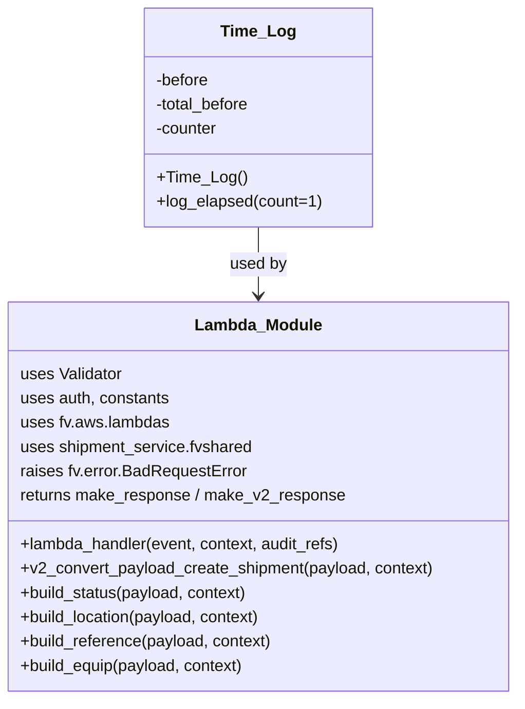

# Diagram: shipment_core/shipment_service/shipment_service/v2/post_shipment_status.py


> Auto-generated by Obscura crawlers

## Diagram 1



### SVG

<svg id="container" width="511.5234375" xmlns="http://www.w3.org/2000/svg" class="classDiagram" height="690" viewBox="0 0 511.5234375 690" role="graphics-document document" aria-roledescription="class"><style>#container{font-family:"trebuchet ms",verdana,arial,sans-serif;font-size:16px;fill:#333;}@keyframes edge-animation-frame{from{stroke-dashoffset:0;}}@keyframes dash{to{stroke-dashoffset:0;}}#container .edge-animation-slow{stroke-dasharray:9,5!important;stroke-dashoffset:900;animation:dash 50s linear infinite;stroke-linecap:round;}#container .edge-animation-fast{stroke-dasharray:9,5!important;stroke-dashoffset:900;animation:dash 20s linear infinite;stroke-linecap:round;}#container .error-icon{fill:#552222;}#container .error-text{fill:#552222;stroke:#552222;}#container .edge-thickness-normal{stroke-width:1px;}#container .edge-thickness-thick{stroke-width:3.5px;}#container .edge-pattern-solid{stroke-dasharray:0;}#container .edge-thickness-invisible{stroke-width:0;fill:none;}#container .edge-pattern-dashed{stroke-dasharray:3;}#container .edge-pattern-dotted{stroke-dasharray:2;}#container .marker{fill:#333333;stroke:#333333;}#container .marker.cross{stroke:#333333;}#container svg{font-family:"trebuchet ms",verdana,arial,sans-serif;font-size:16px;}#container p{margin:0;}#container g.classGroup text{fill:#9370DB;stroke:none;font-family:"trebuchet ms",verdana,arial,sans-serif;font-size:10px;}#container g.classGroup text .title{font-weight:bolder;}#container .nodeLabel,#container .edgeLabel{color:#131300;}#container .edgeLabel .label rect{fill:#ECECFF;}#container .label text{fill:#131300;}#container .labelBkg{background:#ECECFF;}#container .edgeLabel .label span{background:#ECECFF;}#container .classTitle{font-weight:bolder;}#container .node rect,#container .node circle,#container .node ellipse,#container .node polygon,#container .node path{fill:#ECECFF;stroke:#9370DB;stroke-width:1px;}#container .divider{stroke:#9370DB;stroke-width:1;}#container g.clickable{cursor:pointer;}#container g.classGroup rect{fill:#ECECFF;stroke:#9370DB;}#container g.classGroup line{stroke:#9370DB;stroke-width:1;}#container .classLabel .box{stroke:none;stroke-width:0;fill:#ECECFF;opacity:0.5;}#container .classLabel .label{fill:#9370DB;font-size:10px;}#container .relation{stroke:#333333;stroke-width:1;fill:none;}#container .dashed-line{stroke-dasharray:3;}#container .dotted-line{stroke-dasharray:1 2;}#container #compositionStart,#container .composition{fill:#333333!important;stroke:#333333!important;stroke-width:1;}#container #compositionEnd,#container .composition{fill:#333333!important;stroke:#333333!important;stroke-width:1;}#container #dependencyStart,#container .dependency{fill:#333333!important;stroke:#333333!important;stroke-width:1;}#container #dependencyStart,#container .dependency{fill:#333333!important;stroke:#333333!important;stroke-width:1;}#container #extensionStart,#container .extension{fill:transparent!important;stroke:#333333!important;stroke-width:1;}#container #extensionEnd,#container .extension{fill:transparent!important;stroke:#333333!important;stroke-width:1;}#container #aggregationStart,#container .aggregation{fill:transparent!important;stroke:#333333!important;stroke-width:1;}#container #aggregationEnd,#container .aggregation{fill:transparent!important;stroke:#333333!important;stroke-width:1;}#container #lollipopStart,#container .lollipop{fill:#ECECFF!important;stroke:#333333!important;stroke-width:1;}#container #lollipopEnd,#container .lollipop{fill:#ECECFF!important;stroke:#333333!important;stroke-width:1;}#container .edgeTerminals{font-size:11px;line-height:initial;}#container .classTitleText{text-anchor:middle;font-size:18px;fill:#333;}#container .label-icon{display:inline-block;height:1em;overflow:visible;vertical-align:-0.125em;}#container .node .label-icon path{fill:currentColor;stroke:revert;stroke-width:revert;}#container :root{--mermaid-font-family:"trebuchet ms",verdana,arial,sans-serif;}</style><g><defs><marker id="container_class-aggregationStart" class="marker aggregation class" refX="18" refY="7" markerWidth="190" markerHeight="240" orient="auto"><path d="M 18,7 L9,13 L1,7 L9,1 Z"></path></marker></defs><defs><marker id="container_class-aggregationEnd" class="marker aggregation class" refX="1" refY="7" markerWidth="20" markerHeight="28" orient="auto"><path d="M 18,7 L9,13 L1,7 L9,1 Z"></path></marker></defs><defs><marker id="container_class-extensionStart" class="marker extension class" refX="18" refY="7" markerWidth="190" markerHeight="240" orient="auto"><path d="M 1,7 L18,13 V 1 Z"></path></marker></defs><defs><marker id="container_class-extensionEnd" class="marker extension class" refX="1" refY="7" markerWidth="20" markerHeight="28" orient="auto"><path d="M 1,1 V 13 L18,7 Z"></path></marker></defs><defs><marker id="container_class-compositionStart" class="marker composition class" refX="18" refY="7" markerWidth="190" markerHeight="240" orient="auto"><path d="M 18,7 L9,13 L1,7 L9,1 Z"></path></marker></defs><defs><marker id="container_class-compositionEnd" class="marker composition class" refX="1" refY="7" markerWidth="20" markerHeight="28" orient="auto"><path d="M 18,7 L9,13 L1,7 L9,1 Z"></path></marker></defs><defs><marker id="container_class-dependencyStart" class="marker dependency class" refX="6" refY="7" markerWidth="190" markerHeight="240" orient="auto"><path d="M 5,7 L9,13 L1,7 L9,1 Z"></path></marker></defs><defs><marker id="container_class-dependencyEnd" class="marker dependency class" refX="13" refY="7" markerWidth="20" markerHeight="28" orient="auto"><path d="M 18,7 L9,13 L14,7 L9,1 Z"></path></marker></defs><defs><marker id="container_class-lollipopStart" class="marker lollipop class" refX="13" refY="7" markerWidth="190" markerHeight="240" orient="auto"><circle stroke="black" fill="transparent" cx="7" cy="7" r="6"></circle></marker></defs><defs><marker id="container_class-lollipopEnd" class="marker lollipop class" refX="1" refY="7" markerWidth="190" markerHeight="240" orient="auto"><circle stroke="black" fill="transparent" cx="7" cy="7" r="6"></circle></marker></defs><g class="root"><g class="clusters"></g><g class="edgePaths"><path d="M255.762,224L255.762,230.167C255.762,236.333,255.762,248.667,255.762,260C255.762,271.333,255.762,281.667,255.762,286.833L255.762,292" id="id_Time_Log_Lambda_Module_1" class="edge-thickness-normal edge-pattern-solid relation" style=";;;" data-edge="true" data-et="edge" data-id="id_Time_Log_Lambda_Module_1" data-points="W3sieCI6MjU1Ljc2MTcxODc1LCJ5IjoyMjR9LHsieCI6MjU1Ljc2MTcxODc1LCJ5IjoyNjF9LHsieCI6MjU1Ljc2MTcxODc1LCJ5IjoyOTh9XQ==" marker-end="url(#container_class-dependencyEnd)"></path></g><g class="edgeLabels"><g class="edgeLabel" transform="translate(255.76171875, 261)"><g class="label" data-id="id_Time_Log_Lambda_Module_1" transform="translate(-28.3125, -12)"><foreignObject width="56.625" height="24"><div xmlns="http://www.w3.org/1999/xhtml" class="labelBkg" style="display: table-cell; white-space: nowrap; line-height: 1.5; max-width: 200px; text-align: center;"><span class="edgeLabel"><p>used by</p></span></div></foreignObject></g></g></g><g class="nodes"><g class="node default" id="classId-Time_Log-0" transform="translate(255.76171875, 116)"><g class="basic label-container"><path d="M-110.23828125 -108 L110.23828125 -108 L110.23828125 108 L-110.23828125 108" stroke="none" stroke-width="0" fill="#ECECFF" style=""></path><path d="M-110.23828125 -108 C-58.20239614850965 -108, -6.1665110470192985 -108, 110.23828125 -108 M-110.23828125 -108 C-46.158386849129286 -108, 17.921507551741428 -108, 110.23828125 -108 M110.23828125 -108 C110.23828125 -41.558497462824235, 110.23828125 24.88300507435153, 110.23828125 108 M110.23828125 -108 C110.23828125 -23.93105222990367, 110.23828125 60.13789554019266, 110.23828125 108 M110.23828125 108 C24.186759416847963 108, -61.864762416304075 108, -110.23828125 108 M110.23828125 108 C29.339667496749414 108, -51.55894625650117 108, -110.23828125 108 M-110.23828125 108 C-110.23828125 49.72219834209716, -110.23828125 -8.555603315805683, -110.23828125 -108 M-110.23828125 108 C-110.23828125 39.760667833797115, -110.23828125 -28.47866433240577, -110.23828125 -108" stroke="#9370DB" stroke-width="1.3" fill="none" stroke-dasharray="0 0" style=""></path></g><g class="annotation-group text" transform="translate(0, -84)"></g><g class="label-group text" transform="translate(-34.7421875, -84)"><g class="label" style="font-weight: bolder" transform="translate(0,-12)"><foreignObject width="69.484375" height="24"><div xmlns="http://www.w3.org/1999/xhtml" style="display: table-cell; white-space: nowrap; line-height: 1.5; max-width: 119px; text-align: center;"><span class="nodeLabel markdown-node-label" style=""><p>Time_Log</p></span></div></foreignObject></g></g><g class="members-group text" transform="translate(-98.23828125, -36)"><g class="label" style="" transform="translate(0,-12)"><foreignObject width="53.640625" height="24"><div xmlns="http://www.w3.org/1999/xhtml" style="display: table-cell; white-space: nowrap; line-height: 1.5; max-width: 111px; text-align: center;"><span class="nodeLabel markdown-node-label" style=""><p>-before</p></span></div></foreignObject></g><g class="label" style="" transform="translate(0,12)"><foreignObject width="95.65625" height="24"><div xmlns="http://www.w3.org/1999/xhtml" style="display: table-cell; white-space: nowrap; line-height: 1.5; max-width: 153px; text-align: center;"><span class="nodeLabel markdown-node-label" style=""><p>-total_before</p></span></div></foreignObject></g><g class="label" style="" transform="translate(0,36)"><foreignObject width="62.25" height="24"><div xmlns="http://www.w3.org/1999/xhtml" style="display: table-cell; white-space: nowrap; line-height: 1.5; max-width: 120px; text-align: center;"><span class="nodeLabel markdown-node-label" style=""><p>-counter</p></span></div></foreignObject></g></g><g class="methods-group text" transform="translate(-98.23828125, 60)"><g class="label" style="" transform="translate(0,-12)"><foreignObject width="86.015625" height="24"><div xmlns="http://www.w3.org/1999/xhtml" style="display: table-cell; white-space: nowrap; line-height: 1.5; max-width: 143px; text-align: center;"><span class="nodeLabel markdown-node-label" style=""><p>+Time_Log()</p></span></div></foreignObject></g><g class="label" style="" transform="translate(0,12)"><foreignObject width="161.734375" height="24"><div xmlns="http://www.w3.org/1999/xhtml" style="display: table-cell; white-space: nowrap; line-height: 1.5; max-width: 219px; text-align: center;"><span class="nodeLabel markdown-node-label" style=""><p>+log_elapsed(count=1)</p></span></div></foreignObject></g></g><g class="divider" style=""><path d="M-110.23828125 -60 C-65.70936588965338 -60, -21.180450529306782 -60, 110.23828125 -60 M-110.23828125 -60 C-53.98612661707386 -60, 2.266028015852285 -60, 110.23828125 -60" stroke="#9370DB" stroke-width="1.3" fill="none" stroke-dasharray="0 0" style=""></path></g><g class="divider" style=""><path d="M-110.23828125 36 C-38.60854070953715 36, 33.021199830925696 36, 110.23828125 36 M-110.23828125 36 C-22.098658995011235 36, 66.04096325997753 36, 110.23828125 36" stroke="#9370DB" stroke-width="1.3" fill="none" stroke-dasharray="0 0" style=""></path></g></g><g class="node default" id="classId-Lambda_Module-1" transform="translate(255.76171875, 490)"><g class="basic label-container"><path d="M-247.76171875 -192 L247.76171875 -192 L247.76171875 192 L-247.76171875 192" stroke="none" stroke-width="0" fill="#ECECFF" style=""></path><path d="M-247.76171875 -192 C-139.94323576261593 -192, -32.124752775231826 -192, 247.76171875 -192 M-247.76171875 -192 C-129.68966787840142 -192, -11.617617006802845 -192, 247.76171875 -192 M247.76171875 -192 C247.76171875 -42.37847493285102, 247.76171875 107.24305013429796, 247.76171875 192 M247.76171875 -192 C247.76171875 -87.42037687365003, 247.76171875 17.159246252699944, 247.76171875 192 M247.76171875 192 C139.7950261961334 192, 31.828333642266784 192, -247.76171875 192 M247.76171875 192 C86.16968489651086 192, -75.42234895697828 192, -247.76171875 192 M-247.76171875 192 C-247.76171875 88.59146715217835, -247.76171875 -14.817065695643294, -247.76171875 -192 M-247.76171875 192 C-247.76171875 79.56958641050286, -247.76171875 -32.86082717899427, -247.76171875 -192" stroke="#9370DB" stroke-width="1.3" fill="none" stroke-dasharray="0 0" style=""></path></g><g class="annotation-group text" transform="translate(0, -168)"></g><g class="label-group text" transform="translate(-60.3828125, -168)"><g class="label" style="font-weight: bolder" transform="translate(0,-12)"><foreignObject width="120.765625" height="24"><div xmlns="http://www.w3.org/1999/xhtml" style="display: table-cell; white-space: nowrap; line-height: 1.5; max-width: 170px; text-align: center;"><span class="nodeLabel markdown-node-label" style=""><p>Lambda_Module</p></span></div></foreignObject></g></g><g class="members-group text" transform="translate(-235.76171875, -120)"><g class="label" style="" transform="translate(0,-12)"><foreignObject width="102.546875" height="24"><div xmlns="http://www.w3.org/1999/xhtml" style="display: table-cell; white-space: nowrap; line-height: 1.5; max-width: 153px; text-align: center;"><span class="nodeLabel markdown-node-label" style=""><p>uses Validator</p></span></div></foreignObject></g><g class="label" style="" transform="translate(0,12)"><foreignObject width="148.984375" height="24"><div xmlns="http://www.w3.org/1999/xhtml" style="display: table-cell; white-space: nowrap; line-height: 1.5; max-width: 199px; text-align: center;"><span class="nodeLabel markdown-node-label" style=""><p>uses auth, constants</p></span></div></foreignObject></g><g class="label" style="" transform="translate(0,36)"><foreignObject width="147.171875" height="24"><div xmlns="http://www.w3.org/1999/xhtml" style="display: table-cell; white-space: nowrap; line-height: 1.5; max-width: 197px; text-align: center;"><span class="nodeLabel markdown-node-label" style=""><p>uses fv.aws.lambdas</p></span></div></foreignObject></g><g class="label" style="" transform="translate(0,60)"><foreignObject width="230.90625" height="24"><div xmlns="http://www.w3.org/1999/xhtml" style="display: table-cell; white-space: nowrap; line-height: 1.5; max-width: 281px; text-align: center;"><span class="nodeLabel markdown-node-label" style=""><p>uses shipment_service.fvshared</p></span></div></foreignObject></g><g class="label" style="" transform="translate(0,84)"><foreignObject width="224.484375" height="24"><div xmlns="http://www.w3.org/1999/xhtml" style="display: table-cell; white-space: nowrap; line-height: 1.5; max-width: 275px; text-align: center;"><span class="nodeLabel markdown-node-label" style=""><p>raises fv.error.BadRequestError</p></span></div></foreignObject></g><g class="label" style="" transform="translate(0,108)"><foreignObject width="324.03125" height="24"><div xmlns="http://www.w3.org/1999/xhtml" style="display: table-cell; white-space: nowrap; line-height: 1.5; max-width: 374px; text-align: center;"><span class="nodeLabel markdown-node-label" style=""><p>returns make_response / make_v2_response</p></span></div></foreignObject></g></g><g class="methods-group text" transform="translate(-235.76171875, 48)"><g class="label" style="" transform="translate(0,-12)"><foreignObject width="321.6875" height="24"><div xmlns="http://www.w3.org/1999/xhtml" style="display: table-cell; white-space: nowrap; line-height: 1.5; max-width: 379px; text-align: center;"><span class="nodeLabel markdown-node-label" style=""><p>+lambda_handler(event, context, audit_refs)</p></span></div></foreignObject></g><g class="label" style="" transform="translate(0,12)"><foreignObject width="411.140625" height="24"><div xmlns="http://www.w3.org/1999/xhtml" style="display: table-cell; white-space: nowrap; line-height: 1.5; max-width: 469px; text-align: center;"><span class="nodeLabel markdown-node-label" style=""><p>+v2_convert_payload_create_shipment(payload, context)</p></span></div></foreignObject></g><g class="label" style="" transform="translate(0,36)"><foreignObject width="228.109375" height="24"><div xmlns="http://www.w3.org/1999/xhtml" style="display: table-cell; white-space: nowrap; line-height: 1.5; max-width: 285px; text-align: center;"><span class="nodeLabel markdown-node-label" style=""><p>+build_status(payload, context)</p></span></div></foreignObject></g><g class="label" style="" transform="translate(0,60)"><foreignObject width="242.703125" height="24"><div xmlns="http://www.w3.org/1999/xhtml" style="display: table-cell; white-space: nowrap; line-height: 1.5; max-width: 300px; text-align: center;"><span class="nodeLabel markdown-node-label" style=""><p>+build_location(payload, context)</p></span></div></foreignObject></g><g class="label" style="" transform="translate(0,84)"><foreignObject width="251.875" height="24"><div xmlns="http://www.w3.org/1999/xhtml" style="display: table-cell; white-space: nowrap; line-height: 1.5; max-width: 309px; text-align: center;"><span class="nodeLabel markdown-node-label" style=""><p>+build_reference(payload, context)</p></span></div></foreignObject></g><g class="label" style="" transform="translate(0,108)"><foreignObject width="225" height="24"><div xmlns="http://www.w3.org/1999/xhtml" style="display: table-cell; white-space: nowrap; line-height: 1.5; max-width: 282px; text-align: center;"><span class="nodeLabel markdown-node-label" style=""><p>+build_equip(payload, context)</p></span></div></foreignObject></g></g><g class="divider" style=""><path d="M-247.76171875 -144 C-63.77966207734494 -144, 120.20239459531012 -144, 247.76171875 -144 M-247.76171875 -144 C-111.63612308305474 -144, 24.489472583890517 -144, 247.76171875 -144" stroke="#9370DB" stroke-width="1.3" fill="none" stroke-dasharray="0 0" style=""></path></g><g class="divider" style=""><path d="M-247.76171875 24 C-66.51268054172527 24, 114.73635766654945 24, 247.76171875 24 M-247.76171875 24 C-112.25481025765697 24, 23.25209823468606 24, 247.76171875 24" stroke="#9370DB" stroke-width="1.3" fill="none" stroke-dasharray="0 0" style=""></path></g></g></g></g></g></svg>

## Diagram 2

```mermaid
flowchart TD
    A[Start: lambda_handler(event, context, audit_refs)] --> B{get X-WSS-fvShipmentId header}
    B --> C[get_event_body(event) -> event_body]
    C --> D[Validate body with Validator(v2_post_status_template)]
    D --> E{organization_type and special SCAC message?}
    E --> F[If invalid and D1 with missing location.code -> raise BadRequestError]
    D --> G[Validate headers with Validator(v2_headers_template)]
    G --> H{validated headers?}
    H -- no --> I[raise BadRequestError]
    H -- yes --> J[Call v2_convert_payload_create_shipment(event, context)]
    J --> K[Determine is_async from fv-async header]
    K --> L[invoke_type = Event if async else RequestResponse]
    L --> M[invoke_lambda("proxy_shipment_status", new_payload, invoke_type)]
    M --> N[If KeyError -> handle_missing_required_field_error -> return]
    N --> O{is_async?}
    O -- true --> P[return 202 Accepted]
    O -- false --> Q[Adjust response status codes (200->201)]
    Q --> R[make_v2_response(response, correlationId, shipment_id)]
    R --> S[Return V2 response]
    S --> T[End]
    subgraph ErrorHandling
        U[JSONDecodeError -> raise BadRequestError]
        V[PermissionError -> make_error_response 403]
        W[ValidationError -> make_error_response 400]
        X[ClientError -> re-raise]
        Y[Exception -> maybe make_error_response; raise HandledException 400]
    end
    C -->|JSONDecodeError| U
    G -->|PermissionError| V
    D -->|ValidationError| W
    M -->|ClientError| X
    any -->|other exceptions| Y
```

> SVG rendering failed for this diagram.
