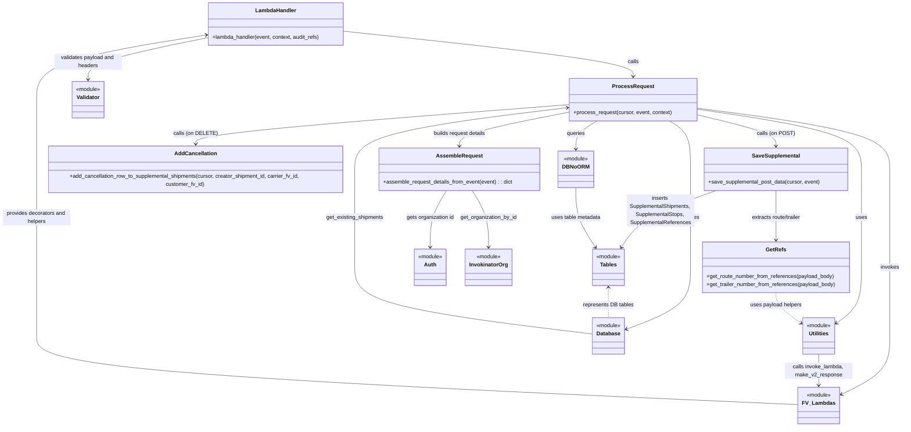

# Diagram: shipment_core/shipment_service/shipment_service/v2/post_supplemental_shipment.py

> Auto-generated by Obscura crawlers

## Mermaid

### SVG

<svg id="container" width="2696.3671875" xmlns="http://www.w3.org/2000/svg" class="classDiagram" height="1250" viewBox="0 0 2696.3671875 1250" role="graphics-document document" aria-roledescription="class"><g><defs><marker id="container_class-aggregationStart" class="marker aggregation class" refX="18" refY="7" markerWidth="190" markerHeight="240" orient="auto"><path d="M 18,7 L9,13 L1,7 L9,1 Z"></path></marker></defs><defs><marker id="container_class-aggregationEnd" class="marker aggregation class" refX="1" refY="7" markerWidth="20" markerHeight="28" orient="auto"><path d="M 18,7 L9,13 L1,7 L9,1 Z"></path></marker></defs><defs><marker id="container_class-extensionStart" class="marker extension class" refX="18" refY="7" markerWidth="190" markerHeight="240" orient="auto"><path d="M 1,7 L18,13 V 1 Z"></path></marker></defs><defs><marker id="container_class-extensionEnd" class="marker extension class" refX="1" refY="7" markerWidth="20" markerHeight="28" orient="auto"><path d="M 1,1 V 13 L18,7 Z"></path></marker></defs><defs><marker id="container_class-compositionStart" class="marker composition class" refX="18" refY="7" markerWidth="190" markerHeight="240" orient="auto"><path d="M 18,7 L9,13 L1,7 L9,1 Z"></path></marker></defs><defs><marker id="container_class-compositionEnd" class="marker composition class" refX="1" refY="7" markerWidth="20" markerHeight="28" orient="auto"><path d="M 18,7 L9,13 L1,7 L9,1 Z"></path></marker></defs><defs><marker id="container_class-dependencyStart" class="marker dependency class" refX="6" refY="7" markerWidth="190" markerHeight="240" orient="auto"><path d="M 5,7 L9,13 L1,7 L9,1 Z"></path></marker></defs><defs><marker id="container_class-dependencyEnd" class="marker dependency class" refX="13" refY="7" markerWidth="20" markerHeight="28" orient="auto"><path d="M 18,7 L9,13 L14,7 L9,1 Z"></path></marker></defs><defs><marker id="container_class-lollipopStart" class="marker lollipop class" refX="13" refY="7" markerWidth="190" markerHeight="240" orient="auto"><circle stroke="black" fill="transparent" cx="7" cy="7" r="6"></circle></marker></defs><defs><marker id="container_class-lollipopEnd" class="marker lollipop class" refX="1" refY="7" markerWidth="190" markerHeight="240" orient="auto"><circle stroke="black" fill="transparent" cx="7" cy="7" r="6"></circle></marker></defs><g class="root"><g class="clusters"></g><g class="edgePaths"><path d="M1029.635,92.098L1174.652,107.249C1319.669,122.399,1609.704,152.699,1754.721,175.016C1899.738,197.333,1899.738,211.667,1899.738,218.833L1899.738,226" id="id_LambdaHandler_ProcessRequest_1" class="edge-thickness-normal edge-pattern-solid relation" style=";;;" data-edge="true" data-et="edge" data-id="id_LambdaHandler_ProcessRequest_1" data-points="W3sieCI6MTAyOS42MzQ3NjU2MjUsInkiOjkyLjA5ODQ2NTQ1NjgzNzY3fSx7IngiOjE4OTkuNzM4MjgxMjUsInkiOjE4M30seyJ4IjoxODk5LjczODI4MTI1LCJ5IjoyMzJ9XQ==" marker-end="url(#container_class-dependencyEnd)"></path><path d="M2086.602,339.077L2126.116,348.397C2165.63,357.718,2244.659,376.359,2284.173,390.846C2323.688,405.333,2323.688,415.667,2323.688,420.833L2323.688,426" id="id_ProcessRequest_SaveSupplemental_2" class="edge-thickness-normal edge-pattern-solid relation" style=";;;" data-edge="true" data-et="edge" data-id="id_ProcessRequest_SaveSupplemental_2" data-points="W3sieCI6MjA4Ni42MDE1NjI1LCJ5IjozMzkuMDc2ODA3NTQ4MDczOH0seyJ4IjoyMzIzLjY4NzUsInkiOjM5NX0seyJ4IjoyMzIzLjY4NzUsInkiOjQzMn1d" marker-end="url(#container_class-dependencyEnd)"></path><path d="M1712.875,309.264L1525.678,323.553C1338.482,337.843,964.089,366.421,776.892,385.877C589.695,405.333,589.695,415.667,589.695,420.833L589.695,426" id="id_ProcessRequest_AddCancellation_3" class="edge-thickness-normal edge-pattern-solid relation" style=";;;" data-edge="true" data-et="edge" data-id="id_ProcessRequest_AddCancellation_3" data-points="W3sieCI6MTcxMi44NzUsInkiOjMwOS4yNjM5MDQ3NTAyNjE2NH0seyJ4Ijo1ODkuNjk1MzEyNSwieSI6Mzk1fSx7IngiOjU4OS42OTUzMTI1LCJ5Ijo0MzJ9XQ==" marker-end="url(#container_class-dependencyEnd)"></path><path d="M2086.602,322.591L2168.333,334.66C2250.064,346.728,2413.526,370.864,2495.257,399.599C2576.988,428.333,2576.988,461.667,2576.988,501C2576.988,540.333,2576.988,585.667,2576.988,633C2576.988,680.333,2576.988,729.667,2576.988,773C2576.988,816.333,2576.988,853.667,2564.792,881.096C2552.596,908.526,2528.204,926.052,2516.008,934.815L2503.812,943.578" id="id_ProcessRequest_Utilities_4" class="edge-thickness-normal edge-pattern-solid relation" style=";;;" data-edge="true" data-et="edge" data-id="id_ProcessRequest_Utilities_4" data-points="W3sieCI6MjA4Ni42MDE1NjI1LCJ5IjozMjIuNTkxNDc3NDgyNDY1ODV9LHsieCI6MjU3Ni45ODgyODEyNSwieSI6Mzk1fSx7IngiOjI1NzYuOTg4MjgxMjUsInkiOjQ5NX0seyJ4IjoyNTc2Ljk4ODI4MTI1LCJ5Ijo2MzF9LHsieCI6MjU3Ni45ODgyODEyNSwieSI6Nzc5fSx7IngiOjI1NzYuOTg4MjgxMjUsInkiOjg5MX0seyJ4IjoyNDk4LjkzOTQ1MzEyNSwieSI6OTQ3LjA3OTEyNzE0OTM1NjJ9XQ==" marker-end="url(#container_class-dependencyEnd)"></path><path d="M1792.23,358L1781.706,364.167C1771.183,370.333,1750.136,382.667,1739.613,395.5C1729.09,408.333,1729.09,421.667,1729.09,428.333L1729.09,435" id="id_ProcessRequest_DBNoORM_5" class="edge-thickness-normal edge-pattern-solid relation" style=";;;" data-edge="true" data-et="edge" data-id="id_ProcessRequest_DBNoORM_5" data-points="W3sieCI6MTc5Mi4yMjk3NjU2MjUsInkiOjM1OH0seyJ4IjoxNzI5LjA4OTg0Mzc1LCJ5IjozOTV9LHsieCI6MTcyOS4wODk4NDM3NSwieSI6NDQxfV0=" marker-end="url(#container_class-dependencyEnd)"></path><path d="M2007.247,358L2017.77,364.167C2028.293,370.333,2049.34,382.667,2059.863,405.5C2070.387,428.333,2070.387,461.667,2070.387,501C2070.387,540.333,2070.387,585.667,2070.387,633C2070.387,680.333,2070.387,729.667,2070.387,773C2070.387,816.333,2070.387,853.667,2038.712,884.133C2007.038,914.6,1943.69,938.2,1912.016,950L1880.341,961.799" id="id_ProcessRequest_Database_6" class="edge-thickness-normal edge-pattern-solid relation" style=";;;" data-edge="true" data-et="edge" data-id="id_ProcessRequest_Database_6" data-points="W3sieCI6MjAwNy4yNDY3OTY4NzUsInkiOjM1OH0seyJ4IjoyMDcwLjM4NjcxODc1LCJ5IjozOTV9LHsieCI6MjA3MC4zODY3MTg3NSwieSI6NDk1fSx7IngiOjIwNzAuMzg2NzE4NzUsInkiOjYzMX0seyJ4IjoyMDcwLjM4NjcxODc1LCJ5Ijo3Nzl9LHsieCI6MjA3MC4zODY3MTg3NSwieSI6ODkxfSx7IngiOjE4NzQuNzE4NzUsInkiOjk2My44OTQwMDc5NjM3OTUyfV0=" marker-end="url(#container_class-dependencyEnd)"></path><path d="M2086.602,319.554L2182.298,332.128C2277.995,344.702,2469.388,369.851,2565.085,399.092C2660.781,428.333,2660.781,461.667,2660.781,501C2660.781,540.333,2660.781,585.667,2660.781,633C2660.781,680.333,2660.781,729.667,2660.781,773C2660.781,816.333,2660.781,853.667,2660.781,887.5C2660.781,921.333,2660.781,951.667,2660.781,984C2660.781,1016.333,2660.781,1050.667,2636.128,1079.9C2611.474,1109.133,2562.167,1133.266,2537.513,1145.333L2512.86,1157.399" id="id_ProcessRequest_FV_Lambdas_7" class="edge-thickness-normal edge-pattern-solid relation" style=";;;" data-edge="true" data-et="edge" data-id="id_ProcessRequest_FV_Lambdas_7" data-points="W3sieCI6MjA4Ni42MDE1NjI1LCJ5IjozMTkuNTUzNTc4MzAyODAxOTV9LHsieCI6MjY2MC43ODEyNSwieSI6Mzk1fSx7IngiOjI2NjAuNzgxMjUsInkiOjQ5NX0seyJ4IjoyNjYwLjc4MTI1LCJ5Ijo2MzF9LHsieCI6MjY2MC43ODEyNSwieSI6Nzc5fSx7IngiOjI2NjAuNzgxMjUsInkiOjg5MX0seyJ4IjoyNjYwLjc4MTI1LCJ5Ijo5ODJ9LHsieCI6MjY2MC43ODEyNSwieSI6MTA4NX0seyJ4IjoyNTA3LjQ3MDcwMzEyNSwieSI6MTE2MC4wMzY3NTI3NjM0MTh9XQ==" marker-end="url(#container_class-dependencyEnd)"></path><path d="M1712.875,331.23L1658.057,341.858C1603.238,352.486,1493.602,373.743,1438.783,389.538C1383.965,405.333,1383.965,415.667,1383.965,420.833L1383.965,426" id="id_ProcessRequest_AssembleRequest_8" class="edge-thickness-normal edge-pattern-solid relation" style=";;;" data-edge="true" data-et="edge" data-id="id_ProcessRequest_AssembleRequest_8" data-points="W3sieCI6MTcxMi44NzUsInkiOjMzMS4yMjk3MjE3NDY3Njk5fSx7IngiOjEzODMuOTY0ODQzNzUsInkiOjM5NX0seyJ4IjoxMzgzLjk2NDg0Mzc1LCJ5Ijo0MzJ9XQ==" marker-end="url(#container_class-dependencyEnd)"></path><path d="M2323.688,558L2323.688,570.167C2323.688,582.333,2323.688,606.667,2323.688,630C2323.688,653.333,2323.688,675.667,2323.688,686.833L2323.688,698" id="id_SaveSupplemental_GetRefs_9" class="edge-thickness-normal edge-pattern-solid relation" style=";;;" data-edge="true" data-et="edge" data-id="id_SaveSupplemental_GetRefs_9" data-points="W3sieCI6MjMyMy42ODc1LCJ5Ijo1NTh9LHsieCI6MjMyMy42ODc1LCJ5Ijo2MzF9LHsieCI6MjMyMy42ODc1LCJ5Ijo3MDR9XQ==" marker-end="url(#container_class-dependencyEnd)"></path><path d="M2138.142,558L2102.309,570.167C2066.476,582.333,1994.81,606.667,1949.255,633.664C1903.699,660.661,1884.254,690.321,1874.531,705.152L1864.809,719.982" id="id_SaveSupplemental_Tables_10" class="edge-thickness-normal edge-pattern-solid relation" style=";;;" data-edge="true" data-et="edge" data-id="id_SaveSupplemental_Tables_10" data-points="W3sieCI6MjEzOC4xNDE4NjAwNjQzMzgzLCJ5Ijo1NTh9LHsieCI6MTkyMy4xNDQ1MzEyNSwieSI6NjMxfSx7IngiOjE4NjEuNTE5MDU2MTY1NTQwNiwieSI6NzI1fV0=" marker-end="url(#container_class-dependencyEnd)"></path><path d="M1343.267,558L1335.407,570.167C1327.548,582.333,1311.829,606.667,1303.969,633.5C1296.109,660.333,1296.109,689.667,1296.109,704.333L1296.109,719" id="id_AssembleRequest_Auth_11" class="edge-thickness-normal edge-pattern-solid relation" style=";;;" data-edge="true" data-et="edge" data-id="id_AssembleRequest_Auth_11" data-points="W3sieCI6MTM0My4yNjcwODk4NDM3NSwieSI6NTU4fSx7IngiOjEyOTYuMTA5Mzc1LCJ5Ijo2MzF9LHsieCI6MTI5Ni4xMDkzNzUsInkiOjcyNX1d" marker-end="url(#container_class-dependencyEnd)"></path><path d="M1424.663,558L1432.522,570.167C1440.382,582.333,1456.101,606.667,1463.961,633.5C1471.82,660.333,1471.82,689.667,1471.82,704.333L1471.82,719" id="id_AssembleRequest_InvokinatorOrg_12" class="edge-thickness-normal edge-pattern-solid relation" style=";;;" data-edge="true" data-et="edge" data-id="id_AssembleRequest_InvokinatorOrg_12" data-points="W3sieCI6MTQyNC42NjI1OTc2NTYyNSwieSI6NTU4fSx7IngiOjE0NzEuODIwMzEyNSwieSI6NjMxfSx7IngiOjE0NzEuODIwMzEyNSwieSI6NzI1fV0=" marker-end="url(#container_class-dependencyEnd)"></path><path d="M625.729,111.278L565.793,123.232C505.857,135.185,385.986,159.093,326.051,179.713C266.115,200.333,266.115,217.667,266.115,226.333L266.115,235" id="id_LambdaHandler_Validator_13" class="edge-thickness-normal edge-pattern-solid relation" style=";;;" data-edge="true" data-et="edge" data-id="id_LambdaHandler_Validator_13" data-points="W3sieCI6NjI1LjcyODUxNTYyNSwieSI6MTExLjI3Nzk2MTMzODYxMDYxfSx7IngiOjI2Ni4xMTUyMzQzNzUsInkiOjE4M30seyJ4IjoyNjYuMTE1MjM0Mzc1LCJ5IjoyNDF9XQ==" marker-end="url(#container_class-dependencyEnd)"></path><path d="M2393.205,1185.488L2012.338,1168.74C1631.47,1151.992,869.735,1118.496,488.868,1084.581C108,1050.667,108,1016.333,108,984C108,951.667,108,921.333,108,887.5C108,853.667,108,816.333,108,773C108,729.667,108,680.333,108,633C108,585.667,108,540.333,108,501C108,461.667,108,428.333,108,395C108,361.667,108,328.333,108,293C108,257.667,108,220.333,193.3,188.392C278.6,156.45,449.2,129.901,534.5,116.626L619.8,103.351" id="id_FV_Lambdas_LambdaHandler_14" class="edge-thickness-normal edge-pattern-solid relation" style=";;;" data-edge="true" data-et="edge" data-id="id_FV_Lambdas_LambdaHandler_14" data-points="W3sieCI6MjM5My4yMDUwNzgxMjUsInkiOjExODUuNDg3Njg5NjY2MzU3M30seyJ4IjoxMDgsInkiOjEwODV9LHsieCI6MTA4LCJ5Ijo5ODJ9LHsieCI6MTA4LCJ5Ijo4OTF9LHsieCI6MTA4LCJ5Ijo3Nzl9LHsieCI6MTA4LCJ5Ijo2MzF9LHsieCI6MTA4LCJ5Ijo0OTV9LHsieCI6MTA4LCJ5IjozOTV9LHsieCI6MTA4LCJ5IjoyOTV9LHsieCI6MTA4LCJ5IjoxODN9LHsieCI6NjI1LjcyODUxNTYyNSwieSI6MTAyLjQyODgyNzMwODA4MTY1fV0=" marker-end="url(#container_class-dependencyEnd)"></path><path d="M2450.338,1036L2450.338,1044.167C2450.338,1052.333,2450.338,1068.667,2450.338,1084C2450.338,1099.333,2450.338,1113.667,2450.338,1120.833L2450.338,1128" id="id_Utilities_FV_Lambdas_15" class="edge-thickness-normal edge-pattern-solid relation" style=";;;" data-edge="true" data-et="edge" data-id="id_Utilities_FV_Lambdas_15" data-points="W3sieCI6MjQ1MC4zMzc4OTA2MjUsInkiOjEwMzZ9LHsieCI6MjQ1MC4zMzc4OTA2MjUsInkiOjEwODV9LHsieCI6MjQ1MC4zMzc4OTA2MjUsInkiOjExMzR9XQ==" marker-end="url(#container_class-dependencyEnd)"></path><path d="M1729.09,549L1729.09,562.667C1729.09,576.333,1729.09,603.667,1738.812,632.164C1748.535,660.661,1767.98,690.321,1777.703,705.152L1787.426,719.982" id="id_DBNoORM_Tables_16" class="edge-thickness-normal edge-pattern-solid relation" style=";;;" data-edge="true" data-et="edge" data-id="id_DBNoORM_Tables_16" data-points="W3sieCI6MTcyOS4wODk4NDM3NSwieSI6NTQ5fSx7IngiOjE3MjkuMDg5ODQzNzUsInkiOjYzMX0seyJ4IjoxNzkwLjcxNTMxODgzNDQ1OTQsInkiOjcyNX1d" marker-end="url(#container_class-dependencyEnd)"></path><path d="M1777.516,976.14L1659.828,961.95C1542.141,947.76,1306.766,919.38,1189.078,886.523C1071.391,853.667,1071.391,816.333,1071.391,773C1071.391,729.667,1071.391,680.333,1071.391,633C1071.391,585.667,1071.391,540.333,1071.391,501C1071.391,461.667,1071.391,428.333,1177.312,398.88C1283.233,369.426,1495.076,343.852,1600.997,331.065L1706.918,318.278" id="id_Database_ProcessRequest_17" class="edge-thickness-normal edge-pattern-solid relation" style=";;;" data-edge="true" data-et="edge" data-id="id_Database_ProcessRequest_17" data-points="W3sieCI6MTc3Ny41MTU2MjUsInkiOjk3Ni4xMzk5NDA5OTY4NDI4fSx7IngiOjEwNzEuMzkwNjI1LCJ5Ijo4OTF9LHsieCI6MTA3MS4zOTA2MjUsInkiOjc3OX0seyJ4IjoxMDcxLjM5MDYyNSwieSI6NjMxfSx7IngiOjEwNzEuMzkwNjI1LCJ5Ijo0OTV9LHsieCI6MTA3MS4zOTA2MjUsInkiOjM5NX0seyJ4IjoxNzEyLjg3NSwieSI6MzE3LjU1ODU1NzM2OTAwOTN9XQ==" marker-end="url(#container_class-dependencyEnd)"></path><path d="M1826.117,839L1826.117,847.667C1826.117,856.333,1826.117,873.667,1826.117,888.5C1826.117,903.333,1826.117,915.667,1826.117,921.833L1826.117,928" id="id_Tables_Database_18" class="edge-thickness-normal edge-pattern-dashed relation" style=";;;" data-edge="true" data-et="edge" data-id="id_Tables_Database_18" data-points="W3sieCI6MTgyNi4xMTcxODc1LCJ5Ijo4MzN9LHsieCI6MTgyNi4xMTcxODc1LCJ5Ijo4OTF9LHsieCI6MTgyNi4xMTcxODc1LCJ5Ijo5Mjh9XQ==" marker-start="url(#container_class-dependencyStart)"></path><path d="M2323.688,854L2323.688,860.167C2323.688,866.333,2323.688,878.667,2335.884,893.596C2348.08,908.526,2372.472,926.052,2384.668,934.815L2396.864,943.578" id="id_GetRefs_Utilities_19" class="edge-thickness-normal edge-pattern-dashed relation" style=";;;" data-edge="true" data-et="edge" data-id="id_GetRefs_Utilities_19" data-points="W3sieCI6MjMyMy42ODc1LCJ5Ijo4NTR9LHsieCI6MjMyMy42ODc1LCJ5Ijo4OTF9LHsieCI6MjQwMS43MzYzMjgxMjUsInkiOjk0Ny4wNzkxMjcxNDkzNTYyfV0=" marker-end="url(#container_class-dependencyEnd)"></path></g><g class="edgeLabels"><g class="edgeLabel" transform="translate(1899.73828125, 183)"><g class="label" data-id="id_LambdaHandler_ProcessRequest_1" transform="translate(-16.4453125, -12)"><foreignObject width="32.890625" height="24">

calls

</foreignObject></g></g><g class="edgeLabel" transform="translate(2323.6875, 395)"><g class="label" data-id="id_ProcessRequest_SaveSupplemental_2" transform="translate(-53.734375, -12)"><foreignObject width="107.46875" height="24">

calls (on POST)

</foreignObject></g></g><g class="edgeLabel" transform="translate(589.6953125, 395)"><g class="label" data-id="id_ProcessRequest_AddCancellation_3" transform="translate(-61.34375, -12)"><foreignObject width="122.6875" height="24">

calls (on DELETE)

</foreignObject></g></g><g class="edgeLabel" transform="translate(2576.98828125, 631)"><g class="label" data-id="id_ProcessRequest_Utilities_4" transform="translate(-16.4921875, -12)"><foreignObject width="32.984375" height="24">

uses

</foreignObject></g></g><g class="edgeLabel" transform="translate(1729.08984375, 395)"><g class="label" data-id="id_ProcessRequest_DBNoORM_5" transform="translate(-27.2421875, -12)"><foreignObject width="54.484375" height="24">

queries

</foreignObject></g></g><g class="edgeLabel" transform="translate(2070.38671875, 631)"><g class="label" data-id="id_ProcessRequest_Database_6" transform="translate(-27.2421875, -12)"><foreignObject width="54.484375" height="24">

queries

</foreignObject></g></g><g class="edgeLabel" transform="translate(2660.78125, 779)"><g class="label" data-id="id_ProcessRequest_FV_Lambdas_7" transform="translate(-27.5859375, -12)"><foreignObject width="55.171875" height="24">

invokes

</foreignObject></g></g><g class="edgeLabel" transform="translate(1383.96484375, 395)"><g class="label" data-id="id_ProcessRequest_AssembleRequest_8" transform="translate(-79.03125, -12)"><foreignObject width="158.0625" height="24">

builds request details

</foreignObject></g></g><g class="edgeLabel" transform="translate(2323.6875, 631)"><g class="label" data-id="id_SaveSupplemental_GetRefs_9" transform="translate(-76.0703125, -12)"><foreignObject width="152.140625" height="24">

extracts route/trailer

</foreignObject></g></g><g class="edgeLabel" transform="translate(1977.42722, 612.5689)"><g class="label" data-id="id_SaveSupplemental_Tables_10" transform="translate(-100, -48)"><foreignObject width="200" height="96">

inserts SupplementalShipments, SupplementalStops, SupplementalReferences

</foreignObject></g></g><g class="edgeLabel" transform="translate(1296.109375, 631)"><g class="label" data-id="id_AssembleRequest_Auth_11" transform="translate(-71.4765625, -12)"><foreignObject width="142.953125" height="24">

gets organization id

</foreignObject></g></g><g class="edgeLabel" transform="translate(1471.8203125, 631)"><g class="label" data-id="id_AssembleRequest_InvokinatorOrg_12" transform="translate(-84.234375, -12)"><foreignObject width="168.46875" height="24">

get_organization_by_id

</foreignObject></g></g><g class="edgeLabel" transform="translate(266.115234375, 183)"><g class="label" data-id="id_LambdaHandler_Validator_13" transform="translate(-100, -24)"><foreignObject width="200" height="48">

validates payload and headers

</foreignObject></g></g><g class="edgeLabel" transform="translate(108, 631)"><g class="label" data-id="id_FV_Lambdas_LambdaHandler_14" transform="translate(-100, -24)"><foreignObject width="200" height="48">

provides decorators and helpers

</foreignObject></g></g><g class="edgeLabel" transform="translate(2450.337890625, 1085)"><g class="label" data-id="id_Utilities_FV_Lambdas_15" transform="translate(-100, -24)"><foreignObject width="200" height="48">

calls invoke_lambda, make_v2_response

</foreignObject></g></g><g class="edgeLabel" transform="translate(1729.08984375, 631)"><g class="label" data-id="id_DBNoORM_Tables_16" transform="translate(-74.0546875, -12)"><foreignObject width="148.109375" height="24">

uses table metadata

</foreignObject></g></g><g class="edgeLabel" transform="translate(1071.390625, 631)"><g class="label" data-id="id_Database_ProcessRequest_17" transform="translate(-85.5859375, -12)"><foreignObject width="171.171875" height="24">

get_existing_shipments

</foreignObject></g></g><g class="edgeLabel" transform="translate(1826.1171875, 891)"><g class="label" data-id="id_Tables_Database_18" transform="translate(-75.171875, -12)"><foreignObject width="150.34375" height="24">

represents DB tables

</foreignObject></g></g><g class="edgeLabel" transform="translate(2323.6875, 891)"><g class="label" data-id="id_GetRefs_Utilities_19" transform="translate(-76.8125, -12)"><foreignObject width="153.625" height="24">

uses payload helpers

</foreignObject></g></g></g><g class="nodes"><g class="node default" id="classId-LambdaHandler-0" transform="translate(827.681640625, 71)"><g class="basic label-container"><path d="M-201.953125 -63 L201.953125 -63 L201.953125 63 L-201.953125 63" stroke="none" stroke-width="0" fill="#ECECFF" style=""></path><path d="M-201.953125 -63 C-107.980217085581 -63, -14.007309171162007 -63, 201.953125 -63 M-201.953125 -63 C-56.094927138442074 -63, 89.76327072311585 -63, 201.953125 -63 M201.953125 -63 C201.953125 -34.943351389465434, 201.953125 -6.886702778930875, 201.953125 63 M201.953125 -63 C201.953125 -19.637812144492422, 201.953125 23.724375711015156, 201.953125 63 M201.953125 63 C90.92818352887056 63, -20.096757942258876 63, -201.953125 63 M201.953125 63 C91.65267727306266 63, -18.64777045387467 63, -201.953125 63 M-201.953125 63 C-201.953125 22.92079996143957, -201.953125 -17.15840007712086, -201.953125 -63 M-201.953125 63 C-201.953125 34.50799036076857, -201.953125 6.015980721537133, -201.953125 -63" stroke="#9370DB" stroke-width="1.3" fill="none" stroke-dasharray="0 0" style=""></path></g><g class="annotation-group text" transform="translate(0, -39)"></g><g class="label-group text" transform="translate(-58.21875, -39)"><g class="label" style="font-weight: bolder" transform="translate(0,-12)"><foreignObject width="116.4375" height="24">

LambdaHandler

</foreignObject></g></g><g class="members-group text" transform="translate(-189.953125, 9)"></g><g class="methods-group text" transform="translate(-189.953125, 39)"><g class="label" style="" transform="translate(0,-12)"><foreignObject width="321.6875" height="24">

+lambda_handler(event, context, audit_refs)

</foreignObject></g></g><g class="divider" style=""><path d="M-201.953125 -15 C-54.50190895461557 -15, 92.94930709076885 -15, 201.953125 -15 M-201.953125 -15 C-49.69321851008979 -15, 102.56668797982041 -15, 201.953125 -15" stroke="#9370DB" stroke-width="1.3" fill="none" stroke-dasharray="0 0" style=""></path></g><g class="divider" style=""><path d="M-201.953125 9 C-107.58671121374262 9, -13.220297427485235 9, 201.953125 9 M-201.953125 9 C-55.68161028559362 9, 90.58990442881276 9, 201.953125 9" stroke="#9370DB" stroke-width="1.3" fill="none" stroke-dasharray="0 0" style=""></path></g></g><g class="node default" id="classId-ProcessRequest-1" transform="translate(1899.73828125, 295)"><g class="basic label-container"><path d="M-186.86328125 -63 L186.86328125 -63 L186.86328125 63 L-186.86328125 63" stroke="none" stroke-width="0" fill="#ECECFF" style=""></path><path d="M-186.86328125 -63 C-107.83997887292314 -63, -28.81667649584628 -63, 186.86328125 -63 M-186.86328125 -63 C-70.33469077621027 -63, 46.19389969757947 -63, 186.86328125 -63 M186.86328125 -63 C186.86328125 -20.67372554717037, 186.86328125 21.65254890565926, 186.86328125 63 M186.86328125 -63 C186.86328125 -26.685954258437775, 186.86328125 9.62809148312445, 186.86328125 63 M186.86328125 63 C70.35098358240917 63, -46.16131408518166 63, -186.86328125 63 M186.86328125 63 C85.33432059524083 63, -16.19464005951835 63, -186.86328125 63 M-186.86328125 63 C-186.86328125 31.11463191077286, -186.86328125 -0.7707361784542783, -186.86328125 -63 M-186.86328125 63 C-186.86328125 17.00786614742527, -186.86328125 -28.984267705149463, -186.86328125 -63" stroke="#9370DB" stroke-width="1.3" fill="none" stroke-dasharray="0 0" style=""></path></g><g class="annotation-group text" transform="translate(0, -39)"></g><g class="label-group text" transform="translate(-58.0234375, -39)"><g class="label" style="font-weight: bolder" transform="translate(0,-12)"><foreignObject width="116.046875" height="24">

ProcessRequest

</foreignObject></g></g><g class="members-group text" transform="translate(-174.86328125, 9)"></g><g class="methods-group text" transform="translate(-174.86328125, 39)"><g class="label" style="" transform="translate(0,-12)"><foreignObject width="291.703125" height="24">

+process_request(cursor, event, context)

</foreignObject></g></g><g class="divider" style=""><path d="M-186.86328125 -15 C-40.19162624946571 -15, 106.48002875106857 -15, 186.86328125 -15 M-186.86328125 -15 C-75.10157435696154 -15, 36.66013253607693 -15, 186.86328125 -15" stroke="#9370DB" stroke-width="1.3" fill="none" stroke-dasharray="0 0" style=""></path></g><g class="divider" style=""><path d="M-186.86328125 9 C-88.99117091172293 9, 8.880939426554136 9, 186.86328125 9 M-186.86328125 9 C-63.26061637411915 9, 60.342048501761695 9, 186.86328125 9" stroke="#9370DB" stroke-width="1.3" fill="none" stroke-dasharray="0 0" style=""></path></g></g><g class="node default" id="classId-SaveSupplemental-2" transform="translate(2323.6875, 495)"><g class="basic label-container"><path d="M-212.3125 -63 L212.3125 -63 L212.3125 63 L-212.3125 63" stroke="none" stroke-width="0" fill="#ECECFF" style=""></path><path d="M-212.3125 -63 C-49.69792363128519 -63, 112.91665273742962 -63, 212.3125 -63 M-212.3125 -63 C-69.3378399384249 -63, 73.63682012315019 -63, 212.3125 -63 M212.3125 -63 C212.3125 -24.868934557124945, 212.3125 13.26213088575011, 212.3125 63 M212.3125 -63 C212.3125 -31.49808995885558, 212.3125 0.003820082288839899, 212.3125 63 M212.3125 63 C103.34475844672161 63, -5.622983106556774 63, -212.3125 63 M212.3125 63 C119.15629240441106 63, 26.000084808822123 63, -212.3125 63 M-212.3125 63 C-212.3125 36.434965206457214, -212.3125 9.869930412914428, -212.3125 -63 M-212.3125 63 C-212.3125 28.81858103893726, -212.3125 -5.362837922125479, -212.3125 -63" stroke="#9370DB" stroke-width="1.3" fill="none" stroke-dasharray="0 0" style=""></path></g><g class="annotation-group text" transform="translate(0, -39)"></g><g class="label-group text" transform="translate(-68.21875, -39)"><g class="label" style="font-weight: bolder" transform="translate(0,-12)"><foreignObject width="136.4375" height="24">

SaveSupplemental

</foreignObject></g></g><g class="members-group text" transform="translate(-200.3125, 9)"></g><g class="methods-group text" transform="translate(-200.3125, 39)"><g class="label" style="" transform="translate(0,-12)"><foreignObject width="332.40625" height="24">

+save_supplemental_post_data(cursor, event)

</foreignObject></g></g><g class="divider" style=""><path d="M-212.3125 -15 C-43.20628424460304 -15, 125.89993151079392 -15, 212.3125 -15 M-212.3125 -15 C-87.79750887371355 -15, 36.71748225257289 -15, 212.3125 -15" stroke="#9370DB" stroke-width="1.3" fill="none" stroke-dasharray="0 0" style=""></path></g><g class="divider" style=""><path d="M-212.3125 9 C-97.51185062610341 9, 17.28879874779318 9, 212.3125 9 M-212.3125 9 C-80.02916523107072 9, 52.25416953785856 9, 212.3125 9" stroke="#9370DB" stroke-width="1.3" fill="none" stroke-dasharray="0 0" style=""></path></g></g><g class="node default" id="classId-AddCancellation-3" transform="translate(589.6953125, 495)"><g class="basic label-container"><path d="M-446.6953125 -63 L446.6953125 -63 L446.6953125 63 L-446.6953125 63" stroke="none" stroke-width="0" fill="#ECECFF" style=""></path><path d="M-446.6953125 -63 C-246.51933093969464 -63, -46.34334937938928 -63, 446.6953125 -63 M-446.6953125 -63 C-249.55937450945578 -63, -52.42343651891156 -63, 446.6953125 -63 M446.6953125 -63 C446.6953125 -21.53587112370331, 446.6953125 19.92825775259338, 446.6953125 63 M446.6953125 -63 C446.6953125 -26.832306598687317, 446.6953125 9.335386802625365, 446.6953125 63 M446.6953125 63 C214.71056200045223 63, -17.274188499095544 63, -446.6953125 63 M446.6953125 63 C208.92411965881786 63, -28.847073182364284 63, -446.6953125 63 M-446.6953125 63 C-446.6953125 15.146602845843695, -446.6953125 -32.70679430831261, -446.6953125 -63 M-446.6953125 63 C-446.6953125 19.58675106883011, -446.6953125 -23.826497862339778, -446.6953125 -63" stroke="#9370DB" stroke-width="1.3" fill="none" stroke-dasharray="0 0" style=""></path></g><g class="annotation-group text" transform="translate(0, -39)"></g><g class="label-group text" transform="translate(-59.65625, -39)"><g class="label" style="font-weight: bolder" transform="translate(0,-12)"><foreignObject width="119.3125" height="24">

AddCancellation

</foreignObject></g></g><g class="members-group text" transform="translate(-434.6953125, 9)"></g><g class="methods-group text" transform="translate(-434.6953125, 39)"><g class="label" style="" transform="translate(0,-12)"><foreignObject width="809.734375" height="24">

+add_cancellation_row_to_supplemental_shipments(cursor, creator_shipment_id, carrier_fv_id, customer_fv_id)

</foreignObject></g></g><g class="divider" style=""><path d="M-446.6953125 -15 C-220.8573149705243 -15, 4.9806825589514006 -15, 446.6953125 -15 M-446.6953125 -15 C-257.99206948008 -15, -69.28882646015995 -15, 446.6953125 -15" stroke="#9370DB" stroke-width="1.3" fill="none" stroke-dasharray="0 0" style=""></path></g><g class="divider" style=""><path d="M-446.6953125 9 C-209.47109477132557 9, 27.753122957348864 9, 446.6953125 9 M-446.6953125 9 C-160.8646909092302 9, 124.96593068153959 9, 446.6953125 9" stroke="#9370DB" stroke-width="1.3" fill="none" stroke-dasharray="0 0" style=""></path></g></g><g class="node default" id="classId-AssembleRequest-4" transform="translate(1383.96484375, 495)"><g class="basic label-container"><path d="M-237.375 -63 L237.375 -63 L237.375 63 L-237.375 63" stroke="none" stroke-width="0" fill="#ECECFF" style=""></path><path d="M-237.375 -63 C-121.02536680763949 -63, -4.675733615278972 -63, 237.375 -63 M-237.375 -63 C-73.0912076544584 -63, 91.1925846910832 -63, 237.375 -63 M237.375 -63 C237.375 -15.550775006497865, 237.375 31.89844998700427, 237.375 63 M237.375 -63 C237.375 -37.56120997321996, 237.375 -12.12241994643992, 237.375 63 M237.375 63 C63.69296999918549 63, -109.98906000162901 63, -237.375 63 M237.375 63 C58.47387599265835 63, -120.4272480146833 63, -237.375 63 M-237.375 63 C-237.375 34.17292169528129, -237.375 5.345843390562578, -237.375 -63 M-237.375 63 C-237.375 32.89206252097965, -237.375 2.7841250419592996, -237.375 -63" stroke="#9370DB" stroke-width="1.3" fill="none" stroke-dasharray="0 0" style=""></path></g><g class="annotation-group text" transform="translate(0, -39)"></g><g class="label-group text" transform="translate(-65.078125, -39)"><g class="label" style="font-weight: bolder" transform="translate(0,-12)"><foreignObject width="130.15625" height="24">

AssembleRequest

</foreignObject></g></g><g class="members-group text" transform="translate(-225.375, 9)"></g><g class="methods-group text" transform="translate(-225.375, 39)"><g class="label" style="" transform="translate(0,-12)"><foreignObject width="385.671875" height="24">

+assemble_request_details_from_event(event) : : dict

</foreignObject></g></g><g class="divider" style=""><path d="M-237.375 -15 C-90.25077652976597 -15, 56.87344694046806 -15, 237.375 -15 M-237.375 -15 C-82.9534206127849 -15, 71.46815877443021 -15, 237.375 -15" stroke="#9370DB" stroke-width="1.3" fill="none" stroke-dasharray="0 0" style=""></path></g><g class="divider" style=""><path d="M-237.375 9 C-116.28887319091811 9, 4.797253618163779 9, 237.375 9 M-237.375 9 C-72.69762641572805 9, 91.9797471685439 9, 237.375 9" stroke="#9370DB" stroke-width="1.3" fill="none" stroke-dasharray="0 0" style=""></path></g></g><g class="node default" id="classId-GetRefs-5" transform="translate(2323.6875, 779)"><g class="basic label-container"><path d="M-218.30078125 -75 L218.30078125 -75 L218.30078125 75 L-218.30078125 75" stroke="none" stroke-width="0" fill="#ECECFF" style=""></path><path d="M-218.30078125 -75 C-68.55765500849736 -75, 81.18547123300527 -75, 218.30078125 -75 M-218.30078125 -75 C-114.77112679278527 -75, -11.241472335570535 -75, 218.30078125 -75 M218.30078125 -75 C218.30078125 -28.889228982763854, 218.30078125 17.221542034472293, 218.30078125 75 M218.30078125 -75 C218.30078125 -40.35344707329914, 218.30078125 -5.706894146598273, 218.30078125 75 M218.30078125 75 C110.46944389418013 75, 2.6381065383602618 75, -218.30078125 75 M218.30078125 75 C108.00873630478146 75, -2.2833086404370704 75, -218.30078125 75 M-218.30078125 75 C-218.30078125 37.43851694783967, -218.30078125 -0.12296610432065336, -218.30078125 -75 M-218.30078125 75 C-218.30078125 33.62095729585152, -218.30078125 -7.758085408296964, -218.30078125 -75" stroke="#9370DB" stroke-width="1.3" fill="none" stroke-dasharray="0 0" style=""></path></g><g class="annotation-group text" transform="translate(0, -51)"></g><g class="label-group text" transform="translate(-28.5703125, -51)"><g class="label" style="font-weight: bolder" transform="translate(0,-12)"><foreignObject width="57.140625" height="24">

GetRefs

</foreignObject></g></g><g class="members-group text" transform="translate(-206.30078125, -3)"></g><g class="methods-group text" transform="translate(-206.30078125, 27)"><g class="label" style="" transform="translate(0,-12)"><foreignObject width="379.796875" height="24">

+get_route_number_from_references(payload_body)

</foreignObject></g><g class="label" style="" transform="translate(0,12)"><foreignObject width="384.03125" height="24">

+get_trailer_number_from_references(payload_body)

</foreignObject></g></g><g class="divider" style=""><path d="M-218.30078125 -27 C-46.82425467475116 -27, 124.65227190049768 -27, 218.30078125 -27 M-218.30078125 -27 C-120.25042600404734 -27, -22.200070758094682 -27, 218.30078125 -27" stroke="#9370DB" stroke-width="1.3" fill="none" stroke-dasharray="0 0" style=""></path></g><g class="divider" style=""><path d="M-218.30078125 -3 C-103.80949674546177 -3, 10.681787759076457 -3, 218.30078125 -3 M-218.30078125 -3 C-110.3822073372368 -3, -2.4636334244736133 -3, 218.30078125 -3" stroke="#9370DB" stroke-width="1.3" fill="none" stroke-dasharray="0 0" style=""></path></g></g><g class="node default" id="classId-Tables-6" transform="translate(1826.1171875, 779)"><g class="basic label-container"><path d="M-48.6015625 -54 L48.6015625 -54 L48.6015625 54 L-48.6015625 54" stroke="none" stroke-width="0" fill="#ECECFF" style=""></path><path d="M-48.6015625 -54 C-25.47514612539049 -54, -2.348729750780983 -54, 48.6015625 -54 M-48.6015625 -54 C-12.3658374007586 -54, 23.8698876984828 -54, 48.6015625 -54 M48.6015625 -54 C48.6015625 -12.642230776392438, 48.6015625 28.715538447215124, 48.6015625 54 M48.6015625 -54 C48.6015625 -30.3969385953033, 48.6015625 -6.793877190606601, 48.6015625 54 M48.6015625 54 C25.263939768988585 54, 1.9263170379771708 54, -48.6015625 54 M48.6015625 54 C26.847477375732932 54, 5.093392251465865 54, -48.6015625 54 M-48.6015625 54 C-48.6015625 10.859472024646642, -48.6015625 -32.281055950706715, -48.6015625 -54 M-48.6015625 54 C-48.6015625 31.416106334048344, -48.6015625 8.832212668096687, -48.6015625 -54" stroke="#9370DB" stroke-width="1.3" fill="none" stroke-dasharray="0 0" style=""></path></g><g class="annotation-group text" transform="translate(-36.6015625, -30)"><g class="label" style="" transform="translate(0,-12)"><foreignObject width="73.203125" height="24">

«module»

</foreignObject></g></g><g class="label-group text" transform="translate(-23.703125, -6)"><g class="label" style="font-weight: bolder" transform="translate(0,-12)"><foreignObject width="47.40625" height="24">

Tables

</foreignObject></g></g><g class="members-group text" transform="translate(-36.6015625, 42)"></g><g class="methods-group text" transform="translate(-36.6015625, 72)"></g><g class="divider" style=""><path d="M-48.6015625 18 C-14.28780249481018 18, 20.02595751037964 18, 48.6015625 18 M-48.6015625 18 C-22.74549313896953 18, 3.110576222060942 18, 48.6015625 18" stroke="#9370DB" stroke-width="1.3" fill="none" stroke-dasharray="0 0" style=""></path></g><g class="divider" style=""><path d="M-48.6015625 36 C-10.319600615710982 36, 27.962361268578036 36, 48.6015625 36 M-48.6015625 36 C-27.320590625146405 36, -6.03961875029281 36, 48.6015625 36" stroke="#9370DB" stroke-width="1.3" fill="none" stroke-dasharray="0 0" style=""></path></g></g><g class="node default" id="classId-Utilities-7" transform="translate(2450.337890625, 982)"><g class="basic label-container"><path d="M-48.6015625 -54 L48.6015625 -54 L48.6015625 54 L-48.6015625 54" stroke="none" stroke-width="0" fill="#ECECFF" style=""></path><path d="M-48.6015625 -54 C-13.594339087836502 -54, 21.412884324326996 -54, 48.6015625 -54 M-48.6015625 -54 C-15.509845028084264 -54, 17.58187244383147 -54, 48.6015625 -54 M48.6015625 -54 C48.6015625 -27.226570838748113, 48.6015625 -0.4531416774962267, 48.6015625 54 M48.6015625 -54 C48.6015625 -11.31323155426108, 48.6015625 31.37353689147784, 48.6015625 54 M48.6015625 54 C19.15002093749804 54, -10.301520625003917 54, -48.6015625 54 M48.6015625 54 C12.051490114981995 54, -24.49858227003601 54, -48.6015625 54 M-48.6015625 54 C-48.6015625 15.152081215410874, -48.6015625 -23.695837569178252, -48.6015625 -54 M-48.6015625 54 C-48.6015625 28.1803475454726, -48.6015625 2.3606950909451996, -48.6015625 -54" stroke="#9370DB" stroke-width="1.3" fill="none" stroke-dasharray="0 0" style=""></path></g><g class="annotation-group text" transform="translate(-36.6015625, -30)"><g class="label" style="" transform="translate(0,-12)"><foreignObject width="73.203125" height="24">

«module»

</foreignObject></g></g><g class="label-group text" transform="translate(-28.8125, -6)"><g class="label" style="font-weight: bolder" transform="translate(0,-12)"><foreignObject width="57.625" height="24">

Utilities

</foreignObject></g></g><g class="members-group text" transform="translate(-36.6015625, 42)"></g><g class="methods-group text" transform="translate(-36.6015625, 72)"></g><g class="divider" style=""><path d="M-48.6015625 18 C-13.766798742047527 18, 21.067965015904946 18, 48.6015625 18 M-48.6015625 18 C-10.318442292172627 18, 27.964677915654747 18, 48.6015625 18" stroke="#9370DB" stroke-width="1.3" fill="none" stroke-dasharray="0 0" style=""></path></g><g class="divider" style=""><path d="M-48.6015625 36 C-10.726709434888498 36, 27.148143630223004 36, 48.6015625 36 M-48.6015625 36 C-9.984586589828062 36, 28.632389320343876 36, 48.6015625 36" stroke="#9370DB" stroke-width="1.3" fill="none" stroke-dasharray="0 0" style=""></path></g></g><g class="node default" id="classId-DBNoORM-8" transform="translate(1729.08984375, 495)"><g class="basic label-container"><path d="M-48.875 -54 L48.875 -54 L48.875 54 L-48.875 54" stroke="none" stroke-width="0" fill="#ECECFF" style=""></path><path d="M-48.875 -54 C-16.249116823376355 -54, 16.37676635324729 -54, 48.875 -54 M-48.875 -54 C-19.249731430833783 -54, 10.375537138332433 -54, 48.875 -54 M48.875 -54 C48.875 -25.114324426321627, 48.875 3.7713511473567465, 48.875 54 M48.875 -54 C48.875 -24.04089535307534, 48.875 5.918209293849323, 48.875 54 M48.875 54 C25.195926463071483 54, 1.5168529261429669 54, -48.875 54 M48.875 54 C25.054240606228458 54, 1.2334812124569154 54, -48.875 54 M-48.875 54 C-48.875 15.568278947242646, -48.875 -22.863442105514707, -48.875 -54 M-48.875 54 C-48.875 23.827125532269203, -48.875 -6.345748935461593, -48.875 -54" stroke="#9370DB" stroke-width="1.3" fill="none" stroke-dasharray="0 0" style=""></path></g><g class="annotation-group text" transform="translate(-36.6015625, -30)"><g class="label" style="" transform="translate(0,-12)"><foreignObject width="73.203125" height="24">

«module»

</foreignObject></g></g><g class="label-group text" transform="translate(-36.875, -6)"><g class="label" style="font-weight: bolder" transform="translate(0,-12)"><foreignObject width="73.75" height="24">

DBNoORM

</foreignObject></g></g><g class="members-group text" transform="translate(-36.875, 42)"></g><g class="methods-group text" transform="translate(-36.875, 72)"></g><g class="divider" style=""><path d="M-48.875 18 C-15.107843343923491 18, 18.659313312153017 18, 48.875 18 M-48.875 18 C-21.369551251477017 18, 6.135897497045967 18, 48.875 18" stroke="#9370DB" stroke-width="1.3" fill="none" stroke-dasharray="0 0" style=""></path></g><g class="divider" style=""><path d="M-48.875 36 C-20.634532743505797 36, 7.605934512988405 36, 48.875 36 M-48.875 36 C-20.237263468000844 36, 8.400473063998312 36, 48.875 36" stroke="#9370DB" stroke-width="1.3" fill="none" stroke-dasharray="0 0" style=""></path></g></g><g class="node default" id="classId-Database-9" transform="translate(1826.1171875, 982)"><g class="basic label-container"><path d="M-48.6015625 -54 L48.6015625 -54 L48.6015625 54 L-48.6015625 54" stroke="none" stroke-width="0" fill="#ECECFF" style=""></path><path d="M-48.6015625 -54 C-10.433297085594148 -54, 27.734968328811703 -54, 48.6015625 -54 M-48.6015625 -54 C-26.46732222953221 -54, -4.3330819590644225 -54, 48.6015625 -54 M48.6015625 -54 C48.6015625 -18.205626398208032, 48.6015625 17.588747203583935, 48.6015625 54 M48.6015625 -54 C48.6015625 -30.10202568121887, 48.6015625 -6.204051362437738, 48.6015625 54 M48.6015625 54 C23.7846307520557 54, -1.0323009958885976 54, -48.6015625 54 M48.6015625 54 C21.780962806848777 54, -5.039636886302446 54, -48.6015625 54 M-48.6015625 54 C-48.6015625 26.191488238846894, -48.6015625 -1.6170235223062122, -48.6015625 -54 M-48.6015625 54 C-48.6015625 11.617596110628277, -48.6015625 -30.764807778743446, -48.6015625 -54" stroke="#9370DB" stroke-width="1.3" fill="none" stroke-dasharray="0 0" style=""></path></g><g class="annotation-group text" transform="translate(-36.6015625, -30)"><g class="label" style="" transform="translate(0,-12)"><foreignObject width="73.203125" height="24">

«module»

</foreignObject></g></g><g class="label-group text" transform="translate(-34.171875, -6)"><g class="label" style="font-weight: bolder" transform="translate(0,-12)"><foreignObject width="68.34375" height="24">

Database

</foreignObject></g></g><g class="members-group text" transform="translate(-36.6015625, 42)"></g><g class="methods-group text" transform="translate(-36.6015625, 72)"></g><g class="divider" style=""><path d="M-48.6015625 18 C-21.75258659102243 18, 5.096389317955143 18, 48.6015625 18 M-48.6015625 18 C-21.770765085813498 18, 5.060032328373005 18, 48.6015625 18" stroke="#9370DB" stroke-width="1.3" fill="none" stroke-dasharray="0 0" style=""></path></g><g class="divider" style=""><path d="M-48.6015625 36 C-27.36738991447917 36, -6.133217328958338 36, 48.6015625 36 M-48.6015625 36 C-25.19339567589942 36, -1.7852288517988413 36, 48.6015625 36" stroke="#9370DB" stroke-width="1.3" fill="none" stroke-dasharray="0 0" style=""></path></g></g><g class="node default" id="classId-FV_Lambdas-10" transform="translate(2450.337890625, 1188)"><g class="basic label-container"><path d="M-57.1328125 -54 L57.1328125 -54 L57.1328125 54 L-57.1328125 54" stroke="none" stroke-width="0" fill="#ECECFF" style=""></path><path d="M-57.1328125 -54 C-15.69279647983646 -54, 25.74721954032708 -54, 57.1328125 -54 M-57.1328125 -54 C-33.50408173426395 -54, -9.875350968527897 -54, 57.1328125 -54 M57.1328125 -54 C57.1328125 -28.49718588561204, 57.1328125 -2.994371771224081, 57.1328125 54 M57.1328125 -54 C57.1328125 -20.78715208330309, 57.1328125 12.425695833393817, 57.1328125 54 M57.1328125 54 C13.484892726298035 54, -30.16302704740393 54, -57.1328125 54 M57.1328125 54 C18.962991189520565 54, -19.20683012095887 54, -57.1328125 54 M-57.1328125 54 C-57.1328125 29.060332266254026, -57.1328125 4.1206645325080515, -57.1328125 -54 M-57.1328125 54 C-57.1328125 28.144068719115854, -57.1328125 2.2881374382317077, -57.1328125 -54" stroke="#9370DB" stroke-width="1.3" fill="none" stroke-dasharray="0 0" style=""></path></g><g class="annotation-group text" transform="translate(-36.6015625, -30)"><g class="label" style="" transform="translate(0,-12)"><foreignObject width="73.203125" height="24">

«module»

</foreignObject></g></g><g class="label-group text" transform="translate(-45.1328125, -6)"><g class="label" style="font-weight: bolder" transform="translate(0,-12)"><foreignObject width="90.265625" height="24">

FV_Lambdas

</foreignObject></g></g><g class="members-group text" transform="translate(-45.1328125, 42)"></g><g class="methods-group text" transform="translate(-45.1328125, 72)"></g><g class="divider" style=""><path d="M-57.1328125 18 C-15.118303663781042 18, 26.896205172437917 18, 57.1328125 18 M-57.1328125 18 C-15.24460208228001 18, 26.64360833543998 18, 57.1328125 18" stroke="#9370DB" stroke-width="1.3" fill="none" stroke-dasharray="0 0" style=""></path></g><g class="divider" style=""><path d="M-57.1328125 36 C-34.0426893804985 36, -10.952566260996996 36, 57.1328125 36 M-57.1328125 36 C-22.601780008211875 36, 11.92925248357625 36, 57.1328125 36" stroke="#9370DB" stroke-width="1.3" fill="none" stroke-dasharray="0 0" style=""></path></g></g><g class="node default" id="classId-Auth-11" transform="translate(1296.109375, 779)"><g class="basic label-container"><path d="M-48.6015625 -54 L48.6015625 -54 L48.6015625 54 L-48.6015625 54" stroke="none" stroke-width="0" fill="#ECECFF" style=""></path><path d="M-48.6015625 -54 C-15.504044308899417 -54, 17.593473882201167 -54, 48.6015625 -54 M-48.6015625 -54 C-17.62526391066901 -54, 13.351034678661982 -54, 48.6015625 -54 M48.6015625 -54 C48.6015625 -19.700184555968526, 48.6015625 14.599630888062947, 48.6015625 54 M48.6015625 -54 C48.6015625 -31.559190029350336, 48.6015625 -9.118380058700673, 48.6015625 54 M48.6015625 54 C28.737612257154623 54, 8.873662014309247 54, -48.6015625 54 M48.6015625 54 C19.76929771971235 54, -9.062967060575303 54, -48.6015625 54 M-48.6015625 54 C-48.6015625 19.262753159714414, -48.6015625 -15.474493680571172, -48.6015625 -54 M-48.6015625 54 C-48.6015625 25.001731086640643, -48.6015625 -3.996537826718715, -48.6015625 -54" stroke="#9370DB" stroke-width="1.3" fill="none" stroke-dasharray="0 0" style=""></path></g><g class="annotation-group text" transform="translate(-36.6015625, -30)"><g class="label" style="" transform="translate(0,-12)"><foreignObject width="73.203125" height="24">

«module»

</foreignObject></g></g><g class="label-group text" transform="translate(-17.0078125, -6)"><g class="label" style="font-weight: bolder" transform="translate(0,-12)"><foreignObject width="34.015625" height="24">

Auth

</foreignObject></g></g><g class="members-group text" transform="translate(-36.6015625, 42)"></g><g class="methods-group text" transform="translate(-36.6015625, 72)"></g><g class="divider" style=""><path d="M-48.6015625 18 C-21.29923204359974 18, 6.003098412800519 18, 48.6015625 18 M-48.6015625 18 C-23.960177983371597 18, 0.6812065332568054 18, 48.6015625 18" stroke="#9370DB" stroke-width="1.3" fill="none" stroke-dasharray="0 0" style=""></path></g><g class="divider" style=""><path d="M-48.6015625 36 C-18.63971793100997 36, 11.322126637980062 36, 48.6015625 36 M-48.6015625 36 C-25.79140238269789 36, -2.981242265395778 36, 48.6015625 36" stroke="#9370DB" stroke-width="1.3" fill="none" stroke-dasharray="0 0" style=""></path></g></g><g class="node default" id="classId-InvokinatorOrg-12" transform="translate(1471.8203125, 779)"><g class="basic label-container"><path d="M-67.171875 -54 L67.171875 -54 L67.171875 54 L-67.171875 54" stroke="none" stroke-width="0" fill="#ECECFF" style=""></path><path d="M-67.171875 -54 C-32.39415133754284 -54, 2.3835723249143257 -54, 67.171875 -54 M-67.171875 -54 C-19.076290550114336 -54, 29.019293899771327 -54, 67.171875 -54 M67.171875 -54 C67.171875 -32.1510027055805, 67.171875 -10.302005411161005, 67.171875 54 M67.171875 -54 C67.171875 -25.459514553639757, 67.171875 3.0809708927204866, 67.171875 54 M67.171875 54 C17.099151231723518 54, -32.973572536552965 54, -67.171875 54 M67.171875 54 C26.485358360311636 54, -14.201158279376727 54, -67.171875 54 M-67.171875 54 C-67.171875 22.72421886973476, -67.171875 -8.551562260530481, -67.171875 -54 M-67.171875 54 C-67.171875 15.27534802495569, -67.171875 -23.44930395008862, -67.171875 -54" stroke="#9370DB" stroke-width="1.3" fill="none" stroke-dasharray="0 0" style=""></path></g><g class="annotation-group text" transform="translate(-36.6015625, -30)"><g class="label" style="" transform="translate(0,-12)"><foreignObject width="73.203125" height="24">

«module»

</foreignObject></g></g><g class="label-group text" transform="translate(-55.171875, -6)"><g class="label" style="font-weight: bolder" transform="translate(0,-12)"><foreignObject width="110.34375" height="24">

InvokinatorOrg

</foreignObject></g></g><g class="members-group text" transform="translate(-55.171875, 42)"></g><g class="methods-group text" transform="translate(-55.171875, 72)"></g><g class="divider" style=""><path d="M-67.171875 18 C-34.18386204202278 18, -1.1958490840455624 18, 67.171875 18 M-67.171875 18 C-29.89595441768958 18, 7.379966164620839 18, 67.171875 18" stroke="#9370DB" stroke-width="1.3" fill="none" stroke-dasharray="0 0" style=""></path></g><g class="divider" style=""><path d="M-67.171875 36 C-28.105985041038792 36, 10.959904917922415 36, 67.171875 36 M-67.171875 36 C-30.267169882449657 36, 6.637535235100685 36, 67.171875 36" stroke="#9370DB" stroke-width="1.3" fill="none" stroke-dasharray="0 0" style=""></path></g></g><g class="node default" id="classId-Validator-13" transform="translate(266.115234375, 295)"><g class="basic label-container"><path d="M-48.6015625 -54 L48.6015625 -54 L48.6015625 54 L-48.6015625 54" stroke="none" stroke-width="0" fill="#ECECFF" style=""></path><path d="M-48.6015625 -54 C-11.954577563230927 -54, 24.692407373538146 -54, 48.6015625 -54 M-48.6015625 -54 C-13.405961683117525 -54, 21.78963913376495 -54, 48.6015625 -54 M48.6015625 -54 C48.6015625 -26.981115661805003, 48.6015625 0.03776867638999448, 48.6015625 54 M48.6015625 -54 C48.6015625 -27.52385587668586, 48.6015625 -1.047711753371722, 48.6015625 54 M48.6015625 54 C22.759726967808664 54, -3.082108564382672 54, -48.6015625 54 M48.6015625 54 C28.204318047094144 54, 7.807073594188289 54, -48.6015625 54 M-48.6015625 54 C-48.6015625 11.459726622281359, -48.6015625 -31.080546755437283, -48.6015625 -54 M-48.6015625 54 C-48.6015625 14.660147415453714, -48.6015625 -24.67970516909257, -48.6015625 -54" stroke="#9370DB" stroke-width="1.3" fill="none" stroke-dasharray="0 0" style=""></path></g><g class="annotation-group text" transform="translate(-36.6015625, -30)"><g class="label" style="" transform="translate(0,-12)"><foreignObject width="73.203125" height="24">

«module»

</foreignObject></g></g><g class="label-group text" transform="translate(-33.1875, -6)"><g class="label" style="font-weight: bolder" transform="translate(0,-12)"><foreignObject width="66.375" height="24">

Validator

</foreignObject></g></g><g class="members-group text" transform="translate(-36.6015625, 42)"></g><g class="methods-group text" transform="translate(-36.6015625, 72)"></g><g class="divider" style=""><path d="M-48.6015625 18 C-22.40336082201943 18, 3.794840855961141 18, 48.6015625 18 M-48.6015625 18 C-20.319925056889545 18, 7.96171238622091 18, 48.6015625 18" stroke="#9370DB" stroke-width="1.3" fill="none" stroke-dasharray="0 0" style=""></path></g><g class="divider" style=""><path d="M-48.6015625 36 C-17.57643357405414 36, 13.448695351891722 36, 48.6015625 36 M-48.6015625 36 C-11.533450710101924 36, 25.53466107979615 36, 48.6015625 36" stroke="#9370DB" stroke-width="1.3" fill="none" stroke-dasharray="0 0" style=""></path></g></g></g></g></g></svg>
