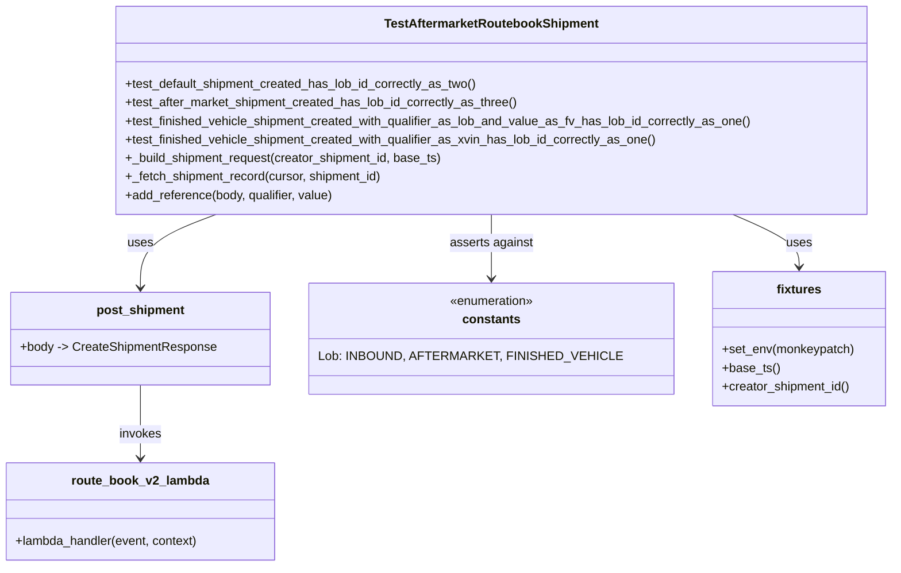
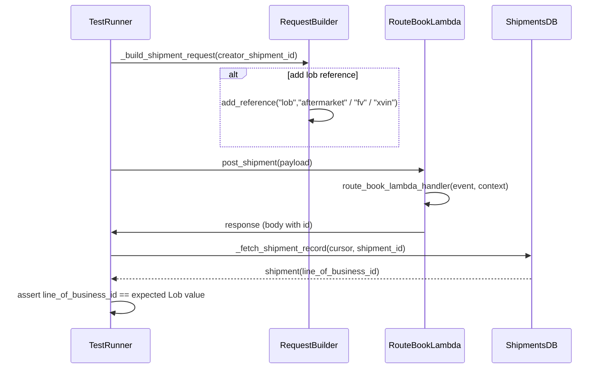
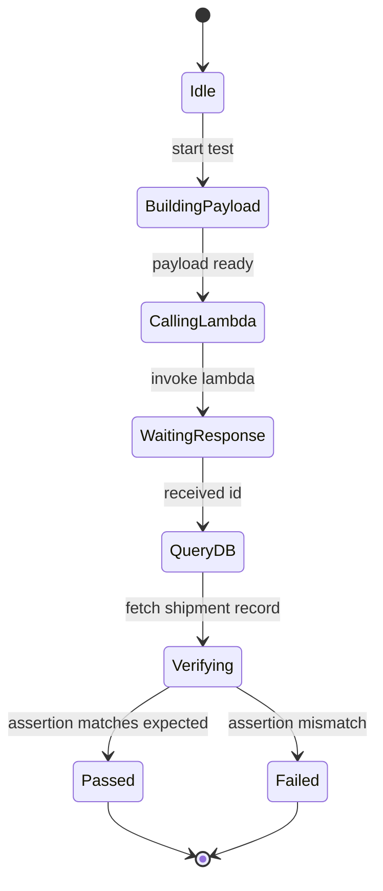

# Diagram: shipment_core/shipment_service/test/integration/asn/test_route_book_v2.py

> Auto-generated by Obscura crawlers

## Diagram 1

### SVG

<svg id="container" width="1110.890625" xmlns="http://www.w3.org/2000/svg" class="classDiagram" height="734" viewBox="0 0 1110.890625 734" role="graphics-document document" aria-roledescription="class"><g><defs><marker id="container_class-aggregationStart" class="marker aggregation class" refX="18" refY="7" markerWidth="190" markerHeight="240" orient="auto"><path d="M 18,7 L9,13 L1,7 L9,1 Z"></path></marker></defs><defs><marker id="container_class-aggregationEnd" class="marker aggregation class" refX="1" refY="7" markerWidth="20" markerHeight="28" orient="auto"><path d="M 18,7 L9,13 L1,7 L9,1 Z"></path></marker></defs><defs><marker id="container_class-extensionStart" class="marker extension class" refX="18" refY="7" markerWidth="190" markerHeight="240" orient="auto"><path d="M 1,7 L18,13 V 1 Z"></path></marker></defs><defs><marker id="container_class-extensionEnd" class="marker extension class" refX="1" refY="7" markerWidth="20" markerHeight="28" orient="auto"><path d="M 1,1 V 13 L18,7 Z"></path></marker></defs><defs><marker id="container_class-compositionStart" class="marker composition class" refX="18" refY="7" markerWidth="190" markerHeight="240" orient="auto"><path d="M 18,7 L9,13 L1,7 L9,1 Z"></path></marker></defs><defs><marker id="container_class-compositionEnd" class="marker composition class" refX="1" refY="7" markerWidth="20" markerHeight="28" orient="auto"><path d="M 18,7 L9,13 L1,7 L9,1 Z"></path></marker></defs><defs><marker id="container_class-dependencyStart" class="marker dependency class" refX="6" refY="7" markerWidth="190" markerHeight="240" orient="auto"><path d="M 5,7 L9,13 L1,7 L9,1 Z"></path></marker></defs><defs><marker id="container_class-dependencyEnd" class="marker dependency class" refX="13" refY="7" markerWidth="20" markerHeight="28" orient="auto"><path d="M 18,7 L9,13 L14,7 L9,1 Z"></path></marker></defs><defs><marker id="container_class-lollipopStart" class="marker lollipop class" refX="13" refY="7" markerWidth="190" markerHeight="240" orient="auto"><circle stroke="black" fill="transparent" cx="7" cy="7" r="6"></circle></marker></defs><defs><marker id="container_class-lollipopEnd" class="marker lollipop class" refX="1" refY="7" markerWidth="190" markerHeight="240" orient="auto"><circle stroke="black" fill="transparent" cx="7" cy="7" r="6"></circle></marker></defs><g class="root"><g class="clusters"></g><g class="edgePaths"><path d="M275.696,278L260.239,284.167C244.782,290.333,213.867,302.667,198.41,318.5C182.953,334.333,182.953,353.667,182.953,363.333L182.953,373" id="id_TestAftermarketRoutebookShipment_post_shipment_1" class="edge-thickness-normal edge-pattern-solid relation" style=";;;" data-edge="true" data-et="edge" data-id="id_TestAftermarketRoutebookShipment_post_shipment_1" data-points="W3sieCI6Mjc1LjY5NTk3MTExMTkxODYsInkiOjI3OH0seyJ4IjoxODIuOTUzMTI1LCJ5IjozMTV9LHsieCI6MTgyLjk1MzEyNSwieSI6Mzc5fV0=" marker-end="url(#container_class-dependencyEnd)"></path><path d="M182.953,499L182.953,509.667C182.953,520.333,182.953,541.667,182.953,557.5C182.953,573.333,182.953,583.667,182.953,588.833L182.953,594" id="id_post_shipment_route_book_v2_lambda_2" class="edge-thickness-normal edge-pattern-solid relation" style=";;;" data-edge="true" data-et="edge" data-id="id_post_shipment_route_book_v2_lambda_2" data-points="W3sieCI6MTgyLjk1MzEyNSwieSI6NDk5fSx7IngiOjE4Mi45NTMxMjUsInkiOjU2M30seyJ4IjoxODIuOTUzMTI1LCJ5Ijo2MDB9XQ==" marker-end="url(#container_class-dependencyEnd)"></path><path d="M614.082,278L614.082,284.167C614.082,290.333,614.082,302.667,614.082,316.5C614.082,330.333,614.082,345.667,614.082,353.333L614.082,361" id="id_TestAftermarketRoutebookShipment_constants_3" class="edge-thickness-normal edge-pattern-solid relation" style=";;;" data-edge="true" data-et="edge" data-id="id_TestAftermarketRoutebookShipment_constants_3" data-points="W3sieCI6NjE0LjA4MjAzMTI1LCJ5IjoyNzh9LHsieCI6NjE0LjA4MjAzMTI1LCJ5IjozMTV9LHsieCI6NjE0LjA4MjAzMTI1LCJ5IjozNjd9XQ==" marker-end="url(#container_class-dependencyEnd)"></path><path d="M909.989,278L923.506,284.167C937.023,290.333,964.056,302.667,977.573,314C991.09,325.333,991.09,335.667,991.09,340.833L991.09,346" id="id_TestAftermarketRoutebookShipment_fixtures_4" class="edge-thickness-normal edge-pattern-solid relation" style=";;;" data-edge="true" data-et="edge" data-id="id_TestAftermarketRoutebookShipment_fixtures_4" data-points="W3sieCI6OTA5Ljk4OTMyNTk0NDc2NzQsInkiOjI3OH0seyJ4Ijo5OTEuMDg5ODQzNzUsInkiOjMxNX0seyJ4Ijo5OTEuMDg5ODQzNzUsInkiOjM1Mn1d" marker-end="url(#container_class-dependencyEnd)"></path></g><g class="edgeLabels"><g class="edgeLabel" transform="translate(182.953125, 315)"><g class="label" data-id="id_TestAftermarketRoutebookShipment_post_shipment_1" transform="translate(-16.4921875, -12)"><foreignObject width="32.984375" height="24">

uses

</foreignObject></g></g><g class="edgeLabel" transform="translate(182.953125, 563)"><g class="label" data-id="id_post_shipment_route_book_v2_lambda_2" transform="translate(-27.5859375, -12)"><foreignObject width="55.171875" height="24">

invokes

</foreignObject></g></g><g class="edgeLabel" transform="translate(614.08203125, 315)"><g class="label" data-id="id_TestAftermarketRoutebookShipment_constants_3" transform="translate(-54.0625, -12)"><foreignObject width="108.125" height="24">

asserts against

</foreignObject></g></g><g class="edgeLabel" transform="translate(991.08984375, 315)"><g class="label" data-id="id_TestAftermarketRoutebookShipment_fixtures_4" transform="translate(-16.4921875, -12)"><foreignObject width="32.984375" height="24">

uses

</foreignObject></g></g></g><g class="nodes"><g class="node default" id="classId-TestAftermarketRoutebookShipment-0" transform="translate(614.08203125, 143)"><g class="basic label-container"><path d="M-486.73828125 -135 L486.73828125 -135 L486.73828125 135 L-486.73828125 135" stroke="none" stroke-width="0" fill="#ECECFF" style=""></path><path d="M-486.73828125 -135 C-118.9337880246079 -135, 248.8707052007842 -135, 486.73828125 -135 M-486.73828125 -135 C-260.81634091692 -135, -34.89440058384008 -135, 486.73828125 -135 M486.73828125 -135 C486.73828125 -61.09910317827368, 486.73828125 12.80179364345264, 486.73828125 135 M486.73828125 -135 C486.73828125 -69.4702431747014, 486.73828125 -3.9404863494027893, 486.73828125 135 M486.73828125 135 C137.2774390163973 135, -212.1834032172054 135, -486.73828125 135 M486.73828125 135 C241.56565799982505 135, -3.6069652503499015 135, -486.73828125 135 M-486.73828125 135 C-486.73828125 49.61464204357064, -486.73828125 -35.77071591285872, -486.73828125 -135 M-486.73828125 135 C-486.73828125 78.58689968214071, -486.73828125 22.173799364281436, -486.73828125 -135" stroke="#9370DB" stroke-width="1.3" fill="none" stroke-dasharray="0 0" style=""></path></g><g class="annotation-group text" transform="translate(0, -111)"></g><g class="label-group text" transform="translate(-134.6171875, -111)"><g class="label" style="font-weight: bolder" transform="translate(0,-12)"><foreignObject width="269.234375" height="24">

TestAftermarketRoutebookShipment

</foreignObject></g></g><g class="members-group text" transform="translate(-474.73828125, -63)"></g><g class="methods-group text" transform="translate(-474.73828125, -33)"><g class="label" style="" transform="translate(0,-12)"><foreignObject width="460.578125" height="24">

+test_default_shipment_created_has_lob_id_correctly_as_two()

</foreignObject></g><g class="label" style="" transform="translate(0,12)"><foreignObject width="513.171875" height="24">

+test_after_market_shipment_created_has_lob_id_correctly_as_three()

</foreignObject></g><g class="label" style="" transform="translate(0,36)"><foreignObject width="814.859375" height="24">

+test_finished_vehicle_shipment_created_with_qualifier_as_lob_and_value_as_fv_has_lob_id_correctly_as_one()

</foreignObject></g><g class="label" style="" transform="translate(0,60)"><foreignObject width="694.90625" height="24">

+test_finished_vehicle_shipment_created_with_qualifier_as_xvin_has_lob_id_correctly_as_one()

</foreignObject></g><g class="label" style="" transform="translate(0,84)"><foreignObject width="415.890625" height="24">

+_build_shipment_request(creator_shipment_id, base_ts)

</foreignObject></g><g class="label" style="" transform="translate(0,108)"><foreignObject width="336.375" height="24">

+_fetch_shipment_record(cursor, shipment_id)

</foreignObject></g><g class="label" style="" transform="translate(0,132)"><foreignObject width="272.578125" height="24">

+add_reference(body, qualifier, value)

</foreignObject></g></g><g class="divider" style=""><path d="M-486.73828125 -87 C-232.35853268177908 -87, 22.021215886441837 -87, 486.73828125 -87 M-486.73828125 -87 C-280.9457766472282 -87, -75.15327204445634 -87, 486.73828125 -87" stroke="#9370DB" stroke-width="1.3" fill="none" stroke-dasharray="0 0" style=""></path></g><g class="divider" style=""><path d="M-486.73828125 -63 C-193.15492962932564 -63, 100.42842199134873 -63, 486.73828125 -63 M-486.73828125 -63 C-193.09418341081079 -63, 100.54991442837843 -63, 486.73828125 -63" stroke="#9370DB" stroke-width="1.3" fill="none" stroke-dasharray="0 0" style=""></path></g></g><g class="node default" id="classId-post_shipment-1" transform="translate(182.953125, 439)"><g class="basic label-container"><path d="M-165.921875 -60 L165.921875 -60 L165.921875 60 L-165.921875 60" stroke="none" stroke-width="0" fill="#ECECFF" style=""></path><path d="M-165.921875 -60 C-65.70658405982218 -60, 34.508706880355646 -60, 165.921875 -60 M-165.921875 -60 C-85.02849478431418 -60, -4.135114568628353 -60, 165.921875 -60 M165.921875 -60 C165.921875 -35.8413163628521, 165.921875 -11.682632725704188, 165.921875 60 M165.921875 -60 C165.921875 -28.180542808500103, 165.921875 3.6389143829997934, 165.921875 60 M165.921875 60 C58.560668739056695 60, -48.80053752188661 60, -165.921875 60 M165.921875 60 C88.14612425283937 60, 10.370373505678742 60, -165.921875 60 M-165.921875 60 C-165.921875 19.766561947140232, -165.921875 -20.466876105719535, -165.921875 -60 M-165.921875 60 C-165.921875 33.732027902768216, -165.921875 7.464055805536432, -165.921875 -60" stroke="#9370DB" stroke-width="1.3" fill="none" stroke-dasharray="0 0" style=""></path></g><g class="annotation-group text" transform="translate(0, -36)"></g><g class="label-group text" transform="translate(-54.953125, -36)"><g class="label" style="font-weight: bolder" transform="translate(0,-12)"><foreignObject width="109.90625" height="24">

post_shipment

</foreignObject></g></g><g class="members-group text" transform="translate(-153.921875, 12)"><g class="label" style="" transform="translate(0,-12)"><foreignObject width="252.890625" height="24">

+body -&gt; CreateShipmentResponse

</foreignObject></g></g><g class="methods-group text" transform="translate(-153.921875, 60)"></g><g class="divider" style=""><path d="M-165.921875 -12 C-44.40480510050283 -12, 77.11226479899435 -12, 165.921875 -12 M-165.921875 -12 C-89.18886511388789 -12, -12.455855227775771 -12, 165.921875 -12" stroke="#9370DB" stroke-width="1.3" fill="none" stroke-dasharray="0 0" style=""></path></g><g class="divider" style=""><path d="M-165.921875 36 C-90.38548336266946 36, -14.849091725338923 36, 165.921875 36 M-165.921875 36 C-63.630336873560836 36, 38.66120125287833 36, 165.921875 36" stroke="#9370DB" stroke-width="1.3" fill="none" stroke-dasharray="0 0" style=""></path></g></g><g class="node default" id="classId-route_book_v2_lambda-2" transform="translate(182.953125, 663)"><g class="basic label-container"><path d="M-174.953125 -63 L174.953125 -63 L174.953125 63 L-174.953125 63" stroke="none" stroke-width="0" fill="#ECECFF" style=""></path><path d="M-174.953125 -63 C-95.70198741413886 -63, -16.45084982827771 -63, 174.953125 -63 M-174.953125 -63 C-40.17201159328974 -63, 94.60910181342052 -63, 174.953125 -63 M174.953125 -63 C174.953125 -36.31360533798387, 174.953125 -9.627210675967746, 174.953125 63 M174.953125 -63 C174.953125 -32.508198152076645, 174.953125 -2.0163963041532895, 174.953125 63 M174.953125 63 C38.27533874888957 63, -98.40244750222087 63, -174.953125 63 M174.953125 63 C82.87492392866599 63, -9.203277142668014 63, -174.953125 63 M-174.953125 63 C-174.953125 15.457385158821005, -174.953125 -32.08522968235799, -174.953125 -63 M-174.953125 63 C-174.953125 33.6381668938118, -174.953125 4.276333787623599, -174.953125 -63" stroke="#9370DB" stroke-width="1.3" fill="none" stroke-dasharray="0 0" style=""></path></g><g class="annotation-group text" transform="translate(0, -39)"></g><g class="label-group text" transform="translate(-85.71875, -39)"><g class="label" style="font-weight: bolder" transform="translate(0,-12)"><foreignObject width="171.4375" height="24">

route_book_v2_lambda

</foreignObject></g></g><g class="members-group text" transform="translate(-162.953125, 9)"></g><g class="methods-group text" transform="translate(-162.953125, 39)"><g class="label" style="" transform="translate(0,-12)"><foreignObject width="240.1875" height="24">

+lambda_handler(event, context)

</foreignObject></g></g><g class="divider" style=""><path d="M-174.953125 -15 C-103.60969926601184 -15, -32.26627353202369 -15, 174.953125 -15 M-174.953125 -15 C-87.92723343894592 -15, -0.9013418778918378 -15, 174.953125 -15" stroke="#9370DB" stroke-width="1.3" fill="none" stroke-dasharray="0 0" style=""></path></g><g class="divider" style=""><path d="M-174.953125 9 C-95.88024469342042 9, -16.807364386840845 9, 174.953125 9 M-174.953125 9 C-72.23475140867983 9, 30.483622182640346 9, 174.953125 9" stroke="#9370DB" stroke-width="1.3" fill="none" stroke-dasharray="0 0" style=""></path></g></g><g class="node default" id="classId-constants-3" transform="translate(614.08203125, 439)"><g class="basic label-container"><path d="M-215.20703125 -72 L215.20703125 -72 L215.20703125 72 L-215.20703125 72" stroke="none" stroke-width="0" fill="#ECECFF" style=""></path><path d="M-215.20703125 -72 C-82.80607285452965 -72, 49.59488554094071 -72, 215.20703125 -72 M-215.20703125 -72 C-56.17898191133409 -72, 102.84906742733182 -72, 215.20703125 -72 M215.20703125 -72 C215.20703125 -21.947431666878707, 215.20703125 28.105136666242586, 215.20703125 72 M215.20703125 -72 C215.20703125 -32.19436519554134, 215.20703125 7.6112696089173255, 215.20703125 72 M215.20703125 72 C47.96781769190579 72, -119.27139586618841 72, -215.20703125 72 M215.20703125 72 C75.00224143497152 72, -65.20254838005695 72, -215.20703125 72 M-215.20703125 72 C-215.20703125 26.076844619850384, -215.20703125 -19.846310760299232, -215.20703125 -72 M-215.20703125 72 C-215.20703125 40.730522031797975, -215.20703125 9.461044063595956, -215.20703125 -72" stroke="#9370DB" stroke-width="1.3" fill="none" stroke-dasharray="0 0" style=""></path></g><g class="annotation-group text" transform="translate(-55.5546875, -48)"><g class="label" style="" transform="translate(0,-12)"><foreignObject width="111.109375" height="24">

«enumeration»

</foreignObject></g></g><g class="label-group text" transform="translate(-35.7734375, -24)"><g class="label" style="font-weight: bolder" transform="translate(0,-12)"><foreignObject width="71.546875" height="24">

constants

</foreignObject></g></g><g class="members-group text" transform="translate(-203.20703125, 24)"><g class="label" style="" transform="translate(0,-12)"><foreignObject width="350.859375" height="24">

Lob: INBOUND, AFTERMARKET, FINISHED_VEHICLE

</foreignObject></g></g><g class="methods-group text" transform="translate(-203.20703125, 72)"></g><g class="divider" style=""><path d="M-215.20703125 0 C-128.32848973071864 0, -41.44994821143729 0, 215.20703125 0 M-215.20703125 0 C-86.59079492993814 0, 42.02544139012372 0, 215.20703125 0" stroke="#9370DB" stroke-width="1.3" fill="none" stroke-dasharray="0 0" style=""></path></g><g class="divider" style=""><path d="M-215.20703125 48 C-44.534102430822145 48, 126.13882638835571 48, 215.20703125 48 M-215.20703125 48 C-67.31453220436615 48, 80.57796684126771 48, 215.20703125 48" stroke="#9370DB" stroke-width="1.3" fill="none" stroke-dasharray="0 0" style=""></path></g></g><g class="node default" id="classId-fixtures-4" transform="translate(991.08984375, 439)"><g class="basic label-container"><path d="M-111.80078125 -87 L111.80078125 -87 L111.80078125 87 L-111.80078125 87" stroke="none" stroke-width="0" fill="#ECECFF" style=""></path><path d="M-111.80078125 -87 C-58.44742638106656 -87, -5.094071512133127 -87, 111.80078125 -87 M-111.80078125 -87 C-31.106979246902895 -87, 49.58682275619421 -87, 111.80078125 -87 M111.80078125 -87 C111.80078125 -38.0416694293233, 111.80078125 10.916661141353401, 111.80078125 87 M111.80078125 -87 C111.80078125 -29.084658750601648, 111.80078125 28.830682498796705, 111.80078125 87 M111.80078125 87 C27.98271131793564 87, -55.83535861412872 87, -111.80078125 87 M111.80078125 87 C55.04524966181451 87, -1.7102819263709819 87, -111.80078125 87 M-111.80078125 87 C-111.80078125 37.686367271327306, -111.80078125 -11.627265457345388, -111.80078125 -87 M-111.80078125 87 C-111.80078125 48.531311704503466, -111.80078125 10.062623409006932, -111.80078125 -87" stroke="#9370DB" stroke-width="1.3" fill="none" stroke-dasharray="0 0" style=""></path></g><g class="annotation-group text" transform="translate(0, -63)"></g><g class="label-group text" transform="translate(-27.8046875, -63)"><g class="label" style="font-weight: bolder" transform="translate(0,-12)"><foreignObject width="55.609375" height="24">

fixtures

</foreignObject></g></g><g class="members-group text" transform="translate(-99.80078125, -15)"></g><g class="methods-group text" transform="translate(-99.80078125, 15)"><g class="label" style="" transform="translate(0,-12)"><foreignObject width="171.796875" height="24">

+set_env(monkeypatch)

</foreignObject></g><g class="label" style="" transform="translate(0,12)"><foreignObject width="73.375" height="24">

+base_ts()

</foreignObject></g><g class="label" style="" transform="translate(0,36)"><foreignObject width="167.90625" height="24">

+creator_shipment_id()

</foreignObject></g></g><g class="divider" style=""><path d="M-111.80078125 -39 C-62.05511794425272 -39, -12.309454638505443 -39, 111.80078125 -39 M-111.80078125 -39 C-23.42575926690867 -39, 64.94926271618266 -39, 111.80078125 -39" stroke="#9370DB" stroke-width="1.3" fill="none" stroke-dasharray="0 0" style=""></path></g><g class="divider" style=""><path d="M-111.80078125 -15 C-66.62734959041796 -15, -21.453917930835942 -15, 111.80078125 -15 M-111.80078125 -15 C-37.43801885180602 -15, 36.92474354638796 -15, 111.80078125 -15" stroke="#9370DB" stroke-width="1.3" fill="none" stroke-dasharray="0 0" style=""></path></g></g></g></g></g></svg>

## Diagram 2

### SVG

<svg id="container" width="1225" xmlns="http://www.w3.org/2000/svg" height="730" viewBox="-152 -10 1225 730" role="graphics-document document" aria-roledescription="sequence"><g><rect x="873" y="644" fill="#eaeaea" stroke="#666" width="150" height="65" name="DB" rx="3" ry="3" class="actor actor-bottom"></rect><text x="948" y="676.5" dominant-baseline="central" alignment-baseline="central" class="actor actor-box" style="text-anchor: middle; font-size: 16px; font-weight: 400;"><tspan x="948" dy="0">ShipmentsDB</tspan></text></g><g><rect x="648" y="644" fill="#eaeaea" stroke="#666" width="157" height="65" name="Lambda" rx="3" ry="3" class="actor actor-bottom"></rect><text x="726.5" y="676.5" dominant-baseline="central" alignment-baseline="central" class="actor actor-box" style="text-anchor: middle; font-size: 16px; font-weight: 400;"><tspan x="726.5" dy="0">RouteBookLambda</tspan></text></g><g><rect x="416" y="644" fill="#eaeaea" stroke="#666" width="150" height="65" name="Build" rx="3" ry="3" class="actor actor-bottom"></rect><text x="491" y="676.5" dominant-baseline="central" alignment-baseline="central" class="actor actor-box" style="text-anchor: middle; font-size: 16px; font-weight: 400;"><tspan x="491" dy="0">RequestBuilder</tspan></text></g><g><rect x="0" y="644" fill="#eaeaea" stroke="#666" width="150" height="65" name="Test" rx="3" ry="3" class="actor actor-bottom"></rect><text x="75" y="676.5" dominant-baseline="central" alignment-baseline="central" class="actor actor-box" style="text-anchor: middle; font-size: 16px; font-weight: 400;"><tspan x="75" dy="0">TestRunner</tspan></text></g><g><line id="actor3" x1="948" y1="65" x2="948" y2="644" class="actor-line 200" stroke-width="0.5px" stroke="#999" name="DB"></line><g id="root-3"><rect x="873" y="0" fill="#eaeaea" stroke="#666" width="150" height="65" name="DB" rx="3" ry="3" class="actor actor-top"></rect><text x="948" y="32.5" dominant-baseline="central" alignment-baseline="central" class="actor actor-box" style="text-anchor: middle; font-size: 16px; font-weight: 400;"><tspan x="948" dy="0">ShipmentsDB</tspan></text></g></g><g><line id="actor2" x1="726.5" y1="65" x2="726.5" y2="644" class="actor-line 200" stroke-width="0.5px" stroke="#999" name="Lambda"></line><g id="root-2"><rect x="648" y="0" fill="#eaeaea" stroke="#666" width="157" height="65" name="Lambda" rx="3" ry="3" class="actor actor-top"></rect><text x="726.5" y="32.5" dominant-baseline="central" alignment-baseline="central" class="actor actor-box" style="text-anchor: middle; font-size: 16px; font-weight: 400;"><tspan x="726.5" dy="0">RouteBookLambda</tspan></text></g></g><g><line id="actor1" x1="491" y1="65" x2="491" y2="644" class="actor-line 200" stroke-width="0.5px" stroke="#999" name="Build"></line><g id="root-1"><rect x="416" y="0" fill="#eaeaea" stroke="#666" width="150" height="65" name="Build" rx="3" ry="3" class="actor actor-top"></rect><text x="491" y="32.5" dominant-baseline="central" alignment-baseline="central" class="actor actor-box" style="text-anchor: middle; font-size: 16px; font-weight: 400;"><tspan x="491" dy="0">RequestBuilder</tspan></text></g></g><g><line id="actor0" x1="75" y1="65" x2="75" y2="644" class="actor-line 200" stroke-width="0.5px" stroke="#999" name="Test"></line><g id="root-0"><rect x="0" y="0" fill="#eaeaea" stroke="#666" width="150" height="65" name="Test" rx="3" ry="3" class="actor actor-top"></rect><text x="75" y="32.5" dominant-baseline="central" alignment-baseline="central" class="actor actor-box" style="text-anchor: middle; font-size: 16px; font-weight: 400;"><tspan x="75" dy="0">TestRunner</tspan></text></g></g><g></g><defs><symbol id="computer" width="24" height="24"><path transform="scale(.5)" d="M2 2v13h20v-13h-20zm18 11h-16v-9h16v9zm-10.228 6l.466-1h3.524l.467 1h-4.457zm14.228 3h-24l2-6h2.104l-1.33 4h18.45l-1.297-4h2.073l2 6zm-5-10h-14v-7h14v7z"></path></symbol></defs><defs><symbol id="database" fill-rule="evenodd" clip-rule="evenodd"><path transform="scale(.5)" d="M12.258.001l.256.004.255.005.253.008.251.01.249.012.247.015.246.016.242.019.241.02.239.023.236.024.233.027.231.028.229.031.225.032.223.034.22.036.217.038.214.04.211.041.208.043.205.045.201.046.198.048.194.05.191.051.187.053.183.054.18.056.175.057.172.059.168.06.163.061.16.063.155.064.15.066.074.033.073.033.071.034.07.034.069.035.068.035.067.035.066.035.064.036.064.036.062.036.06.036.06.037.058.037.058.037.055.038.055.038.053.038.052.038.051.039.05.039.048.039.047.039.045.04.044.04.043.04.041.04.04.041.039.041.037.041.036.041.034.041.033.042.032.042.03.042.029.042.027.042.026.043.024.043.023.043.021.043.02.043.018.044.017.043.015.044.013.044.012.044.011.045.009.044.007.045.006.045.004.045.002.045.001.045v17l-.001.045-.002.045-.004.045-.006.045-.007.045-.009.044-.011.045-.012.044-.013.044-.015.044-.017.043-.018.044-.02.043-.021.043-.023.043-.024.043-.026.043-.027.042-.029.042-.03.042-.032.042-.033.042-.034.041-.036.041-.037.041-.039.041-.04.041-.041.04-.043.04-.044.04-.045.04-.047.039-.048.039-.05.039-.051.039-.052.038-.053.038-.055.038-.055.038-.058.037-.058.037-.06.037-.06.036-.062.036-.064.036-.064.036-.066.035-.067.035-.068.035-.069.035-.07.034-.071.034-.073.033-.074.033-.15.066-.155.064-.16.063-.163.061-.168.06-.172.059-.175.057-.18.056-.183.054-.187.053-.191.051-.194.05-.198.048-.201.046-.205.045-.208.043-.211.041-.214.04-.217.038-.22.036-.223.034-.225.032-.229.031-.231.028-.233.027-.236.024-.239.023-.241.02-.242.019-.246.016-.247.015-.249.012-.251.01-.253.008-.255.005-.256.004-.258.001-.258-.001-.256-.004-.255-.005-.253-.008-.251-.01-.249-.012-.247-.015-.245-.016-.243-.019-.241-.02-.238-.023-.236-.024-.234-.027-.231-.028-.228-.031-.226-.032-.223-.034-.22-.036-.217-.038-.214-.04-.211-.041-.208-.043-.204-.045-.201-.046-.198-.048-.195-.05-.19-.051-.187-.053-.184-.054-.179-.056-.176-.057-.172-.059-.167-.06-.164-.061-.159-.063-.155-.064-.151-.066-.074-.033-.072-.033-.072-.034-.07-.034-.069-.035-.068-.035-.067-.035-.066-.035-.064-.036-.063-.036-.062-.036-.061-.036-.06-.037-.058-.037-.057-.037-.056-.038-.055-.038-.053-.038-.052-.038-.051-.039-.049-.039-.049-.039-.046-.039-.046-.04-.044-.04-.043-.04-.041-.04-.04-.041-.039-.041-.037-.041-.036-.041-.034-.041-.033-.042-.032-.042-.03-.042-.029-.042-.027-.042-.026-.043-.024-.043-.023-.043-.021-.043-.02-.043-.018-.044-.017-.043-.015-.044-.013-.044-.012-.044-.011-.045-.009-.044-.007-.045-.006-.045-.004-.045-.002-.045-.001-.045v-17l.001-.045.002-.045.004-.045.006-.045.007-.045.009-.044.011-.045.012-.044.013-.044.015-.044.017-.043.018-.044.02-.043.021-.043.023-.043.024-.043.026-.043.027-.042.029-.042.03-.042.032-.042.033-.042.034-.041.036-.041.037-.041.039-.041.04-.041.041-.04.043-.04.044-.04.046-.04.046-.039.049-.039.049-.039.051-.039.052-.038.053-.038.055-.038.056-.038.057-.037.058-.037.06-.037.061-.036.062-.036.063-.036.064-.036.066-.035.067-.035.068-.035.069-.035.07-.034.072-.034.072-.033.074-.033.151-.066.155-.064.159-.063.164-.061.167-.06.172-.059.176-.057.179-.056.184-.054.187-.053.19-.051.195-.05.198-.048.201-.046.204-.045.208-.043.211-.041.214-.04.217-.038.22-.036.223-.034.226-.032.228-.031.231-.028.234-.027.236-.024.238-.023.241-.02.243-.019.245-.016.247-.015.249-.012.251-.01.253-.008.255-.005.256-.004.258-.001.258.001zm-9.258 20.499v.01l.001.021.003.021.004.022.005.021.006.022.007.022.009.023.01.022.011.023.012.023.013.023.015.023.016.024.017.023.018.024.019.024.021.024.022.025.023.024.024.025.052.049.056.05.061.051.066.051.07.051.075.051.079.052.084.052.088.052.092.052.097.052.102.051.105.052.11.052.114.051.119.051.123.051.127.05.131.05.135.05.139.048.144.049.147.047.152.047.155.047.16.045.163.045.167.043.171.043.176.041.178.041.183.039.187.039.19.037.194.035.197.035.202.033.204.031.209.03.212.029.216.027.219.025.222.024.226.021.23.02.233.018.236.016.24.015.243.012.246.01.249.008.253.005.256.004.259.001.26-.001.257-.004.254-.005.25-.008.247-.011.244-.012.241-.014.237-.016.233-.018.231-.021.226-.021.224-.024.22-.026.216-.027.212-.028.21-.031.205-.031.202-.034.198-.034.194-.036.191-.037.187-.039.183-.04.179-.04.175-.042.172-.043.168-.044.163-.045.16-.046.155-.046.152-.047.148-.048.143-.049.139-.049.136-.05.131-.05.126-.05.123-.051.118-.052.114-.051.11-.052.106-.052.101-.052.096-.052.092-.052.088-.053.083-.051.079-.052.074-.052.07-.051.065-.051.06-.051.056-.05.051-.05.023-.024.023-.025.021-.024.02-.024.019-.024.018-.024.017-.024.015-.023.014-.024.013-.023.012-.023.01-.023.01-.022.008-.022.006-.022.006-.022.004-.022.004-.021.001-.021.001-.021v-4.127l-.077.055-.08.053-.083.054-.085.053-.087.052-.09.052-.093.051-.095.05-.097.05-.1.049-.102.049-.105.048-.106.047-.109.047-.111.046-.114.045-.115.045-.118.044-.12.043-.122.042-.124.042-.126.041-.128.04-.13.04-.132.038-.134.038-.135.037-.138.037-.139.035-.142.035-.143.034-.144.033-.147.032-.148.031-.15.03-.151.03-.153.029-.154.027-.156.027-.158.026-.159.025-.161.024-.162.023-.163.022-.165.021-.166.02-.167.019-.169.018-.169.017-.171.016-.173.015-.173.014-.175.013-.175.012-.177.011-.178.01-.179.008-.179.008-.181.006-.182.005-.182.004-.184.003-.184.002h-.37l-.184-.002-.184-.003-.182-.004-.182-.005-.181-.006-.179-.008-.179-.008-.178-.01-.176-.011-.176-.012-.175-.013-.173-.014-.172-.015-.171-.016-.17-.017-.169-.018-.167-.019-.166-.02-.165-.021-.163-.022-.162-.023-.161-.024-.159-.025-.157-.026-.156-.027-.155-.027-.153-.029-.151-.03-.15-.03-.148-.031-.146-.032-.145-.033-.143-.034-.141-.035-.14-.035-.137-.037-.136-.037-.134-.038-.132-.038-.13-.04-.128-.04-.126-.041-.124-.042-.122-.042-.12-.044-.117-.043-.116-.045-.113-.045-.112-.046-.109-.047-.106-.047-.105-.048-.102-.049-.1-.049-.097-.05-.095-.05-.093-.052-.09-.051-.087-.052-.085-.053-.083-.054-.08-.054-.077-.054v4.127zm0-5.654v.011l.001.021.003.021.004.021.005.022.006.022.007.022.009.022.01.022.011.023.012.023.013.023.015.024.016.023.017.024.018.024.019.024.021.024.022.024.023.025.024.024.052.05.056.05.061.05.066.051.07.051.075.052.079.051.084.052.088.052.092.052.097.052.102.052.105.052.11.051.114.051.119.052.123.05.127.051.131.05.135.049.139.049.144.048.147.048.152.047.155.046.16.045.163.045.167.044.171.042.176.042.178.04.183.04.187.038.19.037.194.036.197.034.202.033.204.032.209.03.212.028.216.027.219.025.222.024.226.022.23.02.233.018.236.016.24.014.243.012.246.01.249.008.253.006.256.003.259.001.26-.001.257-.003.254-.006.25-.008.247-.01.244-.012.241-.015.237-.016.233-.018.231-.02.226-.022.224-.024.22-.025.216-.027.212-.029.21-.03.205-.032.202-.033.198-.035.194-.036.191-.037.187-.039.183-.039.179-.041.175-.042.172-.043.168-.044.163-.045.16-.045.155-.047.152-.047.148-.048.143-.048.139-.05.136-.049.131-.05.126-.051.123-.051.118-.051.114-.052.11-.052.106-.052.101-.052.096-.052.092-.052.088-.052.083-.052.079-.052.074-.051.07-.052.065-.051.06-.05.056-.051.051-.049.023-.025.023-.024.021-.025.02-.024.019-.024.018-.024.017-.024.015-.023.014-.023.013-.024.012-.022.01-.023.01-.023.008-.022.006-.022.006-.022.004-.021.004-.022.001-.021.001-.021v-4.139l-.077.054-.08.054-.083.054-.085.052-.087.053-.09.051-.093.051-.095.051-.097.05-.1.049-.102.049-.105.048-.106.047-.109.047-.111.046-.114.045-.115.044-.118.044-.12.044-.122.042-.124.042-.126.041-.128.04-.13.039-.132.039-.134.038-.135.037-.138.036-.139.036-.142.035-.143.033-.144.033-.147.033-.148.031-.15.03-.151.03-.153.028-.154.028-.156.027-.158.026-.159.025-.161.024-.162.023-.163.022-.165.021-.166.02-.167.019-.169.018-.169.017-.171.016-.173.015-.173.014-.175.013-.175.012-.177.011-.178.009-.179.009-.179.007-.181.007-.182.005-.182.004-.184.003-.184.002h-.37l-.184-.002-.184-.003-.182-.004-.182-.005-.181-.007-.179-.007-.179-.009-.178-.009-.176-.011-.176-.012-.175-.013-.173-.014-.172-.015-.171-.016-.17-.017-.169-.018-.167-.019-.166-.02-.165-.021-.163-.022-.162-.023-.161-.024-.159-.025-.157-.026-.156-.027-.155-.028-.153-.028-.151-.03-.15-.03-.148-.031-.146-.033-.145-.033-.143-.033-.141-.035-.14-.036-.137-.036-.136-.037-.134-.038-.132-.039-.13-.039-.128-.04-.126-.041-.124-.042-.122-.043-.12-.043-.117-.044-.116-.044-.113-.046-.112-.046-.109-.046-.106-.047-.105-.048-.102-.049-.1-.049-.097-.05-.095-.051-.093-.051-.09-.051-.087-.053-.085-.052-.083-.054-.08-.054-.077-.054v4.139zm0-5.666v.011l.001.02.003.022.004.021.005.022.006.021.007.022.009.023.01.022.011.023.012.023.013.023.015.023.016.024.017.024.018.023.019.024.021.025.022.024.023.024.024.025.052.05.056.05.061.05.066.051.07.051.075.052.079.051.084.052.088.052.092.052.097.052.102.052.105.051.11.052.114.051.119.051.123.051.127.05.131.05.135.05.139.049.144.048.147.048.152.047.155.046.16.045.163.045.167.043.171.043.176.042.178.04.183.04.187.038.19.037.194.036.197.034.202.033.204.032.209.03.212.028.216.027.219.025.222.024.226.021.23.02.233.018.236.017.24.014.243.012.246.01.249.008.253.006.256.003.259.001.26-.001.257-.003.254-.006.25-.008.247-.01.244-.013.241-.014.237-.016.233-.018.231-.02.226-.022.224-.024.22-.025.216-.027.212-.029.21-.03.205-.032.202-.033.198-.035.194-.036.191-.037.187-.039.183-.039.179-.041.175-.042.172-.043.168-.044.163-.045.16-.045.155-.047.152-.047.148-.048.143-.049.139-.049.136-.049.131-.051.126-.05.123-.051.118-.052.114-.051.11-.052.106-.052.101-.052.096-.052.092-.052.088-.052.083-.052.079-.052.074-.052.07-.051.065-.051.06-.051.056-.05.051-.049.023-.025.023-.025.021-.024.02-.024.019-.024.018-.024.017-.024.015-.023.014-.024.013-.023.012-.023.01-.022.01-.023.008-.022.006-.022.006-.022.004-.022.004-.021.001-.021.001-.021v-4.153l-.077.054-.08.054-.083.053-.085.053-.087.053-.09.051-.093.051-.095.051-.097.05-.1.049-.102.048-.105.048-.106.048-.109.046-.111.046-.114.046-.115.044-.118.044-.12.043-.122.043-.124.042-.126.041-.128.04-.13.039-.132.039-.134.038-.135.037-.138.036-.139.036-.142.034-.143.034-.144.033-.147.032-.148.032-.15.03-.151.03-.153.028-.154.028-.156.027-.158.026-.159.024-.161.024-.162.023-.163.023-.165.021-.166.02-.167.019-.169.018-.169.017-.171.016-.173.015-.173.014-.175.013-.175.012-.177.01-.178.01-.179.009-.179.007-.181.006-.182.006-.182.004-.184.003-.184.001-.185.001-.185-.001-.184-.001-.184-.003-.182-.004-.182-.006-.181-.006-.179-.007-.179-.009-.178-.01-.176-.01-.176-.012-.175-.013-.173-.014-.172-.015-.171-.016-.17-.017-.169-.018-.167-.019-.166-.02-.165-.021-.163-.023-.162-.023-.161-.024-.159-.024-.157-.026-.156-.027-.155-.028-.153-.028-.151-.03-.15-.03-.148-.032-.146-.032-.145-.033-.143-.034-.141-.034-.14-.036-.137-.036-.136-.037-.134-.038-.132-.039-.13-.039-.128-.041-.126-.041-.124-.041-.122-.043-.12-.043-.117-.044-.116-.044-.113-.046-.112-.046-.109-.046-.106-.048-.105-.048-.102-.048-.1-.05-.097-.049-.095-.051-.093-.051-.09-.052-.087-.052-.085-.053-.083-.053-.08-.054-.077-.054v4.153zm8.74-8.179l-.257.004-.254.005-.25.008-.247.011-.244.012-.241.014-.237.016-.233.018-.231.021-.226.022-.224.023-.22.026-.216.027-.212.028-.21.031-.205.032-.202.033-.198.034-.194.036-.191.038-.187.038-.183.04-.179.041-.175.042-.172.043-.168.043-.163.045-.16.046-.155.046-.152.048-.148.048-.143.048-.139.049-.136.05-.131.05-.126.051-.123.051-.118.051-.114.052-.11.052-.106.052-.101.052-.096.052-.092.052-.088.052-.083.052-.079.052-.074.051-.07.052-.065.051-.06.05-.056.05-.051.05-.023.025-.023.024-.021.024-.02.025-.019.024-.018.024-.017.023-.015.024-.014.023-.013.023-.012.023-.01.023-.01.022-.008.022-.006.023-.006.021-.004.022-.004.021-.001.021-.001.021.001.021.001.021.004.021.004.022.006.021.006.023.008.022.01.022.01.023.012.023.013.023.014.023.015.024.017.023.018.024.019.024.02.025.021.024.023.024.023.025.051.05.056.05.06.05.065.051.07.052.074.051.079.052.083.052.088.052.092.052.096.052.101.052.106.052.11.052.114.052.118.051.123.051.126.051.131.05.136.05.139.049.143.048.148.048.152.048.155.046.16.046.163.045.168.043.172.043.175.042.179.041.183.04.187.038.191.038.194.036.198.034.202.033.205.032.21.031.212.028.216.027.22.026.224.023.226.022.231.021.233.018.237.016.241.014.244.012.247.011.25.008.254.005.257.004.26.001.26-.001.257-.004.254-.005.25-.008.247-.011.244-.012.241-.014.237-.016.233-.018.231-.021.226-.022.224-.023.22-.026.216-.027.212-.028.21-.031.205-.032.202-.033.198-.034.194-.036.191-.038.187-.038.183-.04.179-.041.175-.042.172-.043.168-.043.163-.045.16-.046.155-.046.152-.048.148-.048.143-.048.139-.049.136-.05.131-.05.126-.051.123-.051.118-.051.114-.052.11-.052.106-.052.101-.052.096-.052.092-.052.088-.052.083-.052.079-.052.074-.051.07-.052.065-.051.06-.05.056-.05.051-.05.023-.025.023-.024.021-.024.02-.025.019-.024.018-.024.017-.023.015-.024.014-.023.013-.023.012-.023.01-.023.01-.022.008-.022.006-.023.006-.021.004-.022.004-.021.001-.021.001-.021-.001-.021-.001-.021-.004-.021-.004-.022-.006-.021-.006-.023-.008-.022-.01-.022-.01-.023-.012-.023-.013-.023-.014-.023-.015-.024-.017-.023-.018-.024-.019-.024-.02-.025-.021-.024-.023-.024-.023-.025-.051-.05-.056-.05-.06-.05-.065-.051-.07-.052-.074-.051-.079-.052-.083-.052-.088-.052-.092-.052-.096-.052-.101-.052-.106-.052-.11-.052-.114-.052-.118-.051-.123-.051-.126-.051-.131-.05-.136-.05-.139-.049-.143-.048-.148-.048-.152-.048-.155-.046-.16-.046-.163-.045-.168-.043-.172-.043-.175-.042-.179-.041-.183-.04-.187-.038-.191-.038-.194-.036-.198-.034-.202-.033-.205-.032-.21-.031-.212-.028-.216-.027-.22-.026-.224-.023-.226-.022-.231-.021-.233-.018-.237-.016-.241-.014-.244-.012-.247-.011-.25-.008-.254-.005-.257-.004-.26-.001-.26.001z"></path></symbol></defs><defs><symbol id="clock" width="24" height="24"><path transform="scale(.5)" d="M12 2c5.514 0 10 4.486 10 10s-4.486 10-10 10-10-4.486-10-10 4.486-10 10-10zm0-2c-6.627 0-12 5.373-12 12s5.373 12 12 12 12-5.373 12-12-5.373-12-12-12zm5.848 12.459c.202.038.202.333.001.372-1.907.361-6.045 1.111-6.547 1.111-.719 0-1.301-.582-1.301-1.301 0-.512.77-5.447 1.125-7.445.034-.192.312-.181.343.014l.985 6.238 5.394 1.011z"></path></symbol></defs><defs><marker id="arrowhead" refX="7.9" refY="5" markerUnits="userSpaceOnUse" markerWidth="12" markerHeight="12" orient="auto-start-reverse"><path d="M -1 0 L 10 5 L 0 10 z"></path></marker></defs><defs><marker id="crosshead" markerWidth="15" markerHeight="8" orient="auto" refX="4" refY="4.5"><path fill="none" stroke="#000000" stroke-width="1pt" d="M 1,2 L 6,7 M 6,2 L 1,7" style="stroke-dasharray: 0, 0;"></path></marker></defs><defs><marker id="filled-head" refX="15.5" refY="7" markerWidth="20" markerHeight="28" orient="auto"><path d="M 18,7 L9,13 L14,7 L9,1 Z"></path></marker></defs><defs><marker id="sequencenumber" refX="15" refY="15" markerWidth="60" markerHeight="40" orient="auto"><circle cx="15" cy="15" r="6"></circle></marker></defs><g><line x1="306.5" y1="123" x2="677.5" y2="123" class="loopLine"></line><line x1="677.5" y1="123" x2="677.5" y2="276" class="loopLine"></line><line x1="306.5" y1="276" x2="677.5" y2="276" class="loopLine"></line><line x1="306.5" y1="123" x2="306.5" y2="276" class="loopLine"></line><polygon points="306.5,123 356.5,123 356.5,136 348.1,143 306.5,143" class="labelBox"></polygon><text x="332" y="136" text-anchor="middle" dominant-baseline="middle" alignment-baseline="middle" class="labelText" style="font-size: 16px; font-weight: 400;">alt</text><text x="517" y="141" text-anchor="middle" class="loopText" style="font-size: 16px; font-weight: 400;"><tspan x="517">[add lob reference]</tspan></text></g><text x="282" y="80" text-anchor="middle" dominant-baseline="middle" alignment-baseline="middle" class="messageText" dy="1em" style="font-size: 16px; font-weight: 400;">_build_shipment_request(creator_shipment_id)</text><line x1="76" y1="113" x2="487" y2="113" class="messageLine0" stroke-width="2" stroke="none" marker-end="url(#arrowhead)" style="fill: none;"></line><text x="492" y="173" text-anchor="middle" dominant-baseline="middle" alignment-baseline="middle" class="messageText" dy="1em" style="font-size: 16px; font-weight: 400;">add_reference("lob","aftermarket" / "fv" / "xvin")</text><path d="M 492,206 C 552,196 552,236 492,226" class="messageLine0" stroke-width="2" stroke="none" marker-end="url(#arrowhead)" style="fill: none;"></path><text x="399" y="291" text-anchor="middle" dominant-baseline="middle" alignment-baseline="middle" class="messageText" dy="1em" style="font-size: 16px; font-weight: 400;">post_shipment(payload)</text><line x1="76" y1="324" x2="722.5" y2="324" class="messageLine0" stroke-width="2" stroke="none" marker-end="url(#arrowhead)" style="fill: none;"></line><text x="728" y="339" text-anchor="middle" dominant-baseline="middle" alignment-baseline="middle" class="messageText" dy="1em" style="font-size: 16px; font-weight: 400;">route_book_lambda_handler(event, context)</text><path d="M 727.5,372 C 787.5,362 787.5,402 727.5,392" class="messageLine0" stroke-width="2" stroke="none" marker-end="url(#arrowhead)" style="fill: none;"></path><text x="402" y="417" text-anchor="middle" dominant-baseline="middle" alignment-baseline="middle" class="messageText" dy="1em" style="font-size: 16px; font-weight: 400;">response (body with id)</text><line x1="725.5" y1="450" x2="79" y2="450" class="messageLine0" stroke-width="2" stroke="none" marker-end="url(#arrowhead)" style="fill: none;"></line><text x="510" y="465" text-anchor="middle" dominant-baseline="middle" alignment-baseline="middle" class="messageText" dy="1em" style="font-size: 16px; font-weight: 400;">_fetch_shipment_record(cursor, shipment_id)</text><line x1="76" y1="498" x2="944" y2="498" class="messageLine0" stroke-width="2" stroke="none" marker-end="url(#arrowhead)" style="fill: none;"></line><text x="513" y="513" text-anchor="middle" dominant-baseline="middle" alignment-baseline="middle" class="messageText" dy="1em" style="font-size: 16px; font-weight: 400;">shipment(line_of_business_id)</text><line x1="947" y1="546" x2="79" y2="546" class="messageLine1" stroke-width="2" stroke="none" marker-end="url(#arrowhead)" style="stroke-dasharray: 3, 3; fill: none;"></line><text x="76" y="561" text-anchor="middle" dominant-baseline="middle" alignment-baseline="middle" class="messageText" dy="1em" style="font-size: 16px; font-weight: 400;">assert line_of_business_id == expected Lob value</text><path d="M 76,594 C 136,584 136,624 76,614" class="messageLine0" stroke-width="2" stroke="none" marker-end="url(#arrowhead)" style="fill: none;"></path></svg>

## Diagram 3

> SVG rendering failed for this diagram.
