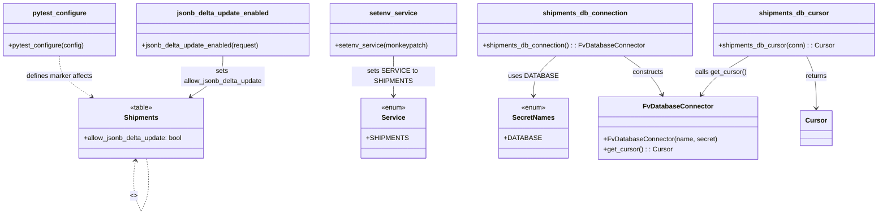

# Diagram: shipment_core/shipment_service/test/integration/conftest.py

> Auto-generated by Obscura crawlers

## Mermaid

### SVG

<svg id="container" width="2085.2109375" xmlns="http://www.w3.org/2000/svg" class="classDiagram" height="514.25" viewBox="0 0 2085.2109375 514.25" role="graphics-document document" aria-roledescription="class"><g><defs><marker id="container_class-aggregationStart" class="marker aggregation class" refX="18" refY="7" markerWidth="190" markerHeight="240" orient="auto"><path d="M 18,7 L9,13 L1,7 L9,1 Z"></path></marker></defs><defs><marker id="container_class-aggregationEnd" class="marker aggregation class" refX="1" refY="7" markerWidth="20" markerHeight="28" orient="auto"><path d="M 18,7 L9,13 L1,7 L9,1 Z"></path></marker></defs><defs><marker id="container_class-extensionStart" class="marker extension class" refX="18" refY="7" markerWidth="190" markerHeight="240" orient="auto"><path d="M 1,7 L18,13 V 1 Z"></path></marker></defs><defs><marker id="container_class-extensionEnd" class="marker extension class" refX="1" refY="7" markerWidth="20" markerHeight="28" orient="auto"><path d="M 1,1 V 13 L18,7 Z"></path></marker></defs><defs><marker id="container_class-compositionStart" class="marker composition class" refX="18" refY="7" markerWidth="190" markerHeight="240" orient="auto"><path d="M 18,7 L9,13 L1,7 L9,1 Z"></path></marker></defs><defs><marker id="container_class-compositionEnd" class="marker composition class" refX="1" refY="7" markerWidth="20" markerHeight="28" orient="auto"><path d="M 18,7 L9,13 L1,7 L9,1 Z"></path></marker></defs><defs><marker id="container_class-dependencyStart" class="marker dependency class" refX="6" refY="7" markerWidth="190" markerHeight="240" orient="auto"><path d="M 5,7 L9,13 L1,7 L9,1 Z"></path></marker></defs><defs><marker id="container_class-dependencyEnd" class="marker dependency class" refX="13" refY="7" markerWidth="20" markerHeight="28" orient="auto"><path d="M 18,7 L9,13 L14,7 L9,1 Z"></path></marker></defs><defs><marker id="container_class-lollipopStart" class="marker lollipop class" refX="13" refY="7" markerWidth="190" markerHeight="240" orient="auto"><circle stroke="black" fill="transparent" cx="7" cy="7" r="6"></circle></marker></defs><defs><marker id="container_class-lollipopEnd" class="marker lollipop class" refX="1" refY="7" markerWidth="190" markerHeight="240" orient="auto"><circle stroke="black" fill="transparent" cx="7" cy="7" r="6"></circle></marker></defs><g class="root"><g class="clusters"></g><g class="edgePaths"><path d="M141.543,134L141.543,142.167C141.543,150.333,141.543,166.667,154.37,182.965C167.197,199.263,192.852,215.525,205.679,223.656L218.506,231.788" id="id_pytest_configure_Shipments_1" class="edge-thickness-normal edge-pattern-dashed relation" style=";;;" data-edge="true" data-et="edge" data-id="id_pytest_configure_Shipments_1" data-points="W3sieCI6MTQxLjU0Mjk2ODc1LCJ5IjoxMzR9LHsieCI6MTQxLjU0Mjk2ODc1LCJ5IjoxODN9LHsieCI6MjIzLjU3MzUyNTcwNTY0NTE4LCJ5IjoyMzV9XQ==" marker-end="url(#container_class-dependencyEnd)"></path><path d="M532.766,134L532.766,142.167C532.766,150.333,532.766,166.667,519.938,182.965C507.111,199.263,481.457,215.525,468.63,223.656L455.803,231.788" id="id_jsonb_delta_update_enabled_Shipments_2" class="edge-thickness-normal edge-pattern-solid relation" style=";;;" data-edge="true" data-et="edge" data-id="id_jsonb_delta_update_enabled_Shipments_2" data-points="W3sieCI6NTMyLjc2NTYyNSwieSI6MTM0fSx7IngiOjUzMi43NjU2MjUsInkiOjE4M30seyJ4Ijo0NTAuNzM1MDY4MDQ0MzU0OCwieSI6MjM1fV0=" marker-end="url(#container_class-dependencyEnd)"></path><path d="M940.633,134L940.633,142.167C940.633,150.333,940.633,166.667,940.633,182.5C940.633,198.333,940.633,213.667,940.633,221.333L940.633,229" id="id_setenv_service_Service_3" class="edge-thickness-normal edge-pattern-solid relation" style=";;;" data-edge="true" data-et="edge" data-id="id_setenv_service_Service_3" data-points="W3sieCI6OTQwLjYzMjgxMjUsInkiOjEzNH0seyJ4Ijo5NDAuNjMyODEyNSwieSI6MTgzfSx7IngiOjk0MC42MzI4MTI1LCJ5IjoyMzV9XQ==" marker-end="url(#container_class-dependencyEnd)"></path><path d="M1486.901,134L1498.935,142.167C1510.969,150.333,1535.036,166.667,1550.578,182.099C1566.12,197.532,1573.136,212.065,1576.644,219.331L1580.152,226.597" id="id_shipments_db_connection_FvDatabaseConnector_4" class="edge-thickness-normal edge-pattern-solid relation" style=";;;" data-edge="true" data-et="edge" data-id="id_shipments_db_connection_FvDatabaseConnector_4" data-points="W3sieCI6MTQ4Ni45MDE0ODkyNTc4MTI1LCJ5IjoxMzR9LHsieCI6MTU1OS4xMDM1MTU2MjUsInkiOjE4M30seyJ4IjoxNTgyLjc2MDcxMDY4NTQ4NCwieSI6MjMyfV0=" marker-end="url(#container_class-dependencyEnd)"></path><path d="M1321.932,134L1312.581,142.167C1303.229,150.333,1284.527,166.667,1275.175,182.5C1265.824,198.333,1265.824,213.667,1265.824,221.333L1265.824,229" id="id_shipments_db_connection_SecretNames_5" class="edge-thickness-normal edge-pattern-solid relation" style=";;;" data-edge="true" data-et="edge" data-id="id_shipments_db_connection_SecretNames_5" data-points="W3sieCI6MTMyMS45MzE4ODQ3NjU2MjUsInkiOjEzNH0seyJ4IjoxMjY1LjgyNDIxODc1LCJ5IjoxODN9LHsieCI6MTI2NS44MjQyMTg3NSwieSI6MjM1fV0=" marker-end="url(#container_class-dependencyEnd)"></path><path d="M1782.23,134L1768.614,142.167C1754.998,150.333,1727.767,166.667,1709.329,182.165C1690.891,197.662,1681.246,212.325,1676.424,219.656L1671.601,226.987" id="id_shipments_db_cursor_FvDatabaseConnector_6" class="edge-thickness-normal edge-pattern-solid relation" style=";;;" data-edge="true" data-et="edge" data-id="id_shipments_db_cursor_FvDatabaseConnector_6" data-points="W3sieCI6MTc4Mi4yMjk3MzYzMjgxMjUsInkiOjEzNH0seyJ4IjoxNzAwLjUzNTE1NjI1LCJ5IjoxODN9LHsieCI6MTY2OC4zMDQwNDE3MDg2NjkzLCJ5IjoyMzJ9XQ==" marker-end="url(#container_class-dependencyEnd)"></path><path d="M1917.685,134L1921.628,142.167C1925.571,150.333,1933.457,166.667,1937.401,187.5C1941.344,208.333,1941.344,233.667,1941.344,246.333L1941.344,259" id="id_shipments_db_cursor_Cursor_7" class="edge-thickness-normal edge-pattern-solid relation" style=";;;" data-edge="true" data-et="edge" data-id="id_shipments_db_cursor_Cursor_7" data-points="W3sieCI6MTkxNy42ODQ1NzAzMTI1LCJ5IjoxMzR9LHsieCI6MTk0MS4zNDM3NSwieSI6MTgzfSx7IngiOjE5NDEuMzQzNzUsInkiOjI2NX1d" marker-end="url(#container_class-dependencyEnd)"></path><path d="M323.501,384.91L322.855,388.592C322.21,392.273,320.92,399.637,320.275,407.485C319.629,415.333,319.629,423.667,319.629,427.833L319.629,432" id="Shipments-cyclic-special-1" class="edge-thickness-normal edge-pattern-dashed relation" style=";;;" data-edge="true" data-et="edge" data-id="Shipments-cyclic-special-1" data-points="W3sieCI6MzI0LjUzNjI5Njg3NDczMTc2LCJ5IjozNzl9LHsieCI6MzE5LjYyOTI5Njg3NDYyNzQ3LCJ5Ijo0MDd9LHsieCI6MzE5LjYyOTI5Njg3NDYyNzQ3LCJ5Ijo0MzJ9XQ==" marker-start="url(#container_class-dependencyStart)"></path><path d="M319.629,432.1L319.629,438.267C319.629,444.433,319.629,456.767,322.546,469.1C325.463,481.433,331.297,493.767,334.214,499.933L337.131,506.1" id="Shipments-cyclic-special-mid" class="edge-thickness-normal edge-pattern-dashed relation" style=";;;" data-edge="true" data-et="edge" data-id="Shipments-cyclic-special-mid" data-points="W3sieCI6MzE5LjYyOTI5Njg3NDYyNzQ3LCJ5Ijo0MzIuMTAwMDAwMDAxNDkwMX0seyJ4IjozMTkuNjI5Mjk2ODc0NjI3NDcsInkiOjQ2OS4xMDAwMDAwMDE0OTAxfSx7IngiOjMzNy4xMzA2NDY0MDIzMTI5LCJ5Ijo1MDYuMTAwMDAwMDAxNDkwMX1d"></path><path d="M337.178,506.1L340.095,499.933C343.012,493.767,348.846,481.433,351.762,469.092C354.679,456.75,354.679,444.4,354.679,434.05C354.679,423.7,354.679,415.35,353.861,406.508C353.044,397.667,351.408,388.333,350.59,383.667L349.772,379" id="Shipments-cyclic-special-2" class="edge-thickness-normal edge-pattern-dashed relation" style=";;;" data-edge="true" data-et="edge" data-id="Shipments-cyclic-special-2" data-points="W3sieCI6MzM3LjE3Nzk0NzM0NzY4NzEsInkiOjUwNi4xMDAwMDAwMDE0OTAxfSx7IngiOjM1NC42NzkyOTY4NzUzNzI1MywieSI6NDY5LjEwMDAwMDAwMTQ5MDF9LHsieCI6MzU0LjY3OTI5Njg3NTM3MjUzLCJ5Ijo0MzIuMDUwMDAwMDAwNzQ1MDZ9LHsieCI6MzU0LjY3OTI5Njg3NTM3MjUzLCJ5Ijo0MDd9LHsieCI6MzQ5Ljc3MjI5Njg3NTI2ODI0LCJ5IjozNzl9XQ=="></path></g><g class="edgeLabels"><g class="edgeLabel" transform="translate(141.54296875, 183)"><g class="label" data-id="id_pytest_configure_Shipments_1" transform="translate(-80.9765625, -12)"><foreignObject width="161.953125" height="24">

defines marker affects

</foreignObject></g></g><g class="edgeLabel" transform="translate(532.765625, 183)"><g class="label" data-id="id_jsonb_delta_update_enabled_Shipments_2" transform="translate(-100, -24)"><foreignObject width="200" height="48">

sets allow_jsonb_delta_update

</foreignObject></g></g><g class="edgeLabel" transform="translate(940.6328125, 183)"><g class="label" data-id="id_setenv_service_Service_3" transform="translate(-98.390625, -12)"><foreignObject width="196.78125" height="24">

sets SERVICE to SHIPMENTS

</foreignObject></g></g><g class="edgeLabel" transform="translate(1545.51396, 173.77743)"><g class="label" data-id="id_shipments_db_connection_FvDatabaseConnector_4" transform="translate(-37.84375, -12)"><foreignObject width="75.6875" height="24">

constructs

</foreignObject></g></g><g class="edgeLabel" transform="translate(1265.82421875, 183)"><g class="label" data-id="id_shipments_db_connection_SecretNames_5" transform="translate(-54.234375, -12)"><foreignObject width="108.46875" height="24">

uses DATABASE

</foreignObject></g></g><g class="edgeLabel" transform="translate(1716.23411, 173.58385)"><g class="label" data-id="id_shipments_db_cursor_FvDatabaseConnector_6" transform="translate(-61.890625, -12)"><foreignObject width="123.78125" height="24">

calls get_cursor()

</foreignObject></g></g><g class="edgeLabel" transform="translate(1941.34375, 183)"><g class="label" data-id="id_shipments_db_cursor_Cursor_7" transform="translate(-26.265625, -12)"><foreignObject width="52.53125" height="24">

returns

</foreignObject></g></g><g class="edgeLabel"><g class="label" data-id="Shipments-cyclic-special-1" transform="translate(0, 0)"><foreignObject width="0" height="0">

</foreignObject></g></g><g class="edgeLabel" transform="translate(319.62929687462747, 469.1000000014901)"><g class="label" data-id="Shipments-cyclic-special-mid" transform="translate(-8.0078125, -12)"><foreignObject width="16.015625" height="24">

&lt;&gt;
<table></table>

</foreignObject></g></g><g class="edgeLabel"><g class="label" data-id="Shipments-cyclic-special-2" transform="translate(0, 0)"><foreignObject width="0" height="0">

</foreignObject></g></g></g><g class="nodes"><g class="node default" id="classId-Shipments-0" transform="translate(337.154296875, 307)"><g class="basic label-container"><path d="M-151.7265625 -72 L151.7265625 -72 L151.7265625 72 L-151.7265625 72" stroke="none" stroke-width="0" fill="#ECECFF" style=""></path><path d="M-151.7265625 -72 C-87.21832991551301 -72, -22.71009733102602 -72, 151.7265625 -72 M-151.7265625 -72 C-50.726110798299885 -72, 50.27434090340023 -72, 151.7265625 -72 M151.7265625 -72 C151.7265625 -18.11435991941488, 151.7265625 35.77128016117024, 151.7265625 72 M151.7265625 -72 C151.7265625 -19.792137250351374, 151.7265625 32.41572549929725, 151.7265625 72 M151.7265625 72 C83.15247367324046 72, 14.57838484648093 72, -151.7265625 72 M151.7265625 72 C57.36019521313773 72, -37.00617207372454 72, -151.7265625 72 M-151.7265625 72 C-151.7265625 18.506595835108, -151.7265625 -34.986808329784, -151.7265625 -72 M-151.7265625 72 C-151.7265625 19.001409005196876, -151.7265625 -33.99718198960625, -151.7265625 -72" stroke="#9370DB" stroke-width="1.3" fill="none" stroke-dasharray="0 0" style=""></path></g><g class="annotation-group text" transform="translate(-27.5703125, -48)"><g class="label" style="" transform="translate(0,-12)"><foreignObject width="55.140625" height="24">

«table»

</foreignObject></g></g><g class="label-group text" transform="translate(-38.96875, -24)"><g class="label" style="font-weight: bolder" transform="translate(0,-12)"><foreignObject width="77.9375" height="24">

Shipments

</foreignObject></g></g><g class="members-group text" transform="translate(-139.7265625, 24)"><g class="label" style="" transform="translate(0,-12)"><foreignObject width="240.484375" height="24">

+allow_jsonb_delta_update: bool

</foreignObject></g></g><g class="methods-group text" transform="translate(-139.7265625, 72)"></g><g class="divider" style=""><path d="M-151.7265625 0 C-88.55954328250004 0, -25.392524065000103 0, 151.7265625 0 M-151.7265625 0 C-61.35256717304111 0, 29.021428153917782 0, 151.7265625 0" stroke="#9370DB" stroke-width="1.3" fill="none" stroke-dasharray="0 0" style=""></path></g><g class="divider" style=""><path d="M-151.7265625 48 C-55.44574913315384 48, 40.83506423369232 48, 151.7265625 48 M-151.7265625 48 C-75.33311101976659 48, 1.0603404604668185 48, 151.7265625 48" stroke="#9370DB" stroke-width="1.3" fill="none" stroke-dasharray="0 0" style=""></path></g></g><g class="node default" id="classId-Service-1" transform="translate(940.6328125, 307)"><g class="basic label-container"><path d="M-71.3125 -72 L71.3125 -72 L71.3125 72 L-71.3125 72" stroke="none" stroke-width="0" fill="#ECECFF" style=""></path><path d="M-71.3125 -72 C-30.253025247346635 -72, 10.80644950530673 -72, 71.3125 -72 M-71.3125 -72 C-36.36790229459328 -72, -1.4233045891865572 -72, 71.3125 -72 M71.3125 -72 C71.3125 -33.52204750857312, 71.3125 4.955904982853767, 71.3125 72 M71.3125 -72 C71.3125 -34.65993949501228, 71.3125 2.680121009975437, 71.3125 72 M71.3125 72 C40.81015100832144 72, 10.307802016642881 72, -71.3125 72 M71.3125 72 C41.83562016536866 72, 12.35874033073732 72, -71.3125 72 M-71.3125 72 C-71.3125 17.97248387448026, -71.3125 -36.05503225103948, -71.3125 -72 M-71.3125 72 C-71.3125 42.47581873978935, -71.3125 12.951637479578693, -71.3125 -72" stroke="#9370DB" stroke-width="1.3" fill="none" stroke-dasharray="0 0" style=""></path></g><g class="annotation-group text" transform="translate(-29.53125, -48)"><g class="label" style="" transform="translate(0,-12)"><foreignObject width="59.0625" height="24">

«enum»

</foreignObject></g></g><g class="label-group text" transform="translate(-26.6484375, -24)"><g class="label" style="font-weight: bolder" transform="translate(0,-12)"><foreignObject width="53.296875" height="24">

Service

</foreignObject></g></g><g class="members-group text" transform="translate(-59.3125, 24)"><g class="label" style="" transform="translate(0,-12)"><foreignObject width="89.09375" height="24">

+SHIPMENTS

</foreignObject></g></g><g class="methods-group text" transform="translate(-59.3125, 72)"></g><g class="divider" style=""><path d="M-71.3125 0 C-19.155064893315362 0, 33.002370213369275 0, 71.3125 0 M-71.3125 0 C-26.470614264802485 0, 18.37127147039503 0, 71.3125 0" stroke="#9370DB" stroke-width="1.3" fill="none" stroke-dasharray="0 0" style=""></path></g><g class="divider" style=""><path d="M-71.3125 48 C-37.08027692144087 48, -2.8480538428817397 48, 71.3125 48 M-71.3125 48 C-38.96562271839838 48, -6.6187454367967575 48, 71.3125 48" stroke="#9370DB" stroke-width="1.3" fill="none" stroke-dasharray="0 0" style=""></path></g></g><g class="node default" id="classId-SecretNames-2" transform="translate(1265.82421875, 307)"><g class="basic label-container"><path d="M-75.6328125 -72 L75.6328125 -72 L75.6328125 72 L-75.6328125 72" stroke="none" stroke-width="0" fill="#ECECFF" style=""></path><path d="M-75.6328125 -72 C-31.419119043028573 -72, 12.794574413942854 -72, 75.6328125 -72 M-75.6328125 -72 C-27.815006542163417 -72, 20.002799415673167 -72, 75.6328125 -72 M75.6328125 -72 C75.6328125 -24.13947885556128, 75.6328125 23.72104228887744, 75.6328125 72 M75.6328125 -72 C75.6328125 -38.228198549200954, 75.6328125 -4.456397098401908, 75.6328125 72 M75.6328125 72 C43.599430700331176 72, 11.566048900662352 72, -75.6328125 72 M75.6328125 72 C44.66302465471473 72, 13.693236809429457 72, -75.6328125 72 M-75.6328125 72 C-75.6328125 14.815313557992496, -75.6328125 -42.36937288401501, -75.6328125 -72 M-75.6328125 72 C-75.6328125 22.825489698504263, -75.6328125 -26.349020602991473, -75.6328125 -72" stroke="#9370DB" stroke-width="1.3" fill="none" stroke-dasharray="0 0" style=""></path></g><g class="annotation-group text" transform="translate(-29.53125, -48)"><g class="label" style="" transform="translate(0,-12)"><foreignObject width="59.0625" height="24">

«enum»

</foreignObject></g></g><g class="label-group text" transform="translate(-48.03125, -24)"><g class="label" style="font-weight: bolder" transform="translate(0,-12)"><foreignObject width="96.0625" height="24">

SecretNames

</foreignObject></g></g><g class="members-group text" transform="translate(-63.6328125, 24)"><g class="label" style="" transform="translate(0,-12)"><foreignObject width="79.234375" height="24">

+DATABASE

</foreignObject></g></g><g class="methods-group text" transform="translate(-63.6328125, 72)"></g><g class="divider" style=""><path d="M-75.6328125 0 C-33.78535189198009 0, 8.062108716039816 0, 75.6328125 0 M-75.6328125 0 C-26.153945923766784 0, 23.32492065246643 0, 75.6328125 0" stroke="#9370DB" stroke-width="1.3" fill="none" stroke-dasharray="0 0" style=""></path></g><g class="divider" style=""><path d="M-75.6328125 48 C-37.657951719580346 48, 0.3169090608393077 48, 75.6328125 48 M-75.6328125 48 C-22.24806736449323 48, 31.136677771013538 48, 75.6328125 48" stroke="#9370DB" stroke-width="1.3" fill="none" stroke-dasharray="0 0" style=""></path></g></g><g class="node default" id="classId-FvDatabaseConnector-3" transform="translate(1618.970703125, 307)"><g class="basic label-container"><path d="M-185.37890625 -75 L185.37890625 -75 L185.37890625 75 L-185.37890625 75" stroke="none" stroke-width="0" fill="#ECECFF" style=""></path><path d="M-185.37890625 -75 C-80.52507617073974 -75, 24.328753908520525 -75, 185.37890625 -75 M-185.37890625 -75 C-41.38519923935215 -75, 102.6085077712957 -75, 185.37890625 -75 M185.37890625 -75 C185.37890625 -15.420142120248698, 185.37890625 44.1597157595026, 185.37890625 75 M185.37890625 -75 C185.37890625 -21.30762849377875, 185.37890625 32.3847430124425, 185.37890625 75 M185.37890625 75 C84.22232369657287 75, -16.934258856854257 75, -185.37890625 75 M185.37890625 75 C37.233468075709965 75, -110.91197009858007 75, -185.37890625 75 M-185.37890625 75 C-185.37890625 43.22135420422076, -185.37890625 11.442708408441526, -185.37890625 -75 M-185.37890625 75 C-185.37890625 23.88276383538416, -185.37890625 -27.23447232923168, -185.37890625 -75" stroke="#9370DB" stroke-width="1.3" fill="none" stroke-dasharray="0 0" style=""></path></g><g class="annotation-group text" transform="translate(0, -51)"></g><g class="label-group text" transform="translate(-79.3046875, -51)"><g class="label" style="font-weight: bolder" transform="translate(0,-12)"><foreignObject width="158.609375" height="24">

FvDatabaseConnector

</foreignObject></g></g><g class="members-group text" transform="translate(-173.37890625, -3)"></g><g class="methods-group text" transform="translate(-173.37890625, 27)"><g class="label" style="" transform="translate(0,-12)"><foreignObject width="267.453125" height="24">

+FvDatabaseConnector(name, secret)

</foreignObject></g><g class="label" style="" transform="translate(0,12)"><foreignObject width="161.96875" height="24">

+get_cursor() : : Cursor

</foreignObject></g></g><g class="divider" style=""><path d="M-185.37890625 -27 C-87.18796859956697 -27, 11.002969050866056 -27, 185.37890625 -27 M-185.37890625 -27 C-46.98902998971471 -27, 91.40084627057058 -27, 185.37890625 -27" stroke="#9370DB" stroke-width="1.3" fill="none" stroke-dasharray="0 0" style=""></path></g><g class="divider" style=""><path d="M-185.37890625 -3 C-91.74961551034154 -3, 1.8796752293169163 -3, 185.37890625 -3 M-185.37890625 -3 C-67.89385726688428 -3, 49.591191716231435 -3, 185.37890625 -3" stroke="#9370DB" stroke-width="1.3" fill="none" stroke-dasharray="0 0" style=""></path></g></g><g class="node default" id="classId-Cursor-4" transform="translate(1941.34375, 307)"><g class="basic label-container"><path d="M-35.90625 -42 L35.90625 -42 L35.90625 42 L-35.90625 42" stroke="none" stroke-width="0" fill="#ECECFF" style=""></path><path d="M-35.90625 -42 C-16.96730344742138 -42, 1.9716431051572414 -42, 35.90625 -42 M-35.90625 -42 C-18.3012221540446 -42, -0.696194308089197 -42, 35.90625 -42 M35.90625 -42 C35.90625 -10.978334919665212, 35.90625 20.043330160669576, 35.90625 42 M35.90625 -42 C35.90625 -12.1746853137262, 35.90625 17.6506293725476, 35.90625 42 M35.90625 42 C13.407401741873741 42, -9.091446516252518 42, -35.90625 42 M35.90625 42 C13.245121323402032 42, -9.416007353195937 42, -35.90625 42 M-35.90625 42 C-35.90625 13.177075163767395, -35.90625 -15.64584967246521, -35.90625 -42 M-35.90625 42 C-35.90625 20.139333293304574, -35.90625 -1.7213334133908518, -35.90625 -42" stroke="#9370DB" stroke-width="1.3" fill="none" stroke-dasharray="0 0" style=""></path></g><g class="annotation-group text" transform="translate(0, -18)"></g><g class="label-group text" transform="translate(-23.90625, -18)"><g class="label" style="font-weight: bolder" transform="translate(0,-12)"><foreignObject width="47.8125" height="24">

Cursor

</foreignObject></g></g><g class="members-group text" transform="translate(-23.90625, 30)"></g><g class="methods-group text" transform="translate(-23.90625, 60)"></g><g class="divider" style=""><path d="M-35.90625 6 C-14.216077445301206 6, 7.474095109397588 6, 35.90625 6 M-35.90625 6 C-11.984304463256056 6, 11.937641073487889 6, 35.90625 6" stroke="#9370DB" stroke-width="1.3" fill="none" stroke-dasharray="0 0" style=""></path></g><g class="divider" style=""><path d="M-35.90625 24 C-20.43247782957705 24, -4.9587056591540986 24, 35.90625 24 M-35.90625 24 C-16.026568305030597 24, 3.8531133899388053 24, 35.90625 24" stroke="#9370DB" stroke-width="1.3" fill="none" stroke-dasharray="0 0" style=""></path></g></g><g class="node default" id="classId-pytest_configure-5" transform="translate(141.54296875, 71)"><g class="basic label-container"><path d="M-133.54296875 -63 L133.54296875 -63 L133.54296875 63 L-133.54296875 63" stroke="none" stroke-width="0" fill="#ECECFF" style=""></path><path d="M-133.54296875 -63 C-51.443308498384695 -63, 30.65635175323061 -63, 133.54296875 -63 M-133.54296875 -63 C-29.082926582947465 -63, 75.37711558410507 -63, 133.54296875 -63 M133.54296875 -63 C133.54296875 -14.355864086142077, 133.54296875 34.288271827715846, 133.54296875 63 M133.54296875 -63 C133.54296875 -14.686295157550234, 133.54296875 33.62740968489953, 133.54296875 63 M133.54296875 63 C49.22887993727201 63, -35.085208875455976 63, -133.54296875 63 M133.54296875 63 C27.63201124982824 63, -78.27894625034352 63, -133.54296875 63 M-133.54296875 63 C-133.54296875 37.03140477212126, -133.54296875 11.062809544242533, -133.54296875 -63 M-133.54296875 63 C-133.54296875 25.279834126011245, -133.54296875 -12.44033174797751, -133.54296875 -63" stroke="#9370DB" stroke-width="1.3" fill="none" stroke-dasharray="0 0" style=""></path></g><g class="annotation-group text" transform="translate(0, -39)"></g><g class="label-group text" transform="translate(-61.2109375, -39)"><g class="label" style="font-weight: bolder" transform="translate(0,-12)"><foreignObject width="122.421875" height="24">

pytest_configure

</foreignObject></g></g><g class="members-group text" transform="translate(-121.54296875, 9)"></g><g class="methods-group text" transform="translate(-121.54296875, 39)"><g class="label" style="" transform="translate(0,-12)"><foreignObject width="181.875" height="24">

+pytest_configure(config)

</foreignObject></g></g><g class="divider" style=""><path d="M-133.54296875 -15 C-47.674198312164776 -15, 38.19457212567045 -15, 133.54296875 -15 M-133.54296875 -15 C-67.12097830177888 -15, -0.6989878535577532 -15, 133.54296875 -15" stroke="#9370DB" stroke-width="1.3" fill="none" stroke-dasharray="0 0" style=""></path></g><g class="divider" style=""><path d="M-133.54296875 9 C-68.02641228108841 9, -2.5098558121768235 9, 133.54296875 9 M-133.54296875 9 C-76.32634077478332 9, -19.109712799566637 9, 133.54296875 9" stroke="#9370DB" stroke-width="1.3" fill="none" stroke-dasharray="0 0" style=""></path></g></g><g class="node default" id="classId-jsonb_delta_update_enabled-6" transform="translate(532.765625, 71)"><g class="basic label-container"><path d="M-207.6796875 -63 L207.6796875 -63 L207.6796875 63 L-207.6796875 63" stroke="none" stroke-width="0" fill="#ECECFF" style=""></path><path d="M-207.6796875 -63 C-66.65748189149011 -63, 74.36472371701979 -63, 207.6796875 -63 M-207.6796875 -63 C-87.27486940495866 -63, 33.12994869008267 -63, 207.6796875 -63 M207.6796875 -63 C207.6796875 -34.077550040332326, 207.6796875 -5.155100080664646, 207.6796875 63 M207.6796875 -63 C207.6796875 -19.502527624010135, 207.6796875 23.99494475197973, 207.6796875 63 M207.6796875 63 C95.89962255622936 63, -15.88044238754128 63, -207.6796875 63 M207.6796875 63 C48.22842571193132 63, -111.22283607613736 63, -207.6796875 63 M-207.6796875 63 C-207.6796875 26.714469463749175, -207.6796875 -9.57106107250165, -207.6796875 -63 M-207.6796875 63 C-207.6796875 25.648465256371054, -207.6796875 -11.703069487257892, -207.6796875 -63" stroke="#9370DB" stroke-width="1.3" fill="none" stroke-dasharray="0 0" style=""></path></g><g class="annotation-group text" transform="translate(0, -39)"></g><g class="label-group text" transform="translate(-106.46875, -39)"><g class="label" style="font-weight: bolder" transform="translate(0,-12)"><foreignObject width="212.9375" height="24">

jsonb_delta_update_enabled

</foreignObject></g></g><g class="members-group text" transform="translate(-195.6796875, 9)"></g><g class="methods-group text" transform="translate(-195.6796875, 39)"><g class="label" style="" transform="translate(0,-12)"><foreignObject width="284.890625" height="24">

+jsonb_delta_update_enabled(request)

</foreignObject></g></g><g class="divider" style=""><path d="M-207.6796875 -15 C-95.29993594152795 -15, 17.079815616944103 -15, 207.6796875 -15 M-207.6796875 -15 C-114.192220435433 -15, -20.704753370866 -15, 207.6796875 -15" stroke="#9370DB" stroke-width="1.3" fill="none" stroke-dasharray="0 0" style=""></path></g><g class="divider" style=""><path d="M-207.6796875 9 C-55.953019036844324 9, 95.77364942631135 9, 207.6796875 9 M-207.6796875 9 C-43.07357946877258 9, 121.53252856245484 9, 207.6796875 9" stroke="#9370DB" stroke-width="1.3" fill="none" stroke-dasharray="0 0" style=""></path></g></g><g class="node default" id="classId-setenv_service-7" transform="translate(940.6328125, 71)"><g class="basic label-container"><path d="M-150.1875 -63 L150.1875 -63 L150.1875 63 L-150.1875 63" stroke="none" stroke-width="0" fill="#ECECFF" style=""></path><path d="M-150.1875 -63 C-30.940402501121312 -63, 88.30669499775738 -63, 150.1875 -63 M-150.1875 -63 C-31.431725080508983 -63, 87.32404983898203 -63, 150.1875 -63 M150.1875 -63 C150.1875 -24.139716130035744, 150.1875 14.720567739928512, 150.1875 63 M150.1875 -63 C150.1875 -18.304817192181382, 150.1875 26.390365615637236, 150.1875 63 M150.1875 63 C64.55194814200767 63, -21.08360371598465 63, -150.1875 63 M150.1875 63 C34.65150883332237 63, -80.88448233335527 63, -150.1875 63 M-150.1875 63 C-150.1875 25.486455201741137, -150.1875 -12.027089596517726, -150.1875 -63 M-150.1875 63 C-150.1875 12.912542549963092, -150.1875 -37.174914900073816, -150.1875 -63" stroke="#9370DB" stroke-width="1.3" fill="none" stroke-dasharray="0 0" style=""></path></g><g class="annotation-group text" transform="translate(0, -39)"></g><g class="label-group text" transform="translate(-54.171875, -39)"><g class="label" style="font-weight: bolder" transform="translate(0,-12)"><foreignObject width="108.34375" height="24">

setenv_service

</foreignObject></g></g><g class="members-group text" transform="translate(-138.1875, 9)"></g><g class="methods-group text" transform="translate(-138.1875, 39)"><g class="label" style="" transform="translate(0,-12)"><foreignObject width="222.203125" height="24">

+setenv_service(monkeypatch)

</foreignObject></g></g><g class="divider" style=""><path d="M-150.1875 -15 C-56.05065625398667 -15, 38.08618749202665 -15, 150.1875 -15 M-150.1875 -15 C-85.33327559787284 -15, -20.479051195745683 -15, 150.1875 -15" stroke="#9370DB" stroke-width="1.3" fill="none" stroke-dasharray="0 0" style=""></path></g><g class="divider" style=""><path d="M-150.1875 9 C-69.01590190689589 9, 12.155696186208218 9, 150.1875 9 M-150.1875 9 C-75.12158360179112 9, -0.05566720358223165 9, 150.1875 9" stroke="#9370DB" stroke-width="1.3" fill="none" stroke-dasharray="0 0" style=""></path></g></g><g class="node default" id="classId-shipments_db_connection-8" transform="translate(1394.0703125, 71)"><g class="basic label-container"><path d="M-253.25 -63 L253.25 -63 L253.25 63 L-253.25 63" stroke="none" stroke-width="0" fill="#ECECFF" style=""></path><path d="M-253.25 -63 C-73.84027493077792 -63, 105.56945013844415 -63, 253.25 -63 M-253.25 -63 C-111.8233838316356 -63, 29.60323233672881 -63, 253.25 -63 M253.25 -63 C253.25 -21.467437840018327, 253.25 20.065124319963346, 253.25 63 M253.25 -63 C253.25 -12.899450124279312, 253.25 37.201099751441376, 253.25 63 M253.25 63 C61.26190345464096 63, -130.72619309071808 63, -253.25 63 M253.25 63 C68.00353009221936 63, -117.24293981556127 63, -253.25 63 M-253.25 63 C-253.25 23.93375932954526, -253.25 -15.132481340909479, -253.25 -63 M-253.25 63 C-253.25 34.09970963464853, -253.25 5.19941926929706, -253.25 -63" stroke="#9370DB" stroke-width="1.3" fill="none" stroke-dasharray="0 0" style=""></path></g><g class="annotation-group text" transform="translate(0, -39)"></g><g class="label-group text" transform="translate(-95.96875, -39)"><g class="label" style="font-weight: bolder" transform="translate(0,-12)"><foreignObject width="191.9375" height="24">

shipments_db_connection

</foreignObject></g></g><g class="members-group text" transform="translate(-241.25, 9)"></g><g class="methods-group text" transform="translate(-241.25, 39)"><g class="label" style="" transform="translate(0,-12)"><foreignObject width="386.53125" height="24">

+shipments_db_connection() : : FvDatabaseConnector

</foreignObject></g></g><g class="divider" style=""><path d="M-253.25 -15 C-112.36999800973547 -15, 28.510003980529063 -15, 253.25 -15 M-253.25 -15 C-151.74421358277795 -15, -50.23842716555592 -15, 253.25 -15" stroke="#9370DB" stroke-width="1.3" fill="none" stroke-dasharray="0 0" style=""></path></g><g class="divider" style=""><path d="M-253.25 9 C-106.20417883627331 9, 40.84164232745337 9, 253.25 9 M-253.25 9 C-124.60979981789833 9, 4.030400364203331 9, 253.25 9" stroke="#9370DB" stroke-width="1.3" fill="none" stroke-dasharray="0 0" style=""></path></g></g><g class="node default" id="classId-shipments_db_cursor-9" transform="translate(1887.265625, 71)"><g class="basic label-container"><path d="M-189.9453125 -63 L189.9453125 -63 L189.9453125 63 L-189.9453125 63" stroke="none" stroke-width="0" fill="#ECECFF" style=""></path><path d="M-189.9453125 -63 C-62.7511104826126 -63, 64.4430915347748 -63, 189.9453125 -63 M-189.9453125 -63 C-105.13318521182612 -63, -20.321057923652234 -63, 189.9453125 -63 M189.9453125 -63 C189.9453125 -29.3650081133324, 189.9453125 4.269983773335198, 189.9453125 63 M189.9453125 -63 C189.9453125 -16.797694654356448, 189.9453125 29.404610691287104, 189.9453125 63 M189.9453125 63 C41.30012663260325 63, -107.3450592347935 63, -189.9453125 63 M189.9453125 63 C87.81098721895152 63, -14.323338062096951 63, -189.9453125 63 M-189.9453125 63 C-189.9453125 21.347976810906275, -189.9453125 -20.30404637818745, -189.9453125 -63 M-189.9453125 63 C-189.9453125 12.868018143322303, -189.9453125 -37.263963713355395, -189.9453125 -63" stroke="#9370DB" stroke-width="1.3" fill="none" stroke-dasharray="0 0" style=""></path></g><g class="annotation-group text" transform="translate(0, -39)"></g><g class="label-group text" transform="translate(-78.703125, -39)"><g class="label" style="font-weight: bolder" transform="translate(0,-12)"><foreignObject width="157.40625" height="24">

shipments_db_cursor

</foreignObject></g></g><g class="members-group text" transform="translate(-177.9453125, 9)"></g><g class="methods-group text" transform="translate(-177.9453125, 39)"><g class="label" style="" transform="translate(0,-12)"><foreignObject width="277.1875" height="24">

+shipments_db_cursor(conn) : : Cursor

</foreignObject></g></g><g class="divider" style=""><path d="M-189.9453125 -15 C-73.42166327768783 -15, 43.101985944624346 -15, 189.9453125 -15 M-189.9453125 -15 C-91.52286363708221 -15, 6.89958522583558 -15, 189.9453125 -15" stroke="#9370DB" stroke-width="1.3" fill="none" stroke-dasharray="0 0" style=""></path></g><g class="divider" style=""><path d="M-189.9453125 9 C-111.72196564982286 9, -33.498618799645726 9, 189.9453125 9 M-189.9453125 9 C-64.23704101290521 9, 61.47123047418958 9, 189.9453125 9" stroke="#9370DB" stroke-width="1.3" fill="none" stroke-dasharray="0 0" style=""></path></g></g><g class="label edgeLabel" id="Shipments---Shipments---1" transform="translate(319.62929687462747, 432.05000000074506)"><rect width="0.1" height="0.1"></rect><g class="label" style="" transform="translate(0, 0)"><rect></rect><foreignObject width="0" height="0">

</foreignObject></g></g><g class="label edgeLabel" id="Shipments---Shipments---2" transform="translate(337.154296875, 506.1500000022352)"><rect width="0.1" height="0.1"></rect><g class="label" style="" transform="translate(0, 0)"><rect></rect><foreignObject width="0" height="0">

</foreignObject></g></g></g></g></g></svg>
