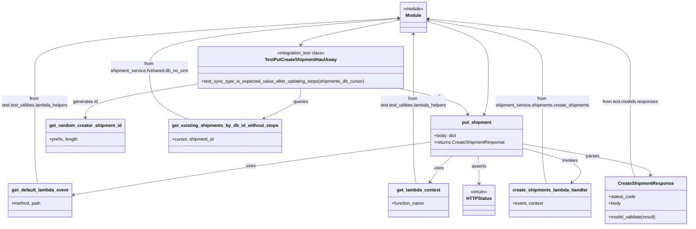

# Diagram: shipment_core/shipment_service/test/integration/create_shipments/test_create_shipment_haul_away.py

> Auto-generated by Obscura crawlers

## Mermaid

> SVG rendering failed for this diagram.
