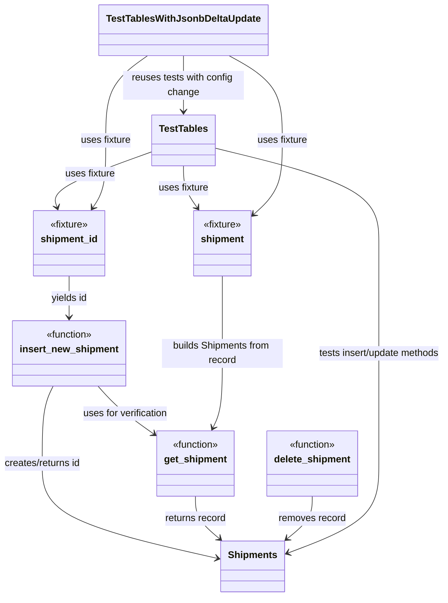

# Diagram: shipment_core/shipment_service/test/integration/fvshared/test_tables_no_orm.py


> Auto-generated by Obscura crawlers

## Diagram 1



> SVG rendering failed for this diagram.

## Diagram 2

```mermaid
graph TD
A[insert_new_shipment] --> B[get_shipment]
B --> C[Build Shipments instance]
C --> D{Test action}
D -->|insert| E[DB INSERT via Shipments.insert()]
D -->|update| F[DB UPDATE via Shipments.update()]
E --> G[Verify fields/assertions]
F --> G
G --> H[Cleanup: delete_shipment]
H --> I[End]
```

> SVG rendering failed for this diagram.
