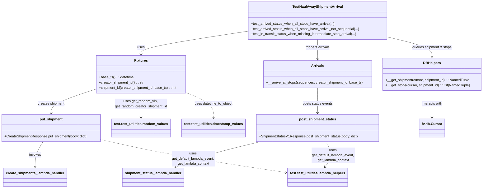

# Diagram: shipment_core/shipment_service/test/integration/haul_away/test_haul_away_statuses.py

> Auto-generated by Obscura crawlers

## Mermaid

### SVG

<svg id="container" width="2204.71875" xmlns="http://www.w3.org/2000/svg" class="classDiagram" height="868" viewBox="0 0 2204.71875 868" role="graphics-document document" aria-roledescription="class"><g><defs><marker id="container_class-aggregationStart" class="marker aggregation class" refX="18" refY="7" markerWidth="190" markerHeight="240" orient="auto"><path d="M 18,7 L9,13 L1,7 L9,1 Z"></path></marker></defs><defs><marker id="container_class-aggregationEnd" class="marker aggregation class" refX="1" refY="7" markerWidth="20" markerHeight="28" orient="auto"><path d="M 18,7 L9,13 L1,7 L9,1 Z"></path></marker></defs><defs><marker id="container_class-extensionStart" class="marker extension class" refX="18" refY="7" markerWidth="190" markerHeight="240" orient="auto"><path d="M 1,7 L18,13 V 1 Z"></path></marker></defs><defs><marker id="container_class-extensionEnd" class="marker extension class" refX="1" refY="7" markerWidth="20" markerHeight="28" orient="auto"><path d="M 1,1 V 13 L18,7 Z"></path></marker></defs><defs><marker id="container_class-compositionStart" class="marker composition class" refX="18" refY="7" markerWidth="190" markerHeight="240" orient="auto"><path d="M 18,7 L9,13 L1,7 L9,1 Z"></path></marker></defs><defs><marker id="container_class-compositionEnd" class="marker composition class" refX="1" refY="7" markerWidth="20" markerHeight="28" orient="auto"><path d="M 18,7 L9,13 L1,7 L9,1 Z"></path></marker></defs><defs><marker id="container_class-dependencyStart" class="marker dependency class" refX="6" refY="7" markerWidth="190" markerHeight="240" orient="auto"><path d="M 5,7 L9,13 L1,7 L9,1 Z"></path></marker></defs><defs><marker id="container_class-dependencyEnd" class="marker dependency class" refX="13" refY="7" markerWidth="20" markerHeight="28" orient="auto"><path d="M 18,7 L9,13 L14,7 L9,1 Z"></path></marker></defs><defs><marker id="container_class-lollipopStart" class="marker lollipop class" refX="13" refY="7" markerWidth="190" markerHeight="240" orient="auto"><circle stroke="black" fill="transparent" cx="7" cy="7" r="6"></circle></marker></defs><defs><marker id="container_class-lollipopEnd" class="marker lollipop class" refX="1" refY="7" markerWidth="190" markerHeight="240" orient="auto"><circle stroke="black" fill="transparent" cx="7" cy="7" r="6"></circle></marker></defs><g class="root"><g class="clusters"></g><g class="edgePaths"><path d="M1126.129,144.545L1046.205,156.954C966.281,169.363,806.434,194.182,726.51,211.757C646.586,229.333,646.586,239.667,646.586,244.833L646.586,250" id="id_TestHaulAwayShipmentArrival_Fixtures_1" class="edge-thickness-normal edge-pattern-solid relation" style=";;;" data-edge="true" data-et="edge" data-id="id_TestHaulAwayShipmentArrival_Fixtures_1" data-points="W3sieCI6MTEyNi4xMjg5MDYyNSwieSI6MTQ0LjU0NDY4NzUzMjA5Nzg0fSx7IngiOjY0Ni41ODU5Mzc1LCJ5IjoyMTl9LHsieCI6NjQ2LjU4NTkzNzUsInkiOjI1Nn1d" marker-end="url(#container_class-dependencyEnd)"></path><path d="M439.168,411.752L405.354,422.96C371.54,434.168,303.913,456.584,270.099,474.959C236.285,493.333,236.285,507.667,236.285,514.833L236.285,522" id="id_Fixtures_put_shipment_2" class="edge-thickness-normal edge-pattern-solid relation" style=";;;" data-edge="true" data-et="edge" data-id="id_Fixtures_put_shipment_2" data-points="W3sieCI6NDM5LjE2Nzk2ODc1LCJ5Ijo0MTEuNzUxNjIwODU3NDEyMTV9LHsieCI6MjM2LjI4NTE1NjI1LCJ5Ijo0Nzl9LHsieCI6MjM2LjI4NTE1NjI1LCJ5Ijo1Mjh9XQ==" marker-end="url(#container_class-dependencyEnd)"></path><path d="M1445.23,182L1445.23,188.167C1445.23,194.333,1445.23,206.667,1445.23,222C1445.23,237.333,1445.23,255.667,1445.23,264.833L1445.23,274" id="id_TestHaulAwayShipmentArrival_Arrivals_3" class="edge-thickness-normal edge-pattern-solid relation" style=";;;" data-edge="true" data-et="edge" data-id="id_TestHaulAwayShipmentArrival_Arrivals_3" data-points="W3sieCI6MTQ0NS4yMzA0Njg3NSwieSI6MTgyfSx7IngiOjE0NDUuMjMwNDY4NzUsInkiOjIxOX0seyJ4IjoxNDQ1LjIzMDQ2ODc1LCJ5IjoyODB9XQ==" marker-end="url(#container_class-dependencyEnd)"></path><path d="M1445.23,406L1445.23,418.167C1445.23,430.333,1445.23,454.667,1445.23,474C1445.23,493.333,1445.23,507.667,1445.23,514.833L1445.23,522" id="id_Arrivals_post_shipment_status_4" class="edge-thickness-normal edge-pattern-solid relation" style=";;;" data-edge="true" data-et="edge" data-id="id_Arrivals_post_shipment_status_4" data-points="W3sieCI6MTQ0NS4yMzA0Njg3NSwieSI6NDA2fSx7IngiOjE0NDUuMjMwNDY4NzUsInkiOjQ3OX0seyJ4IjoxNDQ1LjIzMDQ2ODc1LCJ5Ijo1Mjh9XQ==" marker-end="url(#container_class-dependencyEnd)"></path><path d="M1764.332,170.463L1798.54,178.552C1832.747,186.642,1901.163,202.821,1935.37,218.077C1969.578,233.333,1969.578,247.667,1969.578,254.833L1969.578,262" id="id_TestHaulAwayShipmentArrival_DBHelpers_5" class="edge-thickness-normal edge-pattern-solid relation" style=";;;" data-edge="true" data-et="edge" data-id="id_TestHaulAwayShipmentArrival_DBHelpers_5" data-points="W3sieCI6MTc2NC4zMzIwMzEyNSwieSI6MTcwLjQ2MjUxNjY2ODc3NzQzfSx7IngiOjE5NjkuNTc4MTI1LCJ5IjoyMTl9LHsieCI6MTk2OS41NzgxMjUsInkiOjI2OH1d" marker-end="url(#container_class-dependencyEnd)"></path><path d="M198.567,654L192.481,664.167C186.394,674.333,174.22,694.667,168.134,714C162.047,733.333,162.047,751.667,162.047,760.833L162.047,770" id="id_put_shipment_create_shipments_lambda_handler_6" class="edge-thickness-normal edge-pattern-solid relation" style=";;;" data-edge="true" data-et="edge" data-id="id_put_shipment_create_shipments_lambda_handler_6" data-points="W3sieCI6MTk4LjU2NzMxOTgwODQ2Nzc0LCJ5Ijo2NTR9LHsieCI6MTYyLjA0Njg3NSwieSI6NzE1fSx7IngiOjE2Mi4wNDY4NzUsInkiOjc3Nn1d" marker-end="url(#container_class-dependencyEnd)"></path><path d="M1183.79,654L1141.599,664.167C1099.409,674.333,1015.029,694.667,950.493,714.6C885.958,734.532,841.267,754.065,818.921,763.831L796.576,773.597" id="id_post_shipment_status_shipment_status_lambda_handler_7" class="edge-thickness-normal edge-pattern-solid relation" style=";;;" data-edge="true" data-et="edge" data-id="id_post_shipment_status_shipment_status_lambda_handler_7" data-points="W3sieCI6MTE4My43ODk1OTgwMzQyNzQxLCJ5Ijo2NTR9LHsieCI6OTMwLjY0ODQzNzUsInkiOjcxNX0seyJ4Ijo3OTEuMDc4MDg3MDc1MjQyNywieSI6Nzc2fV0=" marker-end="url(#container_class-dependencyEnd)"></path><path d="M1969.578,418L1969.578,428.167C1969.578,438.333,1969.578,458.667,1969.578,479.5C1969.578,500.333,1969.578,521.667,1969.578,532.333L1969.578,543" id="id_DBHelpers_fv.db.Cursor_8" class="edge-thickness-normal edge-pattern-dashed relation" style=";;;" data-edge="true" data-et="edge" data-id="id_DBHelpers_fv.db.Cursor_8" data-points="W3sieCI6MTk2OS41NzgxMjUsInkiOjQxOH0seyJ4IjoxOTY5LjU3ODEyNSwieSI6NDc5fSx7IngiOjE5NjkuNTc4MTI1LCJ5Ijo1NDl9XQ==" marker-end="url(#container_class-dependencyEnd)"></path><path d="M646.586,430L646.586,438.167C646.586,446.333,646.586,462.667,646.586,481.5C646.586,500.333,646.586,521.667,646.586,532.333L646.586,543" id="id_Fixtures_test.test_utilities.random_values_9" class="edge-thickness-normal edge-pattern-dashed relation" style=";;;" data-edge="true" data-et="edge" data-id="id_Fixtures_test.test_utilities.random_values_9" data-points="W3sieCI6NjQ2LjU4NTkzNzUsInkiOjQzMH0seyJ4Ijo2NDYuNTg1OTM3NSwieSI6NDc5fSx7IngiOjY0Ni41ODU5Mzc1LCJ5Ijo1NDl9XQ==" marker-end="url(#container_class-dependencyEnd)"></path><path d="M854.004,429.859L873.562,438.049C893.12,446.239,932.236,462.62,951.794,481.477C971.352,500.333,971.352,521.667,971.352,532.333L971.352,543" id="id_Fixtures_test.test_utilities.timestamp_values_10" class="edge-thickness-normal edge-pattern-dashed relation" style=";;;" data-edge="true" data-et="edge" data-id="id_Fixtures_test.test_utilities.timestamp_values_10" data-points="W3sieCI6ODU0LjAwMzkwNjI1LCJ5Ijo0MjkuODU5MDgxMDY4MDc3OTZ9LHsieCI6OTcxLjM1MTU2MjUsInkiOjQ3OX0seyJ4Ijo5NzEuMzUxNTYyNSwieSI6NTQ5fV0=" marker-end="url(#container_class-dependencyEnd)"></path><path d="M464.57,644.387L514.895,656.155C565.22,667.924,665.87,691.462,805.718,716.817C945.566,742.172,1124.612,769.343,1214.135,782.929L1303.658,796.515" id="id_put_shipment_test.test_utilities.lambda_helpers_11" class="edge-thickness-normal edge-pattern-dashed relation" style=";;;" data-edge="true" data-et="edge" data-id="id_put_shipment_test.test_utilities.lambda_helpers_11" data-points="W3sieCI6NDY0LjU3MDMxMjUsInkiOjY0NC4zODY1MDM2MDk4NDIzfSx7IngiOjc2Ni41MTk1MzEyNSwieSI6NzE1fSx7IngiOjEzMDkuNTg5ODQzNzUsInkiOjc5Ny40MTU0MTI5NDk2NDAzfV0=" marker-end="url(#container_class-dependencyEnd)"></path><path d="M1482.948,654L1489.035,664.167C1495.122,674.333,1507.295,694.667,1506.639,714.189C1505.983,733.711,1492.497,752.422,1485.754,761.777L1479.011,771.133" id="id_post_shipment_status_test.test_utilities.lambda_helpers_12" class="edge-thickness-normal edge-pattern-dashed relation" style=";;;" data-edge="true" data-et="edge" data-id="id_post_shipment_status_test.test_utilities.lambda_helpers_12" data-points="W3sieCI6MTQ4Mi45NDgzMDUxOTE1MzIyLCJ5Ijo2NTR9LHsieCI6MTUxOS40Njg3NSwieSI6NzE1fSx7IngiOjE0NzUuNTAyMzg5MjU5NzA4NywieSI6Nzc2fV0=" marker-end="url(#container_class-dependencyEnd)"></path></g><g class="edgeLabels"><g class="edgeLabel" transform="translate(646.5859375, 219)"><g class="label" data-id="id_TestHaulAwayShipmentArrival_Fixtures_1" transform="translate(-16.4921875, -12)"><foreignObject width="32.984375" height="24">

uses

</foreignObject></g></g><g class="edgeLabel" transform="translate(236.28515625, 479)"><g class="label" data-id="id_Fixtures_put_shipment_2" transform="translate(-62.515625, -12)"><foreignObject width="125.03125" height="24">

creates shipment

</foreignObject></g></g><g class="edgeLabel" transform="translate(1445.23046875, 219)"><g class="label" data-id="id_TestHaulAwayShipmentArrival_Arrivals_3" transform="translate(-56.5546875, -12)"><foreignObject width="113.109375" height="24">

triggers arrivals

</foreignObject></g></g><g class="edgeLabel" transform="translate(1445.23046875, 479)"><g class="label" data-id="id_Arrivals_post_shipment_status_4" transform="translate(-70.1328125, -12)"><foreignObject width="140.265625" height="24">

posts status events

</foreignObject></g></g><g class="edgeLabel" transform="translate(1969.578125, 219)"><g class="label" data-id="id_TestHaulAwayShipmentArrival_DBHelpers_5" transform="translate(-93.3203125, -12)"><foreignObject width="186.640625" height="24">

queries shipment &amp; stops

</foreignObject></g></g><g class="edgeLabel" transform="translate(162.046875, 715)"><g class="label" data-id="id_put_shipment_create_shipments_lambda_handler_6" transform="translate(-27.5859375, -12)"><foreignObject width="55.171875" height="24">

invokes

</foreignObject></g></g><g class="edgeLabel" transform="translate(930.6484375, 715)"><g class="label" data-id="id_post_shipment_status_shipment_status_lambda_handler_7" transform="translate(-27.5859375, -12)"><foreignObject width="55.171875" height="24">

invokes

</foreignObject></g></g><g class="edgeLabel" transform="translate(1969.578125, 479)"><g class="label" data-id="id_DBHelpers_fv.db.Cursor_8" transform="translate(-49.375, -12)"><foreignObject width="98.75" height="24">

interacts with

</foreignObject></g></g><g class="edgeLabel" transform="translate(646.5859375, 479)"><g class="label" data-id="id_Fixtures_test.test_utilities.random_values_9" transform="translate(-122.375, -24)"><foreignObject width="244.75" height="48">

uses get_random_vin, get_random_creator_shipment_id

</foreignObject></g></g><g class="edgeLabel" transform="translate(971.3515625, 479)"><g class="label" data-id="id_Fixtures_test.test_utilities.timestamp_values_10" transform="translate(-89.09375, -12)"><foreignObject width="178.1875" height="24">

uses datetime_to_object

</foreignObject></g></g><g class="edgeLabel" transform="translate(884.7618, 732.94424)"><g class="label" data-id="id_put_shipment_test.test_utilities.lambda_helpers_11" transform="translate(-100.890625, -36)"><foreignObject width="201.78125" height="72">

uses get_default_lambda_event, get_lambda_context

</foreignObject></g></g><g class="edgeLabel" transform="translate(1518.27107, 716.66168)"><g class="label" data-id="id_post_shipment_status_test.test_utilities.lambda_helpers_12" transform="translate(-100.890625, -36)"><foreignObject width="201.78125" height="72">

uses get_default_lambda_event, get_lambda_context

</foreignObject></g></g></g><g class="nodes"><g class="node default" id="classId-put_shipment-0" transform="translate(236.28515625, 591)"><g class="basic label-container"><path d="M-228.28515625 -63 L228.28515625 -63 L228.28515625 63 L-228.28515625 63" stroke="none" stroke-width="0" fill="#ECECFF" style=""></path><path d="M-228.28515625 -63 C-60.373391868864616 -63, 107.53837251227077 -63, 228.28515625 -63 M-228.28515625 -63 C-78.77235885811876 -63, 70.74043853376247 -63, 228.28515625 -63 M228.28515625 -63 C228.28515625 -23.387434955411614, 228.28515625 16.225130089176773, 228.28515625 63 M228.28515625 -63 C228.28515625 -19.026859793858243, 228.28515625 24.946280412283514, 228.28515625 63 M228.28515625 63 C123.8881178405615 63, 19.491079431123012 63, -228.28515625 63 M228.28515625 63 C84.17145727415149 63, -59.942241701697014 63, -228.28515625 63 M-228.28515625 63 C-228.28515625 17.037212959141975, -228.28515625 -28.92557408171605, -228.28515625 -63 M-228.28515625 63 C-228.28515625 16.692459094633257, -228.28515625 -29.615081810733486, -228.28515625 -63" stroke="#9370DB" stroke-width="1.3" fill="none" stroke-dasharray="0 0" style=""></path></g><g class="annotation-group text" transform="translate(0, -39)"></g><g class="label-group text" transform="translate(-50.9921875, -39)"><g class="label" style="font-weight: bolder" transform="translate(0,-12)"><foreignObject width="101.984375" height="24">

put_shipment

</foreignObject></g></g><g class="members-group text" transform="translate(-216.28515625, 9)"></g><g class="methods-group text" transform="translate(-216.28515625, 39)"><g class="label" style="" transform="translate(0,-12)"><foreignObject width="381.578125" height="24">

+CreateShipmentResponse put_shipment(body: dict)

</foreignObject></g></g><g class="divider" style=""><path d="M-228.28515625 -15 C-89.4049380018831 -15, 49.47528024623381 -15, 228.28515625 -15 M-228.28515625 -15 C-49.434340175588346 -15, 129.4164758988233 -15, 228.28515625 -15" stroke="#9370DB" stroke-width="1.3" fill="none" stroke-dasharray="0 0" style=""></path></g><g class="divider" style=""><path d="M-228.28515625 9 C-47.53407181911757 9, 133.21701261176486 9, 228.28515625 9 M-228.28515625 9 C-85.02261717535171 9, 58.239921899296576 9, 228.28515625 9" stroke="#9370DB" stroke-width="1.3" fill="none" stroke-dasharray="0 0" style=""></path></g></g><g class="node default" id="classId-post_shipment_status-1" transform="translate(1445.23046875, 591)"><g class="basic label-container"><path d="M-281.12890625 -63 L281.12890625 -63 L281.12890625 63 L-281.12890625 63" stroke="none" stroke-width="0" fill="#ECECFF" style=""></path><path d="M-281.12890625 -63 C-119.51258711904137 -63, 42.10373201191726 -63, 281.12890625 -63 M-281.12890625 -63 C-72.06591971036303 -63, 136.99706682927393 -63, 281.12890625 -63 M281.12890625 -63 C281.12890625 -28.572057866445952, 281.12890625 5.855884267108095, 281.12890625 63 M281.12890625 -63 C281.12890625 -33.46160552908681, 281.12890625 -3.9232110581736137, 281.12890625 63 M281.12890625 63 C110.36986974701856 63, -60.38916675596289 63, -281.12890625 63 M281.12890625 63 C126.67281651748075 63, -27.78327321503849 63, -281.12890625 63 M-281.12890625 63 C-281.12890625 36.27080040627551, -281.12890625 9.541600812551025, -281.12890625 -63 M-281.12890625 63 C-281.12890625 19.594351244472556, -281.12890625 -23.81129751105489, -281.12890625 -63" stroke="#9370DB" stroke-width="1.3" fill="none" stroke-dasharray="0 0" style=""></path></g><g class="annotation-group text" transform="translate(0, -39)"></g><g class="label-group text" transform="translate(-81.8828125, -39)"><g class="label" style="font-weight: bolder" transform="translate(0,-12)"><foreignObject width="163.765625" height="24">

post_shipment_status

</foreignObject></g></g><g class="members-group text" transform="translate(-269.12890625, 9)"></g><g class="methods-group text" transform="translate(-269.12890625, 39)"><g class="label" style="" transform="translate(0,-12)"><foreignObject width="456.375" height="24">

+ShipmentStatusV1Response post_shipment_status(body: dict)

</foreignObject></g></g><g class="divider" style=""><path d="M-281.12890625 -15 C-164.26650373967453 -15, -47.40410122934904 -15, 281.12890625 -15 M-281.12890625 -15 C-94.93486635999597 -15, 91.25917353000807 -15, 281.12890625 -15" stroke="#9370DB" stroke-width="1.3" fill="none" stroke-dasharray="0 0" style=""></path></g><g class="divider" style=""><path d="M-281.12890625 9 C-107.0944624611071 9, 66.9399813277858 9, 281.12890625 9 M-281.12890625 9 C-141.74003227750123 9, -2.351158305002457 9, 281.12890625 9" stroke="#9370DB" stroke-width="1.3" fill="none" stroke-dasharray="0 0" style=""></path></g></g><g class="node default" id="classId-TestHaulAwayShipmentArrival-2" transform="translate(1445.23046875, 95)"><g class="basic label-container"><path d="M-319.1015625 -87 L319.1015625 -87 L319.1015625 87 L-319.1015625 87" stroke="none" stroke-width="0" fill="#ECECFF" style=""></path><path d="M-319.1015625 -87 C-148.62364310984083 -87, 21.854276280318345 -87, 319.1015625 -87 M-319.1015625 -87 C-159.06996139293568 -87, 0.961639714128637 -87, 319.1015625 -87 M319.1015625 -87 C319.1015625 -35.89080556162922, 319.1015625 15.218388876741557, 319.1015625 87 M319.1015625 -87 C319.1015625 -37.17362696284487, 319.1015625 12.652746074310258, 319.1015625 87 M319.1015625 87 C157.9618708710442 87, -3.1778207579116042 87, -319.1015625 87 M319.1015625 87 C103.56027181031314 87, -111.98101887937372 87, -319.1015625 87 M-319.1015625 87 C-319.1015625 17.702053272220567, -319.1015625 -51.595893455558866, -319.1015625 -87 M-319.1015625 87 C-319.1015625 44.331995502352584, -319.1015625 1.6639910047051671, -319.1015625 -87" stroke="#9370DB" stroke-width="1.3" fill="none" stroke-dasharray="0 0" style=""></path></g><g class="annotation-group text" transform="translate(0, -63)"></g><g class="label-group text" transform="translate(-110.03125, -63)"><g class="label" style="font-weight: bolder" transform="translate(0,-12)"><foreignObject width="220.0625" height="24">

TestHaulAwayShipmentArrival

</foreignObject></g></g><g class="members-group text" transform="translate(-307.1015625, -15)"></g><g class="methods-group text" transform="translate(-307.1015625, 15)"><g class="label" style="" transform="translate(0,-12)"><foreignObject width="386.34375" height="24">

+test_arrived_status_when_all_stops_have_arrival(...)

</foreignObject></g><g class="label" style="" transform="translate(0,12)"><foreignObject width="504.171875" height="24">

+test_arrived_status_when_all_stops_have_arrival_not_sequential(...)

</foreignObject></g><g class="label" style="" transform="translate(0,36)"><foreignObject width="493.75" height="24">

+test_in_transit_status_when_missing_intermediate_stop_arrival(...)

</foreignObject></g></g><g class="divider" style=""><path d="M-319.1015625 -39 C-102.99632276007699 -39, 113.10891697984601 -39, 319.1015625 -39 M-319.1015625 -39 C-145.18420815622736 -39, 28.733146187545287 -39, 319.1015625 -39" stroke="#9370DB" stroke-width="1.3" fill="none" stroke-dasharray="0 0" style=""></path></g><g class="divider" style=""><path d="M-319.1015625 -15 C-180.77730398706228 -15, -42.453045474124565 -15, 319.1015625 -15 M-319.1015625 -15 C-115.2998788965275 -15, 88.501804706945 -15, 319.1015625 -15" stroke="#9370DB" stroke-width="1.3" fill="none" stroke-dasharray="0 0" style=""></path></g></g><g class="node default" id="classId-Fixtures-3" transform="translate(646.5859375, 343)"><g class="basic label-container"><path d="M-207.41796875 -87 L207.41796875 -87 L207.41796875 87 L-207.41796875 87" stroke="none" stroke-width="0" fill="#ECECFF" style=""></path><path d="M-207.41796875 -87 C-72.8167565494324 -87, 61.784455651135204 -87, 207.41796875 -87 M-207.41796875 -87 C-73.74022399919946 -87, 59.937520751601085 -87, 207.41796875 -87 M207.41796875 -87 C207.41796875 -35.85296487908876, 207.41796875 15.294070241822482, 207.41796875 87 M207.41796875 -87 C207.41796875 -17.971731969404388, 207.41796875 51.056536061191224, 207.41796875 87 M207.41796875 87 C102.70286326717647 87, -2.0122422156470634 87, -207.41796875 87 M207.41796875 87 C101.2709695671501 87, -4.876029615699792 87, -207.41796875 87 M-207.41796875 87 C-207.41796875 30.85148014240646, -207.41796875 -25.297039715187083, -207.41796875 -87 M-207.41796875 87 C-207.41796875 43.894937029980255, -207.41796875 0.7898740599605105, -207.41796875 -87" stroke="#9370DB" stroke-width="1.3" fill="none" stroke-dasharray="0 0" style=""></path></g><g class="annotation-group text" transform="translate(0, -63)"></g><g class="label-group text" transform="translate(-28.9296875, -63)"><g class="label" style="font-weight: bolder" transform="translate(0,-12)"><foreignObject width="57.859375" height="24">

Fixtures

</foreignObject></g></g><g class="members-group text" transform="translate(-195.41796875, -15)"></g><g class="methods-group text" transform="translate(-195.41796875, 15)"><g class="label" style="" transform="translate(0,-12)"><foreignObject width="159.015625" height="24">

+base_ts() : : datetime

</foreignObject></g><g class="label" style="" transform="translate(0,12)"><foreignObject width="207.734375" height="24">

+creator_shipment_id() : : str

</foreignObject></g><g class="label" style="" transform="translate(0,36)"><foreignObject width="361.90625" height="24">

+shipment_id(creator_shipment_id, base_ts) : : int

</foreignObject></g></g><g class="divider" style=""><path d="M-207.41796875 -39 C-45.68653310663714 -39, 116.04490253672571 -39, 207.41796875 -39 M-207.41796875 -39 C-95.92755170790488 -39, 15.562865334190235 -39, 207.41796875 -39" stroke="#9370DB" stroke-width="1.3" fill="none" stroke-dasharray="0 0" style=""></path></g><g class="divider" style=""><path d="M-207.41796875 -15 C-46.6670586586562 -15, 114.0838514326876 -15, 207.41796875 -15 M-207.41796875 -15 C-111.11581622990711 -15, -14.813663709814222 -15, 207.41796875 -15" stroke="#9370DB" stroke-width="1.3" fill="none" stroke-dasharray="0 0" style=""></path></g></g><g class="node default" id="classId-DBHelpers-4" transform="translate(1969.578125, 343)"><g class="basic label-container"><path d="M-227.140625 -75 L227.140625 -75 L227.140625 75 L-227.140625 75" stroke="none" stroke-width="0" fill="#ECECFF" style=""></path><path d="M-227.140625 -75 C-103.37656357113005 -75, 20.387497857739902 -75, 227.140625 -75 M-227.140625 -75 C-134.71824104729345 -75, -42.29585709458689 -75, 227.140625 -75 M227.140625 -75 C227.140625 -18.213795803571493, 227.140625 38.572408392857014, 227.140625 75 M227.140625 -75 C227.140625 -26.22915110666242, 227.140625 22.541697786675158, 227.140625 75 M227.140625 75 C63.516684547994174 75, -100.10725590401165 75, -227.140625 75 M227.140625 75 C64.3481412336358 75, -98.4443425327284 75, -227.140625 75 M-227.140625 75 C-227.140625 17.494725388806586, -227.140625 -40.01054922238683, -227.140625 -75 M-227.140625 75 C-227.140625 41.341603789305246, -227.140625 7.683207578610492, -227.140625 -75" stroke="#9370DB" stroke-width="1.3" fill="none" stroke-dasharray="0 0" style=""></path></g><g class="annotation-group text" transform="translate(0, -51)"></g><g class="label-group text" transform="translate(-38.4375, -51)"><g class="label" style="font-weight: bolder" transform="translate(0,-12)"><foreignObject width="76.875" height="24">

DBHelpers

</foreignObject></g></g><g class="members-group text" transform="translate(-215.140625, -3)"></g><g class="methods-group text" transform="translate(-215.140625, 27)"><g class="label" style="" transform="translate(0,-12)"><foreignObject width="388.21875" height="24">

+__get_shipment(cursor, shipment_id) : : NamedTuple

</foreignObject></g><g class="label" style="" transform="translate(0,12)"><foreignObject width="391.84375" height="24">

+__get_stops(cursor, shipment_id) : : list[NamedTuple]

</foreignObject></g></g><g class="divider" style=""><path d="M-227.140625 -27 C-96.89546087080384 -27, 33.34970325839231 -27, 227.140625 -27 M-227.140625 -27 C-116.73069234759103 -27, -6.320759695182062 -27, 227.140625 -27" stroke="#9370DB" stroke-width="1.3" fill="none" stroke-dasharray="0 0" style=""></path></g><g class="divider" style=""><path d="M-227.140625 -3 C-127.62857821282859 -3, -28.116531425657172 -3, 227.140625 -3 M-227.140625 -3 C-70.13566189992267 -3, 86.86930120015467 -3, 227.140625 -3" stroke="#9370DB" stroke-width="1.3" fill="none" stroke-dasharray="0 0" style=""></path></g></g><g class="node default" id="classId-Arrivals-5" transform="translate(1445.23046875, 343)"><g class="basic label-container"><path d="M-247.20703125 -63 L247.20703125 -63 L247.20703125 63 L-247.20703125 63" stroke="none" stroke-width="0" fill="#ECECFF" style=""></path><path d="M-247.20703125 -63 C-104.42453598807145 -63, 38.35795927385709 -63, 247.20703125 -63 M-247.20703125 -63 C-129.48039914383938 -63, -11.753767037678756 -63, 247.20703125 -63 M247.20703125 -63 C247.20703125 -14.309688148322074, 247.20703125 34.38062370335585, 247.20703125 63 M247.20703125 -63 C247.20703125 -23.958258599533096, 247.20703125 15.083482800933808, 247.20703125 63 M247.20703125 63 C143.80631844457054 63, 40.40560563914107 63, -247.20703125 63 M247.20703125 63 C102.70539072045352 63, -41.796249809092956 63, -247.20703125 63 M-247.20703125 63 C-247.20703125 22.023998813143095, -247.20703125 -18.95200237371381, -247.20703125 -63 M-247.20703125 63 C-247.20703125 33.74607930734666, -247.20703125 4.492158614693324, -247.20703125 -63" stroke="#9370DB" stroke-width="1.3" fill="none" stroke-dasharray="0 0" style=""></path></g><g class="annotation-group text" transform="translate(0, -39)"></g><g class="label-group text" transform="translate(-27.8671875, -39)"><g class="label" style="font-weight: bolder" transform="translate(0,-12)"><foreignObject width="55.734375" height="24">

Arrivals

</foreignObject></g></g><g class="members-group text" transform="translate(-235.20703125, 9)"></g><g class="methods-group text" transform="translate(-235.20703125, 39)"><g class="label" style="" transform="translate(0,-12)"><foreignObject width="442.546875" height="24">

+__arrive_at_stops(sequences, creator_shipment_id, base_ts)

</foreignObject></g></g><g class="divider" style=""><path d="M-247.20703125 -15 C-118.20103359821749 -15, 10.804964053565016 -15, 247.20703125 -15 M-247.20703125 -15 C-77.42638004215505 -15, 92.35427116568991 -15, 247.20703125 -15" stroke="#9370DB" stroke-width="1.3" fill="none" stroke-dasharray="0 0" style=""></path></g><g class="divider" style=""><path d="M-247.20703125 9 C-60.781011400265925 9, 125.64500844946815 9, 247.20703125 9 M-247.20703125 9 C-135.5223454903906 9, -23.837659730781183 9, 247.20703125 9" stroke="#9370DB" stroke-width="1.3" fill="none" stroke-dasharray="0 0" style=""></path></g></g><g class="node default" id="classId-create_shipments_lambda_handler-6" transform="translate(162.046875, 818)"><g class="basic label-container"><path d="M-141.0390625 -42 L141.0390625 -42 L141.0390625 42 L-141.0390625 42" stroke="none" stroke-width="0" fill="#ECECFF" style=""></path><path d="M-141.0390625 -42 C-62.726255274940456 -42, 15.586551950119087 -42, 141.0390625 -42 M-141.0390625 -42 C-71.63464539840238 -42, -2.2302282968047678 -42, 141.0390625 -42 M141.0390625 -42 C141.0390625 -9.862211701436749, 141.0390625 22.275576597126502, 141.0390625 42 M141.0390625 -42 C141.0390625 -11.6553848354079, 141.0390625 18.6892303291842, 141.0390625 42 M141.0390625 42 C29.387577026335222 42, -82.26390844732956 42, -141.0390625 42 M141.0390625 42 C77.6026921842909 42, 14.16632186858179 42, -141.0390625 42 M-141.0390625 42 C-141.0390625 25.086585159908466, -141.0390625 8.173170319816933, -141.0390625 -42 M-141.0390625 42 C-141.0390625 10.377240311323725, -141.0390625 -21.24551937735255, -141.0390625 -42" stroke="#9370DB" stroke-width="1.3" fill="none" stroke-dasharray="0 0" style=""></path></g><g class="annotation-group text" transform="translate(0, -18)"></g><g class="label-group text" transform="translate(-129.0390625, -18)"><g class="label" style="font-weight: bolder" transform="translate(0,-12)"><foreignObject width="258.078125" height="24">

create_shipments_lambda_handler

</foreignObject></g></g><g class="members-group text" transform="translate(-129.0390625, 30)"></g><g class="methods-group text" transform="translate(-129.0390625, 60)"></g><g class="divider" style=""><path d="M-141.0390625 6 C-74.26894276311268 6, -7.498823026225352 6, 141.0390625 6 M-141.0390625 6 C-33.75403315363607 6, 73.53099619272786 6, 141.0390625 6" stroke="#9370DB" stroke-width="1.3" fill="none" stroke-dasharray="0 0" style=""></path></g><g class="divider" style=""><path d="M-141.0390625 24 C-54.86366212616329 24, 31.311738247673418 24, 141.0390625 24 M-141.0390625 24 C-40.196378538167096 24, 60.64630542366581 24, 141.0390625 24" stroke="#9370DB" stroke-width="1.3" fill="none" stroke-dasharray="0 0" style=""></path></g></g><g class="node default" id="classId-shipment_status_lambda_handler-7" transform="translate(694.98046875, 818)"><g class="basic label-container"><path d="M-137.21875 -42 L137.21875 -42 L137.21875 42 L-137.21875 42" stroke="none" stroke-width="0" fill="#ECECFF" style=""></path><path d="M-137.21875 -42 C-73.84421144941643 -42, -10.469672898832869 -42, 137.21875 -42 M-137.21875 -42 C-69.02291371475458 -42, -0.8270774295091599 -42, 137.21875 -42 M137.21875 -42 C137.21875 -10.819915572885431, 137.21875 20.360168854229137, 137.21875 42 M137.21875 -42 C137.21875 -22.543402143506928, 137.21875 -3.0868042870138552, 137.21875 42 M137.21875 42 C59.210230933434886 42, -18.798288133130228 42, -137.21875 42 M137.21875 42 C56.03024756563224 42, -25.158254868735526 42, -137.21875 42 M-137.21875 42 C-137.21875 22.088802543131397, -137.21875 2.177605086262794, -137.21875 -42 M-137.21875 42 C-137.21875 9.093132760589143, -137.21875 -23.813734478821715, -137.21875 -42" stroke="#9370DB" stroke-width="1.3" fill="none" stroke-dasharray="0 0" style=""></path></g><g class="annotation-group text" transform="translate(0, -18)"></g><g class="label-group text" transform="translate(-125.21875, -18)"><g class="label" style="font-weight: bolder" transform="translate(0,-12)"><foreignObject width="250.4375" height="24">

shipment_status_lambda_handler

</foreignObject></g></g><g class="members-group text" transform="translate(-125.21875, 30)"></g><g class="methods-group text" transform="translate(-125.21875, 60)"></g><g class="divider" style=""><path d="M-137.21875 6 C-56.563148721965575 6, 24.09245255606885 6, 137.21875 6 M-137.21875 6 C-48.326620579661295 6, 40.56550884067741 6, 137.21875 6" stroke="#9370DB" stroke-width="1.3" fill="none" stroke-dasharray="0 0" style=""></path></g><g class="divider" style=""><path d="M-137.21875 24 C-32.49809444836629 24, 72.22256110326742 24, 137.21875 24 M-137.21875 24 C-74.14404465291335 24, -11.069339305826716 24, 137.21875 24" stroke="#9370DB" stroke-width="1.3" fill="none" stroke-dasharray="0 0" style=""></path></g></g><g class="node default" id="classId-fv.db.Cursor-8" transform="translate(1969.578125, 591)"><g class="basic label-container"><path d="M-55.6328125 -42 L55.6328125 -42 L55.6328125 42 L-55.6328125 42" stroke="none" stroke-width="0" fill="#ECECFF" style=""></path><path d="M-55.6328125 -42 C-12.052116425050457 -42, 31.528579649899086 -42, 55.6328125 -42 M-55.6328125 -42 C-14.453439645630858 -42, 26.725933208738283 -42, 55.6328125 -42 M55.6328125 -42 C55.6328125 -23.036173704237324, 55.6328125 -4.0723474084746485, 55.6328125 42 M55.6328125 -42 C55.6328125 -24.747575137791486, 55.6328125 -7.495150275582972, 55.6328125 42 M55.6328125 42 C18.897048813942455 42, -17.83871487211509 42, -55.6328125 42 M55.6328125 42 C11.446570868906754 42, -32.73967076218649 42, -55.6328125 42 M-55.6328125 42 C-55.6328125 23.734234558757127, -55.6328125 5.468469117514253, -55.6328125 -42 M-55.6328125 42 C-55.6328125 17.153474923539807, -55.6328125 -7.693050152920385, -55.6328125 -42" stroke="#9370DB" stroke-width="1.3" fill="none" stroke-dasharray="0 0" style=""></path></g><g class="annotation-group text" transform="translate(0, -18)"></g><g class="label-group text" transform="translate(-43.6328125, -18)"><g class="label" style="font-weight: bolder" transform="translate(0,-12)"><foreignObject width="87.265625" height="24">

fv.db.Cursor

</foreignObject></g></g><g class="members-group text" transform="translate(-43.6328125, 30)"></g><g class="methods-group text" transform="translate(-43.6328125, 60)"></g><g class="divider" style=""><path d="M-55.6328125 6 C-15.870610906997975 6, 23.89159068600405 6, 55.6328125 6 M-55.6328125 6 C-26.11452403623565 6, 3.4037644275286993 6, 55.6328125 6" stroke="#9370DB" stroke-width="1.3" fill="none" stroke-dasharray="0 0" style=""></path></g><g class="divider" style=""><path d="M-55.6328125 24 C-14.959128484148465 24, 25.71455553170307 24, 55.6328125 24 M-55.6328125 24 C-30.018438487222124 24, -4.404064474444247 24, 55.6328125 24" stroke="#9370DB" stroke-width="1.3" fill="none" stroke-dasharray="0 0" style=""></path></g></g><g class="node default" id="classId-test.test_utilities.random_values-9" transform="translate(646.5859375, 591)"><g class="basic label-container"><path d="M-132.015625 -42 L132.015625 -42 L132.015625 42 L-132.015625 42" stroke="none" stroke-width="0" fill="#ECECFF" style=""></path><path d="M-132.015625 -42 C-42.98258289198132 -42, 46.05045921603735 -42, 132.015625 -42 M-132.015625 -42 C-60.07125497013956 -42, 11.873115059720874 -42, 132.015625 -42 M132.015625 -42 C132.015625 -23.904780622216624, 132.015625 -5.809561244433247, 132.015625 42 M132.015625 -42 C132.015625 -14.844678121917259, 132.015625 12.310643756165483, 132.015625 42 M132.015625 42 C49.007966143912114 42, -33.99969271217577 42, -132.015625 42 M132.015625 42 C40.052250215036196 42, -51.91112456992761 42, -132.015625 42 M-132.015625 42 C-132.015625 13.263465285829007, -132.015625 -15.473069428341987, -132.015625 -42 M-132.015625 42 C-132.015625 12.945108311832776, -132.015625 -16.10978337633445, -132.015625 -42" stroke="#9370DB" stroke-width="1.3" fill="none" stroke-dasharray="0 0" style=""></path></g><g class="annotation-group text" transform="translate(0, -18)"></g><g class="label-group text" transform="translate(-120.015625, -18)"><g class="label" style="font-weight: bolder" transform="translate(0,-12)"><foreignObject width="240.03125" height="24">

test.test_utilities.random_values

</foreignObject></g></g><g class="members-group text" transform="translate(-120.015625, 30)"></g><g class="methods-group text" transform="translate(-120.015625, 60)"></g><g class="divider" style=""><path d="M-132.015625 6 C-51.33637183314384 6, 29.342881333712313 6, 132.015625 6 M-132.015625 6 C-63.05692863565818 6, 5.901767728683637 6, 132.015625 6" stroke="#9370DB" stroke-width="1.3" fill="none" stroke-dasharray="0 0" style=""></path></g><g class="divider" style=""><path d="M-132.015625 24 C-33.75012629753188 24, 64.51537240493624 24, 132.015625 24 M-132.015625 24 C-45.152784461782616 24, 41.71005607643477 24, 132.015625 24" stroke="#9370DB" stroke-width="1.3" fill="none" stroke-dasharray="0 0" style=""></path></g></g><g class="node default" id="classId-test.test_utilities.timestamp_values-10" transform="translate(971.3515625, 591)"><g class="basic label-container"><path d="M-142.75 -42 L142.75 -42 L142.75 42 L-142.75 42" stroke="none" stroke-width="0" fill="#ECECFF" style=""></path><path d="M-142.75 -42 C-58.87064849064079 -42, 25.00870301871842 -42, 142.75 -42 M-142.75 -42 C-76.51310772670739 -42, -10.276215453414778 -42, 142.75 -42 M142.75 -42 C142.75 -20.937052027953865, 142.75 0.1258959440922709, 142.75 42 M142.75 -42 C142.75 -16.279013293920567, 142.75 9.441973412158866, 142.75 42 M142.75 42 C80.20007749893509 42, 17.65015499787016 42, -142.75 42 M142.75 42 C73.06450064998205 42, 3.379001299964102 42, -142.75 42 M-142.75 42 C-142.75 15.144119268469758, -142.75 -11.711761463060483, -142.75 -42 M-142.75 42 C-142.75 12.128244770760947, -142.75 -17.743510458478106, -142.75 -42" stroke="#9370DB" stroke-width="1.3" fill="none" stroke-dasharray="0 0" style=""></path></g><g class="annotation-group text" transform="translate(0, -18)"></g><g class="label-group text" transform="translate(-130.75, -18)"><g class="label" style="font-weight: bolder" transform="translate(0,-12)"><foreignObject width="261.5" height="24">

test.test_utilities.timestamp_values

</foreignObject></g></g><g class="members-group text" transform="translate(-130.75, 30)"></g><g class="methods-group text" transform="translate(-130.75, 60)"></g><g class="divider" style=""><path d="M-142.75 6 C-44.136732065699874 6, 54.47653586860025 6, 142.75 6 M-142.75 6 C-79.78245898944236 6, -16.814917978884722 6, 142.75 6" stroke="#9370DB" stroke-width="1.3" fill="none" stroke-dasharray="0 0" style=""></path></g><g class="divider" style=""><path d="M-142.75 24 C-64.98606332366424 24, 12.77787335267152 24, 142.75 24 M-142.75 24 C-72.62313271658395 24, -2.496265433167906 24, 142.75 24" stroke="#9370DB" stroke-width="1.3" fill="none" stroke-dasharray="0 0" style=""></path></g></g><g class="node default" id="classId-test.test_utilities.lambda_helpers-11" transform="translate(1445.23046875, 818)"><g class="basic label-container"><path d="M-135.640625 -42 L135.640625 -42 L135.640625 42 L-135.640625 42" stroke="none" stroke-width="0" fill="#ECECFF" style=""></path><path d="M-135.640625 -42 C-55.84943177527637 -42, 23.941761449447256 -42, 135.640625 -42 M-135.640625 -42 C-38.761557064863055 -42, 58.11751087027389 -42, 135.640625 -42 M135.640625 -42 C135.640625 -13.735406544019405, 135.640625 14.52918691196119, 135.640625 42 M135.640625 -42 C135.640625 -17.64184398409475, 135.640625 6.716312031810503, 135.640625 42 M135.640625 42 C78.36059565447181 42, 21.080566308943602 42, -135.640625 42 M135.640625 42 C36.46898216714179 42, -62.70266066571642 42, -135.640625 42 M-135.640625 42 C-135.640625 19.613747291388457, -135.640625 -2.772505417223087, -135.640625 -42 M-135.640625 42 C-135.640625 24.272756646271002, -135.640625 6.5455132925420045, -135.640625 -42" stroke="#9370DB" stroke-width="1.3" fill="none" stroke-dasharray="0 0" style=""></path></g><g class="annotation-group text" transform="translate(0, -18)"></g><g class="label-group text" transform="translate(-123.640625, -18)"><g class="label" style="font-weight: bolder" transform="translate(0,-12)"><foreignObject width="247.28125" height="24">

test.test_utilities.lambda_helpers

</foreignObject></g></g><g class="members-group text" transform="translate(-123.640625, 30)"></g><g class="methods-group text" transform="translate(-123.640625, 60)"></g><g class="divider" style=""><path d="M-135.640625 6 C-31.373755914504486 6, 72.89311317099103 6, 135.640625 6 M-135.640625 6 C-55.31422734957535 6, 25.012170300849306 6, 135.640625 6" stroke="#9370DB" stroke-width="1.3" fill="none" stroke-dasharray="0 0" style=""></path></g><g class="divider" style=""><path d="M-135.640625 24 C-55.295051370104616 24, 25.050522259790768 24, 135.640625 24 M-135.640625 24 C-62.841351768529904 24, 9.957921462940192 24, 135.640625 24" stroke="#9370DB" stroke-width="1.3" fill="none" stroke-dasharray="0 0" style=""></path></g></g></g></g></g></svg>
