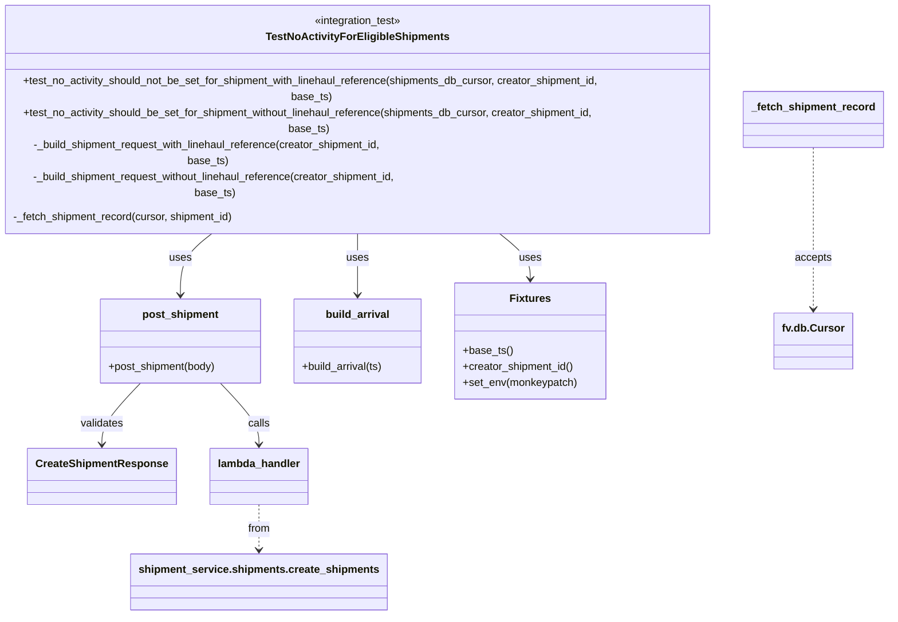

# Diagram: shipment_core/shipment_service/test/integration/no_activity/test_no_activity_for_eligible_shipments.py


> Auto-generated by Obscura crawlers

## Diagram 1



### SVG

<svg id="container" width="1364.5234375" xmlns="http://www.w3.org/2000/svg" class="classDiagram" height="826" viewBox="0 0 1364.5234375 826" role="graphics-document document" aria-roledescription="class"><style>#container{font-family:"trebuchet ms",verdana,arial,sans-serif;font-size:16px;fill:#333;}@keyframes edge-animation-frame{from{stroke-dashoffset:0;}}@keyframes dash{to{stroke-dashoffset:0;}}#container .edge-animation-slow{stroke-dasharray:9,5!important;stroke-dashoffset:900;animation:dash 50s linear infinite;stroke-linecap:round;}#container .edge-animation-fast{stroke-dasharray:9,5!important;stroke-dashoffset:900;animation:dash 20s linear infinite;stroke-linecap:round;}#container .error-icon{fill:#552222;}#container .error-text{fill:#552222;stroke:#552222;}#container .edge-thickness-normal{stroke-width:1px;}#container .edge-thickness-thick{stroke-width:3.5px;}#container .edge-pattern-solid{stroke-dasharray:0;}#container .edge-thickness-invisible{stroke-width:0;fill:none;}#container .edge-pattern-dashed{stroke-dasharray:3;}#container .edge-pattern-dotted{stroke-dasharray:2;}#container .marker{fill:#333333;stroke:#333333;}#container .marker.cross{stroke:#333333;}#container svg{font-family:"trebuchet ms",verdana,arial,sans-serif;font-size:16px;}#container p{margin:0;}#container g.classGroup text{fill:#9370DB;stroke:none;font-family:"trebuchet ms",verdana,arial,sans-serif;font-size:10px;}#container g.classGroup text .title{font-weight:bolder;}#container .nodeLabel,#container .edgeLabel{color:#131300;}#container .edgeLabel .label rect{fill:#ECECFF;}#container .label text{fill:#131300;}#container .labelBkg{background:#ECECFF;}#container .edgeLabel .label span{background:#ECECFF;}#container .classTitle{font-weight:bolder;}#container .node rect,#container .node circle,#container .node ellipse,#container .node polygon,#container .node path{fill:#ECECFF;stroke:#9370DB;stroke-width:1px;}#container .divider{stroke:#9370DB;stroke-width:1;}#container g.clickable{cursor:pointer;}#container g.classGroup rect{fill:#ECECFF;stroke:#9370DB;}#container g.classGroup line{stroke:#9370DB;stroke-width:1;}#container .classLabel .box{stroke:none;stroke-width:0;fill:#ECECFF;opacity:0.5;}#container .classLabel .label{fill:#9370DB;font-size:10px;}#container .relation{stroke:#333333;stroke-width:1;fill:none;}#container .dashed-line{stroke-dasharray:3;}#container .dotted-line{stroke-dasharray:1 2;}#container #compositionStart,#container .composition{fill:#333333!important;stroke:#333333!important;stroke-width:1;}#container #compositionEnd,#container .composition{fill:#333333!important;stroke:#333333!important;stroke-width:1;}#container #dependencyStart,#container .dependency{fill:#333333!important;stroke:#333333!important;stroke-width:1;}#container #dependencyStart,#container .dependency{fill:#333333!important;stroke:#333333!important;stroke-width:1;}#container #extensionStart,#container .extension{fill:transparent!important;stroke:#333333!important;stroke-width:1;}#container #extensionEnd,#container .extension{fill:transparent!important;stroke:#333333!important;stroke-width:1;}#container #aggregationStart,#container .aggregation{fill:transparent!important;stroke:#333333!important;stroke-width:1;}#container #aggregationEnd,#container .aggregation{fill:transparent!important;stroke:#333333!important;stroke-width:1;}#container #lollipopStart,#container .lollipop{fill:#ECECFF!important;stroke:#333333!important;stroke-width:1;}#container #lollipopEnd,#container .lollipop{fill:#ECECFF!important;stroke:#333333!important;stroke-width:1;}#container .edgeTerminals{font-size:11px;line-height:initial;}#container .classTitleText{text-anchor:middle;font-size:18px;fill:#333;}#container .label-icon{display:inline-block;height:1em;overflow:visible;vertical-align:-0.125em;}#container .node .label-icon path{fill:currentColor;stroke:revert;stroke-width:revert;}#container :root{--mermaid-font-family:"trebuchet ms",verdana,arial,sans-serif;}</style><g><defs><marker id="container_class-aggregationStart" class="marker aggregation class" refX="18" refY="7" markerWidth="190" markerHeight="240" orient="auto"><path d="M 18,7 L9,13 L1,7 L9,1 Z"></path></marker></defs><defs><marker id="container_class-aggregationEnd" class="marker aggregation class" refX="1" refY="7" markerWidth="20" markerHeight="28" orient="auto"><path d="M 18,7 L9,13 L1,7 L9,1 Z"></path></marker></defs><defs><marker id="container_class-extensionStart" class="marker extension class" refX="18" refY="7" markerWidth="190" markerHeight="240" orient="auto"><path d="M 1,7 L18,13 V 1 Z"></path></marker></defs><defs><marker id="container_class-extensionEnd" class="marker extension class" refX="1" refY="7" markerWidth="20" markerHeight="28" orient="auto"><path d="M 1,1 V 13 L18,7 Z"></path></marker></defs><defs><marker id="container_class-compositionStart" class="marker composition class" refX="18" refY="7" markerWidth="190" markerHeight="240" orient="auto"><path d="M 18,7 L9,13 L1,7 L9,1 Z"></path></marker></defs><defs><marker id="container_class-compositionEnd" class="marker composition class" refX="1" refY="7" markerWidth="20" markerHeight="28" orient="auto"><path d="M 18,7 L9,13 L1,7 L9,1 Z"></path></marker></defs><defs><marker id="container_class-dependencyStart" class="marker dependency class" refX="6" refY="7" markerWidth="190" markerHeight="240" orient="auto"><path d="M 5,7 L9,13 L1,7 L9,1 Z"></path></marker></defs><defs><marker id="container_class-dependencyEnd" class="marker dependency class" refX="13" refY="7" markerWidth="20" markerHeight="28" orient="auto"><path d="M 18,7 L9,13 L14,7 L9,1 Z"></path></marker></defs><defs><marker id="container_class-lollipopStart" class="marker lollipop class" refX="13" refY="7" markerWidth="190" markerHeight="240" orient="auto"><circle stroke="black" fill="transparent" cx="7" cy="7" r="6"></circle></marker></defs><defs><marker id="container_class-lollipopEnd" class="marker lollipop class" refX="1" refY="7" markerWidth="190" markerHeight="240" orient="auto"><circle stroke="black" fill="transparent" cx="7" cy="7" r="6"></circle></marker></defs><g class="root"><g class="clusters"></g><g class="edgePaths"><path d="M350.289,254L339.951,260.167C329.614,266.333,308.94,278.667,298.603,294C288.266,309.333,288.266,327.667,288.266,336.833L288.266,346" id="id_TestNoActivityForEligibleShipments_post_shipment_1" class="edge-thickness-normal edge-pattern-solid relation" style=";;;" data-edge="true" data-et="edge" data-id="id_TestNoActivityForEligibleShipments_post_shipment_1" data-points="W3sieCI6MzUwLjI4ODUwMDk3NjU2MjUsInkiOjI1NH0seyJ4IjoyODguMjY1NjI1LCJ5IjoyOTF9LHsieCI6Mjg4LjI2NTYyNSwieSI6MzUyfV0=" marker-end="url(#container_class-dependencyEnd)"></path><path d="M346.205,478L355.555,488.167C364.905,498.333,383.605,518.667,392.955,534C402.305,549.333,402.305,559.667,402.305,564.833L402.305,570" id="id_post_shipment_lambda_handler_2" class="edge-thickness-normal edge-pattern-solid relation" style=";;;" data-edge="true" data-et="edge" data-id="id_post_shipment_lambda_handler_2" data-points="W3sieCI6MzQ2LjIwNDgyNjEwODg3MSwieSI6NDc4fSx7IngiOjQwMi4zMDQ2ODc1LCJ5Ijo1Mzl9LHsieCI6NDAyLjMwNDY4NzUsInkiOjU3Nn1d" marker-end="url(#container_class-dependencyEnd)"></path><path d="M230.326,478L220.976,488.167C211.626,498.333,192.927,518.667,183.577,534C174.227,549.333,174.227,559.667,174.227,564.833L174.227,570" id="id_post_shipment_CreateShipmentResponse_3" class="edge-thickness-normal edge-pattern-solid relation" style=";;;" data-edge="true" data-et="edge" data-id="id_post_shipment_CreateShipmentResponse_3" data-points="W3sieCI6MjMwLjMyNjQyMzg5MTEyOTAyLCJ5Ijo0Nzh9LHsieCI6MTc0LjIyNjU2MjUsInkiOjUzOX0seyJ4IjoxNzQuMjI2NTYyNSwieSI6NTc2fV0=" marker-end="url(#container_class-dependencyEnd)"></path><path d="M556.473,254L556.473,260.167C556.473,266.333,556.473,278.667,556.473,294C556.473,309.333,556.473,327.667,556.473,336.833L556.473,346" id="id_TestNoActivityForEligibleShipments_build_arrival_4" class="edge-thickness-normal edge-pattern-solid relation" style=";;;" data-edge="true" data-et="edge" data-id="id_TestNoActivityForEligibleShipments_build_arrival_4" data-points="W3sieCI6NTU2LjQ3MjY1NjI1LCJ5IjoyNTR9LHsieCI6NTU2LjQ3MjY1NjI1LCJ5IjoyOTF9LHsieCI6NTU2LjQ3MjY1NjI1LCJ5IjozNTJ9XQ==" marker-end="url(#container_class-dependencyEnd)"></path><path d="M755.837,254L765.832,260.167C775.828,266.333,795.818,278.667,805.813,290C815.809,301.333,815.809,311.667,815.809,316.833L815.809,322" id="id_TestNoActivityForEligibleShipments_Fixtures_5" class="edge-thickness-normal edge-pattern-solid relation" style=";;;" data-edge="true" data-et="edge" data-id="id_TestNoActivityForEligibleShipments_Fixtures_5" data-points="W3sieCI6NzU1LjgzNzE1ODIwMzEyNSwieSI6MjU0fSx7IngiOjgxNS44MDg1OTM3NSwieSI6MjkxfSx7IngiOjgxNS44MDg1OTM3NSwieSI6MzI4fV0=" marker-end="url(#container_class-dependencyEnd)"></path><path d="M1255.734,173L1255.734,192.667C1255.734,212.333,1255.734,251.667,1255.734,284C1255.734,316.333,1255.734,341.667,1255.734,354.333L1255.734,367" id="id__fetch_shipment_record_fv.db.Cursor_6" class="edge-thickness-normal edge-pattern-dashed relation" style=";;;" data-edge="true" data-et="edge" data-id="id__fetch_shipment_record_fv.db.Cursor_6" data-points="W3sieCI6MTI1NS43MzQzNzUsInkiOjE3M30seyJ4IjoxMjU1LjczNDM3NSwieSI6MjkxfSx7IngiOjEyNTUuNzM0Mzc1LCJ5IjozNzN9XQ==" marker-end="url(#container_class-dependencyEnd)"></path><path d="M402.305,660L402.305,666.167C402.305,672.333,402.305,684.667,402.305,696C402.305,707.333,402.305,717.667,402.305,722.833L402.305,728" id="id_lambda_handler_shipment_service.shipments.create_shipments_7" class="edge-thickness-normal edge-pattern-dashed relation" style=";;;" data-edge="true" data-et="edge" data-id="id_lambda_handler_shipment_service.shipments.create_shipments_7" data-points="W3sieCI6NDAyLjMwNDY4NzUsInkiOjY2MH0seyJ4Ijo0MDIuMzA0Njg3NSwieSI6Njk3fSx7IngiOjQwMi4zMDQ2ODc1LCJ5Ijo3MzR9XQ==" marker-end="url(#container_class-dependencyEnd)"></path></g><g class="edgeLabels"><g class="edgeLabel" transform="translate(288.265625, 291)"><g class="label" data-id="id_TestNoActivityForEligibleShipments_post_shipment_1" transform="translate(-16.4921875, -12)"><foreignObject width="32.984375" height="24"><div xmlns="http://www.w3.org/1999/xhtml" class="labelBkg" style="display: table-cell; white-space: nowrap; line-height: 1.5; max-width: 200px; text-align: center;"><span class="edgeLabel"><p>uses</p></span></div></foreignObject></g></g><g class="edgeLabel" transform="translate(402.3046875, 539)"><g class="label" data-id="id_post_shipment_lambda_handler_2" transform="translate(-16.4453125, -12)"><foreignObject width="32.890625" height="24"><div xmlns="http://www.w3.org/1999/xhtml" class="labelBkg" style="display: table-cell; white-space: nowrap; line-height: 1.5; max-width: 200px; text-align: center;"><span class="edgeLabel"><p>calls</p></span></div></foreignObject></g></g><g class="edgeLabel" transform="translate(174.2265625, 539)"><g class="label" data-id="id_post_shipment_CreateShipmentResponse_3" transform="translate(-32.6875, -12)"><foreignObject width="65.375" height="24"><div xmlns="http://www.w3.org/1999/xhtml" class="labelBkg" style="display: table-cell; white-space: nowrap; line-height: 1.5; max-width: 200px; text-align: center;"><span class="edgeLabel"><p>validates</p></span></div></foreignObject></g></g><g class="edgeLabel" transform="translate(556.47265625, 291)"><g class="label" data-id="id_TestNoActivityForEligibleShipments_build_arrival_4" transform="translate(-16.4921875, -12)"><foreignObject width="32.984375" height="24"><div xmlns="http://www.w3.org/1999/xhtml" class="labelBkg" style="display: table-cell; white-space: nowrap; line-height: 1.5; max-width: 200px; text-align: center;"><span class="edgeLabel"><p>uses</p></span></div></foreignObject></g></g><g class="edgeLabel" transform="translate(815.80859375, 291)"><g class="label" data-id="id_TestNoActivityForEligibleShipments_Fixtures_5" transform="translate(-16.4921875, -12)"><foreignObject width="32.984375" height="24"><div xmlns="http://www.w3.org/1999/xhtml" class="labelBkg" style="display: table-cell; white-space: nowrap; line-height: 1.5; max-width: 200px; text-align: center;"><span class="edgeLabel"><p>uses</p></span></div></foreignObject></g></g><g class="edgeLabel" transform="translate(1255.734375, 291)"><g class="label" data-id="id__fetch_shipment_record_fv.db.Cursor_6" transform="translate(-27.421875, -12)"><foreignObject width="54.84375" height="24"><div xmlns="http://www.w3.org/1999/xhtml" class="labelBkg" style="display: table-cell; white-space: nowrap; line-height: 1.5; max-width: 200px; text-align: center;"><span class="edgeLabel"><p>accepts</p></span></div></foreignObject></g></g><g class="edgeLabel" transform="translate(402.3046875, 697)"><g class="label" data-id="id_lambda_handler_shipment_service.shipments.create_shipments_7" transform="translate(-17.0625, -12)"><foreignObject width="34.125" height="24"><div xmlns="http://www.w3.org/1999/xhtml" class="labelBkg" style="display: table-cell; white-space: nowrap; line-height: 1.5; max-width: 200px; text-align: center;"><span class="edgeLabel"><p>from</p></span></div></foreignObject></g></g></g><g class="nodes"><g class="node default" id="classId-TestNoActivityForEligibleShipments-0" transform="translate(556.47265625, 131)"><g class="basic label-container"><path d="M-548.47265625 -123 L548.47265625 -123 L548.47265625 123 L-548.47265625 123" stroke="none" stroke-width="0" fill="#ECECFF" style=""></path><path d="M-548.47265625 -123 C-274.77664692232776 -123, -1.0806375946555136 -123, 548.47265625 -123 M-548.47265625 -123 C-152.87065965102153 -123, 242.73133694795695 -123, 548.47265625 -123 M548.47265625 -123 C548.47265625 -72.213881806406, 548.47265625 -21.427763612811987, 548.47265625 123 M548.47265625 -123 C548.47265625 -53.12238575393677, 548.47265625 16.755228492126463, 548.47265625 123 M548.47265625 123 C117.8287946130198 123, -312.8150670239604 123, -548.47265625 123 M548.47265625 123 C118.34838283055876 123, -311.7758905888825 123, -548.47265625 123 M-548.47265625 123 C-548.47265625 66.86278714857296, -548.47265625 10.725574297145926, -548.47265625 -123 M-548.47265625 123 C-548.47265625 64.83094641779346, -548.47265625 6.661892835586926, -548.47265625 -123" stroke="#9370DB" stroke-width="1.3" fill="none" stroke-dasharray="0 0" style=""></path></g><g class="annotation-group text" transform="translate(-66.78125, -99)"><g class="label" style="" transform="translate(0,-12)"><foreignObject width="133.5625" height="24"><div xmlns="http://www.w3.org/1999/xhtml" style="display: table-cell; white-space: nowrap; line-height: 1.5; max-width: 184px; text-align: center;"><span class="nodeLabel markdown-node-label" style=""><p>«integration_test»</p></span></div></foreignObject></g></g><g class="label-group text" transform="translate(-130.1015625, -75)"><g class="label" style="font-weight: bolder" transform="translate(0,-12)"><foreignObject width="260.203125" height="24"><div xmlns="http://www.w3.org/1999/xhtml" style="display: table-cell; white-space: nowrap; line-height: 1.5; max-width: 306px; text-align: center;"><span class="nodeLabel markdown-node-label" style=""><p>TestNoActivityForEligibleShipments</p></span></div></foreignObject></g></g><g class="members-group text" transform="translate(-536.47265625, -27)"></g><g class="methods-group text" transform="translate(-536.47265625, 3)"><g class="label" style="" transform="translate(0,-12)"><foreignObject width="942.84375" height="24"><div xmlns="http://www.w3.org/1999/xhtml" style="display: table-cell; white-space: nowrap; line-height: 1.5; max-width: 1000px; text-align: center;"><span class="nodeLabel markdown-node-label" style=""><p>+test_no_activity_should_not_be_set_for_shipment_with_linehaul_reference(shipments_db_cursor, creator_shipment_id, base_ts)</p></span></div></foreignObject></g><g class="label" style="" transform="translate(0,12)"><foreignObject width="934.453125" height="24"><div xmlns="http://www.w3.org/1999/xhtml" style="display: table-cell; white-space: nowrap; line-height: 1.5; max-width: 992px; text-align: center;"><span class="nodeLabel markdown-node-label" style=""><p>+test_no_activity_should_be_set_for_shipment_without_linehaul_reference(shipments_db_cursor, creator_shipment_id, base_ts)</p></span></div></foreignObject></g><g class="label" style="" transform="translate(0,36)"><foreignObject width="597.53125" height="24"><div xmlns="http://www.w3.org/1999/xhtml" style="display: table-cell; white-space: nowrap; line-height: 1.5; max-width: 655px; text-align: center;"><span class="nodeLabel markdown-node-label" style=""><p>-_build_shipment_request_with_linehaul_reference(creator_shipment_id, base_ts)</p></span></div></foreignObject></g><g class="label" style="" transform="translate(0,60)"><foreignObject width="621.96875" height="24"><div xmlns="http://www.w3.org/1999/xhtml" style="display: table-cell; white-space: nowrap; line-height: 1.5; max-width: 679px; text-align: center;"><span class="nodeLabel markdown-node-label" style=""><p>-_build_shipment_request_without_linehaul_reference(creator_shipment_id, base_ts)</p></span></div></foreignObject></g><g class="label" style="" transform="translate(0,84)"><foreignObject width="334.84375" height="24"><div xmlns="http://www.w3.org/1999/xhtml" style="display: table-cell; white-space: nowrap; line-height: 1.5; max-width: 392px; text-align: center;"><span class="nodeLabel markdown-node-label" style=""><p>-_fetch_shipment_record(cursor, shipment_id)</p></span></div></foreignObject></g></g><g class="divider" style=""><path d="M-548.47265625 -51 C-304.2158475659602 -51, -59.95903888192032 -51, 548.47265625 -51 M-548.47265625 -51 C-292.8638670150638 -51, -37.255077780127635 -51, 548.47265625 -51" stroke="#9370DB" stroke-width="1.3" fill="none" stroke-dasharray="0 0" style=""></path></g><g class="divider" style=""><path d="M-548.47265625 -27 C-202.8642046102717 -27, 142.74424702945657 -27, 548.47265625 -27 M-548.47265625 -27 C-161.30664196592306 -27, 225.85937231815387 -27, 548.47265625 -27" stroke="#9370DB" stroke-width="1.3" fill="none" stroke-dasharray="0 0" style=""></path></g></g><g class="node default" id="classId-CreateShipmentResponse-1" transform="translate(174.2265625, 618)"><g class="basic label-container"><path d="M-106.1015625 -42 L106.1015625 -42 L106.1015625 42 L-106.1015625 42" stroke="none" stroke-width="0" fill="#ECECFF" style=""></path><path d="M-106.1015625 -42 C-51.15469578180539 -42, 3.792170936389226 -42, 106.1015625 -42 M-106.1015625 -42 C-53.59451218426286 -42, -1.0874618685257218 -42, 106.1015625 -42 M106.1015625 -42 C106.1015625 -15.34067696177502, 106.1015625 11.318646076449959, 106.1015625 42 M106.1015625 -42 C106.1015625 -23.63320819748849, 106.1015625 -5.266416394976979, 106.1015625 42 M106.1015625 42 C50.72984329912788 42, -4.641875901744243 42, -106.1015625 42 M106.1015625 42 C30.97018727723605 42, -44.1611879455279 42, -106.1015625 42 M-106.1015625 42 C-106.1015625 14.562745532952455, -106.1015625 -12.87450893409509, -106.1015625 -42 M-106.1015625 42 C-106.1015625 23.27739627013108, -106.1015625 4.554792540262163, -106.1015625 -42" stroke="#9370DB" stroke-width="1.3" fill="none" stroke-dasharray="0 0" style=""></path></g><g class="annotation-group text" transform="translate(0, -18)"></g><g class="label-group text" transform="translate(-94.1015625, -18)"><g class="label" style="font-weight: bolder" transform="translate(0,-12)"><foreignObject width="188.203125" height="24"><div xmlns="http://www.w3.org/1999/xhtml" style="display: table-cell; white-space: nowrap; line-height: 1.5; max-width: 236px; text-align: center;"><span class="nodeLabel markdown-node-label" style=""><p>CreateShipmentResponse</p></span></div></foreignObject></g></g><g class="members-group text" transform="translate(-94.1015625, 30)"></g><g class="methods-group text" transform="translate(-94.1015625, 60)"></g><g class="divider" style=""><path d="M-106.1015625 6 C-36.91643492205385 6, 32.268692655892295 6, 106.1015625 6 M-106.1015625 6 C-22.44772664149761 6, 61.20610921700478 6, 106.1015625 6" stroke="#9370DB" stroke-width="1.3" fill="none" stroke-dasharray="0 0" style=""></path></g><g class="divider" style=""><path d="M-106.1015625 24 C-49.2532299109153 24, 7.595102678169397 24, 106.1015625 24 M-106.1015625 24 C-21.259807627178972 24, 63.581947245642056 24, 106.1015625 24" stroke="#9370DB" stroke-width="1.3" fill="none" stroke-dasharray="0 0" style=""></path></g></g><g class="node default" id="classId-lambda_handler-2" transform="translate(402.3046875, 618)"><g class="basic label-container"><path d="M-71.9765625 -42 L71.9765625 -42 L71.9765625 42 L-71.9765625 42" stroke="none" stroke-width="0" fill="#ECECFF" style=""></path><path d="M-71.9765625 -42 C-19.953100719140927 -42, 32.070361061718145 -42, 71.9765625 -42 M-71.9765625 -42 C-31.433251791674138 -42, 9.110058916651724 -42, 71.9765625 -42 M71.9765625 -42 C71.9765625 -24.18711773203838, 71.9765625 -6.374235464076762, 71.9765625 42 M71.9765625 -42 C71.9765625 -9.164786452080058, 71.9765625 23.670427095839884, 71.9765625 42 M71.9765625 42 C33.533339859581105 42, -4.9098827808377905 42, -71.9765625 42 M71.9765625 42 C30.772568916093036 42, -10.431424667813928 42, -71.9765625 42 M-71.9765625 42 C-71.9765625 22.073266445288223, -71.9765625 2.146532890576445, -71.9765625 -42 M-71.9765625 42 C-71.9765625 18.336987783282762, -71.9765625 -5.326024433434476, -71.9765625 -42" stroke="#9370DB" stroke-width="1.3" fill="none" stroke-dasharray="0 0" style=""></path></g><g class="annotation-group text" transform="translate(0, -18)"></g><g class="label-group text" transform="translate(-59.9765625, -18)"><g class="label" style="font-weight: bolder" transform="translate(0,-12)"><foreignObject width="119.953125" height="24"><div xmlns="http://www.w3.org/1999/xhtml" style="display: table-cell; white-space: nowrap; line-height: 1.5; max-width: 170px; text-align: center;"><span class="nodeLabel markdown-node-label" style=""><p>lambda_handler</p></span></div></foreignObject></g></g><g class="members-group text" transform="translate(-59.9765625, 30)"></g><g class="methods-group text" transform="translate(-59.9765625, 60)"></g><g class="divider" style=""><path d="M-71.9765625 6 C-16.485346288973922 6, 39.005869922052156 6, 71.9765625 6 M-71.9765625 6 C-17.637754641074167 6, 36.701053217851666 6, 71.9765625 6" stroke="#9370DB" stroke-width="1.3" fill="none" stroke-dasharray="0 0" style=""></path></g><g class="divider" style=""><path d="M-71.9765625 24 C-35.26606271008501 24, 1.4444370798299815 24, 71.9765625 24 M-71.9765625 24 C-27.32597933341394 24, 17.32460383317212 24, 71.9765625 24" stroke="#9370DB" stroke-width="1.3" fill="none" stroke-dasharray="0 0" style=""></path></g></g><g class="node default" id="classId-post_shipment-3" transform="translate(288.265625, 415)"><g class="basic label-container"><path d="M-121.234375 -63 L121.234375 -63 L121.234375 63 L-121.234375 63" stroke="none" stroke-width="0" fill="#ECECFF" style=""></path><path d="M-121.234375 -63 C-40.91724917473245 -63, 39.399876650535106 -63, 121.234375 -63 M-121.234375 -63 C-41.85699311135244 -63, 37.520388777295125 -63, 121.234375 -63 M121.234375 -63 C121.234375 -28.17617688231249, 121.234375 6.647646235375021, 121.234375 63 M121.234375 -63 C121.234375 -15.007888483944775, 121.234375 32.98422303211045, 121.234375 63 M121.234375 63 C28.937497436056475 63, -63.35938012788705 63, -121.234375 63 M121.234375 63 C51.70877954627362 63, -17.816815907452764 63, -121.234375 63 M-121.234375 63 C-121.234375 23.00496162957399, -121.234375 -16.990076740852018, -121.234375 -63 M-121.234375 63 C-121.234375 23.69423297471483, -121.234375 -15.611534050570341, -121.234375 -63" stroke="#9370DB" stroke-width="1.3" fill="none" stroke-dasharray="0 0" style=""></path></g><g class="annotation-group text" transform="translate(0, -39)"></g><g class="label-group text" transform="translate(-54.953125, -39)"><g class="label" style="font-weight: bolder" transform="translate(0,-12)"><foreignObject width="109.90625" height="24"><div xmlns="http://www.w3.org/1999/xhtml" style="display: table-cell; white-space: nowrap; line-height: 1.5; max-width: 159px; text-align: center;"><span class="nodeLabel markdown-node-label" style=""><p>post_shipment</p></span></div></foreignObject></g></g><g class="members-group text" transform="translate(-109.234375, 9)"></g><g class="methods-group text" transform="translate(-109.234375, 39)"><g class="label" style="" transform="translate(0,-12)"><foreignObject width="163.515625" height="24"><div xmlns="http://www.w3.org/1999/xhtml" style="display: table-cell; white-space: nowrap; line-height: 1.5; max-width: 221px; text-align: center;"><span class="nodeLabel markdown-node-label" style=""><p>+post_shipment(body)</p></span></div></foreignObject></g></g><g class="divider" style=""><path d="M-121.234375 -15 C-47.64020311662857 -15, 25.95396876674286 -15, 121.234375 -15 M-121.234375 -15 C-41.06877967032867 -15, 39.09681565934267 -15, 121.234375 -15" stroke="#9370DB" stroke-width="1.3" fill="none" stroke-dasharray="0 0" style=""></path></g><g class="divider" style=""><path d="M-121.234375 9 C-53.28119851429062 9, 14.671977971418755 9, 121.234375 9 M-121.234375 9 C-58.98797360537807 9, 3.2584277892438536 9, 121.234375 9" stroke="#9370DB" stroke-width="1.3" fill="none" stroke-dasharray="0 0" style=""></path></g></g><g class="node default" id="classId-build_arrival-4" transform="translate(556.47265625, 415)"><g class="basic label-container"><path d="M-96.97265625 -63 L96.97265625 -63 L96.97265625 63 L-96.97265625 63" stroke="none" stroke-width="0" fill="#ECECFF" style=""></path><path d="M-96.97265625 -63 C-52.697011559787235 -63, -8.42136686957447 -63, 96.97265625 -63 M-96.97265625 -63 C-50.106225205169714 -63, -3.2397941603394287 -63, 96.97265625 -63 M96.97265625 -63 C96.97265625 -33.25247423485179, 96.97265625 -3.504948469703571, 96.97265625 63 M96.97265625 -63 C96.97265625 -19.721362268185075, 96.97265625 23.55727546362985, 96.97265625 63 M96.97265625 63 C33.2426580503864 63, -30.487340149227194 63, -96.97265625 63 M96.97265625 63 C35.58193398046206 63, -25.808788289075878 63, -96.97265625 63 M-96.97265625 63 C-96.97265625 33.09268125188804, -96.97265625 3.1853625037760693, -96.97265625 -63 M-96.97265625 63 C-96.97265625 23.19791740054641, -96.97265625 -16.604165198907182, -96.97265625 -63" stroke="#9370DB" stroke-width="1.3" fill="none" stroke-dasharray="0 0" style=""></path></g><g class="annotation-group text" transform="translate(0, -39)"></g><g class="label-group text" transform="translate(-46.4140625, -39)"><g class="label" style="font-weight: bolder" transform="translate(0,-12)"><foreignObject width="92.828125" height="24"><div xmlns="http://www.w3.org/1999/xhtml" style="display: table-cell; white-space: nowrap; line-height: 1.5; max-width: 142px; text-align: center;"><span class="nodeLabel markdown-node-label" style=""><p>build_arrival</p></span></div></foreignObject></g></g><g class="members-group text" transform="translate(-84.97265625, 9)"></g><g class="methods-group text" transform="translate(-84.97265625, 39)"><g class="label" style="" transform="translate(0,-12)"><foreignObject width="123.53125" height="24"><div xmlns="http://www.w3.org/1999/xhtml" style="display: table-cell; white-space: nowrap; line-height: 1.5; max-width: 181px; text-align: center;"><span class="nodeLabel markdown-node-label" style=""><p>+build_arrival(ts)</p></span></div></foreignObject></g></g><g class="divider" style=""><path d="M-96.97265625 -15 C-43.48064700349978 -15, 10.011362243000434 -15, 96.97265625 -15 M-96.97265625 -15 C-31.329511432514835 -15, 34.31363338497033 -15, 96.97265625 -15" stroke="#9370DB" stroke-width="1.3" fill="none" stroke-dasharray="0 0" style=""></path></g><g class="divider" style=""><path d="M-96.97265625 9 C-52.8005819835914 9, -8.6285077171828 9, 96.97265625 9 M-96.97265625 9 C-46.12786346218743 9, 4.716929325625145 9, 96.97265625 9" stroke="#9370DB" stroke-width="1.3" fill="none" stroke-dasharray="0 0" style=""></path></g></g><g class="node default" id="classId-Fixtures-5" transform="translate(815.80859375, 415)"><g class="basic label-container"><path d="M-112.36328125 -87 L112.36328125 -87 L112.36328125 87 L-112.36328125 87" stroke="none" stroke-width="0" fill="#ECECFF" style=""></path><path d="M-112.36328125 -87 C-60.774593530967365 -87, -9.185905811934731 -87, 112.36328125 -87 M-112.36328125 -87 C-28.73853102322768 -87, 54.88621920354464 -87, 112.36328125 -87 M112.36328125 -87 C112.36328125 -25.98588144199126, 112.36328125 35.02823711601748, 112.36328125 87 M112.36328125 -87 C112.36328125 -30.698166011756356, 112.36328125 25.603667976487287, 112.36328125 87 M112.36328125 87 C62.9920333691086 87, 13.620785488217194 87, -112.36328125 87 M112.36328125 87 C38.988799670371066 87, -34.38568190925787 87, -112.36328125 87 M-112.36328125 87 C-112.36328125 40.19732978984265, -112.36328125 -6.605340420314704, -112.36328125 -87 M-112.36328125 87 C-112.36328125 31.715685648112533, -112.36328125 -23.568628703774934, -112.36328125 -87" stroke="#9370DB" stroke-width="1.3" fill="none" stroke-dasharray="0 0" style=""></path></g><g class="annotation-group text" transform="translate(0, -63)"></g><g class="label-group text" transform="translate(-28.9296875, -63)"><g class="label" style="font-weight: bolder" transform="translate(0,-12)"><foreignObject width="57.859375" height="24"><div xmlns="http://www.w3.org/1999/xhtml" style="display: table-cell; white-space: nowrap; line-height: 1.5; max-width: 107px; text-align: center;"><span class="nodeLabel markdown-node-label" style=""><p>Fixtures</p></span></div></foreignObject></g></g><g class="members-group text" transform="translate(-100.36328125, -15)"></g><g class="methods-group text" transform="translate(-100.36328125, 15)"><g class="label" style="" transform="translate(0,-12)"><foreignObject width="73.375" height="24"><div xmlns="http://www.w3.org/1999/xhtml" style="display: table-cell; white-space: nowrap; line-height: 1.5; max-width: 131px; text-align: center;"><span class="nodeLabel markdown-node-label" style=""><p>+base_ts()</p></span></div></foreignObject></g><g class="label" style="" transform="translate(0,12)"><foreignObject width="167.90625" height="24"><div xmlns="http://www.w3.org/1999/xhtml" style="display: table-cell; white-space: nowrap; line-height: 1.5; max-width: 225px; text-align: center;"><span class="nodeLabel markdown-node-label" style=""><p>+creator_shipment_id()</p></span></div></foreignObject></g><g class="label" style="" transform="translate(0,36)"><foreignObject width="171.796875" height="24"><div xmlns="http://www.w3.org/1999/xhtml" style="display: table-cell; white-space: nowrap; line-height: 1.5; max-width: 229px; text-align: center;"><span class="nodeLabel markdown-node-label" style=""><p>+set_env(monkeypatch)</p></span></div></foreignObject></g></g><g class="divider" style=""><path d="M-112.36328125 -39 C-41.51270471427328 -39, 29.337871821453433 -39, 112.36328125 -39 M-112.36328125 -39 C-22.893133857120887 -39, 66.57701353575823 -39, 112.36328125 -39" stroke="#9370DB" stroke-width="1.3" fill="none" stroke-dasharray="0 0" style=""></path></g><g class="divider" style=""><path d="M-112.36328125 -15 C-66.40206779790194 -15, -20.440854345803857 -15, 112.36328125 -15 M-112.36328125 -15 C-56.43856675650345 -15, -0.5138522630068962 -15, 112.36328125 -15" stroke="#9370DB" stroke-width="1.3" fill="none" stroke-dasharray="0 0" style=""></path></g></g><g class="node default" id="classId-_fetch_shipment_record-6" transform="translate(1255.734375, 131)"><g class="basic label-container"><path d="M-100.7890625 -42 L100.7890625 -42 L100.7890625 42 L-100.7890625 42" stroke="none" stroke-width="0" fill="#ECECFF" style=""></path><path d="M-100.7890625 -42 C-48.58839427658207 -42, 3.612273946835856 -42, 100.7890625 -42 M-100.7890625 -42 C-55.1816996097115 -42, -9.574336719423002 -42, 100.7890625 -42 M100.7890625 -42 C100.7890625 -18.521532139495765, 100.7890625 4.95693572100847, 100.7890625 42 M100.7890625 -42 C100.7890625 -18.35219585110747, 100.7890625 5.2956082977850585, 100.7890625 42 M100.7890625 42 C25.79049846579221 42, -49.20806556841558 42, -100.7890625 42 M100.7890625 42 C57.73808998571329 42, 14.687117471426575 42, -100.7890625 42 M-100.7890625 42 C-100.7890625 15.918629122532181, -100.7890625 -10.162741754935638, -100.7890625 -42 M-100.7890625 42 C-100.7890625 16.713149413064496, -100.7890625 -8.573701173871008, -100.7890625 -42" stroke="#9370DB" stroke-width="1.3" fill="none" stroke-dasharray="0 0" style=""></path></g><g class="annotation-group text" transform="translate(0, -18)"></g><g class="label-group text" transform="translate(-88.7890625, -18)"><g class="label" style="font-weight: bolder" transform="translate(0,-12)"><foreignObject width="177.578125" height="24"><div xmlns="http://www.w3.org/1999/xhtml" style="display: table-cell; white-space: nowrap; line-height: 1.5; max-width: 226px; text-align: center;"><span class="nodeLabel markdown-node-label" style=""><p>_fetch_shipment_record</p></span></div></foreignObject></g></g><g class="members-group text" transform="translate(-88.7890625, 30)"></g><g class="methods-group text" transform="translate(-88.7890625, 60)"></g><g class="divider" style=""><path d="M-100.7890625 6 C-47.128519213843155 6, 6.532024072313689 6, 100.7890625 6 M-100.7890625 6 C-42.32334256782616 6, 16.14237736434768 6, 100.7890625 6" stroke="#9370DB" stroke-width="1.3" fill="none" stroke-dasharray="0 0" style=""></path></g><g class="divider" style=""><path d="M-100.7890625 24 C-51.02138065567344 24, -1.2536988113468794 24, 100.7890625 24 M-100.7890625 24 C-42.467529336603384 24, 15.854003826793232 24, 100.7890625 24" stroke="#9370DB" stroke-width="1.3" fill="none" stroke-dasharray="0 0" style=""></path></g></g><g class="node default" id="classId-fv.db.Cursor-7" transform="translate(1255.734375, 415)"><g class="basic label-container"><path d="M-55.6328125 -42 L55.6328125 -42 L55.6328125 42 L-55.6328125 42" stroke="none" stroke-width="0" fill="#ECECFF" style=""></path><path d="M-55.6328125 -42 C-12.378108365605158 -42, 30.876595768789684 -42, 55.6328125 -42 M-55.6328125 -42 C-23.371684238124807 -42, 8.889444023750386 -42, 55.6328125 -42 M55.6328125 -42 C55.6328125 -22.23598814339334, 55.6328125 -2.4719762867866777, 55.6328125 42 M55.6328125 -42 C55.6328125 -18.112586282844166, 55.6328125 5.774827434311668, 55.6328125 42 M55.6328125 42 C17.35840148683672 42, -20.91600952632656 42, -55.6328125 42 M55.6328125 42 C20.279661260884474 42, -15.073489978231052 42, -55.6328125 42 M-55.6328125 42 C-55.6328125 21.87871474393282, -55.6328125 1.7574294878656431, -55.6328125 -42 M-55.6328125 42 C-55.6328125 21.36571827399174, -55.6328125 0.7314365479834777, -55.6328125 -42" stroke="#9370DB" stroke-width="1.3" fill="none" stroke-dasharray="0 0" style=""></path></g><g class="annotation-group text" transform="translate(0, -18)"></g><g class="label-group text" transform="translate(-43.6328125, -18)"><g class="label" style="font-weight: bolder" transform="translate(0,-12)"><foreignObject width="87.265625" height="24"><div xmlns="http://www.w3.org/1999/xhtml" style="display: table-cell; white-space: nowrap; line-height: 1.5; max-width: 136px; text-align: center;"><span class="nodeLabel markdown-node-label" style=""><p>fv.db.Cursor</p></span></div></foreignObject></g></g><g class="members-group text" transform="translate(-43.6328125, 30)"></g><g class="methods-group text" transform="translate(-43.6328125, 60)"></g><g class="divider" style=""><path d="M-55.6328125 6 C-14.487602948607268 6, 26.657606602785464 6, 55.6328125 6 M-55.6328125 6 C-17.65187329269468 6, 20.329065914610638 6, 55.6328125 6" stroke="#9370DB" stroke-width="1.3" fill="none" stroke-dasharray="0 0" style=""></path></g><g class="divider" style=""><path d="M-55.6328125 24 C-17.050574224311973 24, 21.531664051376055 24, 55.6328125 24 M-55.6328125 24 C-16.425051620598623 24, 22.782709258802754 24, 55.6328125 24" stroke="#9370DB" stroke-width="1.3" fill="none" stroke-dasharray="0 0" style=""></path></g></g><g class="node default" id="classId-shipment_service.shipments.create_shipments-8" transform="translate(402.3046875, 776)"><g class="basic label-container"><path d="M-183.625 -42 L183.625 -42 L183.625 42 L-183.625 42" stroke="none" stroke-width="0" fill="#ECECFF" style=""></path><path d="M-183.625 -42 C-86.54844331805786 -42, 10.528113363884273 -42, 183.625 -42 M-183.625 -42 C-108.41202572055231 -42, -33.199051441104615 -42, 183.625 -42 M183.625 -42 C183.625 -18.173431397697016, 183.625 5.653137204605969, 183.625 42 M183.625 -42 C183.625 -9.7059168499133, 183.625 22.5881663001734, 183.625 42 M183.625 42 C73.44184467554732 42, -36.74131064890537 42, -183.625 42 M183.625 42 C105.77009983202868 42, 27.915199664057354 42, -183.625 42 M-183.625 42 C-183.625 19.03965157370117, -183.625 -3.9206968525976578, -183.625 -42 M-183.625 42 C-183.625 23.094430588886407, -183.625 4.188861177772814, -183.625 -42" stroke="#9370DB" stroke-width="1.3" fill="none" stroke-dasharray="0 0" style=""></path></g><g class="annotation-group text" transform="translate(0, -18)"></g><g class="label-group text" transform="translate(-171.625, -18)"><g class="label" style="font-weight: bolder" transform="translate(0,-12)"><foreignObject width="343.25" height="24"><div xmlns="http://www.w3.org/1999/xhtml" style="display: table-cell; white-space: nowrap; line-height: 1.5; max-width: 390px; text-align: center;"><span class="nodeLabel markdown-node-label" style=""><p>shipment_service.shipments.create_shipments</p></span></div></foreignObject></g></g><g class="members-group text" transform="translate(-171.625, 30)"></g><g class="methods-group text" transform="translate(-171.625, 60)"></g><g class="divider" style=""><path d="M-183.625 6 C-56.851297035843544 6, 69.92240592831291 6, 183.625 6 M-183.625 6 C-86.10036355128378 6, 11.424272897432445 6, 183.625 6" stroke="#9370DB" stroke-width="1.3" fill="none" stroke-dasharray="0 0" style=""></path></g><g class="divider" style=""><path d="M-183.625 24 C-78.93104215721208 24, 25.762915685575848 24, 183.625 24 M-183.625 24 C-94.4498201802411 24, -5.274640360482209 24, 183.625 24" stroke="#9370DB" stroke-width="1.3" fill="none" stroke-dasharray="0 0" style=""></path></g></g></g></g></g></svg>

## Diagram 2

```mermaid
flowchart TD
    A[Start test] --> B{Choose scenario}
    B -->|With linehaul reference| C[Build payload with reference qualifier "linehaul"]
    B -->|Without linehaul reference| D[Build payload with reference qualifier "lob"]
    C --> E[Call post_shipment(payload)]
    D --> E
    E --> F[Invoke create_shipments lambda_handler]
    F --> G[Validate response -> CREATED]
    G --> H[Query shipments DB for shipment_details]
    H --> I{Has linehaul reference?}
    I -->|Yes| J[Assert "is_no_activity" NOT in shipment_details and "no_activity_flag_set_at" NOT in shipment_details]
    I -->|No| K[Assert "is_no_activity" in shipment_details and "no_activity_flag_set_at" in shipment_details]
    J --> L[Test passes]
    K --> L
    L --> M[End]
```

> SVG rendering failed for this diagram.
