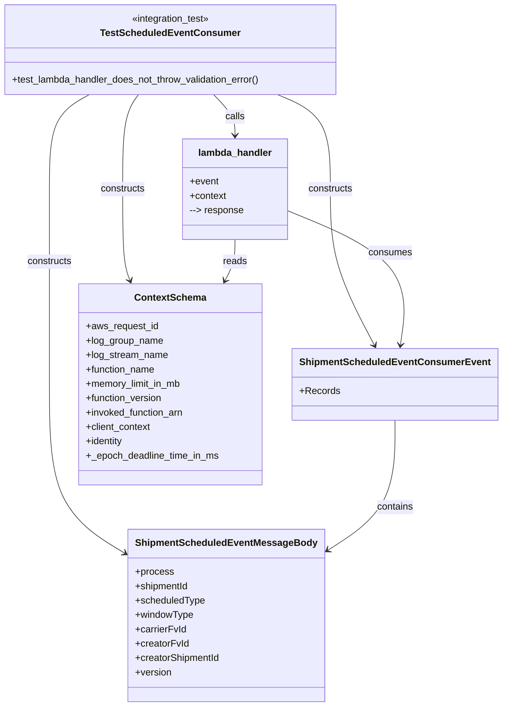
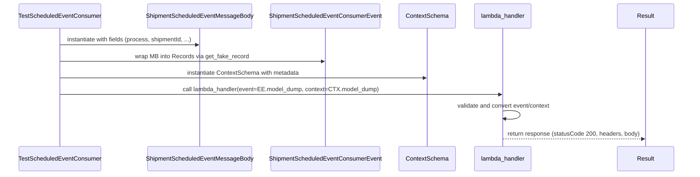

# Diagram: shipment_core/shipment_service/test/integration/scheduled_event/test_scheduled_event_consumer.py

> Auto-generated by Obscura crawlers

## Diagram 1

### SVG

<svg id="container" width="820.78125" xmlns="http://www.w3.org/2000/svg" class="classDiagram" height="1180" viewBox="0 0 820.78125 1180" role="graphics-document document" aria-roledescription="class"><g><defs><marker id="container_class-aggregationStart" class="marker aggregation class" refX="18" refY="7" markerWidth="190" markerHeight="240" orient="auto"><path d="M 18,7 L9,13 L1,7 L9,1 Z"></path></marker></defs><defs><marker id="container_class-aggregationEnd" class="marker aggregation class" refX="1" refY="7" markerWidth="20" markerHeight="28" orient="auto"><path d="M 18,7 L9,13 L1,7 L9,1 Z"></path></marker></defs><defs><marker id="container_class-extensionStart" class="marker extension class" refX="18" refY="7" markerWidth="190" markerHeight="240" orient="auto"><path d="M 1,7 L18,13 V 1 Z"></path></marker></defs><defs><marker id="container_class-extensionEnd" class="marker extension class" refX="1" refY="7" markerWidth="20" markerHeight="28" orient="auto"><path d="M 1,1 V 13 L18,7 Z"></path></marker></defs><defs><marker id="container_class-compositionStart" class="marker composition class" refX="18" refY="7" markerWidth="190" markerHeight="240" orient="auto"><path d="M 18,7 L9,13 L1,7 L9,1 Z"></path></marker></defs><defs><marker id="container_class-compositionEnd" class="marker composition class" refX="1" refY="7" markerWidth="20" markerHeight="28" orient="auto"><path d="M 18,7 L9,13 L1,7 L9,1 Z"></path></marker></defs><defs><marker id="container_class-dependencyStart" class="marker dependency class" refX="6" refY="7" markerWidth="190" markerHeight="240" orient="auto"><path d="M 5,7 L9,13 L1,7 L9,1 Z"></path></marker></defs><defs><marker id="container_class-dependencyEnd" class="marker dependency class" refX="13" refY="7" markerWidth="20" markerHeight="28" orient="auto"><path d="M 18,7 L9,13 L14,7 L9,1 Z"></path></marker></defs><defs><marker id="container_class-lollipopStart" class="marker lollipop class" refX="13" refY="7" markerWidth="190" markerHeight="240" orient="auto"><circle stroke="black" fill="transparent" cx="7" cy="7" r="6"></circle></marker></defs><defs><marker id="container_class-lollipopEnd" class="marker lollipop class" refX="1" refY="7" markerWidth="190" markerHeight="240" orient="auto"><circle stroke="black" fill="transparent" cx="7" cy="7" r="6"></circle></marker></defs><g class="root"><g class="clusters"></g><g class="edgePaths"><path d="M150.45,158L139.296,164.167C128.141,170.333,105.832,182.667,94.678,209C83.523,235.333,83.523,275.667,83.523,316C83.523,356.333,83.523,396.667,83.523,451C83.523,505.333,83.523,573.667,83.523,642C83.523,710.333,83.523,778.667,105.299,826.363C127.075,874.059,170.626,901.119,192.401,914.649L214.177,928.178" id="id_TestScheduledEventConsumer_ShipmentScheduledEventMessageBody_1" class="edge-thickness-normal edge-pattern-solid relation" style=";;;" data-edge="true" data-et="edge" data-id="id_TestScheduledEventConsumer_ShipmentScheduledEventMessageBody_1" data-points="W3sieCI6MTUwLjQ1MDQzOTQ1MzEyNSwieSI6MTU4fSx7IngiOjgzLjUyMzQzNzUsInkiOjE5NX0seyJ4Ijo4My41MjM0Mzc1LCJ5IjozMTZ9LHsieCI6ODMuNTIzNDM3NSwieSI6NDM3fSx7IngiOjgzLjUyMzQzNzUsInkiOjY0Mn0seyJ4Ijo4My41MjM0Mzc1LCJ5Ijo4NDd9LHsieCI6MjE5LjI3MzQzNzUsInkiOjkzMS4zNDQ5OTAzNDU0MTk0fV0=" marker-end="url(#container_class-dependencyEnd)"></path><path d="M461.821,158L476.268,164.167C490.715,170.333,519.61,182.667,534.057,209C548.504,235.333,548.504,275.667,548.504,316C548.504,356.333,548.504,396.667,560.064,440.104C571.623,483.542,594.743,530.084,606.302,553.355L617.862,576.626" id="id_TestScheduledEventConsumer_ShipmentScheduledEventConsumerEvent_2" class="edge-thickness-normal edge-pattern-solid relation" style=";;;" data-edge="true" data-et="edge" data-id="id_TestScheduledEventConsumer_ShipmentScheduledEventConsumerEvent_2" data-points="W3sieCI6NDYxLjgyMTI4OTA2MjUsInkiOjE1OH0seyJ4Ijo1NDguNTAzOTA2MjUsInkiOjE5NX0seyJ4Ijo1NDguNTAzOTA2MjUsInkiOjMxNn0seyJ4Ijo1NDguNTAzOTA2MjUsInkiOjQzN30seyJ4Ijo2MjAuNTMxNDQwNTQ4NzgwNCwieSI6NTgyfV0=" marker-end="url(#container_class-dependencyEnd)"></path><path d="M232.355,158L227.935,164.167C223.515,170.333,214.674,182.667,210.254,209C205.834,235.333,205.834,275.667,205.834,316C205.834,356.333,205.834,396.667,207.884,422.069C209.935,447.471,214.035,457.942,216.085,463.178L218.136,468.413" id="id_TestScheduledEventConsumer_ContextSchema_3" class="edge-thickness-normal edge-pattern-solid relation" style=";;;" data-edge="true" data-et="edge" data-id="id_TestScheduledEventConsumer_ContextSchema_3" data-points="W3sieCI6MjMyLjM1NDgyMzUyMTIwNTM2LCJ5IjoxNTh9LHsieCI6MjA1LjgzMzk4NDM3NSwieSI6MTk1fSx7IngiOjIwNS44MzM5ODQzNzUsInkiOjMxNn0seyJ4IjoyMDUuODMzOTg0Mzc1LCJ5Ijo0Mzd9LHsieCI6MjIwLjMyMzQxODQ0NTEyMTk0LCJ5Ijo0NzR9XQ==" marker-end="url(#container_class-dependencyEnd)"></path><path d="M354.304,158L359.911,164.167C365.518,170.333,376.732,182.667,382.338,194C387.945,205.333,387.945,215.667,387.945,220.833L387.945,226" id="id_TestScheduledEventConsumer_lambda_handler_4" class="edge-thickness-normal edge-pattern-solid relation" style=";;;" data-edge="true" data-et="edge" data-id="id_TestScheduledEventConsumer_lambda_handler_4" data-points="W3sieCI6MzU0LjMwNDM3MzYwNDkxMDcsInkiOjE1OH0seyJ4IjozODcuOTQ1MzEyNSwieSI6MTk1fSx7IngiOjM4Ny45NDUzMTI1LCJ5IjoyMzJ9XQ==" marker-end="url(#container_class-dependencyEnd)"></path><path d="M650.336,702L650.336,726.167C650.336,750.333,650.336,798.667,631.182,835.417C612.028,872.168,573.721,897.335,554.567,909.919L535.413,922.503" id="id_ShipmentScheduledEventConsumerEvent_ShipmentScheduledEventMessageBody_5" class="edge-thickness-normal edge-pattern-solid relation" style=";;;" data-edge="true" data-et="edge" data-id="id_ShipmentScheduledEventConsumerEvent_ShipmentScheduledEventMessageBody_5" data-points="W3sieCI6NjUwLjMzNTkzNzUsInkiOjcwMn0seyJ4Ijo2NTAuMzM1OTM3NSwieSI6ODQ3fSx7IngiOjUzMC4zOTg0Mzc1LCJ5Ijo5MjUuNzk3NDEzNzkzMTAzNX1d" marker-end="url(#container_class-dependencyEnd)"></path><path d="M475.66,352.525L509.471,366.605C543.281,380.684,610.902,408.842,641.526,446.097C672.15,483.352,665.777,529.704,662.59,552.88L659.403,576.056" id="id_lambda_handler_ShipmentScheduledEventConsumerEvent_6" class="edge-thickness-normal edge-pattern-solid relation" style=";;;" data-edge="true" data-et="edge" data-id="id_lambda_handler_ShipmentScheduledEventConsumerEvent_6" data-points="W3sieCI6NDc1LjY2MDE1NjI1LCJ5IjozNTIuNTI1NDQ3NjUyODQ3Mn0seyJ4Ijo2NzguNTIzNDM3NSwieSI6NDM3fSx7IngiOjY1OC41ODU5Mzc1LCJ5Ijo1ODJ9XQ==" marker-end="url(#container_class-dependencyEnd)"></path><path d="M387.945,400L387.945,406.167C387.945,412.333,387.945,424.667,385.327,436.104C382.709,447.542,377.472,458.084,374.854,463.355L372.235,468.626" id="id_lambda_handler_ContextSchema_7" class="edge-thickness-normal edge-pattern-solid relation" style=";;;" data-edge="true" data-et="edge" data-id="id_lambda_handler_ContextSchema_7" data-points="W3sieCI6Mzg3Ljk0NTMxMjUsInkiOjQwMH0seyJ4IjozODcuOTQ1MzEyNSwieSI6NDM3fSx7IngiOjM2OS41NjU4NzI3MTM0MTQ2NSwieSI6NDc0fV0=" marker-end="url(#container_class-dependencyEnd)"></path></g><g class="edgeLabels"><g class="edgeLabel" transform="translate(83.5234375, 437)"><g class="label" data-id="id_TestScheduledEventConsumer_ShipmentScheduledEventMessageBody_1" transform="translate(-37.84375, -12)"><foreignObject width="75.6875" height="24">

constructs

</foreignObject></g></g><g class="edgeLabel" transform="translate(548.50390625, 316)"><g class="label" data-id="id_TestScheduledEventConsumer_ShipmentScheduledEventConsumerEvent_2" transform="translate(-37.84375, -12)"><foreignObject width="75.6875" height="24">

constructs

</foreignObject></g></g><g class="edgeLabel" transform="translate(205.833984375, 316)"><g class="label" data-id="id_TestScheduledEventConsumer_ContextSchema_3" transform="translate(-37.84375, -12)"><foreignObject width="75.6875" height="24">

constructs

</foreignObject></g></g><g class="edgeLabel" transform="translate(387.9453125, 195)"><g class="label" data-id="id_TestScheduledEventConsumer_lambda_handler_4" transform="translate(-16.4453125, -12)"><foreignObject width="32.890625" height="24">

calls

</foreignObject></g></g><g class="edgeLabel" transform="translate(650.3359375, 847)"><g class="label" data-id="id_ShipmentScheduledEventConsumerEvent_ShipmentScheduledEventMessageBody_5" transform="translate(-30.890625, -12)"><foreignObject width="61.78125" height="24">

contains

</foreignObject></g></g><g class="edgeLabel" transform="translate(644.65067, 422.895)"><g class="label" data-id="id_lambda_handler_ShipmentScheduledEventConsumerEvent_6" transform="translate(-36.375, -12)"><foreignObject width="72.75" height="24">

consumes

</foreignObject></g></g><g class="edgeLabel" transform="translate(387.9453125, 437)"><g class="label" data-id="id_lambda_handler_ContextSchema_7" transform="translate(-20.0078125, -12)"><foreignObject width="40.015625" height="24">

reads

</foreignObject></g></g></g><g class="nodes"><g class="node default" id="classId-TestScheduledEventConsumer-0" transform="translate(286.11328125, 83)"><g class="basic label-container"><path d="M-278.11328125 -75 L278.11328125 -75 L278.11328125 75 L-278.11328125 75" stroke="none" stroke-width="0" fill="#ECECFF" style=""></path><path d="M-278.11328125 -75 C-82.91053929217253 -75, 112.29220266565494 -75, 278.11328125 -75 M-278.11328125 -75 C-101.30254366374214 -75, 75.50819392251572 -75, 278.11328125 -75 M278.11328125 -75 C278.11328125 -26.121991929839247, 278.11328125 22.756016140321506, 278.11328125 75 M278.11328125 -75 C278.11328125 -29.046358568443736, 278.11328125 16.907282863112528, 278.11328125 75 M278.11328125 75 C74.8749314257164 75, -128.3634183985672 75, -278.11328125 75 M278.11328125 75 C155.02222847890337 75, 31.931175707806744 75, -278.11328125 75 M-278.11328125 75 C-278.11328125 35.637842271066624, -278.11328125 -3.7243154578667514, -278.11328125 -75 M-278.11328125 75 C-278.11328125 24.295496979089414, -278.11328125 -26.409006041821172, -278.11328125 -75" stroke="#9370DB" stroke-width="1.3" fill="none" stroke-dasharray="0 0" style=""></path></g><g class="annotation-group text" transform="translate(-66.78125, -51)"><g class="label" style="" transform="translate(0,-12)"><foreignObject width="133.5625" height="24">

«integration_test»

</foreignObject></g></g><g class="label-group text" transform="translate(-110.3828125, -27)"><g class="label" style="font-weight: bolder" transform="translate(0,-12)"><foreignObject width="220.765625" height="24">

TestScheduledEventConsumer

</foreignObject></g></g><g class="members-group text" transform="translate(-266.11328125, 21)"></g><g class="methods-group text" transform="translate(-266.11328125, 51)"><g class="label" style="" transform="translate(0,-12)"><foreignObject width="421.84375" height="24">

+test_lambda_handler_does_not_throw_validation_error()

</foreignObject></g></g><g class="divider" style=""><path d="M-278.11328125 -3 C-86.70705945915222 -3, 104.69916233169556 -3, 278.11328125 -3 M-278.11328125 -3 C-117.82029386470481 -3, 42.47269352059038 -3, 278.11328125 -3" stroke="#9370DB" stroke-width="1.3" fill="none" stroke-dasharray="0 0" style=""></path></g><g class="divider" style=""><path d="M-278.11328125 21 C-98.05620015621028 21, 82.00088093757944 21, 278.11328125 21 M-278.11328125 21 C-144.75177904317323 21, -11.390276836346459 21, 278.11328125 21" stroke="#9370DB" stroke-width="1.3" fill="none" stroke-dasharray="0 0" style=""></path></g></g><g class="node default" id="classId-ShipmentScheduledEventMessageBody-1" transform="translate(374.8359375, 1028)"><g class="basic label-container"><path d="M-155.5625 -144 L155.5625 -144 L155.5625 144 L-155.5625 144" stroke="none" stroke-width="0" fill="#ECECFF" style=""></path><path d="M-155.5625 -144 C-87.02393674519772 -144, -18.485373490395432 -144, 155.5625 -144 M-155.5625 -144 C-92.04302553407385 -144, -28.523551068147682 -144, 155.5625 -144 M155.5625 -144 C155.5625 -55.23266690353509, 155.5625 33.53466619292982, 155.5625 144 M155.5625 -144 C155.5625 -48.210113152564816, 155.5625 47.57977369487037, 155.5625 144 M155.5625 144 C68.07510174184651 144, -19.41229651630698 144, -155.5625 144 M155.5625 144 C57.446470262835334 144, -40.66955947432933 144, -155.5625 144 M-155.5625 144 C-155.5625 33.74537773318383, -155.5625 -76.50924453363234, -155.5625 -144 M-155.5625 144 C-155.5625 59.854166473336505, -155.5625 -24.29166705332699, -155.5625 -144" stroke="#9370DB" stroke-width="1.3" fill="none" stroke-dasharray="0 0" style=""></path></g><g class="annotation-group text" transform="translate(0, -120)"></g><g class="label-group text" transform="translate(-143.484375, -120)"><g class="label" style="font-weight: bolder" transform="translate(0,-12)"><foreignObject width="286.96875" height="24">

ShipmentScheduledEventMessageBody

</foreignObject></g></g><g class="members-group text" transform="translate(-143.5625, -72)"><g class="label" style="" transform="translate(0,-12)"><foreignObject width="63.375" height="24">

+process

</foreignObject></g><g class="label" style="" transform="translate(0,12)"><foreignObject width="90.734375" height="24">

+shipmentId

</foreignObject></g><g class="label" style="" transform="translate(0,36)"><foreignObject width="116.71875" height="24">

+scheduledType

</foreignObject></g><g class="label" style="" transform="translate(0,60)"><foreignObject width="97.46875" height="24">

+windowType

</foreignObject></g><g class="label" style="" transform="translate(0,84)"><foreignObject width="85.40625" height="24">

+carrierFvId

</foreignObject></g><g class="label" style="" transform="translate(0,108)"><foreignObject width="89.109375" height="24">

+creatorFvId

</foreignObject></g><g class="label" style="" transform="translate(0,132)"><foreignObject width="143.640625" height="24">

+creatorShipmentId

</foreignObject></g><g class="label" style="" transform="translate(0,156)"><foreignObject width="61" height="24">

+version

</foreignObject></g></g><g class="methods-group text" transform="translate(-143.5625, 144)"></g><g class="divider" style=""><path d="M-155.5625 -96 C-66.47847601559197 -96, 22.60554796881607 -96, 155.5625 -96 M-155.5625 -96 C-73.9850864042708 -96, 7.592327191458395 -96, 155.5625 -96" stroke="#9370DB" stroke-width="1.3" fill="none" stroke-dasharray="0 0" style=""></path></g><g class="divider" style=""><path d="M-155.5625 120 C-50.78797866611204 120, 53.98654266777592 120, 155.5625 120 M-155.5625 120 C-67.73623880960193 120, 20.090022380796142 120, 155.5625 120" stroke="#9370DB" stroke-width="1.3" fill="none" stroke-dasharray="0 0" style=""></path></g></g><g class="node default" id="classId-ShipmentScheduledEventConsumerEvent-2" transform="translate(650.3359375, 642)"><g class="basic label-container"><path d="M-162.4453125 -60 L162.4453125 -60 L162.4453125 60 L-162.4453125 60" stroke="none" stroke-width="0" fill="#ECECFF" style=""></path><path d="M-162.4453125 -60 C-91.98674341512022 -60, -21.528174330240432 -60, 162.4453125 -60 M-162.4453125 -60 C-77.3117213143541 -60, 7.821869871291796 -60, 162.4453125 -60 M162.4453125 -60 C162.4453125 -16.19120875974879, 162.4453125 27.61758248050242, 162.4453125 60 M162.4453125 -60 C162.4453125 -28.744527059499262, 162.4453125 2.5109458810014758, 162.4453125 60 M162.4453125 60 C73.74917140119345 60, -14.946969697613099 60, -162.4453125 60 M162.4453125 60 C96.14357452186935 60, 29.841836543738708 60, -162.4453125 60 M-162.4453125 60 C-162.4453125 32.05978835150305, -162.4453125 4.1195767030061035, -162.4453125 -60 M-162.4453125 60 C-162.4453125 12.933317071393105, -162.4453125 -34.13336585721379, -162.4453125 -60" stroke="#9370DB" stroke-width="1.3" fill="none" stroke-dasharray="0 0" style=""></path></g><g class="annotation-group text" transform="translate(0, -36)"></g><g class="label-group text" transform="translate(-150.4453125, -36)"><g class="label" style="font-weight: bolder" transform="translate(0,-12)"><foreignObject width="300.890625" height="24">

ShipmentScheduledEventConsumerEvent

</foreignObject></g></g><g class="members-group text" transform="translate(-150.4453125, 12)"><g class="label" style="" transform="translate(0,-12)"><foreignObject width="65.5625" height="24">

+Records

</foreignObject></g></g><g class="methods-group text" transform="translate(-150.4453125, 60)"></g><g class="divider" style=""><path d="M-162.4453125 -12 C-56.172651932350234 -12, 50.10000863529953 -12, 162.4453125 -12 M-162.4453125 -12 C-69.31222536102501 -12, 23.820861777949972 -12, 162.4453125 -12" stroke="#9370DB" stroke-width="1.3" fill="none" stroke-dasharray="0 0" style=""></path></g><g class="divider" style=""><path d="M-162.4453125 36 C-62.5209792469913 36, 37.403354006017395 36, 162.4453125 36 M-162.4453125 36 C-60.312192410063176 36, 41.82092767987365 36, 162.4453125 36" stroke="#9370DB" stroke-width="1.3" fill="none" stroke-dasharray="0 0" style=""></path></g></g><g class="node default" id="classId-ContextSchema-3" transform="translate(286.11328125, 642)"><g class="basic label-container"><path d="M-151.77734375 -168 L151.77734375 -168 L151.77734375 168 L-151.77734375 168" stroke="none" stroke-width="0" fill="#ECECFF" style=""></path><path d="M-151.77734375 -168 C-58.948989713934154 -168, 33.87936432213169 -168, 151.77734375 -168 M-151.77734375 -168 C-56.31488005363616 -168, 39.14758364272768 -168, 151.77734375 -168 M151.77734375 -168 C151.77734375 -68.3024560243406, 151.77734375 31.3950879513188, 151.77734375 168 M151.77734375 -168 C151.77734375 -67.60678612377536, 151.77734375 32.78642775244927, 151.77734375 168 M151.77734375 168 C80.68686517238847 168, 9.59638659477693 168, -151.77734375 168 M151.77734375 168 C43.168037593463 168, -65.441268563074 168, -151.77734375 168 M-151.77734375 168 C-151.77734375 39.56090793938711, -151.77734375 -88.87818412122579, -151.77734375 -168 M-151.77734375 168 C-151.77734375 96.4716424258416, -151.77734375 24.943284851683188, -151.77734375 -168" stroke="#9370DB" stroke-width="1.3" fill="none" stroke-dasharray="0 0" style=""></path></g><g class="annotation-group text" transform="translate(0, -144)"></g><g class="label-group text" transform="translate(-56.7578125, -144)"><g class="label" style="font-weight: bolder" transform="translate(0,-12)"><foreignObject width="113.515625" height="24">

ContextSchema

</foreignObject></g></g><g class="members-group text" transform="translate(-139.77734375, -96)"><g class="label" style="" transform="translate(0,-12)"><foreignObject width="120.984375" height="24">

+aws_request_id

</foreignObject></g><g class="label" style="" transform="translate(0,12)"><foreignObject width="129.484375" height="24">

+log_group_name

</foreignObject></g><g class="label" style="" transform="translate(0,36)"><foreignObject width="137.40625" height="24">

+log_stream_name

</foreignObject></g><g class="label" style="" transform="translate(0,60)"><foreignObject width="117.28125" height="24">

+function_name

</foreignObject></g><g class="label" style="" transform="translate(0,84)"><foreignObject width="162.15625" height="24">

+memory_limit_in_mb

</foreignObject></g><g class="label" style="" transform="translate(0,108)"><foreignObject width="129.46875" height="24">

+function_version

</foreignObject></g><g class="label" style="" transform="translate(0,132)"><foreignObject width="166.21875" height="24">

+invoked_function_arn

</foreignObject></g><g class="label" style="" transform="translate(0,156)"><foreignObject width="110.40625" height="24">

+client_context

</foreignObject></g><g class="label" style="" transform="translate(0,180)"><foreignObject width="64.03125" height="24">

+identity

</foreignObject></g><g class="label" style="" transform="translate(0,204)"><foreignObject width="222.796875" height="24">

+_epoch_deadline_time_in_ms

</foreignObject></g></g><g class="methods-group text" transform="translate(-139.77734375, 168)"></g><g class="divider" style=""><path d="M-151.77734375 -120 C-41.19131013986963 -120, 69.39472347026074 -120, 151.77734375 -120 M-151.77734375 -120 C-80.65551483337688 -120, -9.533685916753768 -120, 151.77734375 -120" stroke="#9370DB" stroke-width="1.3" fill="none" stroke-dasharray="0 0" style=""></path></g><g class="divider" style=""><path d="M-151.77734375 144 C-31.808996228360385 144, 88.15935129327923 144, 151.77734375 144 M-151.77734375 144 C-84.35186414214512 144, -16.926384534290236 144, 151.77734375 144" stroke="#9370DB" stroke-width="1.3" fill="none" stroke-dasharray="0 0" style=""></path></g></g><g class="node default" id="classId-lambda_handler-4" transform="translate(387.9453125, 316)"><g class="basic label-container"><path d="M-87.71484375 -84 L87.71484375 -84 L87.71484375 84 L-87.71484375 84" stroke="none" stroke-width="0" fill="#ECECFF" style=""></path><path d="M-87.71484375 -84 C-34.954105137143664 -84, 17.806633475712673 -84, 87.71484375 -84 M-87.71484375 -84 C-38.608737349038215 -84, 10.49736905192357 -84, 87.71484375 -84 M87.71484375 -84 C87.71484375 -40.397045943758144, 87.71484375 3.205908112483712, 87.71484375 84 M87.71484375 -84 C87.71484375 -40.134684308931504, 87.71484375 3.730631382136991, 87.71484375 84 M87.71484375 84 C45.9225008172562 84, 4.1301578845124 84, -87.71484375 84 M87.71484375 84 C19.50535738794744 84, -48.70412897410512 84, -87.71484375 84 M-87.71484375 84 C-87.71484375 28.225300718510653, -87.71484375 -27.549398562978695, -87.71484375 -84 M-87.71484375 84 C-87.71484375 30.901738002910754, -87.71484375 -22.19652399417849, -87.71484375 -84" stroke="#9370DB" stroke-width="1.3" fill="none" stroke-dasharray="0 0" style=""></path></g><g class="annotation-group text" transform="translate(0, -60)"></g><g class="label-group text" transform="translate(-59.9765625, -60)"><g class="label" style="font-weight: bolder" transform="translate(0,-12)"><foreignObject width="119.953125" height="24">

lambda_handler

</foreignObject></g></g><g class="members-group text" transform="translate(-75.71484375, -12)"><g class="label" style="" transform="translate(0,-12)"><foreignObject width="48.328125" height="24">

+event

</foreignObject></g><g class="label" style="" transform="translate(0,12)"><foreignObject width="61.6875" height="24">

+context

</foreignObject></g><g class="label" style="" transform="translate(0,36)"><foreignObject width="91.453125" height="24">

--&gt; response

</foreignObject></g></g><g class="methods-group text" transform="translate(-75.71484375, 84)"></g><g class="divider" style=""><path d="M-87.71484375 -36 C-36.44967395391916 -36, 14.815495842161681 -36, 87.71484375 -36 M-87.71484375 -36 C-47.746264123579785 -36, -7.777684497159569 -36, 87.71484375 -36" stroke="#9370DB" stroke-width="1.3" fill="none" stroke-dasharray="0 0" style=""></path></g><g class="divider" style=""><path d="M-87.71484375 60 C-33.97549323869054 60, 19.76385727261892 60, 87.71484375 60 M-87.71484375 60 C-39.226810892815664 60, 9.261221964368673 60, 87.71484375 60" stroke="#9370DB" stroke-width="1.3" fill="none" stroke-dasharray="0 0" style=""></path></g></g></g></g></g></svg>

## Diagram 2

### SVG

<svg id="container" width="1970.5" xmlns="http://www.w3.org/2000/svg" height="489" viewBox="-50 -10 1970.5 489" role="graphics-document document" aria-roledescription="sequence"><g><rect x="1720.5" y="403" fill="#eaeaea" stroke="#666" width="150" height="65" name="R" rx="3" ry="3" class="actor actor-bottom"></rect><text x="1795.5" y="435.5" dominant-baseline="central" alignment-baseline="central" class="actor actor-box" style="text-anchor: middle; font-size: 16px; font-weight: 400;"><tspan x="1795.5" dy="0">Result</tspan></text></g><g><rect x="1298.5" y="403" fill="#eaeaea" stroke="#666" width="150" height="65" name="L" rx="3" ry="3" class="actor actor-bottom"></rect><text x="1373.5" y="435.5" dominant-baseline="central" alignment-baseline="central" class="actor actor-box" style="text-anchor: middle; font-size: 16px; font-weight: 400;"><tspan x="1373.5" dy="0">lambda_handler</tspan></text></g><g><rect x="1098.5" y="403" fill="#eaeaea" stroke="#666" width="150" height="65" name="CTX" rx="3" ry="3" class="actor actor-bottom"></rect><text x="1173.5" y="435.5" dominant-baseline="central" alignment-baseline="central" class="actor actor-box" style="text-anchor: middle; font-size: 16px; font-weight: 400;"><tspan x="1173.5" dy="0">ContextSchema</tspan></text></g><g><rect x="729.5" y="403" fill="#eaeaea" stroke="#666" width="319" height="65" name="EE" rx="3" ry="3" class="actor actor-bottom"></rect><text x="889" y="435.5" dominant-baseline="central" alignment-baseline="central" class="actor actor-box" style="text-anchor: middle; font-size: 16px; font-weight: 400;"><tspan x="889" dy="0">ShipmentScheduledEventConsumerEvent</tspan></text></g><g><rect x="375.5" y="403" fill="#eaeaea" stroke="#666" width="304" height="65" name="MB" rx="3" ry="3" class="actor actor-bottom"></rect><text x="527.5" y="435.5" dominant-baseline="central" alignment-baseline="central" class="actor actor-box" style="text-anchor: middle; font-size: 16px; font-weight: 400;"><tspan x="527.5" dy="0">ShipmentScheduledEventMessageBody</tspan></text></g><g><rect x="0" y="403" fill="#eaeaea" stroke="#666" width="239" height="65" name="Test" rx="3" ry="3" class="actor actor-bottom"></rect><text x="119.5" y="435.5" dominant-baseline="central" alignment-baseline="central" class="actor actor-box" style="text-anchor: middle; font-size: 16px; font-weight: 400;"><tspan x="119.5" dy="0">TestScheduledEventConsumer</tspan></text></g><g><line id="actor5" x1="1795.5" y1="65" x2="1795.5" y2="403" class="actor-line 200" stroke-width="0.5px" stroke="#999" name="R"></line><g id="root-5"><rect x="1720.5" y="0" fill="#eaeaea" stroke="#666" width="150" height="65" name="R" rx="3" ry="3" class="actor actor-top"></rect><text x="1795.5" y="32.5" dominant-baseline="central" alignment-baseline="central" class="actor actor-box" style="text-anchor: middle; font-size: 16px; font-weight: 400;"><tspan x="1795.5" dy="0">Result</tspan></text></g></g><g><line id="actor4" x1="1373.5" y1="65" x2="1373.5" y2="403" class="actor-line 200" stroke-width="0.5px" stroke="#999" name="L"></line><g id="root-4"><rect x="1298.5" y="0" fill="#eaeaea" stroke="#666" width="150" height="65" name="L" rx="3" ry="3" class="actor actor-top"></rect><text x="1373.5" y="32.5" dominant-baseline="central" alignment-baseline="central" class="actor actor-box" style="text-anchor: middle; font-size: 16px; font-weight: 400;"><tspan x="1373.5" dy="0">lambda_handler</tspan></text></g></g><g><line id="actor3" x1="1173.5" y1="65" x2="1173.5" y2="403" class="actor-line 200" stroke-width="0.5px" stroke="#999" name="CTX"></line><g id="root-3"><rect x="1098.5" y="0" fill="#eaeaea" stroke="#666" width="150" height="65" name="CTX" rx="3" ry="3" class="actor actor-top"></rect><text x="1173.5" y="32.5" dominant-baseline="central" alignment-baseline="central" class="actor actor-box" style="text-anchor: middle; font-size: 16px; font-weight: 400;"><tspan x="1173.5" dy="0">ContextSchema</tspan></text></g></g><g><line id="actor2" x1="889" y1="65" x2="889" y2="403" class="actor-line 200" stroke-width="0.5px" stroke="#999" name="EE"></line><g id="root-2"><rect x="729.5" y="0" fill="#eaeaea" stroke="#666" width="319" height="65" name="EE" rx="3" ry="3" class="actor actor-top"></rect><text x="889" y="32.5" dominant-baseline="central" alignment-baseline="central" class="actor actor-box" style="text-anchor: middle; font-size: 16px; font-weight: 400;"><tspan x="889" dy="0">ShipmentScheduledEventConsumerEvent</tspan></text></g></g><g><line id="actor1" x1="527.5" y1="65" x2="527.5" y2="403" class="actor-line 200" stroke-width="0.5px" stroke="#999" name="MB"></line><g id="root-1"><rect x="375.5" y="0" fill="#eaeaea" stroke="#666" width="304" height="65" name="MB" rx="3" ry="3" class="actor actor-top"></rect><text x="527.5" y="32.5" dominant-baseline="central" alignment-baseline="central" class="actor actor-box" style="text-anchor: middle; font-size: 16px; font-weight: 400;"><tspan x="527.5" dy="0">ShipmentScheduledEventMessageBody</tspan></text></g></g><g><line id="actor0" x1="119.5" y1="65" x2="119.5" y2="403" class="actor-line 200" stroke-width="0.5px" stroke="#999" name="Test"></line><g id="root-0"><rect x="0" y="0" fill="#eaeaea" stroke="#666" width="239" height="65" name="Test" rx="3" ry="3" class="actor actor-top"></rect><text x="119.5" y="32.5" dominant-baseline="central" alignment-baseline="central" class="actor actor-box" style="text-anchor: middle; font-size: 16px; font-weight: 400;"><tspan x="119.5" dy="0">TestScheduledEventConsumer</tspan></text></g></g><g></g><defs><symbol id="computer" width="24" height="24"><path transform="scale(.5)" d="M2 2v13h20v-13h-20zm18 11h-16v-9h16v9zm-10.228 6l.466-1h3.524l.467 1h-4.457zm14.228 3h-24l2-6h2.104l-1.33 4h18.45l-1.297-4h2.073l2 6zm-5-10h-14v-7h14v7z"></path></symbol></defs><defs><symbol id="database" fill-rule="evenodd" clip-rule="evenodd"><path transform="scale(.5)" d="M12.258.001l.256.004.255.005.253.008.251.01.249.012.247.015.246.016.242.019.241.02.239.023.236.024.233.027.231.028.229.031.225.032.223.034.22.036.217.038.214.04.211.041.208.043.205.045.201.046.198.048.194.05.191.051.187.053.183.054.18.056.175.057.172.059.168.06.163.061.16.063.155.064.15.066.074.033.073.033.071.034.07.034.069.035.068.035.067.035.066.035.064.036.064.036.062.036.06.036.06.037.058.037.058.037.055.038.055.038.053.038.052.038.051.039.05.039.048.039.047.039.045.04.044.04.043.04.041.04.04.041.039.041.037.041.036.041.034.041.033.042.032.042.03.042.029.042.027.042.026.043.024.043.023.043.021.043.02.043.018.044.017.043.015.044.013.044.012.044.011.045.009.044.007.045.006.045.004.045.002.045.001.045v17l-.001.045-.002.045-.004.045-.006.045-.007.045-.009.044-.011.045-.012.044-.013.044-.015.044-.017.043-.018.044-.02.043-.021.043-.023.043-.024.043-.026.043-.027.042-.029.042-.03.042-.032.042-.033.042-.034.041-.036.041-.037.041-.039.041-.04.041-.041.04-.043.04-.044.04-.045.04-.047.039-.048.039-.05.039-.051.039-.052.038-.053.038-.055.038-.055.038-.058.037-.058.037-.06.037-.06.036-.062.036-.064.036-.064.036-.066.035-.067.035-.068.035-.069.035-.07.034-.071.034-.073.033-.074.033-.15.066-.155.064-.16.063-.163.061-.168.06-.172.059-.175.057-.18.056-.183.054-.187.053-.191.051-.194.05-.198.048-.201.046-.205.045-.208.043-.211.041-.214.04-.217.038-.22.036-.223.034-.225.032-.229.031-.231.028-.233.027-.236.024-.239.023-.241.02-.242.019-.246.016-.247.015-.249.012-.251.01-.253.008-.255.005-.256.004-.258.001-.258-.001-.256-.004-.255-.005-.253-.008-.251-.01-.249-.012-.247-.015-.245-.016-.243-.019-.241-.02-.238-.023-.236-.024-.234-.027-.231-.028-.228-.031-.226-.032-.223-.034-.22-.036-.217-.038-.214-.04-.211-.041-.208-.043-.204-.045-.201-.046-.198-.048-.195-.05-.19-.051-.187-.053-.184-.054-.179-.056-.176-.057-.172-.059-.167-.06-.164-.061-.159-.063-.155-.064-.151-.066-.074-.033-.072-.033-.072-.034-.07-.034-.069-.035-.068-.035-.067-.035-.066-.035-.064-.036-.063-.036-.062-.036-.061-.036-.06-.037-.058-.037-.057-.037-.056-.038-.055-.038-.053-.038-.052-.038-.051-.039-.049-.039-.049-.039-.046-.039-.046-.04-.044-.04-.043-.04-.041-.04-.04-.041-.039-.041-.037-.041-.036-.041-.034-.041-.033-.042-.032-.042-.03-.042-.029-.042-.027-.042-.026-.043-.024-.043-.023-.043-.021-.043-.02-.043-.018-.044-.017-.043-.015-.044-.013-.044-.012-.044-.011-.045-.009-.044-.007-.045-.006-.045-.004-.045-.002-.045-.001-.045v-17l.001-.045.002-.045.004-.045.006-.045.007-.045.009-.044.011-.045.012-.044.013-.044.015-.044.017-.043.018-.044.02-.043.021-.043.023-.043.024-.043.026-.043.027-.042.029-.042.03-.042.032-.042.033-.042.034-.041.036-.041.037-.041.039-.041.04-.041.041-.04.043-.04.044-.04.046-.04.046-.039.049-.039.049-.039.051-.039.052-.038.053-.038.055-.038.056-.038.057-.037.058-.037.06-.037.061-.036.062-.036.063-.036.064-.036.066-.035.067-.035.068-.035.069-.035.07-.034.072-.034.072-.033.074-.033.151-.066.155-.064.159-.063.164-.061.167-.06.172-.059.176-.057.179-.056.184-.054.187-.053.19-.051.195-.05.198-.048.201-.046.204-.045.208-.043.211-.041.214-.04.217-.038.22-.036.223-.034.226-.032.228-.031.231-.028.234-.027.236-.024.238-.023.241-.02.243-.019.245-.016.247-.015.249-.012.251-.01.253-.008.255-.005.256-.004.258-.001.258.001zm-9.258 20.499v.01l.001.021.003.021.004.022.005.021.006.022.007.022.009.023.01.022.011.023.012.023.013.023.015.023.016.024.017.023.018.024.019.024.021.024.022.025.023.024.024.025.052.049.056.05.061.051.066.051.07.051.075.051.079.052.084.052.088.052.092.052.097.052.102.051.105.052.11.052.114.051.119.051.123.051.127.05.131.05.135.05.139.048.144.049.147.047.152.047.155.047.16.045.163.045.167.043.171.043.176.041.178.041.183.039.187.039.19.037.194.035.197.035.202.033.204.031.209.03.212.029.216.027.219.025.222.024.226.021.23.02.233.018.236.016.24.015.243.012.246.01.249.008.253.005.256.004.259.001.26-.001.257-.004.254-.005.25-.008.247-.011.244-.012.241-.014.237-.016.233-.018.231-.021.226-.021.224-.024.22-.026.216-.027.212-.028.21-.031.205-.031.202-.034.198-.034.194-.036.191-.037.187-.039.183-.04.179-.04.175-.042.172-.043.168-.044.163-.045.16-.046.155-.046.152-.047.148-.048.143-.049.139-.049.136-.05.131-.05.126-.05.123-.051.118-.052.114-.051.11-.052.106-.052.101-.052.096-.052.092-.052.088-.053.083-.051.079-.052.074-.052.07-.051.065-.051.06-.051.056-.05.051-.05.023-.024.023-.025.021-.024.02-.024.019-.024.018-.024.017-.024.015-.023.014-.024.013-.023.012-.023.01-.023.01-.022.008-.022.006-.022.006-.022.004-.022.004-.021.001-.021.001-.021v-4.127l-.077.055-.08.053-.083.054-.085.053-.087.052-.09.052-.093.051-.095.05-.097.05-.1.049-.102.049-.105.048-.106.047-.109.047-.111.046-.114.045-.115.045-.118.044-.12.043-.122.042-.124.042-.126.041-.128.04-.13.04-.132.038-.134.038-.135.037-.138.037-.139.035-.142.035-.143.034-.144.033-.147.032-.148.031-.15.03-.151.03-.153.029-.154.027-.156.027-.158.026-.159.025-.161.024-.162.023-.163.022-.165.021-.166.02-.167.019-.169.018-.169.017-.171.016-.173.015-.173.014-.175.013-.175.012-.177.011-.178.01-.179.008-.179.008-.181.006-.182.005-.182.004-.184.003-.184.002h-.37l-.184-.002-.184-.003-.182-.004-.182-.005-.181-.006-.179-.008-.179-.008-.178-.01-.176-.011-.176-.012-.175-.013-.173-.014-.172-.015-.171-.016-.17-.017-.169-.018-.167-.019-.166-.02-.165-.021-.163-.022-.162-.023-.161-.024-.159-.025-.157-.026-.156-.027-.155-.027-.153-.029-.151-.03-.15-.03-.148-.031-.146-.032-.145-.033-.143-.034-.141-.035-.14-.035-.137-.037-.136-.037-.134-.038-.132-.038-.13-.04-.128-.04-.126-.041-.124-.042-.122-.042-.12-.044-.117-.043-.116-.045-.113-.045-.112-.046-.109-.047-.106-.047-.105-.048-.102-.049-.1-.049-.097-.05-.095-.05-.093-.052-.09-.051-.087-.052-.085-.053-.083-.054-.08-.054-.077-.054v4.127zm0-5.654v.011l.001.021.003.021.004.021.005.022.006.022.007.022.009.022.01.022.011.023.012.023.013.023.015.024.016.023.017.024.018.024.019.024.021.024.022.024.023.025.024.024.052.05.056.05.061.05.066.051.07.051.075.052.079.051.084.052.088.052.092.052.097.052.102.052.105.052.11.051.114.051.119.052.123.05.127.051.131.05.135.049.139.049.144.048.147.048.152.047.155.046.16.045.163.045.167.044.171.042.176.042.178.04.183.04.187.038.19.037.194.036.197.034.202.033.204.032.209.03.212.028.216.027.219.025.222.024.226.022.23.02.233.018.236.016.24.014.243.012.246.01.249.008.253.006.256.003.259.001.26-.001.257-.003.254-.006.25-.008.247-.01.244-.012.241-.015.237-.016.233-.018.231-.02.226-.022.224-.024.22-.025.216-.027.212-.029.21-.03.205-.032.202-.033.198-.035.194-.036.191-.037.187-.039.183-.039.179-.041.175-.042.172-.043.168-.044.163-.045.16-.045.155-.047.152-.047.148-.048.143-.048.139-.05.136-.049.131-.05.126-.051.123-.051.118-.051.114-.052.11-.052.106-.052.101-.052.096-.052.092-.052.088-.052.083-.052.079-.052.074-.051.07-.052.065-.051.06-.05.056-.051.051-.049.023-.025.023-.024.021-.025.02-.024.019-.024.018-.024.017-.024.015-.023.014-.023.013-.024.012-.022.01-.023.01-.023.008-.022.006-.022.006-.022.004-.021.004-.022.001-.021.001-.021v-4.139l-.077.054-.08.054-.083.054-.085.052-.087.053-.09.051-.093.051-.095.051-.097.05-.1.049-.102.049-.105.048-.106.047-.109.047-.111.046-.114.045-.115.044-.118.044-.12.044-.122.042-.124.042-.126.041-.128.04-.13.039-.132.039-.134.038-.135.037-.138.036-.139.036-.142.035-.143.033-.144.033-.147.033-.148.031-.15.03-.151.03-.153.028-.154.028-.156.027-.158.026-.159.025-.161.024-.162.023-.163.022-.165.021-.166.02-.167.019-.169.018-.169.017-.171.016-.173.015-.173.014-.175.013-.175.012-.177.011-.178.009-.179.009-.179.007-.181.007-.182.005-.182.004-.184.003-.184.002h-.37l-.184-.002-.184-.003-.182-.004-.182-.005-.181-.007-.179-.007-.179-.009-.178-.009-.176-.011-.176-.012-.175-.013-.173-.014-.172-.015-.171-.016-.17-.017-.169-.018-.167-.019-.166-.02-.165-.021-.163-.022-.162-.023-.161-.024-.159-.025-.157-.026-.156-.027-.155-.028-.153-.028-.151-.03-.15-.03-.148-.031-.146-.033-.145-.033-.143-.033-.141-.035-.14-.036-.137-.036-.136-.037-.134-.038-.132-.039-.13-.039-.128-.04-.126-.041-.124-.042-.122-.043-.12-.043-.117-.044-.116-.044-.113-.046-.112-.046-.109-.046-.106-.047-.105-.048-.102-.049-.1-.049-.097-.05-.095-.051-.093-.051-.09-.051-.087-.053-.085-.052-.083-.054-.08-.054-.077-.054v4.139zm0-5.666v.011l.001.02.003.022.004.021.005.022.006.021.007.022.009.023.01.022.011.023.012.023.013.023.015.023.016.024.017.024.018.023.019.024.021.025.022.024.023.024.024.025.052.05.056.05.061.05.066.051.07.051.075.052.079.051.084.052.088.052.092.052.097.052.102.052.105.051.11.052.114.051.119.051.123.051.127.05.131.05.135.05.139.049.144.048.147.048.152.047.155.046.16.045.163.045.167.043.171.043.176.042.178.04.183.04.187.038.19.037.194.036.197.034.202.033.204.032.209.03.212.028.216.027.219.025.222.024.226.021.23.02.233.018.236.017.24.014.243.012.246.01.249.008.253.006.256.003.259.001.26-.001.257-.003.254-.006.25-.008.247-.01.244-.013.241-.014.237-.016.233-.018.231-.02.226-.022.224-.024.22-.025.216-.027.212-.029.21-.03.205-.032.202-.033.198-.035.194-.036.191-.037.187-.039.183-.039.179-.041.175-.042.172-.043.168-.044.163-.045.16-.045.155-.047.152-.047.148-.048.143-.049.139-.049.136-.049.131-.051.126-.05.123-.051.118-.052.114-.051.11-.052.106-.052.101-.052.096-.052.092-.052.088-.052.083-.052.079-.052.074-.052.07-.051.065-.051.06-.051.056-.05.051-.049.023-.025.023-.025.021-.024.02-.024.019-.024.018-.024.017-.024.015-.023.014-.024.013-.023.012-.023.01-.022.01-.023.008-.022.006-.022.006-.022.004-.022.004-.021.001-.021.001-.021v-4.153l-.077.054-.08.054-.083.053-.085.053-.087.053-.09.051-.093.051-.095.051-.097.05-.1.049-.102.048-.105.048-.106.048-.109.046-.111.046-.114.046-.115.044-.118.044-.12.043-.122.043-.124.042-.126.041-.128.04-.13.039-.132.039-.134.038-.135.037-.138.036-.139.036-.142.034-.143.034-.144.033-.147.032-.148.032-.15.03-.151.03-.153.028-.154.028-.156.027-.158.026-.159.024-.161.024-.162.023-.163.023-.165.021-.166.02-.167.019-.169.018-.169.017-.171.016-.173.015-.173.014-.175.013-.175.012-.177.01-.178.01-.179.009-.179.007-.181.006-.182.006-.182.004-.184.003-.184.001-.185.001-.185-.001-.184-.001-.184-.003-.182-.004-.182-.006-.181-.006-.179-.007-.179-.009-.178-.01-.176-.01-.176-.012-.175-.013-.173-.014-.172-.015-.171-.016-.17-.017-.169-.018-.167-.019-.166-.02-.165-.021-.163-.023-.162-.023-.161-.024-.159-.024-.157-.026-.156-.027-.155-.028-.153-.028-.151-.03-.15-.03-.148-.032-.146-.032-.145-.033-.143-.034-.141-.034-.14-.036-.137-.036-.136-.037-.134-.038-.132-.039-.13-.039-.128-.041-.126-.041-.124-.041-.122-.043-.12-.043-.117-.044-.116-.044-.113-.046-.112-.046-.109-.046-.106-.048-.105-.048-.102-.048-.1-.05-.097-.049-.095-.051-.093-.051-.09-.052-.087-.052-.085-.053-.083-.053-.08-.054-.077-.054v4.153zm8.74-8.179l-.257.004-.254.005-.25.008-.247.011-.244.012-.241.014-.237.016-.233.018-.231.021-.226.022-.224.023-.22.026-.216.027-.212.028-.21.031-.205.032-.202.033-.198.034-.194.036-.191.038-.187.038-.183.04-.179.041-.175.042-.172.043-.168.043-.163.045-.16.046-.155.046-.152.048-.148.048-.143.048-.139.049-.136.05-.131.05-.126.051-.123.051-.118.051-.114.052-.11.052-.106.052-.101.052-.096.052-.092.052-.088.052-.083.052-.079.052-.074.051-.07.052-.065.051-.06.05-.056.05-.051.05-.023.025-.023.024-.021.024-.02.025-.019.024-.018.024-.017.023-.015.024-.014.023-.013.023-.012.023-.01.023-.01.022-.008.022-.006.023-.006.021-.004.022-.004.021-.001.021-.001.021.001.021.001.021.004.021.004.022.006.021.006.023.008.022.01.022.01.023.012.023.013.023.014.023.015.024.017.023.018.024.019.024.02.025.021.024.023.024.023.025.051.05.056.05.06.05.065.051.07.052.074.051.079.052.083.052.088.052.092.052.096.052.101.052.106.052.11.052.114.052.118.051.123.051.126.051.131.05.136.05.139.049.143.048.148.048.152.048.155.046.16.046.163.045.168.043.172.043.175.042.179.041.183.04.187.038.191.038.194.036.198.034.202.033.205.032.21.031.212.028.216.027.22.026.224.023.226.022.231.021.233.018.237.016.241.014.244.012.247.011.25.008.254.005.257.004.26.001.26-.001.257-.004.254-.005.25-.008.247-.011.244-.012.241-.014.237-.016.233-.018.231-.021.226-.022.224-.023.22-.026.216-.027.212-.028.21-.031.205-.032.202-.033.198-.034.194-.036.191-.038.187-.038.183-.04.179-.041.175-.042.172-.043.168-.043.163-.045.16-.046.155-.046.152-.048.148-.048.143-.048.139-.049.136-.05.131-.05.126-.051.123-.051.118-.051.114-.052.11-.052.106-.052.101-.052.096-.052.092-.052.088-.052.083-.052.079-.052.074-.051.07-.052.065-.051.06-.05.056-.05.051-.05.023-.025.023-.024.021-.024.02-.025.019-.024.018-.024.017-.023.015-.024.014-.023.013-.023.012-.023.01-.023.01-.022.008-.022.006-.023.006-.021.004-.022.004-.021.001-.021.001-.021-.001-.021-.001-.021-.004-.021-.004-.022-.006-.021-.006-.023-.008-.022-.01-.022-.01-.023-.012-.023-.013-.023-.014-.023-.015-.024-.017-.023-.018-.024-.019-.024-.02-.025-.021-.024-.023-.024-.023-.025-.051-.05-.056-.05-.06-.05-.065-.051-.07-.052-.074-.051-.079-.052-.083-.052-.088-.052-.092-.052-.096-.052-.101-.052-.106-.052-.11-.052-.114-.052-.118-.051-.123-.051-.126-.051-.131-.05-.136-.05-.139-.049-.143-.048-.148-.048-.152-.048-.155-.046-.16-.046-.163-.045-.168-.043-.172-.043-.175-.042-.179-.041-.183-.04-.187-.038-.191-.038-.194-.036-.198-.034-.202-.033-.205-.032-.21-.031-.212-.028-.216-.027-.22-.026-.224-.023-.226-.022-.231-.021-.233-.018-.237-.016-.241-.014-.244-.012-.247-.011-.25-.008-.254-.005-.257-.004-.26-.001-.26.001z"></path></symbol></defs><defs><symbol id="clock" width="24" height="24"><path transform="scale(.5)" d="M12 2c5.514 0 10 4.486 10 10s-4.486 10-10 10-10-4.486-10-10 4.486-10 10-10zm0-2c-6.627 0-12 5.373-12 12s5.373 12 12 12 12-5.373 12-12-5.373-12-12-12zm5.848 12.459c.202.038.202.333.001.372-1.907.361-6.045 1.111-6.547 1.111-.719 0-1.301-.582-1.301-1.301 0-.512.77-5.447 1.125-7.445.034-.192.312-.181.343.014l.985 6.238 5.394 1.011z"></path></symbol></defs><defs><marker id="arrowhead" refX="7.9" refY="5" markerUnits="userSpaceOnUse" markerWidth="12" markerHeight="12" orient="auto-start-reverse"><path d="M -1 0 L 10 5 L 0 10 z"></path></marker></defs><defs><marker id="crosshead" markerWidth="15" markerHeight="8" orient="auto" refX="4" refY="4.5"><path fill="none" stroke="#000000" stroke-width="1pt" d="M 1,2 L 6,7 M 6,2 L 1,7" style="stroke-dasharray: 0, 0;"></path></marker></defs><defs><marker id="filled-head" refX="15.5" refY="7" markerWidth="20" markerHeight="28" orient="auto"><path d="M 18,7 L9,13 L14,7 L9,1 Z"></path></marker></defs><defs><marker id="sequencenumber" refX="15" refY="15" markerWidth="60" markerHeight="40" orient="auto"><circle cx="15" cy="15" r="6"></circle></marker></defs><text x="322" y="80" text-anchor="middle" dominant-baseline="middle" alignment-baseline="middle" class="messageText" dy="1em" style="font-size: 16px; font-weight: 400;">instantiate with fields (process, shipmentId, ...)</text><line x1="120.5" y1="113" x2="523.5" y2="113" class="messageLine0" stroke-width="2" stroke="none" marker-end="url(#arrowhead)" style="fill: none;"></line><text x="503" y="128" text-anchor="middle" dominant-baseline="middle" alignment-baseline="middle" class="messageText" dy="1em" style="font-size: 16px; font-weight: 400;">wrap MB into Records via get_fake_record</text><line x1="120.5" y1="161" x2="885" y2="161" class="messageLine0" stroke-width="2" stroke="none" marker-end="url(#arrowhead)" style="fill: none;"></line><text x="645" y="176" text-anchor="middle" dominant-baseline="middle" alignment-baseline="middle" class="messageText" dy="1em" style="font-size: 16px; font-weight: 400;">instantiate ContextSchema with metadata</text><line x1="120.5" y1="209" x2="1169.5" y2="209" class="messageLine0" stroke-width="2" stroke="none" marker-end="url(#arrowhead)" style="fill: none;"></line><text x="745" y="224" text-anchor="middle" dominant-baseline="middle" alignment-baseline="middle" class="messageText" dy="1em" style="font-size: 16px; font-weight: 400;">call lambda_handler(event=EE.model_dump, context=CTX.model_dump)</text><line x1="120.5" y1="257" x2="1369.5" y2="257" class="messageLine0" stroke-width="2" stroke="none" marker-end="url(#arrowhead)" style="fill: none;"></line><text x="1375" y="272" text-anchor="middle" dominant-baseline="middle" alignment-baseline="middle" class="messageText" dy="1em" style="font-size: 16px; font-weight: 400;">validate and convert event/context</text><path d="M 1374.5,305 C 1434.5,295 1434.5,335 1374.5,325" class="messageLine0" stroke-width="2" stroke="none" marker-end="url(#arrowhead)" style="fill: none;"></path><text x="1583" y="350" text-anchor="middle" dominant-baseline="middle" alignment-baseline="middle" class="messageText" dy="1em" style="font-size: 16px; font-weight: 400;">return response (statusCode 200, headers, body)</text><line x1="1374.5" y1="383" x2="1791.5" y2="383" class="messageLine1" stroke-width="2" stroke="none" marker-end="url(#arrowhead)" style="stroke-dasharray: 3, 3; fill: none;"></line></svg>
