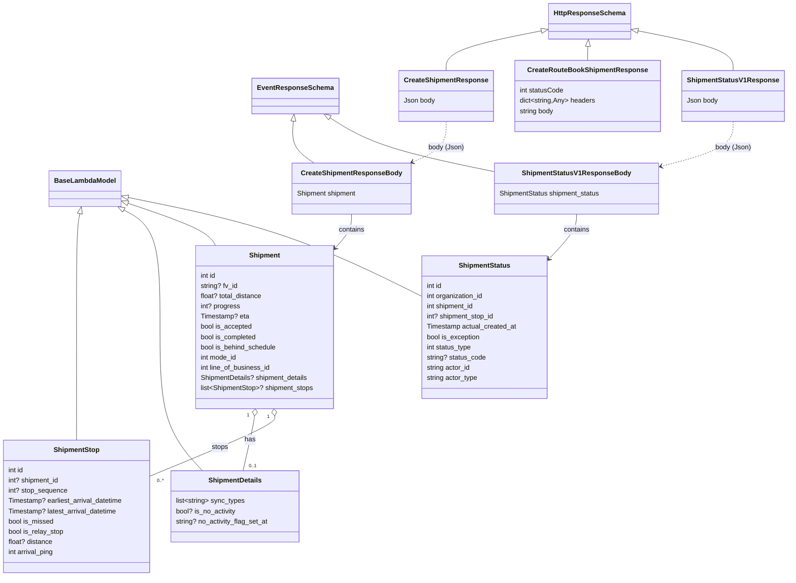

# Diagram: shipment_core/shipment_service/test/models/responses.py

> Auto-generated by Obscura crawlers

## Mermaid

### SVG

<svg id="container" width="1832.365234375" xmlns="http://www.w3.org/2000/svg" class="classDiagram" height="1356" viewBox="0 0 1832.365234375 1356" role="graphics-document document" aria-roledescription="class"><g><defs><marker id="container_class-aggregationStart" class="marker aggregation class" refX="18" refY="7" markerWidth="190" markerHeight="240" orient="auto"><path d="M 18,7 L9,13 L1,7 L9,1 Z"></path></marker></defs><defs><marker id="container_class-aggregationEnd" class="marker aggregation class" refX="1" refY="7" markerWidth="20" markerHeight="28" orient="auto"><path d="M 18,7 L9,13 L1,7 L9,1 Z"></path></marker></defs><defs><marker id="container_class-extensionStart" class="marker extension class" refX="18" refY="7" markerWidth="190" markerHeight="240" orient="auto"><path d="M 1,7 L18,13 V 1 Z"></path></marker></defs><defs><marker id="container_class-extensionEnd" class="marker extension class" refX="1" refY="7" markerWidth="20" markerHeight="28" orient="auto"><path d="M 1,1 V 13 L18,7 Z"></path></marker></defs><defs><marker id="container_class-compositionStart" class="marker composition class" refX="18" refY="7" markerWidth="190" markerHeight="240" orient="auto"><path d="M 18,7 L9,13 L1,7 L9,1 Z"></path></marker></defs><defs><marker id="container_class-compositionEnd" class="marker composition class" refX="1" refY="7" markerWidth="20" markerHeight="28" orient="auto"><path d="M 18,7 L9,13 L1,7 L9,1 Z"></path></marker></defs><defs><marker id="container_class-dependencyStart" class="marker dependency class" refX="6" refY="7" markerWidth="190" markerHeight="240" orient="auto"><path d="M 5,7 L9,13 L1,7 L9,1 Z"></path></marker></defs><defs><marker id="container_class-dependencyEnd" class="marker dependency class" refX="13" refY="7" markerWidth="20" markerHeight="28" orient="auto"><path d="M 18,7 L9,13 L14,7 L9,1 Z"></path></marker></defs><defs><marker id="container_class-lollipopStart" class="marker lollipop class" refX="13" refY="7" markerWidth="190" markerHeight="240" orient="auto"><circle stroke="black" fill="transparent" cx="7" cy="7" r="6"></circle></marker></defs><defs><marker id="container_class-lollipopEnd" class="marker lollipop class" refX="1" refY="7" markerWidth="190" markerHeight="240" orient="auto"><circle stroke="black" fill="transparent" cx="7" cy="7" r="6"></circle></marker></defs><g class="root"><g class="clusters"></g><g class="edgePaths"><path d="M190.646,502.895L189.336,509.246C188.027,515.596,185.408,528.298,184.099,572.816C182.789,617.333,182.789,693.667,182.789,770C182.789,846.333,182.789,922.667,182.789,967C182.789,1011.333,182.789,1023.667,182.789,1029.833L182.789,1036" id="id_BaseLambdaModel_ShipmentStop_1" class="edge-thickness-normal edge-pattern-solid relation" style=";;;" data-edge="true" data-et="edge" data-id="id_BaseLambdaModel_ShipmentStop_1" data-points="W3sieCI6MTk0LjEyOTI2ODY4NTU2NywieSI6NDg2fSx7IngiOjE4Mi43ODkwNjI1LCJ5Ijo1NDF9LHsieCI6MTgyLjc4OTA2MjUsInkiOjc3MH0seyJ4IjoxODIuNzg5MDYyNSwieSI6OTk5fSx7IngiOjE4Mi43ODkwNjI1LCJ5IjoxMDM2fV0=" marker-start="url(#container_class-extensionStart)"></path><path d="M295.085,494.248L309.397,502.04C323.71,509.832,352.334,525.416,366.647,571.375C380.959,617.333,380.959,693.667,380.959,770C380.959,846.333,380.959,922.667,397.73,979C414.5,1035.333,448.042,1071.667,464.813,1089.833L481.583,1108" id="id_BaseLambdaModel_ShipmentDetails_2" class="edge-thickness-normal edge-pattern-solid relation" style=";;;" data-edge="true" data-et="edge" data-id="id_BaseLambdaModel_ShipmentDetails_2" data-points="W3sieCI6Mjc5LjkzNDgwMTg2ODU1NjcsInkiOjQ4Nn0seyJ4IjozODAuOTU4OTg0Mzc1LCJ5Ijo1NDF9LHsieCI6MzgwLjk1ODk4NDM3NSwieSI6NzcwfSx7IngiOjM4MC45NTg5ODQzNzUsInkiOjk5OX0seyJ4Ijo0ODEuNTgzNDQ4MDI0NjExNCwieSI6MTEwOH1d" marker-start="url(#container_class-extensionStart)"></path><path d="M300.337,476.909L331.999,487.591C363.662,498.273,426.986,519.636,462.293,536.485C497.601,553.333,504.891,565.667,508.536,571.833L512.181,578" id="id_BaseLambdaModel_Shipment_3" class="edge-thickness-normal edge-pattern-solid relation" style=";;;" data-edge="true" data-et="edge" data-id="id_BaseLambdaModel_Shipment_3" data-points="W3sieCI6MjgzLjk5MjE4NzUsInkiOjQ3MS4zOTUxODEwNjY2MzIyM30seyJ4Ijo0OTAuMzEwNTQ2ODc1LCJ5Ijo1NDF9LHsieCI6NTEyLjE4MTE1NDQ3NTk4MjYsInkiOjU3OH1d" marker-start="url(#container_class-extensionStart)"></path><path d="M300.898,463.886L364.305,476.739C427.711,489.591,554.523,515.295,668.797,553.831C783.071,592.366,884.806,643.733,935.674,669.416L986.541,695.099" id="id_BaseLambdaModel_ShipmentStatus_4" class="edge-thickness-normal edge-pattern-solid relation" style=";;;" data-edge="true" data-et="edge" data-id="id_BaseLambdaModel_ShipmentStatus_4" data-points="W3sieCI6MjgzLjk5MjE4NzUsInkiOjQ2MC40NTk2MjcxMjYzOTE3NX0seyJ4Ijo2ODEuMzM1OTM3NSwieSI6NTQxfSx7IngiOjk4Ni41NDEwMTU2MjUsInkiOjY5NS4wOTg4Njc4NzkwMjh9XQ==" marker-start="url(#container_class-extensionStart)"></path><path d="M701.083,285.191L700.231,295.493C699.38,305.794,697.677,326.397,705.483,342.865C713.288,359.333,730.602,371.667,739.258,377.833L747.915,384" id="id_EventResponseSchema_CreateShipmentResponseBody_5" class="edge-thickness-normal edge-pattern-solid relation" style=";;;" data-edge="true" data-et="edge" data-id="id_EventResponseSchema_CreateShipmentResponseBody_5" data-points="W3sieCI6NzAyLjUwMzUzNDk5NDgzNDcsInkiOjI2OH0seyJ4Ijo2OTUuOTc0NjA5Mzc1LCJ5IjozNDd9LHsieCI6NzQ3LjkxNDk2ODU4ODkxNzUsInkiOjM4NH1d" marker-start="url(#container_class-extensionStart)"></path><path d="M786.89,277.227L805.258,288.856C823.627,300.485,860.363,323.742,922.336,344.68C984.309,365.618,1071.519,384.236,1115.124,393.545L1158.729,402.854" id="id_EventResponseSchema_ShipmentStatusV1ResponseBody_6" class="edge-thickness-normal edge-pattern-solid relation" style=";;;" data-edge="true" data-et="edge" data-id="id_EventResponseSchema_ShipmentStatusV1ResponseBody_6" data-points="W3sieCI6NzcyLjMxNTUxODQ2NTkwOTEsInkiOjI2OH0seyJ4Ijo4OTcuMDk5NjA5Mzc1LCJ5IjozNDd9LHsieCI6MTE1OC43Mjg1MTU2MjUsInkiOjQwMi44NTQ0NzQwMTkwNTE1N31d" marker-start="url(#container_class-extensionStart)"></path><path d="M1272.827,72.294L1236.33,79.745C1199.832,87.196,1126.837,102.098,1090.339,117.716C1053.842,133.333,1053.842,149.667,1053.842,157.833L1053.842,166" id="id_HttpResponseSchema_CreateShipmentResponse_7" class="edge-thickness-normal edge-pattern-solid relation" style=";;;" data-edge="true" data-et="edge" data-id="id_HttpResponseSchema_CreateShipmentResponse_7" data-points="W3sieCI6MTI4OS43Mjg1MTU2MjUsInkiOjY4Ljg0MzkyNDQ0Mzg2MjU1fSx7IngiOjEwNTMuODQxNzk2ODc1LCJ5IjoxMTd9LHsieCI6MTA1My44NDE3OTY4NzUsInkiOjE2Nn1d" marker-start="url(#container_class-extensionStart)"></path><path d="M1378.48,109.219L1378.403,110.516C1378.325,111.813,1378.169,114.406,1378.091,119.87C1378.014,125.333,1378.014,133.667,1378.014,137.833L1378.014,142" id="id_HttpResponseSchema_CreateRouteBookShipmentResponse_8" class="edge-thickness-normal edge-pattern-solid relation" style=";;;" data-edge="true" data-et="edge" data-id="id_HttpResponseSchema_CreateRouteBookShipmentResponse_8" data-points="W3sieCI6MTM3OS41MTM0OTY5NjgyODM2LCJ5Ijo5Mn0seyJ4IjoxMzc4LjAxMzY3MTg3NSwieSI6MTE3fSx7IngiOjEzNzguMDEzNjcxODc1LCJ5IjoxNDJ9XQ==" marker-start="url(#container_class-extensionStart)"></path><path d="M1491.239,72.294L1527.737,79.745C1564.234,87.196,1637.23,102.098,1673.727,117.716C1710.225,133.333,1710.225,149.667,1710.225,157.833L1710.225,166" id="id_HttpResponseSchema_ShipmentStatusV1Response_9" class="edge-thickness-normal edge-pattern-solid relation" style=";;;" data-edge="true" data-et="edge" data-id="id_HttpResponseSchema_ShipmentStatusV1Response_9" data-points="W3sieCI6MTQ3NC4zMzc4OTA2MjUsInkiOjY4Ljg0MzkyNDQ0Mzg2MjU1fSx7IngiOjE3MTAuMjI0NjA5Mzc1LCJ5IjoxMTd9LHsieCI6MTcxMC4yMjQ2MDkzNzUsInkiOjE2Nn1d" marker-start="url(#container_class-extensionStart)"></path><path d="M601.759,979.138L601.381,982.449C601.002,985.759,600.245,992.379,596.068,1013.856C591.89,1035.333,584.293,1071.667,580.494,1089.833L576.695,1108" id="id_Shipment_ShipmentDetails_10" class="edge-thickness-normal edge-pattern-solid relation" style=";;;" data-edge="true" data-et="edge" data-id="id_Shipment_ShipmentDetails_10" data-points="W3sieCI6NjAzLjcxODgxODIzMTQ0MSwieSI6OTYyfSx7IngiOjU5OS40ODgyODEyNSwieSI6OTk5fSx7IngiOjU3Ni42OTQ2NDQ1OTE5Njg5LCJ5IjoxMTA4fV0=" marker-start="url(#container_class-aggregationStart)"></path><path d="M649.585,979.138L649.963,982.449C650.341,985.759,651.098,992.379,602.431,1015.87C553.763,1039.361,455.671,1079.721,406.624,1099.902L357.578,1120.082" id="id_Shipment_ShipmentStop_11" class="edge-thickness-normal edge-pattern-solid relation" style=";;;" data-edge="true" data-et="edge" data-id="id_Shipment_ShipmentStop_11" data-points="W3sieCI6NjQ3LjYyNDkzMTc2ODU1OSwieSI6OTYyfSx7IngiOjY1MS44NTU0Njg3NSwieSI6OTk5fSx7IngiOjM1Ny41NzgxMjUsInkiOjExMjAuMDgyMDYxMjc1MzA2fV0=" marker-start="url(#container_class-aggregationStart)"></path><path d="M832.143,504L832.143,510.167C832.143,516.333,832.143,528.667,825.684,541.996C819.226,555.326,806.309,569.652,799.851,576.815L793.393,583.978" id="id_CreateShipmentResponseBody_Shipment_12" class="edge-thickness-normal edge-pattern-solid relation" style=";;;" data-edge="true" data-et="edge" data-id="id_CreateShipmentResponseBody_Shipment_12" data-points="W3sieCI6ODMyLjE0MjU3ODEyNSwieSI6NTA0fSx7IngiOjgzMi4xNDI1NzgxMjUsInkiOjU0MX0seyJ4Ijo3ODkuMzc1LCJ5Ijo1ODguNDM0MjEzMzg5MDgxN31d" marker-end="url(#container_class-dependencyEnd)"></path><path d="M1053.842,286L1053.842,296.167C1053.842,306.333,1053.842,326.667,1040.664,342.599C1027.486,358.532,1001.129,370.063,987.951,375.829L974.773,381.595" id="id_CreateShipmentResponse_CreateShipmentResponseBody_13" class="edge-thickness-normal edge-pattern-dashed relation" style=";;;" data-edge="true" data-et="edge" data-id="id_CreateShipmentResponse_CreateShipmentResponseBody_13" data-points="W3sieCI6MTA1My44NDE3OTY4NzUsInkiOjI4Nn0seyJ4IjoxMDUzLjg0MTc5Njg3NSwieSI6MzQ3fSx7IngiOjk2OS4yNzYxMTU0OTYxMzQsInkiOjM4NH1d" marker-end="url(#container_class-dependencyEnd)"></path><path d="M1351.459,504L1351.459,510.167C1351.459,516.333,1351.459,528.667,1340.776,546.13C1330.092,563.593,1308.726,586.186,1298.042,597.482L1287.359,608.779" id="id_ShipmentStatusV1ResponseBody_ShipmentStatus_14" class="edge-thickness-normal edge-pattern-solid relation" style=";;;" data-edge="true" data-et="edge" data-id="id_ShipmentStatusV1ResponseBody_ShipmentStatus_14" data-points="W3sieCI6MTM1MS40NTg5ODQzNzUsInkiOjUwNH0seyJ4IjoxMzUxLjQ1ODk4NDM3NSwieSI6NTQxfSx7IngiOjEyODMuMjM2MzI4MTI1LCJ5Ijo2MTMuMTM4MTgwNDQwODIxMX1d" marker-end="url(#container_class-dependencyEnd)"></path><path d="M1710.225,286L1710.225,296.167C1710.225,306.333,1710.225,326.667,1683.517,344.054C1656.81,361.442,1603.396,375.883,1576.689,383.104L1549.981,390.325" id="id_ShipmentStatusV1Response_ShipmentStatusV1ResponseBody_15" class="edge-thickness-normal edge-pattern-dashed relation" style=";;;" data-edge="true" data-et="edge" data-id="id_ShipmentStatusV1Response_ShipmentStatusV1ResponseBody_15" data-points="W3sieCI6MTcxMC4yMjQ2MDkzNzUsInkiOjI4Nn0seyJ4IjoxNzEwLjIyNDYwOTM3NSwieSI6MzQ3fSx7IngiOjE1NDQuMTg5NDUzMTI1LCJ5IjozOTEuODkxMTc0MTY0ODg4M31d" marker-end="url(#container_class-dependencyEnd)"></path></g><g class="edgeLabels"><g class="edgeLabel"><g class="label" data-id="id_BaseLambdaModel_ShipmentStop_1" transform="translate(0, 0)"><foreignObject width="0" height="0">

</foreignObject></g></g><g class="edgeLabel"><g class="label" data-id="id_BaseLambdaModel_ShipmentDetails_2" transform="translate(0, 0)"><foreignObject width="0" height="0">

</foreignObject></g></g><g class="edgeLabel"><g class="label" data-id="id_BaseLambdaModel_Shipment_3" transform="translate(0, 0)"><foreignObject width="0" height="0">

</foreignObject></g></g><g class="edgeLabel"><g class="label" data-id="id_BaseLambdaModel_ShipmentStatus_4" transform="translate(0, 0)"><foreignObject width="0" height="0">

</foreignObject></g></g><g class="edgeLabel"><g class="label" data-id="id_EventResponseSchema_CreateShipmentResponseBody_5" transform="translate(0, 0)"><foreignObject width="0" height="0">

</foreignObject></g></g><g class="edgeLabel"><g class="label" data-id="id_EventResponseSchema_ShipmentStatusV1ResponseBody_6" transform="translate(0, 0)"><foreignObject width="0" height="0">

</foreignObject></g></g><g class="edgeLabel"><g class="label" data-id="id_HttpResponseSchema_CreateShipmentResponse_7" transform="translate(0, 0)"><foreignObject width="0" height="0">

</foreignObject></g></g><g class="edgeLabel"><g class="label" data-id="id_HttpResponseSchema_CreateRouteBookShipmentResponse_8" transform="translate(0, 0)"><foreignObject width="0" height="0">

</foreignObject></g></g><g class="edgeLabel"><g class="label" data-id="id_HttpResponseSchema_ShipmentStatusV1Response_9" transform="translate(0, 0)"><foreignObject width="0" height="0">

</foreignObject></g></g><g class="edgeLabel" transform="translate(591.90287, 1035.27371)"><g class="label" data-id="id_Shipment_ShipmentDetails_10" transform="translate(-12.703125, -12)"><foreignObject width="25.40625" height="24">

has

</foreignObject></g></g><g class="edgeLabel" transform="translate(521.93667, 1052.45582)"><g class="label" data-id="id_Shipment_ShipmentStop_11" transform="translate(-19.6640625, -12)"><foreignObject width="39.328125" height="24">

stops

</foreignObject></g></g><g class="edgeLabel" transform="translate(832.142578125, 541)"><g class="label" data-id="id_CreateShipmentResponseBody_Shipment_12" transform="translate(-30.890625, -12)"><foreignObject width="61.78125" height="24">

contains

</foreignObject></g></g><g class="edgeLabel" transform="translate(1053.841796875, 347)"><g class="label" data-id="id_CreateShipmentResponse_CreateShipmentResponseBody_13" transform="translate(-41.1484375, -12)"><foreignObject width="82.296875" height="24">

body (Json)

</foreignObject></g></g><g class="edgeLabel" transform="translate(1351.458984375, 541)"><g class="label" data-id="id_ShipmentStatusV1ResponseBody_ShipmentStatus_14" transform="translate(-30.890625, -12)"><foreignObject width="61.78125" height="24">

contains

</foreignObject></g></g><g class="edgeLabel" transform="translate(1710.224609375, 347)"><g class="label" data-id="id_ShipmentStatusV1Response_ShipmentStatusV1ResponseBody_15" transform="translate(-41.1484375, -12)"><foreignObject width="82.296875" height="24">

body (Json)

</foreignObject></g></g><g class="edgeTerminals" transform="translate(586.8279385292428, 977.6827381604364)"><g class="inner" transform="translate(0, 0)"><foreignObject style="width: 9px; height: 12px;">
1
</foreignObject></g></g><g class="edgeTerminals" transform="translate(634.7100102978018, 981.0907018395635)"><g class="inner" transform="translate(0, 0)"><foreignObject style="width: 9px; height: 12px;">
1
</foreignObject></g></g><g class="edgeTerminals" transform="translate(589.9590999295465, 1088.9408517060563)"><g class="inner" transform="translate(0, 0)"></g><foreignObject style="width: 36px; height: 12px;">
0..1
</foreignObject></g><g class="edgeTerminals" transform="translate(374.4693342488327, 1122.2948958019442)"><g class="inner" transform="translate(0, 0)"></g><foreignObject style="width: 36px; height: 12px;">
0..*
</foreignObject></g></g><g class="nodes"><g class="node default" id="classId-BaseLambdaModel-0" transform="translate(202.7890625, 444)"><g class="basic label-container"><path d="M-81.203125 -42 L81.203125 -42 L81.203125 42 L-81.203125 42" stroke="none" stroke-width="0" fill="#ECECFF" style=""></path><path d="M-81.203125 -42 C-23.948949917713776 -42, 33.30522516457245 -42, 81.203125 -42 M-81.203125 -42 C-48.096241986713395 -42, -14.98935897342679 -42, 81.203125 -42 M81.203125 -42 C81.203125 -23.94816508879967, 81.203125 -5.896330177599339, 81.203125 42 M81.203125 -42 C81.203125 -17.750318459086504, 81.203125 6.499363081826992, 81.203125 42 M81.203125 42 C31.960591295768275 42, -17.28194240846345 42, -81.203125 42 M81.203125 42 C27.012261406219892 42, -27.178602187560216 42, -81.203125 42 M-81.203125 42 C-81.203125 12.784171202852463, -81.203125 -16.431657594295075, -81.203125 -42 M-81.203125 42 C-81.203125 22.828715887101257, -81.203125 3.6574317742025144, -81.203125 -42" stroke="#9370DB" stroke-width="1.3" fill="none" stroke-dasharray="0 0" style=""></path></g><g class="annotation-group text" transform="translate(0, -18)"></g><g class="label-group text" transform="translate(-69.203125, -18)"><g class="label" style="font-weight: bolder" transform="translate(0,-12)"><foreignObject width="138.40625" height="24">

BaseLambdaModel

</foreignObject></g></g><g class="members-group text" transform="translate(-69.203125, 30)"></g><g class="methods-group text" transform="translate(-69.203125, 60)"></g><g class="divider" style=""><path d="M-81.203125 6 C-27.167051898233844 6, 26.869021203532313 6, 81.203125 6 M-81.203125 6 C-18.024770749295165 6, 45.15358350140967 6, 81.203125 6" stroke="#9370DB" stroke-width="1.3" fill="none" stroke-dasharray="0 0" style=""></path></g><g class="divider" style=""><path d="M-81.203125 24 C-20.708252614067455 24, 39.78661977186509 24, 81.203125 24 M-81.203125 24 C-40.64261429422171 24, -0.0821035884434167 24, 81.203125 24" stroke="#9370DB" stroke-width="1.3" fill="none" stroke-dasharray="0 0" style=""></path></g></g><g class="node default" id="classId-EventResponseSchema-1" transform="translate(705.974609375, 226)"><g class="basic label-container"><path d="M-96.234375 -42 L96.234375 -42 L96.234375 42 L-96.234375 42" stroke="none" stroke-width="0" fill="#ECECFF" style=""></path><path d="M-96.234375 -42 C-37.59570337273181 -42, 21.042968254536376 -42, 96.234375 -42 M-96.234375 -42 C-23.71429308175567 -42, 48.80578883648866 -42, 96.234375 -42 M96.234375 -42 C96.234375 -17.253514848769964, 96.234375 7.492970302460073, 96.234375 42 M96.234375 -42 C96.234375 -12.480061737483243, 96.234375 17.039876525033513, 96.234375 42 M96.234375 42 C50.43606070104577 42, 4.637746402091537 42, -96.234375 42 M96.234375 42 C52.45953275872912 42, 8.684690517458236 42, -96.234375 42 M-96.234375 42 C-96.234375 20.040143589658225, -96.234375 -1.91971282068355, -96.234375 -42 M-96.234375 42 C-96.234375 23.44214880389103, -96.234375 4.8842976077820595, -96.234375 -42" stroke="#9370DB" stroke-width="1.3" fill="none" stroke-dasharray="0 0" style=""></path></g><g class="annotation-group text" transform="translate(0, -18)"></g><g class="label-group text" transform="translate(-84.234375, -18)"><g class="label" style="font-weight: bolder" transform="translate(0,-12)"><foreignObject width="168.46875" height="24">

EventResponseSchema

</foreignObject></g></g><g class="members-group text" transform="translate(-84.234375, 30)"></g><g class="methods-group text" transform="translate(-84.234375, 60)"></g><g class="divider" style=""><path d="M-96.234375 6 C-57.50538365371052 6, -18.776392307421034 6, 96.234375 6 M-96.234375 6 C-54.93362669557061 6, -13.632878391141219 6, 96.234375 6" stroke="#9370DB" stroke-width="1.3" fill="none" stroke-dasharray="0 0" style=""></path></g><g class="divider" style=""><path d="M-96.234375 24 C-35.919030584002805 24, 24.39631383199439 24, 96.234375 24 M-96.234375 24 C-21.4012043901149 24, 53.4319662197702 24, 96.234375 24" stroke="#9370DB" stroke-width="1.3" fill="none" stroke-dasharray="0 0" style=""></path></g></g><g class="node default" id="classId-HttpResponseSchema-2" transform="translate(1382.033203125, 50)"><g class="basic label-container"><path d="M-92.3046875 -42 L92.3046875 -42 L92.3046875 42 L-92.3046875 42" stroke="none" stroke-width="0" fill="#ECECFF" style=""></path><path d="M-92.3046875 -42 C-38.824392249131186 -42, 14.655903001737627 -42, 92.3046875 -42 M-92.3046875 -42 C-50.99719942904692 -42, -9.689711358093845 -42, 92.3046875 -42 M92.3046875 -42 C92.3046875 -18.17645365862913, 92.3046875 5.647092682741743, 92.3046875 42 M92.3046875 -42 C92.3046875 -15.96606470172759, 92.3046875 10.067870596544822, 92.3046875 42 M92.3046875 42 C32.91970613507599 42, -26.465275229848018 42, -92.3046875 42 M92.3046875 42 C42.07983171719403 42, -8.145024065611935 42, -92.3046875 42 M-92.3046875 42 C-92.3046875 19.1853394074431, -92.3046875 -3.6293211851138025, -92.3046875 -42 M-92.3046875 42 C-92.3046875 12.1852674978783, -92.3046875 -17.6294650042434, -92.3046875 -42" stroke="#9370DB" stroke-width="1.3" fill="none" stroke-dasharray="0 0" style=""></path></g><g class="annotation-group text" transform="translate(0, -18)"></g><g class="label-group text" transform="translate(-80.3046875, -18)"><g class="label" style="font-weight: bolder" transform="translate(0,-12)"><foreignObject width="160.609375" height="24">

HttpResponseSchema

</foreignObject></g></g><g class="members-group text" transform="translate(-80.3046875, 30)"></g><g class="methods-group text" transform="translate(-80.3046875, 60)"></g><g class="divider" style=""><path d="M-92.3046875 6 C-19.11297576536994 6, 54.07873596926012 6, 92.3046875 6 M-92.3046875 6 C-32.17508346293012 6, 27.954520574139764 6, 92.3046875 6" stroke="#9370DB" stroke-width="1.3" fill="none" stroke-dasharray="0 0" style=""></path></g><g class="divider" style=""><path d="M-92.3046875 24 C-25.89347364698368 24, 40.51774020603264 24, 92.3046875 24 M-92.3046875 24 C-38.858109811525196 24, 14.588467876949608 24, 92.3046875 24" stroke="#9370DB" stroke-width="1.3" fill="none" stroke-dasharray="0 0" style=""></path></g></g><g class="node default" id="classId-ShipmentStop-3" transform="translate(182.7890625, 1192)"><g class="basic label-container"><path d="M-174.7890625 -156 L174.7890625 -156 L174.7890625 156 L-174.7890625 156" stroke="none" stroke-width="0" fill="#ECECFF" style=""></path><path d="M-174.7890625 -156 C-87.66432877814331 -156, -0.539595056286629 -156, 174.7890625 -156 M-174.7890625 -156 C-57.823775656126244 -156, 59.14151118774751 -156, 174.7890625 -156 M174.7890625 -156 C174.7890625 -86.52422742649148, 174.7890625 -17.048454852982957, 174.7890625 156 M174.7890625 -156 C174.7890625 -70.06688391789869, 174.7890625 15.866232164202614, 174.7890625 156 M174.7890625 156 C61.710914483158874 156, -51.36723353368225 156, -174.7890625 156 M174.7890625 156 C57.84781194575089 156, -59.09343860849822 156, -174.7890625 156 M-174.7890625 156 C-174.7890625 84.82852608337392, -174.7890625 13.657052166747832, -174.7890625 -156 M-174.7890625 156 C-174.7890625 42.375733980905906, -174.7890625 -71.24853203818819, -174.7890625 -156" stroke="#9370DB" stroke-width="1.3" fill="none" stroke-dasharray="0 0" style=""></path></g><g class="annotation-group text" transform="translate(0, -132)"></g><g class="label-group text" transform="translate(-52.078125, -132)"><g class="label" style="font-weight: bolder" transform="translate(0,-12)"><foreignObject width="104.15625" height="24">

ShipmentStop

</foreignObject></g></g><g class="members-group text" transform="translate(-162.7890625, -84)"><g class="label" style="" transform="translate(0,-12)"><foreignObject width="37.984375" height="24">

int id

</foreignObject></g><g class="label" style="" transform="translate(0,12)"><foreignObject width="121.625" height="24">

int? shipment_id

</foreignObject></g><g class="label" style="" transform="translate(0,36)"><foreignObject width="139.84375" height="24">

int? stop_sequence

</foreignObject></g><g class="label" style="" transform="translate(0,60)"><foreignObject width="273.5" height="24">

Timestamp? earliest_arrival_datetime

</foreignObject></g><g class="label" style="" transform="translate(0,84)"><foreignObject width="259.703125" height="24">

Timestamp? latest_arrival_datetime

</foreignObject></g><g class="label" style="" transform="translate(0,108)"><foreignObject width="108.40625" height="24">

bool is_missed

</foreignObject></g><g class="label" style="" transform="translate(0,132)"><foreignObject width="132.171875" height="24">

bool is_relay_stop

</foreignObject></g><g class="label" style="" transform="translate(0,156)"><foreignObject width="105.515625" height="24">

float? distance

</foreignObject></g><g class="label" style="" transform="translate(0,180)"><foreignObject width="110.359375" height="24">

int arrival_ping

</foreignObject></g></g><g class="methods-group text" transform="translate(-162.7890625, 156)"></g><g class="divider" style=""><path d="M-174.7890625 -108 C-81.80394042919963 -108, 11.181181641600745 -108, 174.7890625 -108 M-174.7890625 -108 C-98.03941588740354 -108, -21.28976927480707 -108, 174.7890625 -108" stroke="#9370DB" stroke-width="1.3" fill="none" stroke-dasharray="0 0" style=""></path></g><g class="divider" style=""><path d="M-174.7890625 132 C-66.78046390127984 132, 41.22813469744031 132, 174.7890625 132 M-174.7890625 132 C-82.85482329131356 132, 9.07941591737287 132, 174.7890625 132" stroke="#9370DB" stroke-width="1.3" fill="none" stroke-dasharray="0 0" style=""></path></g></g><g class="node default" id="classId-ShipmentDetails-4" transform="translate(559.12890625, 1192)"><g class="basic label-container"><path d="M-151.55078125 -84 L151.55078125 -84 L151.55078125 84 L-151.55078125 84" stroke="none" stroke-width="0" fill="#ECECFF" style=""></path><path d="M-151.55078125 -84 C-64.2644665041564 -84, 23.021848241687195 -84, 151.55078125 -84 M-151.55078125 -84 C-70.11229288269423 -84, 11.326195484611532 -84, 151.55078125 -84 M151.55078125 -84 C151.55078125 -32.06181349219106, 151.55078125 19.876373015617887, 151.55078125 84 M151.55078125 -84 C151.55078125 -17.573209045430147, 151.55078125 48.853581909139706, 151.55078125 84 M151.55078125 84 C50.99827742520118 84, -49.55422639959764 84, -151.55078125 84 M151.55078125 84 C66.53344420204388 84, -18.483892845912237 84, -151.55078125 84 M-151.55078125 84 C-151.55078125 41.08994904893883, -151.55078125 -1.820101902122346, -151.55078125 -84 M-151.55078125 84 C-151.55078125 49.86617948431885, -151.55078125 15.732358968637698, -151.55078125 -84" stroke="#9370DB" stroke-width="1.3" fill="none" stroke-dasharray="0 0" style=""></path></g><g class="annotation-group text" transform="translate(0, -60)"></g><g class="label-group text" transform="translate(-60.6015625, -60)"><g class="label" style="font-weight: bolder" transform="translate(0,-12)"><foreignObject width="121.203125" height="24">

ShipmentDetails

</foreignObject></g></g><g class="members-group text" transform="translate(-139.55078125, -12)"><g class="label" style="" transform="translate(0,-12)"><foreignObject width="163.6875" height="24">

list&lt;string&gt; sync_types

</foreignObject></g><g class="label" style="" transform="translate(0,12)"><foreignObject width="143.203125" height="24">

bool? is_no_activity

</foreignObject></g><g class="label" style="" transform="translate(0,36)"><foreignObject width="218.5" height="24">

string? no_activity_flag_set_at

</foreignObject></g></g><g class="methods-group text" transform="translate(-139.55078125, 84)"></g><g class="divider" style=""><path d="M-151.55078125 -36 C-90.74935883194803 -36, -29.94793641389606 -36, 151.55078125 -36 M-151.55078125 -36 C-77.38799675732149 -36, -3.225212264642977 -36, 151.55078125 -36" stroke="#9370DB" stroke-width="1.3" fill="none" stroke-dasharray="0 0" style=""></path></g><g class="divider" style=""><path d="M-151.55078125 60 C-42.74662022685938 60, 66.05754079628124 60, 151.55078125 60 M-151.55078125 60 C-55.114836769774925 60, 41.32110771045015 60, 151.55078125 60" stroke="#9370DB" stroke-width="1.3" fill="none" stroke-dasharray="0 0" style=""></path></g></g><g class="node default" id="classId-Shipment-5" transform="translate(625.671875, 770)"><g class="basic label-container"><path d="M-163.703125 -192 L163.703125 -192 L163.703125 192 L-163.703125 192" stroke="none" stroke-width="0" fill="#ECECFF" style=""></path><path d="M-163.703125 -192 C-94.73018696566129 -192, -25.75724893132258 -192, 163.703125 -192 M-163.703125 -192 C-72.27182357742349 -192, 19.15947784515302 -192, 163.703125 -192 M163.703125 -192 C163.703125 -58.42204810185018, 163.703125 75.15590379629964, 163.703125 192 M163.703125 -192 C163.703125 -52.152421924069586, 163.703125 87.69515615186083, 163.703125 192 M163.703125 192 C72.47937624643929 192, -18.744372507121426 192, -163.703125 192 M163.703125 192 C88.35200998016309 192, 13.000894960326178 192, -163.703125 192 M-163.703125 192 C-163.703125 112.31933611053998, -163.703125 32.63867222107996, -163.703125 -192 M-163.703125 192 C-163.703125 46.33596433595909, -163.703125 -99.32807132808182, -163.703125 -192" stroke="#9370DB" stroke-width="1.3" fill="none" stroke-dasharray="0 0" style=""></path></g><g class="annotation-group text" transform="translate(0, -168)"></g><g class="label-group text" transform="translate(-35.109375, -168)"><g class="label" style="font-weight: bolder" transform="translate(0,-12)"><foreignObject width="70.21875" height="24">

Shipment

</foreignObject></g></g><g class="members-group text" transform="translate(-151.703125, -120)"><g class="label" style="" transform="translate(0,-12)"><foreignObject width="37.984375" height="24">

int id

</foreignObject></g><g class="label" style="" transform="translate(0,12)"><foreignObject width="88.0625" height="24">

string? fv_id

</foreignObject></g><g class="label" style="" transform="translate(0,36)"><foreignObject width="147.28125" height="24">

float? total_distance

</foreignObject></g><g class="label" style="" transform="translate(0,60)"><foreignObject width="92.84375" height="24">

int? progress

</foreignObject></g><g class="label" style="" transform="translate(0,84)"><foreignObject width="114.3125" height="24">

Timestamp? eta

</foreignObject></g><g class="label" style="" transform="translate(0,108)"><foreignObject width="122.203125" height="24">

bool is_accepted

</foreignObject></g><g class="label" style="" transform="translate(0,132)"><foreignObject width="133.828125" height="24">

bool is_completed

</foreignObject></g><g class="label" style="" transform="translate(0,156)"><foreignObject width="181.90625" height="24">

bool is_behind_schedule

</foreignObject></g><g class="label" style="" transform="translate(0,180)"><foreignObject width="87.34375" height="24">

int mode_id

</foreignObject></g><g class="label" style="" transform="translate(0,204)"><foreignObject width="167.1875" height="24">

int line_of_business_id

</foreignObject></g><g class="label" style="" transform="translate(0,228)"><foreignObject width="256.640625" height="24">

ShipmentDetails? shipment_details

</foreignObject></g><g class="label" style="" transform="translate(0,252)"><foreignObject width="268.296875" height="24">

list&lt;ShipmentStop&gt;? shipment_stops

</foreignObject></g></g><g class="methods-group text" transform="translate(-151.703125, 192)"></g><g class="divider" style=""><path d="M-163.703125 -144 C-70.4105692027481 -144, 22.881986594503786 -144, 163.703125 -144 M-163.703125 -144 C-59.39028001120825 -144, 44.922564977583505 -144, 163.703125 -144" stroke="#9370DB" stroke-width="1.3" fill="none" stroke-dasharray="0 0" style=""></path></g><g class="divider" style=""><path d="M-163.703125 168 C-78.50966470640154 168, 6.683795587196926 168, 163.703125 168 M-163.703125 168 C-82.66209131598228 168, -1.621057631964561 168, 163.703125 168" stroke="#9370DB" stroke-width="1.3" fill="none" stroke-dasharray="0 0" style=""></path></g></g><g class="node default" id="classId-ShipmentStatus-6" transform="translate(1134.888671875, 770)"><g class="basic label-container"><path d="M-148.34765625 -168 L148.34765625 -168 L148.34765625 168 L-148.34765625 168" stroke="none" stroke-width="0" fill="#ECECFF" style=""></path><path d="M-148.34765625 -168 C-37.66766538923737 -168, 73.01232547152526 -168, 148.34765625 -168 M-148.34765625 -168 C-38.73124914482709 -168, 70.88515796034582 -168, 148.34765625 -168 M148.34765625 -168 C148.34765625 -89.8863909020257, 148.34765625 -11.772781804051391, 148.34765625 168 M148.34765625 -168 C148.34765625 -75.24704420009991, 148.34765625 17.505911599800186, 148.34765625 168 M148.34765625 168 C33.08620657055954 168, -82.17524310888092 168, -148.34765625 168 M148.34765625 168 C47.85211324168675 168, -52.6434297666265 168, -148.34765625 168 M-148.34765625 168 C-148.34765625 58.83268141493514, -148.34765625 -50.334637170129724, -148.34765625 -168 M-148.34765625 168 C-148.34765625 55.436298562504916, -148.34765625 -57.12740287499017, -148.34765625 -168" stroke="#9370DB" stroke-width="1.3" fill="none" stroke-dasharray="0 0" style=""></path></g><g class="annotation-group text" transform="translate(0, -144)"></g><g class="label-group text" transform="translate(-58.5859375, -144)"><g class="label" style="font-weight: bolder" transform="translate(0,-12)"><foreignObject width="117.171875" height="24">

ShipmentStatus

</foreignObject></g></g><g class="members-group text" transform="translate(-136.34765625, -96)"><g class="label" style="" transform="translate(0,-12)"><foreignObject width="37.984375" height="24">

int id

</foreignObject></g><g class="label" style="" transform="translate(0,12)"><foreignObject width="136.671875" height="24">

int organization_id

</foreignObject></g><g class="label" style="" transform="translate(0,36)"><foreignObject width="114.765625" height="24">

int shipment_id

</foreignObject></g><g class="label" style="" transform="translate(0,60)"><foreignObject width="161.484375" height="24">

int? shipment_stop_id

</foreignObject></g><g class="label" style="" transform="translate(0,84)"><foreignObject width="214.109375" height="24">

Timestamp actual_created_at

</foreignObject></g><g class="label" style="" transform="translate(0,108)"><foreignObject width="127.546875" height="24">

bool is_exception

</foreignObject></g><g class="label" style="" transform="translate(0,132)"><foreignObject width="107.78125" height="24">

int status_type

</foreignObject></g><g class="label" style="" transform="translate(0,156)"><foreignObject width="139.9375" height="24">

string? status_code

</foreignObject></g><g class="label" style="" transform="translate(0,180)"><foreignObject width="104.40625" height="24">

string actor_id

</foreignObject></g><g class="label" style="" transform="translate(0,204)"><foreignObject width="121.796875" height="24">

string actor_type

</foreignObject></g></g><g class="methods-group text" transform="translate(-136.34765625, 168)"></g><g class="divider" style=""><path d="M-148.34765625 -120 C-87.74184225909977 -120, -27.136028268199524 -120, 148.34765625 -120 M-148.34765625 -120 C-50.911817152638235 -120, 46.52402194472353 -120, 148.34765625 -120" stroke="#9370DB" stroke-width="1.3" fill="none" stroke-dasharray="0 0" style=""></path></g><g class="divider" style=""><path d="M-148.34765625 144 C-40.37807482505835 144, 67.5915065998833 144, 148.34765625 144 M-148.34765625 144 C-61.03172579080196 144, 26.284204668396086 144, 148.34765625 144" stroke="#9370DB" stroke-width="1.3" fill="none" stroke-dasharray="0 0" style=""></path></g></g><g class="node default" id="classId-CreateShipmentResponseBody-7" transform="translate(832.142578125, 444)"><g class="basic label-container"><path d="M-139.51953125 -60 L139.51953125 -60 L139.51953125 60 L-139.51953125 60" stroke="none" stroke-width="0" fill="#ECECFF" style=""></path><path d="M-139.51953125 -60 C-29.919060550813526 -60, 79.68141014837295 -60, 139.51953125 -60 M-139.51953125 -60 C-60.859816606821894 -60, 17.79989803635621 -60, 139.51953125 -60 M139.51953125 -60 C139.51953125 -22.20155275199877, 139.51953125 15.596894496002463, 139.51953125 60 M139.51953125 -60 C139.51953125 -23.1773735484324, 139.51953125 13.645252903135201, 139.51953125 60 M139.51953125 60 C41.90018262984489 60, -55.719165990310216 60, -139.51953125 60 M139.51953125 60 C37.21556198337733 60, -65.08840728324535 60, -139.51953125 60 M-139.51953125 60 C-139.51953125 31.179726532532477, -139.51953125 2.3594530650649546, -139.51953125 -60 M-139.51953125 60 C-139.51953125 33.27581762828324, -139.51953125 6.551635256566485, -139.51953125 -60" stroke="#9370DB" stroke-width="1.3" fill="none" stroke-dasharray="0 0" style=""></path></g><g class="annotation-group text" transform="translate(0, -36)"></g><g class="label-group text" transform="translate(-112.6484375, -36)"><g class="label" style="font-weight: bolder" transform="translate(0,-12)"><foreignObject width="225.296875" height="24">

CreateShipmentResponseBody

</foreignObject></g></g><g class="members-group text" transform="translate(-127.51953125, 12)"><g class="label" style="" transform="translate(0,-12)"><foreignObject width="142.390625" height="24">

Shipment shipment

</foreignObject></g></g><g class="methods-group text" transform="translate(-127.51953125, 60)"></g><g class="divider" style=""><path d="M-139.51953125 -12 C-38.37244645992618 -12, 62.77463833014764 -12, 139.51953125 -12 M-139.51953125 -12 C-70.34378951903136 -12, -1.1680477880627222 -12, 139.51953125 -12" stroke="#9370DB" stroke-width="1.3" fill="none" stroke-dasharray="0 0" style=""></path></g><g class="divider" style=""><path d="M-139.51953125 36 C-81.88922129606496 36, -24.258911342129906 36, 139.51953125 36 M-139.51953125 36 C-64.3078712131758 36, 10.903788823648398 36, 139.51953125 36" stroke="#9370DB" stroke-width="1.3" fill="none" stroke-dasharray="0 0" style=""></path></g></g><g class="node default" id="classId-ShipmentStatusV1ResponseBody-8" transform="translate(1351.458984375, 444)"><g class="basic label-container"><path d="M-192.73046875 -60 L192.73046875 -60 L192.73046875 60 L-192.73046875 60" stroke="none" stroke-width="0" fill="#ECECFF" style=""></path><path d="M-192.73046875 -60 C-62.33247515243099 -60, 68.06551844513803 -60, 192.73046875 -60 M-192.73046875 -60 C-99.63473862280553 -60, -6.539008495611057 -60, 192.73046875 -60 M192.73046875 -60 C192.73046875 -17.56956135899061, 192.73046875 24.860877282018777, 192.73046875 60 M192.73046875 -60 C192.73046875 -17.022435416267186, 192.73046875 25.95512916746563, 192.73046875 60 M192.73046875 60 C80.58691193854574 60, -31.55664487290852 60, -192.73046875 60 M192.73046875 60 C57.40552319536917 60, -77.91942235926166 60, -192.73046875 60 M-192.73046875 60 C-192.73046875 29.744551199958483, -192.73046875 -0.5108976000830339, -192.73046875 -60 M-192.73046875 60 C-192.73046875 28.887459627581478, -192.73046875 -2.2250807448370438, -192.73046875 -60" stroke="#9370DB" stroke-width="1.3" fill="none" stroke-dasharray="0 0" style=""></path></g><g class="annotation-group text" transform="translate(0, -36)"></g><g class="label-group text" transform="translate(-120.6953125, -36)"><g class="label" style="font-weight: bolder" transform="translate(0,-12)"><foreignObject width="241.390625" height="24">

ShipmentStatusV1ResponseBody

</foreignObject></g></g><g class="members-group text" transform="translate(-180.73046875, 12)"><g class="label" style="" transform="translate(0,-12)"><foreignObject width="240.765625" height="24">

ShipmentStatus shipment_status

</foreignObject></g></g><g class="methods-group text" transform="translate(-180.73046875, 60)"></g><g class="divider" style=""><path d="M-192.73046875 -12 C-60.210438057984334 -12, 72.30959263403133 -12, 192.73046875 -12 M-192.73046875 -12 C-94.07541976215101 -12, 4.579629225697971 -12, 192.73046875 -12" stroke="#9370DB" stroke-width="1.3" fill="none" stroke-dasharray="0 0" style=""></path></g><g class="divider" style=""><path d="M-192.73046875 36 C-114.05122620688485 36, -35.3719836637697 36, 192.73046875 36 M-192.73046875 36 C-102.81709306450776 36, -12.903717379015518 36, 192.73046875 36" stroke="#9370DB" stroke-width="1.3" fill="none" stroke-dasharray="0 0" style=""></path></g></g><g class="node default" id="classId-CreateShipmentResponse-9" transform="translate(1053.841796875, 226)"><g class="basic label-container"><path d="M-106.1015625 -60 L106.1015625 -60 L106.1015625 60 L-106.1015625 60" stroke="none" stroke-width="0" fill="#ECECFF" style=""></path><path d="M-106.1015625 -60 C-61.502321499332275 -60, -16.90308049866455 -60, 106.1015625 -60 M-106.1015625 -60 C-49.51405726529046 -60, 7.073447969419078 -60, 106.1015625 -60 M106.1015625 -60 C106.1015625 -31.49888561559652, 106.1015625 -2.997771231193042, 106.1015625 60 M106.1015625 -60 C106.1015625 -26.217186914730064, 106.1015625 7.565626170539872, 106.1015625 60 M106.1015625 60 C40.740981852294695 60, -24.61959879541061 60, -106.1015625 60 M106.1015625 60 C38.07756021298519 60, -29.94644207402962 60, -106.1015625 60 M-106.1015625 60 C-106.1015625 13.08348853105526, -106.1015625 -33.83302293788948, -106.1015625 -60 M-106.1015625 60 C-106.1015625 14.789200291556128, -106.1015625 -30.421599416887744, -106.1015625 -60" stroke="#9370DB" stroke-width="1.3" fill="none" stroke-dasharray="0 0" style=""></path></g><g class="annotation-group text" transform="translate(0, -36)"></g><g class="label-group text" transform="translate(-94.1015625, -36)"><g class="label" style="font-weight: bolder" transform="translate(0,-12)"><foreignObject width="188.203125" height="24">

CreateShipmentResponse

</foreignObject></g></g><g class="members-group text" transform="translate(-94.1015625, 12)"><g class="label" style="" transform="translate(0,-12)"><foreignObject width="71.609375" height="24">

Json body

</foreignObject></g></g><g class="methods-group text" transform="translate(-94.1015625, 60)"></g><g class="divider" style=""><path d="M-106.1015625 -12 C-48.69019085682687 -12, 8.721180786346267 -12, 106.1015625 -12 M-106.1015625 -12 C-35.4591727667534 -12, 35.183216966493205 -12, 106.1015625 -12" stroke="#9370DB" stroke-width="1.3" fill="none" stroke-dasharray="0 0" style=""></path></g><g class="divider" style=""><path d="M-106.1015625 36 C-22.069056341569635 36, 61.96344981686073 36, 106.1015625 36 M-106.1015625 36 C-38.252966653111756 36, 29.59562919377649 36, 106.1015625 36" stroke="#9370DB" stroke-width="1.3" fill="none" stroke-dasharray="0 0" style=""></path></g></g><g class="node default" id="classId-CreateRouteBookShipmentResponse-10" transform="translate(1378.013671875, 226)"><g class="basic label-container"><path d="M-168.0703125 -84 L168.0703125 -84 L168.0703125 84 L-168.0703125 84" stroke="none" stroke-width="0" fill="#ECECFF" style=""></path><path d="M-168.0703125 -84 C-95.31620367125605 -84, -22.562094842512096 -84, 168.0703125 -84 M-168.0703125 -84 C-71.93449621058582 -84, 24.20132007882836 -84, 168.0703125 -84 M168.0703125 -84 C168.0703125 -21.685915283062002, 168.0703125 40.628169433875996, 168.0703125 84 M168.0703125 -84 C168.0703125 -45.35862494711037, 168.0703125 -6.717249894220743, 168.0703125 84 M168.0703125 84 C98.1365575108468 84, 28.2028025216936 84, -168.0703125 84 M168.0703125 84 C60.94225159238894 84, -46.185809315222116 84, -168.0703125 84 M-168.0703125 84 C-168.0703125 19.937436170960112, -168.0703125 -44.125127658079776, -168.0703125 -84 M-168.0703125 84 C-168.0703125 45.76856470247158, -168.0703125 7.537129404943158, -168.0703125 -84" stroke="#9370DB" stroke-width="1.3" fill="none" stroke-dasharray="0 0" style=""></path></g><g class="annotation-group text" transform="translate(0, -60)"></g><g class="label-group text" transform="translate(-134.21875, -60)"><g class="label" style="font-weight: bolder" transform="translate(0,-12)"><foreignObject width="268.4375" height="24">

CreateRouteBookShipmentResponse

</foreignObject></g></g><g class="members-group text" transform="translate(-156.0703125, -12)"><g class="label" style="" transform="translate(0,-12)"><foreignObject width="104.578125" height="24">

int statusCode

</foreignObject></g><g class="label" style="" transform="translate(0,12)"><foreignObject width="177.921875" height="24">

dict&lt;string,Any&gt; headers

</foreignObject></g><g class="label" style="" transform="translate(0,36)"><foreignObject width="82.171875" height="24">

string body

</foreignObject></g></g><g class="methods-group text" transform="translate(-156.0703125, 84)"></g><g class="divider" style=""><path d="M-168.0703125 -36 C-85.98951310275648 -36, -3.9087137055129517 -36, 168.0703125 -36 M-168.0703125 -36 C-69.54020888838653 -36, 28.98989472322694 -36, 168.0703125 -36" stroke="#9370DB" stroke-width="1.3" fill="none" stroke-dasharray="0 0" style=""></path></g><g class="divider" style=""><path d="M-168.0703125 60 C-70.12047563673119 60, 27.82936122653763 60, 168.0703125 60 M-168.0703125 60 C-66.16802678918357 60, 35.73425892163286 60, 168.0703125 60" stroke="#9370DB" stroke-width="1.3" fill="none" stroke-dasharray="0 0" style=""></path></g></g><g class="node default" id="classId-ShipmentStatusV1Response-11" transform="translate(1710.224609375, 226)"><g class="basic label-container"><path d="M-114.140625 -60 L114.140625 -60 L114.140625 60 L-114.140625 60" stroke="none" stroke-width="0" fill="#ECECFF" style=""></path><path d="M-114.140625 -60 C-61.077810733800234 -60, -8.014996467600469 -60, 114.140625 -60 M-114.140625 -60 C-42.89722906161208 -60, 28.34616687677584 -60, 114.140625 -60 M114.140625 -60 C114.140625 -30.286938172999566, 114.140625 -0.5738763459991318, 114.140625 60 M114.140625 -60 C114.140625 -13.823077555098564, 114.140625 32.35384488980287, 114.140625 60 M114.140625 60 C42.96727963148753 60, -28.206065737024943 60, -114.140625 60 M114.140625 60 C63.40906450979188 60, 12.677504019583765 60, -114.140625 60 M-114.140625 60 C-114.140625 30.905185790760882, -114.140625 1.810371581521764, -114.140625 -60 M-114.140625 60 C-114.140625 24.218321118844877, -114.140625 -11.563357762310247, -114.140625 -60" stroke="#9370DB" stroke-width="1.3" fill="none" stroke-dasharray="0 0" style=""></path></g><g class="annotation-group text" transform="translate(0, -36)"></g><g class="label-group text" transform="translate(-102.140625, -36)"><g class="label" style="font-weight: bolder" transform="translate(0,-12)"><foreignObject width="204.28125" height="24">

ShipmentStatusV1Response

</foreignObject></g></g><g class="members-group text" transform="translate(-102.140625, 12)"><g class="label" style="" transform="translate(0,-12)"><foreignObject width="71.609375" height="24">

Json body

</foreignObject></g></g><g class="methods-group text" transform="translate(-102.140625, 60)"></g><g class="divider" style=""><path d="M-114.140625 -12 C-24.581938520964542 -12, 64.97674795807092 -12, 114.140625 -12 M-114.140625 -12 C-53.90879561982775 -12, 6.323033760344501 -12, 114.140625 -12" stroke="#9370DB" stroke-width="1.3" fill="none" stroke-dasharray="0 0" style=""></path></g><g class="divider" style=""><path d="M-114.140625 36 C-29.050795936396085 36, 56.03903312720783 36, 114.140625 36 M-114.140625 36 C-65.59927248860635 36, -17.05791997721269 36, 114.140625 36" stroke="#9370DB" stroke-width="1.3" fill="none" stroke-dasharray="0 0" style=""></path></g></g></g></g></g></svg>
