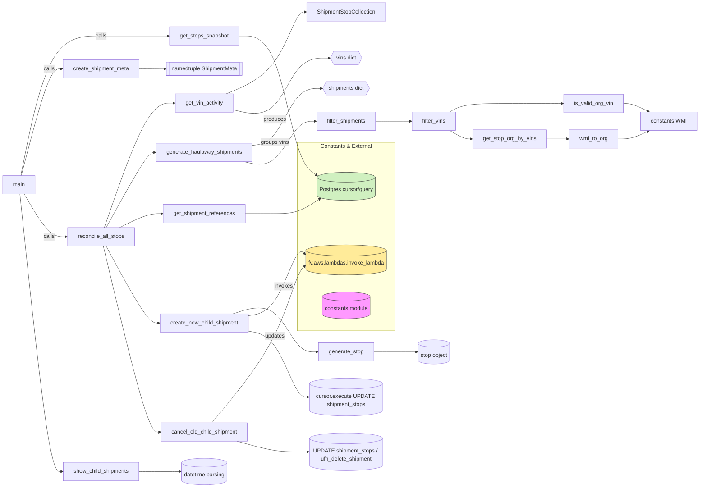

# Diagram: shipment_core/shipment_service/test/test_child_shipment_stop.py

> Auto-generated by Obscura crawlers

## Mermaid

### SVG

<svg id="container" width="2063.78125" xmlns="http://www.w3.org/2000/svg" class="flowchart" height="1430.17626953125" viewBox="0 0 2063.78125 1430.17626953125" role="graphics-document document" aria-roledescription="flowchart-v2"><g><marker id="container_flowchart-v2-pointEnd" class="marker flowchart-v2" viewBox="0 0 10 10" refX="5" refY="5" markerUnits="userSpaceOnUse" markerWidth="8" markerHeight="8" orient="auto"><path d="M 0 0 L 10 5 L 0 10 z" class="arrowMarkerPath" style="stroke-width: 1; stroke-dasharray: 1, 0;"></path></marker><marker id="container_flowchart-v2-pointStart" class="marker flowchart-v2" viewBox="0 0 10 10" refX="4.5" refY="5" markerUnits="userSpaceOnUse" markerWidth="8" markerHeight="8" orient="auto"><path d="M 0 5 L 10 10 L 10 0 z" class="arrowMarkerPath" style="stroke-width: 1; stroke-dasharray: 1, 0;"></path></marker><marker id="container_flowchart-v2-circleEnd" class="marker flowchart-v2" viewBox="0 0 10 10" refX="11" refY="5" markerUnits="userSpaceOnUse" markerWidth="11" markerHeight="11" orient="auto"><circle cx="5" cy="5" r="5" class="arrowMarkerPath" style="stroke-width: 1; stroke-dasharray: 1, 0;"></circle></marker><marker id="container_flowchart-v2-circleStart" class="marker flowchart-v2" viewBox="0 0 10 10" refX="-1" refY="5" markerUnits="userSpaceOnUse" markerWidth="11" markerHeight="11" orient="auto"><circle cx="5" cy="5" r="5" class="arrowMarkerPath" style="stroke-width: 1; stroke-dasharray: 1, 0;"></circle></marker><marker id="container_flowchart-v2-crossEnd" class="marker cross flowchart-v2" viewBox="0 0 11 11" refX="12" refY="5.2" markerUnits="userSpaceOnUse" markerWidth="11" markerHeight="11" orient="auto"><path d="M 1,1 l 9,9 M 10,1 l -9,9" class="arrowMarkerPath" style="stroke-width: 2; stroke-dasharray: 1, 0;"></path></marker><marker id="container_flowchart-v2-crossStart" class="marker cross flowchart-v2" viewBox="0 0 11 11" refX="-1" refY="5.2" markerUnits="userSpaceOnUse" markerWidth="11" markerHeight="11" orient="auto"><path d="M 1,1 l 9,9 M 10,1 l -9,9" class="arrowMarkerPath" style="stroke-width: 2; stroke-dasharray: 1, 0;"></path></marker><g class="root"><g class="clusters"><g class="cluster" id="subGraph0" data-look="classic"><rect style="" x="880.234375" y="417.25" width="289.140625" height="553.0055389404297"></rect><g class="cluster-label" transform="translate(949.1328125, 417.25)"><foreignObject width="151.34375" height="24">

Constants &amp; External

</foreignObject></g></g></g><g class="edgePaths"><path d="M61.697,514.852L75.707,446.575C89.717,378.298,117.737,241.744,157.525,173.466C197.313,105.189,248.867,105.189,297.681,105.189C346.495,105.189,392.568,105.189,425.624,105.189C458.68,105.189,478.719,105.189,488.738,105.189L498.758,105.189" id="L_main_get_stops_snapshot_0" class="edge-thickness-normal edge-pattern-solid edge-thickness-normal edge-pattern-solid flowchart-link" style=";" data-edge="true" data-et="edge" data-id="L_main_get_stops_snapshot_0" data-points="W3sieCI6NjEuNjk2NTQ2MzEyNzY1MzE0LCJ5Ijo1MTQuODUyMTgwNDgwOTU3fSx7IngiOjE0NS43NTc4MTI1LCJ5IjoxMDUuMTg5MjIwNDI4NDY2OH0seyJ4IjozMDAuNDIxODc1LCJ5IjoxMDUuMTg5MjIwNDI4NDY2OH0seyJ4Ijo0MzguNjQwNjI1LCJ5IjoxMDUuMTg5MjIwNDI4NDY2OH0seyJ4Ijo1MDIuNzU3ODEyNSwieSI6MTA1LjE4OTIyMDQyODQ2Njh9XQ==" marker-end="url(#container_flowchart-v2-pointEnd)"></path><path d="M63.268,514.852L77.017,462.658C90.765,410.465,118.261,306.077,138.25,253.883C158.24,201.689,170.721,201.689,176.962,201.689L183.203,201.689" id="L_main_create_shipment_meta_0" class="edge-thickness-normal edge-pattern-solid edge-thickness-normal edge-pattern-solid flowchart-link" style=";" data-edge="true" data-et="edge" data-id="L_main_create_shipment_meta_0" data-points="W3sieCI6NjMuMjY4MjU5NDUzMTM1OSwieSI6NTE0Ljg1MjE4MDQ4MDk1N30seyJ4IjoxNDUuNzU3ODEyNSwieSI6MjAxLjY4OTIyMDQyODQ2Njh9LHsieCI6MTg3LjIwMzEyNSwieSI6MjAxLjY4OTIyMDQyODQ2Njh9XQ==" marker-end="url(#container_flowchart-v2-pointEnd)"></path><path d="M72.046,568.852L84.331,589.727C96.617,610.602,121.187,652.352,141.983,673.227C162.779,694.102,179.799,694.102,188.31,694.102L196.82,694.102" id="L_main_reconcile_all_stops_0" class="edge-thickness-normal edge-pattern-solid edge-thickness-normal edge-pattern-solid flowchart-link" style=";" data-edge="true" data-et="edge" data-id="L_main_reconcile_all_stops_0" data-points="W3sieCI6NzIuMDQ2MTgyMjY2MDA5ODUsInkiOjU2OC44NTIxODA0ODA5NTd9LHsieCI6MTQ1Ljc1NzgxMjUsInkiOjY5NC4xMDIxODA0ODA5NTd9LHsieCI6MjAwLjgyMDMxMjUsInkiOjY5NC4xMDIxODA0ODA5NTd9XQ==" marker-end="url(#container_flowchart-v2-pointEnd)"></path><path d="M707.992,105.189L725.605,105.189C743.219,105.189,778.445,105.189,807.152,166.895C835.859,228.602,858.047,352.014,878.569,420.062C899.09,488.11,917.946,500.794,927.374,507.136L936.802,513.477" id="L_get_stops_snapshot_db_0" class="edge-thickness-normal edge-pattern-solid edge-thickness-normal edge-pattern-solid flowchart-link" style=";" data-edge="true" data-et="edge" data-id="L_get_stops_snapshot_db_0" data-points="W3sieCI6NzA3Ljk5MjE4NzUsInkiOjEwNS4xODkyMjA0Mjg0NjY4fSx7IngiOjgxMy42NzE4NzUsInkiOjEwNS4xODkyMjA0Mjg0NjY4fSx7IngiOjg4MC4yMzQzNzUsInkiOjQ3NS40MjYwOTAyNDA0Nzg1fSx7IngiOjk0MC4xMjA4ODEzNjA1ODM2LCJ5Ijo1MTUuNzA5OTgyOTEzODQ4fV0=" marker-end="url(#container_flowchart-v2-pointEnd)"></path><path d="M413.641,201.689L417.807,201.689C421.974,201.689,430.307,201.689,442.639,201.766C454.971,201.843,471.302,201.997,479.468,202.074L487.633,202.151" id="L_create_shipment_meta_ShipmentMeta_0" class="edge-thickness-normal edge-pattern-solid edge-thickness-normal edge-pattern-solid flowchart-link" style=";" data-edge="true" data-et="edge" data-id="L_create_shipment_meta_ShipmentMeta_0" data-points="W3sieCI6NDEzLjY0MDYyNSwieSI6MjAxLjY4OTIyMDQyODQ2Njh9LHsieCI6NDM4LjY0MDYyNSwieSI6MjAxLjY4OTIyMDQyODQ2Njh9LHsieCI6NDkxLjYzMjgxMjUsInkiOjIwMi4xODkyMjA0Mjg0NjY4fV0=" marker-end="url(#container_flowchart-v2-pointEnd)"></path><path d="M309.938,667.102L331.389,606.242C352.839,545.381,395.74,423.66,429.915,362.8C464.091,301.939,489.542,301.939,502.267,301.939L514.992,301.939" id="L_reconcile_all_stops_get_vin_activity_0" class="edge-thickness-normal edge-pattern-solid edge-thickness-normal edge-pattern-solid flowchart-link" style=";" data-edge="true" data-et="edge" data-id="L_reconcile_all_stops_get_vin_activity_0" data-points="W3sieCI6MzA5LjkzODA4Nzk3ODE0NjksInkiOjY2Ny4xMDIxODA0ODA5NTd9LHsieCI6NDM4LjY0MDYyNSwieSI6MzAxLjkzOTIyMDQyODQ2Njh9LHsieCI6NTE4Ljk5MjE4NzUsInkiOjMwMS45MzkyMjA0Mjg0NjY4fV0=" marker-end="url(#container_flowchart-v2-pointEnd)"></path><path d="M315.506,667.102L336.028,630.367C356.551,593.631,397.596,520.16,421.618,483.425C445.641,446.689,452.641,446.689,456.141,446.689L459.641,446.689" id="L_reconcile_all_stops_generate_haulaway_shipments_0" class="edge-thickness-normal edge-pattern-solid edge-thickness-normal edge-pattern-solid flowchart-link" style=";" data-edge="true" data-et="edge" data-id="L_reconcile_all_stops_generate_haulaway_shipments_0" data-points="W3sieCI6MzE1LjUwNTU4ODY3OTM4MTQ1LCJ5Ijo2NjcuMTAyMTgwNDgwOTU3fSx7IngiOjQzOC42NDA2MjUsInkiOjQ0Ni42ODkyMjA0Mjg0NjY4fSx7IngiOjQ2My42NDA2MjUsInkiOjQ0Ni42ODkyMjA0Mjg0NjY4fV0=" marker-end="url(#container_flowchart-v2-pointEnd)"></path><path d="M355.313,667.102L369.201,660.271C383.089,653.44,410.865,639.778,431.6,632.946C452.336,626.115,466.031,626.115,472.879,626.115L479.727,626.115" id="L_reconcile_all_stops_get_shipment_references_0" class="edge-thickness-normal edge-pattern-solid edge-thickness-normal edge-pattern-solid flowchart-link" style=";" data-edge="true" data-et="edge" data-id="L_reconcile_all_stops_get_shipment_references_0" data-points="W3sieCI6MzU1LjMxMzQ0ODMzMzQ4Mjk0LCJ5Ijo2NjcuMTAyMTgwNDgwOTU3fSx7IngiOjQzOC42NDA2MjUsInkiOjYyNi4xMTUzMTA2Njg5NDUzfSx7IngiOjQ4My43MjY1NjI1LCJ5Ijo2MjYuMTE1MzEwNjY4OTQ1M31d" marker-end="url(#container_flowchart-v2-pointEnd)"></path><path d="M315.169,721.102L335.748,758.779C356.326,796.455,397.483,871.808,423.302,909.484C449.12,947.16,459.599,947.16,464.839,947.16L470.078,947.16" id="L_reconcile_all_stops_create_new_child_shipment_0" class="edge-thickness-normal edge-pattern-solid edge-thickness-normal edge-pattern-solid flowchart-link" style=";" data-edge="true" data-et="edge" data-id="L_reconcile_all_stops_create_new_child_shipment_0" data-points="W3sieCI6MzE1LjE2OTA5NDQyNjc0MSwieSI6NzIxLjEwMjE4MDQ4MDk1N30seyJ4Ijo0MzguNjQwNjI1LCJ5Ijo5NDcuMTYwNDc4NTkxOTE5fSx7IngiOjQ3NC4wNzgxMjUsInkiOjk0Ny4xNjA0Nzg1OTE5MTl9XQ==" marker-end="url(#container_flowchart-v2-pointEnd)"></path><path d="M306.938,721.102L328.889,812.052C350.839,903.002,394.74,1084.902,422.287,1175.852C449.833,1266.802,461.026,1266.802,466.622,1266.802L472.219,1266.802" id="L_reconcile_all_stops_cancel_old_child_shipment_0" class="edge-thickness-normal edge-pattern-solid edge-thickness-normal edge-pattern-solid flowchart-link" style=";" data-edge="true" data-et="edge" data-id="L_reconcile_all_stops_cancel_old_child_shipment_0" data-points="W3sieCI6MzA2LjkzODIxOTE5NzE3MjcsInkiOjcyMS4xMDIxODA0ODA5NTd9LHsieCI6NDM4LjY0MDYyNSwieSI6MTI2Ni44MDE1NTU2MzM1NDV9LHsieCI6NDc2LjIxODc1LCJ5IjoxMjY2LjgwMTU1NTYzMzU0NX1d" marker-end="url(#container_flowchart-v2-pointEnd)"></path><path d="M670.393,274.939L694.272,265.023C718.152,255.106,765.912,235.273,800.886,195.283C835.859,155.293,858.047,95.146,872.947,65.073C887.846,35,895.458,35,899.264,35L903.07,35" id="L_get_vin_activity_ShipmentStopCollection_0" class="edge-thickness-normal edge-pattern-solid edge-thickness-normal edge-pattern-solid flowchart-link" style=";" data-edge="true" data-et="edge" data-id="L_get_vin_activity_ShipmentStopCollection_0" data-points="W3sieCI6NjcwLjM5MjUyMTY3NjMwMDYsInkiOjI3NC45MzkyMjA0Mjg0NjY4fSx7IngiOjgxMy42NzE4NzUsInkiOjIxNS40MzkyMjA0Mjg0NjY4fSx7IngiOjg4MC4yMzQzNzUsInkiOjM1fSx7IngiOjkwNy4wNzAzMTI1LCJ5IjozNX1d" marker-end="url(#container_flowchart-v2-pointEnd)"></path><path d="M691.758,321.949L712.077,326.656C732.396,331.362,773.034,340.776,804.447,315.409C835.859,290.043,858.047,229.896,883.077,199.903C908.108,169.909,935.982,170.068,949.919,170.148L963.856,170.227" id="L_get_vin_activity_vins_0" class="edge-thickness-normal edge-pattern-solid edge-thickness-normal edge-pattern-solid flowchart-link" style=";" data-edge="true" data-et="edge" data-id="L_get_vin_activity_vins_0" data-points="W3sieCI6NjkxLjc1NzgxMjUsInkiOjMyMS45NDg5ODE1MTE2NTYzN30seyJ4Ijo4MTMuNjcxODc1LCJ5IjozNTAuMTg5MjIwNDI4NDY2OH0seyJ4Ijo4ODAuMjM0Mzc1LCJ5IjoxNjkuNzV9LHsieCI6OTY3Ljg1NTQ2ODc1LCJ5IjoxNzAuMjV9XQ==" marker-end="url(#container_flowchart-v2-pointEnd)"></path><path d="M747.109,426.276L758.203,424.678C769.297,423.08,791.484,419.885,813.672,391.964C835.859,364.043,858.047,311.396,878.538,285.151C899.03,258.906,917.826,259.061,927.223,259.139L936.621,259.217" id="L_generate_haulaway_shipments_shipments_0" class="edge-thickness-normal edge-pattern-solid edge-thickness-normal edge-pattern-solid flowchart-link" style=";" data-edge="true" data-et="edge" data-id="L_generate_haulaway_shipments_shipments_0" data-points="W3sieCI6NzQ3LjEwOTM3NSwieSI6NDI2LjI3NTg5ODA5NzA1ODh9LHsieCI6ODEzLjY3MTg3NSwieSI6NDE2LjY4OTIyMDQyODQ2Njh9LHsieCI6ODgwLjIzNDM3NSwieSI6MjU4Ljc1fSx7IngiOjk0MC42MjEwOTM3NSwieSI6MjU5LjI1fV0=" marker-end="url(#container_flowchart-v2-pointEnd)"></path><path d="M721.935,473.689L737.224,477.231C752.514,480.773,783.093,487.856,809.476,468.116C835.859,448.376,858.047,401.813,877.796,378.532C897.544,355.25,914.854,355.25,923.509,355.25L932.164,355.25" id="L_generate_haulaway_shipments_filter_shipments_0" class="edge-thickness-normal edge-pattern-solid edge-thickness-normal edge-pattern-solid flowchart-link" style=";" data-edge="true" data-et="edge" data-id="L_generate_haulaway_shipments_filter_shipments_0" data-points="W3sieCI6NzIxLjkzNDkwOTMyNjQyNDksInkiOjQ3My42ODkyMjA0Mjg0NjY4fSx7IngiOjgxMy42NzE4NzUsInkiOjQ5NC45MzkyMjA0Mjg0NjY4fSx7IngiOjg4MC4yMzQzNzUsInkiOjM1NS4yNX0seyJ4Ijo5MzYuMTY0MDYyNSwieSI6MzU1LjI1fV0=" marker-end="url(#container_flowchart-v2-pointEnd)"></path><path d="M1113.445,355.25L1122.767,355.25C1132.089,355.25,1150.732,355.25,1164.22,355.25C1177.708,355.25,1186.042,355.25,1193.708,355.25C1201.375,355.25,1208.375,355.25,1211.875,355.25L1215.375,355.25" id="L_filter_shipments_filter_vins_0" class="edge-thickness-normal edge-pattern-solid edge-thickness-normal edge-pattern-solid flowchart-link" style=";" data-edge="true" data-et="edge" data-id="L_filter_shipments_filter_vins_0" data-points="W3sieCI6MTExMy40NDUzMTI1LCJ5IjozNTUuMjV9LHsieCI6MTE2OS4zNzUsInkiOjM1NS4yNX0seyJ4IjoxMTk0LjM3NSwieSI6MzU1LjI1fSx7IngiOjEyMTkuMzc1LCJ5IjozNTUuMjV9XQ==" marker-end="url(#container_flowchart-v2-pointEnd)"></path><path d="M1331.201,328.25L1338.417,324.083C1345.634,319.917,1360.067,311.583,1389.476,307.417C1418.885,303.25,1463.271,303.25,1507.656,303.25C1552.042,303.25,1596.427,303.25,1622.12,303.25C1647.813,303.25,1654.813,303.25,1658.313,303.25L1661.813,303.25" id="L_filter_vins_is_valid_org_vin_0" class="edge-thickness-normal edge-pattern-solid edge-thickness-normal edge-pattern-solid flowchart-link" style=";" data-edge="true" data-et="edge" data-id="L_filter_vins_is_valid_org_vin_0" data-points="W3sieCI6MTMzMS4yMDA3MjExNTM4NDYyLCJ5IjozMjguMjV9LHsieCI6MTM3NC41LCJ5IjozMDMuMjV9LHsieCI6MTUwNy42NTYyNSwieSI6MzAzLjI1fSx7IngiOjE2NDAuODEyNSwieSI6MzAzLjI1fSx7IngiOjE2NjUuODEyNSwieSI6MzAzLjI1fV0=" marker-end="url(#container_flowchart-v2-pointEnd)"></path><path d="M1331.201,382.25L1338.417,386.417C1345.634,390.583,1360.067,398.917,1370.783,403.083C1381.5,407.25,1388.5,407.25,1392,407.25L1395.5,407.25" id="L_filter_vins_get_stop_org_by_vins_0" class="edge-thickness-normal edge-pattern-solid edge-thickness-normal edge-pattern-solid flowchart-link" style=";" data-edge="true" data-et="edge" data-id="L_filter_vins_get_stop_org_by_vins_0" data-points="W3sieCI6MTMzMS4yMDA3MjExNTM4NDYyLCJ5IjozODIuMjV9LHsieCI6MTM3NC41LCJ5Ijo0MDcuMjV9LHsieCI6MTM5OS41LCJ5Ijo0MDcuMjV9XQ==" marker-end="url(#container_flowchart-v2-pointEnd)"></path><path d="M1615.813,407.25L1619.979,407.25C1624.146,407.25,1632.479,407.25,1642.799,407.25C1653.12,407.25,1665.427,407.25,1671.581,407.25L1677.734,407.25" id="L_get_stop_org_by_vins_wmi_to_org_0" class="edge-thickness-normal edge-pattern-solid edge-thickness-normal edge-pattern-solid flowchart-link" style=";" data-edge="true" data-et="edge" data-id="L_get_stop_org_by_vins_wmi_to_org_0" data-points="W3sieCI6MTYxNS44MTI1LCJ5Ijo0MDcuMjV9LHsieCI6MTY0MC44MTI1LCJ5Ijo0MDcuMjV9LHsieCI6MTY4MS43MzQzNzUsInkiOjQwNy4yNX1d" marker-end="url(#container_flowchart-v2-pointEnd)"></path><path d="M1841.516,303.25L1845.682,303.25C1849.849,303.25,1858.182,303.25,1870.334,307.126C1882.485,311.001,1898.454,318.752,1906.439,322.628L1914.423,326.503" id="L_is_valid_org_vin_constants.WMI_0" class="edge-thickness-normal edge-pattern-solid edge-thickness-normal edge-pattern-solid flowchart-link" style=";" data-edge="true" data-et="edge" data-id="L_is_valid_org_vin_constants.WMI_0" data-points="W3sieCI6MTg0MS41MTU2MjUsInkiOjMwMy4yNX0seyJ4IjoxODY2LjUxNTYyNSwieSI6MzAzLjI1fSx7IngiOjE5MTguMDIxNzg0ODU1NzY5MywieSI6MzI4LjI1fV0=" marker-end="url(#container_flowchart-v2-pointEnd)"></path><path d="M1825.594,407.25L1832.414,407.25C1839.234,407.25,1852.875,407.25,1867.68,403.374C1882.485,399.499,1898.454,391.748,1906.439,387.872L1914.423,383.997" id="L_wmi_to_org_constants.WMI_0" class="edge-thickness-normal edge-pattern-solid edge-thickness-normal edge-pattern-solid flowchart-link" style=";" data-edge="true" data-et="edge" data-id="L_wmi_to_org_constants.WMI_0" data-points="W3sieCI6MTgyNS41OTM3NSwieSI6NDA3LjI1fSx7IngiOjE4NjYuNTE1NjI1LCJ5Ijo0MDcuMjV9LHsieCI6MTkxOC4wMjE3ODQ4NTU3NjkzLCJ5IjozODIuMjV9XQ==" marker-end="url(#container_flowchart-v2-pointEnd)"></path><path d="M690.45,920.16L710.987,913.643C731.524,907.125,772.598,894.089,804.229,912.772C835.859,931.454,858.047,981.855,878.96,1007.055C899.872,1032.256,919.51,1032.256,929.329,1032.256L939.148,1032.256" id="L_create_new_child_shipment_generate_stop_0" class="edge-thickness-normal edge-pattern-solid edge-thickness-normal edge-pattern-solid flowchart-link" style=";" data-edge="true" data-et="edge" data-id="L_create_new_child_shipment_generate_stop_0" data-points="W3sieCI6NjkwLjQ0OTkyNDcyMjgxMzYsInkiOjkyMC4xNjA0Nzg1OTE5MTl9LHsieCI6ODEzLjY3MTg3NSwieSI6ODgxLjA1Mzg1OTcxMDY5MzR9LHsieCI6ODgwLjIzNDM3NSwieSI6MTAzMi4yNTU1Mzg5NDA0Mjk3fSx7IngiOjk0My4xNDg0Mzc1LCJ5IjoxMDMyLjI1NTUzODk0MDQyOTd9XQ==" marker-end="url(#container_flowchart-v2-pointEnd)"></path><path d="M1106.461,1032.256L1116.947,1032.256C1127.432,1032.256,1148.404,1032.256,1163.056,1032.256C1177.708,1032.256,1186.042,1032.256,1196.504,1032.256C1206.966,1032.256,1219.557,1032.256,1225.853,1032.256L1232.148,1032.256" id="L_generate_stop_the_stop_0" class="edge-thickness-normal edge-pattern-solid edge-thickness-normal edge-pattern-solid flowchart-link" style=";" data-edge="true" data-et="edge" data-id="L_generate_stop_the_stop_0" data-points="W3sieCI6MTEwNi40NjA5Mzc1LCJ5IjoxMDMyLjI1NTUzODk0MDQyOTd9LHsieCI6MTE2OS4zNzUsInkiOjEwMzIuMjU1NTM4OTQwNDI5N30seyJ4IjoxMTk0LjM3NSwieSI6MTAzMi4yNTU1Mzg5NDA0Mjk3fSx7IngiOjEyMzYuMTQ4NDM3NSwieSI6MTAzMi4yNTU1Mzg5NDA0Mjk3fV0=" marker-end="url(#container_flowchart-v2-pointEnd)"></path><path d="M736.672,925.662L749.505,923.561C762.339,921.459,788.005,917.257,811.932,883.622C835.859,849.987,858.047,786.919,872.817,758.766C887.586,730.613,894.938,737.373,898.614,740.754L902.29,744.134" id="L_create_new_child_shipment_fv_aws_invoke_0" class="edge-thickness-normal edge-pattern-solid edge-thickness-normal edge-pattern-solid flowchart-link" style=";" data-edge="true" data-et="edge" data-id="L_create_new_child_shipment_fv_aws_invoke_0" data-points="W3sieCI6NzM2LjY3MTg3NSwieSI6OTI1LjY2MTg3MjQ1MTQyNH0seyJ4Ijo4MTMuNjcxODc1LCJ5Ijo5MTMuMDUzODU5NzEwNjkzNH0seyJ4Ijo4ODAuMjM0Mzc1LCJ5Ijo3MjMuODUyMTgwNDgwOTU3fSx7IngiOjkwNS4yMzQzNzUsInkiOjc0Ni44NDE1MjgwNjYyMDQ3fV0=" marker-end="url(#container_flowchart-v2-pointEnd)"></path><path d="M736.672,971.113L749.505,973.454C762.339,975.796,788.005,980.478,811.932,1012.704C835.859,1044.93,858.047,1104.699,874.652,1134.584C891.258,1164.469,902.281,1164.469,907.793,1164.469L913.305,1164.469" id="L_create_new_child_shipment_db_update_0" class="edge-thickness-normal edge-pattern-solid edge-thickness-normal edge-pattern-solid flowchart-link" style=";" data-edge="true" data-et="edge" data-id="L_create_new_child_shipment_db_update_0" data-points="W3sieCI6NzM2LjY3MTg3NSwieSI6OTcxLjExMzIyMDMyMTcyMTd9LHsieCI6ODEzLjY3MTg3NSwieSI6OTg1LjE2MDQ3ODU5MTkxOX0seyJ4Ijo4ODAuMjM0Mzc1LCJ5IjoxMTY0LjQ2ODc3NjcwMjg4MDl9LHsieCI6OTE3LjMwNDY4NzUsInkiOjExNjQuNDY4Nzc2NzAyODgwOX1d" marker-end="url(#container_flowchart-v2-pointEnd)"></path><path d="M627.903,1239.802L658.865,1202.695C689.826,1165.588,751.749,1091.374,793.804,1018.049C835.859,944.724,858.047,872.288,872.817,832.69C887.586,793.092,894.938,786.331,898.614,782.951L902.29,779.57" id="L_cancel_old_child_shipment_fv_aws_invoke_0" class="edge-thickness-normal edge-pattern-solid edge-thickness-normal edge-pattern-solid flowchart-link" style=";" data-edge="true" data-et="edge" data-id="L_cancel_old_child_shipment_fv_aws_invoke_0" data-points="W3sieCI6NjI3LjkwMzQwNjM0OTAxNywieSI6MTIzOS44MDE1NTU2MzM1NDV9LHsieCI6ODEzLjY3MTg3NSwieSI6MTAxNy4xNjA0Nzg1OTE5MTl9LHsieCI6ODgwLjIzNDM3NSwieSI6Nzk5Ljg1MjE4MDQ4MDk1N30seyJ4Ijo5MDUuMjM0Mzc1LCJ5Ijo3NzYuODYyODMyODk1NzA5NH1d" marker-end="url(#container_flowchart-v2-pointEnd)"></path><path d="M702.184,1293.802L720.766,1298.984C739.347,1304.166,776.509,1314.531,806.184,1319.713C835.859,1324.895,858.047,1324.895,874.652,1324.895C891.258,1324.895,902.281,1324.895,907.793,1324.895L913.305,1324.895" id="L_cancel_old_child_shipment_db_update_cancel_0" class="edge-thickness-normal edge-pattern-solid edge-thickness-normal edge-pattern-solid flowchart-link" style=";" data-edge="true" data-et="edge" data-id="L_cancel_old_child_shipment_db_update_cancel_0" data-points="W3sieCI6NzAyLjE4NDM5NTA3NTcwOTMsInkiOjEyOTMuODAxNTU1NjMzNTQ1fSx7IngiOjgxMy42NzE4NzUsInkiOjEzMjQuODk1MjUyMjI3NzgzMn0seyJ4Ijo4ODAuMjM0Mzc1LCJ5IjoxMzI0Ljg5NTI1MjIyNzc4MzJ9LHsieCI6OTE3LjMwNDY4NzUsInkiOjEzMjQuODk1MjUyMjI3NzgzMn1d" marker-end="url(#container_flowchart-v2-pointEnd)"></path><path d="M727.023,626.115L741.465,626.115C755.906,626.115,784.789,626.115,810.324,626.115C835.859,626.115,858.047,626.115,880.238,618.854C902.428,611.593,924.622,597.07,935.719,589.808L946.816,582.547" id="L_get_shipment_references_db_0" class="edge-thickness-normal edge-pattern-solid edge-thickness-normal edge-pattern-solid flowchart-link" style=";" data-edge="true" data-et="edge" data-id="L_get_shipment_references_db_0" data-points="W3sieCI6NzI3LjAyMzQzNzUsInkiOjYyNi4xMTUzMTA2Njg5NDUzfSx7IngiOjgxMy42NzE4NzUsInkiOjYyNi4xMTUzMTA2Njg5NDUzfSx7IngiOjg4MC4yMzQzNzUsInkiOjYyNi4xMTUzMTA2Njg5NDUzfSx7IngiOjk1MC4xNjMzODcyNjE2Njg2LCJ5Ijo1ODAuMzU2NzUxMzkxNTU1MX1d" marker-end="url(#container_flowchart-v2-pointEnd)"></path><path d="M413.07,1382.989L417.332,1382.989C421.594,1382.989,430.117,1382.989,449.988,1382.989C469.859,1382.989,501.078,1382.989,516.688,1382.989L532.297,1382.989" id="L_show_child_shipments_datetime_parse_0" class="edge-thickness-normal edge-pattern-solid edge-thickness-normal edge-pattern-solid flowchart-link" style=";" data-edge="true" data-et="edge" data-id="L_show_child_shipments_datetime_parse_0" data-points="W3sieCI6NDEzLjA3MDMxMjUsInkiOjEzODIuOTg4OTQ4ODIyMDIxNX0seyJ4Ijo0MzguNjQwNjI1LCJ5IjoxMzgyLjk4ODk0ODgyMjAyMTV9LHsieCI6NTM2LjI5Njg3NSwieSI6MTM4Mi45ODg5NDg4MjIwMjE1fV0=" marker-end="url(#container_flowchart-v2-pointEnd)"></path><path d="M59.032,568.852L73.487,704.542C87.941,840.231,116.849,1111.61,137.64,1247.299C158.43,1382.989,171.102,1382.989,177.438,1382.989L183.773,1382.989" id="L_main_show_child_shipments_0" class="edge-thickness-normal edge-pattern-solid edge-thickness-normal edge-pattern-solid flowchart-link" style=";" data-edge="true" data-et="edge" data-id="L_main_show_child_shipments_0" data-points="W3sieCI6NTkuMDMyNDA3OTMxMjE0MTYsInkiOjU2OC44NTIxODA0ODA5NTd9LHsieCI6MTQ1Ljc1NzgxMjUsInkiOjEzODIuOTg4OTQ4ODIyMDIxNX0seyJ4IjoxODcuNzczNDM3NSwieSI6MTM4Mi45ODg5NDg4MjIwMjE1fV0=" marker-end="url(#container_flowchart-v2-pointEnd)"></path></g><g class="edgeLabels"><g class="edgeLabel" transform="translate(300.421875, 105.1892204284668)"><g class="label" data-id="L_main_get_stops_snapshot_0" transform="translate(-16.4453125, -12)"><foreignObject width="32.890625" height="24">

calls

</foreignObject></g></g><g class="edgeLabel" transform="translate(145.7578125, 201.6892204284668)"><g class="label" data-id="L_main_create_shipment_meta_0" transform="translate(-16.4453125, -12)"><foreignObject width="32.890625" height="24">

calls

</foreignObject></g></g><g class="edgeLabel" transform="translate(145.7578125, 694.102180480957)"><g class="label" data-id="L_main_reconcile_all_stops_0" transform="translate(-16.4453125, -12)"><foreignObject width="32.890625" height="24">

calls

</foreignObject></g></g><g class="edgeLabel"><g class="label" data-id="L_get_stops_snapshot_db_0" transform="translate(0, 0)"><foreignObject width="0" height="0">

</foreignObject></g></g><g class="edgeLabel"><g class="label" data-id="L_create_shipment_meta_ShipmentMeta_0" transform="translate(0, 0)"><foreignObject width="0" height="0">

</foreignObject></g></g><g class="edgeLabel"><g class="label" data-id="L_reconcile_all_stops_get_vin_activity_0" transform="translate(0, 0)"><foreignObject width="0" height="0">

</foreignObject></g></g><g class="edgeLabel"><g class="label" data-id="L_reconcile_all_stops_generate_haulaway_shipments_0" transform="translate(0, 0)"><foreignObject width="0" height="0">

</foreignObject></g></g><g class="edgeLabel"><g class="label" data-id="L_reconcile_all_stops_get_shipment_references_0" transform="translate(0, 0)"><foreignObject width="0" height="0">

</foreignObject></g></g><g class="edgeLabel"><g class="label" data-id="L_reconcile_all_stops_create_new_child_shipment_0" transform="translate(0, 0)"><foreignObject width="0" height="0">

</foreignObject></g></g><g class="edgeLabel"><g class="label" data-id="L_reconcile_all_stops_cancel_old_child_shipment_0" transform="translate(0, 0)"><foreignObject width="0" height="0">

</foreignObject></g></g><g class="edgeLabel"><g class="label" data-id="L_get_vin_activity_ShipmentStopCollection_0" transform="translate(0, 0)"><foreignObject width="0" height="0">

</foreignObject></g></g><g class="edgeLabel" transform="translate(813.671875, 350.1892204284668)"><g class="label" data-id="L_get_vin_activity_vins_0" transform="translate(-33.4765625, -12)"><foreignObject width="66.953125" height="24">

produces

</foreignObject></g></g><g class="edgeLabel" transform="translate(813.671875, 416.6892204284668)"><g class="label" data-id="L_generate_haulaway_shipments_shipments_0" transform="translate(-41.5625, -12)"><foreignObject width="83.125" height="24">

groups vins

</foreignObject></g></g><g class="edgeLabel"><g class="label" data-id="L_generate_haulaway_shipments_filter_shipments_0" transform="translate(0, 0)"><foreignObject width="0" height="0">

</foreignObject></g></g><g class="edgeLabel"><g class="label" data-id="L_filter_shipments_filter_vins_0" transform="translate(0, 0)"><foreignObject width="0" height="0">

</foreignObject></g></g><g class="edgeLabel"><g class="label" data-id="L_filter_vins_is_valid_org_vin_0" transform="translate(0, 0)"><foreignObject width="0" height="0">

</foreignObject></g></g><g class="edgeLabel"><g class="label" data-id="L_filter_vins_get_stop_org_by_vins_0" transform="translate(0, 0)"><foreignObject width="0" height="0">

</foreignObject></g></g><g class="edgeLabel"><g class="label" data-id="L_get_stop_org_by_vins_wmi_to_org_0" transform="translate(0, 0)"><foreignObject width="0" height="0">

</foreignObject></g></g><g class="edgeLabel"><g class="label" data-id="L_is_valid_org_vin_constants.WMI_0" transform="translate(0, 0)"><foreignObject width="0" height="0">

</foreignObject></g></g><g class="edgeLabel"><g class="label" data-id="L_wmi_to_org_constants.WMI_0" transform="translate(0, 0)"><foreignObject width="0" height="0">

</foreignObject></g></g><g class="edgeLabel"><g class="label" data-id="L_create_new_child_shipment_generate_stop_0" transform="translate(0, 0)"><foreignObject width="0" height="0">

</foreignObject></g></g><g class="edgeLabel"><g class="label" data-id="L_generate_stop_the_stop_0" transform="translate(0, 0)"><foreignObject width="0" height="0">

</foreignObject></g></g><g class="edgeLabel" transform="translate(839.64172, 839.23544)"><g class="label" data-id="L_create_new_child_shipment_fv_aws_invoke_0" transform="translate(-27.5859375, -12)"><foreignObject width="55.171875" height="24">

invokes

</foreignObject></g></g><g class="edgeLabel" transform="translate(813.671875, 985.160478591919)"><g class="label" data-id="L_create_new_child_shipment_db_update_0" transform="translate(-29.4140625, -12)"><foreignObject width="58.828125" height="24">

updates

</foreignObject></g></g><g class="edgeLabel"><g class="label" data-id="L_cancel_old_child_shipment_fv_aws_invoke_0" transform="translate(0, 0)"><foreignObject width="0" height="0">

</foreignObject></g></g><g class="edgeLabel"><g class="label" data-id="L_cancel_old_child_shipment_db_update_cancel_0" transform="translate(0, 0)"><foreignObject width="0" height="0">

</foreignObject></g></g><g class="edgeLabel"><g class="label" data-id="L_get_shipment_references_db_0" transform="translate(0, 0)"><foreignObject width="0" height="0">

</foreignObject></g></g><g class="edgeLabel"><g class="label" data-id="L_show_child_shipments_datetime_parse_0" transform="translate(0, 0)"><foreignObject width="0" height="0">

</foreignObject></g></g><g class="edgeLabel"><g class="label" data-id="L_main_show_child_shipments_0" transform="translate(0, 0)"><foreignObject width="0" height="0">

</foreignObject></g></g></g><g class="nodes"><g class="node default" id="flowchart-main-0" transform="translate(56.15625, 541.852180480957)"><rect class="basic label-container" style="" x="-48.15625" y="-27" width="96.3125" height="54"></rect><g class="label" style="" transform="translate(-18.15625, -12)"><rect></rect><foreignObject width="36.3125" height="24">

main

</foreignObject></g></g><g class="node default" id="flowchart-get_stops_snapshot-1" transform="translate(605.375, 105.1892204284668)"><rect class="basic label-container" style="" x="-102.6171875" y="-27" width="205.234375" height="54"></rect><g class="label" style="" transform="translate(-72.6171875, -12)"><rect></rect><foreignObject width="145.234375" height="24">

get_stops_snapshot

</foreignObject></g></g><g class="node default" id="flowchart-create_shipment_meta-3" transform="translate(300.421875, 201.6892204284668)"><rect class="basic label-container" style="" x="-113.21875" y="-27" width="226.4375" height="54"></rect><g class="label" style="" transform="translate(-83.21875, -12)"><rect></rect><foreignObject width="166.4375" height="24">

create_shipment_meta

</foreignObject></g></g><g class="node default" id="flowchart-reconcile_all_stops-5" transform="translate(300.421875, 694.102180480957)"><rect class="basic label-container" style="" x="-99.6015625" y="-27" width="199.203125" height="54"></rect><g class="label" style="" transform="translate(-69.6015625, -12)"><rect></rect><foreignObject width="139.203125" height="24">

reconcile_all_stops

</foreignObject></g></g><g class="node default" id="flowchart-db-7" transform="translate(1024.8046875, 546.021614074707)"><path d="M0,14.568120175255581 a87.28125,14.568120175255581 0,0,0 174.5625,0 a87.28125,14.568120175255581 0,0,0 -174.5625,0 l0,53.56812017525558 a87.28125,14.568120175255581 0,0,0 174.5625,0 l0,-53.56812017525558" class="basic label-container" style="fill:#d0f0c0 !important;stroke:#333 !important" transform="translate(-87.28125, -41.35218026288337)"></path><g class="label" style="" transform="translate(-79.78125, -2)"><rect></rect><foreignObject width="159.5625" height="24">

Postgres cursor/query

</foreignObject></g></g><g class="node default" id="flowchart-ShipmentMeta-9" transform="translate(605.375, 201.6892204284668)"><polygon points="0,0 212.484375,0 212.484375,-39 0,-39 0,0 -8,0 220.484375,0 220.484375,-39 -8,-39 -8,0" class="label-container" transform="translate(-106.2421875,19.5)"></polygon><g class="label" style="" transform="translate(-98.7421875, -12)"><rect></rect><foreignObject width="197.484375" height="24">

namedtuple ShipmentMeta

</foreignObject></g></g><g class="node default" id="flowchart-get_vin_activity-11" transform="translate(605.375, 301.9392204284668)"><rect class="basic label-container" style="" x="-86.3828125" y="-27" width="172.765625" height="54"></rect><g class="label" style="" transform="translate(-56.3828125, -12)"><rect></rect><foreignObject width="112.765625" height="24">

get_vin_activity

</foreignObject></g></g><g class="node default" id="flowchart-generate_haulaway_shipments-13" transform="translate(605.375, 446.6892204284668)"><rect class="basic label-container" style="" x="-141.734375" y="-27" width="283.46875" height="54"></rect><g class="label" style="" transform="translate(-111.734375, -12)"><rect></rect><foreignObject width="223.46875" height="24">

generate_haulaway_shipments

</foreignObject></g></g><g class="node default" id="flowchart-get_shipment_references-15" transform="translate(605.375, 626.1153106689453)"><rect class="basic label-container" style="" x="-121.6484375" y="-27" width="243.296875" height="54"></rect><g class="label" style="" transform="translate(-91.6484375, -12)"><rect></rect><foreignObject width="183.296875" height="24">

get_shipment_references

</foreignObject></g></g><g class="node default" id="flowchart-create_new_child_shipment-17" transform="translate(605.375, 947.160478591919)"><rect class="basic label-container" style="" x="-131.296875" y="-27" width="262.59375" height="54"></rect><g class="label" style="" transform="translate(-101.296875, -12)"><rect></rect><foreignObject width="202.59375" height="24">

create_new_child_shipment

</foreignObject></g></g><g class="node default" id="flowchart-cancel_old_child_shipment-19" transform="translate(605.375, 1266.801555633545)"><rect class="basic label-container" style="" x="-129.15625" y="-27" width="258.3125" height="54"></rect><g class="label" style="" transform="translate(-99.15625, -12)"><rect></rect><foreignObject width="198.3125" height="24">

cancel_old_child_shipment

</foreignObject></g></g><g class="node default" id="flowchart-ShipmentStopCollection-21" transform="translate(1024.8046875, 35)"><rect class="basic label-container" style="" x="-117.734375" y="-27" width="235.46875" height="54"></rect><g class="label" style="" transform="translate(-87.734375, -12)"><rect></rect><foreignObject width="175.46875" height="24">

ShipmentStopCollection

</foreignObject></g></g><g class="node default" id="flowchart-vins-23" transform="translate(1024.8046875, 169.75)"><g class="basic label-container"><path d="M-47.69921875 -19.5 C-35.51010763429925 -19.5, -23.320996518598506 -19.5, 0 -19.5 C11.040290471041214 -19.5, 22.080580942082427 -19.5, 47.69921875 -19.5 C50.73333490817956 -13.431767683640881, 53.767451066359115 -7.363535367281765, 57.44921875 0 C54.99542169772812 4.907594104543761, 52.54162464545624 9.815188209087522, 47.69921875 19.5 C32.06650880539959 19.5, 16.43379886079918 19.5, 0 19.5 C-17.21855353376206 19.5, -34.43710706752412 19.5, -47.69921875 19.5 C-50.20131385818434 14.49580978363132, -52.703408966368684 9.491619567262639, -57.44921875 0 C-54.31562148578624 -6.267194528427527, -51.182024221572476 -12.534389056855053, -47.69921875 -19.5" stroke="none" stroke-width="0" fill="#ECECFF" style=""></path><path d="M-47.69921875 -19.5 C-33.37849115117321 -19.5, -19.05776355234641 -19.5, 0 -19.5 M-47.69921875 -19.5 C-35.08583521125801 -19.5, -22.472451672516016 -19.5, 0 -19.5 M0 -19.5 C15.320368559320702 -19.5, 30.640737118641404 -19.5, 47.69921875 -19.5 M0 -19.5 C18.474741725178184 -19.5, 36.94948345035637 -19.5, 47.69921875 -19.5 M47.69921875 -19.5 C49.83668039354681 -15.225076712906382, 51.974142037093614 -10.950153425812767, 57.44921875 0 M47.69921875 -19.5 C50.034877285747314 -14.828682928505366, 52.370535821494634 -10.157365857010731, 57.44921875 0 M57.44921875 0 C54.79127294933219 5.3158916013356246, 52.13332714866438 10.631783202671249, 47.69921875 19.5 M57.44921875 0 C54.15210253882939 6.59423242234122, 50.85498632765878 13.18846484468244, 47.69921875 19.5 M47.69921875 19.5 C28.706426972940612 19.5, 9.713635195881224 19.5, 0 19.5 M47.69921875 19.5 C33.07480525257443 19.5, 18.450391755148853 19.5, 0 19.5 M0 19.5 C-16.975916610388843 19.5, -33.95183322077769 19.5, -47.69921875 19.5 M0 19.5 C-11.880463153624618 19.5, -23.760926307249235 19.5, -47.69921875 19.5 M-47.69921875 19.5 C-50.83765433007148 13.223128839857035, -53.97608991014297 6.946257679714069, -57.44921875 0 M-47.69921875 19.5 C-51.596116456662514 11.706204586674975, -55.49301416332503 3.9124091733499498, -57.44921875 0 M-57.44921875 0 C-54.6119672624329 -5.674502975134205, -51.7747157748658 -11.34900595026841, -47.69921875 -19.5 M-57.44921875 0 C-54.206858556263604 -6.484720387472793, -50.96449836252721 -12.969440774945586, -47.69921875 -19.5" stroke="#9370DB" stroke-width="1.3" fill="none" stroke-dasharray="0 0" style=""></path></g><g class="label" style="" transform="translate(-30.4921875, -12)"><rect></rect><foreignObject width="60.984375" height="24">

vins dict

</foreignObject></g></g><g class="node default" id="flowchart-shipments-25" transform="translate(1024.8046875, 258.75)"><g class="basic label-container"><path d="M-74.93359375 -19.5 C-56.77261334123088 -19.5, -38.61163293246175 -19.5, 0 -19.5 C29.7773529473724 -19.5, 59.5547058947448 -19.5, 74.93359375 -19.5 C76.97129071844523 -15.424606063109536, 79.00898768689046 -11.349212126219074, 84.68359375 0 C82.5148283372638 4.337530825472399, 80.3460629245276 8.675061650944798, 74.93359375 19.5 C52.58318964520977 19.5, 30.23278554041955 19.5, 0 19.5 C-22.73430769138465 19.5, -45.4686153827693 19.5, -74.93359375 19.5 C-78.7564004116961 11.854386676607795, -82.57920707339221 4.208773353215589, -84.68359375 0 C-82.58069118554357 -4.205805128912844, -80.47778862108716 -8.411610257825687, -74.93359375 -19.5" stroke="none" stroke-width="0" fill="#ECECFF" style=""></path><path d="M-74.93359375 -19.5 C-58.463406822792805 -19.5, -41.993219895585604 -19.5, 0 -19.5 M-74.93359375 -19.5 C-48.81310580102854 -19.5, -22.692617852057076 -19.5, 0 -19.5 M0 -19.5 C24.817884493095924 -19.5, 49.63576898619185 -19.5, 74.93359375 -19.5 M0 -19.5 C15.748762699564072 -19.5, 31.497525399128143 -19.5, 74.93359375 -19.5 M74.93359375 -19.5 C78.61124982219985 -12.14468785560031, 82.28890589439969 -4.789375711200618, 84.68359375 0 M74.93359375 -19.5 C77.6578028060668 -14.051581887866412, 80.3820118621336 -8.603163775732822, 84.68359375 0 M84.68359375 0 C81.10552238399183 7.156142732016348, 77.52745101798365 14.312285464032696, 74.93359375 19.5 M84.68359375 0 C82.33571463375814 4.6957582324837155, 79.98783551751629 9.391516464967431, 74.93359375 19.5 M74.93359375 19.5 C44.96965007779652 19.5, 15.005706405593045 19.5, 0 19.5 M74.93359375 19.5 C58.41081083317102 19.5, 41.88802791634204 19.5, 0 19.5 M0 19.5 C-21.26481104691044 19.5, -42.52962209382088 19.5, -74.93359375 19.5 M0 19.5 C-29.792035829551544 19.5, -59.58407165910309 19.5, -74.93359375 19.5 M-74.93359375 19.5 C-77.09338530486414 15.180416890271722, -79.25317685972827 10.860833780543446, -84.68359375 0 M-74.93359375 19.5 C-78.42353980501377 12.520107889972437, -81.91348586002756 5.540215779944873, -84.68359375 0 M-84.68359375 0 C-81.4327691003258 -6.501649299348415, -78.18194445065159 -13.00329859869683, -74.93359375 -19.5 M-84.68359375 0 C-80.87477712992276 -7.617633240154462, -77.06596050984554 -15.235266480308924, -74.93359375 -19.5" stroke="#9370DB" stroke-width="1.3" fill="none" stroke-dasharray="0 0" style=""></path></g><g class="label" style="" transform="translate(-53.8359375, -12)"><rect></rect><foreignObject width="107.671875" height="24">

shipments dict

</foreignObject></g></g><g class="node default" id="flowchart-filter_shipments-27" transform="translate(1024.8046875, 355.25)"><rect class="basic label-container" style="" x="-88.640625" y="-27" width="177.28125" height="54"></rect><g class="label" style="" transform="translate(-58.640625, -12)"><rect></rect><foreignObject width="117.28125" height="24">

filter_shipments

</foreignObject></g></g><g class="node default" id="flowchart-filter_vins-29" transform="translate(1284.4375, 355.25)"><rect class="basic label-container" style="" x="-65.0625" y="-27" width="130.125" height="54"></rect><g class="label" style="" transform="translate(-35.0625, -12)"><rect></rect><foreignObject width="70.125" height="24">

filter_vins

</foreignObject></g></g><g class="node default" id="flowchart-is_valid_org_vin-31" transform="translate(1753.6640625, 303.25)"><rect class="basic label-container" style="" x="-87.8515625" y="-27" width="175.703125" height="54"></rect><g class="label" style="" transform="translate(-57.8515625, -12)"><rect></rect><foreignObject width="115.703125" height="24">

is_valid_org_vin

</foreignObject></g></g><g class="node default" id="flowchart-get_stop_org_by_vins-33" transform="translate(1507.65625, 407.25)"><rect class="basic label-container" style="" x="-108.15625" y="-27" width="216.3125" height="54"></rect><g class="label" style="" transform="translate(-78.15625, -12)"><rect></rect><foreignObject width="156.3125" height="24">

get_stop_org_by_vins

</foreignObject></g></g><g class="node default" id="flowchart-wmi_to_org-35" transform="translate(1753.6640625, 407.25)"><rect class="basic label-container" style="" x="-71.9296875" y="-27" width="143.859375" height="54"></rect><g class="label" style="" transform="translate(-41.9296875, -12)"><rect></rect><foreignObject width="83.859375" height="24">

wmi_to_org

</foreignObject></g></g><g class="node default" id="flowchart-constants.WMI-37" transform="translate(1973.6484375, 355.25)"><rect class="basic label-container" style="" x="-82.1328125" y="-27" width="164.265625" height="54"></rect><g class="label" style="" transform="translate(-52.1328125, -12)"><rect></rect><foreignObject width="104.265625" height="24">

constants.WMI

</foreignObject></g></g><g class="node default" id="flowchart-generate_stop-41" transform="translate(1024.8046875, 1032.2555389404297)"><rect class="basic label-container" style="" x="-81.65625" y="-27" width="163.3125" height="54"></rect><g class="label" style="" transform="translate(-51.65625, -12)"><rect></rect><foreignObject width="103.3125" height="24">

generate_stop

</foreignObject></g></g><g class="node default" id="flowchart-the_stop-43" transform="translate(1284.4375, 1032.2555389404297)"><path d="M0,10.896622241026726 a48.2890625,10.896622241026726 0,0,0 96.578125,0 a48.2890625,10.896622241026726 0,0,0 -96.578125,0 l0,49.896622241026726 a48.2890625,10.896622241026726 0,0,0 96.578125,0 l0,-49.896622241026726" class="basic label-container" style="" transform="translate(-48.2890625, -35.844933361540086)"></path><g class="label" style="" transform="translate(-40.7890625, -2)"><rect></rect><foreignObject width="81.578125" height="24">

stop object

</foreignObject></g></g><g class="node default" id="flowchart-fv_aws_invoke-45" transform="translate(1024.8046875, 761.852180480957)"><path d="M0,16.418150611456767 a119.5703125,16.418150611456767 0,0,0 239.140625,0 a119.5703125,16.418150611456767 0,0,0 -239.140625,0 l0,55.41815061145677 a119.5703125,16.418150611456767 0,0,0 239.140625,0 l0,-55.41815061145677" class="basic label-container" style="fill:#ffeb99 !important;stroke:#333 !important" transform="translate(-119.5703125, -44.12722591718515)"></path><g class="label" style="" transform="translate(-112.0703125, -2)"><rect></rect><foreignObject width="224.140625" height="24">

fv.aws.lambdas.invoke_lambda

</foreignObject></g></g><g class="node default" id="flowchart-db_update-47" transform="translate(1024.8046875, 1164.4687767028809)"><path d="M0,15.808823529411764 a107.5,15.808823529411764 0,0,0 215,0 a107.5,15.808823529411764 0,0,0 -215,0 l0,78.80882352941177 a107.5,15.808823529411764 0,0,0 215,0 l0,-78.80882352941177" class="basic label-container" style="" transform="translate(-107.5, -55.21323529411765)"></path><g class="label" style="" transform="translate(-100, -14)"><rect></rect><foreignObject width="200" height="48">

cursor.execute UPDATE shipment_stops

</foreignObject></g></g><g class="node default" id="flowchart-db_update_cancel-51" transform="translate(1024.8046875, 1324.8952522277832)"><path d="M0,15.808823529411764 a107.5,15.808823529411764 0,0,0 215,0 a107.5,15.808823529411764 0,0,0 -215,0 l0,78.80882352941177 a107.5,15.808823529411764 0,0,0 215,0 l0,-78.80882352941177" class="basic label-container" style="" transform="translate(-107.5, -55.21323529411765)"></path><g class="label" style="" transform="translate(-100, -14)"><rect></rect><foreignObject width="200" height="48">

UPDATE shipment_stops / ufn_delete_shipment

</foreignObject></g></g><g class="node default" id="flowchart-show_child_shipments-54" transform="translate(300.421875, 1382.9889488220215)"><rect class="basic label-container" style="" x="-112.6484375" y="-27" width="225.296875" height="54"></rect><g class="label" style="" transform="translate(-82.6484375, -12)"><rect></rect><foreignObject width="165.296875" height="24">

show_child_shipments

</foreignObject></g></g><g class="node default" id="flowchart-datetime_parse-55" transform="translate(605.375, 1382.9889488220215)"><path d="M0,13.124925780786128 a69.078125,13.124925780786128 0,0,0 138.15625,0 a69.078125,13.124925780786128 0,0,0 -138.15625,0 l0,52.12492578078613 a69.078125,13.124925780786128 0,0,0 138.15625,0 l0,-52.12492578078613" class="basic label-container" style="" transform="translate(-69.078125, -39.18738867117919)"></path><g class="label" style="" transform="translate(-61.578125, -2)"><rect></rect><foreignObject width="123.15625" height="24">

datetime parsing

</foreignObject></g></g><g class="node default" id="flowchart-constants-58" transform="translate(1024.8046875, 895.6146392822266)"><path d="M0,13.427265362805231 a72.515625,13.427265362805231 0,0,0 145.03125,0 a72.515625,13.427265362805231 0,0,0 -145.03125,0 l0,52.42726536280523 a72.515625,13.427265362805231 0,0,0 145.03125,0 l0,-52.42726536280523" class="basic label-container" style="fill:#f9f !important;stroke:#333 !important;stroke-width:1px !important" transform="translate(-72.515625, -39.640898044207844)"></path><g class="label" style="" transform="translate(-65.015625, -2)"><rect></rect><foreignObject width="130.03125" height="24">

constants module

</foreignObject></g></g></g></g></g></svg>
