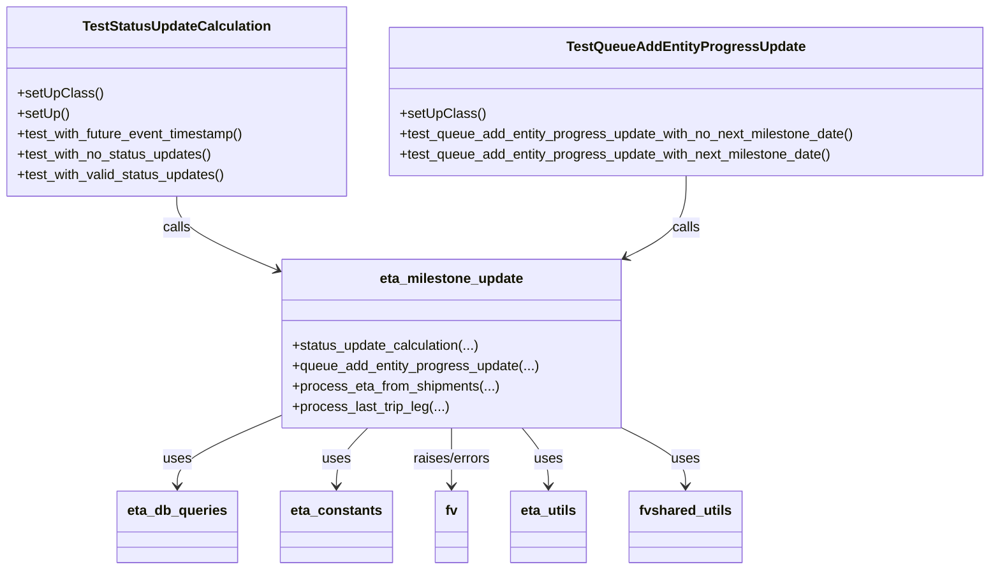
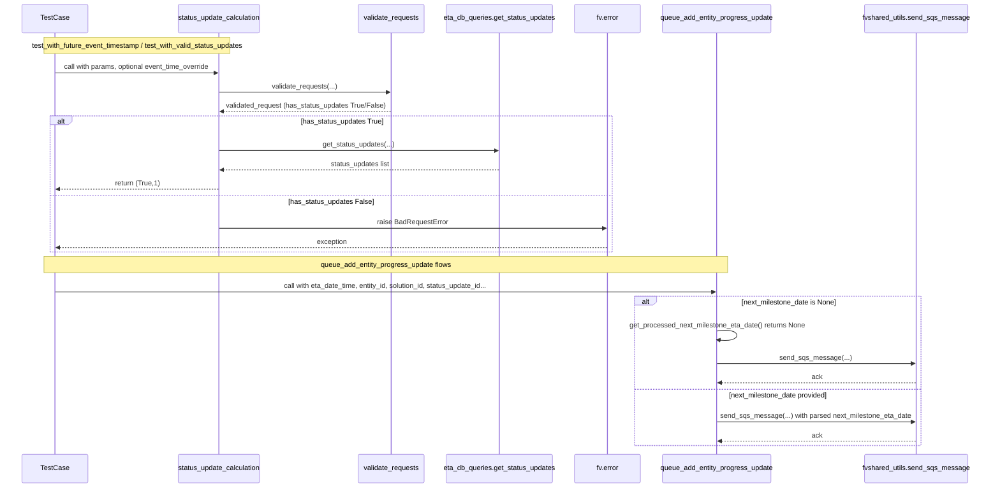

# Diagram: shipment_core/shipment_service/test/test_eta_milestone_update.py

> Auto-generated by Obscura crawlers

## Diagram 1

### SVG

<svg id="container" width="1163.3046875" xmlns="http://www.w3.org/2000/svg" class="classDiagram" height="668" viewBox="0 0 1163.3046875 668" role="graphics-document document" aria-roledescription="class"><g><defs><marker id="container_class-aggregationStart" class="marker aggregation class" refX="18" refY="7" markerWidth="190" markerHeight="240" orient="auto"><path d="M 18,7 L9,13 L1,7 L9,1 Z"></path></marker></defs><defs><marker id="container_class-aggregationEnd" class="marker aggregation class" refX="1" refY="7" markerWidth="20" markerHeight="28" orient="auto"><path d="M 18,7 L9,13 L1,7 L9,1 Z"></path></marker></defs><defs><marker id="container_class-extensionStart" class="marker extension class" refX="18" refY="7" markerWidth="190" markerHeight="240" orient="auto"><path d="M 1,7 L18,13 V 1 Z"></path></marker></defs><defs><marker id="container_class-extensionEnd" class="marker extension class" refX="1" refY="7" markerWidth="20" markerHeight="28" orient="auto"><path d="M 1,1 V 13 L18,7 Z"></path></marker></defs><defs><marker id="container_class-compositionStart" class="marker composition class" refX="18" refY="7" markerWidth="190" markerHeight="240" orient="auto"><path d="M 18,7 L9,13 L1,7 L9,1 Z"></path></marker></defs><defs><marker id="container_class-compositionEnd" class="marker composition class" refX="1" refY="7" markerWidth="20" markerHeight="28" orient="auto"><path d="M 18,7 L9,13 L1,7 L9,1 Z"></path></marker></defs><defs><marker id="container_class-dependencyStart" class="marker dependency class" refX="6" refY="7" markerWidth="190" markerHeight="240" orient="auto"><path d="M 5,7 L9,13 L1,7 L9,1 Z"></path></marker></defs><defs><marker id="container_class-dependencyEnd" class="marker dependency class" refX="13" refY="7" markerWidth="20" markerHeight="28" orient="auto"><path d="M 18,7 L9,13 L14,7 L9,1 Z"></path></marker></defs><defs><marker id="container_class-lollipopStart" class="marker lollipop class" refX="13" refY="7" markerWidth="190" markerHeight="240" orient="auto"><circle stroke="black" fill="transparent" cx="7" cy="7" r="6"></circle></marker></defs><defs><marker id="container_class-lollipopEnd" class="marker lollipop class" refX="1" refY="7" markerWidth="190" markerHeight="240" orient="auto"><circle stroke="black" fill="transparent" cx="7" cy="7" r="6"></circle></marker></defs><g class="root"><g class="clusters"></g><g class="edgePaths"><path d="M208.496,230L208.496,236.167C208.496,242.333,208.496,254.667,228.13,269.145C247.763,283.623,287.03,300.246,306.663,308.557L326.297,316.868" id="id_TestStatusUpdateCalculation_eta_milestone_update_1" class="edge-thickness-normal edge-pattern-solid relation" style=";;;" data-edge="true" data-et="edge" data-id="id_TestStatusUpdateCalculation_eta_milestone_update_1" data-points="W3sieCI6MjA4LjQ5NjA5Mzc1LCJ5IjoyMzB9LHsieCI6MjA4LjQ5NjA5Mzc1LCJ5IjoyNjd9LHsieCI6MzMxLjgyMjI2NTYyNSwieSI6MzE5LjIwNzQ1NzEyNDI3MTIzfV0=" marker-end="url(#container_class-dependencyEnd)"></path><path d="M807.148,206L807.148,216.167C807.148,226.333,807.148,246.667,794.804,262.885C782.46,279.104,757.773,291.208,745.429,297.26L733.085,303.313" id="id_TestQueueAddEntityProgressUpdate_eta_milestone_update_2" class="edge-thickness-normal edge-pattern-solid relation" style=";;;" data-edge="true" data-et="edge" data-id="id_TestQueueAddEntityProgressUpdate_eta_milestone_update_2" data-points="W3sieCI6ODA3LjE0ODQzNzUsInkiOjIwNn0seyJ4Ijo4MDcuMTQ4NDM3NSwieSI6MjY3fSx7IngiOjcyNy42OTcyNjU2MjUsInkiOjMwNS45NTM4NTk1ODYxMjM0fV0=" marker-end="url(#container_class-dependencyEnd)"></path><path d="M331.822,488.505L312.34,496.921C292.859,505.337,253.895,522.168,234.413,535.751C214.932,549.333,214.932,559.667,214.932,564.833L214.932,570" id="id_eta_milestone_update_eta_db_queries_3" class="edge-thickness-normal edge-pattern-solid relation" style=";;;" data-edge="true" data-et="edge" data-id="id_eta_milestone_update_eta_db_queries_3" data-points="W3sieCI6MzMxLjgyMjI2NTYyNSwieSI6NDg4LjUwNTM4NDg4MjYyNDQ3fSx7IngiOjIxNC45MzE2NDA2MjUsInkiOjUzOX0seyJ4IjoyMTQuOTMxNjQwNjI1LCJ5Ijo1NzZ9XQ==" marker-end="url(#container_class-dependencyEnd)"></path><path d="M433.296,502L427.288,508.167C421.279,514.333,409.261,526.667,403.253,538C397.244,549.333,397.244,559.667,397.244,564.833L397.244,570" id="id_eta_milestone_update_eta_constants_4" class="edge-thickness-normal edge-pattern-solid relation" style=";;;" data-edge="true" data-et="edge" data-id="id_eta_milestone_update_eta_constants_4" data-points="W3sieCI6NDMzLjI5NjE4NTY2MTc2NDcsInkiOjUwMn0seyJ4IjozOTcuMjQ0MTQwNjI1LCJ5Ijo1Mzl9LHsieCI6Mzk3LjI0NDE0MDYyNSwieSI6NTc2fV0=" marker-end="url(#container_class-dependencyEnd)"></path><path d="M529.76,502L529.76,508.167C529.76,514.333,529.76,526.667,529.76,538C529.76,549.333,529.76,559.667,529.76,564.833L529.76,570" id="id_eta_milestone_update_fv_5" class="edge-thickness-normal edge-pattern-solid relation" style=";;;" data-edge="true" data-et="edge" data-id="id_eta_milestone_update_fv_5" data-points="W3sieCI6NTI5Ljc1OTc2NTYyNSwieSI6NTAyfSx7IngiOjUyOS43NTk3NjU2MjUsInkiOjUzOX0seyJ4Ijo1MjkuNzU5NzY1NjI1LCJ5Ijo1NzZ9XQ==" marker-end="url(#container_class-dependencyEnd)"></path><path d="M611.949,502L617.068,508.167C622.188,514.333,632.427,526.667,637.546,538C642.666,549.333,642.666,559.667,642.666,564.833L642.666,570" id="id_eta_milestone_update_eta_utils_6" class="edge-thickness-normal edge-pattern-solid relation" style=";;;" data-edge="true" data-et="edge" data-id="id_eta_milestone_update_eta_utils_6" data-points="W3sieCI6NjExLjk0ODg3NDA4MDg4MjMsInkiOjUwMn0seyJ4Ijo2NDIuNjY2MDE1NjI1LCJ5Ijo1Mzl9LHsieCI6NjQyLjY2NjAxNTYyNSwieSI6NTc2fV0=" marker-end="url(#container_class-dependencyEnd)"></path><path d="M726.998,502L739.284,508.167C751.569,514.333,776.141,526.667,788.427,538C800.713,549.333,800.713,559.667,800.713,564.833L800.713,570" id="id_eta_milestone_update_fvshared_utils_7" class="edge-thickness-normal edge-pattern-solid relation" style=";;;" data-edge="true" data-et="edge" data-id="id_eta_milestone_update_fvshared_utils_7" data-points="W3sieCI6NzI2Ljk5NzcwMjIwNTg4MjMsInkiOjUwMn0seyJ4Ijo4MDAuNzEyODkwNjI1LCJ5Ijo1Mzl9LHsieCI6ODAwLjcxMjg5MDYyNSwieSI6NTc2fV0=" marker-end="url(#container_class-dependencyEnd)"></path></g><g class="edgeLabels"><g class="edgeLabel" transform="translate(208.49609375, 267)"><g class="label" data-id="id_TestStatusUpdateCalculation_eta_milestone_update_1" transform="translate(-16.4453125, -12)"><foreignObject width="32.890625" height="24">

calls

</foreignObject></g></g><g class="edgeLabel" transform="translate(807.1484375, 267)"><g class="label" data-id="id_TestQueueAddEntityProgressUpdate_eta_milestone_update_2" transform="translate(-16.4453125, -12)"><foreignObject width="32.890625" height="24">

calls

</foreignObject></g></g><g class="edgeLabel" transform="translate(214.931640625, 539)"><g class="label" data-id="id_eta_milestone_update_eta_db_queries_3" transform="translate(-16.4921875, -12)"><foreignObject width="32.984375" height="24">

uses

</foreignObject></g></g><g class="edgeLabel" transform="translate(397.244140625, 539)"><g class="label" data-id="id_eta_milestone_update_eta_constants_4" transform="translate(-16.4921875, -12)"><foreignObject width="32.984375" height="24">

uses

</foreignObject></g></g><g class="edgeLabel" transform="translate(529.759765625, 539)"><g class="label" data-id="id_eta_milestone_update_fv_5" transform="translate(-46.6875, -12)"><foreignObject width="93.375" height="24">

raises/errors

</foreignObject></g></g><g class="edgeLabel" transform="translate(642.666015625, 539)"><g class="label" data-id="id_eta_milestone_update_eta_utils_6" transform="translate(-16.4921875, -12)"><foreignObject width="32.984375" height="24">

uses

</foreignObject></g></g><g class="edgeLabel" transform="translate(800.712890625, 539)"><g class="label" data-id="id_eta_milestone_update_fvshared_utils_7" transform="translate(-16.4921875, -12)"><foreignObject width="32.984375" height="24">

uses

</foreignObject></g></g></g><g class="nodes"><g class="node default" id="classId-TestStatusUpdateCalculation-0" transform="translate(208.49609375, 119)"><g class="basic label-container"><path d="M-200.49609375 -111 L200.49609375 -111 L200.49609375 111 L-200.49609375 111" stroke="none" stroke-width="0" fill="#ECECFF" style=""></path><path d="M-200.49609375 -111 C-82.66790319513422 -111, 35.16028735973157 -111, 200.49609375 -111 M-200.49609375 -111 C-105.96240415744516 -111, -11.428714564890328 -111, 200.49609375 -111 M200.49609375 -111 C200.49609375 -30.7114351981876, 200.49609375 49.5771296036248, 200.49609375 111 M200.49609375 -111 C200.49609375 -63.817931677033094, 200.49609375 -16.63586335406619, 200.49609375 111 M200.49609375 111 C70.67639030862509 111, -59.143313132749824 111, -200.49609375 111 M200.49609375 111 C109.59917586694452 111, 18.70225798388904 111, -200.49609375 111 M-200.49609375 111 C-200.49609375 45.762321646283155, -200.49609375 -19.47535670743369, -200.49609375 -111 M-200.49609375 111 C-200.49609375 40.45686227590781, -200.49609375 -30.08627544818438, -200.49609375 -111" stroke="#9370DB" stroke-width="1.3" fill="none" stroke-dasharray="0 0" style=""></path></g><g class="annotation-group text" transform="translate(0, -87)"></g><g class="label-group text" transform="translate(-106.1015625, -87)"><g class="label" style="font-weight: bolder" transform="translate(0,-12)"><foreignObject width="212.203125" height="24">

TestStatusUpdateCalculation

</foreignObject></g></g><g class="members-group text" transform="translate(-188.49609375, -39)"></g><g class="methods-group text" transform="translate(-188.49609375, -9)"><g class="label" style="" transform="translate(0,-12)"><foreignObject width="97.15625" height="24">

+setUpClass()

</foreignObject></g><g class="label" style="" transform="translate(0,12)"><foreignObject width="60.421875" height="24">

+setUp()

</foreignObject></g><g class="label" style="" transform="translate(0,36)"><foreignObject width="270.890625" height="24">

+test_with_future_event_timestamp()

</foreignObject></g><g class="label" style="" transform="translate(0,60)"><foreignObject width="230.859375" height="24">

+test_with_no_status_updates()

</foreignObject></g><g class="label" style="" transform="translate(0,84)"><foreignObject width="246.90625" height="24">

+test_with_valid_status_updates()

</foreignObject></g></g><g class="divider" style=""><path d="M-200.49609375 -63 C-80.43493936964914 -63, 39.62621501070171 -63, 200.49609375 -63 M-200.49609375 -63 C-48.65750868033581 -63, 103.18107638932838 -63, 200.49609375 -63" stroke="#9370DB" stroke-width="1.3" fill="none" stroke-dasharray="0 0" style=""></path></g><g class="divider" style=""><path d="M-200.49609375 -39 C-75.14723832652243 -39, 50.20161709695515 -39, 200.49609375 -39 M-200.49609375 -39 C-91.41112104991046 -39, 17.673851650179074 -39, 200.49609375 -39" stroke="#9370DB" stroke-width="1.3" fill="none" stroke-dasharray="0 0" style=""></path></g></g><g class="node default" id="classId-TestQueueAddEntityProgressUpdate-1" transform="translate(807.1484375, 119)"><g class="basic label-container"><path d="M-348.15625 -87 L348.15625 -87 L348.15625 87 L-348.15625 87" stroke="none" stroke-width="0" fill="#ECECFF" style=""></path><path d="M-348.15625 -87 C-170.16417517636046 -87, 7.827899647279082 -87, 348.15625 -87 M-348.15625 -87 C-147.04817375875993 -87, 54.05990248248014 -87, 348.15625 -87 M348.15625 -87 C348.15625 -37.536897441431535, 348.15625 11.92620511713693, 348.15625 87 M348.15625 -87 C348.15625 -33.94648797723849, 348.15625 19.10702404552302, 348.15625 87 M348.15625 87 C112.4758070242199 87, -123.20463595156019 87, -348.15625 87 M348.15625 87 C162.52947157590955 87, -23.097306848180892 87, -348.15625 87 M-348.15625 87 C-348.15625 30.51144163639478, -348.15625 -25.977116727210444, -348.15625 -87 M-348.15625 87 C-348.15625 51.69977263912987, -348.15625 16.399545278259737, -348.15625 -87" stroke="#9370DB" stroke-width="1.3" fill="none" stroke-dasharray="0 0" style=""></path></g><g class="annotation-group text" transform="translate(0, -63)"></g><g class="label-group text" transform="translate(-132.625, -63)"><g class="label" style="font-weight: bolder" transform="translate(0,-12)"><foreignObject width="265.25" height="24">

TestQueueAddEntityProgressUpdate

</foreignObject></g></g><g class="members-group text" transform="translate(-336.15625, -15)"></g><g class="methods-group text" transform="translate(-336.15625, 15)"><g class="label" style="" transform="translate(0,-12)"><foreignObject width="97.15625" height="24">

+setUpClass()

</foreignObject></g><g class="label" style="" transform="translate(0,12)"><foreignObject width="539.6875" height="24">

+test_queue_add_entity_progress_update_with_no_next_milestone_date()

</foreignObject></g><g class="label" style="" transform="translate(0,36)"><foreignObject width="512.96875" height="24">

+test_queue_add_entity_progress_update_with_next_milestone_date()

</foreignObject></g></g><g class="divider" style=""><path d="M-348.15625 -39 C-147.14918108573622 -39, 53.857887828527566 -39, 348.15625 -39 M-348.15625 -39 C-206.34542709714376 -39, -64.53460419428751 -39, 348.15625 -39" stroke="#9370DB" stroke-width="1.3" fill="none" stroke-dasharray="0 0" style=""></path></g><g class="divider" style=""><path d="M-348.15625 -15 C-207.61159485392474 -15, -67.06693970784949 -15, 348.15625 -15 M-348.15625 -15 C-102.98816680059525 -15, 142.1799163988095 -15, 348.15625 -15" stroke="#9370DB" stroke-width="1.3" fill="none" stroke-dasharray="0 0" style=""></path></g></g><g class="node default" id="classId-eta_milestone_update-2" transform="translate(529.759765625, 403)"><g class="basic label-container"><path d="M-197.9375 -99 L197.9375 -99 L197.9375 99 L-197.9375 99" stroke="none" stroke-width="0" fill="#ECECFF" style=""></path><path d="M-197.9375 -99 C-111.3465798340678 -99, -24.755659668135593 -99, 197.9375 -99 M-197.9375 -99 C-99.49152146317611 -99, -1.0455429263522262 -99, 197.9375 -99 M197.9375 -99 C197.9375 -56.44655625429608, 197.9375 -13.893112508592154, 197.9375 99 M197.9375 -99 C197.9375 -55.032252333606436, 197.9375 -11.064504667212873, 197.9375 99 M197.9375 99 C107.66510354191426 99, 17.392707083828526 99, -197.9375 99 M197.9375 99 C73.87553242003108 99, -50.186435159937844 99, -197.9375 99 M-197.9375 99 C-197.9375 28.234179018702534, -197.9375 -42.53164196259493, -197.9375 -99 M-197.9375 99 C-197.9375 58.82332795103409, -197.9375 18.646655902068176, -197.9375 -99" stroke="#9370DB" stroke-width="1.3" fill="none" stroke-dasharray="0 0" style=""></path></g><g class="annotation-group text" transform="translate(0, -75)"></g><g class="label-group text" transform="translate(-81.96875, -75)"><g class="label" style="font-weight: bolder" transform="translate(0,-12)"><foreignObject width="163.9375" height="24">

eta_milestone_update

</foreignObject></g></g><g class="members-group text" transform="translate(-185.9375, -27)"></g><g class="methods-group text" transform="translate(-185.9375, 3)"><g class="label" style="" transform="translate(0,-12)"><foreignObject width="220.75" height="24">

+status_update_calculation(...)

</foreignObject></g><g class="label" style="" transform="translate(0,12)"><foreignObject width="289.90625" height="24">

+queue_add_entity_progress_update(...)

</foreignObject></g><g class="label" style="" transform="translate(0,36)"><foreignObject width="242.375" height="24">

+process_eta_from_shipments(...)

</foreignObject></g><g class="label" style="" transform="translate(0,60)"><foreignObject width="182.953125" height="24">

+process_last_trip_leg(...)

</foreignObject></g></g><g class="divider" style=""><path d="M-197.9375 -51 C-94.95775869678064 -51, 8.021982606438712 -51, 197.9375 -51 M-197.9375 -51 C-118.1757525282779 -51, -38.414005056555794 -51, 197.9375 -51" stroke="#9370DB" stroke-width="1.3" fill="none" stroke-dasharray="0 0" style=""></path></g><g class="divider" style=""><path d="M-197.9375 -27 C-90.90923911620713 -27, 16.119021767585735 -27, 197.9375 -27 M-197.9375 -27 C-99.99502769392579 -27, -2.0525553878515836 -27, 197.9375 -27" stroke="#9370DB" stroke-width="1.3" fill="none" stroke-dasharray="0 0" style=""></path></g></g><g class="node default" id="classId-eta_db_queries-3" transform="translate(214.931640625, 618)"><g class="basic label-container"><path d="M-68.75 -42 L68.75 -42 L68.75 42 L-68.75 42" stroke="none" stroke-width="0" fill="#ECECFF" style=""></path><path d="M-68.75 -42 C-22.110511926650723 -42, 24.528976146698554 -42, 68.75 -42 M-68.75 -42 C-31.02095985692042 -42, 6.708080286159159 -42, 68.75 -42 M68.75 -42 C68.75 -17.463366500918866, 68.75 7.073266998162268, 68.75 42 M68.75 -42 C68.75 -22.35468288565359, 68.75 -2.7093657713071835, 68.75 42 M68.75 42 C33.79234535286499 42, -1.165309294270017 42, -68.75 42 M68.75 42 C22.044798486927803 42, -24.660403026144394 42, -68.75 42 M-68.75 42 C-68.75 16.672869486048587, -68.75 -8.654261027902827, -68.75 -42 M-68.75 42 C-68.75 15.941847222310034, -68.75 -10.116305555379931, -68.75 -42" stroke="#9370DB" stroke-width="1.3" fill="none" stroke-dasharray="0 0" style=""></path></g><g class="annotation-group text" transform="translate(0, -18)"></g><g class="label-group text" transform="translate(-56.75, -18)"><g class="label" style="font-weight: bolder" transform="translate(0,-12)"><foreignObject width="113.5" height="24">

eta_db_queries

</foreignObject></g></g><g class="members-group text" transform="translate(-56.75, 30)"></g><g class="methods-group text" transform="translate(-56.75, 60)"></g><g class="divider" style=""><path d="M-68.75 6 C-16.763185580182196 6, 35.22362883963561 6, 68.75 6 M-68.75 6 C-35.38558509393649 6, -2.0211701878729826 6, 68.75 6" stroke="#9370DB" stroke-width="1.3" fill="none" stroke-dasharray="0 0" style=""></path></g><g class="divider" style=""><path d="M-68.75 24 C-18.245685989567633 24, 32.258628020864734 24, 68.75 24 M-68.75 24 C-33.470987213079454 24, 1.8080255738410926 24, 68.75 24" stroke="#9370DB" stroke-width="1.3" fill="none" stroke-dasharray="0 0" style=""></path></g></g><g class="node default" id="classId-eta_constants-4" transform="translate(397.244140625, 618)"><g class="basic label-container"><path d="M-63.5625 -42 L63.5625 -42 L63.5625 42 L-63.5625 42" stroke="none" stroke-width="0" fill="#ECECFF" style=""></path><path d="M-63.5625 -42 C-33.515331379474915 -42, -3.4681627589498234 -42, 63.5625 -42 M-63.5625 -42 C-13.466221738242353 -42, 36.63005652351529 -42, 63.5625 -42 M63.5625 -42 C63.5625 -17.462039335551495, 63.5625 7.07592132889701, 63.5625 42 M63.5625 -42 C63.5625 -13.30823845271357, 63.5625 15.383523094572858, 63.5625 42 M63.5625 42 C24.1663909553847 42, -15.229718089230602 42, -63.5625 42 M63.5625 42 C18.492719679685216 42, -26.57706064062957 42, -63.5625 42 M-63.5625 42 C-63.5625 16.50804442576223, -63.5625 -8.983911148475542, -63.5625 -42 M-63.5625 42 C-63.5625 16.629701196782815, -63.5625 -8.74059760643437, -63.5625 -42" stroke="#9370DB" stroke-width="1.3" fill="none" stroke-dasharray="0 0" style=""></path></g><g class="annotation-group text" transform="translate(0, -18)"></g><g class="label-group text" transform="translate(-51.5625, -18)"><g class="label" style="font-weight: bolder" transform="translate(0,-12)"><foreignObject width="103.125" height="24">

eta_constants

</foreignObject></g></g><g class="members-group text" transform="translate(-51.5625, 30)"></g><g class="methods-group text" transform="translate(-51.5625, 60)"></g><g class="divider" style=""><path d="M-63.5625 6 C-23.161415861210074 6, 17.239668277579852 6, 63.5625 6 M-63.5625 6 C-29.696631070494917 6, 4.169237859010167 6, 63.5625 6" stroke="#9370DB" stroke-width="1.3" fill="none" stroke-dasharray="0 0" style=""></path></g><g class="divider" style=""><path d="M-63.5625 24 C-32.87332686318271 24, -2.184153726365416 24, 63.5625 24 M-63.5625 24 C-22.351096978587726 24, 18.860306042824547 24, 63.5625 24" stroke="#9370DB" stroke-width="1.3" fill="none" stroke-dasharray="0 0" style=""></path></g></g><g class="node default" id="classId-fv-5" transform="translate(529.759765625, 618)"><g class="basic label-container"><path d="M-18.953125 -42 L18.953125 -42 L18.953125 42 L-18.953125 42" stroke="none" stroke-width="0" fill="#ECECFF" style=""></path><path d="M-18.953125 -42 C-10.325808170281487 -42, -1.698491340562974 -42, 18.953125 -42 M-18.953125 -42 C-10.176810261120101 -42, -1.4004955222402025 -42, 18.953125 -42 M18.953125 -42 C18.953125 -22.59044402933652, 18.953125 -3.180888058673041, 18.953125 42 M18.953125 -42 C18.953125 -14.840537036576247, 18.953125 12.318925926847506, 18.953125 42 M18.953125 42 C7.060005377405538 42, -4.8331142451889235 42, -18.953125 42 M18.953125 42 C3.9603473758874213 42, -11.032430248225157 42, -18.953125 42 M-18.953125 42 C-18.953125 16.16554179391708, -18.953125 -9.668916412165842, -18.953125 -42 M-18.953125 42 C-18.953125 22.088761608062764, -18.953125 2.177523216125529, -18.953125 -42" stroke="#9370DB" stroke-width="1.3" fill="none" stroke-dasharray="0 0" style=""></path></g><g class="annotation-group text" transform="translate(0, -18)"></g><g class="label-group text" transform="translate(-6.953125, -18)"><g class="label" style="font-weight: bolder" transform="translate(0,-12)"><foreignObject width="13.90625" height="24">

fv

</foreignObject></g></g><g class="members-group text" transform="translate(-6.953125, 30)"></g><g class="methods-group text" transform="translate(-6.953125, 60)"></g><g class="divider" style=""><path d="M-18.953125 6 C-6.325562062059442 6, 6.302000875881117 6, 18.953125 6 M-18.953125 6 C-8.572544586372738 6, 1.8080358272545247 6, 18.953125 6" stroke="#9370DB" stroke-width="1.3" fill="none" stroke-dasharray="0 0" style=""></path></g><g class="divider" style=""><path d="M-18.953125 24 C-7.676510694340607 24, 3.6001036113187865 24, 18.953125 24 M-18.953125 24 C-5.433754555464615 24, 8.08561588907077 24, 18.953125 24" stroke="#9370DB" stroke-width="1.3" fill="none" stroke-dasharray="0 0" style=""></path></g></g><g class="node default" id="classId-eta_utils-6" transform="translate(642.666015625, 618)"><g class="basic label-container"><path d="M-43.953125 -42 L43.953125 -42 L43.953125 42 L-43.953125 42" stroke="none" stroke-width="0" fill="#ECECFF" style=""></path><path d="M-43.953125 -42 C-14.357909701301793 -42, 15.237305597396414 -42, 43.953125 -42 M-43.953125 -42 C-20.73043062534931 -42, 2.4922637493013795 -42, 43.953125 -42 M43.953125 -42 C43.953125 -12.857621839687834, 43.953125 16.284756320624332, 43.953125 42 M43.953125 -42 C43.953125 -13.575212515853057, 43.953125 14.849574968293886, 43.953125 42 M43.953125 42 C12.294917343684425 42, -19.36329031263115 42, -43.953125 42 M43.953125 42 C22.557139350034962 42, 1.1611537000699244 42, -43.953125 42 M-43.953125 42 C-43.953125 14.57620121736452, -43.953125 -12.84759756527096, -43.953125 -42 M-43.953125 42 C-43.953125 9.710985491489126, -43.953125 -22.57802901702175, -43.953125 -42" stroke="#9370DB" stroke-width="1.3" fill="none" stroke-dasharray="0 0" style=""></path></g><g class="annotation-group text" transform="translate(0, -18)"></g><g class="label-group text" transform="translate(-31.953125, -18)"><g class="label" style="font-weight: bolder" transform="translate(0,-12)"><foreignObject width="63.90625" height="24">

eta_utils

</foreignObject></g></g><g class="members-group text" transform="translate(-31.953125, 30)"></g><g class="methods-group text" transform="translate(-31.953125, 60)"></g><g class="divider" style=""><path d="M-43.953125 6 C-18.570224484350884 6, 6.812676031298231 6, 43.953125 6 M-43.953125 6 C-10.164538335547448 6, 23.624048328905104 6, 43.953125 6" stroke="#9370DB" stroke-width="1.3" fill="none" stroke-dasharray="0 0" style=""></path></g><g class="divider" style=""><path d="M-43.953125 24 C-12.993608581522654 24, 17.965907836954692 24, 43.953125 24 M-43.953125 24 C-19.691881937405686 24, 4.569361125188628 24, 43.953125 24" stroke="#9370DB" stroke-width="1.3" fill="none" stroke-dasharray="0 0" style=""></path></g></g><g class="node default" id="classId-fvshared_utils-7" transform="translate(800.712890625, 618)"><g class="basic label-container"><path d="M-64.09375 -42 L64.09375 -42 L64.09375 42 L-64.09375 42" stroke="none" stroke-width="0" fill="#ECECFF" style=""></path><path d="M-64.09375 -42 C-31.747003838630405 -42, 0.5997423227391891 -42, 64.09375 -42 M-64.09375 -42 C-16.309341875562858 -42, 31.475066248874285 -42, 64.09375 -42 M64.09375 -42 C64.09375 -16.266286891981327, 64.09375 9.467426216037346, 64.09375 42 M64.09375 -42 C64.09375 -23.432934853650377, 64.09375 -4.865869707300753, 64.09375 42 M64.09375 42 C18.496043822698283 42, -27.101662354603434 42, -64.09375 42 M64.09375 42 C15.517056160174256 42, -33.05963767965149 42, -64.09375 42 M-64.09375 42 C-64.09375 11.159856618370053, -64.09375 -19.680286763259893, -64.09375 -42 M-64.09375 42 C-64.09375 14.132547415775566, -64.09375 -13.734905168448869, -64.09375 -42" stroke="#9370DB" stroke-width="1.3" fill="none" stroke-dasharray="0 0" style=""></path></g><g class="annotation-group text" transform="translate(0, -18)"></g><g class="label-group text" transform="translate(-52.09375, -18)"><g class="label" style="font-weight: bolder" transform="translate(0,-12)"><foreignObject width="104.1875" height="24">

fvshared_utils

</foreignObject></g></g><g class="members-group text" transform="translate(-52.09375, 30)"></g><g class="methods-group text" transform="translate(-52.09375, 60)"></g><g class="divider" style=""><path d="M-64.09375 6 C-28.049290346991164 6, 7.995169306017672 6, 64.09375 6 M-64.09375 6 C-37.58433157624282 6, -11.074913152485635 6, 64.09375 6" stroke="#9370DB" stroke-width="1.3" fill="none" stroke-dasharray="0 0" style=""></path></g><g class="divider" style=""><path d="M-64.09375 24 C-13.233119322140467 24, 37.627511355719065 24, 64.09375 24 M-64.09375 24 C-32.373316864884075 24, -0.6528837297681491 24, 64.09375 24" stroke="#9370DB" stroke-width="1.3" fill="none" stroke-dasharray="0 0" style=""></path></g></g></g></g></g></svg>

## Diagram 2

### SVG

<svg id="container" width="2460.5" xmlns="http://www.w3.org/2000/svg" height="1171" viewBox="-50 -10 2460.5 1171" role="graphics-document document" aria-roledescription="sequence"><g><rect x="2095.5" y="1085" fill="#eaeaea" stroke="#666" width="265" height="65" name="SQS" rx="3" ry="3" class="actor actor-bottom"></rect><text x="2228" y="1117.5" dominant-baseline="central" alignment-baseline="central" class="actor actor-box" style="text-anchor: middle; font-size: 16px; font-weight: 400;"><tspan x="2228" dy="0">fvshared_utils.send_sqs_message</tspan></text></g><g><rect x="1581" y="1085" fill="#eaeaea" stroke="#666" width="280" height="65" name="Queue" rx="3" ry="3" class="actor actor-bottom"></rect><text x="1721" y="1117.5" dominant-baseline="central" alignment-baseline="central" class="actor actor-box" style="text-anchor: middle; font-size: 16px; font-weight: 400;"><tspan x="1721" dy="0">queue_add_entity_progress_update</tspan></text></g><g><rect x="1381" y="1085" fill="#eaeaea" stroke="#666" width="150" height="65" name="FV" rx="3" ry="3" class="actor actor-bottom"></rect><text x="1456" y="1117.5" dominant-baseline="central" alignment-baseline="central" class="actor actor-box" style="text-anchor: middle; font-size: 16px; font-weight: 400;"><tspan x="1456" dy="0">fv.error</tspan></text></g><g><rect x="1053" y="1085" fill="#eaeaea" stroke="#666" width="278" height="65" name="DB" rx="3" ry="3" class="actor actor-bottom"></rect><text x="1192" y="1117.5" dominant-baseline="central" alignment-baseline="central" class="actor actor-box" style="text-anchor: middle; font-size: 16px; font-weight: 400;"><tspan x="1192" dy="0">eta_db_queries.get_status_updates</tspan></text></g><g><rect x="853" y="1085" fill="#eaeaea" stroke="#666" width="150" height="65" name="Validator" rx="3" ry="3" class="actor actor-bottom"></rect><text x="928" y="1117.5" dominant-baseline="central" alignment-baseline="central" class="actor actor-box" style="text-anchor: middle; font-size: 16px; font-weight: 400;"><tspan x="928" dy="0">validate_requests</tspan></text></g><g><rect x="381.5" y="1085" fill="#eaeaea" stroke="#666" width="211" height="65" name="UpdateCalc" rx="3" ry="3" class="actor actor-bottom"></rect><text x="487" y="1117.5" dominant-baseline="central" alignment-baseline="central" class="actor actor-box" style="text-anchor: middle; font-size: 16px; font-weight: 400;"><tspan x="487" dy="0">status_update_calculation</tspan></text></g><g><rect x="0" y="1085" fill="#eaeaea" stroke="#666" width="150" height="65" name="Test" rx="3" ry="3" class="actor actor-bottom"></rect><text x="75" y="1117.5" dominant-baseline="central" alignment-baseline="central" class="actor actor-box" style="text-anchor: middle; font-size: 16px; font-weight: 400;"><tspan x="75" dy="0">TestCase</tspan></text></g><g><line id="actor6" x1="2228" y1="65" x2="2228" y2="1085" class="actor-line 200" stroke-width="0.5px" stroke="#999" name="SQS"></line><g id="root-6"><rect x="2095.5" y="0" fill="#eaeaea" stroke="#666" width="265" height="65" name="SQS" rx="3" ry="3" class="actor actor-top"></rect><text x="2228" y="32.5" dominant-baseline="central" alignment-baseline="central" class="actor actor-box" style="text-anchor: middle; font-size: 16px; font-weight: 400;"><tspan x="2228" dy="0">fvshared_utils.send_sqs_message</tspan></text></g></g><g><line id="actor5" x1="1721" y1="65" x2="1721" y2="1085" class="actor-line 200" stroke-width="0.5px" stroke="#999" name="Queue"></line><g id="root-5"><rect x="1581" y="0" fill="#eaeaea" stroke="#666" width="280" height="65" name="Queue" rx="3" ry="3" class="actor actor-top"></rect><text x="1721" y="32.5" dominant-baseline="central" alignment-baseline="central" class="actor actor-box" style="text-anchor: middle; font-size: 16px; font-weight: 400;"><tspan x="1721" dy="0">queue_add_entity_progress_update</tspan></text></g></g><g><line id="actor4" x1="1456" y1="65" x2="1456" y2="1085" class="actor-line 200" stroke-width="0.5px" stroke="#999" name="FV"></line><g id="root-4"><rect x="1381" y="0" fill="#eaeaea" stroke="#666" width="150" height="65" name="FV" rx="3" ry="3" class="actor actor-top"></rect><text x="1456" y="32.5" dominant-baseline="central" alignment-baseline="central" class="actor actor-box" style="text-anchor: middle; font-size: 16px; font-weight: 400;"><tspan x="1456" dy="0">fv.error</tspan></text></g></g><g><line id="actor3" x1="1192" y1="65" x2="1192" y2="1085" class="actor-line 200" stroke-width="0.5px" stroke="#999" name="DB"></line><g id="root-3"><rect x="1053" y="0" fill="#eaeaea" stroke="#666" width="278" height="65" name="DB" rx="3" ry="3" class="actor actor-top"></rect><text x="1192" y="32.5" dominant-baseline="central" alignment-baseline="central" class="actor actor-box" style="text-anchor: middle; font-size: 16px; font-weight: 400;"><tspan x="1192" dy="0">eta_db_queries.get_status_updates</tspan></text></g></g><g><line id="actor2" x1="928" y1="65" x2="928" y2="1085" class="actor-line 200" stroke-width="0.5px" stroke="#999" name="Validator"></line><g id="root-2"><rect x="853" y="0" fill="#eaeaea" stroke="#666" width="150" height="65" name="Validator" rx="3" ry="3" class="actor actor-top"></rect><text x="928" y="32.5" dominant-baseline="central" alignment-baseline="central" class="actor actor-box" style="text-anchor: middle; font-size: 16px; font-weight: 400;"><tspan x="928" dy="0">validate_requests</tspan></text></g></g><g><line id="actor1" x1="487" y1="65" x2="487" y2="1085" class="actor-line 200" stroke-width="0.5px" stroke="#999" name="UpdateCalc"></line><g id="root-1"><rect x="381.5" y="0" fill="#eaeaea" stroke="#666" width="211" height="65" name="UpdateCalc" rx="3" ry="3" class="actor actor-top"></rect><text x="487" y="32.5" dominant-baseline="central" alignment-baseline="central" class="actor actor-box" style="text-anchor: middle; font-size: 16px; font-weight: 400;"><tspan x="487" dy="0">status_update_calculation</tspan></text></g></g><g><line id="actor0" x1="75" y1="65" x2="75" y2="1085" class="actor-line 200" stroke-width="0.5px" stroke="#999" name="Test"></line><g id="root-0"><rect x="0" y="0" fill="#eaeaea" stroke="#666" width="150" height="65" name="Test" rx="3" ry="3" class="actor actor-top"></rect><text x="75" y="32.5" dominant-baseline="central" alignment-baseline="central" class="actor actor-box" style="text-anchor: middle; font-size: 16px; font-weight: 400;"><tspan x="75" dy="0">TestCase</tspan></text></g></g><g></g><defs><symbol id="computer" width="24" height="24"><path transform="scale(.5)" d="M2 2v13h20v-13h-20zm18 11h-16v-9h16v9zm-10.228 6l.466-1h3.524l.467 1h-4.457zm14.228 3h-24l2-6h2.104l-1.33 4h18.45l-1.297-4h2.073l2 6zm-5-10h-14v-7h14v7z"></path></symbol></defs><defs><symbol id="database" fill-rule="evenodd" clip-rule="evenodd"><path transform="scale(.5)" d="M12.258.001l.256.004.255.005.253.008.251.01.249.012.247.015.246.016.242.019.241.02.239.023.236.024.233.027.231.028.229.031.225.032.223.034.22.036.217.038.214.04.211.041.208.043.205.045.201.046.198.048.194.05.191.051.187.053.183.054.18.056.175.057.172.059.168.06.163.061.16.063.155.064.15.066.074.033.073.033.071.034.07.034.069.035.068.035.067.035.066.035.064.036.064.036.062.036.06.036.06.037.058.037.058.037.055.038.055.038.053.038.052.038.051.039.05.039.048.039.047.039.045.04.044.04.043.04.041.04.04.041.039.041.037.041.036.041.034.041.033.042.032.042.03.042.029.042.027.042.026.043.024.043.023.043.021.043.02.043.018.044.017.043.015.044.013.044.012.044.011.045.009.044.007.045.006.045.004.045.002.045.001.045v17l-.001.045-.002.045-.004.045-.006.045-.007.045-.009.044-.011.045-.012.044-.013.044-.015.044-.017.043-.018.044-.02.043-.021.043-.023.043-.024.043-.026.043-.027.042-.029.042-.03.042-.032.042-.033.042-.034.041-.036.041-.037.041-.039.041-.04.041-.041.04-.043.04-.044.04-.045.04-.047.039-.048.039-.05.039-.051.039-.052.038-.053.038-.055.038-.055.038-.058.037-.058.037-.06.037-.06.036-.062.036-.064.036-.064.036-.066.035-.067.035-.068.035-.069.035-.07.034-.071.034-.073.033-.074.033-.15.066-.155.064-.16.063-.163.061-.168.06-.172.059-.175.057-.18.056-.183.054-.187.053-.191.051-.194.05-.198.048-.201.046-.205.045-.208.043-.211.041-.214.04-.217.038-.22.036-.223.034-.225.032-.229.031-.231.028-.233.027-.236.024-.239.023-.241.02-.242.019-.246.016-.247.015-.249.012-.251.01-.253.008-.255.005-.256.004-.258.001-.258-.001-.256-.004-.255-.005-.253-.008-.251-.01-.249-.012-.247-.015-.245-.016-.243-.019-.241-.02-.238-.023-.236-.024-.234-.027-.231-.028-.228-.031-.226-.032-.223-.034-.22-.036-.217-.038-.214-.04-.211-.041-.208-.043-.204-.045-.201-.046-.198-.048-.195-.05-.19-.051-.187-.053-.184-.054-.179-.056-.176-.057-.172-.059-.167-.06-.164-.061-.159-.063-.155-.064-.151-.066-.074-.033-.072-.033-.072-.034-.07-.034-.069-.035-.068-.035-.067-.035-.066-.035-.064-.036-.063-.036-.062-.036-.061-.036-.06-.037-.058-.037-.057-.037-.056-.038-.055-.038-.053-.038-.052-.038-.051-.039-.049-.039-.049-.039-.046-.039-.046-.04-.044-.04-.043-.04-.041-.04-.04-.041-.039-.041-.037-.041-.036-.041-.034-.041-.033-.042-.032-.042-.03-.042-.029-.042-.027-.042-.026-.043-.024-.043-.023-.043-.021-.043-.02-.043-.018-.044-.017-.043-.015-.044-.013-.044-.012-.044-.011-.045-.009-.044-.007-.045-.006-.045-.004-.045-.002-.045-.001-.045v-17l.001-.045.002-.045.004-.045.006-.045.007-.045.009-.044.011-.045.012-.044.013-.044.015-.044.017-.043.018-.044.02-.043.021-.043.023-.043.024-.043.026-.043.027-.042.029-.042.03-.042.032-.042.033-.042.034-.041.036-.041.037-.041.039-.041.04-.041.041-.04.043-.04.044-.04.046-.04.046-.039.049-.039.049-.039.051-.039.052-.038.053-.038.055-.038.056-.038.057-.037.058-.037.06-.037.061-.036.062-.036.063-.036.064-.036.066-.035.067-.035.068-.035.069-.035.07-.034.072-.034.072-.033.074-.033.151-.066.155-.064.159-.063.164-.061.167-.06.172-.059.176-.057.179-.056.184-.054.187-.053.19-.051.195-.05.198-.048.201-.046.204-.045.208-.043.211-.041.214-.04.217-.038.22-.036.223-.034.226-.032.228-.031.231-.028.234-.027.236-.024.238-.023.241-.02.243-.019.245-.016.247-.015.249-.012.251-.01.253-.008.255-.005.256-.004.258-.001.258.001zm-9.258 20.499v.01l.001.021.003.021.004.022.005.021.006.022.007.022.009.023.01.022.011.023.012.023.013.023.015.023.016.024.017.023.018.024.019.024.021.024.022.025.023.024.024.025.052.049.056.05.061.051.066.051.07.051.075.051.079.052.084.052.088.052.092.052.097.052.102.051.105.052.11.052.114.051.119.051.123.051.127.05.131.05.135.05.139.048.144.049.147.047.152.047.155.047.16.045.163.045.167.043.171.043.176.041.178.041.183.039.187.039.19.037.194.035.197.035.202.033.204.031.209.03.212.029.216.027.219.025.222.024.226.021.23.02.233.018.236.016.24.015.243.012.246.01.249.008.253.005.256.004.259.001.26-.001.257-.004.254-.005.25-.008.247-.011.244-.012.241-.014.237-.016.233-.018.231-.021.226-.021.224-.024.22-.026.216-.027.212-.028.21-.031.205-.031.202-.034.198-.034.194-.036.191-.037.187-.039.183-.04.179-.04.175-.042.172-.043.168-.044.163-.045.16-.046.155-.046.152-.047.148-.048.143-.049.139-.049.136-.05.131-.05.126-.05.123-.051.118-.052.114-.051.11-.052.106-.052.101-.052.096-.052.092-.052.088-.053.083-.051.079-.052.074-.052.07-.051.065-.051.06-.051.056-.05.051-.05.023-.024.023-.025.021-.024.02-.024.019-.024.018-.024.017-.024.015-.023.014-.024.013-.023.012-.023.01-.023.01-.022.008-.022.006-.022.006-.022.004-.022.004-.021.001-.021.001-.021v-4.127l-.077.055-.08.053-.083.054-.085.053-.087.052-.09.052-.093.051-.095.05-.097.05-.1.049-.102.049-.105.048-.106.047-.109.047-.111.046-.114.045-.115.045-.118.044-.12.043-.122.042-.124.042-.126.041-.128.04-.13.04-.132.038-.134.038-.135.037-.138.037-.139.035-.142.035-.143.034-.144.033-.147.032-.148.031-.15.03-.151.03-.153.029-.154.027-.156.027-.158.026-.159.025-.161.024-.162.023-.163.022-.165.021-.166.02-.167.019-.169.018-.169.017-.171.016-.173.015-.173.014-.175.013-.175.012-.177.011-.178.01-.179.008-.179.008-.181.006-.182.005-.182.004-.184.003-.184.002h-.37l-.184-.002-.184-.003-.182-.004-.182-.005-.181-.006-.179-.008-.179-.008-.178-.01-.176-.011-.176-.012-.175-.013-.173-.014-.172-.015-.171-.016-.17-.017-.169-.018-.167-.019-.166-.02-.165-.021-.163-.022-.162-.023-.161-.024-.159-.025-.157-.026-.156-.027-.155-.027-.153-.029-.151-.03-.15-.03-.148-.031-.146-.032-.145-.033-.143-.034-.141-.035-.14-.035-.137-.037-.136-.037-.134-.038-.132-.038-.13-.04-.128-.04-.126-.041-.124-.042-.122-.042-.12-.044-.117-.043-.116-.045-.113-.045-.112-.046-.109-.047-.106-.047-.105-.048-.102-.049-.1-.049-.097-.05-.095-.05-.093-.052-.09-.051-.087-.052-.085-.053-.083-.054-.08-.054-.077-.054v4.127zm0-5.654v.011l.001.021.003.021.004.021.005.022.006.022.007.022.009.022.01.022.011.023.012.023.013.023.015.024.016.023.017.024.018.024.019.024.021.024.022.024.023.025.024.024.052.05.056.05.061.05.066.051.07.051.075.052.079.051.084.052.088.052.092.052.097.052.102.052.105.052.11.051.114.051.119.052.123.05.127.051.131.05.135.049.139.049.144.048.147.048.152.047.155.046.16.045.163.045.167.044.171.042.176.042.178.04.183.04.187.038.19.037.194.036.197.034.202.033.204.032.209.03.212.028.216.027.219.025.222.024.226.022.23.02.233.018.236.016.24.014.243.012.246.01.249.008.253.006.256.003.259.001.26-.001.257-.003.254-.006.25-.008.247-.01.244-.012.241-.015.237-.016.233-.018.231-.02.226-.022.224-.024.22-.025.216-.027.212-.029.21-.03.205-.032.202-.033.198-.035.194-.036.191-.037.187-.039.183-.039.179-.041.175-.042.172-.043.168-.044.163-.045.16-.045.155-.047.152-.047.148-.048.143-.048.139-.05.136-.049.131-.05.126-.051.123-.051.118-.051.114-.052.11-.052.106-.052.101-.052.096-.052.092-.052.088-.052.083-.052.079-.052.074-.051.07-.052.065-.051.06-.05.056-.051.051-.049.023-.025.023-.024.021-.025.02-.024.019-.024.018-.024.017-.024.015-.023.014-.023.013-.024.012-.022.01-.023.01-.023.008-.022.006-.022.006-.022.004-.021.004-.022.001-.021.001-.021v-4.139l-.077.054-.08.054-.083.054-.085.052-.087.053-.09.051-.093.051-.095.051-.097.05-.1.049-.102.049-.105.048-.106.047-.109.047-.111.046-.114.045-.115.044-.118.044-.12.044-.122.042-.124.042-.126.041-.128.04-.13.039-.132.039-.134.038-.135.037-.138.036-.139.036-.142.035-.143.033-.144.033-.147.033-.148.031-.15.03-.151.03-.153.028-.154.028-.156.027-.158.026-.159.025-.161.024-.162.023-.163.022-.165.021-.166.02-.167.019-.169.018-.169.017-.171.016-.173.015-.173.014-.175.013-.175.012-.177.011-.178.009-.179.009-.179.007-.181.007-.182.005-.182.004-.184.003-.184.002h-.37l-.184-.002-.184-.003-.182-.004-.182-.005-.181-.007-.179-.007-.179-.009-.178-.009-.176-.011-.176-.012-.175-.013-.173-.014-.172-.015-.171-.016-.17-.017-.169-.018-.167-.019-.166-.02-.165-.021-.163-.022-.162-.023-.161-.024-.159-.025-.157-.026-.156-.027-.155-.028-.153-.028-.151-.03-.15-.03-.148-.031-.146-.033-.145-.033-.143-.033-.141-.035-.14-.036-.137-.036-.136-.037-.134-.038-.132-.039-.13-.039-.128-.04-.126-.041-.124-.042-.122-.043-.12-.043-.117-.044-.116-.044-.113-.046-.112-.046-.109-.046-.106-.047-.105-.048-.102-.049-.1-.049-.097-.05-.095-.051-.093-.051-.09-.051-.087-.053-.085-.052-.083-.054-.08-.054-.077-.054v4.139zm0-5.666v.011l.001.02.003.022.004.021.005.022.006.021.007.022.009.023.01.022.011.023.012.023.013.023.015.023.016.024.017.024.018.023.019.024.021.025.022.024.023.024.024.025.052.05.056.05.061.05.066.051.07.051.075.052.079.051.084.052.088.052.092.052.097.052.102.052.105.051.11.052.114.051.119.051.123.051.127.05.131.05.135.05.139.049.144.048.147.048.152.047.155.046.16.045.163.045.167.043.171.043.176.042.178.04.183.04.187.038.19.037.194.036.197.034.202.033.204.032.209.03.212.028.216.027.219.025.222.024.226.021.23.02.233.018.236.017.24.014.243.012.246.01.249.008.253.006.256.003.259.001.26-.001.257-.003.254-.006.25-.008.247-.01.244-.013.241-.014.237-.016.233-.018.231-.02.226-.022.224-.024.22-.025.216-.027.212-.029.21-.03.205-.032.202-.033.198-.035.194-.036.191-.037.187-.039.183-.039.179-.041.175-.042.172-.043.168-.044.163-.045.16-.045.155-.047.152-.047.148-.048.143-.049.139-.049.136-.049.131-.051.126-.05.123-.051.118-.052.114-.051.11-.052.106-.052.101-.052.096-.052.092-.052.088-.052.083-.052.079-.052.074-.052.07-.051.065-.051.06-.051.056-.05.051-.049.023-.025.023-.025.021-.024.02-.024.019-.024.018-.024.017-.024.015-.023.014-.024.013-.023.012-.023.01-.022.01-.023.008-.022.006-.022.006-.022.004-.022.004-.021.001-.021.001-.021v-4.153l-.077.054-.08.054-.083.053-.085.053-.087.053-.09.051-.093.051-.095.051-.097.05-.1.049-.102.048-.105.048-.106.048-.109.046-.111.046-.114.046-.115.044-.118.044-.12.043-.122.043-.124.042-.126.041-.128.04-.13.039-.132.039-.134.038-.135.037-.138.036-.139.036-.142.034-.143.034-.144.033-.147.032-.148.032-.15.03-.151.03-.153.028-.154.028-.156.027-.158.026-.159.024-.161.024-.162.023-.163.023-.165.021-.166.02-.167.019-.169.018-.169.017-.171.016-.173.015-.173.014-.175.013-.175.012-.177.01-.178.01-.179.009-.179.007-.181.006-.182.006-.182.004-.184.003-.184.001-.185.001-.185-.001-.184-.001-.184-.003-.182-.004-.182-.006-.181-.006-.179-.007-.179-.009-.178-.01-.176-.01-.176-.012-.175-.013-.173-.014-.172-.015-.171-.016-.17-.017-.169-.018-.167-.019-.166-.02-.165-.021-.163-.023-.162-.023-.161-.024-.159-.024-.157-.026-.156-.027-.155-.028-.153-.028-.151-.03-.15-.03-.148-.032-.146-.032-.145-.033-.143-.034-.141-.034-.14-.036-.137-.036-.136-.037-.134-.038-.132-.039-.13-.039-.128-.041-.126-.041-.124-.041-.122-.043-.12-.043-.117-.044-.116-.044-.113-.046-.112-.046-.109-.046-.106-.048-.105-.048-.102-.048-.1-.05-.097-.049-.095-.051-.093-.051-.09-.052-.087-.052-.085-.053-.083-.053-.08-.054-.077-.054v4.153zm8.74-8.179l-.257.004-.254.005-.25.008-.247.011-.244.012-.241.014-.237.016-.233.018-.231.021-.226.022-.224.023-.22.026-.216.027-.212.028-.21.031-.205.032-.202.033-.198.034-.194.036-.191.038-.187.038-.183.04-.179.041-.175.042-.172.043-.168.043-.163.045-.16.046-.155.046-.152.048-.148.048-.143.048-.139.049-.136.05-.131.05-.126.051-.123.051-.118.051-.114.052-.11.052-.106.052-.101.052-.096.052-.092.052-.088.052-.083.052-.079.052-.074.051-.07.052-.065.051-.06.05-.056.05-.051.05-.023.025-.023.024-.021.024-.02.025-.019.024-.018.024-.017.023-.015.024-.014.023-.013.023-.012.023-.01.023-.01.022-.008.022-.006.023-.006.021-.004.022-.004.021-.001.021-.001.021.001.021.001.021.004.021.004.022.006.021.006.023.008.022.01.022.01.023.012.023.013.023.014.023.015.024.017.023.018.024.019.024.02.025.021.024.023.024.023.025.051.05.056.05.06.05.065.051.07.052.074.051.079.052.083.052.088.052.092.052.096.052.101.052.106.052.11.052.114.052.118.051.123.051.126.051.131.05.136.05.139.049.143.048.148.048.152.048.155.046.16.046.163.045.168.043.172.043.175.042.179.041.183.04.187.038.191.038.194.036.198.034.202.033.205.032.21.031.212.028.216.027.22.026.224.023.226.022.231.021.233.018.237.016.241.014.244.012.247.011.25.008.254.005.257.004.26.001.26-.001.257-.004.254-.005.25-.008.247-.011.244-.012.241-.014.237-.016.233-.018.231-.021.226-.022.224-.023.22-.026.216-.027.212-.028.21-.031.205-.032.202-.033.198-.034.194-.036.191-.038.187-.038.183-.04.179-.041.175-.042.172-.043.168-.043.163-.045.16-.046.155-.046.152-.048.148-.048.143-.048.139-.049.136-.05.131-.05.126-.051.123-.051.118-.051.114-.052.11-.052.106-.052.101-.052.096-.052.092-.052.088-.052.083-.052.079-.052.074-.051.07-.052.065-.051.06-.05.056-.05.051-.05.023-.025.023-.024.021-.024.02-.025.019-.024.018-.024.017-.023.015-.024.014-.023.013-.023.012-.023.01-.023.01-.022.008-.022.006-.023.006-.021.004-.022.004-.021.001-.021.001-.021-.001-.021-.001-.021-.004-.021-.004-.022-.006-.021-.006-.023-.008-.022-.01-.022-.01-.023-.012-.023-.013-.023-.014-.023-.015-.024-.017-.023-.018-.024-.019-.024-.02-.025-.021-.024-.023-.024-.023-.025-.051-.05-.056-.05-.06-.05-.065-.051-.07-.052-.074-.051-.079-.052-.083-.052-.088-.052-.092-.052-.096-.052-.101-.052-.106-.052-.11-.052-.114-.052-.118-.051-.123-.051-.126-.051-.131-.05-.136-.05-.139-.049-.143-.048-.148-.048-.152-.048-.155-.046-.16-.046-.163-.045-.168-.043-.172-.043-.175-.042-.179-.041-.183-.04-.187-.038-.191-.038-.194-.036-.198-.034-.202-.033-.205-.032-.21-.031-.212-.028-.216-.027-.22-.026-.224-.023-.226-.022-.231-.021-.233-.018-.237-.016-.241-.014-.244-.012-.247-.011-.25-.008-.254-.005-.257-.004-.26-.001-.26.001z"></path></symbol></defs><defs><symbol id="clock" width="24" height="24"><path transform="scale(.5)" d="M12 2c5.514 0 10 4.486 10 10s-4.486 10-10 10-10-4.486-10-10 4.486-10 10-10zm0-2c-6.627 0-12 5.373-12 12s5.373 12 12 12 12-5.373 12-12-5.373-12-12-12zm5.848 12.459c.202.038.202.333.001.372-1.907.361-6.045 1.111-6.547 1.111-.719 0-1.301-.582-1.301-1.301 0-.512.77-5.447 1.125-7.445.034-.192.312-.181.343.014l.985 6.238 5.394 1.011z"></path></symbol></defs><defs><marker id="arrowhead" refX="7.9" refY="5" markerUnits="userSpaceOnUse" markerWidth="12" markerHeight="12" orient="auto-start-reverse"><path d="M -1 0 L 10 5 L 0 10 z"></path></marker></defs><defs><marker id="crosshead" markerWidth="15" markerHeight="8" orient="auto" refX="4" refY="4.5"><path fill="none" stroke="#000000" stroke-width="1pt" d="M 1,2 L 6,7 M 6,2 L 1,7" style="stroke-dasharray: 0, 0;"></path></marker></defs><defs><marker id="filled-head" refX="15.5" refY="7" markerWidth="20" markerHeight="28" orient="auto"><path d="M 18,7 L9,13 L14,7 L9,1 Z"></path></marker></defs><defs><marker id="sequencenumber" refX="15" refY="15" markerWidth="60" markerHeight="40" orient="auto"><circle cx="15" cy="15" r="6"></circle></marker></defs><g><rect x="50" y="75" fill="#EDF2AE" stroke="#666" width="462" height="39" class="note"></rect><text x="281" y="80" text-anchor="middle" dominant-baseline="middle" alignment-baseline="middle" class="noteText" dy="1em" style="font-size: 16px; font-weight: 400;"><tspan x="281">test_with_future_event_timestamp / test_with_valid_status_updates</tspan></text></g><g><line x1="64" y1="268" x2="1467" y2="268" class="loopLine"></line><line x1="1467" y1="268" x2="1467" y2="598" class="loopLine"></line><line x1="64" y1="598" x2="1467" y2="598" class="loopLine"></line><line x1="64" y1="268" x2="64" y2="598" class="loopLine"></line><line x1="64" y1="462" x2="1467" y2="462" class="loopLine" style="stroke-dasharray: 3, 3;"></line><polygon points="64,268 114,268 114,281 105.6,288 64,288" class="labelBox"></polygon><text x="89" y="281" text-anchor="middle" dominant-baseline="middle" alignment-baseline="middle" class="labelText" style="font-size: 16px; font-weight: 400;">alt</text><text x="790.5" y="286" text-anchor="middle" class="loopText" style="font-size: 16px; font-weight: 400;"><tspan x="790.5">[has_status_updates True]</tspan></text><text x="765.5" y="480" text-anchor="middle" class="loopText" style="font-size: 16px; font-weight: 400;">[has_status_updates False]</text></g><g><rect x="50" y="608" fill="#EDF2AE" stroke="#666" width="1696" height="39" class="note"></rect><text x="898" y="613" text-anchor="middle" dominant-baseline="middle" alignment-baseline="middle" class="noteText" dy="1em" style="font-size: 16px; font-weight: 400;"><tspan x="898">queue_add_entity_progress_update flows</tspan></text></g><g><line x1="1509" y1="705" x2="2239" y2="705" class="loopLine"></line><line x1="2239" y1="705" x2="2239" y2="1065" class="loopLine"></line><line x1="1509" y1="1065" x2="2239" y2="1065" class="loopLine"></line><line x1="1509" y1="705" x2="1509" y2="1065" class="loopLine"></line><line x1="1509" y1="929" x2="2239" y2="929" class="loopLine" style="stroke-dasharray: 3, 3;"></line><polygon points="1509,705 1559,705 1559,718 1550.6,725 1509,725" class="labelBox"></polygon><text x="1534" y="718" text-anchor="middle" dominant-baseline="middle" alignment-baseline="middle" class="labelText" style="font-size: 16px; font-weight: 400;">alt</text><text x="1899" y="723" text-anchor="middle" class="loopText" style="font-size: 16px; font-weight: 400;"><tspan x="1899">[next_milestone_date is None]</tspan></text><text x="1874" y="947" text-anchor="middle" class="loopText" style="font-size: 16px; font-weight: 400;">[next_milestone_date provided]</text></g><text x="280" y="129" text-anchor="middle" dominant-baseline="middle" alignment-baseline="middle" class="messageText" dy="1em" style="font-size: 16px; font-weight: 400;">call with params, optional event_time_override</text><line x1="76" y1="162" x2="483" y2="162" class="messageLine0" stroke-width="2" stroke="none" marker-end="url(#arrowhead)" style="fill: none;"></line><text x="706" y="177" text-anchor="middle" dominant-baseline="middle" alignment-baseline="middle" class="messageText" dy="1em" style="font-size: 16px; font-weight: 400;">validate_requests(...)</text><line x1="488" y1="210" x2="924" y2="210" class="messageLine0" stroke-width="2" stroke="none" marker-end="url(#arrowhead)" style="fill: none;"></line><text x="709" y="225" text-anchor="middle" dominant-baseline="middle" alignment-baseline="middle" class="messageText" dy="1em" style="font-size: 16px; font-weight: 400;">validated_request (has_status_updates True/False)</text><line x1="927" y1="258" x2="491" y2="258" class="messageLine1" stroke-width="2" stroke="none" marker-end="url(#arrowhead)" style="stroke-dasharray: 3, 3; fill: none;"></line><text x="838" y="318" text-anchor="middle" dominant-baseline="middle" alignment-baseline="middle" class="messageText" dy="1em" style="font-size: 16px; font-weight: 400;">get_status_updates(...)</text><line x1="488" y1="351" x2="1188" y2="351" class="messageLine0" stroke-width="2" stroke="none" marker-end="url(#arrowhead)" style="fill: none;"></line><text x="841" y="366" text-anchor="middle" dominant-baseline="middle" alignment-baseline="middle" class="messageText" dy="1em" style="font-size: 16px; font-weight: 400;">status_updates list</text><line x1="1191" y1="399" x2="491" y2="399" class="messageLine1" stroke-width="2" stroke="none" marker-end="url(#arrowhead)" style="stroke-dasharray: 3, 3; fill: none;"></line><text x="283" y="414" text-anchor="middle" dominant-baseline="middle" alignment-baseline="middle" class="messageText" dy="1em" style="font-size: 16px; font-weight: 400;">return (True,1)</text><line x1="486" y1="447" x2="79" y2="447" class="messageLine1" stroke-width="2" stroke="none" marker-end="url(#arrowhead)" style="stroke-dasharray: 3, 3; fill: none;"></line><text x="970" y="507" text-anchor="middle" dominant-baseline="middle" alignment-baseline="middle" class="messageText" dy="1em" style="font-size: 16px; font-weight: 400;">raise BadRequestError</text><line x1="488" y1="540" x2="1452" y2="540" class="messageLine0" stroke-width="2" stroke="none" marker-end="url(#arrowhead)" style="fill: none;"></line><text x="767" y="555" text-anchor="middle" dominant-baseline="middle" alignment-baseline="middle" class="messageText" dy="1em" style="font-size: 16px; font-weight: 400;">exception</text><line x1="1455" y1="588" x2="79" y2="588" class="messageLine1" stroke-width="2" stroke="none" marker-end="url(#arrowhead)" style="stroke-dasharray: 3, 3; fill: none;"></line><text x="897" y="662" text-anchor="middle" dominant-baseline="middle" alignment-baseline="middle" class="messageText" dy="1em" style="font-size: 16px; font-weight: 400;">call with eta_date_time, entity_id, solution_id, status_update_id...</text><line x1="76" y1="695" x2="1717" y2="695" class="messageLine0" stroke-width="2" stroke="none" marker-end="url(#arrowhead)" style="fill: none;"></line><text x="1722" y="755" text-anchor="middle" dominant-baseline="middle" alignment-baseline="middle" class="messageText" dy="1em" style="font-size: 16px; font-weight: 400;">get_processed_next_milestone_eta_date() returns None</text><path d="M 1722,788 C 1782,778 1782,818 1722,808" class="messageLine0" stroke-width="2" stroke="none" marker-end="url(#arrowhead)" style="fill: none;"></path><text x="1973" y="833" text-anchor="middle" dominant-baseline="middle" alignment-baseline="middle" class="messageText" dy="1em" style="font-size: 16px; font-weight: 400;">send_sqs_message(...)</text><line x1="1722" y1="866" x2="2224" y2="866" class="messageLine0" stroke-width="2" stroke="none" marker-end="url(#arrowhead)" style="fill: none;"></line><text x="1976" y="881" text-anchor="middle" dominant-baseline="middle" alignment-baseline="middle" class="messageText" dy="1em" style="font-size: 16px; font-weight: 400;">ack</text><line x1="2227" y1="914" x2="1725" y2="914" class="messageLine1" stroke-width="2" stroke="none" marker-end="url(#arrowhead)" style="stroke-dasharray: 3, 3; fill: none;"></line><text x="1973" y="974" text-anchor="middle" dominant-baseline="middle" alignment-baseline="middle" class="messageText" dy="1em" style="font-size: 16px; font-weight: 400;">send_sqs_message(...) with parsed next_milestone_eta_date</text><line x1="1722" y1="1007" x2="2224" y2="1007" class="messageLine0" stroke-width="2" stroke="none" marker-end="url(#arrowhead)" style="fill: none;"></line><text x="1976" y="1022" text-anchor="middle" dominant-baseline="middle" alignment-baseline="middle" class="messageText" dy="1em" style="font-size: 16px; font-weight: 400;">ack</text><line x1="2227" y1="1055" x2="1725" y2="1055" class="messageLine1" stroke-width="2" stroke="none" marker-end="url(#arrowhead)" style="stroke-dasharray: 3, 3; fill: none;"></line></svg>
