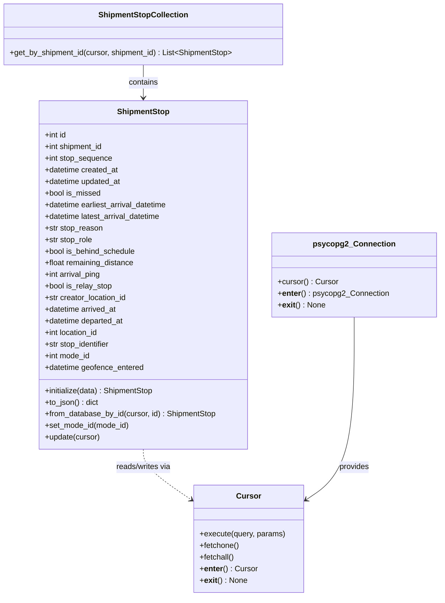

# Diagram: shipment_core/shipment_service/test/test_shipment_stop.py


> Auto-generated by Obscura crawlers

## Diagram 1



### SVG

<svg id="container" width="901.0234375" xmlns="http://www.w3.org/2000/svg" class="classDiagram" height="1232" viewBox="0 0 901.0234375 1232" role="graphics-document document" aria-roledescription="class"><style>#container{font-family:"trebuchet ms",verdana,arial,sans-serif;font-size:16px;fill:#333;}@keyframes edge-animation-frame{from{stroke-dashoffset:0;}}@keyframes dash{to{stroke-dashoffset:0;}}#container .edge-animation-slow{stroke-dasharray:9,5!important;stroke-dashoffset:900;animation:dash 50s linear infinite;stroke-linecap:round;}#container .edge-animation-fast{stroke-dasharray:9,5!important;stroke-dashoffset:900;animation:dash 20s linear infinite;stroke-linecap:round;}#container .error-icon{fill:#552222;}#container .error-text{fill:#552222;stroke:#552222;}#container .edge-thickness-normal{stroke-width:1px;}#container .edge-thickness-thick{stroke-width:3.5px;}#container .edge-pattern-solid{stroke-dasharray:0;}#container .edge-thickness-invisible{stroke-width:0;fill:none;}#container .edge-pattern-dashed{stroke-dasharray:3;}#container .edge-pattern-dotted{stroke-dasharray:2;}#container .marker{fill:#333333;stroke:#333333;}#container .marker.cross{stroke:#333333;}#container svg{font-family:"trebuchet ms",verdana,arial,sans-serif;font-size:16px;}#container p{margin:0;}#container g.classGroup text{fill:#9370DB;stroke:none;font-family:"trebuchet ms",verdana,arial,sans-serif;font-size:10px;}#container g.classGroup text .title{font-weight:bolder;}#container .nodeLabel,#container .edgeLabel{color:#131300;}#container .edgeLabel .label rect{fill:#ECECFF;}#container .label text{fill:#131300;}#container .labelBkg{background:#ECECFF;}#container .edgeLabel .label span{background:#ECECFF;}#container .classTitle{font-weight:bolder;}#container .node rect,#container .node circle,#container .node ellipse,#container .node polygon,#container .node path{fill:#ECECFF;stroke:#9370DB;stroke-width:1px;}#container .divider{stroke:#9370DB;stroke-width:1;}#container g.clickable{cursor:pointer;}#container g.classGroup rect{fill:#ECECFF;stroke:#9370DB;}#container g.classGroup line{stroke:#9370DB;stroke-width:1;}#container .classLabel .box{stroke:none;stroke-width:0;fill:#ECECFF;opacity:0.5;}#container .classLabel .label{fill:#9370DB;font-size:10px;}#container .relation{stroke:#333333;stroke-width:1;fill:none;}#container .dashed-line{stroke-dasharray:3;}#container .dotted-line{stroke-dasharray:1 2;}#container #compositionStart,#container .composition{fill:#333333!important;stroke:#333333!important;stroke-width:1;}#container #compositionEnd,#container .composition{fill:#333333!important;stroke:#333333!important;stroke-width:1;}#container #dependencyStart,#container .dependency{fill:#333333!important;stroke:#333333!important;stroke-width:1;}#container #dependencyStart,#container .dependency{fill:#333333!important;stroke:#333333!important;stroke-width:1;}#container #extensionStart,#container .extension{fill:transparent!important;stroke:#333333!important;stroke-width:1;}#container #extensionEnd,#container .extension{fill:transparent!important;stroke:#333333!important;stroke-width:1;}#container #aggregationStart,#container .aggregation{fill:transparent!important;stroke:#333333!important;stroke-width:1;}#container #aggregationEnd,#container .aggregation{fill:transparent!important;stroke:#333333!important;stroke-width:1;}#container #lollipopStart,#container .lollipop{fill:#ECECFF!important;stroke:#333333!important;stroke-width:1;}#container #lollipopEnd,#container .lollipop{fill:#ECECFF!important;stroke:#333333!important;stroke-width:1;}#container .edgeTerminals{font-size:11px;line-height:initial;}#container .classTitleText{text-anchor:middle;font-size:18px;fill:#333;}#container .label-icon{display:inline-block;height:1em;overflow:visible;vertical-align:-0.125em;}#container .node .label-icon path{fill:currentColor;stroke:revert;stroke-width:revert;}#container :root{--mermaid-font-family:"trebuchet ms",verdana,arial,sans-serif;}</style><g><defs><marker id="container_class-aggregationStart" class="marker aggregation class" refX="18" refY="7" markerWidth="190" markerHeight="240" orient="auto"><path d="M 18,7 L9,13 L1,7 L9,1 Z"></path></marker></defs><defs><marker id="container_class-aggregationEnd" class="marker aggregation class" refX="1" refY="7" markerWidth="20" markerHeight="28" orient="auto"><path d="M 18,7 L9,13 L1,7 L9,1 Z"></path></marker></defs><defs><marker id="container_class-extensionStart" class="marker extension class" refX="18" refY="7" markerWidth="190" markerHeight="240" orient="auto"><path d="M 1,7 L18,13 V 1 Z"></path></marker></defs><defs><marker id="container_class-extensionEnd" class="marker extension class" refX="1" refY="7" markerWidth="20" markerHeight="28" orient="auto"><path d="M 1,1 V 13 L18,7 Z"></path></marker></defs><defs><marker id="container_class-compositionStart" class="marker composition class" refX="18" refY="7" markerWidth="190" markerHeight="240" orient="auto"><path d="M 18,7 L9,13 L1,7 L9,1 Z"></path></marker></defs><defs><marker id="container_class-compositionEnd" class="marker composition class" refX="1" refY="7" markerWidth="20" markerHeight="28" orient="auto"><path d="M 18,7 L9,13 L1,7 L9,1 Z"></path></marker></defs><defs><marker id="container_class-dependencyStart" class="marker dependency class" refX="6" refY="7" markerWidth="190" markerHeight="240" orient="auto"><path d="M 5,7 L9,13 L1,7 L9,1 Z"></path></marker></defs><defs><marker id="container_class-dependencyEnd" class="marker dependency class" refX="13" refY="7" markerWidth="20" markerHeight="28" orient="auto"><path d="M 18,7 L9,13 L14,7 L9,1 Z"></path></marker></defs><defs><marker id="container_class-lollipopStart" class="marker lollipop class" refX="13" refY="7" markerWidth="190" markerHeight="240" orient="auto"><circle stroke="black" fill="transparent" cx="7" cy="7" r="6"></circle></marker></defs><defs><marker id="container_class-lollipopEnd" class="marker lollipop class" refX="1" refY="7" markerWidth="190" markerHeight="240" orient="auto"><circle stroke="black" fill="transparent" cx="7" cy="7" r="6"></circle></marker></defs><g class="root"><g class="clusters"></g><g class="edgePaths"><path d="M297.125,134L297.125,140.167C297.125,146.333,297.125,158.667,297.125,170C297.125,181.333,297.125,191.667,297.125,196.833L297.125,202" id="id_ShipmentStopCollection_ShipmentStop_1" class="edge-thickness-normal edge-pattern-solid relation" style=";;;" data-edge="true" data-et="edge" data-id="id_ShipmentStopCollection_ShipmentStop_1" data-points="W3sieCI6Mjk3LjEyNSwieSI6MTM0fSx7IngiOjI5Ny4xMjUsInkiOjE3MX0seyJ4IjoyOTcuMTI1LCJ5IjoyMDh9XQ==" marker-end="url(#container_class-dependencyEnd)"></path><path d="M297.125,928L297.125,934.167C297.125,940.333,297.125,952.667,313.473,970.062C329.821,987.458,362.518,1009.916,378.866,1021.145L395.214,1032.374" id="id_ShipmentStop_Cursor_2" class="edge-thickness-normal edge-pattern-dashed relation" style=";;;" data-edge="true" data-et="edge" data-id="id_ShipmentStop_Cursor_2" data-points="W3sieCI6Mjk3LjEyNSwieSI6OTI4fSx7IngiOjI5Ny4xMjUsInkiOjk2NX0seyJ4Ijo0MDAuMTYwMTU2MjUsInkiOjEwMzUuNzcwOTQzMjM4ODgyNn1d" marker-end="url(#container_class-dependencyEnd)"></path><path d="M728.07,655L728.07,706.667C728.07,758.333,728.07,861.667,711.722,924.562C695.374,987.458,662.677,1009.916,646.329,1021.145L629.981,1032.374" id="id_psycopg2_Connection_Cursor_3" class="edge-thickness-normal edge-pattern-solid relation" style=";;;" data-edge="true" data-et="edge" data-id="id_psycopg2_Connection_Cursor_3" data-points="W3sieCI6NzI4LjA3MDMxMjUsInkiOjY1NX0seyJ4Ijo3MjguMDcwMzEyNSwieSI6OTY1fSx7IngiOjYyNS4wMzUxNTYyNSwieSI6MTAzNS43NzA5NDMyMzg4ODI2fV0=" marker-end="url(#container_class-dependencyEnd)"></path></g><g class="edgeLabels"><g class="edgeLabel" transform="translate(297.125, 171)"><g class="label" data-id="id_ShipmentStopCollection_ShipmentStop_1" transform="translate(-30.890625, -12)"><foreignObject width="61.78125" height="24"><div xmlns="http://www.w3.org/1999/xhtml" class="labelBkg" style="display: table-cell; white-space: nowrap; line-height: 1.5; max-width: 200px; text-align: center;"><span class="edgeLabel"><p>contains</p></span></div></foreignObject></g></g><g class="edgeLabel" transform="translate(297.125, 965)"><g class="label" data-id="id_ShipmentStop_Cursor_2" transform="translate(-58.609375, -12)"><foreignObject width="117.21875" height="24"><div xmlns="http://www.w3.org/1999/xhtml" class="labelBkg" style="display: table-cell; white-space: nowrap; line-height: 1.5; max-width: 200px; text-align: center;"><span class="edgeLabel"><p>reads/writes via</p></span></div></foreignObject></g></g><g class="edgeLabel" transform="translate(728.0703125, 965)"><g class="label" data-id="id_psycopg2_Connection_Cursor_3" transform="translate(-31.3125, -12)"><foreignObject width="62.625" height="24"><div xmlns="http://www.w3.org/1999/xhtml" class="labelBkg" style="display: table-cell; white-space: nowrap; line-height: 1.5; max-width: 200px; text-align: center;"><span class="edgeLabel"><p>provides</p></span></div></foreignObject></g></g></g><g class="nodes"><g class="node default" id="classId-ShipmentStop-0" transform="translate(297.125, 568)"><g class="basic label-container"><path d="M-215.9921875 -360 L215.9921875 -360 L215.9921875 360 L-215.9921875 360" stroke="none" stroke-width="0" fill="#ECECFF" style=""></path><path d="M-215.9921875 -360 C-73.51632256184101 -360, 68.95954237631798 -360, 215.9921875 -360 M-215.9921875 -360 C-51.18156635191781 -360, 113.62905479616438 -360, 215.9921875 -360 M215.9921875 -360 C215.9921875 -210.8215070723237, 215.9921875 -61.643014144647395, 215.9921875 360 M215.9921875 -360 C215.9921875 -172.96846362855393, 215.9921875 14.063072742892132, 215.9921875 360 M215.9921875 360 C90.92231658660704 360, -34.14755432678592 360, -215.9921875 360 M215.9921875 360 C83.3224472201347 360, -49.34729305973059 360, -215.9921875 360 M-215.9921875 360 C-215.9921875 136.08190993701584, -215.9921875 -87.83618012596833, -215.9921875 -360 M-215.9921875 360 C-215.9921875 81.74298328470121, -215.9921875 -196.51403343059758, -215.9921875 -360" stroke="#9370DB" stroke-width="1.3" fill="none" stroke-dasharray="0 0" style=""></path></g><g class="annotation-group text" transform="translate(0, -336)"></g><g class="label-group text" transform="translate(-52.078125, -336)"><g class="label" style="font-weight: bolder" transform="translate(0,-12)"><foreignObject width="104.15625" height="24"><div xmlns="http://www.w3.org/1999/xhtml" style="display: table-cell; white-space: nowrap; line-height: 1.5; max-width: 153px; text-align: center;"><span class="nodeLabel markdown-node-label" style=""><p>ShipmentStop</p></span></div></foreignObject></g></g><g class="members-group text" transform="translate(-203.9921875, -288)"><g class="label" style="" transform="translate(0,-12)"><foreignObject width="45.96875" height="24"><div xmlns="http://www.w3.org/1999/xhtml" style="display: table-cell; white-space: nowrap; line-height: 1.5; max-width: 103px; text-align: center;"><span class="nodeLabel markdown-node-label" style=""><p>+int id</p></span></div></foreignObject></g><g class="label" style="" transform="translate(0,12)"><foreignObject width="122.75" height="24"><div xmlns="http://www.w3.org/1999/xhtml" style="display: table-cell; white-space: nowrap; line-height: 1.5; max-width: 180px; text-align: center;"><span class="nodeLabel markdown-node-label" style=""><p>+int shipment_id</p></span></div></foreignObject></g><g class="label" style="" transform="translate(0,36)"><foreignObject width="140.96875" height="24"><div xmlns="http://www.w3.org/1999/xhtml" style="display: table-cell; white-space: nowrap; line-height: 1.5; max-width: 198px; text-align: center;"><span class="nodeLabel markdown-node-label" style=""><p>+int stop_sequence</p></span></div></foreignObject></g><g class="label" style="" transform="translate(0,60)"><foreignObject width="154.390625" height="24"><div xmlns="http://www.w3.org/1999/xhtml" style="display: table-cell; white-space: nowrap; line-height: 1.5; max-width: 212px; text-align: center;"><span class="nodeLabel markdown-node-label" style=""><p>+datetime created_at</p></span></div></foreignObject></g><g class="label" style="" transform="translate(0,84)"><foreignObject width="160.875" height="24"><div xmlns="http://www.w3.org/1999/xhtml" style="display: table-cell; white-space: nowrap; line-height: 1.5; max-width: 218px; text-align: center;"><span class="nodeLabel markdown-node-label" style=""><p>+datetime updated_at</p></span></div></foreignObject></g><g class="label" style="" transform="translate(0,108)"><foreignObject width="116.390625" height="24"><div xmlns="http://www.w3.org/1999/xhtml" style="display: table-cell; white-space: nowrap; line-height: 1.5; max-width: 174px; text-align: center;"><span class="nodeLabel markdown-node-label" style=""><p>+bool is_missed</p></span></div></foreignObject></g><g class="label" style="" transform="translate(0,132)"><foreignObject width="259.75" height="24"><div xmlns="http://www.w3.org/1999/xhtml" style="display: table-cell; white-space: nowrap; line-height: 1.5; max-width: 317px; text-align: center;"><span class="nodeLabel markdown-node-label" style=""><p>+datetime earliest_arrival_datetime</p></span></div></foreignObject></g><g class="label" style="" transform="translate(0,156)"><foreignObject width="245.953125" height="24"><div xmlns="http://www.w3.org/1999/xhtml" style="display: table-cell; white-space: nowrap; line-height: 1.5; max-width: 303px; text-align: center;"><span class="nodeLabel markdown-node-label" style=""><p>+datetime latest_arrival_datetime</p></span></div></foreignObject></g><g class="label" style="" transform="translate(0,180)"><foreignObject width="120.5" height="24"><div xmlns="http://www.w3.org/1999/xhtml" style="display: table-cell; white-space: nowrap; line-height: 1.5; max-width: 178px; text-align: center;"><span class="nodeLabel markdown-node-label" style=""><p>+str stop_reason</p></span></div></foreignObject></g><g class="label" style="" transform="translate(0,204)"><foreignObject width="99.875" height="24"><div xmlns="http://www.w3.org/1999/xhtml" style="display: table-cell; white-space: nowrap; line-height: 1.5; max-width: 157px; text-align: center;"><span class="nodeLabel markdown-node-label" style=""><p>+str stop_role</p></span></div></foreignObject></g><g class="label" style="" transform="translate(0,228)"><foreignObject width="189.890625" height="24"><div xmlns="http://www.w3.org/1999/xhtml" style="display: table-cell; white-space: nowrap; line-height: 1.5; max-width: 247px; text-align: center;"><span class="nodeLabel markdown-node-label" style=""><p>+bool is_behind_schedule</p></span></div></foreignObject></g><g class="label" style="" transform="translate(0,252)"><foreignObject width="187.390625" height="24"><div xmlns="http://www.w3.org/1999/xhtml" style="display: table-cell; white-space: nowrap; line-height: 1.5; max-width: 245px; text-align: center;"><span class="nodeLabel markdown-node-label" style=""><p>+float remaining_distance</p></span></div></foreignObject></g><g class="label" style="" transform="translate(0,276)"><foreignObject width="118.34375" height="24"><div xmlns="http://www.w3.org/1999/xhtml" style="display: table-cell; white-space: nowrap; line-height: 1.5; max-width: 176px; text-align: center;"><span class="nodeLabel markdown-node-label" style=""><p>+int arrival_ping</p></span></div></foreignObject></g><g class="label" style="" transform="translate(0,300)"><foreignObject width="140.15625" height="24"><div xmlns="http://www.w3.org/1999/xhtml" style="display: table-cell; white-space: nowrap; line-height: 1.5; max-width: 198px; text-align: center;"><span class="nodeLabel markdown-node-label" style=""><p>+bool is_relay_stop</p></span></div></foreignObject></g><g class="label" style="" transform="translate(0,324)"><foreignObject width="171.75" height="24"><div xmlns="http://www.w3.org/1999/xhtml" style="display: table-cell; white-space: nowrap; line-height: 1.5; max-width: 229px; text-align: center;"><span class="nodeLabel markdown-node-label" style=""><p>+str creator_location_id</p></span></div></foreignObject></g><g class="label" style="" transform="translate(0,348)"><foreignObject width="151.625" height="24"><div xmlns="http://www.w3.org/1999/xhtml" style="display: table-cell; white-space: nowrap; line-height: 1.5; max-width: 209px; text-align: center;"><span class="nodeLabel markdown-node-label" style=""><p>+datetime arrived_at</p></span></div></foreignObject></g><g class="label" style="" transform="translate(0,372)"><foreignObject width="166.296875" height="24"><div xmlns="http://www.w3.org/1999/xhtml" style="display: table-cell; white-space: nowrap; line-height: 1.5; max-width: 224px; text-align: center;"><span class="nodeLabel markdown-node-label" style=""><p>+datetime departed_at</p></span></div></foreignObject></g><g class="label" style="" transform="translate(0,396)"><foreignObject width="113.453125" height="24"><div xmlns="http://www.w3.org/1999/xhtml" style="display: table-cell; white-space: nowrap; line-height: 1.5; max-width: 171px; text-align: center;"><span class="nodeLabel markdown-node-label" style=""><p>+int location_id</p></span></div></foreignObject></g><g class="label" style="" transform="translate(0,420)"><foreignObject width="138.078125" height="24"><div xmlns="http://www.w3.org/1999/xhtml" style="display: table-cell; white-space: nowrap; line-height: 1.5; max-width: 196px; text-align: center;"><span class="nodeLabel markdown-node-label" style=""><p>+str stop_identifier</p></span></div></foreignObject></g><g class="label" style="" transform="translate(0,444)"><foreignObject width="95.3125" height="24"><div xmlns="http://www.w3.org/1999/xhtml" style="display: table-cell; white-space: nowrap; line-height: 1.5; max-width: 153px; text-align: center;"><span class="nodeLabel markdown-node-label" style=""><p>+int mode_id</p></span></div></foreignObject></g><g class="label" style="" transform="translate(0,468)"><foreignObject width="206.96875" height="24"><div xmlns="http://www.w3.org/1999/xhtml" style="display: table-cell; white-space: nowrap; line-height: 1.5; max-width: 264px; text-align: center;"><span class="nodeLabel markdown-node-label" style=""><p>+datetime geofence_entered</p></span></div></foreignObject></g></g><g class="methods-group text" transform="translate(-203.9921875, 240)"><g class="label" style="" transform="translate(0,-12)"><foreignObject width="228.15625" height="24"><div xmlns="http://www.w3.org/1999/xhtml" style="display: table-cell; white-space: nowrap; line-height: 1.5; max-width: 286px; text-align: center;"><span class="nodeLabel markdown-node-label" style=""><p>+initialize(data) : ShipmentStop</p></span></div></foreignObject></g><g class="label" style="" transform="translate(0,12)"><foreignObject width="112.234375" height="24"><div xmlns="http://www.w3.org/1999/xhtml" style="display: table-cell; white-space: nowrap; line-height: 1.5; max-width: 170px; text-align: center;"><span class="nodeLabel markdown-node-label" style=""><p>+to_json() : dict</p></span></div></foreignObject></g><g class="label" style="" transform="translate(0,36)"><foreignObject width="355.90625" height="24"><div xmlns="http://www.w3.org/1999/xhtml" style="display: table-cell; white-space: nowrap; line-height: 1.5; max-width: 413px; text-align: center;"><span class="nodeLabel markdown-node-label" style=""><p>+from_database_by_id(cursor, id) : ShipmentStop</p></span></div></foreignObject></g><g class="label" style="" transform="translate(0,60)"><foreignObject width="175.5" height="24"><div xmlns="http://www.w3.org/1999/xhtml" style="display: table-cell; white-space: nowrap; line-height: 1.5; max-width: 233px; text-align: center;"><span class="nodeLabel markdown-node-label" style=""><p>+set_mode_id(mode_id)</p></span></div></foreignObject></g><g class="label" style="" transform="translate(0,84)"><foreignObject width="115.4375" height="24"><div xmlns="http://www.w3.org/1999/xhtml" style="display: table-cell; white-space: nowrap; line-height: 1.5; max-width: 173px; text-align: center;"><span class="nodeLabel markdown-node-label" style=""><p>+update(cursor)</p></span></div></foreignObject></g></g><g class="divider" style=""><path d="M-215.9921875 -312 C-95.72687101084293 -312, 24.538445478314145 -312, 215.9921875 -312 M-215.9921875 -312 C-116.51361391033204 -312, -17.03504032066408 -312, 215.9921875 -312" stroke="#9370DB" stroke-width="1.3" fill="none" stroke-dasharray="0 0" style=""></path></g><g class="divider" style=""><path d="M-215.9921875 216 C-97.52855960410751 216, 20.935068291784972 216, 215.9921875 216 M-215.9921875 216 C-89.49359643738939 216, 37.00499462522123 216, 215.9921875 216" stroke="#9370DB" stroke-width="1.3" fill="none" stroke-dasharray="0 0" style=""></path></g></g><g class="node default" id="classId-ShipmentStopCollection-1" transform="translate(297.125, 71)"><g class="basic label-container"><path d="M-289.125 -63 L289.125 -63 L289.125 63 L-289.125 63" stroke="none" stroke-width="0" fill="#ECECFF" style=""></path><path d="M-289.125 -63 C-163.41214543519607 -63, -37.699290870392105 -63, 289.125 -63 M-289.125 -63 C-117.08958994065202 -63, 54.94582011869596 -63, 289.125 -63 M289.125 -63 C289.125 -30.996572804674372, 289.125 1.006854390651256, 289.125 63 M289.125 -63 C289.125 -32.62148277439945, 289.125 -2.2429655487988995, 289.125 63 M289.125 63 C67.6912521810338 63, -153.7424956379324 63, -289.125 63 M289.125 63 C157.69788470989093 63, 26.270769419781857 63, -289.125 63 M-289.125 63 C-289.125 20.63383616002291, -289.125 -21.73232767995418, -289.125 -63 M-289.125 63 C-289.125 23.32210433978217, -289.125 -16.355791320435657, -289.125 -63" stroke="#9370DB" stroke-width="1.3" fill="none" stroke-dasharray="0 0" style=""></path></g><g class="annotation-group text" transform="translate(0, -39)"></g><g class="label-group text" transform="translate(-88.78125, -39)"><g class="label" style="font-weight: bolder" transform="translate(0,-12)"><foreignObject width="177.5625" height="24"><div xmlns="http://www.w3.org/1999/xhtml" style="display: table-cell; white-space: nowrap; line-height: 1.5; max-width: 225px; text-align: center;"><span class="nodeLabel markdown-node-label" style=""><p>ShipmentStopCollection</p></span></div></foreignObject></g></g><g class="members-group text" transform="translate(-277.125, 9)"></g><g class="methods-group text" transform="translate(-277.125, 39)"><g class="label" style="" transform="translate(0,-12)"><foreignObject width="465.46875" height="24"><div xmlns="http://www.w3.org/1999/xhtml" style="display: table-cell; white-space: nowrap; line-height: 1.5; max-width: 563px; text-align: center;"><span class="nodeLabel markdown-node-label" style=""><p>+get_by_shipment_id(cursor, shipment_id) : List&lt;ShipmentStop&gt;</p></span></div></foreignObject></g></g><g class="divider" style=""><path d="M-289.125 -15 C-118.78401604516151 -15, 51.556967909676985 -15, 289.125 -15 M-289.125 -15 C-72.56791332391867 -15, 143.98917335216265 -15, 289.125 -15" stroke="#9370DB" stroke-width="1.3" fill="none" stroke-dasharray="0 0" style=""></path></g><g class="divider" style=""><path d="M-289.125 9 C-131.32317041060185 9, 26.478659178796306 9, 289.125 9 M-289.125 9 C-134.2226900429009 9, 20.679619914198213 9, 289.125 9" stroke="#9370DB" stroke-width="1.3" fill="none" stroke-dasharray="0 0" style=""></path></g></g><g class="node default" id="classId-psycopg2_Connection-2" transform="translate(728.0703125, 568)"><g class="basic label-container"><path d="M-164.953125 -87 L164.953125 -87 L164.953125 87 L-164.953125 87" stroke="none" stroke-width="0" fill="#ECECFF" style=""></path><path d="M-164.953125 -87 C-62.77021177378141 -87, 39.412701452437176 -87, 164.953125 -87 M-164.953125 -87 C-58.87410513875578 -87, 47.20491472248844 -87, 164.953125 -87 M164.953125 -87 C164.953125 -43.42141167294284, 164.953125 0.15717665411432336, 164.953125 87 M164.953125 -87 C164.953125 -45.059985443590044, 164.953125 -3.119970887180088, 164.953125 87 M164.953125 87 C83.72107589953559 87, 2.4890267990711834 87, -164.953125 87 M164.953125 87 C89.43975253167123 87, 13.926380063342464 87, -164.953125 87 M-164.953125 87 C-164.953125 29.66585392303822, -164.953125 -27.66829215392356, -164.953125 -87 M-164.953125 87 C-164.953125 42.899534867480796, -164.953125 -1.2009302650384086, -164.953125 -87" stroke="#9370DB" stroke-width="1.3" fill="none" stroke-dasharray="0 0" style=""></path></g><g class="annotation-group text" transform="translate(0, -63)"></g><g class="label-group text" transform="translate(-79.296875, -63)"><g class="label" style="font-weight: bolder" transform="translate(0,-12)"><foreignObject width="158.59375" height="24"><div xmlns="http://www.w3.org/1999/xhtml" style="display: table-cell; white-space: nowrap; line-height: 1.5; max-width: 207px; text-align: center;"><span class="nodeLabel markdown-node-label" style=""><p>psycopg2_Connection</p></span></div></foreignObject></g></g><g class="members-group text" transform="translate(-152.953125, -15)"></g><g class="methods-group text" transform="translate(-152.953125, 15)"><g class="label" style="" transform="translate(0,-12)"><foreignObject width="123.34375" height="24"><div xmlns="http://www.w3.org/1999/xhtml" style="display: table-cell; white-space: nowrap; line-height: 1.5; max-width: 182px; text-align: center;"><span class="nodeLabel markdown-node-label" style=""><p>+cursor() : Cursor</p></span></div></foreignObject></g><g class="label" style="" transform="translate(0,12)"><foreignObject width="226.609375" height="24"><div xmlns="http://www.w3.org/1999/xhtml" style="display: table-cell; white-space: nowrap; line-height: 1.5; max-width: 313px; text-align: center;"><span class="nodeLabel markdown-node-label" style=""><p>+<strong>enter</strong>() : psycopg2_Connection</p></span></div></foreignObject></g><g class="label" style="" transform="translate(0,36)"><foreignObject width="96.5625" height="24"><div xmlns="http://www.w3.org/1999/xhtml" style="display: table-cell; white-space: nowrap; line-height: 1.5; max-width: 184px; text-align: center;"><span class="nodeLabel markdown-node-label" style=""><p>+<strong>exit</strong>() : None</p></span></div></foreignObject></g></g><g class="divider" style=""><path d="M-164.953125 -39 C-58.7130891627273 -39, 47.5269466745454 -39, 164.953125 -39 M-164.953125 -39 C-60.43518580244003 -39, 44.08275339511994 -39, 164.953125 -39" stroke="#9370DB" stroke-width="1.3" fill="none" stroke-dasharray="0 0" style=""></path></g><g class="divider" style=""><path d="M-164.953125 -15 C-57.24899564378086 -15, 50.45513371243828 -15, 164.953125 -15 M-164.953125 -15 C-96.24269949253068 -15, -27.53227398506135 -15, 164.953125 -15" stroke="#9370DB" stroke-width="1.3" fill="none" stroke-dasharray="0 0" style=""></path></g></g><g class="node default" id="classId-Cursor-3" transform="translate(512.59765625, 1113)"><g class="basic label-container"><path d="M-112.4375 -111 L112.4375 -111 L112.4375 111 L-112.4375 111" stroke="none" stroke-width="0" fill="#ECECFF" style=""></path><path d="M-112.4375 -111 C-39.52760478116706 -111, 33.38229043766589 -111, 112.4375 -111 M-112.4375 -111 C-56.44404800203996 -111, -0.4505960040799266 -111, 112.4375 -111 M112.4375 -111 C112.4375 -60.89169714471205, 112.4375 -10.783394289424095, 112.4375 111 M112.4375 -111 C112.4375 -44.9613432826406, 112.4375 21.077313434718803, 112.4375 111 M112.4375 111 C48.32572226819511 111, -15.786055463609785 111, -112.4375 111 M112.4375 111 C32.11676141060593 111, -48.203977178788136 111, -112.4375 111 M-112.4375 111 C-112.4375 48.179332282647145, -112.4375 -14.64133543470571, -112.4375 -111 M-112.4375 111 C-112.4375 38.89760595811545, -112.4375 -33.2047880837691, -112.4375 -111" stroke="#9370DB" stroke-width="1.3" fill="none" stroke-dasharray="0 0" style=""></path></g><g class="annotation-group text" transform="translate(0, -87)"></g><g class="label-group text" transform="translate(-23.90625, -87)"><g class="label" style="font-weight: bolder" transform="translate(0,-12)"><foreignObject width="47.8125" height="24"><div xmlns="http://www.w3.org/1999/xhtml" style="display: table-cell; white-space: nowrap; line-height: 1.5; max-width: 98px; text-align: center;"><span class="nodeLabel markdown-node-label" style=""><p>Cursor</p></span></div></foreignObject></g></g><g class="members-group text" transform="translate(-100.4375, -39)"></g><g class="methods-group text" transform="translate(-100.4375, -9)"><g class="label" style="" transform="translate(0,-12)"><foreignObject width="176.96875" height="24"><div xmlns="http://www.w3.org/1999/xhtml" style="display: table-cell; white-space: nowrap; line-height: 1.5; max-width: 234px; text-align: center;"><span class="nodeLabel markdown-node-label" style=""><p>+execute(query, params)</p></span></div></foreignObject></g><g class="label" style="" transform="translate(0,12)"><foreignObject width="82.046875" height="24"><div xmlns="http://www.w3.org/1999/xhtml" style="display: table-cell; white-space: nowrap; line-height: 1.5; max-width: 139px; text-align: center;"><span class="nodeLabel markdown-node-label" style=""><p>+fetchone()</p></span></div></foreignObject></g><g class="label" style="" transform="translate(0,36)"><foreignObject width="72.515625" height="24"><div xmlns="http://www.w3.org/1999/xhtml" style="display: table-cell; white-space: nowrap; line-height: 1.5; max-width: 130px; text-align: center;"><span class="nodeLabel markdown-node-label" style=""><p>+fetchall()</p></span></div></foreignObject></g><g class="label" style="" transform="translate(0,60)"><foreignObject width="116.8125" height="24"><div xmlns="http://www.w3.org/1999/xhtml" style="display: table-cell; white-space: nowrap; line-height: 1.5; max-width: 204px; text-align: center;"><span class="nodeLabel markdown-node-label" style=""><p>+<strong>enter</strong>() : Cursor</p></span></div></foreignObject></g><g class="label" style="" transform="translate(0,84)"><foreignObject width="96.5625" height="24"><div xmlns="http://www.w3.org/1999/xhtml" style="display: table-cell; white-space: nowrap; line-height: 1.5; max-width: 184px; text-align: center;"><span class="nodeLabel markdown-node-label" style=""><p>+<strong>exit</strong>() : None</p></span></div></foreignObject></g></g><g class="divider" style=""><path d="M-112.4375 -63 C-44.87534252433788 -63, 22.686814951324237 -63, 112.4375 -63 M-112.4375 -63 C-25.081049921139467 -63, 62.275400157721066 -63, 112.4375 -63" stroke="#9370DB" stroke-width="1.3" fill="none" stroke-dasharray="0 0" style=""></path></g><g class="divider" style=""><path d="M-112.4375 -39 C-37.669773586878094 -39, 37.09795282624381 -39, 112.4375 -39 M-112.4375 -39 C-24.012600285935903 -39, 64.4122994281282 -39, 112.4375 -39" stroke="#9370DB" stroke-width="1.3" fill="none" stroke-dasharray="0 0" style=""></path></g></g></g></g></g></svg>

## Diagram 2

```mermaid
flowchart LR
    A[Create ShipmentStop instance] --> B[initialize(...) with data]
    B --> C[print(stop)]
    C --> D[print(stop.to_json())]
    D --> E[Open DB connection to prod_host]
    E --> F[Enter connection.cursor() context]
    F --> G[stop = ShipmentStop.from_database_by_id(cursor, shipment_stop_id)]
    G --> H[print(stop.to_json())]
    H --> I[stop = ShipmentStop.from_database_by_id(cursor, shipment_stop_id) (again)]
    I --> J[stop.set_mode_id(1)]
    J --> K[print "----- Collection -----"]
    K --> L[stops = ShipmentStopCollection.get_by_shipment_id(cursor, shipment_id)]
    L --> M[for each item in stops -> print(item.to_json())]
    E -->|context closed| N[Connection closed]
```

> SVG rendering failed for this diagram.
