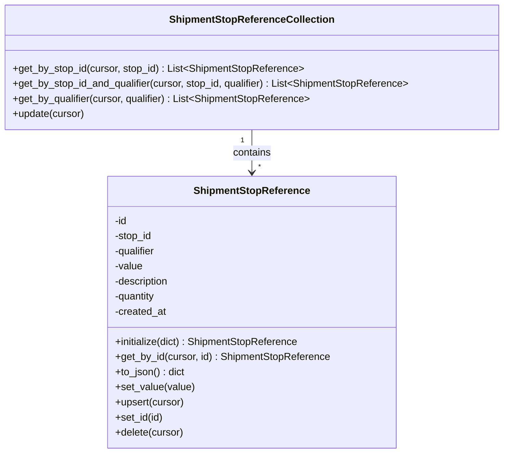

# Diagram: shipment_core/shipment_service/test/test_shipment_stop_reference.py


> Auto-generated by Obscura crawlers

## Diagram 1



### SVG

<svg id="container" width="802.015625" xmlns="http://www.w3.org/2000/svg" class="classDiagram" height="720" viewBox="0 0 802.015625 720" role="graphics-document document" aria-roledescription="class"><style>#container{font-family:"trebuchet ms",verdana,arial,sans-serif;font-size:16px;fill:#333;}@keyframes edge-animation-frame{from{stroke-dashoffset:0;}}@keyframes dash{to{stroke-dashoffset:0;}}#container .edge-animation-slow{stroke-dasharray:9,5!important;stroke-dashoffset:900;animation:dash 50s linear infinite;stroke-linecap:round;}#container .edge-animation-fast{stroke-dasharray:9,5!important;stroke-dashoffset:900;animation:dash 20s linear infinite;stroke-linecap:round;}#container .error-icon{fill:#552222;}#container .error-text{fill:#552222;stroke:#552222;}#container .edge-thickness-normal{stroke-width:1px;}#container .edge-thickness-thick{stroke-width:3.5px;}#container .edge-pattern-solid{stroke-dasharray:0;}#container .edge-thickness-invisible{stroke-width:0;fill:none;}#container .edge-pattern-dashed{stroke-dasharray:3;}#container .edge-pattern-dotted{stroke-dasharray:2;}#container .marker{fill:#333333;stroke:#333333;}#container .marker.cross{stroke:#333333;}#container svg{font-family:"trebuchet ms",verdana,arial,sans-serif;font-size:16px;}#container p{margin:0;}#container g.classGroup text{fill:#9370DB;stroke:none;font-family:"trebuchet ms",verdana,arial,sans-serif;font-size:10px;}#container g.classGroup text .title{font-weight:bolder;}#container .nodeLabel,#container .edgeLabel{color:#131300;}#container .edgeLabel .label rect{fill:#ECECFF;}#container .label text{fill:#131300;}#container .labelBkg{background:#ECECFF;}#container .edgeLabel .label span{background:#ECECFF;}#container .classTitle{font-weight:bolder;}#container .node rect,#container .node circle,#container .node ellipse,#container .node polygon,#container .node path{fill:#ECECFF;stroke:#9370DB;stroke-width:1px;}#container .divider{stroke:#9370DB;stroke-width:1;}#container g.clickable{cursor:pointer;}#container g.classGroup rect{fill:#ECECFF;stroke:#9370DB;}#container g.classGroup line{stroke:#9370DB;stroke-width:1;}#container .classLabel .box{stroke:none;stroke-width:0;fill:#ECECFF;opacity:0.5;}#container .classLabel .label{fill:#9370DB;font-size:10px;}#container .relation{stroke:#333333;stroke-width:1;fill:none;}#container .dashed-line{stroke-dasharray:3;}#container .dotted-line{stroke-dasharray:1 2;}#container #compositionStart,#container .composition{fill:#333333!important;stroke:#333333!important;stroke-width:1;}#container #compositionEnd,#container .composition{fill:#333333!important;stroke:#333333!important;stroke-width:1;}#container #dependencyStart,#container .dependency{fill:#333333!important;stroke:#333333!important;stroke-width:1;}#container #dependencyStart,#container .dependency{fill:#333333!important;stroke:#333333!important;stroke-width:1;}#container #extensionStart,#container .extension{fill:transparent!important;stroke:#333333!important;stroke-width:1;}#container #extensionEnd,#container .extension{fill:transparent!important;stroke:#333333!important;stroke-width:1;}#container #aggregationStart,#container .aggregation{fill:transparent!important;stroke:#333333!important;stroke-width:1;}#container #aggregationEnd,#container .aggregation{fill:transparent!important;stroke:#333333!important;stroke-width:1;}#container #lollipopStart,#container .lollipop{fill:#ECECFF!important;stroke:#333333!important;stroke-width:1;}#container #lollipopEnd,#container .lollipop{fill:#ECECFF!important;stroke:#333333!important;stroke-width:1;}#container .edgeTerminals{font-size:11px;line-height:initial;}#container .classTitleText{text-anchor:middle;font-size:18px;fill:#333;}#container .label-icon{display:inline-block;height:1em;overflow:visible;vertical-align:-0.125em;}#container .node .label-icon path{fill:currentColor;stroke:revert;stroke-width:revert;}#container :root{--mermaid-font-family:"trebuchet ms",verdana,arial,sans-serif;}</style><g><defs><marker id="container_class-aggregationStart" class="marker aggregation class" refX="18" refY="7" markerWidth="190" markerHeight="240" orient="auto"><path d="M 18,7 L9,13 L1,7 L9,1 Z"></path></marker></defs><defs><marker id="container_class-aggregationEnd" class="marker aggregation class" refX="1" refY="7" markerWidth="20" markerHeight="28" orient="auto"><path d="M 18,7 L9,13 L1,7 L9,1 Z"></path></marker></defs><defs><marker id="container_class-extensionStart" class="marker extension class" refX="18" refY="7" markerWidth="190" markerHeight="240" orient="auto"><path d="M 1,7 L18,13 V 1 Z"></path></marker></defs><defs><marker id="container_class-extensionEnd" class="marker extension class" refX="1" refY="7" markerWidth="20" markerHeight="28" orient="auto"><path d="M 1,1 V 13 L18,7 Z"></path></marker></defs><defs><marker id="container_class-compositionStart" class="marker composition class" refX="18" refY="7" markerWidth="190" markerHeight="240" orient="auto"><path d="M 18,7 L9,13 L1,7 L9,1 Z"></path></marker></defs><defs><marker id="container_class-compositionEnd" class="marker composition class" refX="1" refY="7" markerWidth="20" markerHeight="28" orient="auto"><path d="M 18,7 L9,13 L1,7 L9,1 Z"></path></marker></defs><defs><marker id="container_class-dependencyStart" class="marker dependency class" refX="6" refY="7" markerWidth="190" markerHeight="240" orient="auto"><path d="M 5,7 L9,13 L1,7 L9,1 Z"></path></marker></defs><defs><marker id="container_class-dependencyEnd" class="marker dependency class" refX="13" refY="7" markerWidth="20" markerHeight="28" orient="auto"><path d="M 18,7 L9,13 L14,7 L9,1 Z"></path></marker></defs><defs><marker id="container_class-lollipopStart" class="marker lollipop class" refX="13" refY="7" markerWidth="190" markerHeight="240" orient="auto"><circle stroke="black" fill="transparent" cx="7" cy="7" r="6"></circle></marker></defs><defs><marker id="container_class-lollipopEnd" class="marker lollipop class" refX="1" refY="7" markerWidth="190" markerHeight="240" orient="auto"><circle stroke="black" fill="transparent" cx="7" cy="7" r="6"></circle></marker></defs><g class="root"><g class="clusters"></g><g class="edgePaths"><path d="M401.008,206L401.008,212.167C401.008,218.333,401.008,230.667,401.008,242C401.008,253.333,401.008,263.667,401.008,268.833L401.008,274" id="id_ShipmentStopReferenceCollection_ShipmentStopReference_1" class="edge-thickness-normal edge-pattern-solid relation" style=";;;" data-edge="true" data-et="edge" data-id="id_ShipmentStopReferenceCollection_ShipmentStopReference_1" data-points="W3sieCI6NDAxLjAwNzgxMjUsInkiOjIwNn0seyJ4Ijo0MDEuMDA3ODEyNSwieSI6MjQzfSx7IngiOjQwMS4wMDc4MTI1LCJ5IjoyODB9XQ==" marker-end="url(#container_class-dependencyEnd)"></path></g><g class="edgeLabels"><g class="edgeLabel" transform="translate(401.0078125, 243)"><g class="label" data-id="id_ShipmentStopReferenceCollection_ShipmentStopReference_1" transform="translate(-30.890625, -12)"><foreignObject width="61.78125" height="24"><div xmlns="http://www.w3.org/1999/xhtml" class="labelBkg" style="display: table-cell; white-space: nowrap; line-height: 1.5; max-width: 200px; text-align: center;"><span class="edgeLabel"><p>contains</p></span></div></foreignObject></g></g><g class="edgeTerminals" transform="translate(386.0078112500001, 223.49999892857144)"><g class="inner" transform="translate(0, 0)"><foreignObject style="width: 9px; height: 12px;"><div xmlns="http://www.w3.org/1999/xhtml" style="display: inline-block; padding-right: 1px; white-space: nowrap;"><span class="edgeLabel">1</span></div></foreignObject></g></g><g class="edgeTerminals" transform="translate(411.00781125, 257.4999989285714)"><g class="inner" transform="translate(0, 0)"></g><foreignObject style="width: 9px; height: 12px;"><div xmlns="http://www.w3.org/1999/xhtml" style="display: inline-block; padding-right: 1px; white-space: nowrap;"><span class="edgeLabel">*</span></div></foreignObject></g></g><g class="nodes"><g class="node default" id="classId-ShipmentStopReference-0" transform="translate(401.0078125, 496)"><g class="basic label-container"><path d="M-227.3515625 -216 L227.3515625 -216 L227.3515625 216 L-227.3515625 216" stroke="none" stroke-width="0" fill="#ECECFF" style=""></path><path d="M-227.3515625 -216 C-115.40951742039695 -216, -3.467472340793904 -216, 227.3515625 -216 M-227.3515625 -216 C-128.22762224695725 -216, -29.103681993914506 -216, 227.3515625 -216 M227.3515625 -216 C227.3515625 -109.19758755589487, 227.3515625 -2.39517511178974, 227.3515625 216 M227.3515625 -216 C227.3515625 -121.63492957188036, 227.3515625 -27.269859143760726, 227.3515625 216 M227.3515625 216 C129.6684489387004 216, 31.985335377400844 216, -227.3515625 216 M227.3515625 216 C75.19186530036393 216, -76.96783189927214 216, -227.3515625 216 M-227.3515625 216 C-227.3515625 62.53247342475714, -227.3515625 -90.93505315048571, -227.3515625 -216 M-227.3515625 216 C-227.3515625 97.38402648442583, -227.3515625 -21.231947031148337, -227.3515625 -216" stroke="#9370DB" stroke-width="1.3" fill="none" stroke-dasharray="0 0" style=""></path></g><g class="annotation-group text" transform="translate(0, -192)"></g><g class="label-group text" transform="translate(-88.578125, -192)"><g class="label" style="font-weight: bolder" transform="translate(0,-12)"><foreignObject width="177.15625" height="24"><div xmlns="http://www.w3.org/1999/xhtml" style="display: table-cell; white-space: nowrap; line-height: 1.5; max-width: 225px; text-align: center;"><span class="nodeLabel markdown-node-label" style=""><p>ShipmentStopReference</p></span></div></foreignObject></g></g><g class="members-group text" transform="translate(-215.3515625, -144)"><g class="label" style="" transform="translate(0,-12)"><foreignObject width="20.53125" height="24"><div xmlns="http://www.w3.org/1999/xhtml" style="display: table-cell; white-space: nowrap; line-height: 1.5; max-width: 78px; text-align: center;"><span class="nodeLabel markdown-node-label" style=""><p>-id</p></span></div></foreignObject></g><g class="label" style="" transform="translate(0,12)"><foreignObject width="60.390625" height="24"><div xmlns="http://www.w3.org/1999/xhtml" style="display: table-cell; white-space: nowrap; line-height: 1.5; max-width: 118px; text-align: center;"><span class="nodeLabel markdown-node-label" style=""><p>-stop_id</p></span></div></foreignObject></g><g class="label" style="" transform="translate(0,36)"><foreignObject width="67.171875" height="24"><div xmlns="http://www.w3.org/1999/xhtml" style="display: table-cell; white-space: nowrap; line-height: 1.5; max-width: 125px; text-align: center;"><span class="nodeLabel markdown-node-label" style=""><p>-qualifier</p></span></div></foreignObject></g><g class="label" style="" transform="translate(0,60)"><foreignObject width="45.171875" height="24"><div xmlns="http://www.w3.org/1999/xhtml" style="display: table-cell; white-space: nowrap; line-height: 1.5; max-width: 103px; text-align: center;"><span class="nodeLabel markdown-node-label" style=""><p>-value</p></span></div></foreignObject></g><g class="label" style="" transform="translate(0,84)"><foreignObject width="89.0625" height="24"><div xmlns="http://www.w3.org/1999/xhtml" style="display: table-cell; white-space: nowrap; line-height: 1.5; max-width: 146px; text-align: center;"><span class="nodeLabel markdown-node-label" style=""><p>-description</p></span></div></foreignObject></g><g class="label" style="" transform="translate(0,108)"><foreignObject width="67.265625" height="24"><div xmlns="http://www.w3.org/1999/xhtml" style="display: table-cell; white-space: nowrap; line-height: 1.5; max-width: 125px; text-align: center;"><span class="nodeLabel markdown-node-label" style=""><p>-quantity</p></span></div></foreignObject></g><g class="label" style="" transform="translate(0,132)"><foreignObject width="83.375" height="24"><div xmlns="http://www.w3.org/1999/xhtml" style="display: table-cell; white-space: nowrap; line-height: 1.5; max-width: 141px; text-align: center;"><span class="nodeLabel markdown-node-label" style=""><p>-created_at</p></span></div></foreignObject></g></g><g class="methods-group text" transform="translate(-215.3515625, 48)"><g class="label" style="" transform="translate(0,-12)"><foreignObject width="294.9375" height="24"><div xmlns="http://www.w3.org/1999/xhtml" style="display: table-cell; white-space: nowrap; line-height: 1.5; max-width: 352px; text-align: center;"><span class="nodeLabel markdown-node-label" style=""><p>+initialize(dict) : ShipmentStopReference</p></span></div></foreignObject></g><g class="label" style="" transform="translate(0,12)"><foreignObject width="342.125" height="24"><div xmlns="http://www.w3.org/1999/xhtml" style="display: table-cell; white-space: nowrap; line-height: 1.5; max-width: 399px; text-align: center;"><span class="nodeLabel markdown-node-label" style=""><p>+get_by_id(cursor, id) : ShipmentStopReference</p></span></div></foreignObject></g><g class="label" style="" transform="translate(0,36)"><foreignObject width="112.234375" height="24"><div xmlns="http://www.w3.org/1999/xhtml" style="display: table-cell; white-space: nowrap; line-height: 1.5; max-width: 170px; text-align: center;"><span class="nodeLabel markdown-node-label" style=""><p>+to_json() : dict</p></span></div></foreignObject></g><g class="label" style="" transform="translate(0,60)"><foreignObject width="125.921875" height="24"><div xmlns="http://www.w3.org/1999/xhtml" style="display: table-cell; white-space: nowrap; line-height: 1.5; max-width: 183px; text-align: center;"><span class="nodeLabel markdown-node-label" style=""><p>+set_value(value)</p></span></div></foreignObject></g><g class="label" style="" transform="translate(0,84)"><foreignObject width="111.046875" height="24"><div xmlns="http://www.w3.org/1999/xhtml" style="display: table-cell; white-space: nowrap; line-height: 1.5; max-width: 168px; text-align: center;"><span class="nodeLabel markdown-node-label" style=""><p>+upsert(cursor)</p></span></div></foreignObject></g><g class="label" style="" transform="translate(0,108)"><foreignObject width="76.8125" height="24"><div xmlns="http://www.w3.org/1999/xhtml" style="display: table-cell; white-space: nowrap; line-height: 1.5; max-width: 134px; text-align: center;"><span class="nodeLabel markdown-node-label" style=""><p>+set_id(id)</p></span></div></foreignObject></g><g class="label" style="" transform="translate(0,132)"><foreignObject width="109.953125" height="24"><div xmlns="http://www.w3.org/1999/xhtml" style="display: table-cell; white-space: nowrap; line-height: 1.5; max-width: 167px; text-align: center;"><span class="nodeLabel markdown-node-label" style=""><p>+delete(cursor)</p></span></div></foreignObject></g></g><g class="divider" style=""><path d="M-227.3515625 -168 C-110.69179964560753 -168, 5.967963208784937 -168, 227.3515625 -168 M-227.3515625 -168 C-64.23969634755096 -168, 98.87216980489808 -168, 227.3515625 -168" stroke="#9370DB" stroke-width="1.3" fill="none" stroke-dasharray="0 0" style=""></path></g><g class="divider" style=""><path d="M-227.3515625 24 C-78.58971638100252 24, 70.17212973799496 24, 227.3515625 24 M-227.3515625 24 C-71.46380750811821 24, 84.42394748376358 24, 227.3515625 24" stroke="#9370DB" stroke-width="1.3" fill="none" stroke-dasharray="0 0" style=""></path></g></g><g class="node default" id="classId-ShipmentStopReferenceCollection-1" transform="translate(401.0078125, 107)"><g class="basic label-container"><path d="M-393.0078125 -99 L393.0078125 -99 L393.0078125 99 L-393.0078125 99" stroke="none" stroke-width="0" fill="#ECECFF" style=""></path><path d="M-393.0078125 -99 C-193.5686189411061 -99, 5.870574617787781 -99, 393.0078125 -99 M-393.0078125 -99 C-139.992104160024 -99, 113.02360417995197 -99, 393.0078125 -99 M393.0078125 -99 C393.0078125 -42.909460712932216, 393.0078125 13.181078574135569, 393.0078125 99 M393.0078125 -99 C393.0078125 -27.23980345523529, 393.0078125 44.52039308952942, 393.0078125 99 M393.0078125 99 C127.71655747827543 99, -137.57469754344913 99, -393.0078125 99 M393.0078125 99 C121.23285493529079 99, -150.54210262941842 99, -393.0078125 99 M-393.0078125 99 C-393.0078125 28.31522994688686, -393.0078125 -42.36954010622628, -393.0078125 -99 M-393.0078125 99 C-393.0078125 34.26390354836492, -393.0078125 -30.472192903270155, -393.0078125 -99" stroke="#9370DB" stroke-width="1.3" fill="none" stroke-dasharray="0 0" style=""></path></g><g class="annotation-group text" transform="translate(0, -75)"></g><g class="label-group text" transform="translate(-125.28125, -75)"><g class="label" style="font-weight: bolder" transform="translate(0,-12)"><foreignObject width="250.5625" height="24"><div xmlns="http://www.w3.org/1999/xhtml" style="display: table-cell; white-space: nowrap; line-height: 1.5; max-width: 297px; text-align: center;"><span class="nodeLabel markdown-node-label" style=""><p>ShipmentStopReferenceCollection</p></span></div></foreignObject></g></g><g class="members-group text" transform="translate(-381.0078125, -27)"></g><g class="methods-group text" transform="translate(-381.0078125, 3)"><g class="label" style="" transform="translate(0,-12)"><foreignObject width="463.5625" height="24"><div xmlns="http://www.w3.org/1999/xhtml" style="display: table-cell; white-space: nowrap; line-height: 1.5; max-width: 561px; text-align: center;"><span class="nodeLabel markdown-node-label" style=""><p>+get_by_stop_id(cursor, stop_id) : List&lt;ShipmentStopReference&gt;</p></span></div></foreignObject></g><g class="label" style="" transform="translate(0,12)"><foreignObject width="636.734375" height="24"><div xmlns="http://www.w3.org/1999/xhtml" style="display: table-cell; white-space: nowrap; line-height: 1.5; max-width: 734px; text-align: center;"><span class="nodeLabel markdown-node-label" style=""><p>+get_by_stop_id_and_qualifier(cursor, stop_id, qualifier) : List&lt;ShipmentStopReference&gt;</p></span></div></foreignObject></g><g class="label" style="" transform="translate(0,36)"><foreignObject width="476.8125" height="24"><div xmlns="http://www.w3.org/1999/xhtml" style="display: table-cell; white-space: nowrap; line-height: 1.5; max-width: 574px; text-align: center;"><span class="nodeLabel markdown-node-label" style=""><p>+get_by_qualifier(cursor, qualifier) : List&lt;ShipmentStopReference&gt;</p></span></div></foreignObject></g><g class="label" style="" transform="translate(0,60)"><foreignObject width="115.4375" height="24"><div xmlns="http://www.w3.org/1999/xhtml" style="display: table-cell; white-space: nowrap; line-height: 1.5; max-width: 173px; text-align: center;"><span class="nodeLabel markdown-node-label" style=""><p>+update(cursor)</p></span></div></foreignObject></g></g><g class="divider" style=""><path d="M-393.0078125 -51 C-128.17127373334642 -51, 136.66526503330715 -51, 393.0078125 -51 M-393.0078125 -51 C-163.67763835949611 -51, 65.65253578100777 -51, 393.0078125 -51" stroke="#9370DB" stroke-width="1.3" fill="none" stroke-dasharray="0 0" style=""></path></g><g class="divider" style=""><path d="M-393.0078125 -27 C-230.24442142234156 -27, -67.48103034468312 -27, 393.0078125 -27 M-393.0078125 -27 C-186.3734619164327 -27, 20.260888667134623 -27, 393.0078125 -27" stroke="#9370DB" stroke-width="1.3" fill="none" stroke-dasharray="0 0" style=""></path></g></g></g></g></g></svg>

## Diagram 2

```mermaid
flowchart LR
    Start([Start])
    InitObj[Initialize ShipmentStopReference instance]
    PrintInit[Print initialized instance and JSON]
    DBConn[Open psycopg2 DB connection]
    WithCursor[Create DB cursor context]
    GetById[ShipmentStopReference.get_by_id(cursor, 101501)]
    PrintById[Print retrieved JSON]
    ModifyValue[set_value(value + "0")]
    Upsert1[upsert(cursor) // update existing]
    ClearId[set_id(None)]
    Upsert2[upsert(cursor) // insert new]
    PrintInserted[Print "Inserted: id"]
    DeleteRef[delete(cursor)]
    CollByStop[ShipmentStopReferenceCollection.get_by_stop_id(cursor, 8741083)]
    PrintColl1[Iterate and print items]
    UpdateColl[stop_references.update(cursor)]
    CollByStopQual[ShipmentStopReferenceCollection.get_by_stop_id_and_qualifier(cursor, 8741083, "XVIN")]
    PrintColl2[Iterate and print items]
    CollByQual[ShipmentStopReferenceCollection.get_by_qualifier(cursor, "XVIN")]
    PrintColl3[Iterate and print items and print count]
    End([End])

    Start --> InitObj --> PrintInit --> DBConn --> WithCursor
    WithCursor --> GetById --> PrintById --> ModifyValue --> Upsert1 --> ClearId --> Upsert2 --> PrintInserted --> DeleteRef
    DeleteRef --> CollByStop --> PrintColl1 --> UpdateColl --> CollByStopQual --> PrintColl2 --> CollByQual --> PrintColl3 --> End
```

> SVG rendering failed for this diagram.
