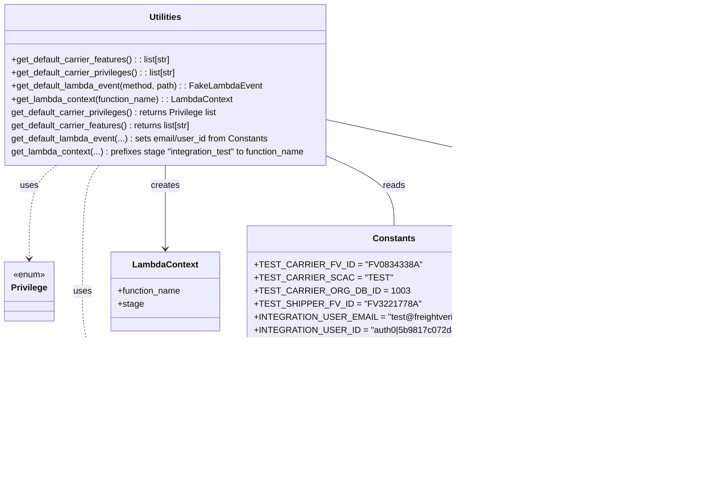

# Diagram: shipment_core/shipment_service/test/test_utilities/lambda_helpers.py

> Auto-generated by Obscura crawlers

## Mermaid

### SVG

<svg id="container" width="1245.8984375" xmlns="http://www.w3.org/2000/svg" class="classDiagram" height="878" viewBox="0 0 1245.8984375 878" role="graphics-document document" aria-roledescription="class"><g><defs><marker id="container_class-aggregationStart" class="marker aggregation class" refX="18" refY="7" markerWidth="190" markerHeight="240" orient="auto"><path d="M 18,7 L9,13 L1,7 L9,1 Z"></path></marker></defs><defs><marker id="container_class-aggregationEnd" class="marker aggregation class" refX="1" refY="7" markerWidth="20" markerHeight="28" orient="auto"><path d="M 18,7 L9,13 L1,7 L9,1 Z"></path></marker></defs><defs><marker id="container_class-extensionStart" class="marker extension class" refX="18" refY="7" markerWidth="190" markerHeight="240" orient="auto"><path d="M 1,7 L18,13 V 1 Z"></path></marker></defs><defs><marker id="container_class-extensionEnd" class="marker extension class" refX="1" refY="7" markerWidth="20" markerHeight="28" orient="auto"><path d="M 1,1 V 13 L18,7 Z"></path></marker></defs><defs><marker id="container_class-compositionStart" class="marker composition class" refX="18" refY="7" markerWidth="190" markerHeight="240" orient="auto"><path d="M 18,7 L9,13 L1,7 L9,1 Z"></path></marker></defs><defs><marker id="container_class-compositionEnd" class="marker composition class" refX="1" refY="7" markerWidth="20" markerHeight="28" orient="auto"><path d="M 18,7 L9,13 L1,7 L9,1 Z"></path></marker></defs><defs><marker id="container_class-dependencyStart" class="marker dependency class" refX="6" refY="7" markerWidth="190" markerHeight="240" orient="auto"><path d="M 5,7 L9,13 L1,7 L9,1 Z"></path></marker></defs><defs><marker id="container_class-dependencyEnd" class="marker dependency class" refX="13" refY="7" markerWidth="20" markerHeight="28" orient="auto"><path d="M 18,7 L9,13 L14,7 L9,1 Z"></path></marker></defs><defs><marker id="container_class-lollipopStart" class="marker lollipop class" refX="13" refY="7" markerWidth="190" markerHeight="240" orient="auto"><circle stroke="black" fill="transparent" cx="7" cy="7" r="6"></circle></marker></defs><defs><marker id="container_class-lollipopEnd" class="marker lollipop class" refX="1" refY="7" markerWidth="190" markerHeight="240" orient="auto"><circle stroke="black" fill="transparent" cx="7" cy="7" r="6"></circle></marker></defs><g class="root"><g class="clusters"></g><g class="edgePaths"><path d="M606.844,222.617L692.739,242.014C778.634,261.411,950.424,300.206,1036.32,324.769C1122.215,349.333,1122.215,359.667,1122.215,364.833L1122.215,370" id="id_Utilities_FakeLambdaEvent_1" class="edge-thickness-normal edge-pattern-solid relation" style=";;;" data-edge="true" data-et="edge" data-id="id_Utilities_FakeLambdaEvent_1" data-points="W3sieCI6NjA2Ljg0Mzc1LCJ5IjoyMjIuNjE2NzE2Mjg2MjQ5ODd9LHsieCI6MTEyMi4yMTQ4NDM3NSwieSI6MzM5fSx7IngiOjExMjIuMjE0ODQzNzUsInkiOjM3Nn1d" marker-end="url(#container_class-dependencyEnd)"></path><path d="M307.422,302L307.422,308.167C307.422,314.333,307.422,326.667,307.422,352C307.422,377.333,307.422,415.667,307.422,434.833L307.422,454" id="id_Utilities_LambdaContext_2" class="edge-thickness-normal edge-pattern-solid relation" style=";;;" data-edge="true" data-et="edge" data-id="id_Utilities_LambdaContext_2" data-points="W3sieCI6MzA3LjQyMTg3NSwieSI6MzAyfSx7IngiOjMwNy40MjE4NzUsInkiOjMzOX0seyJ4IjozMDcuNDIxODc1LCJ5Ijo0NjB9XQ==" marker-end="url(#container_class-dependencyEnd)"></path><path d="M110.777,302L102.528,308.167C94.278,314.333,77.78,326.667,69.531,355C61.281,383.333,61.281,427.667,61.281,449.833L61.281,472" id="id_Utilities_Privilege_3" class="edge-thickness-normal edge-pattern-dashed relation" style=";;;" data-edge="true" data-et="edge" data-id="id_Utilities_Privilege_3" data-points="W3sieCI6MTEwLjc3NjkxOTE1NzYwODY5LCJ5IjozMDJ9LHsieCI6NjEuMjgxMjUsInkiOjMzOX0seyJ4Ijo2MS4yODEyNSwieSI6NDc4fV0=" marker-end="url(#container_class-dependencyEnd)"></path><path d="M186.961,302L181.907,308.167C176.854,314.333,166.747,326.667,161.694,365C156.641,403.333,156.641,467.667,156.641,532C156.641,596.333,156.641,660.667,228.414,706.362C300.188,752.057,443.735,779.114,515.508,792.643L587.282,806.171" id="id_Utilities_OrgTypes_4" class="edge-thickness-normal edge-pattern-dashed relation" style=";;;" data-edge="true" data-et="edge" data-id="id_Utilities_OrgTypes_4" data-points="W3sieCI6MTg2Ljk2MDc2NzY2MzA0MzUsInkiOjMwMn0seyJ4IjoxNTYuNjQwNjI1LCJ5IjozMzl9LHsieCI6MTU2LjY0MDYyNSwieSI6NTMyfSx7IngiOjE1Ni42NDA2MjUsInkiOjcyNX0seyJ4Ijo1OTMuMTc3NzM0Mzc1LCJ5Ijo4MDcuMjgyMzg5NDQ2MDQ2OX1d" marker-end="url(#container_class-dependencyEnd)"></path><path d="M606.844,293.01L623.473,300.675C640.103,308.34,673.362,323.67,689.992,343.502C706.621,363.333,706.621,387.667,706.621,399.833L706.621,412" id="id_Utilities_Constants_5" class="edge-thickness-normal edge-pattern-solid relation" style=";;;" data-edge="true" data-et="edge" data-id="id_Utilities_Constants_5" data-points="W3sieCI6NjA2Ljg0Mzc1LCJ5IjoyOTMuMDEwMzUyNzU2OTg0MTZ9LHsieCI6NzA2LjYyMTA5Mzc1LCJ5IjozMzl9LHsieCI6NzA2LjYyMTA5Mzc1LCJ5Ijo0MTJ9XQ=="></path><path d="M1122.215,688L1122.215,694.167C1122.215,700.333,1122.215,712.667,1050.441,732.362C978.668,752.057,835.121,779.114,763.347,792.643L691.574,806.171" id="id_FakeLambdaEvent_OrgTypes_6" class="edge-thickness-normal edge-pattern-solid relation" style=";;;" data-edge="true" data-et="edge" data-id="id_FakeLambdaEvent_OrgTypes_6" data-points="W3sieCI6MTEyMi4yMTQ4NDM3NSwieSI6Njg4fSx7IngiOjExMjIuMjE0ODQzNzUsInkiOjcyNX0seyJ4Ijo2ODUuNjc3NzM0Mzc1LCJ5Ijo4MDcuMjgyMzg5NDQ2MDQ2OX1d" marker-end="url(#container_class-dependencyEnd)"></path></g><g class="edgeLabels"><g class="edgeLabel" transform="translate(1122.21484375, 339)"><g class="label" data-id="id_Utilities_FakeLambdaEvent_1" transform="translate(-26.171875, -12)"><foreignObject width="52.34375" height="24">

creates

</foreignObject></g></g><g class="edgeLabel" transform="translate(307.421875, 339)"><g class="label" data-id="id_Utilities_LambdaContext_2" transform="translate(-26.171875, -12)"><foreignObject width="52.34375" height="24">

creates

</foreignObject></g></g><g class="edgeLabel" transform="translate(61.28125, 339)"><g class="label" data-id="id_Utilities_Privilege_3" transform="translate(-16.4921875, -12)"><foreignObject width="32.984375" height="24">

uses

</foreignObject></g></g><g class="edgeLabel" transform="translate(156.640625, 532)"><g class="label" data-id="id_Utilities_OrgTypes_4" transform="translate(-16.4921875, -12)"><foreignObject width="32.984375" height="24">

uses

</foreignObject></g></g><g class="edgeLabel" transform="translate(706.62109375, 339)"><g class="label" data-id="id_Utilities_Constants_5" transform="translate(-20.0078125, -12)"><foreignObject width="40.015625" height="24">

reads

</foreignObject></g></g><g class="edgeLabel" transform="translate(1122.21484375, 725)"><g class="label" data-id="id_FakeLambdaEvent_OrgTypes_6" transform="translate(-76.2734375, -12)"><foreignObject width="152.546875" height="24">

org_profiles contains

</foreignObject></g></g></g><g class="nodes"><g class="node default" id="classId-Privilege-0" transform="translate(61.28125, 532)"><g class="basic label-container"><path d="M-43.8671875 -54 L43.8671875 -54 L43.8671875 54 L-43.8671875 54" stroke="none" stroke-width="0" fill="#ECECFF" style=""></path><path d="M-43.8671875 -54 C-10.017823199677103 -54, 23.831541100645794 -54, 43.8671875 -54 M-43.8671875 -54 C-22.952337188110505 -54, -2.03748687622101 -54, 43.8671875 -54 M43.8671875 -54 C43.8671875 -21.297350935594544, 43.8671875 11.405298128810912, 43.8671875 54 M43.8671875 -54 C43.8671875 -19.930132643981935, 43.8671875 14.13973471203613, 43.8671875 54 M43.8671875 54 C21.616072467243573 54, -0.6350425655128547 54, -43.8671875 54 M43.8671875 54 C16.81630925674519 54, -10.234568986509622 54, -43.8671875 54 M-43.8671875 54 C-43.8671875 30.050170907303187, -43.8671875 6.100341814606374, -43.8671875 -54 M-43.8671875 54 C-43.8671875 14.320445511346158, -43.8671875 -25.359108977307685, -43.8671875 -54" stroke="#9370DB" stroke-width="1.3" fill="none" stroke-dasharray="0 0" style=""></path></g><g class="annotation-group text" transform="translate(-29.53125, -30)"><g class="label" style="" transform="translate(0,-12)"><foreignObject width="59.0625" height="24">

«enum»

</foreignObject></g></g><g class="label-group text" transform="translate(-31.8671875, -6)"><g class="label" style="font-weight: bolder" transform="translate(0,-12)"><foreignObject width="63.734375" height="24">

Privilege

</foreignObject></g></g><g class="members-group text" transform="translate(-31.8671875, 42)"></g><g class="methods-group text" transform="translate(-31.8671875, 72)"></g><g class="divider" style=""><path d="M-43.8671875 18 C-9.567729810442152 18, 24.731727879115695 18, 43.8671875 18 M-43.8671875 18 C-9.315672526908678 18, 25.235842446182644 18, 43.8671875 18" stroke="#9370DB" stroke-width="1.3" fill="none" stroke-dasharray="0 0" style=""></path></g><g class="divider" style=""><path d="M-43.8671875 36 C-12.933128890503944 36, 18.00092971899211 36, 43.8671875 36 M-43.8671875 36 C-17.635027917948676 36, 8.597131664102648 36, 43.8671875 36" stroke="#9370DB" stroke-width="1.3" fill="none" stroke-dasharray="0 0" style=""></path></g></g><g class="node default" id="classId-OrgTypes-1" transform="translate(639.427734375, 816)"><g class="basic label-container"><path d="M-46.25 -54 L46.25 -54 L46.25 54 L-46.25 54" stroke="none" stroke-width="0" fill="#ECECFF" style=""></path><path d="M-46.25 -54 C-18.38426492247863 -54, 9.481470155042743 -54, 46.25 -54 M-46.25 -54 C-9.977975819335732 -54, 26.294048361328535 -54, 46.25 -54 M46.25 -54 C46.25 -24.81358038925074, 46.25 4.372839221498523, 46.25 54 M46.25 -54 C46.25 -29.81411692846539, 46.25 -5.628233856930777, 46.25 54 M46.25 54 C25.049210666278874 54, 3.8484213325577485 54, -46.25 54 M46.25 54 C11.162256229738105 54, -23.92548754052379 54, -46.25 54 M-46.25 54 C-46.25 12.815890408228732, -46.25 -28.368219183542536, -46.25 -54 M-46.25 54 C-46.25 24.53783103367311, -46.25 -4.924337932653778, -46.25 -54" stroke="#9370DB" stroke-width="1.3" fill="none" stroke-dasharray="0 0" style=""></path></g><g class="annotation-group text" transform="translate(-29.53125, -30)"><g class="label" style="" transform="translate(0,-12)"><foreignObject width="59.0625" height="24">

«enum»

</foreignObject></g></g><g class="label-group text" transform="translate(-34.25, -6)"><g class="label" style="font-weight: bolder" transform="translate(0,-12)"><foreignObject width="68.5" height="24">

OrgTypes

</foreignObject></g></g><g class="members-group text" transform="translate(-34.25, 42)"></g><g class="methods-group text" transform="translate(-34.25, 72)"></g><g class="divider" style=""><path d="M-46.25 18 C-23.267649269124536 18, -0.2852985382490729 18, 46.25 18 M-46.25 18 C-23.216118630222123 18, -0.18223726044424637 18, 46.25 18" stroke="#9370DB" stroke-width="1.3" fill="none" stroke-dasharray="0 0" style=""></path></g><g class="divider" style=""><path d="M-46.25 36 C-14.486961696295907 36, 17.276076607408186 36, 46.25 36 M-46.25 36 C-23.825078933985125 36, -1.4001578679702504 36, 46.25 36" stroke="#9370DB" stroke-width="1.3" fill="none" stroke-dasharray="0 0" style=""></path></g></g><g class="node default" id="classId-FakeLambdaEvent-2" transform="translate(1122.21484375, 532)"><g class="basic label-container"><path d="M-115.68359375 -156 L115.68359375 -156 L115.68359375 156 L-115.68359375 156" stroke="none" stroke-width="0" fill="#ECECFF" style=""></path><path d="M-115.68359375 -156 C-43.79112941746611 -156, 28.10133491506778 -156, 115.68359375 -156 M-115.68359375 -156 C-59.77383703303851 -156, -3.864080316077022 -156, 115.68359375 -156 M115.68359375 -156 C115.68359375 -58.422238429003244, 115.68359375 39.15552314199351, 115.68359375 156 M115.68359375 -156 C115.68359375 -65.36311241202075, 115.68359375 25.27377517595849, 115.68359375 156 M115.68359375 156 C39.66068295064311 156, -36.362227848713786 156, -115.68359375 156 M115.68359375 156 C62.02813702928684 156, 8.372680308573678 156, -115.68359375 156 M-115.68359375 156 C-115.68359375 91.32932663488891, -115.68359375 26.65865326977783, -115.68359375 -156 M-115.68359375 156 C-115.68359375 61.04680295406804, -115.68359375 -33.906394091863916, -115.68359375 -156" stroke="#9370DB" stroke-width="1.3" fill="none" stroke-dasharray="0 0" style=""></path></g><g class="annotation-group text" transform="translate(0, -132)"></g><g class="label-group text" transform="translate(-65.8671875, -132)"><g class="label" style="font-weight: bolder" transform="translate(0,-12)"><foreignObject width="131.734375" height="24">

FakeLambdaEvent

</foreignObject></g></g><g class="members-group text" transform="translate(-103.68359375, -84)"><g class="label" style="" transform="translate(0,-12)"><foreignObject width="102.921875" height="24">

+http_method

</foreignObject></g><g class="label" style="" transform="translate(0,12)"><foreignObject width="41.1875" height="24">

+path

</foreignObject></g><g class="label" style="" transform="translate(0,36)"><foreignObject width="48.328125" height="24">

+email

</foreignObject></g><g class="label" style="" transform="translate(0,60)"><foreignObject width="60.796875" height="24">

+user_id

</foreignObject></g><g class="label" style="" transform="translate(0,84)"><foreignObject width="67.1875" height="24">

+features

</foreignObject></g><g class="label" style="" transform="translate(0,108)"><foreignObject width="78.15625" height="24">

+privileges

</foreignObject></g><g class="label" style="" transform="translate(0,132)"><foreignObject width="120.75" height="24">

+organization_id

</foreignObject></g><g class="label" style="" transform="translate(0,156)"><foreignObject width="141.5" height="24">

+organization_fv_id

</foreignObject></g><g class="label" style="" transform="translate(0,180)"><foreignObject width="94.515625" height="24">

+org_profiles

</foreignObject></g></g><g class="methods-group text" transform="translate(-103.68359375, 156)"></g><g class="divider" style=""><path d="M-115.68359375 -108 C-44.07432139214974 -108, 27.534950965700517 -108, 115.68359375 -108 M-115.68359375 -108 C-58.70345438863304 -108, -1.7233150272660822 -108, 115.68359375 -108" stroke="#9370DB" stroke-width="1.3" fill="none" stroke-dasharray="0 0" style=""></path></g><g class="divider" style=""><path d="M-115.68359375 132 C-28.891767736137382 132, 57.900058277725236 132, 115.68359375 132 M-115.68359375 132 C-54.342154129138024 132, 6.999285491723953 132, 115.68359375 132" stroke="#9370DB" stroke-width="1.3" fill="none" stroke-dasharray="0 0" style=""></path></g></g><g class="node default" id="classId-LambdaContext-3" transform="translate(307.421875, 532)"><g class="basic label-container"><path d="M-99.2890625 -72 L99.2890625 -72 L99.2890625 72 L-99.2890625 72" stroke="none" stroke-width="0" fill="#ECECFF" style=""></path><path d="M-99.2890625 -72 C-55.60815391329488 -72, -11.927245326589755 -72, 99.2890625 -72 M-99.2890625 -72 C-41.18976731053363 -72, 16.909527878932735 -72, 99.2890625 -72 M99.2890625 -72 C99.2890625 -19.816238455498194, 99.2890625 32.36752308900361, 99.2890625 72 M99.2890625 -72 C99.2890625 -35.57308933869464, 99.2890625 0.8538213226107132, 99.2890625 72 M99.2890625 72 C59.22884937828661 72, 19.168636256573222 72, -99.2890625 72 M99.2890625 72 C46.11361213205439 72, -7.061838235891216 72, -99.2890625 72 M-99.2890625 72 C-99.2890625 42.83994715999769, -99.2890625 13.679894319995377, -99.2890625 -72 M-99.2890625 72 C-99.2890625 21.565904882609154, -99.2890625 -28.868190234781693, -99.2890625 -72" stroke="#9370DB" stroke-width="1.3" fill="none" stroke-dasharray="0 0" style=""></path></g><g class="annotation-group text" transform="translate(0, -48)"></g><g class="label-group text" transform="translate(-57.296875, -48)"><g class="label" style="font-weight: bolder" transform="translate(0,-12)"><foreignObject width="114.59375" height="24">

LambdaContext

</foreignObject></g></g><g class="members-group text" transform="translate(-87.2890625, 0)"><g class="label" style="" transform="translate(0,-12)"><foreignObject width="117.28125" height="24">

+function_name

</foreignObject></g><g class="label" style="" transform="translate(0,12)"><foreignObject width="46.453125" height="24">

+stage

</foreignObject></g></g><g class="methods-group text" transform="translate(-87.2890625, 72)"></g><g class="divider" style=""><path d="M-99.2890625 -24 C-42.744436662387216 -24, 13.800189175225569 -24, 99.2890625 -24 M-99.2890625 -24 C-35.690148159874894 -24, 27.90876618025021 -24, 99.2890625 -24" stroke="#9370DB" stroke-width="1.3" fill="none" stroke-dasharray="0 0" style=""></path></g><g class="divider" style=""><path d="M-99.2890625 48 C-40.31389718703246 48, 18.66126812593508 48, 99.2890625 48 M-99.2890625 48 C-54.48160409174169 48, -9.674145683483374 48, 99.2890625 48" stroke="#9370DB" stroke-width="1.3" fill="none" stroke-dasharray="0 0" style=""></path></g></g><g class="node default" id="classId-Constants-4" transform="translate(706.62109375, 532)"><g class="basic label-container"><path d="M-249.91015625 -120 L249.91015625 -120 L249.91015625 120 L-249.91015625 120" stroke="none" stroke-width="0" fill="#ECECFF" style=""></path><path d="M-249.91015625 -120 C-84.4705676171429 -120, 80.96902101571419 -120, 249.91015625 -120 M-249.91015625 -120 C-101.24377961714364 -120, 47.42259701571271 -120, 249.91015625 -120 M249.91015625 -120 C249.91015625 -65.95932754227121, 249.91015625 -11.918655084542408, 249.91015625 120 M249.91015625 -120 C249.91015625 -36.032901273416826, 249.91015625 47.93419745316635, 249.91015625 120 M249.91015625 120 C117.11216024119202 120, -15.68583576761597 120, -249.91015625 120 M249.91015625 120 C145.430446218164 120, 40.950736186328015 120, -249.91015625 120 M-249.91015625 120 C-249.91015625 26.814280197388555, -249.91015625 -66.37143960522289, -249.91015625 -120 M-249.91015625 120 C-249.91015625 63.372499625082945, -249.91015625 6.74499925016589, -249.91015625 -120" stroke="#9370DB" stroke-width="1.3" fill="none" stroke-dasharray="0 0" style=""></path></g><g class="annotation-group text" transform="translate(0, -96)"></g><g class="label-group text" transform="translate(-36.5390625, -96)"><g class="label" style="font-weight: bolder" transform="translate(0,-12)"><foreignObject width="73.078125" height="24">

Constants

</foreignObject></g></g><g class="members-group text" transform="translate(-237.91015625, -48)"><g class="label" style="" transform="translate(0,-12)"><foreignObject width="268.8125" height="24">

+TEST_CARRIER_FV_ID = "FV0834338A"

</foreignObject></g><g class="label" style="" transform="translate(0,12)"><foreignObject width="214.359375" height="24">

+TEST_CARRIER_SCAC = "TEST"

</foreignObject></g><g class="label" style="" transform="translate(0,36)"><foreignObject width="246.6875" height="24">

+TEST_CARRIER_ORG_DB_ID = 1003

</foreignObject></g><g class="label" style="" transform="translate(0,60)"><foreignObject width="264.0625" height="24">

+TEST_SHIPPER_FV_ID = "FV3221778A"

</foreignObject></g><g class="label" style="" transform="translate(0,84)"><foreignObject width="423.75" height="24">

+INTEGRATION_USER_EMAIL = "test@freightverify-api.com"

</foreignObject></g><g class="label" style="" transform="translate(0,108)"><foreignObject width="439.28125" height="24">

+INTEGRATION_USER_ID = "auth0|5b9817c072d4bb47f9a5fae1"

</foreignObject></g></g><g class="methods-group text" transform="translate(-237.91015625, 120)"></g><g class="divider" style=""><path d="M-249.91015625 -72 C-64.47193425987612 -72, 120.96628773024776 -72, 249.91015625 -72 M-249.91015625 -72 C-81.37856283163634 -72, 87.15303058672731 -72, 249.91015625 -72" stroke="#9370DB" stroke-width="1.3" fill="none" stroke-dasharray="0 0" style=""></path></g><g class="divider" style=""><path d="M-249.91015625 96 C-144.29219525929307 96, -38.67423426858613 96, 249.91015625 96 M-249.91015625 96 C-78.37324607810265 96, 93.1636640937947 96, 249.91015625 96" stroke="#9370DB" stroke-width="1.3" fill="none" stroke-dasharray="0 0" style=""></path></g></g><g class="node default" id="classId-Utilities-5" transform="translate(307.421875, 155)"><g class="basic label-container"><path d="M-299.421875 -147 L299.421875 -147 L299.421875 147 L-299.421875 147" stroke="none" stroke-width="0" fill="#ECECFF" style=""></path><path d="M-299.421875 -147 C-116.91569524874745 -147, 65.59048450250509 -147, 299.421875 -147 M-299.421875 -147 C-153.1662875002523 -147, -6.910700000504619 -147, 299.421875 -147 M299.421875 -147 C299.421875 -62.528292637403894, 299.421875 21.943414725192213, 299.421875 147 M299.421875 -147 C299.421875 -50.92229136261204, 299.421875 45.155417274775914, 299.421875 147 M299.421875 147 C65.71022935788682 147, -168.00141628422637 147, -299.421875 147 M299.421875 147 C126.79562235483033 147, -45.83063029033934 147, -299.421875 147 M-299.421875 147 C-299.421875 42.85445641608635, -299.421875 -61.2910871678273, -299.421875 -147 M-299.421875 147 C-299.421875 78.16212934536148, -299.421875 9.324258690722957, -299.421875 -147" stroke="#9370DB" stroke-width="1.3" fill="none" stroke-dasharray="0 0" style=""></path></g><g class="annotation-group text" transform="translate(0, -123)"></g><g class="label-group text" transform="translate(-28.8125, -123)"><g class="label" style="font-weight: bolder" transform="translate(0,-12)"><foreignObject width="57.625" height="24">

Utilities

</foreignObject></g></g><g class="members-group text" transform="translate(-287.421875, -75)"></g><g class="methods-group text" transform="translate(-287.421875, -45)"><g class="label" style="" transform="translate(0,-12)"><foreignObject width="295.390625" height="24">

+get_default_carrier_features() : : list[str]

</foreignObject></g><g class="label" style="" transform="translate(0,12)"><foreignObject width="306.421875" height="24">

+get_default_carrier_privileges() : : list[str]

</foreignObject></g><g class="label" style="" transform="translate(0,36)"><foreignObject width="460.453125" height="24">

+get_default_lambda_event(method, path) : : FakeLambdaEvent

</foreignObject></g><g class="label" style="" transform="translate(0,60)"><foreignObject width="408.515625" height="24">

+get_lambda_context(function_name) : : LambdaContext

</foreignObject></g><g class="label" style="" transform="translate(0,84)"><foreignObject width="383.796875" height="24">

get_default_carrier_privileges() : returns Privilege list

</foreignObject></g><g class="label" style="" transform="translate(0,108)"><foreignObject width="336.09375" height="24">

get_default_carrier_features() : returns list[str]

</foreignObject></g><g class="label" style="" transform="translate(0,132)"><foreignObject width="476.921875" height="24">

get_default_lambda_event(...) : sets email/user_id from Constants

</foreignObject></g><g class="label" style="" transform="translate(0,156)"><foreignObject width="546.03125" height="24">

get_lambda_context(...) : prefixes stage "integration_test" to function_name

</foreignObject></g></g><g class="divider" style=""><path d="M-299.421875 -99 C-139.9207964756325 -99, 19.580282048735 -99, 299.421875 -99 M-299.421875 -99 C-132.8548249562232 -99, 33.71222508755358 -99, 299.421875 -99" stroke="#9370DB" stroke-width="1.3" fill="none" stroke-dasharray="0 0" style=""></path></g><g class="divider" style=""><path d="M-299.421875 -75 C-97.81161613100036 -75, 103.79864273799927 -75, 299.421875 -75 M-299.421875 -75 C-154.96044616204685 -75, -10.4990173240937 -75, 299.421875 -75" stroke="#9370DB" stroke-width="1.3" fill="none" stroke-dasharray="0 0" style=""></path></g></g></g></g></g></svg>
