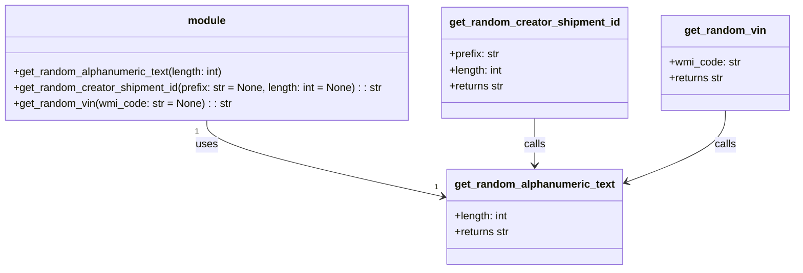

# Diagram: shipment_core/shipment_service/test/test_utilities/random_values.py


> Auto-generated by Obscura crawlers

## Diagram 1

```mermaid
flowchart TD
    subgraph Module["module"]
        direction TB
        GRA[get_random_alphanumeric_text(length)]
        GRS[get_random_creator_shipment_id(prefix, length)]
        GRV[get_random_vin(wmi_code)]
    end
    GRS -->|calls| GRA
    GRV -->|calls| GRA
    GRA -->|uses| RNG[SystemRandom.choice]
    RNG -->|from| STR[string.ascii_uppercase + string.digits]
```

> SVG rendering failed for this diagram.

## Diagram 2



### SVG

<svg id="container" width="1192.65625" xmlns="http://www.w3.org/2000/svg" class="classDiagram" height="408" viewBox="0 0 1192.65625 408" role="graphics-document document" aria-roledescription="class"><style>#container{font-family:"trebuchet ms",verdana,arial,sans-serif;font-size:16px;fill:#333;}@keyframes edge-animation-frame{from{stroke-dashoffset:0;}}@keyframes dash{to{stroke-dashoffset:0;}}#container .edge-animation-slow{stroke-dasharray:9,5!important;stroke-dashoffset:900;animation:dash 50s linear infinite;stroke-linecap:round;}#container .edge-animation-fast{stroke-dasharray:9,5!important;stroke-dashoffset:900;animation:dash 20s linear infinite;stroke-linecap:round;}#container .error-icon{fill:#552222;}#container .error-text{fill:#552222;stroke:#552222;}#container .edge-thickness-normal{stroke-width:1px;}#container .edge-thickness-thick{stroke-width:3.5px;}#container .edge-pattern-solid{stroke-dasharray:0;}#container .edge-thickness-invisible{stroke-width:0;fill:none;}#container .edge-pattern-dashed{stroke-dasharray:3;}#container .edge-pattern-dotted{stroke-dasharray:2;}#container .marker{fill:#333333;stroke:#333333;}#container .marker.cross{stroke:#333333;}#container svg{font-family:"trebuchet ms",verdana,arial,sans-serif;font-size:16px;}#container p{margin:0;}#container g.classGroup text{fill:#9370DB;stroke:none;font-family:"trebuchet ms",verdana,arial,sans-serif;font-size:10px;}#container g.classGroup text .title{font-weight:bolder;}#container .nodeLabel,#container .edgeLabel{color:#131300;}#container .edgeLabel .label rect{fill:#ECECFF;}#container .label text{fill:#131300;}#container .labelBkg{background:#ECECFF;}#container .edgeLabel .label span{background:#ECECFF;}#container .classTitle{font-weight:bolder;}#container .node rect,#container .node circle,#container .node ellipse,#container .node polygon,#container .node path{fill:#ECECFF;stroke:#9370DB;stroke-width:1px;}#container .divider{stroke:#9370DB;stroke-width:1;}#container g.clickable{cursor:pointer;}#container g.classGroup rect{fill:#ECECFF;stroke:#9370DB;}#container g.classGroup line{stroke:#9370DB;stroke-width:1;}#container .classLabel .box{stroke:none;stroke-width:0;fill:#ECECFF;opacity:0.5;}#container .classLabel .label{fill:#9370DB;font-size:10px;}#container .relation{stroke:#333333;stroke-width:1;fill:none;}#container .dashed-line{stroke-dasharray:3;}#container .dotted-line{stroke-dasharray:1 2;}#container #compositionStart,#container .composition{fill:#333333!important;stroke:#333333!important;stroke-width:1;}#container #compositionEnd,#container .composition{fill:#333333!important;stroke:#333333!important;stroke-width:1;}#container #dependencyStart,#container .dependency{fill:#333333!important;stroke:#333333!important;stroke-width:1;}#container #dependencyStart,#container .dependency{fill:#333333!important;stroke:#333333!important;stroke-width:1;}#container #extensionStart,#container .extension{fill:transparent!important;stroke:#333333!important;stroke-width:1;}#container #extensionEnd,#container .extension{fill:transparent!important;stroke:#333333!important;stroke-width:1;}#container #aggregationStart,#container .aggregation{fill:transparent!important;stroke:#333333!important;stroke-width:1;}#container #aggregationEnd,#container .aggregation{fill:transparent!important;stroke:#333333!important;stroke-width:1;}#container #lollipopStart,#container .lollipop{fill:#ECECFF!important;stroke:#333333!important;stroke-width:1;}#container #lollipopEnd,#container .lollipop{fill:#ECECFF!important;stroke:#333333!important;stroke-width:1;}#container .edgeTerminals{font-size:11px;line-height:initial;}#container .classTitleText{text-anchor:middle;font-size:18px;fill:#333;}#container .label-icon{display:inline-block;height:1em;overflow:visible;vertical-align:-0.125em;}#container .node .label-icon path{fill:currentColor;stroke:revert;stroke-width:revert;}#container :root{--mermaid-font-family:"trebuchet ms",verdana,arial,sans-serif;}</style><g><defs><marker id="container_class-aggregationStart" class="marker aggregation class" refX="18" refY="7" markerWidth="190" markerHeight="240" orient="auto"><path d="M 18,7 L9,13 L1,7 L9,1 Z"></path></marker></defs><defs><marker id="container_class-aggregationEnd" class="marker aggregation class" refX="1" refY="7" markerWidth="20" markerHeight="28" orient="auto"><path d="M 18,7 L9,13 L1,7 L9,1 Z"></path></marker></defs><defs><marker id="container_class-extensionStart" class="marker extension class" refX="18" refY="7" markerWidth="190" markerHeight="240" orient="auto"><path d="M 1,7 L18,13 V 1 Z"></path></marker></defs><defs><marker id="container_class-extensionEnd" class="marker extension class" refX="1" refY="7" markerWidth="20" markerHeight="28" orient="auto"><path d="M 1,1 V 13 L18,7 Z"></path></marker></defs><defs><marker id="container_class-compositionStart" class="marker composition class" refX="18" refY="7" markerWidth="190" markerHeight="240" orient="auto"><path d="M 18,7 L9,13 L1,7 L9,1 Z"></path></marker></defs><defs><marker id="container_class-compositionEnd" class="marker composition class" refX="1" refY="7" markerWidth="20" markerHeight="28" orient="auto"><path d="M 18,7 L9,13 L1,7 L9,1 Z"></path></marker></defs><defs><marker id="container_class-dependencyStart" class="marker dependency class" refX="6" refY="7" markerWidth="190" markerHeight="240" orient="auto"><path d="M 5,7 L9,13 L1,7 L9,1 Z"></path></marker></defs><defs><marker id="container_class-dependencyEnd" class="marker dependency class" refX="13" refY="7" markerWidth="20" markerHeight="28" orient="auto"><path d="M 18,7 L9,13 L14,7 L9,1 Z"></path></marker></defs><defs><marker id="container_class-lollipopStart" class="marker lollipop class" refX="13" refY="7" markerWidth="190" markerHeight="240" orient="auto"><circle stroke="black" fill="transparent" cx="7" cy="7" r="6"></circle></marker></defs><defs><marker id="container_class-lollipopEnd" class="marker lollipop class" refX="1" refY="7" markerWidth="190" markerHeight="240" orient="auto"><circle stroke="black" fill="transparent" cx="7" cy="7" r="6"></circle></marker></defs><g class="root"><g class="clusters"></g><g class="edgePaths"><path d="M315.242,182L315.242,188.167C315.242,194.333,315.242,206.667,374.958,226.042C434.675,245.418,554.107,271.836,613.824,285.045L673.54,298.254" id="id_module_get_random_alphanumeric_text_1" class="edge-thickness-normal edge-pattern-solid relation" style=";;;" data-edge="true" data-et="edge" data-id="id_module_get_random_alphanumeric_text_1" data-points="W3sieCI6MzE1LjI0MjE4NzUsInkiOjE4Mn0seyJ4IjozMTUuMjQyMTg3NSwieSI6MjE5fSx7IngiOjY3OS4zOTg0Mzc1LCJ5IjoyOTkuNTUwMjY1NTU2ODc2NzV9XQ==" marker-end="url(#container_class-dependencyEnd)"></path><path d="M808.016,179L808.016,185.667C808.016,192.333,808.016,205.667,808.016,217.5C808.016,229.333,808.016,239.667,808.016,244.833L808.016,250" id="id_get_random_creator_shipment_id_get_random_alphanumeric_text_2" class="edge-thickness-normal edge-pattern-solid relation" style=";;;" data-edge="true" data-et="edge" data-id="id_get_random_creator_shipment_id_get_random_alphanumeric_text_2" data-points="W3sieCI6ODA4LjAxNTYyNSwieSI6MTc5fSx7IngiOjgwOC4wMTU2MjUsInkiOjIxOX0seyJ4Ijo4MDguMDE1NjI1LCJ5IjoyNTZ9XQ==" marker-end="url(#container_class-dependencyEnd)"></path><path d="M1089.102,167L1089.102,175.667C1089.102,184.333,1089.102,201.667,1064.622,219.826C1040.143,237.985,991.185,256.97,966.706,266.463L942.227,275.955" id="id_get_random_vin_get_random_alphanumeric_text_3" class="edge-thickness-normal edge-pattern-solid relation" style=";;;" data-edge="true" data-et="edge" data-id="id_get_random_vin_get_random_alphanumeric_text_3" data-points="W3sieCI6MTA4OS4xMDE1NjI1LCJ5IjoxNjd9LHsieCI6MTA4OS4xMDE1NjI1LCJ5IjoyMTl9LHsieCI6OTM2LjYzMjgxMjUsInkiOjI3OC4xMjQ2MDA0NjEzODAyfV0=" marker-end="url(#container_class-dependencyEnd)"></path></g><g class="edgeLabels"><g class="edgeLabel" transform="translate(315.2421875, 219)"><g class="label" data-id="id_module_get_random_alphanumeric_text_1" transform="translate(-16.4921875, -12)"><foreignObject width="32.984375" height="24"><div xmlns="http://www.w3.org/1999/xhtml" class="labelBkg" style="display: table-cell; white-space: nowrap; line-height: 1.5; max-width: 200px; text-align: center;"><span class="edgeLabel"><p>uses</p></span></div></foreignObject></g></g><g class="edgeLabel" transform="translate(808.015625, 219)"><g class="label" data-id="id_get_random_creator_shipment_id_get_random_alphanumeric_text_2" transform="translate(-16.4453125, -12)"><foreignObject width="32.890625" height="24"><div xmlns="http://www.w3.org/1999/xhtml" class="labelBkg" style="display: table-cell; white-space: nowrap; line-height: 1.5; max-width: 200px; text-align: center;"><span class="edgeLabel"><p>calls</p></span></div></foreignObject></g></g><g class="edgeLabel" transform="translate(1089.1015625, 219)"><g class="label" data-id="id_get_random_vin_get_random_alphanumeric_text_3" transform="translate(-16.4453125, -12)"><foreignObject width="32.890625" height="24"><div xmlns="http://www.w3.org/1999/xhtml" class="labelBkg" style="display: table-cell; white-space: nowrap; line-height: 1.5; max-width: 200px; text-align: center;"><span class="edgeLabel"><p>calls</p></span></div></foreignObject></g></g><g class="edgeTerminals" transform="translate(300.24218875, 199.50000107142858)"><g class="inner" transform="translate(0, 0)"><foreignObject style="width: 9px; height: 12px;"><div xmlns="http://www.w3.org/1999/xhtml" style="display: inline-block; padding-right: 1px; white-space: nowrap;"><span class="edgeLabel">1</span></div></foreignObject></g></g><g class="edgeTerminals" transform="translate(660.5511106515024, 276.12469921933945)"><g class="inner" transform="translate(0, 0)"></g><foreignObject style="width: 9px; height: 12px;"><div xmlns="http://www.w3.org/1999/xhtml" style="display: inline-block; padding-right: 1px; white-space: nowrap;"><span class="edgeLabel">1</span></div></foreignObject></g></g><g class="nodes"><g class="node default" id="classId-module-0" transform="translate(315.2421875, 95)"><g class="basic label-container"><path d="M-307.2421875 -87 L307.2421875 -87 L307.2421875 87 L-307.2421875 87" stroke="none" stroke-width="0" fill="#ECECFF" style=""></path><path d="M-307.2421875 -87 C-106.46627482646588 -87, 94.30963784706825 -87, 307.2421875 -87 M-307.2421875 -87 C-130.62214740250735 -87, 45.997892694985296 -87, 307.2421875 -87 M307.2421875 -87 C307.2421875 -30.694931322486568, 307.2421875 25.610137355026865, 307.2421875 87 M307.2421875 -87 C307.2421875 -31.90801490691689, 307.2421875 23.18397018616622, 307.2421875 87 M307.2421875 87 C113.0824020172987 87, -81.07738346540259 87, -307.2421875 87 M307.2421875 87 C80.73787311304335 87, -145.7664412739133 87, -307.2421875 87 M-307.2421875 87 C-307.2421875 31.33159334933068, -307.2421875 -24.336813301338637, -307.2421875 -87 M-307.2421875 87 C-307.2421875 18.418927941602746, -307.2421875 -50.16214411679451, -307.2421875 -87" stroke="#9370DB" stroke-width="1.3" fill="none" stroke-dasharray="0 0" style=""></path></g><g class="annotation-group text" transform="translate(0, -63)"></g><g class="label-group text" transform="translate(-27.5625, -63)"><g class="label" style="font-weight: bolder" transform="translate(0,-12)"><foreignObject width="55.125" height="24"><div xmlns="http://www.w3.org/1999/xhtml" style="display: table-cell; white-space: nowrap; line-height: 1.5; max-width: 105px; text-align: center;"><span class="nodeLabel markdown-node-label" style=""><p>module</p></span></div></foreignObject></g></g><g class="members-group text" transform="translate(-295.2421875, -15)"></g><g class="methods-group text" transform="translate(-295.2421875, 15)"><g class="label" style="" transform="translate(0,-12)"><foreignObject width="323.40625" height="24"><div xmlns="http://www.w3.org/1999/xhtml" style="display: table-cell; white-space: nowrap; line-height: 1.5; max-width: 381px; text-align: center;"><span class="nodeLabel markdown-node-label" style=""><p>+get_random_alphanumeric_text(length: int)</p></span></div></foreignObject></g><g class="label" style="" transform="translate(0,12)"><foreignObject width="562.921875" height="24"><div xmlns="http://www.w3.org/1999/xhtml" style="display: table-cell; white-space: nowrap; line-height: 1.5; max-width: 621px; text-align: center;"><span class="nodeLabel markdown-node-label" style=""><p>+get_random_creator_shipment_id(prefix: str = None, length: int = None) : : str</p></span></div></foreignObject></g><g class="label" style="" transform="translate(0,36)"><foreignObject width="330" height="24"><div xmlns="http://www.w3.org/1999/xhtml" style="display: table-cell; white-space: nowrap; line-height: 1.5; max-width: 388px; text-align: center;"><span class="nodeLabel markdown-node-label" style=""><p>+get_random_vin(wmi_code: str = None) : : str</p></span></div></foreignObject></g></g><g class="divider" style=""><path d="M-307.2421875 -39 C-71.28427120024327 -39, 164.67364509951346 -39, 307.2421875 -39 M-307.2421875 -39 C-98.31428944614785 -39, 110.6136086077043 -39, 307.2421875 -39" stroke="#9370DB" stroke-width="1.3" fill="none" stroke-dasharray="0 0" style=""></path></g><g class="divider" style=""><path d="M-307.2421875 -15 C-96.45868176629003 -15, 114.32482396741995 -15, 307.2421875 -15 M-307.2421875 -15 C-131.3758380668796 -15, 44.49051136624081 -15, 307.2421875 -15" stroke="#9370DB" stroke-width="1.3" fill="none" stroke-dasharray="0 0" style=""></path></g></g><g class="node default" id="classId-get_random_alphanumeric_text-1" transform="translate(808.015625, 328)"><g class="basic label-container"><path d="M-128.6171875 -72 L128.6171875 -72 L128.6171875 72 L-128.6171875 72" stroke="none" stroke-width="0" fill="#ECECFF" style=""></path><path d="M-128.6171875 -72 C-56.265688875875696 -72, 16.085809748248607 -72, 128.6171875 -72 M-128.6171875 -72 C-50.95860525588188 -72, 26.699976988236244 -72, 128.6171875 -72 M128.6171875 -72 C128.6171875 -21.600510359494805, 128.6171875 28.79897928101039, 128.6171875 72 M128.6171875 -72 C128.6171875 -34.091493736274984, 128.6171875 3.817012527450032, 128.6171875 72 M128.6171875 72 C48.04271839994827 72, -32.53175070010346 72, -128.6171875 72 M128.6171875 72 C66.59424440752792 72, 4.571301315055834 72, -128.6171875 72 M-128.6171875 72 C-128.6171875 40.10817691724719, -128.6171875 8.216353834494385, -128.6171875 -72 M-128.6171875 72 C-128.6171875 40.37622444169139, -128.6171875 8.75244888338279, -128.6171875 -72" stroke="#9370DB" stroke-width="1.3" fill="none" stroke-dasharray="0 0" style=""></path></g><g class="annotation-group text" transform="translate(0, -48)"></g><g class="label-group text" transform="translate(-116.6171875, -48)"><g class="label" style="font-weight: bolder" transform="translate(0,-12)"><foreignObject width="233.234375" height="24"><div xmlns="http://www.w3.org/1999/xhtml" style="display: table-cell; white-space: nowrap; line-height: 1.5; max-width: 281px; text-align: center;"><span class="nodeLabel markdown-node-label" style=""><p>get_random_alphanumeric_text</p></span></div></foreignObject></g></g><g class="members-group text" transform="translate(-116.6171875, 0)"><g class="label" style="" transform="translate(0,-12)"><foreignObject width="81.90625" height="24"><div xmlns="http://www.w3.org/1999/xhtml" style="display: table-cell; white-space: nowrap; line-height: 1.5; max-width: 139px; text-align: center;"><span class="nodeLabel markdown-node-label" style=""><p>+length: int</p></span></div></foreignObject></g><g class="label" style="" transform="translate(0,12)"><foreignObject width="84.1875" height="24"><div xmlns="http://www.w3.org/1999/xhtml" style="display: table-cell; white-space: nowrap; line-height: 1.5; max-width: 142px; text-align: center;"><span class="nodeLabel markdown-node-label" style=""><p>+returns str</p></span></div></foreignObject></g></g><g class="methods-group text" transform="translate(-116.6171875, 72)"></g><g class="divider" style=""><path d="M-128.6171875 -24 C-37.27549192262251 -24, 54.066203654754986 -24, 128.6171875 -24 M-128.6171875 -24 C-52.79025933604642 -24, 23.036668827907164 -24, 128.6171875 -24" stroke="#9370DB" stroke-width="1.3" fill="none" stroke-dasharray="0 0" style=""></path></g><g class="divider" style=""><path d="M-128.6171875 48 C-29.649984450837408 48, 69.31721859832518 48, 128.6171875 48 M-128.6171875 48 C-37.65154422383415 48, 53.3140990523317 48, 128.6171875 48" stroke="#9370DB" stroke-width="1.3" fill="none" stroke-dasharray="0 0" style=""></path></g></g><g class="node default" id="classId-get_random_creator_shipment_id-2" transform="translate(808.015625, 95)"><g class="basic label-container"><path d="M-135.53125 -84 L135.53125 -84 L135.53125 84 L-135.53125 84" stroke="none" stroke-width="0" fill="#ECECFF" style=""></path><path d="M-135.53125 -84 C-58.954287682762015 -84, 17.62267463447597 -84, 135.53125 -84 M-135.53125 -84 C-48.88993514442862 -84, 37.75137971114276 -84, 135.53125 -84 M135.53125 -84 C135.53125 -41.788387482249604, 135.53125 0.42322503550079205, 135.53125 84 M135.53125 -84 C135.53125 -21.00660870261911, 135.53125 41.98678259476178, 135.53125 84 M135.53125 84 C81.0145766074569 84, 26.497903214913805 84, -135.53125 84 M135.53125 84 C32.393814404436554 84, -70.74362119112689 84, -135.53125 84 M-135.53125 84 C-135.53125 28.272027191336285, -135.53125 -27.45594561732743, -135.53125 -84 M-135.53125 84 C-135.53125 27.5199141484133, -135.53125 -28.9601717031734, -135.53125 -84" stroke="#9370DB" stroke-width="1.3" fill="none" stroke-dasharray="0 0" style=""></path></g><g class="annotation-group text" transform="translate(0, -60)"></g><g class="label-group text" transform="translate(-123.53125, -60)"><g class="label" style="font-weight: bolder" transform="translate(0,-12)"><foreignObject width="247.0625" height="24"><div xmlns="http://www.w3.org/1999/xhtml" style="display: table-cell; white-space: nowrap; line-height: 1.5; max-width: 295px; text-align: center;"><span class="nodeLabel markdown-node-label" style=""><p>get_random_creator_shipment_id</p></span></div></foreignObject></g></g><g class="members-group text" transform="translate(-123.53125, -12)"><g class="label" style="" transform="translate(0,-12)"><foreignObject width="76.4375" height="24"><div xmlns="http://www.w3.org/1999/xhtml" style="display: table-cell; white-space: nowrap; line-height: 1.5; max-width: 135px; text-align: center;"><span class="nodeLabel markdown-node-label" style=""><p>+prefix: str</p></span></div></foreignObject></g><g class="label" style="" transform="translate(0,12)"><foreignObject width="81.90625" height="24"><div xmlns="http://www.w3.org/1999/xhtml" style="display: table-cell; white-space: nowrap; line-height: 1.5; max-width: 139px; text-align: center;"><span class="nodeLabel markdown-node-label" style=""><p>+length: int</p></span></div></foreignObject></g><g class="label" style="" transform="translate(0,36)"><foreignObject width="84.1875" height="24"><div xmlns="http://www.w3.org/1999/xhtml" style="display: table-cell; white-space: nowrap; line-height: 1.5; max-width: 142px; text-align: center;"><span class="nodeLabel markdown-node-label" style=""><p>+returns str</p></span></div></foreignObject></g></g><g class="methods-group text" transform="translate(-123.53125, 84)"></g><g class="divider" style=""><path d="M-135.53125 -36 C-72.67723324967335 -36, -9.823216499346714 -36, 135.53125 -36 M-135.53125 -36 C-46.30579766479919 -36, 42.91965467040163 -36, 135.53125 -36" stroke="#9370DB" stroke-width="1.3" fill="none" stroke-dasharray="0 0" style=""></path></g><g class="divider" style=""><path d="M-135.53125 60 C-43.840958747034804 60, 47.84933250593039 60, 135.53125 60 M-135.53125 60 C-64.4893642628994 60, 6.5525214742012 60, 135.53125 60" stroke="#9370DB" stroke-width="1.3" fill="none" stroke-dasharray="0 0" style=""></path></g></g><g class="node default" id="classId-get_random_vin-3" transform="translate(1089.1015625, 95)"><g class="basic label-container"><path d="M-95.5546875 -72 L95.5546875 -72 L95.5546875 72 L-95.5546875 72" stroke="none" stroke-width="0" fill="#ECECFF" style=""></path><path d="M-95.5546875 -72 C-34.91886817390882 -72, 25.71695115218236 -72, 95.5546875 -72 M-95.5546875 -72 C-40.75074306598686 -72, 14.05320136802628 -72, 95.5546875 -72 M95.5546875 -72 C95.5546875 -21.108316197077215, 95.5546875 29.78336760584557, 95.5546875 72 M95.5546875 -72 C95.5546875 -30.89732676663644, 95.5546875 10.205346466727121, 95.5546875 72 M95.5546875 72 C54.382220556646935 72, 13.20975361329387 72, -95.5546875 72 M95.5546875 72 C47.81067507788954 72, 0.06666265577908348 72, -95.5546875 72 M-95.5546875 72 C-95.5546875 39.980484987736396, -95.5546875 7.960969975472793, -95.5546875 -72 M-95.5546875 72 C-95.5546875 32.75284106549802, -95.5546875 -6.4943178690039645, -95.5546875 -72" stroke="#9370DB" stroke-width="1.3" fill="none" stroke-dasharray="0 0" style=""></path></g><g class="annotation-group text" transform="translate(0, -48)"></g><g class="label-group text" transform="translate(-58.953125, -48)"><g class="label" style="font-weight: bolder" transform="translate(0,-12)"><foreignObject width="117.90625" height="24"><div xmlns="http://www.w3.org/1999/xhtml" style="display: table-cell; white-space: nowrap; line-height: 1.5; max-width: 167px; text-align: center;"><span class="nodeLabel markdown-node-label" style=""><p>get_random_vin</p></span></div></foreignObject></g></g><g class="members-group text" transform="translate(-83.5546875, 0)"><g class="label" style="" transform="translate(0,-12)"><foreignObject width="108.15625" height="24"><div xmlns="http://www.w3.org/1999/xhtml" style="display: table-cell; white-space: nowrap; line-height: 1.5; max-width: 166px; text-align: center;"><span class="nodeLabel markdown-node-label" style=""><p>+wmi_code: str</p></span></div></foreignObject></g><g class="label" style="" transform="translate(0,12)"><foreignObject width="84.1875" height="24"><div xmlns="http://www.w3.org/1999/xhtml" style="display: table-cell; white-space: nowrap; line-height: 1.5; max-width: 142px; text-align: center;"><span class="nodeLabel markdown-node-label" style=""><p>+returns str</p></span></div></foreignObject></g></g><g class="methods-group text" transform="translate(-83.5546875, 72)"></g><g class="divider" style=""><path d="M-95.5546875 -24 C-44.083944028682204 -24, 7.386799442635592 -24, 95.5546875 -24 M-95.5546875 -24 C-54.47742414345374 -24, -13.400160786907477 -24, 95.5546875 -24" stroke="#9370DB" stroke-width="1.3" fill="none" stroke-dasharray="0 0" style=""></path></g><g class="divider" style=""><path d="M-95.5546875 48 C-36.817704442652726 48, 21.919278614694548 48, 95.5546875 48 M-95.5546875 48 C-36.640571453835946 48, 22.273544592328108 48, 95.5546875 48" stroke="#9370DB" stroke-width="1.3" fill="none" stroke-dasharray="0 0" style=""></path></g></g></g></g></g></svg>
