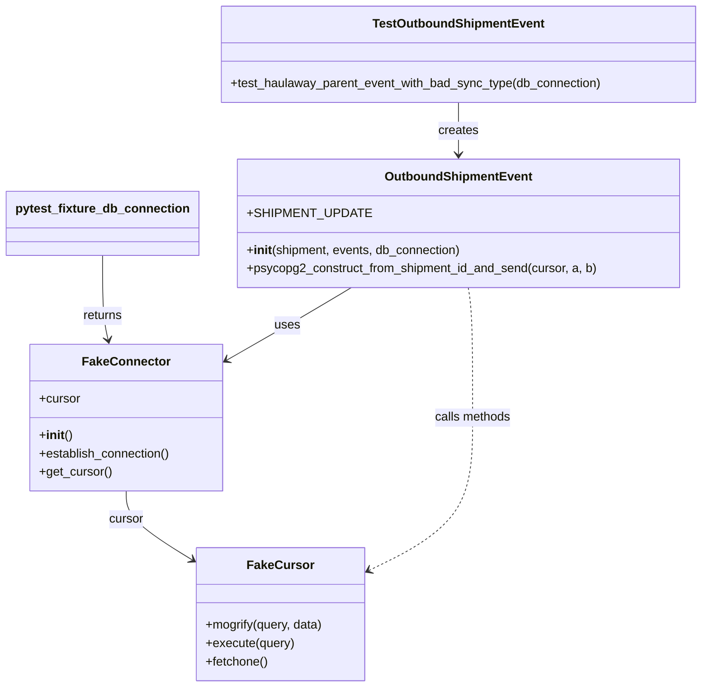
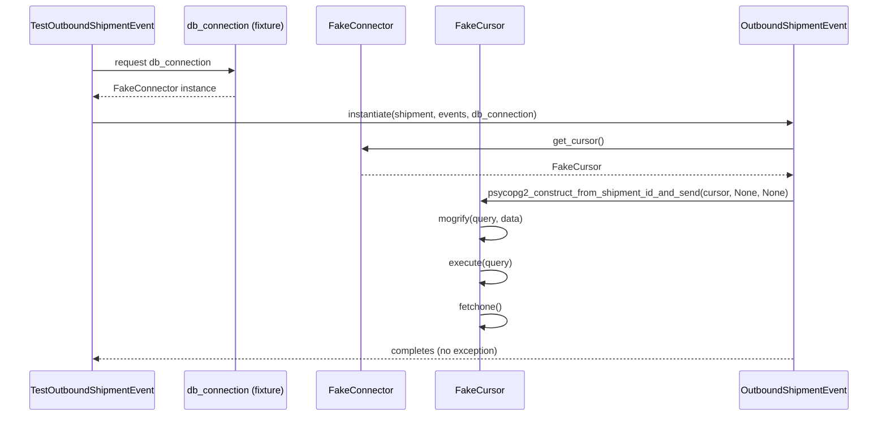

# Diagram: shipment_core/shipment_service/test/unit_tests/fvshared/test_outbound_shipment_event.py

> Auto-generated by Obscura crawlers

## Diagram 1

### SVG

<svg id="container" width="906.046875" xmlns="http://www.w3.org/2000/svg" class="classDiagram" height="898" viewBox="0 0 906.046875 898" role="graphics-document document" aria-roledescription="class"><g><defs><marker id="container_class-aggregationStart" class="marker aggregation class" refX="18" refY="7" markerWidth="190" markerHeight="240" orient="auto"><path d="M 18,7 L9,13 L1,7 L9,1 Z"></path></marker></defs><defs><marker id="container_class-aggregationEnd" class="marker aggregation class" refX="1" refY="7" markerWidth="20" markerHeight="28" orient="auto"><path d="M 18,7 L9,13 L1,7 L9,1 Z"></path></marker></defs><defs><marker id="container_class-extensionStart" class="marker extension class" refX="18" refY="7" markerWidth="190" markerHeight="240" orient="auto"><path d="M 1,7 L18,13 V 1 Z"></path></marker></defs><defs><marker id="container_class-extensionEnd" class="marker extension class" refX="1" refY="7" markerWidth="20" markerHeight="28" orient="auto"><path d="M 1,1 V 13 L18,7 Z"></path></marker></defs><defs><marker id="container_class-compositionStart" class="marker composition class" refX="18" refY="7" markerWidth="190" markerHeight="240" orient="auto"><path d="M 18,7 L9,13 L1,7 L9,1 Z"></path></marker></defs><defs><marker id="container_class-compositionEnd" class="marker composition class" refX="1" refY="7" markerWidth="20" markerHeight="28" orient="auto"><path d="M 18,7 L9,13 L1,7 L9,1 Z"></path></marker></defs><defs><marker id="container_class-dependencyStart" class="marker dependency class" refX="6" refY="7" markerWidth="190" markerHeight="240" orient="auto"><path d="M 5,7 L9,13 L1,7 L9,1 Z"></path></marker></defs><defs><marker id="container_class-dependencyEnd" class="marker dependency class" refX="13" refY="7" markerWidth="20" markerHeight="28" orient="auto"><path d="M 18,7 L9,13 L14,7 L9,1 Z"></path></marker></defs><defs><marker id="container_class-lollipopStart" class="marker lollipop class" refX="13" refY="7" markerWidth="190" markerHeight="240" orient="auto"><circle stroke="black" fill="transparent" cx="7" cy="7" r="6"></circle></marker></defs><defs><marker id="container_class-lollipopEnd" class="marker lollipop class" refX="1" refY="7" markerWidth="190" markerHeight="240" orient="auto"><circle stroke="black" fill="transparent" cx="7" cy="7" r="6"></circle></marker></defs><g class="root"><g class="clusters"></g><g class="edgePaths"><path d="M160.199,642L160.199,648.167C160.199,654.333,160.199,666.667,174.065,681.508C187.93,696.35,215.661,713.7,229.527,722.375L243.392,731.05" id="id_FakeConnector_FakeCursor_1" class="edge-thickness-normal edge-pattern-solid relation" style=";;;" data-edge="true" data-et="edge" data-id="id_FakeConnector_FakeCursor_1" data-points="W3sieCI6MTYwLjE5OTIxODc1LCJ5Ijo2NDJ9LHsieCI6MTYwLjE5OTIxODc1LCJ5Ijo2Nzl9LHsieCI6MjQ4LjQ3ODUxNTYyNSwieSI6NzM0LjIzMjA4NjcyMDg2NzJ9XQ==" marker-end="url(#container_class-dependencyEnd)"></path><path d="M128.82,334L128.82,347.167C128.82,360.333,128.82,386.667,130.046,405.027C131.271,423.387,133.721,433.774,134.947,438.967L136.172,444.16" id="id_pytest_fixture_db_connection_FakeConnector_2" class="edge-thickness-normal edge-pattern-solid relation" style=";;;" data-edge="true" data-et="edge" data-id="id_pytest_fixture_db_connection_FakeConnector_2" data-points="W3sieCI6MTI4LjgyMDMxMjUsInkiOjMzNH0seyJ4IjoxMjguODIwMzEyNSwieSI6NDEzfSx7IngiOjEzNy41NDk3ODI2NTk3NzQ0NSwieSI6NDUwfV0=" marker-end="url(#container_class-dependencyEnd)"></path><path d="M587.965,134L587.965,140.167C587.965,146.333,587.965,158.667,587.965,170C587.965,181.333,587.965,191.667,587.965,196.833L587.965,202" id="id_TestOutboundShipmentEvent_OutboundShipmentEvent_3" class="edge-thickness-normal edge-pattern-solid relation" style=";;;" data-edge="true" data-et="edge" data-id="id_TestOutboundShipmentEvent_OutboundShipmentEvent_3" data-points="W3sieCI6NTg3Ljk2NDg0Mzc1LCJ5IjoxMzR9LHsieCI6NTg3Ljk2NDg0Mzc1LCJ5IjoxNzF9LHsieCI6NTg3Ljk2NDg0Mzc1LCJ5IjoyMDh9XQ==" marker-end="url(#container_class-dependencyEnd)"></path><path d="M450.376,376L440.275,382.167C430.175,388.333,409.973,400.667,383.41,416.371C356.846,432.075,323.921,451.149,307.459,460.687L290.996,470.224" id="id_OutboundShipmentEvent_FakeConnector_4" class="edge-thickness-normal edge-pattern-solid relation" style=";;;" data-edge="true" data-et="edge" data-id="id_OutboundShipmentEvent_FakeConnector_4" data-points="W3sieCI6NDUwLjM3NjA2NTM0MDkwOTEsInkiOjM3Nn0seyJ4IjozODkuNzcxNDg0Mzc1LCJ5Ijo0MTN9LHsieCI6Mjg1LjgwNDY4NzUsInkiOjQ3My4yMzE5NDQ1OTgwNTUyfV0=" marker-end="url(#container_class-dependencyEnd)"></path><path d="M600.632,376L601.561,382.167C602.491,388.333,604.351,400.667,605.281,429C606.211,457.333,606.211,501.667,606.211,546C606.211,590.333,606.211,634.667,584.121,667.886C562.031,701.106,517.852,723.212,495.762,734.265L473.672,745.318" id="id_OutboundShipmentEvent_FakeCursor_5" class="edge-thickness-normal edge-pattern-dashed relation" style=";;;" data-edge="true" data-et="edge" data-id="id_OutboundShipmentEvent_FakeCursor_5" data-points="W3sieCI6NjAwLjYzMTU1MzQ2MDc0MzgsInkiOjM3Nn0seyJ4Ijo2MDYuMjEwOTM3NSwieSI6NDEzfSx7IngiOjYwNi4yMTA5Mzc1LCJ5Ijo1NDZ9LHsieCI6NjA2LjIxMDkzNzUsInkiOjY3OX0seyJ4Ijo0NjguMzA2NjQwNjI1LCJ5Ijo3NDguMDAyNjg3NTE1MjY5OX1d" marker-end="url(#container_class-dependencyEnd)"></path></g><g class="edgeLabels"><g class="edgeLabel" transform="translate(160.19921875, 679)"><g class="label" data-id="id_FakeConnector_FakeCursor_1" transform="translate(-22.8671875, -12)"><foreignObject width="45.734375" height="24">

cursor

</foreignObject></g></g><g class="edgeLabel" transform="translate(128.8203125, 413)"><g class="label" data-id="id_pytest_fixture_db_connection_FakeConnector_2" transform="translate(-26.265625, -12)"><foreignObject width="52.53125" height="24">

returns

</foreignObject></g></g><g class="edgeLabel" transform="translate(587.96484375, 171)"><g class="label" data-id="id_TestOutboundShipmentEvent_OutboundShipmentEvent_3" transform="translate(-26.171875, -12)"><foreignObject width="52.34375" height="24">

creates

</foreignObject></g></g><g class="edgeLabel" transform="translate(368.5083, 425.31858)"><g class="label" data-id="id_OutboundShipmentEvent_FakeConnector_4" transform="translate(-16.4921875, -12)"><foreignObject width="32.984375" height="24">

uses

</foreignObject></g></g><g class="edgeLabel" transform="translate(606.2109375, 546)"><g class="label" data-id="id_OutboundShipmentEvent_FakeCursor_5" transform="translate(-50.546875, -12)"><foreignObject width="101.09375" height="24">

calls methods

</foreignObject></g></g></g><g class="nodes"><g class="node default" id="classId-FakeCursor-0" transform="translate(358.392578125, 803)"><g class="basic label-container"><path d="M-109.9140625 -87 L109.9140625 -87 L109.9140625 87 L-109.9140625 87" stroke="none" stroke-width="0" fill="#ECECFF" style=""></path><path d="M-109.9140625 -87 C-46.82796157405442 -87, 16.25813935189116 -87, 109.9140625 -87 M-109.9140625 -87 C-55.163927662990275 -87, -0.41379282598055056 -87, 109.9140625 -87 M109.9140625 -87 C109.9140625 -30.48246616981649, 109.9140625 26.03506766036702, 109.9140625 87 M109.9140625 -87 C109.9140625 -46.50027525931469, 109.9140625 -6.000550518629382, 109.9140625 87 M109.9140625 87 C58.9855568918432 87, 8.057051283686405 87, -109.9140625 87 M109.9140625 87 C51.05491381272561 87, -7.804234874548783 87, -109.9140625 87 M-109.9140625 87 C-109.9140625 47.18990495534479, -109.9140625 7.379809910689573, -109.9140625 -87 M-109.9140625 87 C-109.9140625 17.81798373506102, -109.9140625 -51.36403252987796, -109.9140625 -87" stroke="#9370DB" stroke-width="1.3" fill="none" stroke-dasharray="0 0" style=""></path></g><g class="annotation-group text" transform="translate(0, -63)"></g><g class="label-group text" transform="translate(-40.4375, -63)"><g class="label" style="font-weight: bolder" transform="translate(0,-12)"><foreignObject width="80.875" height="24">

FakeCursor

</foreignObject></g></g><g class="members-group text" transform="translate(-97.9140625, -15)"></g><g class="methods-group text" transform="translate(-97.9140625, 15)"><g class="label" style="" transform="translate(0,-12)"><foreignObject width="155.390625" height="24">

+mogrify(query, data)

</foreignObject></g><g class="label" style="" transform="translate(0,12)"><foreignObject width="115.96875" height="24">

+execute(query)

</foreignObject></g><g class="label" style="" transform="translate(0,36)"><foreignObject width="82.046875" height="24">

+fetchone()

</foreignObject></g></g><g class="divider" style=""><path d="M-109.9140625 -39 C-42.763050502775016 -39, 24.387961494449968 -39, 109.9140625 -39 M-109.9140625 -39 C-39.36173214009183 -39, 31.190598219816337 -39, 109.9140625 -39" stroke="#9370DB" stroke-width="1.3" fill="none" stroke-dasharray="0 0" style=""></path></g><g class="divider" style=""><path d="M-109.9140625 -15 C-60.06759764314547 -15, -10.221132786290937 -15, 109.9140625 -15 M-109.9140625 -15 C-40.762347445653376 -15, 28.38936760869325 -15, 109.9140625 -15" stroke="#9370DB" stroke-width="1.3" fill="none" stroke-dasharray="0 0" style=""></path></g></g><g class="node default" id="classId-FakeConnector-1" transform="translate(160.19921875, 546)"><g class="basic label-container"><path d="M-125.60546875 -96 L125.60546875 -96 L125.60546875 96 L-125.60546875 96" stroke="none" stroke-width="0" fill="#ECECFF" style=""></path><path d="M-125.60546875 -96 C-38.301895232623565 -96, 49.00167828475287 -96, 125.60546875 -96 M-125.60546875 -96 C-47.20569358426047 -96, 31.194081581479054 -96, 125.60546875 -96 M125.60546875 -96 C125.60546875 -37.28169205820355, 125.60546875 21.436615883592907, 125.60546875 96 M125.60546875 -96 C125.60546875 -31.783856793673095, 125.60546875 32.43228641265381, 125.60546875 96 M125.60546875 96 C54.05293277991095 96, -17.499603190178107 96, -125.60546875 96 M125.60546875 96 C69.8954611088893 96, 14.1854534677786 96, -125.60546875 96 M-125.60546875 96 C-125.60546875 24.35809568901624, -125.60546875 -47.28380862196752, -125.60546875 -96 M-125.60546875 96 C-125.60546875 21.405405504469456, -125.60546875 -53.18918899106109, -125.60546875 -96" stroke="#9370DB" stroke-width="1.3" fill="none" stroke-dasharray="0 0" style=""></path></g><g class="annotation-group text" transform="translate(0, -72)"></g><g class="label-group text" transform="translate(-53.9453125, -72)"><g class="label" style="font-weight: bolder" transform="translate(0,-12)"><foreignObject width="107.890625" height="24">

FakeConnector

</foreignObject></g></g><g class="members-group text" transform="translate(-113.60546875, -24)"><g class="label" style="" transform="translate(0,-12)"><foreignObject width="53.71875" height="24">

+cursor

</foreignObject></g></g><g class="methods-group text" transform="translate(-113.60546875, 24)"><g class="label" style="" transform="translate(0,-12)"><foreignObject width="42.796875" height="24">

+<strong>init</strong>()

</foreignObject></g><g class="label" style="" transform="translate(0,12)"><foreignObject width="173.265625" height="24">

+establish_connection()

</foreignObject></g><g class="label" style="" transform="translate(0,36)"><foreignObject width="94.640625" height="24">

+get_cursor()

</foreignObject></g></g><g class="divider" style=""><path d="M-125.60546875 -48 C-33.55972268322206 -48, 58.486023383555874 -48, 125.60546875 -48 M-125.60546875 -48 C-45.743045222214434 -48, 34.11937830557113 -48, 125.60546875 -48" stroke="#9370DB" stroke-width="1.3" fill="none" stroke-dasharray="0 0" style=""></path></g><g class="divider" style=""><path d="M-125.60546875 0 C-63.489552728460886 0, -1.373636706921772 0, 125.60546875 0 M-125.60546875 0 C-70.05963128849754 0, -14.51379382699507 0, 125.60546875 0" stroke="#9370DB" stroke-width="1.3" fill="none" stroke-dasharray="0 0" style=""></path></g></g><g class="node default" id="classId-OutboundShipmentEvent-2" transform="translate(587.96484375, 292)"><g class="basic label-container"><path d="M-288.32421875 -84 L288.32421875 -84 L288.32421875 84 L-288.32421875 84" stroke="none" stroke-width="0" fill="#ECECFF" style=""></path><path d="M-288.32421875 -84 C-71.64742244174184 -84, 145.02937386651632 -84, 288.32421875 -84 M-288.32421875 -84 C-69.71489205461211 -84, 148.89443464077578 -84, 288.32421875 -84 M288.32421875 -84 C288.32421875 -47.9124519455947, 288.32421875 -11.824903891189393, 288.32421875 84 M288.32421875 -84 C288.32421875 -38.08852978750961, 288.32421875 7.822940424980786, 288.32421875 84 M288.32421875 84 C106.06406402426785 84, -76.1960907014643 84, -288.32421875 84 M288.32421875 84 C131.43709564892467 84, -25.450027452150664 84, -288.32421875 84 M-288.32421875 84 C-288.32421875 38.71924268815346, -288.32421875 -6.5615146236930855, -288.32421875 -84 M-288.32421875 84 C-288.32421875 19.884141808872215, -288.32421875 -44.23171638225557, -288.32421875 -84" stroke="#9370DB" stroke-width="1.3" fill="none" stroke-dasharray="0 0" style=""></path></g><g class="annotation-group text" transform="translate(0, -60)"></g><g class="label-group text" transform="translate(-91.9453125, -60)"><g class="label" style="font-weight: bolder" transform="translate(0,-12)"><foreignObject width="183.890625" height="24">

OutboundShipmentEvent

</foreignObject></g></g><g class="members-group text" transform="translate(-276.32421875, -12)"><g class="label" style="" transform="translate(0,-12)"><foreignObject width="142.96875" height="24">

+SHIPMENT_UPDATE

</foreignObject></g></g><g class="methods-group text" transform="translate(-276.32421875, 36)"><g class="label" style="" transform="translate(0,-12)"><foreignObject width="282.828125" height="24">

+<strong>init</strong>(shipment, events, db_connection)

</foreignObject></g><g class="label" style="" transform="translate(0,12)"><foreignObject width="460.703125" height="24">

+psycopg2_construct_from_shipment_id_and_send(cursor, a, b)

</foreignObject></g></g><g class="divider" style=""><path d="M-288.32421875 -36 C-145.58594384687567 -36, -2.84766894375133 -36, 288.32421875 -36 M-288.32421875 -36 C-126.42356792075913 -36, 35.47708290848175 -36, 288.32421875 -36" stroke="#9370DB" stroke-width="1.3" fill="none" stroke-dasharray="0 0" style=""></path></g><g class="divider" style=""><path d="M-288.32421875 12 C-101.38559619420394 12, 85.55302636159212 12, 288.32421875 12 M-288.32421875 12 C-147.7086075303101 12, -7.092996310620208 12, 288.32421875 12" stroke="#9370DB" stroke-width="1.3" fill="none" stroke-dasharray="0 0" style=""></path></g></g><g class="node default" id="classId-TestOutboundShipmentEvent-3" transform="translate(587.96484375, 71)"><g class="basic label-container"><path d="M-310.08203125 -63 L310.08203125 -63 L310.08203125 63 L-310.08203125 63" stroke="none" stroke-width="0" fill="#ECECFF" style=""></path><path d="M-310.08203125 -63 C-78.1511675515406 -63, 153.7796961469188 -63, 310.08203125 -63 M-310.08203125 -63 C-111.12558907454815 -63, 87.83085310090371 -63, 310.08203125 -63 M310.08203125 -63 C310.08203125 -31.603590532956126, 310.08203125 -0.20718106591225194, 310.08203125 63 M310.08203125 -63 C310.08203125 -25.612444318986654, 310.08203125 11.775111362026692, 310.08203125 63 M310.08203125 63 C97.03221689181913 63, -116.01759746636174 63, -310.08203125 63 M310.08203125 63 C156.86061505098775 63, 3.639198851975493 63, -310.08203125 63 M-310.08203125 63 C-310.08203125 33.672154006877754, -310.08203125 4.344308013755509, -310.08203125 -63 M-310.08203125 63 C-310.08203125 36.41773186155569, -310.08203125 9.835463723111374, -310.08203125 -63" stroke="#9370DB" stroke-width="1.3" fill="none" stroke-dasharray="0 0" style=""></path></g><g class="annotation-group text" transform="translate(0, -39)"></g><g class="label-group text" transform="translate(-107.1953125, -39)"><g class="label" style="font-weight: bolder" transform="translate(0,-12)"><foreignObject width="214.390625" height="24">

TestOutboundShipmentEvent

</foreignObject></g></g><g class="members-group text" transform="translate(-298.08203125, 9)"></g><g class="methods-group text" transform="translate(-298.08203125, 39)"><g class="label" style="" transform="translate(0,-12)"><foreignObject width="488.96875" height="24">

+test_haulaway_parent_event_with_bad_sync_type(db_connection)

</foreignObject></g></g><g class="divider" style=""><path d="M-310.08203125 -15 C-148.2917686605705 -15, 13.498493928858977 -15, 310.08203125 -15 M-310.08203125 -15 C-179.63393973756007 -15, -49.18584822512014 -15, 310.08203125 -15" stroke="#9370DB" stroke-width="1.3" fill="none" stroke-dasharray="0 0" style=""></path></g><g class="divider" style=""><path d="M-310.08203125 9 C-113.64325312842402 9, 82.79552499315196 9, 310.08203125 9 M-310.08203125 9 C-125.95666166846675 9, 58.1687079130665 9, 310.08203125 9" stroke="#9370DB" stroke-width="1.3" fill="none" stroke-dasharray="0 0" style=""></path></g></g><g class="node default" id="classId-pytest_fixture_db_connection-4" transform="translate(128.8203125, 292)"><g class="basic label-container"><path d="M-120.8203125 -42 L120.8203125 -42 L120.8203125 42 L-120.8203125 42" stroke="none" stroke-width="0" fill="#ECECFF" style=""></path><path d="M-120.8203125 -42 C-58.05240413233862 -42, 4.715504235322754 -42, 120.8203125 -42 M-120.8203125 -42 C-54.848545202841805 -42, 11.12322209431639 -42, 120.8203125 -42 M120.8203125 -42 C120.8203125 -19.787291897688334, 120.8203125 2.425416204623332, 120.8203125 42 M120.8203125 -42 C120.8203125 -16.010823235751072, 120.8203125 9.978353528497856, 120.8203125 42 M120.8203125 42 C69.13412545726939 42, 17.447938414538797 42, -120.8203125 42 M120.8203125 42 C52.641898174115 42, -15.536516151770002 42, -120.8203125 42 M-120.8203125 42 C-120.8203125 21.7071011758846, -120.8203125 1.4142023517691982, -120.8203125 -42 M-120.8203125 42 C-120.8203125 14.14634813823368, -120.8203125 -13.70730372353264, -120.8203125 -42" stroke="#9370DB" stroke-width="1.3" fill="none" stroke-dasharray="0 0" style=""></path></g><g class="annotation-group text" transform="translate(0, -18)"></g><g class="label-group text" transform="translate(-108.8203125, -18)"><g class="label" style="font-weight: bolder" transform="translate(0,-12)"><foreignObject width="217.640625" height="24">

pytest_fixture_db_connection

</foreignObject></g></g><g class="members-group text" transform="translate(-108.8203125, 30)"></g><g class="methods-group text" transform="translate(-108.8203125, 60)"></g><g class="divider" style=""><path d="M-120.8203125 6 C-49.01258639877929 6, 22.795139702441418 6, 120.8203125 6 M-120.8203125 6 C-36.46964967407874 6, 47.881013151842524 6, 120.8203125 6" stroke="#9370DB" stroke-width="1.3" fill="none" stroke-dasharray="0 0" style=""></path></g><g class="divider" style=""><path d="M-120.8203125 24 C-71.64716011067394 24, -22.474007721347874 24, 120.8203125 24 M-120.8203125 24 C-44.44943099623647 24, 31.921450507527055 24, 120.8203125 24" stroke="#9370DB" stroke-width="1.3" fill="none" stroke-dasharray="0 0" style=""></path></g></g></g></g></g></svg>

## Diagram 2

### SVG

<svg id="container" width="1578.5" xmlns="http://www.w3.org/2000/svg" height="741" viewBox="-50 -10 1578.5 741" role="graphics-document document" aria-roledescription="sequence"><g><rect x="1275.5" y="655" fill="#eaeaea" stroke="#666" width="203" height="65" name="Outbound" rx="3" ry="3" class="actor actor-bottom"></rect><text x="1377" y="687.5" dominant-baseline="central" alignment-baseline="central" class="actor actor-box" style="text-anchor: middle; font-size: 16px; font-weight: 400;"><tspan x="1377" dy="0">OutboundShipmentEvent</tspan></text></g><g><rect x="721" y="655" fill="#eaeaea" stroke="#666" width="150" height="65" name="Cursor" rx="3" ry="3" class="actor actor-bottom"></rect><text x="796" y="687.5" dominant-baseline="central" alignment-baseline="central" class="actor actor-box" style="text-anchor: middle; font-size: 16px; font-weight: 400;"><tspan x="796" dy="0">FakeCursor</tspan></text></g><g><rect x="521" y="655" fill="#eaeaea" stroke="#666" width="150" height="65" name="Connector" rx="3" ry="3" class="actor actor-bottom"></rect><text x="596" y="687.5" dominant-baseline="central" alignment-baseline="central" class="actor actor-box" style="text-anchor: middle; font-size: 16px; font-weight: 400;"><tspan x="596" dy="0">FakeConnector</tspan></text></g><g><rect x="282" y="655" fill="#eaeaea" stroke="#666" width="189" height="65" name="Fixture" rx="3" ry="3" class="actor actor-bottom"></rect><text x="376.5" y="687.5" dominant-baseline="central" alignment-baseline="central" class="actor actor-box" style="text-anchor: middle; font-size: 16px; font-weight: 400;"><tspan x="376.5" dy="0">db_connection (fixture)</tspan></text></g><g><rect x="0" y="655" fill="#eaeaea" stroke="#666" width="232" height="65" name="Test" rx="3" ry="3" class="actor actor-bottom"></rect><text x="116" y="687.5" dominant-baseline="central" alignment-baseline="central" class="actor actor-box" style="text-anchor: middle; font-size: 16px; font-weight: 400;"><tspan x="116" dy="0">TestOutboundShipmentEvent</tspan></text></g><g><line id="actor4" x1="1377" y1="65" x2="1377" y2="655" class="actor-line 200" stroke-width="0.5px" stroke="#999" name="Outbound"></line><g id="root-4"><rect x="1275.5" y="0" fill="#eaeaea" stroke="#666" width="203" height="65" name="Outbound" rx="3" ry="3" class="actor actor-top"></rect><text x="1377" y="32.5" dominant-baseline="central" alignment-baseline="central" class="actor actor-box" style="text-anchor: middle; font-size: 16px; font-weight: 400;"><tspan x="1377" dy="0">OutboundShipmentEvent</tspan></text></g></g><g><line id="actor3" x1="796" y1="65" x2="796" y2="655" class="actor-line 200" stroke-width="0.5px" stroke="#999" name="Cursor"></line><g id="root-3"><rect x="721" y="0" fill="#eaeaea" stroke="#666" width="150" height="65" name="Cursor" rx="3" ry="3" class="actor actor-top"></rect><text x="796" y="32.5" dominant-baseline="central" alignment-baseline="central" class="actor actor-box" style="text-anchor: middle; font-size: 16px; font-weight: 400;"><tspan x="796" dy="0">FakeCursor</tspan></text></g></g><g><line id="actor2" x1="596" y1="65" x2="596" y2="655" class="actor-line 200" stroke-width="0.5px" stroke="#999" name="Connector"></line><g id="root-2"><rect x="521" y="0" fill="#eaeaea" stroke="#666" width="150" height="65" name="Connector" rx="3" ry="3" class="actor actor-top"></rect><text x="596" y="32.5" dominant-baseline="central" alignment-baseline="central" class="actor actor-box" style="text-anchor: middle; font-size: 16px; font-weight: 400;"><tspan x="596" dy="0">FakeConnector</tspan></text></g></g><g><line id="actor1" x1="376.5" y1="65" x2="376.5" y2="655" class="actor-line 200" stroke-width="0.5px" stroke="#999" name="Fixture"></line><g id="root-1"><rect x="282" y="0" fill="#eaeaea" stroke="#666" width="189" height="65" name="Fixture" rx="3" ry="3" class="actor actor-top"></rect><text x="376.5" y="32.5" dominant-baseline="central" alignment-baseline="central" class="actor actor-box" style="text-anchor: middle; font-size: 16px; font-weight: 400;"><tspan x="376.5" dy="0">db_connection (fixture)</tspan></text></g></g><g><line id="actor0" x1="116" y1="65" x2="116" y2="655" class="actor-line 200" stroke-width="0.5px" stroke="#999" name="Test"></line><g id="root-0"><rect x="0" y="0" fill="#eaeaea" stroke="#666" width="232" height="65" name="Test" rx="3" ry="3" class="actor actor-top"></rect><text x="116" y="32.5" dominant-baseline="central" alignment-baseline="central" class="actor actor-box" style="text-anchor: middle; font-size: 16px; font-weight: 400;"><tspan x="116" dy="0">TestOutboundShipmentEvent</tspan></text></g></g><g></g><defs><symbol id="computer" width="24" height="24"><path transform="scale(.5)" d="M2 2v13h20v-13h-20zm18 11h-16v-9h16v9zm-10.228 6l.466-1h3.524l.467 1h-4.457zm14.228 3h-24l2-6h2.104l-1.33 4h18.45l-1.297-4h2.073l2 6zm-5-10h-14v-7h14v7z"></path></symbol></defs><defs><symbol id="database" fill-rule="evenodd" clip-rule="evenodd"><path transform="scale(.5)" d="M12.258.001l.256.004.255.005.253.008.251.01.249.012.247.015.246.016.242.019.241.02.239.023.236.024.233.027.231.028.229.031.225.032.223.034.22.036.217.038.214.04.211.041.208.043.205.045.201.046.198.048.194.05.191.051.187.053.183.054.18.056.175.057.172.059.168.06.163.061.16.063.155.064.15.066.074.033.073.033.071.034.07.034.069.035.068.035.067.035.066.035.064.036.064.036.062.036.06.036.06.037.058.037.058.037.055.038.055.038.053.038.052.038.051.039.05.039.048.039.047.039.045.04.044.04.043.04.041.04.04.041.039.041.037.041.036.041.034.041.033.042.032.042.03.042.029.042.027.042.026.043.024.043.023.043.021.043.02.043.018.044.017.043.015.044.013.044.012.044.011.045.009.044.007.045.006.045.004.045.002.045.001.045v17l-.001.045-.002.045-.004.045-.006.045-.007.045-.009.044-.011.045-.012.044-.013.044-.015.044-.017.043-.018.044-.02.043-.021.043-.023.043-.024.043-.026.043-.027.042-.029.042-.03.042-.032.042-.033.042-.034.041-.036.041-.037.041-.039.041-.04.041-.041.04-.043.04-.044.04-.045.04-.047.039-.048.039-.05.039-.051.039-.052.038-.053.038-.055.038-.055.038-.058.037-.058.037-.06.037-.06.036-.062.036-.064.036-.064.036-.066.035-.067.035-.068.035-.069.035-.07.034-.071.034-.073.033-.074.033-.15.066-.155.064-.16.063-.163.061-.168.06-.172.059-.175.057-.18.056-.183.054-.187.053-.191.051-.194.05-.198.048-.201.046-.205.045-.208.043-.211.041-.214.04-.217.038-.22.036-.223.034-.225.032-.229.031-.231.028-.233.027-.236.024-.239.023-.241.02-.242.019-.246.016-.247.015-.249.012-.251.01-.253.008-.255.005-.256.004-.258.001-.258-.001-.256-.004-.255-.005-.253-.008-.251-.01-.249-.012-.247-.015-.245-.016-.243-.019-.241-.02-.238-.023-.236-.024-.234-.027-.231-.028-.228-.031-.226-.032-.223-.034-.22-.036-.217-.038-.214-.04-.211-.041-.208-.043-.204-.045-.201-.046-.198-.048-.195-.05-.19-.051-.187-.053-.184-.054-.179-.056-.176-.057-.172-.059-.167-.06-.164-.061-.159-.063-.155-.064-.151-.066-.074-.033-.072-.033-.072-.034-.07-.034-.069-.035-.068-.035-.067-.035-.066-.035-.064-.036-.063-.036-.062-.036-.061-.036-.06-.037-.058-.037-.057-.037-.056-.038-.055-.038-.053-.038-.052-.038-.051-.039-.049-.039-.049-.039-.046-.039-.046-.04-.044-.04-.043-.04-.041-.04-.04-.041-.039-.041-.037-.041-.036-.041-.034-.041-.033-.042-.032-.042-.03-.042-.029-.042-.027-.042-.026-.043-.024-.043-.023-.043-.021-.043-.02-.043-.018-.044-.017-.043-.015-.044-.013-.044-.012-.044-.011-.045-.009-.044-.007-.045-.006-.045-.004-.045-.002-.045-.001-.045v-17l.001-.045.002-.045.004-.045.006-.045.007-.045.009-.044.011-.045.012-.044.013-.044.015-.044.017-.043.018-.044.02-.043.021-.043.023-.043.024-.043.026-.043.027-.042.029-.042.03-.042.032-.042.033-.042.034-.041.036-.041.037-.041.039-.041.04-.041.041-.04.043-.04.044-.04.046-.04.046-.039.049-.039.049-.039.051-.039.052-.038.053-.038.055-.038.056-.038.057-.037.058-.037.06-.037.061-.036.062-.036.063-.036.064-.036.066-.035.067-.035.068-.035.069-.035.07-.034.072-.034.072-.033.074-.033.151-.066.155-.064.159-.063.164-.061.167-.06.172-.059.176-.057.179-.056.184-.054.187-.053.19-.051.195-.05.198-.048.201-.046.204-.045.208-.043.211-.041.214-.04.217-.038.22-.036.223-.034.226-.032.228-.031.231-.028.234-.027.236-.024.238-.023.241-.02.243-.019.245-.016.247-.015.249-.012.251-.01.253-.008.255-.005.256-.004.258-.001.258.001zm-9.258 20.499v.01l.001.021.003.021.004.022.005.021.006.022.007.022.009.023.01.022.011.023.012.023.013.023.015.023.016.024.017.023.018.024.019.024.021.024.022.025.023.024.024.025.052.049.056.05.061.051.066.051.07.051.075.051.079.052.084.052.088.052.092.052.097.052.102.051.105.052.11.052.114.051.119.051.123.051.127.05.131.05.135.05.139.048.144.049.147.047.152.047.155.047.16.045.163.045.167.043.171.043.176.041.178.041.183.039.187.039.19.037.194.035.197.035.202.033.204.031.209.03.212.029.216.027.219.025.222.024.226.021.23.02.233.018.236.016.24.015.243.012.246.01.249.008.253.005.256.004.259.001.26-.001.257-.004.254-.005.25-.008.247-.011.244-.012.241-.014.237-.016.233-.018.231-.021.226-.021.224-.024.22-.026.216-.027.212-.028.21-.031.205-.031.202-.034.198-.034.194-.036.191-.037.187-.039.183-.04.179-.04.175-.042.172-.043.168-.044.163-.045.16-.046.155-.046.152-.047.148-.048.143-.049.139-.049.136-.05.131-.05.126-.05.123-.051.118-.052.114-.051.11-.052.106-.052.101-.052.096-.052.092-.052.088-.053.083-.051.079-.052.074-.052.07-.051.065-.051.06-.051.056-.05.051-.05.023-.024.023-.025.021-.024.02-.024.019-.024.018-.024.017-.024.015-.023.014-.024.013-.023.012-.023.01-.023.01-.022.008-.022.006-.022.006-.022.004-.022.004-.021.001-.021.001-.021v-4.127l-.077.055-.08.053-.083.054-.085.053-.087.052-.09.052-.093.051-.095.05-.097.05-.1.049-.102.049-.105.048-.106.047-.109.047-.111.046-.114.045-.115.045-.118.044-.12.043-.122.042-.124.042-.126.041-.128.04-.13.04-.132.038-.134.038-.135.037-.138.037-.139.035-.142.035-.143.034-.144.033-.147.032-.148.031-.15.03-.151.03-.153.029-.154.027-.156.027-.158.026-.159.025-.161.024-.162.023-.163.022-.165.021-.166.02-.167.019-.169.018-.169.017-.171.016-.173.015-.173.014-.175.013-.175.012-.177.011-.178.01-.179.008-.179.008-.181.006-.182.005-.182.004-.184.003-.184.002h-.37l-.184-.002-.184-.003-.182-.004-.182-.005-.181-.006-.179-.008-.179-.008-.178-.01-.176-.011-.176-.012-.175-.013-.173-.014-.172-.015-.171-.016-.17-.017-.169-.018-.167-.019-.166-.02-.165-.021-.163-.022-.162-.023-.161-.024-.159-.025-.157-.026-.156-.027-.155-.027-.153-.029-.151-.03-.15-.03-.148-.031-.146-.032-.145-.033-.143-.034-.141-.035-.14-.035-.137-.037-.136-.037-.134-.038-.132-.038-.13-.04-.128-.04-.126-.041-.124-.042-.122-.042-.12-.044-.117-.043-.116-.045-.113-.045-.112-.046-.109-.047-.106-.047-.105-.048-.102-.049-.1-.049-.097-.05-.095-.05-.093-.052-.09-.051-.087-.052-.085-.053-.083-.054-.08-.054-.077-.054v4.127zm0-5.654v.011l.001.021.003.021.004.021.005.022.006.022.007.022.009.022.01.022.011.023.012.023.013.023.015.024.016.023.017.024.018.024.019.024.021.024.022.024.023.025.024.024.052.05.056.05.061.05.066.051.07.051.075.052.079.051.084.052.088.052.092.052.097.052.102.052.105.052.11.051.114.051.119.052.123.05.127.051.131.05.135.049.139.049.144.048.147.048.152.047.155.046.16.045.163.045.167.044.171.042.176.042.178.04.183.04.187.038.19.037.194.036.197.034.202.033.204.032.209.03.212.028.216.027.219.025.222.024.226.022.23.02.233.018.236.016.24.014.243.012.246.01.249.008.253.006.256.003.259.001.26-.001.257-.003.254-.006.25-.008.247-.01.244-.012.241-.015.237-.016.233-.018.231-.02.226-.022.224-.024.22-.025.216-.027.212-.029.21-.03.205-.032.202-.033.198-.035.194-.036.191-.037.187-.039.183-.039.179-.041.175-.042.172-.043.168-.044.163-.045.16-.045.155-.047.152-.047.148-.048.143-.048.139-.05.136-.049.131-.05.126-.051.123-.051.118-.051.114-.052.11-.052.106-.052.101-.052.096-.052.092-.052.088-.052.083-.052.079-.052.074-.051.07-.052.065-.051.06-.05.056-.051.051-.049.023-.025.023-.024.021-.025.02-.024.019-.024.018-.024.017-.024.015-.023.014-.023.013-.024.012-.022.01-.023.01-.023.008-.022.006-.022.006-.022.004-.021.004-.022.001-.021.001-.021v-4.139l-.077.054-.08.054-.083.054-.085.052-.087.053-.09.051-.093.051-.095.051-.097.05-.1.049-.102.049-.105.048-.106.047-.109.047-.111.046-.114.045-.115.044-.118.044-.12.044-.122.042-.124.042-.126.041-.128.04-.13.039-.132.039-.134.038-.135.037-.138.036-.139.036-.142.035-.143.033-.144.033-.147.033-.148.031-.15.03-.151.03-.153.028-.154.028-.156.027-.158.026-.159.025-.161.024-.162.023-.163.022-.165.021-.166.02-.167.019-.169.018-.169.017-.171.016-.173.015-.173.014-.175.013-.175.012-.177.011-.178.009-.179.009-.179.007-.181.007-.182.005-.182.004-.184.003-.184.002h-.37l-.184-.002-.184-.003-.182-.004-.182-.005-.181-.007-.179-.007-.179-.009-.178-.009-.176-.011-.176-.012-.175-.013-.173-.014-.172-.015-.171-.016-.17-.017-.169-.018-.167-.019-.166-.02-.165-.021-.163-.022-.162-.023-.161-.024-.159-.025-.157-.026-.156-.027-.155-.028-.153-.028-.151-.03-.15-.03-.148-.031-.146-.033-.145-.033-.143-.033-.141-.035-.14-.036-.137-.036-.136-.037-.134-.038-.132-.039-.13-.039-.128-.04-.126-.041-.124-.042-.122-.043-.12-.043-.117-.044-.116-.044-.113-.046-.112-.046-.109-.046-.106-.047-.105-.048-.102-.049-.1-.049-.097-.05-.095-.051-.093-.051-.09-.051-.087-.053-.085-.052-.083-.054-.08-.054-.077-.054v4.139zm0-5.666v.011l.001.02.003.022.004.021.005.022.006.021.007.022.009.023.01.022.011.023.012.023.013.023.015.023.016.024.017.024.018.023.019.024.021.025.022.024.023.024.024.025.052.05.056.05.061.05.066.051.07.051.075.052.079.051.084.052.088.052.092.052.097.052.102.052.105.051.11.052.114.051.119.051.123.051.127.05.131.05.135.05.139.049.144.048.147.048.152.047.155.046.16.045.163.045.167.043.171.043.176.042.178.04.183.04.187.038.19.037.194.036.197.034.202.033.204.032.209.03.212.028.216.027.219.025.222.024.226.021.23.02.233.018.236.017.24.014.243.012.246.01.249.008.253.006.256.003.259.001.26-.001.257-.003.254-.006.25-.008.247-.01.244-.013.241-.014.237-.016.233-.018.231-.02.226-.022.224-.024.22-.025.216-.027.212-.029.21-.03.205-.032.202-.033.198-.035.194-.036.191-.037.187-.039.183-.039.179-.041.175-.042.172-.043.168-.044.163-.045.16-.045.155-.047.152-.047.148-.048.143-.049.139-.049.136-.049.131-.051.126-.05.123-.051.118-.052.114-.051.11-.052.106-.052.101-.052.096-.052.092-.052.088-.052.083-.052.079-.052.074-.052.07-.051.065-.051.06-.051.056-.05.051-.049.023-.025.023-.025.021-.024.02-.024.019-.024.018-.024.017-.024.015-.023.014-.024.013-.023.012-.023.01-.022.01-.023.008-.022.006-.022.006-.022.004-.022.004-.021.001-.021.001-.021v-4.153l-.077.054-.08.054-.083.053-.085.053-.087.053-.09.051-.093.051-.095.051-.097.05-.1.049-.102.048-.105.048-.106.048-.109.046-.111.046-.114.046-.115.044-.118.044-.12.043-.122.043-.124.042-.126.041-.128.04-.13.039-.132.039-.134.038-.135.037-.138.036-.139.036-.142.034-.143.034-.144.033-.147.032-.148.032-.15.03-.151.03-.153.028-.154.028-.156.027-.158.026-.159.024-.161.024-.162.023-.163.023-.165.021-.166.02-.167.019-.169.018-.169.017-.171.016-.173.015-.173.014-.175.013-.175.012-.177.01-.178.01-.179.009-.179.007-.181.006-.182.006-.182.004-.184.003-.184.001-.185.001-.185-.001-.184-.001-.184-.003-.182-.004-.182-.006-.181-.006-.179-.007-.179-.009-.178-.01-.176-.01-.176-.012-.175-.013-.173-.014-.172-.015-.171-.016-.17-.017-.169-.018-.167-.019-.166-.02-.165-.021-.163-.023-.162-.023-.161-.024-.159-.024-.157-.026-.156-.027-.155-.028-.153-.028-.151-.03-.15-.03-.148-.032-.146-.032-.145-.033-.143-.034-.141-.034-.14-.036-.137-.036-.136-.037-.134-.038-.132-.039-.13-.039-.128-.041-.126-.041-.124-.041-.122-.043-.12-.043-.117-.044-.116-.044-.113-.046-.112-.046-.109-.046-.106-.048-.105-.048-.102-.048-.1-.05-.097-.049-.095-.051-.093-.051-.09-.052-.087-.052-.085-.053-.083-.053-.08-.054-.077-.054v4.153zm8.74-8.179l-.257.004-.254.005-.25.008-.247.011-.244.012-.241.014-.237.016-.233.018-.231.021-.226.022-.224.023-.22.026-.216.027-.212.028-.21.031-.205.032-.202.033-.198.034-.194.036-.191.038-.187.038-.183.04-.179.041-.175.042-.172.043-.168.043-.163.045-.16.046-.155.046-.152.048-.148.048-.143.048-.139.049-.136.05-.131.05-.126.051-.123.051-.118.051-.114.052-.11.052-.106.052-.101.052-.096.052-.092.052-.088.052-.083.052-.079.052-.074.051-.07.052-.065.051-.06.05-.056.05-.051.05-.023.025-.023.024-.021.024-.02.025-.019.024-.018.024-.017.023-.015.024-.014.023-.013.023-.012.023-.01.023-.01.022-.008.022-.006.023-.006.021-.004.022-.004.021-.001.021-.001.021.001.021.001.021.004.021.004.022.006.021.006.023.008.022.01.022.01.023.012.023.013.023.014.023.015.024.017.023.018.024.019.024.02.025.021.024.023.024.023.025.051.05.056.05.06.05.065.051.07.052.074.051.079.052.083.052.088.052.092.052.096.052.101.052.106.052.11.052.114.052.118.051.123.051.126.051.131.05.136.05.139.049.143.048.148.048.152.048.155.046.16.046.163.045.168.043.172.043.175.042.179.041.183.04.187.038.191.038.194.036.198.034.202.033.205.032.21.031.212.028.216.027.22.026.224.023.226.022.231.021.233.018.237.016.241.014.244.012.247.011.25.008.254.005.257.004.26.001.26-.001.257-.004.254-.005.25-.008.247-.011.244-.012.241-.014.237-.016.233-.018.231-.021.226-.022.224-.023.22-.026.216-.027.212-.028.21-.031.205-.032.202-.033.198-.034.194-.036.191-.038.187-.038.183-.04.179-.041.175-.042.172-.043.168-.043.163-.045.16-.046.155-.046.152-.048.148-.048.143-.048.139-.049.136-.05.131-.05.126-.051.123-.051.118-.051.114-.052.11-.052.106-.052.101-.052.096-.052.092-.052.088-.052.083-.052.079-.052.074-.051.07-.052.065-.051.06-.05.056-.05.051-.05.023-.025.023-.024.021-.024.02-.025.019-.024.018-.024.017-.023.015-.024.014-.023.013-.023.012-.023.01-.023.01-.022.008-.022.006-.023.006-.021.004-.022.004-.021.001-.021.001-.021-.001-.021-.001-.021-.004-.021-.004-.022-.006-.021-.006-.023-.008-.022-.01-.022-.01-.023-.012-.023-.013-.023-.014-.023-.015-.024-.017-.023-.018-.024-.019-.024-.02-.025-.021-.024-.023-.024-.023-.025-.051-.05-.056-.05-.06-.05-.065-.051-.07-.052-.074-.051-.079-.052-.083-.052-.088-.052-.092-.052-.096-.052-.101-.052-.106-.052-.11-.052-.114-.052-.118-.051-.123-.051-.126-.051-.131-.05-.136-.05-.139-.049-.143-.048-.148-.048-.152-.048-.155-.046-.16-.046-.163-.045-.168-.043-.172-.043-.175-.042-.179-.041-.183-.04-.187-.038-.191-.038-.194-.036-.198-.034-.202-.033-.205-.032-.21-.031-.212-.028-.216-.027-.22-.026-.224-.023-.226-.022-.231-.021-.233-.018-.237-.016-.241-.014-.244-.012-.247-.011-.25-.008-.254-.005-.257-.004-.26-.001-.26.001z"></path></symbol></defs><defs><symbol id="clock" width="24" height="24"><path transform="scale(.5)" d="M12 2c5.514 0 10 4.486 10 10s-4.486 10-10 10-10-4.486-10-10 4.486-10 10-10zm0-2c-6.627 0-12 5.373-12 12s5.373 12 12 12 12-5.373 12-12-5.373-12-12-12zm5.848 12.459c.202.038.202.333.001.372-1.907.361-6.045 1.111-6.547 1.111-.719 0-1.301-.582-1.301-1.301 0-.512.77-5.447 1.125-7.445.034-.192.312-.181.343.014l.985 6.238 5.394 1.011z"></path></symbol></defs><defs><marker id="arrowhead" refX="7.9" refY="5" markerUnits="userSpaceOnUse" markerWidth="12" markerHeight="12" orient="auto-start-reverse"><path d="M -1 0 L 10 5 L 0 10 z"></path></marker></defs><defs><marker id="crosshead" markerWidth="15" markerHeight="8" orient="auto" refX="4" refY="4.5"><path fill="none" stroke="#000000" stroke-width="1pt" d="M 1,2 L 6,7 M 6,2 L 1,7" style="stroke-dasharray: 0, 0;"></path></marker></defs><defs><marker id="filled-head" refX="15.5" refY="7" markerWidth="20" markerHeight="28" orient="auto"><path d="M 18,7 L9,13 L14,7 L9,1 Z"></path></marker></defs><defs><marker id="sequencenumber" refX="15" refY="15" markerWidth="60" markerHeight="40" orient="auto"><circle cx="15" cy="15" r="6"></circle></marker></defs><text x="245" y="80" text-anchor="middle" dominant-baseline="middle" alignment-baseline="middle" class="messageText" dy="1em" style="font-size: 16px; font-weight: 400;">request db_connection</text><line x1="117" y1="113" x2="372.5" y2="113" class="messageLine0" stroke-width="2" stroke="none" marker-end="url(#arrowhead)" style="fill: none;"></line><text x="248" y="128" text-anchor="middle" dominant-baseline="middle" alignment-baseline="middle" class="messageText" dy="1em" style="font-size: 16px; font-weight: 400;">FakeConnector instance</text><line x1="375.5" y1="161" x2="120" y2="161" class="messageLine1" stroke-width="2" stroke="none" marker-end="url(#arrowhead)" style="stroke-dasharray: 3, 3; fill: none;"></line><text x="745" y="176" text-anchor="middle" dominant-baseline="middle" alignment-baseline="middle" class="messageText" dy="1em" style="font-size: 16px; font-weight: 400;">instantiate(shipment, events, db_connection)</text><line x1="117" y1="209" x2="1373" y2="209" class="messageLine0" stroke-width="2" stroke="none" marker-end="url(#arrowhead)" style="fill: none;"></line><text x="988" y="224" text-anchor="middle" dominant-baseline="middle" alignment-baseline="middle" class="messageText" dy="1em" style="font-size: 16px; font-weight: 400;">get_cursor()</text><line x1="1376" y1="257" x2="600" y2="257" class="messageLine0" stroke-width="2" stroke="none" marker-end="url(#arrowhead)" style="fill: none;"></line><text x="985" y="272" text-anchor="middle" dominant-baseline="middle" alignment-baseline="middle" class="messageText" dy="1em" style="font-size: 16px; font-weight: 400;">FakeCursor</text><line x1="597" y1="305" x2="1373" y2="305" class="messageLine1" stroke-width="2" stroke="none" marker-end="url(#arrowhead)" style="stroke-dasharray: 3, 3; fill: none;"></line><text x="1088" y="320" text-anchor="middle" dominant-baseline="middle" alignment-baseline="middle" class="messageText" dy="1em" style="font-size: 16px; font-weight: 400;">psycopg2_construct_from_shipment_id_and_send(cursor, None, None)</text><line x1="1376" y1="353" x2="800" y2="353" class="messageLine0" stroke-width="2" stroke="none" marker-end="url(#arrowhead)" style="fill: none;"></line><text x="797" y="368" text-anchor="middle" dominant-baseline="middle" alignment-baseline="middle" class="messageText" dy="1em" style="font-size: 16px; font-weight: 400;">mogrify(query, data)</text><path d="M 797,401 C 857,391 857,431 797,421" class="messageLine0" stroke-width="2" stroke="none" marker-end="url(#arrowhead)" style="fill: none;"></path><text x="797" y="446" text-anchor="middle" dominant-baseline="middle" alignment-baseline="middle" class="messageText" dy="1em" style="font-size: 16px; font-weight: 400;">execute(query)</text><path d="M 797,479 C 857,469 857,509 797,499" class="messageLine0" stroke-width="2" stroke="none" marker-end="url(#arrowhead)" style="fill: none;"></path><text x="797" y="524" text-anchor="middle" dominant-baseline="middle" alignment-baseline="middle" class="messageText" dy="1em" style="font-size: 16px; font-weight: 400;">fetchone()</text><path d="M 797,557 C 857,547 857,587 797,577" class="messageLine0" stroke-width="2" stroke="none" marker-end="url(#arrowhead)" style="fill: none;"></path><text x="748" y="602" text-anchor="middle" dominant-baseline="middle" alignment-baseline="middle" class="messageText" dy="1em" style="font-size: 16px; font-weight: 400;">completes (no exception)</text><line x1="1376" y1="635" x2="120" y2="635" class="messageLine1" stroke-width="2" stroke="none" marker-end="url(#arrowhead)" style="stroke-dasharray: 3, 3; fill: none;"></line></svg>
