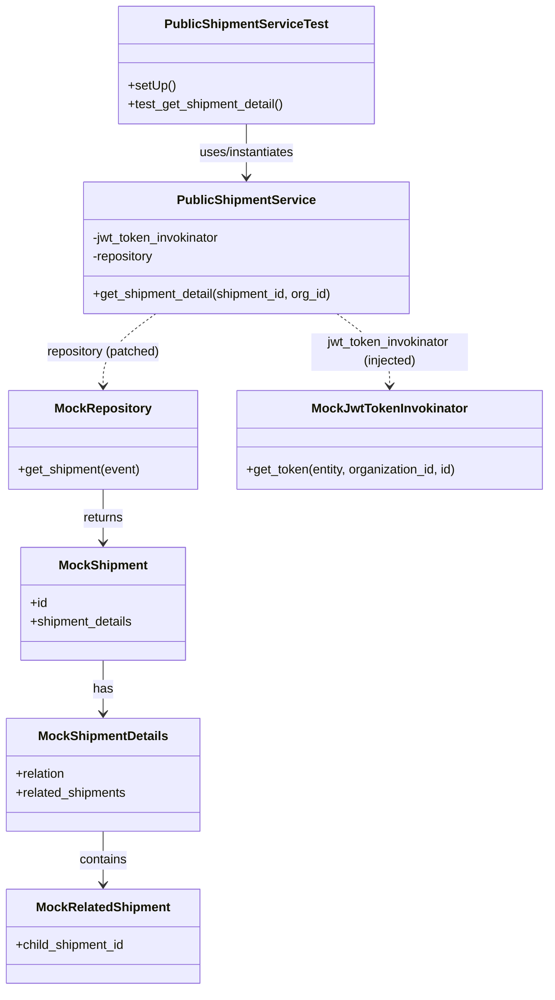
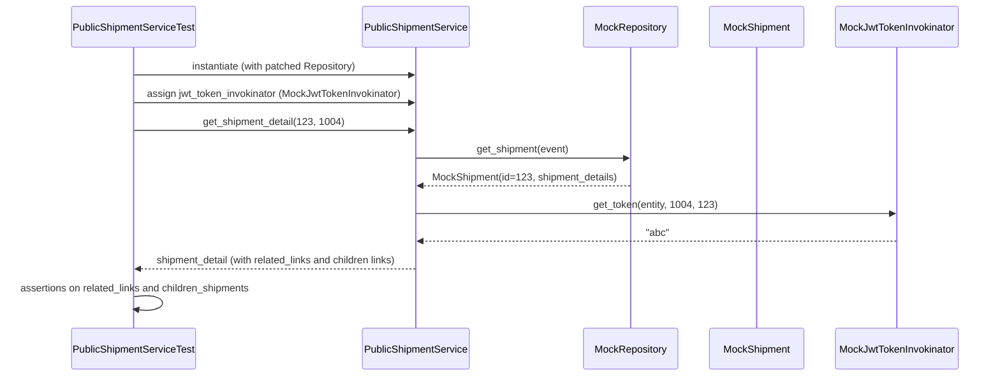

# Diagram: shipment_core/shipment_service/test/unit_tests/public_shipment/test_public_shipment_service.py

> Auto-generated by Obscura crawlers

## Diagram 1

### SVG

<svg id="container" width="704.25" xmlns="http://www.w3.org/2000/svg" class="classDiagram" height="1262" viewBox="0 0 704.25 1262" role="graphics-document document" aria-roledescription="class"><g><defs><marker id="container_class-aggregationStart" class="marker aggregation class" refX="18" refY="7" markerWidth="190" markerHeight="240" orient="auto"><path d="M 18,7 L9,13 L1,7 L9,1 Z"></path></marker></defs><defs><marker id="container_class-aggregationEnd" class="marker aggregation class" refX="1" refY="7" markerWidth="20" markerHeight="28" orient="auto"><path d="M 18,7 L9,13 L1,7 L9,1 Z"></path></marker></defs><defs><marker id="container_class-extensionStart" class="marker extension class" refX="18" refY="7" markerWidth="190" markerHeight="240" orient="auto"><path d="M 1,7 L18,13 V 1 Z"></path></marker></defs><defs><marker id="container_class-extensionEnd" class="marker extension class" refX="1" refY="7" markerWidth="20" markerHeight="28" orient="auto"><path d="M 1,1 V 13 L18,7 Z"></path></marker></defs><defs><marker id="container_class-compositionStart" class="marker composition class" refX="18" refY="7" markerWidth="190" markerHeight="240" orient="auto"><path d="M 18,7 L9,13 L1,7 L9,1 Z"></path></marker></defs><defs><marker id="container_class-compositionEnd" class="marker composition class" refX="1" refY="7" markerWidth="20" markerHeight="28" orient="auto"><path d="M 18,7 L9,13 L1,7 L9,1 Z"></path></marker></defs><defs><marker id="container_class-dependencyStart" class="marker dependency class" refX="6" refY="7" markerWidth="190" markerHeight="240" orient="auto"><path d="M 5,7 L9,13 L1,7 L9,1 Z"></path></marker></defs><defs><marker id="container_class-dependencyEnd" class="marker dependency class" refX="13" refY="7" markerWidth="20" markerHeight="28" orient="auto"><path d="M 18,7 L9,13 L14,7 L9,1 Z"></path></marker></defs><defs><marker id="container_class-lollipopStart" class="marker lollipop class" refX="13" refY="7" markerWidth="190" markerHeight="240" orient="auto"><circle stroke="black" fill="transparent" cx="7" cy="7" r="6"></circle></marker></defs><defs><marker id="container_class-lollipopEnd" class="marker lollipop class" refX="1" refY="7" markerWidth="190" markerHeight="240" orient="auto"><circle stroke="black" fill="transparent" cx="7" cy="7" r="6"></circle></marker></defs><g class="root"><g class="clusters"></g><g class="edgePaths"><path d="M316.178,158L316.178,164.167C316.178,170.333,316.178,182.667,316.178,194C316.178,205.333,316.178,215.667,316.178,220.833L316.178,226" id="id_PublicShipmentServiceTest_PublicShipmentService_1" class="edge-thickness-normal edge-pattern-solid relation" style=";;;" data-edge="true" data-et="edge" data-id="id_PublicShipmentServiceTest_PublicShipmentService_1" data-points="W3sieCI6MzE2LjE3NzczNDM3NSwieSI6MTU4fSx7IngiOjMxNi4xNzc3MzQzNzUsInkiOjE5NX0seyJ4IjozMTYuMTc3NzM0Mzc1LCJ5IjoyMzJ9XQ==" marker-end="url(#container_class-dependencyEnd)"></path><path d="M200.267,400L188.998,408.167C177.729,416.333,155.191,432.667,143.921,448C132.652,463.333,132.652,477.667,132.652,484.833L132.652,492" id="id_PublicShipmentService_MockRepository_2" class="edge-thickness-normal edge-pattern-dashed relation" style=";;;" data-edge="true" data-et="edge" data-id="id_PublicShipmentService_MockRepository_2" data-points="W3sieCI6MjAwLjI2Njk2MTM0ODY4NDIyLCJ5Ijo0MDB9LHsieCI6MTMyLjY1MjM0Mzc1LCJ5Ijo0NDl9LHsieCI6MTMyLjY1MjM0Mzc1LCJ5Ijo0OTh9XQ==" marker-end="url(#container_class-dependencyEnd)"></path><path d="M432.089,400L443.358,408.167C454.627,416.333,477.165,432.667,488.434,448C499.703,463.333,499.703,477.667,499.703,484.833L499.703,492" id="id_PublicShipmentService_MockJwtTokenInvokinator_3" class="edge-thickness-normal edge-pattern-dashed relation" style=";;;" data-edge="true" data-et="edge" data-id="id_PublicShipmentService_MockJwtTokenInvokinator_3" data-points="W3sieCI6NDMyLjA4ODUwNzQwMTMxNTgsInkiOjQwMH0seyJ4Ijo0OTkuNzAzMTI1LCJ5Ijo0NDl9LHsieCI6NDk5LjcwMzEyNSwieSI6NDk4fV0=" marker-end="url(#container_class-dependencyEnd)"></path><path d="M132.652,624L132.652,630.167C132.652,636.333,132.652,648.667,132.652,660C132.652,671.333,132.652,681.667,132.652,686.833L132.652,692" id="id_MockRepository_MockShipment_4" class="edge-thickness-normal edge-pattern-solid relation" style=";;;" data-edge="true" data-et="edge" data-id="id_MockRepository_MockShipment_4" data-points="W3sieCI6MTMyLjY1MjM0Mzc1LCJ5Ijo2MjR9LHsieCI6MTMyLjY1MjM0Mzc1LCJ5Ijo2NjF9LHsieCI6MTMyLjY1MjM0Mzc1LCJ5Ijo2OTh9XQ==" marker-end="url(#container_class-dependencyEnd)"></path><path d="M132.652,842L132.652,848.167C132.652,854.333,132.652,866.667,132.652,878C132.652,889.333,132.652,899.667,132.652,904.833L132.652,910" id="id_MockShipment_MockShipmentDetails_5" class="edge-thickness-normal edge-pattern-solid relation" style=";;;" data-edge="true" data-et="edge" data-id="id_MockShipment_MockShipmentDetails_5" data-points="W3sieCI6MTMyLjY1MjM0Mzc1LCJ5Ijo4NDJ9LHsieCI6MTMyLjY1MjM0Mzc1LCJ5Ijo4Nzl9LHsieCI6MTMyLjY1MjM0Mzc1LCJ5Ijo5MTZ9XQ==" marker-end="url(#container_class-dependencyEnd)"></path><path d="M132.652,1060L132.652,1066.167C132.652,1072.333,132.652,1084.667,132.652,1096C132.652,1107.333,132.652,1117.667,132.652,1122.833L132.652,1128" id="id_MockShipmentDetails_MockRelatedShipment_6" class="edge-thickness-normal edge-pattern-solid relation" style=";;;" data-edge="true" data-et="edge" data-id="id_MockShipmentDetails_MockRelatedShipment_6" data-points="W3sieCI6MTMyLjY1MjM0Mzc1LCJ5IjoxMDYwfSx7IngiOjEzMi42NTIzNDM3NSwieSI6MTA5N30seyJ4IjoxMzIuNjUyMzQzNzUsInkiOjExMzR9XQ==" marker-end="url(#container_class-dependencyEnd)"></path></g><g class="edgeLabels"><g class="edgeLabel" transform="translate(316.177734375, 195)"><g class="label" data-id="id_PublicShipmentServiceTest_PublicShipmentService_1" transform="translate(-63.5625, -12)"><foreignObject width="127.125" height="24">

uses/instantiates

</foreignObject></g></g><g class="edgeLabel" transform="translate(132.65234375, 449)"><g class="label" data-id="id_PublicShipmentService_MockRepository_2" transform="translate(-73.84375, -12)"><foreignObject width="147.6875" height="24">

repository (patched)

</foreignObject></g></g><g class="edgeLabel" transform="translate(499.703125, 449)"><g class="label" data-id="id_PublicShipmentService_MockJwtTokenInvokinator_3" transform="translate(-100, -24)"><foreignObject width="200" height="48">

jwt_token_invokinator (injected)

</foreignObject></g></g><g class="edgeLabel" transform="translate(132.65234375, 661)"><g class="label" data-id="id_MockRepository_MockShipment_4" transform="translate(-26.265625, -12)"><foreignObject width="52.53125" height="24">

returns

</foreignObject></g></g><g class="edgeLabel" transform="translate(132.65234375, 879)"><g class="label" data-id="id_MockShipment_MockShipmentDetails_5" transform="translate(-12.703125, -12)"><foreignObject width="25.40625" height="24">

has

</foreignObject></g></g><g class="edgeLabel" transform="translate(132.65234375, 1097)"><g class="label" data-id="id_MockShipmentDetails_MockRelatedShipment_6" transform="translate(-30.890625, -12)"><foreignObject width="61.78125" height="24">

contains

</foreignObject></g></g></g><g class="nodes"><g class="node default" id="classId-PublicShipmentServiceTest-0" transform="translate(316.177734375, 83)"><g class="basic label-container"><path d="M-163.42578125 -75 L163.42578125 -75 L163.42578125 75 L-163.42578125 75" stroke="none" stroke-width="0" fill="#ECECFF" style=""></path><path d="M-163.42578125 -75 C-50.46424304202458 -75, 62.497295165950845 -75, 163.42578125 -75 M-163.42578125 -75 C-73.37127285873801 -75, 16.68323553252398 -75, 163.42578125 -75 M163.42578125 -75 C163.42578125 -18.103823725376373, 163.42578125 38.792352549247255, 163.42578125 75 M163.42578125 -75 C163.42578125 -44.05777562164842, 163.42578125 -13.115551243296835, 163.42578125 75 M163.42578125 75 C94.39899217749716 75, 25.372203104994327 75, -163.42578125 75 M163.42578125 75 C50.42858017861079 75, -62.568620892778426 75, -163.42578125 75 M-163.42578125 75 C-163.42578125 25.979301715005157, -163.42578125 -23.041396569989686, -163.42578125 -75 M-163.42578125 75 C-163.42578125 15.79788231432046, -163.42578125 -43.40423537135908, -163.42578125 -75" stroke="#9370DB" stroke-width="1.3" fill="none" stroke-dasharray="0 0" style=""></path></g><g class="annotation-group text" transform="translate(0, -51)"></g><g class="label-group text" transform="translate(-99.4140625, -51)"><g class="label" style="font-weight: bolder" transform="translate(0,-12)"><foreignObject width="198.828125" height="24">

PublicShipmentServiceTest

</foreignObject></g></g><g class="members-group text" transform="translate(-151.42578125, -3)"></g><g class="methods-group text" transform="translate(-151.42578125, 27)"><g class="label" style="" transform="translate(0,-12)"><foreignObject width="60.421875" height="24">

+setUp()

</foreignObject></g><g class="label" style="" transform="translate(0,12)"><foreignObject width="203.4375" height="24">

+test_get_shipment_detail()

</foreignObject></g></g><g class="divider" style=""><path d="M-163.42578125 -27 C-93.47909208456568 -27, -23.532402919131357 -27, 163.42578125 -27 M-163.42578125 -27 C-67.42268239611859 -27, 28.580416457762823 -27, 163.42578125 -27" stroke="#9370DB" stroke-width="1.3" fill="none" stroke-dasharray="0 0" style=""></path></g><g class="divider" style=""><path d="M-163.42578125 -3 C-65.45050338477446 -3, 32.52477448045107 -3, 163.42578125 -3 M-163.42578125 -3 C-73.52934778880625 -3, 16.367085672387503 -3, 163.42578125 -3" stroke="#9370DB" stroke-width="1.3" fill="none" stroke-dasharray="0 0" style=""></path></g></g><g class="node default" id="classId-PublicShipmentService-1" transform="translate(316.177734375, 316)"><g class="basic label-container"><path d="M-210.34765625 -84 L210.34765625 -84 L210.34765625 84 L-210.34765625 84" stroke="none" stroke-width="0" fill="#ECECFF" style=""></path><path d="M-210.34765625 -84 C-54.44056171017809 -84, 101.46653282964382 -84, 210.34765625 -84 M-210.34765625 -84 C-72.1867106391054 -84, 65.9742349717892 -84, 210.34765625 -84 M210.34765625 -84 C210.34765625 -39.49879373382921, 210.34765625 5.00241253234158, 210.34765625 84 M210.34765625 -84 C210.34765625 -22.380864776961104, 210.34765625 39.23827044607779, 210.34765625 84 M210.34765625 84 C111.8053612254552 84, 13.263066200910401 84, -210.34765625 84 M210.34765625 84 C63.41362281911651 84, -83.52041061176698 84, -210.34765625 84 M-210.34765625 84 C-210.34765625 17.57607203442049, -210.34765625 -48.84785593115902, -210.34765625 -84 M-210.34765625 84 C-210.34765625 30.55940360846622, -210.34765625 -22.88119278306756, -210.34765625 -84" stroke="#9370DB" stroke-width="1.3" fill="none" stroke-dasharray="0 0" style=""></path></g><g class="annotation-group text" transform="translate(0, -60)"></g><g class="label-group text" transform="translate(-84.1640625, -60)"><g class="label" style="font-weight: bolder" transform="translate(0,-12)"><foreignObject width="168.328125" height="24">

PublicShipmentService

</foreignObject></g></g><g class="members-group text" transform="translate(-198.34765625, -12)"><g class="label" style="" transform="translate(0,-12)"><foreignObject width="168.140625" height="24">

-jwt_token_invokinator

</foreignObject></g><g class="label" style="" transform="translate(0,12)"><foreignObject width="80.625" height="24">

-repository

</foreignObject></g></g><g class="methods-group text" transform="translate(-198.34765625, 60)"><g class="label" style="" transform="translate(0,-12)"><foreignObject width="312.53125" height="24">

+get_shipment_detail(shipment_id, org_id)

</foreignObject></g></g><g class="divider" style=""><path d="M-210.34765625 -36 C-94.95948794844035 -36, 20.42868035311929 -36, 210.34765625 -36 M-210.34765625 -36 C-93.61165921436184 -36, 23.124337821276328 -36, 210.34765625 -36" stroke="#9370DB" stroke-width="1.3" fill="none" stroke-dasharray="0 0" style=""></path></g><g class="divider" style=""><path d="M-210.34765625 36 C-102.35906641627689 36, 5.629523417446222 36, 210.34765625 36 M-210.34765625 36 C-94.95851814327187 36, 20.43061996345625 36, 210.34765625 36" stroke="#9370DB" stroke-width="1.3" fill="none" stroke-dasharray="0 0" style=""></path></g></g><g class="node default" id="classId-MockRepository-2" transform="translate(132.65234375, 561)"><g class="basic label-container"><path d="M-120.50390625 -63 L120.50390625 -63 L120.50390625 63 L-120.50390625 63" stroke="none" stroke-width="0" fill="#ECECFF" style=""></path><path d="M-120.50390625 -63 C-32.97438477130669 -63, 54.55513670738662 -63, 120.50390625 -63 M-120.50390625 -63 C-47.871574773494686 -63, 24.760756703010628 -63, 120.50390625 -63 M120.50390625 -63 C120.50390625 -37.28680155926591, 120.50390625 -11.573603118531821, 120.50390625 63 M120.50390625 -63 C120.50390625 -13.419010020222274, 120.50390625 36.16197995955545, 120.50390625 63 M120.50390625 63 C24.983510695565485 63, -70.53688485886903 63, -120.50390625 63 M120.50390625 63 C25.75516659153905 63, -68.9935730669219 63, -120.50390625 63 M-120.50390625 63 C-120.50390625 17.764799950699604, -120.50390625 -27.47040009860079, -120.50390625 -63 M-120.50390625 63 C-120.50390625 29.85849625799235, -120.50390625 -3.2830074840153003, -120.50390625 -63" stroke="#9370DB" stroke-width="1.3" fill="none" stroke-dasharray="0 0" style=""></path></g><g class="annotation-group text" transform="translate(0, -39)"></g><g class="label-group text" transform="translate(-58.9765625, -39)"><g class="label" style="font-weight: bolder" transform="translate(0,-12)"><foreignObject width="117.953125" height="24">

MockRepository

</foreignObject></g></g><g class="members-group text" transform="translate(-108.50390625, 9)"></g><g class="methods-group text" transform="translate(-108.50390625, 39)"><g class="label" style="" transform="translate(0,-12)"><foreignObject width="158.03125" height="24">

+get_shipment(event)

</foreignObject></g></g><g class="divider" style=""><path d="M-120.50390625 -15 C-60.87220898163333 -15, -1.240511713266656 -15, 120.50390625 -15 M-120.50390625 -15 C-66.01816128303801 -15, -11.53241631607601 -15, 120.50390625 -15" stroke="#9370DB" stroke-width="1.3" fill="none" stroke-dasharray="0 0" style=""></path></g><g class="divider" style=""><path d="M-120.50390625 9 C-44.145190070926915 9, 32.21352610814617 9, 120.50390625 9 M-120.50390625 9 C-50.71083887711744 9, 19.082228495765122 9, 120.50390625 9" stroke="#9370DB" stroke-width="1.3" fill="none" stroke-dasharray="0 0" style=""></path></g></g><g class="node default" id="classId-MockJwtTokenInvokinator-3" transform="translate(499.703125, 561)"><g class="basic label-container"><path d="M-196.546875 -63 L196.546875 -63 L196.546875 63 L-196.546875 63" stroke="none" stroke-width="0" fill="#ECECFF" style=""></path><path d="M-196.546875 -63 C-89.53387830286825 -63, 17.47911839426351 -63, 196.546875 -63 M-196.546875 -63 C-116.27296850922076 -63, -35.99906201844152 -63, 196.546875 -63 M196.546875 -63 C196.546875 -26.96598835519812, 196.546875 9.068023289603758, 196.546875 63 M196.546875 -63 C196.546875 -21.98146364440027, 196.546875 19.037072711199457, 196.546875 63 M196.546875 63 C48.544239238155114 63, -99.45839652368977 63, -196.546875 63 M196.546875 63 C53.356730650070574 63, -89.83341369985885 63, -196.546875 63 M-196.546875 63 C-196.546875 20.97923464831107, -196.546875 -21.04153070337786, -196.546875 -63 M-196.546875 63 C-196.546875 24.401026542270273, -196.546875 -14.197946915459454, -196.546875 -63" stroke="#9370DB" stroke-width="1.3" fill="none" stroke-dasharray="0 0" style=""></path></g><g class="annotation-group text" transform="translate(0, -39)"></g><g class="label-group text" transform="translate(-94.84375, -39)"><g class="label" style="font-weight: bolder" transform="translate(0,-12)"><foreignObject width="189.6875" height="24">

MockJwtTokenInvokinator

</foreignObject></g></g><g class="members-group text" transform="translate(-184.546875, 9)"></g><g class="methods-group text" transform="translate(-184.546875, 39)"><g class="label" style="" transform="translate(0,-12)"><foreignObject width="274.25" height="24">

+get_token(entity, organization_id, id)

</foreignObject></g></g><g class="divider" style=""><path d="M-196.546875 -15 C-65.70239788012378 -15, 65.14207923975243 -15, 196.546875 -15 M-196.546875 -15 C-105.18132002610538 -15, -13.815765052210764 -15, 196.546875 -15" stroke="#9370DB" stroke-width="1.3" fill="none" stroke-dasharray="0 0" style=""></path></g><g class="divider" style=""><path d="M-196.546875 9 C-68.10471620569547 9, 60.337442588609065 9, 196.546875 9 M-196.546875 9 C-68.58693458388362 9, 59.373005832232764 9, 196.546875 9" stroke="#9370DB" stroke-width="1.3" fill="none" stroke-dasharray="0 0" style=""></path></g></g><g class="node default" id="classId-MockShipment-4" transform="translate(132.65234375, 770)"><g class="basic label-container"><path d="M-106.0390625 -72 L106.0390625 -72 L106.0390625 72 L-106.0390625 72" stroke="none" stroke-width="0" fill="#ECECFF" style=""></path><path d="M-106.0390625 -72 C-50.691829338419865 -72, 4.65540382316027 -72, 106.0390625 -72 M-106.0390625 -72 C-31.51846470787278 -72, 43.00213308425444 -72, 106.0390625 -72 M106.0390625 -72 C106.0390625 -29.548225517875252, 106.0390625 12.903548964249495, 106.0390625 72 M106.0390625 -72 C106.0390625 -40.479980716198746, 106.0390625 -8.959961432397492, 106.0390625 72 M106.0390625 72 C32.08915771830857 72, -41.86074706338286 72, -106.0390625 72 M106.0390625 72 C31.705585321181516 72, -42.62789185763697 72, -106.0390625 72 M-106.0390625 72 C-106.0390625 37.56400545141304, -106.0390625 3.1280109028260767, -106.0390625 -72 M-106.0390625 72 C-106.0390625 28.362538911522563, -106.0390625 -15.274922176954874, -106.0390625 -72" stroke="#9370DB" stroke-width="1.3" fill="none" stroke-dasharray="0 0" style=""></path></g><g class="annotation-group text" transform="translate(0, -48)"></g><g class="label-group text" transform="translate(-54.3125, -48)"><g class="label" style="font-weight: bolder" transform="translate(0,-12)"><foreignObject width="108.625" height="24">

MockShipment

</foreignObject></g></g><g class="members-group text" transform="translate(-94.0390625, 0)"><g class="label" style="" transform="translate(0,-12)"><foreignObject width="22.078125" height="24">

+id

</foreignObject></g><g class="label" style="" transform="translate(0,12)"><foreignObject width="133.765625" height="24">

+shipment_details

</foreignObject></g></g><g class="methods-group text" transform="translate(-94.0390625, 72)"></g><g class="divider" style=""><path d="M-106.0390625 -24 C-52.35492125672213 -24, 1.3292199865557421 -24, 106.0390625 -24 M-106.0390625 -24 C-25.426176128316953 -24, 55.18671024336609 -24, 106.0390625 -24" stroke="#9370DB" stroke-width="1.3" fill="none" stroke-dasharray="0 0" style=""></path></g><g class="divider" style=""><path d="M-106.0390625 48 C-58.18626011628648 48, -10.333457732572967 48, 106.0390625 48 M-106.0390625 48 C-59.75613079220506 48, -13.473199084410126 48, 106.0390625 48" stroke="#9370DB" stroke-width="1.3" fill="none" stroke-dasharray="0 0" style=""></path></g></g><g class="node default" id="classId-MockShipmentDetails-5" transform="translate(132.65234375, 988)"><g class="basic label-container"><path d="M-123.796875 -72 L123.796875 -72 L123.796875 72 L-123.796875 72" stroke="none" stroke-width="0" fill="#ECECFF" style=""></path><path d="M-123.796875 -72 C-47.58820610794827 -72, 28.620462784103466 -72, 123.796875 -72 M-123.796875 -72 C-60.22721555048761 -72, 3.3424438990247864 -72, 123.796875 -72 M123.796875 -72 C123.796875 -37.27412672831004, 123.796875 -2.548253456620074, 123.796875 72 M123.796875 -72 C123.796875 -21.59450109610887, 123.796875 28.810997807782257, 123.796875 72 M123.796875 72 C32.907617027304894 72, -57.98164094539021 72, -123.796875 72 M123.796875 72 C56.92799094978015 72, -9.940893100439695 72, -123.796875 72 M-123.796875 72 C-123.796875 40.22735732877956, -123.796875 8.45471465755913, -123.796875 -72 M-123.796875 72 C-123.796875 15.224019045639523, -123.796875 -41.551961908720955, -123.796875 -72" stroke="#9370DB" stroke-width="1.3" fill="none" stroke-dasharray="0 0" style=""></path></g><g class="annotation-group text" transform="translate(0, -48)"></g><g class="label-group text" transform="translate(-79.8125, -48)"><g class="label" style="font-weight: bolder" transform="translate(0,-12)"><foreignObject width="159.625" height="24">

MockShipmentDetails

</foreignObject></g></g><g class="members-group text" transform="translate(-111.796875, 0)"><g class="label" style="" transform="translate(0,-12)"><foreignObject width="64.734375" height="24">

+relation

</foreignObject></g><g class="label" style="" transform="translate(0,12)"><foreignObject width="143.78125" height="24">

+related_shipments

</foreignObject></g></g><g class="methods-group text" transform="translate(-111.796875, 72)"></g><g class="divider" style=""><path d="M-123.796875 -24 C-35.095411037424526 -24, 53.60605292515095 -24, 123.796875 -24 M-123.796875 -24 C-36.24697560656139 -24, 51.302923786877216 -24, 123.796875 -24" stroke="#9370DB" stroke-width="1.3" fill="none" stroke-dasharray="0 0" style=""></path></g><g class="divider" style=""><path d="M-123.796875 48 C-27.872860679136252 48, 68.0511536417275 48, 123.796875 48 M-123.796875 48 C-70.79955780154614 48, -17.802240603092272 48, 123.796875 48" stroke="#9370DB" stroke-width="1.3" fill="none" stroke-dasharray="0 0" style=""></path></g></g><g class="node default" id="classId-MockRelatedShipment-6" transform="translate(132.65234375, 1194)"><g class="basic label-container"><path d="M-124.65234375 -60 L124.65234375 -60 L124.65234375 60 L-124.65234375 60" stroke="none" stroke-width="0" fill="#ECECFF" style=""></path><path d="M-124.65234375 -60 C-48.85440388469726 -60, 26.943535980605475 -60, 124.65234375 -60 M-124.65234375 -60 C-65.80233958254705 -60, -6.9523354150940975 -60, 124.65234375 -60 M124.65234375 -60 C124.65234375 -27.07935236839169, 124.65234375 5.841295263216622, 124.65234375 60 M124.65234375 -60 C124.65234375 -35.164769038811414, 124.65234375 -10.329538077622828, 124.65234375 60 M124.65234375 60 C42.93582559067842 60, -38.78069256864316 60, -124.65234375 60 M124.65234375 60 C28.993872030092476 60, -66.66459968981505 60, -124.65234375 60 M-124.65234375 60 C-124.65234375 31.1078495006532, -124.65234375 2.2156990013063975, -124.65234375 -60 M-124.65234375 60 C-124.65234375 33.05009404620262, -124.65234375 6.100188092405226, -124.65234375 -60" stroke="#9370DB" stroke-width="1.3" fill="none" stroke-dasharray="0 0" style=""></path></g><g class="annotation-group text" transform="translate(0, -36)"></g><g class="label-group text" transform="translate(-82.4296875, -36)"><g class="label" style="font-weight: bolder" transform="translate(0,-12)"><foreignObject width="164.859375" height="24">

MockRelatedShipment

</foreignObject></g></g><g class="members-group text" transform="translate(-112.65234375, 12)"><g class="label" style="" transform="translate(0,-12)"><foreignObject width="142.875" height="24">

+child_shipment_id

</foreignObject></g></g><g class="methods-group text" transform="translate(-112.65234375, 60)"></g><g class="divider" style=""><path d="M-124.65234375 -12 C-71.03074410819914 -12, -17.409144466398274 -12, 124.65234375 -12 M-124.65234375 -12 C-42.683592033642014 -12, 39.28515968271597 -12, 124.65234375 -12" stroke="#9370DB" stroke-width="1.3" fill="none" stroke-dasharray="0 0" style=""></path></g><g class="divider" style=""><path d="M-124.65234375 36 C-29.7617132579787 36, 65.1289172340426 36, 124.65234375 36 M-124.65234375 36 C-61.1765286559556 36, 2.2992864380887994 36, 124.65234375 36" stroke="#9370DB" stroke-width="1.3" fill="none" stroke-dasharray="0 0" style=""></path></g></g></g></g></g></svg>

## Diagram 2

### SVG

<svg id="container" width="1666" xmlns="http://www.w3.org/2000/svg" height="633" viewBox="-129 -10 1666 633" role="graphics-document document" aria-roledescription="sequence"><g><rect x="1281" y="547" fill="#eaeaea" stroke="#666" width="206" height="65" name="Jwt" rx="3" ry="3" class="actor actor-bottom"></rect><text x="1384" y="579.5" dominant-baseline="central" alignment-baseline="central" class="actor actor-box" style="text-anchor: middle; font-size: 16px; font-weight: 400;"><tspan x="1384" dy="0">MockJwtTokenInvokinator</tspan></text></g><g><rect x="1081" y="547" fill="#eaeaea" stroke="#666" width="150" height="65" name="Shipment" rx="3" ry="3" class="actor actor-bottom"></rect><text x="1156" y="579.5" dominant-baseline="central" alignment-baseline="central" class="actor actor-box" style="text-anchor: middle; font-size: 16px; font-weight: 400;"><tspan x="1156" dy="0">MockShipment</tspan></text></g><g><rect x="881" y="547" fill="#eaeaea" stroke="#666" width="150" height="65" name="Repo" rx="3" ry="3" class="actor actor-bottom"></rect><text x="956" y="579.5" dominant-baseline="central" alignment-baseline="central" class="actor actor-box" style="text-anchor: middle; font-size: 16px; font-weight: 400;"><tspan x="956" dy="0">MockRepository</tspan></text></g><g><rect x="497" y="547" fill="#eaeaea" stroke="#666" width="186" height="65" name="Service" rx="3" ry="3" class="actor actor-bottom"></rect><text x="590" y="579.5" dominant-baseline="central" alignment-baseline="central" class="actor actor-box" style="text-anchor: middle; font-size: 16px; font-weight: 400;"><tspan x="590" dy="0">PublicShipmentService</tspan></text></g><g><rect x="0" y="547" fill="#eaeaea" stroke="#666" width="216" height="65" name="Test" rx="3" ry="3" class="actor actor-bottom"></rect><text x="108" y="579.5" dominant-baseline="central" alignment-baseline="central" class="actor actor-box" style="text-anchor: middle; font-size: 16px; font-weight: 400;"><tspan x="108" dy="0">PublicShipmentServiceTest</tspan></text></g><g><line id="actor4" x1="1384" y1="65" x2="1384" y2="547" class="actor-line 200" stroke-width="0.5px" stroke="#999" name="Jwt"></line><g id="root-4"><rect x="1281" y="0" fill="#eaeaea" stroke="#666" width="206" height="65" name="Jwt" rx="3" ry="3" class="actor actor-top"></rect><text x="1384" y="32.5" dominant-baseline="central" alignment-baseline="central" class="actor actor-box" style="text-anchor: middle; font-size: 16px; font-weight: 400;"><tspan x="1384" dy="0">MockJwtTokenInvokinator</tspan></text></g></g><g><line id="actor3" x1="1156" y1="65" x2="1156" y2="547" class="actor-line 200" stroke-width="0.5px" stroke="#999" name="Shipment"></line><g id="root-3"><rect x="1081" y="0" fill="#eaeaea" stroke="#666" width="150" height="65" name="Shipment" rx="3" ry="3" class="actor actor-top"></rect><text x="1156" y="32.5" dominant-baseline="central" alignment-baseline="central" class="actor actor-box" style="text-anchor: middle; font-size: 16px; font-weight: 400;"><tspan x="1156" dy="0">MockShipment</tspan></text></g></g><g><line id="actor2" x1="956" y1="65" x2="956" y2="547" class="actor-line 200" stroke-width="0.5px" stroke="#999" name="Repo"></line><g id="root-2"><rect x="881" y="0" fill="#eaeaea" stroke="#666" width="150" height="65" name="Repo" rx="3" ry="3" class="actor actor-top"></rect><text x="956" y="32.5" dominant-baseline="central" alignment-baseline="central" class="actor actor-box" style="text-anchor: middle; font-size: 16px; font-weight: 400;"><tspan x="956" dy="0">MockRepository</tspan></text></g></g><g><line id="actor1" x1="590" y1="65" x2="590" y2="547" class="actor-line 200" stroke-width="0.5px" stroke="#999" name="Service"></line><g id="root-1"><rect x="497" y="0" fill="#eaeaea" stroke="#666" width="186" height="65" name="Service" rx="3" ry="3" class="actor actor-top"></rect><text x="590" y="32.5" dominant-baseline="central" alignment-baseline="central" class="actor actor-box" style="text-anchor: middle; font-size: 16px; font-weight: 400;"><tspan x="590" dy="0">PublicShipmentService</tspan></text></g></g><g><line id="actor0" x1="108" y1="65" x2="108" y2="547" class="actor-line 200" stroke-width="0.5px" stroke="#999" name="Test"></line><g id="root-0"><rect x="0" y="0" fill="#eaeaea" stroke="#666" width="216" height="65" name="Test" rx="3" ry="3" class="actor actor-top"></rect><text x="108" y="32.5" dominant-baseline="central" alignment-baseline="central" class="actor actor-box" style="text-anchor: middle; font-size: 16px; font-weight: 400;"><tspan x="108" dy="0">PublicShipmentServiceTest</tspan></text></g></g><g></g><defs><symbol id="computer" width="24" height="24"><path transform="scale(.5)" d="M2 2v13h20v-13h-20zm18 11h-16v-9h16v9zm-10.228 6l.466-1h3.524l.467 1h-4.457zm14.228 3h-24l2-6h2.104l-1.33 4h18.45l-1.297-4h2.073l2 6zm-5-10h-14v-7h14v7z"></path></symbol></defs><defs><symbol id="database" fill-rule="evenodd" clip-rule="evenodd"><path transform="scale(.5)" d="M12.258.001l.256.004.255.005.253.008.251.01.249.012.247.015.246.016.242.019.241.02.239.023.236.024.233.027.231.028.229.031.225.032.223.034.22.036.217.038.214.04.211.041.208.043.205.045.201.046.198.048.194.05.191.051.187.053.183.054.18.056.175.057.172.059.168.06.163.061.16.063.155.064.15.066.074.033.073.033.071.034.07.034.069.035.068.035.067.035.066.035.064.036.064.036.062.036.06.036.06.037.058.037.058.037.055.038.055.038.053.038.052.038.051.039.05.039.048.039.047.039.045.04.044.04.043.04.041.04.04.041.039.041.037.041.036.041.034.041.033.042.032.042.03.042.029.042.027.042.026.043.024.043.023.043.021.043.02.043.018.044.017.043.015.044.013.044.012.044.011.045.009.044.007.045.006.045.004.045.002.045.001.045v17l-.001.045-.002.045-.004.045-.006.045-.007.045-.009.044-.011.045-.012.044-.013.044-.015.044-.017.043-.018.044-.02.043-.021.043-.023.043-.024.043-.026.043-.027.042-.029.042-.03.042-.032.042-.033.042-.034.041-.036.041-.037.041-.039.041-.04.041-.041.04-.043.04-.044.04-.045.04-.047.039-.048.039-.05.039-.051.039-.052.038-.053.038-.055.038-.055.038-.058.037-.058.037-.06.037-.06.036-.062.036-.064.036-.064.036-.066.035-.067.035-.068.035-.069.035-.07.034-.071.034-.073.033-.074.033-.15.066-.155.064-.16.063-.163.061-.168.06-.172.059-.175.057-.18.056-.183.054-.187.053-.191.051-.194.05-.198.048-.201.046-.205.045-.208.043-.211.041-.214.04-.217.038-.22.036-.223.034-.225.032-.229.031-.231.028-.233.027-.236.024-.239.023-.241.02-.242.019-.246.016-.247.015-.249.012-.251.01-.253.008-.255.005-.256.004-.258.001-.258-.001-.256-.004-.255-.005-.253-.008-.251-.01-.249-.012-.247-.015-.245-.016-.243-.019-.241-.02-.238-.023-.236-.024-.234-.027-.231-.028-.228-.031-.226-.032-.223-.034-.22-.036-.217-.038-.214-.04-.211-.041-.208-.043-.204-.045-.201-.046-.198-.048-.195-.05-.19-.051-.187-.053-.184-.054-.179-.056-.176-.057-.172-.059-.167-.06-.164-.061-.159-.063-.155-.064-.151-.066-.074-.033-.072-.033-.072-.034-.07-.034-.069-.035-.068-.035-.067-.035-.066-.035-.064-.036-.063-.036-.062-.036-.061-.036-.06-.037-.058-.037-.057-.037-.056-.038-.055-.038-.053-.038-.052-.038-.051-.039-.049-.039-.049-.039-.046-.039-.046-.04-.044-.04-.043-.04-.041-.04-.04-.041-.039-.041-.037-.041-.036-.041-.034-.041-.033-.042-.032-.042-.03-.042-.029-.042-.027-.042-.026-.043-.024-.043-.023-.043-.021-.043-.02-.043-.018-.044-.017-.043-.015-.044-.013-.044-.012-.044-.011-.045-.009-.044-.007-.045-.006-.045-.004-.045-.002-.045-.001-.045v-17l.001-.045.002-.045.004-.045.006-.045.007-.045.009-.044.011-.045.012-.044.013-.044.015-.044.017-.043.018-.044.02-.043.021-.043.023-.043.024-.043.026-.043.027-.042.029-.042.03-.042.032-.042.033-.042.034-.041.036-.041.037-.041.039-.041.04-.041.041-.04.043-.04.044-.04.046-.04.046-.039.049-.039.049-.039.051-.039.052-.038.053-.038.055-.038.056-.038.057-.037.058-.037.06-.037.061-.036.062-.036.063-.036.064-.036.066-.035.067-.035.068-.035.069-.035.07-.034.072-.034.072-.033.074-.033.151-.066.155-.064.159-.063.164-.061.167-.06.172-.059.176-.057.179-.056.184-.054.187-.053.19-.051.195-.05.198-.048.201-.046.204-.045.208-.043.211-.041.214-.04.217-.038.22-.036.223-.034.226-.032.228-.031.231-.028.234-.027.236-.024.238-.023.241-.02.243-.019.245-.016.247-.015.249-.012.251-.01.253-.008.255-.005.256-.004.258-.001.258.001zm-9.258 20.499v.01l.001.021.003.021.004.022.005.021.006.022.007.022.009.023.01.022.011.023.012.023.013.023.015.023.016.024.017.023.018.024.019.024.021.024.022.025.023.024.024.025.052.049.056.05.061.051.066.051.07.051.075.051.079.052.084.052.088.052.092.052.097.052.102.051.105.052.11.052.114.051.119.051.123.051.127.05.131.05.135.05.139.048.144.049.147.047.152.047.155.047.16.045.163.045.167.043.171.043.176.041.178.041.183.039.187.039.19.037.194.035.197.035.202.033.204.031.209.03.212.029.216.027.219.025.222.024.226.021.23.02.233.018.236.016.24.015.243.012.246.01.249.008.253.005.256.004.259.001.26-.001.257-.004.254-.005.25-.008.247-.011.244-.012.241-.014.237-.016.233-.018.231-.021.226-.021.224-.024.22-.026.216-.027.212-.028.21-.031.205-.031.202-.034.198-.034.194-.036.191-.037.187-.039.183-.04.179-.04.175-.042.172-.043.168-.044.163-.045.16-.046.155-.046.152-.047.148-.048.143-.049.139-.049.136-.05.131-.05.126-.05.123-.051.118-.052.114-.051.11-.052.106-.052.101-.052.096-.052.092-.052.088-.053.083-.051.079-.052.074-.052.07-.051.065-.051.06-.051.056-.05.051-.05.023-.024.023-.025.021-.024.02-.024.019-.024.018-.024.017-.024.015-.023.014-.024.013-.023.012-.023.01-.023.01-.022.008-.022.006-.022.006-.022.004-.022.004-.021.001-.021.001-.021v-4.127l-.077.055-.08.053-.083.054-.085.053-.087.052-.09.052-.093.051-.095.05-.097.05-.1.049-.102.049-.105.048-.106.047-.109.047-.111.046-.114.045-.115.045-.118.044-.12.043-.122.042-.124.042-.126.041-.128.04-.13.04-.132.038-.134.038-.135.037-.138.037-.139.035-.142.035-.143.034-.144.033-.147.032-.148.031-.15.03-.151.03-.153.029-.154.027-.156.027-.158.026-.159.025-.161.024-.162.023-.163.022-.165.021-.166.02-.167.019-.169.018-.169.017-.171.016-.173.015-.173.014-.175.013-.175.012-.177.011-.178.01-.179.008-.179.008-.181.006-.182.005-.182.004-.184.003-.184.002h-.37l-.184-.002-.184-.003-.182-.004-.182-.005-.181-.006-.179-.008-.179-.008-.178-.01-.176-.011-.176-.012-.175-.013-.173-.014-.172-.015-.171-.016-.17-.017-.169-.018-.167-.019-.166-.02-.165-.021-.163-.022-.162-.023-.161-.024-.159-.025-.157-.026-.156-.027-.155-.027-.153-.029-.151-.03-.15-.03-.148-.031-.146-.032-.145-.033-.143-.034-.141-.035-.14-.035-.137-.037-.136-.037-.134-.038-.132-.038-.13-.04-.128-.04-.126-.041-.124-.042-.122-.042-.12-.044-.117-.043-.116-.045-.113-.045-.112-.046-.109-.047-.106-.047-.105-.048-.102-.049-.1-.049-.097-.05-.095-.05-.093-.052-.09-.051-.087-.052-.085-.053-.083-.054-.08-.054-.077-.054v4.127zm0-5.654v.011l.001.021.003.021.004.021.005.022.006.022.007.022.009.022.01.022.011.023.012.023.013.023.015.024.016.023.017.024.018.024.019.024.021.024.022.024.023.025.024.024.052.05.056.05.061.05.066.051.07.051.075.052.079.051.084.052.088.052.092.052.097.052.102.052.105.052.11.051.114.051.119.052.123.05.127.051.131.05.135.049.139.049.144.048.147.048.152.047.155.046.16.045.163.045.167.044.171.042.176.042.178.04.183.04.187.038.19.037.194.036.197.034.202.033.204.032.209.03.212.028.216.027.219.025.222.024.226.022.23.02.233.018.236.016.24.014.243.012.246.01.249.008.253.006.256.003.259.001.26-.001.257-.003.254-.006.25-.008.247-.01.244-.012.241-.015.237-.016.233-.018.231-.02.226-.022.224-.024.22-.025.216-.027.212-.029.21-.03.205-.032.202-.033.198-.035.194-.036.191-.037.187-.039.183-.039.179-.041.175-.042.172-.043.168-.044.163-.045.16-.045.155-.047.152-.047.148-.048.143-.048.139-.05.136-.049.131-.05.126-.051.123-.051.118-.051.114-.052.11-.052.106-.052.101-.052.096-.052.092-.052.088-.052.083-.052.079-.052.074-.051.07-.052.065-.051.06-.05.056-.051.051-.049.023-.025.023-.024.021-.025.02-.024.019-.024.018-.024.017-.024.015-.023.014-.023.013-.024.012-.022.01-.023.01-.023.008-.022.006-.022.006-.022.004-.021.004-.022.001-.021.001-.021v-4.139l-.077.054-.08.054-.083.054-.085.052-.087.053-.09.051-.093.051-.095.051-.097.05-.1.049-.102.049-.105.048-.106.047-.109.047-.111.046-.114.045-.115.044-.118.044-.12.044-.122.042-.124.042-.126.041-.128.04-.13.039-.132.039-.134.038-.135.037-.138.036-.139.036-.142.035-.143.033-.144.033-.147.033-.148.031-.15.03-.151.03-.153.028-.154.028-.156.027-.158.026-.159.025-.161.024-.162.023-.163.022-.165.021-.166.02-.167.019-.169.018-.169.017-.171.016-.173.015-.173.014-.175.013-.175.012-.177.011-.178.009-.179.009-.179.007-.181.007-.182.005-.182.004-.184.003-.184.002h-.37l-.184-.002-.184-.003-.182-.004-.182-.005-.181-.007-.179-.007-.179-.009-.178-.009-.176-.011-.176-.012-.175-.013-.173-.014-.172-.015-.171-.016-.17-.017-.169-.018-.167-.019-.166-.02-.165-.021-.163-.022-.162-.023-.161-.024-.159-.025-.157-.026-.156-.027-.155-.028-.153-.028-.151-.03-.15-.03-.148-.031-.146-.033-.145-.033-.143-.033-.141-.035-.14-.036-.137-.036-.136-.037-.134-.038-.132-.039-.13-.039-.128-.04-.126-.041-.124-.042-.122-.043-.12-.043-.117-.044-.116-.044-.113-.046-.112-.046-.109-.046-.106-.047-.105-.048-.102-.049-.1-.049-.097-.05-.095-.051-.093-.051-.09-.051-.087-.053-.085-.052-.083-.054-.08-.054-.077-.054v4.139zm0-5.666v.011l.001.02.003.022.004.021.005.022.006.021.007.022.009.023.01.022.011.023.012.023.013.023.015.023.016.024.017.024.018.023.019.024.021.025.022.024.023.024.024.025.052.05.056.05.061.05.066.051.07.051.075.052.079.051.084.052.088.052.092.052.097.052.102.052.105.051.11.052.114.051.119.051.123.051.127.05.131.05.135.05.139.049.144.048.147.048.152.047.155.046.16.045.163.045.167.043.171.043.176.042.178.04.183.04.187.038.19.037.194.036.197.034.202.033.204.032.209.03.212.028.216.027.219.025.222.024.226.021.23.02.233.018.236.017.24.014.243.012.246.01.249.008.253.006.256.003.259.001.26-.001.257-.003.254-.006.25-.008.247-.01.244-.013.241-.014.237-.016.233-.018.231-.02.226-.022.224-.024.22-.025.216-.027.212-.029.21-.03.205-.032.202-.033.198-.035.194-.036.191-.037.187-.039.183-.039.179-.041.175-.042.172-.043.168-.044.163-.045.16-.045.155-.047.152-.047.148-.048.143-.049.139-.049.136-.049.131-.051.126-.05.123-.051.118-.052.114-.051.11-.052.106-.052.101-.052.096-.052.092-.052.088-.052.083-.052.079-.052.074-.052.07-.051.065-.051.06-.051.056-.05.051-.049.023-.025.023-.025.021-.024.02-.024.019-.024.018-.024.017-.024.015-.023.014-.024.013-.023.012-.023.01-.022.01-.023.008-.022.006-.022.006-.022.004-.022.004-.021.001-.021.001-.021v-4.153l-.077.054-.08.054-.083.053-.085.053-.087.053-.09.051-.093.051-.095.051-.097.05-.1.049-.102.048-.105.048-.106.048-.109.046-.111.046-.114.046-.115.044-.118.044-.12.043-.122.043-.124.042-.126.041-.128.04-.13.039-.132.039-.134.038-.135.037-.138.036-.139.036-.142.034-.143.034-.144.033-.147.032-.148.032-.15.03-.151.03-.153.028-.154.028-.156.027-.158.026-.159.024-.161.024-.162.023-.163.023-.165.021-.166.02-.167.019-.169.018-.169.017-.171.016-.173.015-.173.014-.175.013-.175.012-.177.01-.178.01-.179.009-.179.007-.181.006-.182.006-.182.004-.184.003-.184.001-.185.001-.185-.001-.184-.001-.184-.003-.182-.004-.182-.006-.181-.006-.179-.007-.179-.009-.178-.01-.176-.01-.176-.012-.175-.013-.173-.014-.172-.015-.171-.016-.17-.017-.169-.018-.167-.019-.166-.02-.165-.021-.163-.023-.162-.023-.161-.024-.159-.024-.157-.026-.156-.027-.155-.028-.153-.028-.151-.03-.15-.03-.148-.032-.146-.032-.145-.033-.143-.034-.141-.034-.14-.036-.137-.036-.136-.037-.134-.038-.132-.039-.13-.039-.128-.041-.126-.041-.124-.041-.122-.043-.12-.043-.117-.044-.116-.044-.113-.046-.112-.046-.109-.046-.106-.048-.105-.048-.102-.048-.1-.05-.097-.049-.095-.051-.093-.051-.09-.052-.087-.052-.085-.053-.083-.053-.08-.054-.077-.054v4.153zm8.74-8.179l-.257.004-.254.005-.25.008-.247.011-.244.012-.241.014-.237.016-.233.018-.231.021-.226.022-.224.023-.22.026-.216.027-.212.028-.21.031-.205.032-.202.033-.198.034-.194.036-.191.038-.187.038-.183.04-.179.041-.175.042-.172.043-.168.043-.163.045-.16.046-.155.046-.152.048-.148.048-.143.048-.139.049-.136.05-.131.05-.126.051-.123.051-.118.051-.114.052-.11.052-.106.052-.101.052-.096.052-.092.052-.088.052-.083.052-.079.052-.074.051-.07.052-.065.051-.06.05-.056.05-.051.05-.023.025-.023.024-.021.024-.02.025-.019.024-.018.024-.017.023-.015.024-.014.023-.013.023-.012.023-.01.023-.01.022-.008.022-.006.023-.006.021-.004.022-.004.021-.001.021-.001.021.001.021.001.021.004.021.004.022.006.021.006.023.008.022.01.022.01.023.012.023.013.023.014.023.015.024.017.023.018.024.019.024.02.025.021.024.023.024.023.025.051.05.056.05.06.05.065.051.07.052.074.051.079.052.083.052.088.052.092.052.096.052.101.052.106.052.11.052.114.052.118.051.123.051.126.051.131.05.136.05.139.049.143.048.148.048.152.048.155.046.16.046.163.045.168.043.172.043.175.042.179.041.183.04.187.038.191.038.194.036.198.034.202.033.205.032.21.031.212.028.216.027.22.026.224.023.226.022.231.021.233.018.237.016.241.014.244.012.247.011.25.008.254.005.257.004.26.001.26-.001.257-.004.254-.005.25-.008.247-.011.244-.012.241-.014.237-.016.233-.018.231-.021.226-.022.224-.023.22-.026.216-.027.212-.028.21-.031.205-.032.202-.033.198-.034.194-.036.191-.038.187-.038.183-.04.179-.041.175-.042.172-.043.168-.043.163-.045.16-.046.155-.046.152-.048.148-.048.143-.048.139-.049.136-.05.131-.05.126-.051.123-.051.118-.051.114-.052.11-.052.106-.052.101-.052.096-.052.092-.052.088-.052.083-.052.079-.052.074-.051.07-.052.065-.051.06-.05.056-.05.051-.05.023-.025.023-.024.021-.024.02-.025.019-.024.018-.024.017-.023.015-.024.014-.023.013-.023.012-.023.01-.023.01-.022.008-.022.006-.023.006-.021.004-.022.004-.021.001-.021.001-.021-.001-.021-.001-.021-.004-.021-.004-.022-.006-.021-.006-.023-.008-.022-.01-.022-.01-.023-.012-.023-.013-.023-.014-.023-.015-.024-.017-.023-.018-.024-.019-.024-.02-.025-.021-.024-.023-.024-.023-.025-.051-.05-.056-.05-.06-.05-.065-.051-.07-.052-.074-.051-.079-.052-.083-.052-.088-.052-.092-.052-.096-.052-.101-.052-.106-.052-.11-.052-.114-.052-.118-.051-.123-.051-.126-.051-.131-.05-.136-.05-.139-.049-.143-.048-.148-.048-.152-.048-.155-.046-.16-.046-.163-.045-.168-.043-.172-.043-.175-.042-.179-.041-.183-.04-.187-.038-.191-.038-.194-.036-.198-.034-.202-.033-.205-.032-.21-.031-.212-.028-.216-.027-.22-.026-.224-.023-.226-.022-.231-.021-.233-.018-.237-.016-.241-.014-.244-.012-.247-.011-.25-.008-.254-.005-.257-.004-.26-.001-.26.001z"></path></symbol></defs><defs><symbol id="clock" width="24" height="24"><path transform="scale(.5)" d="M12 2c5.514 0 10 4.486 10 10s-4.486 10-10 10-10-4.486-10-10 4.486-10 10-10zm0-2c-6.627 0-12 5.373-12 12s5.373 12 12 12 12-5.373 12-12-5.373-12-12-12zm5.848 12.459c.202.038.202.333.001.372-1.907.361-6.045 1.111-6.547 1.111-.719 0-1.301-.582-1.301-1.301 0-.512.77-5.447 1.125-7.445.034-.192.312-.181.343.014l.985 6.238 5.394 1.011z"></path></symbol></defs><defs><marker id="arrowhead" refX="7.9" refY="5" markerUnits="userSpaceOnUse" markerWidth="12" markerHeight="12" orient="auto-start-reverse"><path d="M -1 0 L 10 5 L 0 10 z"></path></marker></defs><defs><marker id="crosshead" markerWidth="15" markerHeight="8" orient="auto" refX="4" refY="4.5"><path fill="none" stroke="#000000" stroke-width="1pt" d="M 1,2 L 6,7 M 6,2 L 1,7" style="stroke-dasharray: 0, 0;"></path></marker></defs><defs><marker id="filled-head" refX="15.5" refY="7" markerWidth="20" markerHeight="28" orient="auto"><path d="M 18,7 L9,13 L14,7 L9,1 Z"></path></marker></defs><defs><marker id="sequencenumber" refX="15" refY="15" markerWidth="60" markerHeight="40" orient="auto"><circle cx="15" cy="15" r="6"></circle></marker></defs><text x="348" y="80" text-anchor="middle" dominant-baseline="middle" alignment-baseline="middle" class="messageText" dy="1em" style="font-size: 16px; font-weight: 400;">instantiate (with patched Repository)</text><line x1="109" y1="113" x2="586" y2="113" class="messageLine0" stroke-width="2" stroke="none" marker-end="url(#arrowhead)" style="fill: none;"></line><text x="348" y="128" text-anchor="middle" dominant-baseline="middle" alignment-baseline="middle" class="messageText" dy="1em" style="font-size: 16px; font-weight: 400;">assign jwt_token_invokinator (MockJwtTokenInvokinator)</text><line x1="109" y1="161" x2="586" y2="161" class="messageLine0" stroke-width="2" stroke="none" marker-end="url(#arrowhead)" style="fill: none;"></line><text x="348" y="176" text-anchor="middle" dominant-baseline="middle" alignment-baseline="middle" class="messageText" dy="1em" style="font-size: 16px; font-weight: 400;">get_shipment_detail(123, 1004)</text><line x1="109" y1="209" x2="586" y2="209" class="messageLine0" stroke-width="2" stroke="none" marker-end="url(#arrowhead)" style="fill: none;"></line><text x="772" y="224" text-anchor="middle" dominant-baseline="middle" alignment-baseline="middle" class="messageText" dy="1em" style="font-size: 16px; font-weight: 400;">get_shipment(event)</text><line x1="591" y1="257" x2="952" y2="257" class="messageLine0" stroke-width="2" stroke="none" marker-end="url(#arrowhead)" style="fill: none;"></line><text x="775" y="272" text-anchor="middle" dominant-baseline="middle" alignment-baseline="middle" class="messageText" dy="1em" style="font-size: 16px; font-weight: 400;">MockShipment(id=123, shipment_details)</text><line x1="955" y1="305" x2="594" y2="305" class="messageLine1" stroke-width="2" stroke="none" marker-end="url(#arrowhead)" style="stroke-dasharray: 3, 3; fill: none;"></line><text x="986" y="320" text-anchor="middle" dominant-baseline="middle" alignment-baseline="middle" class="messageText" dy="1em" style="font-size: 16px; font-weight: 400;">get_token(entity, 1004, 123)</text><line x1="591" y1="353" x2="1380" y2="353" class="messageLine0" stroke-width="2" stroke="none" marker-end="url(#arrowhead)" style="fill: none;"></line><text x="989" y="368" text-anchor="middle" dominant-baseline="middle" alignment-baseline="middle" class="messageText" dy="1em" style="font-size: 16px; font-weight: 400;">"abc"</text><line x1="1383" y1="401" x2="594" y2="401" class="messageLine1" stroke-width="2" stroke="none" marker-end="url(#arrowhead)" style="stroke-dasharray: 3, 3; fill: none;"></line><text x="351" y="416" text-anchor="middle" dominant-baseline="middle" alignment-baseline="middle" class="messageText" dy="1em" style="font-size: 16px; font-weight: 400;">shipment_detail (with related_links and children links)</text><line x1="589" y1="449" x2="112" y2="449" class="messageLine1" stroke-width="2" stroke="none" marker-end="url(#arrowhead)" style="stroke-dasharray: 3, 3; fill: none;"></line><text x="109" y="464" text-anchor="middle" dominant-baseline="middle" alignment-baseline="middle" class="messageText" dy="1em" style="font-size: 16px; font-weight: 400;">assertions on related_links and children_shipments</text><path d="M 109,497 C 169,487 169,527 109,517" class="messageLine0" stroke-width="2" stroke="none" marker-end="url(#arrowhead)" style="fill: none;"></path></svg>
